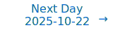

# Personalized Daily ArXiv Papers 2025-10-21

| *[gpt-5]*   | Prompt   | Completion   | Total   |
|:-----------:|:--------:|:------------:|:-------:|
| **Token**   | 94070    | 73067        | 167137  |
| **Cost**    | $0.12    | $0.73        | $0.85   |

Total arXiv papers: 1193

Total scanned papers: 742

Total relevant papers: 56

**Table of contents with paper titles:**

1. [Unbiased Gradient Low-Rank Projection](#user-content-link1)
**Authors:** Rui Pan, Yang Luo, Yuxing Liu, Yang You, Tong Zhang

2. [Improving Model Representation and Reducing KV Cache via Skip Connections with First Value Heads](#user-content-link2)
**Authors:** Zhoutong Wu, Yuan Zhang, Yiming Dong, Chenheng Zhang, Cong Fang, Kun Yuan, Zhouchen Lin

3. [The Graphon Limit Hypothesis: Understanding Neural Network Pruning via Infinite Width Analysis](#user-content-link3)
**Authors:** Hoang Pham, The-Anh Ta, Tom Jacobs, Rebekka Burkholz, Long Tran-Thanh

4. [Input Domain Aware MoE: Decoupling Routing Decisions from Task Optimization in Mixture of Experts](#user-content-link4)
**Authors:** Yongxiang Hua, Haoyu Cao, Zhou Tao, Bocheng Li, Zihao Wu, Chaohu Liu, Linli Xu

5. [TeLLMe v2: An Efficient End-to-End Ternary LLM Prefill and Decode Accelerator with Table-Lookup Matmul on Edge FPGAs](#user-content-link5)
**Authors:** Ye Qiao, Zhiheng Chen, Yifan Zhang, Yian Wang, Sitao Huang

6. [Expert Merging in Sparse Mixture of Experts with Nash Bargaining](#user-content-link6)
**Authors:** Dung V. Nguyen, Anh T. Nguyen, Minh H. Nguyen, Luc Q. Nguyen, Shiqi Jiang, Ethan Fetaya, Linh Duy Tran, Gal Chechik, Tan M. Nguyen

7. [Sparse Transformer Architectures via Regularized Wasserstein Proximal Operator with $L_1$ Prior](#user-content-link7)
**Authors:** Fuqun Han, Stanley Osher, Wuchen Li

8. [Accelerating Frontier MoE Training with 3D Integrated Optics](#user-content-link8)
**Authors:** Mikhail Bernadskiy, Peter Carson, Thomas Graham, Taylor Groves, Ho John Lee, Eric Yeh

9. [AMS-QUANT: Adaptive Mantissa Sharing for Floating-point Quantization](#user-content-link9)
**Authors:** Mengtao Lv, Ruiqi Zhu, Xinyu Wang, Yun Li

10. [One-Bit Quantization for Random Features Models](#user-content-link10)
**Authors:** Danil Akhtiamov, Reza Ghane, Babak Hassibi

11. [Localist LLMs with Recruitment Learning](#user-content-link11)
**Authors:** Joachim Diederich

12. [Understanding and Improving Length Generalization in Hierarchical Sparse Attention Models](#user-content-link12)
**Authors:** Jiaqi Leng, Xiang Hu, Junxiong Wang, Jianguo Li, Wei Wu, Yucheng Lu

13. [Fighter: Unveiling the Graph Convolutional Nature of Transformers in Time Series Modeling](#user-content-link13)
**Authors:** Chen Zhang, Weixin Bu, Wendong Xu, Runsheng Yu, Yik-Chung Wu, Ngai Wong

14. [CTR-LoRA: Curvature-Aware and Trust-Region Guided Low-Rank Adaptation for Large Language Models](#user-content-link14)
**Authors:** Zhuxuanzi Wang, Mingqiao Mo, Xi Xiao, Chen Liu, Chenrui Ma, Yunbei Zhang, Xiao Wang, Smita Krishnaswamy, Tianyang Wang

15. [Glyph: Scaling Context Windows via Visual-Text Compression](#user-content-link15)
**Authors:** Jiale Cheng, Yusen Liu, Xinyu Zhang, Yulin Fei, Wenyi Hong, Ruiliang Lyu, Weihan Wang, Zhe Su, Xiaotao Gu, Xiao Liu, Yushi Bai, Jie Tang, Hongning Wang, Minlie Huang

16. [Long Exposure: Accelerating Parameter-Efficient Fine-Tuning for LLMs under Shadowy Sparsity](#user-content-link16)
**Authors:** Tuowei Wang, Kun Li, Zixu Hao, Donglin Bai, Ju Ren, Yaoxue Zhang, Ting Cao, Mao Yang

17. [MuonBP: Faster Muon via Block-Periodic Orthogonalization](#user-content-link17)
**Authors:** Ahmed Khaled, Kaan Ozkara, Tao Yu, Mingyi Hong, Youngsuk Park

18. [AMiD: Knowledge Distillation for LLMs with $\alpha$-mixture Assistant Distribution](#user-content-link18)
**Authors:** Donghyeok Shin, Yeongmin Kim, Suhyeon Jo, Byeonghu Na, Il-Chul Moon

19. [FlexLink: Boosting your NVLink Bandwidth by 27% without accuracy concern](#user-content-link19)
**Authors:** Ao Shen, Rui Zhang, Junping Zhao

20. [Compressing Many-Shots in In-Context Learning](#user-content-link20)
**Authors:** Devvrit Khatri, Pranamya Kulkarni, Nilesh Gupta, Yerram Varun, Liqian Peng, Jay Yagnik, Praneeth Netrapalli, Cho-Jui Hsieh, Alec Go, Inderjit S Dhillon, Aditya Kusupati, Prateek Jain

21. [Neuronal Group Communication for Efficient Neural representation](#user-content-link21)
**Authors:** Zhengqi Pei, Qingming Huang, Shuhui Wang

22. [Algorithmic Primitives and Compositional Geometry of Reasoning in Language Models](#user-content-link22)
**Authors:** Samuel Lippl, Thomas McGee, Kimberly Lopez, Ziwen Pan, Pierce Zhang, Salma Ziadi, Oliver Eberle, Ida Momennejad

23. [Infinite Neural Operators: Gaussian processes on functions](#user-content-link23)
**Authors:** Daniel Augusto de Souza, Yuchen Zhu, Harry Jake Cunningham, Yuri Saporito, Diego Mesquita, Marc Peter Deisenroth

24. [Convergence Rates for Gradient Descent on the Edge of Stability in Overparametrised Least Squares](#user-content-link24)
**Authors:** Lachlan Ewen MacDonald, Hancheng Min, Leandro Palma, Salma Tarmoun, Ziqing Xu, Ren\'e Vidal

25. [Diverse Influence Component Analysis: A Geometric Approach to Nonlinear Mixture Identifiability](#user-content-link25)
**Authors:** Hoang-Son Nguyen, Xiao Fu

26. [SOLE: Hardware-Software Co-design of Softmax and LayerNorm for Efficient Transformer Inference](#user-content-link26)
**Authors:** Wenxun Wang, Shuchang Zhou, Wenyu Sun, Peiqin Sun, Yongpan Liu

27. [QSVD: Efficient Low-rank Approximation for Unified Query-Key-Value Weight Compression in Low-Precision Vision-Language Models](#user-content-link27)
**Authors:** Yutong Wang, Haiyu Wang, Sai Qian Zhang

28. [ZSPAPrune: Zero-Shot Prompt-Aware Token Pruning for Vision-Language Models](#user-content-link28)
**Authors:** Pu Zhang, Yuwei Li, Xingyuan Xian, Guoming Tang

29. [Bitwidth-Specific Logarithmic Arithmetic for Future Hardware-Accelerated Training](#user-content-link29)
**Authors:** Hassan Hamad, Yuou Qiu, Peter A. Beerel, Keith M. Chugg

30. [Symmetry and Generalisation in Neural Approximations of Renormalisation Transformations](#user-content-link30)
**Authors:** Cassidy Ashworth, Pietro Li\`o, Francesco Caso

31. [Just-In-Time Piecewise-Linear Semantics for ReLU-type Networks](#user-content-link31)
**Authors:** Hongyi Duan, Haoyang Liu, Jian'an Zhang, Fengrui Liu, Yiyi Wang

32. [Asymptotically Stable Quaternion-valued Hopfield-structured Neural Network with Periodic Projection-based Supervised Learning Rules](#user-content-link32)
**Authors:** Tianwei Wang, Xinhui Ma, Wei Pang

33. [Deeper with Riemannian Geometry: Overcoming Oversmoothing and Oversquashing for Graph Foundation Models](#user-content-link33)
**Authors:** Li Sun, Zhenhao Huang, Ming Zhang, Philip S. Yu

34. [On the Impossibility of Retrain Equivalence in Machine Unlearning](#user-content-link34)
**Authors:** Jiatong Yu, Yinghui He, Anirudh Goyal, Sanjeev Arora

35. [How Does Label Noise Gradient Descent Improve Generalization in the Low SNR Regime?](#user-content-link35)
**Authors:** Wei Huang, Andi Han, Yujin Song, Yilan Chen, Denny Wu, Difan Zou, Taiji Suzuki

36. [Matricial Free Energy as a Gaussianizing Regularizer: Enhancing Autoencoders for Gaussian Code Generation](#user-content-link36)
**Authors:** Rishi Sonthalia, Raj Rao Nadakuditi

37. [Computational Budget Should Be Considered in Data Selection](#user-content-link37)
**Authors:** Weilin Wan, Weizhong Zhang, Cheng Jin

38. [Atlas-based Manifold Representations for Interpretable Riemannian Machine Learning](#user-content-link38)
**Authors:** Ryan A. Robinett, Sophia A. Madejski, Kyle Ruark, Samantha J. Riesenfeld, Lorenzo Orecchia

39. [All You Need is One: Capsule Prompt Tuning with a Single Vector](#user-content-link39)
**Authors:** Yiyang Liu, James C. Liang, Heng Fan, Wenhao Yang, Yiming Cui, Xiaotian Han, Lifu Huang, Dongfang Liu, Qifan Wang, Cheng Han

40. [Zeroth-Order Sharpness-Aware Learning with Exponential Tilting](#user-content-link40)
**Authors:** Xuchen Gong, Tian Li

41. [MUG-V 10B: High-efficiency Training Pipeline for Large Video Generation Models](#user-content-link41)
**Authors:** Yongshun Zhang, Zhongyi Fan, Yonghang Zhang, Zhangzikang Li, Weifeng Chen, Zhongwei Feng, Chaoyue Wang, Peng Hou, Anxiang Zeng

42. [NeurIPT: Foundation Model for Neural Interfaces](#user-content-link42)
**Authors:** Zitao Fang, Chenxuan Li, Hongting Zhou, Shuyang Yu, Guodong Du, Ashwaq Qasem, Yang Lu, Jing Li, Junsong Zhang, Sim Kuan Goh

43. [Model Metamers Reveal Invariances in Graph Neural Networks](#user-content-link43)
**Authors:** Wei Xu, Xiaoyi Jiang, Lixiang Xu, Dechao Tang

44. [Recurrent Attention-based Token Selection for Efficient Streaming Video-LLMs](#user-content-link44)
**Authors:** Vaggelis Dorovatas, Soroush Seifi, Gunshi Gupta, Rahaf Aljundi

45. [Kelle: Co-design KV Caching and eDRAM for Efficient LLM Serving in Edge Computing](#user-content-link45)
**Authors:** Tianhua Xia, Sai Qian Zhang

46. [Early-stopping for Transformer model training](#user-content-link46)
**Authors:** Jing He, Hua Jiang, Cheng Li, Siqian Xin, Shuzhen Yang

47. [ZACH-ViT: A Zero-Token Vision Transformer with ShuffleStrides Data Augmentation for Robust Lung Ultrasound Classification](#user-content-link47)
**Authors:** Athanasios Angelakis, Amne Mousa, Micah L. A. Heldeweg, Laurens A. Biesheuvel, Mark A. Haaksma, Jasper M. Smit, Pieter R. Tuinman, Paul W. G. Elbers

48. [Facts in Stats: Impacts of Pretraining Diversity on Language Model Generalization](#user-content-link48)
**Authors:** Tina Behnia, Puneesh Deora, Christos Thrampoulidis

49. [Breaking Memorization Barriers in LLM Code Fine-Tuning via Information Bottleneck for Improved Generalization](#user-content-link49)
**Authors:** Changsheng Wang, Xin Chen, Sijia Liu, Ke Ding

50. [Memorizing Long-tail Data Can Help Generalization Through Composition](#user-content-link50)
**Authors:** Mo Zhou, Haoyang Ma, Rong Ge

51. [Protein Folding with Neural Ordinary Differential Equations](#user-content-link51)
**Authors:** Arielle Sanford, Shuo Sun, Christian B. Mendl

52. [Bridging Symmetry and Robustness: On the Role of Equivariance in Enhancing Adversarial Robustness](#user-content-link52)
**Authors:** Longwei Wang, Ifrat Ikhtear Uddin, KC Santosh, Chaowei Zhang, Xiao Qin, Yang Zhou

53. [DFNN: A Deep Fr\'echet Neural Network Framework for Learning Metric-Space-Valued Responses](#user-content-link53)
**Authors:** Kyum Kim, Yaqing Chen, Paromita Dubey

54. [Local properties of neural networks through the lens of layer-wise Hessians](#user-content-link54)
**Authors:** Maxim Bolshim (ITMO University, Saint Petersburg, Russia), Alexander Kugaevskikh (ITMO University, Saint Petersburg, Russia)

55. [Vector Quantization in the Brain: Grid-like Codes in World Models](#user-content-link55)
**Authors:** Xiangyuan Peng, Xingsi Dong, Si Wu

56. [Mapping Post-Training Forgetting in Language Models at Scale](#user-content-link56)
**Authors:** Jackson Harmon, Andreas Hochlehnert, Matthias Bethge, Ameya Prabhu

---

## 1. [Unbiased Gradient Low-Rank Projection](https://arxiv.org/abs/2510.17802) 

**ArXiv ID:** 2510.17802

**Authors:** Rui Pan, Yang Luo, Yuxing Liu, Yang You, Tong Zhang

**Abstract:** Memory-efficient optimization is critical for training increasingly large language models (LLMs). A popular strategy involves gradient low-rank projection, storing only the projected optimizer states, with GaLore being a representative example. However, a significant drawback of many such methods is their lack of convergence guarantees, as various low-rank projection approaches introduce inherent biases relative to the original optimization algorithms, which contribute to performance gaps compared to full-parameter training. Aiming to tackle this problem, this paper investigates the layerwise sampling technique for debiasing low-rank projection mechanisms. In particular, an instantiation of the paradigm gives rise to a novel and unbiased low-rank optimization method built upon GaLore's mechanism and the Muon algorithm, named GaLore Unbiased with Muon (GUM). We theoretically prove our method matches the convergence guarantees of the base Muon algorithm while preserving the memory efficiency of low-rank techniques. Empirical experiments on LLM fine-tuning and pretraining also demonstrate non-trivial improvements over GaLore and even better performance than full-parameter training. Further investigation shows that the improvement of this technique comes from a more uniform distribution of knowledge inside layers, leading to more efficient utilization of the model parameter space and better memorization.

**Comment:** Model Compression and Efficiency: unbiased low-rank gradient projection (GUM) with convergence guarantees, preserving memory savings while matching/improving full-parameter training.

**Relevance:** 10
**Novelty:** 9

---

## 2. [Improving Model Representation and Reducing KV Cache via Skip Connections with First Value Heads](https://arxiv.org/abs/2510.16807) 

**ArXiv ID:** 2510.16807

**Authors:** Zhoutong Wu, Yuan Zhang, Yiming Dong, Chenheng Zhang, Cong Fang, Kun Yuan, Zhouchen Lin

**Abstract:** Transformer models have driven breakthroughs across various language tasks by their strong capability to learn rich contextual representations. Scaling them to improve representation, however, often demands substantial memory and compute costs, such as the Key-Value (KV) cache used during auto-regressive decoding. Skip connections offer a promising way to improve representation without bloating resource usage, yet most prior works either improve expressivity while leaving KV costs unchanged, or reduce memory at the cost of weaker representation. In this work, we propose SkipV1Former, a Transformer variant that uses skip connections from the first layer's Value heads to strengthen model representation and reduce KV cache. Specifically, from the second block onward, each layer reuses half of its Value heads from the very first layer, while computing the other half as usual-cutting Value projections and V cache by nearly 50 \%. Theoretically, we show that routing uncompressed first-layer Values into deeper layers restores information lost to compression and accelerates the model's implicit mesa-optimization-a key pattern of Transformer in auto-regressive tasks. Empirically, across different model scales, SkipV1Former delivers consistent reductions of approximately 25 \% in KV cache while improving perplexity relative to standard Multi-Head Attention (MHA) Transformers and some advanced variants. Moreover, we propose a recipe for uptraining existing MHA Transformer checkpoints to SkipV1Former with only 10-15\% additional compute. Finally, SkipV1Former can seamlessly combine advanced methods like Group-Query Attention and Multi-Latent Attention to achieve further KV cache savings and performance improvement. When combined with YOCO, it cuts KV cache size by nearly 50 \% while still improving performance.

**Comment:** Model Architecture + Efficiency: SkipV1Former reuses first-layer Value heads to cut V projections/KV cache (~25–50%) while improving perplexity; KV-cache reduction.

**Relevance:** 10
**Novelty:** 9

---

## 3. [The Graphon Limit Hypothesis: Understanding Neural Network Pruning via Infinite Width Analysis](https://arxiv.org/abs/2510.17515) 

**ArXiv ID:** 2510.17515

**Authors:** Hoang Pham, The-Anh Ta, Tom Jacobs, Rebekka Burkholz, Long Tran-Thanh

**Abstract:** Sparse neural networks promise efficiency, yet training them effectively remains a fundamental challenge. Despite advances in pruning methods that create sparse architectures, understanding why some sparse structures are better trainable than others with the same level of sparsity remains poorly understood. Aiming to develop a systematic approach to this fundamental problem, we propose a novel theoretical framework based on the theory of graph limits, particularly graphons, that characterizes sparse neural networks in the infinite-width regime. Our key insight is that connectivity patterns of sparse neural networks induced by pruning methods converge to specific graphons as networks' width tends to infinity, which encodes implicit structural biases of different pruning methods. We postulate the Graphon Limit Hypothesis and provide empirical evidence to support it. Leveraging this graphon representation, we derive a Graphon Neural Tangent Kernel (Graphon NTK) to study the training dynamics of sparse networks in the infinite width limit. Graphon NTK provides a general framework for the theoretical analysis of sparse networks. We empirically show that the spectral analysis of Graphon NTK correlates with observed training dynamics of sparse networks, explaining the varying convergence behaviours of different pruning methods. Our framework provides theoretical insights into the impact of connectivity patterns on the trainability of various sparse network architectures.

**Comment:** Matches Model Compression and Sparsity Theory: introduces a graphon-based infinite-width framework and Graphon NTK to analyze pruning and sparse network trainability.

**Relevance:** 10
**Novelty:** 9

---

## 4. [Input Domain Aware MoE: Decoupling Routing Decisions from Task Optimization in Mixture of Experts](https://arxiv.org/abs/2510.16448) 

**ArXiv ID:** 2510.16448

**Authors:** Yongxiang Hua, Haoyu Cao, Zhou Tao, Bocheng Li, Zihao Wu, Chaohu Liu, Linli Xu

**Abstract:** Sparse Mixture of Experts (sMoE) has become a pivotal approach for scaling large vision-language models, offering substantial capacity while maintaining computational efficiency through dynamic, sparse activation of experts. However, existing routing mechanisms, typically based on similarity scoring, struggle to effectively capture the underlying input structure. This limitation leads to a trade-off between expert specialization and balanced computation, hindering both scalability and performance. We propose Input Domain Aware MoE, a novel routing framework that leverages a probabilistic mixture model to better partition the input space. By modeling routing probabilities as a mixture of distributions, our method enables experts to develop clear specialization boundaries while achieving balanced utilization. Unlike conventional approaches, our routing mechanism is trained independently of task-specific objectives, allowing for stable optimization and decisive expert assignments. Empirical results on vision-language tasks demonstrate that our method consistently outperforms existing sMoE approaches, achieving higher task performance and improved expert utilization balance.

**Comment:** Model Architecture (MoE): probabilistic input-domain-aware routing decoupled from task optimization for expert specialization and balanced utilization.

**Relevance:** 10
**Novelty:** 8

---

## 5. [TeLLMe v2: An Efficient End-to-End Ternary LLM Prefill and Decode Accelerator with Table-Lookup Matmul on Edge FPGAs](https://arxiv.org/abs/2510.15926) 

**ArXiv ID:** 2510.15926

**Authors:** Ye Qiao, Zhiheng Chen, Yifan Zhang, Yian Wang, Sitao Huang

**Abstract:** With the emergence of wearable devices and other embedded systems, deploying large language models (LLMs) on edge platforms has become an urgent need. However, this is challenging because of their high computational and memory demands. Although recent low-bit quantization methods (e.g., BitNet, DeepSeek) compress weights to as low as 1.58~bits with minimal accuracy loss, edge deployment is still constrained by limited on-chip resources, power budgets, and the often-neglected long latency of the prefill stage. We present \textbf{TeLLMe}, the first table-lookup-based ternary LLM accelerator for low-power edge FPGAs that fully supports both prefill and autoregressive decoding using 1.58-bit weights and 8-bit activations. TeLLMe incorporates several novel techniques, including (1) a table-lookup-based ternary matrix multiplication (TLMM) engine utilizing grouped activations and online precomputation for low resource utilization and high throughput; (2) a fine-grained analytic URAM-based weight buffer management scheme for efficient loading and compute engine access; (3) a streaming dataflow architecture that fuses floating-point element-wise operations with linear computations to hide latency; (4) a reversed-reordered prefill stage attention with fused attention operations for high memory efficiency; and (5) a resource-efficient specialized decoding stage attention. Under a 5~W power budget, TeLLMe delivers up to 25~tokens/s decoding throughput and 0.45--0.96~s time-to-first-token (TTFT) for 64--128 token prompts, marking a significant energy-efficiency advancement in LLM inference on edge FPGAs.

**Comment:** High Performance Computing / Compression: ternary (1.58-bit) LLM accelerator with table-lookup matmul, fused attention, and prefill/decoding optimizations on edge FPGAs.

**Relevance:** 10
**Novelty:** 8

---

## 6. [Expert Merging in Sparse Mixture of Experts with Nash Bargaining](https://arxiv.org/abs/2510.16138) 

**ArXiv ID:** 2510.16138

**Authors:** Dung V. Nguyen, Anh T. Nguyen, Minh H. Nguyen, Luc Q. Nguyen, Shiqi Jiang, Ethan Fetaya, Linh Duy Tran, Gal Chechik, Tan M. Nguyen

**Abstract:** Existing expert merging strategies for Sparse Mixture of Experts (SMoE) typically rely on input-dependent or input-independent averaging of expert parameters, but often lack a principled weighting mechanism. In this work, we reinterpret expert merging through the lens of game theory, revealing cooperative and competitive dynamics among experts. Based on this perspective, we introduce Nash Merging of Experts (NAMEx), a novel framework that incorporates Nash Bargaining into the merging process, enabling more balanced and efficient collaboration among experts. Additionally, we incorporate complex momentum into NAMEx to accelerate expert propagation with theoretical guarantees for convergence. Extensive experiments across language modelling, text classification, image classification, and zero-shot robustness under data corruption show that NAMEx consistently outperforms competing methods while integrating seamlessly with popular MoE architectures. Finally, we demonstrate NAMEx's scalability by applying it to large-scale systems, including Qwen1.5-MoE (14B) and DeepSeek-MoE (16B), where it proves effective in both zero-shot and fine-tuning settings.

**Comment:** Model Architecture (MoE): principled expert merging for sparse MoE via Nash bargaining with convergence guarantees; improves merging over ad-hoc averaging.

**Relevance:** 10
**Novelty:** 8

---

## 7. [Sparse Transformer Architectures via Regularized Wasserstein Proximal Operator with $L_1$ Prior](https://arxiv.org/abs/2510.16356) 

**ArXiv ID:** 2510.16356

**Authors:** Fuqun Han, Stanley Osher, Wuchen Li

**Abstract:** In this work, we propose a sparse transformer architecture that incorporates prior information about the underlying data distribution directly into the transformer structure of the neural network. The design of the model is motivated by a special optimal transport problem, namely the regularized Wasserstein proximal operator, which admits a closed-form solution and turns out to be a special representation of transformer architectures. Compared with classical flow-based models, the proposed approach improves the convexity properties of the optimization problem and promotes sparsity in the generated samples. Through both theoretical analysis and numerical experiments, including applications in generative modeling and Bayesian inverse problems, we demonstrate that the sparse transformer achieves higher accuracy and faster convergence to the target distribution than classical neural ODE-based methods.

**Comment:** Model Architecture + Sparsity: proposes a sparse transformer grounded in regularized Wasserstein proximal operator with L1 prior; theoretical and architectural innovation.

**Relevance:** 10
**Novelty:** 8

---

## 8. [Accelerating Frontier MoE Training with 3D Integrated Optics](https://arxiv.org/abs/2510.15893) 

**ArXiv ID:** 2510.15893

**Authors:** Mikhail Bernadskiy, Peter Carson, Thomas Graham, Taylor Groves, Ho John Lee, Eric Yeh

**Abstract:** The unabated growth in AI workload demands is driving the need for concerted advances in compute, memory, and interconnect performance. As traditional semiconductor scaling slows, high-speed interconnects have emerged as the new scaling engine, enabling the creation of larger logical GPUs by linking many GPUs into a single, low-latency, high-bandwidth compute domain. While initial scale-up fabrics leveraged copper interconnects for their power and cost advantages, the maximum reach of passive electrical interconnects (approximately 1 meter) effectively limits the scale-up domain to within a single rack. The advent of 3D-stacked optics and logic offers a transformative, power-efficient scale-up solution for connecting hundreds of GPU packages (thousands of GPUs) across multiple data center racks. This work explores the design tradeoffs of scale-up technologies and demonstrates how frontier LLMs necessitate novel photonic solutions to achieve aggressive power and performance targets. We model the benefits of 3D CPO (Passage) enabled GPUs and switches within the scale-up domain when training Frontier Mixture of Experts (MoE) models exceeding one trillion parameters. Our results show that the substantial increases in bandwidth and radix enabled by 3D CPO allow for an 8X increase in scale-up capability. This affords new opportunities for multi-dimensional parallelism within the scale-up domain and results in a 2.7X reduction in time-to-train, unlocking unprecedented model scaling.

**Comment:** High Performance Computing: photonic 3D co-packaged optics to scale MoE training across racks; systems-level innovation enabling larger parallelism and faster training.

**Relevance:** 10
**Novelty:** 8

---

## 9. [AMS-QUANT: Adaptive Mantissa Sharing for Floating-point Quantization](https://arxiv.org/abs/2510.16045) 

**ArXiv ID:** 2510.16045

**Authors:** Mengtao Lv, Ruiqi Zhu, Xinyu Wang, Yun Li

**Abstract:** Large language models (LLMs) have demonstrated remarkable capabilities in various kinds of tasks, while the billion or even trillion parameters bring storage and efficiency bottlenecks for inference. Quantization, particularly floating-point quantization, is known to be capable of speeding up LLM inference by reducing memory footprint and data movement during the inference process. For the first time, we advance the floating-point quantization exploration from integer bitwidths to non-integer bit-widths, namely AMS-Quant, to further approach the quantization sweet spot. AMS-Quant incorporates two novel techniques to put it into effect: (1) it proposes Mantissa-bit Sharing, which groups k quantized weights and lets them share the least significant mantissa bit, allowing us to further approach the minimum quantization bit-width without accuracy loss. (2) It introduces Adaptive Searching, which employs an offline optimization strategy to minimize the accuracy degradation introduced by sharing. Moreover, AMS-Quant is also prototyped as efficient CUDA Linear kernels, which translates memory savings into wall-clock latency reduction by reducing memory access. Extensive experiments on large-scale datasets and models show that AMS-Quant can quantize the model to FP-5.33-e2m3 and FP4.25-e2m2, and significantly speed up the LLM decoding over FP16 inference (2.8x and 3.2x), with negligible accuracy loss.

**Comment:** Matches Model Compression and Efficiency: introduces adaptive mantissa-bit sharing for sub-integer floating-point quantization with CUDA kernels, reducing memory access and latency.

**Relevance:** 10
**Novelty:** 8

---

## 10. [One-Bit Quantization for Random Features Models](https://arxiv.org/abs/2510.16250) 

**ArXiv ID:** 2510.16250

**Authors:** Danil Akhtiamov, Reza Ghane, Babak Hassibi

**Abstract:** Recent advances in neural networks have led to significant computational and memory demands, spurring interest in one-bit weight compression to enable efficient inference on resource-constrained devices. However, the theoretical underpinnings of such compression remain poorly understood. We address this gap by analyzing one-bit quantization in the Random Features model, a simplified framework that corresponds to neural networks with random representations. We prove that, asymptotically, quantizing weights of all layers except the last incurs no loss in generalization error, compared to the full precision random features model. Our findings offer theoretical insights into neural network compression. We also demonstrate empirically that one-bit quantization leads to significant inference speed ups for the Random Features models even on a laptop GPU, confirming the practical benefits of our work. Additionally, we provide an asymptotically precise characterization of the generalization error for Random Features with an arbitrary number of layers. To the best of our knowledge, our analysis yields more general results than all previous works in the related literature.

**Comment:** Model Compression and Efficiency: theory for one-bit quantization in Random Features models showing no generalization loss when quantizing all but last layer.

**Relevance:** 9
**Novelty:** 8

---

## 11. [Localist LLMs with Recruitment Learning](https://arxiv.org/abs/2510.17358) 

**ArXiv ID:** 2510.17358

**Authors:** Joachim Diederich

**Abstract:** We present a novel framework for training large language models with continuously adjustable internal representations that span the full spectrum from localist (interpretable, rule-based) to distributed (generalizable, efficient) encodings. The key innovations are (1) a locality dial, a tunable parameter that dynamically controls the degree of localization during both training and inference without requiring model retraining, (2) an information-theoretic recruitment mechanism that adaptively allocates semantic blocks as needed, eliminating the requirement for complete domain knowledge at initialization, and (3) a hierarchical recruitment framework that extends capacity allocation to entire specialized LLMs, enabling multi-granularity architectural adaptation. This is achieved through group sparsity penalties on attention mechanisms, information-theoretic anchor design, dynamic rule injection, and principled recruitment  criteria based on penalized likelihood with explicit units. We provide rigorous mathematical results establishing explicit threshold conditions under which attention provably concentrates on semantically relevant blocks at stationary points, with exact bounds on attention entropy and pointer fidelity. The hierarchical recruitment mechanism provides convergence guarantees at both the block level (fine-grained, within-LLM) and the LLM level (coarse-grained, cross-domain), ensuring the system discovers semantic partitions that balance model complexity against data encoding efficiency. This framework enables practitioners to continuously interpolate between interpretable and high-performance modes while adapting architectural capacity at multiple granularities, supporting applications in regulated domains requiring both transparency and capability.

**Comment:** Model Architecture/Sparsity: introduces a tunable locality dial and information-theoretic recruitment with group sparsity on attention for adaptive interpretable-to-distributed encodings.

**Relevance:** 9
**Novelty:** 8

---

## 12. [Understanding and Improving Length Generalization in Hierarchical Sparse Attention Models](https://arxiv.org/abs/2510.17196) 

**ArXiv ID:** 2510.17196

**Authors:** Jiaqi Leng, Xiang Hu, Junxiong Wang, Jianguo Li, Wei Wu, Yucheng Lu

**Abstract:** Effectively processing long contexts is a critical challenge for language models. While standard Transformers are limited by quadratic complexity and poor length extrapolation, alternative architectures like sliding window attention and state space models sacrifice the ability to effectively utilize the full context due to their fixed-size memory. Chunk-based sparse attention has emerged as a promising paradigm for extreme length generalization, yet the key architectural principles underpinning its success are not yet fully understood. In this work, we present a systematic dissection of these models to identify the core components driving their performance. Through a unified framework and comprehensive ablation studies, we demonstrate that a combination of three design principles is critical: (1) an expressive, non-linear Chunk Encoder with a dedicated CLS token to produce representations for retrieval; (2) a Bypassing Residual Path to stably integrate retrieved global information without it being overridden by the local residual stream; and (3) enforced selection sparsity during pre-training to bridge the train-test distribution gap. We provide a theoretical motivation for intra-chunk information processing and landmark generation. By combining these principles, we establish a new state-of-the-art for training-free length extrapolation, successfully generalizing models trained on a 4K context to 32 million tokens on RULER and BABILong. Our findings provide a clear and empirically-grounded set of design principles for developing future, highly-capable long-context language models.

**Comment:** Model Architecture/Sparsity: analyzes and improves hierarchical sparse attention for extreme length generalization with key design principles and theory for chunk encoding/residual bypass.

**Relevance:** 9
**Novelty:** 8

---

## 13. [Fighter: Unveiling the Graph Convolutional Nature of Transformers in Time Series Modeling](https://arxiv.org/abs/2510.17106) 

**ArXiv ID:** 2510.17106

**Authors:** Chen Zhang, Weixin Bu, Wendong Xu, Runsheng Yu, Yik-Chung Wu, Ngai Wong

**Abstract:** Transformers have achieved remarkable success in time series modeling, yet their internal mechanisms remain opaque. This work demystifies the Transformer encoder by establishing its fundamental equivalence to a Graph Convolutional Network (GCN). We show that in the forward pass, the attention distribution matrix serves as a dynamic adjacency matrix, and its composition with subsequent transformations performs computations analogous to graph convolution. Moreover, we demonstrate that in the backward pass, the update dynamics of value and feed-forward projections mirror those of GCN parameters. Building on this unified theoretical reinterpretation, we propose \textbf{Fighter} (Flexible Graph Convolutional Transformer), a streamlined architecture that removes redundant linear projections and incorporates multi-hop graph aggregation. This perspective yields an explicit and interpretable representation of temporal dependencies across different scales, naturally expressed as graph edges. Experiments on standard forecasting benchmarks confirm that Fighter achieves competitive performance while providing clearer mechanistic interpretability of its predictions.

**Comment:** Model Architecture and Analysis: proves equivalence between Transformer attention and GCNs in time series, and introduces a streamlined graph-convolutional Transformer (Fighter).

**Relevance:** 9
**Novelty:** 8

---

## 14. [CTR-LoRA: Curvature-Aware and Trust-Region Guided Low-Rank Adaptation for Large Language Models](https://arxiv.org/abs/2510.15962) 

**ArXiv ID:** 2510.15962

**Authors:** Zhuxuanzi Wang, Mingqiao Mo, Xi Xiao, Chen Liu, Chenrui Ma, Yunbei Zhang, Xiao Wang, Smita Krishnaswamy, Tianyang Wang

**Abstract:** Parameter-efficient fine-tuning (PEFT) has become the standard approach for adapting large language models under limited compute and memory budgets. Although previous methods improve efficiency through low-rank updates, quantization, or heuristic budget reallocation, they often decouple the allocation of capacity from the way updates evolve during training. In this work, we introduce CTR-LoRA, a framework guided by curvature trust region that integrates rank scheduling with stability-aware optimization. CTR-LoRA allocates parameters based on marginal utility derived from lightweight second-order proxies and constrains updates using a Fisher/Hessian-metric trust region. Experiments on multiple open-source backbones (7B-13B), evaluated on both in-distribution and out-of-distribution benchmarks, show consistent improvements over strong PEFT baselines. In addition to increased accuracy, CTR-LoRA enhances training stability, reduces memory requirements, and achieves higher throughput, positioning it on the Pareto frontier of performance and efficiency. These results highlight a principled path toward more robust and deployable PEFT.

**Comment:** Model Compression/Efficiency: PEFT via curvature-aware trust-region LoRA with adaptive rank scheduling using second-order proxies; stability and throughput gains.

**Relevance:** 9
**Novelty:** 8

---

## 15. [Glyph: Scaling Context Windows via Visual-Text Compression](https://arxiv.org/abs/2510.17800) 

**ArXiv ID:** 2510.17800

**Authors:** Jiale Cheng, Yusen Liu, Xinyu Zhang, Yulin Fei, Wenyi Hong, Ruiliang Lyu, Weihan Wang, Zhe Su, Xiaotao Gu, Xiao Liu, Yushi Bai, Jie Tang, Hongning Wang, Minlie Huang

**Abstract:** Large language models (LLMs) increasingly rely on long-context modeling for tasks such as document understanding, code analysis, and multi-step reasoning. However, scaling context windows to the million-token level brings prohibitive computational and memory costs, limiting the practicality of long-context LLMs. In this work, we take a different perspective-visual context scaling-to tackle this challenge. Instead of extending token-based sequences, we propose Glyph, a framework that renders long texts into images and processes them with vision-language models (VLMs). This approach substantially compresses textual input while preserving semantic information, and we further design an LLM-driven genetic search to identify optimal visual rendering configurations for balancing accuracy and compression. Through extensive experiments, we demonstrate that our method achieves 3-4x token compression while maintaining accuracy comparable to leading LLMs such as Qwen3-8B on various long-context benchmarks. This compression also leads to around 4x faster prefilling and decoding, and approximately 2x faster SFT training. Furthermore, under extreme compression, a 128K-context VLM could scale to handle 1M-token-level text tasks. In addition, the rendered text data benefits real-world multimodal tasks, such as document understanding. Our code and model are released at https://github.com/thu-coai/Glyph.

**Comment:** Model Compression and Efficiency: compresses long textual context via visual rendering to reduce tokens and compute, yielding faster prefilling/decoding and SFT.

**Relevance:** 9
**Novelty:** 8

---

## 16. [Long Exposure: Accelerating Parameter-Efficient Fine-Tuning for LLMs under Shadowy Sparsity](https://arxiv.org/abs/2510.15964) 

**ArXiv ID:** 2510.15964

**Authors:** Tuowei Wang, Kun Li, Zixu Hao, Donglin Bai, Ju Ren, Yaoxue Zhang, Ting Cao, Mao Yang

**Abstract:** The adaptation of pre-trained large language models (LLMs) to diverse downstream tasks via fine-tuning is critical for numerous applications. However, the inefficiency of parameter-efficient fine-tuning (PEFT) techniques presents significant challenges in terms of time investments and operational costs. In this paper, we first introduce a nuanced form of sparsity, termed Shadowy Sparsity, which is distinctive in fine-tuning and has not been adequately addressed for acceleration. Under Shadowy Sparsity, we propose Long Exposure, an efficient system to accelerate PEFT for LLMs. Long Exposure comprises three key components: Shadowy-sparsity Exposer employs a prolonged sensing range to capture more sparsity details under shadowy sparsity; Sequence-oriented Predictor provides efficient yet accurate predictions to handle large sequence inputs and constantly-evolving parameters; and Dynamic-aware Operator facilitates more structured computational patterns and coalesced memory accesses, addressing dynamic sparse operations. Extensive evaluations show that Long Exposure outperforms state-of-the-arts with up to a $2.49\times$ speedup in end-to-end fine-tuning, offering promising advancements in accelerating PEFT for LLMs.

**Comment:** Model Compression and Efficiency/HPC: exploits fine-tuning-time sparsity with dynamic sparse operators and predictors to accelerate PEFT.

**Relevance:** 9
**Novelty:** 8

---

## 17. [MuonBP: Faster Muon via Block-Periodic Orthogonalization](https://arxiv.org/abs/2510.16981) 

**ArXiv ID:** 2510.16981

**Authors:** Ahmed Khaled, Kaan Ozkara, Tao Yu, Mingyi Hong, Youngsuk Park

**Abstract:** Gradient orthogonalization is a simple strategy that shows great utility in speeding up gradient descent. The Muon optimizer (Jordan, Jin, et al., 2024) combines gradient orthogonalization with first-order momentum and achieves significant improvement in data efficiency over Adam/AdamW (Loshchilov and Hutter, 2019) for language model training. However, when using model parallelism, gradient orthogonalization introduces additional overhead compared to coordinate-wise optimizers (such as AdamW) due to additional gather and scatter operations on gradient matrix shards from different devices. This additional communication can amount to a throughput hit of 5%-10% compared to Adam/AdamW. To remedy this, we propose Muon with Block-Periodic Orthogonalization (MuonBP), which applies orthogonalization independently to matrix shards on each device and periodically performs full orthogonalization to maintain training stability at scale. We show how to adjust the learning rate from the baseline to MuonBP and give convergence guarantees for this algorithm. Crucially, our theory dictates that we use two stepsizes: one for the blockwise orthogonalization steps, and one for the full orthogonalization steps. Our method is simple, requires minimal hyperparameter adjustments, and achieves competitive iteration complexity compared with baseline Muon while providing per-iteration throughput comparable to coordinate-wise methods such as AdamW. When training an 8B model with eight-way tensor parallelism and ZeRO optimizer state sharding, MuonBP achieves 8% throughput increase compared to Muon with no degradation in performance.

**Comment:** High Performance Computing: distributed-friendly optimizer (block-periodic orthogonalization) reducing communication with theory and throughput gains.

**Relevance:** 9
**Novelty:** 8

---

## 18. [AMiD: Knowledge Distillation for LLMs with $\alpha$-mixture Assistant Distribution](https://arxiv.org/abs/2510.15982) 

**ArXiv ID:** 2510.15982

**Authors:** Donghyeok Shin, Yeongmin Kim, Suhyeon Jo, Byeonghu Na, Il-Chul Moon

**Abstract:** Autoregressive large language models (LLMs) have achieved remarkable improvement across many tasks but incur high computational and memory costs. Knowledge distillation (KD) mitigates this issue by transferring knowledge from a large teacher to a smaller student through distributional alignment. Previous studies have proposed various discrepancy metrics, but the capacity gap and training instability caused by near-zero probabilities, stemming from the high-dimensional output of LLMs, remain fundamental limitations. To overcome these challenges, several approaches implicitly or explicitly incorporating assistant distribution have recently been proposed. However, the past proposals of assistant distributions have been a fragmented approach without a systematic investigation of the interpolation path and the divergence. This paper proposes $\alpha$-mixture assistant distribution, a novel generalized family of assistant distributions, and $\alpha$-mixture distillation, coined AMiD, a unified framework for KD using the assistant distribution. The $\alpha$-mixture assistant distribution provides a continuous extension of the assistant distribution by introducing a new distribution design variable $\alpha$, which has been fixed in all previous approaches. Furthermore, AMiD generalizes the family of divergences used with the assistant distributions based on optimality, which has also been restricted in previous works. Through extensive experiments, we demonstrate that AMiD offers superior performance and training stability by leveraging a broader and theoretically grounded assistant distribution space.

**Comment:** Model Compression and Efficiency: generalized assistant distribution and divergences for KD of LLMs improving stability/performance.

**Relevance:** 9
**Novelty:** 8

---

## 19. [FlexLink: Boosting your NVLink Bandwidth by 27% without accuracy concern](https://arxiv.org/abs/2510.15882) 

**ArXiv ID:** 2510.15882

**Authors:** Ao Shen, Rui Zhang, Junping Zhao

**Abstract:** As large language models (LLMs) continue to scale, multi-node deployment has become a necessity. Consequently, communication has become a critical performance bottleneck. Current intra-node communication libraries, like NCCL, typically make use of a single interconnect such as NVLink. This approach creates performance ceilings, especially on hardware like the H800 GPU where the primary interconnect's bandwidth can become a bottleneck, and leaves other hardware resources like PCIe and Remote Direct Memory Access (RDMA)-capable Network Interface Cards (NICs) largely idle during intensive workloads. We propose FlexLink, the first collective communication framework to the best of our knowledge designed to systematically address this by aggregating these heterogeneous links-NVLink, PCIe, and RDMA NICs-into a single, high-performance communication fabric. FlexLink employs an effective two-stage adaptive load balancing strategy that dynamically partitions communication traffic across all available links, ensuring that faster interconnects are not throttled by slower ones. On an 8-GPU H800 server, our design improves the bandwidth of collective operators such as AllReduce and AllGather by up to 26% and 27% over the NCCL baseline, respectively. This gain is achieved by offloading 2-22% of the total communication traffic to the previously underutilized PCIe and RDMA NICs. FlexLink provides these improvements as a lossless, drop-in replacement compatible with the NCCL API, ensuring easy adoption.

**Comment:** High Performance Computing: novel collective communication fabric aggregating NVLink, PCIe, and RDMA with adaptive load balancing; drop-in replacement for NCCL.

**Relevance:** 9
**Novelty:** 8

---

## 20. [Compressing Many-Shots in In-Context Learning](https://arxiv.org/abs/2510.16092) 

**ArXiv ID:** 2510.16092

**Authors:** Devvrit Khatri, Pranamya Kulkarni, Nilesh Gupta, Yerram Varun, Liqian Peng, Jay Yagnik, Praneeth Netrapalli, Cho-Jui Hsieh, Alec Go, Inderjit S Dhillon, Aditya Kusupati, Prateek Jain

**Abstract:** Large Language Models (LLMs) have been shown to be able to learn different tasks without explicit finetuning when given many input-output examples / demonstrations through In-Context Learning (ICL). Increasing the number of examples, called ``shots'', improves downstream task performance but incurs higher memory and computational costs. In this work, we study an approach to improve the memory and computational efficiency of ICL inference by compressing the many-shot prompts. Given many shots comprising t tokens, our goal is to generate a m soft-token summary, where m < t. We first show that existing prompt compression methods are ineffective for many-shot compression, and simply using fewer shots as a baseline is surprisingly strong. To achieve effective compression, we find that: (a) a stronger compressor model with more trainable parameters is necessary, and (b) compressing many-shot representations at each transformer layer enables more fine-grained compression by providing each layer with its own compressed representation. Based on these insights, we propose MemCom, a layer-wise compression method. We systematically evaluate various compressor models and training approaches across different model sizes (2B and 7B), architectures (Gemma and Mistral), many-shot sequence lengths (3k-6k tokens), and compression ratios (3x to 8x). MemCom outperforms strong baselines across all compression ratios on multiple classification tasks with large label sets. Notably, while baseline performance degrades sharply at higher compression ratios, often by over 20-30%, MemCom maintains high accuracy with minimal degradation, typically dropping by less than 10%.

**Comment:** Model Efficiency: compresses many-shot in-context prompts via layer-wise soft-token summaries to cut memory/compute during inference.

**Relevance:** 9
**Novelty:** 8

---

## 21. [Neuronal Group Communication for Efficient Neural representation](https://arxiv.org/abs/2510.16851) 

**ArXiv ID:** 2510.16851

**Authors:** Zhengqi Pei, Qingming Huang, Shuhui Wang

**Abstract:** The ever-increasing scale of modern neural networks has brought unprecedented performance alongside daunting challenges in efficiency and interpretability. This paper addresses the core question of how to build large neural systems that learn efficient, modular, and interpretable representations. We propose Neuronal Group Communication (NGC), a theory-driven framework that reimagines a neural network as a dynamical system of interacting neuronal groups rather than a monolithic collection of neural weights. Instead of treating each weight as an independent trainable parameter, NGC treats weights as transient interactions between embedding-like neuronal states, with neural computation unfolding through iterative communication among groups of neurons. This low-rank, modular representation yields compact models: groups of neurons exchange low-dimensional signals, enabling intra-group specialization and inter-group information sharing while dramatically reducing redundant parameters. By drawing on dynamical systems theory, we introduce a neuronal stability metric (analogous to Lyapunov stability) that quantifies the contraction of neuron activations toward stable patterns during sequence processing. Using this metric, we reveal that emergent reasoning capabilities correspond to an external driving force or ``potential'', which nudges the neural dynamics away from trivial trajectories while preserving stability. Empirically, we instantiate NGC in large language models (LLMs) and demonstrate improved performance on complex reasoning benchmarks under moderate compression. NGC consistently outperforms standard low-rank approximations and cross-layer basis-sharing methods at comparable compression rates. We conclude by discussing the broader implications of NGC, including how structured neuronal group dynamics might relate to generalization in high-dimensional learning systems.

**Comment:** Matches Model Architecture and Compression/Efficiency: proposes low-rank, group-based neuronal communication with a stability metric, improving compactness and modularity.

**Relevance:** 9
**Novelty:** 8

---

## 22. [Algorithmic Primitives and Compositional Geometry of Reasoning in Language Models](https://arxiv.org/abs/2510.15987) 

**ArXiv ID:** 2510.15987

**Authors:** Samuel Lippl, Thomas McGee, Kimberly Lopez, Ziwen Pan, Pierce Zhang, Salma Ziadi, Oliver Eberle, Ida Momennejad

**Abstract:** How do latent and inference time computations enable large language models (LLMs) to solve multi-step reasoning? We introduce a framework for tracing and steering algorithmic primitives that underlie model reasoning. Our approach links reasoning traces to internal activation patterns and evaluates algorithmic primitives by injecting them into residual streams and measuring their effect on reasoning steps and task performance. We consider four benchmarks: Traveling Salesperson Problem (TSP), 3SAT, AIME, and graph navigation. We operationalize primitives by clustering neural activations and labeling their matched reasoning traces. We then apply function vector methods to derive primitive vectors as reusable compositional building blocks of reasoning. Primitive vectors can be combined through addition, subtraction, and scalar operations, revealing a geometric logic in activation space. Cross-task and cross-model evaluations (Phi-4, Phi-4-Reasoning, Llama-3-8B) show both shared and task-specific primitives. Notably, comparing Phi-4 with its reasoning-finetuned variant highlights compositional generalization after finetuning: Phi-4-Reasoning exhibits more systematic use of verification and path-generation primitives. Injecting the associated primitive vectors in Phi-4-Base induces behavioral hallmarks associated with Phi-4-Reasoning. Together, these findings demonstrate that reasoning in LLMs may be supported by a compositional geometry of algorithmic primitives, that primitives transfer cross-task and cross-model, and that reasoning finetuning strengthens algorithmic generalization across domains.

**Comment:** Matches Representation Learning/Mechanistic Interpretability: identifies and steers compositional activation primitives underlying LLM reasoning via function vectors.

**Relevance:** 9
**Novelty:** 8

---

## 23. [Infinite Neural Operators: Gaussian processes on functions](https://arxiv.org/abs/2510.16675) 

**ArXiv ID:** 2510.16675

**Authors:** Daniel Augusto de Souza, Yuchen Zhu, Harry Jake Cunningham, Yuri Saporito, Diego Mesquita, Marc Peter Deisenroth

**Abstract:** A variety of infinitely wide neural architectures (e.g., dense NNs, CNNs, and transformers) induce Gaussian process (GP) priors over their outputs. These relationships provide both an accurate characterization of the prior predictive distribution and enable the use of GP machinery to improve the uncertainty quantification of deep neural networks. In this work, we extend this connection to neural operators (NOs), a class of models designed to learn mappings between function spaces. Specifically, we show conditions for when arbitrary-depth NOs with Gaussian-distributed convolution kernels converge to function-valued GPs. Based on this result, we show how to compute the covariance functions of these NO-GPs for two NO parametrizations, including the popular Fourier neural operator (FNO). With this, we compute the posteriors of these GPs in regression scenarios, including PDE solution operators. This work is an important step towards uncovering the inductive biases of current FNO architectures and opens a path to incorporate novel inductive biases for use in kernel-based operator learning methods.

**Comment:** Matches Model Architecture Theory: establishes GP limits for neural operators (incl. FNO), enabling kernel-based operator learning with computed covariances/posteriors.

**Relevance:** 9
**Novelty:** 8

---

## 24. [Convergence Rates for Gradient Descent on the Edge of Stability in Overparametrised Least Squares](https://arxiv.org/abs/2510.17506) 

**ArXiv ID:** 2510.17506

**Authors:** Lachlan Ewen MacDonald, Hancheng Min, Leandro Palma, Salma Tarmoun, Ziqing Xu, Ren\'e Vidal

**Abstract:** Classical optimisation theory guarantees monotonic objective decrease for gradient descent (GD) when employed in a small step size, or ``stable", regime. In contrast, gradient descent on neural networks is frequently performed in a large step size regime called the ``edge of stability", in which the objective decreases non-monotonically with an observed implicit bias towards flat minima. In this paper, we take a step toward quantifying this phenomenon by providing convergence rates for gradient descent with large learning rates in an overparametrised least squares setting. The key insight behind our analysis is that, as a consequence of overparametrisation, the set of global minimisers forms a Riemannian manifold $M$, which enables the decomposition of the GD dynamics into components parallel and orthogonal to $M$. The parallel component corresponds to Riemannian gradient descent on the objective sharpness, while the orthogonal component is a bifurcating dynamical system. This insight allows us to derive convergence rates in three regimes characterised by the learning rate size: (a) the subcritical regime, in which transient instability is overcome in finite time before linear convergence to a suboptimally flat global minimum; (b) the critical regime, in which instability persists for all time with a power-law convergence toward the optimally flat global minimum; and (c) the supercritical regime, in which instability persists for all time with linear convergence to an orbit of period two centred on the optimally flat global minimum.

**Comment:** Matches Training Dynamics Theory: convergence rates and regimes for GD at edge of stability via manifold-based decomposition in overparameterized least squares.

**Relevance:** 9
**Novelty:** 8

---

## 25. [Diverse Influence Component Analysis: A Geometric Approach to Nonlinear Mixture Identifiability](https://arxiv.org/abs/2510.17040) 

**ArXiv ID:** 2510.17040

**Authors:** Hoang-Son Nguyen, Xiao Fu

**Abstract:** Latent component identification from unknown nonlinear mixtures is a foundational challenge in machine learning, with applications in tasks such as disentangled representation learning and causal inference. Prior work in nonlinear independent component analysis (nICA) has shown that auxiliary signals -- such as weak supervision -- can support identifiability of conditionally independent latent components. More recent approaches explore structural assumptions, e.g., sparsity in the Jacobian of the mixing function, to relax such requirements. In this work, we introduce Diverse Influence Component Analysis (DICA), a framework that exploits the convex geometry of the mixing function's Jacobian. We propose a Jacobian Volume Maximization (J-VolMax) criterion, which enables latent component identification by encouraging diversity in their influence on the observed variables. Under reasonable conditions, this approach achieves identifiability without relying on auxiliary information, latent component independence, or Jacobian sparsity assumptions. These results extend the scope of identifiability analysis and offer a complementary perspective to existing methods.

**Comment:** Matches Representation Learning/Identifiability: introduces Jacobian Volume Maximization to identify nonlinear latent components without auxiliary signals or sparsity assumptions.

**Relevance:** 9
**Novelty:** 8

---

## 26. [SOLE: Hardware-Software Co-design of Softmax and LayerNorm for Efficient Transformer Inference](https://arxiv.org/abs/2510.17189) 

**ArXiv ID:** 2510.17189

**Authors:** Wenxun Wang, Shuchang Zhou, Wenyu Sun, Peiqin Sun, Yongpan Liu

**Abstract:** Transformers have shown remarkable performance in both natural language processing (NLP) and computer vision (CV) tasks. However, their real-time inference speed and efficiency are limited due to the inefficiency in Softmax and Layer Normalization (LayerNorm). Previous works based on function approximation suffer from inefficient implementation as they place emphasis on computation while disregarding memory overhead concerns. Moreover, such methods rely on retraining to compensate for approximation error which can be costly and inconvenient.   In this paper, we present SOLE, a hardware-software co-design for Softmax and LayerNorm which is composed of E2Softmax and AILayerNorm. E2Softmax utilizes log2 quantization of exponent function and log-based division to approximate Softmax while AILayerNorm adopts low-precision statistic calculation. Compared with state-of-the-art designs, we achieve both low-precision calculation and low bit-width storage on Softmax and LayerNorm. Experiments show that SOLE maintains inference accuracy without retraining while offering orders of magnitude speedup and energy savings over GPU, achieving 3.04x, 3.86x energy-efficiency improvements and 2.82x, 3.32x area-efficiency improvements over prior state-of-the-art custom hardware for Softmax and LayerNorm, respectively.

**Comment:** High Performance Computing / Efficiency: hardware-software co-design of Softmax and LayerNorm (E2Softmax, AILayerNorm) with low-precision arithmetic and no retraining.

**Relevance:** 9
**Novelty:** 7

---

## 27. [QSVD: Efficient Low-rank Approximation for Unified Query-Key-Value Weight Compression in Low-Precision Vision-Language Models](https://arxiv.org/abs/2510.16292) 

**ArXiv ID:** 2510.16292

**Authors:** Yutong Wang, Haiyu Wang, Sai Qian Zhang

**Abstract:** Vision-Language Models (VLMs) are integral to tasks such as image captioning and visual question answering, but their high computational cost, driven by large memory footprints and processing time, limits their scalability and real-time applicability. In this work, we propose leveraging Singular-Value Decomposition (SVD) over the joint query (Q), key (K), and value (V) weight matrices to reduce KV cache size and computational overhead. We in addition introduce an efficient rank allocation strategy that dynamically adjusts the SVD rank based on its impact on VLM accuracy, achieving a significant reduction in both memory usage and computational cost. Finally, we extend this approach by applying quantization to both VLM weights and activations, resulting in a highly efficient VLM. Our method outperforms previous approaches that rely solely on quantization or SVD by achieving more than $10\%$ accuracy improvement while consuming less hardware cost, making it better for real-time deployment on resource-constrained devices. We open source our code at \href{https://github.com/SAI-Lab-NYU/QSVD}{\texttt{https://github.com/SAI-Lab-NYU/QSVD}}.

**Comment:** Model Compression and Efficiency: unified low-rank SVD across Q/K/VP with rank allocation and joint quantization to reduce KV cache and compute in VLMs.

**Relevance:** 9
**Novelty:** 7

---

## 28. [ZSPAPrune: Zero-Shot Prompt-Aware Token Pruning for Vision-Language Models](https://arxiv.org/abs/2510.17197) 

**ArXiv ID:** 2510.17197

**Authors:** Pu Zhang, Yuwei Li, Xingyuan Xian, Guoming Tang

**Abstract:** As the capabilities of Vision-Language Models (VLMs) advance, they can process increasingly large inputs, which, unlike in LLMs, generates significant visual token redundancy and leads to prohibitive inference costs. While many methods aim to reduce these costs by pruning visual tokens, existing approaches, whether based on attention or diversity, typically neglect the guidance of the text prompt and thus fail to prioritize task relevance. In this work, we propose a novel, zero-shot method that reframes the problem by introducing a prompt-aware perspective, explicitly modeling visual token pruning as a balance between task relevance and information diversity. Our hierarchical approach first selects a core set of task-relevant visual tokens and then supplements them with diversity tokens to preserve broader context. Experiments across multiple models and benchmarks show that our method achieves performance that matches or surpasses the state-of-the-art with only minimal accuracy loss, even when pruning up to 90\% of the tokens. Furthermore, these gains are accompanied by significant reductions in GPU memory footprint and inference latency.

**Comment:** Model Compression and Efficiency: zero-shot, prompt-aware visual token pruning for VLMs to reduce inference cost while preserving task-relevant content.

**Relevance:** 9
**Novelty:** 7

---

## 29. [Bitwidth-Specific Logarithmic Arithmetic for Future Hardware-Accelerated Training](https://arxiv.org/abs/2510.17058) 

**ArXiv ID:** 2510.17058

**Authors:** Hassan Hamad, Yuou Qiu, Peter A. Beerel, Keith M. Chugg

**Abstract:** While advancements in quantization have significantly reduced the computational costs of inference in deep learning, training still predominantly relies on complex floating-point arithmetic. Low-precision fixed-point training presents a compelling alternative. This work introduces a novel enhancement in low-precision logarithmic fixed-point training, geared towards future hardware accelerator designs. We propose incorporating bitwidth in the design of approximations to arithmetic operations. To this end, we introduce a new hardware-friendly, piece-wise linear approximation for logarithmic addition. Using simulated annealing, we optimize this approximation at different precision levels. A C++ bit-true simulation demonstrates training of VGG-11 and VGG-16 models on CIFAR-100 and TinyImageNet, respectively, using 12-bit integer arithmetic with minimal accuracy degradation compared to 32-bit floating-point training. Our hardware study reveals up to 32.5% reduction in area and 53.5% reduction in energy consumption for the proposed LNS multiply-accumulate units compared to that of linear fixed-point equivalents.

**Comment:** Matches Compression and Efficiency: bitwidth-specific logarithmic arithmetic with hardware-friendly piecewise-linear addition enabling low-precision training.

**Relevance:** 9
**Novelty:** 7

---

## 30. [Symmetry and Generalisation in Neural Approximations of Renormalisation Transformations](https://arxiv.org/abs/2510.16591) 

**ArXiv ID:** 2510.16591

**Authors:** Cassidy Ashworth, Pietro Li\`o, Francesco Caso

**Abstract:** Deep learning models have proven enormously successful at using multiple layers of representation to learn relevant features of structured data. Encoding physical symmetries into these models can improve performance on difficult tasks, and recent work has motivated the principle of parameter symmetry breaking and restoration as a unifying mechanism underlying their hierarchical learning dynamics. We evaluate the role of parameter symmetry and network expressivity in the generalisation behaviour of neural networks when learning a real-space renormalisation group (RG) transformation, using the central limit theorem (CLT) as a test case map. We consider simple multilayer perceptrons (MLPs) and graph neural networks (GNNs), and vary weight symmetries and activation functions across architectures. Our results reveal a competition between symmetry constraints and expressivity, with overly complex or overconstrained models generalising poorly. We analytically demonstrate this poor generalisation behaviour for certain constrained MLP architectures by recasting the CLT as a cumulant recursion relation and making use of an established framework to propagate cumulants through MLPs. We also empirically validate an extension of this framework from MLPs to GNNs, elucidating the internal information processing performed by these more complex models. These findings offer new insight into the learning dynamics of symmetric networks and their limitations in modelling structured physical transformations.

**Comment:** Representation Learning/Training Dynamics: analyzes symmetry constraints and expressivity in MLPs/GNNs for learning RG transformations, with theoretical and empirical insights.

**Relevance:** 8
**Novelty:** 8

---

## 31. [Just-In-Time Piecewise-Linear Semantics for ReLU-type Networks](https://arxiv.org/abs/2510.17622) 

**ArXiv ID:** 2510.17622

**Authors:** Hongyi Duan, Haoyang Liu, Jian'an Zhang, Fengrui Liu, Yiyi Wang

**Abstract:** We present a JIT PL semantics for ReLU-type networks that compiles models into a guarded CPWL transducer with shared guards. The system adds hyperplanes only when operands are affine on the current cell, maintains global lower/upper envelopes, and uses a budgeted branch-and-bound. We obtain anytime soundness, exactness on fully refined cells, monotone progress, guard-linear complexity (avoiding global $\binom{k}{2}$), dominance pruning, and decidability under finite refinement. The shared carrier supports region extraction, decision complexes, Jacobians, exact/certified Lipschitz, LP/SOCP robustness, and maximal causal influence. A minimal prototype returns certificates or counterexamples with cost proportional to visited subdomains.

**Comment:** Model Analysis/Verification: JIT piecewise-linear semantics for ReLU networks enabling exact/approx certificates, Lipschitz, robustness—foundational network semantics.

**Relevance:** 8
**Novelty:** 8

---

## 32. [Asymptotically Stable Quaternion-valued Hopfield-structured Neural Network with Periodic Projection-based Supervised Learning Rules](https://arxiv.org/abs/2510.16607) 

**ArXiv ID:** 2510.16607

**Authors:** Tianwei Wang, Xinhui Ma, Wei Pang

**Abstract:** Motivated by the geometric advantages of quaternions in representing rotations and postures, we propose a quaternion-valued supervised learning Hopfield-structured neural network (QSHNN) with a fully connected structure inspired by the classic Hopfield neural network (HNN). Starting from a continuous-time dynamical model of HNNs, we extend the formulation to the quaternionic domain and establish the existence and uniqueness of fixed points with asymptotic stability. For the learning rules, we introduce a periodic projection strategy that modifies standard gradient descent by periodically projecting each 4*4 block of the weight matrix onto the closest quaternionic structure in the least-squares sense. This approach preserves both convergence and quaternionic consistency throughout training. Benefiting from this rigorous mathematical foundation, the experimental model implementation achieves high accuracy, fast convergence, and strong reliability across randomly generated target sets. Moreover, the evolution trajectories of the QSHNN exhibit well-bounded curvature, i.e., sufficient smoothness, which is crucial for applications such as control systems or path planning modules in robotic arms, where joint postures are parameterized by quaternion neurons. Beyond these application scenarios, the proposed model offers a practical implementation framework and a general mathematical methodology for designing neural networks under hypercomplex or non-commutative algebraic structures.

**Comment:** Model Architecture: quaternion-valued Hopfield-type network with projection-based learning and stability guarantees.

**Relevance:** 8
**Novelty:** 8

---

## 33. [Deeper with Riemannian Geometry: Overcoming Oversmoothing and Oversquashing for Graph Foundation Models](https://arxiv.org/abs/2510.17457) 

**ArXiv ID:** 2510.17457

**Authors:** Li Sun, Zhenhao Huang, Ming Zhang, Philip S. Yu

**Abstract:** Message Passing Neural Networks (MPNNs) is the building block of graph foundation models, but fundamentally suffer from oversmoothing and oversquashing. There has recently been a surge of interest in fixing both issues. Existing efforts primarily adopt global approaches, which may be beneficial in some regions but detrimental in others, ultimately leading to the suboptimal expressiveness. In this paper, we begin by revisiting oversquashing through a global measure -- spectral gap $\lambda$ -- and prove that the increase of $\lambda$ leads to gradient vanishing with respect to the input features, thereby undermining the effectiveness of message passing. Motivated by such theoretical insights, we propose a \textbf{local} approach that adaptively adjusts message passing based on local structures. To achieve this, we connect local Riemannian geometry with MPNNs, and establish a novel nonhomogeneous boundary condition to address both oversquashing and oversmoothing. Building on the Robin condition, we design a GBN network with local bottleneck adjustment, coupled with theoretical guarantees. Extensive experiments on homophilic and heterophilic graphs show the expressiveness of GBN. Furthermore, GBN does not exhibit performance degradation even when the network depth exceeds $256$ layers.

**Comment:** Model Architecture/Representation Learning: local Riemannian approach addressing oversmoothing/oversquashing with theoretical guarantees for deep MPNNs.

**Relevance:** 8
**Novelty:** 8

---

## 34. [On the Impossibility of Retrain Equivalence in Machine Unlearning](https://arxiv.org/abs/2510.16629) 

**ArXiv ID:** 2510.16629

**Authors:** Jiatong Yu, Yinghui He, Anirudh Goyal, Sanjeev Arora

**Abstract:** Machine unlearning seeks to selectively remove the "influence" of specific training data on a model's outputs. The ideal goal is Retrain Equivalence--behavior identical to a model trained from scratch on only the retained data. This goal was formulated for models trained on i.i.d. data batches, but modern pipelines often involve multi-stage training, with each stage having a distinct data distribution and objective. Examples include LLM fine-tuning for alignment, reasoning ability, etc. Our study shows via theory and experiments that this shift to multi-stage training introduces a fundamental barrier for machine unlearning. The theory indicates that the outcome of local unlearning--methods that only use gradients computed on the forget set--is path-dependent. That is, a model's behavior during unlearning is influenced by the order of its training stages during learning, making it impossible for path-oblivious algorithms to universally achieve Retrain Equivalence. We empirically demonstrate the same phenomenon in LLM post-training across Llama and Qwen models (1B to 14B) with gradient ascent, NPO, and SimNPO local unlearning algorithms. Models fine-tuned via different orderings of identical training stages diverge in behavior during unlearning, with the degradation in GSM8K accuracy after unlearning varying by over 20% across paths. We also observe that some learning paths consistently produce models that unlearn slowly. During unlearning, whether the probability mass gets squeezed into paraphrasing or alternative concepts is also path-dependent. These results consistently show that Retrain Equivalence is an ill-posed target for local unlearning algorithms, so long as the target models are trained in stages. In situations where access to models' training histories is hard, the current work calls for rethinking the definition and desiderata of machine unlearning.

**Comment:** Representation Learning/Training Dynamics: theoretical impossibility result for retrain equivalence in multi-stage training, highlighting path dependence of local unlearning.

**Relevance:** 8
**Novelty:** 8

---

## 35. [How Does Label Noise Gradient Descent Improve Generalization in the Low SNR Regime?](https://arxiv.org/abs/2510.17526) 

**ArXiv ID:** 2510.17526

**Authors:** Wei Huang, Andi Han, Yujin Song, Yilan Chen, Denny Wu, Difan Zou, Taiji Suzuki

**Abstract:** The capacity of deep learning models is often large enough to both learn the underlying statistical signal and overfit to noise in the training set. This noise memorization can be harmful especially for data with a low signal-to-noise ratio (SNR), leading to poor generalization. Inspired by prior observations that label noise provides implicit regularization that improves generalization, in this work, we investigate whether introducing label noise to the gradient updates can enhance the test performance of neural network (NN) in the low SNR regime. Specifically, we consider training a two-layer NN with a simple label noise gradient descent (GD) algorithm, in an idealized signal-noise data setting. We prove that adding label noise during training suppresses noise memorization, preventing it from dominating the learning process; consequently, label noise GD enjoys rapid signal growth while the overfitting remains controlled, thereby achieving good generalization despite the low SNR. In contrast, we also show that NN trained with standard GD tends to overfit to noise in the same low SNR setting and establish a non-vanishing lower bound on its test error, thus demonstrating the benefit of introducing label noise in gradient-based training.

**Comment:** Matches Representation Learning/Training Dynamics Theory: proves label-noise gradient descent suppresses noise memorization and improves generalization in low SNR.

**Relevance:** 8
**Novelty:** 8

---

## 36. [Matricial Free Energy as a Gaussianizing Regularizer: Enhancing Autoencoders for Gaussian Code Generation](https://arxiv.org/abs/2510.17120) 

**ArXiv ID:** 2510.17120

**Authors:** Rishi Sonthalia, Raj Rao Nadakuditi

**Abstract:** We introduce a novel regularization scheme for autoencoders based on matricial free energy. Our approach defines a differentiable loss function in terms of the singular values of the code matrix (code dimension x batch size). From the standpoint of free probability an d random matrix theory, this loss achieves its minimum when the singular value distribution of the code matrix coincides with that of an appropriately sculpted random metric with i.i.d. Gaussian entries. Empirical simulations demonstrate that minimizing the negative matricial free energy through standard stochastic gradient-based training yields Gaussian-like codes that generalize across training and test sets. Building on this foundation, we propose a matricidal free energy maximizing autoencoder that reliably produces Gaussian codes and show its application to underdetermined inverse problems.

**Comment:** Matches Model Architecture/Regularization: introduces matricial free energy loss from free probability to Gaussianize autoencoder codes.

**Relevance:** 8
**Novelty:** 8

---

## 37. [Computational Budget Should Be Considered in Data Selection](https://arxiv.org/abs/2510.16806) 

**ArXiv ID:** 2510.16806

**Authors:** Weilin Wan, Weizhong Zhang, Cheng Jin

**Abstract:** Data selection improves computational efficiency by choosing informative subsets of training samples. However, existing methods ignore the compute budget, treating data selection and importance evaluation independently of compute budget constraints. Yet empirical studies show no algorithm can consistently outperform others (or even random selection) across varying budgets. We therefore argue that compute budget must be integral to data-selection strategies, since different budgets impose distinct requirements on data quantity, quality, and distribution for effective training. To this end, we propose a novel Computational budget-Aware Data Selection (CADS) method and naturally formulate it into a bilevel optimization framework, where the inner loop trains the model within the constraints of the computational budget on some selected subset of training data, while the outer loop optimizes data selection based on model evaluation. Our technical contributions lie in addressing two main challenges in solving this bilevel optimization problem: the expensive Hessian matrix estimation for outer-loop gradients and the computational burden of achieving inner-loop optimality during iterations. To solve the first issue, we propose a probabilistic reparameterization strategy and compute the gradient using a Hessian-free policy gradient estimator. To address the second challenge, we transform the inner optimization problem into a penalty term in the outer objective, further discovering that we only need to estimate the minimum of a one-dimensional loss to calculate the gradient, significantly improving efficiency. Extensive experiments show that our method achieves performance gains of up to 14.42% over baselines in vision and language benchmarks.

**Comment:** Matches Efficiency/Data Selection: compute-budget-aware bilevel data selection with Hessian-free gradient estimator and efficient inner-loop relaxation.

**Relevance:** 8
**Novelty:** 8

---

## 38. [Atlas-based Manifold Representations for Interpretable Riemannian Machine Learning](https://arxiv.org/abs/2510.17772) 

**ArXiv ID:** 2510.17772

**Authors:** Ryan A. Robinett, Sophia A. Madejski, Kyle Ruark, Samantha J. Riesenfeld, Lorenzo Orecchia

**Abstract:** Despite the popularity of the manifold hypothesis, current manifold-learning methods do not support machine learning directly on the latent $d$-dimensional data manifold, as they primarily aim to perform dimensionality reduction into $\mathbb{R}^D$, losing key manifold features when the embedding dimension $D$ approaches $d$.   On the other hand, methods that directly learn the latent manifold as a differentiable atlas have been relatively underexplored.   In this paper, we aim to give a proof of concept of the effectiveness and potential of atlas-based methods. To this end, we implement a generic data structure to maintain a differentiable atlas that enables Riemannian optimization over the manifold. We complement this with an unsupervised heuristic that learns a differentiable atlas from point cloud data. We experimentally demonstrate that this approach has advantages in terms of efficiency and accuracy in selected settings. Moreover, in a supervised classification task over the Klein bottle and in RNA velocity analysis of hematopoietic data, we showcase the improved interpretability and robustness of our approach.

**Comment:** Representation Learning: learns a differentiable atlas for latent manifolds enabling Riemannian optimization and interpretable representations.

**Relevance:** 8
**Novelty:** 7

---

## 39. [All You Need is One: Capsule Prompt Tuning with a Single Vector](https://arxiv.org/abs/2510.16670) 

**ArXiv ID:** 2510.16670

**Authors:** Yiyang Liu, James C. Liang, Heng Fan, Wenhao Yang, Yiming Cui, Xiaotian Han, Lifu Huang, Dongfang Liu, Qifan Wang, Cheng Han

**Abstract:** Prompt-based learning has emerged as a parameter-efficient finetuning (PEFT) approach to facilitate Large Language Model (LLM) adaptation to downstream tasks by conditioning generation with task-aware guidance. Despite its successes, current prompt-based learning methods heavily rely on laborious grid searching for optimal prompt length and typically require considerable number of prompts, introducing additional computational burden. Worse yet, our pioneer findings indicate that the task-aware prompt design is inherently limited by its absence of instance-aware information, leading to a subtle attention interplay with the input sequence. In contrast, simply incorporating instance-aware information as a part of the guidance can enhance the prompt-tuned model performance without additional fine-tuning. Moreover, we find an interesting phenomenon, namely "attention anchor", that incorporating instance-aware tokens at the earliest position of the sequence can successfully preserve strong attention to critical structural information and exhibit more active attention interaction with all input tokens. In light of our observation, we introduce Capsule Prompt-Tuning (CaPT), an efficient and effective solution that leverages off-the-shelf, informative instance semantics into prompt-based learning. Our approach innovatively integrates both instance-aware and task-aware information in a nearly parameter-free manner (i.e., one single capsule prompt). Empirical results demonstrate that our method can exhibit superior performance across various language tasks (e.g., 84.03\% average accuracy on T5-Large), serving as an "attention anchor," while enjoying high parameter efficiency (e.g., 0.003\% of model parameters on Llama3.2-1B).

**Comment:** Model Architecture/Efficiency (PEFT): Capsule Prompt-Tuning with a single vector acting as an instance-aware "attention anchor" for parameter-efficient adaptation.

**Relevance:** 8
**Novelty:** 7

---

## 40. [Zeroth-Order Sharpness-Aware Learning with Exponential Tilting](https://arxiv.org/abs/2510.16157) 

**ArXiv ID:** 2510.16157

**Authors:** Xuchen Gong, Tian Li

**Abstract:** Classic zeroth-order optimization approaches typically optimize for a smoothed version of the original function, i.e., the expected objective under randomly perturbed model parameters. This can be interpreted as encouraging the loss values in the perturbation set to be small on average. Popular sharpness-aware minimization (SAM) objectives, however, typically focus on the largest loss within the neighborhood to arrive at flat minima more effectively. In this work, we connect zeroth-order optimization (and its corresponding objectives) with SAM approaches explicitly, through an exponential tilting objective that provides a smooth transition between the average- and the max-loss formulations. We explore new zeroth-order algorithms to solve a soft SAM objective parameterized by a tilting parameter $t$. We provide precise characterizations of the sharpness notions of the tilted SAM framework. Practically, our approach can be used as a gradient-free and memory-efficient alternative to SAM variants, and it achieves better generalization compared to vanilla zeroth-order baselines on a wide range of downstream tasks, including classification, multiple choice QA, and language generation.

**Comment:** Training Dynamics/Efficiency: bridges zeroth-order optimization with sharpness-aware minimization via exponential tilting; gradient-free, memory-efficient SAM alternative.

**Relevance:** 8
**Novelty:** 7

---

## 41. [MUG-V 10B: High-efficiency Training Pipeline for Large Video Generation Models](https://arxiv.org/abs/2510.17519) 

**ArXiv ID:** 2510.17519

**Authors:** Yongshun Zhang, Zhongyi Fan, Yonghang Zhang, Zhangzikang Li, Weifeng Chen, Zhongwei Feng, Chaoyue Wang, Peng Hou, Anxiang Zeng

**Abstract:** In recent years, large-scale generative models for visual content (\textit{e.g.,} images, videos, and 3D objects/scenes) have made remarkable progress. However, training large-scale video generation models remains particularly challenging and resource-intensive due to cross-modal text-video alignment, the long sequences involved, and the complex spatiotemporal dependencies. To address these challenges, we present a training framework that optimizes four pillars: (i) data processing, (ii) model architecture, (iii) training strategy, and (iv) infrastructure for large-scale video generation models. These optimizations delivered significant efficiency gains and performance improvements across all stages of data preprocessing, video compression, parameter scaling, curriculum-based pretraining, and alignment-focused post-training. Our resulting model, MUG-V 10B, matches recent state-of-the-art video generators overall and, on e-commerce-oriented video generation tasks, surpasses leading open-source baselines in human evaluations. More importantly, we open-source the complete stack, including model weights, Megatron-Core-based large-scale training code, and inference pipelines for video generation and enhancement. To our knowledge, this is the first public release of large-scale video generation training code that exploits Megatron-Core to achieve high training efficiency and near-linear multi-node scaling, details are available in \href{https://github.com/Shopee-MUG/MUG-V}{our webpage}.

**Comment:** High Performance Computing: systems-level training pipeline (Megatron-Core) with near-linear multi-node scaling and efficiency optimizations for large video generation models.

**Relevance:** 8
**Novelty:** 7

---

## 42. [NeurIPT: Foundation Model for Neural Interfaces](https://arxiv.org/abs/2510.16548) 

**ArXiv ID:** 2510.16548

**Authors:** Zitao Fang, Chenxuan Li, Hongting Zhou, Shuyang Yu, Guodong Du, Ashwaq Qasem, Yang Lu, Jing Li, Junsong Zhang, Sim Kuan Goh

**Abstract:** Electroencephalography (EEG) has wide-ranging applications, from clinical diagnosis to brain-computer interfaces (BCIs). With the increasing volume and variety of EEG data, there has been growing interest in establishing foundation models (FMs) to scale up and generalize neural decoding. Despite showing early potential, applying FMs to EEG remains challenging due to substantial inter-subject, inter-task, and inter-condition variability, as well as diverse electrode configurations across recording setups. To tackle these open challenges, we propose NeurIPT, a foundation model developed for diverse EEG-based Neural Interfaces with a Pre-trained Transformer by capturing both homogeneous and heterogeneous spatio-temporal characteristics inherent in EEG signals. Temporally, we introduce Amplitude-Aware Masked Pretraining (AAMP), masking based on signal amplitude rather than random intervals, to learn robust representations across varying signal intensities beyond local interpolation. Moreover, this temporal representation is enhanced by a Progressive Mixture-of-Experts (PMoE) architecture, where specialized expert subnetworks are progressively introduced at deeper layers, adapting effectively to the diverse temporal characteristics of EEG signals. Spatially, NeurIPT leverages the 3D physical coordinates of electrodes, enabling effective transfer of embedding across varying EEG settings, and develops Intra-Inter Lobe Pooling (IILP) during fine-tuning to efficiently exploit regional brain features. Empirical evaluations across eight downstream BCI datasets, via fine-tuning, demonstrated NeurIPT consistently achieved state-of-the-art performance, highlighting its broad applicability and robust generalization. Our work pushes forward the state of FMs in EEG and offers insights into scalable and generalizable neural information processing systems.

**Comment:** Model Architecture: introduces a Progressive Mixture-of-Experts (PMoE) Transformer and amplitude-aware masked pretraining for EEG foundation modeling.

**Relevance:** 8
**Novelty:** 7

---

## 43. [Model Metamers Reveal Invariances in Graph Neural Networks](https://arxiv.org/abs/2510.17378) 

**ArXiv ID:** 2510.17378

**Authors:** Wei Xu, Xiaoyi Jiang, Lixiang Xu, Dechao Tang

**Abstract:** In recent years, deep neural networks have been extensively employed in perceptual systems to learn representations endowed with invariances, aiming to emulate the invariance mechanisms observed in the human brain. However, studies in the visual and auditory domains have confirmed that significant gaps remain between the invariance properties of artificial neural networks and those of humans. To investigate the invariance behavior within graph neural networks (GNNs), we introduce a model ``metamers'' generation technique. By optimizing input graphs such that their internal node activations match those of a reference graph, we obtain graphs that are equivalent in the model's representation space, yet differ significantly in both structure and node features. Our theoretical analysis focuses on two aspects: the local metamer dimension for a single node and the activation-induced volume change of the metamer manifold. Utilizing this approach, we uncover extreme levels of representational invariance across several classic GNN architectures. Although targeted modifications to model architecture and training strategies can partially mitigate this excessive invariance, they fail to fundamentally bridge the gap to human-like invariance. Finally, we quantify the deviation between metamer graphs and their original counterparts, revealing unique failure modes of current GNNs and providing a complementary benchmark for model evaluation.

**Comment:** Representation Learning: introduces model metamers for GNNs to probe and quantify learned invariances, with theoretical analysis of metamer manifolds.

**Relevance:** 8
**Novelty:** 7

---

## 44. [Recurrent Attention-based Token Selection for Efficient Streaming Video-LLMs](https://arxiv.org/abs/2510.17364) 

**ArXiv ID:** 2510.17364

**Authors:** Vaggelis Dorovatas, Soroush Seifi, Gunshi Gupta, Rahaf Aljundi

**Abstract:** Video Large Language Models (Video-LLMs) excel at understanding videos in-context, provided they have full access to the video when answering queries. However, these models face challenges in streaming scenarios where hour-long videos must be processed online, and questions need timely responses. In this work, we propose a training-free approach compatible with standard Video-LLMs, leveraging three key concepts: 1) LLM-informed selection of visual tokens to identify those that the LLM has attended to and contributed to its understanding of each short clip. Our attention-based selection allows us to discard up to ~95% of unimportant visual tokens with minimal performance loss; 2) Recurrent processing of past selected tokens to generate temporally coherent understanding of each processed clip; 3) Caption-based question answering for lightweight and accurate responses. Our method achieves state-of-the-art performance on streaming video benchmarks, striking a balance between efficiency and effectiveness.

**Comment:** Model Compression and Efficiency: training-free, attention-guided recurrent token selection for streaming Video-LLMs, discarding up to ~95% tokens with minimal loss.

**Relevance:** 8
**Novelty:** 7

---

## 45. [Kelle: Co-design KV Caching and eDRAM for Efficient LLM Serving in Edge Computing](https://arxiv.org/abs/2510.16040) 

**ArXiv ID:** 2510.16040

**Authors:** Tianhua Xia, Sai Qian Zhang

**Abstract:** Running Large Language Models (LLMs) on edge devices is crucial for reducing latency, improving real-time processing, and enhancing privacy. By performing inference directly on the device, data does not need to be sent to the cloud, ensuring faster responses and reducing reliance on network connectivity. However, implementing LLMs on edge devices presents challenges, particularly with managing key-value (KV) caches, which plays a pivotal role in LLM serving. As the input text lengthens, the size of the KV cache increases linearly with the sequence length, leading to a significant memory footprint and data access costs. On the other hand, edge devices have limited memory and computational power, making it hard to store and efficiently access the large caches needed for LLM inference.   To mitigate the substantial overhead caused by KV cache, we propose using embedded DRAM (eDRAM) as the primary storage for LLM serving in edge device, which offers higher storage density compared to SRAM. However, to ensure data integrity, eDRAM needs periodic refresh operations, which are power-intensive. To reduce eDRAM costs and improve overall system performance, we propose~\textit{Kelle}, a software-hardware co-design solution optimized for deploying LLMs on eDRAM-based edge systems. Combined with our fine-grained memory eviction, recomputation, and refresh control algorithms, the \textit{Kelle} accelerator delivers a $3.9\times$ speedup and $4.5\times$ energy savings compared to existing baseline solutions.

**Comment:** Model Compression and Efficiency: co-design of KV cache policies (eviction/recompute/refresh) with eDRAM for LLM serving; systems-level memory optimization for inference.

**Relevance:** 8
**Novelty:** 7

---

## 46. [Early-stopping for Transformer model training](https://arxiv.org/abs/2510.16074) 

**ArXiv ID:** 2510.16074

**Authors:** Jing He, Hua Jiang, Cheng Li, Siqian Xin, Shuzhen Yang

**Abstract:** This work introduces a novel theoretical framework grounded in Random Matrix Theory (RMT) for analyzing Transformer training dynamics. We focus on the underlying mechanisms that drive performance improvements and derive principled early-stopping criteria. Empirically, we observe that the spectral density of the shallow self-attention matrix V consistently evolves into a heavy-tailed distribution. Utilizing the PL (Power Law) fit to this matrix as a probe, we demarcate training into three stages: structural exploration, heavy-tailed structure stabilization, and convergence saturation. This staging provides guidance for preliminary stopping decisions. Crucially, we propose two consistent and validation-free criteria: a quantitative metric for heavy-tailed dynamics and a novel spectral signature indicative of convergence. The strong alignment between these criteria highlights the utility of RMT for monitoring and diagnosing the progression of Transformer model training.

**Comment:** Training Dynamics/Representation: RMT-based spectral criteria for transformer early stopping; heavy-tailed dynamics monitoring without validation.

**Relevance:** 8
**Novelty:** 7

---

## 47. [ZACH-ViT: A Zero-Token Vision Transformer with ShuffleStrides Data Augmentation for Robust Lung Ultrasound Classification](https://arxiv.org/abs/2510.17650) 

**ArXiv ID:** 2510.17650

**Authors:** Athanasios Angelakis, Amne Mousa, Micah L. A. Heldeweg, Laurens A. Biesheuvel, Mark A. Haaksma, Jasper M. Smit, Pieter R. Tuinman, Paul W. G. Elbers

**Abstract:** Differentiating cardiogenic pulmonary oedema (CPE) from non-cardiogenic and structurally normal lungs in lung ultrasound (LUS) videos remains challenging due to the high visual variability of non-cardiogenic inflammatory patterns (NCIP/ARDS-like), interstitial lung disease, and healthy lungs. This heterogeneity complicates automated classification as overlapping B-lines and pleural artefacts are common. We introduce ZACH-ViT (Zero-token Adaptive Compact Hierarchical Vision Transformer), a 0.25 M-parameter Vision Transformer variant that removes both positional embeddings and the [CLS] token, making it fully permutation-invariant and suitable for unordered medical image data. To enhance generalization, we propose ShuffleStrides Data Augmentation (SSDA), which permutes probe-view sequences and frame orders while preserving anatomical validity. ZACH-ViT was evaluated on 380 LUS videos from 95 critically ill patients against nine state-of-the-art baselines. Despite the heterogeneity of the non-cardiogenic group, ZACH-ViT achieved the highest validation and test ROC-AUC (0.80 and 0.79) with balanced sensitivity (0.60) and specificity (0.91), while all competing models collapsed to trivial classification. It trains 1.35x faster than Minimal ViT (0.62M parameters) with 2.5x fewer parameters, supporting real-time clinical deployment. These results show that aligning architectural design with data structure can outperform scale in small-data medical imaging.

**Comment:** Model Architecture and Efficiency: a compact ViT variant removing positional embeddings and [CLS] token for permutation invariance and parameter efficiency.

**Relevance:** 8
**Novelty:** 7

---

## 48. [Facts in Stats: Impacts of Pretraining Diversity on Language Model Generalization](https://arxiv.org/abs/2510.16096) 

**ArXiv ID:** 2510.16096

**Authors:** Tina Behnia, Puneesh Deora, Christos Thrampoulidis

**Abstract:** Language models are pretrained on sequences that blend statistical regularities (making text fluent) with factual associations between specific tokens (knowledge of facts). While recent work suggests that the variability of their interaction, such as paraphrases of factual associations, critically determines generalization ability, we lack a systematic analysis of these impacts. This paper introduces a flexible synthetic testbed that combines a statistical stream of generic tokens with an abstract factual stream of source-target token pairs, enabling fine-grained control over their interaction. The design enables the independent control of diversity nature by manipulating stream composition (contextual structure) and the diversity level by varying which statistical streams each fact appears in. Through controlled experiments, we find that while higher contextual diversity delays in-distribution (ID) factual accuracy, its impact on out-of-distribution (OOD) factual generalization depends critically on contextual structure. In some cases, OOD performance follows the same trend as ID, but in others, diversity becomes essential for non-trivial factual recall. Even when low diversity prohibits factual recall, optimal diversity levels depend on training duration. Beyond factual recall failures, we identify structures where statistical generalization fails independently, and others where both capabilities degrade. This shows how the interplay between contextual design and diversity level impacts different generalization aspects. Further, through a series of controlled interventions on the model components, we trace the OOD failures to distinct optimization bottlenecks, highlighting the importance of the embedding and unembedding layers. Our synthetic framework allows us to isolate effects that would be confounded in large-scale studies, offering a controlled testbed for future investigations.

**Comment:** Representation Learning/Training Dynamics: controlled synthetic testbed analyzing how pretraining diversity and contextual structure affect OOD factual generalization; identifies optimization bottlenecks.

**Relevance:** 8
**Novelty:** 7

---

## 49. [Breaking Memorization Barriers in LLM Code Fine-Tuning via Information Bottleneck for Improved Generalization](https://arxiv.org/abs/2510.16022) 

**ArXiv ID:** 2510.16022

**Authors:** Changsheng Wang, Xin Chen, Sijia Liu, Ke Ding

**Abstract:** Adapting pretrained large language models (LLMs) to code domains via supervised fine-tuning (FT) has been commonly used for code generation. However, we identify a previously underappreciated failure mode, the memorization barrier, where strong memorization of downstream code data in the base model could trap optimization and prevent the standard FT from effectively acquiring new, generalizable code knowledge. To overcome this barrier, we propose the information bottleneck (IB)-guided fine-tuning, termed IB-FT, which applies an IB penalty on hidden representations of the code data to compress spurious, memorized features while preserving task-relevant information. Extensive experiments on two code benchmarks (OriGen and Evol-CodeAlpaca-V1) show that IB-FT substantially alleviates the memorization barrier, improves top-1 performance (Pass@$1$), and yields far more stable gains under the stricter multi-sample metric Pass@$k^{(m)}$ (a problem counts as solved only if at least $m$ of $k$ samples pass unit tests) compared with conventional FT.

**Comment:** Representation Learning/Training Dynamics: information bottleneck-regularized fine-tuning to reduce memorization and improve generalization in code LLMs.

**Relevance:** 8
**Novelty:** 7

---

## 50. [Memorizing Long-tail Data Can Help Generalization Through Composition](https://arxiv.org/abs/2510.16322) 

**ArXiv ID:** 2510.16322

**Authors:** Mo Zhou, Haoyang Ma, Rong Ge

**Abstract:** Deep learning has led researchers to rethink the relationship between memorization and generalization. In many settings, memorization does not hurt generalization due to implicit regularization and may help by memorizing long-tailed examples. In this paper, we consider the synergy between memorization and simple composition -- the ability to make correct prediction on a combination of long-tailed features. Theoretically, we show that for a linear setting, memorization together with composition can help the model make correct predictions on rare test examples that require a combination of long-tailed features, even if such combinations were never observed in the training data. Experiments on neural network architecture on simple data show that the theoretical insight extends beyond the linear setting, and we further observe that the composition capability of the model depends on its architecture.

**Comment:** Representation Learning/Theory: shows how memorizing long-tail data can aid generalization via composition, with linear theory and neural experiments.

**Relevance:** 8
**Novelty:** 7

---

## 51. [Protein Folding with Neural Ordinary Differential Equations](https://arxiv.org/abs/2510.16253) 

**ArXiv ID:** 2510.16253

**Authors:** Arielle Sanford, Shuo Sun, Christian B. Mendl

**Abstract:** Recent advances in protein structure prediction, such as AlphaFold, have demonstrated the power of deep neural architectures like the Evoformer for capturing complex spatial and evolutionary constraints on protein conformation. However, the depth of the Evoformer, comprising 48 stacked blocks, introduces high computational costs and rigid layerwise discretization. Inspired by Neural Ordinary Differential Equations (Neural ODEs), we propose a continuous-depth formulation of the Evoformer, replacing its 48 discrete blocks with a Neural ODE parameterization that preserves its core attention-based operations. This continuous-time Evoformer achieves constant memory cost (in depth) via the adjoint method, while allowing a principled trade-off between runtime and accuracy through adaptive ODE solvers. Benchmarking on protein structure prediction tasks, we find that the Neural ODE-based Evoformer produces structurally plausible predictions and reliably captures certain secondary structure elements, such as alpha-helices, though it does not fully replicate the accuracy of the original architecture. However, our model achieves this performance using dramatically fewer resources, just 17.5 hours of training on a single GPU, highlighting the promise of continuous-depth models as a lightweight and interpretable alternative for biomolecular modeling. This work opens new directions for efficient and adaptive protein structure prediction frameworks.

**Comment:** Matches Model Architecture and Efficiency: continuous-depth Evoformer via Neural ODEs with adjoint memory savings and adaptive solver trade-offs.

**Relevance:** 8
**Novelty:** 7

---

## 52. [Bridging Symmetry and Robustness: On the Role of Equivariance in Enhancing Adversarial Robustness](https://arxiv.org/abs/2510.16171) 

**ArXiv ID:** 2510.16171

**Authors:** Longwei Wang, Ifrat Ikhtear Uddin, KC Santosh, Chaowei Zhang, Xiao Qin, Yang Zhou

**Abstract:** Adversarial examples reveal critical vulnerabilities in deep neural networks by exploiting their sensitivity to imperceptible input perturbations. While adversarial training remains the predominant defense strategy, it often incurs significant computational cost and may compromise clean-data accuracy. In this work, we investigate an architectural approach to adversarial robustness by embedding group-equivariant convolutions-specifically, rotation- and scale-equivariant layers-into standard convolutional neural networks (CNNs). These layers encode symmetry priors that align model behavior with structured transformations in the input space, promoting smoother decision boundaries and greater resilience to adversarial attacks. We propose and evaluate two symmetry-aware architectures: a parallel design that processes standard and equivariant features independently before fusion, and a cascaded design that applies equivariant operations sequentially. Theoretically, we demonstrate that such models reduce hypothesis space complexity, regularize gradients, and yield tighter certified robustness bounds under the CLEVER (Cross Lipschitz Extreme Value for nEtwork Robustness) framework. Empirically, our models consistently improve adversarial robustness and generalization across CIFAR-10, CIFAR-100, and CIFAR-10C under both FGSM and PGD attacks, without requiring adversarial training. These findings underscore the potential of symmetry-enforcing architectures as efficient and principled alternatives to data augmentation-based defenses.

**Comment:** Matches Model Architecture: embeds group-equivariant (rotation/scale) convolutions to improve adversarial robustness with theoretical gradient regularization and certified bounds.

**Relevance:** 8
**Novelty:** 7

---

## 53. [DFNN: A Deep Fr\'echet Neural Network Framework for Learning Metric-Space-Valued Responses](https://arxiv.org/abs/2510.17072) 

**ArXiv ID:** 2510.17072

**Authors:** Kyum Kim, Yaqing Chen, Paromita Dubey

**Abstract:** Regression with non-Euclidean responses -- e.g., probability distributions, networks, symmetric positive-definite matrices, and compositions -- has become increasingly important in modern applications. In this paper, we propose deep Fr\'echet neural networks (DFNNs), an end-to-end deep learning framework for predicting non-Euclidean responses -- which are considered as random objects in a metric space -- from Euclidean predictors. Our method leverages the representation-learning power of deep neural networks (DNNs) to the task of approximating conditional Fr\'echet means of the response given the predictors, the metric-space analogue of conditional expectations, by minimizing a Fr\'echet risk. The framework is highly flexible, accommodating diverse metrics and high-dimensional predictors. We establish a universal approximation theorem for DFNNs, advancing the state-of-the-art of neural network approximation theory to general metric-space-valued responses without making model assumptions or relying on local smoothing. Empirical studies on synthetic distributional and network-valued responses, as well as a real-world application to predicting employment occupational compositions, demonstrate that DFNNs consistently outperform existing methods.

**Comment:** Matches Model Architecture/Representation Learning: proposes deep Fréchet neural networks with a universal approximation theorem for metric-space-valued outputs.

**Relevance:** 8
**Novelty:** 7

---

## 54. [Local properties of neural networks through the lens of layer-wise Hessians](https://arxiv.org/abs/2510.17486) 

**ArXiv ID:** 2510.17486

**Authors:** Maxim Bolshim (ITMO University, Saint Petersburg, Russia), Alexander Kugaevskikh (ITMO University, Saint Petersburg, Russia)

**Abstract:** We introduce a methodology for analyzing neural networks through the lens of layer-wise Hessian matrices. The local Hessian of each functional block (layer) is defined as the matrix of second derivatives of a scalar function with respect to the parameters of that layer. This concept provides a formal tool for characterizing the local geometry of the parameter space. We show that the spectral properties of local Hessians, such as the distribution of eigenvalues, reveal quantitative patterns associated with overfitting, underparameterization, and expressivity in neural network architectures. We conduct an extensive empirical study involving 111 experiments across 37 datasets. The results demonstrate consistent structural regularities in the evolution of local Hessians during training and highlight correlations between their spectra and generalization performance. These findings establish a foundation for using local geometric analysis to guide the diagnosis and design of deep neural networks. The proposed framework connects optimization geometry with functional behavior and offers practical insight for improving network architectures and training stability.

**Comment:** Matches Representation Learning/Training Dynamics: layer-wise Hessian spectral analysis links geometry to generalization and expressivity.

**Relevance:** 8
**Novelty:** 7

---

## 55. [Vector Quantization in the Brain: Grid-like Codes in World Models](https://arxiv.org/abs/2510.16039) 

**ArXiv ID:** 2510.16039

**Authors:** Xiangyuan Peng, Xingsi Dong, Si Wu

**Abstract:** We propose Grid-like Code Quantization (GCQ), a brain-inspired method for compressing observation-action sequences into discrete representations using grid-like patterns in attractor dynamics. Unlike conventional vector quantization approaches that operate on static inputs, GCQ performs spatiotemporal compression through an action-conditioned codebook, where codewords are derived from continuous attractor neural networks and dynamically selected based on actions. This enables GCQ to jointly compress space and time, serving as a unified world model. The resulting representation supports long-horizon prediction, goal-directed planning, and inverse modeling. Experiments across diverse tasks demonstrate GCQ's effectiveness in compact encoding and downstream performance. Our work offers both a computational tool for efficient sequence modeling and a theoretical perspective on the formation of grid-like codes in neural systems.

**Comment:** Matches Representation Learning/Model Architecture: brain-inspired action-conditioned vector quantization via attractor dynamics for spatiotemporal world models.

**Relevance:** 8
**Novelty:** 7

---

## 56. [Mapping Post-Training Forgetting in Language Models at Scale](https://arxiv.org/abs/2510.17776) 

**ArXiv ID:** 2510.17776

**Authors:** Jackson Harmon, Andreas Hochlehnert, Matthias Bethge, Ameya Prabhu

**Abstract:** Scaled post-training now drives many of the largest capability gains in language models (LMs), yet its effect on pretrained knowledge remains poorly understood. Not all forgetting is equal: Forgetting one fact (e.g., a U.S. president or an API call) does not "average out" by recalling another. Hence, we propose a sample-wise paradigm to measure what is forgotten and when backward transfer occurs. Our metric counts 1->0 transitions (correct before post-training, incorrect after) to quantify forgetting and 0->1 transitions to quantify backward transfer. Traditional task averages conflate these effects and obscure large changes. For multiple-choice benchmarks, we add chance-adjusted variants that subtract the expected contribution of random guessing from pre- and post-training accuracies. We apply this framework across post-training stages, model sizes, and data scales. Our large-scale analysis shows that: (1) Domain-continual pretraining induces moderate forgetting with low-to-moderate backward transfer; (2) RL/SFT post-training applied to base models and Instruction tuning yields moderate-to-large backward transfer on math and logic with overall low-to-moderate forgetting; (3) Applying RL/SFT to instruction-tuned models is sensitive on data scale: at small scales, both forgetting and backward transfer are small; at larger scales, effects are mixed and warrant further study with better controls; (4) Model merging does not reliably mitigate forgetting. Overall, our framework offers a practical yardstick for mapping how post-training alters pretrained knowledge at scale -- enabling progress towards generally capable AI systems.

**Comment:** Matches Training Dynamics/Representation Retention: sample-wise metrics mapping forgetting and backward transfer across post-training stages and scales.

**Relevance:** 8
**Novelty:** 7

---

# Paper Selection Prompt

## System Prompt

> You are a helpful paper reading assistant whose job is to read daily posts from ArXiv and identify a few papers that your friend will enjoy reading.
> Your job is to carefully read the paper titles and abstracts below and find the ones that match the criteria below.

## User Prompt

> ## Instructions
> 
> Write the response in JSONL format with {ARXIVID, COMMENT, RELEVANCE, NOVELTY} on each line, one for each paper.
> 
> - ARXIVID: should be the ArXiv ID.
> - COMMENT: should identify whether there is a criteria that match the paper very closely. These matches should not be based on general terms like "language modeling" or "advancements" and should specifically refer to a criterion. No need to mention the non-matching criteria.
> - RELEVANCE: should be a score from 1-10.
> - NOVELTY: should be a score from 1-10.
> 
> ## Scoring Criteria
> 
> > The "Relevance" score measures how closely the paper aligns with the core topics of the prompt.
> > The "Novelty" score assesses the originality and impact of the paper.
> > They are two **ORTHONORMAL** axes and **SHOULD NOT** be confused with each other.
> 
> ### Relevance Scoring
> 
> - Relevance 9-10 (Completely Relevant)
>   - Focus: Fully aligned with core topics with no deviation, score the highest if contains relevant keywords in it.
>   - Examples: Papers focused on foundational methods or theoretical research, whose titles contain topic keywords like "MoE".
> 
> - Relevance 7-8 (Relevant)
>   - Focus: Retain a solid link to the main research area, though may touch on peripheral elements.
>   - Examples: Papers research on the fundamental part of MoE through a less critical aspect like its behavior in GNN.
> 
> - Relevance 5-6 (Borderline)
>   - Focus: Maintains a link to the core topic but also extends into at least one other domain/area beyond the primary focus.
>   - Examples: Work referencing MoE centered on reinforcement learning.
> 
> - Relevance 3-4 (Irrelevant)
>   - Focus: Largely outside our interests with no association to our topics.
>   - Examples: Application-focused papers like using MoE to solve a problem in the real world.
> 
> - Relevance 1-2 (Ignore)
>   - Focus: Purely unrelated to our topics. Completely a different domain.
>   - **Exception**: If the paper hints at a cutting-edge, radically new direction that could eventually transform the primary domain, consider a score of 9–10 despite initial appearances. (Usually a very rare concept that belongs to the fundamental research)
> 
> ### Novelty Scoring
> 
> - Novelty 9-10 (Breakthrough)
>   - Definition: Groundbreaking methods/theory introducing new directions or solving major challenges.
>   - Examples: Entirely new paradigm for foundational models; a novel theory transforming representation learning.
> 
> - Novelty 7-8 (Improvements)
>   - Definition: Substantial insights/enhancements, though not a full paradigm shift.
>   - Examples: Modifications on existing methods yielding significantly better results.
> 
> - Novelty 5-6 (Borderline)
>   - Definition: Incremental contributions with possible long-term benefits, not immediately transformative.
>   - Examples: Moderately novel extension to an existing architecture; refining current methods without fundamentally altering them.
> 
> - Novelty 3-4 (Tangential)
>   - Definition: Minor or domain-specific improvements with limited broader impact.
>   - Examples: Slight modifications to known methods with strange motivation; purely engineering jobs like a new benchmark/dataset.
> 
> - Novelty 1-2 (Low)
>   - Definition: Minimal originality, applying standard approaches without real innovation.
>   - Examples: Using an off-the-shelf model without adding new insights; purely application-driven studies like finetuning a pretrained model using existing methods.
> 
> ## Papers
> 
> [PAPER LIST HERE]
> 
> ## Relevant Topics
> 
> Use the following relevance criteria to focus on foundational research. Keep **relevant** papers and filter out **irrelevant** ones. Avoid purely **application-driven** work.
> 
> 1. Model Architecture
>    - Relevant: Mixture-of-Experts (MoE), Transformers, Conditional/Dynamic Networks, Autoencoders, analysis/innovations on existing architectures.
>    - Irrelevant: Merely using existing architectures for a certain task without insights into the structure themselves.
> 
> 2. Model Compression and Efficiency
>    - Relevant: Sparsity, pruning, quantization, low-rank approaches, cache, or other algorithmic/theoretical efficiency breakthroughs.
>    - Irrelevant: Straightforward applications of existing compression methods to new tasks.
> 
> 3. High Performance Computing
>    - Relevant: Algorithmic or systems-level innovations enabling training of large-scale models, distributed training techniques, memory optimization.
>    - Irrelevant: Incremental engineering improvements without novel algorithmic contributions.
> 
> 4. Representation Learning
>    - Relevant: Insights into how deep networks encode information, feature/dictionary learning, sparse/contrastive methods, training dynamics in neural networks.
>    - Irrelevant: Standard applications of known techniques lacking new theoretical or methodological contributions.
> 
> **Keywords:**
> 
> - Relevant: Mixture of Experts (MoE), Representation Learning, Compression/Efficiency, Sparse/Sparsity, Pruning, Quantization, Low-rank, Foundation Model, etc.
> - Irrelevant: Reinforcement Learning, Transfer Learning, Federated Learning, Online Learning, Diffusion Models, etc.
> - Application: Image Segmentation, Medical Imaging, 3D Vision, Video Understanding, Information Retrieval, Summarization, Recommendation Systems, Machine Translation, Speech Recognition, Signal Processing, Spatial/Temporal Modeling, Time Series, Knowledge Graph, etc.