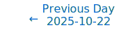
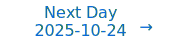

# Personalized Daily ArXiv Papers 2025-10-23

| *[gpt-5]*   | Prompt   | Completion   | Total   |
|:-----------:|:--------:|:------------:|:-------:|
| **Token**   | 44031    | 36622        | 80653   |
| **Cost**    | $0.06    | $0.37        | $0.42   |

Total arXiv papers: 569

Total scanned papers: 302

Total relevant papers: 28

**Table of contents with paper titles:**

1. [Transformers are Inherently Succinct](#user-content-link1)
**Authors:** Pascal Bergstr\"a{\ss}er, Ryan Cotterell, Anthony W. Lin

2. [HybridEP: Scaling Expert Parallelism to Cross-Datacenter Scenario via Hybrid Expert/Data Transmission](#user-content-link2)
**Authors:** Weihao Yang, Hao Huang, Donglei Wu, Ningke Li, Yanqi Pan, Qiyang Zheng, Wen Xia, Shiyi Li, Qiang Wang

3. [ARA: Adaptive Rank Allocation for Efficient Large Language Model SVD Compression](#user-content-link3)
**Authors:** Lin Xv, Jingsheng Gao, Xian Gao, Ting Liu, Yuzhuo Fu

4. [Transformers are almost optimal metalearners for linear classification](#user-content-link4)
**Authors:** Roey Magen, Gal Vardi

5. [MoE-Prism: Disentangling Monolithic Experts for Elastic MoE Services via Model-System Co-Designs](#user-content-link5)
**Authors:** Xinfeng Xia, Jiacheng Liu, Xiaofeng Hou, Peng Tang, Mingxuan Zhang, Wenfeng Wang, Chao Li

6. [NeuroAda: Activating Each Neuron's Potential for Parameter-Efficient Fine-Tuning](#user-content-link6)
**Authors:** Zhi Zhang, Yixian Shen, Congfeng Cao, Ekaterina Shutova

7. [Fast Inference via Hierarchical Speculative Decoding](#user-content-link7)
**Authors:** Amir Globerson, Haim Kaplan, Yishay Mansour, Clara Mohri, Tal Schuster

8. [A Derandomization Framework for Structure Discovery: Applications in Neural Networks and Beyond](#user-content-link8)
**Authors:** Nikos Tsikouras, Yorgos Pantis, Ioannis Mitliagkas, Christos Tzamos

9. [ELUTQ: Efficient LUT-Aware Quantization for Deploying Large Language Models on Edge Devices](#user-content-link9)
**Authors:** Xin Nie, Liang Dong, HaiCheng Zhang, JiaWang Xiao, G. Sun

10. [When Do Transformers Learn Heuristics for Graph Connectivity?](#user-content-link10)
**Authors:** Qilin Ye, Deqing Fu, Robin Jia, Vatsal Sharan

11. [Energy-Efficient and Dequantization-Free Q-LLMs: A Spiking Neural Network Approach to Salient Value Mitigation](#user-content-link11)
**Authors:** Chenyu Wang, Zhanglu Yan, Zhi Zhou, Xu Chen, Weng-Fai Wong

12. [Data Efficient Any Transformer-to-Mamba Distillation via Attention Bridge](#user-content-link12)
**Authors:** Penghao Wang, Yuhao Zhou, Mengxuan Wu, Panpan Zhang, Zhangyang Wang, Kai Wang

13. [CPSVD: Enhancing Large Language Model Compression via Column-Preserving Singular Value Decomposition](#user-content-link13)
**Authors:** Lin Xv, Jingsheng Gao, Xian Gao, Ting Li, Yuzhuo Fu

14. [GaLLoP: Gradient-based Sparse Learning on Low-Magnitude Parameters](#user-content-link14)
**Authors:** Anand Choudhary, Yasser Sula{\i}man, Lukas Mauch, Ghouthi Boukli Hacene, Fabien Cardinaux, Antoine Bosselut

15. [AdaSPEC: Selective Knowledge Distillation for Efficient Speculative Decoders](#user-content-link15)
**Authors:** Yuezhou Hu, Jiaxin Guo, Xinyu Feng, Tuo Zhao

16. [Feature Space Adaptation for Robust Model Fine-Tuning](#user-content-link16)
**Authors:** Peng Wang, Minghao Gu, Qiang Huang

17. [Latent Space Factorization in LoRA](#user-content-link17)
**Authors:** Shashi Kumar, Yacouba Kaloga, John Mitros, Petr Motlicek, Ina Kodrasi

18. [Every Attention Matters: An Efficient Hybrid Architecture for Long-Context Reasoning](#user-content-link18)
**Authors:** Ling Team, Bin Han, Caizhi Tang, Chen Liang, Donghao Zhang, Fan Yuan, Feng Zhu, Jie Gao, Jingyu Hu, Longfei Li, Meng Li, Mingyang Zhang, Peijie Jiang, Peng Jiao, Qian Zhao, Qingyuan Yang, Wenbo Shen, Xinxing Yang, Yalin Zhang, Yankun Ren, Yao Zhao, Yibo Cao, Yixuan Sun, Yue Zhang, Yuchen Fang, Zibin Lin, Zixuan Cheng, Jun Zhou

19. [MetaCluster: Enabling Deep Compression of Kolmogorov-Arnold Network](#user-content-link19)
**Authors:** Matthew Raffel, Adwaith Renjith, Lizhong Chen

20. [Study of Training Dynamics for Memory-Constrained Fine-Tuning](#user-content-link20)
**Authors:** A\"el Qu\'elennec, Nour Hezbri, Pavlo Mozharovskyi, Van-Tam Nguyen, Enzo Tartaglione

21. [RLBoost: Harvesting Preemptible Resources for Cost-Efficient Reinforcement Learning on LLMs](#user-content-link21)
**Authors:** Yongji Wu, Xueshen Liu, Haizhong Zheng, Juncheng Gu, Beidi Chen, Z. Morley Mao, Arvind Krishnamurthy, Ion Stoica

22. [Category learning in deep neural networks: Information content and geometry of internal representations](#user-content-link22)
**Authors:** Laurent Bonnasse-Gahot, Jean-Pierre Nadal

23. [Memo: Training Memory-Efficient Embodied Agents with Reinforcement Learning](#user-content-link23)
**Authors:** Gunshi Gupta, Karmesh Yadav, Zsolt Kira, Yarin Gal, Rahaf Aljundi

24. [Understanding the Implicit Biases of Design Choices for Time Series Foundation Models](#user-content-link24)
**Authors:** Annan Yu, Danielle C. Maddix, Boran Han, Xiyuan Zhang, Abdul Fatir Ansari, Oleksandr Shchur, Christos Faloutsos, Andrew Gordon Wilson, Michael W. Mahoney, Yuyang Wang

25. [Zhyper: Factorized Hypernetworks for Conditioned LLM Fine-Tuning](#user-content-link25)
**Authors:** M. H. I. Abdalla, Zhipin Wang, Christian Frey, Steffen Eger, Josif Grabocka

26. [Weight Decay may matter more than muP for Learning Rate Transfer in Practice](#user-content-link26)
**Authors:** Atli Kosson, Jeremy Welborn, Yang Liu, Martin Jaggi, Xi Chen

27. [Enabling Reconfiguration-Communication Overlap for Collective Communication in Optical Networks](#user-content-link27)
**Authors:** Changbo Wu, Zhuolong Yu, Gongming Zhao, Hongli Xu

28. [Knowledge Distillation of Uncertainty using Deep Latent Factor Model](#user-content-link28)
**Authors:** Sehyun Park, Jongjin Lee, Yunseop Shin, Ilsang Ohn, Yongdai Kim

---

## 1. [Transformers are Inherently Succinct](https://arxiv.org/abs/2510.19315) 

**ArXiv ID:** 2510.19315

**Authors:** Pascal Bergstr\"a{\ss}er, Ryan Cotterell, Anthony W. Lin

**Abstract:** We propose succinctness as a measure of the expressive power of a transformer in describing a concept. To this end, we prove that transformers are highly expressive in that they can represent formal languages substantially more succinctly than standard representations of formal languages like finite automata and Linear Temporal Logic (LTL) formulas. As a by-product of this expressivity, we show that verifying properties of transformers is provably intractable (i.e. EXPSPACE-complete).

**Comment:** Model Architecture Theory: proves transformers’ high succinctness vs automata/LTL and EXPSPACE-complete verification.

**Relevance:** 10
**Novelty:** 8

---

## 2. [HybridEP: Scaling Expert Parallelism to Cross-Datacenter Scenario via Hybrid Expert/Data Transmission](https://arxiv.org/abs/2510.19470) 

**ArXiv ID:** 2510.19470

**Authors:** Weihao Yang, Hao Huang, Donglei Wu, Ningke Li, Yanqi Pan, Qiyang Zheng, Wen Xia, Shiyi Li, Qiang Wang

**Abstract:** Mixture-of-Experts (MoE) has become a popular architecture for scaling large models. However, the rapidly growing scale outpaces model training on a single DC, driving a shift toward a more flexible, cross-DC training paradigm. Under this, Expert Parallelism (EP) of MoE faces significant scalability issues due to the limited cross-DC bandwidth. Specifically, existing EP optimizations attempt to overlap data communication and computation, which has little benefit in low-bandwidth scenarios due to a much longer data communication time. Therefore, the trends of cross-DC EP scaling is fast becoming a critical roadblock to the continued growth of MoE models.   To address this, we propose HybridEP, a modeling-guided framework to optimize EP under constrained bandwidth. Our key idea is to dynamically transform the spatial placement of experts to reduce data communication traffic and frequency, thereby minimizing EP's communication overheads. However, it is non-trivial to find the optimal solution because it complicates the original communication pattern by mixing data and expert communication. We therefore build a stream-based model to determine the optimal transmission ratio. Guided by this, we incorporate two techniques: (1) domain-based partition to construct the mapping between hybrid patterns and specific communication topology at GPU level, and (2) parameter-efficient migration to further refine this topology by reducing expert transmission overhead and enlarging the domain size. Combining all these designs, HybridEP can be considered as a more general EP with better scalability. Experimental results show that HybridEP outperforms existing state-of-the-art MoE training systems by up to 5.6x under constrained bandwidth. We further compare HybridEP and EP on large-scale simulations. HybridEP achieves up to 1.45x speedup with 1k DCs under different bandwidths.

**Comment:** Matches HPC and MoE scaling: HybridEP introduces modeling-guided hybrid expert/data transmission and topology/domain partitioning to scale Expert Parallelism across datacenters under bandwidth constraints.

**Relevance:** 10
**Novelty:** 8

---

## 3. [ARA: Adaptive Rank Allocation for Efficient Large Language Model SVD Compression](https://arxiv.org/abs/2510.19389) 

**ArXiv ID:** 2510.19389

**Authors:** Lin Xv, Jingsheng Gao, Xian Gao, Ting Liu, Yuzhuo Fu

**Abstract:** In the field of large language model (LLM) compression, singular value decomposition (SVD) is a widely studied and adopted low-rank decomposition technique. Since SVD operates exclusively on linear modules, and these modules in LLMs are separated by nonlinear components, SVD can only be applied independently to each linear module. Under a global compression ratio constraint, determining the appropriate rank for different linear modules becomes a critical problem. Existing approaches, such as heuristic algorithms and mask-based training, have made progress in addressing this challenge. However, these methods still suffer from several limitations: heuristic algorithms explore the solution space within restricted regions, while mask-based training struggles to efficiently capture the relationship between singular value spectra and trainable parameters. More importantly, current methods overlook the key property that the gain function is non-smooth at a compression ratio of 1, which often leads the training process to suboptimal local minima. To address these issues, we propose an Adaptive Rank Allocation (ARA) method. Specifically, (1) ARA introduces a dedicated mask design that enables efficient mapping and updating between retained ranks and trainable parameters; and (2) it employs an additional loss function to guide parameter selection toward globally optimal solutions. Experimental results demonstrate that ARA achieves state-of-the-art performance. On the LLaMA2-7B model with a 80\% compression ratio, ARA reduces perplexity on WikiText2 from 8.38 to 6.42 and improves average zero-shot task accuracy by 9.72 percentage points compared with uniform compression. These results highlight the effectiveness of our method for rank allocation in SVD-based LLM compression.

**Comment:** Matches Compression/Efficiency: Adaptive Rank Allocation for SVD-based LLM compression with a new mask design and loss to optimize per-layer ranks under global constraints.

**Relevance:** 10
**Novelty:** 7

---

## 4. [Transformers are almost optimal metalearners for linear classification](https://arxiv.org/abs/2510.19797) 

**ArXiv ID:** 2510.19797

**Authors:** Roey Magen, Gal Vardi

**Abstract:** Transformers have demonstrated impressive in-context learning (ICL) capabilities, raising the question of whether they can serve as metalearners that adapt to new tasks using only a small number of in-context examples, without any further training. While recent theoretical work has studied transformers' ability to perform ICL, most of these analyses do not address the formal metalearning setting, where the objective is to solve a collection of related tasks more efficiently than would be possible by solving each task individually. In this paper, we provide the first theoretical analysis showing that a simplified transformer architecture trained via gradient descent can act as a near-optimal metalearner in a linear classification setting. We consider a natural family of tasks where each task corresponds to a class-conditional Gaussian mixture model, with the mean vectors lying in a shared $k$-dimensional subspace of $R^d$. After training on a sufficient number of such tasks, we show that the transformer can generalize to a new task using only $O(k / R^4)$ in-context examples, where $R$ denotes the signal strength at test time. This performance (almost) matches that of an optimal learner that knows exactly the shared subspace and significantly outperforms any learner that only has access to the in-context data, which requires $\Omega(d / R^4)$ examples to generalize. Importantly, our bounds on the number of training tasks and examples per task needed to achieve this result are independent of the ambient dimension $d$.

**Comment:** Representation Learning/Architecture Theory: theoretical proof that (simplified) transformers are near-optimal metalearners for linear classification.

**Relevance:** 9
**Novelty:** 8

---

## 5. [MoE-Prism: Disentangling Monolithic Experts for Elastic MoE Services via Model-System Co-Designs](https://arxiv.org/abs/2510.19366) 

**ArXiv ID:** 2510.19366

**Authors:** Xinfeng Xia, Jiacheng Liu, Xiaofeng Hou, Peng Tang, Mingxuan Zhang, Wenfeng Wang, Chao Li

**Abstract:** Mixture-of-Experts (MoE) models, the state-of-the-art in large-scale AI, achieve high quality by sparsely activating parameters. However, their reliance on routing between a few monolithic experts via a top-k mechanism creates a "quality cliff", offering only a few coarse-grained operating points. This inflexibility forces a difficult trade-off between cost and quality, preventing adaptation to diverse Service Level Objectives (SLOs) and leading to significant resource over-provisioning.   This paper introduces MoE-Prism, a model-system co-design that transforms rigid MoE models into elastic services. Our methodology is divided into two phases. First, an \emph{Offline Refactoring Engine} systematically deconstructs monolithic experts into fine-grained "sub-experts." This engine employs a partitioning optimization solver that uses a metaheuristic-based approach to group neurons, preserving functional locality without requiring retraining. Second, an \emph{Online Scheduling Engine} leverages this new elasticity through QoS-aware scheduling. It implements specialized policies to solve complex system problems, including maximizing throughput in cloud deployments and managing latency-optimized offloading for memory-constrained devices. Our evaluation across three different MoE models shows that MoE-Prismprovides over 4 times more distinct, stable operating points than the baseline. This allows an AI service to dynamically improve throughput by up to 19.9\% under a strict latency budget or reduce latency by up to 10.36\% under limited resources. MoE-Prism provides the critical "control knob" to bridge the model-system gap, enabling the next generation of adaptive, efficient, and QoS-aware AI services.

**Comment:** Model Architecture and Systems Efficiency: MoE expert partitioning into fine-grained sub-experts plus QoS-aware scheduling for elastic inference.

**Relevance:** 9
**Novelty:** 8

---

## 6. [NeuroAda: Activating Each Neuron's Potential for Parameter-Efficient Fine-Tuning](https://arxiv.org/abs/2510.18940) 

**ArXiv ID:** 2510.18940

**Authors:** Zhi Zhang, Yixian Shen, Congfeng Cao, Ekaterina Shutova

**Abstract:** Existing parameter-efficient fine-tuning (PEFT) methods primarily fall into two categories: addition-based and selective in-situ adaptation. The former, such as LoRA, introduce additional modules to adapt the model to downstream tasks, offering strong memory efficiency. However, their representational capacity is often limited, making them less suitable for fine-grained adaptation. In contrast, the latter directly fine-tunes a carefully chosen subset of the original model parameters, allowing for more precise and effective adaptation, but at the cost of significantly increased memory consumption. To reconcile this trade-off, we propose NeuroAda, a novel PEFT method that enables fine-grained model finetuning while maintaining high memory efficiency. Our approach first identifies important parameters (i.e., connections within the network) as in selective adaptation, and then introduces bypass connections for these selected parameters. During finetuning, only the bypass connections are updated, leaving the original model parameters frozen. Empirical results on 23+ tasks spanning both natural language generation and understanding demonstrate that NeuroAda achieves state-of-the-art performance with as little as $\leq \textbf{0.02}\%$ trainable parameters, while reducing CUDA memory usage by up to 60%. We release our code here: https://github.com/FightingFighting/NeuroAda.git.

**Comment:** Model Compression/Efficiency: PEFT via bypass connections on selected parameters enabling ≤0.02% trainable weights.

**Relevance:** 9
**Novelty:** 8

---

## 7. [Fast Inference via Hierarchical Speculative Decoding](https://arxiv.org/abs/2510.19705) 

**ArXiv ID:** 2510.19705

**Authors:** Amir Globerson, Haim Kaplan, Yishay Mansour, Clara Mohri, Tal Schuster

**Abstract:** Transformer language models generate text autoregressively, making inference latency proportional to the number of tokens generated. Speculative decoding reduces this latency without sacrificing output quality, by leveraging a small draft model to propose tokens that the larger target model verifies in parallel. In practice, however, there may exist a set of potential draft models- ranging from faster but less inaccurate, to slower yet more reliable. We introduce Hierarchical Speculative Decoding (HSD), an algorithm that stacks these draft models into a hierarchy, where each model proposes tokens, and the next larger model verifies them in a single forward pass, until finally the target model verifies tokens. We derive an expression for the expected latency of any such hierarchy and show that selecting the latency-optimal hierarchy can be done in polynomial time. Empirically, HSD gives up to 1.2x speed-up over the best single-draft baseline, demonstrating the practicality of our algorithm in reducing generation latency beyond previous techniques.

**Comment:** High-Performance Inference: hierarchical speculative decoding with latency-optimal hierarchy selection.

**Relevance:** 9
**Novelty:** 8

---

## 8. [A Derandomization Framework for Structure Discovery: Applications in Neural Networks and Beyond](https://arxiv.org/abs/2510.19382) 

**ArXiv ID:** 2510.19382

**Authors:** Nikos Tsikouras, Yorgos Pantis, Ioannis Mitliagkas, Christos Tzamos

**Abstract:** Understanding the dynamics of feature learning in neural networks (NNs) remains a significant challenge. The work of (Mousavi-Hosseini et al., 2023) analyzes a multiple index teacher-student setting and shows that a two-layer student attains a low-rank structure in its first-layer weights when trained with stochastic gradient descent (SGD) and a strong regularizer. This structural property is known to reduce sample complexity of generalization. Indeed, in a second step, the same authors establish algorithm-specific learning guarantees under additional assumptions. In this paper, we focus exclusively on the structure discovery aspect and study it under weaker assumptions, more specifically: we allow (a) NNs of arbitrary size and depth, (b) with all parameters trainable, (c) under any smooth loss function, (d) tiny regularization, and (e) trained by any method that attains a second-order stationary point (SOSP), e.g.\ perturbed gradient descent (PGD). At the core of our approach is a key $\textit{derandomization}$ lemma, which states that optimizing the function $\mathbb{E}_{\mathbf{x}} \left[g_{\theta}(\mathbf{W}\mathbf{x} + \mathbf{b})\right]$ converges to a point where $\mathbf{W} = \mathbf{0}$, under mild conditions. The fundamental nature of this lemma directly explains structure discovery and has immediate applications in other domains including an end-to-end approximation for MAXCUT, and computing Johnson-Lindenstrauss embeddings.

**Comment:** Representation Learning/Training Dynamics: derandomization lemma explaining structure discovery (low-rank) in neural networks under broad conditions.

**Relevance:** 9
**Novelty:** 8

---

## 9. [ELUTQ: Efficient LUT-Aware Quantization for Deploying Large Language Models on Edge Devices](https://arxiv.org/abs/2510.19482) 

**ArXiv ID:** 2510.19482

**Authors:** Xin Nie, Liang Dong, HaiCheng Zhang, JiaWang Xiao, G. Sun

**Abstract:** The deployment of Large Language Models (LLMs) on CPU-based edge devices is crucial for enabling on-device intelligence and expanding AI accessibility. However, it remains challenging due to limited memory and computational resources. During edge inference, memory usage and latency are the primary bottlenecks. Although weight quantization can effectively reduce memory consumption, existing hardware-friendly approaches often rely on uniform quantization, which poorly fits weight distributions and incurs high dequantization overhead at low bit widths. To address these limitations, we propose ELUTQ, an efficient quantization framework introducing a novel quantization format, Hierarchical Linear Quantization (HLQ). HLQ better captures the statistical characteristics of weights without increasing the computational cost of Bit-serial LUT-based GEMM operations, thereby eliminating dequantization overhead. It is orthogonal to existing quantization algorithms and can be seamlessly integrated into various quantization pipelines. For efficient on-device deployment, ELUTQ provides optimized CPU kernels for end-to-end inference. Experiments show that for LLaMA3-8B, HLQ reduces perplexity by about 8% at 3-bit and 85% at 2-bit precision under post-training quantization, completing quantization within one hour. With efficient finetuning, HLQ further improves 2-bit performance within two hours. In terms of inference efficiency, our 2-bit LLaMA2-7B achieves over 25 tokens/s on an Apple M2 chip (4 threads, batch size = 1).

**Comment:** Model Compression/Efficiency: LUT-aware hierarchical linear quantization (HLQ) and optimized CPU kernels for LLM edge deployment.

**Relevance:** 9
**Novelty:** 8

---

## 10. [When Do Transformers Learn Heuristics for Graph Connectivity?](https://arxiv.org/abs/2510.19753) 

**ArXiv ID:** 2510.19753

**Authors:** Qilin Ye, Deqing Fu, Robin Jia, Vatsal Sharan

**Abstract:** Transformers often fail to learn generalizable algorithms, instead relying on brittle heuristics. Using graph connectivity as a testbed, we explain this phenomenon both theoretically and empirically. We consider a simplified Transformer architecture, the disentangled Transformer, and prove that an $L$-layer model has capacity to solve for graphs with diameters up to exactly $3^L$, implementing an algorithm equivalent to computing powers of the adjacency matrix. We analyze the training-dynamics, and show that the learned strategy hinges on whether most training instances are within this model capacity. Within-capacity graphs (diameter $\leq 3^L$) drive the learning of a correct algorithmic solution while beyond-capacity graphs drive the learning of a simple heuristic based on node degrees. Finally, we empirically demonstrate that restricting training data within a model's capacity leads to both standard and disentangled transformers learning the exact algorithm rather than the degree-based heuristic.

**Comment:** Matches Model Architecture and Representation Learning: theoretical and empirical analysis of when Transformers learn correct algorithms vs heuristics on graph connectivity, tied to depth/diameter capacity and training dynamics.

**Relevance:** 9
**Novelty:** 8

---

## 11. [Energy-Efficient and Dequantization-Free Q-LLMs: A Spiking Neural Network Approach to Salient Value Mitigation](https://arxiv.org/abs/2510.19498) 

**ArXiv ID:** 2510.19498

**Authors:** Chenyu Wang, Zhanglu Yan, Zhi Zhou, Xu Chen, Weng-Fai Wong

**Abstract:** In the era of large language models (LLMs), weight-activation quantization helps fit models on edge device by reducing memory and compute bit-widths. However, three challenges persist for energy constrained hardware: (1) even after quantization, multiply-accumulate (MAC) operations remain unavoidable and continue to dominate energy consumption; (2) dequantization (or per-tensor/channel rescaling) introduces extra arithmetic and data movement, increasing latency and energy; (3) uniform parameters bit widths clip salient values-while intra-channel mixed precision is generally impractical on current matrix hardware and memory. In contrast, brain-inspired Spiking Neural Networks (SNNs), owing to their binary spike-based information representation and the Integrate-and-Fire (IF) paradigm, naturally support mixed-precision storage and energy-efficient computation by replacing complex MACs with temporal Accumulate (ACCs). Motivated by this property, we propose SpikeQuant, which selectively applies mixed-precision quantization to activations with salient values and re-encodes them into binary spike counts, thereby enabling dynamic mixed storage of different bitwidths. Furthermore, by embedding the quantization scale into the threshold of the IF mechanism, our approach performs energy-efficient linear transformations on weights and activations while avoiding explicit dequantization. Experimental results demonstrate that SpikeQuant consistently achieves near-FP16 perplexity under W4A4 quantization while reducing energy cost by up to 4.6 times compared to existing methods, highlighting its effectiveness for accurate and energy-efficient LLM deployment.

**Comment:** Model Compression and Efficiency: proposes dequantization-free mixed-precision quantization for LLMs via SNN-style spike encoding, reducing MAC energy.

**Relevance:** 9
**Novelty:** 7

---

## 12. [Data Efficient Any Transformer-to-Mamba Distillation via Attention Bridge](https://arxiv.org/abs/2510.19266) 

**ArXiv ID:** 2510.19266

**Authors:** Penghao Wang, Yuhao Zhou, Mengxuan Wu, Panpan Zhang, Zhangyang Wang, Kai Wang

**Abstract:** State-space models (SSMs) have emerged as efficient alternatives to Transformers for sequence modeling, offering superior scalability through recurrent structures. However, their training remains costly and the ecosystem around them is far less mature than that of Transformers. Moreover, the structural heterogeneity between SSMs and Transformers makes it challenging to efficiently distill knowledge from pretrained attention models. In this work, we propose Cross-architecture distillation via Attention Bridge (CAB), a novel data-efficient distillation framework that efficiently transfers attention knowledge from Transformer teachers to state-space student models. Unlike conventional knowledge distillation that transfers knowledge only at the output level, CAB enables token-level supervision via a lightweight bridge and flexible layer-wise alignment, improving both efficiency and transferability. We further introduce flexible layer-wise alignment strategies to accommodate architectural discrepancies between teacher and student. Extensive experiments across vision and language domains demonstrate that our method consistently improves the performance of state-space models, even under limited training data, outperforming both standard and cross-architecture distillation methods. Our findings suggest that attention-based knowledge can be efficiently transferred to recurrent models, enabling rapid utilization of Transformer expertise for building a stronger SSM community.

**Comment:** Model Compression and Efficiency: cross-architecture distillation from Transformers to SSMs via an attention bridge with token-level supervision and layer-wise alignment.

**Relevance:** 9
**Novelty:** 7

---

## 13. [CPSVD: Enhancing Large Language Model Compression via Column-Preserving Singular Value Decomposition](https://arxiv.org/abs/2510.19385) 

**ArXiv ID:** 2510.19385

**Authors:** Lin Xv, Jingsheng Gao, Xian Gao, Ting Li, Yuzhuo Fu

**Abstract:** The rapid advancement of Large Language Models (LLMs) faces a critical bottleneck in their immense size, necessitating efficient compression techniques. While Singular Value Decomposition (SVD) is a promising approach, existing SVD-based methods treat the entire parameter matrix uniformly, overlooking that SVD approximation errors vary significantly across different matrix parts, which often leads to suboptimal compression. To address this, we propose \textbf{C}olumn-\textbf{P}reserving \textbf{S}ingular \textbf{V}alue \textbf{D}ecomposition (CPSVD), a novel method that refines SVD-based LLM compression by intelligently segmenting the parameter matrix. Unlike traditional SVD, CPSVD identifies and directly preserves matrix columns with high decomposition errors, applying SVD only to columns with low decomposition errors, while precisely determining the optimal balance point between these two strategies to minimize error. Furthermore, leveraging the inherent heterogeneity in decomposition errors across different matrices within an LLM, CPSVD adaptively allocates non-uniform compression rates to modules within that layer, while adhering to a target layer-wise compression ratio, thereby further enhancing compression performance. Extensive experiments demonstrate that CPSVD consistently outperforms state-of-the-art SVD-based LLM compression methods, achieving lower perplexity and higher accuracy on zero-shot tasks.

**Comment:** Model Compression and Efficiency: column-preserving SVD with adaptive per-module compression for LLMs (low-rank plus selective column retention).

**Relevance:** 9
**Novelty:** 7

---

## 14. [GaLLoP: Gradient-based Sparse Learning on Low-Magnitude Parameters](https://arxiv.org/abs/2510.19778) 

**ArXiv ID:** 2510.19778

**Authors:** Anand Choudhary, Yasser Sula{\i}man, Lukas Mauch, Ghouthi Boukli Hacene, Fabien Cardinaux, Antoine Bosselut

**Abstract:** Sparse fine-tuning techniques adapt LLMs to downstream tasks by only tuning a sparse subset of model parameters. However, the effectiveness of sparse adaptation depends on optimally selecting the model parameters to be fine-tuned. In this work, we introduce a novel sparse fine-tuning technique named GaLLoP: Gradient-based Sparse Learning on Low-Magnitude Parameters, which fine-tunes only those model parameters which have the largest gradient magnitudes on downstream tasks and the smallest pre-trained magnitudes, intuitively prioritizing parameters that are highly task-relevant, but minimally disruptive to pre-trained knowledge. Our experimentation with LLaMA3 8B and Gemma 2B as base models shows that GaLLoP consistently improves or matches the in-distribution as well as out-of-distribution performance obtained via the usage of other leading parameter-efficient fine-tuning techniques, including LoRA, DoRA, and SAFT. Our analysis demonstrates that GaLLoP mitigates catastrophic forgetting and memorization of task data, as important pre-trained parameters remain unchanged, and stabilizes performance relative to other fine-tuning techniques, robustly generalizing across most random seeds.

**Comment:** Model Compression and Efficiency: sparse fine-tuning by selecting parameters with large gradients and low pre-trained magnitudes to preserve knowledge.

**Relevance:** 9
**Novelty:** 7

---

## 15. [AdaSPEC: Selective Knowledge Distillation for Efficient Speculative Decoders](https://arxiv.org/abs/2510.19779) 

**ArXiv ID:** 2510.19779

**Authors:** Yuezhou Hu, Jiaxin Guo, Xinyu Feng, Tuo Zhao

**Abstract:** Speculative Decoding (SD) accelerates large language model inference by employing a small draft model to generate predictions, which are then verified by a larger target model. The effectiveness of SD hinges on the alignment between these models, which is typically enhanced by Knowledge Distillation (KD). However, conventional KD methods aim to minimize the KL divergence between the draft and target models across all tokens, a goal that is misaligned with the true objective of SD, which is to maximize token acceptance rate. Therefore, draft models often struggle to fully assimilate the target model's knowledge due to capacity constraints, leading to suboptimal performance. To address this challenge, we propose AdaSPEC, a novel method that incorporates selective token filtering into the KD process. AdaSPEC utilizes a reference model to identify and filter out difficult-to-fit tokens, enabling the distillation of a draft model that better aligns with the target model on simpler tokens. This approach improves the overall token acceptance rate without compromising generation quality. We evaluate AdaSPEC across diverse tasks, including arithmetic reasoning, instruction-following, coding, and summarization, using model configurations of 31M/1.4B and 350M/2.7B parameters. Our results demonstrate that AdaSPEC consistently outperforms the state-of-the-art DistillSpec method, achieving higher acceptance rates across all tasks (up to 15\%). The code is publicly available at https://github.com/yuezhouhu/adaspec.

**Comment:** High-Performance Inference: selective knowledge distillation tailored to maximize token acceptance in speculative decoding.

**Relevance:** 9
**Novelty:** 7

---

## 16. [Feature Space Adaptation for Robust Model Fine-Tuning](https://arxiv.org/abs/2510.19155) 

**ArXiv ID:** 2510.19155

**Authors:** Peng Wang, Minghao Gu, Qiang Huang

**Abstract:** Catastrophic forgetting is a common issue in model fine-tuning, especially when the downstream domain contains limited labeled data or differs greatly from the pre-training distribution. Existing parameter-efficient fine-tuning methods operate in the weight space by modifying or augmenting the pre-trained model's parameters, which can yield models overly specialized to the available downstream data. To mitigate the risk of overwriting pre-trained knowledge and enhance robustness, we propose to fine-tune the pre-trained model in the feature space. Two new fine-tuning methods are proposed: LoRFA (Low-Rank Feature Adaptation) and VeFA (Vector-Based Feature Adaptation). Feature space adaptation is inspired by the idea of effect equivalence modeling (EEM) of downstream lurking variables causing distribution shifts, which posits that unobserved factors can be represented as the total equivalent amount on observed features. By compensating for the effects of downstream lurking variables via a lightweight feature-level transformation, the pre-trained representations can be preserved, which improves model generalization under distribution shift. We evaluate LoRFA and VeFA versus LoRA on image classification, NLU, and NLG, covering both standard fine-tuning metrics and robustness. Feature space adaptation achieves comparable fine-tuning results and consistently stronger robustness.

**Comment:** Model Compression/Efficiency: PEFT in feature space (LoRFA/VeFA) with low-rank/vector transformations to preserve pretrained representations under shift.

**Relevance:** 9
**Novelty:** 7

---

## 17. [Latent Space Factorization in LoRA](https://arxiv.org/abs/2510.19640) 

**ArXiv ID:** 2510.19640

**Authors:** Shashi Kumar, Yacouba Kaloga, John Mitros, Petr Motlicek, Ina Kodrasi

**Abstract:** Low-rank adaptation (LoRA) is a widely used method for parameter-efficient finetuning. However, existing LoRA variants lack mechanisms to explicitly disambiguate task-relevant information within the learned low-rank subspace, potentially limiting downstream performance. We propose Factorized Variational Autoencoder LoRA (FVAE-LoRA), which leverages a VAE to learn two distinct latent spaces. Our novel Evidence Lower Bound formulation explicitly promotes factorization between the latent spaces, dedicating one latent space to task-salient features and the other to residual information. Extensive experiments on text, audio, and image tasks demonstrate that FVAE-LoRA consistently outperforms standard LoRA. Moreover, spurious correlation evaluations confirm that FVAE-LoRA better isolates task-relevant signals, leading to improved robustness under distribution shifts. Our code is publicly available at: https://github.com/idiap/FVAE-LoRA

**Comment:** Matches Compression/Efficiency and Model Architecture: a LoRA variant (FVAE-LoRA) that factorizes task-salient vs residual latent spaces via a new ELBO for parameter-efficient finetuning with improved robustness.

**Relevance:** 9
**Novelty:** 7

---

## 18. [Every Attention Matters: An Efficient Hybrid Architecture for Long-Context Reasoning](https://arxiv.org/abs/2510.19338) 

**ArXiv ID:** 2510.19338

**Authors:** Ling Team, Bin Han, Caizhi Tang, Chen Liang, Donghao Zhang, Fan Yuan, Feng Zhu, Jie Gao, Jingyu Hu, Longfei Li, Meng Li, Mingyang Zhang, Peijie Jiang, Peng Jiao, Qian Zhao, Qingyuan Yang, Wenbo Shen, Xinxing Yang, Yalin Zhang, Yankun Ren, Yao Zhao, Yibo Cao, Yixuan Sun, Yue Zhang, Yuchen Fang, Zibin Lin, Zixuan Cheng, Jun Zhou

**Abstract:** In this technical report, we present the Ring-linear model series, specifically including Ring-mini-linear-2.0 and Ring-flash-linear-2.0. Ring-mini-linear-2.0 comprises 16B parameters and 957M activations, while Ring-flash-linear-2.0 contains 104B parameters and 6.1B activations. Both models adopt a hybrid architecture that effectively integrates linear attention and softmax attention, significantly reducing I/O and computational overhead in long-context inference scenarios. Compared to a 32 billion parameter dense model, this series reduces inference cost to 1/10, and compared to the original Ring series, the cost is also reduced by over 50%. Furthermore, through systematic exploration of the ratio between different attention mechanisms in the hybrid architecture, we have identified the currently optimal model structure. Additionally, by leveraging our self-developed high-performance FP8 operator library-linghe, overall training efficiency has been improved by 50%. Benefiting from the high alignment between the training and inference engine operators, the models can undergo long-term, stable, and highly efficient optimization during the reinforcement learning phase, consistently maintaining SOTA performance across multiple challenging complex reasoning benchmarks.

**Comment:** Matches Model Architecture and Efficiency: proposes a hybrid linear+softmax attention architecture for long-context with FP8 operator support, reducing compute/I-O while maintaining reasoning performance.

**Relevance:** 9
**Novelty:** 7

---

## 19. [MetaCluster: Enabling Deep Compression of Kolmogorov-Arnold Network](https://arxiv.org/abs/2510.19105) 

**ArXiv ID:** 2510.19105

**Authors:** Matthew Raffel, Adwaith Renjith, Lizhong Chen

**Abstract:** Kolmogorov-Arnold Networks (KANs) replace scalar weights with per-edge vectors of basis coefficients, thereby boosting expressivity and accuracy but at the same time resulting in a multiplicative increase in parameters and memory. We propose MetaCluster, a framework that makes KANs highly compressible without sacrificing accuracy. Specifically, a lightweight meta-learner, trained jointly with the KAN, is used to map low-dimensional embedding to coefficient vectors, shaping them to lie on a low-dimensional manifold that is amenable to clustering. We then run K-means in coefficient space and replace per-edge vectors with shared centroids. Afterwards, the meta-learner can be discarded, and a brief fine-tuning of the centroid codebook recovers any residual accuracy loss. The resulting model stores only a small codebook and per-edge indices, exploiting the vector nature of KAN parameters to amortize storage across multiple coefficients. On MNIST, CIFAR-10, and CIFAR-100, across standard KANs and ConvKANs using multiple basis functions, MetaCluster achieves a reduction of up to 80$\times$ in parameter storage, with no loss in accuracy. Code will be released upon publication.

**Comment:** Model Compression and Efficiency: codebook-based weight sharing for KANs via meta-learner-induced clustering enables up to 80x parameter compression.

**Relevance:** 8
**Novelty:** 7

---

## 20. [Study of Training Dynamics for Memory-Constrained Fine-Tuning](https://arxiv.org/abs/2510.19675) 

**ArXiv ID:** 2510.19675

**Authors:** A\"el Qu\'elennec, Nour Hezbri, Pavlo Mozharovskyi, Van-Tam Nguyen, Enzo Tartaglione

**Abstract:** Memory-efficient training of deep neural networks has become increasingly important as models grow larger while deployment environments impose strict resource constraints. We propose TraDy, a novel transfer learning scheme leveraging two key insights: layer importance for updates is architecture-dependent and determinable a priori, while dynamic stochastic channel selection provides superior gradient approximation compared to static approaches. We introduce a dynamic channel selection approach that stochastically resamples channels between epochs within preselected layers. Extensive experiments demonstrate TraDy achieves state-of-the-art performance across various downstream tasks and architectures while maintaining strict memory constraints, achieving up to 99% activation sparsity, 95% weight derivative sparsity, and 97% reduction in FLOPs for weight derivative computation.

**Comment:** Model Compression and Efficiency: dynamic stochastic channel selection yields high activation/gradient sparsity for memory-constrained fine-tuning.

**Relevance:** 8
**Novelty:** 7

---

## 21. [RLBoost: Harvesting Preemptible Resources for Cost-Efficient Reinforcement Learning on LLMs](https://arxiv.org/abs/2510.19225) 

**ArXiv ID:** 2510.19225

**Authors:** Yongji Wu, Xueshen Liu, Haizhong Zheng, Juncheng Gu, Beidi Chen, Z. Morley Mao, Arvind Krishnamurthy, Ion Stoica

**Abstract:** Reinforcement learning (RL) has become essential for unlocking advanced reasoning capabilities in large language models (LLMs). RL workflows involve interleaving rollout and training stages with fundamentally different resource requirements. Rollout typically dominates overall execution time, yet scales efficiently through multiple independent instances. In contrast, training requires tightly-coupled GPUs with full-mesh communication. Existing RL frameworks fall into two categories: co-located and disaggregated architectures. Co-located ones fail to address this resource tension by forcing both stages to share the same GPUs. Disaggregated architectures, without modifications of well-established RL algorithms, suffer from resource under-utilization. Meanwhile, preemptible GPU resources, i.e., spot instances on public clouds and spare capacity in production clusters, present significant cost-saving opportunities for accelerating RL workflows, if efficiently harvested for rollout.   In this paper, we present RLBoost, a systematic solution for cost-efficient RL training that harvests preemptible GPU resources. Our key insight is that rollout's stateless and embarrassingly parallel nature aligns perfectly with preemptible and often fragmented resources. To efficiently utilize these resources despite frequent and unpredictable availability changes, RLBoost adopts a hybrid architecture with three key techniques: (1) adaptive rollout offload to dynamically adjust workloads on the reserved (on-demand) cluster, (2) pull-based weight transfer that quickly provisions newly available instances, and (3) token-level response collection and migration for efficient preemption handling and continuous load balancing. Extensive experiments show RLBoost increases training throughput by 1.51x-1.97x while improving cost efficiency by 28%-49% compared to using only on-demand GPU resources.

**Comment:** High Performance Computing: hybrid rollout–training architecture leveraging preemptible GPUs with adaptive offload and token-level migration for RL on LLMs.

**Relevance:** 8
**Novelty:** 7

---

## 22. [Category learning in deep neural networks: Information content and geometry of internal representations](https://arxiv.org/abs/2510.19021) 

**ArXiv ID:** 2510.19021

**Authors:** Laurent Bonnasse-Gahot, Jean-Pierre Nadal

**Abstract:** In animals, category learning enhances discrimination between stimuli close to the category boundary. This phenomenon, called categorical perception, was also empirically observed in artificial neural networks trained on classification tasks. In previous modeling works based on neuroscience data, we show that this expansion/compression is a necessary outcome of efficient learning. Here we extend our theoretical framework to artificial networks. We show that minimizing the Bayes cost (mean of the cross-entropy loss) implies maximizing the mutual information between the set of categories and the neural activities prior to the decision layer. Considering structured data with an underlying feature space of small dimension, we show that maximizing the mutual information implies (i) finding an appropriate projection space, and, (ii) building a neural representation with the appropriate metric. The latter is based on a Fisher information matrix measuring the sensitivity of the neural activity to changes in the projection space. Optimal learning makes this neural Fisher information follow a category-specific Fisher information, measuring the sensitivity of the category membership. Category learning thus induces an expansion of neural space near decision boundaries. We characterize the properties of the categorical Fisher information, showing that its eigenvectors give the most discriminant directions at each point of the projection space. We find that, unexpectedly, its maxima are in general not exactly at, but near, the class boundaries. Considering toy models and the MNIST dataset, we numerically illustrate how after learning the two Fisher information matrices match, and essentially align with the category boundaries. Finally, we relate our approach to the Information Bottleneck one, and we exhibit a bias-variance decomposition of the Bayes cost, of interest on its own.

**Comment:** Representation Learning: information-theoretic and Fisher-geometry analysis of category learning shaping internal representations.

**Relevance:** 8
**Novelty:** 7

---

## 23. [Memo: Training Memory-Efficient Embodied Agents with Reinforcement Learning](https://arxiv.org/abs/2510.19732) 

**ArXiv ID:** 2510.19732

**Authors:** Gunshi Gupta, Karmesh Yadav, Zsolt Kira, Yarin Gal, Rahaf Aljundi

**Abstract:** To enable embodied agents to operate effectively over extended timeframes, it is crucial to develop models that form and access memories to stay contextualized in their environment. In the current paradigm of training transformer-based policies for embodied sequential decision-making tasks, visual inputs often overwhelm the context limits of transformers, while humans can maintain and utilize a lifetime of experience compressed as memories. Significant compression is possible in principle, as much of the input is irrelevant and can be abstracted. However, existing approaches predominantly focus on either recurrent models with fixed-size memory or transformers with full-context reliance. In this work, we propose Memo, a transformer-based architecture and training recipe for reinforcement learning (RL) on memory-intensive, long-horizon tasks. Memo incorporates the creation and retrieval of memory by interleaving periodic summarization tokens with the inputs of a model during training. We demonstrate Memo's effectiveness on a gridworld meta-RL benchmark and a multi-object navigation task in photo-realistic indoor settings. Memo outperforms naive long-context transformer baselines while being more compute and storage efficient. Additionally, Memo generalizes better to longer contexts at inference time and remains robust in streaming settings, where historical context must be truncated to fit inference constraints.

**Comment:** Model Architecture/Efficiency: transformer with learned summarization tokens for memory creation/retrieval enabling long-horizon efficiency.

**Relevance:** 8
**Novelty:** 7

---

## 24. [Understanding the Implicit Biases of Design Choices for Time Series Foundation Models](https://arxiv.org/abs/2510.19236) 

**ArXiv ID:** 2510.19236

**Authors:** Annan Yu, Danielle C. Maddix, Boran Han, Xiyuan Zhang, Abdul Fatir Ansari, Oleksandr Shchur, Christos Faloutsos, Andrew Gordon Wilson, Michael W. Mahoney, Yuyang Wang

**Abstract:** Time series foundation models (TSFMs) are a class of potentially powerful, general-purpose tools for time series forecasting and related temporal tasks, but their behavior is strongly shaped by subtle inductive biases in their design. Rather than developing a new model and claiming that it is better than existing TSFMs, e.g., by winning on existing well-established benchmarks, our objective is to understand how the various ``knobs'' of the training process affect model quality. Using a mix of theory and controlled empirical evaluation, we identify several design choices (patch size, embedding choice, training objective, etc.) and show how they lead to implicit biases in fundamental model properties (temporal behavior, geometric structure, how aggressively or not the model regresses to the mean, etc.); and we show how these biases can be intuitive or very counterintuitive, depending on properties of the model and data. We also illustrate in a case study on outlier handling how multiple biases can interact in complex ways; and we discuss implications of our results for learning the bitter lesson and building TSFMs.

**Comment:** Representation Learning: analyzes implicit inductive biases/training dynamics of TSFMs (patching, embeddings, objectives) with theory and controlled evaluations.

**Relevance:** 8
**Novelty:** 7

---

## 25. [Zhyper: Factorized Hypernetworks for Conditioned LLM Fine-Tuning](https://arxiv.org/abs/2510.19733) 

**ArXiv ID:** 2510.19733

**Authors:** M. H. I. Abdalla, Zhipin Wang, Christian Frey, Steffen Eger, Josif Grabocka

**Abstract:** Large Language Model (LLM) conditioning refers to instructing an LLM to generate content in accordance with the norms and values of a specific culture, beliefs of a particular political orientation, or any desired text-specified semantic conditioning. Unfortunately, prompt engineering does not ensure that LLMs behave in accordance with a desired conditioning due to the inductive bias of the pre-training and alignment datasets. Prior works have focused on fine-tuning LLMs by directly conditioning the LoRA weights; however, such methods introduce a large number of parameters. As a remedy, we propose Zhyper, a parameter-efficient factorized hypernetwork framework that generates context-aware LoRA adapters from textual descriptions. Experiments on multiple benchmarks show that Zhyper achieves competitive performance with up to 26x fewer parameters than the state-of-the-art baselines. Furthermore, we extend Zhyper to cultural alignment, demonstrating improved generalization to out-of-domain settings and a better capturing of fine-grained contextual values.

**Comment:** Model Architecture and Efficiency: factorized hypernetwork generates context-aware LoRA adapters for conditioned fine-tuning (parameter-efficient adapters).

**Relevance:** 8
**Novelty:** 7

---

## 26. [Weight Decay may matter more than muP for Learning Rate Transfer in Practice](https://arxiv.org/abs/2510.19093) 

**ArXiv ID:** 2510.19093

**Authors:** Atli Kosson, Jeremy Welborn, Yang Liu, Martin Jaggi, Xi Chen

**Abstract:** Transferring the optimal learning rate from small to large neural networks can enable efficient training at scales where hyperparameter tuning is otherwise prohibitively expensive. To this end, the Maximal Update Parameterization (muP) proposes a learning rate scaling designed to keep the update dynamics of internal representations stable across different model widths. However, the scaling rules of muP rely on strong assumptions, particularly about the geometric alignment of a layer's inputs with both its weights and gradient updates. In this large-scale empirical investigation, we show that these assumptions hold only briefly at the start of training in the practical setups where learning rate transfer is most valuable, such as LLM training. For the remainder of training it is weight decay rather than muP that correctly stabilizes the update dynamics of internal representations across widths, facilitating learning rate transfer. This suggests muP's scaling primarily acts as a form of implicit learning rate warmup, allowing us to largely replace it with modified warmup schedules. Together these findings fundamentally challenge prevailing beliefs about learning rate transfer and can explain empirical practice such as why muP requires the independent weight decay variant for successful transfer.

**Comment:** Representation Learning/Training Dynamics: analyzes learning-rate transfer across widths, highlighting weight decay vs muP scaling.

**Relevance:** 8
**Novelty:** 7

---

## 27. [Enabling Reconfiguration-Communication Overlap for Collective Communication in Optical Networks](https://arxiv.org/abs/2510.19322) 

**ArXiv ID:** 2510.19322

**Authors:** Changbo Wu, Zhuolong Yu, Gongming Zhao, Hongli Xu

**Abstract:** Collective communication (CC) is widely adopted for large-scale distributed machine learning (DML) training workloads. DML's predictable traffic pattern provides a great oppotunity for applying optical network technology. Existing optical interconnects-based CC schemes adopt ``one-shot network reconfiguration'', which provisions static high-capacity topologies for an entire collective operation -- sometimes for a full training iteration. However, this approach faces significant scalability limitations when supporting more complex and efficient CC algorithms required for modern workloads: the ``one-shot'' strategies either demand excessive resource overprovisioning or suffer performance degradation due to rigid resource allocation.   To address these challenges, we propose SWOT, a demand-aware optical network framework. SWOT employs ``intra-collective reconfiguration'' and can dynamically align network resources with CC traffic patterns. SWOT incorporates a novel scheduling technique that overlaps optical switch reconfigurations with ongoing transmissions, and improves communication efficiency. SWOT introduce a lightweight collective communication shim that enables coordinated optical network configuration and transmission scheduling while supporting seamless integration with existing CC libraries. Our simulation results demonstrate SWOT's significant performance improvements.

**Comment:** Matches HPC: demand-aware optical-network framework that overlaps reconfiguration with collective communication to accelerate distributed ML collectives.

**Relevance:** 8
**Novelty:** 7

---

## 28. [Knowledge Distillation of Uncertainty using Deep Latent Factor Model](https://arxiv.org/abs/2510.19290) 

**ArXiv ID:** 2510.19290

**Authors:** Sehyun Park, Jongjin Lee, Yunseop Shin, Ilsang Ohn, Yongdai Kim

**Abstract:** Deep ensembles deliver state-of-the-art, reliable uncertainty quantification, but their heavy computational and memory requirements hinder their practical deployments to real applications such as on-device AI. Knowledge distillation compresses an ensemble into small student models, but existing techniques struggle to preserve uncertainty partly because reducing the size of DNNs typically results in variation reduction. To resolve this limitation, we introduce a new method of distribution distillation (i.e. compressing a teacher ensemble into a student distribution instead of a student ensemble) called Gaussian distillation, which estimates the distribution of a teacher ensemble through a special Gaussian process called the deep latent factor model (DLF) by treating each member of the teacher ensemble as a realization of a certain stochastic process. The mean and covariance functions in the DLF model are estimated stably by using the expectation-maximization (EM) algorithm. By using multiple benchmark datasets, we demonstrate that the proposed Gaussian distillation outperforms existing baselines. In addition, we illustrate that Gaussian distillation works well for fine-tuning of language models and distribution shift problems.

**Comment:** Model Compression and Efficiency: proposes distribution distillation (Gaussian distillation) using a deep latent factor model to compress deep ensembles while preserving uncertainty, reducing compute/memory.

**Relevance:** 8
**Novelty:** 7

---

# Paper Selection Prompt

## System Prompt

> You are a helpful paper reading assistant whose job is to read daily posts from ArXiv and identify a few papers that your friend will enjoy reading.
> Your job is to carefully read the paper titles and abstracts below and find the ones that match the criteria below.

## User Prompt

> ## Instructions
> 
> Write the response in JSONL format with {ARXIVID, COMMENT, RELEVANCE, NOVELTY} on each line, one for each paper.
> 
> - ARXIVID: should be the ArXiv ID.
> - COMMENT: should identify whether there is a criteria that match the paper very closely. These matches should not be based on general terms like "language modeling" or "advancements" and should specifically refer to a criterion. No need to mention the non-matching criteria.
> - RELEVANCE: should be a score from 1-10.
> - NOVELTY: should be a score from 1-10.
> 
> ## Scoring Criteria
> 
> > The "Relevance" score measures how closely the paper aligns with the core topics of the prompt.
> > The "Novelty" score assesses the originality and impact of the paper.
> > They are two **ORTHONORMAL** axes and **SHOULD NOT** be confused with each other.
> 
> ### Relevance Scoring
> 
> - Relevance 9-10 (Completely Relevant)
>   - Focus: Fully aligned with core topics with no deviation, score the highest if contains relevant keywords in it.
>   - Examples: Papers focused on foundational methods or theoretical research, whose titles contain topic keywords like "MoE".
> 
> - Relevance 7-8 (Relevant)
>   - Focus: Retain a solid link to the main research area, though may touch on peripheral elements.
>   - Examples: Papers research on the fundamental part of MoE through a less critical aspect like its behavior in GNN.
> 
> - Relevance 5-6 (Borderline)
>   - Focus: Maintains a link to the core topic but also extends into at least one other domain/area beyond the primary focus.
>   - Examples: Work referencing MoE centered on reinforcement learning.
> 
> - Relevance 3-4 (Irrelevant)
>   - Focus: Largely outside our interests with no association to our topics.
>   - Examples: Application-focused papers like using MoE to solve a problem in the real world.
> 
> - Relevance 1-2 (Ignore)
>   - Focus: Purely unrelated to our topics. Completely a different domain.
>   - **Exception**: If the paper hints at a cutting-edge, radically new direction that could eventually transform the primary domain, consider a score of 9–10 despite initial appearances. (Usually a very rare concept that belongs to the fundamental research)
> 
> ### Novelty Scoring
> 
> - Novelty 9-10 (Breakthrough)
>   - Definition: Groundbreaking methods/theory introducing new directions or solving major challenges.
>   - Examples: Entirely new paradigm for foundational models; a novel theory transforming representation learning.
> 
> - Novelty 7-8 (Improvements)
>   - Definition: Substantial insights/enhancements, though not a full paradigm shift.
>   - Examples: Modifications on existing methods yielding significantly better results.
> 
> - Novelty 5-6 (Borderline)
>   - Definition: Incremental contributions with possible long-term benefits, not immediately transformative.
>   - Examples: Moderately novel extension to an existing architecture; refining current methods without fundamentally altering them.
> 
> - Novelty 3-4 (Tangential)
>   - Definition: Minor or domain-specific improvements with limited broader impact.
>   - Examples: Slight modifications to known methods with strange motivation; purely engineering jobs like a new benchmark/dataset.
> 
> - Novelty 1-2 (Low)
>   - Definition: Minimal originality, applying standard approaches without real innovation.
>   - Examples: Using an off-the-shelf model without adding new insights; purely application-driven studies like finetuning a pretrained model using existing methods.
> 
> ## Papers
> 
> [PAPER LIST HERE]
> 
> ## Relevant Topics
> 
> Use the following relevance criteria to focus on foundational research. Keep **relevant** papers and filter out **irrelevant** ones. Avoid purely **application-driven** work.
> 
> 1. Model Architecture
>    - Relevant: Mixture-of-Experts (MoE), Transformers, Conditional/Dynamic Networks, Autoencoders, analysis/innovations on existing architectures.
>    - Irrelevant: Merely using existing architectures for a certain task without insights into the structure themselves.
> 
> 2. Model Compression and Efficiency
>    - Relevant: Sparsity, pruning, quantization, low-rank approaches, cache, or other algorithmic/theoretical efficiency breakthroughs.
>    - Irrelevant: Straightforward applications of existing compression methods to new tasks.
> 
> 3. High Performance Computing
>    - Relevant: Algorithmic or systems-level innovations enabling training of large-scale models, distributed training techniques, memory optimization.
>    - Irrelevant: Incremental engineering improvements without novel algorithmic contributions.
> 
> 4. Representation Learning
>    - Relevant: Insights into how deep networks encode information, feature/dictionary learning, sparse/contrastive methods, training dynamics in neural networks.
>    - Irrelevant: Standard applications of known techniques lacking new theoretical or methodological contributions.
> 
> **Keywords:**
> 
> - Relevant: Mixture of Experts (MoE), Representation Learning, Compression/Efficiency, Sparse/Sparsity, Pruning, Quantization, Low-rank, Foundation Model, etc.
> - Irrelevant: Reinforcement Learning, Transfer Learning, Federated Learning, Online Learning, Diffusion Models, etc.
> - Application: Image Segmentation, Medical Imaging, 3D Vision, Video Understanding, Information Retrieval, Summarization, Recommendation Systems, Machine Translation, Speech Recognition, Signal Processing, Spatial/Temporal Modeling, Time Series, Knowledge Graph, etc.