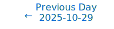
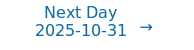

# Personalized Daily ArXiv Papers 2025-10-30

| *[gpt-5]*   | Prompt   | Completion   | Total   |
|:-----------:|:--------:|:------------:|:-------:|
| **Token**   | 37095    | 36561        | 73656   |
| **Cost**    | $0.05    | $0.37        | $0.41   |

Total arXiv papers: 519

Total scanned papers: 308

Total relevant papers: 25

**Table of contents with paper titles:**

1. [INT v.s. FP: A Comprehensive Study of Fine-Grained Low-bit Quantization Formats](#user-content-link1)
**Authors:** Mengzhao Chen, Meng Wu, Hui Jin, Zhihang Yuan, Jing Liu, Chaoyi Zhang, Yunshui Li, Jie Huang, Jin Ma, Zeyue Xue, Zhiheng Liu, Xingyan Bin, Ping Luo

2. [Ming-Flash-Omni: A Sparse, Unified Architecture for Multimodal Perception and Generation](#user-content-link2)
**Authors:** Inclusion AI, :, Bowen Ma, Cheng Zou, Canxiang Yan, Chunxiang Jin, Chunjie Shen, Dandan Zheng, Fudong Wang, Furong Xu, GuangMing Yao, Jun Zhou, Jingdong Chen, Jianing Li, Jianxin Sun, Jiajia Liu, Jianjiang Zhu, Jianping Jiang, Jun Peng, Kaixiang Ji, Kaimeng Ren, Libin Wang, Lixiang Ru, Longhua Tan, Lan Wang, Mochen Bai, Ning Gao, Qingpei Guo, Qinglong Zhang, Qiang Xu, Rui Liu, Ruijie Xiong, Ruobing Zheng, Sirui Gao, Tianqi Li, Tinghao Liu, Weilong Chai, Xinyu Xiao, Xiaomei Wang, Xiaolong Wang, Xiao Lu, Xiaoyu Li, Xingning Dong, Xuzheng Yu, Yi Yuan, Yuting Gao, Yuting Xiao, Yunxiao Sun, Yipeng Chen, Yifan Mao, Yifei Wu, Yongjie Lyu, Ziping Ma, Zhiqiang Fang, Zhihao Qiu, Ziyuan Huang, Zizheng Yang, Zhengyu He

3. [CDFlow: Building Invertible Layers with Circulant and Diagonal Matrices](#user-content-link3)
**Authors:** Xuchen Feng, Siyu Liao

4. [How Data Mixing Shapes In-Context Learning: Asymptotic Equivalence for Transformers with MLPs](#user-content-link4)
**Authors:** Samet Demir, Zafer Dogan

5. [Transformers Provably Learn Directed Acyclic Graphs via Kernel-Guided Mutual Information](#user-content-link5)
**Authors:** Yuan Cheng, Yu Huang, Zhe Xiong, Yingbin Liang, Vincent Y. F. Tan

6. [Sequences of Logits Reveal the Low Rank Structure of Language Models](#user-content-link6)
**Authors:** Noah Golowich, Allen Liu, Abhishek Shetty

7. [The Neural Differential Manifold: An Architecture with Explicit Geometric Structure](#user-content-link7)
**Authors:** Di Zhang

8. [Spectral Perturbation Bounds for Low-Rank Approximation with Applications to Privacy](#user-content-link8)
**Authors:** Phuc Tran, Nisheeth K. Vishnoi, Van H. Vu

9. [IBNorm: Information-Bottleneck Inspired Normalization for Representation Learning](#user-content-link9)
**Authors:** Xiandong Zou, Pan Zhou

10. [Feedback Alignment Meets Low-Rank Manifolds: A Structured Recipe for Local Learning](#user-content-link10)
**Authors:** Arani Roy, Marco P. Apolinario, Shristi Das Biswas, Kaushik Roy

11. [Emergence of Minimal Circuits for Indirect Object Identification in Attention-Only Transformers](#user-content-link11)
**Authors:** Rabin Adhikari

12. [From Linear to Nonlinear: Provable Weak-to-Strong Generalization through Feature Learning](#user-content-link12)
**Authors:** Junsoo Oh, Jerry Song, Chulhee Yun

13. [A Deep Learning Framework for Multi-Operator Learning: Architectures and Approximation Theory](#user-content-link13)
**Authors:** Adrien Weihs, Jingmin Sun, Zecheng Zhang, Hayden Schaeffer

14. [Training Across Reservoirs: Using Numerical Differentiation To Couple Trainable Networks With Black-Box Reservoirs](#user-content-link14)
**Authors:** Andrew Clark, Jack Moursounidis, Osmaan Rasouli, William Gan, Cooper Doyle, Anna Leontjeva

15. [Nonlinear Dynamics In Optimization Landscape of Shallow Neural Networks with Tunable Leaky ReLU](#user-content-link15)
**Authors:** Jingzhou Liu

16. [Mechanistic Interpretability of RNNs emulating Hidden Markov Models](#user-content-link16)
**Authors:** Elia Torre, Michele Viscione, Lucas Pompe, Benjamin F Grewe, Valerio Mante

17. [BSFA: Leveraging the Subspace Dichotomy to Accelerate Neural Network Training](#user-content-link17)
**Authors:** Wenjie Zhou, Bohan Wang, Wei Chen, Xueqi Cheng

18. [Can Aha Moments Be Fake? Identifying True and Decorative Thinking Steps in Chain-of-Thought](#user-content-link18)
**Authors:** Jiachen Zhao, Yiyou Sun, Weiyan Shi, Dawn Song

19. [Lipschitz-aware Linearity Grafting for Certified Robustness](#user-content-link19)
**Authors:** Yongjin Han, Suhyun Kim

20. [Are Language Models Efficient Reasoners? A Perspective from Logic Programming](#user-content-link20)
**Authors:** Andreas Opedal, Yanick Zengaffinen, Haruki Shirakami, Clemente Pasti, Mrinmaya Sachan, Abulhair Saparov, Ryan Cotterell, Bernhard Sch\"olkopf

21. [Resource-Efficient and Robust Inference of Deep and Bayesian Neural Networks on Embedded and Analog Computing Platforms](#user-content-link21)
**Authors:** Bernhard Klein

22. [Confidence is Not Competence](#user-content-link22)
**Authors:** Debdeep Sanyal, Manya Pandey, Dhruv Kumar, Saurabh Deshpande, Murari Mandal

23. [Continual Low-Rank Adapters for LLM-based Generative Recommender Systems](#user-content-link23)
**Authors:** Hyunsik Yoo, Ting-Wei Li, SeongKu Kang, Zhining Liu, Charlie Xu, Qilin Qi, Hanghang Tong

24. [What Really Matters in Matrix-Whitening Optimizers?](#user-content-link24)
**Authors:** Kevin Frans, Pieter Abbeel, Sergey Levine

25. [TempoPFN: Synthetic Pre-training of Linear RNNs for Zero-shot Time Series Forecasting](#user-content-link25)
**Authors:** Vladyslav Moroshan, Julien Siems, Arber Zela, Timur Carstensen, Frank Hutter

---

## 1. [INT v.s. FP: A Comprehensive Study of Fine-Grained Low-bit Quantization Formats](https://arxiv.org/abs/2510.25602) 

**ArXiv ID:** 2510.25602

**Authors:** Mengzhao Chen, Meng Wu, Hui Jin, Zhihang Yuan, Jing Liu, Chaoyi Zhang, Yunshui Li, Jie Huang, Jin Ma, Zeyue Xue, Zhiheng Liu, Xingyan Bin, Ping Luo

**Abstract:** Modern AI hardware, such as Nvidia's Blackwell architecture, is increasingly embracing low-precision floating-point (FP) formats to handle the pervasive activation outliers in Large Language Models (LLMs). Despite this industry trend, a unified comparison of FP and integer (INT) quantization across varying granularities has been missing, leaving algorithm and hardware co-design without clear guidance. This paper fills that gap by systematically investigating the trade-offs between FP and INT formats. We reveal a critical performance crossover: while FP excels in coarse-grained quantization, the comparison at fine-grained (block-wise) levels is more nuanced. Our comprehensive comparison demonstrates that for popular 8-bit fine-grained formats (e.g., MX with block size 32), MXINT8 is superior to its FP counterpart in both algorithmic accuracy and hardware efficiency. However, for 4-bit formats, FP (e.g., MXFP4, NVFP4) often holds an accuracy advantage , though we show that NVINT4 can surpass NVFP4 when outlier-mitigation techniques like Hadamard rotation are applied. We also introduce a symmetric clipping method that resolves gradient bias in fine-grained low-bit INT training, enabling nearly lossless performance for MXINT8 training. These findings challenge the current hardware trajectory, demonstrating that a one-size-fits-all FP approach is suboptimal and advocating that fine-grained INT formats, particularly MXINT8, offer a better balance of accuracy, power, and efficiency for future AI accelerators.

**Comment:** Compression/Efficiency: comprehensive study of low-bit quantization formats (INT vs FP) at fine-grained levels with new training method for MXINT8.

**Relevance:** 10
**Novelty:** 8

---

## 2. [Ming-Flash-Omni: A Sparse, Unified Architecture for Multimodal Perception and Generation](https://arxiv.org/abs/2510.24821) 

**ArXiv ID:** 2510.24821

**Authors:** Inclusion AI, :, Bowen Ma, Cheng Zou, Canxiang Yan, Chunxiang Jin, Chunjie Shen, Dandan Zheng, Fudong Wang, Furong Xu, GuangMing Yao, Jun Zhou, Jingdong Chen, Jianing Li, Jianxin Sun, Jiajia Liu, Jianjiang Zhu, Jianping Jiang, Jun Peng, Kaixiang Ji, Kaimeng Ren, Libin Wang, Lixiang Ru, Longhua Tan, Lan Wang, Mochen Bai, Ning Gao, Qingpei Guo, Qinglong Zhang, Qiang Xu, Rui Liu, Ruijie Xiong, Ruobing Zheng, Sirui Gao, Tianqi Li, Tinghao Liu, Weilong Chai, Xinyu Xiao, Xiaomei Wang, Xiaolong Wang, Xiao Lu, Xiaoyu Li, Xingning Dong, Xuzheng Yu, Yi Yuan, Yuting Gao, Yuting Xiao, Yunxiao Sun, Yipeng Chen, Yifan Mao, Yifei Wu, Yongjie Lyu, Ziping Ma, Zhiqiang Fang, Zhihao Qiu, Ziyuan Huang, Zizheng Yang, Zhengyu He

**Abstract:** We propose Ming-Flash-Omni, an upgraded version of Ming-Omni, built upon a sparser Mixture-of-Experts (MoE) variant of Ling-Flash-2.0 with 100 billion total parameters, of which only 6.1 billion are active per token. This architecture enables highly efficient scaling (dramatically improving computational efficiency while significantly expanding model capacity) and empowers stronger unified multimodal intelligence across vision, speech, and language, representing a key step toward Artificial General Intelligence (AGI). Compared to its predecessor, the upgraded version exhibits substantial improvements across multimodal understanding and generation. We significantly advance speech recognition capabilities, achieving state-of-the-art performance in contextual ASR and highly competitive results in dialect-aware ASR. In image generation, Ming-Flash-Omni introduces high-fidelity text rendering and demonstrates marked gains in scene consistency and identity preservation during image editing. Furthermore, Ming-Flash-Omni introduces generative segmentation, a capability that not only achieves strong standalone segmentation performance but also enhances spatial control in image generation and improves editing consistency. Notably, Ming-Flash-Omni achieves state-of-the-art results in text-to-image generation and generative segmentation, and sets new records on all 12 contextual ASR benchmarks, all within a single unified architecture.

**Comment:** Model Architecture: sparse Mixture-of-Experts (MoE) unified multimodal model with only 6.1B active parameters per token.

**Relevance:** 10
**Novelty:** 7

---

## 3. [CDFlow: Building Invertible Layers with Circulant and Diagonal Matrices](https://arxiv.org/abs/2510.25323) 

**ArXiv ID:** 2510.25323

**Authors:** Xuchen Feng, Siyu Liao

**Abstract:** Normalizing flows are deep generative models that enable efficient likelihood estimation and sampling through invertible transformations. A key challenge is to design linear layers that enhance expressiveness while maintaining efficient computation of the Jacobian determinant and inverse. We introduce a novel invertible linear layer based on the product of circulant and diagonal matrices. This decomposition reduces parameter complexity from $\mathcal{O}(n^2)$ to $\mathcal{O}(mn)$ using $m$ diagonal matrices and $m-1$ circulant matrices while still approximating general linear transformations. By leveraging the Fast Fourier Transform, our approach reduces the time complexity of matrix inversion from $\mathcal{O}(n^3)$ to $\mathcal{O}(mn\log n)$ and that of computing the log-determinant from $\mathcal{O}(n^3)$ to $\mathcal{O}(mn)$, where $n$ is the input dimension. We build upon this layer to develop Circulant-Diagonal Flow (CDFlow), which achieves strong density estimation on natural image datasets and effectively models data with inherent periodic structure. Furthermore, CDFlow significantly accelerates key operations in normalizing flows, providing practical benefits for scalable generative modeling.

**Comment:** Model Architecture and Efficiency: introduces invertible linear layers via circulant–diagonal decomposition with FFT, reducing parameters and log-det/inversion cost for normalizing flows.

**Relevance:** 9
**Novelty:** 8

---

## 4. [How Data Mixing Shapes In-Context Learning: Asymptotic Equivalence for Transformers with MLPs](https://arxiv.org/abs/2510.25753) 

**ArXiv ID:** 2510.25753

**Authors:** Samet Demir, Zafer Dogan

**Abstract:** Pretrained Transformers demonstrate remarkable in-context learning (ICL) capabilities, enabling them to adapt to new tasks from demonstrations without parameter updates. However, theoretical studies often rely on simplified architectures (e.g., omitting MLPs), data models (e.g., linear regression with isotropic inputs), and single-source training, limiting their relevance to realistic settings. In this work, we study ICL in pretrained Transformers with nonlinear MLP heads on nonlinear tasks drawn from multiple data sources with heterogeneous input, task, and noise distributions. We analyze a model where the MLP comprises two layers, with the first layer trained via a single gradient step and the second layer fully optimized. Under high-dimensional asymptotics, we prove that such models are equivalent in ICL error to structured polynomial predictors, leveraging results from the theory of Gaussian universality and orthogonal polynomials. This equivalence reveals that nonlinear MLPs meaningfully enhance ICL performance, particularly on nonlinear tasks, compared to linear baselines. It also enables a precise analysis of data mixing effects: we identify key properties of high-quality data sources (low noise, structured covariances) and show that feature learning emerges only when the task covariance exhibits sufficient structure. These results are validated empirically across various activation functions, model sizes, and data distributions. Finally, we experiment with a real-world scenario involving multilingual sentiment analysis where each language is treated as a different source. Our experimental results for this case exemplify how our findings extend to real-world cases. Overall, our work advances the theoretical foundations of ICL in Transformers and provides actionable insight into the role of architecture and data in ICL.

**Comment:** Strongly matches architecture/representation learning criteria with theoretical analysis of ICL in Transformers including nonlinear MLP heads and multi-source data mixing.

**Relevance:** 9
**Novelty:** 8

---

## 5. [Transformers Provably Learn Directed Acyclic Graphs via Kernel-Guided Mutual Information](https://arxiv.org/abs/2510.25542) 

**ArXiv ID:** 2510.25542

**Authors:** Yuan Cheng, Yu Huang, Zhe Xiong, Yingbin Liang, Vincent Y. F. Tan

**Abstract:** Uncovering hidden graph structures underlying real-world data is a critical challenge with broad applications across scientific domains. Recently, transformer-based models leveraging the attention mechanism have demonstrated strong empirical success in capturing complex dependencies within graphs. However, the theoretical understanding of their training dynamics has been limited to tree-like graphs, where each node depends on a single parent. Extending provable guarantees to more general directed acyclic graphs (DAGs) -- which involve multiple parents per node -- remains challenging, primarily due to the difficulty in designing training objectives that enable different attention heads to separately learn multiple different parent relationships.   In this work, we address this problem by introducing a novel information-theoretic metric: the kernel-guided mutual information (KG-MI), based on the $f$-divergence. Our objective combines KG-MI with a multi-head attention framework, where each head is associated with a distinct marginal transition kernel to model diverse parent-child dependencies effectively. We prove that, given sequences generated by a $K$-parent DAG, training a single-layer, multi-head transformer via gradient ascent converges to the global optimum in polynomial time. Furthermore, we characterize the attention score patterns at convergence. In addition, when particularizing the $f$-divergence to the KL divergence, the learned attention scores accurately reflect the ground-truth adjacency matrix, thereby provably recovering the underlying graph structure. Experimental results validate our theoretical findings.

**Comment:** Strongly matches architecture/theory criteria by proving multi-head Transformers learn DAG structure via a kernel-guided mutual information objective.

**Relevance:** 9
**Novelty:** 8

---

## 6. [Sequences of Logits Reveal the Low Rank Structure of Language Models](https://arxiv.org/abs/2510.24966) 

**ArXiv ID:** 2510.24966

**Authors:** Noah Golowich, Allen Liu, Abhishek Shetty

**Abstract:** A major problem in the study of large language models is to understand their inherent low-dimensional structure. We introduce an approach to study the low-dimensional structure of language models at a model-agnostic level: as sequential probabilistic models. We first empirically demonstrate that a wide range of modern language models exhibit low-rank structure: in particular, matrices built from the model's logits for varying sets of prompts and responses have low approximate rank. We then show that this low-rank structure can be leveraged for generation -- in particular, we can generate a response to a target prompt using a linear combination of the model's outputs on unrelated, or even nonsensical prompts.   On the theoretical front, we observe that studying the approximate rank of language models in the sense discussed above yields a simple universal abstraction whose theoretical predictions parallel our experiments. We then analyze the representation power of the abstraction and give provable learning guarantees.

**Comment:** Representation Learning + Compression/Efficiency: demonstrates and exploits low-rank structure in LM logits with a model-agnostic abstraction and theory.

**Relevance:** 9
**Novelty:** 8

---

## 7. [The Neural Differential Manifold: An Architecture with Explicit Geometric Structure](https://arxiv.org/abs/2510.25113) 

**ArXiv ID:** 2510.25113

**Authors:** Di Zhang

**Abstract:** This paper introduces the Neural Differential Manifold (NDM), a novel neural network architecture that explicitly incorporates geometric structure into its fundamental design. Departing from conventional Euclidean parameter spaces, the NDM re-conceptualizes a neural network as a differentiable manifold where each layer functions as a local coordinate chart, and the network parameters directly parameterize a Riemannian metric tensor at every point. The architecture is organized into three synergistic layers: a Coordinate Layer implementing smooth chart transitions via invertible transformations inspired by normalizing flows, a Geometric Layer that dynamically generates the manifold's metric through auxiliary sub-networks, and an Evolution Layer that optimizes both task performance and geometric simplicity through a dual-objective loss function. This geometric regularization penalizes excessive curvature and volume distortion, providing intrinsic regularization that enhances generalization and robustness. The framework enables natural gradient descent optimization aligned with the learned manifold geometry and offers unprecedented interpretability by endowing internal representations with clear geometric meaning. We analyze the theoretical advantages of this approach, including its potential for more efficient optimization, enhanced continual learning, and applications in scientific discovery and controllable generative modeling. While significant computational challenges remain, the Neural Differential Manifold represents a fundamental shift towards geometrically structured, interpretable, and efficient deep learning systems.

**Comment:** Model Architecture: proposes a neural architecture as a differentiable manifold with learned Riemannian metric and geometry-regularized optimization (natural-gradient aligned).

**Relevance:** 9
**Novelty:** 8

---

## 8. [Spectral Perturbation Bounds for Low-Rank Approximation with Applications to Privacy](https://arxiv.org/abs/2510.25670) 

**ArXiv ID:** 2510.25670

**Authors:** Phuc Tran, Nisheeth K. Vishnoi, Van H. Vu

**Abstract:** A central challenge in machine learning is to understand how noise or measurement errors affect low-rank approximations, particularly in the spectral norm. This question is especially important in differentially private low-rank approximation, where one aims to preserve the top-$p$ structure of a data-derived matrix while ensuring privacy. Prior work often analyzes Frobenius norm error or changes in reconstruction quality, but these metrics can over- or under-estimate true subspace distortion. The spectral norm, by contrast, captures worst-case directional error and provides the strongest utility guarantees. We establish new high-probability spectral-norm perturbation bounds for symmetric matrices that refine the classical Eckart--Young--Mirsky theorem and explicitly capture interactions between a matrix $A \in \mathbb{R}^{n \times n}$ and an arbitrary symmetric perturbation $E$. Under mild eigengap and norm conditions, our bounds yield sharp estimates for $\|(A + E)_p - A_p\|$, where $A_p$ is the best rank-$p$ approximation of $A$, with improvements of up to a factor of $\sqrt{n}$. As an application, we derive improved utility guarantees for differentially private PCA, resolving an open problem in the literature. Our analysis relies on a novel contour bootstrapping method from complex analysis and extends it to a broad class of spectral functionals, including polynomials and matrix exponentials. Empirical results on real-world datasets confirm that our bounds closely track the actual spectral error under diverse perturbation regimes.

**Comment:** Compression/Efficiency: new spectral-norm perturbation bounds for low-rank approximation, improving theoretical guarantees (e.g., DP-PCA utility).

**Relevance:** 8
**Novelty:** 9

---

## 9. [IBNorm: Information-Bottleneck Inspired Normalization for Representation Learning](https://arxiv.org/abs/2510.25262) 

**ArXiv ID:** 2510.25262

**Authors:** Xiandong Zou, Pan Zhou

**Abstract:** Normalization is fundamental to deep learning, but existing approaches such as BatchNorm, LayerNorm, and RMSNorm are variance-centric by enforcing zero mean and unit variance, stabilizing training without controlling how representations capture task-relevant information. We propose IB-Inspired Normalization (IBNorm), a simple yet powerful family of methods grounded in the Information Bottleneck principle. IBNorm introduces bounded compression operations that encourage embeddings to preserve predictive information while suppressing nuisance variability, yielding more informative representations while retaining the stability and compatibility of standard normalization. Theoretically, we prove that IBNorm achieves a higher IB value and tighter generalization bounds than variance-centric methods. Empirically, IBNorm consistently outperforms BatchNorm, LayerNorm, and RMSNorm across large-scale language models (LLaMA, GPT-2) and vision models (ResNet, ViT), with mutual information analysis confirming superior information bottleneck behavior. Code will be released publicly.

**Comment:** Model Architecture (Normalization) and Representation Learning: IB-inspired normalization controlling task-relevant information with theory on IB value and generalization.

**Relevance:** 9
**Novelty:** 7

---

## 10. [Feedback Alignment Meets Low-Rank Manifolds: A Structured Recipe for Local Learning](https://arxiv.org/abs/2510.25594) 

**ArXiv ID:** 2510.25594

**Authors:** Arani Roy, Marco P. Apolinario, Shristi Das Biswas, Kaushik Roy

**Abstract:** Training deep neural networks (DNNs) with backpropagation (BP) achieves state-of-the-art accuracy but requires global error propagation and full parameterization, leading to substantial memory and computational overhead. Direct Feedback Alignment (DFA) enables local, parallelizable updates with lower memory requirements but is limited by unstructured feedback and poor scalability in deeper architectures, specially convolutional neural networks. To address these limitations, we propose a structured local learning framework that operates directly on low-rank manifolds defined by the Singular Value Decomposition (SVD) of weight matrices. Each layer is trained in its decomposed form, with updates applied to the SVD components using a composite loss that integrates cross-entropy, subspace alignment, and orthogonality regularization. Feedback matrices are constructed to match the SVD structure, ensuring consistent alignment between forward and feedback pathways. Our method reduces the number of trainable parameters relative to the original DFA model, without relying on pruning or post hoc compression. Experiments on CIFAR-10, CIFAR-100, and ImageNet show that our method achieves accuracy comparable to that of BP. Ablation studies confirm the importance of each loss term in the low-rank setting. These results establish local learning on low-rank manifolds as a principled and scalable alternative to full-rank gradient-based training.

**Comment:** Compression/Efficiency and Architecture: structured local learning on low-rank manifolds (SVD) with aligned feedback, reducing parameters and avoiding BP while maintaining accuracy.

**Relevance:** 9
**Novelty:** 7

---

## 11. [Emergence of Minimal Circuits for Indirect Object Identification in Attention-Only Transformers](https://arxiv.org/abs/2510.25013) 

**ArXiv ID:** 2510.25013

**Authors:** Rabin Adhikari

**Abstract:** Mechanistic interpretability aims to reverse-engineer large language models (LLMs) into human-understandable computational circuits. However, the complexity of pretrained models often obscures the minimal mechanisms required for specific reasoning tasks. In this work, we train small, attention-only transformers from scratch on a symbolic version of the Indirect Object Identification (IOI) task -- a benchmark for studying coreference -- like reasoning in transformers. Surprisingly, a single-layer model with only two attention heads achieves perfect IOI accuracy, despite lacking MLPs and normalization layers. Through residual stream decomposition, spectral analysis, and embedding interventions, we find that the two heads specialize into additive and contrastive subcircuits that jointly implement IOI resolution. Furthermore, we show that a two-layer, one-head model achieves similar performance by composing information across layers through query-value interactions. These results demonstrate that task-specific training induces highly interpretable, minimal circuits, offering a controlled testbed for probing the computational foundations of transformer reasoning.

**Comment:** Strongly matches representation learning criterion via mechanistic interpretability of attention-only transformers and emergence of minimal circuits for IOI.

**Relevance:** 9
**Novelty:** 7

---

## 12. [From Linear to Nonlinear: Provable Weak-to-Strong Generalization through Feature Learning](https://arxiv.org/abs/2510.24812) 

**ArXiv ID:** 2510.24812

**Authors:** Junsoo Oh, Jerry Song, Chulhee Yun

**Abstract:** Weak-to-strong generalization refers to the phenomenon where a stronger model trained under supervision from a weaker one can outperform its teacher. While prior studies aim to explain this effect, most theoretical insights are limited to abstract frameworks or linear/random feature models. In this paper, we provide a formal analysis of weak-to-strong generalization from a linear CNN (weak) to a two-layer ReLU CNN (strong). We consider structured data composed of label-dependent signals of varying difficulty and label-independent noise, and analyze gradient descent dynamics when the strong model is trained on data labeled by the pretrained weak model. Our analysis identifies two regimes -- data-scarce and data-abundant -- based on the signal-to-noise characteristics of the dataset, and reveals distinct mechanisms of weak-to-strong generalization. In the data-scarce regime, generalization occurs via benign overfitting or fails via harmful overfitting, depending on the amount of data, and we characterize the transition boundary. In the data-abundant regime, generalization emerges in the early phase through label correction, but we observe that overtraining can subsequently degrade performance.

**Comment:** Matches representation learning criterion with a theoretical analysis of feature learning and training dynamics (weak-to-strong generalization) in CNNs.

**Relevance:** 8
**Novelty:** 8

---

## 13. [A Deep Learning Framework for Multi-Operator Learning: Architectures and Approximation Theory](https://arxiv.org/abs/2510.25379) 

**ArXiv ID:** 2510.25379

**Authors:** Adrien Weihs, Jingmin Sun, Zecheng Zhang, Hayden Schaeffer

**Abstract:** While many problems in machine learning focus on learning mappings between finite-dimensional spaces, scientific applications require approximating mappings between function spaces, i.e., operators. We study the problem of learning collections of operators and provide both theoretical and empirical advances. We distinguish between two regimes: (i) multiple operator learning, where a single network represents a continuum of operators parameterized by a parametric function, and (ii) learning several distinct single operators, where each operator is learned independently. For the multiple operator case, we introduce two new architectures, $\mathrm{MNO}$ and $\mathrm{MONet}$, and establish universal approximation results in three settings: continuous, integrable, or Lipschitz operators. For the latter, we further derive explicit scaling laws that quantify how the network size must grow to achieve a target approximation accuracy. For learning several single operators, we develop a framework for balancing architectural complexity across subnetworks and show how approximation order determines computational efficiency. Empirical experiments on parametric PDE benchmarks confirm the strong expressive power and efficiency of the proposed architectures. Overall, this work establishes a unified theoretical and practical foundation for scalable neural operator learning across multiple operators.

**Comment:** Matches model architecture and efficiency theory criteria with new multi-operator neural operator architectures (MNO/MONet) and explicit approximation/scaling laws.

**Relevance:** 8
**Novelty:** 8

---

## 14. [Training Across Reservoirs: Using Numerical Differentiation To Couple Trainable Networks With Black-Box Reservoirs](https://arxiv.org/abs/2510.25074) 

**ArXiv ID:** 2510.25074

**Authors:** Andrew Clark, Jack Moursounidis, Osmaan Rasouli, William Gan, Cooper Doyle, Anna Leontjeva

**Abstract:** We introduce Bounded Numerical Differentiation (BOND), a perturbative method for estimating partial derivatives across network structures with inaccessible computational graphs. BOND demonstrates improved accuracy and scalability from existing perturbative methods, enabling new explorations of trainable architectures that integrate black-box functions. We observe that these black-box functions, realized in our experiments as fixed, untrained networks, can enhance model performance without increasing the number of trainable parameters. This improvement is achieved without extensive optimization of the architecture or properties of the black-box function itself. Our findings highlight the potential of leveraging fixed, non-trainable modules to expand model capacity, suggesting a path toward combining analogue and digital devices as a mechanism for scaling networks.

**Comment:** Matches architecture/systems criteria by enabling training with black-box modules via Bounded Numerical Differentiation, supporting hybrid analogue–digital compositions.

**Relevance:** 8
**Novelty:** 8

---

## 15. [Nonlinear Dynamics In Optimization Landscape of Shallow Neural Networks with Tunable Leaky ReLU](https://arxiv.org/abs/2510.25060) 

**ArXiv ID:** 2510.25060

**Authors:** Jingzhou Liu

**Abstract:** In this work, we study the nonlinear dynamics of a shallow neural network trained with mean-squared loss and leaky ReLU activation. Under Gaussian inputs and equal layer width k, (1) we establish, based on the equivariant gradient degree, a theoretical framework, applicable to any number of neurons k>= 4, to detect bifurcation of critical points with associated symmetries from global minimum as leaky parameter $\alpha$ varies. Typically, our analysis reveals that a multi-mode degeneracy consistently occurs at the critical number 0, independent of k. (2) As a by-product, we further show that such bifurcations are width-independent, arise only for nonnegative $\alpha$ and that the global minimum undergoes no further symmetry-breaking instability throughout the engineering regime $\alpha$ in range (0,1). An explicit example with k=5 is presented to illustrate the framework and exhibit the resulting bifurcation together with their symmetries.

**Comment:** Representation Learning/Training Dynamics: theoretical bifurcation analysis of shallow networks with tunable leaky ReLU revealing symmetry-breaking and landscape structure.

**Relevance:** 8
**Novelty:** 7

---

## 16. [Mechanistic Interpretability of RNNs emulating Hidden Markov Models](https://arxiv.org/abs/2510.25674) 

**ArXiv ID:** 2510.25674

**Authors:** Elia Torre, Michele Viscione, Lucas Pompe, Benjamin F Grewe, Valerio Mante

**Abstract:** Recurrent neural networks (RNNs) provide a powerful approach in neuroscience to infer latent dynamics in neural populations and to generate hypotheses about the neural computations underlying behavior. However, past work has focused on relatively simple, input-driven, and largely deterministic behaviors - little is known about the mechanisms that would allow RNNs to generate the richer, spontaneous, and potentially stochastic behaviors observed in natural settings. Modeling with Hidden Markov Models (HMMs) has revealed a segmentation of natural behaviors into discrete latent states with stochastic transitions between them, a type of dynamics that may appear at odds with the continuous state spaces implemented by RNNs. Here we first show that RNNs can replicate HMM emission statistics and then reverse-engineer the trained networks to uncover the mechanisms they implement. In the absence of inputs, the activity of trained RNNs collapses towards a single fixed point. When driven by stochastic input, trajectories instead exhibit noise-sustained dynamics along closed orbits. Rotation along these orbits modulates the emission probabilities and is governed by transitions between regions of slow, noise-driven dynamics connected by fast, deterministic transitions. The trained RNNs develop highly structured connectivity, with a small set of "kick neurons" initiating transitions between these regions. This mechanism emerges during training as the network shifts into a regime of stochastic resonance, enabling it to perform probabilistic computations. Analyses across multiple HMM architectures - fully connected, cyclic, and linear-chain - reveal that this solution generalizes through the modular reuse of the same dynamical motif, suggesting a compositional principle by which RNNs can emulate complex discrete latent dynamics.

**Comment:** Representation Learning/Mechanistic Interpretability: reverse-engineers RNNs emulating HMMs, uncovering structured dynamics and connectivity enabling probabilistic computation.

**Relevance:** 8
**Novelty:** 7

---

## 17. [BSFA: Leveraging the Subspace Dichotomy to Accelerate Neural Network Training](https://arxiv.org/abs/2510.25244) 

**ArXiv ID:** 2510.25244

**Authors:** Wenjie Zhou, Bohan Wang, Wei Chen, Xueqi Cheng

**Abstract:** Recent studies \citep{gur2018gradient,song2024does, wen2024understanding} highlight a fundamental dichotomy in deep learning optimization: Although parameter updates along the top eigendirections of the loss Hessian (Dom-space) capture most of the update magnitude, they often contribute minimally to loss reduction. In contrast, updates in the orthogonal component (Bulk-space) have smaller magnitudes but drive most learning progress. In this work, we further advance the understanding of this phenomenon and introduce the \textbf{Bulk-Space-Filtration-Accelerator (BSFA)}, a novel plug-and-play framework. BSFA accelerates training by differentially scaling update components projected onto these distinct subspaces, simultaneously enhancing stability by moderating updates in the dominant subspace and boosting convergence speed by amplifying those in the bulk-space. To ensure BSFA is both practical and scalable for contemporary large models, we introduce two key innovations: an efficient estimator using Principal Component Analysis (PCA) on historical updates for fast subspace estimation, and a block-wise strategy that applies this estimation on a per-parameter-block basis. These designs make BSFA computationally tractable and highly effective. We demonstrate BSFA's acceleration across various tasks, notably achieving approximately 2$\times$ speedup when pre-training LLaMA-72M on WikiText-103 and LLaMA-134M on OpenWebText compared to vanilla AdamW.

**Comment:** Training Dynamics and Efficiency: exploits Hessian subspace dichotomy (Dom vs Bulk) with PCA-based projection and differential scaling to accelerate optimization.

**Relevance:** 8
**Novelty:** 7

---

## 18. [Can Aha Moments Be Fake? Identifying True and Decorative Thinking Steps in Chain-of-Thought](https://arxiv.org/abs/2510.24941) 

**ArXiv ID:** 2510.24941

**Authors:** Jiachen Zhao, Yiyou Sun, Weiyan Shi, Dawn Song

**Abstract:** Recent large language models (LLMs) can generate long Chain-of-Thought (CoT) at test time, enabling them to solve complex tasks. These reasoning steps in CoT are often assumed as a faithful reflection of the model's internal thinking process, and used to monitor unsafe intentions. However, we find many reasoning steps don't truly contribute to LLMs' prediction. We measure the step-wise causal influence of each reasoning step on the model's final prediction with a proposed True Thinking Score (TTS). We reveal that LLMs often interleave between true-thinking steps (which are genuinely used to produce the final output) and decorative-thinking steps (which only give the appearance of reasoning but have minimal causal impact). Notably, only a small subset of the total reasoning steps have a high TTS that causally drive the model's prediction: e.g., for the AIME dataset, only an average of 2.3% of reasoning steps in CoT have a TTS >= 0.7 (range: 0-1) under the Qwen-2.5 model. Furthermore, we identify a TrueThinking direction in the latent space of LLMs. By steering along or against this direction, we can force the model to perform or disregard certain CoT steps when computing the final result. Finally, we highlight that self-verification steps in CoT (i.e., aha moments) can also be decorative, where LLMs do not truly verify their solution. Steering along the TrueThinking direction can force internal reasoning over these steps, resulting in a change in the final results. Overall, our work reveals that LLMs often verbalize reasoning steps without actually performing them internally, which undermines both the efficiency of LLM reasoning and the trustworthiness of CoT.

**Comment:** Representation Learning: causal analysis of which CoT steps actually influence predictions; identifies and steers a latent 'TrueThinking' direction in LLM representation space.

**Relevance:** 8
**Novelty:** 7

---

## 19. [Lipschitz-aware Linearity Grafting for Certified Robustness](https://arxiv.org/abs/2510.25130) 

**ArXiv ID:** 2510.25130

**Authors:** Yongjin Han, Suhyun Kim

**Abstract:** Lipschitz constant is a fundamental property in certified robustness, as smaller values imply robustness to adversarial examples when a model is confident in its prediction. However, identifying the worst-case adversarial examples is known to be an NP-complete problem. Although over-approximation methods have shown success in neural network verification to address this challenge, reducing approximation errors remains a significant obstacle. Furthermore, these approximation errors hinder the ability to obtain tight local Lipschitz constants, which are crucial for certified robustness. Originally, grafting linearity into non-linear activation functions was proposed to reduce the number of unstable neurons, enabling scalable and complete verification. However, no prior theoretical analysis has explained how linearity grafting improves certified robustness. We instead consider linearity grafting primarily as a means of eliminating approximation errors rather than reducing the number of unstable neurons, since linear functions do not require relaxation. In this paper, we provide two theoretical contributions: 1) why linearity grafting improves certified robustness through the lens of the $l_\infty$ local Lipschitz constant, and 2) grafting linearity into non-linear activation functions, the dominant source of approximation errors, yields a tighter local Lipschitz constant. Based on these theoretical contributions, we propose a Lipschitz-aware linearity grafting method that removes dominant approximation errors, which are crucial for tightening the local Lipschitz constant, thereby improving certified robustness, even without certified training. Our extensive experiments demonstrate that grafting linearity into these influential activations tightens the $l_\infty$ local Lipschitz constant and enhances certified robustness.

**Comment:** Model Architecture/Robustness: theoretical analysis and method for grafting linearity to tighten local Lipschitz bounds and improve certified robustness.

**Relevance:** 8
**Novelty:** 7

---

## 20. [Are Language Models Efficient Reasoners? A Perspective from Logic Programming](https://arxiv.org/abs/2510.25626) 

**ArXiv ID:** 2510.25626

**Authors:** Andreas Opedal, Yanick Zengaffinen, Haruki Shirakami, Clemente Pasti, Mrinmaya Sachan, Abulhair Saparov, Ryan Cotterell, Bernhard Sch\"olkopf

**Abstract:** Modern language models (LMs) exhibit strong deductive reasoning capabilities, yet standard evaluations emphasize correctness while overlooking a key aspect of human-like reasoning: efficiency. In real-world reasoning scenarios, much of the available information is irrelevant, and effective deductive inference requires identifying and ignoring such distractions. We propose a framework for assessing LM reasoning efficiency through the lens of logic programming, introducing a simple method to align proofs written in natural language -- as generated by an LM -- with shortest proofs found by executing the logic program. Efficiency is quantified by measuring how well a model avoids unnecessary inference. Empirically, we construct a dataset of math word problems injected with various number of irrelevant axioms that vary in semantic overlap with the goal theorem. We find that current LMs show marked accuracy declines under such conditions -- even with minimal, domain-consistent distractions -- and the proofs they generate frequently exhibit detours through irrelevant inferences.

**Comment:** Representation Learning/Training Dynamics: framework measuring reasoning efficiency and aligning natural-language proofs with minimal logic-program proofs.

**Relevance:** 8
**Novelty:** 7

---

## 21. [Resource-Efficient and Robust Inference of Deep and Bayesian Neural Networks on Embedded and Analog Computing Platforms](https://arxiv.org/abs/2510.24951) 

**ArXiv ID:** 2510.24951

**Authors:** Bernhard Klein

**Abstract:** While modern machine learning has transformed numerous application domains, its growing computational demands increasingly constrain scalability and efficiency, particularly on embedded and resource-limited platforms. In practice, neural networks must not only operate efficiently but also provide reliable predictions under distributional shifts or unseen data. Bayesian neural networks offer a principled framework for quantifying uncertainty, yet their computational overhead further compounds these challenges.   This work advances resource-efficient and robust inference for both conventional and Bayesian neural networks through the joint pursuit of algorithmic and hardware efficiency. The former reduces computation through model compression and approximate Bayesian inference, while the latter optimizes deployment on digital accelerators and explores analog hardware, bridging algorithmic design and physical realization. The first contribution, Galen, performs automatic layer-specific compression guided by sensitivity analysis and hardware-in-the-loop feedback. Analog accelerators offer efficiency gains at the cost of noise; this work models device imperfections and extends noisy training to nonstationary conditions, improving robustness and stability. A second line of work advances probabilistic inference, developing analytic and ensemble approximations that replace costly sampling, integrate into a compiler stack, and optimize embedded inference. Finally, probabilistic photonic computing introduces a paradigm where controlled analog noise acts as an intrinsic entropy source, enabling fast, energy-efficient probabilistic inference directly in hardware.   Together, these studies demonstrate how efficiency and reliability can be advanced jointly through algorithm-hardware co-design, laying the foundation for the next generation of trustworthy, energy-efficient machine-learning systems.

**Comment:** Compression/Efficiency + Hardware co-design: automatic compression, approximate Bayesian inference, and analog accelerators for embedded inference.

**Relevance:** 8
**Novelty:** 7

---

## 22. [Confidence is Not Competence](https://arxiv.org/abs/2510.24772) 

**ArXiv ID:** 2510.24772

**Authors:** Debdeep Sanyal, Manya Pandey, Dhruv Kumar, Saurabh Deshpande, Murari Mandal

**Abstract:** Large language models (LLMs) often exhibit a puzzling disconnect between their asserted confidence and actual problem-solving competence. We offer a mechanistic account of this decoupling by analyzing the geometry of internal states across two phases - pre-generative assessment and solution execution. A simple linear probe decodes the internal "solvability belief" of a model, revealing a well-ordered belief axis that generalizes across model families and across math, code, planning, and logic tasks. Yet, the geometries diverge - although belief is linearly decodable, the assessment manifold has high linear effective dimensionality as measured from the principal components, while the subsequent reasoning trace evolves on a much lower-dimensional manifold. This sharp reduction in geometric complexity from thought to action mechanistically explains the confidence-competence gap. Causal interventions that steer representations along the belief axis leave final solutions unchanged, indicating that linear nudges in the complex assessment space do not control the constrained dynamics of execution. We thus uncover a two-system architecture - a geometrically complex assessor feeding a geometrically simple executor. These results challenge the assumption that decodable beliefs are actionable levers, instead arguing for interventions that target the procedural dynamics of execution rather than the high-level geometry of assessment.

**Comment:** Representation Learning: geometric analysis of LLM internal states revealing separable assessment/execution manifolds.

**Relevance:** 8
**Novelty:** 7

---

## 23. [Continual Low-Rank Adapters for LLM-based Generative Recommender Systems](https://arxiv.org/abs/2510.25093) 

**ArXiv ID:** 2510.25093

**Authors:** Hyunsik Yoo, Ting-Wei Li, SeongKu Kang, Zhining Liu, Charlie Xu, Qilin Qi, Hanghang Tong

**Abstract:** While large language models (LLMs) achieve strong performance in recommendation, they face challenges in continual learning as users, items, and user preferences evolve over time. Existing LoRA-based continual methods primarily focus on preserving performance on previous tasks, but this overlooks the unique nature of recommendation: the goal is not to predict past preferences, and outdated preferences can even harm performance when current interests shift significantly. To address this, we propose PESO (Proximally rEgularized Single evolving lOra, a continual adaptation method for LoRA in recommendation. PESO introduces a proximal regularizer that anchors the current adapter to its most recent frozen state, enabling the model to flexibly balance adaptation and preservation, and to better capture recent user behaviors. Theoretically, we show that this proximal design provides data-aware, direction-wise guidance in the LoRA subspace. Empirically, PESO consistently outperforms existing LoRA-based continual learning methods.

**Comment:** Compression/Efficiency: low-rank adapters (LoRA) with proximal regularization for continual adaptation.

**Relevance:** 8
**Novelty:** 7

---

## 24. [What Really Matters in Matrix-Whitening Optimizers?](https://arxiv.org/abs/2510.25000) 

**ArXiv ID:** 2510.25000

**Authors:** Kevin Frans, Pieter Abbeel, Sergey Levine

**Abstract:** A range of recent optimizers have emerged that approximate the same "matrix-whitening" transformation in various ways. In this work, we systematically deconstruct such optimizers, aiming to disentangle the key components that explain performance. Across tuned hyperparameters across the board, all flavors of matrix-whitening methods reliably outperform elementwise counterparts, such as Adam. Matrix-whitening is often related to spectral descent -- however, experiments reveal that performance gains are *not explained solely by accurate spectral normalization* -- particularly, SOAP displays the largest per-step gain, even though Muon more accurately descends along the steepest spectral descent direction. Instead, we argue that matrix-whitening serves two purposes, and the variance adaptation component of matrix-whitening is the overlooked ingredient explaining this performance gap. Experiments show that variance-adapted versions of optimizers consistently outperform their sign-descent counterparts, including an adaptive version of Muon. We further ablate variance adaptation strategies, finding that while lookahead style approximations are not as effective, low-rank variance estimators can effectively reduce memory costs without a performance loss.

**Comment:** Training Dynamics/Optimization: analysis of matrix-whitening vs spectral descent; identifies variance adaptation as key ingredient with low-rank estimators.

**Relevance:** 8
**Novelty:** 7

---

## 25. [TempoPFN: Synthetic Pre-training of Linear RNNs for Zero-shot Time Series Forecasting](https://arxiv.org/abs/2510.25502) 

**ArXiv ID:** 2510.25502

**Authors:** Vladyslav Moroshan, Julien Siems, Arber Zela, Timur Carstensen, Frank Hutter

**Abstract:** Foundation models for zero-shot time series forecasting face challenges in efficient long-horizon prediction and reproducibility, with existing synthetic-only approaches underperforming on challenging benchmarks. This paper presents TempoPFN, a univariate time series foundation model based on linear Recurrent Neural Networks (RNNs) pre-trained exclusively on synthetic data. The model uses a GatedDeltaProduct architecture with state-weaving for fully parallelizable training across sequence lengths, eliminating the need for windowing or summarization techniques while maintaining robust temporal state-tracking. Our comprehensive synthetic data pipeline unifies diverse generators, including stochastic differential equations, Gaussian processes, and audio synthesis, with novel augmentations. In zero-shot evaluations on the Gift-Eval benchmark, TempoPFN achieves top-tier competitive performance, outperforming all existing synthetic-only approaches and surpassing the vast majority of models trained on real-world data, while being more efficient than existing baselines by leveraging fully parallelizable training and inference. We open-source our complete data generation pipeline and training code, providing a reproducible foundation for future research.

**Comment:** Model Architecture/Efficiency: linear RNN (GatedDeltaProduct) pre-trained synthetically with fully parallelizable training/inference.

**Relevance:** 8
**Novelty:** 7

---

# Paper Selection Prompt

## System Prompt

> You are a helpful paper reading assistant whose job is to read daily posts from ArXiv and identify a few papers that your friend will enjoy reading.
> Your job is to carefully read the paper titles and abstracts below and find the ones that match the criteria below.

## User Prompt

> ## Instructions
> 
> Write the response in JSONL format with {ARXIVID, COMMENT, RELEVANCE, NOVELTY} on each line, one for each paper.
> 
> - ARXIVID: should be the ArXiv ID.
> - COMMENT: should identify whether there is a criteria that match the paper very closely. These matches should not be based on general terms like "language modeling" or "advancements" and should specifically refer to a criterion. No need to mention the non-matching criteria.
> - RELEVANCE: should be a score from 1-10.
> - NOVELTY: should be a score from 1-10.
> 
> ## Scoring Criteria
> 
> > The "Relevance" score measures how closely the paper aligns with the core topics of the prompt.
> > The "Novelty" score assesses the originality and impact of the paper.
> > They are two **ORTHONORMAL** axes and **SHOULD NOT** be confused with each other.
> 
> ### Relevance Scoring
> 
> - Relevance 9-10 (Completely Relevant)
>   - Focus: Fully aligned with core topics with no deviation, score the highest if contains relevant keywords in it.
>   - Examples: Papers focused on foundational methods or theoretical research, whose titles contain topic keywords like "MoE".
> 
> - Relevance 7-8 (Relevant)
>   - Focus: Retain a solid link to the main research area, though may touch on peripheral elements.
>   - Examples: Papers research on the fundamental part of MoE through a less critical aspect like its behavior in GNN.
> 
> - Relevance 5-6 (Borderline)
>   - Focus: Maintains a link to the core topic but also extends into at least one other domain/area beyond the primary focus.
>   - Examples: Work referencing MoE centered on reinforcement learning.
> 
> - Relevance 3-4 (Irrelevant)
>   - Focus: Largely outside our interests with no association to our topics.
>   - Examples: Application-focused papers like using MoE to solve a problem in the real world.
> 
> - Relevance 1-2 (Ignore)
>   - Focus: Purely unrelated to our topics. Completely a different domain.
>   - **Exception**: If the paper hints at a cutting-edge, radically new direction that could eventually transform the primary domain, consider a score of 9–10 despite initial appearances. (Usually a very rare concept that belongs to the fundamental research)
> 
> ### Novelty Scoring
> 
> - Novelty 9-10 (Breakthrough)
>   - Definition: Groundbreaking methods/theory introducing new directions or solving major challenges.
>   - Examples: Entirely new paradigm for foundational models; a novel theory transforming representation learning.
> 
> - Novelty 7-8 (Improvements)
>   - Definition: Substantial insights/enhancements, though not a full paradigm shift.
>   - Examples: Modifications on existing methods yielding significantly better results.
> 
> - Novelty 5-6 (Borderline)
>   - Definition: Incremental contributions with possible long-term benefits, not immediately transformative.
>   - Examples: Moderately novel extension to an existing architecture; refining current methods without fundamentally altering them.
> 
> - Novelty 3-4 (Tangential)
>   - Definition: Minor or domain-specific improvements with limited broader impact.
>   - Examples: Slight modifications to known methods with strange motivation; purely engineering jobs like a new benchmark/dataset.
> 
> - Novelty 1-2 (Low)
>   - Definition: Minimal originality, applying standard approaches without real innovation.
>   - Examples: Using an off-the-shelf model without adding new insights; purely application-driven studies like finetuning a pretrained model using existing methods.
> 
> ## Papers
> 
> [PAPER LIST HERE]
> 
> ## Relevant Topics
> 
> Use the following relevance criteria to focus on foundational research. Keep **relevant** papers and filter out **irrelevant** ones. Avoid purely **application-driven** work.
> 
> 1. Model Architecture
>    - Relevant: Mixture-of-Experts (MoE), Transformers, Conditional/Dynamic Networks, Autoencoders, analysis/innovations on existing architectures.
>    - Irrelevant: Merely using existing architectures for a certain task without insights into the structure themselves.
> 
> 2. Model Compression and Efficiency
>    - Relevant: Sparsity, pruning, quantization, low-rank approaches, cache, or other algorithmic/theoretical efficiency breakthroughs.
>    - Irrelevant: Straightforward applications of existing compression methods to new tasks.
> 
> 3. High Performance Computing
>    - Relevant: Algorithmic or systems-level innovations enabling training of large-scale models, distributed training techniques, memory optimization.
>    - Irrelevant: Incremental engineering improvements without novel algorithmic contributions.
> 
> 4. Representation Learning
>    - Relevant: Insights into how deep networks encode information, feature/dictionary learning, sparse/contrastive methods, training dynamics in neural networks.
>    - Irrelevant: Standard applications of known techniques lacking new theoretical or methodological contributions.
> 
> **Keywords:**
> 
> - Relevant: Mixture of Experts (MoE), Representation Learning, Compression/Efficiency, Sparse/Sparsity, Pruning, Quantization, Low-rank, Foundation Model, etc.
> - Irrelevant: Reinforcement Learning, Transfer Learning, Federated Learning, Online Learning, Diffusion Models, etc.
> - Application: Image Segmentation, Medical Imaging, 3D Vision, Video Understanding, Information Retrieval, Summarization, Recommendation Systems, Machine Translation, Speech Recognition, Signal Processing, Spatial/Temporal Modeling, Time Series, Knowledge Graph, etc.