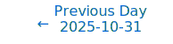
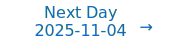

# Personalized Daily ArXiv Papers 2025-11-03

| *[gpt-5]*   | Prompt   | Completion   | Total   |
|:-----------:|:--------:|:------------:|:-------:|
| **Token**   | 30320    | 34670        | 64990   |
| **Cost**    | $0.04    | $0.35        | $0.38   |

Total arXiv papers: 486

Total scanned papers: 271

Total relevant papers: 15

**Table of contents with paper titles:**

1. [Continuous Autoregressive Language Models](#user-content-link1)
**Authors:** Chenze Shao, Darren Li, Fandong Meng, Jie Zhou

2. [Mixture-of-Transformers Learn Faster: A Theoretical Study on Classification Problems](#user-content-link2)
**Authors:** Hongbo Li, Qinhang Wu, Sen Lin, Yingbin Liang, Ness B. Shroff

3. [Higher-order Linear Attention](#user-content-link3)
**Authors:** Yifan Zhang, Zhen Qin, Quanquan Gu

4. [TetraJet-v2: Accurate NVFP4 Training for Large Language Models with Oscillation Suppression and Outlier Control](#user-content-link4)
**Authors:** Yuxiang Chen, Xiaoming Xu, Pengle Zhang, Michael Beyer, Martin Rapp, Jun Zhu, Jianfei Chen

5. [Quantitative Bounds for Length Generalization in Transformers](#user-content-link5)
**Authors:** Zachary Izzo, Eshaan Nichani, Jason D. Lee

6. [FPS: Feedforward-based Parameter Selection For Efficient Fine-Tuning](#user-content-link6)
**Authors:** Kenneth Yang, Wen-Li Wei, Jen-Chun Lin

7. [SpecAttn: Speculating Sparse Attention](#user-content-link7)
**Authors:** Harsh Shah

8. [Panprediction: Optimal Predictions for Any Downstream Task and Loss](#user-content-link8)
**Authors:** Sivaraman Balakrishnan, Nika Haghtalab, Daniel Hsu, Brian Lee, Eric Zhao

9. [CAS-Spec: Cascade Adaptive Self-Speculative Decoding for On-the-Fly Lossless Inference Acceleration of LLMs](#user-content-link9)
**Authors:** Zhiyuan Ning, Jiawei Shao, Ruge Xu, Xinfei Guo, Jun Zhang, Chi Zhang, Xuelong Li

10. [Soft Task-Aware Routing of Experts for Equivariant Representation Learning](#user-content-link10)
**Authors:** Jaebyeong Jeon, Hyeonseo Jang, Jy-yong Sohn, Kibok Lee

11. [Elastic Architecture Search for Efficient Language Models](#user-content-link11)
**Authors:** Shang Wang

12. [Information-Theoretic Greedy Layer-wise Training for Traffic Sign Recognition](#user-content-link12)
**Authors:** Shuyan Lyu, Zhanzimo Wu, Junliang Du

13. [Category-Aware Semantic Caching for Heterogeneous LLM Workloads](#user-content-link13)
**Authors:** Chen Wang, Xunzhuo Liu, Yue Zhu, Alaa Youssef, Priya Nagpurkar, Huamin Chen

14. [Atlas-Alignment: Making Interpretability Transferable Across Language Models](#user-content-link14)
**Authors:** Bruno Puri, Jim Berend, Sebastian Lapuschkin, Wojciech Samek

15. [Feature-Function Curvature Analysis: A Geometric Framework for Explaining Differentiable Models](#user-content-link15)
**Authors:** Hamed Najafi, Dongsheng Luo, Jason Liu

---

## 1. [Continuous Autoregressive Language Models](https://arxiv.org/abs/2510.27688) 

**ArXiv ID:** 2510.27688

**Authors:** Chenze Shao, Darren Li, Fandong Meng, Jie Zhou

**Abstract:** The efficiency of large language models (LLMs) is fundamentally limited by their sequential, token-by-token generation process. We argue that overcoming this bottleneck requires a new design axis for LLM scaling: increasing the semantic bandwidth of each generative step. To this end, we introduce Continuous Autoregressive Language Models (CALM), a paradigm shift from discrete next-token prediction to continuous next-vector prediction. CALM uses a high-fidelity autoencoder to compress a chunk of K tokens into a single continuous vector, from which the original tokens can be reconstructed with over 99.9\% accuracy. This allows us to model language as a sequence of continuous vectors instead of discrete tokens, which reduces the number of generative steps by a factor of K. The paradigm shift necessitates a new modeling toolkit; therefore, we develop a comprehensive likelihood-free framework that enables robust training, evaluation, and controllable sampling in the continuous domain. Experiments show that CALM significantly improves the performance-compute trade-off, achieving the performance of strong discrete baselines at a significantly lower computational cost. More importantly, these findings establish next-vector prediction as a powerful and scalable pathway towards ultra-efficient language models. Code: https://github.com/shaochenze/calm. Project: https://shaochenze.github.io/blog/2025/CALM.

**Comment:** Model Architecture and Efficiency: replaces next-token with next-vector prediction via autoencoder compression, reducing generation steps and enabling a likelihood-free training/sampling toolkit.

**Relevance:** 10
**Novelty:** 9

---

## 2. [Mixture-of-Transformers Learn Faster: A Theoretical Study on Classification Problems](https://arxiv.org/abs/2510.27004) 

**ArXiv ID:** 2510.27004

**Authors:** Hongbo Li, Qinhang Wu, Sen Lin, Yingbin Liang, Ness B. Shroff

**Abstract:** Mixture-of-Experts (MoE) models improve transformer efficiency but lack a unified theoretical explanation, especially when both feed-forward and attention layers are allowed to specialize. To this end, we study the Mixture-of-Transformers (MoT), a tractable theoretical framework in which each transformer block acts as an expert governed by a continuously trained gating network. This design allows us to isolate and study the core learning dynamics of expert specialization and attention alignment. In particular, we develop a three-stage training algorithm with continuous training of the gating network, and show that each transformer expert specializes in a distinct class of tasks and that the gating network accurately routes data samples to the correct expert. Our analysis shows how expert specialization reduces gradient conflicts and makes each subtask strongly convex. We prove that the training drives the expected prediction loss to near zero in $O(\log(\epsilon^{-1}))$ iteration steps, significantly improving over the $O(\epsilon^{-1})$ rate for a single transformer. We further validate our theoretical findings through extensive real-data experiments, demonstrating the practical effectiveness of MoT. Together, these results offer the first unified theoretical account of transformer-level specialization and learning dynamics, providing practical guidance for designing efficient large-scale models.

**Comment:** Model Architecture: theoretical analysis of Mixture-of-Transformers (transformer-level experts with gating), proving specialization and faster convergence for MoE-style models.

**Relevance:** 10
**Novelty:** 9

---

## 3. [Higher-order Linear Attention](https://arxiv.org/abs/2510.27258) 

**ArXiv ID:** 2510.27258

**Authors:** Yifan Zhang, Zhen Qin, Quanquan Gu

**Abstract:** The quadratic cost of scaled dot-product attention is a central obstacle to scaling autoregressive language models to long contexts. Linear-time attention and State Space Models (SSMs) provide scalable alternatives but are typically restricted to first-order or kernel-based approximations, which can limit expressivity. We introduce Higher-order Linear Attention (HLA), a causal, streaming mechanism that realizes higher interactions via compact prefix sufficient statistics. In the second-order case, HLA maintains a constant-size state and computes per-token outputs in linear time without materializing any $n \times n$ matrices. We give closed-form streaming identities, a strictly causal masked variant using two additional summaries, and a chunk-parallel training scheme based on associative scans that reproduces the activations of a serial recurrence exactly. We further outline extensions to third and higher orders. Collectively, these results position HLA as a principled, scalable building block that combines attention-like, data-dependent mixing with the efficiency of modern recurrent architectures. Project Page: https://github.com/yifanzhang-pro/HLA.

**Comment:** Model Architecture + HPC: introduces Higher-order Linear Attention, a causal linear-time attention with constant-size state and chunk-parallel training via associative scans.

**Relevance:** 10
**Novelty:** 9

---

## 4. [TetraJet-v2: Accurate NVFP4 Training for Large Language Models with Oscillation Suppression and Outlier Control](https://arxiv.org/abs/2510.27527) 

**ArXiv ID:** 2510.27527

**Authors:** Yuxiang Chen, Xiaoming Xu, Pengle Zhang, Michael Beyer, Martin Rapp, Jun Zhu, Jianfei Chen

**Abstract:** Large Language Models (LLMs) training is prohibitively expensive, driving interest in low-precision fully-quantized training (FQT). While novel 4-bit formats like NVFP4 offer substantial efficiency gains, achieving near-lossless training at such low precision remains challenging. We introduce TetraJet-v2, an end-to-end 4-bit FQT method that leverages NVFP4 for activations, weights, and gradients in all linear layers. We identify two critical issues hindering low-precision LLM training: weight oscillation and outliers. To address these, we propose: 1) an unbiased double-block quantization method for NVFP4 linear layers, 2) OsciReset, an algorithm to suppress weight oscillation, and 3) OutControl, an algorithm to retain outlier accuracy. TetraJet-v2 consistently outperforms prior FP4 training methods on pre-training LLMs across varying model sizes up to 370M and data sizes up to 200B tokens, reducing the performance gap to full-precision training by an average of 51.3%.

**Comment:** Compression/Efficiency: end-to-end 4-bit fully-quantized training (NVFP4) with new quantization and stabilization methods (OsciReset, OutControl).

**Relevance:** 10
**Novelty:** 8

---

## 5. [Quantitative Bounds for Length Generalization in Transformers](https://arxiv.org/abs/2510.27015) 

**ArXiv ID:** 2510.27015

**Authors:** Zachary Izzo, Eshaan Nichani, Jason D. Lee

**Abstract:** We study the problem of length generalization (LG) in transformers: the ability of a model trained on shorter sequences to maintain performance when evaluated on much longer, previously unseen inputs. Prior work by Huang et al. (2025) established that transformers eventually achieve length generalization once the training sequence length exceeds some finite threshold, but left open the question of how large it must be. In this work, we provide the first quantitative bounds on the required training length for length generalization to occur. Motivated by previous empirical and theoretical work, we analyze LG in several distinct problem settings: $\ell_\infty$ error control vs. average error control over an input distribution, infinite-precision softmax attention vs. finite-precision attention (which reduces to an argmax) in the transformer, and one- vs. two-layer transformers. In all scenarios, we prove that LG occurs when the internal behavior of the transformer on longer sequences can be "simulated" by its behavior on shorter sequences seen during training. Our bounds give qualitative estimates for the length of training data required for a transformer to generalize, and we verify these insights empirically. These results sharpen our theoretical understanding of the mechanisms underlying extrapolation in transformers, and formalize the intuition that richer training data is required for generalization on more complex tasks.

**Comment:** Model Architecture/Theory — quantitative bounds for length generalization in Transformers, analyzing precision and depth cases.

**Relevance:** 10
**Novelty:** 8

---

## 6. [FPS: Feedforward-based Parameter Selection For Efficient Fine-Tuning](https://arxiv.org/abs/2510.27359) 

**ArXiv ID:** 2510.27359

**Authors:** Kenneth Yang, Wen-Li Wei, Jen-Chun Lin

**Abstract:** Parameter-Efficient Fine-Tuning (PEFT) has emerged as a key strategy for adapting large-scale pre-trained models to downstream tasks, but existing approaches face notable limitations. Addition-based methods, such as Adapters [1], introduce inference latency and engineering complexity, while selection-based methods like Gradient-based Parameter Selection (GPS) [2] require a full backward pass, which results in the same peak memory usage as full fine-tuning. To address this dilemma, we propose Feedforward-based Parameter Selection (FPS), a gradient-free method that identifies an optimal parameter subset in a single forward pass. FPS ranks parameters by the product of their magnitudes and corresponding input activations, leveraging both pre-trained knowledge and downstream data. Evaluated on $24$ visual tasks from FGVC and VTAB-1k, FPS achieves performance comparable to state-of-the-art methods while reducing peak memory usage by nearly $9 \times$ and accelerating parameter selection by about $2 \times$, offering a genuinely memory-efficient and practical solution for fine-tuning large-scale pre-trained models.

**Comment:** Compression/Efficiency: gradient-free, single-forward-pass parameter selection (magnitude × activation) for memory-efficient PEFT.

**Relevance:** 9
**Novelty:** 8

---

## 7. [SpecAttn: Speculating Sparse Attention](https://arxiv.org/abs/2510.27641) 

**ArXiv ID:** 2510.27641

**Authors:** Harsh Shah

**Abstract:** Large Language Models (LLMs) face significant computational bottlenecks during inference due to the quadratic complexity of self-attention mechanisms, particularly as context lengths increase. We introduce SpecAttn, a novel training-free approach that seamlessly integrates with existing speculative decoding techniques to enable efficient sparse attention in pre-trained transformers. Our key insight is to exploit the attention weights already computed by the draft model during speculative decoding to identify important tokens for the target model, eliminating redundant computation while maintaining output quality. SpecAttn employs three core techniques: KL divergence-based layer alignment between draft and target models, a GPU-optimized sorting-free algorithm for top-p token selection from draft attention patterns, and dynamic key-value cache pruning guided by these predictions. By leveraging the computational work already performed in standard speculative decoding pipelines, SpecAttn achieves over 75% reduction in key-value cache accesses with a mere 15.29% increase in perplexity on the PG-19 dataset, significantly outperforming existing sparse attention methods. Our approach demonstrates that speculative execution can be enhanced to provide approximate verification without significant performance degradation.

**Comment:** Compression/Efficiency: training-free sparse attention via speculative decoding, with KV-cache pruning and alignment—algorithmic inference efficiency improvement.

**Relevance:** 9
**Novelty:** 8

---

## 8. [Panprediction: Optimal Predictions for Any Downstream Task and Loss](https://arxiv.org/abs/2510.27638) 

**ArXiv ID:** 2510.27638

**Authors:** Sivaraman Balakrishnan, Nika Haghtalab, Daniel Hsu, Brian Lee, Eric Zhao

**Abstract:** Supervised learning is classically formulated as training a model to minimize a fixed loss function over a fixed distribution, or task. However, an emerging paradigm instead views model training as extracting enough information from data so that the model can be used to minimize many losses on many downstream tasks. We formalize a mathematical framework for this paradigm, which we call panprediction, and study its statistical complexity. Formally, panprediction generalizes omniprediction and sits upstream from multi-group learning, which respectively focus on predictions that generalize to many downstream losses or many downstream tasks, but not both. Concretely, we design algorithms that learn deterministic and randomized panpredictors with $\tilde{O}(1/\varepsilon^3)$ and $\tilde{O}(1/\varepsilon^2)$ samples, respectively. Our results demonstrate that under mild assumptions, simultaneously minimizing infinitely many losses on infinitely many tasks can be as statistically easy as minimizing one loss on one task. Along the way, we improve the best known sample complexity guarantee of deterministic omniprediction by a factor of $1/\varepsilon$, and match all other known sample complexity guarantees of omniprediction and multi-group learning. Our key technical ingredient is a nearly lossless reduction from panprediction to a statistically efficient notion of calibration, called step calibration.

**Comment:** Representation Learning — theoretical panprediction framework with sample complexity bounds via calibration; foundational generalization across tasks/losses.

**Relevance:** 9
**Novelty:** 8

---

## 9. [CAS-Spec: Cascade Adaptive Self-Speculative Decoding for On-the-Fly Lossless Inference Acceleration of LLMs](https://arxiv.org/abs/2510.26843) 

**ArXiv ID:** 2510.26843

**Authors:** Zhiyuan Ning, Jiawei Shao, Ruge Xu, Xinfei Guo, Jun Zhang, Chi Zhang, Xuelong Li

**Abstract:** Speculative decoding has become a widely adopted as an effective technique for lossless inference acceleration when deploying large language models (LLMs). While on-the-fly self-speculative methods offer seamless integration and broad utility, they often fall short of the speed gains achieved by methods relying on specialized training. Cascading a hierarchy of draft models promises further acceleration and flexibility, but the high cost of training multiple models has limited its practical application. In this paper, we propose a novel Cascade Adaptive Self-Speculative Decoding (CAS-Spec) method which constructs speculative draft models by leveraging dynamically switchable inference acceleration (DSIA) strategies, including layer sparsity and activation quantization. Furthermore, traditional vertical and horizontal cascade algorithms are inefficient when applied to self-speculative decoding methods. We introduce a Dynamic Tree Cascade (DyTC) algorithm that adaptively routes the multi-level draft models and assigns the draft lengths, based on the heuristics of acceptance rates and latency prediction. Our CAS-Spec method achieves state-of-the-art acceleration compared to existing on-the-fly speculative decoding methods, with an average speedup from $1.1\times$ to $2.3\times$ over autoregressive decoding across various LLMs and datasets. DyTC improves the average speedup by $47$\% and $48$\% over cascade-based baseline and tree-based baseline algorithms, respectively. CAS-Spec can be easily integrated into most existing LLMs and holds promising potential for further acceleration as self-speculative decoding techniques continue to evolve.

**Comment:** Compression/Efficiency: on-the-fly self-speculative decoding using DSIA (layer sparsity, activation quantization) with a Dynamic Tree Cascade for routing and draft-length assignment; lossless LLM inference acceleration.

**Relevance:** 9
**Novelty:** 8

---

## 10. [Soft Task-Aware Routing of Experts for Equivariant Representation Learning](https://arxiv.org/abs/2510.27222) 

**ArXiv ID:** 2510.27222

**Authors:** Jaebyeong Jeon, Hyeonseo Jang, Jy-yong Sohn, Kibok Lee

**Abstract:** Equivariant representation learning aims to capture variations induced by input transformations in the representation space, whereas invariant representation learning encodes semantic information by disregarding such transformations. Recent studies have shown that jointly learning both types of representations is often beneficial for downstream tasks, typically by employing separate projection heads. However, this design overlooks information shared between invariant and equivariant learning, which leads to redundant feature learning and inefficient use of model capacity. To address this, we introduce Soft Task-Aware Routing (STAR), a routing strategy for projection heads that models them as experts. STAR induces the experts to specialize in capturing either shared or task-specific information, thereby reducing redundant feature learning. We validate this effect by observing lower canonical correlations between invariant and equivariant embeddings. Experimental results show consistent improvements across diverse transfer learning tasks. The code is available at https://github.com/YonseiML/star.

**Comment:** Model Architecture — MoE-style soft routing of projection-head experts; Representation Learning — jointly disentangles invariant/equivariant features.

**Relevance:** 9
**Novelty:** 7

---

## 11. [Elastic Architecture Search for Efficient Language Models](https://arxiv.org/abs/2510.27037) 

**ArXiv ID:** 2510.27037

**Authors:** Shang Wang

**Abstract:** As large pre-trained language models become increasingly critical to natural language understanding (NLU) tasks, their substantial computational and memory requirements have raised significant economic and environmental concerns. Addressing these challenges, this paper introduces the Elastic Language Model (ELM), a novel neural architecture search (NAS) method optimized for compact language models. ELM extends existing NAS approaches by introducing a flexible search space with efficient transformer blocks and dynamic modules for dimension and head number adjustment. These innovations enhance the efficiency and flexibility of the search process, which facilitates more thorough and effective exploration of model architectures. We also introduce novel knowledge distillation losses that preserve the unique characteristics of each block, in order to improve the discrimination between architectural choices during the search process. Experiments on masked language modeling and causal language modeling tasks demonstrate that models discovered by ELM significantly outperform existing methods.

**Comment:** Model Architecture + Efficiency: Elastic NAS for compact LMs with flexible transformer blocks, dynamic dimension/head modules, and block-aware distillation losses.

**Relevance:** 9
**Novelty:** 7

---

## 12. [Information-Theoretic Greedy Layer-wise Training for Traffic Sign Recognition](https://arxiv.org/abs/2510.27651) 

**ArXiv ID:** 2510.27651

**Authors:** Shuyan Lyu, Zhanzimo Wu, Junliang Du

**Abstract:** Modern deep neural networks (DNNs) are typically trained with a global cross-entropy loss in a supervised end-to-end manner: neurons need to store their outgoing weights; training alternates between a forward pass (computation) and a top-down backward pass (learning) which is biologically implausible. Alternatively, greedy layer-wise training eliminates the need for cross-entropy loss and backpropagation. By avoiding the computation of intermediate gradients and the storage of intermediate outputs, it reduces memory usage and helps mitigate issues such as vanishing or exploding gradients. However, most existing layer-wise training approaches have been evaluated only on relatively small datasets with simple deep architectures. In this paper, we first systematically analyze the training dynamics of popular convolutional neural networks (CNNs) trained by stochastic gradient descent (SGD) through an information-theoretic lens. Our findings reveal that networks converge layer-by-layer from bottom to top and that the flow of information adheres to a Markov information bottleneck principle. Building on these observations, we propose a novel layer-wise training approach based on the recently developed deterministic information bottleneck (DIB) and the matrix-based R\'enyi's $\alpha$-order entropy functional. Specifically, each layer is trained jointly with an auxiliary classifier that connects directly to the output layer, enabling the learning of minimal sufficient task-relevant representations. We empirically validate the effectiveness of our training procedure on CIFAR-10 and CIFAR-100 using modern deep CNNs and further demonstrate its applicability to a practical task involving traffic sign recognition. Our approach not only outperforms existing layer-wise training baselines but also achieves performance comparable to SGD.

**Comment:** Representation Learning/Training Dynamics: information-theoretic greedy layer-wise training using Deterministic Information Bottleneck to avoid global backprop and reduce memory.

**Relevance:** 8
**Novelty:** 7

---

## 13. [Category-Aware Semantic Caching for Heterogeneous LLM Workloads](https://arxiv.org/abs/2510.26835) 

**ArXiv ID:** 2510.26835

**Authors:** Chen Wang, Xunzhuo Liu, Yue Zhu, Alaa Youssef, Priya Nagpurkar, Huamin Chen

**Abstract:** LLM serving systems process heterogeneous query workloads where different categories exhibit different characteristics. Code queries cluster densely in embedding space while conversational queries distribute sparsely. Content staleness varies from minutes (stock data) to months (code patterns). Query repetition patterns range from power-law (code) to uniform (conversation), producing long tail cache hit rate distributions: high-repetition categories achieve 40-60% hit rates while low-repetition or volatile categories achieve 5-15% hit rates. Vector databases must exclude the long tail because remote search costs (30ms) require 15--20% hit rates to break even, leaving 20-30% of production traffic uncached. Uniform cache policies compound this problem: fixed thresholds cause false positives in dense spaces and miss valid paraphrases in sparse spaces; fixed TTLs waste memory or serve stale data. This paper presents category-aware semantic caching where similarity thresholds, TTLs, and quotas vary by query category. We present a hybrid architecture separating in-memory HNSW search from external document storage, reducing miss cost from 30ms to 2ms. This reduction makes low-hit-rate categories economically viable (break-even at 3-5% versus 15-20%), enabling cache coverage across the entire workload distribution. Adaptive load-based policies extend this framework to respond to downstream model load, dynamically adjusting thresholds and TTLs to reduce traffic to overloaded models by 9-17% in theoretical projections.

**Comment:** HPC/Efficiency — category-aware semantic caching (thresholds/TTLs/quotas) and hybrid in-memory HNSW to cut miss cost; systems-level cache innovation.

**Relevance:** 8
**Novelty:** 7

---

## 14. [Atlas-Alignment: Making Interpretability Transferable Across Language Models](https://arxiv.org/abs/2510.27413) 

**ArXiv ID:** 2510.27413

**Authors:** Bruno Puri, Jim Berend, Sebastian Lapuschkin, Wojciech Samek

**Abstract:** Interpretability is crucial for building safe, reliable, and controllable language models, yet existing interpretability pipelines remain costly and difficult to scale. Interpreting a new model typically requires costly training of model-specific sparse autoencoders, manual or semi-automated labeling of SAE components, and their subsequent validation. We introduce Atlas-Alignment, a framework for transferring interpretability across language models by aligning unknown latent spaces to a Concept Atlas - a labeled, human-interpretable latent space - using only shared inputs and lightweight representational alignment techniques. Once aligned, this enables two key capabilities in previously opaque models: (1) semantic feature search and retrieval, and (2) steering generation along human-interpretable atlas concepts. Through quantitative and qualitative evaluations, we show that simple representational alignment methods enable robust semantic retrieval and steerable generation without the need for labeled concept data. Atlas-Alignment thus amortizes the cost of explainable AI and mechanistic interpretability: by investing in one high-quality Concept Atlas, we can make many new models transparent and controllable at minimal marginal cost.

**Comment:** Representation Learning: transfers interpretability by aligning latent spaces to a labeled Concept Atlas, enabling semantic feature retrieval and steering without training model-specific SAEs.

**Relevance:** 8
**Novelty:** 7

---

## 15. [Feature-Function Curvature Analysis: A Geometric Framework for Explaining Differentiable Models](https://arxiv.org/abs/2510.27207) 

**ArXiv ID:** 2510.27207

**Authors:** Hamed Najafi, Dongsheng Luo, Jason Liu

**Abstract:** Explainable AI (XAI) is critical for building trust in complex machine learning models, yet mainstream attribution methods often provide an incomplete, static picture of a model's final state. By collapsing a feature's role into a single score, they are confounded by non-linearity and interactions. To address this, we introduce Feature-Function Curvature Analysis (FFCA), a novel framework that analyzes the geometry of a model's learned function. FFCA produces a 4-dimensional signature for each feature, quantifying its: (1) Impact, (2) Volatility, (3) Non-linearity, and (4) Interaction. Crucially, we extend this framework into Dynamic Archetype Analysis, which tracks the evolution of these signatures throughout the training process. This temporal view moves beyond explaining what a model learned to revealing how it learns. We provide the first direct, empirical evidence of hierarchical learning, showing that models consistently learn simple linear effects before complex interactions. Furthermore, this dynamic analysis provides novel, practical diagnostics for identifying insufficient model capacity and predicting the onset of overfitting. Our comprehensive experiments demonstrate that FFCA, through its static and dynamic components, provides the essential geometric context that transforms model explanation from simple quantification to a nuanced, trustworthy analysis of the entire learning process.

**Comment:** Representation Learning/Training Dynamics: Feature-Function Curvature Analysis provides geometric feature signatures and dynamic archetype analysis to explain learning over training.

**Relevance:** 8
**Novelty:** 7

---

# Paper Selection Prompt

## System Prompt

> You are a helpful paper reading assistant whose job is to read daily posts from ArXiv and identify a few papers that your friend will enjoy reading.
> Your job is to carefully read the paper titles and abstracts below and find the ones that match the criteria below.

## User Prompt

> ## Instructions
> 
> Write the response in JSONL format with {ARXIVID, COMMENT, RELEVANCE, NOVELTY} on each line, one for each paper.
> 
> - ARXIVID: should be the ArXiv ID.
> - COMMENT: should identify whether there is a criteria that match the paper very closely. These matches should not be based on general terms like "language modeling" or "advancements" and should specifically refer to a criterion. No need to mention the non-matching criteria.
> - RELEVANCE: should be a score from 1-10.
> - NOVELTY: should be a score from 1-10.
> 
> ## Scoring Criteria
> 
> > The "Relevance" score measures how closely the paper aligns with the core topics of the prompt.
> > The "Novelty" score assesses the originality and impact of the paper.
> > They are two **ORTHONORMAL** axes and **SHOULD NOT** be confused with each other.
> 
> ### Relevance Scoring
> 
> - Relevance 9-10 (Completely Relevant)
>   - Focus: Fully aligned with core topics with no deviation, score the highest if contains relevant keywords in it.
>   - Examples: Papers focused on foundational methods or theoretical research, whose titles contain topic keywords like "MoE".
> 
> - Relevance 7-8 (Relevant)
>   - Focus: Retain a solid link to the main research area, though may touch on peripheral elements.
>   - Examples: Papers research on the fundamental part of MoE through a less critical aspect like its behavior in GNN.
> 
> - Relevance 5-6 (Borderline)
>   - Focus: Maintains a link to the core topic but also extends into at least one other domain/area beyond the primary focus.
>   - Examples: Work referencing MoE centered on reinforcement learning.
> 
> - Relevance 3-4 (Irrelevant)
>   - Focus: Largely outside our interests with no association to our topics.
>   - Examples: Application-focused papers like using MoE to solve a problem in the real world.
> 
> - Relevance 1-2 (Ignore)
>   - Focus: Purely unrelated to our topics. Completely a different domain.
>   - **Exception**: If the paper hints at a cutting-edge, radically new direction that could eventually transform the primary domain, consider a score of 9–10 despite initial appearances. (Usually a very rare concept that belongs to the fundamental research)
> 
> ### Novelty Scoring
> 
> - Novelty 9-10 (Breakthrough)
>   - Definition: Groundbreaking methods/theory introducing new directions or solving major challenges.
>   - Examples: Entirely new paradigm for foundational models; a novel theory transforming representation learning.
> 
> - Novelty 7-8 (Improvements)
>   - Definition: Substantial insights/enhancements, though not a full paradigm shift.
>   - Examples: Modifications on existing methods yielding significantly better results.
> 
> - Novelty 5-6 (Borderline)
>   - Definition: Incremental contributions with possible long-term benefits, not immediately transformative.
>   - Examples: Moderately novel extension to an existing architecture; refining current methods without fundamentally altering them.
> 
> - Novelty 3-4 (Tangential)
>   - Definition: Minor or domain-specific improvements with limited broader impact.
>   - Examples: Slight modifications to known methods with strange motivation; purely engineering jobs like a new benchmark/dataset.
> 
> - Novelty 1-2 (Low)
>   - Definition: Minimal originality, applying standard approaches without real innovation.
>   - Examples: Using an off-the-shelf model without adding new insights; purely application-driven studies like finetuning a pretrained model using existing methods.
> 
> ## Papers
> 
> [PAPER LIST HERE]
> 
> ## Relevant Topics
> 
> Use the following relevance criteria to focus on foundational research. Keep **relevant** papers and filter out **irrelevant** ones. Avoid purely **application-driven** work.
> 
> 1. Model Architecture
>    - Relevant: Mixture-of-Experts (MoE), Transformers, Conditional/Dynamic Networks, Autoencoders, analysis/innovations on existing architectures.
>    - Irrelevant: Merely using existing architectures for a certain task without insights into the structure themselves.
> 
> 2. Model Compression and Efficiency
>    - Relevant: Sparsity, pruning, quantization, low-rank approaches, cache, or other algorithmic/theoretical efficiency breakthroughs.
>    - Irrelevant: Straightforward applications of existing compression methods to new tasks.
> 
> 3. High Performance Computing
>    - Relevant: Algorithmic or systems-level innovations enabling training of large-scale models, distributed training techniques, memory optimization.
>    - Irrelevant: Incremental engineering improvements without novel algorithmic contributions.
> 
> 4. Representation Learning
>    - Relevant: Insights into how deep networks encode information, feature/dictionary learning, sparse/contrastive methods, training dynamics in neural networks.
>    - Irrelevant: Standard applications of known techniques lacking new theoretical or methodological contributions.
> 
> **Keywords:**
> 
> - Relevant: Mixture of Experts (MoE), Representation Learning, Compression/Efficiency, Sparse/Sparsity, Pruning, Quantization, Low-rank, Foundation Model, etc.
> - Irrelevant: Reinforcement Learning, Transfer Learning, Federated Learning, Online Learning, Diffusion Models, etc.
> - Application: Image Segmentation, Medical Imaging, 3D Vision, Video Understanding, Information Retrieval, Summarization, Recommendation Systems, Machine Translation, Speech Recognition, Signal Processing, Spatial/Temporal Modeling, Time Series, Knowledge Graph, etc.