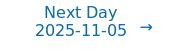

# Personalized Daily ArXiv Papers 2025-11-04

| *[gpt-5]*   | Prompt   | Completion   | Total   |
|:-----------:|:--------:|:------------:|:-------:|
| **Token**   | 75774    | 64990        | 140764  |
| **Cost**    | $0.09    | $0.65        | $0.74   |

Total arXiv papers: 784

Total scanned papers: 444

Total relevant papers: 46

**Table of contents with paper titles:**

1. [TetraJet-v2: Accurate NVFP4 Training for Large Language Models with Oscillation Suppression and Outlier Control](#user-content-link1)
**Authors:** Yuxiang Chen, Xiaoming Xu, Pengle Zhang, Michael Beyer, Martin Rapp, Jun Zhu, Jianfei Chen

2. [Continuous Autoregressive Language Models](#user-content-link2)
**Authors:** Chenze Shao, Darren Li, Fandong Meng, Jie Zhou

3. [Higher-order Linear Attention](#user-content-link3)
**Authors:** Yifan Zhang, Zhen Qin, Quanquan Gu

4. [Memory-Efficient Training with In-Place FFT Implementation](#user-content-link4)
**Authors:** Xinyu Ding, Bangtian Liu, Siyu Liao, Zhongfeng Wang

5. [LongCat-Flash-Omni Technical Report](#user-content-link5)
**Authors:** Meituan LongCat Team, Bairui Wang, Bayan, Bin Xiao, Bo Zhang, Bolin Rong, Borun Chen, Chang Wan, Chao Zhang, Chen Huang, Chen Chen, Chen Chen, Chengxu Yang, Chengzuo Yang, Cong Han, Dandan Peng, Delian Ruan, Detai Xin, Disong Wang, Dongchao Yang, Fanfan Liu, Fengjiao Chen, Fengyu Yang, Gan Dong, Gang Huang, Gang Xu, Guanglu Wan, Guoqiang Tan, Guoqiao Yu, Haibo Qiu, Hao Lu, Hongbo Liu, Hongyu Xiang, Jiaheng Wu, Jian Yang, Jiaxing Liu, Jing Huang, Jingang Wang, Jinrui Ding, Juchao Jiang, Jun Kuang, Jun Wang, Junhui Mei, Ke Ding, Kefeng Zhang, Lei Chen, Liang Shi, Limeng Qiao, Liming Zheng, Lin Ma, Liuyang Guo, Liya Ma, Luying Sun, Man Gao, Mengshen Zhu, Miao Cao, Minliang Lin, Nuo Xu, Peng Shi, Qi Zhang, Qian Fang, Qian Wang, Qian Yang, Quanxiu Wang, Rongxiang Weng, Rongxin Guo, Ruoxuan Liang, Senbin Yang, Shanbo Xu, Shanglin Lei, Shengze Ye, Shimin Chen, Shuaiqi Chen, Shujie Hu, Shuo Li, Siqi Yang, Siyu Xu, Siyu Ren, Song Li, Songxiang Liu, Tianhao Bai, Tianye Dai, Wei Hong, Wei Wang, Weixiao Zhao, Wengang Cao, Wenlong Zhu, Wenlong He, Xi Su, Xi Nan, Xiaohan Zhao, Xiaohao Wang, Xiaoyu Zhao, Xiaoyu Wang, Xiaoyu Li, Xin Pan, Xin Chen, Xiusong Sun, Xu Xiang, Xudong Xing, Xuezhi Cao, Xunliang Cai, Yang Yang, Yanli Tan, Yao Yao, Yerui Sun, Yi Chen, Yifan Lu, Yin Gong, Yining Zhang, Yitian Chen, Yiyang Gan, Yuchen Tang, Yuchen Xie, Yueqian Wang, Yuewen Zheng, Yufei Zhang, Yufeng Zhong, Yulei Qian, Yuqi Peng, Yuwei Jiang, Zeyang Hu, Zheng Zhang, Zhengkun Tian, Zhiqing Hong, Zhixiong Zeng, Zhuqi Mi, Ziran Li, Ziwen Wang, Ziyi Zhao, Ziyuan Zhuang, Zizhe Zhao

6. [A Proof of Learning Rate Transfer under $\mu$P](#user-content-link6)
**Authors:** Soufiane Hayou

7. [MISA: Memory-Efficient LLMs Optimization with Module-wise Importance Sampling](#user-content-link7)
**Authors:** Yuxi Liu, Renjia Deng, Yutong He, Xue Wang, Tao Yao, Kun Yuan

8. [FlexiCache: Leveraging Temporal Stability of Attention Heads for Efficient KV Cache Management](#user-content-link8)
**Authors:** Nazmul Takbir, Hamidreza Alikhani, Nikil Dutt, Sangeetha Abdu Jyothi

9. [CAS-Spec: Cascade Adaptive Self-Speculative Decoding for On-the-Fly Lossless Inference Acceleration of LLMs](#user-content-link9)
**Authors:** Zhiyuan Ning, Jiawei Shao, Ruge Xu, Xinfei Guo, Jun Zhang, Chi Zhang, Xuelong Li

10. [Tree Training: Accelerating Agentic LLMs Training via Shared Prefix Reuse](#user-content-link10)
**Authors:** Shaojie Wang, Jinghui Wang, Yinghan Cui, Xuxing Chen, Chao Wang, Liang Huang, Xiaojiang Zhang, Junyi Peng, Li Wan, Haotian Zhang, Bin Chen

11. [Isotropic Curvature Model for Understanding Deep Learning Optimization: Is Gradient Orthogonalization Optimal?](#user-content-link11)
**Authors:** Weijie Su

12. [A Saddle Point Remedy: Power of Variable Elimination in Non-convex Optimization](#user-content-link12)
**Authors:** Min Gan, Guang-Yong Chen, Yang Yi, Lin Yang

13. [Reject Only Critical Tokens: Pivot-Aware Speculative Decoding](#user-content-link13)
**Authors:** Amir Ziashahabi, Yavuz Faruk Bakman, Duygu Nur Yaldiz, Mostafa El-Khamy, Sai Praneeth Karimireddy, Salman Avestimehr

14. [Energy-Efficient Deep Learning Without Backpropagation: A Rigorous Evaluation of Forward-Only Algorithms](#user-content-link14)
**Authors:** Przemys{\l}aw Spyra, Witold Dzwinel

15. [Transformers as Intrinsic Optimizers: Forward Inference through the Energy Principle](#user-content-link15)
**Authors:** Ruifeng Ren, Sheng Ouyang, Huayi Tang, Yong Liu

16. [Priors in Time: Missing Inductive Biases for Language Model Interpretability](#user-content-link16)
**Authors:** Ekdeep Singh Lubana, Can Rager, Sai Sumedh R. Hindupur, Valerie Costa, Greta Tuckute, Oam Patel, Sonia Krishna Murthy, Thomas Fel, Daniel Wurgaft, Eric J. Bigelow, Johnny Lin, Demba Ba, Martin Wattenberg, Fernanda Viegas, Melanie Weber, Aaron Mueller

17. [Calibrating and Rotating: A Unified Framework for Weight Conditioning in PEFT](#user-content-link17)
**Authors:** Da Chang, Peng Xue, Yu Li, Yongxiang Liu, Pengxiang Xu, Shixun Zhang

18. [The Hidden Power of Normalization: Exponential Capacity Control in Deep Neural Networks](#user-content-link18)
**Authors:** Khoat Than

19. [Loquetier: A Virtualized Multi-LoRA Framework for Unified LLM Fine-tuning and Serving](#user-content-link19)
**Authors:** Yuchen Zhang, Hanyue Du, Chun Cao, Jingwei Xu

20. [Atlas-Alignment: Making Interpretability Transferable Across Language Models](#user-content-link20)
**Authors:** Bruno Puri, Jim Berend, Sebastian Lapuschkin, Wojciech Samek

21. [Training with Fewer Bits: Unlocking Edge LLMs Training with Stochastic Rounding](#user-content-link21)
**Authors:** Taowen Liu, Marta Andronic, Deniz G\"und\"uz, George A. Constantinides

22. [FLoRA: Fused forward-backward adapters for parameter efficient fine-tuning and reducing inference-time latencies of LLMs](#user-content-link22)
**Authors:** Dhananjaya Gowda, Seoha Song, Junhyun Lee, Harshith Goka

23. [From Uniform to Adaptive: General Skip-Block Mechanisms for Efficient PDE Neural Operators](#user-content-link23)
**Authors:** Lei Liu, Zhongyi Yu, Hong Wang, Huanshuo Dong, Haiyang Xin, Hongwei Zhao, Bin Li

24. [Soft Task-Aware Routing of Experts for Equivariant Representation Learning](#user-content-link24)
**Authors:** Jaebyeong Jeon, Hyeonseo Jang, Jy-yong Sohn, Kibok Lee

25. [Elastic Architecture Search for Efficient Language Models](#user-content-link25)
**Authors:** Shang Wang

26. [Regularization Implies balancedness in the deep linear network](#user-content-link26)
**Authors:** Kathryn Lindsey, Govind Menon

27. [Bridging Lifelong and Multi-Task Representation Learning via Algorithm and Complexity Measure](#user-content-link27)
**Authors:** Zhi Wang, Chicheng Zhang, Ramya Korlakai Vinayak

28. [Scaling Graph Chain-of-Thought Reasoning: A Multi-Agent Framework with Efficient LLM Serving](#user-content-link28)
**Authors:** Chengying Huan, Ziheng Meng, Yongchao Liu, Zhengyi Yang, Yun Zhu, Yue Yun, Shipeng Li, Rong Gu, Xiabao Wu, Haitao Zhang, Chuntao Hong, Shaonan Ma, Guihai Chen, Chen Tian

29. [Hydra: Dual Exponentiated Memory for Multivariate Time Series Analysis](#user-content-link29)
**Authors:** Asal Meskin, Alireza Mirrokni, Ali Najar, Ali Behrouz

30. [One model to solve them all: 2BSDE families via neural operators](#user-content-link30)
**Authors:** Takashi Furuya, Anastasis Kratsios, Dylan Possama\"i, Bogdan Raoni\'c

31. [AReaL-Hex: Accommodating Asynchronous RL Training over Heterogeneous GPUs](#user-content-link31)
**Authors:** Ran Yan, Youhe Jiang, Tianyuan Wu, Jiaxuan Gao, Zhiyu Mei, Wei Fu, Haohui Mai, Wei Wang, Yi Wu, Binhang Yuan

32. [Optimal Attention Temperature Enhances In-Context Learning under Distribution Shift](#user-content-link32)
**Authors:** Samet Demir, Zafer Dogan

33. [ParaScopes: What do Language Models Activations Encode About Future Text?](#user-content-link33)
**Authors:** Nicky Pochinkov, Yulia Volkova, Anna Vasileva, Sai V R Chereddy

34. [Generalizing Test-time Compute-optimal Scaling as an Optimizable Graph](#user-content-link34)
**Authors:** Fali Wang, Jihai Chen, Shuhua Yang, Runxue Bao, Tianxiang Zhao, Zhiwei Zhang, Xianfeng Tang, Hui Liu, Qi He, Suhang Wang

35. [Information-Theoretic Greedy Layer-wise Training for Traffic Sign Recognition](#user-content-link35)
**Authors:** Shuyan Lyu, Zhanzimo Wu, Junliang Du

36. [Belief Dynamics Reveal the Dual Nature of In-Context Learning and Activation Steering](#user-content-link36)
**Authors:** Eric Bigelow, Daniel Wurgaft, YingQiao Wang, Noah Goodman, Tomer Ullman, Hidenori Tanaka, Ekdeep Singh Lubana

37. [DTS: Enhancing Large Reasoning Models via Decoding Tree Sketching](#user-content-link37)
**Authors:** Zicheng Xu, Guanchu Wang, Yu-Neng Chuang, Guangyao Zheng, Alexander S. Szalay, Zirui Liu, Vladimir Braverman

38. [Feature-Function Curvature Analysis: A Geometric Framework for Explaining Differentiable Models](#user-content-link38)
**Authors:** Hamed Najafi, Dongsheng Luo, Jason Liu

39. [Multi-Step Knowledge Interaction Analysis via Rank-2 Subspace Disentanglement](#user-content-link39)
**Authors:** Sekh Mainul Islam, Pepa Atanasova, Isabelle Augenstein

40. [Calibration Across Layers: Understanding Calibration Evolution in LLMs](#user-content-link40)
**Authors:** Abhinav Joshi, Areeb Ahmad, Ashutosh Modi

41. [Analyzing the Power of Chain of Thought through Memorization Capabilities](#user-content-link41)
**Authors:** Lijia Yu, Xiao-Shan Gao, Lijun Zhang

42. [H2-Cache: A Novel Hierarchical Dual-Stage Cache for High-Performance Acceleration of Generative Diffusion Models](#user-content-link42)
**Authors:** Mingyu Sung, Il-Min Kim, Sangseok Yun, Jae-Mo Kang

43. [LL-ViT: Edge Deployable Vision Transformers with Look Up Table Neurons](#user-content-link43)
**Authors:** Shashank Nag, Alan T. L. Bacellar, Zachary Susskind, Anshul Jha, Logan Liberty, Aishwarya Sivakumar, Eugene B. John, Krishnan Kailas, Priscila M. V. Lima, Neeraja J. Yadwadkar, Felipe M. G. Franca, Lizy K. John

44. [Diluting Restricted Boltzmann Machines](#user-content-link44)
**Authors:** C. D\'iaz-Faloh, R. Mulet

45. [Explore More, Learn Better: Parallel MLLM Embeddings under Mutual Information Minimization](#user-content-link45)
**Authors:** Zhicheng Wang, Chen Ju, Xu Chen, Shuai Xiao, Jinsong Lan, Xiaoyong Zhu, Ying Chen, Zhiguo Cao

46. [Category-Aware Semantic Caching for Heterogeneous LLM Workloads](#user-content-link46)
**Authors:** Chen Wang, Xunzhuo Liu, Yue Zhu, Alaa Youssef, Priya Nagpurkar, Huamin Chen

---

## 1. [TetraJet-v2: Accurate NVFP4 Training for Large Language Models with Oscillation Suppression and Outlier Control](https://arxiv.org/abs/2510.27527) 

**ArXiv ID:** 2510.27527

**Authors:** Yuxiang Chen, Xiaoming Xu, Pengle Zhang, Michael Beyer, Martin Rapp, Jun Zhu, Jianfei Chen

**Abstract:** Large Language Models (LLMs) training is prohibitively expensive, driving interest in low-precision fully-quantized training (FQT). While novel 4-bit formats like NVFP4 offer substantial efficiency gains, achieving near-lossless training at such low precision remains challenging. We introduce TetraJet-v2, an end-to-end 4-bit FQT method that leverages NVFP4 for activations, weights, and gradients in all linear layers. We identify two critical issues hindering low-precision LLM training: weight oscillation and outliers. To address these, we propose: 1) an unbiased double-block quantization method for NVFP4 linear layers, 2) OsciReset, an algorithm to suppress weight oscillation, and 3) OutControl, an algorithm to retain outlier accuracy. TetraJet-v2 consistently outperforms prior FP4 training methods on pre-training LLMs across varying model sizes up to 370M and data sizes up to 200B tokens, reducing the performance gap to full-precision training by an average of 51.3%.

**Comment:** Compression/Efficiency: end-to-end 4-bit fully-quantized training using NVFP4 with new double-block quantization, oscillation suppression, and outlier control.

**Relevance:** 10
**Novelty:** 9

---

## 2. [Continuous Autoregressive Language Models](https://arxiv.org/abs/2510.27688) 

**ArXiv ID:** 2510.27688

**Authors:** Chenze Shao, Darren Li, Fandong Meng, Jie Zhou

**Abstract:** The efficiency of large language models (LLMs) is fundamentally limited by their sequential, token-by-token generation process. We argue that overcoming this bottleneck requires a new design axis for LLM scaling: increasing the semantic bandwidth of each generative step. To this end, we introduce Continuous Autoregressive Language Models (CALM), a paradigm shift from discrete next-token prediction to continuous next-vector prediction. CALM uses a high-fidelity autoencoder to compress a chunk of K tokens into a single continuous vector, from which the original tokens can be reconstructed with over 99.9\% accuracy. This allows us to model language as a sequence of continuous vectors instead of discrete tokens, which reduces the number of generative steps by a factor of K. The paradigm shift necessitates a new modeling toolkit; therefore, we develop a comprehensive likelihood-free framework that enables robust training, evaluation, and controllable sampling in the continuous domain. Experiments show that CALM significantly improves the performance-compute trade-off, achieving the performance of strong discrete baselines at a significantly lower computational cost. More importantly, these findings establish next-vector prediction as a powerful and scalable pathway towards ultra-efficient language models. Code: https://github.com/shaochenze/calm. Project: https://shaochenze.github.io/blog/2025/CALM.

**Comment:** Model Architecture and Efficiency: replaces next-token with next-vector prediction via high-fidelity autoencoding to increase semantic bandwidth and reduce generation steps.

**Relevance:** 10
**Novelty:** 9

---

## 3. [Higher-order Linear Attention](https://arxiv.org/abs/2510.27258) 

**ArXiv ID:** 2510.27258

**Authors:** Yifan Zhang, Zhen Qin, Quanquan Gu

**Abstract:** The quadratic cost of scaled dot-product attention is a central obstacle to scaling autoregressive language models to long contexts. Linear-time attention and State Space Models (SSMs) provide scalable alternatives but are typically restricted to first-order or kernel-based approximations, which can limit expressivity. We introduce Higher-order Linear Attention (HLA), a causal, streaming mechanism that realizes higher interactions via compact prefix sufficient statistics. In the second-order case, HLA maintains a constant-size state and computes per-token outputs in linear time without materializing any $n \times n$ matrices. We give closed-form streaming identities, a strictly causal masked variant using two additional summaries, and a chunk-parallel training scheme based on associative scans that reproduces the activations of a serial recurrence exactly. We further outline extensions to third and higher orders. Collectively, these results position HLA as a principled, scalable building block that combines attention-like, data-dependent mixing with the efficiency of modern recurrent architectures. Project Page: https://github.com/yifanzhang-pro/HLA.

**Comment:** Model Architecture/Efficiency: introduces higher-order linear-time attention with constant-size state; HPC: exact chunk-parallel scans for streaming recurrence.

**Relevance:** 10
**Novelty:** 9

---

## 4. [Memory-Efficient Training with In-Place FFT Implementation](https://arxiv.org/abs/2511.01385) 

**ArXiv ID:** 2511.01385

**Authors:** Xinyu Ding, Bangtian Liu, Siyu Liao, Zhongfeng Wang

**Abstract:** Fast Fourier Transforms (FFT) are widely used to reduce memory and computational costs in deep learning. However, existing implementations, including standard FFT and real FFT (rFFT), cannot achieve true in-place computation. In particular, rFFT maps an input of size n to a complex output of size n/2+1, causing dimensional mismatch and requiring additional memory allocation. We propose the first real-domain, fully in-place FFT framework (rdFFT) that preserves input-output memory space consistency. By leveraging butterfly operation symmetry and conjugate properties in the frequency domain, we design an implicit complex encoding scheme that eliminates intermediate cache usage entirely. Experiments on multiple natural language understanding tasks demonstrate the method effectiveness in reducing training memory cost, offering a promising direction for frequency-domain lightweight adaptation.

**Comment:** High Performance Computing: first real-domain fully in-place FFT that preserves memory layout, eliminating intermediate buffers to reduce training memory usage.

**Relevance:** 10
**Novelty:** 8

---

## 5. [LongCat-Flash-Omni Technical Report](https://arxiv.org/abs/2511.00279) 

**ArXiv ID:** 2511.00279

**Authors:** Meituan LongCat Team, Bairui Wang, Bayan, Bin Xiao, Bo Zhang, Bolin Rong, Borun Chen, Chang Wan, Chao Zhang, Chen Huang, Chen Chen, Chen Chen, Chengxu Yang, Chengzuo Yang, Cong Han, Dandan Peng, Delian Ruan, Detai Xin, Disong Wang, Dongchao Yang, Fanfan Liu, Fengjiao Chen, Fengyu Yang, Gan Dong, Gang Huang, Gang Xu, Guanglu Wan, Guoqiang Tan, Guoqiao Yu, Haibo Qiu, Hao Lu, Hongbo Liu, Hongyu Xiang, Jiaheng Wu, Jian Yang, Jiaxing Liu, Jing Huang, Jingang Wang, Jinrui Ding, Juchao Jiang, Jun Kuang, Jun Wang, Junhui Mei, Ke Ding, Kefeng Zhang, Lei Chen, Liang Shi, Limeng Qiao, Liming Zheng, Lin Ma, Liuyang Guo, Liya Ma, Luying Sun, Man Gao, Mengshen Zhu, Miao Cao, Minliang Lin, Nuo Xu, Peng Shi, Qi Zhang, Qian Fang, Qian Wang, Qian Yang, Quanxiu Wang, Rongxiang Weng, Rongxin Guo, Ruoxuan Liang, Senbin Yang, Shanbo Xu, Shanglin Lei, Shengze Ye, Shimin Chen, Shuaiqi Chen, Shujie Hu, Shuo Li, Siqi Yang, Siyu Xu, Siyu Ren, Song Li, Songxiang Liu, Tianhao Bai, Tianye Dai, Wei Hong, Wei Wang, Weixiao Zhao, Wengang Cao, Wenlong Zhu, Wenlong He, Xi Su, Xi Nan, Xiaohan Zhao, Xiaohao Wang, Xiaoyu Zhao, Xiaoyu Wang, Xiaoyu Li, Xin Pan, Xin Chen, Xiusong Sun, Xu Xiang, Xudong Xing, Xuezhi Cao, Xunliang Cai, Yang Yang, Yanli Tan, Yao Yao, Yerui Sun, Yi Chen, Yifan Lu, Yin Gong, Yining Zhang, Yitian Chen, Yiyang Gan, Yuchen Tang, Yuchen Xie, Yueqian Wang, Yuewen Zheng, Yufei Zhang, Yufeng Zhong, Yulei Qian, Yuqi Peng, Yuwei Jiang, Zeyang Hu, Zheng Zhang, Zhengkun Tian, Zhiqing Hong, Zhixiong Zeng, Zhuqi Mi, Ziran Li, Ziwen Wang, Ziyi Zhao, Ziyuan Zhuang, Zizhe Zhao

**Abstract:** We introduce LongCat-Flash-Omni, a state-of-the-art open-source omni-modal model with 560 billion parameters, excelling at real-time audio-visual interaction. By adopting a curriculum-inspired progressive training strategy that transitions from simpler to increasingly complex modality sequence modeling tasks, LongCat-Flash-Omni attains comprehensive multimodal capabilities while maintaining strong unimodal capability. Building upon LongCat-Flash, which adopts a high-performance Shortcut-connected Mixture-of-Experts (MoE) architecture with zero-computation experts, LongCat-Flash-Omni integrates efficient multimodal perception and speech reconstruction modules. Despite its immense size of 560B parameters (with 27B activated), LongCat-Flash-Omni achieves low-latency real-time audio-visual interaction. For training infrastructure, we developed a modality-decoupled parallelism scheme specifically designed to manage the data and model heterogeneity inherent in large-scale multimodal training. This innovative approach demonstrates exceptional efficiency by sustaining over 90% of the throughput achieved by text-only training. Extensive evaluations show that LongCat-Flash-Omni achieves state-of-the-art performance on omni-modal benchmarks among open-source models. Furthermore, it delivers highly competitive results across a wide range of modality-specific tasks, including text, image, and video understanding, as well as audio understanding and generation. We provide a comprehensive overview of the model architecture design, training procedures, and data strategies, and open-source the model to foster future research and development in the community.

**Comment:** Model Architecture (MoE with zero-computation experts) and HPC (modality-decoupled parallelism for large-scale multimodal training).

**Relevance:** 10
**Novelty:** 8

---

## 6. [A Proof of Learning Rate Transfer under $\mu$P](https://arxiv.org/abs/2511.01734) 

**ArXiv ID:** 2511.01734

**Authors:** Soufiane Hayou

**Abstract:** We provide the first proof of learning rate transfer with width in a linear multi-layer perceptron (MLP) parametrized with $\mu$P, a neural network parameterization designed to ``maximize'' feature learning in the infinite-width limit. We show that under $\mu P$, the optimal learning rate converges to a \emph{non-zero constant} as width goes to infinity, providing a theoretical explanation to learning rate transfer. In contrast, we show that this property fails to hold under alternative parametrizations such as Standard Parametrization (SP) and Neural Tangent Parametrization (NTP). We provide intuitive proofs and support the theoretical findings with extensive empirical results.

**Comment:** Training dynamics/parameterization theory: first proof of learning-rate transfer under μP, contrasting with SP/NTP.

**Relevance:** 9
**Novelty:** 8

---

## 7. [MISA: Memory-Efficient LLMs Optimization with Module-wise Importance Sampling](https://arxiv.org/abs/2511.00056) 

**ArXiv ID:** 2511.00056

**Authors:** Yuxi Liu, Renjia Deng, Yutong He, Xue Wang, Tao Yao, Kun Yuan

**Abstract:** The substantial memory demands of pre-training and fine-tuning large language models (LLMs) require memory-efficient optimization algorithms. One promising approach is layer-wise optimization, which treats each transformer block as a single layer and optimizes it sequentially, while freezing the other layers to save optimizer states and activations. Although effective, these methods ignore the varying importance of the modules within each layer, leading to suboptimal performance. Moreover, layer-wise sampling provides only limited memory savings, as at least one full layer must remain active during optimization. To overcome these limitations, we propose Module-wise Importance SAmpling (MISA), a novel method that divides each layer into smaller modules and assigns importance scores to each module. MISA uses a weighted random sampling mechanism to activate modules, provably reducing gradient variance compared to layer-wise sampling. Additionally, we establish an \(\mathcal{O}(1/\sqrt{K})\) convergence rate under non-convex and stochastic conditions, where $K$ is the total number of block updates, and provide a detailed memory analysis showcasing MISA's superiority over existing baseline methods. Experiments on diverse learning tasks validate the effectiveness of MISA. Source code is available at https://github.com/pkumelon/MISA.

**Comment:** Compression/Efficiency: module-wise importance sampling for memory-efficient LLM optimization with variance reduction and convergence guarantees.

**Relevance:** 9
**Novelty:** 8

---

## 8. [FlexiCache: Leveraging Temporal Stability of Attention Heads for Efficient KV Cache Management](https://arxiv.org/abs/2511.00868) 

**ArXiv ID:** 2511.00868

**Authors:** Nazmul Takbir, Hamidreza Alikhani, Nikil Dutt, Sangeetha Abdu Jyothi

**Abstract:** Large Language Model (LLM) serving is increasingly constrained by the growing size of the key-value (KV) cache, which scales with both context length and generation length. Prior work shows that attention is dominated by a small subset of critical tokens, yet existing systems struggle to exploit this efficiently without degrading accuracy, especially in long generation. We make a key observation: the temporal stability of these critical tokens varies significantly across KV heads: some heads consistently focus on the same tokens, while others shift frequently. Building on this insight, we introduce FlexiCache, a hierarchical KV-cache management system that leverages the temporal stability of KV heads to reduce GPU memory usage and computation overhead, while preserving model accuracy. FlexiCache classifies KV heads as stable or unstable: it retains all KV-cache pages from unstable heads in GPU memory, whereas for stable heads, it keeps only the top-K pages on the GPU and offloads the rest to host memory. By exploiting temporal stability, FlexiCache performs periodic reranking for stable heads to fetch newly promoted top pages. Implemented atop vLLM, FlexiCache reduces GPU memory footprint for long-context requests by up to 70%, improves offline serving throughput by 1.38-1.55x, and lowers online token latency by 1.6-2.1x, all while maintaining accuracy in long-context, long-generation scenarios.

**Comment:** Model Compression and Efficiency: KV-cache management leveraging head-wise temporal stability to offload/re-rank pages for memory/latency gains in LLM serving.

**Relevance:** 9
**Novelty:** 8

---

## 9. [CAS-Spec: Cascade Adaptive Self-Speculative Decoding for On-the-Fly Lossless Inference Acceleration of LLMs](https://arxiv.org/abs/2510.26843) 

**ArXiv ID:** 2510.26843

**Authors:** Zhiyuan Ning, Jiawei Shao, Ruge Xu, Xinfei Guo, Jun Zhang, Chi Zhang, Xuelong Li

**Abstract:** Speculative decoding has become a widely adopted as an effective technique for lossless inference acceleration when deploying large language models (LLMs). While on-the-fly self-speculative methods offer seamless integration and broad utility, they often fall short of the speed gains achieved by methods relying on specialized training. Cascading a hierarchy of draft models promises further acceleration and flexibility, but the high cost of training multiple models has limited its practical application. In this paper, we propose a novel Cascade Adaptive Self-Speculative Decoding (CAS-Spec) method which constructs speculative draft models by leveraging dynamically switchable inference acceleration (DSIA) strategies, including layer sparsity and activation quantization. Furthermore, traditional vertical and horizontal cascade algorithms are inefficient when applied to self-speculative decoding methods. We introduce a Dynamic Tree Cascade (DyTC) algorithm that adaptively routes the multi-level draft models and assigns the draft lengths, based on the heuristics of acceptance rates and latency prediction. Our CAS-Spec method achieves state-of-the-art acceleration compared to existing on-the-fly speculative decoding methods, with an average speedup from $1.1\times$ to $2.3\times$ over autoregressive decoding across various LLMs and datasets. DyTC improves the average speedup by $47$\% and $48$\% over cascade-based baseline and tree-based baseline algorithms, respectively. CAS-Spec can be easily integrated into most existing LLMs and holds promising potential for further acceleration as self-speculative decoding techniques continue to evolve.

**Comment:** Model Compression and Efficiency: on-the-fly speculative decoding with layer sparsity and activation quantization plus dynamic cascade routing for faster inference.

**Relevance:** 9
**Novelty:** 8

---

## 10. [Tree Training: Accelerating Agentic LLMs Training via Shared Prefix Reuse](https://arxiv.org/abs/2511.00413) 

**ArXiv ID:** 2511.00413

**Authors:** Shaojie Wang, Jinghui Wang, Yinghan Cui, Xuxing Chen, Chao Wang, Liang Huang, Xiaojiang Zhang, Junyi Peng, Li Wan, Haotian Zhang, Bin Chen

**Abstract:** In agentic LLM scenarios, an agent's interaction process during a single rollout often exhibits branching behaviors. Due to memory retrieval and concurrent tool executions at certain decision points, the token trajectory of one task evolves into a tree-like structure rather than a linear sequence. However, current training pipelines decompose such tree-structured trajectories into separate linear segments, treating each branch as an independent sequence. As a result, shared prefixes across these branches are repeatedly recomputed during both forward and backward passes. To address this inefficiency, we propose Tree Training, a paradigm that computes each shared prefix only once and reuses its intermediate results across related branches during both forward and backward passes, substantially improving computation efficiency in large-scale agentic training. This is achieved via (i) Tree Packing, which efficiently reuses shared computations across trajectories, and (ii) Gradient Restoration, which ensures correct gradient propagation across reused prefixes. Experiments on multiple open-source models demonstrate up to 3.9x reduction in total training time, enabling more efficient agentic LLM SFT and RL training.

**Comment:** High Performance Computing: training efficiency via shared-prefix reuse (tree packing + gradient restoration) for agentic LLMs.

**Relevance:** 9
**Novelty:** 8

---

## 11. [Isotropic Curvature Model for Understanding Deep Learning Optimization: Is Gradient Orthogonalization Optimal?](https://arxiv.org/abs/2511.00674) 

**ArXiv ID:** 2511.00674

**Authors:** Weijie Su

**Abstract:** In this paper, we introduce a model for analyzing deep learning optimization over a single iteration by leveraging the matrix structure of the weights. We derive the model by assuming isotropy of curvature, including the second-order Hessian and higher-order terms, of the loss function across all perturbation directions; hence, we call it the isotropic curvature model. This model is a convex optimization program amenable to analysis, which allows us to understand how an update on the weights in the form of a matrix relates to the change in the total loss function. As an application, we use the isotropic curvature model to analyze the recently introduced Muon optimizer and other matrix-gradient methods for training language models. First, we show that under a general growth condition on the curvature, the optimal update matrix is obtained by making the spectrum of the original gradient matrix more homogeneous -- that is, making its singular values closer in ratio -- which in particular improves the conditioning of the update matrix. Next, we show that the orthogonalized gradient becomes optimal for the isotropic curvature model when the curvature exhibits a phase transition in growth. Taken together, these results suggest that the gradient orthogonalization employed in Muon and other related methods is directionally correct but may not be strictly optimal. Finally, we discuss future research on how to leverage the isotropic curvature model for designing new optimization methods for training deep learning and language models.

**Comment:** Optimization Theory: introduces an isotropic curvature model explaining and guiding gradient orthogonalization (e.g., Muon), connecting update spectra to loss changes.

**Relevance:** 9
**Novelty:** 8

---

## 12. [A Saddle Point Remedy: Power of Variable Elimination in Non-convex Optimization](https://arxiv.org/abs/2511.01234) 

**ArXiv ID:** 2511.01234

**Authors:** Min Gan, Guang-Yong Chen, Yang Yi, Lin Yang

**Abstract:** The proliferation of saddle points, rather than poor local minima, is increasingly understood to be a primary obstacle in large-scale non-convex optimization for machine learning. Variable elimination algorithms, like Variable Projection (VarPro), have long been observed to exhibit superior convergence and robustness in practice, yet a principled understanding of why they so effectively navigate these complex energy landscapes has remained elusive. In this work, we provide a rigorous geometric explanation by comparing the optimization landscapes of the original and reduced formulations. Through a rigorous analysis based on Hessian inertia and the Schur complement, we prove that variable elimination fundamentally reshapes the critical point structure of the objective function, revealing that local maxima in the reduced landscape are created from, and correspond directly to, saddle points in the original formulation. Our findings are illustrated on the canonical problem of non-convex matrix factorization, visualized directly on two-parameter neural networks, and finally validated in training deep Residual Networks, where our approach yields dramatic improvements in stability and convergence to superior minima. This work goes beyond explaining an existing method; it establishes landscape simplification via saddle point transformation as a powerful principle that can guide the design of a new generation of more robust and efficient optimization algorithms.

**Comment:** Optimization Theory: explains why variable elimination (VarPro) reshapes non-convex landscapes (saddle-to-maxima) and guides robust, efficient training algorithm design.

**Relevance:** 9
**Novelty:** 8

---

## 13. [Reject Only Critical Tokens: Pivot-Aware Speculative Decoding](https://arxiv.org/abs/2511.00351) 

**ArXiv ID:** 2511.00351

**Authors:** Amir Ziashahabi, Yavuz Faruk Bakman, Duygu Nur Yaldiz, Mostafa El-Khamy, Sai Praneeth Karimireddy, Salman Avestimehr

**Abstract:** Speculative Decoding (SD) ensures that the output matches the target model's distribution exactly. However, we argue that this distribution matching requirement is too stringent and results in unnecessarily low acceptance rates, limiting potential speedups. Instead, we advocate a reformulation of the decoding objective: the proposed decoding strategy should match the expected utility, i.e., the task-specific performance, of the target model. This perspective also aligns better with real-world use cases of LLMs, where utility (e.g., code correctness, factual accuracy) is often more important than sampling distribution. Based on this reformulation, we propose a novel decoding strategy: Pivot-Aware Speculative Decoding, which rejects only those tokens that would lead to a utility drop in the final output. We refer to these critical tokens as pivot tokens. We propose a method for labeling tokens as pivotal or non-pivotal and train a lightweight classifier to detect them. This method can be viewed as a relaxed version of standard SD, which offers much higher acceptance while preserving utility. We evaluate our method across various datasets, demonstrating that we can achieve up to $2.5\times$ speedup with comparable utility. Source code is available at https://github.com/amir-zsh/PAD.

**Comment:** Efficiency: pivot-aware speculative decoding that rejects only utility-critical tokens via a lightweight classifier, yielding higher acceptance and speedups.

**Relevance:** 9
**Novelty:** 8

---

## 14. [Energy-Efficient Deep Learning Without Backpropagation: A Rigorous Evaluation of Forward-Only Algorithms](https://arxiv.org/abs/2511.01061) 

**ArXiv ID:** 2511.01061

**Authors:** Przemys{\l}aw Spyra, Witold Dzwinel

**Abstract:** The long-held assumption that backpropagation (BP) is essential for state-of-the-art performance is challenged by this work. We present rigorous, hardware-validated evidence that the Mono-Forward (MF) algorithm, a backpropagation-free method, consistently surpasses an optimally tuned BP baseline in classification accuracy on its native Multi-Layer Perceptron (MLP) architectures. This superior generalization is achieved with profound efficiency gains, including up to 41% less energy consumption and up to 34% faster training. Our analysis, which charts an evolutionary path from Geoffrey Hinton's Forward-Forward (FF) to the Cascaded Forward (CaFo) and finally to MF, is grounded in a fair comparative framework using identical architectures and universal hyperparameter optimization. We further provide a critical re-evaluation of memory efficiency in BP-free methods, empirically demonstrating that practical overhead can offset theoretical gains. Ultimately, this work establishes MF as a practical, high-performance, and sustainable alternative to BP for MLPs.

**Comment:** Training/Efficiency: forward-only learning as a backprop-free alternative with hardware-validated energy and speed gains.

**Relevance:** 9
**Novelty:** 8

---

## 15. [Transformers as Intrinsic Optimizers: Forward Inference through the Energy Principle](https://arxiv.org/abs/2511.00907) 

**ArXiv ID:** 2511.00907

**Authors:** Ruifeng Ren, Sheng Ouyang, Huayi Tang, Yong Liu

**Abstract:** Transformers have demonstrated strong adaptability across a wide range of tasks and have become the backbone of modern Large Language Models (LLMs). However, their underlying mechanisms remain open for further exploration. The energy-based perspective has long provided a valuable principle for understanding neural computation. In this paper, we revisit the principle of energy as a lens to understand attention-based Transformer models. We present a unified energy-based framework which is composed of three key components: the global energy $F^*$, the energy function $E_i$ and the employed gradient descent (GD) form. Within this framework, standard softmax attention can be viewed as a special case of minimizing the Helmholtz free energy as $F^*$ using standard GD when $E_i$ takes the form of elastic potential energy, with residual connections ensuring that this optimization proceeds in an incremental manner. In addition, linear attentions can also be naturally incorporated into this framework by adjusting the corresponding energy forms. We also extend the above analysis to the multi-head setting, where the energy is defined across multiple low-dimensional subspaces. Building on this framework, we propose energy-based modifications of attention structures. Inspired by classical GD algorithms, we extend the original attention formulation based on standard GD to the momentum-based GD, Nesterov Accelerated Gradient (NAG), and Newton's method variants, each inducing a corresponding new attention structure. Our experiments provide preliminary support for the potential of the energy-based framework for designing attention mechanisms.

**Comment:** Model Architecture/Theory: reframes attention via an energy-based principle and proposes new attention variants inspired by optimization methods.

**Relevance:** 9
**Novelty:** 8

---

## 16. [Priors in Time: Missing Inductive Biases for Language Model Interpretability](https://arxiv.org/abs/2511.01836) 

**ArXiv ID:** 2511.01836

**Authors:** Ekdeep Singh Lubana, Can Rager, Sai Sumedh R. Hindupur, Valerie Costa, Greta Tuckute, Oam Patel, Sonia Krishna Murthy, Thomas Fel, Daniel Wurgaft, Eric J. Bigelow, Johnny Lin, Demba Ba, Martin Wattenberg, Fernanda Viegas, Melanie Weber, Aaron Mueller

**Abstract:** Recovering meaningful concepts from language model activations is a central aim of interpretability. While existing feature extraction methods aim to identify concepts that are independent directions, it is unclear if this assumption can capture the rich temporal structure of language. Specifically, via a Bayesian lens, we demonstrate that Sparse Autoencoders (SAEs) impose priors that assume independence of concepts across time, implying stationarity. Meanwhile, language model representations exhibit rich temporal dynamics, including systematic growth in conceptual dimensionality, context-dependent correlations, and pronounced non-stationarity, in direct conflict with the priors of SAEs. Taking inspiration from computational neuroscience, we introduce a new interpretability objective -- Temporal Feature Analysis -- which possesses a temporal inductive bias to decompose representations at a given time into two parts: a predictable component, which can be inferred from the context, and a residual component, which captures novel information unexplained by the context. Temporal Feature Analyzers correctly parse garden path sentences, identify event boundaries, and more broadly delineate abstract, slow-moving information from novel, fast-moving information, while existing SAEs show significant pitfalls in all the above tasks. Overall, our results underscore the need for inductive biases that match the data in designing robust interpretability tools.

**Comment:** Matches Representation Learning: critiques SAE priors and introduces Temporal Feature Analysis with temporal inductive bias for activation decomposition.

**Relevance:** 9
**Novelty:** 8

---

## 17. [Calibrating and Rotating: A Unified Framework for Weight Conditioning in PEFT](https://arxiv.org/abs/2511.00051) 

**ArXiv ID:** 2511.00051

**Authors:** Da Chang, Peng Xue, Yu Li, Yongxiang Liu, Pengxiang Xu, Shixun Zhang

**Abstract:** Parameter-Efficient Fine-Tuning (PEFT) methods are crucial for adapting large pre-trained models. Among these, LoRA is considered a foundational approach. Building on this, the influential DoRA method enhances performance by decomposing weight updates into magnitude and direction. However, its underlying mechanism remains unclear, and it introduces significant computational overhead. In this work, we first identify that DoRA's success stems from its capacity to increase the singular value entropy of the weight update matrix, which promotes a more uniform update distribution akin to full fine-tuning. We then reformulate DoRA into a mathematically equivalent and more efficient matrix form, revealing it as a learnable weight conditioning method. Based on this insight, we propose a unified framework for designing advanced PEFT methods by exploring two orthogonal dimensions: the architectural placement and the transformation type of the conditioning matrix. Within this framework, we introduce two novel methods: (1) \textbf{Pre-Diag}, which applies a diagonal conditioning matrix before the LoRA update to efficiently calibrate the pre-trained weights, thereby enhancing performance while reducing training time; and (2) \textbf{S}kewed \textbf{O}rthogonal \textbf{R}otation \textbf{A}daptation (\textbf{SORA}), which employs a parameter-efficient orthogonal rotation to perform a more powerful, norm-preserving transformation of the feature space. Extensive experiments on natural language understanding and generation tasks demonstrate that our proposed methods achieve superior performance and efficiency compared to both LoRA and DoRA. The code is available at https://github.com/MaeChd/SORA.

**Comment:** Matches Compression/Efficiency: PEFT via learnable weight conditioning (diagonal calibration and orthogonal rotations), clarifying DoRA and improving LoRA.

**Relevance:** 9
**Novelty:** 8

---

## 18. [The Hidden Power of Normalization: Exponential Capacity Control in Deep Neural Networks](https://arxiv.org/abs/2511.00958) 

**ArXiv ID:** 2511.00958

**Authors:** Khoat Than

**Abstract:** Normalization methods are fundamental components of modern deep neural networks (DNNs). Empirically, they are known to stabilize optimization dynamics and improve generalization. However, the underlying theoretical mechanism by which normalization contributes to both optimization and generalization remains largely unexplained, especially when using many normalization layers in a DNN architecture.   In this work, we develop a theoretical framework that elucidates the role of normalization through the lens of capacity control. We prove that an unnormalized DNN can exhibit exponentially large Lipschitz constants with respect to either its parameters or inputs, implying excessive functional capacity and potential overfitting. Such bad DNNs are uncountably many. In contrast, the insertion of normalization layers provably can reduce the Lipschitz constant at an exponential rate in the number of normalization operations. This exponential reduction yields two fundamental consequences: (1) it smooths the loss landscape at an exponential rate, facilitating faster and more stable optimization; and (2) it constrains the effective capacity of the network, thereby enhancing generalization guarantees on unseen data. Our results thus offer a principled explanation for the empirical success of normalization methods in deep learning.

**Comment:** Matches Representation Learning/Theory: proves normalization yields exponential capacity control (Lipschitz bounds), smoothing optimization and improving generalization.

**Relevance:** 9
**Novelty:** 8

---

## 19. [Loquetier: A Virtualized Multi-LoRA Framework for Unified LLM Fine-tuning and Serving](https://arxiv.org/abs/2511.00101) 

**ArXiv ID:** 2511.00101

**Authors:** Yuchen Zhang, Hanyue Du, Chun Cao, Jingwei Xu

**Abstract:** Low-Rank Adaptation (LoRA) has become a widely adopted parameter-efficient fine-tuning (PEFT) technique for adapting large language models (LLMs) to downstream tasks. While prior work has explored strategies for integrating LLM training and serving, there still remains a gap in unifying fine-tuning and inference for LoRA-based models. We present Loquetier, a virtualized multi-LoRA framework that seamlessly integrates LoRA fine-tuning and serving within a single runtime. Loquetier introduces two key components: (1) a Virtualized Module that isolates PEFT-based modifications and supports multiple adapters on a shared base model, and (2) an optimized computation flow with a kernel design that merges fine-tuning and inference paths in forward propagation, enabling efficient batching and minimizing kernel invocation overhead. Extensive experiments across three task settings show that Loquetier consistently outperforms existing baselines in both performance and flexibility, achieving up to $3.0\times$ the throughput of the state-of-the-art co-serving system on inference-only tasks and $46.4\times$ higher SLO attainment than PEFT on unified fine-tuning and inference tasks. The implementation of Loquetier is publicly available at https://github.com/NJUDeepEngine/Loquetier.

**Comment:** Model Compression and Efficiency: leverages LoRA (low-rank adapters) with a virtualized multi-adapter runtime and optimized kernels to unify fine-tuning and serving for higher throughput and lower overhead.

**Relevance:** 9
**Novelty:** 7

---

## 20. [Atlas-Alignment: Making Interpretability Transferable Across Language Models](https://arxiv.org/abs/2510.27413) 

**ArXiv ID:** 2510.27413

**Authors:** Bruno Puri, Jim Berend, Sebastian Lapuschkin, Wojciech Samek

**Abstract:** Interpretability is crucial for building safe, reliable, and controllable language models, yet existing interpretability pipelines remain costly and difficult to scale. Interpreting a new model typically requires costly training of model-specific sparse autoencoders, manual or semi-automated labeling of SAE components, and their subsequent validation. We introduce Atlas-Alignment, a framework for transferring interpretability across language models by aligning unknown latent spaces to a Concept Atlas - a labeled, human-interpretable latent space - using only shared inputs and lightweight representational alignment techniques. Once aligned, this enables two key capabilities in previously opaque models: (1) semantic feature search and retrieval, and (2) steering generation along human-interpretable atlas concepts. Through quantitative and qualitative evaluations, we show that simple representational alignment methods enable robust semantic retrieval and steerable generation without the need for labeled concept data. Atlas-Alignment thus amortizes the cost of explainable AI and mechanistic interpretability: by investing in one high-quality Concept Atlas, we can make many new models transparent and controllable at minimal marginal cost.

**Comment:** Representation Learning/Interpretability: aligns unknown model latents to a labeled Concept Atlas via lightweight representational alignment for semantic retrieval and steering.

**Relevance:** 9
**Novelty:** 7

---

## 21. [Training with Fewer Bits: Unlocking Edge LLMs Training with Stochastic Rounding](https://arxiv.org/abs/2511.00874) 

**ArXiv ID:** 2511.00874

**Authors:** Taowen Liu, Marta Andronic, Deniz G\"und\"uz, George A. Constantinides

**Abstract:** LLM training is resource-intensive. Quantized training improves computational and memory efficiency but introduces quantization noise, which can hinder convergence and degrade model accuracy. Stochastic Rounding (SR) has emerged as a theoretically attractive alternative to deterministic rounding, offering unbiased gradient estimates. However, its interaction with other training factors -- especially batch size -- remains under explored. In this paper, we present a theoretical and empirical study of mini-batch stochastic gradient descent (SGD) with SR, showing that increased batch sizes can compensate for reduced precision during back-propagation. Furthermore, we show that quantizing weights and activations impacts gradient variance in distinct ways. Our experiments validate these theoretical insights.

**Comment:** Model Compression and Efficiency: theoretical and empirical analysis of quantized training with stochastic rounding, highlighting batch size interactions and variance sources.

**Relevance:** 9
**Novelty:** 7

---

## 22. [FLoRA: Fused forward-backward adapters for parameter efficient fine-tuning and reducing inference-time latencies of LLMs](https://arxiv.org/abs/2511.00050) 

**ArXiv ID:** 2511.00050

**Authors:** Dhananjaya Gowda, Seoha Song, Junhyun Lee, Harshith Goka

**Abstract:** As the large language models (LLMs) grow in size each day, efficient training and fine-tuning has never been as important as nowadays. This resulted in the great interest in parameter efficient fine-tuning (PEFT), and effective methods including low-rank adapters (LoRA) has emerged. Although the various PEFT methods have been studied extensively in the recent years, the greater part of the subject remains unexplored with the huge degree of freedom. In this paper, we propose FLoRA, a family of fused forward-backward adapters (FFBA) for parameter-efficient fine-tuning of LLMs on downstream tasks. The FFBA combine ideas from the popular LoRA and parallel adapters to improve the overall fine-tuning accuracies. At the same time, latencies are minimized by fusing the forward and backward adapters into existing projection layers of the base model. Experimental results show that the proposed FFB adapters perform significantly better than the popularly used LoRA in both accuracy and latency for a similar parameter budget.

**Comment:** Matches Compression/Efficiency: fused forward–backward adapters for PEFT that also reduce inference latency.

**Relevance:** 9
**Novelty:** 7

---

## 23. [From Uniform to Adaptive: General Skip-Block Mechanisms for Efficient PDE Neural Operators](https://arxiv.org/abs/2511.00032) 

**ArXiv ID:** 2511.00032

**Authors:** Lei Liu, Zhongyi Yu, Hong Wang, Huanshuo Dong, Haiyang Xin, Hongwei Zhao, Bin Li

**Abstract:** In recent years, Neural Operators(NO) have gradually emerged as a popular approach for solving Partial Differential Equations (PDEs). However, their application to large-scale engineering tasks suffers from significant computational overhead. And the fact that current models impose a uniform computational cost while physical fields exhibit vastly different complexities constitutes a fundamental mismatch, which is the root of this inefficiency. For instance, in turbulence flows, intricate vortex regions require deeper network processing compared to stable flows. To address this, we introduce a framework: Skip-Block Routing (SBR), a general framework designed for Transformer-based neural operators, capable of being integrated into their multi-layer architectures. First, SBR uses a routing mechanism to learn the complexity and ranking of tokens, which is then applied during inference. Then, in later layers, it decides how many tokens are passed forward based on this ranking. This way, the model focuses more processing capacity on the tokens that are more complex. Experiments demonstrate that SBR is a general framework that seamlessly integrates into various neural operators. Our method reduces computational cost by approximately 50% in terms of Floating Point Operations (FLOPs), while still delivering up to 2x faster inference without sacrificing accuracy.

**Comment:** Matches Compression/Efficiency and Conditional/Dynamic Networks: Skip-Block Routing to adaptively route tokens and skip computation in transformer-based neural operators.

**Relevance:** 9
**Novelty:** 7

---

## 24. [Soft Task-Aware Routing of Experts for Equivariant Representation Learning](https://arxiv.org/abs/2510.27222) 

**ArXiv ID:** 2510.27222

**Authors:** Jaebyeong Jeon, Hyeonseo Jang, Jy-yong Sohn, Kibok Lee

**Abstract:** Equivariant representation learning aims to capture variations induced by input transformations in the representation space, whereas invariant representation learning encodes semantic information by disregarding such transformations. Recent studies have shown that jointly learning both types of representations is often beneficial for downstream tasks, typically by employing separate projection heads. However, this design overlooks information shared between invariant and equivariant learning, which leads to redundant feature learning and inefficient use of model capacity. To address this, we introduce Soft Task-Aware Routing (STAR), a routing strategy for projection heads that models them as experts. STAR induces the experts to specialize in capturing either shared or task-specific information, thereby reducing redundant feature learning. We validate this effect by observing lower canonical correlations between invariant and equivariant embeddings. Experimental results show consistent improvements across diverse transfer learning tasks. The code is available at https://github.com/YonseiML/star.

**Comment:** MoE/Representation Learning: soft task-aware routing of expert projection heads to disentangle invariant vs equivariant representations.

**Relevance:** 9
**Novelty:** 7

---

## 25. [Elastic Architecture Search for Efficient Language Models](https://arxiv.org/abs/2510.27037) 

**ArXiv ID:** 2510.27037

**Authors:** Shang Wang

**Abstract:** As large pre-trained language models become increasingly critical to natural language understanding (NLU) tasks, their substantial computational and memory requirements have raised significant economic and environmental concerns. Addressing these challenges, this paper introduces the Elastic Language Model (ELM), a novel neural architecture search (NAS) method optimized for compact language models. ELM extends existing NAS approaches by introducing a flexible search space with efficient transformer blocks and dynamic modules for dimension and head number adjustment. These innovations enhance the efficiency and flexibility of the search process, which facilitates more thorough and effective exploration of model architectures. We also introduce novel knowledge distillation losses that preserve the unique characteristics of each block, in order to improve the discrimination between architectural choices during the search process. Experiments on masked language modeling and causal language modeling tasks demonstrate that models discovered by ELM significantly outperform existing methods.

**Comment:** Model Architecture/Efficiency: NAS for compact transformer LMs with dynamic modules (heads/dimensions) and per-block distillation.

**Relevance:** 9
**Novelty:** 7

---

## 26. [Regularization Implies balancedness in the deep linear network](https://arxiv.org/abs/2511.01137) 

**ArXiv ID:** 2511.01137

**Authors:** Kathryn Lindsey, Govind Menon

**Abstract:** We use geometric invariant theory (GIT) to study the deep linear network (DLN). The Kempf-Ness theorem is used to establish that the $L^2$ regularizer is minimized on the balanced manifold. This allows us to decompose the training dynamics into two distinct gradient flows: a regularizing flow on fibers and a learning flow on the balanced manifold. We show that the regularizing flow is exactly solvable using the moment map.   This approach provides a common mathematical framework for balancedness in deep learning and linear systems theory. We use this framework to interpret balancedness in terms of model reduction and Bayesian principles.

**Comment:** Representation Learning: theoretical training dynamics in deep linear networks showing L2 regularization induces balancedness via GIT.

**Relevance:** 8
**Novelty:** 8

---

## 27. [Bridging Lifelong and Multi-Task Representation Learning via Algorithm and Complexity Measure](https://arxiv.org/abs/2511.01847) 

**ArXiv ID:** 2511.01847

**Authors:** Zhi Wang, Chicheng Zhang, Ramya Korlakai Vinayak

**Abstract:** In lifelong learning, a learner faces a sequence of tasks with shared structure and aims to identify and leverage it to accelerate learning. We study the setting where such structure is captured by a common representation of data. Unlike multi-task learning or learning-to-learn, where tasks are available upfront to learn the representation, lifelong learning requires the learner to make use of its existing knowledge while continually gathering partial information in an online fashion. In this paper, we consider a generalized framework of lifelong representation learning. We propose a simple algorithm that uses multi-task empirical risk minimization as a subroutine and establish a sample complexity bound based on a new notion we introduce--the task-eluder dimension. Our result applies to a wide range of learning problems involving general function classes. As concrete examples, we instantiate our result on classification and regression tasks under noise.

**Comment:** Representation Learning: proposes a simple lifelong representation learning algorithm with sample complexity bounds via a new task-eluder dimension.

**Relevance:** 8
**Novelty:** 8

---

## 28. [Scaling Graph Chain-of-Thought Reasoning: A Multi-Agent Framework with Efficient LLM Serving](https://arxiv.org/abs/2511.01633) 

**ArXiv ID:** 2511.01633

**Authors:** Chengying Huan, Ziheng Meng, Yongchao Liu, Zhengyi Yang, Yun Zhu, Yue Yun, Shipeng Li, Rong Gu, Xiabao Wu, Haitao Zhang, Chuntao Hong, Shaonan Ma, Guihai Chen, Chen Tian

**Abstract:** Graph Chain-of-Thought (Graph-CoT) enables large language models (LLMs) to perform step-by-step reasoning over graph-structured knowledge, but existing pipelines suffer from low accuracy, excessive token usage, high latency, and low throughput due to single-agent monolithic prompts, repeated context re-encoding, and inefficient serving execution. We present GLM, the first multi-agent Graph-CoT system co-designed with an optimized LLM serving architecture. GLM decomposes reasoning into specialized agents for classification, reasoning, action generation, and graph retrieval, enabling branching and selective context sharing to reduce prompt length and reasoning iterations while preserving reasoning quality, thereby improving accuracy and reducing overall token consumption. To scale inference, we introduce a Graph-CoT-aware LLM inference mechanism with graph-specific KV-cache management, priority-based eviction, and pipelined execution to improve serving efficiency. Experiments demonstrate that GLM improves answer accuracy by up to 38%, reduces token cost by up to 95.7%, lowers inference latency by 90.3%, and achieves up to 15.1x higher throughput compared to state-of-the-art Graph-CoT baselines, enabling efficient adoption for complex real-world reasoning at scale.

**Comment:** High Performance Computing: Graph-CoT-aware serving with graph-specific KV-cache management, priority eviction, and pipelined execution; multi-agent decomposition reduces tokens.

**Relevance:** 8
**Novelty:** 8

---

## 29. [Hydra: Dual Exponentiated Memory for Multivariate Time Series Analysis](https://arxiv.org/abs/2511.00989) 

**ArXiv ID:** 2511.00989

**Authors:** Asal Meskin, Alireza Mirrokni, Ali Najar, Ali Behrouz

**Abstract:** In recent years, effectively modeling multivariate time series has gained significant popularity, mainly due to its wide range of applications, ranging from healthcare to financial markets and energy management. Transformers, MLPs, and linear models as the de facto backbones of modern time series models have shown promising results in single-variant and/or short-term forecasting. These models, however: (1) are permutation equivariant and so lack temporal inductive bias, being less expressive to capture the temporal dynamics; (2) are naturally designed for univariate setup, missing the inter-dependencies of temporal and variate dimensions; and/or (3) are inefficient for Long-term time series modeling. To overcome training and inference efficiency as well as the lack of temporal inductive bias, recently, linear Recurrent Neural Networks (RNNs) have gained attention as an alternative to Transformer-based models. These models, however, are inherently limited to a single sequence, missing inter-variate dependencies, and can propagate errors due to their additive nature. In this paper, we present Hydra, a by-design two-headed meta in-context memory module that learns how to memorize patterns at test time by prioritizing time series patterns that are more informative about the data. Hydra uses a 2-dimensional recurrence across both time and variate at each step, which is more powerful than mixing methods. Although the 2-dimensional nature of the model makes its training recurrent and non-parallelizable, we present a new 2D-chunk-wise training algorithm that approximates the actual recurrence with $\times 10$ efficiency improvement, while maintaining the effectiveness. Our experimental results on a diverse set of tasks and datasets, including time series forecasting, classification, and anomaly detection show the superior performance of Hydra compared to state-of-the-art baselines.

**Comment:** Model Architecture and training efficiency: dual-headed 2D recurrent memory with a 2D chunk-wise training algorithm for multivariate time series.

**Relevance:** 8
**Novelty:** 7

---

## 30. [One model to solve them all: 2BSDE families via neural operators](https://arxiv.org/abs/2511.01125) 

**ArXiv ID:** 2511.01125

**Authors:** Takashi Furuya, Anastasis Kratsios, Dylan Possama\"i, Bogdan Raoni\'c

**Abstract:** We introduce a mild generative variant of the classical neural operator model, which leverages Kolmogorov--Arnold networks to solve infinite families of second-order backward stochastic differential equations ($2$BSDEs) on regular bounded Euclidean domains with random terminal time. Our first main result shows that the solution operator associated with a broad range of $2$BSDE families is approximable by appropriate neural operator models. We then identify a structured subclass of (infinite) families of $2$BSDEs whose neural operator approximation requires only a polynomial number of parameters in the reciprocal approximation rate, as opposed to the exponential requirement in general worst-case neural operator guarantees.

**Comment:** Model Architecture: generative neural operator variant (via Kolmogorov–Arnold networks) with approximation guarantees for families of 2BSDEs.

**Relevance:** 8
**Novelty:** 7

---

## 31. [AReaL-Hex: Accommodating Asynchronous RL Training over Heterogeneous GPUs](https://arxiv.org/abs/2511.00796) 

**ArXiv ID:** 2511.00796

**Authors:** Ran Yan, Youhe Jiang, Tianyuan Wu, Jiaxuan Gao, Zhiyu Mei, Wei Fu, Haohui Mai, Wei Wang, Yi Wu, Binhang Yuan

**Abstract:** Maximizing training throughput and cost-efficiency of RL for LLMs is essential to democratize this advanced technique. One promising but challenging approach is to deploy such a computational workflow over heterogeneous GPUs. Unlike conventional large-scale LLM pretraining, RL training generally decomposes into three coupled stages, i.e., rollout generation, reward computation, and policy/value updates, which exhibit markedly different compute intensities, memory footprints, and communication patterns. Recent research shows that fully asynchronous RL training can disaggregate these stages across disjoint hardware pools without sacrificing training stability, creating a great opportunity for real-world heterogeneous deployment. To this end, we present AReaL-Hex, a heterogeneity-aware asynchronous RL training system that effectively schedules how to execute rollout generation and policy model training over heterogeneous GPUs while enforcing data staleness bounds. Concretely, we use a two-phase scheduler: (i) a constrained search with MILP to select per-stage parallelization strategies and workload assignments given a resource budget, and (ii) a graph-partitioning step that allocates heterogeneous GPUs and interconnects to maximize end-to-end throughput. Built atop a fully asynchronous RL architecture, AReaL-Hex maps HBM-I/O-bound generation and compute-bound optimization to more cost-efficient resources and balances their producer-consumer interactions to avoid both idleness and stale rollout trajectories. On the mathematical reasoning task with various model scales (1.5B, 7B, and 14B), compared to homogeneous deployments of state-of-the-art asynchronous RL systems: (i) When maintaining the same total budgets, AReaL-Hex delivers up to 1.50x higher training throughput; (ii) When achieving the same training throughput, AReaL-Hex results in up to 1.46x reduction in training cost.

**Comment:** HPC/Distributed training: heterogeneity-aware scheduling for fully asynchronous RL training of LLMs using MILP and graph partitioning.

**Relevance:** 8
**Novelty:** 7

---

## 32. [Optimal Attention Temperature Enhances In-Context Learning under Distribution Shift](https://arxiv.org/abs/2511.01292) 

**ArXiv ID:** 2511.01292

**Authors:** Samet Demir, Zafer Dogan

**Abstract:** Pretrained Transformers excel at in-context learning (ICL), inferring new tasks from only a handful of examples. Yet, their ICL performance can degrade sharply under distribution shift between pretraining and test data, a regime increasingly common in real-world deployments. While recent empirical work hints that adjusting the attention temperature in the softmax can enhance Transformer performance, the attention temperature's role in ICL under distribution shift remains unexplored. This paper provides the first theoretical and empirical study of attention temperature for ICL under distribution shift. Using a simplified but expressive "linearized softmax" framework, we derive closed-form generalization error expressions and prove that shifts in input covariance or label noise substantially impair ICL, but that an optimal attention temperature exists which minimizes this error. We then validate our predictions through extensive simulations on linear regression tasks and large-scale experiments with GPT-2 and LLaMA2-7B on question-answering benchmarks. Our results establish attention temperature as a principled and powerful mechanism for improving the robustness of ICL in pretrained Transformers, advancing theoretical understanding and providing actionable guidance for selecting attention temperature in practice.

**Comment:** Training dynamics/architecture: theoretical and empirical analysis of optimal attention temperature to improve ICL robustness under distribution shift.

**Relevance:** 8
**Novelty:** 7

---

## 33. [ParaScopes: What do Language Models Activations Encode About Future Text?](https://arxiv.org/abs/2511.00180) 

**ArXiv ID:** 2511.00180

**Authors:** Nicky Pochinkov, Yulia Volkova, Anna Vasileva, Sai V R Chereddy

**Abstract:** Interpretability studies in language models often investigate forward-looking representations of activations. However, as language models become capable of doing ever longer time horizon tasks, methods for understanding activations often remain limited to testing specific concepts or tokens. We develop a framework of Residual Stream Decoders as a method of probing model activations for paragraph-scale and document-scale plans. We test several methods and find information can be decoded equivalent to 5+ tokens of future context in small models. These results lay the groundwork for better monitoring of language models and better understanding how they might encode longer-term planning information.

**Comment:** Representation Learning/Interpretability: probes residual stream to decode multi-token future information and planning signals.

**Relevance:** 8
**Novelty:** 7

---

## 34. [Generalizing Test-time Compute-optimal Scaling as an Optimizable Graph](https://arxiv.org/abs/2511.00086) 

**ArXiv ID:** 2511.00086

**Authors:** Fali Wang, Jihai Chen, Shuhua Yang, Runxue Bao, Tianxiang Zhao, Zhiwei Zhang, Xianfeng Tang, Hui Liu, Qi He, Suhang Wang

**Abstract:** Test-Time Scaling (TTS) improves large language models (LLMs) by allocating additional computation during inference, typically through parallel, sequential, or hybrid scaling. However, prior studies often assume fixed collaboration architectures (e.g., topologies) and single-model usage, overlooking that optimal architectures and model combinations can vary across tasks. Therefore, we study the novel problem of searching for compute-optimal model combinations and architectures in TTS under a fixed budget. We formalize it as a multi-LLM collaboration graph, where nodes encode roles and LLM model assignments, and edges capture information flow. This problem is challenging because (i) the combinatorial search space is prohibitively large, and (ii) task-specific requirements demand tailored designs. To address these, we reformulate the problem as probabilistic graph optimization and, through pilot experiments, derive three empirical insights into TTS collaboration graphs. Guided by these insights, we propose Agent-REINFORCE, an LLM-agent-augmented framework that mirrors the REINFORCE pipeline by mapping sampling-gradient-update to sampling-feedback-update, where feedback serves as a textual gradient to update the probabilistic graph and efficiently search for optimal multi-LLM collaboration graphs. Experiments show that Agent-REINFORCE outperforms both traditional and LLM-based baselines in sample efficiency and search performance, and effectively identifies optimal graphs under joint objectives of accuracy and inference latency.

**Comment:** High Performance Computing/Inference Efficiency: formulates test-time scaling as an optimizable multi-LLM collaboration graph and searches under budget.

**Relevance:** 8
**Novelty:** 7

---

## 35. [Information-Theoretic Greedy Layer-wise Training for Traffic Sign Recognition](https://arxiv.org/abs/2510.27651) 

**ArXiv ID:** 2510.27651

**Authors:** Shuyan Lyu, Zhanzimo Wu, Junliang Du

**Abstract:** Modern deep neural networks (DNNs) are typically trained with a global cross-entropy loss in a supervised end-to-end manner: neurons need to store their outgoing weights; training alternates between a forward pass (computation) and a top-down backward pass (learning) which is biologically implausible. Alternatively, greedy layer-wise training eliminates the need for cross-entropy loss and backpropagation. By avoiding the computation of intermediate gradients and the storage of intermediate outputs, it reduces memory usage and helps mitigate issues such as vanishing or exploding gradients. However, most existing layer-wise training approaches have been evaluated only on relatively small datasets with simple deep architectures. In this paper, we first systematically analyze the training dynamics of popular convolutional neural networks (CNNs) trained by stochastic gradient descent (SGD) through an information-theoretic lens. Our findings reveal that networks converge layer-by-layer from bottom to top and that the flow of information adheres to a Markov information bottleneck principle. Building on these observations, we propose a novel layer-wise training approach based on the recently developed deterministic information bottleneck (DIB) and the matrix-based R\'enyi's $\alpha$-order entropy functional. Specifically, each layer is trained jointly with an auxiliary classifier that connects directly to the output layer, enabling the learning of minimal sufficient task-relevant representations. We empirically validate the effectiveness of our training procedure on CIFAR-10 and CIFAR-100 using modern deep CNNs and further demonstrate its applicability to a practical task involving traffic sign recognition. Our approach not only outperforms existing layer-wise training baselines but also achieves performance comparable to SGD.

**Comment:** Training Dynamics/Efficiency: greedy layer-wise training using deterministic information bottleneck to avoid backprop and reduce memory.

**Relevance:** 8
**Novelty:** 7

---

## 36. [Belief Dynamics Reveal the Dual Nature of In-Context Learning and Activation Steering](https://arxiv.org/abs/2511.00617) 

**ArXiv ID:** 2511.00617

**Authors:** Eric Bigelow, Daniel Wurgaft, YingQiao Wang, Noah Goodman, Tomer Ullman, Hidenori Tanaka, Ekdeep Singh Lubana

**Abstract:** Large language models (LLMs) can be controlled at inference time through prompts (in-context learning) and internal activations (activation steering). Different accounts have been proposed to explain these methods, yet their common goal of controlling model behavior raises the question of whether these seemingly disparate methodologies can be seen as specific instances of a broader framework. Motivated by this, we develop a unifying, predictive account of LLM control from a Bayesian perspective. Specifically, we posit that both context- and activation-based interventions impact model behavior by altering its belief in latent concepts: steering operates by changing concept priors, while in-context learning leads to an accumulation of evidence. This results in a closed-form Bayesian model that is highly predictive of LLM behavior across context- and activation-based interventions in a set of domains inspired by prior work on many-shot in-context learning. This model helps us explain prior empirical phenomena - e.g., sigmoidal learning curves as in-context evidence accumulates - while predicting novel ones - e.g., additivity of both interventions in log-belief space, which results in distinct phases such that sudden and dramatic behavioral shifts can be induced by slightly changing intervention controls. Taken together, this work offers a unified account of prompt-based and activation-based control of LLM behavior, and a methodology for empirically predicting the effects of these interventions.

**Comment:** Representation Learning: provides a Bayesian framework unifying prompt-based and activation steering by altering beliefs over latent concepts, predicting intervention effects.

**Relevance:** 8
**Novelty:** 7

---

## 37. [DTS: Enhancing Large Reasoning Models via Decoding Tree Sketching](https://arxiv.org/abs/2511.00640) 

**ArXiv ID:** 2511.00640

**Authors:** Zicheng Xu, Guanchu Wang, Yu-Neng Chuang, Guangyao Zheng, Alexander S. Szalay, Zirui Liu, Vladimir Braverman

**Abstract:** Large Reasoning Models (LRMs) demonstrate strong performance on complex reasoning tasks, yet they often suffer from overthinking, producing excessively long chain-of-thought (CoT) traces that increase inference cost and may degrade accuracy. Our analysis reveals a clear anti-correlation between reasoning length and accuracy, where across multiple stochastic decodes, the short reasoning paths consistently achieve the highest correctness, while longer ones accumulate errors and repetitions. These short optimal reasoning paths can be found ideally through full enumeration of the reasoning space. However, the tree-structured reasoning space grows exponentially with sequence length, rendering exhaustive exploration infeasible. To address this, we propose DTS, a model-agnostic decoding framework that sketches the reasoning space by selectively branching at high-entropy tokens and applies early stopping to select the shortest completed reasoning path. This approach approximates the optimal solution that enhances both efficiency and accuracy, without requiring additional training or supervision. Experiments on AIME2024 and AIME2025 datasets with DeepSeek-R1-Distill-Qwen-7B and 1.5B show that DTS improves accuracy by up to 8%, reduces average reasoning length by 23%, and decreases repetition frequency by 12%, demonstrating DTS's ability for scalable and efficient LRM reasoning.

**Comment:** Efficiency: decoding-time tree sketching with selective branching and early stopping to find short, accurate reasoning paths without extra training.

**Relevance:** 8
**Novelty:** 7

---

## 38. [Feature-Function Curvature Analysis: A Geometric Framework for Explaining Differentiable Models](https://arxiv.org/abs/2510.27207) 

**ArXiv ID:** 2510.27207

**Authors:** Hamed Najafi, Dongsheng Luo, Jason Liu

**Abstract:** Explainable AI (XAI) is critical for building trust in complex machine learning models, yet mainstream attribution methods often provide an incomplete, static picture of a model's final state. By collapsing a feature's role into a single score, they are confounded by non-linearity and interactions. To address this, we introduce Feature-Function Curvature Analysis (FFCA), a novel framework that analyzes the geometry of a model's learned function. FFCA produces a 4-dimensional signature for each feature, quantifying its: (1) Impact, (2) Volatility, (3) Non-linearity, and (4) Interaction. Crucially, we extend this framework into Dynamic Archetype Analysis, which tracks the evolution of these signatures throughout the training process. This temporal view moves beyond explaining what a model learned to revealing how it learns. We provide the first direct, empirical evidence of hierarchical learning, showing that models consistently learn simple linear effects before complex interactions. Furthermore, this dynamic analysis provides novel, practical diagnostics for identifying insufficient model capacity and predicting the onset of overfitting. Our comprehensive experiments demonstrate that FFCA, through its static and dynamic components, provides the essential geometric context that transforms model explanation from simple quantification to a nuanced, trustworthy analysis of the entire learning process.

**Comment:** Representation Learning: analyzes training dynamics and learned function geometry, providing insights into how networks encode and evolve features.

**Relevance:** 8
**Novelty:** 7

---

## 39. [Multi-Step Knowledge Interaction Analysis via Rank-2 Subspace Disentanglement](https://arxiv.org/abs/2511.01706) 

**ArXiv ID:** 2511.01706

**Authors:** Sekh Mainul Islam, Pepa Atanasova, Isabelle Augenstein

**Abstract:** Natural Language Explanations (NLEs) describe how Large Language Models (LLMs) make decisions, drawing on both external Context Knowledge (CK) and Parametric Knowledge (PK) stored in model weights. Understanding their interaction is key to assessing the grounding of NLEs, yet it remains underexplored. Prior work has largely examined only single-step generation, typically the final answer, and has modelled PK and CK interaction only as a binary choice in a rank-1 subspace. This overlooks richer forms of interaction, such as complementary or supportive knowledge. We propose a novel rank-2 projection subspace that disentangles PK and CK contributions more accurately and use it for the first multi-step analysis of knowledge interactions across longer NLE sequences. Experiments on four QA datasets and three open-weight instruction-tuned LLMs show that diverse knowledge interactions are poorly represented in a rank-1 subspace but are effectively captured in our rank-2 formulation. Our multi-step analysis reveals that hallucinated NLEs align strongly with the PK direction, context-faithful ones balance PK and CK, and Chain-of-Thought prompting for NLEs shifts generated NLEs toward CK by reducing PK reliance. This work provides the first framework for systematic studies of multi-step knowledge interactions in LLMs through a richer rank-2 subspace disentanglement. Code and data: https://github.com/copenlu/pk-ck-knowledge-disentanglement.

**Comment:** Representation Learning: rank-2 subspace disentanglement for PK–CK interactions with multi-step analysis of NLEs.

**Relevance:** 8
**Novelty:** 7

---

## 40. [Calibration Across Layers: Understanding Calibration Evolution in LLMs](https://arxiv.org/abs/2511.00280) 

**ArXiv ID:** 2511.00280

**Authors:** Abhinav Joshi, Areeb Ahmad, Ashutosh Modi

**Abstract:** Large Language Models (LLMs) have demonstrated inherent calibration capabilities, where predicted probabilities align well with correctness, despite prior findings that deep neural networks are often overconfident. Recent studies have linked this behavior to specific components in the final layer, such as entropy neurons and the unembedding matrix null space. In this work, we provide a complementary perspective by investigating how calibration evolves throughout the network depth. Analyzing multiple open-weight models on the MMLU benchmark, we uncover a distinct confidence correction phase in the upper/later layers, where model confidence is actively recalibrated after decision certainty has been reached. Furthermore, we identify a low-dimensional calibration direction in the residual stream whose perturbation significantly improves calibration metrics (ECE and MCE) without harming accuracy. Our findings suggest that calibration is a distributed phenomenon, shaped throughout the network forward pass, not just in its final projection, providing new insights into how confidence-regulating mechanisms operate within LLMs.

**Comment:** Representation Learning: layerwise calibration analysis and identification of a low-dimensional calibration direction in LLM residual streams.

**Relevance:** 8
**Novelty:** 7

---

## 41. [Analyzing the Power of Chain of Thought through Memorization Capabilities](https://arxiv.org/abs/2511.01190) 

**ArXiv ID:** 2511.01190

**Authors:** Lijia Yu, Xiao-Shan Gao, Lijun Zhang

**Abstract:** It has been shown that the chain of thought (CoT) can enhance the power of large language models (LLMs) to solve certain mathematical reasoning problems. However, the capacity of CoT is still not fully explored. As an important instance, the following basic question has not yet been answered: Does CoT expand the capability of transformers across all reasoning tasks? We demonstrate that reasoning with transformers is essentially a memorization problem for reasoning datasets. Thus, examining the power of CoT across all reasoning tasks amounts to analyzing the memorization capabilities of CoT transformers. In this paper, we give a complete description of the memorization capabilities of fixed-precision transformers with or without CoT and give a negative answer to the above-mentioned question. Precisely, we first give necessary and sufficient conditions for fixed-precision transformers with and without CoT to memorize a finite reasoning dataset and show that these two conditions do not imply each other. Then, we give lower and upper bounds for the number of parameters needed for transformers with or without CoT to memorize a finite reasoning dataset with $N$ elements, which are $\overline{\Theta}(N)$ in all cases. This implies that there exist reasoning tasks for which CoT does not enhance the reasoning power of transformers, leading to a negative answer to the above-mentioned question. Finally, we give the first results on memorizing infinite reasoning datasets by CoT transformers and show that some simple infinite datasets cannot be memorized by transformers with or without CoT.

**Comment:** Matches Representation Learning/Training Dynamics: theoretical analysis of transformers’ memorization capacity with and without Chain-of-Thought.

**Relevance:** 8
**Novelty:** 7

---

## 42. [H2-Cache: A Novel Hierarchical Dual-Stage Cache for High-Performance Acceleration of Generative Diffusion Models](https://arxiv.org/abs/2510.27171) 

**ArXiv ID:** 2510.27171

**Authors:** Mingyu Sung, Il-Min Kim, Sangseok Yun, Jae-Mo Kang

**Abstract:** Diffusion models have emerged as state-of-the-art in image generation, but their practical deployment is hindered by the significant computational cost of their iterative denoising process. While existing caching techniques can accelerate inference, they often create a challenging trade-off between speed and fidelity, suffering from quality degradation and high computational overhead. To address these limitations, we introduce H2-Cache, a novel hierarchical caching mechanism designed for modern generative diffusion model architectures. Our method is founded on the key insight that the denoising process can be functionally separated into a structure-defining stage and a detail-refining stage. H2-cache leverages this by employing a dual-threshold system, using independent thresholds to selectively cache each stage. To ensure the efficiency of our dual-check approach, we introduce pooled feature summarization (PFS), a lightweight technique for robust and fast similarity estimation. Extensive experiments on the Flux architecture demonstrate that H2-cache achieves significant acceleration (up to 5.08x) while maintaining image quality nearly identical to the baseline, quantitatively and qualitatively outperforming existing caching methods. Our work presents a robust and practical solution that effectively resolves the speed-quality dilemma, significantly lowering the barrier for the real-world application of high-fidelity diffusion models. Source code is available at https://github.com/Bluear7878/H2-cache-A-Hierarchical-Dual-Stage-Cache.

**Comment:** Matches Compression/Efficiency and Systems: hierarchical dual-stage cache with lightweight similarity for accelerating diffusion model inference.

**Relevance:** 8
**Novelty:** 7

---

## 43. [LL-ViT: Edge Deployable Vision Transformers with Look Up Table Neurons](https://arxiv.org/abs/2511.00812) 

**ArXiv ID:** 2511.00812

**Authors:** Shashank Nag, Alan T. L. Bacellar, Zachary Susskind, Anshul Jha, Logan Liberty, Aishwarya Sivakumar, Eugene B. John, Krishnan Kailas, Priscila M. V. Lima, Neeraja J. Yadwadkar, Felipe M. G. Franca, Lizy K. John

**Abstract:** Vision Transformers have been tremendously successful in computer vision tasks. However, their large computational, memory, and energy demands are a challenge for edge inference on FPGAs -- a field that has seen a recent surge in demand. We recognize the benefits of recent works on logic and Look Up Table (LUT) based networks, such as LogicNets, NeuraLUT, DWN, among others, in offering models that simultaneously reduce both the memory and compute footprints. However, these models natively do not perform well on common vision tasks, such as CIFAR-10/100. In this work, we propose LL-ViT, a novel edge optimized vision transformer design that integrates layers of LUT neurons within the transformer architecture. Based on our characterization that reveals that a majority of model weights and computations are from the channel mixer (MLP layer), we design an alternate LUT-based channel mixer, and simultaneously develop an FPGA-based accelerator for LL-ViT. Contrary to some attempts to replace each multiplication with a table lookup, our architecture utilizes a neural learning approach which natively learns the LUT functions. This approach allows for reduced model sizes, and a computational and energy-efficient inference solution for vision transformer models. Evaluating on edge-suitable workloads, we achieve accuracies of 95.5% on CIFAR-10, 78.8% on CIFAR-100, and 60.9% on Tiny-ImageNet datasets, comparable to the baseline transformer. LL-ViT eliminates over 60% of the model weights and 50% of the multiplications in the model, and achieves 1.9x energy efficiency and 1.3x lower latency over an integer quantized ViT accelerator, while also offering superior throughput against prior works at a 10.9W power budget.

**Comment:** Matches Model Compression/Efficiency: LUT-based neurons within ViT to cut multiplications/memory with an FPGA accelerator.

**Relevance:** 8
**Novelty:** 7

---

## 44. [Diluting Restricted Boltzmann Machines](https://arxiv.org/abs/2511.00648) 

**ArXiv ID:** 2511.00648

**Authors:** C. D\'iaz-Faloh, R. Mulet

**Abstract:** Recent advances in artificial intelligence have relied heavily on increasingly large neural networks, raising concerns about their computational and environmental costs. This paper investigates whether simpler, sparser networks can maintain strong performance by studying Restricted Boltzmann Machines (RBMs) under extreme pruning conditions. Inspired by the Lottery Ticket Hypothesis, we demonstrate that RBMs can achieve high-quality generative performance even when up to 80% of the connections are pruned before training, confirming that they contain viable sub-networks. However, our experiments reveal crucial limitations: trained networks cannot fully recover lost performance through retraining once additional pruning is applied. We identify a sharp transition above which the generative quality degrades abruptly when pruning disrupts a minimal core of essential connections. Moreover, re-trained networks remain constrained by the parameters originally learned performing worse than networks trained from scratch at equivalent sparsity levels. These results suggest that for sparse networks to work effectively, pruning should be implemented early in training rather than attempted afterwards. Our findings provide practical insights for the development of efficient neural architectures and highlight the persistent influence of initial conditions on network capabilities.

**Comment:** Matches Compression/Efficiency: pruning and sparsity analysis in RBMs, including limits of extreme pruning and lottery-ticket-like behavior.

**Relevance:** 8
**Novelty:** 7

---

## 45. [Explore More, Learn Better: Parallel MLLM Embeddings under Mutual Information Minimization](https://arxiv.org/abs/2511.01588) 

**ArXiv ID:** 2511.01588

**Authors:** Zhicheng Wang, Chen Ju, Xu Chen, Shuai Xiao, Jinsong Lan, Xiaoyong Zhu, Ying Chen, Zhiguo Cao

**Abstract:** Embedding models are a cornerstone of modern AI. Driven by Multimodal Large Language Models (MLLMs), they have made great progress in architecture and data curation, while the holistic paradigm is still limited to SSC, i.e., single input, singular embedding, contrastive supervision, which collapses rich, multifaceted inputs into monolithic embeddings and fails to fully exploit MLLM capabilities. In this paper, we tailor one Parallel Decoupling Framework (PDF) for multimodal embedding learning, by utilizing the proprietary steerability of MLLMs, i.e., their ability to flexibly generate quite differentiated response under explicit instructions. Concretely, PDF conditions a shared MLLM backbone on distinct, learnable prefixes to roll out multiple parallel paths for one input, then relies on these paths to obtain parallel embeddings. To promote full parallel diversity, we employ Mutual Information Minimization (MIM) as an explicit constraint, coupled with per-path contrastive supervision to maintain semantic alignment. Such dual-objectives force PDF to yield robust semantic coverage and a generalizable embedding space. Ultimately, the remarkable embedding space are accessible at inference via one single forward pass, incurring negligible computational overhead. We instantiate PDF on multiple MLLM backbones and prove its effectiveness on MMEB benchmark. Significant gains are consistently achieved across various resolutions and model sizes, e.g., boosting the VLM2Vec-LLaVA-1.6-LR model by a remarkable +8.9% (7B), while the VLM2Vec-Qwen2VL models by +4.2% (2B) and +3.1% (7B). In terms of efficiency, our 2B model surpasses its baseline by +2.6% using only half the computational budget.

**Comment:** Representation Learning/Architecture: parallel decoupled embeddings via learnable prefixes with mutual information minimization to diversify representations.

**Relevance:** 8
**Novelty:** 7

---

## 46. [Category-Aware Semantic Caching for Heterogeneous LLM Workloads](https://arxiv.org/abs/2510.26835) 

**ArXiv ID:** 2510.26835

**Authors:** Chen Wang, Xunzhuo Liu, Yue Zhu, Alaa Youssef, Priya Nagpurkar, Huamin Chen

**Abstract:** LLM serving systems process heterogeneous query workloads where different categories exhibit different characteristics. Code queries cluster densely in embedding space while conversational queries distribute sparsely. Content staleness varies from minutes (stock data) to months (code patterns). Query repetition patterns range from power-law (code) to uniform (conversation), producing long tail cache hit rate distributions: high-repetition categories achieve 40-60% hit rates while low-repetition or volatile categories achieve 5-15% hit rates. Vector databases must exclude the long tail because remote search costs (30ms) require 15--20% hit rates to break even, leaving 20-30% of production traffic uncached. Uniform cache policies compound this problem: fixed thresholds cause false positives in dense spaces and miss valid paraphrases in sparse spaces; fixed TTLs waste memory or serve stale data. This paper presents category-aware semantic caching where similarity thresholds, TTLs, and quotas vary by query category. We present a hybrid architecture separating in-memory HNSW search from external document storage, reducing miss cost from 30ms to 2ms. This reduction makes low-hit-rate categories economically viable (break-even at 3-5% versus 15-20%), enabling cache coverage across the entire workload distribution. Adaptive load-based policies extend this framework to respond to downstream model load, dynamically adjusting thresholds and TTLs to reduce traffic to overloaded models by 9-17% in theoretical projections.

**Comment:** Efficiency/HPC (serving): category-aware semantic cache with adaptive thresholds/TTLs and hybrid in-memory HNSW to lower miss cost.

**Relevance:** 8
**Novelty:** 7

---

# Paper Selection Prompt

## System Prompt

> You are a helpful paper reading assistant whose job is to read daily posts from ArXiv and identify a few papers that your friend will enjoy reading.
> Your job is to carefully read the paper titles and abstracts below and find the ones that match the criteria below.

## User Prompt

> ## Instructions
> 
> Write the response in JSONL format with {ARXIVID, COMMENT, RELEVANCE, NOVELTY} on each line, one for each paper.
> 
> - ARXIVID: should be the ArXiv ID.
> - COMMENT: should identify whether there is a criteria that match the paper very closely. These matches should not be based on general terms like "language modeling" or "advancements" and should specifically refer to a criterion. No need to mention the non-matching criteria.
> - RELEVANCE: should be a score from 1-10.
> - NOVELTY: should be a score from 1-10.
> 
> ## Scoring Criteria
> 
> > The "Relevance" score measures how closely the paper aligns with the core topics of the prompt.
> > The "Novelty" score assesses the originality and impact of the paper.
> > They are two **ORTHONORMAL** axes and **SHOULD NOT** be confused with each other.
> 
> ### Relevance Scoring
> 
> - Relevance 9-10 (Completely Relevant)
>   - Focus: Fully aligned with core topics with no deviation, score the highest if contains relevant keywords in it.
>   - Examples: Papers focused on foundational methods or theoretical research, whose titles contain topic keywords like "MoE".
> 
> - Relevance 7-8 (Relevant)
>   - Focus: Retain a solid link to the main research area, though may touch on peripheral elements.
>   - Examples: Papers research on the fundamental part of MoE through a less critical aspect like its behavior in GNN.
> 
> - Relevance 5-6 (Borderline)
>   - Focus: Maintains a link to the core topic but also extends into at least one other domain/area beyond the primary focus.
>   - Examples: Work referencing MoE centered on reinforcement learning.
> 
> - Relevance 3-4 (Irrelevant)
>   - Focus: Largely outside our interests with no association to our topics.
>   - Examples: Application-focused papers like using MoE to solve a problem in the real world.
> 
> - Relevance 1-2 (Ignore)
>   - Focus: Purely unrelated to our topics. Completely a different domain.
>   - **Exception**: If the paper hints at a cutting-edge, radically new direction that could eventually transform the primary domain, consider a score of 9–10 despite initial appearances. (Usually a very rare concept that belongs to the fundamental research)
> 
> ### Novelty Scoring
> 
> - Novelty 9-10 (Breakthrough)
>   - Definition: Groundbreaking methods/theory introducing new directions or solving major challenges.
>   - Examples: Entirely new paradigm for foundational models; a novel theory transforming representation learning.
> 
> - Novelty 7-8 (Improvements)
>   - Definition: Substantial insights/enhancements, though not a full paradigm shift.
>   - Examples: Modifications on existing methods yielding significantly better results.
> 
> - Novelty 5-6 (Borderline)
>   - Definition: Incremental contributions with possible long-term benefits, not immediately transformative.
>   - Examples: Moderately novel extension to an existing architecture; refining current methods without fundamentally altering them.
> 
> - Novelty 3-4 (Tangential)
>   - Definition: Minor or domain-specific improvements with limited broader impact.
>   - Examples: Slight modifications to known methods with strange motivation; purely engineering jobs like a new benchmark/dataset.
> 
> - Novelty 1-2 (Low)
>   - Definition: Minimal originality, applying standard approaches without real innovation.
>   - Examples: Using an off-the-shelf model without adding new insights; purely application-driven studies like finetuning a pretrained model using existing methods.
> 
> ## Papers
> 
> [PAPER LIST HERE]
> 
> ## Relevant Topics
> 
> Use the following relevance criteria to focus on foundational research. Keep **relevant** papers and filter out **irrelevant** ones. Avoid purely **application-driven** work.
> 
> 1. Model Architecture
>    - Relevant: Mixture-of-Experts (MoE), Transformers, Conditional/Dynamic Networks, Autoencoders, analysis/innovations on existing architectures.
>    - Irrelevant: Merely using existing architectures for a certain task without insights into the structure themselves.
> 
> 2. Model Compression and Efficiency
>    - Relevant: Sparsity, pruning, quantization, low-rank approaches, cache, or other algorithmic/theoretical efficiency breakthroughs.
>    - Irrelevant: Straightforward applications of existing compression methods to new tasks.
> 
> 3. High Performance Computing
>    - Relevant: Algorithmic or systems-level innovations enabling training of large-scale models, distributed training techniques, memory optimization.
>    - Irrelevant: Incremental engineering improvements without novel algorithmic contributions.
> 
> 4. Representation Learning
>    - Relevant: Insights into how deep networks encode information, feature/dictionary learning, sparse/contrastive methods, training dynamics in neural networks.
>    - Irrelevant: Standard applications of known techniques lacking new theoretical or methodological contributions.
> 
> **Keywords:**
> 
> - Relevant: Mixture of Experts (MoE), Representation Learning, Compression/Efficiency, Sparse/Sparsity, Pruning, Quantization, Low-rank, Foundation Model, etc.
> - Irrelevant: Reinforcement Learning, Transfer Learning, Federated Learning, Online Learning, Diffusion Models, etc.
> - Application: Image Segmentation, Medical Imaging, 3D Vision, Video Understanding, Information Retrieval, Summarization, Recommendation Systems, Machine Translation, Speech Recognition, Signal Processing, Spatial/Temporal Modeling, Time Series, Knowledge Graph, etc.