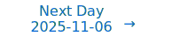

# Personalized Daily ArXiv Papers 2025-11-05

| *[gpt-5]*   | Prompt   | Completion   | Total   |
|:-----------:|:--------:|:------------:|:-------:|
| **Token**   | 80661    | 65226        | 145887  |
| **Cost**    | $0.1     | $0.65        | $0.75   |

Total arXiv papers: 829

Total scanned papers: 476

Total relevant papers: 56

**Table of contents with paper titles:**

1. [On the Emergence of Induction Heads for In-Context Learning](#user-content-link1)
**Authors:** Tiberiu Musat, Tiago Pimentel, Lorenzo Noci, Alessandro Stolfo, Mrinmaya Sachan, Thomas Hofmann

2. [Flashlight: PyTorch Compiler Extensions to Accelerate Attention Variants](#user-content-link2)
**Authors:** Bozhi You, Irene Wang, Zelal Su Mustafaoglu, Abhinav Jangda, Ang\'elica Moreira, Roshan Dathathri, Divya Mahajan, Keshav Pingali

3. [LongCat-Flash-Omni Technical Report](#user-content-link3)
**Authors:** Meituan LongCat Team, Bairui Wang, Bayan, Bin Xiao, Bo Zhang, Bolin Rong, Borun Chen, Chang Wan, Chao Zhang, Chen Huang, Chen Chen, Chen Chen, Chengxu Yang, Chengzuo Yang, Cong Han, Dandan Peng, Delian Ruan, Detai Xin, Disong Wang, Dongchao Yang, Fanfan Liu, Fengjiao Chen, Fengyu Yang, Gan Dong, Gang Huang, Gang Xu, Guanglu Wan, Guoqiang Tan, Guoqiao Yu, Haibo Qiu, Hao Lu, Hongbo Liu, Hongyu Xiang, Jiaheng Wu, Jian Yang, Jiaxing Liu, Jing Huang, Jingang Wang, Jinrui Ding, Juchao Jiang, Jun Kuang, Jun Wang, Junhui Mei, Ke Ding, Kefeng Zhang, Lei Chen, Liang Shi, Limeng Qiao, Liming Zheng, Lin Ma, Liuyang Guo, Liya Ma, Luying Sun, Man Gao, Mengshen Zhu, Miao Cao, Minliang Lin, Nuo Xu, Peng Shi, Qi Zhang, Qian Fang, Qian Wang, Qian Yang, Quanxiu Wang, Rongxiang Weng, Rongxin Guo, Ruoxuan Liang, Senbin Yang, Shanbo Xu, Shanglin Lei, Shengze Ye, Shimin Chen, Shuaiqi Chen, Shujie Hu, Shuo Li, Siqi Yang, Siyu Xu, Siyu Ren, Song Li, Songxiang Liu, Tianhao Bai, Tianye Dai, Wei Hong, Wei Wang, Weixiao Zhao, Wengang Cao, Wenlong Zhu, Wenlong He, Xi Su, Xi Nan, Xiaohan Zhao, Xiaohao Wang, Xiaoyu Zhao, Xiaoyu Wang, Xiaoyu Li, Xin Pan, Xin Chen, Xiusong Sun, Xu Xiang, Xudong Xing, Xuezhi Cao, Xunliang Cai, Yang Yang, Yanli Tan, Yao Yao, Yerui Sun, Yi Chen, Yifan Lu, Yin Gong, Yining Zhang, Yitian Chen, Yiyang Gan, Yuchen Tang, Yuchen Xie, Yueqian Wang, Yuewen Zheng, Yufei Zhang, Yufeng Zhong, Yulei Qian, Yuqi Peng, Yuwei Jiang, Zeyang Hu, Zheng Zhang, Zhengkun Tian, Zhiqing Hong, Zhixiong Zeng, Zhuqi Mi, Ziran Li, Ziwen Wang, Ziyi Zhao, Ziyuan Zhuang, Zizhe Zhao

4. [Opportunistic Expert Activation: Batch-Aware Expert Routing for Faster Decode Without Retraining](#user-content-link4)
**Authors:** Costin-Andrei Oncescu, Qingyang Wu, Wai Tong Chung, Robert Wu, Bryan Gopal, Junxiong Wang, Tri Dao, Ben Athiwaratkun

5. [FP8-Flow-MoE: A Casting-Free FP8 Recipe without Double Quantization Error](#user-content-link5)
**Authors:** Fengjuan Wang, Zhiyi Su, Xingzhu Hu, Cheng Wang, Mou Sun

6. [Scalable Processing-Near-Memory for 1M-Token LLM Inference: CXL-Enabled KV-Cache Management Beyond GPU Limits](#user-content-link6)
**Authors:** Dowon Kim, MinJae Lee, Janghyeon Kim, HyuckSung Kwon, Hyeonggyu Jeong, Sang-Soo Park, Minyong Yoon, Si-Dong Roh, Yongsuk Kwon, Jinin So, Jungwook Choi

7. [Linear Differential Vision Transformer: Learning Visual Contrasts via Pairwise Differentials](#user-content-link7)
**Authors:** Yifan Pu, Jixuan Ying, Qixiu Li, Tianzhu Ye, Dongchen Han, Xiaochen Wang, Ziyi Wang, Xinyu Shao, Gao Huang, Xiu Li

8. [Isotropic Curvature Model for Understanding Deep Learning Optimization: Is Gradient Orthogonalization Optimal?](#user-content-link8)
**Authors:** Weijie Su

9. [MISA: Memory-Efficient LLMs Optimization with Module-wise Importance Sampling](#user-content-link9)
**Authors:** Yuxi Liu, Renjia Deng, Yutong He, Xue Wang, Tao Yao, Kun Yuan

10. [The Hidden Power of Normalization: Exponential Capacity Control in Deep Neural Networks](#user-content-link10)
**Authors:** Khoat Than

11. [Loquetier: A Virtualized Multi-LoRA Framework for Unified LLM Fine-tuning and Serving](#user-content-link11)
**Authors:** Yuchen Zhang, Hanyue Du, Chun Cao, Jingwei Xu

12. [ExplicitLM: Decoupling Knowledge from Parameters via Explicit Memory Banks](#user-content-link12)
**Authors:** Chengzhang Yu, Zening Lu, Chenyang Zheng, Chiyue Wang, Yiming Zhang, Zhanpeng Jin

13. [Eliminating Multi-GPU Performance Taxes: A Systems Approach to Efficient Distributed LLMs](#user-content-link13)
**Authors:** Octavian Alexandru Trifan, Karthik Sangaiah, Muhammad Awad, Muhammad Osama, Sumanth Gudaparthi, Alexandru Nicolau, Alexander Veidenbaum, Ganesh Dasika

14. [From Models to Operators: Rethinking Autoscaling Granularity for Large Generative Models](#user-content-link14)
**Authors:** Xingqi Cui, Chieh-Jan Mike Liang, Jiarong Xing, Haoran Qiu

15. [Bayesian Natural Gradient Fine-Tuning of CLIP Models via Kalman Filtering](#user-content-link15)
**Authors:** Hossein Abdi, Mingfei Sun, Wei Pan

16. [A new class of Markov random fields enabling lightweight sampling](#user-content-link16)
**Authors:** Jean-Baptiste Courbot, Hugo Gangloff, Bruno Colicchio

17. [Optimal Singular Damage: Efficient LLM Inference in Low Storage Regimes](#user-content-link17)
**Authors:** Mohammadsajad Alipour, Mohammad Mohammadi Amiri

18. [Bulk-boundary decomposition of neural networks](#user-content-link18)
**Authors:** Donghee Lee, Hye-Sung Lee, Jaeok Yi

19. [Federated Attention: A Distributed Paradigm for Collaborative LLM Inference over Edge Networks](#user-content-link19)
**Authors:** Xiumei Deng, Zehui Xiong, Binbin Chen, Dong In Kim, Merouane Debbah, H. Vincent Poor

20. [Language Modeling With Factorization Memory](#user-content-link20)
**Authors:** Lee Xiong, Maksim Tkachenko, Johanes Effendi, Ting Cai

21. [Calibration Across Layers: Understanding Calibration Evolution in LLMs](#user-content-link21)
**Authors:** Abhinav Joshi, Areeb Ahmad, Ashutosh Modi

22. [Efficiently Training A Flat Neural Network Before It has been Quantizated](#user-content-link22)
**Authors:** Peng Xia, Junbiao Pang, Tianyang Cai

23. [From Uniform to Adaptive: General Skip-Block Mechanisms for Efficient PDE Neural Operators](#user-content-link23)
**Authors:** Lei Liu, Zhongyi Yu, Hong Wang, Huanshuo Dong, Haiyang Xin, Hongwei Zhao, Bin Li

24. [Apriel-H1: Towards Efficient Enterprise Reasoning Models](#user-content-link24)
**Authors:** Oleksiy Ostapenko, Luke Kumar, Raymond Li, Denis Kocetkov, Joel Lamy-Poirier, Shruthan Radhakrishna, Soham Parikh, Shambhavi Mishra, Sebastien Paquet, Srinivas Sunkara, Val\'erie B\'ecaert, Sathwik Tejaswi Madhusudhan, Torsten Scholak

25. [LLM Probing with Contrastive Eigenproblems: Improving Understanding and Applicability of CCS](#user-content-link25)
**Authors:** Stefan F. Schouten, Peter Bloem

26. [Calibrating and Rotating: A Unified Framework for Weight Conditioning in PEFT](#user-content-link26)
**Authors:** Da Chang, Peng Xue, Yu Li, Yongxiang Liu, Pengxiang Xu, Shixun Zhang

27. [Optimizing Attention on GPUs by Exploiting GPU Architectural NUMA Effects](#user-content-link27)
**Authors:** Mansi Choudhary, Karthik Sangaiah, Sonali Singh, Muhammad Osama, Lisa Wu Wills, Ganesh Dasika

28. [Redundancy Maximization as a Principle of Associative Memory Learning](#user-content-link28)
**Authors:** Mark Bl\"umel, Andreas C. Schneider, Valentin Neuhaus, David A. Ehrlich, Marcel Graetz, Michael Wibral, Abdullah Makkeh, Viola Priesemann

29. [Efficient Vector Symbolic Architectures from Histogram Recovery](#user-content-link29)
**Authors:** Zirui Deng, Netanel Raviv

30. [Scaling Graph Chain-of-Thought Reasoning: A Multi-Agent Framework with Efficient LLM Serving](#user-content-link30)
**Authors:** Chengying Huan, Ziheng Meng, Yongchao Liu, Zhengyi Yang, Yun Zhu, Yue Yun, Shipeng Li, Rong Gu, Xiabao Wu, Haitao Zhang, Chuntao Hong, Shaonan Ma, Guihai Chen, Chen Tian

31. [A Proof of Learning Rate Transfer under $\mu$P](#user-content-link31)
**Authors:** Soufiane Hayou

32. [Accelerated Frank-Wolfe Algorithms: Complementarity Conditions and Sparsity](#user-content-link32)
**Authors:** Dan Garber

33. [Belief Dynamics Reveal the Dual Nature of In-Context Learning and Activation Steering](#user-content-link33)
**Authors:** Eric Bigelow, Daniel Wurgaft, YingQiao Wang, Noah Goodman, Tomer Ullman, Hidenori Tanaka, Ekdeep Singh Lubana

34. [Real-time Continual Learning on Intel Loihi 2](#user-content-link34)
**Authors:** Elvin Hajizada, Danielle Rager, Timothy Shea, Leobardo Campos-Macias, Andreas Wild, Eyke H\"ullermeier, Yulia Sandamirskaya, Mike Davies

35. [Adam Reduces a Unique Form of Sharpness: Theoretical Insights Near the Minimizer Manifold](#user-content-link35)
**Authors:** Xinghan Li, Haodong Wen, Kaifeng Lyu

36. [DTS: Enhancing Large Reasoning Models via Decoding Tree Sketching](#user-content-link36)
**Authors:** Zicheng Xu, Guanchu Wang, Yu-Neng Chuang, Guangyao Zheng, Alexander S. Szalay, Zirui Liu, Vladimir Braverman

37. [More Than A Shortcut: A Hyperbolic Approach To Early-Exit Networks](#user-content-link37)
**Authors:** Swapnil Bhosale, Cosmin Frateanu, Camilla Clark, Arnoldas Jasonas, Chris Mitchell, Xiatian Zhu, Vamsi Krishna Ithapu, Giacomo Ferroni, Cagdas Bilen, Sanjeel Parekh

38. [Shared Parameter Subspaces and Cross-Task Linearity in Emergently Misaligned Behavior](#user-content-link38)
**Authors:** Daniel Aarao Reis Arturi, Eric Zhang, Andrew Ansah, Kevin Zhu, Ashwinee Panda, Aishwarya Balwani

39. [Natural Building Blocks for Structured World Models: Theory, Evidence, and Scaling](#user-content-link39)
**Authors:** Lancelot Da Costa, Sanjeev Namjoshi, Mohammed Abbas Ansari, Bernhard Sch\"olkopf

40. [CudaForge: An Agent Framework with Hardware Feedback for CUDA Kernel Optimization](#user-content-link40)
**Authors:** Zijian Zhang, Rong Wang, Shiyang Li, Yuebo Luo, Mingyi Hong, Caiwen Ding

41. [EchoLSTM: A Self-Reflective Recurrent Network for Stabilizing Long-Range Memory](#user-content-link41)
**Authors:** Prasanth K K, Shubham Sharma

42. [Energy-Efficient Deep Learning Without Backpropagation: A Rigorous Evaluation of Forward-Only Algorithms](#user-content-link42)
**Authors:** Przemys{\l}aw Spyra, Witold Dzwinel

43. [In Good GRACEs: Principled Teacher Selection for Knowledge Distillation](#user-content-link43)
**Authors:** Abhishek Panigrahi, Bingbin Liu, Sadhika Malladi, Sham Kakade, Surbhi Goel

44. [Forget BIT, It is All about TOKEN: Towards Semantic Information Theory for LLMs](#user-content-link44)
**Authors:** Bo Bai

45. [When, What, and How: Rethinking Retrieval-Enhanced Speculative Decoding](#user-content-link45)
**Authors:** Min Fang, Zhihui Fu, Qibin Zhao, Jun Wang

46. [ConMeZO: Adaptive Descent-Direction Sampling for Gradient-Free Finetuning of Large Language Models](#user-content-link46)
**Authors:** Lejs Deen Behric, Liang Zhang, Bingcong Li, Kiran Koshy Thekumparampil

47. [In Situ Training of Implicit Neural Compressors for Scientific Simulations via Sketch-Based Regularization](#user-content-link47)
**Authors:** Cooper Simpson, Stephen Becker, Alireza Doostan

48. [A Non-Adversarial Approach to Idempotent Generative Modelling](#user-content-link48)
**Authors:** Mohammed Al-Jaff, Giovanni Luca Marchetti, Michael C Welle, Jens Lundell, Mats G. Gustafsson, Gustav Eje Henter, Hossein Azizpour, Danica Kragic

49. [Re-FORC: Adaptive Reward Prediction for Efficient Chain-of-Thought Reasoning](#user-content-link49)
**Authors:** Renos Zabounidis, Aditya Golatkar, Michael Kleinman, Alessandro Achille, Wei Xia, Stefano Soatto

50. [OmniField: Conditioned Neural Fields for Robust Multimodal Spatiotemporal Learning](#user-content-link50)
**Authors:** Kevin Valencia, Thilina Balasooriya, Xihaier Luo, Shinjae Yoo, David Keetae Park

51. [How Focused Are LLMs? A Quantitative Study via Repetitive Deterministic Prediction Tasks](#user-content-link51)
**Authors:** Wanda Hou, Leon Zhou, Hong-Ye Hu, Yi-Zhuang You, Xiao-Liang Qi

52. [Generalizing Test-time Compute-optimal Scaling as an Optimizable Graph](#user-content-link52)
**Authors:** Fali Wang, Jihai Chen, Shuhua Yang, Runxue Bao, Tianxiang Zhao, Zhiwei Zhang, Xianfeng Tang, Hui Liu, Qi He, Suhang Wang

53. [DoFlow: Causal Generative Flows for Interventional and Counterfactual Time-Series Prediction](#user-content-link53)
**Authors:** Dongze Wu, Feng Qiu, Yao Xie

54. [Mutual Information guided Visual Contrastive Learning](#user-content-link54)
**Authors:** Hanyang Chen, Yanchao Yang

55. [The stability of shallow neural networks on spheres: A sharp spectral analysis](#user-content-link55)
**Authors:** Xinliang Liu, Tong Mao, Jinchao Xu

56. [Multi-Step Knowledge Interaction Analysis via Rank-2 Subspace Disentanglement](#user-content-link56)
**Authors:** Sekh Mainul Islam, Pepa Atanasova, Isabelle Augenstein

---

## 1. [On the Emergence of Induction Heads for In-Context Learning](https://arxiv.org/abs/2511.01033) 

**ArXiv ID:** 2511.01033

**Authors:** Tiberiu Musat, Tiago Pimentel, Lorenzo Noci, Alessandro Stolfo, Mrinmaya Sachan, Thomas Hofmann

**Abstract:** Transformers have become the dominant architecture for natural language processing. Part of their success is owed to a remarkable capability known as in-context learning (ICL): they can acquire and apply novel associations solely from their input context, without any updates to their weights. In this work, we study the emergence of induction heads, a previously identified mechanism in two-layer transformers that is particularly important for in-context learning. We uncover a relatively simple and interpretable structure of the weight matrices implementing the induction head. We theoretically explain the origin of this structure using a minimal ICL task formulation and a modified transformer architecture. We give a formal proof that the training dynamics remain constrained to a 19-dimensional subspace of the parameter space. Empirically, we validate this constraint while observing that only 3 dimensions account for the emergence of an induction head. By further studying the training dynamics inside this 3-dimensional subspace, we find that the time until the emergence of an induction head follows a tight asymptotic bound that is quadratic in the input context length.

**Comment:** Representation Learning/Training Dynamics: theoretical and empirical analysis of induction-head emergence with provable low-dimensional subspace constraints and scaling of emergence time.

**Relevance:** 10
**Novelty:** 8

---

## 2. [Flashlight: PyTorch Compiler Extensions to Accelerate Attention Variants](https://arxiv.org/abs/2511.02043) 

**ArXiv ID:** 2511.02043

**Authors:** Bozhi You, Irene Wang, Zelal Su Mustafaoglu, Abhinav Jangda, Ang\'elica Moreira, Roshan Dathathri, Divya Mahajan, Keshav Pingali

**Abstract:** Bad charactors when submitting to arXiv: Attention is a fundamental building block of large language models (LLMs), so there have been many efforts to implement it efficiently. For example, FlashAttention leverages tiling and kernel fusion to optimize attention. Recently, a number of variants of attention have been introduced to enhance model quality or efficiency. Supporting them efficiently remains difficult since they usually require specialized kernels or hand-tuned implementations. FlexAttention recently addressed part of this gap by using static programming templates to support FlashAttention-like kernels for a subset of attention variants.   In this paper, we introduce Flashlight, a compiler-native framework within the PyTorch ecosystem that automatically generates fused, FlashAttention-style kernels for arbitrary attention-based programs, without relying on static templates or predefined kernel specializations. Flashlight leverages PyTorch's compilation workflow to fuse and tile attention computations transparently, enabling efficient execution for diverse attention patterns. Not only does it support all variants expressible in the FlexAttention model but it also handles more general, data-dependent attention formulations that are beyond the capabilities of FlexAttention.   Our results show that Flashlight produces kernels with competitive or superior performance to FlexAttention, while offering the flexibility of native PyTorch code, enabling developers to rapidly explore new attention models without sacrificing performance.

**Comment:** High Performance Computing: compiler-native PyTorch extensions that automatically generate fused, FlashAttention-style kernels for diverse attention variants with tiling and fusion.

**Relevance:** 10
**Novelty:** 8

---

## 3. [LongCat-Flash-Omni Technical Report](https://arxiv.org/abs/2511.00279) 

**ArXiv ID:** 2511.00279

**Authors:** Meituan LongCat Team, Bairui Wang, Bayan, Bin Xiao, Bo Zhang, Bolin Rong, Borun Chen, Chang Wan, Chao Zhang, Chen Huang, Chen Chen, Chen Chen, Chengxu Yang, Chengzuo Yang, Cong Han, Dandan Peng, Delian Ruan, Detai Xin, Disong Wang, Dongchao Yang, Fanfan Liu, Fengjiao Chen, Fengyu Yang, Gan Dong, Gang Huang, Gang Xu, Guanglu Wan, Guoqiang Tan, Guoqiao Yu, Haibo Qiu, Hao Lu, Hongbo Liu, Hongyu Xiang, Jiaheng Wu, Jian Yang, Jiaxing Liu, Jing Huang, Jingang Wang, Jinrui Ding, Juchao Jiang, Jun Kuang, Jun Wang, Junhui Mei, Ke Ding, Kefeng Zhang, Lei Chen, Liang Shi, Limeng Qiao, Liming Zheng, Lin Ma, Liuyang Guo, Liya Ma, Luying Sun, Man Gao, Mengshen Zhu, Miao Cao, Minliang Lin, Nuo Xu, Peng Shi, Qi Zhang, Qian Fang, Qian Wang, Qian Yang, Quanxiu Wang, Rongxiang Weng, Rongxin Guo, Ruoxuan Liang, Senbin Yang, Shanbo Xu, Shanglin Lei, Shengze Ye, Shimin Chen, Shuaiqi Chen, Shujie Hu, Shuo Li, Siqi Yang, Siyu Xu, Siyu Ren, Song Li, Songxiang Liu, Tianhao Bai, Tianye Dai, Wei Hong, Wei Wang, Weixiao Zhao, Wengang Cao, Wenlong Zhu, Wenlong He, Xi Su, Xi Nan, Xiaohan Zhao, Xiaohao Wang, Xiaoyu Zhao, Xiaoyu Wang, Xiaoyu Li, Xin Pan, Xin Chen, Xiusong Sun, Xu Xiang, Xudong Xing, Xuezhi Cao, Xunliang Cai, Yang Yang, Yanli Tan, Yao Yao, Yerui Sun, Yi Chen, Yifan Lu, Yin Gong, Yining Zhang, Yitian Chen, Yiyang Gan, Yuchen Tang, Yuchen Xie, Yueqian Wang, Yuewen Zheng, Yufei Zhang, Yufeng Zhong, Yulei Qian, Yuqi Peng, Yuwei Jiang, Zeyang Hu, Zheng Zhang, Zhengkun Tian, Zhiqing Hong, Zhixiong Zeng, Zhuqi Mi, Ziran Li, Ziwen Wang, Ziyi Zhao, Ziyuan Zhuang, Zizhe Zhao

**Abstract:** We introduce LongCat-Flash-Omni, a state-of-the-art open-source omni-modal model with 560 billion parameters, excelling at real-time audio-visual interaction. By adopting a curriculum-inspired progressive training strategy that transitions from simpler to increasingly complex modality sequence modeling tasks, LongCat-Flash-Omni attains comprehensive multimodal capabilities while maintaining strong unimodal capability. Building upon LongCat-Flash, which adopts a high-performance Shortcut-connected Mixture-of-Experts (MoE) architecture with zero-computation experts, LongCat-Flash-Omni integrates efficient multimodal perception and speech reconstruction modules. Despite its immense size of 560B parameters (with 27B activated), LongCat-Flash-Omni achieves low-latency real-time audio-visual interaction. For training infrastructure, we developed a modality-decoupled parallelism scheme specifically designed to manage the data and model heterogeneity inherent in large-scale multimodal training. This innovative approach demonstrates exceptional efficiency by sustaining over 90% of the throughput achieved by text-only training. Extensive evaluations show that LongCat-Flash-Omni achieves state-of-the-art performance on omni-modal benchmarks among open-source models. Furthermore, it delivers highly competitive results across a wide range of modality-specific tasks, including text, image, and video understanding, as well as audio understanding and generation. We provide a comprehensive overview of the model architecture design, training procedures, and data strategies, and open-source the model to foster future research and development in the community.

**Comment:** Model Architecture (MoE) + HPC: Shortcut-connected MoE with zero-computation experts and modality-decoupled parallelism for efficient large-scale multimodal training.

**Relevance:** 10
**Novelty:** 8

---

## 4. [Opportunistic Expert Activation: Batch-Aware Expert Routing for Faster Decode Without Retraining](https://arxiv.org/abs/2511.02237) 

**ArXiv ID:** 2511.02237

**Authors:** Costin-Andrei Oncescu, Qingyang Wu, Wai Tong Chung, Robert Wu, Bryan Gopal, Junxiong Wang, Tri Dao, Ben Athiwaratkun

**Abstract:** An increasing number of LLMs employ Mixture-of-Experts (MoE) architectures where the feed-forward layer is replaced by a pool of experts and each token only activates a small subset of them. During autoregressive generation, these models often enter a memory-bound regime even for moderate batch sizes because the average expert load grows more slowly than in an equivalent dense feedforward layer. Consequently, MoE latency is governed by the number of activated experts. We introduce a framework for dynamically re-routing token-to-expert mapping to lower this number (and thus, the decode latency) while preserving a comparable quality. Our best results use a batch-aware routing that works by having tokens piggyback experts that have already been loaded into memory due to being crucial to other tokens within the same batch. Empirically, we evaluate our method on the Qwen3-30B and Qwen3-235B models with a batch size of $16$. Without any statistically significant loss in accuracy, our approach achieves latency reductions of $39\%$ and $15\%$ in the MoE layer decode latency, respectively.

**Comment:** MoE Efficiency: batch-aware opportunistic expert activation to reduce activated experts and decode latency without retraining.

**Relevance:** 10
**Novelty:** 8

---

## 5. [FP8-Flow-MoE: A Casting-Free FP8 Recipe without Double Quantization Error](https://arxiv.org/abs/2511.02302) 

**ArXiv ID:** 2511.02302

**Authors:** Fengjuan Wang, Zhiyi Su, Xingzhu Hu, Cheng Wang, Mou Sun

**Abstract:** Training large Mixture-of-Experts (MoE) models remains computationally prohibitive due to their extreme compute and memory demands. Although low-precision training promises to accelerate computation and reduce memory footprint, existing implementations still rely on BF16-dominated dataflows with frequent quantize-dequantize (Q/DQ) conversions. These redundant casts erode much of FP8's theoretical efficiency. However, naively removing these casts by keeping dataflows entirely in FP8 introduces double quantization error: tensors quantized along different dimensions accumulate inconsistent scaling factors, degrading numerical stability.   We propose FP8-Flow-MoE, an FP8 training recipe featuring a quantization-consistent FP8-centric dataflow with a scaling-aware transpose and fused FP8 operators that streamline computation and eliminate explicit cast operations from 12 to 2. Evaluations on a 671B-parameter MoE model demonstrate up to 21\% higher throughput and 16.5 GB lower memory usage per GPU compared to BF16 and na\"ive FP8 baselines, while maintaining stable convergence. We provide a plug-and-play FP8 recipe compatible with TransformerEngine and Megatron-LM, which will be open-sourced soon.

**Comment:** High Performance Computing + Low-Precision Training: FP8-centric, quantization-consistent dataflow for MoE with fused operators, eliminating cast overhead and avoiding double quantization error.

**Relevance:** 10
**Novelty:** 8

---

## 6. [Scalable Processing-Near-Memory for 1M-Token LLM Inference: CXL-Enabled KV-Cache Management Beyond GPU Limits](https://arxiv.org/abs/2511.00321) 

**ArXiv ID:** 2511.00321

**Authors:** Dowon Kim, MinJae Lee, Janghyeon Kim, HyuckSung Kwon, Hyeonggyu Jeong, Sang-Soo Park, Minyong Yoon, Si-Dong Roh, Yongsuk Kwon, Jinin So, Jungwook Choi

**Abstract:** The expansion of context windows in large language models (LLMs) to multi-million tokens introduces severe memory and compute bottlenecks, particularly in managing the growing Key-Value (KV) cache. While Compute Express Link (CXL) enables non-eviction frameworks that offload the full KV-cache to scalable external memory, these frameworks still suffer from costly data transfers when recalling non-resident KV tokens to limited GPU memory as context lengths increase. This work proposes scalable Processing-Near-Memory (PNM) for 1M-Token LLM Inference, a CXL-enabled KV-cache management system that coordinates memory and computation beyond GPU limits. Our design offloads token page selection to a PNM accelerator within CXL memory, eliminating costly recalls and enabling larger GPU batch sizes. We further introduce a hybrid parallelization strategy and a steady-token selection mechanism to enhance compute efficiency and scalability. Implemented atop a state-of-the-art CXL-PNM system, our solution delivers consistent performance gains for LLMs with up to 405B parameters and 1M-token contexts. Our PNM-only offloading scheme (PNM-KV) and GPU-PNM hybrid with steady-token execution (PnG-KV) achieve up to 21.9x throughput improvement, up to 60x lower energy per token, and up to 7.3x better total cost efficiency than the baseline, demonstrating that CXL-enabled multi-PNM architectures can serve as a scalable backbone for future long-context LLM inference.

**Comment:** High Performance Computing/Memory Optimization: CXL-enabled processing-near-memory KV-cache management and hybrid execution for 1M-token LLM inference.

**Relevance:** 10
**Novelty:** 8

---

## 7. [Linear Differential Vision Transformer: Learning Visual Contrasts via Pairwise Differentials](https://arxiv.org/abs/2511.00833) 

**ArXiv ID:** 2511.00833

**Authors:** Yifan Pu, Jixuan Ying, Qixiu Li, Tianzhu Ye, Dongchen Han, Xiaochen Wang, Ziyi Wang, Xinyu Shao, Gao Huang, Xiu Li

**Abstract:** Vision Transformers (ViTs) have become a universal backbone for both image recognition and image generation. Yet their Multi-Head Self-Attention (MHSA) layer still performs a quadratic query-key interaction for every token pair, spending the bulk of computation on visually weak or redundant correlations. We introduce Visual-Contrast Attention (VCA), a drop-in replacement for MHSA that injects an explicit notion of discrimination while reducing the theoretical complexity from O(N N C) to O(N n C) with n << N. VCA first distils each head's dense query field into a handful of spatially pooled visual-contrast tokens, then splits them into a learnable positive and negative stream whose differential interaction highlights what truly separates one region from another. The module adds fewer than 0.3M parameters to a DeiT-Tiny backbone, requires no extra FLOPs, and is wholly architecture-agnostic. Empirically, VCA lifts DeiT-Tiny top-1 accuracy on ImageNet-1K from 72.2% to 75.6% (+3.4) and improves three strong hierarchical ViTs by up to 3.1%, while in class-conditional ImageNet generation it lowers FID-50K by 2.1 to 5.2 points across both diffusion (DiT) and flow (SiT) models. Extensive ablations confirm that (i) spatial pooling supplies low-variance global cues, (ii) dual positional embeddings are indispensable for contrastive reasoning, and (iii) combining the two in both stages yields the strongest synergy. VCA therefore offers a simple path towards faster and sharper Vision Transformers. The source code is available at https://github.com/LeapLabTHU/LinearDiff.

**Comment:** Model Architecture and Efficiency: introduces Visual-Contrast Attention that replaces MHSA, reducing complexity from quadratic to O(N n C) with architectural modifications enabling sparse, contrastive interactions.

**Relevance:** 9
**Novelty:** 8

---

## 8. [Isotropic Curvature Model for Understanding Deep Learning Optimization: Is Gradient Orthogonalization Optimal?](https://arxiv.org/abs/2511.00674) 

**ArXiv ID:** 2511.00674

**Authors:** Weijie Su

**Abstract:** In this paper, we introduce a model for analyzing deep learning optimization over a single iteration by leveraging the matrix structure of the weights. We derive the model by assuming isotropy of curvature, including the second-order Hessian and higher-order terms, of the loss function across all perturbation directions; hence, we call it the isotropic curvature model. This model is a convex optimization program amenable to analysis, which allows us to understand how an update on the weights in the form of a matrix relates to the change in the total loss function. As an application, we use the isotropic curvature model to analyze the recently introduced Muon optimizer and other matrix-gradient methods for training language models. First, we show that under a general growth condition on the curvature, the optimal update matrix is obtained by making the spectrum of the original gradient matrix more homogeneous -- that is, making its singular values closer in ratio -- which in particular improves the conditioning of the update matrix. Next, we show that the orthogonalized gradient becomes optimal for the isotropic curvature model when the curvature exhibits a phase transition in growth. Taken together, these results suggest that the gradient orthogonalization employed in Muon and other related methods is directionally correct but may not be strictly optimal. Finally, we discuss future research on how to leverage the isotropic curvature model for designing new optimization methods for training deep learning and language models.

**Comment:** Training Dynamics/Optimization Theory: isotropic curvature model to analyze single-iteration updates and explain when gradient orthogonalization is optimal, informing optimizer design.

**Relevance:** 9
**Novelty:** 8

---

## 9. [MISA: Memory-Efficient LLMs Optimization with Module-wise Importance Sampling](https://arxiv.org/abs/2511.00056) 

**ArXiv ID:** 2511.00056

**Authors:** Yuxi Liu, Renjia Deng, Yutong He, Xue Wang, Tao Yao, Kun Yuan

**Abstract:** The substantial memory demands of pre-training and fine-tuning large language models (LLMs) require memory-efficient optimization algorithms. One promising approach is layer-wise optimization, which treats each transformer block as a single layer and optimizes it sequentially, while freezing the other layers to save optimizer states and activations. Although effective, these methods ignore the varying importance of the modules within each layer, leading to suboptimal performance. Moreover, layer-wise sampling provides only limited memory savings, as at least one full layer must remain active during optimization. To overcome these limitations, we propose Module-wise Importance SAmpling (MISA), a novel method that divides each layer into smaller modules and assigns importance scores to each module. MISA uses a weighted random sampling mechanism to activate modules, provably reducing gradient variance compared to layer-wise sampling. Additionally, we establish an \(\mathcal{O}(1/\sqrt{K})\) convergence rate under non-convex and stochastic conditions, where $K$ is the total number of block updates, and provide a detailed memory analysis showcasing MISA's superiority over existing baseline methods. Experiments on diverse learning tasks validate the effectiveness of MISA. Source code is available at https://github.com/pkumelon/MISA.

**Comment:** High-Efficiency Training: memory-efficient LLM optimization via module-wise importance sampling with variance reduction, convergence guarantees, and favorable memory analysis.

**Relevance:** 9
**Novelty:** 8

---

## 10. [The Hidden Power of Normalization: Exponential Capacity Control in Deep Neural Networks](https://arxiv.org/abs/2511.00958) 

**ArXiv ID:** 2511.00958

**Authors:** Khoat Than

**Abstract:** Normalization methods are fundamental components of modern deep neural networks (DNNs). Empirically, they are known to stabilize optimization dynamics and improve generalization. However, the underlying theoretical mechanism by which normalization contributes to both optimization and generalization remains largely unexplained, especially when using many normalization layers in a DNN architecture.   In this work, we develop a theoretical framework that elucidates the role of normalization through the lens of capacity control. We prove that an unnormalized DNN can exhibit exponentially large Lipschitz constants with respect to either its parameters or inputs, implying excessive functional capacity and potential overfitting. Such bad DNNs are uncountably many. In contrast, the insertion of normalization layers provably can reduce the Lipschitz constant at an exponential rate in the number of normalization operations. This exponential reduction yields two fundamental consequences: (1) it smooths the loss landscape at an exponential rate, facilitating faster and more stable optimization; and (2) it constrains the effective capacity of the network, thereby enhancing generalization guarantees on unseen data. Our results thus offer a principled explanation for the empirical success of normalization methods in deep learning.

**Comment:** Representation Learning/Theory: shows normalization yields exponential Lipschitz reduction, explaining smoother optimization and better generalization (capacity control).

**Relevance:** 9
**Novelty:** 8

---

## 11. [Loquetier: A Virtualized Multi-LoRA Framework for Unified LLM Fine-tuning and Serving](https://arxiv.org/abs/2511.00101) 

**ArXiv ID:** 2511.00101

**Authors:** Yuchen Zhang, Hanyue Du, Chun Cao, Jingwei Xu

**Abstract:** Low-Rank Adaptation (LoRA) has become a widely adopted parameter-efficient fine-tuning (PEFT) technique for adapting large language models (LLMs) to downstream tasks. While prior work has explored strategies for integrating LLM training and serving, there still remains a gap in unifying fine-tuning and inference for LoRA-based models. We present Loquetier, a virtualized multi-LoRA framework that seamlessly integrates LoRA fine-tuning and serving within a single runtime. Loquetier introduces two key components: (1) a Virtualized Module that isolates PEFT-based modifications and supports multiple adapters on a shared base model, and (2) an optimized computation flow with a kernel design that merges fine-tuning and inference paths in forward propagation, enabling efficient batching and minimizing kernel invocation overhead. Extensive experiments across three task settings show that Loquetier consistently outperforms existing baselines in both performance and flexibility, achieving up to $3.0\times$ the throughput of the state-of-the-art co-serving system on inference-only tasks and $46.4\times$ higher SLO attainment than PEFT on unified fine-tuning and inference tasks. The implementation of Loquetier is publicly available at https://github.com/NJUDeepEngine/Loquetier.

**Comment:** Compression/Efficiency + Systems: virtualized multi-LoRA unifying fine-tuning and serving with shared base model and merged forward kernels for high-throughput co-serving.

**Relevance:** 9
**Novelty:** 8

---

## 12. [ExplicitLM: Decoupling Knowledge from Parameters via Explicit Memory Banks](https://arxiv.org/abs/2511.01581) 

**ArXiv ID:** 2511.01581

**Authors:** Chengzhang Yu, Zening Lu, Chenyang Zheng, Chiyue Wang, Yiming Zhang, Zhanpeng Jin

**Abstract:** Large language models suffer from knowledge staleness and lack of interpretability due to implicit knowledge storage across entangled network parameters, preventing targeted updates and reasoning transparency. We propose ExplicitLM, a novel architecture featuring a million-scale external memory bank storing human-readable knowledge as token sequences, enabling direct inspection and modification. We design a differentiable two-stage retrieval mechanism with efficient coarse-grained filtering via product key decomposition (reducing complexity from $\mathcal{O}(N \cdot |I|)$ to $\mathcal{O}(\sqrt{N} \cdot |I|)$) and fine-grained Gumbel-Softmax matching for end-to-end training. Inspired by dual-system cognitive theory, we partition knowledge into frozen explicit facts (20%) and learnable implicit patterns (80%), maintained through Exponential Moving Average updates for stability. ExplicitLM achieves up to 43.67% improvement on knowledge-intensive tasks versus standard Transformers, with 3.62$\times$ gains in low-data regimes (10k samples). Analysis shows strong correlations between memory retrieval and performance, with correct predictions achieving 49% higher hit rates. Unlike RAG systems with frozen retrieval, our jointly optimized architecture demonstrates that interpretable, updatable models can maintain competitive performance while providing unprecedented knowledge transparency.

**Comment:** Model Architecture: external explicit memory bank with differentiable two-stage retrieval and conditional routing (product-key filtering + Gumbel-Softmax) for interpretable, updatable knowledge.

**Relevance:** 9
**Novelty:** 8

---

## 13. [Eliminating Multi-GPU Performance Taxes: A Systems Approach to Efficient Distributed LLMs](https://arxiv.org/abs/2511.02168) 

**ArXiv ID:** 2511.02168

**Authors:** Octavian Alexandru Trifan, Karthik Sangaiah, Muhammad Awad, Muhammad Osama, Sumanth Gudaparthi, Alexandru Nicolau, Alexander Veidenbaum, Ganesh Dasika

**Abstract:** As large language models (LLMs) continue to scale, their workloads increasingly rely on distributed execution across multiple GPUs. However, the conventional bulk synchronous parallel~(BSP) model used in such settings introduces significant performance inefficiencies. To characterize these bottlenecks, we introduce the ''Three Taxes'' (Bulk Synchronous, Inter-Kernel Data Locality, and Kernel Launch Overhead) as an analytical framework. We propose moving beyond the rigid BSP model to address key inefficiencies in distributed GPU execution. By exploiting libraries like Iris for Triton, we gain access to in-kernel communication primitives that enable the design of novel fine-grained programming patterns, offering greater flexibility and performance than traditional BSP-based approaches. These patterns systematically eliminate the three taxes by creating direct, tile-level producer-consumer pipelines and replacing global barriers with fine-grained dataflow synchronization. Applying this methodology to critical kernels, from the foundational All-Gather + general matrix multiplication operation to the complex Flash Decode algorithm, we observe a 10-20% speedup in end-to-end latency over BSP-based approaches, establishing a more programmable and efficient paradigm for distributed LLM workloads.

**Comment:** HPC/Systems: in-kernel communication and fine-grained dataflow synchronization to eliminate BSP taxes and improve distributed LLM efficiency.

**Relevance:** 9
**Novelty:** 8

---

## 14. [From Models to Operators: Rethinking Autoscaling Granularity for Large Generative Models](https://arxiv.org/abs/2511.02248) 

**ArXiv ID:** 2511.02248

**Authors:** Xingqi Cui, Chieh-Jan Mike Liang, Jiarong Xing, Haoran Qiu

**Abstract:** Serving large generative models such as LLMs and multi- modal transformers requires balancing user-facing SLOs (e.g., time-to-first-token, time-between-tokens) with provider goals of efficiency and cost reduction. Existing solutions rely on static provisioning or model-level autoscaling, both of which treat the model as a monolith. This coarse-grained resource management leads to degraded performance or significant resource underutilization due to poor adaptability to dynamic inference traffic that is common online.   The root cause of this inefficiency lies in the internal structure of generative models: they are executed as graphs of interconnected operators. Through detailed characterization and systematic analysis, we find that operators are heterogeneous in their compute and memory footprints and exhibit diverse sensitivity to workload and resource factors such as batch size, sequence length, and traffic rate. This heterogeneity suggests that the operator, rather than the entire model, is the right granularity for scaling decisions.   We propose an operator-level autoscaling framework, which allocates resources at finer (operator)-granularity, optimizing the scaling, batching, and placement based on individual operator profiles. Evaluated on production-scale traces, our approach preserves SLOs with up to 40% fewer GPUs and 35% less energy, or under fixed resources achieves 1.6x higher throughput with 5% less energy. These results show that the operator, rather than the model, is fundamentally a more effective unit for scaling large generative workloads.

**Comment:** Systems/HPC: operator-level autoscaling for LLM inference with fine-grained scaling, batching, and placement; significant resource and energy savings.

**Relevance:** 9
**Novelty:** 8

---

## 15. [Bayesian Natural Gradient Fine-Tuning of CLIP Models via Kalman Filtering](https://arxiv.org/abs/2511.01694) 

**ArXiv ID:** 2511.01694

**Authors:** Hossein Abdi, Mingfei Sun, Wei Pan

**Abstract:** Vision-language pre-trained models, such as CLIP, have established new benchmarks in multimodal data mining. In such models, few-shot fine-tuning is a major challenge to achieve optimal performance on both in-distribution (ID) and out-of-distribution (OOD) datasets, especially when labeled data is scarce. Most existing fine-tuning approaches rely on first-order gradient-based optimizers, which typically suffer from slow convergence, sensitivity to step-size hyperparameters, and poor generalization in OOD settings. In contrast, second-order methods utilize local curvature information of the loss landscape to adjust the update step size. This is particularly beneficial for CLIP models, whose non-convex loss functions often contain sharp critical points. In such cases, natural gradient direction can offer more substantial and efficient per-iteration updates when fine-tuning with limited data. Natural Gradient Descent (NGD) is obtained by preconditioning the standard gradient with the inverse Fisher Information Matrix (FIM), which is computationally expensive for large models. To address this, we propose a Bayesian approximation of NGD using a Kalman filter for CLIP models. Our method combines the benefits of second-order optimization with Bayesian inference, which enhances generalization while providing uncertainty quantification. Extensive experiments conducted on diverse image classification datasets demonstrate that our algorithm consistently achieves superior--or comparable--ID performance and improved OOD robustness compared to state-of-the-art baselines. To the best of our knowledge, this work represents the first successful application of Kalman filtering to fine-tuning CLIP-based models, which enables more robust and efficient learning in vision-language tasks.

**Comment:** Matches Efficiency/Optimization: Bayesian natural gradient fine-tuning via Kalman filtering approximates NGD for large CLIP models, improving training efficiency and robustness.

**Relevance:** 9
**Novelty:** 8

---

## 16. [A new class of Markov random fields enabling lightweight sampling](https://arxiv.org/abs/2511.02373) 

**ArXiv ID:** 2511.02373

**Authors:** Jean-Baptiste Courbot, Hugo Gangloff, Bruno Colicchio

**Abstract:** This work addresses the problem of efficient sampling of Markov random fields (MRF). The sampling of Potts or Ising MRF is most often based on Gibbs sampling, and is thus computationally expensive. We consider in this work how to circumvent this bottleneck through a link with Gaussian Markov Random fields. The latter can be sampled in several cost-effective ways, and we introduce a mapping from real-valued GMRF to discrete-valued MRF. The resulting new class of MRF benefits from a few theoretical properties that validate the new model. Numerical results show the drastic performance gain in terms of computational efficiency, as we sample at least 35x faster than Gibbs sampling using at least 37x less energy, all the while exhibiting empirical properties close to classical MRFs.

**Comment:** Matches Efficiency and Model Architecture: introduces a new class of MRFs via mapping from GMRFs enabling lightweight, much faster sampling than Gibbs.

**Relevance:** 9
**Novelty:** 8

---

## 17. [Optimal Singular Damage: Efficient LLM Inference in Low Storage Regimes](https://arxiv.org/abs/2511.02681) 

**ArXiv ID:** 2511.02681

**Authors:** Mohammadsajad Alipour, Mohammad Mohammadi Amiri

**Abstract:** Large language models (LLMs) are increasingly prevalent across diverse applications. However, their enormous size limits storage and processing capabilities to a few well-resourced stakeholders. As a result, most applications rely on pre-trained LLMs, fine-tuned for specific tasks. However, even storing the fine-tuned versions of these models remains a significant challenge due to the wide range of tasks they address. Recently, studies show that fine-tuning these models primarily affects a small fraction of parameters, highlighting the need for more efficient storage of fine-tuned models. This paper focuses on efficient storage of parameter updates in pre-trained models after fine-tuning. To address this challenge, we leverage the observation that fine-tuning updates are both low-rank and sparse, which can be utilized for storage efficiency. However, using only low-rank approximation or sparsification may discard critical singular components that enhance model expressivity. We first observe that given the same memory budget, sparsified low-rank approximations with larger ranks outperform standard low-rank approximations with smaller ranks. Building on this, we propose our method, optimal singular damage, that selectively sparsifies low-rank approximated updates by leveraging the interleaved importance of singular vectors, ensuring that the most impactful components are retained. We demonstrate through extensive experiments that our proposed methods lead to significant storage efficiency and superior accuracy within the same memory budget compared to employing the low-rank approximation or sparsification individually.

**Comment:** Model Compression and Efficiency: selectively sparsified low-rank storage of fine-tuning updates leveraging interleaved singular vector importance (sparsity + low-rank).

**Relevance:** 9
**Novelty:** 8

---

## 18. [Bulk-boundary decomposition of neural networks](https://arxiv.org/abs/2511.02003) 

**ArXiv ID:** 2511.02003

**Authors:** Donghee Lee, Hye-Sung Lee, Jaeok Yi

**Abstract:** We present the bulk-boundary decomposition as a new framework for understanding the training dynamics of deep neural networks. Starting from the stochastic gradient descent formulation, we show that the Lagrangian can be reorganized into a data-independent bulk term and a data-dependent boundary term. The bulk captures the intrinsic dynamics set by network architecture and activation functions, while the boundary reflects stochastic interactions from training samples at the input and output layers. This decomposition exposes the local and homogeneous structure underlying deep networks. As a natural extension, we develop a field-theoretic formulation of neural dynamics based on this decomposition.

**Comment:** Training Dynamics/Representation Learning: bulk–boundary decomposition and field-theoretic formulation of SGD dynamics, separating architecture-driven and data-driven effects.

**Relevance:** 9
**Novelty:** 8

---

## 19. [Federated Attention: A Distributed Paradigm for Collaborative LLM Inference over Edge Networks](https://arxiv.org/abs/2511.02647) 

**ArXiv ID:** 2511.02647

**Authors:** Xiumei Deng, Zehui Xiong, Binbin Chen, Dong In Kim, Merouane Debbah, H. Vincent Poor

**Abstract:** Large language models (LLMs) are proliferating rapidly at the edge, delivering intelligent capabilities across diverse application scenarios. However, their practical deployment in collaborative scenarios confronts fundamental challenges: privacy vulnerabilities, communication overhead, and computational bottlenecks. To address these, we propose Federated Attention (FedAttn), which integrates the federated paradigm into the self-attention mechanism, creating a new distributed LLM inference framework that simultaneously achieves privacy protection, communication efficiency, and computational efficiency. FedAttn enables participants to perform local self-attention over their own token representations while periodically exchanging and aggregating Key-Value (KV) matrices across multiple Transformer blocks, collaboratively generating LLM responses without exposing private prompts. Further, we identify a structural duality between contextual representation refinement in FedAttn and parameter optimization in FL across private data, local computation, and global aggregation. This key insight provides a principled foundation for systematically porting federated optimization techniques to collaborative LLM inference. Building on this framework, we theoretically analyze how local self-attention computation within participants and heterogeneous token relevance among participants shape error propagation dynamics across Transformer blocks. Moreover, we characterize the fundamental trade-off between response quality and communication/computation efficiency, which is governed by the synchronization interval and the number of participants. Experimental results validate our theoretical analysis, and reveal significant optimization opportunities through sparse attention and adaptive KV aggregation, highlighting FedAttn's potential to deliver scalability and efficiency in real-world edge deployments.

**Comment:** High Performance Computing/Distributed Inference: Federated Attention integrates FL principles into self-attention with KV aggregation and analyzes quality–communication trade-offs.

**Relevance:** 9
**Novelty:** 8

---

## 20. [Language Modeling With Factorization Memory](https://arxiv.org/abs/2511.00315) 

**ArXiv ID:** 2511.00315

**Authors:** Lee Xiong, Maksim Tkachenko, Johanes Effendi, Ting Cai

**Abstract:** We propose Factorization Memory, an efficient recurrent neural network (RNN) architecture that achieves performance comparable to Transformer models on short-context language modeling tasks while also demonstrating superior generalization in long-context scenarios. Our model builds upon Mamba-2, enabling Factorization Memory to exploit parallel computations during training while preserving constant computational and memory complexity during inference. To further optimize model efficiency and representational capacity, we develop a sparse formulation of Factorization Memory that updates only a subset of recurrent states at each step while preserving the strong performance of its dense counterpart. To our knowledge, this represents the first RNN architecture that successfully combines sparse memory activation with competitive performance across both short and long-context settings. This work provides a systematic empirical analysis of Factorization Memory in comparison to Transformer and Mamba-2 architectures.

**Comment:** Model Architecture: Factorization Memory RNN with sparse memory activation; parallel-trainable and O(1) compute/memory at inference for long contexts.

**Relevance:** 9
**Novelty:** 8

---

## 21. [Calibration Across Layers: Understanding Calibration Evolution in LLMs](https://arxiv.org/abs/2511.00280) 

**ArXiv ID:** 2511.00280

**Authors:** Abhinav Joshi, Areeb Ahmad, Ashutosh Modi

**Abstract:** Large Language Models (LLMs) have demonstrated inherent calibration capabilities, where predicted probabilities align well with correctness, despite prior findings that deep neural networks are often overconfident. Recent studies have linked this behavior to specific components in the final layer, such as entropy neurons and the unembedding matrix null space. In this work, we provide a complementary perspective by investigating how calibration evolves throughout the network depth. Analyzing multiple open-weight models on the MMLU benchmark, we uncover a distinct confidence correction phase in the upper/later layers, where model confidence is actively recalibrated after decision certainty has been reached. Furthermore, we identify a low-dimensional calibration direction in the residual stream whose perturbation significantly improves calibration metrics (ECE and MCE) without harming accuracy. Our findings suggest that calibration is a distributed phenomenon, shaped throughout the network forward pass, not just in its final projection, providing new insights into how confidence-regulating mechanisms operate within LLMs.

**Comment:** Representation Learning/Training Dynamics: analyzes calibration evolution across depth and identifies a low-dimensional calibration direction in the residual stream improving ECE/MCE.

**Relevance:** 9
**Novelty:** 7

---

## 22. [Efficiently Training A Flat Neural Network Before It has been Quantizated](https://arxiv.org/abs/2511.01462) 

**ArXiv ID:** 2511.01462

**Authors:** Peng Xia, Junbiao Pang, Tianyang Cai

**Abstract:** Post-training quantization (PTQ) for vision transformers (ViTs) has garnered significant attention due to its efficiency in compressing models. However, existing methods typically overlook the relationship between a well-trained NN and the quantized model, leading to considerable quantization error for PTQ. However, it is unclear how to efficiently train a model-agnostic neural network which is tailored for a predefined precision low-bit model. In this paper, we firstly discover that a flat full precision neural network is crucial for low-bit quantization. To achieve this, we propose a framework that proactively pre-conditions the model by measuring and disentangling the error sources. Specifically, both the Activation Quantization Error (AQE) and the Weight Quantization Error (WQE) are statistically modeled as independent Gaussian noises. We study several noise injection optimization methods to obtain a flat minimum. Experimental results attest to the effectiveness of our approach. These results open novel pathways for obtaining low-bit PTQ models.

**Comment:** Compression/Efficiency: pre-conditioning for PTQ via noise-injection to reach flat minima, modeling activation/weight quantization errors.

**Relevance:** 9
**Novelty:** 7

---

## 23. [From Uniform to Adaptive: General Skip-Block Mechanisms for Efficient PDE Neural Operators](https://arxiv.org/abs/2511.00032) 

**ArXiv ID:** 2511.00032

**Authors:** Lei Liu, Zhongyi Yu, Hong Wang, Huanshuo Dong, Haiyang Xin, Hongwei Zhao, Bin Li

**Abstract:** In recent years, Neural Operators(NO) have gradually emerged as a popular approach for solving Partial Differential Equations (PDEs). However, their application to large-scale engineering tasks suffers from significant computational overhead. And the fact that current models impose a uniform computational cost while physical fields exhibit vastly different complexities constitutes a fundamental mismatch, which is the root of this inefficiency. For instance, in turbulence flows, intricate vortex regions require deeper network processing compared to stable flows. To address this, we introduce a framework: Skip-Block Routing (SBR), a general framework designed for Transformer-based neural operators, capable of being integrated into their multi-layer architectures. First, SBR uses a routing mechanism to learn the complexity and ranking of tokens, which is then applied during inference. Then, in later layers, it decides how many tokens are passed forward based on this ranking. This way, the model focuses more processing capacity on the tokens that are more complex. Experiments demonstrate that SBR is a general framework that seamlessly integrates into various neural operators. Our method reduces computational cost by approximately 50% in terms of Floating Point Operations (FLOPs), while still delivering up to 2x faster inference without sacrificing accuracy.

**Comment:** Conditional/Dynamic Networks: skip-block routing that ranks tokens and prunes computation in later layers of Transformer-based neural operators to cut FLOPs.

**Relevance:** 9
**Novelty:** 7

---

## 24. [Apriel-H1: Towards Efficient Enterprise Reasoning Models](https://arxiv.org/abs/2511.02651) 

**ArXiv ID:** 2511.02651

**Authors:** Oleksiy Ostapenko, Luke Kumar, Raymond Li, Denis Kocetkov, Joel Lamy-Poirier, Shruthan Radhakrishna, Soham Parikh, Shambhavi Mishra, Sebastien Paquet, Srinivas Sunkara, Val\'erie B\'ecaert, Sathwik Tejaswi Madhusudhan, Torsten Scholak

**Abstract:** Large Language Models (LLMs) achieve remarkable reasoning capabilities through transformer architectures with attention mechanisms. However, transformers suffer from quadratic time and memory complexity in the attention module (MHA) and require caching key-value states during inference, which severely limits throughput and scalability. High inference throughput is critical for agentic tasks, long-context reasoning, efficient deployment under high request loads, and more efficient test-time compute scaling.   State Space Models (SSMs) such as Mamba offer a promising alternative with linear inference complexity and a constant memory footprint via recurrent computation with fixed-size hidden states. In this technical report we introduce the Apriel-H1 family of hybrid LLMs that combine transformer attention and SSM sequence mixers for efficient reasoning at 15B model size. These models are obtained through incremental distillation from a pretrained reasoning transformer, Apriel-Nemotron-15B-Thinker, progressively replacing less critical attention layers with linear Mamba blocks.   We release multiple post-distillation variants of Apriel-H1-15B-Thinker with different SSM-to-MHA ratios and analyse how reasoning performance degrades as more Mamba layers replace MHA. Additionally, we release a 30/50 hybrid variant of Apriel-H1, further fine-tuned on a supervised dataset of reasoning traces, achieving over 2x higher inference throughput when deployed in the production-ready vLLM environment, with minimal degradation in reasoning performance. This shows that distilled hybrid SSM-Transformer architectures can deliver substantial efficiency gains over the pretrained transformer equivalent without substantially compromising the reasoning quality.

**Comment:** Model Architecture and Efficiency: hybrid SSM–Transformer via distillation replacing attention layers with Mamba to reduce KV-cache needs and boost throughput.

**Relevance:** 9
**Novelty:** 7

---

## 25. [LLM Probing with Contrastive Eigenproblems: Improving Understanding and Applicability of CCS](https://arxiv.org/abs/2511.02089) 

**ArXiv ID:** 2511.02089

**Authors:** Stefan F. Schouten, Peter Bloem

**Abstract:** Contrast-Consistent Search (CCS) is an unsupervised probing method able to test whether large language models represent binary features, such as sentence truth, in their internal activations. While CCS has shown promise, its two-term objective has been only partially understood. In this work, we revisit CCS with the aim of clarifying its mechanisms and extending its applicability. We argue that what should be optimized for, is relative contrast consistency. Building on this insight, we reformulate CCS as an eigenproblem, yielding closed-form solutions with interpretable eigenvalues and natural extensions to multiple variables. We evaluate these approaches across a range of datasets, finding that they recover similar performance to CCS, while avoiding problems around sensitivity to random initialization. Our results suggest that relativizing contrast consistency not only improves our understanding of CCS but also opens pathways for broader probing and mechanistic interpretability methods.

**Comment:** Mechanistic interpretability: reformulates CCS probing as a contrastive eigenproblem with closed-form solutions and multi-variable extension.

**Relevance:** 9
**Novelty:** 7

---

## 26. [Calibrating and Rotating: A Unified Framework for Weight Conditioning in PEFT](https://arxiv.org/abs/2511.00051) 

**ArXiv ID:** 2511.00051

**Authors:** Da Chang, Peng Xue, Yu Li, Yongxiang Liu, Pengxiang Xu, Shixun Zhang

**Abstract:** Parameter-Efficient Fine-Tuning (PEFT) methods are crucial for adapting large pre-trained models. Among these, LoRA is considered a foundational approach. Building on this, the influential DoRA method enhances performance by decomposing weight updates into magnitude and direction. However, its underlying mechanism remains unclear, and it introduces significant computational overhead. In this work, we first identify that DoRA's success stems from its capacity to increase the singular value entropy of the weight update matrix, which promotes a more uniform update distribution akin to full fine-tuning. We then reformulate DoRA into a mathematically equivalent and more efficient matrix form, revealing it as a learnable weight conditioning method. Based on this insight, we propose a unified framework for designing advanced PEFT methods by exploring two orthogonal dimensions: the architectural placement and the transformation type of the conditioning matrix. Within this framework, we introduce two novel methods: (1) \textbf{Pre-Diag}, which applies a diagonal conditioning matrix before the LoRA update to efficiently calibrate the pre-trained weights, thereby enhancing performance while reducing training time; and (2) \textbf{S}kewed \textbf{O}rthogonal \textbf{R}otation \textbf{A}daptation (\textbf{SORA}), which employs a parameter-efficient orthogonal rotation to perform a more powerful, norm-preserving transformation of the feature space. Extensive experiments on natural language understanding and generation tasks demonstrate that our proposed methods achieve superior performance and efficiency compared to both LoRA and DoRA. The code is available at https://github.com/MaeChd/SORA.

**Comment:** PEFT/Efficiency: reformulates DoRA, links performance to singular value entropy, and introduces Pre-Diag and SORA for more efficient, conditioned LoRA-style updates.

**Relevance:** 9
**Novelty:** 7

---

## 27. [Optimizing Attention on GPUs by Exploiting GPU Architectural NUMA Effects](https://arxiv.org/abs/2511.02132) 

**ArXiv ID:** 2511.02132

**Authors:** Mansi Choudhary, Karthik Sangaiah, Sonali Singh, Muhammad Osama, Lisa Wu Wills, Ganesh Dasika

**Abstract:** The rise of disaggregated AI GPUs has exposed a critical bottleneck in large-scale attention workloads: non-uniform memory access (NUMA). As multi-chiplet designs become the norm for scaling compute capabilities, memory latency and bandwidth vary sharply across compute regions, undermining the performance of traditional GPU kernel scheduling strategies that assume uniform memory access. We identify how these NUMA effects distort locality in multi-head attention (MHA) and present Swizzled Head-first Mapping, a spatially-aware scheduling strategy that aligns attention heads with GPU NUMA domains to exploit intra-chiplet cache reuse. On AMD's MI300X architecture, our method achieves up to 50% higher performance over state-of-the-art attention algorithms using conventional scheduling techniques and sustains consistently high L2 cache hit rates of 80-97%. These results demonstrate that NUMA-aware scheduling is now fundamental to achieving full efficiency on next-generation disaggregated GPUs, offering a path forward for scalable AI training and inference.

**Comment:** High Performance Computing: NUMA-aware attention scheduling (Swizzled Head-first Mapping) exploiting intra-chiplet locality on disaggregated GPUs.

**Relevance:** 9
**Novelty:** 7

---

## 28. [Redundancy Maximization as a Principle of Associative Memory Learning](https://arxiv.org/abs/2511.02584) 

**ArXiv ID:** 2511.02584

**Authors:** Mark Bl\"umel, Andreas C. Schneider, Valentin Neuhaus, David A. Ehrlich, Marcel Graetz, Michael Wibral, Abdullah Makkeh, Viola Priesemann

**Abstract:** Associative memory, traditionally modeled by Hopfield networks, enables the retrieval of previously stored patterns from partial or noisy cues. Yet, the local computational principles which are required to enable this function remain incompletely understood. To formally characterize the local information processing in such systems, we employ a recent extension of information theory - Partial Information Decomposition (PID). PID decomposes the contribution of different inputs to an output into unique information from each input, redundant information across inputs, and synergistic information that emerges from combining different inputs. Applying this framework to individual neurons in classical Hopfield networks we find that below the memory capacity, the information in a neuron's activity is characterized by high redundancy between the external pattern input and the internal recurrent input, while synergy and unique information are close to zero until the memory capacity is surpassed and performance drops steeply. Inspired by this observation, we use redundancy as an information-theoretic learning goal, which is directly optimized for each neuron, dramatically increasing the network's memory capacity to 1.59, a more than tenfold improvement over the 0.14 capacity of classical Hopfield networks and even outperforming recent state-of-the-art implementations of Hopfield networks. Ultimately, this work establishes redundancy maximization as a new design principle for associative memories and opens pathways for new associative memory models based on information-theoretic goals.

**Comment:** Representation Learning/Architecture: introduces redundancy maximization as an information-theoretic local learning principle for associative memory, greatly increasing Hopfield capacity.

**Relevance:** 8
**Novelty:** 8

---

## 29. [Efficient Vector Symbolic Architectures from Histogram Recovery](https://arxiv.org/abs/2511.01838) 

**ArXiv ID:** 2511.01838

**Authors:** Zirui Deng, Netanel Raviv

**Abstract:** Vector symbolic architectures (VSAs) are a family of information representation techniques which enable composition, i.e., creating complex information structures from atomic vectors via binding and superposition, and have recently found wide ranging applications in various neurosymbolic artificial intelligence (AI) systems. Recently, Raviv proposed the use of random linear codes in VSAs, suggesting that their subcode structure enables efficient binding, while preserving the quasi-orthogonality that is necessary for neural processing. Yet, random linear codes are difficult to decode under noise, which severely limits the resulting VSA's ability to support recovery, i.e., the retrieval of information objects and their attributes from a noisy compositional representation.   In this work we bridge this gap by utilizing coding theoretic tools. First, we argue that the concatenation of Reed-Solomon and Hadamard codes is suitable for VSA, due to the mutual quasi-orthogonality of the resulting codewords (a folklore result). Second, we show that recovery of the resulting compositional representations can be done by solving a problem we call histogram recovery. In histogram recovery, a collection of $N$ histograms over a finite field is given as input, and one must find a collection of Reed-Solomon codewords of length $N$ whose entry-wise symbol frequencies obey those histograms. We present an optimal solution to the histogram recovery problem by using algorithms related to list-decoding, and analyze the resulting noise resilience. Our results give rise to a noise-resilient VSA with formal guarantees regarding efficient encoding, quasi-orthogonality, and recovery, without relying on any heuristics or training, and while operating at improved parameters relative to similar solutions such as the Hadamard code.

**Comment:** Representation Learning: coding-theoretic vector symbolic architecture with efficient binding and provable recovery via histogram recovery and list-decoding, enabling robust compositional representations.

**Relevance:** 8
**Novelty:** 8

---

## 30. [Scaling Graph Chain-of-Thought Reasoning: A Multi-Agent Framework with Efficient LLM Serving](https://arxiv.org/abs/2511.01633) 

**ArXiv ID:** 2511.01633

**Authors:** Chengying Huan, Ziheng Meng, Yongchao Liu, Zhengyi Yang, Yun Zhu, Yue Yun, Shipeng Li, Rong Gu, Xiabao Wu, Haitao Zhang, Chuntao Hong, Shaonan Ma, Guihai Chen, Chen Tian

**Abstract:** Graph Chain-of-Thought (Graph-CoT) enables large language models (LLMs) to perform step-by-step reasoning over graph-structured knowledge, but existing pipelines suffer from low accuracy, excessive token usage, high latency, and low throughput due to single-agent monolithic prompts, repeated context re-encoding, and inefficient serving execution. We present GLM, the first multi-agent Graph-CoT system co-designed with an optimized LLM serving architecture. GLM decomposes reasoning into specialized agents for classification, reasoning, action generation, and graph retrieval, enabling branching and selective context sharing to reduce prompt length and reasoning iterations while preserving reasoning quality, thereby improving accuracy and reducing overall token consumption. To scale inference, we introduce a Graph-CoT-aware LLM inference mechanism with graph-specific KV-cache management, priority-based eviction, and pipelined execution to improve serving efficiency. Experiments demonstrate that GLM improves answer accuracy by up to 38%, reduces token cost by up to 95.7%, lowers inference latency by 90.3%, and achieves up to 15.1x higher throughput compared to state-of-the-art Graph-CoT baselines, enabling efficient adoption for complex real-world reasoning at scale.

**Comment:** High Performance Computing and Efficiency: multi-agent Graph-CoT decomposition plus LLM serving optimizations (graph-specific KV-cache management, priority eviction, pipelining) for lower tokens/latency and higher throughput.

**Relevance:** 8
**Novelty:** 8

---

## 31. [A Proof of Learning Rate Transfer under $\mu$P](https://arxiv.org/abs/2511.01734) 

**ArXiv ID:** 2511.01734

**Authors:** Soufiane Hayou

**Abstract:** We provide the first proof of learning rate transfer with width in a linear multi-layer perceptron (MLP) parametrized with $\mu$P, a neural network parameterization designed to ``maximize'' feature learning in the infinite-width limit. We show that under $\mu P$, the optimal learning rate converges to a \emph{non-zero constant} as width goes to infinity, providing a theoretical explanation to learning rate transfer. In contrast, we show that this property fails to hold under alternative parametrizations such as Standard Parametrization (SP) and Neural Tangent Parametrization (NTP). We provide intuitive proofs and support the theoretical findings with extensive empirical results.

**Comment:** Representation Learning/Training Dynamics: theoretical proof of learning-rate transfer under μP parameterization, contrasting with SP/NTP.

**Relevance:** 8
**Novelty:** 8

---

## 32. [Accelerated Frank-Wolfe Algorithms: Complementarity Conditions and Sparsity](https://arxiv.org/abs/2511.02821) 

**ArXiv ID:** 2511.02821

**Authors:** Dan Garber

**Abstract:** We develop new accelerated first-order algorithms in the Frank-Wolfe (FW) family for minimizing smooth convex functions over compact convex sets, with a focus on two prominent constraint classes: (1) polytopes and (2) matrix domains given by the spectrahedron and the unit nuclear-norm ball. A key technical ingredient is a complementarity condition that captures solution sparsity -- face dimension for polytopes and rank for matrices. We present two algorithms: (1) a purely linear optimization oracle (LOO) method for polytopes that has optimal worst-case first-order (FO) oracle complexity and, aside of a finite \emph{burn-in} phase and up to a logarithmic factor, has LOO complexity that scales with $r/\sqrt{\epsilon}$, where $\epsilon$ is the target accuracy and $r$ is the solution sparsity $r$ (independently of the ambient dimension), and (2) a hybrid scheme that combines FW with a sparse projection oracle (e.g., low-rank SVDs for matrix domains with low-rank solutions), which also has optimal FO oracle complexity, and after a finite burn-in phase, only requires $O(1/\sqrt{\epsilon})$ sparse projections and LOO calls (independently of both the ambient dimension and the rank of optimal solutions). Our results close a gap on how to accelerate recent advancements in linearly-converging FW algorithms for strongly convex optimization, without paying the price of the dimension.

**Comment:** Optimization for Sparsity/Low-rank: accelerated Frank–Wolfe with complementarity conditions yielding sparsity- and rank-aware complexity guarantees.

**Relevance:** 8
**Novelty:** 8

---

## 33. [Belief Dynamics Reveal the Dual Nature of In-Context Learning and Activation Steering](https://arxiv.org/abs/2511.00617) 

**ArXiv ID:** 2511.00617

**Authors:** Eric Bigelow, Daniel Wurgaft, YingQiao Wang, Noah Goodman, Tomer Ullman, Hidenori Tanaka, Ekdeep Singh Lubana

**Abstract:** Large language models (LLMs) can be controlled at inference time through prompts (in-context learning) and internal activations (activation steering). Different accounts have been proposed to explain these methods, yet their common goal of controlling model behavior raises the question of whether these seemingly disparate methodologies can be seen as specific instances of a broader framework. Motivated by this, we develop a unifying, predictive account of LLM control from a Bayesian perspective. Specifically, we posit that both context- and activation-based interventions impact model behavior by altering its belief in latent concepts: steering operates by changing concept priors, while in-context learning leads to an accumulation of evidence. This results in a closed-form Bayesian model that is highly predictive of LLM behavior across context- and activation-based interventions in a set of domains inspired by prior work on many-shot in-context learning. This model helps us explain prior empirical phenomena - e.g., sigmoidal learning curves as in-context evidence accumulates - while predicting novel ones - e.g., additivity of both interventions in log-belief space, which results in distinct phases such that sudden and dramatic behavioral shifts can be induced by slightly changing intervention controls. Taken together, this work offers a unified account of prompt-based and activation-based control of LLM behavior, and a methodology for empirically predicting the effects of these interventions.

**Comment:** Representation Learning/Training Dynamics: a unified Bayesian account linking in-context learning and activation steering, predictive of internal belief updates.

**Relevance:** 8
**Novelty:** 8

---

## 34. [Real-time Continual Learning on Intel Loihi 2](https://arxiv.org/abs/2511.01553) 

**ArXiv ID:** 2511.01553

**Authors:** Elvin Hajizada, Danielle Rager, Timothy Shea, Leobardo Campos-Macias, Andreas Wild, Eyke H\"ullermeier, Yulia Sandamirskaya, Mike Davies

**Abstract:** AI systems on edge devices face a critical challenge in open-world environments: adapting when data distributions shift and novel classes emerge. While offline training dominates current paradigms, online continual learning (OCL)--where models learn incrementally from non-stationary streams without catastrophic forgetting--remains challenging in power-constrained settings. We present a neuromorphic solution called CLP-SNN: a spiking neural network architecture for Continually Learning Prototypes and its implementation on Intel's Loihi 2 chip. Our approach introduces three innovations: (1) event-driven and spatiotemporally sparse local learning, (2) a self-normalizing three-factor learning rule maintaining weight normalization, and (3) integrated neurogenesis and metaplasticity for capacity expansion and forgetting mitigation. On OpenLORIS few-shot learning experiments, CLP-SNN achieves accuracy competitive with replay methods while being rehearsal-free. CLP-SNN delivers transformative efficiency gains: 70\times faster (0.33ms vs 23.2ms), and 5,600\times more energy efficient (0.05mJ vs 281mJ) than the best alternative OCL on edge GPU. This demonstrates that co-designed brain-inspired algorithms and neuromorphic hardware can break traditional accuracy-efficiency trade-offs for future edge AI systems.

**Comment:** Matches Architecture+HPC/Efficiency: SNN with local learning, normalization, neurogenesis on neuromorphic hardware (Loihi 2) enabling real-time, energy-efficient continual learning.

**Relevance:** 8
**Novelty:** 8

---

## 35. [Adam Reduces a Unique Form of Sharpness: Theoretical Insights Near the Minimizer Manifold](https://arxiv.org/abs/2511.02773) 

**ArXiv ID:** 2511.02773

**Authors:** Xinghan Li, Haodong Wen, Kaifeng Lyu

**Abstract:** Despite the popularity of the Adam optimizer in practice, most theoretical analyses study Stochastic Gradient Descent (SGD) as a proxy for Adam, and little is known about how the solutions found by Adam differ. In this paper, we show that Adam implicitly reduces a unique form of sharpness measure shaped by its adaptive updates, leading to qualitatively different solutions from SGD. More specifically, when the training loss is small, Adam wanders around the manifold of minimizers and takes semi-gradients to minimize this sharpness measure in an adaptive manner, a behavior we rigorously characterize through a continuous-time approximation using stochastic differential equations. We further demonstrate how this behavior differs from that of SGD in a well-studied setting: when training overparameterized models with label noise, SGD has been shown to minimize the trace of the Hessian matrix, $\tr(\mH)$, whereas we prove that Adam minimizes $\tr(\Diag(\mH)^{1/2})$ instead. In solving sparse linear regression with diagonal linear networks, this distinction enables Adam to achieve better sparsity and generalization than SGD. Finally, our analysis framework extends beyond Adam to a broad class of adaptive gradient methods, including RMSProp, Adam-mini, Adalayer and Shampoo, and provides a unified perspective on how these adaptive optimizers reduce sharpness, which we hope will offer insights for future optimizer design.

**Comment:** Training Dynamics/Optimization: shows Adam minimizes a distinct sharpness measure via adaptive updates (SDE analysis), contrasting SGD and extending to other adaptive methods.

**Relevance:** 8
**Novelty:** 8

---

## 36. [DTS: Enhancing Large Reasoning Models via Decoding Tree Sketching](https://arxiv.org/abs/2511.00640) 

**ArXiv ID:** 2511.00640

**Authors:** Zicheng Xu, Guanchu Wang, Yu-Neng Chuang, Guangyao Zheng, Alexander S. Szalay, Zirui Liu, Vladimir Braverman

**Abstract:** Large Reasoning Models (LRMs) demonstrate strong performance on complex reasoning tasks, yet they often suffer from overthinking, producing excessively long chain-of-thought (CoT) traces that increase inference cost and may degrade accuracy. Our analysis reveals a clear anti-correlation between reasoning length and accuracy, where across multiple stochastic decodes, the short reasoning paths consistently achieve the highest correctness, while longer ones accumulate errors and repetitions. These short optimal reasoning paths can be found ideally through full enumeration of the reasoning space. However, the tree-structured reasoning space grows exponentially with sequence length, rendering exhaustive exploration infeasible. To address this, we propose DTS, a model-agnostic decoding framework that sketches the reasoning space by selectively branching at high-entropy tokens and applies early stopping to select the shortest completed reasoning path. This approach approximates the optimal solution that enhances both efficiency and accuracy, without requiring additional training or supervision. Experiments on AIME2024 and AIME2025 datasets with DeepSeek-R1-Distill-Qwen-7B and 1.5B show that DTS improves accuracy by up to 8%, reduces average reasoning length by 23%, and decreases repetition frequency by 12%, demonstrating DTS's ability for scalable and efficient LRM reasoning.

**Comment:** Model Compression and Efficiency: proposes a training-free decoding framework that selectively branches at high-entropy tokens with early stopping to shorten chain-of-thought while improving accuracy.

**Relevance:** 8
**Novelty:** 7

---

## 37. [More Than A Shortcut: A Hyperbolic Approach To Early-Exit Networks](https://arxiv.org/abs/2511.00641) 

**ArXiv ID:** 2511.00641

**Authors:** Swapnil Bhosale, Cosmin Frateanu, Camilla Clark, Arnoldas Jasonas, Chris Mitchell, Xiatian Zhu, Vamsi Krishna Ithapu, Giacomo Ferroni, Cagdas Bilen, Sanjeel Parekh

**Abstract:** Deploying accurate event detection on resource-constrained devices is challenged by the trade-off between performance and computational cost. While Early-Exit (EE) networks offer a solution through adaptive computation, they often fail to enforce a coherent hierarchical structure, limiting the reliability of their early predictions. To address this, we propose Hyperbolic Early-Exit networks (HypEE), a novel framework that learns EE representations in the hyperbolic space. Our core contribution is a hierarchical training objective with a novel entailment loss, which enforces a partial-ordering constraint to ensure that deeper network layers geometrically refine the representations of shallower ones. Experiments on multiple audio event detection tasks and backbone architectures show that HypEE significantly outperforms standard Euclidean EE baselines, especially at the earliest, most computationally-critical exits. The learned geometry also provides a principled measure of uncertainty, enabling a novel triggering mechanism that makes the overall system both more efficient and more accurate than a conventional EE and standard backbone models without early-exits.

**Comment:** Model Compression and Efficiency: early-exit networks enhanced with hyperbolic geometry and hierarchical entailment loss to enforce coherent multi-exit representations and adaptive computation.

**Relevance:** 8
**Novelty:** 7

---

## 38. [Shared Parameter Subspaces and Cross-Task Linearity in Emergently Misaligned Behavior](https://arxiv.org/abs/2511.02022) 

**ArXiv ID:** 2511.02022

**Authors:** Daniel Aarao Reis Arturi, Eric Zhang, Andrew Ansah, Kevin Zhu, Ashwinee Panda, Aishwarya Balwani

**Abstract:** Recent work has discovered that large language models can develop broadly misaligned behaviors after being fine-tuned on narrowly harmful datasets, a phenomenon known as emergent misalignment (EM). However, the fundamental mechanisms enabling such harmful generalization across disparate domains remain poorly understood. In this work, we adopt a geometric perspective to study EM and demonstrate that it exhibits a fundamental cross-task linear structure in how harmful behavior is encoded across different datasets. Specifically, we find a strong convergence in EM parameters across tasks, with the fine-tuned weight updates showing relatively high cosine similarities, as well as shared lower-dimensional subspaces as measured by their principal angles and projection overlaps. Furthermore, we also show functional equivalence via linear mode connectivity, wherein interpolated models across narrow misalignment tasks maintain coherent, broadly misaligned behavior. Our results indicate that EM arises from different narrow tasks discovering the same set of shared parameter directions, suggesting that harmful behaviors may be organized into specific, predictable regions of the weight landscape. By revealing this fundamental connection between parametric geometry and behavioral outcomes, we hope our work catalyzes further research on parameter space interpretability and weight-based interventions.

**Comment:** Representation/Parameter-Space Analysis: shows shared low-dimensional subspaces and linear mode connectivity underlying emergent misalignment across tasks, informing weight-space interpretability.

**Relevance:** 8
**Novelty:** 7

---

## 39. [Natural Building Blocks for Structured World Models: Theory, Evidence, and Scaling](https://arxiv.org/abs/2511.02091) 

**ArXiv ID:** 2511.02091

**Authors:** Lancelot Da Costa, Sanjeev Namjoshi, Mohammed Abbas Ansari, Bernhard Sch\"olkopf

**Abstract:** The field of world modeling is fragmented, with researchers developing bespoke architectures that rarely build upon each other. We propose a framework that specifies the natural building blocks for structured world models based on the fundamental stochastic processes that any world model must capture: discrete processes (logic, symbols) and continuous processes (physics, dynamics); the world model is then defined by the hierarchical composition of these building blocks. We examine Hidden Markov Models (HMMs) and switching linear dynamical systems (sLDS) as natural building blocks for discrete and continuous modeling--which become partially-observable Markov decision processes (POMDPs) and controlled sLDS when augmented with actions. This modular approach supports both passive modeling (generation, forecasting) and active control (planning, decision-making) within the same architecture. We avoid the combinatorial explosion of traditional structure learning by largely fixing the causal architecture and searching over only four depth parameters. We review practical expressiveness through multimodal generative modeling (passive) and planning from pixels (active), with performance competitive to neural approaches while maintaining interpretability. The core outstanding challenge is scalable joint structure-parameter learning; current methods finesse this by cleverly growing structure and parameters incrementally, but are limited in their scalability. If solved, these natural building blocks could provide foundational infrastructure for world modeling, analogous to how standardized layers enabled progress in deep learning.

**Comment:** Model Architecture/Theory: proposes structured world models from HMMs and switching LDS (and controlled variants) as modular building blocks; discusses scalable structure learning.

**Relevance:** 8
**Novelty:** 7

---

## 40. [CudaForge: An Agent Framework with Hardware Feedback for CUDA Kernel Optimization](https://arxiv.org/abs/2511.01884) 

**ArXiv ID:** 2511.01884

**Authors:** Zijian Zhang, Rong Wang, Shiyang Li, Yuebo Luo, Mingyi Hong, Caiwen Ding

**Abstract:** Developing efficient CUDA kernels is increasingly critical for AI applications such as large-scale LLM training. However, manual kernel design is both costly and time-consuming, motivating automatic approaches that leverage LLMs for code generation. Existing methods for automatic kernel generation, however, often produce low-efficiency kernels, incur high computational overhead, and fail to generalize across settings. In this work, we propose CudaForge, a training-free multi-agent workflow for CUDA kernel generation and optimization. Our workflow is inspired by the iterative workflow of human experts, which contains steps such as developing initial kernels, testing correctness, analyzing hardware feedback, and iterative improvement. More specifically, CudaForge employs two LLM agents: a Coder and a Judge, that iteratively generate, correct, and optimize CUDA kernels, while integrating hardware feedback such as Nsight Compute (NCU) metrics. In extensive evaluations, we show that CudaForge, by leveraging base models like OpenAI-o3, achieves 97.6\% correctness of generated kernels and an average 1.68$\times$ speedup over PyTorch baselines, substantially surpassing state-of-the-art models including OpenAI-o3 and Kevin on KernelBench. Beyond accuracy and speed, CudaForge demonstrates strong generalization across GPUs (A100, RTX 6000, 4090, 3090) and base models (OpenAI-o3, GPT-5, gpt-oss-120B, Claude-Sonnet-4, QwQ-32B), while maintaining high efficiency. In particular, generating an optimized kernel takes about 26.5 minutes on one RTX6000 and incurs about \$ 0.3 API cost, which is significantly cheaper than existing agentic work that costs 6 H100 hours and \$ 5 API cost per kernel. Our results highlight that multi-agent, training-free workflows can enable cost-effective, generalizable, and high-performance CUDA kernel optimization. Code available at https://github.com/OptimAI-Lab/CudaForge

**Comment:** HPC/Systems: multi-agent, hardware-feedback-driven CUDA kernel generation/optimization improving kernel performance and generalization across GPUs.

**Relevance:** 8
**Novelty:** 7

---

## 41. [EchoLSTM: A Self-Reflective Recurrent Network for Stabilizing Long-Range Memory](https://arxiv.org/abs/2511.01950) 

**ArXiv ID:** 2511.01950

**Authors:** Prasanth K K, Shubham Sharma

**Abstract:** Standard Recurrent Neural Networks, including LSTMs, struggle to model long-range dependencies, particularly in sequences containing noisy or misleading information. We propose a new architectural principle, Output-Conditioned Gating, which enables a model to perform self-reflection by modulating its internal memory gates based on its own past inferences. This creates a stabilizing feedback loop that enhances memory retention. Our final model, the EchoLSTM, integrates this principle with an attention mechanism. We evaluate the EchoLSTM on a series of challenging benchmarks. On a custom-designed Distractor Signal Task, the EchoLSTM achieves 69.0% accuracy, decisively outperforming a standard LSTM baseline by 33 percentage points. Furthermore, on the standard ListOps benchmark, the EchoLSTM achieves performance competitive with a modern Transformer model, 69.8% vs. 71.8%, while being over 5 times more parameter-efficient. A final Trigger Sensitivity Test provides qualitative evidence that our model's self-reflective mechanism leads to a fundamentally more robust memory system.

**Comment:** Model Architecture: introduces output-conditioned gating in an LSTM (with attention) to stabilize long-range memory via self-reflective feedback.

**Relevance:** 8
**Novelty:** 7

---

## 42. [Energy-Efficient Deep Learning Without Backpropagation: A Rigorous Evaluation of Forward-Only Algorithms](https://arxiv.org/abs/2511.01061) 

**ArXiv ID:** 2511.01061

**Authors:** Przemys{\l}aw Spyra, Witold Dzwinel

**Abstract:** The long-held assumption that backpropagation (BP) is essential for state-of-the-art performance is challenged by this work. We present rigorous, hardware-validated evidence that the Mono-Forward (MF) algorithm, a backpropagation-free method, consistently surpasses an optimally tuned BP baseline in classification accuracy on its native Multi-Layer Perceptron (MLP) architectures. This superior generalization is achieved with profound efficiency gains, including up to 41% less energy consumption and up to 34% faster training. Our analysis, which charts an evolutionary path from Geoffrey Hinton's Forward-Forward (FF) to the Cascaded Forward (CaFo) and finally to MF, is grounded in a fair comparative framework using identical architectures and universal hyperparameter optimization. We further provide a critical re-evaluation of memory efficiency in BP-free methods, empirically demonstrating that practical overhead can offset theoretical gains. Ultimately, this work establishes MF as a practical, high-performance, and sustainable alternative to BP for MLPs.

**Comment:** Training algorithms/Efficiency: backpropagation-free forward-only learning (Mono-Forward) with hardware-validated energy and speed gains.

**Relevance:** 8
**Novelty:** 7

---

## 43. [In Good GRACEs: Principled Teacher Selection for Knowledge Distillation](https://arxiv.org/abs/2511.02833) 

**ArXiv ID:** 2511.02833

**Authors:** Abhishek Panigrahi, Bingbin Liu, Sadhika Malladi, Sham Kakade, Surbhi Goel

**Abstract:** Knowledge distillation is an efficient strategy to use data generated by large "teacher" language models to train smaller capable "student" models, but selecting the optimal teacher for a specific student-task combination requires expensive trial-and-error. We propose a lightweight score called GRACE to quantify how effective a teacher will be for post-training a student model. GRACE measures distributional properties of the student's gradients without access to a verifier, teacher logits, teacher internals, or test data. From an information-theoretic perspective, GRACE connects to leave-one-out stability of gradient-based algorithms, which controls the generalization performance of the distilled students. On GSM8K and MATH, GRACE correlates strongly (up to 86% Spearman correlation) with the performance of the distilled LLaMA and OLMo students. In particular, training a student using the GRACE-selected teacher can improve the performance by up to 7.4% over naively using the best-performing teacher. Further, GRACE can provide guidance on crucial design choices in distillation, including (1) the best temperature to use when generating from the teacher, (2) the best teacher to use given a size constraint, and (3) the best teacher to use within a specific model family. Altogether, our findings demonstrate that GRACE can efficiently and effectively identify a strongly compatible teacher for a given student and provide fine-grained guidance on how to perform distillation.

**Comment:** Compression/Efficiency: principled teacher selection metric (GRACE) for knowledge distillation using student gradient properties without verifier/logits.

**Relevance:** 8
**Novelty:** 7

---

## 44. [Forget BIT, It is All about TOKEN: Towards Semantic Information Theory for LLMs](https://arxiv.org/abs/2511.01202) 

**ArXiv ID:** 2511.01202

**Authors:** Bo Bai

**Abstract:** Large language models (LLMs) have demonstrated remarkable capabilities in numerous real-world applications. While the vast majority of research conducted from an experimental perspective is progressing rapidly, it demands substantial computational power, data, and other resources. Therefore, how to open the black-box of LLMs from a theoretical standpoint has become a critical challenge. This paper takes the theory of rate-distortion function, directed information, and Granger causality as its starting point to investigate the information-theoretic principles behind LLMs, leading to the development of semantic information theory for LLMs, where the fundamental unit is token, rather than bits that lacks any semantic meaning. By defining the probabilistic model of LLMs, we discuss structure-agnostic information-theoretic measures, such as the directed rate-distortion function in pre-training, the directed rate-reward function in post-training, and the semantic information flow in inference phase. This paper also delves deeply into the theory of token-level semantic embedding and the information-theoretically optimal vectorization method. Thereafter, we propose a general definition of autoregression LLM, where the Transformer architecture and its performance such as ELBO, generalization error bound, memory capacity, and semantic information measures can be derived theoretically. Other architectures, such as Mamba/Mamba2 and LLaDA, are also discussed in our framework. Consequently, this paper provides a theoretical framework for understanding LLMs from the perspective of semantic information theory, which also offers the necessary theoretical tools for further in-depth research.

**Comment:** Representation Learning/Theory: proposes semantic information theory for LLMs (directed rate-distortion/reward, semantic flow) with structure-agnostic measures.

**Relevance:** 8
**Novelty:** 7

---

## 45. [When, What, and How: Rethinking Retrieval-Enhanced Speculative Decoding](https://arxiv.org/abs/2511.01282) 

**ArXiv ID:** 2511.01282

**Authors:** Min Fang, Zhihui Fu, Qibin Zhao, Jun Wang

**Abstract:** Speculative decoding (SD) has emerged as an effective technique to accelerate large language model (LLM) inference without compromising output quality. However, the achievable speedup largely depends on the effectiveness of the drafting model. While model-based methods like EAGLE-2 are accurate but costly, retrieval-enhanced methods like SAM-Decoding rely on heuristic switching strategies that often trigger unnecessary retrievals. To address this, we propose ReSpec (\textbf{Re}trieval-enhanced \textbf{Spe}culative Decoding), a novel framework that transforms heuristic drafter switching into adaptive decision-making. ReSpec features three core innovations: 1) An \textbf{entropy-guided adaptive trigger} quantifies contextual predictability to initiate retrieval only when uncertainty is low, avoiding costly low-quality speculations. 2) A \textbf{feedback-driven candidate selection} leverages historical feedback to organize multiple high-quality candidates for parallel verification, maximizing retrieval utility. 3) A source-aware \textbf{relaxed verification strategy} applies strict checks to model-generated drafts while using a relaxed verification for retrieved drafts, achieving a better balance between accuracy and efficiency. Extensive experiments on Spec-Bench demonstrate that ReSpec achieves state-of-the-art acceleration,outperforming EAGLE-2 and SAM-Decoding by over $33\%$ and $25\%$, respectively, while maintaining output quality.

**Comment:** Inference Efficiency: retrieval-enhanced speculative decoding with adaptive entropy trigger, feedback-driven candidate selection, and relaxed verification for speedup.

**Relevance:** 8
**Novelty:** 7

---

## 46. [ConMeZO: Adaptive Descent-Direction Sampling for Gradient-Free Finetuning of Large Language Models](https://arxiv.org/abs/2511.02757) 

**ArXiv ID:** 2511.02757

**Authors:** Lejs Deen Behric, Liang Zhang, Bingcong Li, Kiran Koshy Thekumparampil

**Abstract:** Zeroth-order or derivative-free optimization (MeZO) is an attractive strategy for finetuning large language models (LLMs) because it eliminates the memory overhead of backpropagation. However, it converges slowly due to the inherent curse of dimensionality when searching for descent directions in the high-dimensional parameter space of billion-scale LLMs. We propose ConMeZO, a novel zeroth-order optimizer that accelerates convergence by adaptive directional sampling. Instead of drawing the direction uniformly at random, ConMeZO restricts the sampling to a cone centered around a momentum estimate. This concentrates the search in directions where the true gradient is more likely to lie and thus reduces the effect of high dimensions. We prove that ConMeZO achieves the same worst-case convergence rate as MeZO. Empirically, when finetuning LLMs on natural language tasks, ConMeZO is up to 2X faster than MeZO while retaining the low-memory footprint of zeroth-order methods.

**Comment:** Optimization/Efficiency: zeroth-order finetuning with cone-restricted adaptive direction sampling (low-memory training with faster convergence).

**Relevance:** 8
**Novelty:** 7

---

## 47. [In Situ Training of Implicit Neural Compressors for Scientific Simulations via Sketch-Based Regularization](https://arxiv.org/abs/2511.02659) 

**ArXiv ID:** 2511.02659

**Authors:** Cooper Simpson, Stephen Becker, Alireza Doostan

**Abstract:** Focusing on implicit neural representations, we present a novel in situ training protocol that employs limited memory buffers of full and sketched data samples, where the sketched data are leveraged to prevent catastrophic forgetting. The theoretical motivation for our use of sketching as a regularizer is presented via a simple Johnson-Lindenstrauss-informed result. While our methods may be of wider interest in the field of continual learning, we specifically target in situ neural compression using implicit neural representation-based hypernetworks. We evaluate our method on a variety of complex simulation data in two and three dimensions, over long time horizons, and across unstructured grids and non-Cartesian geometries. On these tasks, we show strong reconstruction performance at high compression rates. Most importantly, we demonstrate that sketching enables the presented in situ scheme to approximately match the performance of the equivalent offline method.

**Comment:** Compression/Efficiency and HPC: in situ training of implicit neural compressors with sketch-based regularization (JL-motivated) to prevent forgetting under memory limits.

**Relevance:** 8
**Novelty:** 7

---

## 48. [A Non-Adversarial Approach to Idempotent Generative Modelling](https://arxiv.org/abs/2511.02614) 

**ArXiv ID:** 2511.02614

**Authors:** Mohammed Al-Jaff, Giovanni Luca Marchetti, Michael C Welle, Jens Lundell, Mats G. Gustafsson, Gustav Eje Henter, Hossein Azizpour, Danica Kragic

**Abstract:** Idempotent Generative Networks (IGNs) are deep generative models that also function as local data manifold projectors, mapping arbitrary inputs back onto the manifold. They are trained to act as identity operators on the data and as idempotent operators off the data manifold. However, IGNs suffer from mode collapse, mode dropping, and training instability due to their objectives, which contain adversarial components and can cause the model to cover the data manifold only partially -- an issue shared with generative adversarial networks. We introduce Non-Adversarial Idempotent Generative Networks (NAIGNs) to address these issues. Our loss function combines reconstruction with the non-adversarial generative objective of Implicit Maximum Likelihood Estimation (IMLE). This improves on IGN's ability to restore corrupted data and generate new samples that closely match the data distribution. We moreover demonstrate that NAIGNs implicitly learn the distance field to the data manifold, as well as an energy-based model.

**Comment:** Model Architecture/Training: non-adversarial idempotent generative modeling (IMLE + reconstruction) improving manifold projection and sample quality.

**Relevance:** 8
**Novelty:** 7

---

## 49. [Re-FORC: Adaptive Reward Prediction for Efficient Chain-of-Thought Reasoning](https://arxiv.org/abs/2511.02130) 

**ArXiv ID:** 2511.02130

**Authors:** Renos Zabounidis, Aditya Golatkar, Michael Kleinman, Alessandro Achille, Wei Xia, Stefano Soatto

**Abstract:** We propose Re-FORC, an adaptive reward prediction method that, given a context, enables prediction of the expected future rewards as a function of the number of future thinking tokens. Re-FORC trains a lightweight adapter on reasoning models, demonstrating improved prediction with longer reasoning and larger models. Re-FORC enables: 1) early stopping of unpromising reasoning chains, reducing compute by 26% while maintaining accuracy, 2) optimized model and thinking length selection that achieves 4% higher accuracy at equal compute and 55% less compute at equal accuracy compared to the largest model, 3) adaptive test-time scaling, which increases accuracy by 11% in high compute regime, and 7% in low compute regime. Re-FORC allows dynamic reasoning with length control via cost-per-token thresholds while estimating computation time upfront.

**Comment:** Inference Efficiency: adaptive reward prediction to control thinking length, early stop unpromising chains, and optimize model/compute selection.

**Relevance:** 8
**Novelty:** 7

---

## 50. [OmniField: Conditioned Neural Fields for Robust Multimodal Spatiotemporal Learning](https://arxiv.org/abs/2511.02205) 

**ArXiv ID:** 2511.02205

**Authors:** Kevin Valencia, Thilina Balasooriya, Xihaier Luo, Shinjae Yoo, David Keetae Park

**Abstract:** Multimodal spatiotemporal learning on real-world experimental data is constrained by two challenges: within-modality measurements are sparse, irregular, and noisy (QA/QC artifacts) but cross-modally correlated; the set of available modalities varies across space and time, shrinking the usable record unless models can adapt to arbitrary subsets at train and test time. We propose OmniField, a continuity-aware framework that learns a continuous neural field conditioned on available modalities and iteratively fuses cross-modal context. A multimodal crosstalk block architecture paired with iterative cross-modal refinement aligns signals prior to the decoder, enabling unified reconstruction, interpolation, forecasting, and cross-modal prediction without gridding or surrogate preprocessing. Extensive evaluations show that OmniField consistently outperforms eight strong multimodal spatiotemporal baselines. Under heavy simulated sensor noise, performance remains close to clean-input levels, highlighting robustness to corrupted measurements.

**Comment:** Matches Model Architecture: proposes conditioned continuous neural fields with multimodal crosstalk blocks and iterative cross-modal refinement for robust multimodal spatiotemporal learning.

**Relevance:** 8
**Novelty:** 7

---

## 51. [How Focused Are LLMs? A Quantitative Study via Repetitive Deterministic Prediction Tasks](https://arxiv.org/abs/2511.00763) 

**ArXiv ID:** 2511.00763

**Authors:** Wanda Hou, Leon Zhou, Hong-Ye Hu, Yi-Zhuang You, Xiao-Liang Qi

**Abstract:** We investigate the performance of large language models on repetitive deterministic prediction tasks and study how the sequence accuracy rate scales with output length. Each such task involves repeating the same operation n times. Examples include letter replacement in strings following a given rule, integer addition, and multiplication of string operators in many body quantum mechanics. If the model performs the task through a simple repetition algorithm, the success rate should decay exponentially with sequence length. In contrast, our experiments on leading large language models reveal a sharp double exponential drop beyond a characteristic length scale, forming an accuracy cliff that marks the transition from reliable to unstable generation. This indicates that the models fail to execute each operation independently. To explain this phenomenon, we propose a statistical physics inspired model that captures the competition between external conditioning from the prompt and internal interference among generated tokens. The model quantitatively reproduces the observed crossover and provides an interpretable link between attention induced interference and sequence level failure. Fitting the model to empirical results across multiple models and tasks yields effective parameters that characterize the intrinsic error rate and error accumulation factor for each model task pair, offering a principled framework for understanding the limits of deterministic accuracy in large language models.

**Comment:** Matches Representation Learning/Training Dynamics: quantitative analysis linking attention-induced interference to deterministic failure patterns in LLMs using a statistical physics model.

**Relevance:** 8
**Novelty:** 7

---

## 52. [Generalizing Test-time Compute-optimal Scaling as an Optimizable Graph](https://arxiv.org/abs/2511.00086) 

**ArXiv ID:** 2511.00086

**Authors:** Fali Wang, Jihai Chen, Shuhua Yang, Runxue Bao, Tianxiang Zhao, Zhiwei Zhang, Xianfeng Tang, Hui Liu, Qi He, Suhang Wang

**Abstract:** Test-Time Scaling (TTS) improves large language models (LLMs) by allocating additional computation during inference, typically through parallel, sequential, or hybrid scaling. However, prior studies often assume fixed collaboration architectures (e.g., topologies) and single-model usage, overlooking that optimal architectures and model combinations can vary across tasks. Therefore, we study the novel problem of searching for compute-optimal model combinations and architectures in TTS under a fixed budget. We formalize it as a multi-LLM collaboration graph, where nodes encode roles and LLM model assignments, and edges capture information flow. This problem is challenging because (i) the combinatorial search space is prohibitively large, and (ii) task-specific requirements demand tailored designs. To address these, we reformulate the problem as probabilistic graph optimization and, through pilot experiments, derive three empirical insights into TTS collaboration graphs. Guided by these insights, we propose Agent-REINFORCE, an LLM-agent-augmented framework that mirrors the REINFORCE pipeline by mapping sampling-gradient-update to sampling-feedback-update, where feedback serves as a textual gradient to update the probabilistic graph and efficiently search for optimal multi-LLM collaboration graphs. Experiments show that Agent-REINFORCE outperforms both traditional and LLM-based baselines in sample efficiency and search performance, and effectively identifies optimal graphs under joint objectives of accuracy and inference latency.

**Comment:** Matches Test-time Efficiency/HPC: formulates test-time scaling as an optimizable multi-LLM collaboration graph and searches architectures under compute budgets.

**Relevance:** 8
**Novelty:** 7

---

## 53. [DoFlow: Causal Generative Flows for Interventional and Counterfactual Time-Series Prediction](https://arxiv.org/abs/2511.02137) 

**ArXiv ID:** 2511.02137

**Authors:** Dongze Wu, Feng Qiu, Yao Xie

**Abstract:** Time-series forecasting increasingly demands not only accurate observational predictions but also causal forecasting under interventional and counterfactual queries in multivariate systems. We present DoFlow, a flow based generative model defined over a causal DAG that delivers coherent observational and interventional predictions, as well as counterfactuals through the natural encoding and decoding mechanism of continuous normalizing flows (CNFs). We also provide a supporting counterfactual recovery result under certain assumptions. Beyond forecasting, DoFlow provides explicit likelihoods of future trajectories, enabling principled anomaly detection. Experiments on synthetic datasets with various causal DAG and real world hydropower and cancer treatment time series show that DoFlow achieves accurate system-wide observational forecasting, enables causal forecasting over interventional and counterfactual queries, and effectively detects anomalies. This work contributes to the broader goal of unifying causal reasoning and generative modeling for complex dynamical systems.

**Comment:** Matches Model Architecture/Representation: flow-based generative model structured by a causal DAG enabling interventional and counterfactual forecasting.

**Relevance:** 8
**Novelty:** 7

---

## 54. [Mutual Information guided Visual Contrastive Learning](https://arxiv.org/abs/2511.00028) 

**ArXiv ID:** 2511.00028

**Authors:** Hanyang Chen, Yanchao Yang

**Abstract:** Representation learning methods utilizing the InfoNCE loss have demonstrated considerable capacity in reducing human annotation effort by training invariant neural feature extractors. Although different variants of the training objective adhere to the information maximization principle between the data and learned features, data selection and augmentation still rely on human hypotheses or engineering, which may be suboptimal. For instance, data augmentation in contrastive learning primarily focuses on color jittering, aiming to emulate real-world illumination changes. In this work, we investigate the potential of selecting training data based on their mutual information computed from real-world distributions, which, in principle, should endow the learned features with better generalization when applied in open environments. Specifically, we consider patches attached to scenes that exhibit high mutual information under natural perturbations, such as color changes and motion, as positive samples for learning with contrastive loss. We evaluate the proposed mutual-information-informed data augmentation method on several benchmarks across multiple state-of-the-art representation learning frameworks, demonstrating its effectiveness and establishing it as a promising direction for future research.

**Comment:** Representation Learning: mutual-information-guided positive selection/augmentation for contrastive learning, reducing hand-crafted heuristics.

**Relevance:** 8
**Novelty:** 7

---

## 55. [The stability of shallow neural networks on spheres: A sharp spectral analysis](https://arxiv.org/abs/2511.02625) 

**ArXiv ID:** 2511.02625

**Authors:** Xinliang Liu, Tong Mao, Jinchao Xu

**Abstract:** We present an estimation of the condition numbers of the \emph{mass} and \emph{stiffness} matrices arising from shallow ReLU$^k$ neural networks defined on the unit sphere~$\mathbb{S}^d$. In particular, when $\{\theta_j^*\}_{j=1}^n \subset \mathbb{S}^d$ is \emph{antipodally quasi-uniform}, the condition number is sharp. Indeed, in this case, we obtain sharp asymptotic estimates for the full spectrum of eigenvalues and characterize the structure of the corresponding eigenspaces, showing that the smallest eigenvalues are associated with an eigenbasis of low-degree polynomials while the largest eigenvalues are linked to high-degree polynomials. This spectral analysis establishes a precise correspondence between the approximation power of the network and its numerical stability.

**Comment:** Training Dynamics/Representation Learning: sharp spectral analysis of mass/stiffness matrices for shallow ReLU^k networks on spheres, linking approximation power to numerical stability.

**Relevance:** 8
**Novelty:** 7

---

## 56. [Multi-Step Knowledge Interaction Analysis via Rank-2 Subspace Disentanglement](https://arxiv.org/abs/2511.01706) 

**ArXiv ID:** 2511.01706

**Authors:** Sekh Mainul Islam, Pepa Atanasova, Isabelle Augenstein

**Abstract:** Natural Language Explanations (NLEs) describe how Large Language Models (LLMs) make decisions, drawing on both external Context Knowledge (CK) and Parametric Knowledge (PK) stored in model weights. Understanding their interaction is key to assessing the grounding of NLEs, yet it remains underexplored. Prior work has largely examined only single-step generation, typically the final answer, and has modelled PK and CK interaction only as a binary choice in a rank-1 subspace. This overlooks richer forms of interaction, such as complementary or supportive knowledge. We propose a novel rank-2 projection subspace that disentangles PK and CK contributions more accurately and use it for the first multi-step analysis of knowledge interactions across longer NLE sequences. Experiments on four QA datasets and three open-weight instruction-tuned LLMs show that diverse knowledge interactions are poorly represented in a rank-1 subspace but are effectively captured in our rank-2 formulation. Our multi-step analysis reveals that hallucinated NLEs align strongly with the PK direction, context-faithful ones balance PK and CK, and Chain-of-Thought prompting for NLEs shifts generated NLEs toward CK by reducing PK reliance. This work provides the first framework for systematic studies of multi-step knowledge interactions in LLMs through a richer rank-2 subspace disentanglement. Code and data: https://github.com/copenlu/pk-ck-knowledge-disentanglement.

**Comment:** Representation Learning/Analysis: rank-2 subspace disentanglement to quantify interactions between parametric and context knowledge across multi-step NLE generation.

**Relevance:** 8
**Novelty:** 7

---

# Paper Selection Prompt

## System Prompt

> You are a helpful paper reading assistant whose job is to read daily posts from ArXiv and identify a few papers that your friend will enjoy reading.
> Your job is to carefully read the paper titles and abstracts below and find the ones that match the criteria below.

## User Prompt

> ## Instructions
> 
> Write the response in JSONL format with {ARXIVID, COMMENT, RELEVANCE, NOVELTY} on each line, one for each paper.
> 
> - ARXIVID: should be the ArXiv ID.
> - COMMENT: should identify whether there is a criteria that match the paper very closely. These matches should not be based on general terms like "language modeling" or "advancements" and should specifically refer to a criterion. No need to mention the non-matching criteria.
> - RELEVANCE: should be a score from 1-10.
> - NOVELTY: should be a score from 1-10.
> 
> ## Scoring Criteria
> 
> > The "Relevance" score measures how closely the paper aligns with the core topics of the prompt.
> > The "Novelty" score assesses the originality and impact of the paper.
> > They are two **ORTHONORMAL** axes and **SHOULD NOT** be confused with each other.
> 
> ### Relevance Scoring
> 
> - Relevance 9-10 (Completely Relevant)
>   - Focus: Fully aligned with core topics with no deviation, score the highest if contains relevant keywords in it.
>   - Examples: Papers focused on foundational methods or theoretical research, whose titles contain topic keywords like "MoE".
> 
> - Relevance 7-8 (Relevant)
>   - Focus: Retain a solid link to the main research area, though may touch on peripheral elements.
>   - Examples: Papers research on the fundamental part of MoE through a less critical aspect like its behavior in GNN.
> 
> - Relevance 5-6 (Borderline)
>   - Focus: Maintains a link to the core topic but also extends into at least one other domain/area beyond the primary focus.
>   - Examples: Work referencing MoE centered on reinforcement learning.
> 
> - Relevance 3-4 (Irrelevant)
>   - Focus: Largely outside our interests with no association to our topics.
>   - Examples: Application-focused papers like using MoE to solve a problem in the real world.
> 
> - Relevance 1-2 (Ignore)
>   - Focus: Purely unrelated to our topics. Completely a different domain.
>   - **Exception**: If the paper hints at a cutting-edge, radically new direction that could eventually transform the primary domain, consider a score of 9–10 despite initial appearances. (Usually a very rare concept that belongs to the fundamental research)
> 
> ### Novelty Scoring
> 
> - Novelty 9-10 (Breakthrough)
>   - Definition: Groundbreaking methods/theory introducing new directions or solving major challenges.
>   - Examples: Entirely new paradigm for foundational models; a novel theory transforming representation learning.
> 
> - Novelty 7-8 (Improvements)
>   - Definition: Substantial insights/enhancements, though not a full paradigm shift.
>   - Examples: Modifications on existing methods yielding significantly better results.
> 
> - Novelty 5-6 (Borderline)
>   - Definition: Incremental contributions with possible long-term benefits, not immediately transformative.
>   - Examples: Moderately novel extension to an existing architecture; refining current methods without fundamentally altering them.
> 
> - Novelty 3-4 (Tangential)
>   - Definition: Minor or domain-specific improvements with limited broader impact.
>   - Examples: Slight modifications to known methods with strange motivation; purely engineering jobs like a new benchmark/dataset.
> 
> - Novelty 1-2 (Low)
>   - Definition: Minimal originality, applying standard approaches without real innovation.
>   - Examples: Using an off-the-shelf model without adding new insights; purely application-driven studies like finetuning a pretrained model using existing methods.
> 
> ## Papers
> 
> [PAPER LIST HERE]
> 
> ## Relevant Topics
> 
> Use the following relevance criteria to focus on foundational research. Keep **relevant** papers and filter out **irrelevant** ones. Avoid purely **application-driven** work.
> 
> 1. Model Architecture
>    - Relevant: Mixture-of-Experts (MoE), Transformers, Conditional/Dynamic Networks, Autoencoders, analysis/innovations on existing architectures.
>    - Irrelevant: Merely using existing architectures for a certain task without insights into the structure themselves.
> 
> 2. Model Compression and Efficiency
>    - Relevant: Sparsity, pruning, quantization, low-rank approaches, cache, or other algorithmic/theoretical efficiency breakthroughs.
>    - Irrelevant: Straightforward applications of existing compression methods to new tasks.
> 
> 3. High Performance Computing
>    - Relevant: Algorithmic or systems-level innovations enabling training of large-scale models, distributed training techniques, memory optimization.
>    - Irrelevant: Incremental engineering improvements without novel algorithmic contributions.
> 
> 4. Representation Learning
>    - Relevant: Insights into how deep networks encode information, feature/dictionary learning, sparse/contrastive methods, training dynamics in neural networks.
>    - Irrelevant: Standard applications of known techniques lacking new theoretical or methodological contributions.
> 
> **Keywords:**
> 
> - Relevant: Mixture of Experts (MoE), Representation Learning, Compression/Efficiency, Sparse/Sparsity, Pruning, Quantization, Low-rank, Foundation Model, etc.
> - Irrelevant: Reinforcement Learning, Transfer Learning, Federated Learning, Online Learning, Diffusion Models, etc.
> - Application: Image Segmentation, Medical Imaging, 3D Vision, Video Understanding, Information Retrieval, Summarization, Recommendation Systems, Machine Translation, Speech Recognition, Signal Processing, Spatial/Temporal Modeling, Time Series, Knowledge Graph, etc.