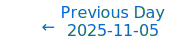
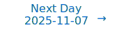

# Personalized Daily ArXiv Papers 2025-11-06

| *[gpt-5]*   | Prompt   | Completion   | Total   |
|:-----------:|:--------:|:------------:|:-------:|
| **Token**   | 28456    | 27940        | 56396   |
| **Cost**    | $0.04    | $0.28        | $0.31   |

Total arXiv papers: 468

Total scanned papers: 242

Total relevant papers: 14

**Table of contents with paper titles:**

1. [SnapStream: Efficient Long Sequence Decoding on Dataflow Accelerators](#user-content-link1)
**Authors:** Jonathan Li, Nasim Farahini, Evgenii Iuliugin, Magnus Vesterlund, Christian Haggstrom, Guangtao Wang, Shubhangi Upasani, Ayush Sachdeva, Rui Li, Faline Fu, Chen Wu, Ayesha Siddiqua, John Long, Tuowen Zhao, Matheen Musaddiq, Hakan Zeffer, Yun Du, Mingran Wang, Qinghua Li, Bo Li, Urmish Thakker, Raghu Prabhakar

2. [Efficient Linear Attention for Multivariate Time Series Modeling via Entropy Equality](#user-content-link2)
**Authors:** Mingtao Zhang, Guoli Yang, Zhanxing Zhu, Mengzhu Wang, Xiaoying Bai

3. [Towards Scalable Backpropagation-Free Gradient Estimation](#user-content-link3)
**Authors:** Daniel Wang, Evan Markou, Dylan Campbell

4. [The Curved Spacetime of Transformer Architectures](#user-content-link4)
**Authors:** Riccardo Di Sipio, Jairo Diaz-Rodriguez, Luis Serrano

5. [An Augmentation Overlap Theory of Contrastive Learning](#user-content-link5)
**Authors:** Qi Zhang, Yifei Wang, Yisen Wang

6. [Why Less is More (Sometimes): A Theory of Data Curation](#user-content-link6)
**Authors:** Elvis Dohmatob, Mohammad Pezeshki, Reyhane Askari-Hemmat

7. [GMoPE:A Prompt-Expert Mixture Framework for Graph Foundation Models](#user-content-link7)
**Authors:** Zhibin Wang, Zhixing Zhang, Shuqi Wang, Xuanting Xie, Zhao Kang

8. [AILA--First Experiments with Localist Language Models](#user-content-link8)
**Authors:** Joachim Diederich

9. [Flat Minima and Generalization: Insights from Stochastic Convex Optimization](#user-content-link9)
**Authors:** Matan Schliserman, Shira Vansover-Hager, Tomer Koren

10. [Precise asymptotic analysis of Sobolev training for random feature models](#user-content-link10)
**Authors:** Katharine E Fisher, Matthew TC Li, Youssef Marzouk, Timo Schorlepp

11. [Efficient Neural Networks with Discrete Cosine Transform Activations](#user-content-link11)
**Authors:** Marc Martinez-Gost, Sara Pepe, Ana P\'erez-Neira, Miguel \'Angel Lagunas

12. [PerfDojo: Automated ML Library Generation for Heterogeneous Architectures](#user-content-link12)
**Authors:** Andrei Ivanov, Siyuan Shen, Gioele Gottardo, Marcin Chrapek, Afif Boudaoud, Timo Schneider, Luca Benini, Torsten Hoefler

13. [Discrete Bayesian Sample Inference for Graph Generation](#user-content-link13)
**Authors:** Ole Petersen, Marcel Kollovieh, Marten Lienen, Stephan G\"unnemann

14. [RAGBoost: Efficient Retrieval-Augmented Generation with Accuracy-Preserving Context Reuse](#user-content-link14)
**Authors:** Yinsicheng Jiang, Yeqi Huang, Liang Cheng, Cheng Deng, Xuan Sun, Luo Mai

---

## 1. [SnapStream: Efficient Long Sequence Decoding on Dataflow Accelerators](https://arxiv.org/abs/2511.03092) 

**ArXiv ID:** 2511.03092

**Authors:** Jonathan Li, Nasim Farahini, Evgenii Iuliugin, Magnus Vesterlund, Christian Haggstrom, Guangtao Wang, Shubhangi Upasani, Ayush Sachdeva, Rui Li, Faline Fu, Chen Wu, Ayesha Siddiqua, John Long, Tuowen Zhao, Matheen Musaddiq, Hakan Zeffer, Yun Du, Mingran Wang, Qinghua Li, Bo Li, Urmish Thakker, Raghu Prabhakar

**Abstract:** The proliferation of 100B+ parameter Large Language Models (LLMs) with 100k+ context length support have resulted in increasing demands for on-chip memory to support large KV caches. Techniques such as StreamingLLM and SnapKV demonstrate how to control KV cache size while maintaining model accuracy. Yet, these techniques are not commonly used within industrial deployments using frameworks like vLLM or SGLang. The reason is twofold: on one hand, the static graphs and continuous batching methodology employed by these frameworks make it difficult to admit modifications to the standard multi-head attention algorithm, while on the other hand, the accuracy implications of such techniques on modern instruction-following and reasoning models are not well understood, obfuscating the need for implementing these techniques. In this paper, we explore these accuracy implications on Llama-3.1-8B-Instruct and DeepSeek-R1, and develop SnapStream, a KV cache compression method that can be deployed at scale. We demonstrate the efficacy of SnapStream in a 16-way tensor-parallel deployment of DeepSeek-671B on SambaNova SN40L accelerators running at 128k context length and up to 1832 tokens per second in a real production setting. SnapStream enables $4\times$ improved on-chip memory usage and introduces minimal accuracy degradation on LongBench-v2, AIME24 and LiveCodeBench. To the best of our knowledge, this is the first implementation of sparse KV attention techniques deployed in a production inference system with static graphs and continuous batching.

**Comment:** Model Compression/Efficiency and High Performance Computing — deployable sparse KV attention/KV-cache compression compatible with static-graph, continuous-batching accelerators at 128k contexts.

**Relevance:** 10
**Novelty:** 8

---

## 2. [Efficient Linear Attention for Multivariate Time Series Modeling via Entropy Equality](https://arxiv.org/abs/2511.03190) 

**ArXiv ID:** 2511.03190

**Authors:** Mingtao Zhang, Guoli Yang, Zhanxing Zhu, Mengzhu Wang, Xiaoying Bai

**Abstract:** Attention mechanisms have been extensively employed in various applications, including time series modeling, owing to their capacity to capture intricate dependencies; however, their utility is often constrained by quadratic computational complexity, which impedes scalability for long sequences. In this work, we propose a novel linear attention mechanism designed to overcome these limitations. Our approach is grounded in a theoretical demonstration that entropy, as a strictly concave function on the probability simplex, implies that distributions with aligned probability rankings and similar entropy values exhibit structural resemblance. Building on this insight, we develop an efficient approximation algorithm that computes the entropy of dot-product-derived distributions with only linear complexity, enabling the implementation of a linear attention mechanism based on entropy equality. Through rigorous analysis, we reveal that the effectiveness of attention in spatio-temporal time series modeling may not primarily stem from the non-linearity of softmax but rather from the attainment of a moderate and well-balanced weight distribution. Extensive experiments on four spatio-temporal datasets validate our method, demonstrating competitive or superior forecasting performance while achieving substantial reductions in both memory usage and computational time.

**Comment:** Model Architecture/Efficiency: proposes a linear-complexity attention mechanism grounded in entropy equality, replacing softmax-based attention with a linear alternative.

**Relevance:** 9
**Novelty:** 8

---

## 3. [Towards Scalable Backpropagation-Free Gradient Estimation](https://arxiv.org/abs/2511.03110) 

**ArXiv ID:** 2511.03110

**Authors:** Daniel Wang, Evan Markou, Dylan Campbell

**Abstract:** While backpropagation--reverse-mode automatic differentiation--has been extraordinarily successful in deep learning, it requires two passes (forward and backward) through the neural network and the storage of intermediate activations. Existing gradient estimation methods that instead use forward-mode automatic differentiation struggle to scale beyond small networks due to the high variance of the estimates. Efforts to mitigate this have so far introduced significant bias to the estimates, reducing their utility. We introduce a gradient estimation approach that reduces both bias and variance by manipulating upstream Jacobian matrices when computing guess directions. It shows promising results and has the potential to scale to larger networks, indeed performing better as the network width is increased. Our understanding of this method is facilitated by analyses of bias and variance, and their connection to the low-dimensional structure of neural network gradients.

**Comment:** HPC/Efficiency: backpropagation-free gradient estimation via forward-mode with reduced bias/variance, aiming to scale training without backward passes or activation storage.

**Relevance:** 9
**Novelty:** 8

---

## 4. [The Curved Spacetime of Transformer Architectures](https://arxiv.org/abs/2511.03060) 

**ArXiv ID:** 2511.03060

**Authors:** Riccardo Di Sipio, Jairo Diaz-Rodriguez, Luis Serrano

**Abstract:** We present a geometric framework for understanding Transformer-based language models, drawing an explicit analogy to General Relativity. Queries and keys induce an effective metric on representation space, and attention acts as a discrete connection that implements parallel transport of value vectors across tokens. Stacked layers provide discrete time-slices through which token representations evolve on this curved manifold, while backpropagation plays the role of a least-action principle that shapes loss-minimizing trajectories in parameter space. If this analogy is correct, token embeddings should not traverse straight paths in feature space; instead, their layer-wise steps should bend and reorient as interactions mediated by embedding space curvature. To test this prediction, we design experiments that expose both the presence and the consequences of curvature: (i) we visualize a curvature landscape for a full paragraph, revealing how local turning angles vary across tokens and layers; (ii) we show through simulations that excess counts of sharp/flat angles and longer length-to-chord ratios are not explainable by dimensionality or chance; and (iii) inspired by Einstein's eclipse experiment, we probe deflection under controlled context edits, demonstrating measurable, meaning-consistent bends in embedding trajectories that confirm attention-induced curvature.

**Comment:** Representation Learning / Architecture analysis: geometric framework analyzing attention as curvature and parallel transport in Transformers.

**Relevance:** 9
**Novelty:** 8

---

## 5. [An Augmentation Overlap Theory of Contrastive Learning](https://arxiv.org/abs/2511.03114) 

**ArXiv ID:** 2511.03114

**Authors:** Qi Zhang, Yifei Wang, Yisen Wang

**Abstract:** Recently, self-supervised contrastive learning has achieved great success on various tasks. However, its underlying working mechanism is yet unclear. In this paper, we first provide the tightest bounds based on the widely adopted assumption of conditional independence. Further, we relax the conditional independence assumption to a more practical assumption of augmentation overlap and derive the asymptotically closed bounds for the downstream performance. Our proposed augmentation overlap theory hinges on the insight that the support of different intra-class samples will become more overlapped under aggressive data augmentations, thus simply aligning the positive samples (augmented views of the same sample) could make contrastive learning cluster intra-class samples together. Moreover, from the newly derived augmentation overlap perspective, we develop an unsupervised metric for the representation evaluation of contrastive learning, which aligns well with the downstream performance almost without relying on additional modules. Code is available at https://github.com/PKU-ML/GARC.

**Comment:** Representation Learning — provides tight bounds and an augmentation-overlap theory for contrastive learning plus an unsupervised metric predicting downstream performance.

**Relevance:** 9
**Novelty:** 8

---

## 6. [Why Less is More (Sometimes): A Theory of Data Curation](https://arxiv.org/abs/2511.03492) 

**ArXiv ID:** 2511.03492

**Authors:** Elvis Dohmatob, Mohammad Pezeshki, Reyhane Askari-Hemmat

**Abstract:** This paper introduces a theoretical framework to resolve a central paradox in modern machine learning: When is it better to use less data? This question has become critical as classical scaling laws suggesting ``more is more'' (Sun et al., 2025) are challenged by methods like LIMO (``less is more'') and s1 (Ye et al., 2025; Muenighoff et al., 2025), which achieve superior performance with small, aggressively curated datasets. Here, we study data curation strategies where an imperfect oracle selects the training examples according to their difficulty and correctness. Our results provide exact scaling law curves for test error under both label-agnostic and label-aware curation rules, revealing when and why keeping only a subset of data can improve generalization. In contrast to classical scaling laws, we show that under certain conditions, small curated datasets can outperform full datasets, and we provide analytical conditions for this by deriving precise phase transition curves tied to data size and quality. We validate these theoretical claims with empirical results on ImageNet, confirming our predictions about when curation improves accuracy and can even mitigate model collapse. Furthermore, our framework provides a principled explanation for the contradictory curation strategies recently observed in LLM mathematical reasoning.

**Comment:** Representation Learning / Training dynamics: theoretical scaling laws explaining when curated subsets outperform full datasets.

**Relevance:** 8
**Novelty:** 9

---

## 7. [GMoPE:A Prompt-Expert Mixture Framework for Graph Foundation Models](https://arxiv.org/abs/2511.03251) 

**ArXiv ID:** 2511.03251

**Authors:** Zhibin Wang, Zhixing Zhang, Shuqi Wang, Xuanting Xie, Zhao Kang

**Abstract:** Graph Neural Networks (GNNs) have demonstrated impressive performance on task-specific benchmarks, yet their ability to generalize across diverse domains and tasks remains limited. Existing approaches often struggle with negative transfer, scalability issues, and high adaptation costs. To address these challenges, we propose GMoPE (Graph Mixture of Prompt-Experts), a novel framework that seamlessly integrates the Mixture-of-Experts (MoE) architecture with prompt-based learning for graphs. GMoPE leverages expert-specific prompt vectors and structure-aware MoE routing to enable each expert to specialize in distinct subdomains and dynamically contribute to predictions. To promote diversity and prevent expert collapse, we introduce a soft orthogonality constraint across prompt vectors, encouraging expert specialization and facilitating a more balanced expert utilization. Additionally, we adopt a prompt-only fine-tuning strategy that significantly reduces spatiotemporal complexity during transfer. We validate GMoPE through extensive experiments under various pretraining strategies and multiple downstream tasks. Results show that GMoPE consistently outperforms state-of-the-art baselines and achieves performance comparable to full parameter fine-tuning-while requiring only a fraction of the adaptation overhead. Our work provides a principled and scalable framework for advancing generalizable and efficient graph foundation models.

**Comment:** Model Architecture (MoE): Mixture-of-Experts with structure-aware routing and prompt experts for graph foundation models; includes orthogonality regularization to prevent expert collapse.

**Relevance:** 9
**Novelty:** 7

---

## 8. [AILA--First Experiments with Localist Language Models](https://arxiv.org/abs/2511.03559) 

**ArXiv ID:** 2511.03559

**Authors:** Joachim Diederich

**Abstract:** This paper presents the first empirical demonstration of controllable locality in transformer language models, a novel architectural framework that enables continuous control over the degree of representation localization through a tunable locality dial parameter. Unlike traditional language models that rely exclusively on distributed representations, our approach allows dynamic interpolation between highly interpretable localist encodings and efficient distributed representations without requiring model retraining. We conducted experiments on the WikiText corpus using a two-layer transformer architecture, systematically varying the locality parameter {\lambda} across the full spectrum from 1.0 (fully localist) to 0.0 (fully distributed). Our results demonstrate that localist configurations achieve dramatically lower attention entropy, with {\lambda} = 1.0 yielding 5.36 bits compared to 7.18 bits at {\lambda} = 0.0, while maintaining substantially higher pointer fidelity scores reflecting stronger alignment with rule-specified targets. Prediction experiments reveal that intermediate locality values optimize the tradeoff between interpretability and performance, with {\lambda} = 0.6 achieving test perplexity of 4.65 and accuracy of 84.7%. These findings establish that localist language models provide a practical framework for applications in regulated domains requiring both transparency and capability, offering precise mathematical control over the interpretability-performance spectrum through explicit penalty thresholds and information-theoretic design principles.

**Comment:** Model Architecture and Representation Learning — introduces a controllable locality dial in transformers to interpolate between localist and distributed representations without retraining.

**Relevance:** 9
**Novelty:** 7

---

## 9. [Flat Minima and Generalization: Insights from Stochastic Convex Optimization](https://arxiv.org/abs/2511.03548) 

**ArXiv ID:** 2511.03548

**Authors:** Matan Schliserman, Shira Vansover-Hager, Tomer Koren

**Abstract:** Understanding the generalization behavior of learning algorithms is a central goal of learning theory. A recently emerging explanation is that learning algorithms are successful in practice because they converge to flat minima, which have been consistently associated with improved generalization performance. In this work, we study the link between flat minima and generalization in the canonical setting of stochastic convex optimization with a non-negative, $\beta$-smooth objective. Our first finding is that, even in this fundamental and well-studied setting, flat empirical minima may incur trivial $\Omega(1)$ population risk while sharp minima generalizes optimally. Then, we show that this poor generalization behavior extends to two natural ''sharpness-aware'' algorithms originally proposed by Foret et al. (2021), designed to bias optimization toward flat solutions: Sharpness-Aware Gradient Descent (SA-GD) and Sharpness-Aware Minimization (SAM). For SA-GD, which performs gradient steps on the maximal loss in a predefined neighborhood, we prove that while it successfully converges to a flat minimum at a fast rate, the population risk of the solution can still be as large as $\Omega(1)$, indicating that even flat minima found algorithmically using a sharpness-aware gradient method might generalize poorly. For SAM, a computationally efficient approximation of SA-GD based on normalized ascent steps, we show that although it minimizes the empirical loss, it may converge to a sharp minimum and also incur population risk $\Omega(1)$. Finally, we establish population risk upper bounds for both SA-GD and SAM using algorithmic stability techniques.

**Comment:** Representation Learning/Training Dynamics: theoretical analysis showing flat minima can generalize poorly and examining SA-GD/SAM generalization via stability.

**Relevance:** 8
**Novelty:** 8

---

## 10. [Precise asymptotic analysis of Sobolev training for random feature models](https://arxiv.org/abs/2511.03050) 

**ArXiv ID:** 2511.03050

**Authors:** Katharine E Fisher, Matthew TC Li, Youssef Marzouk, Timo Schorlepp

**Abstract:** Gradient information is widely useful and available in applications, and is therefore natural to include in the training of neural networks. Yet little is known theoretically about the impact of Sobolev training -- regression with both function and gradient data -- on the generalization error of highly overparameterized predictive models in high dimensions. In this paper, we obtain a precise characterization of this training modality for random feature (RF) models in the limit where the number of trainable parameters, input dimensions, and training data tend proportionally to infinity. Our model for Sobolev training reflects practical implementations by sketching gradient data onto finite dimensional subspaces. By combining the replica method from statistical physics with linearizations in operator-valued free probability theory, we derive a closed-form description for the generalization errors of the trained RF models. For target functions described by single-index models, we demonstrate that supplementing function data with additional gradient data does not universally improve predictive performance. Rather, the degree of overparameterization should inform the choice of training method. More broadly, our results identify settings where models perform optimally by interpolating noisy function and gradient data.

**Comment:** Representation Learning / Training dynamics: precise asymptotic theory of Sobolev training for overparameterized random feature models.

**Relevance:** 8
**Novelty:** 8

---

## 11. [Efficient Neural Networks with Discrete Cosine Transform Activations](https://arxiv.org/abs/2511.03531) 

**ArXiv ID:** 2511.03531

**Authors:** Marc Martinez-Gost, Sara Pepe, Ana P\'erez-Neira, Miguel \'Angel Lagunas

**Abstract:** In this paper, we extend our previous work on the Expressive Neural Network (ENN), a multilayer perceptron with adaptive activation functions parametrized using the Discrete Cosine Transform (DCT). Building upon previous work that demonstrated the strong expressiveness of ENNs with compact architectures, we now emphasize their efficiency, interpretability and pruning capabilities. The DCT-based parameterization provides a structured and decorrelated representation that reveals the functional role of each neuron and allows direct identification of redundant components. Leveraging this property, we propose an efficient pruning strategy that removes unnecessary DCT coefficients with negligible or no loss in performance. Experimental results across classification and implicit neural representation tasks confirm that ENNs achieve state-of-the-art accuracy while maintaining a low number of parameters. Furthermore, up to 40% of the activation coefficients can be safely pruned, thanks to the orthogonality and bounded nature of the DCT basis. Overall, these findings demonstrate that the ENN framework offers a principled integration of signal processing concepts into neural network design, achieving a balanced trade-off between expressiveness, compactness, and interpretability.

**Comment:** Compression/Efficiency and Architecture: DCT-parameterized adaptive activations enabling principled coefficient pruning and structured interpretability.

**Relevance:** 8
**Novelty:** 7

---

## 12. [PerfDojo: Automated ML Library Generation for Heterogeneous Architectures](https://arxiv.org/abs/2511.03586) 

**ArXiv ID:** 2511.03586

**Authors:** Andrei Ivanov, Siyuan Shen, Gioele Gottardo, Marcin Chrapek, Afif Boudaoud, Timo Schneider, Luca Benini, Torsten Hoefler

**Abstract:** The increasing complexity of machine learning models and the proliferation of diverse hardware architectures (CPUs, GPUs, accelerators) make achieving optimal performance a significant challenge. Heterogeneity in instruction sets, specialized kernel requirements for different data types and model features (e.g., sparsity, quantization), and architecture-specific optimizations complicate performance tuning. Manual optimization is resource-intensive, while existing automatic approaches often rely on complex hardware-specific heuristics and uninterpretable intermediate representations, hindering performance portability. We introduce PerfLLM, a novel automatic optimization methodology leveraging Large Language Models (LLMs) and Reinforcement Learning (RL). Central to this is PerfDojo, an environment framing optimization as an RL game using a human-readable, mathematically-inspired code representation that guarantees semantic validity through transformations. This allows effective optimization without prior hardware knowledge, facilitating both human analysis and RL agent training. We demonstrate PerfLLM's ability to achieve significant performance gains across diverse CPU (x86, Arm, RISC-V) and GPU architectures.

**Comment:** High Performance Computing: systems-level automatic kernel/library optimization for heterogeneous hardware using LLM+RL, improving performance portability without hand-tuned heuristics.

**Relevance:** 8
**Novelty:** 7

---

## 13. [Discrete Bayesian Sample Inference for Graph Generation](https://arxiv.org/abs/2511.03015) 

**ArXiv ID:** 2511.03015

**Authors:** Ole Petersen, Marcel Kollovieh, Marten Lienen, Stephan G\"unnemann

**Abstract:** Generating graph-structured data is crucial in applications such as molecular generation, knowledge graphs, and network analysis. However, their discrete, unordered nature makes them difficult for traditional generative models, leading to the rise of discrete diffusion and flow matching models. In this work, we introduce GraphBSI, a novel one-shot graph generative model based on Bayesian Sample Inference (BSI). Instead of evolving samples directly, GraphBSI iteratively refines a belief over graphs in the continuous space of distribution parameters, naturally handling discrete structures. Further, we state BSI as a stochastic differential equation (SDE) and derive a noise-controlled family of SDEs that preserves the marginal distributions via an approximation of the score function. Our theoretical analysis further reveals the connection to Bayesian Flow Networks and Diffusion models. Finally, in our empirical evaluation, we demonstrate state-of-the-art performance on molecular and synthetic graph generation, outperforming existing one-shot graph generative models on the standard benchmarks Moses and GuacaMol.

**Comment:** Model Architecture/Generative Modeling — Bayesian Sample Inference for discrete graphs with SDE formulation linking to diffusion/flow, enabling one-shot graph generation.

**Relevance:** 8
**Novelty:** 7

---

## 14. [RAGBoost: Efficient Retrieval-Augmented Generation with Accuracy-Preserving Context Reuse](https://arxiv.org/abs/2511.03475) 

**ArXiv ID:** 2511.03475

**Authors:** Yinsicheng Jiang, Yeqi Huang, Liang Cheng, Cheng Deng, Xuan Sun, Luo Mai

**Abstract:** Retrieval-augmented generation (RAG) enhances large language models (LLMs) with retrieved context but often suffers from downgraded prefill performance as modern applications demand longer and more complex inputs. Existing caching techniques either preserve accuracy with low cache reuse or improve reuse at the cost of degraded reasoning quality. We present RAGBoost, an efficient RAG system that achieves high cache reuse without sacrificing accuracy through accuracy-preserving context reuse. RAGBoost detects overlapping retrieved items across concurrent sessions and multi-turn interactions, using efficient context indexing, ordering, and de-duplication to maximize reuse, while lightweight contextual hints maintain reasoning fidelity. It integrates seamlessly with existing LLM inference engines and improves their prefill performance by 1.5-3X over state-of-the-art methods, while preserving or even enhancing reasoning accuracy across diverse RAG and agentic AI workloads. Our code is released at: https://github.com/Edinburgh-AgenticAI/RAGBoost.

**Comment:** Model Efficiency/HPC: accuracy-preserving context reuse and caching for RAG to improve LLM prefill efficiency without degrading accuracy.

**Relevance:** 8
**Novelty:** 7

---

# Paper Selection Prompt

## System Prompt

> You are a helpful paper reading assistant whose job is to read daily posts from ArXiv and identify a few papers that your friend will enjoy reading.
> Your job is to carefully read the paper titles and abstracts below and find the ones that match the criteria below.

## User Prompt

> ## Instructions
> 
> Write the response in JSONL format with {ARXIVID, COMMENT, RELEVANCE, NOVELTY} on each line, one for each paper.
> 
> - ARXIVID: should be the ArXiv ID.
> - COMMENT: should identify whether there is a criteria that match the paper very closely. These matches should not be based on general terms like "language modeling" or "advancements" and should specifically refer to a criterion. No need to mention the non-matching criteria.
> - RELEVANCE: should be a score from 1-10.
> - NOVELTY: should be a score from 1-10.
> 
> ## Scoring Criteria
> 
> > The "Relevance" score measures how closely the paper aligns with the core topics of the prompt.
> > The "Novelty" score assesses the originality and impact of the paper.
> > They are two **ORTHONORMAL** axes and **SHOULD NOT** be confused with each other.
> 
> ### Relevance Scoring
> 
> - Relevance 9-10 (Completely Relevant)
>   - Focus: Fully aligned with core topics with no deviation, score the highest if contains relevant keywords in it.
>   - Examples: Papers focused on foundational methods or theoretical research, whose titles contain topic keywords like "MoE".
> 
> - Relevance 7-8 (Relevant)
>   - Focus: Retain a solid link to the main research area, though may touch on peripheral elements.
>   - Examples: Papers research on the fundamental part of MoE through a less critical aspect like its behavior in GNN.
> 
> - Relevance 5-6 (Borderline)
>   - Focus: Maintains a link to the core topic but also extends into at least one other domain/area beyond the primary focus.
>   - Examples: Work referencing MoE centered on reinforcement learning.
> 
> - Relevance 3-4 (Irrelevant)
>   - Focus: Largely outside our interests with no association to our topics.
>   - Examples: Application-focused papers like using MoE to solve a problem in the real world.
> 
> - Relevance 1-2 (Ignore)
>   - Focus: Purely unrelated to our topics. Completely a different domain.
>   - **Exception**: If the paper hints at a cutting-edge, radically new direction that could eventually transform the primary domain, consider a score of 9–10 despite initial appearances. (Usually a very rare concept that belongs to the fundamental research)
> 
> ### Novelty Scoring
> 
> - Novelty 9-10 (Breakthrough)
>   - Definition: Groundbreaking methods/theory introducing new directions or solving major challenges.
>   - Examples: Entirely new paradigm for foundational models; a novel theory transforming representation learning.
> 
> - Novelty 7-8 (Improvements)
>   - Definition: Substantial insights/enhancements, though not a full paradigm shift.
>   - Examples: Modifications on existing methods yielding significantly better results.
> 
> - Novelty 5-6 (Borderline)
>   - Definition: Incremental contributions with possible long-term benefits, not immediately transformative.
>   - Examples: Moderately novel extension to an existing architecture; refining current methods without fundamentally altering them.
> 
> - Novelty 3-4 (Tangential)
>   - Definition: Minor or domain-specific improvements with limited broader impact.
>   - Examples: Slight modifications to known methods with strange motivation; purely engineering jobs like a new benchmark/dataset.
> 
> - Novelty 1-2 (Low)
>   - Definition: Minimal originality, applying standard approaches without real innovation.
>   - Examples: Using an off-the-shelf model without adding new insights; purely application-driven studies like finetuning a pretrained model using existing methods.
> 
> ## Papers
> 
> [PAPER LIST HERE]
> 
> ## Relevant Topics
> 
> Use the following relevance criteria to focus on foundational research. Keep **relevant** papers and filter out **irrelevant** ones. Avoid purely **application-driven** work.
> 
> 1. Model Architecture
>    - Relevant: Mixture-of-Experts (MoE), Transformers, Conditional/Dynamic Networks, Autoencoders, analysis/innovations on existing architectures.
>    - Irrelevant: Merely using existing architectures for a certain task without insights into the structure themselves.
> 
> 2. Model Compression and Efficiency
>    - Relevant: Sparsity, pruning, quantization, low-rank approaches, cache, or other algorithmic/theoretical efficiency breakthroughs.
>    - Irrelevant: Straightforward applications of existing compression methods to new tasks.
> 
> 3. High Performance Computing
>    - Relevant: Algorithmic or systems-level innovations enabling training of large-scale models, distributed training techniques, memory optimization.
>    - Irrelevant: Incremental engineering improvements without novel algorithmic contributions.
> 
> 4. Representation Learning
>    - Relevant: Insights into how deep networks encode information, feature/dictionary learning, sparse/contrastive methods, training dynamics in neural networks.
>    - Irrelevant: Standard applications of known techniques lacking new theoretical or methodological contributions.
> 
> **Keywords:**
> 
> - Relevant: Mixture of Experts (MoE), Representation Learning, Compression/Efficiency, Sparse/Sparsity, Pruning, Quantization, Low-rank, Foundation Model, etc.
> - Irrelevant: Reinforcement Learning, Transfer Learning, Federated Learning, Online Learning, Diffusion Models, etc.
> - Application: Image Segmentation, Medical Imaging, 3D Vision, Video Understanding, Information Retrieval, Summarization, Recommendation Systems, Machine Translation, Speech Recognition, Signal Processing, Spatial/Temporal Modeling, Time Series, Knowledge Graph, etc.