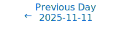
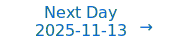

# Personalized Daily ArXiv Papers 2025-11-12

| *[gpt-5]*   | Prompt   | Completion   | Total   |
|:-----------:|:--------:|:------------:|:-------:|
| **Token**   | 51588    | 48776        | 100364  |
| **Cost**    | $0.06    | $0.49        | $0.55   |

Total arXiv papers: 622

Total scanned papers: 385

Total relevant papers: 22

**Table of contents with paper titles:**

1. [LeJEPA: Provable and Scalable Self-Supervised Learning Without the Heuristics](#user-content-link1)
**Authors:** Randall Balestriero, Yann LeCun

2. [Parallel Sampling via Autospeculation](#user-content-link2)
**Authors:** Nima Anari, Carlo Baronio, CJ Chen, Alireza Haqi, Frederic Koehler, Anqi Li, Thuy-Duong Vuong

3. [Extreme Model Compression with Structured Sparsity at Low Precision](#user-content-link3)
**Authors:** Dan Liu, Nikita Dvornik, Xue Liu

4. [A Circular Argument : Does RoPE need to be Equivariant for Vision?](#user-content-link4)
**Authors:** Chase van de Geijn, Timo L\"uddecke, Polina Turishcheva, Alexander S. Ecker

5. [DynaKV: Enabling Accurate and Efficient Long-Sequence LLM Decoding on Smartphones](#user-content-link5)
**Authors:** Tuowei Wang, Minxing Huang, Fengzu Li, Ligeng Chen, Jinrui Zhang, Ju Ren

6. [Streaming Tensor Program: A streaming abstraction for dynamic parallelism](#user-content-link6)
**Authors:** Gina Sohn, Genghan Zhang, Konstantin Hossfeld, Jungwoo Kim, Nathan Sobotka, Nathan Zhang, Olivia Hsu, Kunle Olukotun

7. [Think-at-Hard: Selective Latent Iterations to Improve Reasoning Language Models](#user-content-link7)
**Authors:** Tianyu Fu, Yichen You, Zekai Chen, Guohao Dai, Huazhong Yang, Yu Wang

8. [NeuCLIP: Efficient Large-Scale CLIP Training with Neural Normalizer Optimization](#user-content-link8)
**Authors:** Xiyuan Wei, Chih-Jen Lin, Tianbao Yang

9. [HipKittens: Fast and Furious AMD Kernels](#user-content-link9)
**Authors:** William Hu, Drew Wadsworth, Sean Siddens, Stanley Winata, Daniel Y. Fu, Ryann Swann, Muhammad Osama, Christopher R\'e, Simran Arora

10. [A Generalized Spectral Framework to Expain Neural Scaling and Compression Dynamics](#user-content-link10)
**Authors:** Yizhou Zhang

11. [Alignment-Constrained Dynamic Pruning for LLMs: Identifying and Preserving Alignment-Critical Circuits](#user-content-link11)
**Authors:** Dev Patel, Gabrielle Gervacio, Diekola Raimi, Kevin Zhu, Ryan Lagasse, Gabriel Grand, Ashwinee Panda, Maheep Chaudhary

12. [Alignment-Aware Quantization for LLM Safety](#user-content-link12)
**Authors:** Sunghyun Wee, Suyoung Kim, Hyeonjin Kim, Kyomin Hwang, Nojun Kwak

13. [Sharp Eyes and Memory for VideoLLMs: Information-Aware Visual Token Pruning for Efficient and Reliable VideoLLM Reasoning](#user-content-link13)
**Authors:** Jialong Qin, Xin Zou, Di Lu, Yibo Yan, Xuming Hu

14. [A General Method for Proving Networks Universal Approximation Property](#user-content-link14)
**Authors:** Wei Wang

15. [Motif 2 12.7B technical report](#user-content-link15)
**Authors:** Junghwan Lim, Sungmin Lee, Dongseok Kim, Taehyun Kim, Eunhwan Park, Jeesoo Lee, Jeongdoo Lee, Junhyeok Lee, Wai Ting Cheung, Dahye Choi, Jaeheui Her, Jaeyeon Huh, Hanbin Jung, Changjin Kang, Beomgyu Kim, Minjae Kim, Taewhan Kim, Youngrok Kim, Hyukjin Kweon, Haesol Lee, Kungyu Lee, Dongpin Oh, Yeongjae Park, Bokki Ryu, Dongjoo Weon

16. [SCALAR: Benchmarking SAE Interaction Sparsity in Toy LLMs](#user-content-link16)
**Authors:** Sean P. Fillingham, Andrew Gordon, Peter Lai, Xavier Poncini, David Quarel, Stefan Heimersheim

17. [A Unified Geometric Field Theory Framework for Transformers: From Manifold Embeddings to Kernel Modulation](#user-content-link17)
**Authors:** Xianshuai Shi, Jianfeng Zhu, Leibo Liu

18. [ImagebindDC: Compressing Multi-modal Data with Imagebind-based Condensation](#user-content-link18)
**Authors:** Yue Min, Shaobo Wang, Jiaze Li, Tianle Niu, Junxin Fan, Yongliang Miao, Lijin Yang, Linfeng Zhang

19. [Coherence Mechanisms for Provable Self-Improvement](#user-content-link19)
**Authors:** Mehryar Mohri, Jon Schneider, Yifan Wu

20. [Training Language Models to Explain Their Own Computations](#user-content-link20)
**Authors:** Belinda Z. Li, Zifan Carl Guo, Vincent Huang, Jacob Steinhardt, Jacob Andreas

21. [Low-Rank Curvature for Zeroth-Order Optimization in LLM Fine-Tuning](#user-content-link21)
**Authors:** Hyunseok Seung, Jaewoo Lee, Hyunsuk Ko

22. [Where and What Matters: Sensitivity-Aware Task Vectors for Many-Shot Multimodal In-Context Learning](#user-content-link22)
**Authors:** Ziyu Ma, Chenhui Gou, Yiming Hu, Yong Wang, Xiangxiang Chu, Bohan Zhuang, Jianfei Cai

---

## 1. [LeJEPA: Provable and Scalable Self-Supervised Learning Without the Heuristics](https://arxiv.org/abs/2511.08544) 

**ArXiv ID:** 2511.08544

**Authors:** Randall Balestriero, Yann LeCun

**Abstract:** Learning manipulable representations of the world and its dynamics is central to AI. Joint-Embedding Predictive Architectures (JEPAs) offer a promising blueprint, but lack of practical guidance and theory has led to ad-hoc R&D. We present a comprehensive theory of JEPAs and instantiate it in {\bf LeJEPA}, a lean, scalable, and theoretically grounded training objective. First, we identify the isotropic Gaussian as the optimal distribution that JEPAs' embeddings should follow to minimize downstream prediction risk. Second, we introduce a novel objective--{\bf Sketched Isotropic Gaussian Regularization} (SIGReg)--to constrain embeddings to reach that ideal distribution. Combining the JEPA predictive loss with SIGReg yields LeJEPA with numerous theoretical and practical benefits: (i) single trade-off hyperparameter, (ii) linear time and memory complexity, (iii) stability across hyper-parameters, architectures (ResNets, ViTs, ConvNets) and domains, (iv) heuristics-free, e.g., no stop-gradient, no teacher-student, no hyper-parameter schedulers, and (v) distributed training-friendly implementation requiring only $\approx$50 lines of code. Our empirical validation covers 10+ datasets, 60+ architectures, all with varying scales and domains. As an example, using imagenet-1k for pretraining and linear evaluation with frozen backbone, LeJEPA reaches 79\% with a ViT-H/14. We hope that the simplicity and theory-friendly ecosystem offered by LeJEPA will reestablish self-supervised pre-training as a core pillar of AI research (\href{git@github.com:rbalestr-lab/lejepa.git}{GitHub repo}).

**Comment:** Author match

---

## 2. [Parallel Sampling via Autospeculation](https://arxiv.org/abs/2511.07869) 

**ArXiv ID:** 2511.07869

**Authors:** Nima Anari, Carlo Baronio, CJ Chen, Alireza Haqi, Frederic Koehler, Anqi Li, Thuy-Duong Vuong

**Abstract:** We present parallel algorithms to accelerate sampling via counting in two settings: any-order autoregressive models and denoising diffusion models. An any-order autoregressive model accesses a target distribution $\mu$ on $[q]^n$ through an oracle that provides conditional marginals, while a denoising diffusion model accesses a target distribution $\mu$ on $\mathbb{R}^n$ through an oracle that provides conditional means under Gaussian noise. Standard sequential sampling algorithms require $\widetilde{O}(n)$ time to produce a sample from $\mu$ in either setting. We show that, by issuing oracle calls in parallel, the expected sampling time can be reduced to $\widetilde{O}(n^{1/2})$. This improves the previous $\widetilde{O}(n^{2/3})$ bound for any-order autoregressive models and yields the first parallel speedup for diffusion models in the high-accuracy regime, under the relatively mild assumption that the support of $\mu$ is bounded.   We introduce a novel technique to obtain our results: speculative rejection sampling. This technique leverages an auxiliary ``speculative'' distribution~$\nu$ that approximates~$\mu$ to accelerate sampling. Our technique is inspired by the well-studied ``speculative decoding'' techniques popular in large language models, but differs in key ways. Firstly, we use ``autospeculation,'' namely we build the speculation $\nu$ out of the same oracle that defines~$\mu$. In contrast, speculative decoding typically requires a separate, faster, but potentially less accurate ``draft'' model $\nu$. Secondly, the key differentiating factor in our technique is that we make and accept speculations at a ``sequence'' level rather than at the level of single (or a few) steps. This last fact is key to unlocking our parallel runtime of $\widetilde{O}(n^{1/2})$.

**Comment:** High Performance Computing: speculative rejection sampling (autospeculation) achieving parallel sampling in O~(n^{1/2}) time for autoregressive and diffusion models.

**Relevance:** 10
**Novelty:** 9

---

## 3. [Extreme Model Compression with Structured Sparsity at Low Precision](https://arxiv.org/abs/2511.08360) 

**ArXiv ID:** 2511.08360

**Authors:** Dan Liu, Nikita Dvornik, Xue Liu

**Abstract:** Deep neural networks (DNNs) are used in many applications, but their large size and high computational cost make them hard to run on devices with limited resources. Two widely used techniques to address this challenge are weight quantization, which lowers the precision of all weights, and structured sparsity, which removes unimportant weights while retaining the important ones at full precision. Although both are effective individually, they are typically studied in isolation due to their compounded negative impact on model accuracy when combined. In this work, we introduce SLOPE Structured Sparsity at Low Precision), a unified framework, to effectively combine structured sparsity and low-bit quantization in a principled way. We show that naively combining sparsity and quantization severely harms performance due to the compounded impact of both techniques. To address this, we propose a training-time regularization strategy that minimizes the discrepancy between full-precision weights and their sparse, quantized counterparts by promoting angular alignment rather than direct matching. On ResNet-18, SLOPE achieves $\sim20\times$ model size reduction while retaining $\sim$99% of the original accuracy. It consistently outperforms state-of-the-art quantization and structured sparsity methods across classification, detection, and segmentation tasks on models such as ResNet-18, ViT-Small, and Mask R-CNN.

**Comment:** Direct hit on 'Model Compression and Efficiency': combines structured sparsity with low-bit quantization using a training-time angular-alignment regularizer for extreme compression.

**Relevance:** 10
**Novelty:** 8

---

## 4. [A Circular Argument : Does RoPE need to be Equivariant for Vision?](https://arxiv.org/abs/2511.08368) 

**ArXiv ID:** 2511.08368

**Authors:** Chase van de Geijn, Timo L\"uddecke, Polina Turishcheva, Alexander S. Ecker

**Abstract:** Rotary Positional Encodings (RoPE) have emerged as a highly effective technique for one-dimensional sequences in Natural Language Processing spurring recent progress towards generalizing RoPE to higher-dimensional data such as images and videos. The success of RoPE has been thought to be due to its positional equivariance, i.e. its status as a relative positional encoding. In this paper, we mathematically show RoPE to be one of the most general solutions for equivariant positional embedding in one-dimensional data. Moreover, we show Mixed RoPE to be the analogously general solution for M-dimensional data, if we require commutative generators -- a property necessary for RoPE's equivariance. However, we question whether strict equivariance plays a large role in RoPE's performance. We propose Spherical RoPE, a method analogous to Mixed RoPE, but assumes non-commutative generators. Empirically, we find Spherical RoPE to have the equivalent or better learning behavior compared to its equivariant analogues. This suggests that relative positional embeddings are not as important as is commonly believed, at least within computer vision. We expect this discovery to facilitate future work in positional encodings for vision that can be faster and generalize better by removing the preconception that they must be relative.

**Comment:** Model Architecture: formal analysis of RoPE equivariance and a new positional encoding (Spherical RoPE) for M-dimensional data, challenging necessity of strict equivariance.

**Relevance:** 10
**Novelty:** 8

---

## 5. [DynaKV: Enabling Accurate and Efficient Long-Sequence LLM Decoding on Smartphones](https://arxiv.org/abs/2511.07427) 

**ArXiv ID:** 2511.07427

**Authors:** Tuowei Wang, Minxing Huang, Fengzu Li, Ligeng Chen, Jinrui Zhang, Ju Ren

**Abstract:** As the demand for human-like reasoning, multi-turn dialogues, and long-form responses grows, large language models (LLMs) are increasingly expected to support efficient and effective long-sequence decoding. However, due to limited DRAM capacity, long-seuqence LLM decoding on smartphones is constrained by the key-value cache (KVCache), whose memory footprint increases linearly with sequence length. Retrieval-based methods mitigate DRAM pressure by offloading KVCache to flash and retrieving query-relevant entries through cluster-based indexing. Unfortunately, as decoding progresses, KVCache distribution shifts render static or local cluster updates progressively misaligned, excluding essential entries or fetching redundant ones. These issues are further exacerbated by smartphone-specific limitations in bandwidth, IOPS, and memory capacity.   We propose DynaKV, the first adaptive KVCache management approach that jointly addresses accuracy and efficiency for long-sequence decoding on smartphones. DynaKV integrates three key techniques: (1) Migration-Free Cluster Adaptation, which adaptively splits clusters during retrieval without incurring additional transfers; (2) Continuity-Centric Flash Management, which co-locates correlated entries and clusters and employs a dual-head layout for efficient updates; and (3) Memory-Efficient Cache Design, which virtualizes cache space across DRAM and flash and extends replacement policies to align with cluster-level access patterns. Evaluations demonstrate that DynaKV improves retrieval accuracy and reduces end-to-end latency compared to state-of-the-art solutions, achieving average gains of $1.38\times$ in accuracy and $1.47\times$ speedups. Furthermore, the insights of DynaKV naturally extend to other long-context workloads and multi-tier memory hierarchies, underscoring its broader applicability.

**Comment:** Matches HPC/Efficiency with KV-cache memory optimization for long-sequence LLM decoding on smartphones: adaptive clustering, flash-aware layout, and cache virtualization.

**Relevance:** 9
**Novelty:** 8

---

## 6. [Streaming Tensor Program: A streaming abstraction for dynamic parallelism](https://arxiv.org/abs/2511.07776) 

**ArXiv ID:** 2511.07776

**Authors:** Gina Sohn, Genghan Zhang, Konstantin Hossfeld, Jungwoo Kim, Nathan Sobotka, Nathan Zhang, Olivia Hsu, Kunle Olukotun

**Abstract:** Dynamic behaviors are becoming prevalent in many tensor applications. In machine learning, for example, the input tensors are dynamically shaped or ragged, and data-dependent control flow is widely used in many models. However, the limited expressiveness of prior programming abstractions for spatial dataflow accelerators forces the dynamic behaviors to be implemented statically or lacks the visibility for performance-critical decisions. To address these challenges, we present the Streaming Tensor Program (STeP), a new streaming abstraction that enables dynamic tensor workloads to run efficiently on spatial dataflow accelerators. STeP introduces flexible routing operators, an explicit memory hierarchy, and symbolic shape semantics that expose dynamic data rates and tensor dimensions. These capabilities unlock new optimizations-dynamic tiling, dynamic parallelization, and configuration time-multiplexing-that adapt to dynamic behaviors while preserving dataflow efficiency. Using a cycle-approximate simulator on representative LLM layers with real-world traces, dynamic tiling reduces on-chip memory requirement by 2.18x, dynamic parallelization improves latency by 1.5x, and configuration time-multiplexing improves compute utilization by 2.57x over implementations available in prior abstractions.

**Comment:** High Performance Computing: new streaming abstraction (STeP) with dynamic tiling/parallelization and explicit memory hierarchy for dynamic tensor workloads on accelerators.

**Relevance:** 9
**Novelty:** 8

---

## 7. [Think-at-Hard: Selective Latent Iterations to Improve Reasoning Language Models](https://arxiv.org/abs/2511.08577) 

**ArXiv ID:** 2511.08577

**Authors:** Tianyu Fu, Yichen You, Zekai Chen, Guohao Dai, Huazhong Yang, Yu Wang

**Abstract:** Improving reasoning capabilities of Large Language Models (LLMs), especially under parameter constraints, is crucial for real-world applications. Prior work proposes recurrent transformers, which allocate a fixed number of extra iterations per token to improve generation quality. After the first, standard forward pass, instead of verbalization, last-layer hidden states are fed back as inputs for additional iterations to refine token predictions. Yet we identify a latent overthinking phenomenon: easy token predictions that are already correct after the first pass are sometimes revised into errors in additional iterations. To address this, we propose Think-at-Hard (TaH), a dynamic latent thinking method that iterates deeper only at hard tokens. It employs a lightweight neural decider to trigger latent iterations only at tokens that are likely incorrect after the standard forward pass. During latent iterations, Low-Rank Adaptation (LoRA) modules shift the LLM objective from general next-token prediction to focused hard-token refinement. We further introduce a duo-causal attention mechanism that extends attention from the token sequence dimension to an additional iteration depth dimension. This enables cross-iteration information flow while maintaining full sequential parallelism. Experiments show that TaH boosts LLM reasoning performance across five challenging benchmarks while maintaining the same parameter count. Compared with baselines that iterate twice for all output tokens, TaH delivers 8.1-11.3% accuracy gains while exempting 94% of tokens from the second iteration. Against strong single-iteration Qwen3 models finetuned with the same data, it also delivers 4.0-5.0% accuracy gains. When allowing less than 3% additional parameters from LoRA and the iteration decider, the gains increase to 8.5-12.6% and 5.3-5.4%, respectively. Our code is available at https://github.com/thu-nics/TaH.

**Comment:** Model Architecture / Conditional computation: dynamic latent iterations only on hard tokens with duo-causal attention across iteration depth and LoRA-based refinement for efficiency.

**Relevance:** 9
**Novelty:** 8

---

## 8. [NeuCLIP: Efficient Large-Scale CLIP Training with Neural Normalizer Optimization](https://arxiv.org/abs/2511.08417) 

**ArXiv ID:** 2511.08417

**Authors:** Xiyuan Wei, Chih-Jen Lin, Tianbao Yang

**Abstract:** Accurately estimating the normalization term (also known as the partition function) in the contrastive loss is a central challenge for training Contrastive Language-Image Pre-training (CLIP) models. Conventional methods rely on large batches for approximation, demanding substantial computational resources. To mitigate this issue, prior works introduced per-sample normalizer estimators, which are updated at each epoch in a blockwise coordinate manner to keep track of updated encoders. However, this scheme incurs optimization error that scales with the ratio of dataset size to batch size, limiting effectiveness for large datasets or small batches. To overcome this limitation, we propose NeuCLIP, a novel and elegant optimization framework based on two key ideas: (i) $\textbf{reformulating}$ the contrastive loss for each sample $\textbf{via convex analysis}$ into a minimization problem with an auxiliary variable representing its log-normalizer; and (ii) $\textbf{transforming}$ the resulting minimization over $n$ auxiliary variables (where $n$ is the dataset size) via $\textbf{variational analysis}$ into the minimization over a compact neural network that predicts the log-normalizers. We design an alternating optimization algorithm that jointly trains the CLIP model and the auxiliary network. By employing a tailored architecture and acceleration techniques for the auxiliary network, NeuCLIP achieves more accurate normalizer estimation, leading to improved performance compared with previous methods. Extensive experiments on large-scale CLIP training, spanning datasets from millions to billions of samples, demonstrate that NeuCLIP outperforms previous methods.

**Comment:** HPC/Efficiency: reformulates CLIP contrastive normalizer via convex/variational analysis and learns a neural normalizer, enabling efficient large-scale training with small batches.

**Relevance:** 9
**Novelty:** 8

---

## 9. [HipKittens: Fast and Furious AMD Kernels](https://arxiv.org/abs/2511.08083) 

**ArXiv ID:** 2511.08083

**Authors:** William Hu, Drew Wadsworth, Sean Siddens, Stanley Winata, Daniel Y. Fu, Ryann Swann, Muhammad Osama, Christopher R\'e, Simran Arora

**Abstract:** AMD GPUs offer state-of-the-art compute and memory bandwidth; however, peak performance AMD kernels are written in raw assembly. To address the difficulty of mapping AI algorithms to hardware, recent work proposes C++ embedded and PyTorch-inspired domain-specific languages like ThunderKittens (TK) to simplify high performance AI kernel development on NVIDIA hardware. We explore the extent to which such primitives -- for explicit tile-based programming with optimized memory accesses and fine-grained asynchronous execution across workers -- are NVIDIA-specific or general. We provide the first detailed study of the programming primitives that lead to performant AMD AI kernels, and we encapsulate these insights in the HipKittens (HK) programming framework. We find that tile-based abstractions used in prior DSLs generalize to AMD GPUs, however we need to rethink the algorithms that instantiate these abstractions for AMD. We validate the HK primitives across CDNA3 and CDNA4 AMD platforms. In evaluations, HK kernels compete with AMD's hand-optimized assembly kernels for GEMMs and attention, and consistently outperform compiler baselines. Moreover, assembly is difficult to scale to the breadth of AI workloads; reflecting this, in some settings HK outperforms all available kernel baselines by $1.2-2.4\times$ (e.g., $d=64$ attention, GQA backwards, memory-bound kernels). These findings help pave the way for a single, tile-based software layer for high-performance AI kernels that translates across GPU vendors. HipKittens is released at: https://github.com/HazyResearch/HipKittens.

**Comment:** HPC: tile-based programming framework for AMD GPUs enabling high-performance AI kernels across vendors (systems-level innovation).

**Relevance:** 9
**Novelty:** 8

---

## 10. [A Generalized Spectral Framework to Expain Neural Scaling and Compression Dynamics](https://arxiv.org/abs/2511.07892) 

**ArXiv ID:** 2511.07892

**Authors:** Yizhou Zhang

**Abstract:** Empirical scaling laws describe how test loss and other performance metrics depend on model size, dataset size, and compute. While such laws are consistent within specific regimes, apparently distinct scaling behaviors have been reported for related settings such as model compression. Motivated by recent progress in spectral analyses of neural representations, this paper develops a \emph{generalized spectral framework} that unifies learning dynamics and compression phenomena under a common functional ansatz. We generalize the spectral evolution function from the linear kernel form $g(\lambda t)=\lambda t$ to an asymptotically polynomial function $g(\lambda,t;\beta)$, characterized by an effective spectral--temporal elasticity $\rho(\beta)$. This framework recovers existing lazy and feature-learning theories as special cases and yields an invariant relation between learning and compression

**Comment:** Develops a unified spectral framework connecting learning dynamics and compression—fits 'Representation Learning' and 'Compression/Efficiency' theory.

**Relevance:** 9
**Novelty:** 7

---

## 11. [Alignment-Constrained Dynamic Pruning for LLMs: Identifying and Preserving Alignment-Critical Circuits](https://arxiv.org/abs/2511.07482) 

**ArXiv ID:** 2511.07482

**Authors:** Dev Patel, Gabrielle Gervacio, Diekola Raimi, Kevin Zhu, Ryan Lagasse, Gabriel Grand, Ashwinee Panda, Maheep Chaudhary

**Abstract:** Large Language Models require substantial computational resources for inference, posing deployment challenges. While dynamic pruning offers superior efficiency over static methods through adaptive circuit selection, it exacerbates alignment degradation by retaining only input-dependent safety-critical circuit preservation across diverse inputs. As a result, addressing these heightened alignment vulnerabilities remains critical. We introduce Alignment-Aware Probe Pruning (AAPP), a dynamic structured pruning method that adaptively preserves alignment-relevant circuits during inference, building upon Probe Pruning. Experiments on LLaMA 2-7B, Qwen2.5-14B-Instruct, and Gemma-3-12B-IT show AAPP improves refusal rates by 50\% at matched compute, enabling efficient yet safety-preserving LLM deployment.

**Comment:** Dynamic structured pruning that preserves alignment-critical circuits—directly matches 'Model Compression and Efficiency' (dynamic pruning for safe, efficient inference).

**Relevance:** 9
**Novelty:** 7

---

## 12. [Alignment-Aware Quantization for LLM Safety](https://arxiv.org/abs/2511.07842) 

**ArXiv ID:** 2511.07842

**Authors:** Sunghyun Wee, Suyoung Kim, Hyeonjin Kim, Kyomin Hwang, Nojun Kwak

**Abstract:** Safety and efficiency are both important factors when deploying large language models(LLMs). LLMs are trained to follow human alignment for safety, and post training quantization(PTQ) is applied afterward for efficiency. However, these two objectives are often in conflict, revealing a fundamental flaw in the conventional PTQ paradigm: quantization can turn into a safety vulnerability if it only aims to achieve low perplexity. Models can demonstrate low perplexity yet exhibit significant degradation in alignment with the safety policy, highlighting that perplexity alone is an insufficient and often misleading proxy for model safety. To address this, we propose Alignment-Aware Quantization(AAQ), a novel approach that integrates Alignment-Preserving Contrastive(APC) loss into the PTQ pipeline. Compared to simple reconstruction loss, ours explicitly preserves alignment by encouraging the quantized model to mimic its safe, instruction-tuned model while diverging from the unaligned, pre-trained counterpart. Our method achieves this robust safety alignment without resorting to specialized safety-focused calibration datasets, highlighting its practical utility and broad applicability. AAQ is compatible with standard PTQ techniques and enables robust 4-bit (W4A4) quantization across diverse model families such as LLaMA, Qwen, and Mistral while maintaining safety where previous methods fail. Our work resolves the critical trade-off between efficiency and safety, paving the way toward LLMs that are both efficient and trustworthy. Anonymized code is available in the supplementary material.

**Comment:** Model Compression and Efficiency: introduces an alignment-aware PTQ objective (contrastive APC loss) enabling robust 4-bit quantization while preserving safety alignment.

**Relevance:** 9
**Novelty:** 7

---

## 13. [Sharp Eyes and Memory for VideoLLMs: Information-Aware Visual Token Pruning for Efficient and Reliable VideoLLM Reasoning](https://arxiv.org/abs/2511.08003) 

**ArXiv ID:** 2511.08003

**Authors:** Jialong Qin, Xin Zou, Di Lu, Yibo Yan, Xuming Hu

**Abstract:** Current Video Large Language Models (VideoLLMs) suffer from quadratic computational complexity and key-value cache scaling, due to their reliance on processing excessive redundant visual tokens. To address this problem, we propose SharpV, a minimalist and efficient method for adaptive pruning of visual tokens and KV cache. Different from most uniform compression approaches, SharpV dynamically adjusts pruning ratios based on spatial-temporal information. Remarkably, this adaptive mechanism occasionally achieves performance gains over dense models, offering a novel paradigm for adaptive pruning. During the KV cache pruning stage, based on observations of visual information degradation, SharpV prunes degraded visual features via a self-calibration manner, guided by similarity to original visual features. In this way, SharpV achieves hierarchical cache pruning from the perspective of information bottleneck, offering a new insight into VideoLLMs' information flow. Experiments on multiple public benchmarks demonstrate the superiority of SharpV. Moreover, to the best of our knowledge, SharpV is notably the first two-stage pruning framework that operates without requiring access to exposed attention scores, ensuring full compatibility with hardware acceleration techniques like Flash Attention.

**Comment:** Model Compression and Efficiency: adaptive pruning of visual tokens and hierarchical KV cache pruning for VideoLLMs without relying on attention scores.

**Relevance:** 9
**Novelty:** 7

---

## 14. [A General Method for Proving Networks Universal Approximation Property](https://arxiv.org/abs/2511.07857) 

**ArXiv ID:** 2511.07857

**Authors:** Wei Wang

**Abstract:** Deep learning architectures are highly diverse. To prove their universal approximation properties, existing works typically rely on model-specific proofs. Generally, they construct a dedicated mathematical formulation for each architecture (e.g., fully connected networks, CNNs, or Transformers) and then prove their universal approximability. However, this approach suffers from two major limitations: first, every newly proposed architecture often requires a completely new proof from scratch; second, these proofs are largely isolated from one another, lacking a common analytical foundation. This not only incurs significant redundancy but also hinders unified theoretical understanding across different network families. To address these issues, this paper proposes a general and modular framework for proving universal approximation. We define a basic building block (comprising one or multiple layers) that possesses the universal approximation property as a Universal Approximation Module (UAM). Under this condition, we show that any deep network composed of such modules inherently retains the universal approximation property. Moreover, the overall approximation process can be interpreted as a progressive refinement across modules. This perspective not only unifies the analysis of diverse architectures but also enables a step-by-step understanding of how expressive power evolves through the network.

**Comment:** Model Architecture/Theory: a general modular framework (UAM) to prove universal approximation across diverse architectures.

**Relevance:** 9
**Novelty:** 7

---

## 15. [Motif 2 12.7B technical report](https://arxiv.org/abs/2511.07464) 

**ArXiv ID:** 2511.07464

**Authors:** Junghwan Lim, Sungmin Lee, Dongseok Kim, Taehyun Kim, Eunhwan Park, Jeesoo Lee, Jeongdoo Lee, Junhyeok Lee, Wai Ting Cheung, Dahye Choi, Jaeheui Her, Jaeyeon Huh, Hanbin Jung, Changjin Kang, Beomgyu Kim, Minjae Kim, Taewhan Kim, Youngrok Kim, Hyukjin Kweon, Haesol Lee, Kungyu Lee, Dongpin Oh, Yeongjae Park, Bokki Ryu, Dongjoo Weon

**Abstract:** We introduce Motif-2-12.7B, a new open-weight foundation model that pushes the efficiency frontier of large language models by combining architectural innovation with system-level optimization. Designed for scalable language understanding and robust instruction generalization under constrained compute budgets, Motif-2-12.7B builds upon Motif-2.6B with the integration of Grouped Differential Attention (GDA), which improves representational efficiency by disentangling signal and noise-control attention pathways. The model is pre-trained on 5.5 trillion tokens spanning diverse linguistic, mathematical, scientific, and programming domains using a curriculum-driven data scheduler that gradually changes the data composition ratio. The training system leverages the MuonClip optimizer alongside custom high-performance kernels, including fused PolyNorm activations and the Parallel Muon algorithm, yielding significant throughput and memory efficiency gains in large-scale distributed environments. Post-training employs a three-stage supervised fine-tuning pipeline that successively enhances general instruction adherence, compositional understanding, and linguistic precision. Motif-2-12.7B demonstrates competitive performance across diverse benchmarks, showing that thoughtful architectural scaling and optimized training design can rival the capabilities of much larger models.

**Comment:** Model Architecture: introduces Grouped Differential Attention; HPC/Systems: custom kernels and optimized distributed training pipeline for a 12.7B foundation model.

**Relevance:** 9
**Novelty:** 7

---

## 16. [SCALAR: Benchmarking SAE Interaction Sparsity in Toy LLMs](https://arxiv.org/abs/2511.07572) 

**ArXiv ID:** 2511.07572

**Authors:** Sean P. Fillingham, Andrew Gordon, Peter Lai, Xavier Poncini, David Quarel, Stefan Heimersheim

**Abstract:** Mechanistic interpretability aims to decompose neural networks into interpretable features and map their connecting circuits. The standard approach trains sparse autoencoders (SAEs) on each layer's activations. However, SAEs trained in isolation don't encourage sparse cross-layer connections, inflating extracted circuits where upstream features needlessly affect multiple downstream features. Current evaluations focus on individual SAE performance, leaving interaction sparsity unexamined. We introduce SCALAR (Sparse Connectivity Assessment of Latent Activation Relationships), a benchmark measuring interaction sparsity between SAE features. We also propose "Staircase SAEs", using weight-sharing to limit upstream feature duplication across downstream features. Using SCALAR, we compare TopK SAEs, Jacobian SAEs (JSAEs), and Staircase SAEs. Staircase SAEs improve relative sparsity over TopK SAEs by $59.67\% \pm 1.83\%$ (feedforward) and $63.15\% \pm 1.35\%$ (transformer blocks). JSAEs provide $8.54\% \pm 0.38\%$ improvement over TopK for feedforward layers but cannot train effectively across transformer blocks, unlike Staircase and TopK SAEs which work anywhere in the residual stream. We validate on a $216$K-parameter toy model and GPT-$2$ Small ($124$M), where Staircase SAEs maintain interaction sparsity improvements while preserving feature interpretability. Our work highlights the importance of interaction sparsity in SAEs through benchmarking and comparing promising architectures.

**Comment:** Representation Learning + Sparsity: introduces a benchmark for interaction sparsity across SAEs and proposes Staircase SAEs to enforce sparse cross-layer connectivity.

**Relevance:** 9
**Novelty:** 7

---

## 17. [A Unified Geometric Field Theory Framework for Transformers: From Manifold Embeddings to Kernel Modulation](https://arxiv.org/abs/2511.08243) 

**ArXiv ID:** 2511.08243

**Authors:** Xianshuai Shi, Jianfeng Zhu, Leibo Liu

**Abstract:** The Transformer architecture has achieved tremendous success in natural language processing, computer vision, and scientific computing through its self-attention mechanism. However, its core components-positional encoding and attention mechanisms-have lacked a unified physical or mathematical interpretation. This paper proposes a structural theoretical framework that integrates positional encoding, kernel integral operators, and attention mechanisms for in-depth theoretical investigation. We map discrete positions (such as text token indices and image pixel coordinates) to spatial functions on continuous manifolds, enabling a field-theoretic interpretation of Transformer layers as kernel-modulated operators acting over embedded manifolds.

**Comment:** Model Architecture Theory: unified geometric/field-theoretic framework linking positional encodings, kernel operators, and attention in Transformers.

**Relevance:** 9
**Novelty:** 7

---

## 18. [ImagebindDC: Compressing Multi-modal Data with Imagebind-based Condensation](https://arxiv.org/abs/2511.08263) 

**ArXiv ID:** 2511.08263

**Authors:** Yue Min, Shaobo Wang, Jiaze Li, Tianle Niu, Junxin Fan, Yongliang Miao, Lijin Yang, Linfeng Zhang

**Abstract:** Data condensation techniques aim to synthesize a compact dataset from a larger one to enable efficient model training, yet while successful in unimodal settings, they often fail in multimodal scenarios where preserving intricate inter-modal dependencies is crucial. To address this, we introduce ImageBindDC, a novel data condensation framework operating within the unified feature space of ImageBind. Our approach moves beyond conventional distribution-matching by employing a powerful Characteristic Function (CF) loss, which operates in the Fourier domain to facilitate a more precise statistical alignment via exact infinite moment matching. We design our objective to enforce three critical levels of distributional consistency: (i) uni-modal alignment, which matches the statistical properties of synthetic and real data within each modality; (ii) cross-modal alignment, which preserves pairwise semantics by matching the distributions of hybrid real-synthetic data pairs; and (iii) joint-modal alignment, which captures the complete multivariate data structure by aligning the joint distribution of real data pairs with their synthetic counterparts. Extensive experiments highlight the effectiveness of ImageBindDC: on the NYU-v2 dataset, a model trained on just 5 condensed datapoints per class achieves lossless performance comparable to one trained on the full dataset, achieving a new state-of-the-art with an 8.2\% absolute improvement over the previous best method and more than 4$\times$ less condensation time.

**Comment:** Matches Compression/Efficiency and Representation Learning via multimodal data condensation in ImageBind space with characteristic-function loss for exact moment matching.

**Relevance:** 8
**Novelty:** 8

---

## 19. [Coherence Mechanisms for Provable Self-Improvement](https://arxiv.org/abs/2511.08440) 

**ArXiv ID:** 2511.08440

**Authors:** Mehryar Mohri, Jon Schneider, Yifan Wu

**Abstract:** Self-improvement is a critical capability for large language models and other intelligent systems, enabling them to refine their behavior and internal consistency without external supervision. Despite its importance, prior approaches largely rely on empirical heuristics and lack formal guarantees. In this paper, we propose a principled framework for self-improvement based on the concept of \emph{coherence}, which requires that a model's outputs remain consistent under task-preserving transformations of the input.   We formalize this concept using projection-based mechanisms that update a baseline model to be coherent while remaining as close as possible to its original behavior. We provide rigorous theoretical guarantees that these mechanisms achieve \emph{monotonic improvement}, measured by a reduction in expected Bregman divergence. Our analysis is comprehensive, covering both \emph{direct} and \emph{two-step} projection methods, and robustly extends these guarantees to non-realizable settings, empirical (finite-sample) distributions, and relaxed coherence constraints.   Furthermore, we establish a general \emph{characterization theorem}, showing that any mechanism with similar provable improvement guarantees must inherently conform to a coherence-based structure. This culminates in rigidity results under the demand for universal improvement, establishing coherence as a fundamental and, in a formal sense, necessary principle for provable self-improvement.

**Comment:** Representation Learning/Training Dynamics: projection-based coherence mechanisms with monotonic improvement guarantees via Bregman divergence.

**Relevance:** 8
**Novelty:** 8

---

## 20. [Training Language Models to Explain Their Own Computations](https://arxiv.org/abs/2511.08579) 

**ArXiv ID:** 2511.08579

**Authors:** Belinda Z. Li, Zifan Carl Guo, Vincent Huang, Jacob Steinhardt, Jacob Andreas

**Abstract:** Can language models (LMs) learn to faithfully describe their internal computations? Are they better able to describe themselves than other models? We study the extent to which LMs' privileged access to their own internals can be leveraged to produce new techniques for explaining their behavior. Using existing interpretability techniques as a source of ground truth, we fine-tune LMs to generate natural language descriptions of (1) the information encoded by LM features, (2) the causal structure of LMs' internal activations, and (3) the influence of specific input tokens on LM outputs. When trained with only tens of thousands of example explanations, explainer models exhibit non-trivial generalization to new queries. This generalization appears partly attributable to explainer models' privileged access to their own internals: using a model to explain its own computations generally works better than using a *different* model to explain its computations (even if the other model is significantly more capable). Our results suggest not only that LMs can learn to reliably explain their internal computations, but that such explanations offer a scalable complement to existing interpretability methods.

**Comment:** Representation Learning/Interpretability: trains LMs to produce faithful natural-language explanations of internal features, causal structure, and attributions.

**Relevance:** 8
**Novelty:** 8

---

## 21. [Low-Rank Curvature for Zeroth-Order Optimization in LLM Fine-Tuning](https://arxiv.org/abs/2511.07971) 

**ArXiv ID:** 2511.07971

**Authors:** Hyunseok Seung, Jaewoo Lee, Hyunsuk Ko

**Abstract:** We introduce LOREN, a curvature-aware zeroth-order (ZO) optimization method for fine-tuning large language models (LLMs). Existing ZO methods, which estimate gradients via finite differences using random perturbations, often suffer from high variance and suboptimal search directions. Our approach addresses these challenges by: (i) reformulating the problem of gradient preconditioning as that of adaptively estimating an anisotropic perturbation distribution for gradient estimation, (ii) capturing curvature through a low-rank block diagonal preconditioner using the framework of natural evolution strategies, and (iii) applying a REINFORCE leave-one-out (RLOO) gradient estimator to reduce variance. Experiments on standard LLM benchmarks show that our method outperforms state-of-the-art ZO methods by achieving higher accuracy and faster convergence, while cutting peak memory usage by up to 27.3% compared with MeZO-Adam.

**Comment:** Curvature-aware zeroth-order fine-tuning with low-rank block-diagonal preconditioning and variance reduction—fits 'High Performance Computing / Efficiency' (memory and compute-efficient training of LLMs).

**Relevance:** 8
**Novelty:** 7

---

## 22. [Where and What Matters: Sensitivity-Aware Task Vectors for Many-Shot Multimodal In-Context Learning](https://arxiv.org/abs/2511.08246) 

**ArXiv ID:** 2511.08246

**Authors:** Ziyu Ma, Chenhui Gou, Yiming Hu, Yong Wang, Xiangxiang Chu, Bohan Zhuang, Jianfei Cai

**Abstract:** Large Multimodal Models (LMMs) have shown promising in-context learning (ICL) capabilities, but scaling to many-shot settings remains difficult due to limited context length and high inference cost. To address these challenges, task-vector-based methods have been explored by inserting compact representations of many-shot in-context demonstrations into model activations. However, existing task-vector-based methods either overlook the importance of where to insert task vectors or struggle to determine suitable values for each location. To this end, we propose a novel Sensitivity-aware Task Vector insertion framework (STV) to figure out where and what to insert. Our key insight is that activation deltas across query-context pairs exhibit consistent structural patterns, providing a reliable cue for insertion. Based on the identified sensitive-aware locations, we construct a pre-clustered activation bank for each location by clustering the activation values, and then apply reinforcement learning to choose the most suitable one to insert. We evaluate STV across a range of multimodal models (e.g., Qwen-VL, Idefics-2) and tasks (e.g., VizWiz, OK-VQA), demonstrating its effectiveness and showing consistent improvements over previous task-vector-based methods with strong generalization.

**Comment:** Matches Model Architecture/Representation Learning via sensitivity-aware task vector insertion (where and what) using activation clustering and RL.

**Relevance:** 8
**Novelty:** 7

---

# Paper Selection Prompt

## System Prompt

> You are a helpful paper reading assistant whose job is to read daily posts from ArXiv and identify a few papers that your friend will enjoy reading.
> Your job is to carefully read the paper titles and abstracts below and find the ones that match the criteria below.

## User Prompt

> ## Instructions
> 
> Write the response in JSONL format with {ARXIVID, COMMENT, RELEVANCE, NOVELTY} on each line, one for each paper.
> 
> - ARXIVID: should be the ArXiv ID.
> - COMMENT: should identify whether there is a criteria that match the paper very closely. These matches should not be based on general terms like "language modeling" or "advancements" and should specifically refer to a criterion. No need to mention the non-matching criteria.
> - RELEVANCE: should be a score from 1-10.
> - NOVELTY: should be a score from 1-10.
> 
> ## Scoring Criteria
> 
> > The "Relevance" score measures how closely the paper aligns with the core topics of the prompt.
> > The "Novelty" score assesses the originality and impact of the paper.
> > They are two **ORTHONORMAL** axes and **SHOULD NOT** be confused with each other.
> 
> ### Relevance Scoring
> 
> - Relevance 9-10 (Completely Relevant)
>   - Focus: Fully aligned with core topics with no deviation, score the highest if contains relevant keywords in it.
>   - Examples: Papers focused on foundational methods or theoretical research, whose titles contain topic keywords like "MoE".
> 
> - Relevance 7-8 (Relevant)
>   - Focus: Retain a solid link to the main research area, though may touch on peripheral elements.
>   - Examples: Papers research on the fundamental part of MoE through a less critical aspect like its behavior in GNN.
> 
> - Relevance 5-6 (Borderline)
>   - Focus: Maintains a link to the core topic but also extends into at least one other domain/area beyond the primary focus.
>   - Examples: Work referencing MoE centered on reinforcement learning.
> 
> - Relevance 3-4 (Irrelevant)
>   - Focus: Largely outside our interests with no association to our topics.
>   - Examples: Application-focused papers like using MoE to solve a problem in the real world.
> 
> - Relevance 1-2 (Ignore)
>   - Focus: Purely unrelated to our topics. Completely a different domain.
>   - **Exception**: If the paper hints at a cutting-edge, radically new direction that could eventually transform the primary domain, consider a score of 9–10 despite initial appearances. (Usually a very rare concept that belongs to the fundamental research)
> 
> ### Novelty Scoring
> 
> - Novelty 9-10 (Breakthrough)
>   - Definition: Groundbreaking methods/theory introducing new directions or solving major challenges.
>   - Examples: Entirely new paradigm for foundational models; a novel theory transforming representation learning.
> 
> - Novelty 7-8 (Improvements)
>   - Definition: Substantial insights/enhancements, though not a full paradigm shift.
>   - Examples: Modifications on existing methods yielding significantly better results.
> 
> - Novelty 5-6 (Borderline)
>   - Definition: Incremental contributions with possible long-term benefits, not immediately transformative.
>   - Examples: Moderately novel extension to an existing architecture; refining current methods without fundamentally altering them.
> 
> - Novelty 3-4 (Tangential)
>   - Definition: Minor or domain-specific improvements with limited broader impact.
>   - Examples: Slight modifications to known methods with strange motivation; purely engineering jobs like a new benchmark/dataset.
> 
> - Novelty 1-2 (Low)
>   - Definition: Minimal originality, applying standard approaches without real innovation.
>   - Examples: Using an off-the-shelf model without adding new insights; purely application-driven studies like finetuning a pretrained model using existing methods.
> 
> ## Papers
> 
> [PAPER LIST HERE]
> 
> ## Relevant Topics
> 
> Use the following relevance criteria to focus on foundational research. Keep **relevant** papers and filter out **irrelevant** ones. Avoid purely **application-driven** work.
> 
> 1. Model Architecture
>    - Relevant: Mixture-of-Experts (MoE), Transformers, Conditional/Dynamic Networks, Autoencoders, analysis/innovations on existing architectures.
>    - Irrelevant: Merely using existing architectures for a certain task without insights into the structure themselves.
> 
> 2. Model Compression and Efficiency
>    - Relevant: Sparsity, pruning, quantization, low-rank approaches, cache, or other algorithmic/theoretical efficiency breakthroughs.
>    - Irrelevant: Straightforward applications of existing compression methods to new tasks.
> 
> 3. High Performance Computing
>    - Relevant: Algorithmic or systems-level innovations enabling training of large-scale models, distributed training techniques, memory optimization.
>    - Irrelevant: Incremental engineering improvements without novel algorithmic contributions.
> 
> 4. Representation Learning
>    - Relevant: Insights into how deep networks encode information, feature/dictionary learning, sparse/contrastive methods, training dynamics in neural networks.
>    - Irrelevant: Standard applications of known techniques lacking new theoretical or methodological contributions.
> 
> **Keywords:**
> 
> - Relevant: Mixture of Experts (MoE), Representation Learning, Compression/Efficiency, Sparse/Sparsity, Pruning, Quantization, Low-rank, Foundation Model, etc.
> - Irrelevant: Reinforcement Learning, Transfer Learning, Federated Learning, Online Learning, Diffusion Models, etc.
> - Application: Image Segmentation, Medical Imaging, 3D Vision, Video Understanding, Information Retrieval, Summarization, Recommendation Systems, Machine Translation, Speech Recognition, Signal Processing, Spatial/Temporal Modeling, Time Series, Knowledge Graph, etc.