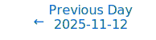
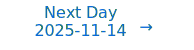

# Personalized Daily ArXiv Papers 2025-11-13

| *[gpt-5]*   | Prompt   | Completion   | Total   |
|:-----------:|:--------:|:------------:|:-------:|
| **Token**   | 57393    | 51773        | 109166  |
| **Cost**    | $0.07    | $0.52        | $0.59   |

Total arXiv papers: 610

Total scanned papers: 371

Total relevant papers: 26

**Table of contents with paper titles:**

1. [LeJEPA: Provable and Scalable Self-Supervised Learning Without the Heuristics](#user-content-link1)
**Authors:** Randall Balestriero, Yann LeCun

2. [BayesQ: Uncertainty-Guided Bayesian Quantization](#user-content-link2)
**Authors:** Ismail Lamaakal, Chaymae Yahyati, Yassine Maleh, Khalid El Makkaoui, Ibrahim Ouahbi

3. [Mixture-of-Channels: Exploiting Sparse FFNs for Efficient LLMs Pre-Training and Inference](#user-content-link3)
**Authors:** Tong Wu, Yutong He, Bin Wang, Kun Yuan

4. [Selective Sinkhorn Routing for Improved Sparse Mixture of Experts](#user-content-link4)
**Authors:** Duc Anh Nguyen, Huu Binh Ta, Nhuan Le Duc, Tan M. Nguyen, Toan Tran

5. [Branching Flows: Discrete, Continuous, and Manifold Flow Matching with Splits and Deletions](#user-content-link5)
**Authors:** Hedwig Nora Nordlinder (Department of Microbiology, Tumor and Cell Biology, Karolinska Institutet), Lukas Billera (Department of Microbiology, Tumor and Cell Biology, Karolinska Institutet), Jack Collier Ryder (Department of Microbiology, Tumor and Cell Biology, Karolinska Institutet), Anton Oresten (Department of Microbiology, Tumor and Cell Biology, Karolinska Institutet), Aron St{\aa}lmarck (Department of Microbiology, Tumor and Cell Biology, Karolinska Institutet), Theodor Mosetti Bj\"ork (Department of Microbiology, Tumor and Cell Biology, Karolinska Institutet), Ben Murrell (Department of Microbiology, Tumor and Cell Biology, Karolinska Institutet)

6. [Extreme Model Compression with Structured Sparsity at Low Precision](#user-content-link6)
**Authors:** Dan Liu, Nikita Dvornik, Xue Liu

7. [Bayesian Mixture of Experts For Large Language Models](#user-content-link7)
**Authors:** Maryam Dialameh, Hossein Rajabzadeh, Weiwei Zhang, Walid Ahmed, Hyock Ju Kwon

8. [DynaKV: Enabling Accurate and Efficient Long-Sequence LLM Decoding on Smartphones](#user-content-link8)
**Authors:** Tuowei Wang, Minxing Huang, Fengzu Li, Ligeng Chen, Jinrui Zhang, Ju Ren

9. [Think-at-Hard: Selective Latent Iterations to Improve Reasoning Language Models](#user-content-link9)
**Authors:** Tianyu Fu, Yichen You, Zekai Chen, Guohao Dai, Huazhong Yang, Yu Wang

10. [A Circular Argument : Does RoPE need to be Equivariant for Vision?](#user-content-link10)
**Authors:** Chase van de Geijn, Timo L\"uddecke, Polina Turishcheva, Alexander S. Ecker

11. [LLM Inference Beyond a Single Node: From Bottlenecks to Mitigations with Fast All-Reduce Communication](#user-content-link11)
**Authors:** Prajwal Singhania, Siddharth Singh, Lannie Dalton Hough, Akarsh Srivastava, Harshitha Menon, Charles Fredrick Jekel, Abhinav Bhatele

12. [When is a System Discoverable from Data? Discovery Requires Chaos](#user-content-link12)
**Authors:** Zakhar Shumaylov, Peter Zaika, Philipp Scholl, Gitta Kutyniok, Lior Horesh, Carola-Bibiane Sch\"onlieb

13. [Group Equivariance Meets Mechanistic Interpretability: Equivariant Sparse Autoencoders](#user-content-link13)
**Authors:** Ege Erdogan, Ana Lucic

14. [Sharp Eyes and Memory for VideoLLMs: Information-Aware Visual Token Pruning for Efficient and Reliable VideoLLM Reasoning](#user-content-link14)
**Authors:** Jialong Qin, Xin Zou, Di Lu, Yibo Yan, Xuming Hu

15. [Alignment-Aware Quantization for LLM Safety](#user-content-link15)
**Authors:** Sunghyun Wee, Suyoung Kim, Hyeonjin Kim, Kyomin Hwang, Nojun Kwak

16. [Alignment-Constrained Dynamic Pruning for LLMs: Identifying and Preserving Alignment-Critical Circuits](#user-content-link16)
**Authors:** Dev Patel, Gabrielle Gervacio, Diekola Raimi, Kevin Zhu, Ryan Lagasse, Gabriel Grand, Ashwinee Panda, Maheep Chaudhary

17. [Training Language Models to Explain Their Own Computations](#user-content-link17)
**Authors:** Belinda Z. Li, Zifan Carl Guo, Vincent Huang, Jacob Steinhardt, Jacob Andreas

18. [SparseRM: A Lightweight Preference Modeling with Sparse Autoencoder](#user-content-link18)
**Authors:** Dengcan Liu, Jiahao Li, Zheren Fu, Yi Tu, Jiajun Li, Zhendong Mao, Yongdong Zhang

19. [ImagebindDC: Compressing Multi-modal Data with Imagebind-based Condensation](#user-content-link19)
**Authors:** Yue Min, Shaobo Wang, Jiaze Li, Tianle Niu, Junxin Fan, Yongliang Miao, Lijin Yang, Linfeng Zhang

20. [Synera: Synergistic LLM Serving across Device and Cloud at Scale](#user-content-link20)
**Authors:** Genglin Wang, Liekang Zeng, Bufang Yang, Kaiwei Liu, Guoliang Xing, Chumin Sun, Li Zhou, Jie Sun, Zhenyu Yan

21. [Factorization-in-Loop: Proximal Fill-in Minimization for Sparse Matrix Reordering](#user-content-link21)
**Authors:** Ziwei Li, Shuzi Niu, Tao Yuan, Huiyuan Li, Wenjia Wu

22. [GeoGNN: Quantifying and Mitigating Semantic Drift in Text-Attributed Graphs](#user-content-link22)
**Authors:** Liangwei Yang, Jing Ma, Jianguo Zhang, Zhiwei Liu, Jielin Qiu, Shirley Kokane, Shiyu Wang, Haolin Chen, Rithesh Murthy, Ming Zhu, Huan Wang, Weiran Yao, Caiming Xiong, Shelby Heinecke

23. [A General Method for Proving Networks Universal Approximation Property](#user-content-link23)
**Authors:** Wei Wang

24. [Unsupervised Feature Selection Through Group Discovery](#user-content-link24)
**Authors:** Shira Lifshitz, Ofir Lindenbaum, Gal Mishne, Ron Meir, Hadas Benisty

25. [Multi-step Predictive Coding Leads To Simplicity Bias](#user-content-link25)
**Authors:** Aviv Ratzon, Omri Barak

26. [Abstract Gradient Training: A Unified Certification Framework for Data Poisoning, Unlearning, and Differential Privacy](#user-content-link26)
**Authors:** Philip Sosnin, Matthew Wicker, Josh Collyer, Calvin Tsay

---

## 1. [LeJEPA: Provable and Scalable Self-Supervised Learning Without the Heuristics](https://arxiv.org/abs/2511.08544) 

**ArXiv ID:** 2511.08544

**Authors:** Randall Balestriero, Yann LeCun

**Abstract:** Learning manipulable representations of the world and its dynamics is central to AI. Joint-Embedding Predictive Architectures (JEPAs) offer a promising blueprint, but lack of practical guidance and theory has led to ad-hoc R&D. We present a comprehensive theory of JEPAs and instantiate it in {\bf LeJEPA}, a lean, scalable, and theoretically grounded training objective. First, we identify the isotropic Gaussian as the optimal distribution that JEPAs' embeddings should follow to minimize downstream prediction risk. Second, we introduce a novel objective--{\bf Sketched Isotropic Gaussian Regularization} (SIGReg)--to constrain embeddings to reach that ideal distribution. Combining the JEPA predictive loss with SIGReg yields LeJEPA with numerous theoretical and practical benefits: (i) single trade-off hyperparameter, (ii) linear time and memory complexity, (iii) stability across hyper-parameters, architectures (ResNets, ViTs, ConvNets) and domains, (iv) heuristics-free, e.g., no stop-gradient, no teacher-student, no hyper-parameter schedulers, and (v) distributed training-friendly implementation requiring only $\approx$50 lines of code. Our empirical validation covers 10+ datasets, 60+ architectures, all with varying scales and domains. As an example, using imagenet-1k for pretraining and linear evaluation with frozen backbone, LeJEPA reaches 79\% with a ViT-H/14. We hope that the simplicity and theory-friendly ecosystem offered by LeJEPA will reestablish self-supervised pre-training as a core pillar of AI research (\href{https://github.com/rbalestr-lab/lejepa}{GitHub repo}).

**Comment:** Author match

---

## 2. [BayesQ: Uncertainty-Guided Bayesian Quantization](https://arxiv.org/abs/2511.08821) 

**ArXiv ID:** 2511.08821

**Authors:** Ismail Lamaakal, Chaymae Yahyati, Yassine Maleh, Khalid El Makkaoui, Ibrahim Ouahbi

**Abstract:** We present BayesQ, an uncertainty-guided post-training quantization framework that is the first to optimize quantization under the posterior expected loss. BayesQ fits a lightweight Gaussian posterior over weights (diagonal Laplace by default; optional K-FAC/low-rank), whitens by the posterior covariance, designs codebooks to minimize posterior-expected distortion, and allocates mixed precision via a greedy knapsack that maximizes marginal expected-loss reduction per bit under a global budget. For scalar quantizers, posterior-expected MSE yields closed-form tables; task-aware proxies are handled by short Monte Carlo on a small calibration set. An optional calibration-only distillation aligns the quantized model with the posterior predictive teacher. At matched average bits/weight of 3.0/3.5/4.0, BayesQ improves over strong PTQ baselines on ResNet-50 (ImageNet) and BERT-base (GLUE) e.g., vs. GPTQ by $+1.5/+0.7/+0.3$ top-1 percentage points on RN50 and $+1.1/+0.4/+0.2$ GLUE points on BERT, while requiring one-time preprocessing comparable to a GPTQ pass. BayesQ reframes low-bit quantization as uncertainty-aware risk minimization in a practical, post-training pipeline.

**Comment:** Matches Model Compression and Efficiency: Bayesian post-training quantization optimizing posterior-expected loss with mixed-precision allocation.

**Relevance:** 10
**Novelty:** 8

---

## 3. [Mixture-of-Channels: Exploiting Sparse FFNs for Efficient LLMs Pre-Training and Inference](https://arxiv.org/abs/2511.09323) 

**ArXiv ID:** 2511.09323

**Authors:** Tong Wu, Yutong He, Bin Wang, Kun Yuan

**Abstract:** Large language models (LLMs) have demonstrated remarkable success across diverse artificial intelligence tasks, driven by scaling laws that correlate model size and training data with performance improvements. However, this scaling paradigm incurs substantial memory overhead, creating significant challenges for both training and inference. While existing research has primarily addressed parameter and optimizer state memory reduction, activation memory-particularly from feed-forward networks (FFNs)-has become the critical bottleneck, especially when FlashAttention is implemented. In this work, we conduct a detailed memory profiling of LLMs and identify FFN activations as the predominant source to activation memory overhead. Motivated by this, we introduce Mixture-of-Channels (MoC), a novel FFN architecture that selectively activates only the Top-K most relevant channels per token determined by SwiGLU's native gating mechanism. MoC substantially reduces activation memory during pre-training and improves inference efficiency by reducing memory access through partial weight loading into GPU SRAM. Extensive experiments validate that MoC delivers significant memory savings and throughput gains while maintaining competitive model performance.

**Comment:** Model architecture and efficiency: Mixture-of-Channels sparsifies FFNs by activating top-K channels per token to cut activation memory and improve throughput.

**Relevance:** 10
**Novelty:** 8

---

## 4. [Selective Sinkhorn Routing for Improved Sparse Mixture of Experts](https://arxiv.org/abs/2511.08972) 

**ArXiv ID:** 2511.08972

**Authors:** Duc Anh Nguyen, Huu Binh Ta, Nhuan Le Duc, Tan M. Nguyen, Toan Tran

**Abstract:** Sparse Mixture-of-Experts (SMoE) has gained prominence as a scalable and computationally efficient architecture, enabling significant growth in model capacity without incurring additional inference costs. However, existing SMoE models often rely on auxiliary losses (e.g., z-loss, load balancing) and additional trainable parameters (e.g., noisy gating) to encourage expert diversity, leading to objective misalignment and increased model complexity. Moreover, existing Sinkhorn-based methods suffer from significant training overhead due to their heavy reliance on the computationally expensive Sinkhorn algorithm. In this work, we formulate token-to-expert assignment as an optimal transport problem, incorporating constraints to ensure balanced expert utilization. We demonstrate that introducing a minimal degree of optimal transport-based routing enhances SMoE performance without requiring auxiliary balancing losses. Unlike previous methods, our approach derives gating scores directly from the transport map, enabling more effective token-to-expert balancing, supported by both theoretical analysis and empirical results. Building on these insights, we propose Selective Sinkhorn Routing (SSR), a routing mechanism that replaces auxiliary loss with lightweight Sinkhorn-based routing. SSR promotes balanced token assignments while preserving flexibility in expert selection. Across both language modeling and image classification tasks, SSR achieves faster training, higher accuracy, and greater robustness to input corruption.

**Comment:** Model architecture (MoE): lightweight optimal-transport-based selective Sinkhorn routing that removes auxiliary load-balancing losses.

**Relevance:** 10
**Novelty:** 8

---

## 5. [Branching Flows: Discrete, Continuous, and Manifold Flow Matching with Splits and Deletions](https://arxiv.org/abs/2511.09465) 

**ArXiv ID:** 2511.09465

**Authors:** Hedwig Nora Nordlinder (Department of Microbiology, Tumor and Cell Biology, Karolinska Institutet), Lukas Billera (Department of Microbiology, Tumor and Cell Biology, Karolinska Institutet), Jack Collier Ryder (Department of Microbiology, Tumor and Cell Biology, Karolinska Institutet), Anton Oresten (Department of Microbiology, Tumor and Cell Biology, Karolinska Institutet), Aron St{\aa}lmarck (Department of Microbiology, Tumor and Cell Biology, Karolinska Institutet), Theodor Mosetti Bj\"ork (Department of Microbiology, Tumor and Cell Biology, Karolinska Institutet), Ben Murrell (Department of Microbiology, Tumor and Cell Biology, Karolinska Institutet)

**Abstract:** Diffusion and flow matching approaches to generative modeling have shown promise in domains where the state space is continuous, such as image generation or protein folding & design, and discrete, exemplified by diffusion large language models. They offer a natural fit when the number of elements in a state is fixed in advance (e.g. images), but require ad hoc solutions when, for example, the length of a response from a large language model, or the number of amino acids in a protein chain is not known a priori.   Here we propose Branching Flows, a generative modeling framework that, like diffusion and flow matching approaches, transports a simple distribution to the data distribution. But in Branching Flows, the elements in the state evolve over a forest of binary trees, branching and dying stochastically with rates that are learned by the model. This allows the model to control, during generation, the number of elements in the sequence. We also show that Branching Flows can compose with any flow matching base process on discrete sets, continuous Euclidean spaces, smooth manifolds, and `multimodal' product spaces that mix these components. We demonstrate this in three domains: small molecule generation (multimodal), antibody sequence generation (discrete), and protein backbone generation (multimodal), and show that Branching Flows is a capable distribution learner with a stable learning objective, and that it enables new capabilities.

**Comment:** Model Architecture: introduces Branching Flows—flow matching with stochastic splits/deletions to handle variable-length outputs across discrete/continuous/manifold spaces.

**Relevance:** 9
**Novelty:** 9

---

## 6. [Extreme Model Compression with Structured Sparsity at Low Precision](https://arxiv.org/abs/2511.08360) 

**ArXiv ID:** 2511.08360

**Authors:** Dan Liu, Nikita Dvornik, Xue Liu

**Abstract:** Deep neural networks (DNNs) are used in many applications, but their large size and high computational cost make them hard to run on devices with limited resources. Two widely used techniques to address this challenge are weight quantization, which lowers the precision of all weights, and structured sparsity, which removes unimportant weights while retaining the important ones at full precision. Although both are effective individually, they are typically studied in isolation due to their compounded negative impact on model accuracy when combined. In this work, we introduce SLOPE Structured Sparsity at Low Precision), a unified framework, to effectively combine structured sparsity and low-bit quantization in a principled way. We show that naively combining sparsity and quantization severely harms performance due to the compounded impact of both techniques. To address this, we propose a training-time regularization strategy that minimizes the discrepancy between full-precision weights and their sparse, quantized counterparts by promoting angular alignment rather than direct matching. On ResNet-18, SLOPE achieves $\sim20\times$ model size reduction while retaining $\sim$99% of the original accuracy. It consistently outperforms state-of-the-art quantization and structured sparsity methods across classification, detection, and segmentation tasks on models such as ResNet-18, ViT-Small, and Mask R-CNN.

**Comment:** Matches Model Compression and Efficiency: combines structured sparsity and low-bit quantization with a new training-time regularization.

**Relevance:** 10
**Novelty:** 7

---

## 7. [Bayesian Mixture of Experts For Large Language Models](https://arxiv.org/abs/2511.08968) 

**ArXiv ID:** 2511.08968

**Authors:** Maryam Dialameh, Hossein Rajabzadeh, Weiwei Zhang, Walid Ahmed, Hyock Ju Kwon

**Abstract:** We present Bayesian Mixture of Experts (Bayesian-MoE), a post-hoc uncertainty estimation framework for fine-tuned large language models (LLMs) based on Mixture-of-Experts architectures. Our method applies a structured Laplace approximation to the second linear layer of each expert, enabling calibrated uncertainty estimation without modifying the original training procedure or introducing new parameters. Unlike prior approaches, which apply Bayesian inference to added adapter modules, Bayesian-MoE directly targets the expert pathways already present in MoE models, leveraging their modular design for tractable block-wise posterior estimation. We use Kronecker-factored low-rank approximations to model curvature and derive scalable estimates of predictive uncertainty and marginal likelihood. Experiments on common-sense reasoning benchmarks with Qwen1.5-MoE and DeepSeek-MoE demonstrate that Bayesian-MoE improves both expected calibration error (ECE) and negative log-likelihood (NLL) over baselines, confirming its effectiveness for reliable downstream decision-making.

**Comment:** Matches Mixture-of-Experts criterion directly: Bayesian uncertainty via structured Laplace on expert layers in MoE LLMs.

**Relevance:** 10
**Novelty:** 7

---

## 8. [DynaKV: Enabling Accurate and Efficient Long-Sequence LLM Decoding on Smartphones](https://arxiv.org/abs/2511.07427) 

**ArXiv ID:** 2511.07427

**Authors:** Tuowei Wang, Minxing Huang, Fengzu Li, Ligeng Chen, Jinrui Zhang, Ju Ren

**Abstract:** As the demand for human-like reasoning, multi-turn dialogues, and long-form responses grows, large language models (LLMs) are increasingly expected to support efficient and effective long-sequence decoding. However, due to limited DRAM capacity, long-seuqence LLM decoding on smartphones is constrained by the key-value cache (KVCache), whose memory footprint increases linearly with sequence length. Retrieval-based methods mitigate DRAM pressure by offloading KVCache to flash and retrieving query-relevant entries through cluster-based indexing. Unfortunately, as decoding progresses, KVCache distribution shifts render static or local cluster updates progressively misaligned, excluding essential entries or fetching redundant ones. These issues are further exacerbated by smartphone-specific limitations in bandwidth, IOPS, and memory capacity.   We propose DynaKV, the first adaptive KVCache management approach that jointly addresses accuracy and efficiency for long-sequence decoding on smartphones. DynaKV integrates three key techniques: (1) Migration-Free Cluster Adaptation, which adaptively splits clusters during retrieval without incurring additional transfers; (2) Continuity-Centric Flash Management, which co-locates correlated entries and clusters and employs a dual-head layout for efficient updates; and (3) Memory-Efficient Cache Design, which virtualizes cache space across DRAM and flash and extends replacement policies to align with cluster-level access patterns. Evaluations demonstrate that DynaKV improves retrieval accuracy and reduces end-to-end latency compared to state-of-the-art solutions, achieving average gains of $1.38\times$ in accuracy and $1.47\times$ speedups. Furthermore, the insights of DynaKV naturally extend to other long-context workloads and multi-tier memory hierarchies, underscoring its broader applicability.

**Comment:** Model Compression and Efficiency/HPC: adaptive KV-cache clustering, continuity-centric flash management, and cache virtualization for accurate, low-latency long-sequence decoding on smartphones.

**Relevance:** 9
**Novelty:** 8

---

## 9. [Think-at-Hard: Selective Latent Iterations to Improve Reasoning Language Models](https://arxiv.org/abs/2511.08577) 

**ArXiv ID:** 2511.08577

**Authors:** Tianyu Fu, Yichen You, Zekai Chen, Guohao Dai, Huazhong Yang, Yu Wang

**Abstract:** Improving reasoning capabilities of Large Language Models (LLMs), especially under parameter constraints, is crucial for real-world applications. Prior work proposes recurrent transformers, which allocate a fixed number of extra iterations per token to improve generation quality. After the first, standard forward pass, instead of verbalization, last-layer hidden states are fed back as inputs for additional iterations to refine token predictions. Yet we identify a latent overthinking phenomenon: easy token predictions that are already correct after the first pass are sometimes revised into errors in additional iterations. To address this, we propose Think-at-Hard (TaH), a dynamic latent thinking method that iterates deeper only at hard tokens. It employs a lightweight neural decider to trigger latent iterations only at tokens that are likely incorrect after the standard forward pass. During latent iterations, Low-Rank Adaptation (LoRA) modules shift the LLM objective from general next-token prediction to focused hard-token refinement. We further introduce a duo-causal attention mechanism that extends attention from the token sequence dimension to an additional iteration depth dimension. This enables cross-iteration information flow while maintaining full sequential parallelism. Experiments show that TaH boosts LLM reasoning performance across five challenging benchmarks while maintaining the same parameter count. Compared with baselines that iterate twice for all output tokens, TaH delivers 8.1-11.3% accuracy gains while exempting 94% of tokens from the second iteration. Against strong single-iteration Qwen3 models finetuned with the same data, it also delivers 4.0-5.0% accuracy gains. When allowing less than 3% additional parameters from LoRA and the iteration decider, the gains increase to 8.5-12.6% and 5.3-5.4%, respectively. Our code is available at https://github.com/thu-nics/TaH.

**Comment:** Model Architecture and Efficiency: selective latent iterations only at hard tokens via a learned decider, LoRA-based refinement, and duo-causal attention over iteration depth.

**Relevance:** 9
**Novelty:** 8

---

## 10. [A Circular Argument : Does RoPE need to be Equivariant for Vision?](https://arxiv.org/abs/2511.08368) 

**ArXiv ID:** 2511.08368

**Authors:** Chase van de Geijn, Timo L\"uddecke, Polina Turishcheva, Alexander S. Ecker

**Abstract:** Rotary Positional Encodings (RoPE) have emerged as a highly effective technique for one-dimensional sequences in Natural Language Processing spurring recent progress towards generalizing RoPE to higher-dimensional data such as images and videos. The success of RoPE has been thought to be due to its positional equivariance, i.e. its status as a relative positional encoding. In this paper, we mathematically show RoPE to be one of the most general solutions for equivariant positional embedding in one-dimensional data. Moreover, we show Mixed RoPE to be the analogously general solution for M-dimensional data, if we require commutative generators -- a property necessary for RoPE's equivariance. However, we question whether strict equivariance plays a large role in RoPE's performance. We propose Spherical RoPE, a method analogous to Mixed RoPE, but assumes non-commutative generators. Empirically, we find Spherical RoPE to have the equivalent or better learning behavior compared to its equivariant analogues. This suggests that relative positional embeddings are not as important as is commonly believed, at least within computer vision. We expect this discovery to facilitate future work in positional encodings for vision that can be faster and generalize better by removing the preconception that they must be relative.

**Comment:** Matches Model Architecture criterion via theoretical analysis and redesign of positional encodings (RoPE/Mixed/Spherical) and equivariance.

**Relevance:** 9
**Novelty:** 8

---

## 11. [LLM Inference Beyond a Single Node: From Bottlenecks to Mitigations with Fast All-Reduce Communication](https://arxiv.org/abs/2511.09557) 

**ArXiv ID:** 2511.09557

**Authors:** Prajwal Singhania, Siddharth Singh, Lannie Dalton Hough, Akarsh Srivastava, Harshitha Menon, Charles Fredrick Jekel, Abhinav Bhatele

**Abstract:** As large language models (LLMs) continue to grow in size, distributed inference has become increasingly important. Model-parallel strategies must now efficiently scale not only across multiple GPUs but also across multiple nodes. In this work, we present a detailed performance study of multi-node distributed inference using LLMs on GPU-based supercomputers. We conduct experiments with several state-of-the-art inference engines alongside YALIS, a research-oriented prototype engine designed for controlled experimentation. We analyze the strong-scaling behavior of different model-parallel schemes and identify key bottlenecks. Since all-reduce operations are a common performance bottleneck, we develop NVRAR, a hierarchical all-reduce algorithm based on recursive doubling with NVSHMEM. NVRAR achieves up to 1.9x-3.6x lower latency than NCCL for message sizes between 128 KB and 2 MB on HPE Slingshot and InfiniBand interconnects. Integrated into YALIS, NVRAR achieves up to a 1.72x reduction in end-to-end batch latency for the Llama 3.1 405B model in multi-node decode-heavy workloads using tensor parallelism.

**Comment:** High Performance Computing: introduces a hierarchical NVSHMEM-based all-reduce (NVRAR) to accelerate multi-node LLM inference and reduce batch latency.

**Relevance:** 9
**Novelty:** 8

---

## 12. [When is a System Discoverable from Data? Discovery Requires Chaos](https://arxiv.org/abs/2511.08860) 

**ArXiv ID:** 2511.08860

**Authors:** Zakhar Shumaylov, Peter Zaika, Philipp Scholl, Gitta Kutyniok, Lior Horesh, Carola-Bibiane Sch\"onlieb

**Abstract:** The deep learning revolution has spurred a rise in advances of using AI in sciences. Within physical sciences the main focus has been on discovery of dynamical systems from observational data. Yet the reliability of learned surrogates and symbolic models is often undermined by the fundamental problem of non-uniqueness. The resulting models may fit the available data perfectly, but lack genuine predictive power. This raises the question: under what conditions can the systems governing equations be uniquely identified from a finite set of observations? We show, counter-intuitively, that chaos, typically associated with unpredictability, is crucial for ensuring a system is discoverable in the space of continuous or analytic functions. The prevalence of chaotic systems in benchmark datasets may have inadvertently obscured this fundamental limitation.   More concretely, we show that systems chaotic on their entire domain are discoverable from a single trajectory within the space of continuous functions, and systems chaotic on a strange attractor are analytically discoverable under a geometric condition on the attractor. As a consequence, we demonstrate for the first time that the classical Lorenz system is analytically discoverable. Moreover, we establish that analytic discoverability is impossible in the presence of first integrals, common in real-world systems. These findings help explain the success of data-driven methods in inherently chaotic domains like weather forecasting, while revealing a significant challenge for engineering applications like digital twins, where stable, predictable behavior is desired. For these non-chaotic systems, we find that while trajectory data alone is insufficient, certain prior physical knowledge can help ensure discoverability. These findings warrant a critical re-evaluation of the fundamental assumptions underpinning purely data-driven discovery.

**Comment:** Matches Representation Learning/Theory: identifiability/discoverability conditions for dynamical systems from data; links chaos to unique discovery.

**Relevance:** 8
**Novelty:** 9

---

## 13. [Group Equivariance Meets Mechanistic Interpretability: Equivariant Sparse Autoencoders](https://arxiv.org/abs/2511.09432) 

**ArXiv ID:** 2511.09432

**Authors:** Ege Erdogan, Ana Lucic

**Abstract:** Sparse autoencoders (SAEs) have proven useful in disentangling the opaque activations of neural networks, primarily large language models, into sets of interpretable features. However, adapting them to domains beyond language, such as scientific data with group symmetries, introduces challenges that can hinder their effectiveness. We show that incorporating such group symmetries into the SAEs yields features more useful in downstream tasks. More specifically, we train autoencoders on synthetic images and find that a single matrix can explain how their activations transform as the images are rotated. Building on this, we develop adaptively equivariant SAEs that can adapt to the base model's level of equivariance. These adaptive SAEs discover features that lead to superior probing performance compared to regular SAEs, demonstrating the value of incorporating symmetries in mechanistic interpretability tools.

**Comment:** Matches Representation Learning with Sparse Autoencoders and group equivariance; architectural innovation for symmetry-aware SAEs.

**Relevance:** 9
**Novelty:** 7

---

## 14. [Sharp Eyes and Memory for VideoLLMs: Information-Aware Visual Token Pruning for Efficient and Reliable VideoLLM Reasoning](https://arxiv.org/abs/2511.08003) 

**ArXiv ID:** 2511.08003

**Authors:** Jialong Qin, Xin Zou, Di Lu, Yibo Yan, Xuming Hu

**Abstract:** Current Video Large Language Models (VideoLLMs) suffer from quadratic computational complexity and key-value cache scaling, due to their reliance on processing excessive redundant visual tokens. To address this problem, we propose SharpV, a minimalist and efficient method for adaptive pruning of visual tokens and KV cache. Different from most uniform compression approaches, SharpV dynamically adjusts pruning ratios based on spatial-temporal information. Remarkably, this adaptive mechanism occasionally achieves performance gains over dense models, offering a novel paradigm for adaptive pruning. During the KV cache pruning stage, based on observations of visual information degradation, SharpV prunes degraded visual features via a self-calibration manner, guided by similarity to original visual features. In this way, SharpV achieves hierarchical cache pruning from the perspective of information bottleneck, offering a new insight into VideoLLMs' information flow. Experiments on multiple public benchmarks demonstrate the superiority of SharpV. Moreover, to the best of our knowledge, SharpV is notably the first two-stage pruning framework that operates without requiring access to exposed attention scores, ensuring full compatibility with hardware acceleration techniques like Flash Attention.

**Comment:** Matches Model Compression and Efficiency: adaptive visual token and KV cache pruning for VideoLLMs (sparsity/pruning).

**Relevance:** 9
**Novelty:** 7

---

## 15. [Alignment-Aware Quantization for LLM Safety](https://arxiv.org/abs/2511.07842) 

**ArXiv ID:** 2511.07842

**Authors:** Sunghyun Wee, Suyoung Kim, Hyeonjin Kim, Kyomin Hwang, Nojun Kwak

**Abstract:** Safety and efficiency are both important factors when deploying large language models(LLMs). LLMs are trained to follow human alignment for safety, and post training quantization(PTQ) is applied afterward for efficiency. However, these two objectives are often in conflict, revealing a fundamental flaw in the conventional PTQ paradigm: quantization can turn into a safety vulnerability if it only aims to achieve low perplexity. Models can demonstrate low perplexity yet exhibit significant degradation in alignment with the safety policy, highlighting that perplexity alone is an insufficient and often misleading proxy for model safety. To address this, we propose Alignment-Aware Quantization(AAQ), a novel approach that integrates Alignment-Preserving Contrastive(APC) loss into the PTQ pipeline. Compared to simple reconstruction loss, ours explicitly preserves alignment by encouraging the quantized model to mimic its safe, instruction-tuned model while diverging from the unaligned, pre-trained counterpart. Our method achieves this robust safety alignment without resorting to specialized safety-focused calibration datasets, highlighting its practical utility and broad applicability. AAQ is compatible with standard PTQ techniques and enables robust 4-bit (W4A4) quantization across diverse model families such as LLaMA, Qwen, and Mistral while maintaining safety where previous methods fail. Our work resolves the critical trade-off between efficiency and safety, paving the way toward LLMs that are both efficient and trustworthy. Anonymized code is available in the supplementary material.

**Comment:** Model compression and efficiency: post-training quantization with alignment-preserving contrastive loss to retain safety alignment under low-bit PTQ.

**Relevance:** 9
**Novelty:** 7

---

## 16. [Alignment-Constrained Dynamic Pruning for LLMs: Identifying and Preserving Alignment-Critical Circuits](https://arxiv.org/abs/2511.07482) 

**ArXiv ID:** 2511.07482

**Authors:** Dev Patel, Gabrielle Gervacio, Diekola Raimi, Kevin Zhu, Ryan Lagasse, Gabriel Grand, Ashwinee Panda, Maheep Chaudhary

**Abstract:** Large Language Models require substantial computational resources for inference, posing deployment challenges. While dynamic pruning offers superior efficiency over static methods through adaptive circuit selection, it exacerbates alignment degradation by retaining only input-dependent safety-critical circuit preservation across diverse inputs. As a result, addressing these heightened alignment vulnerabilities remains critical. We introduce Alignment-Aware Probe Pruning (AAPP), a dynamic structured pruning method that adaptively preserves alignment-relevant circuits during inference, building upon Probe Pruning. Experiments on LLaMA 2-7B, Qwen2.5-14B-Instruct, and Gemma-3-12B-IT show AAPP improves refusal rates by 50\% at matched compute, enabling efficient yet safety-preserving LLM deployment.

**Comment:** Model compression/efficiency: dynamic structured pruning with alignment-aware circuit preservation for safe LLM inference.

**Relevance:** 9
**Novelty:** 7

---

## 17. [Training Language Models to Explain Their Own Computations](https://arxiv.org/abs/2511.08579) 

**ArXiv ID:** 2511.08579

**Authors:** Belinda Z. Li, Zifan Carl Guo, Vincent Huang, Jacob Steinhardt, Jacob Andreas

**Abstract:** Can language models (LMs) learn to faithfully describe their internal computations? Are they better able to describe themselves than other models? We study the extent to which LMs' privileged access to their own internals can be leveraged to produce new techniques for explaining their behavior. Using existing interpretability techniques as a source of ground truth, we fine-tune LMs to generate natural language descriptions of (1) the information encoded by LM features, (2) the causal structure of LMs' internal activations, and (3) the influence of specific input tokens on LM outputs. When trained with only tens of thousands of example explanations, explainer models exhibit non-trivial generalization to new queries. This generalization appears partly attributable to explainer models' privileged access to their own internals: using a model to explain its own computations generally works better than using a *different* model to explain its computations (even if the other model is significantly more capable). Our results suggest not only that LMs can learn to reliably explain their internal computations, but that such explanations offer a scalable complement to existing interpretability methods.

**Comment:** Representation Learning: trains LMs to produce faithful natural-language explanations of their own features/causal activations, leveraging privileged internal access.

**Relevance:** 8
**Novelty:** 8

---

## 18. [SparseRM: A Lightweight Preference Modeling with Sparse Autoencoder](https://arxiv.org/abs/2511.07896) 

**ArXiv ID:** 2511.07896

**Authors:** Dengcan Liu, Jiahao Li, Zheren Fu, Yi Tu, Jiajun Li, Zhendong Mao, Yongdong Zhang

**Abstract:** Reward models (RMs) are a core component in the post-training of large language models (LLMs), serving as proxies for human preference evaluation and guiding model alignment. However, training reliable RMs under limited resources remains challenging due to the reliance on large-scale preference annotations and the high cost of fine-tuning LLMs. To address this, we propose SparseRM, which leverages Sparse Autoencoder (SAE) to extract preference-relevant information encoded in model representations, enabling the construction of a lightweight and interpretable reward model. SparseRM first employs SAE to decompose LLM representations into interpretable directions that capture preference-relevant features. The representations are then projected onto these directions to compute alignment scores, which quantify the strength of each preference feature in the representations. A simple reward head aggregates these scores to predict preference scores. Experiments on three preference modeling tasks show that SparseRM achieves superior performance over most mainstream RMs while using less than 1% of trainable parameters. Moreover, it integrates seamlessly into downstream alignment pipelines, highlighting its potential for efficient alignment.

**Comment:** Representation Learning: leverages Sparse Autoencoders to decompose LLM representations into interpretable preference features. Compression/Efficiency: builds a lightweight reward model with <1% trainable parameters.

**Relevance:** 8
**Novelty:** 7

---

## 19. [ImagebindDC: Compressing Multi-modal Data with Imagebind-based Condensation](https://arxiv.org/abs/2511.08263) 

**ArXiv ID:** 2511.08263

**Authors:** Yue Min, Shaobo Wang, Jiaze Li, Tianle Niu, Junxin Fan, Yongliang Miao, Lijin Yang, Linfeng Zhang

**Abstract:** Data condensation techniques aim to synthesize a compact dataset from a larger one to enable efficient model training, yet while successful in unimodal settings, they often fail in multimodal scenarios where preserving intricate inter-modal dependencies is crucial. To address this, we introduce ImageBindDC, a novel data condensation framework operating within the unified feature space of ImageBind. Our approach moves beyond conventional distribution-matching by employing a powerful Characteristic Function (CF) loss, which operates in the Fourier domain to facilitate a more precise statistical alignment via exact infinite moment matching. We design our objective to enforce three critical levels of distributional consistency: (i) uni-modal alignment, which matches the statistical properties of synthetic and real data within each modality; (ii) cross-modal alignment, which preserves pairwise semantics by matching the distributions of hybrid real-synthetic data pairs; and (iii) joint-modal alignment, which captures the complete multivariate data structure by aligning the joint distribution of real data pairs with their synthetic counterparts. Extensive experiments highlight the effectiveness of ImageBindDC: on the NYU-v2 dataset, a model trained on just 5 condensed datapoints per class achieves lossless performance comparable to one trained on the full dataset, achieving a new state-of-the-art with an 8.2\% absolute improvement over the previous best method and more than 4$\times$ less condensation time.

**Comment:** Compression/Efficiency and Representation Learning: multimodal data condensation in ImageBind’s unified space using characteristic function loss for uni-/cross-/joint-modal alignment.

**Relevance:** 8
**Novelty:** 7

---

## 20. [Synera: Synergistic LLM Serving across Device and Cloud at Scale](https://arxiv.org/abs/2511.07423) 

**ArXiv ID:** 2511.07423

**Authors:** Genglin Wang, Liekang Zeng, Bufang Yang, Kaiwei Liu, Guoliang Xing, Chumin Sun, Li Zhou, Jie Sun, Zhenyu Yan

**Abstract:** Large Language Models (LLMs) are becoming key components in various mobile operating systems, driving smart applications like interactive chatbots and personal assistants. While bringing enhanced intelligence to mobile ends, their deployment suffers from a set of performance challenges, especially the generation quality degradation and prolonged latency. Prior works have mainly relied on solutions of cloud offloading or on-device Small Language Models (SLMs). However, the former is usually limited by the communication bottleneck, and the latter sacrifices generation quality due to resource constraints. To mitigate these limitations, this paper proposes Synera, a device-cloud synergistic LLM serving system that applies an efficient SLM-LLM synergistic mechanism. Through empirical studies on LLM's unique computing characteristics, Synera identifies a set of underexplored optimization opportunities in device-cloud synergistic LLM inference, including offloading decisions, pipeline stalls, and batching bottlenecks. To translate them into enhanced performance, Synera introduces tailored designs of communication-efficient selective offloading, stall-free parallel inference, and scalable cloud batching. Extensive evaluations with real-world testbeds show that Synera enables 1.20-5.47x better generation quality against competitive baselines with on-par latency performance. Compared with existing cloud serving, Synera achieves 8.2-16.5% lower cloud serving cost on various benchmarks.

**Comment:** High Performance Computing: device–cloud synergistic LLM serving with communication-efficient selective offloading, stall-free parallel inference, and scalable batching.

**Relevance:** 8
**Novelty:** 7

---

## 21. [Factorization-in-Loop: Proximal Fill-in Minimization for Sparse Matrix Reordering](https://arxiv.org/abs/2511.09093) 

**ArXiv ID:** 2511.09093

**Authors:** Ziwei Li, Shuzi Niu, Tao Yuan, Huiyuan Li, Wenjia Wu

**Abstract:** Fill-ins are new nonzero elements in the summation of the upper and lower triangular factors generated during LU factorization. For large sparse matrices, they will increase the memory usage and computational time, and be reduced through proper row or column arrangement, namely matrix reordering. Finding a row or column permutation with the minimal fill-ins is NP-hard, and surrogate objectives are designed to derive fill-in reduction permutations or learn a reordering function. However, there is no theoretical guarantee between the golden criterion and these surrogate objectives. Here we propose to learn a reordering network by minimizing \(l_1\) norm of triangular factors of the reordered matrix to approximate the exact number of fill-ins. The reordering network utilizes a graph encoder to predict row or column node scores. For inference, it is easy and fast to derive the permutation from sorting algorithms for matrices. For gradient based optimization, there is a large gap between the predicted node scores and resultant triangular factors in the optimization objective. To bridge the gap, we first design two reparameterization techniques to obtain the permutation matrix from node scores. The matrix is reordered by multiplying the permutation matrix. Then we introduce the factorization process into the objective function to arrive at target triangular factors. The overall objective function is optimized with the alternating direction method of multipliers and proximal gradient descent. Experimental results on benchmark sparse matrix collection SuiteSparse show the fill-in number and LU factorization time reduction of our proposed method is 20% and 17.8% compared with state-of-the-art baselines.

**Comment:** Matches High Performance Computing: learning-based sparse matrix reordering with proximal factorization-in-loop to directly minimize fill-in.

**Relevance:** 8
**Novelty:** 7

---

## 22. [GeoGNN: Quantifying and Mitigating Semantic Drift in Text-Attributed Graphs](https://arxiv.org/abs/2511.09042) 

**ArXiv ID:** 2511.09042

**Authors:** Liangwei Yang, Jing Ma, Jianguo Zhang, Zhiwei Liu, Jielin Qiu, Shirley Kokane, Shiyu Wang, Haolin Chen, Rithesh Murthy, Ming Zhu, Huan Wang, Weiran Yao, Caiming Xiong, Shelby Heinecke

**Abstract:** Graph neural networks (GNNs) on text--attributed graphs (TAGs) typically encode node texts using pretrained language models (PLMs) and propagate these embeddings through linear neighborhood aggregation. However, the representation spaces of modern PLMs are highly non--linear and geometrically structured, where textual embeddings reside on curved semantic manifolds rather than flat Euclidean spaces. Linear aggregation on such manifolds inevitably distorts geometry and causes semantic drift--a phenomenon where aggregated representations deviate from the intrinsic manifold, losing semantic fidelity and expressive power. To quantitatively investigate this problem, this work introduces a local PCA--based metric that measures the degree of semantic drift and provides the first quantitative framework to analyze how different aggregation mechanisms affect manifold structure. Building upon these insights, we propose Geodesic Aggregation, a manifold--aware mechanism that aggregates neighbor information along geodesics via log--exp mappings on the unit sphere, ensuring that representations remain faithful to the semantic manifold during message passing. We further develop GeoGNN, a practical instantiation that integrates spherical attention with manifold interpolation. Extensive experiments across four benchmark datasets and multiple text encoders show that GeoGNN substantially mitigates semantic drift and consistently outperforms strong baselines, establishing the importance of manifold--aware aggregation in text--attributed graph learning.

**Comment:** Matches Representation Learning: manifold-aware geodesic aggregation to mitigate semantic drift in TAGs; architecture-level change to message passing.

**Relevance:** 8
**Novelty:** 7

---

## 23. [A General Method for Proving Networks Universal Approximation Property](https://arxiv.org/abs/2511.07857) 

**ArXiv ID:** 2511.07857

**Authors:** Wei Wang

**Abstract:** Deep learning architectures are highly diverse. To prove their universal approximation properties, existing works typically rely on model-specific proofs. Generally, they construct a dedicated mathematical formulation for each architecture (e.g., fully connected networks, CNNs, or Transformers) and then prove their universal approximability. However, this approach suffers from two major limitations: first, every newly proposed architecture often requires a completely new proof from scratch; second, these proofs are largely isolated from one another, lacking a common analytical foundation. This not only incurs significant redundancy but also hinders unified theoretical understanding across different network families. To address these issues, this paper proposes a general and modular framework for proving universal approximation. We define a basic building block (comprising one or multiple layers) that possesses the universal approximation property as a Universal Approximation Module (UAM). Under this condition, we show that any deep network composed of such modules inherently retains the universal approximation property. Moreover, the overall approximation process can be interpreted as a progressive refinement across modules. This perspective not only unifies the analysis of diverse architectures but also enables a step-by-step understanding of how expressive power evolves through the network.

**Comment:** Matches Model Architecture criterion via a general, modular framework to prove universal approximation across diverse architectures (analysis/innovation on existing architectures).

**Relevance:** 8
**Novelty:** 7

---

## 24. [Unsupervised Feature Selection Through Group Discovery](https://arxiv.org/abs/2511.09166) 

**ArXiv ID:** 2511.09166

**Authors:** Shira Lifshitz, Ofir Lindenbaum, Gal Mishne, Ron Meir, Hadas Benisty

**Abstract:** Unsupervised feature selection (FS) is essential for high-dimensional learning tasks where labels are not available. It helps reduce noise, improve generalization, and enhance interpretability. However, most existing unsupervised FS methods evaluate features in isolation, even though informative signals often emerge from groups of related features. For example, adjacent pixels, functionally connected brain regions, or correlated financial indicators tend to act together, making independent evaluation suboptimal. Although some methods attempt to capture group structure, they typically rely on predefined partitions or label supervision, limiting their applicability. We propose GroupFS, an end-to-end, fully differentiable framework that jointly discovers latent feature groups and selects the most informative groups among them, without relying on fixed a priori groups or label supervision. GroupFS enforces Laplacian smoothness on both feature and sample graphs and applies a group sparsity regularizer to learn a compact, structured representation. Across nine benchmarks spanning images, tabular data, and biological datasets, GroupFS consistently outperforms state-of-the-art unsupervised FS in clustering and selects groups of features that align with meaningful patterns.

**Comment:** Matches Representation Learning with unsupervised feature selection using group discovery and group sparsity regularization.

**Relevance:** 8
**Novelty:** 7

---

## 25. [Multi-step Predictive Coding Leads To Simplicity Bias](https://arxiv.org/abs/2511.09290) 

**ArXiv ID:** 2511.09290

**Authors:** Aviv Ratzon, Omri Barak

**Abstract:** Predictive coding is a framework for understanding the formation of low-dimensional internal representations mirroring the environment's latent structure. The conditions under which such representations emerge remain unclear. In this work, we investigate how the prediction horizon and network depth shape the solutions of predictive coding tasks. Using a minimal abstract setting inspired by prior work, we show empirically and theoretically that sufficiently deep networks trained with multi-step prediction horizons consistently recover the underlying latent structure, a phenomenon explained through the Ordinary Least Squares estimator structure and biases in learning dynamics. We then extend these insights to nonlinear networks and complex datasets, including piecewise linear functions, MNIST, multiple latent states and higher dimensional state geometries. Our results provide a principled understanding of when and why predictive coding induces structured representations, bridging the gap between empirical observations and theoretical foundations.

**Comment:** Matches Representation Learning/training dynamics: theory showing when multi-step predictive coding yields low-dimensional latent structure.

**Relevance:** 8
**Novelty:** 7

---

## 26. [Abstract Gradient Training: A Unified Certification Framework for Data Poisoning, Unlearning, and Differential Privacy](https://arxiv.org/abs/2511.09400) 

**ArXiv ID:** 2511.09400

**Authors:** Philip Sosnin, Matthew Wicker, Josh Collyer, Calvin Tsay

**Abstract:** The impact of inference-time data perturbation (e.g., adversarial attacks) has been extensively studied in machine learning, leading to well-established certification techniques for adversarial robustness. In contrast, certifying models against training data perturbations remains a relatively under-explored area. These perturbations can arise in three critical contexts: adversarial data poisoning, where an adversary manipulates training samples to corrupt model performance; machine unlearning, which requires certifying model behavior under the removal of specific training data; and differential privacy, where guarantees must be given with respect to substituting individual data points. This work introduces Abstract Gradient Training (AGT), a unified framework for certifying robustness of a given model and training procedure to training data perturbations, including bounded perturbations, the removal of data points, and the addition of new samples. By bounding the reachable set of parameters, i.e., establishing provable parameter-space bounds, AGT provides a formal approach to analyzing the behavior of models trained via first-order optimization methods.

**Comment:** Representation learning/training dynamics: unified certification via parameter-space bounds for first-order optimizers covering poisoning, unlearning, and DP.

**Relevance:** 8
**Novelty:** 7

---

# Paper Selection Prompt

## System Prompt

> You are a helpful paper reading assistant whose job is to read daily posts from ArXiv and identify a few papers that your friend will enjoy reading.
> Your job is to carefully read the paper titles and abstracts below and find the ones that match the criteria below.

## User Prompt

> ## Instructions
> 
> Write the response in JSONL format with {ARXIVID, COMMENT, RELEVANCE, NOVELTY} on each line, one for each paper.
> 
> - ARXIVID: should be the ArXiv ID.
> - COMMENT: should identify whether there is a criteria that match the paper very closely. These matches should not be based on general terms like "language modeling" or "advancements" and should specifically refer to a criterion. No need to mention the non-matching criteria.
> - RELEVANCE: should be a score from 1-10.
> - NOVELTY: should be a score from 1-10.
> 
> ## Scoring Criteria
> 
> > The "Relevance" score measures how closely the paper aligns with the core topics of the prompt.
> > The "Novelty" score assesses the originality and impact of the paper.
> > They are two **ORTHONORMAL** axes and **SHOULD NOT** be confused with each other.
> 
> ### Relevance Scoring
> 
> - Relevance 9-10 (Completely Relevant)
>   - Focus: Fully aligned with core topics with no deviation, score the highest if contains relevant keywords in it.
>   - Examples: Papers focused on foundational methods or theoretical research, whose titles contain topic keywords like "MoE".
> 
> - Relevance 7-8 (Relevant)
>   - Focus: Retain a solid link to the main research area, though may touch on peripheral elements.
>   - Examples: Papers research on the fundamental part of MoE through a less critical aspect like its behavior in GNN.
> 
> - Relevance 5-6 (Borderline)
>   - Focus: Maintains a link to the core topic but also extends into at least one other domain/area beyond the primary focus.
>   - Examples: Work referencing MoE centered on reinforcement learning.
> 
> - Relevance 3-4 (Irrelevant)
>   - Focus: Largely outside our interests with no association to our topics.
>   - Examples: Application-focused papers like using MoE to solve a problem in the real world.
> 
> - Relevance 1-2 (Ignore)
>   - Focus: Purely unrelated to our topics. Completely a different domain.
>   - **Exception**: If the paper hints at a cutting-edge, radically new direction that could eventually transform the primary domain, consider a score of 9–10 despite initial appearances. (Usually a very rare concept that belongs to the fundamental research)
> 
> ### Novelty Scoring
> 
> - Novelty 9-10 (Breakthrough)
>   - Definition: Groundbreaking methods/theory introducing new directions or solving major challenges.
>   - Examples: Entirely new paradigm for foundational models; a novel theory transforming representation learning.
> 
> - Novelty 7-8 (Improvements)
>   - Definition: Substantial insights/enhancements, though not a full paradigm shift.
>   - Examples: Modifications on existing methods yielding significantly better results.
> 
> - Novelty 5-6 (Borderline)
>   - Definition: Incremental contributions with possible long-term benefits, not immediately transformative.
>   - Examples: Moderately novel extension to an existing architecture; refining current methods without fundamentally altering them.
> 
> - Novelty 3-4 (Tangential)
>   - Definition: Minor or domain-specific improvements with limited broader impact.
>   - Examples: Slight modifications to known methods with strange motivation; purely engineering jobs like a new benchmark/dataset.
> 
> - Novelty 1-2 (Low)
>   - Definition: Minimal originality, applying standard approaches without real innovation.
>   - Examples: Using an off-the-shelf model without adding new insights; purely application-driven studies like finetuning a pretrained model using existing methods.
> 
> ## Papers
> 
> [PAPER LIST HERE]
> 
> ## Relevant Topics
> 
> Use the following relevance criteria to focus on foundational research. Keep **relevant** papers and filter out **irrelevant** ones. Avoid purely **application-driven** work.
> 
> 1. Model Architecture
>    - Relevant: Mixture-of-Experts (MoE), Transformers, Conditional/Dynamic Networks, Autoencoders, analysis/innovations on existing architectures.
>    - Irrelevant: Merely using existing architectures for a certain task without insights into the structure themselves.
> 
> 2. Model Compression and Efficiency
>    - Relevant: Sparsity, pruning, quantization, low-rank approaches, cache, or other algorithmic/theoretical efficiency breakthroughs.
>    - Irrelevant: Straightforward applications of existing compression methods to new tasks.
> 
> 3. High Performance Computing
>    - Relevant: Algorithmic or systems-level innovations enabling training of large-scale models, distributed training techniques, memory optimization.
>    - Irrelevant: Incremental engineering improvements without novel algorithmic contributions.
> 
> 4. Representation Learning
>    - Relevant: Insights into how deep networks encode information, feature/dictionary learning, sparse/contrastive methods, training dynamics in neural networks.
>    - Irrelevant: Standard applications of known techniques lacking new theoretical or methodological contributions.
> 
> **Keywords:**
> 
> - Relevant: Mixture of Experts (MoE), Representation Learning, Compression/Efficiency, Sparse/Sparsity, Pruning, Quantization, Low-rank, Foundation Model, etc.
> - Irrelevant: Reinforcement Learning, Transfer Learning, Federated Learning, Online Learning, Diffusion Models, etc.
> - Application: Image Segmentation, Medical Imaging, 3D Vision, Video Understanding, Information Retrieval, Summarization, Recommendation Systems, Machine Translation, Speech Recognition, Signal Processing, Spatial/Temporal Modeling, Time Series, Knowledge Graph, etc.