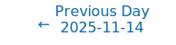
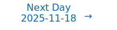

# Personalized Daily ArXiv Papers 2025-11-17

| *[gpt-5]*   | Prompt   | Completion   | Total   |
|:-----------:|:--------:|:------------:|:-------:|
| **Token**   | 34737    | 33475        | 68212   |
| **Cost**    | $0.04    | $0.33        | $0.38   |

Total arXiv papers: 496

Total scanned papers: 273

Total relevant papers: 14

**Table of contents with paper titles:**

1. [Virtual Width Networks](#user-content-link1)
**Authors:** Seed, Baisheng Li, Banggu Wu, Bole Ma, Bowen Xiao, Chaoyi Zhang, Cheng Li, Chengyi Wang, Chenyin Xu, Chi Zhang, Chong Hu, Daoguang Zan, Defa Zhu, Dongyu Xu, Du Li, Faming Wu, Fan Xia, Ge Zhang, Guang Shi, Haobin Chen, Hongyu Zhu, Hongzhi Huang, Huan Zhou, Huanzhang Dou, Jianhui Duan, Jianqiao Lu, Jianyu Jiang, Jiayi Xu, Jiecao Chen, Jin Chen, Jin Ma, Jing Su, Jingji Chen, Jun Wang, Jun Yuan, Juncai Liu, Jundong Zhou, Kai Hua, Kai Shen, Kai Xiang, Kaiyuan Chen, Kang Liu, Ke Shen, Liang Xiang, Lin Yan, Lishu Luo, Mengyao Zhang, Ming Ding, Mofan Zhang, Nianning Liang, Peng Li, Penghao Huang, Pengpeng Mu, Qi Huang, Qianli Ma, Qiyang Min, Qiying Yu, Renming Pang, Ru Zhang, Shen Yan, Shen Yan, Shixiong Zhao, Shuaishuai Cao, Shuang Wu, Siyan Chen, Siyu Li, Siyuan Qiao, Tao Sun, Tian Xin, Tiantian Fan, Ting Huang, Ting-Han Fan, Wei Jia, Wenqiang Zhang, Wenxuan Liu, Xiangzhong Wu, Xiaochen Zuo, Xiaoying Jia, Ximing Yang, Xin Liu, Xin Yu, Xingyan Bin, Xintong Hao, Xiongcai Luo, Xujing Li, Xun Zhou, Yanghua Peng, Yangrui Chen, Yi Lin, Yichong Leng, Yinghao Li, Yingshuan Song, Yiyuan Ma, Yong Shan, Yongan Xiang, Yonghui Wu, Yongtao Zhang, Yongzhen Yao, Yu Bao, Yuehang Yang, Yufeng Yuan, Yunshui Li, Yuqiao Xian, Yutao Zeng, Yuxuan Wang, Zehua Hong, Zehua Wang, Zengzhi Wang, Zeyu Yang, Zhengqiang Yin, Zhenyi Lu, Zhexi Zhang, Zhi Chen, Zhi Zhang, Zhiqi Lin, Zihao Huang, Zilin Xu, Ziyun Wei, Zuo Wang

2. [Multistability of Self-Attention Dynamics in Transformers](#user-content-link2)
**Authors:** Claudio Altafini

3. [FarSkip-Collective: Unhobbling Blocking Communication in Mixture of Experts Models](#user-content-link3)
**Authors:** Yonatan Dukler, Guihong Li, Deval Shah, Vikram Appia, Emad Barsoum

4. [Optimizing Mixture of Block Attention](#user-content-link4)
**Authors:** Guangxuan Xiao, Junxian Guo, Kasra Mazaheri, Song Han

5. [$\pi$-Attention: Periodic Sparse Transformers for Efficient Long-Context Modeling](#user-content-link5)
**Authors:** Dong Liu, Yanxuan Yu

6. [Pre-Attention Expert Prediction and Prefetching for Mixture-of-Experts Large Language Models](#user-content-link6)
**Authors:** Shien Zhu, Samuel Bohl, Robin Oester, Gustavo Alonso

7. [Fast and Expressive Multi-Token Prediction with Probabilistic Circuits](#user-content-link7)
**Authors:** Andreas Grivas, Lorenzo Loconte, Emile van Krieken, Piotr Nawrot, Yu Zhao, Euan Wielewski, Pasquale Minervini, Edoardo Ponti, Antonio Vergari

8. [Leveraging Parameter Space Symmetries for Reasoning Skill Transfer in LLMs](#user-content-link8)
**Authors:** Stefan Horoi, Sangwoo Cho, Supriyo Chakraborty, Shi-Xiong Zhang, Sambit Sahu, Guy Wolf, Genta Indra Winata

9. [MMA-Sim: Bit-Accurate Reference Model of Tensor Cores and Matrix Cores](#user-content-link9)
**Authors:** Peichen Xie, Yang Wang, Fan Yang, Mao Yang

10. [Adaptive Symmetrization of the KL Divergence](#user-content-link10)
**Authors:** Omri Ben-Dov, Luiz F. O. Chamon

11. [On-Device Fine-Tuning via Backprop-Free Zeroth-Order Optimization](#user-content-link11)
**Authors:** Prabodh Katti, Sangwoo Park, Bipin Rajendran, Osvaldo Simeone

12. [Private Zeroth-Order Optimization with Public Data](#user-content-link12)
**Authors:** Xuchen Gong, Tian Li

13. [From Parameter to Representation: A Closed-Form Approach for Controllable Model Merging](#user-content-link13)
**Authors:** Jialin Wu, Jian Yang, Handing Wang, Jiajun Wen, Zhiyong Yu

14. [Test-Time Steering for Lossless Text Compression via Weighted Product of Experts](#user-content-link14)
**Authors:** Qihang Zhang, Muchen Li, Ziao Wang, Renjie Liao, Lele Wang

---

## 1. [Virtual Width Networks](https://arxiv.org/abs/2511.11238) 

**ArXiv ID:** 2511.11238

**Authors:** Seed, Baisheng Li, Banggu Wu, Bole Ma, Bowen Xiao, Chaoyi Zhang, Cheng Li, Chengyi Wang, Chenyin Xu, Chi Zhang, Chong Hu, Daoguang Zan, Defa Zhu, Dongyu Xu, Du Li, Faming Wu, Fan Xia, Ge Zhang, Guang Shi, Haobin Chen, Hongyu Zhu, Hongzhi Huang, Huan Zhou, Huanzhang Dou, Jianhui Duan, Jianqiao Lu, Jianyu Jiang, Jiayi Xu, Jiecao Chen, Jin Chen, Jin Ma, Jing Su, Jingji Chen, Jun Wang, Jun Yuan, Juncai Liu, Jundong Zhou, Kai Hua, Kai Shen, Kai Xiang, Kaiyuan Chen, Kang Liu, Ke Shen, Liang Xiang, Lin Yan, Lishu Luo, Mengyao Zhang, Ming Ding, Mofan Zhang, Nianning Liang, Peng Li, Penghao Huang, Pengpeng Mu, Qi Huang, Qianli Ma, Qiyang Min, Qiying Yu, Renming Pang, Ru Zhang, Shen Yan, Shen Yan, Shixiong Zhao, Shuaishuai Cao, Shuang Wu, Siyan Chen, Siyu Li, Siyuan Qiao, Tao Sun, Tian Xin, Tiantian Fan, Ting Huang, Ting-Han Fan, Wei Jia, Wenqiang Zhang, Wenxuan Liu, Xiangzhong Wu, Xiaochen Zuo, Xiaoying Jia, Ximing Yang, Xin Liu, Xin Yu, Xingyan Bin, Xintong Hao, Xiongcai Luo, Xujing Li, Xun Zhou, Yanghua Peng, Yangrui Chen, Yi Lin, Yichong Leng, Yinghao Li, Yingshuan Song, Yiyuan Ma, Yong Shan, Yongan Xiang, Yonghui Wu, Yongtao Zhang, Yongzhen Yao, Yu Bao, Yuehang Yang, Yufeng Yuan, Yunshui Li, Yuqiao Xian, Yutao Zeng, Yuxuan Wang, Zehua Hong, Zehua Wang, Zengzhi Wang, Zeyu Yang, Zhengqiang Yin, Zhenyi Lu, Zhexi Zhang, Zhi Chen, Zhi Zhang, Zhiqi Lin, Zihao Huang, Zilin Xu, Ziyun Wei, Zuo Wang

**Abstract:** We introduce Virtual Width Networks (VWN), a framework that delivers the benefits of wider representations without incurring the quadratic cost of increasing the hidden size. VWN decouples representational width from backbone width, expanding the embedding space while keeping backbone compute nearly constant. In our large-scale experiment, an 8-times expansion accelerates optimization by over 2 times for next-token and 3 times for next-2-token prediction. The advantage amplifies over training as both the loss gap grows and the convergence-speedup ratio increases, showing that VWN is not only token-efficient but also increasingly effective with scale. Moreover, we identify an approximately log-linear scaling relation between virtual width and loss reduction, offering an initial empirical basis and motivation for exploring virtual-width scaling as a new dimension of large-model efficiency.

**Comment:** Model Architecture & Efficiency: decouples representational width from backbone width (virtual width) with empirical scaling benefits.

**Relevance:** 10
**Novelty:** 9

---

## 2. [Multistability of Self-Attention Dynamics in Transformers](https://arxiv.org/abs/2511.11553) 

**ArXiv ID:** 2511.11553

**Authors:** Claudio Altafini

**Abstract:** In machine learning, a self-attention dynamics is a continuous-time multiagent-like model of the attention mechanisms of transformers. In this paper we show that such dynamics is related to a multiagent version of the Oja flow, a dynamical system that computes the principal eigenvector of a matrix corresponding for transformers to the value matrix. We classify the equilibria of the ``single-head'' self-attention system into four classes: consensus, bipartite consensus, clustering and polygonal equilibria. Multiple asymptotically stable equilibria from the first three classes often coexist in the self-attention dynamics. Interestingly, equilibria from the first two classes are always aligned with the eigenvectors of the value matrix, often but not exclusively with the principal eigenvector.

**Comment:** Representation/Training Dynamics: theoretical analysis of self-attention as multiagent Oja flow with equilibrium taxonomy.

**Relevance:** 10
**Novelty:** 9

---

## 3. [FarSkip-Collective: Unhobbling Blocking Communication in Mixture of Experts Models](https://arxiv.org/abs/2511.11505) 

**ArXiv ID:** 2511.11505

**Authors:** Yonatan Dukler, Guihong Li, Deval Shah, Vikram Appia, Emad Barsoum

**Abstract:** Blocking communication presents a major hurdle in running MoEs efficiently in distributed settings. To address this, we present FarSkip-Collective which modifies the architecture of modern models to enable overlapping of their computation with communication. Our approach modifies the architecture to skip connections in the model and it is unclear a priori whether the modified model architecture can remain as capable, especially for large state-of-the-art models and while modifying all of the model layers. We answer this question in the affirmative and fully convert a series of state-of-the-art models varying from 16B to 109B parameters to enable overlapping of their communication while achieving accuracy on par with their original open-source releases. For example, we convert Llama 4 Scout (109B) via self-distillation and achieve average accuracy within 1% of its instruction tuned release averaged across a wide range of downstream evaluations. In addition to demonstrating retained accuracy of the large modified models, we realize the benefits of FarSkip-Collective through optimized implementations that explicitly overlap communication with computation, accelerating both training and inference in existing frameworks.

**Comment:** HPC + Model Architecture: MoE architectural modifications enabling overlap of computation and blocking communication for distributed efficiency.

**Relevance:** 10
**Novelty:** 8

---

## 4. [Optimizing Mixture of Block Attention](https://arxiv.org/abs/2511.11571) 

**ArXiv ID:** 2511.11571

**Authors:** Guangxuan Xiao, Junxian Guo, Kasra Mazaheri, Song Han

**Abstract:** Mixture of Block Attention (MoBA) (Lu et al., 2025) is a promising building block for efficiently processing long contexts in LLMs by enabling queries to sparsely attend to a small subset of key-value blocks, drastically reducing computational cost. However, the design principles governing MoBA's performance are poorly understood, and it lacks an efficient GPU implementation, hindering its practical adoption. In this paper, we first develop a statistical model to analyze MoBA's underlying mechanics. Our model reveals that performance critically depends on the router's ability to accurately distinguish relevant from irrelevant blocks based on query-key affinities. We derive a signal-to-noise ratio that formally connects architectural parameters to this retrieval accuracy. Guided by our analysis, we identify two key pathways for improvement: using smaller block sizes and applying a short convolution on keys to cluster relevant signals, which enhances routing accuracy. While theoretically better, small block sizes are inefficient on GPUs. To bridge this gap, we introduce FlashMoBA, a hardware-aware CUDA kernel that enables efficient MoBA execution even with the small block sizes our theory recommends. We validate our insights by training LLMs from scratch, showing that our improved MoBA models match the performance of dense attention baselines. FlashMoBA achieves up to 14.7x speedup over FlashAttention-2 for small blocks, making our theoretically-grounded improvements practical. Code is available at: https://github.com/mit-han-lab/flash-moba.

**Comment:** Model Architecture + HPC: theoretical analysis and CUDA kernel (FlashMoBA) for efficient Mixture of Block Attention with long-context speedups.

**Relevance:** 10
**Novelty:** 8

---

## 5. [$\pi$-Attention: Periodic Sparse Transformers for Efficient Long-Context Modeling](https://arxiv.org/abs/2511.10696) 

**ArXiv ID:** 2511.10696

**Authors:** Dong Liu, Yanxuan Yu

**Abstract:** Transformers have revolutionized natural language processing, but their quadratic complexity with respect to sequence length remains a fundamental bottleneck for long-range modeling. While sparse attention mechanisms like RingAttention reduce computational costs by restricting attention to local neighborhoods, they suffer from limited receptive fields and lack of adaptability. We present \PiAttention, a periodic sparse Transformer that factorizes attention into ring-local neighborhoods, deterministic $\pi$-stride skips, and an adaptive fusion gate. The periodic structure provides predictable coverage of distant tokens, while the sparse footprint keeps the per-layer complexity linear in context length. We prove that \PiAttention achieves $\mathcal{O}(kL + \pi \log L)$ receptive field growth compared to $\mathcal{O}(kL)$ for RingAttention, where $k$ is the local window size, $\pi$ is the skip period, and $L$ is the sequence length. Extensive experiments on language modeling, retrieval, and vision-language tasks demonstrate that \PiAttention matches or surpasses dense attention quality with 8.3\% lower perplexity than RingAttention while using 50\% fewer GPUs for the same context length. Our detailed ablations and visualizations reveal the importance of periodic skips, adaptive fusion, and head-level sparsity coordination for efficient long-context modeling.

**Comment:** Model Architecture/Efficiency: periodic sparse Transformer attention (π-Attention) for long-context with linear-time footprint.

**Relevance:** 10
**Novelty:** 8

---

## 6. [Pre-Attention Expert Prediction and Prefetching for Mixture-of-Experts Large Language Models](https://arxiv.org/abs/2511.10676) 

**ArXiv ID:** 2511.10676

**Authors:** Shien Zhu, Samuel Bohl, Robin Oester, Gustavo Alonso

**Abstract:** Mixture-of-Experts (MoE) Large Language Models (LLMs) efficiently scale-up the model while keeping relatively low inference cost. As MoE models only activate part of the experts, related work has proposed expert prediction and caching methods to prefetch the experts for faster inference. However, existing approaches utilize the activations from the previous layer for prediction, incurring low accuracy and leave the first layer unoptimized. Applying complex layers or even training standalone networks for better prediction introduces high computation overhead. In this paper, we propose pre-attention expert prediction to achieve accurate and lightweight expert prefetching. The key insight is that some functions in LLMs are ranking-preserving, indicating that matching the ranking of selected experts using simple linear functions is possible. Therefore, we utilize the activations before the attention block in the same layer with 2 linear functions and ranking-aware loss to achieve accurate prediction, which also supports prefetching in the first layer. Our lightweight, pre-attention expert routers achieve 93.03% accuracy on DeepSeek V2 Lite, 94.69% on Qwen3-30B, and 97.62% on Phi-mini-MoE, showing about 15% improvement on absolute accuracy over the state-of-the-art methods.

**Comment:** Model Architecture/Efficiency: pre-attention expert prediction and prefetching for MoE LLMs to reduce inference stalls.

**Relevance:** 10
**Novelty:** 7

---

## 7. [Fast and Expressive Multi-Token Prediction with Probabilistic Circuits](https://arxiv.org/abs/2511.11346) 

**ArXiv ID:** 2511.11346

**Authors:** Andreas Grivas, Lorenzo Loconte, Emile van Krieken, Piotr Nawrot, Yu Zhao, Euan Wielewski, Pasquale Minervini, Edoardo Ponti, Antonio Vergari

**Abstract:** Multi-token prediction (MTP) is a prominent strategy to significantly speed up generation in large language models (LLMs), including byte-level LLMs, which are tokeniser-free but prohibitively slow. However, existing MTP methods often sacrifice expressiveness by assuming independence between future tokens. In this work, we investigate the trade-off between expressiveness and latency in MTP within the framework of probabilistic circuits (PCs). Our framework, named MTPC, allows one to explore different ways to encode the joint distributions over future tokens by selecting different circuit architectures, generalising classical models such as (hierarchical) mixture models, hidden Markov models and tensor networks. We show the efficacy of MTPC by retrofitting existing byte-level LLMs, such as EvaByte. Our experiments show that, when combined with speculative decoding, MTPC significantly speeds up generation compared to MTP with independence assumptions, while guaranteeing to retain the performance of the original verifier LLM. We also rigorously study the optimal trade-off between expressiveness and latency when exploring the possible parameterisations of MTPC, such as PC architectures and partial layer sharing between the verifier and draft LLMs.

**Comment:** Compression/Efficiency: probabilistic-circuit-based multi-token prediction exploring expressiveness–latency trade-offs and partial layer sharing for faster LLM decoding.

**Relevance:** 9
**Novelty:** 8

---

## 8. [Leveraging Parameter Space Symmetries for Reasoning Skill Transfer in LLMs](https://arxiv.org/abs/2511.10850) 

**ArXiv ID:** 2511.10850

**Authors:** Stefan Horoi, Sangwoo Cho, Supriyo Chakraborty, Shi-Xiong Zhang, Sambit Sahu, Guy Wolf, Genta Indra Winata

**Abstract:** Task arithmetic is a powerful technique for transferring skills between Large Language Models (LLMs), but it often suffers from negative interference when models have diverged during training. We address this limitation by first aligning the models' parameter spaces, leveraging the inherent permutation, rotation, and scaling symmetries of Transformer architectures. We adapt parameter space alignment for modern Grouped-Query Attention (GQA) and SwiGLU layers, exploring both weight-based and activation-based approaches. Using this alignment-first strategy, we successfully transfer advanced reasoning skills to a non-reasoning model. Experiments on challenging reasoning benchmarks show that our method consistently outperforms standard task arithmetic. This work provides an effective approach for merging and transferring specialized skills across evolving LLM families, reducing redundant fine-tuning and enhancing model adaptability.

**Comment:** Model Architecture: parameter-space alignment exploiting Transformer symmetries (permutation/rotation/scaling) to enable reliable model merging/skill transfer.

**Relevance:** 9
**Novelty:** 8

---

## 9. [MMA-Sim: Bit-Accurate Reference Model of Tensor Cores and Matrix Cores](https://arxiv.org/abs/2511.10909) 

**ArXiv ID:** 2511.10909

**Authors:** Peichen Xie, Yang Wang, Fan Yang, Mao Yang

**Abstract:** The rapidly growing computation demands of deep neural networks (DNNs) have driven hardware vendors to integrate matrix multiplication accelerators (MMAs), such as NVIDIA Tensor Cores and AMD Matrix Cores, into modern GPUs. However, due to distinct and undocumented arithmetic specifications for floating-point matrix multiplication, some MMAs can lead to numerical imprecision and inconsistency that can compromise the stability and reproducibility of DNN training and inference.   This paper presents MMA-Sim, the first bit-accurate reference model that reveals the detailed arithmetic behaviors of the MMAs from ten GPU architectures (eight from NVIDIA and two from AMD). By dissecting the MMAs using a combination of targeted and randomized tests, our methodology derives nine arithmetic algorithms to simulate the floating-point matrix multiplication of the MMAs. Large-scale validation confirms bitwise equivalence between MMA-Sim and the real hardware. Using MMA-Sim, we investigate arithmetic behaviors that affect DNN training stability, and identify undocumented behaviors that could lead to significant errors.

**Comment:** High-Performance Computing: bit-accurate reference model of Tensor/Matrix Cores revealing undocumented arithmetic behaviors affecting DNN stability.

**Relevance:** 9
**Novelty:** 8

---

## 10. [Adaptive Symmetrization of the KL Divergence](https://arxiv.org/abs/2511.11159) 

**ArXiv ID:** 2511.11159

**Authors:** Omri Ben-Dov, Luiz F. O. Chamon

**Abstract:** Many tasks in machine learning can be described as or reduced to learning a probability distribution given a finite set of samples. A common approach is to minimize a statistical divergence between the (empirical) data distribution and a parameterized distribution, e.g., a normalizing flow (NF) or an energy-based model (EBM). In this context, the forward KL divergence is a ubiquitous due to its tractability, though its asymmetry may prevent capturing some properties of the target distribution. Symmetric alternatives involve brittle min-max formulations and adversarial training (e.g., generative adversarial networks) or evaluating the reverse KL divergence, as is the case for the symmetric Jeffreys divergence, which is challenging to compute from samples. This work sets out to develop a new approach to minimize the Jeffreys divergence. To do so, it uses a proxy model whose goal is not only to fit the data, but also to assist in optimizing the Jeffreys divergence of the main model. This joint training task is formulated as a constrained optimization problem to obtain a practical algorithm that adapts the models priorities throughout training. We illustrate how this framework can be used to combine the advantages of NFs and EBMs in tasks such as density estimation, image generation, and simulation-based inference.

**Comment:** Training Objective/Representation Learning: adaptive optimization of Jeffreys (symmetric) KL via proxy-assisted constrained training, bridging NFs and EBMs.

**Relevance:** 9
**Novelty:** 7

---

## 11. [On-Device Fine-Tuning via Backprop-Free Zeroth-Order Optimization](https://arxiv.org/abs/2511.11362) 

**ArXiv ID:** 2511.11362

**Authors:** Prabodh Katti, Sangwoo Park, Bipin Rajendran, Osvaldo Simeone

**Abstract:** On-device fine-tuning is a critical capability for edge AI systems, which must support adaptation to different agentic tasks under stringent memory constraints. Conventional backpropagation (BP)-based training requires storing layer activations and optimizer states, a demand that can be only partially alleviated through checkpointing. In edge deployments in which the model weights must reside entirely in device memory, this overhead severely limits the maximum model size that can be deployed. Memory-efficient zeroth-order optimization (MeZO) alleviates this bottleneck by estimating gradients using forward evaluations alone, eliminating the need for storing intermediate activations or optimizer states. This enables significantly larger models to fit within on-chip memory, albeit at the cost of potentially longer fine-tuning wall-clock time. This paper first provides a theoretical estimate of the relative model sizes that can be accommodated under BP and MeZO training. We then numerically validate the analysis, demonstrating that MeZO exhibits accuracy advantages under on-device memory constraints, provided sufficient wall-clock time is available for fine-tuning.

**Comment:** Compression/Efficiency/HPC: backprop-free zeroth-order on-device fine-tuning enabling larger models under strict memory constraints.

**Relevance:** 9
**Novelty:** 7

---

## 12. [Private Zeroth-Order Optimization with Public Data](https://arxiv.org/abs/2511.10859) 

**ArXiv ID:** 2511.10859

**Authors:** Xuchen Gong, Tian Li

**Abstract:** One of the major bottlenecks for deploying popular first-order differentially private (DP) machine learning algorithms (e.g., DP-SGD) lies in their high computation and memory cost, despite the existence of optimized implementations. Zeroth-order methods have promise in mitigating the overhead, as they leverage function evaluations to approximate the gradients, hence significantly easier to privatize. While recent works have explored zeroth-order approaches in both private and non-private settings, they still suffer from relatively low utilities compared with DP-SGD, and have only been evaluated in limited application domains. In this work, we propose to leverage public information to guide and improve gradient approximation of private zeroth-order algorithms. We explore a suite of public-data-assisted zeroth-order optimizers (PAZO) with minimal overhead. We provide theoretical analyses of the PAZO framework under an assumption of the similarity between public and private data. Empirically, we demonstrate that PAZO achieves superior privacy/utility tradeoffs across vision and text tasks in both pre-training and fine-tuning settings, outperforming the best first-order baselines (with public data) especially in highly private regimes, while offering up to $16\times$ runtime speedup.

**Comment:** Compression/Efficiency: private zeroth-order optimization leveraging public data to improve DP training utility and speed.

**Relevance:** 8
**Novelty:** 7

---

## 13. [From Parameter to Representation: A Closed-Form Approach for Controllable Model Merging](https://arxiv.org/abs/2511.10943) 

**ArXiv ID:** 2511.10943

**Authors:** Jialin Wu, Jian Yang, Handing Wang, Jiajun Wen, Zhiyong Yu

**Abstract:** Model merging combines expert models for multitask performance but faces challenges from parameter interference. This has sparked recent interest in controllable model merging, giving users the ability to explicitly balance performance trade-offs. Existing approaches employ a compile-then-query paradigm, performing a costly offline multi-objective optimization to enable fast, preference-aware model generation. This offline stage typically involves iterative search or dedicated training, with complexity that grows exponentially with the number of tasks. To overcome these limitations, we shift the perspective from parameter-space optimization to a direct correction of the model's final representation. Our approach models this correction as an optimal linear transformation, yielding a closed-form solution that replaces the entire offline optimization process with a single-step, architecture-agnostic computation. This solution directly incorporates user preferences, allowing a Pareto-optimal model to be generated on-the-fly with complexity that scales linearly with the number of tasks. Experimental results show our method generates a superior Pareto front with more precise preference alignment and drastically reduced computational cost.

**Comment:** Model Architecture/Representation: closed-form, preference-controllable model merging via optimal linear transformation in representation space.

**Relevance:** 8
**Novelty:** 7

---

## 14. [Test-Time Steering for Lossless Text Compression via Weighted Product of Experts](https://arxiv.org/abs/2511.10660) 

**ArXiv ID:** 2511.10660

**Authors:** Qihang Zhang, Muchen Li, Ziao Wang, Renjie Liao, Lele Wang

**Abstract:** Lossless compression techniques are crucial in an era of rapidly growing data. Traditional universal compressors like gzip offer low computational overhead, high speed, and broad applicability across data distributions. However, they often lead to worse compression rates than modern neural compressors, which leverage large-scale training data to model data distributions more effectively. Despite their advantages, neural compressors struggle to generalize to unseen data. To address this limitation, we propose a novel framework that performs Test-Time Steering via a Weighted Product of Experts (wPoE). At inference, our method adaptively combines a universal compression model with a pretrained neural language model, ensuring the compression rate is at least as good as that of the best individual model. Extensive experiments demonstrate that our approach improves the performance of text compression without requiring fine-tuning. Furthermore, it seamlessly integrates with any autoregressive language model, providing a practical solution for enhancing text compression across diverse data distributions.

**Comment:** Compression/Efficiency: weighted product-of-experts to steer neural compressors at test time with performance guarantees.

**Relevance:** 8
**Novelty:** 7

---

# Paper Selection Prompt

## System Prompt

> You are a helpful paper reading assistant whose job is to read daily posts from ArXiv and identify a few papers that your friend will enjoy reading.
> Your job is to carefully read the paper titles and abstracts below and find the ones that match the criteria below.

## User Prompt

> ## Instructions
> 
> Write the response in JSONL format with {ARXIVID, COMMENT, RELEVANCE, NOVELTY} on each line, one for each paper.
> 
> - ARXIVID: should be the ArXiv ID.
> - COMMENT: should identify whether there is a criteria that match the paper very closely. These matches should not be based on general terms like "language modeling" or "advancements" and should specifically refer to a criterion. No need to mention the non-matching criteria.
> - RELEVANCE: should be a score from 1-10.
> - NOVELTY: should be a score from 1-10.
> 
> ## Scoring Criteria
> 
> > The "Relevance" score measures how closely the paper aligns with the core topics of the prompt.
> > The "Novelty" score assesses the originality and impact of the paper.
> > They are two **ORTHONORMAL** axes and **SHOULD NOT** be confused with each other.
> 
> ### Relevance Scoring
> 
> - Relevance 9-10 (Completely Relevant)
>   - Focus: Fully aligned with core topics with no deviation, score the highest if contains relevant keywords in it.
>   - Examples: Papers focused on foundational methods or theoretical research, whose titles contain topic keywords like "MoE".
> 
> - Relevance 7-8 (Relevant)
>   - Focus: Retain a solid link to the main research area, though may touch on peripheral elements.
>   - Examples: Papers research on the fundamental part of MoE through a less critical aspect like its behavior in GNN.
> 
> - Relevance 5-6 (Borderline)
>   - Focus: Maintains a link to the core topic but also extends into at least one other domain/area beyond the primary focus.
>   - Examples: Work referencing MoE centered on reinforcement learning.
> 
> - Relevance 3-4 (Irrelevant)
>   - Focus: Largely outside our interests with no association to our topics.
>   - Examples: Application-focused papers like using MoE to solve a problem in the real world.
> 
> - Relevance 1-2 (Ignore)
>   - Focus: Purely unrelated to our topics. Completely a different domain.
>   - **Exception**: If the paper hints at a cutting-edge, radically new direction that could eventually transform the primary domain, consider a score of 9–10 despite initial appearances. (Usually a very rare concept that belongs to the fundamental research)
> 
> ### Novelty Scoring
> 
> - Novelty 9-10 (Breakthrough)
>   - Definition: Groundbreaking methods/theory introducing new directions or solving major challenges.
>   - Examples: Entirely new paradigm for foundational models; a novel theory transforming representation learning.
> 
> - Novelty 7-8 (Improvements)
>   - Definition: Substantial insights/enhancements, though not a full paradigm shift.
>   - Examples: Modifications on existing methods yielding significantly better results.
> 
> - Novelty 5-6 (Borderline)
>   - Definition: Incremental contributions with possible long-term benefits, not immediately transformative.
>   - Examples: Moderately novel extension to an existing architecture; refining current methods without fundamentally altering them.
> 
> - Novelty 3-4 (Tangential)
>   - Definition: Minor or domain-specific improvements with limited broader impact.
>   - Examples: Slight modifications to known methods with strange motivation; purely engineering jobs like a new benchmark/dataset.
> 
> - Novelty 1-2 (Low)
>   - Definition: Minimal originality, applying standard approaches without real innovation.
>   - Examples: Using an off-the-shelf model without adding new insights; purely application-driven studies like finetuning a pretrained model using existing methods.
> 
> ## Papers
> 
> [PAPER LIST HERE]
> 
> ## Relevant Topics
> 
> Use the following relevance criteria to focus on foundational research. Keep **relevant** papers and filter out **irrelevant** ones. Avoid purely **application-driven** work.
> 
> 1. Model Architecture
>    - Relevant: Mixture-of-Experts (MoE), Transformers, Conditional/Dynamic Networks, Autoencoders, analysis/innovations on existing architectures.
>    - Irrelevant: Merely using existing architectures for a certain task without insights into the structure themselves.
> 
> 2. Model Compression and Efficiency
>    - Relevant: Sparsity, pruning, quantization, low-rank approaches, cache, or other algorithmic/theoretical efficiency breakthroughs.
>    - Irrelevant: Straightforward applications of existing compression methods to new tasks.
> 
> 3. High Performance Computing
>    - Relevant: Algorithmic or systems-level innovations enabling training of large-scale models, distributed training techniques, memory optimization.
>    - Irrelevant: Incremental engineering improvements without novel algorithmic contributions.
> 
> 4. Representation Learning
>    - Relevant: Insights into how deep networks encode information, feature/dictionary learning, sparse/contrastive methods, training dynamics in neural networks.
>    - Irrelevant: Standard applications of known techniques lacking new theoretical or methodological contributions.
> 
> **Keywords:**
> 
> - Relevant: Mixture of Experts (MoE), Representation Learning, Compression/Efficiency, Sparse/Sparsity, Pruning, Quantization, Low-rank, Foundation Model, etc.
> - Irrelevant: Reinforcement Learning, Transfer Learning, Federated Learning, Online Learning, Diffusion Models, etc.
> - Application: Image Segmentation, Medical Imaging, 3D Vision, Video Understanding, Information Retrieval, Summarization, Recommendation Systems, Machine Translation, Speech Recognition, Signal Processing, Spatial/Temporal Modeling, Time Series, Knowledge Graph, etc.