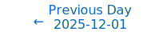
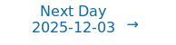

# Personalized Daily ArXiv Papers 2025-12-02

| *[gpt-5]*   | Prompt   | Completion   | Total   |
|:-----------:|:--------:|:------------:|:-------:|
| **Token**   | 69317    | 59850        | 129167  |
| **Cost**    | $0.09    | $0.6         | $0.69   |

Total arXiv papers: 1038

Total scanned papers: 656

Total relevant papers: 42

**Table of contents with paper titles:**

1. [Improved Mean Flows: On the Challenges of Fastforward Generative Models](#user-content-link1)
**Authors:** Zhengyang Geng, Yiyang Lu, Zongze Wu, Eli Shechtman, J. Zico Kolter, Kaiming He

2. [Efficient Turing Machine Simulation with Transformers](#user-content-link2)
**Authors:** Qian Li, Yuyi Wang

3. [The Mean-Field Dynamics of Transformers](#user-content-link3)
**Authors:** Philippe Rigollet

4. [HBLLM: Wavelet-Enhanced High-Fidelity 1-Bit Quantization for LLMs](#user-content-link4)
**Authors:** Ningning Chen, Weicai Ye, Ying Jiang

5. [Low-Rank Prehab: Preparing Neural Networks for SVD Compression](#user-content-link5)
**Authors:** Haoran Qin, Shansita Sharma, Ali Abbasi, Chayne Thrash, Soheil Kolouri

6. [WUSH: Near-Optimal Adaptive Transforms for LLM Quantization](#user-content-link6)
**Authors:** Jiale Chen, Vage Egiazarian, Torsten Hoefler, Dan Alistarh

7. [Four Over Six: More Accurate NVFP4 Quantization with Adaptive Block Scaling](#user-content-link7)
**Authors:** Jack Cook, Junxian Guo, Guangxuan Xiao, Yujun Lin, Song Han

8. [LPCD: Unified Framework from Layer-Wise to Submodule Quantization](#user-content-link8)
**Authors:** Yuma Ichikawa, Yudai Fujimoto, Akira Sakai

9. [Accelerating Large-Scale Reasoning Model Inference with Sparse Self-Speculative Decoding](#user-content-link9)
**Authors:** Yilong Zhao, Jiaming Tang, Kan Zhu, Zihao Ye, Chi-Chih Chang, Chaofan Lin, Jongseok Park, Guangxuan Xiao, Mohamed S. Abdelfattah, Mingyu Gao, Baris Kasikci, Song Han, Ion Stoica

10. [G-KV: Decoding-Time KV Cache Eviction with Global Attention](#user-content-link10)
**Authors:** Mengqi Liao, Lu Wang, Chaoyun Zhang, Zekai Shen, Xiaowei Mao, Si Qin, Qingwei Lin, Saravan Rajmohan, Dongmei Zhang, Huaiyu Wan

11. [Implicitly Normalized Online PCA: A Regularized Algorithm with Exact High-Dimensional Dynamics](#user-content-link11)
**Authors:** Samet Demir, Zafer Dogan

12. [SpeContext: Enabling Efficient Long-context Reasoning with Speculative Context Sparsity in LLMs](#user-content-link12)
**Authors:** Jiaming Xu, Jiayi Pan, Hanzhen Wang, Yongkang Zhou, Jiancai Ye, Yu Wang, Guohao Dai

13. [Efficiently Learning Branching Networks for Multitask Algorithmic Reasoning](#user-content-link13)
**Authors:** Dongyue Li, Zhenshuo Zhang, Minxuan Duan, Edgar Dobriban, Hongyang R. Zhang

14. [Solving Neural Min-Max Games: The Role of Architecture, Initialization & Dynamics](#user-content-link14)
**Authors:** Deep Patel, Emmanouil-Vasileios Vlatakis-Gkaragkounis

15. [Tuning Universality in Deep Neural Networks](#user-content-link15)
**Authors:** Arsham Ghavasieh

16. [Constructing Efficient Fact-Storing MLPs for Transformers](#user-content-link16)
**Authors:** Owen Dugan, Roberto Garcia, Ronny Junkins, Jerry Liu, Dylan Zinsley, Sabri Eyuboglu, Atri Rudra, Chris R\'e

17. [AlignSAE: Concept-Aligned Sparse Autoencoders](#user-content-link17)
**Authors:** Minglai Yang, Xinyu Guo, Mihai Surdeanu, Liangming Pan

18. [Less is More: Resource-Efficient Low-Rank Adaptation](#user-content-link18)
**Authors:** Chunlin Tian, Xuyang Wei, Huanrong Liu, Zhijiang Guo, Li Li

19. [Morphling: Fast, Fused, and Flexible GNN Training at Scale](#user-content-link19)
**Authors:** Anubhab, Rupesh Nasre

20. [Upcycled and Merged MoE Reward Model for Mitigating Reward Hacking](#user-content-link20)
**Authors:** Lingling Fu

21. [From Coefficients to Directions: Rethinking Model Merging with Directional Alignment](#user-content-link21)
**Authors:** Zhikang Chen, Sen Cui, Deheng Ye, Min Zhang, Gang Niu, Yu Zhang, Masashi Sugiyama, Tingting Zhu

22. [ZIP-RC: Zero-overhead Inference-time Prediction of Reward and Cost for Adaptive and Interpretable Generation](#user-content-link22)
**Authors:** Rohin Manvi, Joey Hong, Tim Seyde, Maxime Labonne, Mathias Lechner, Sergey Levine

23. [SVRG and Beyond via Posterior Correction](#user-content-link23)
**Authors:** Nico Daheim, Thomas M\"ollenhoff, Ming Liang Ang, Mohammad Emtiyaz Khan

24. [Does Flatness imply Generalization for Logistic Loss in Univariate Two-Layer ReLU Network?](#user-content-link24)
**Authors:** Dan Qiao, Yu-Xiang Wang

25. [Polynomial Neural Sheaf Diffusion: A Spectral Filtering Approach on Cellular Sheaves](#user-content-link25)
**Authors:** Alessio Borgi, Fabrizio Silvestri, Pietro Li\`o

26. [Generative Modeling with Continuous Flows: Sample Complexity of Flow Matching](#user-content-link26)
**Authors:** Mudit Gaur, Prashant Trivedi, Shuchin Aeron, Amrit Singh Bedi, George K. Atia, Vaneet Aggarwal

27. [An RKHS Perspective on Tree Ensembles](#user-content-link27)
**Authors:** Mehdi Dagdoug, Clement Dombry, Jean-Jil Duchamps

28. [SCALE: Selective Resource Allocation for Overcoming Performance Bottlenecks in Mathematical Test-time Scaling](#user-content-link28)
**Authors:** Yang Xiao, Chunpu Xu, Ruifeng Yuan, Jiashuo Wang, Wenjie Li, Pengfei Liu

29. [VLASH: Real-Time VLAs via Future-State-Aware Asynchronous Inference](#user-content-link29)
**Authors:** Jiaming Tang, Yufei Sun, Yilong Zhao, Shang Yang, Yujun Lin, Zhuoyang Zhang, James Hou, Yao Lu, Zhijian Liu, Song Han

30. [MSPT: Efficient Large-Scale Physical Modeling via Parallelized Multi-Scale Attention](#user-content-link30)
**Authors:** Pedro M. P. Curvo, Jan-Willem van de Meent, Maksim Zhdanov

31. [Fiber Bundle Networks: A Geometric Machine Learning Paradigm](#user-content-link31)
**Authors:** Dong Liu

32. [Scalable and Interpretable Scientific Discovery via Sparse Variational Gaussian Process Kolmogorov-Arnold Networks (SVGP KAN)](#user-content-link32)
**Authors:** Y. Sungtaek Ju

33. [Mode-Conditioning Unlocks Superior Test-Time Scaling](#user-content-link33)
**Authors:** Chen Henry Wu, Sachin Goyal, Aditi Raghunathan

34. [Stay Unique, Stay Efficient: Preserving Model Personality in Multi-Task Merging](#user-content-link34)
**Authors:** Kuangpu Guo, Yuhe Ding, Jian Liang, Zilei Wang, Ran He

35. [Preventing Model Collapse via Contraction-Conditioned Neural Filters](#user-content-link35)
**Authors:** Zongjian Han, Yiran Liang, Ruiwen Wang, Yiwei Luo, Yilin Huang, Xiaotong Song, Dongqing Wei

36. [Beyond Loss Guidance: Using PDE Residuals as Spectral Attention in Diffusion Neural Operators](#user-content-link36)
**Authors:** Medha Sawhney, Abhilash Neog, Mridul Khurana, Anuj Karpatne

37. [Efficient Training of Diffusion Mixture-of-Experts Models: A Practical Recipe](#user-content-link37)
**Authors:** Yahui Liu, Yang Yue, Jingyuan Zhang, Chenxi Sun, Yang Zhou, Wencong Zeng, Ruiming Tang, Guorui Zhou

38. [H-Neurons: On the Existence, Impact, and Origin of Hallucination-Associated Neurons](#user-content-link38)
**Authors:** Cheng Gao, Huimin Chen, Chaojun Xiao, Zhiyi Chen, Zhiyuan Liu, Maosong Sun

39. [Memory-Integrated Reconfigurable Adapters: A Unified Framework for Settings with Multiple Tasks](#user-content-link39)
**Authors:** Susmit Agrawal, Krishn Vishwas Kher, Saksham Mittal, Swarnim Maheshwari, Vineeth N. Balasubramanian

40. [Fantastic Features and Where to Find Them: A Probing Method to combine Features from Multiple Foundation Models](#user-content-link40)
**Authors:** Benjamin Ramtoula, Pierre-Yves Lajoie, Paul Newman, Daniele De Martini

41. [Upper Approximation Bounds for Neural Oscillators](#user-content-link41)
**Authors:** Zifeng Huang, Konstantin M. Zuev, Yong Xia, Michael Beer

42. [One Swallow Does Not Make a Summer: Understanding Semantic Structures in Embedding Spaces](#user-content-link42)
**Authors:** Yandong Sun, Qiang Huang, Ziwei Xu, Yiqun Sun, Yixuan Tang, Anthony K. H. Tung

---

## 1. [Improved Mean Flows: On the Challenges of Fastforward Generative Models](https://arxiv.org/abs/2512.02012) 

**ArXiv ID:** 2512.02012

**Authors:** Zhengyang Geng, Yiyang Lu, Zongze Wu, Eli Shechtman, J. Zico Kolter, Kaiming He

**Abstract:** MeanFlow (MF) has recently been established as a framework for one-step generative modeling. However, its ``fastforward'' nature introduces key challenges in both the training objective and the guidance mechanism. First, the original MF's training target depends not only on the underlying ground-truth fields but also on the network itself. To address this issue, we recast the objective as a loss on the instantaneous velocity $v$, re-parameterized by a network that predicts the average velocity $u$. Our reformulation yields a more standard regression problem and improves the training stability. Second, the original MF fixes the classifier-free guidance scale during training, which sacrifices flexibility. We tackle this issue by formulating guidance as explicit conditioning variables, thereby retaining flexibility at test time. The diverse conditions are processed through in-context conditioning, which reduces model size and benefits performance. Overall, our $\textbf{improved MeanFlow}$ ($\textbf{iMF}$) method, trained entirely from scratch, achieves $\textbf{1.72}$ FID with a single function evaluation (1-NFE) on ImageNet 256$\times$256. iMF substantially outperforms prior methods of this kind and closes the gap with multi-step methods while using no distillation. We hope our work will further advance fastforward generative modeling as a stand-alone paradigm.

**Comment:** Author match

---

## 2. [Efficient Turing Machine Simulation with Transformers](https://arxiv.org/abs/2512.00003) 

**ArXiv ID:** 2512.00003

**Authors:** Qian Li, Yuyi Wang

**Abstract:** Constant bit-size Transformers are known to be Turing complete, but existing constructions require $\Omega(s(n))$ chain-of-thought (CoT) steps per simulated Turing machine (TM) step, leading to impractical reasoning lengths. In this paper, we significantly reduce this efficiency gap by proving that any $(t(n),s(n))$-bounded multi-tape TM can be simulated by a constant bit-size Transformer with an optimal $O(s(n))$-long context window and only $O(s(n)^c)$ CoT steps per TM step, where $c>0$ can be made arbitrarily small by letting the Transformers' head-layer product sufficiently large. In addition, our construction shows that sparse attention with fixed geometric offsets suffices for efficient universal computation. Our proof leverages multi-queue TMs as a bridge. The main technical novelty is a more efficient simulation of multi-tape TMs by synchronous multi-queue TMs, improving both time and space complexity under stricter model assumptions.

**Comment:** Matches Model Architecture and Efficiency: theoretical construction for efficient TM simulation with constant‑bit Transformers and sparse attention with fixed offsets.

**Relevance:** 10
**Novelty:** 9

---

## 3. [The Mean-Field Dynamics of Transformers](https://arxiv.org/abs/2512.01868) 

**ArXiv ID:** 2512.01868

**Authors:** Philippe Rigollet

**Abstract:** We develop a mathematical framework that interprets Transformer attention as an interacting particle system and studies its continuum (mean-field) limits. By idealizing attention continuous on the sphere, we connect Transformer dynamics to Wasserstein gradient flows, synchronization models (Kuramoto), and mean-shift clustering. Central to our results is a global clustering phenomenon whereby tokens cluster asymptotically after long metastable states where they are arranged into multiple clusters. We further analyze a tractable equiangular reduction to obtain exact clustering rates, show how commonly used normalization schemes alter contraction speeds, and identify a phase transition for long-context attention. The results highlight both the mechanisms that drive representation collapse and the regimes that preserve expressive, multi-cluster structure in deep attention architectures.

**Comment:** Representation Learning: mean-field theory for Transformer attention (Wasserstein gradient flows, clustering/phase transition) elucidates training dynamics and representation collapse in deep attention.

**Relevance:** 10
**Novelty:** 9

---

## 4. [HBLLM: Wavelet-Enhanced High-Fidelity 1-Bit Quantization for LLMs](https://arxiv.org/abs/2512.00862) 

**ArXiv ID:** 2512.00862

**Authors:** Ningning Chen, Weicai Ye, Ying Jiang

**Abstract:** We introduce HBLLM, a wavelet-enhanced high-fidelity $1$-bit post-training quantization method for Large Language Models (LLMs). By leveraging Haar wavelet transforms to enhance expressive capacity through frequency decomposition, HBLLM significantly improves quantization fidelity while maintaining minimal overhead. This approach features two innovative structure-aware grouping strategies: (1) frequency-aware multi-parameter intra-row grouping and (2) $\ell_2$-norm-based saliency-driven column selection. For non-salient weights, a shared mean is employed across quantization groups within each frequency band to optimize storage efficiency. Experiments conducted on the OPT and LLaMA models demonstrate that HBLLM achieves state-of-the-art performance in $1$-bit quantization, attaining a perplexity of $6.71$ on LLaMA$2$-$13$B with an average weight storage of only $1.08$ bits. Code available at: https://github.com/Yeyke/HBLLM.

**Comment:** Matches Model Compression and Efficiency: proposes wavelet-enhanced 1-bit post-training quantization with structure-aware grouping and saliency-driven selection achieving SOTA fidelity at ~1.08 bits.

**Relevance:** 10
**Novelty:** 8

---

## 5. [Low-Rank Prehab: Preparing Neural Networks for SVD Compression](https://arxiv.org/abs/2512.01980) 

**ArXiv ID:** 2512.01980

**Authors:** Haoran Qin, Shansita Sharma, Ali Abbasi, Chayne Thrash, Soheil Kolouri

**Abstract:** Low-rank approximation methods such as singular value decomposition (SVD) and its variants (e.g., Fisher-weighted SVD, Activation SVD) have recently emerged as effective tools for neural network compression. In this setting, decomposition acts as a "surgical" intervention, followed by fine-tuning that serves as "rehab" to recover accuracy. Inspired by prehabilitation in surgery, we introduce a pre-compression fine-tuning stage, Low-Rank Prehab, that explicitly encourages low-rank structure in weight matrices while preserving task performance. By conditioning the model before SVD, Prehab steers weights toward spectrally compact regions of the parameter space, enabling smoother low-rank approximation and improved recovery. Experiments on large language models (LLMs) and other Transformer-based architectures, including Vision Transformers (ViTs), show that Prehab substantially reduces the immediate accuracy drop after compression and consistently improves post-finetuning performance. Across a wide range of compression ratios, our method outperforms state-of-the-art SVD-based techniques such as SVD-LLM, highlighting the importance of preparing models for compression rather than only improving the compression and recovery stages. Source code is available at https://github.com/niqretnuh/PREHAB-SVD

**Comment:** Matches Model Compression and Efficiency: pre‑conditioning networks (Prehab) for superior SVD low‑rank compression with improved post‑finetuning accuracy.

**Relevance:** 10
**Novelty:** 8

---

## 6. [WUSH: Near-Optimal Adaptive Transforms for LLM Quantization](https://arxiv.org/abs/2512.00956) 

**ArXiv ID:** 2512.00956

**Authors:** Jiale Chen, Vage Egiazarian, Torsten Hoefler, Dan Alistarh

**Abstract:** Quantization to low bitwidth is a standard approach for deploying large language models, however, a few extreme weights and activations stretch the dynamic range and reduce the effective resolution of the quantizer. A common mitigation approach is to apply some fixed orthogonal transforms, such as Hadamard matrices, before quantization, which typically reduces the dynamic range. Yet, these transforms ignore the statistics of the data, and their optimality is currently not understood. In this work, we derive, for the first time, closed-form optimal linear blockwise transforms for joint weight-activation quantization using standard data-free quantizers for common numerical formats. Specifically, we provide derivations of the optimal adaptive (data-aware) transforms for round-to-nearest (RTN), AbsMax-scaled block quantizers for both integer and floating-point formats. The resulting construction, which we call WUSH, combines a Hadamard backbone with a data-dependent component based on second-order moments, yielding a non-orthogonal transform that is provably optimal under mild assumptions and remains structured for efficient implementation. Preliminary experimental results show that our approach consistently improves upon the Hadamard transform for common formats.

**Comment:** Model Compression and Efficiency: derives near-optimal adaptive linear transforms for joint weight–activation block quantization (RTN AbsMax), improving over Hadamard.

**Relevance:** 10
**Novelty:** 8

---

## 7. [Four Over Six: More Accurate NVFP4 Quantization with Adaptive Block Scaling](https://arxiv.org/abs/2512.02010) 

**ArXiv ID:** 2512.02010

**Authors:** Jack Cook, Junxian Guo, Guangxuan Xiao, Yujun Lin, Song Han

**Abstract:** As large language models have grown larger, low-precision numerical formats such as NVFP4 have become increasingly popular due to the speed and memory benefits they provide. However, to accelerate computation with NVFP4, all matrix multiplication operands--weights and activations in the forward pass, and weights, activations, and gradients in the backward pass--must be quantized to NVFP4, often leading to divergence during training and performance degradation during inference. NVFP4 by evaluating multiple potential scale factors for each block of values. To address this issue, in this work we introduce Four Over Six (4/6), a modification to the NVFP4 quantization algorithm that evaluates two potential scale factors for each block of values. Unlike integer formats, floating-point formats such as FP4 have the most quantization error on near-maximal values in each block, which we find to be primarily responsible for downstream performance degradation. We find that for some blocks, scaling to smaller FP4 values makes the distribution of representable values more uniform, improving representation of near-maximal values. Importantly, 4/6 can be implemented efficiently on NVIDIA Blackwell GPUs, making it viable to use while training LLMs with NVFP4. In pre-training experiments with transformer and hybrid model architectures, we find that 4/6 prevents divergence in several cases, bringing training loss significantly closer to BF16 compared to models trained with current state-of-the-art NVFP4 training recipes. We also find that 4/6 can be easily incorporated into many different post-training quantization methods and generally improves downstream accuracy. We hope this inspires future work in training and deploying models with NVFP4.

**Comment:** Model Compression and Efficiency: proposes an FP4 (NVFP4) quantization algorithm (4/6) with adaptive block-level scaling to reduce near-maximum value error, enabling stable FP4 training/inference on Blackwell GPUs.

**Relevance:** 10
**Novelty:** 8

---

## 8. [LPCD: Unified Framework from Layer-Wise to Submodule Quantization](https://arxiv.org/abs/2512.01546) 

**ArXiv ID:** 2512.01546

**Authors:** Yuma Ichikawa, Yudai Fujimoto, Akira Sakai

**Abstract:** Post-training quantization (PTQ) aims to preserve model-level behavior; however, most methods focus on individual linear layers. Even recent extensions, such as QEP and LoaQ, which mitigate error propagation or target specific submodules, still rely on layer-wise formulations and fail to capture the behavior of larger submodules. We introduce Layer-Projected Coordinate Descent (LPCD), a unified framework that extends PTQ beyond layers by optimizing relaxed objectives across arbitrary submodules and projecting the solutions with layer-wise quantizers. LPCD generalizes existing methods and provides a principled approach to quantizing complex submodules while maintaining the efficiency and compatibility of layer-wise PTQ pipelines. Across diverse LLM architectures and bit-widths, LPCD-based submodule quantization consistently enhances both layer-wise PTQ methods and existing submodule approaches.

**Comment:** Model Compression and Efficiency: unified PTQ framework extending from layer-wise to arbitrary submodule quantization via layer-projected coordinate descent.

**Relevance:** 10
**Novelty:** 8

---

## 9. [Accelerating Large-Scale Reasoning Model Inference with Sparse Self-Speculative Decoding](https://arxiv.org/abs/2512.01278) 

**ArXiv ID:** 2512.01278

**Authors:** Yilong Zhao, Jiaming Tang, Kan Zhu, Zihao Ye, Chi-Chih Chang, Chaofan Lin, Jongseok Park, Guangxuan Xiao, Mohamed S. Abdelfattah, Mingyu Gao, Baris Kasikci, Song Han, Ion Stoica

**Abstract:** Reasoning language models have demonstrated remarkable capabilities on challenging tasks by generating elaborate chain-of-thought (CoT) solutions. However, such lengthy generation shifts the inference bottleneck from compute-bound to memory-bound. To generate each token, the model applies full attention to all previously generated tokens, requiring memory access to an increasingly large KV-Cache. Consequently, longer generations demand more memory access for every step, leading to substantial pressure on memory bandwidth.   To address this, we introduce SparseSpec, a speculative decoding framework that reuses the same model as the draft and target models (i.e., self-speculation). SparseSpec features a novel sparse attention mechanism, PillarAttn, as the draft model, which accurately selects critical tokens via elegantly reusing information from the verification stage. Furthermore, SparseSpec co-designs self-speculation with three system innovations: (1) a unified scheduler to batch token drafting and verification, (2) delayed verification for CPU/GPU overlap, and (3) dynamic KV-Cache management to maximize memory utilization. Across various models and datasets, SparseSpec outperforms state-of-the-art solutions, with an up to 2.13x throughput speedup.

**Comment:** Model Compression and Efficiency / HPC: sparse self-speculative decoding with PillarAttn, unified scheduler, delayed verification, and dynamic KV-cache management for faster long-CoT inference.

**Relevance:** 10
**Novelty:** 8

---

## 10. [G-KV: Decoding-Time KV Cache Eviction with Global Attention](https://arxiv.org/abs/2512.00504) 

**ArXiv ID:** 2512.00504

**Authors:** Mengqi Liao, Lu Wang, Chaoyun Zhang, Zekai Shen, Xiaowei Mao, Si Qin, Qingwei Lin, Saravan Rajmohan, Dongmei Zhang, Huaiyu Wan

**Abstract:** Recent reasoning large language models (LLMs) excel in complex tasks but encounter significant computational and memory challenges due to long sequence lengths. KV cache compression has emerged as an effective approach to greatly enhance the efficiency of reasoning. However, existing methods often focus on prompt compression or token eviction with local attention score, overlooking the long-term importance of tokens. We propose G-KV, a KV cache eviction method that employs a global scoring mechanism, combining local and historical attention scores to more accurately assess token importance. Additionally, we introduce post-training techniques, including reinforcement learning and distillation, to optimize models for compressed KV cache settings. The code of this paper is available on: https://github.com/microsoft/G-KV.

**Comment:** Model Compression and Efficiency: decoding-time KV-cache eviction using a global attention-based scoring mechanism with post-training RL/distillation for compressed-cache settings.

**Relevance:** 10
**Novelty:** 7

---

## 11. [Implicitly Normalized Online PCA: A Regularized Algorithm with Exact High-Dimensional Dynamics](https://arxiv.org/abs/2512.01231) 

**ArXiv ID:** 2512.01231

**Authors:** Samet Demir, Zafer Dogan

**Abstract:** Many online learning algorithms, including classical online PCA methods, enforce explicit normalization steps that discard the evolving norm of the parameter vector. We show that this norm can in fact encode meaningful information about the underlying statistical structure of the problem, and that exploiting this information leads to improved learning behavior. Motivated by this principle, we introduce Implicitly Normalized Online PCA (INO-PCA), an online PCA algorithm that removes the unit-norm constraint and instead allows the parameter norm to evolve dynamically through a simple regularized update. We prove that in the high-dimensional limit the joint empirical distribution of the estimate and the true component converges to a deterministic measure-valued process governed by a nonlinear PDE. This analysis reveals that the parameter norm obeys a closed-form ODE coupled with the cosine similarity, forming an internal state variable that regulates learning rate, stability, and sensitivity to signal-to-noise ratio (SNR). The resulting dynamics uncover a three-way relationship between the norm, SNR, and optimal step size, and expose a sharp phase transition in steady-state performance. Both theoretically and experimentally, we show that INO-PCA consistently outperforms Oja's algorithm and adapts rapidly in non-stationary environments. Overall, our results demonstrate that relaxing norm constraints can be a principled and effective way to encode and exploit problem-relevant information in online learning algorithms.

**Comment:** Matches Representation Learning/training dynamics: introduces Implicitly Normalized Online PCA with exact high-dimensional dynamics (PDE/ODE) and performance phase transitions.

**Relevance:** 9
**Novelty:** 8

---

## 12. [SpeContext: Enabling Efficient Long-context Reasoning with Speculative Context Sparsity in LLMs](https://arxiv.org/abs/2512.00722) 

**ArXiv ID:** 2512.00722

**Authors:** Jiaming Xu, Jiayi Pan, Hanzhen Wang, Yongkang Zhou, Jiancai Ye, Yu Wang, Guohao Dai

**Abstract:** In this paper, we point out that the objective of the retrieval algorithms is to align with the LLM, which is similar to the objective of knowledge distillation in LLMs. We analyze the similarity in information focus between the distilled language model(DLM) and the original LLM from the perspective of information theory, and thus propose a novel paradigm that leverages a DLM as the retrieval algorithm. Based on the insight, we present SpeContext, an algorithm and system co-design for long-context reasoning. (1) At the algorithm level, SpeContext proposes lightweight retrieval head based on the head-level attention weights of DLM, achieving > 90% parameters reduction by pruning the redundancy. (2) At the system level, SpeContext designs an asynchronous prefetch dataflow via the elastic loading strategy, effectively overlapping KV cache retrieval with the LLM computation. (3) At the compilation level, SpeContext constructs the theoretical memory model and implements an adaptive memory management system to achieve acceleration by maximizing GPU memory utilization. We deploy and evaluate SpeContext in two resourceconstrained environments, cloud and edge. Extensive experiments show that, compared with the Huggingface framework, SpeContext achieves up to 24.89x throughput improvement in cloud and 10.06x speedup in edge with negligible accuracy loss, pushing the Pareto frontier of accuracy and throughput.

**Comment:** Matches High Performance Computing and Efficiency: algorithm–system co-design for long-context LLMs via speculative context sparsity, pruned retrieval heads, asynchronous prefetch, and adaptive memory management.

**Relevance:** 9
**Novelty:** 8

---

## 13. [Efficiently Learning Branching Networks for Multitask Algorithmic Reasoning](https://arxiv.org/abs/2512.01113) 

**ArXiv ID:** 2512.01113

**Authors:** Dongyue Li, Zhenshuo Zhang, Minxuan Duan, Edgar Dobriban, Hongyang R. Zhang

**Abstract:** Algorithmic reasoning -- the ability to perform step-by-step logical inference -- has become a core benchmark for evaluating reasoning in graph neural networks (GNNs) and large language models (LLMs). Ideally, one would like to design a single model capable of performing well on multiple algorithmic reasoning tasks simultaneously. However, this is challenging when the execution steps of algorithms differ from one another, causing negative interference when they are trained together.   We propose branching neural networks, a principled architecture for multitask algorithmic reasoning. Searching for the optimal $k$-ary tree with $L$ layers over $n$ algorithmic tasks is combinatorial, requiring exploration of up to $k^{nL}$ possible structures. We develop AutoBRANE, an efficient algorithm that reduces this search to $O(nL)$ time by solving a convex relaxation at each layer to approximate an optimal task partition. The method clusters tasks using gradient-based affinity scores and can be used on top of any base model, including GNNs and LLMs.   We validate AutoBRANE on a broad suite of graph-algorithmic and text-based reasoning benchmarks. We show that gradient features estimate true task performance within 5% error across four GNNs and four LLMs (up to 34B parameters). On the CLRS benchmark, it outperforms the strongest single multitask GNN by 3.7% and the best baseline by 1.2%, while reducing runtime by 48% and memory usage by 26%. The learned branching structures reveal an intuitively reasonable hierarchical clustering of related algorithms. On three text-based graph reasoning benchmarks, AutoBRANE improves over the best non-branching multitask baseline by 3.2%. Finally, on a large graph dataset with 21M edges and 500 tasks, AutoBRANE achieves a 28% accuracy gain over existing multitask and branching architectures, along with a 4.5$\times$ reduction in runtime.

**Comment:** Matches Model Architecture and Efficiency: branching neural networks for multitask reasoning with efficient convex-relaxed structure search (dynamic/conditional computation).

**Relevance:** 9
**Novelty:** 8

---

## 14. [Solving Neural Min-Max Games: The Role of Architecture, Initialization & Dynamics](https://arxiv.org/abs/2512.00389) 

**ArXiv ID:** 2512.00389

**Authors:** Deep Patel, Emmanouil-Vasileios Vlatakis-Gkaragkounis

**Abstract:** Many emerging applications - such as adversarial training, AI alignment, and robust optimization - can be framed as zero-sum games between neural nets, with von Neumann-Nash equilibria (NE) capturing the desirable system behavior. While such games often involve non-convex non-concave objectives, empirical evidence shows that simple gradient methods frequently converge, suggesting a hidden geometric structure. In this paper, we provide a theoretical framework that explains this phenomenon through the lens of hidden convexity and overparameterization. We identify sufficient conditions - spanning initialization, training dynamics, and network width - that guarantee global convergence to a NE in a broad class of non-convex min-max games. To our knowledge, this is the first such result for games that involve two-layer neural networks. Technically, our approach is twofold: (a) we derive a novel path-length bound for the alternating gradient descent-ascent scheme in min-max games; and (b) we show that the reduction from a hidden convex-concave geometry to two-sided Polyak-{\L}ojasiewicz (P{\L}) min-max condition hold with high probability under overparameterization, using tools from random matrix theory.

**Comment:** Training Dynamics/Theory: proves global convergence to Nash equilibria in nonconvex min-max games with two-layer nets via hidden convexity and overparameterization.

**Relevance:** 9
**Novelty:** 8

---

## 15. [Tuning Universality in Deep Neural Networks](https://arxiv.org/abs/2512.00168) 

**ArXiv ID:** 2512.00168

**Authors:** Arsham Ghavasieh

**Abstract:** Deep neural networks (DNNs) exhibit crackling-like avalanches whose origin lacks a mechanistic explanation. Here, I derive a stochastic theory of deep information propagation (DIP) by incorporating Central Limit Theorem (CLT)-level fluctuations. Four effective couplings $(r, h, D_1, D_2)$ characterize the dynamics, yielding a Landau description of the static exponents and a Directed Percolation (DP) structure of activity cascades. Tuning the couplings selects between avalanche dynamics generated by a Brownian Motion (BM) in a logarithmic trap and an absorbed free BM, each corresponding to a distinct universality classes. Numerical simulations confirm the theory and demonstrate that activation function design controls the collective dynamics in random DNNs.

**Comment:** Training Dynamics/Representation Theory: stochastic deep information propagation linking activation design to universality classes and avalanche dynamics.

**Relevance:** 9
**Novelty:** 8

---

## 16. [Constructing Efficient Fact-Storing MLPs for Transformers](https://arxiv.org/abs/2512.00207) 

**ArXiv ID:** 2512.00207

**Authors:** Owen Dugan, Roberto Garcia, Ronny Junkins, Jerry Liu, Dylan Zinsley, Sabri Eyuboglu, Atri Rudra, Chris R\'e

**Abstract:** The success of large language models (LLMs) can be attributed in part to their ability to efficiently store factual knowledge as key-value mappings within their MLP parameters. Recent work has proposed explicit weight constructions to build such fact-storing MLPs, providing an improved understanding of LLM fact storage mechanisms. In this paper, we introduce an MLP construction framework that improves over previous constructions in three areas: it 1) works for all but a measure-zero set of feasible input-output pairs, 2) achieves asymptotically optimal parameter efficiency matching information-theoretic bounds for some embeddings, and 3) maintains usability within Transformers for factual recall. Through our improvements, we 1) discover a metric on value embeddings that characterizes facts-per-parameter scaling for both constructed and gradient-descent-trained MLPs, 2) identify a simple encoder-decoder mechanism that empirically matches gradient-descent MLP facts-per-parameter asymptotics across all the inputs and outputs we test, and 3) uncover a fundamental tradeoff between an MLP's fact-storage capacity and its usability within Transformers. Finally, we demonstrate a proof-of-concept application of fact-storing MLPs: modular fact editing on one-layer Transformers by \textit{replacing entire MLPs at once}.

**Comment:** Representation Learning/Model Architecture: explicit constructions of fact-storing MLPs with asymptotically optimal facts-per-parameter and analysis of encoder–decoder mechanisms within Transformers.

**Relevance:** 9
**Novelty:** 8

---

## 17. [AlignSAE: Concept-Aligned Sparse Autoencoders](https://arxiv.org/abs/2512.02004) 

**ArXiv ID:** 2512.02004

**Authors:** Minglai Yang, Xinyu Guo, Mihai Surdeanu, Liangming Pan

**Abstract:** Large Language Models (LLMs) encode factual knowledge within hidden parametric spaces that are difficult to inspect or control. While Sparse Autoencoders (SAEs) can decompose hidden activations into more fine-grained, interpretable features, they often struggle to reliably align these features with human-defined concepts, resulting in entangled and distributed feature representations. To address this, we introduce AlignSAE, a method that aligns SAE features with a defined ontology through a "pre-train, then post-train" curriculum. After an initial unsupervised training phase, we apply supervised post-training to bind specific concepts to dedicated latent slots while preserving the remaining capacity for general reconstruction. This separation creates an interpretable interface where specific relations can be inspected and controlled without interference from unrelated features. Empirical results demonstrate that AlignSAE enables precise causal interventions, such as reliable "concept swaps", by targeting single, semantically aligned slots.

**Comment:** Representation Learning: introduces concept-aligned Sparse Autoencoders with supervised post-training to bind ontology concepts to sparse latent slots enabling causal interventions.

**Relevance:** 9
**Novelty:** 8

---

## 18. [Less is More: Resource-Efficient Low-Rank Adaptation](https://arxiv.org/abs/2512.00878) 

**ArXiv ID:** 2512.00878

**Authors:** Chunlin Tian, Xuyang Wei, Huanrong Liu, Zhijiang Guo, Li Li

**Abstract:** Low-Rank Adaptation (LoRA) is a widely adopted parameter-efficient fine-tuning (PEFT) method for Large Language Models (LLMs), but it still incurs notable overhead and suffers from parameter interference in complex datasets. While re- cent works decouple LoRA update matrices to exploit matrix-wise asymmetry, training costs remain high. We revisit LoRA from the perspective of inter-matrix and intra-layer parameter redundancy and propose Resource-Efficient Low-Rank Adaptation, EffiLoRA, a lightweight and generalizable approach for language, multimodal, and diffusion models. EffiLoRA employs a unified A matrix across all transformer layers and introduces a runtime selective B matrices up- date to dynamically trade-off the system resource budget and model performance. EffiLoRA consistently outperforms LoRA across diverse modalities, including commonsense reasoning, visual instruction tuning, and image generation, demon- strating improved efficiency and robustness.

**Comment:** Model Compression/Efficiency: EffiLoRA shares A across layers and selectively updates B at runtime to reduce PEFT cost while retaining performance.

**Relevance:** 9
**Novelty:** 7

---

## 19. [Morphling: Fast, Fused, and Flexible GNN Training at Scale](https://arxiv.org/abs/2512.01678) 

**ArXiv ID:** 2512.01678

**Authors:** Anubhab, Rupesh Nasre

**Abstract:** Graph Neural Networks (GNNs) present a fundamental hardware challenge by fusing irregular, memory-bound graph traversals with regular, compute-intensive dense matrix operations. While frameworks such as PyTorch Geometric (PyG) and Deep Graph Library (DGL) prioritize high-level usability, they fail to address these divergent execution characteristics. As a result, they rely on generic kernels that suffer from poor cache locality, excessive memory movement, and substantial intermediate allocations. To address these limitations, we present Morphling, a domain-specific code synthesizer designed to bridge this gap. Morphling compiles high-level GNN specifications into portable, backend-specialized implementations targeting OpenMP, CUDA, and MPI. It achieves this by instantiating a library of optimized, architecture-aware primitives tailored to each execution environment. Morphling also incorporates a runtime sparsity-aware execution engine that dynamically selects dense or sparse execution paths using input feature statistics, reducing unnecessary computation on zero-valued entries. We evaluate Morphling on eleven real-world datasets spanning diverse graph structures, feature dimensionalities, and sparsity regimes. The results show that Morphling improves per-epoch training throughput by an average of 20X on CPUs and 19X on GPUs over PyG and DGL, with peak speedups reaching 66X. Morphling's memory-efficient layouts further reduce peak memory consumption by up to 15X, enabling large-scale GNN training on commodity hardware. These findings demonstrate that specialized, architecture-aware code synthesis provides an effective and scalable path toward high-performance GNN execution across diverse parallel and distributed platforms.

**Comment:** High-Performance Computing: domain-specific code synthesis and sparsity-aware runtime for scalable, fused GNN training across CPU/GPU/MPI backends.

**Relevance:** 9
**Novelty:** 7

---

## 20. [Upcycled and Merged MoE Reward Model for Mitigating Reward Hacking](https://arxiv.org/abs/2512.00724) 

**ArXiv ID:** 2512.00724

**Authors:** Lingling Fu

**Abstract:** Reward models play a critical role in Reinforcement Learning from Human Feedback (RLHF) by assessing the consistency between generated outputs and human preferences. However, conventional reward models are prone to reward hacking or over-optimization, where the policy exploits shortcut patterns to obtain high reward scores that do not reflect true human preference. Although Mixture-of-Experts (MoE)-based reward models can enhance discriminative capability, they typically introduce substantial computational overhead. To address these challenges, we propose an upcycle and merge MoE reward modeling approach. We first upcycle a dense reward model into a MoE architecture, where a shared expert captures general knowledge, while normal experts specialize in instruction-specific patterns. We then apply routing-weight normalization and merge experts back into a dense model through a learnable weight-averaging mechanism, preserving performance gains while significantly reducing inference cost. Experimental results demonstrate that our method effectively mitigates reward hacking across various model scales. Our work highlights the potential of upcycle and merge MoE structures for improving both robustness and efficiency of RLHF reward models.

**Comment:** Model Architecture: Mixture-of-Experts reward model upcycled from dense and merged back for efficient inference; addresses robustness to reward hacking.

**Relevance:** 9
**Novelty:** 7

---

## 21. [From Coefficients to Directions: Rethinking Model Merging with Directional Alignment](https://arxiv.org/abs/2512.00391) 

**ArXiv ID:** 2512.00391

**Authors:** Zhikang Chen, Sen Cui, Deheng Ye, Min Zhang, Gang Niu, Yu Zhang, Masashi Sugiyama, Tingting Zhu

**Abstract:** Model merging has emerged as a practical paradigm for integrating multiple independently trained models into a single model without joint retraining. Previous studies have demonstrated the effectiveness of combining parameters through strategies such as parameter decomposition, coefficient optimization, and subspace learning, significantly reducing the need for expensive joint training and achieving strong empirical performance across diverse tasks. However, these approaches predominantly treat merging as a problem of parameter space decomposition or fusion coefficient optimization, while overlooking the critical role of directional information in both parameter and feature spaces. In practice, na\"ive merging introduces inconsistencies in dominant parameter directions and disrupts structural coherence across models, which can degrade performance. Moreover, coefficient-based optimization methods implicitly assume compatible feature-space directions across models. However, Neural Collapse indicates that class features follow structured directional patterns, which may differ across independently trained models, making coefficient optimization alone insufficient. In this work, we emphasize the importance of \emph{directional alignment} and introduce a unified geometric framework, \emph{Merging with Directional Alignment} (\method{}), which aligns directional structures consistently in both the parameter and feature spaces. Our analysis shows that directional alignment improves structural coherence, and extensive experiments across benchmarks, model scales, and task configurations further validate the effectiveness of our approach.

**Comment:** Matches Model Architecture and Representation Learning: introduces directional alignment across parameter and feature spaces (leveraging Neural Collapse) for principled model merging.

**Relevance:** 8
**Novelty:** 8

---

## 22. [ZIP-RC: Zero-overhead Inference-time Prediction of Reward and Cost for Adaptive and Interpretable Generation](https://arxiv.org/abs/2512.01457) 

**ArXiv ID:** 2512.01457

**Authors:** Rohin Manvi, Joey Hong, Tim Seyde, Maxime Labonne, Mathias Lechner, Sergey Levine

**Abstract:** Large language models excel at reasoning but lack key aspects of introspection, including anticipating their own success and the computation required to achieve it. Humans use real-time introspection to decide how much effort to invest, when to make multiple attempts, when to stop, and when to signal success or failure. Without this, LLMs struggle to make intelligent meta-cognition decisions. Test-time scaling methods like Best-of-N drive up cost and latency by using a fixed budget of samples regardless of the marginal benefit of each one at any point in generation, and the absence of confidence signals can mislead people, prevent appropriate escalation to better tools, and undermine trustworthiness. Learned verifiers or reward models can provide confidence estimates, but do not enable adaptive inference and add substantial cost by requiring extra models or forward passes. We present ZIP-RC, an adaptive inference method that equips models with zero-overhead inference-time predictions of reward and cost. At every token, ZIP-RC reuses reserved or unused logits in the same forward pass as next-token prediction to output a joint distribution over final reward and remaining length -- no extra models, architecture change, or inference overhead. This full joint distribution is used to compute a sampling utility which is the linear combination of the expected maximum reward, total compute, and latency of set of samples if generated to completion. During inference, we maximize this utility with meta-actions that determine which prefix of tokens to continue or initiate sampling from. On mixed-difficulty mathematical benchmarks, ZIP-RC improves accuracy by up to 12% over majority voting at equal or lower average cost, and traces smooth Pareto frontiers between quality, compute, and latency. By providing real-time reward-cost introspection, ZIP-RC enables adaptive, efficient reasoning.

**Comment:** Matches Efficiency/Test‑time Scaling: zero‑overhead reward and cost prediction from unused logits enables adaptive inference and compute allocation.

**Relevance:** 8
**Novelty:** 8

---

## 23. [SVRG and Beyond via Posterior Correction](https://arxiv.org/abs/2512.01930) 

**ArXiv ID:** 2512.01930

**Authors:** Nico Daheim, Thomas M\"ollenhoff, Ming Liang Ang, Mohammad Emtiyaz Khan

**Abstract:** Stochastic Variance Reduced Gradient (SVRG) and its variants aim to speed-up training by using gradient corrections, but have seen limited success in deep learning. Here, we show surprising new foundational connections of SVRG to a recently proposed Bayesian method called posterior correction. Specifically, we show that SVRG is recovered as a special case of posterior correction over the isotropic-Gaussian family, while novel extensions are automatically obtained by using more flexible exponential families. We derive two new SVRG variants by using Gaussian families: First, a Newton-like variant that employs novel Hessian corrections, and second, an Adam-like extension that improves pretraining and finetuning of Transformer language models. This is the first work to connect SVRG to Bayes and use it to boost variational training for deep networks.

**Comment:** Matches Training Efficiency/HPC: connects SVRG to Bayesian posterior correction and derives Hessian‑ and Adam‑like SVRG variants improving deep model training.

**Relevance:** 8
**Novelty:** 8

---

## 24. [Does Flatness imply Generalization for Logistic Loss in Univariate Two-Layer ReLU Network?](https://arxiv.org/abs/2512.01473) 

**ArXiv ID:** 2512.01473

**Authors:** Dan Qiao, Yu-Xiang Wang

**Abstract:** We consider the problem of generalization of arbitrarily overparameterized two-layer ReLU Neural Networks with univariate input. Recent work showed that under square loss, flat solutions (motivated by flat / stable minima and Edge of Stability phenomenon) provably cannot overfit, but it remains unclear whether the same phenomenon holds for logistic loss. This is a puzzling open problem because existing work on logistic loss shows that gradient descent with increasing step size converges to interpolating solutions (at infinity, for the margin-separable cases). In this paper, we prove that the \emph{flatness implied generalization} is more delicate under logistic loss. On the positive side, we show that flat solutions enjoy near-optimal generalization bounds within a region between the left-most and right-most \emph{uncertain} sets determined by each candidate solution. On the negative side, we show that there exist arbitrarily flat yet overfitting solutions at infinity that are (falsely) certain everywhere, thus certifying that flatness alone is insufficient for generalization in general. We demonstrate the effects predicted by our theory in a well-controlled simulation study.

**Comment:** Matches Representation Learning/Training Dynamics theory: analyzes when flatness implies generalization for logistic loss in 2‑layer ReLU nets.

**Relevance:** 8
**Novelty:** 8

---

## 25. [Polynomial Neural Sheaf Diffusion: A Spectral Filtering Approach on Cellular Sheaves](https://arxiv.org/abs/2512.00242) 

**ArXiv ID:** 2512.00242

**Authors:** Alessio Borgi, Fabrizio Silvestri, Pietro Li\`o

**Abstract:** Sheaf Neural Networks equip graph structures with a cellular sheaf: a geometric structure which assigns local vector spaces (stalks) and a linear learnable restriction/transport maps to nodes and edges, yielding an edge-aware inductive bias that handles heterophily and limits oversmoothing. However, common Neural Sheaf Diffusion implementations rely on SVD-based sheaf normalization and dense per-edge restriction maps, which scale with stalk dimension, require frequent Laplacian rebuilds, and yield brittle gradients. To address these limitations, we introduce Polynomial Neural Sheaf Diffusion (PolyNSD), a new sheaf diffusion approach whose propagation operator is a degree-K polynomial in a normalised sheaf Laplacian, evaluated via a stable three-term recurrence on a spectrally rescaled operator. This provides an explicit K-hop receptive field in a single layer (independently of the stalk dimension), with a trainable spectral response obtained as a convex mixture of K+1 orthogonal polynomial basis responses. PolyNSD enforces stability via convex mixtures, spectral rescaling, and residual/gated paths, reaching new state-of-the-art results on both homophilic and heterophilic benchmarks, inverting the Neural Sheaf Diffusion trend by obtaining these results with just diagonal restriction maps, decoupling performance from large stalk dimension, while reducing runtime and memory requirements.

**Comment:** Model Architecture: Polynomial Neural Sheaf Diffusion introduces stable spectral filtering on sheaf Laplacians with diagonal restriction maps, improving scalability and stability.

**Relevance:** 8
**Novelty:** 8

---

## 26. [Generative Modeling with Continuous Flows: Sample Complexity of Flow Matching](https://arxiv.org/abs/2512.01286) 

**ArXiv ID:** 2512.01286

**Authors:** Mudit Gaur, Prashant Trivedi, Shuchin Aeron, Amrit Singh Bedi, George K. Atia, Vaneet Aggarwal

**Abstract:** Flow matching has recently emerged as a promising alternative to diffusion-based generative models, offering faster sampling and simpler training by learning continuous flows governed by ordinary differential equations. Despite growing empirical success, the theoretical understanding of flow matching remains limited, particularly in terms of sample complexity results. In this work, we provide the first analysis of the sample complexity for flow-matching based generative models without assuming access to the empirical risk minimizer (ERM) of the loss function for estimating the velocity field. Under standard assumptions on the loss function for velocity field estimation and boundedness of the data distribution, we show that a sufficiently expressive neural network can learn a velocity field such that with $\mathcal{O}(\epsilon^{-4})$ samples, such that the Wasserstein-2 distance between the learned and the true distribution is less than $\mathcal{O}(\epsilon)$. The key technical idea is to decompose the velocity field estimation error into neural-network approximation error, statistical error due to the finite sample size, and optimization error due to the finite number of optimization steps for estimating the velocity field. Each of these terms are then handled via techniques that may be of independent interest.

**Comment:** Theory for Generative Modeling: first sample complexity bounds for flow matching by decomposing approximation/statistical/optimization errors to guarantee W2 convergence.

**Relevance:** 8
**Novelty:** 8

---

## 27. [An RKHS Perspective on Tree Ensembles](https://arxiv.org/abs/2512.00397) 

**ArXiv ID:** 2512.00397

**Authors:** Mehdi Dagdoug, Clement Dombry, Jean-Jil Duchamps

**Abstract:** Random Forests and Gradient Boosting are among the most effective algorithms for supervised learning on tabular data. Both belong to the class of tree-based ensemble methods, where predictions are obtained by aggregating many randomized regression trees. In this paper, we develop a theoretical framework for analyzing such methods through Reproducing Kernel Hilbert Spaces (RKHSs) constructed on tree ensembles -- more precisely, on the random partitions generated by randomized regression trees. We establish fundamental analytical properties of the resulting Random Forest kernel, including boundedness, continuity, and universality, and show that a Random Forest predictor can be characterized as the unique minimizer of a penalized empirical risk functional in this RKHS, providing a variational interpretation of ensemble learning. We further extend this perspective to the continuous-time formulation of Gradient Boosting introduced by Dombry and Duchamps, and demonstrate that it corresponds to a gradient flow on a Hilbert manifold induced by the Random Forest RKHS. A key feature of this framework is that both the kernel and the RKHS geometry are data-dependent, offering a theoretical explanation for the strong empirical performance of tree-based ensembles. Finally, we illustrate the practical potential of this approach by introducing a kernel principal component analysis built on the Random Forest kernel, which enhances the interpretability of ensemble models, as well as GVI, a new geometric variable importance criterion.

**Comment:** Representation Learning/Theory: RKHS framework for tree ensembles with variational interpretation and gradient flow on a data-dependent Hilbert manifold.

**Relevance:** 8
**Novelty:** 8

---

## 28. [SCALE: Selective Resource Allocation for Overcoming Performance Bottlenecks in Mathematical Test-time Scaling](https://arxiv.org/abs/2512.00466) 

**ArXiv ID:** 2512.00466

**Authors:** Yang Xiao, Chunpu Xu, Ruifeng Yuan, Jiashuo Wang, Wenjie Li, Pengfei Liu

**Abstract:** Test-time compute scaling has emerged as a powerful paradigm for enhancing mathematical reasoning in large language models (LLMs) by allocating additional computational resources during inference. However, current methods employ uniform resource distribution across all reasoning sub-problems, creating fundamental bottlenecks where challenging sub-problems receive insufficient attention while routine operations consume disproportionate resources. This uniform allocation creates performance bottlenecks where additional computational resources yield diminishing returns. Inspired by dual-process theory, we propose \textbf{SCALE} (Selective Resource Allocation), a framework that selectively allocates computational resources based on sub-problem difficulty. SCALE operates through four stages: (1) problem decomposition into sequential reasoning sub-problems, (2) difficulty assessment of each sub-problem to distinguish between routine operations and computationally challenging sub-problems, (3) selective processing mode assignment between System 1 for simple sub-problems and System 2 for complex ones, and (4) sequential execution with context propagation. By concentrating resources on challenging sub-problems while processing routine operations efficiently, SCALE achieves substantial performance improvements with superior resource utilization. Extensive experiments demonstrate that SCALE significantly outperforms uniform scaling baselines, achieving accuracy improvements of up to 13.75 percentage points (57.50% to 71.25% on AIME25) while reducing computational costs by 33%-53%, representing a major advance in test-time scaling that addresses fundamental limitations of current approaches.

**Comment:** Matches Efficiency/test-time compute: selective resource allocation for reasoning sub-problems (dynamic routing between fast/slow processing) to improve cost–accuracy trade-offs.

**Relevance:** 8
**Novelty:** 7

---

## 29. [VLASH: Real-Time VLAs via Future-State-Aware Asynchronous Inference](https://arxiv.org/abs/2512.01031) 

**ArXiv ID:** 2512.01031

**Authors:** Jiaming Tang, Yufei Sun, Yilong Zhao, Shang Yang, Yujun Lin, Zhuoyang Zhang, James Hou, Yao Lu, Zhijian Liu, Song Han

**Abstract:** Vision-Language-Action models (VLAs) are becoming increasingly capable across diverse robotic tasks. However, their real-world deployment remains slow and inefficient: demonstration videos are often sped up by 5-10x to appear smooth, with noticeable action stalls and delayed reactions to environmental changes. Asynchronous inference offers a promising solution to achieve continuous and low-latency control by enabling robots to execute actions and perform inference simultaneously. However, because the robot and environment continue to evolve during inference, a temporal misalignment arises between the prediction and execution intervals. This leads to significant action instability, while existing methods either degrade accuracy or introduce runtime overhead to mitigate it. We propose VLASH, a general asynchronous inference framework for VLAs that delivers smooth, accurate, and fast reaction control without additional overhead or architectural changes. VLASH estimates the future execution-time state by rolling the robot state forward with the previously generated action chunk, thereby bridging the gap between prediction and execution. Experiments show that VLASH achieves up to 2.03x speedup and reduces reaction latency by up to 17.4x compared to synchronous inference while fully preserving the original accuracy. Moreover, it empowers VLAs to handle fast-reaction, high-precision tasks such as playing ping-pong and playing whack-a-mole, where traditional synchronous inference fails. Code is available at https://github.com/mit-han-lab/vlash

**Comment:** Matches HPC/systems for inference: future-state-aware asynchronous inference to eliminate prediction–execution misalignment, achieving low-latency control without architectural changes.

**Relevance:** 8
**Novelty:** 7

---

## 30. [MSPT: Efficient Large-Scale Physical Modeling via Parallelized Multi-Scale Attention](https://arxiv.org/abs/2512.01738) 

**ArXiv ID:** 2512.01738

**Authors:** Pedro M. P. Curvo, Jan-Willem van de Meent, Maksim Zhdanov

**Abstract:** A key scalability challenge in neural solvers for industrial-scale physics simulations is efficiently capturing both fine-grained local interactions and long-range global dependencies across millions of spatial elements. We introduce the Multi-Scale Patch Transformer (MSPT), an architecture that combines local point attention within patches with global attention to coarse patch-level representations. To partition the input domain into spatially-coherent patches, we employ ball trees, which handle irregular geometries efficiently. This dual-scale design enables MSPT to scale to millions of points on a single GPU. We validate our method on standard PDE benchmarks (elasticity, plasticity, fluid dynamics, porous flow) and large-scale aerodynamic datasets (ShapeNet-Car, Ahmed-ML), achieving state-of-the-art accuracy with substantially lower memory footprint and computational cost.

**Comment:** Matches Model Architecture and Efficiency: multi‑scale attention (local point + global patch) with ball‑tree partitioning to scale neural solvers efficiently.

**Relevance:** 8
**Novelty:** 7

---

## 31. [Fiber Bundle Networks: A Geometric Machine Learning Paradigm](https://arxiv.org/abs/2512.01151) 

**ArXiv ID:** 2512.01151

**Authors:** Dong Liu

**Abstract:** We propose Fiber Bundle Networks (FiberNet), a novel machine learning framework integrating differential geometry with machine learning. Unlike traditional deep neural networks relying on black-box function fitting, we reformulate classification as interpretable geometric optimization on fiber bundles, where categories form the base space and wavelet-transformed features lie in the fibers above each category. We introduce two innovations: (1) learnable Riemannian metrics identifying important frequency feature components, (2) variational prototype optimization through energy function minimization. Classification is performed via Voronoi tessellation under the learned Riemannian metric, where each prototype defines a decision region and test samples are assigned to the nearest prototype, providing clear geometric interpretability. This work demonstrates that the integration of fiber bundle with machine learning provides interpretability and efficiency, which are difficult to obtain simultaneously in conventional deep learning.

**Comment:** Matches Model Architecture: proposes Fiber Bundle Networks with learnable Riemannian metrics and prototype optimization for interpretable decision regions.

**Relevance:** 8
**Novelty:** 7

---

## 32. [Scalable and Interpretable Scientific Discovery via Sparse Variational Gaussian Process Kolmogorov-Arnold Networks (SVGP KAN)](https://arxiv.org/abs/2512.00260) 

**ArXiv ID:** 2512.00260

**Authors:** Y. Sungtaek Ju

**Abstract:** Kolmogorov-Arnold Networks (KANs) offer a promising alternative to Multi-Layer Perceptron (MLP) by placing learnable univariate functions on network edges, enhancing interpretability. However, standard KANs lack probabilistic outputs, limiting their utility in applications requiring uncertainty quantification. While recent Gaussian Process (GP) extensions to KANs address this, they utilize exact inference methods that scale cubically with data size N, restricting their application to smaller datasets. We introduce the Sparse Variational GP-KAN (SVGP-KAN), an architecture that integrates sparse variational inference with the KAN topology. By employing $M$ inducing points and analytic moment matching, our method reduces computational complexity from $O(N^3)$ to $O(NM^2)$ or linear in sample size, enabling the application of probabilistic KANs to larger scientific datasets. Furthermore, we demonstrate that integrating a permutation-based importance analysis enables the network to function as a framework for structural identification, identifying relevant inputs and classifying functional relationships.

**Comment:** Matches Model Architecture and Efficiency: probabilistic KAN with sparse variational GP inference reducing complexity from O(N^3) to O(NM^2).

**Relevance:** 8
**Novelty:** 7

---

## 33. [Mode-Conditioning Unlocks Superior Test-Time Scaling](https://arxiv.org/abs/2512.01127) 

**ArXiv ID:** 2512.01127

**Authors:** Chen Henry Wu, Sachin Goyal, Aditi Raghunathan

**Abstract:** Parallel sampling promises substantial gains in test-time scaling, but its effectiveness is sharply limited by diversity collapse, where models concentrate on a few modes and repeated samples produce the same mistakes. We propose the mode-conditioning (ModC) framework, which explicitly allocates test-time compute across reasoning modes using either specialist models or mode-specific prefixes. ModC consistently improves scaling across controlled graph-search tasks and large-scale reasoning benchmarks, spanning model families and sizes from 0.5B to 7B. On OpenThoughts, fine-tuning Qwen2.5-7B with ModC achieves a 4x efficiency gain over standard training while also improving the maximum attainable Pass@k. We further show that gradient clustering enables ModC without explicit mode labels, yielding up to 10% gains on datasets such as NuminaMath. Finally, we show that ModC improves reinforcement learning (RL) and can further boost diversity-inducing RL methods. These results demonstrate that standard training underutilizes the diversity in data, and that ModC provides a simple, effective remedy for unlocking the full benefits of diversity in test-time scaling.

**Comment:** Matches Efficiency/Test‑time Scaling: mode‑conditioning via specialists or mode‑specific prefixes allocates sampling budget across reasoning modes.

**Relevance:** 8
**Novelty:** 7

---

## 34. [Stay Unique, Stay Efficient: Preserving Model Personality in Multi-Task Merging](https://arxiv.org/abs/2512.01461) 

**ArXiv ID:** 2512.01461

**Authors:** Kuangpu Guo, Yuhe Ding, Jian Liang, Zilei Wang, Ran He

**Abstract:** Model merging has emerged as a promising paradigm for enabling multi-task capabilities without additional training. However, existing methods often experience substantial performance degradation compared with individually fine-tuned models, even on similar tasks, underscoring the need to preserve task-specific information. This paper proposes Decomposition, Thresholding, and Scaling (DTS), an approximation-based personalized merging framework that preserves task-specific information with minimal storage overhead. DTS first applies singular value decomposition to the task-specific information and retains only a small subset of singular values and vectors. It then introduces a novel thresholding strategy that partitions singular vector elements into groups and assigns a scaling factor to each group. To enable generalization to unseen tasks, we further extend DTS with a variant that fuses task-specific information in a data-free manner based on the semantic similarity of task characteristics. Extensive experiments demonstrate that DTS consistently outperforms state-of-the-art baselines while requiring only 1\% additional storage per task. Furthermore, experiments on unseen tasks show that the DTS variant achieves significantly better generalization performance. Our code is available at https://github.com/krumpguo/DTS.

**Comment:** Model Compression and Efficiency: SVD-based low-rank decomposition with novel thresholding/scaling for model merging, preserving task-specific information with ~1% storage.

**Relevance:** 8
**Novelty:** 7

---

## 35. [Preventing Model Collapse via Contraction-Conditioned Neural Filters](https://arxiv.org/abs/2512.00757) 

**ArXiv ID:** 2512.00757

**Authors:** Zongjian Han, Yiran Liang, Ruiwen Wang, Yiwei Luo, Yilin Huang, Xiaotong Song, Dongqing Wei

**Abstract:** This paper presents a neural network filter method based on contraction operators to address model collapse in recursive training of generative models. Unlike \cite{xu2024probabilistic}, which requires superlinear sample growth ($O(t^{1+s})$), our approach completely eliminates the dependence on increasing sample sizes within an unbiased estimation framework by designing a neural filter that learns to satisfy contraction conditions. We develop specialized neural network architectures and loss functions that enable the filter to actively learn contraction conditions satisfying Assumption 2.3 in exponential family distributions, thereby ensuring practical application of our theoretical results. Theoretical analysis demonstrates that when the learned contraction conditions are satisfied, estimation errors converge probabilistically even with constant sample sizes, i.e., $\limsup_{t\to\infty}\mathbb{P}(\|\mathbf{e}_t\|>\delta)=0$ for any $\delta>0$. Experimental results show that our neural network filter effectively learns contraction conditions and prevents model collapse under fixed sample size settings, providing an end-to-end solution for practical applications.

**Comment:** Model Architecture/Training Stability: contraction-conditioned neural filters and losses guarantee convergence without increasing sample sizes, preventing model collapse.

**Relevance:** 8
**Novelty:** 7

---

## 36. [Beyond Loss Guidance: Using PDE Residuals as Spectral Attention in Diffusion Neural Operators](https://arxiv.org/abs/2512.01370) 

**ArXiv ID:** 2512.01370

**Authors:** Medha Sawhney, Abhilash Neog, Mridul Khurana, Anuj Karpatne

**Abstract:** Diffusion-based solvers for partial differential equations (PDEs) are often bottle-necked by slow gradient-based test-time optimization routines that use PDE residuals for loss guidance. They additionally suffer from optimization instabilities and are unable to dynamically adapt their inference scheme in the presence of noisy PDE residuals. To address these limitations, we introduce PRISMA (PDE Residual Informed Spectral Modulation with Attention), a conditional diffusion neural operator that embeds PDE residuals directly into the model's architecture via attention mechanisms in the spectral domain, enabling gradient-descent free inference. In contrast to previous methods that use PDE loss solely as external optimization targets, PRISMA integrates PDE residuals as integral architectural features, making it inherently fast, robust, accurate, and free from sensitive hyperparameter tuning. We show that PRISMA has competitive accuracy, at substantially lower inference costs, compared to previous methods across five benchmark PDEs, especially with noisy observations, while using 10x to 100x fewer denoising steps, leading to 15x to 250x faster inference.

**Comment:** Model Architecture and Efficiency: integrates PDE residuals as spectral attention inside diffusion neural operators, eliminating test-time optimization and accelerating inference.

**Relevance:** 8
**Novelty:** 7

---

## 37. [Efficient Training of Diffusion Mixture-of-Experts Models: A Practical Recipe](https://arxiv.org/abs/2512.01252) 

**ArXiv ID:** 2512.01252

**Authors:** Yahui Liu, Yang Yue, Jingyuan Zhang, Chenxi Sun, Yang Zhou, Wencong Zeng, Ruiming Tang, Guorui Zhou

**Abstract:** Recent efforts on Diffusion Mixture-of-Experts (MoE) models have primarily focused on developing more sophisticated routing mechanisms. However, we observe that the underlying architectural configuration space remains markedly under-explored. Inspired by the MoE design paradigms established in large language models (LLMs), we identify a set of crucial architectural factors for building effective Diffusion MoE models--including DeepSeek-style expert modules, alternative intermediate widths, varying expert counts, and enhanced attention positional encodings. Our systematic study reveals that carefully tuning these configurations is essential for unlocking the full potential of Diffusion MoE models, often yielding gains that exceed those achieved by routing innovations alone. Through extensive experiments, we present novel architectures that can be efficiently applied to both latent and pixel-space diffusion frameworks, which provide a practical and efficient training recipe that enables Diffusion MoE models to surpass strong baselines while using equal or fewer activated parameters. All code and models are publicly available at: https://github.com/yhlleo/EfficientMoE.

**Comment:** Model Architecture (MoE): systematic study of architectural factors for Diffusion MoE (expert design, widths, expert counts, positional encodings) yielding efficient recipes with fewer activated parameters.

**Relevance:** 8
**Novelty:** 7

---

## 38. [H-Neurons: On the Existence, Impact, and Origin of Hallucination-Associated Neurons](https://arxiv.org/abs/2512.01797) 

**ArXiv ID:** 2512.01797

**Authors:** Cheng Gao, Huimin Chen, Chaojun Xiao, Zhiyi Chen, Zhiyuan Liu, Maosong Sun

**Abstract:** Large language models (LLMs) frequently generate hallucinations -- plausible but factually incorrect outputs -- undermining their reliability. While prior work has examined hallucinations from macroscopic perspectives such as training data and objectives, the underlying neuron-level mechanisms remain largely unexplored. In this paper, we conduct a systematic investigation into hallucination-associated neurons (H-Neurons) in LLMs from three perspectives: identification, behavioral impact, and origins. Regarding their identification, we demonstrate that a remarkably sparse subset of neurons (less than $0.1\%$ of total neurons) can reliably predict hallucination occurrences, with strong generalization across diverse scenarios. In terms of behavioral impact, controlled interventions reveal that these neurons are causally linked to over-compliance behaviors. Concerning their origins, we trace these neurons back to the pre-trained base models and find that these neurons remain predictive for hallucination detection, indicating they emerge during pre-training. Our findings bridge macroscopic behavioral patterns with microscopic neural mechanisms, offering insights for developing more reliable LLMs.

**Comment:** Representation Learning/Mechanistic Interpretability: identifies a sparse subset of hallucination-associated neurons (H-Neurons) with causal impact and pretraining origin analysis.

**Relevance:** 8
**Novelty:** 7

---

## 39. [Memory-Integrated Reconfigurable Adapters: A Unified Framework for Settings with Multiple Tasks](https://arxiv.org/abs/2512.00940) 

**ArXiv ID:** 2512.00940

**Authors:** Susmit Agrawal, Krishn Vishwas Kher, Saksham Mittal, Swarnim Maheshwari, Vineeth N. Balasubramanian

**Abstract:** Organisms constantly pivot between tasks such as evading predators, foraging, traversing rugged terrain, and socializing, often within milliseconds. Remarkably, they preserve knowledge of once-learned environments sans catastrophic forgetting, a phenomenon neuroscientists hypothesize, is due to a singular neural circuitry dynamically overlayed by neuromodulatory agents such as dopamine and acetylcholine. In parallel, deep learning research addresses analogous challenges via domain generalization (DG) and continual learning (CL), yet these methods remain siloed, despite the brains ability to perform them seamlessly. In particular, prior work has not explored architectures involving associative memories (AMs), which are an integral part of biological systems, to jointly address these tasks. We propose Memory-Integrated Reconfigurable Adapters (MIRA), a unified framework that integrates Hopfield-style associative memory modules atop a shared backbone. Associative memory keys are learned post-hoc to index and retrieve an affine combination of stored adapter updates for any given task or domain on a per-sample basis. By varying only the task-specific objectives, we demonstrate that MIRA seamlessly accommodates domain shifts and sequential task exposures under one roof. Empirical evaluations on standard benchmarks confirm that our AM-augmented architecture significantly enhances adaptability and retention: in DG, MIRA achieves SoTA out-of-distribution accuracy, and in incremental learning settings, it outperforms architectures explicitly designed to handle catastrophic forgetting using generic CL algorithms. By unifying adapter-based modulation with biologically inspired associative memory, MIRA delivers rapid task switching and enduring knowledge retention in a single extensible architecture, charting a path toward more versatile and memory-augmented AI systems.

**Comment:** Model Architecture: integrates Hopfield-style associative memory with adapters for dynamic per-sample task/domain routing and retention (conditional/dynamic network).

**Relevance:** 8
**Novelty:** 7

---

## 40. [Fantastic Features and Where to Find Them: A Probing Method to combine Features from Multiple Foundation Models](https://arxiv.org/abs/2512.01405) 

**ArXiv ID:** 2512.01405

**Authors:** Benjamin Ramtoula, Pierre-Yves Lajoie, Paul Newman, Daniele De Martini

**Abstract:** Foundation models (FMs) trained with different objectives and data learn diverse representations, making some more effective than others for specific downstream tasks. Existing adaptation strategies, such as parameter-efficient fine-tuning, focus on individual models and do not exploit the complementary strengths across models. Probing methods offer a promising alternative by extracting information from frozen models, but current techniques do not scale well with large feature sets and often rely on dataset-specific hyperparameter tuning. We propose Combined backBones (ComBo), a simple and scalable probing-based adapter that effectively integrates features from multiple models and layers. ComBo compresses activations from layers of one or more FMs into compact token-wise representations and processes them with a lightweight transformer for task-specific prediction. Crucially, ComBo does not require dataset-specific tuning or backpropagation through the backbone models. However, not all models are equally relevant for all tasks. To address this, we introduce a mechanism that leverages ComBo's joint multi-backbone probing to efficiently evaluate each backbone's task-relevance, enabling both practical model comparison and improved performance through selective adaptation. On the 19 tasks of the VTAB-1k benchmark, ComBo outperforms previous probing methods, matches or surpasses more expensive alternatives, such as distillation-based model merging, and enables efficient probing of tuned models. Our results demonstrate that ComBo offers a practical and general-purpose framework for combining diverse representations from multiple FMs.

**Comment:** Representation Learning: scalable probing-based adapter (ComBo) that combines features across multiple foundation models/layers without backprop through backbones.

**Relevance:** 8
**Novelty:** 7

---

## 41. [Upper Approximation Bounds for Neural Oscillators](https://arxiv.org/abs/2512.01015) 

**ArXiv ID:** 2512.01015

**Authors:** Zifeng Huang, Konstantin M. Zuev, Yong Xia, Michael Beer

**Abstract:** Neural oscillators, originating from the second-order ordinary differential equations (ODEs), have demonstrated competitive performance in stably learning causal mappings between long-term sequences or continuous temporal functions. However, theoretically quantifying the capacities of their neural network architectures remains a significant challenge. In this study, the neural oscillator consisting of a second-order ODE followed by a multilayer perceptron (MLP) is considered. Its upper approximation bound for approximating causal and uniformly continuous operators between continuous temporal function spaces and that for approximating uniformly asymptotically incrementally stable second-order dynamical systems are derived. The established proof method of the approximation bound for approximating the causal continuous operators can also be directly applied to state-space models consisting of a linear time-continuous complex recurrent neural network followed by an MLP. Theoretical results reveal that the approximation error of the neural oscillator for approximating the second-order dynamical systems scales polynomially with the reciprocals of the widths of two utilized MLPs, thus mitigating the curse of parametric complexity. The decay rates of two established approximation error bounds are validated through two numerical cases. These results provide a robust theoretical foundation for the effective application of the neural oscillator in science and engineering.

**Comment:** Representation Learning/Theory: derives approximation bounds for neural oscillator architectures and related state-space models, analyzing capacity and error scaling.

**Relevance:** 8
**Novelty:** 7

---

## 42. [One Swallow Does Not Make a Summer: Understanding Semantic Structures in Embedding Spaces](https://arxiv.org/abs/2512.00852) 

**ArXiv ID:** 2512.00852

**Authors:** Yandong Sun, Qiang Huang, Ziwei Xu, Yiqun Sun, Yixuan Tang, Anthony K. H. Tung

**Abstract:** Embedding spaces are fundamental to modern AI, translating raw data into high-dimensional vectors that encode rich semantic relationships. Yet, their internal structures remain opaque, with existing approaches often sacrificing semantic coherence for structural regularity or incurring high computational overhead to improve interpretability. To address these challenges, we introduce the Semantic Field Subspace (SFS), a geometry-preserving, context-aware representation that captures local semantic neighborhoods within the embedding space. We also propose SAFARI (SemAntic Field subspAce deteRmInation), an unsupervised, modality-agnostic algorithm that uncovers hierarchical semantic structures using a novel metric called Semantic Shift, which quantifies how semantics evolve as SFSes evolve. To ensure scalability, we develop an efficient approximation of Semantic Shift that replaces costly SVD computations, achieving a 15~30x speedup with average errors below 0.01. Extensive evaluations across six real-world text and image datasets show that SFSes outperform standard classifiers not only in classification but also in nuanced tasks such as political bias detection, while SAFARI consistently reveals interpretable and generalizable semantic hierarchies. This work presents a unified framework for structuring, analyzing, and scaling semantic understanding in embedding spaces.

**Comment:** Representation Learning: introduces Semantic Field Subspace and SAFARI to uncover hierarchical semantic structure in embedding spaces with scalable approximations.

**Relevance:** 8
**Novelty:** 7

---

# Paper Selection Prompt

## System Prompt

> You are a helpful paper reading assistant whose job is to read daily posts from ArXiv and identify a few papers that your friend will enjoy reading.
> Your job is to carefully read the paper titles and abstracts below and find the ones that match the criteria below.

## User Prompt

> ## Instructions
> 
> Write the response in JSONL format with {ARXIVID, COMMENT, RELEVANCE, NOVELTY} on each line, one for each paper.
> 
> - ARXIVID: should be the ArXiv ID.
> - COMMENT: should identify whether there is a criteria that match the paper very closely. These matches should not be based on general terms like "language modeling" or "advancements" and should specifically refer to a criterion. No need to mention the non-matching criteria.
> - RELEVANCE: should be a score from 1-10.
> - NOVELTY: should be a score from 1-10.
> 
> ## Scoring Criteria
> 
> > The "Relevance" score measures how closely the paper aligns with the core topics of the prompt.
> > The "Novelty" score assesses the originality and impact of the paper.
> > They are two **ORTHONORMAL** axes and **SHOULD NOT** be confused with each other.
> 
> ### Relevance Scoring
> 
> - Relevance 9-10 (Completely Relevant)
>   - Focus: Fully aligned with core topics with no deviation, score the highest if contains relevant keywords in it.
>   - Examples: Papers focused on foundational methods or theoretical research, whose titles contain topic keywords like "MoE".
> 
> - Relevance 7-8 (Relevant)
>   - Focus: Retain a solid link to the main research area, though may touch on peripheral elements.
>   - Examples: Papers research on the fundamental part of MoE through a less critical aspect like its behavior in GNN.
> 
> - Relevance 5-6 (Borderline)
>   - Focus: Maintains a link to the core topic but also extends into at least one other domain/area beyond the primary focus.
>   - Examples: Work referencing MoE centered on reinforcement learning.
> 
> - Relevance 3-4 (Irrelevant)
>   - Focus: Largely outside our interests with no association to our topics.
>   - Examples: Application-focused papers like using MoE to solve a problem in the real world.
> 
> - Relevance 1-2 (Ignore)
>   - Focus: Purely unrelated to our topics. Completely a different domain.
>   - **Exception**: If the paper hints at a cutting-edge, radically new direction that could eventually transform the primary domain, consider a score of 9–10 despite initial appearances. (Usually a very rare concept that belongs to the fundamental research)
> 
> ### Novelty Scoring
> 
> - Novelty 9-10 (Breakthrough)
>   - Definition: Groundbreaking methods/theory introducing new directions or solving major challenges.
>   - Examples: Entirely new paradigm for foundational models; a novel theory transforming representation learning.
> 
> - Novelty 7-8 (Improvements)
>   - Definition: Substantial insights/enhancements, though not a full paradigm shift.
>   - Examples: Modifications on existing methods yielding significantly better results.
> 
> - Novelty 5-6 (Borderline)
>   - Definition: Incremental contributions with possible long-term benefits, not immediately transformative.
>   - Examples: Moderately novel extension to an existing architecture; refining current methods without fundamentally altering them.
> 
> - Novelty 3-4 (Tangential)
>   - Definition: Minor or domain-specific improvements with limited broader impact.
>   - Examples: Slight modifications to known methods with strange motivation; purely engineering jobs like a new benchmark/dataset.
> 
> - Novelty 1-2 (Low)
>   - Definition: Minimal originality, applying standard approaches without real innovation.
>   - Examples: Using an off-the-shelf model without adding new insights; purely application-driven studies like finetuning a pretrained model using existing methods.
> 
> ## Papers
> 
> [PAPER LIST HERE]
> 
> ## Relevant Topics
> 
> Use the following relevance criteria to focus on foundational research. Keep **relevant** papers and filter out **irrelevant** ones. Avoid purely **application-driven** work.
> 
> 1. Model Architecture
>    - Relevant: Mixture-of-Experts (MoE), Transformers, Conditional/Dynamic Networks, Autoencoders, analysis/innovations on existing architectures.
>    - Irrelevant: Merely using existing architectures for a certain task without insights into the structure themselves.
> 
> 2. Model Compression and Efficiency
>    - Relevant: Sparsity, pruning, quantization, low-rank approaches, cache, or other algorithmic/theoretical efficiency breakthroughs.
>    - Irrelevant: Straightforward applications of existing compression methods to new tasks.
> 
> 3. High Performance Computing
>    - Relevant: Algorithmic or systems-level innovations enabling training of large-scale models, distributed training techniques, memory optimization.
>    - Irrelevant: Incremental engineering improvements without novel algorithmic contributions.
> 
> 4. Representation Learning
>    - Relevant: Insights into how deep networks encode information, feature/dictionary learning, sparse/contrastive methods, training dynamics in neural networks.
>    - Irrelevant: Standard applications of known techniques lacking new theoretical or methodological contributions.
> 
> **Keywords:**
> 
> - Relevant: Mixture of Experts (MoE), Representation Learning, Compression/Efficiency, Sparse/Sparsity, Pruning, Quantization, Low-rank, Foundation Model, etc.
> - Irrelevant: Reinforcement Learning, Transfer Learning, Federated Learning, Online Learning, Diffusion Models, etc.
> - Application: Image Segmentation, Medical Imaging, 3D Vision, Video Understanding, Information Retrieval, Summarization, Recommendation Systems, Machine Translation, Speech Recognition, Signal Processing, Spatial/Temporal Modeling, Time Series, Knowledge Graph, etc.