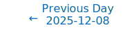
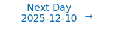

# Personalized Daily ArXiv Papers 2025-12-09

| *[gpt-5]*   | Prompt   | Completion   | Total   |
|:-----------:|:--------:|:------------:|:-------:|
| **Token**   | 71628    | 53756        | 125384  |
| **Cost**    | $0.09    | $0.54        | $0.63   |

Total arXiv papers: 865

Total scanned papers: 520

Total relevant papers: 46

**Table of contents with paper titles:**

1. [JEPA as a Neural Tokenizer: Learning Robust Speech Representations with Density Adaptive Attention](#user-content-link1)
**Authors:** Georgios Ioannides, Christos Constantinou, Aman Chadha, Aaron Elkins, Linsey Pang, Ravid Shwartz-Ziv, Yann LeCun

2. [Group Representational Position Encoding](#user-content-link2)
**Authors:** Yifan Zhang, Zixiang Chen, Yifeng Liu, Zhen Qin, Huizhuo Yuan, Kangping Xu, Yang Yuan, Quanquan Gu, Andrew Chi-Chih Yao

3. [A Mathematical Theory of Top-$k$ Sparse Attention via Total Variation Distance](#user-content-link3)
**Authors:** Georgios Tzachristas, Lei Deng, Ioannis Tzachristas, Gong Zhang, Renhai Chen

4. [GatedFWA: Linear Flash Windowed Attention with Gated Associative Memory](#user-content-link4)
**Authors:** Jiaxu Liu, Yuhe Bai, Christos-Savvas Bouganis

5. [Leveraging KV Similarity for Online Structured Pruning in LLMs](#user-content-link5)
**Authors:** Jungmin Lee, Gwangeun Byeon, Yulhwa Kim, Seokin Hong

6. [FOAM: Blocked State Folding for Memory-Efficient LLM Training](#user-content-link6)
**Authors:** Ziqing Wen, Jiahuan Wang, Ping Luo, Dongsheng Li, Tao Sun

7. [Block Sparse Flash Attention](#user-content-link7)
**Authors:** Daniel Ohayon, Itay Lamprecht, Itay Hubara, Israel Cohen, Daniel Soudry, Noam Elata

8. [Flash Multi-Head Feed-Forward Network](#user-content-link8)
**Authors:** Minshen Zhang, Xiang Hu, Jianguo Li, Wei Wu, Kewei Tu

9. [Theoretical Compression Bounds for Wide Multilayer Perceptrons](#user-content-link9)
**Authors:** Houssam El Cheairi, David Gamarnik, Rahul Mazumder

10. [Winning the Lottery by Preserving Network Training Dynamics with Concrete Ticket Search](#user-content-link10)
**Authors:** Tanay Arora, Christof Teuscher

11. [Vec-LUT: Vector Table Lookup for Parallel Ultra-Low-Bit LLM Inference on Edge Devices](#user-content-link11)
**Authors:** Xiangyu Li, Chengyu Yin, Weijun Wang, Jianyu Wei, Ting Cao, Yunxin Liu

12. [Provable Long-Range Benefits of Next-Token Prediction](#user-content-link12)
**Authors:** Xinyuan Cao, Santosh S. Vempala

13. [Asymptotic analysis of shallow and deep forgetting in replay with Neural Collapse](#user-content-link13)
**Authors:** Giulia Lanzillotta, Damiano Meier, Thomas Hofmann

14. [KV-CAR: KV Cache Compression using Autoencoders and KV Reuse in Large Language Models](#user-content-link14)
**Authors:** Sourjya Roy, Shrihari Sridharan, Surya Selvam, Anand Raghunathan

15. [GSAE: Graph-Regularized Sparse Autoencoders for Robust LLM Safety Steering](#user-content-link15)
**Authors:** Jehyeok Yeon, Federico Cinus, Yifan Wu, Luca Luceri

16. [DCO: Dynamic Cache Orchestration for LLM Accelerators through Predictive Management](#user-content-link16)
**Authors:** Zhongchun Zhou, Chengtao Lai, Yuhang Gu, Wei Zhang

17. [From Next-Token to Next-Block: A Principled Adaptation Path for Diffusion LLMs](#user-content-link17)
**Authors:** Yuchuan Tian, Yuchen Liang, Jiacheng Sun, Shuo Zhang, Guangwen Yang, Yingte Shu, Sibo Fang, Tianyu Guo, Kai Han, Chao Xu, Hanting Chen, Xinghao Chen, Yunhe Wang

18. [GradientSpace: Unsupervised Data Clustering for Improved Instruction Tuning](#user-content-link18)
**Authors:** Shrihari Sridharan, Deepak Ravikumar, Anand Raghunathan, Kaushik Roy

19. [BitStopper: An Efficient Transformer Attention Accelerator via Stage-fusion and Early Termination](#user-content-link19)
**Authors:** Huizheng Wang, Hongbin Wang, Shaojun Wei, Yang Hu, Shouyi Yin

20. [Neural expressiveness for beyond importance model compression](#user-content-link20)
**Authors:** Angelos-Christos Maroudis, Sotirios Xydis

21. [Vector Quantization using Gaussian Variational Autoencoder](#user-content-link21)
**Authors:** Tongda Xu, Wendi Zheng, Jiajun He, Jose Miguel Hernandez-Lobato, Yan Wang, Ya-Qin Zhang, Jie Tang

22. [Each Prompt Matters: Scaling Reinforcement Learning Without Wasting Rollouts on Hundred-Billion-Scale MoE](#user-content-link22)
**Authors:** Anxiang Zeng, Haibo Zhang, Hailing Zhang, Kaixiang Mo, Liang Yao, Ling Hu, Long Zhang, Shuman Liu, Shuyi Xie, Yanshi Li, Yizhang Chen, Yuepeng Sheng, Yuwei Huang, Zhaochen Xu, Zhiqiang Zhou, Ziqin Liew

23. [A Geometric Unification of Concept Learning with Concept Cones](#user-content-link23)
**Authors:** Alexandre Rocchi--Henry, Thomas Fel, Gianni Franchi

24. [RLAX: Large-Scale, Distributed Reinforcement Learning for Large Language Models on TPUs](#user-content-link24)
**Authors:** Runlong Zhou, Lefan Zhang, Shang-Chen Wu, Kelvin Zou, Hanzhi Zhou, Ke Ye, Yihao Feng, Dong Yin, Alex Guillen Garcia, Dmytro Babych, Rohit Chatterjee, Matthew Hopkins, Xiang Kong, Chang Lan, Lezhi Li, Yiping Ma, Daniele Molinari, Senyu Tong, Yanchao Sun, Thomas Voice, Jianyu Wang, Chong Wang, Simon Wang, Floris Weers, Yechen Xu, Guolin Yin, Muyang Yu, Yi Zhang, Zheng Zhou, Danyang Zhuo, Ruoming Pang, Cheng Leong

25. [SparsePixels: Efficient Convolution for Sparse Data on FPGAs](#user-content-link25)
**Authors:** Ho Fung Tsoi, Dylan Rankin, Vladimir Loncar, Philip Harris

26. [PlantBiMoE: A Bidirectional Foundation Model with SparseMoE for Plant Genomes](#user-content-link26)
**Authors:** Kepeng Lin, Qizhe Zhang, Rui Wang, Xuehai Hu, Wei Xu

27. [Zero Generalization Error Theorem for Random Interpolators via Algebraic Geometry](#user-content-link27)
**Authors:** Naoki Yoshida, Isao Ishikawa, Masaaki Imaizumi

28. [Local-Curvature-Aware Knowledge Graph Embedding: An Extended Ricci Flow Approach](#user-content-link28)
**Authors:** Zhengquan Luo, Guy Tadmor, Or Amar, David Zeevi, Zhiqiang Xu

29. [The Native Spiking Microarchitecture: From Iontronic Primitives to Bit-Exact FP8 Arithmetic](#user-content-link29)
**Authors:** Zhengzheng Tang

30. [Pathway to $O(\sqrt{d})$ Complexity bound under Wasserstein metric of flow-based models](#user-content-link30)
**Authors:** Xiangjun Meng, Zhongjian Wang

31. [Optimizing Optimizers for Fast Gradient-Based Learning](#user-content-link31)
**Authors:** Jaerin Lee, Kyoung Mu Lee

32. [Efficient Low-Tubal-Rank Tensor Estimation via Alternating Preconditioned Gradient Descent](#user-content-link32)
**Authors:** Zhiyu Liu, Zhi Han, Yandong Tang, Jun Fan, Yao Wang

33. [Self-Supervised Learning on Molecular Graphs: A Systematic Investigation of Masking Design](#user-content-link33)
**Authors:** Jiannan Yang, Veronika Thost, Tengfei Ma

34. [Comparing BFGS and OGR for Second-Order Optimization](#user-content-link34)
**Authors:** Adrian Przybysz, Miko{\l}aj Ko{\l}ek, Franciszek Sobota, Jarek Duda

35. [RMAdapter: Reconstruction-based Multi-Modal Adapter for Vision-Language Models](#user-content-link35)
**Authors:** Xiang Lin, Weixin Li, Shu Guo, Lihong Wang, Di Huang

36. [Recover-to-Forget: Gradient Reconstruction from LoRA for Efficient LLM Unlearning](#user-content-link36)
**Authors:** Yezi Liu, Hanning Chen, Wenjun Huang, Yang Ni, Mohsen Imani

37. [A new initialisation to Control Gradients in Sinusoidal Neural network](#user-content-link37)
**Authors:** Andrea Combette, Antoine Venaille, Nelly Pustelnik

38. [PVeRA: Probabilistic Vector-Based Random Matrix Adaptation](#user-content-link38)
**Authors:** Leo Fillioux, Enzo Ferrante, Paul-Henry Courn\`ede, Maria Vakalopoulou, Stergios Christodoulidis

39. [RRAEDy: Adaptive Latent Linearization of Nonlinear Dynamical Systems](#user-content-link39)
**Authors:** Jad Mounayer, Sebastian Rodriguez, Jerome Tomezyk, Chady Ghnatios, Francisco Chinesta

40. [Approximate Multiplier Induced Error Propagation in Deep Neural Networks](#user-content-link40)
**Authors:** A. M. H. H. Alahakoon, Hassaan Saadat, Darshana Jayasinghe, Sri Parameswaran

41. [LIME: Making LLM Data More Efficient with Linguistic Metadata Embeddings](#user-content-link41)
**Authors:** Sebastian Sztwiertnia, Felix Friedrich, Kristian Kersting, Patrick Schramowski, Bj\"orn Deiseroth

42. [Entropic Confinement and Mode Connectivity in Overparameterized Neural Networks](#user-content-link42)
**Authors:** Luca Di Carlo, Chase Goddard, David J. Schwab

43. [Revolutionizing Mixed Precision Quantization: Towards Training-free Automatic Proxy Discovery via Large Language Models](#user-content-link43)
**Authors:** Haidong Kang, Jun Du, Lihong Lin

44. [Less Is More, but Where? Dynamic Token Compression via LLM-Guided Keyframe Prior](#user-content-link44)
**Authors:** Yulin Li, Haokun Gui, Ziyang Fan, Junjie Wang, Bin Kang, Bin Chen, Zhuotao Tian

45. [Always Keep Your Promises: DynamicLRP, A Model-Agnostic Solution To Layer-Wise Relevance Propagation](#user-content-link45)
**Authors:** Kevin Lee, Pablo Millan Arias

46. [FRWKV:Frequency-Domain Linear Attention for Long-Term Time Series Forecasting](#user-content-link46)
**Authors:** Qingyuan Yang, Shizhuo, Dongyue Chen, Da Teng, Zehua Gan

---

## 1. [JEPA as a Neural Tokenizer: Learning Robust Speech Representations with Density Adaptive Attention](https://arxiv.org/abs/2512.07168) 

**ArXiv ID:** 2512.07168

**Authors:** Georgios Ioannides, Christos Constantinou, Aman Chadha, Aaron Elkins, Linsey Pang, Ravid Shwartz-Ziv, Yann LeCun

**Abstract:** We introduce a two-stage self-supervised framework that combines the Joint-Embedding Predictive Architecture (JEPA) with a Density Adaptive Attention Mechanism (DAAM) for learning robust speech representations. Stage~1 uses JEPA with DAAM to learn semantic audio features via masked prediction in latent space, fully decoupled from waveform reconstruction. Stage~2 leverages these representations for efficient tokenization using Finite Scalar Quantization (FSQ) and a mixed-radix packing scheme, followed by high-fidelity waveform reconstruction with a HiFi-GAN decoder. By integrating Gaussian mixture-based density-adaptive gating into the JEPA encoder, the model performs adaptive temporal feature selection and discovers hierarchical speech structure at a low frame rate of 2.5~Hz. The resulting tokens (47.5 tokens/sec) provide a reversible, highly compressed, and language-model-friendly representation that is competitive with, and often more efficient than, existing neural audio codecs.

**Comment:** Author match

---

## 2. [Group Representational Position Encoding](https://arxiv.org/abs/2512.07805) 

**ArXiv ID:** 2512.07805

**Authors:** Yifan Zhang, Zixiang Chen, Yifeng Liu, Zhen Qin, Huizhuo Yuan, Kangping Xu, Yang Yuan, Quanquan Gu, Andrew Chi-Chih Yao

**Abstract:** We present GRAPE (Group RepresentAtional Position Encoding), a unified framework for positional encoding based on group actions. GRAPE brings together two families of mechanisms: (i) multiplicative rotations (Multiplicative GRAPE) in $\mathrm{SO}(d)$ and (ii) additive logit biases (Additive GRAPE) arising from unipotent actions in the general linear group $\mathrm{GL}$. In Multiplicative GRAPE, a position $n \in \mathbb{Z}$ (or $t \in \mathbb{R}$) acts as $\mathbf{G}(n)=\exp(n\,\omega\,\mathbf{L})$ with a rank-2 skew generator $\mathbf{L} \in \mathbb{R}^{d \times d}$, yielding a relative, compositional, norm-preserving map with a closed-form matrix exponential. RoPE is recovered exactly when the $d/2$ planes are the canonical coordinate pairs with log-uniform spectrum. Learned commuting subspaces and compact non-commuting mixtures strictly extend this geometry to capture cross-subspace feature coupling at $O(d)$ and $O(r d)$ cost per head, respectively. In Additive GRAPE, additive logits arise as rank-1 (or low-rank) unipotent actions, recovering ALiBi and the Forgetting Transformer (FoX) as exact special cases while preserving an exact relative law and streaming cacheability. Altogether, GRAPE supplies a principled design space for positional geometry in long-context models, subsuming RoPE and ALiBi as special cases. Project Page: https://github.com/model-architectures/GRAPE.

**Comment:** Model Architecture: unified positional encoding framework (group actions) subsuming RoPE/ALiBi with new multiplicative/additive families and efficient implementations for long context.

**Relevance:** 10
**Novelty:** 9

---

## 3. [A Mathematical Theory of Top-$k$ Sparse Attention via Total Variation Distance](https://arxiv.org/abs/2512.07647) 

**ArXiv ID:** 2512.07647

**Authors:** Georgios Tzachristas, Lei Deng, Ioannis Tzachristas, Gong Zhang, Renhai Chen

**Abstract:** We develop a unified mathematical framework for certified Top-$k$ attention truncation that quantifies approximation error at both the distribution and output levels. For a single attention distribution $P$ and its Top-$k$ truncation $\hat P$, we show that the total-variation distance coincides with the discarded softmax tail mass and satisfies $\mathrm{TV}(P,\hat P)=1-e^{-\mathrm{KL}(\hat P\Vert P)}$, yielding sharp Top-$k$-specific bounds in place of generic inequalities. From this we derive non-asymptotic deterministic bounds -- from a single boundary gap through multi-gap and blockwise variants -- that control $\mathrm{TV}(P,\hat P)$ using only the ordered logits. Using an exact head-tail decomposition, we prove that the output error factorizes as $\|\mathrm{Attn}(q,K,V)-\mathrm{Attn}_k(q,K,V)\|_2=\tau\|\mu_{\mathrm{tail}}-\mu_{\mathrm{head}}\|_2$ with $\tau=\mathrm{TV}(P,\hat P)$, yielding a new head-tail diameter bound $\|\mathrm{Attn}(q,K,V)-\mathrm{Attn}_k(q,K,V)\|_2\le\tau\,\mathrm{diam}_{H,T}$ and refinements linking the error to $\mathrm{Var}_P(V)$. Under an i.i.d. Gaussian score model $s_i\sim\mathcal N(\mu,\sigma^2)$ we derive closed-form tail masses and an asymptotic rule for the minimal $k_\varepsilon$ ensuring $\mathrm{TV}(P,\hat P)\le\varepsilon$, namely $k_\varepsilon/n\approx\Phi_c(\sigma+\Phi^{-1}(\varepsilon))$. Experiments on bert-base-uncased and synthetic logits confirm the predicted scaling of $k_\varepsilon/n$ and show that certified Top-$k$ can reduce scored keys by 2-4$\times$ on average while meeting the prescribed total-variation budget.

**Comment:** Strong match to Model Architecture/Efficiency: rigorous theory for Top-k sparse attention with certified TV bounds and output error factorization.

**Relevance:** 10
**Novelty:** 9

---

## 4. [GatedFWA: Linear Flash Windowed Attention with Gated Associative Memory](https://arxiv.org/abs/2512.07782) 

**ArXiv ID:** 2512.07782

**Authors:** Jiaxu Liu, Yuhe Bai, Christos-Savvas Bouganis

**Abstract:** Modern autoregressive models rely on attention, yet the Softmax full attention in Transformers scales quadratically with sequence length. Sliding Window Attention (SWA) achieves linear-time encoding/decoding by constraining the attention pattern, but under an \textit{Associative Memory} interpretation, its difference-style update renders the training objective effectively \emph{unbounded}. In contrast, Softmax attention normalizes updates, leading to \emph{memory shrinkage and gradient vanishing}. We propose GatedFWA: a Memory-\underline{Gated} (\underline{F}lash) \underline{W}indowed \underline{A}ttention mechanism that preserves SWAs efficiency while stabilizing memory updates and making gradient flow controllable. In essence, GatedFWA accumulate a per-token/head gate into a decay bias added to the attention logits, acting as a learnable contraction in the memory recurrence. We implement a fused one-pass gate preprocessing and a FlashAttention-compatible kernel that injects the gate under a sliding mask, ensuring I/O efficiency and numerical stability. On language modelling benchmarks, GatedFWA delivers competitive throughput with negligible overhead and better use of global context, and it integrates cleanly with token compression/selection methods such as NSA and generalizes to various autoregressive domains.

**Comment:** Model Architecture/Efficiency: proposes linear-time sliding-window attention with learnable gating to stabilize associative memory; FlashAttention-compatible fused kernel for I/O-efficient implementation.

**Relevance:** 10
**Novelty:** 8

---

## 5. [Leveraging KV Similarity for Online Structured Pruning in LLMs](https://arxiv.org/abs/2512.07090) 

**ArXiv ID:** 2512.07090

**Authors:** Jungmin Lee, Gwangeun Byeon, Yulhwa Kim, Seokin Hong

**Abstract:** Pruning has emerged as a promising direction for accelerating large language model (LLM) inference, yet existing approaches often suffer from instability because they rely on offline calibration data that may not generalize across inputs. In this work, we introduce Token Filtering, a lightweight online structured pruning technique that makes pruning decisions directly during inference without any calibration data. The key idea is to measure token redundancy via joint key-value similarity and skip redundant attention computations, thereby reducing inference cost while preserving critical information. To further enhance stability, we design a variance-aware fusion strategy that adaptively weights key and value similarity across heads, ensuring that informative tokens are retained even under high pruning ratios. This design introduces no additional memory overhead and provides a more reliable criterion for token importance. Extensive experiments on LLaMA-2 (7B/13B), LLaMA-3 (8B), and Mistral (7B) demonstrate that Token Filtering consistently outperforms prior structured pruning methods, preserving accuracy on commonsense reasoning benchmarks and maintaining strong performance on challenging tasks such as MMLU, even with 50% pruning.

**Comment:** Model Compression and Efficiency: online structured pruning for LLM attention via key-value similarity with variance-aware fusion, reducing inference cost without calibration data.

**Relevance:** 10
**Novelty:** 8

---

## 6. [FOAM: Blocked State Folding for Memory-Efficient LLM Training](https://arxiv.org/abs/2512.07112) 

**ArXiv ID:** 2512.07112

**Authors:** Ziqing Wen, Jiahuan Wang, Ping Luo, Dongsheng Li, Tao Sun

**Abstract:** Large language models (LLMs) have demonstrated remarkable performance due to their large parameter counts and extensive training data. However, their scale leads to significant memory bottlenecks during training, especially when using memory-intensive optimizers like Adam. Existing memory-efficient approaches often rely on techniques such as singular value decomposition (SVD), projections, or weight freezing, which can introduce substantial computational overhead, require additional memory for projections, or degrade model performance. In this paper, we propose Folded Optimizer with Approximate Moment (FOAM), a method that compresses optimizer states by computing block-wise gradient means and incorporates a residual correction to recover lost information. Theoretically, FOAM achieves convergence rates equivalent to vanilla Adam under standard non-convex optimization settings. Empirically, FOAM reduces total training memory by approximately 50\%, eliminates up to 90\% of optimizer state memory overhead, and accelerates convergence. Furthermore, FOAM is compatible with other memory-efficient optimizers, delivering performance and throughput that match or surpass both full-rank and existing memory-efficient baselines.

**Comment:** High Performance Computing and Efficiency: optimizer-state compression (block-wise moments with residual correction) for memory-efficient LLM training with convergence guarantees, cutting optimizer memory up to 90%.

**Relevance:** 10
**Novelty:** 8

---

## 7. [Block Sparse Flash Attention](https://arxiv.org/abs/2512.07011) 

**ArXiv ID:** 2512.07011

**Authors:** Daniel Ohayon, Itay Lamprecht, Itay Hubara, Israel Cohen, Daniel Soudry, Noam Elata

**Abstract:** Modern large language models increasingly require long contexts for reasoning and multi-document tasks, but attention's quadratic complexity creates a severe computational bottleneck. We present Block-Sparse FlashAttention (BSFA), a drop-in replacement that accelerates long-context inference while preserving model quality. Unlike methods that predict importance before computing scores, BSFA computes exact query-key similarities to select the top-k most important value blocks for each query. By comparing per-block maximum scores against calibrated thresholds, we skip approximately 50% of the computation and memory transfers for pruned blocks. Our training-free approach requires only a one-time threshold calibration on a small dataset to learn the per-layer and per-head attention score distributions. We provide a CUDA kernel implementation that can be used as a drop-in replacement for FlashAttention. On Llama-3.1-8B, BSFA achieves up to 1.10x speedup on real-world reasoning benchmarks and up to 1.24x for needle-in-a-haystack retrieval tasks while maintaining above 99% baseline accuracy, with certain configurations even improving accuracy by focusing on the most relevant content, substantially outperforming existing sparse attention methods. The implementation is available at https://github.com/Danielohayon/Block-Sparse-Flash-Attention

**Comment:** Model Efficiency/HPC: block-sparse FlashAttention with calibrated per-block pruning and CUDA kernel, preserving accuracy while skipping ~50% compute/memory transfers.

**Relevance:** 10
**Novelty:** 8

---

## 8. [Flash Multi-Head Feed-Forward Network](https://arxiv.org/abs/2512.06989) 

**ArXiv ID:** 2512.06989

**Authors:** Minshen Zhang, Xiang Hu, Jianguo Li, Wei Wu, Kewei Tu

**Abstract:** We explore Multi-Head FFN (MH-FFN) as a replacement of FFN in the Transformer architecture, motivated by the structural similarity between single-head attention and FFN. While multi-head mechanisms enhance expressivity in attention, naively applying them to FFNs faces two challenges: memory consumption scaling with the head count, and an imbalanced ratio between the growing intermediate size and the fixed head dimension as models scale, which degrades scalability and expressive power. To address these challenges, we propose Flash Multi-Head FFN (FlashMHF), with two key innovations: an I/O-aware fused kernel computing outputs online in SRAM akin to FlashAttention, and a design using dynamically weighted parallel sub-networks to maintain a balanced ratio between intermediate and head dimensions. Validated on models from 128M to 1.3B parameters, FlashMHF consistently improves perplexity and downstream task accuracy over SwiGLU FFNs, while reducing peak memory usage by 3-5x and accelerating inference by up to 1.08x. Our work establishes the multi-head design as a superior architectural principle for FFNs, presenting FlashMHF as a powerful, efficient, and scalable alternative to FFNs in Transformers.

**Comment:** Model Architecture + Systems Efficiency: introduces Multi-Head FFN with an I/O-aware fused kernel (Flash-style) and dynamic sub-networks for better perplexity/memory.

**Relevance:** 10
**Novelty:** 8

---

## 9. [Theoretical Compression Bounds for Wide Multilayer Perceptrons](https://arxiv.org/abs/2512.06288) 

**ArXiv ID:** 2512.06288

**Authors:** Houssam El Cheairi, David Gamarnik, Rahul Mazumder

**Abstract:** Pruning and quantization techniques have been broadly successful in reducing the number of parameters needed for large neural networks, yet theoretical justification for their empirical success falls short. We consider a randomized greedy compression algorithm for pruning and quantization post-training and use it to rigorously show the existence of pruned/quantized subnetworks of multilayer perceptrons (MLPs) with competitive performance. We further extend our results to structured pruning of MLPs and convolutional neural networks (CNNs), thus providing a unified analysis of pruning in wide networks. Our results are free of data assumptions, and showcase a tradeoff between compressibility and network width. The algorithm we consider bears some similarities with Optimal Brain Damage (OBD) and can be viewed as a post-training randomized version of it. The theoretical results we derive bridge the gap between theory and application for pruning/quantization, and provide a justification for the empirical success of compression in wide multilayer perceptrons.

**Comment:** Strong match to Compression/Efficiency: theoretical compression bounds for pruning/quantization in wide networks, including structured pruning.

**Relevance:** 10
**Novelty:** 8

---

## 10. [Winning the Lottery by Preserving Network Training Dynamics with Concrete Ticket Search](https://arxiv.org/abs/2512.07142) 

**ArXiv ID:** 2512.07142

**Authors:** Tanay Arora, Christof Teuscher

**Abstract:** The Lottery Ticket Hypothesis asserts the existence of highly sparse, trainable subnetworks ('winning tickets') within dense, randomly initialized neural networks. However, state-of-the-art methods of drawing these tickets, like Lottery Ticket Rewinding (LTR), are computationally prohibitive, while more efficient saliency-based Pruning-at-Initialization (PaI) techniques suffer from a significant accuracy-sparsity trade-off and fail basic sanity checks. In this work, we argue that PaI's reliance on first-order saliency metrics, which ignore inter-weight dependencies, contributes substantially to this performance gap, especially in the sparse regime. To address this, we introduce Concrete Ticket Search (CTS), an algorithm that frames subnetwork discovery as a holistic combinatorial optimization problem. By leveraging a Concrete relaxation of the discrete search space and a novel gradient balancing scheme (GRADBALANCE) to control sparsity, CTS efficiently identifies high-performing subnetworks near initialization without requiring sensitive hyperparameter tuning. Motivated by recent works on lottery ticket training dynamics, we further propose a knowledge distillation-inspired family of pruning objectives, finding that minimizing the reverse Kullback-Leibler divergence between sparse and dense network outputs (CTS-KL) is particularly effective. Experiments on varying image classification tasks show that CTS produces subnetworks that robustly pass sanity checks and achieve accuracy comparable to or exceeding LTR, while requiring only a small fraction of the computation. For example, on ResNet-20 on CIFAR10, it reaches 99.3% sparsity with 74.0% accuracy in 7.9 minutes, while LTR attains the same sparsity with 68.3% accuracy in 95.2 minutes. CTS's subnetworks outperform saliency-based methods across all sparsities, but its advantage over LTR is most pronounced in the highly sparse regime.

**Comment:** Strong match to Sparsity/Pruning: pruning-at-initialization via Concrete relaxation preserving training dynamics; lottery ticket advances.

**Relevance:** 10
**Novelty:** 8

---

## 11. [Vec-LUT: Vector Table Lookup for Parallel Ultra-Low-Bit LLM Inference on Edge Devices](https://arxiv.org/abs/2512.06443) 

**ArXiv ID:** 2512.06443

**Authors:** Xiangyu Li, Chengyu Yin, Weijun Wang, Jianyu Wei, Ting Cao, Yunxin Liu

**Abstract:** Large language models (LLMs) are increasingly deployed on edge devices. To meet strict resource constraints, real-world deployment has pushed LLM quantization from 8-bit to 4-bit, 2-bit, and now 1.58-bit. Combined with lookup table (LUT)-based inference, CPUs run these ultra-low-bit LLMs even faster than NPUs, opening new opportunities for ubiquitous on-device intelligence.   However, this paper identifies that LUT-based inference underutilizes memory bandwidth during parallel inference, which is required for prefilling, test-time scaling, and other multi-token scenarios. The root cause is the scalar LUT paradigm, which performs repetitive and non-contiguous memory accesses for each token.   To solve the issue, we propose vector LUT, a new lookup paradigm that constructs a unified LUT across parallel tokens, and performs a single $1 \rightarrow N$ lookup per index. To realize it efficiently, we further introduce (1) Vector LUT-Centric Tensor Layout, and (2) Cache-Aware Streamed Lookup techniques. Evaluations on 5 edge devices across 3 LLMs show that Vec-LUT outperforms state-of-the-art baselines by up to $4.2\times$. Our implementation is integrated into llama.cpp. The code is available at https://github.com/Cipherxzc/vlut.cpp.

**Comment:** Strong match to Compression/Efficiency/HPC: vector LUT paradigm for ultra-low-bit LLM inference improving memory bandwidth and parallelism.

**Relevance:** 10
**Novelty:** 8

---

## 12. [Provable Long-Range Benefits of Next-Token Prediction](https://arxiv.org/abs/2512.07818) 

**ArXiv ID:** 2512.07818

**Authors:** Xinyuan Cao, Santosh S. Vempala

**Abstract:** Why do modern language models, trained to do well on next-word prediction, appear to generate coherent documents and capture long-range structure? Here we show that next-token prediction is provably powerful for learning longer-range structure, even with common neural network architectures. Specifically, we prove that optimizing next-token prediction over a Recurrent Neural Network (RNN) yields a model that closely approximates the training distribution: for held-out documents sampled from the training distribution, no algorithm of bounded description length limited to examining the next $k$ tokens, for any $k$, can distinguish between $k$ consecutive tokens of such documents and $k$ tokens generated by the learned language model following the same prefix. We provide polynomial bounds (in $k$, independent of the document length) on the model size needed to achieve such $k$-token indistinguishability, offering a complexity-theoretic explanation for the long-range coherence observed in practice.

**Comment:** Theory/Training Dynamics: complexity-theoretic guarantees that next-token training yields long-range k-token indistinguishability with polynomial-size RNNs.

**Relevance:** 9
**Novelty:** 9

---

## 13. [Asymptotic analysis of shallow and deep forgetting in replay with Neural Collapse](https://arxiv.org/abs/2512.07400) 

**ArXiv ID:** 2512.07400

**Authors:** Giulia Lanzillotta, Damiano Meier, Thomas Hofmann

**Abstract:** A persistent paradox in continual learning (CL) is that neural networks often retain linearly separable representations of past tasks even when their output predictions fail. We formalize this distinction as the gap between deep feature-space and shallow classifier-level forgetting. We reveal a critical asymmetry in Experience Replay: while minimal buffers successfully anchor feature geometry and prevent deep forgetting, mitigating shallow forgetting typically requires substantially larger buffer capacities. To explain this, we extend the Neural Collapse framework to the sequential setting. We characterize deep forgetting as a geometric drift toward out-of-distribution subspaces and prove that any non-zero replay fraction asymptotically guarantees the retention of linear separability. Conversely, we identify that the "strong collapse" induced by small buffers leads to rank-deficient covariances and inflated class means, effectively blinding the classifier to true population boundaries. By unifying CL with out-of-distribution detection, our work challenges the prevailing reliance on large buffers, suggesting that explicitly correcting these statistical artifacts could unlock robust performance with minimal replay.

**Comment:** Training dynamics/representation learning criterion: asymptotic analysis of shallow vs deep forgetting in replay via Neural Collapse, explaining separability vs classifier failure.

**Relevance:** 9
**Novelty:** 9

---

## 14. [KV-CAR: KV Cache Compression using Autoencoders and KV Reuse in Large Language Models](https://arxiv.org/abs/2512.06727) 

**ArXiv ID:** 2512.06727

**Authors:** Sourjya Roy, Shrihari Sridharan, Surya Selvam, Anand Raghunathan

**Abstract:** As Large Language Models (LLMs) scale in size and context length, the memory requirements of the key value (KV) cache have emerged as a major bottleneck during autoregressive decoding. The KV cache grows with sequence length and embedding dimension, often exceeding the memory footprint of the model itself and limiting achievable batch sizes and context windows. To address this challenge, we present KV CAR, a unified and architecture agnostic framework that significantly reduces KV cache storage while maintaining model fidelity. KV CAR combines two complementary techniques. First, a lightweight autoencoder learns compact representations of key and value tensors along the embedding dimension, compressing them before they are stored in the KV cache and restoring them upon retrieval. Second, a similarity driven reuse mechanism identifies opportunities to reuse KV tensors of specific attention heads across adjacent layers. Together, these methods reduce the dimensional and structural redundancy in KV tensors without requiring changes to the transformer architecture. Evaluations on GPT 2 and TinyLLaMA models across Wikitext, C4, PIQA, and Winogrande datasets demonstrate that KV CAR achieves up to 47.85 percent KV cache memory reduction with minimal impact on perplexity and zero shot accuracy. System level measurements on an NVIDIA A40 GPU show that the reduced KV footprint directly translates into longer sequence lengths and larger batch sizes during inference. These results highlight the effectiveness of KV CAR in enabling memory efficient LLM inference.

**Comment:** Strong match to Compression/Efficiency: KV cache compression via autoencoders and cross-layer KV reuse for LLM inference.

**Relevance:** 10
**Novelty:** 7

---

## 15. [GSAE: Graph-Regularized Sparse Autoencoders for Robust LLM Safety Steering](https://arxiv.org/abs/2512.06655) 

**ArXiv ID:** 2512.06655

**Authors:** Jehyeok Yeon, Federico Cinus, Yifan Wu, Luca Luceri

**Abstract:** Large language models (LLMs) face critical safety challenges, as they can be manipulated to generate harmful content through adversarial prompts and jailbreak attacks. Many defenses are typically either black-box guardrails that filter outputs, or internals-based methods that steer hidden activations by operationalizing safety as a single latent feature or dimension. While effective for simple concepts, this assumption is limiting, as recent evidence shows that abstract concepts such as refusal and temporality are distributed across multiple features rather than isolated in one. To address this limitation, we introduce Graph-Regularized Sparse Autoencoders (GSAEs), which extends SAEs with a Laplacian smoothness penalty on the neuron co-activation graph. Unlike standard SAEs that assign each concept to a single latent feature, GSAEs recover smooth, distributed safety representations as coherent patterns spanning multiple features. We empirically demonstrate that GSAE enables effective runtime safety steering, assembling features into a weighted set of safety-relevant directions and controlling them with a two-stage gating mechanism that activates interventions only when harmful prompts or continuations are detected during generation. This approach enforces refusals adaptively while preserving utility on benign queries. Across safety and QA benchmarks, GSAE steering achieves an average 82% selective refusal rate, substantially outperforming standard SAE steering (42%), while maintaining strong task accuracy (70% on TriviaQA, 65% on TruthfulQA, 74% on GSM8K). Robustness experiments further show generalization across LLaMA-3, Mistral, Qwen, and Phi families and resilience against jailbreak attacks (GCG, AutoDAN), consistently maintaining >= 90% refusal of harmful content.

**Comment:** Representation Learning/SAE: graph-regularized sparse autoencoders with Laplacian smoothness to recover distributed safety features and enable selective steering.

**Relevance:** 9
**Novelty:** 8

---

## 16. [DCO: Dynamic Cache Orchestration for LLM Accelerators through Predictive Management](https://arxiv.org/abs/2512.07312) 

**ArXiv ID:** 2512.07312

**Authors:** Zhongchun Zhou, Chengtao Lai, Yuhang Gu, Wei Zhang

**Abstract:** The rapid adoption of large language models (LLMs) is pushing AI accelerators toward increasingly powerful and specialized designs. Instead of further complicating software development with deeply hierarchical scratchpad memories (SPMs) and their asynchronous management, we investigate the opposite point of the design spectrum: a multi-core AI accelerator equipped with a shared system-level cache and application-aware management policies, which keeps the programming effort modest. Our approach exploits dataflow information available in the software stack to guide cache replacement (including dead-block prediction), in concert with bypass decisions and mechanisms that alleviate cache thrashing.   We assess the proposal using a cycle-accurate simulator and observe substantial performance gains (up to 1.80x speedup) compared with conventional cache architectures. In addition, we build and validate an analytical model that takes into account the actual overlapping behaviors to extend the measurement results of our policies to real-world larger-scale workloads. Experiment results show that when functioning together, our bypassing and thrashing mitigation strategies can handle scenarios both with and without inter-core data sharing and achieve remarkable speedups.   Finally, we implement the design in RTL and the area of our design is $\mathbf{0.064mm^2}$ with 15nm process, which can run at 2 GHz clock frequency. Our findings explore the potential of the shared cache design to assist the development of future AI accelerator systems.

**Comment:** HPC/Systems: predictive cache management (bypassing, dead-block prediction, thrash mitigation) for multi-core AI accelerators running LLMs; systems-level innovation for faster inference.

**Relevance:** 9
**Novelty:** 8

---

## 17. [From Next-Token to Next-Block: A Principled Adaptation Path for Diffusion LLMs](https://arxiv.org/abs/2512.06776) 

**ArXiv ID:** 2512.06776

**Authors:** Yuchuan Tian, Yuchen Liang, Jiacheng Sun, Shuo Zhang, Guangwen Yang, Yingte Shu, Sibo Fang, Tianyu Guo, Kai Han, Chao Xu, Hanting Chen, Xinghao Chen, Yunhe Wang

**Abstract:** Large language models (LLMs) excel at generation but dominant autoregressive (AR) decoding is inherently sequential, creating a throughput bottleneck. Diffusion Language Models (DLMs)--especially block-wise variants--enable parallel generation and intra-block bidirectional reasoning, yet training large DLMs from scratch is costly and wastes the knowledge in mature AR checkpoints. Prior "adaptation" attempts either modify logits or randomly grow attention masks to full-sequence diffusion, or simply transplant AR weights into a block-diffusion recipe, leaving a fundamental mismatch between AR causality and block-wise bidirectionality unaddressed. We reframe adaptation as a intra-paradigm path from AR to Block-Diffusion by viewing AR as Block-Diffusion with blocksize=1. Concretely, we design the pathway of adaptation as follows: we use a context-causal attention mask (causal in context, bidirectional only within the active block), an efficient parallel adaptation procedure, an auxiliary AR loss to maximize data utilization and retain pretrained knowledge, and gradual increment of the generation block size. The recipe integrates cleanly with masked block-diffusion and maintains train-inference consistency. Built on these components, NBDiff-7B (Base and Instruct) could inherit the long-context modeling and reasoning capabilities, and achieve state-of-the-art performance among the 7B-class DLMs, delivering strong gains on general-knowledge, math, and code benchmarks over strong baselines. These results demonstrate that principled AR-to-block-diffusion adaptation is an effective and compute-efficient alternative to training DLMs from scratch. Codes: https://github.com/YuchuanTian/NBDiff.

**Comment:** Model architecture/efficiency criterion: principled adaptation from autoregressive to block-wise diffusion with context-causal masks and gradual block growth to enable parallel generation.

**Relevance:** 9
**Novelty:** 8

---

## 18. [GradientSpace: Unsupervised Data Clustering for Improved Instruction Tuning](https://arxiv.org/abs/2512.06678) 

**ArXiv ID:** 2512.06678

**Authors:** Shrihari Sridharan, Deepak Ravikumar, Anand Raghunathan, Kaushik Roy

**Abstract:** Instruction tuning is one of the key steps required for adapting large language models (LLMs) to a broad spectrum of downstream applications. However, this procedure is difficult because real-world datasets are rarely homogeneous; they consist of a mixture of diverse information, causing gradient interference, where conflicting gradients pull the model in opposing directions, degrading performance. A common strategy to mitigate this issue is to group data based on semantic or embedding similarity. However, this fails to capture how data influences model parameters during learning. While recent works have attempted to cluster gradients directly, they randomly project gradients into lower dimensions to manage memory, which leads to accuracy loss. Moreover, these methods rely on expert ensembles which necessitates multiple inference passes and expensive on-the-fly gradient computations during inference. To address these limitations, we propose GradientSpace, a framework that clusters samples directly in full-dimensional gradient space. We introduce an online SVD-based algorithm that operates on LoRA gradients to identify latent skills without the infeasible cost of storing all sample gradients. Each cluster is used to train a specialized LoRA expert along with a lightweight router trained to select the best expert during inference. We show that routing to a single, appropriate expert outperforms expert ensembles used in prior work, while significantly reducing inference latency. Our experiments across mathematical reasoning, code generation, finance, and creative writing tasks demonstrate that GradientSpace leads to coherent expert specialization and consistent accuracy gains over state-of-the-art clustering methods and finetuning techniques.

**Comment:** Mixture-of-Experts/efficiency criterion: clusters samples in full gradient space to train specialized LoRA experts with a lightweight router for single-expert routing.

**Relevance:** 9
**Novelty:** 8

---

## 19. [BitStopper: An Efficient Transformer Attention Accelerator via Stage-fusion and Early Termination](https://arxiv.org/abs/2512.06457) 

**ArXiv ID:** 2512.06457

**Authors:** Huizheng Wang, Hongbin Wang, Shaojun Wei, Yang Hu, Shouyi Yin

**Abstract:** Attention-based large language models (LLMs) have transformed modern AI applications, but the quadratic cost of self-attention imposes significant compute and memory overhead. Dynamic sparsity (DS) attention mitigates this, yet its hardware efficiency is limited by the added prediction stage and the heavy memory traffic it entails. To address these limitations, this paper proposes BitStopper, a fine-grained algorithm-architecture co-design that operates without a sparsity predictor. First, a bit-serial enable stage fusion (BESF) mechanism is proposed to reuse and minimize the memory access by progressively terminating trivial tokens and merging the prediction stage into the execution stage. Second, a lightweight and adaptive token selection (LATS) strategy is developed to work in concert with the bit-level sparsity speculation. Third, a bit-level asynchronous processing (BAP) strategy is employed to improve compute utilization during the on-demand bit-grained memory fetching. Finally, an elaborate architecture is designed to translate the theoretical complexity reduction into practical performance improvement. Extensive evaluations demonstrate that, compared to state-of-the-art (SOTA) Transformer accelerators, BitStopper achieves 2.03x and 1.89x speedups over Sanger and SOFA, respectively, while delivering 2.4x and 2.1x improvements in energy efficiency.

**Comment:** Efficiency/HW–algorithm co-design criterion: attention accelerator with bit-serial stage fusion, adaptive token selection, and early termination to reduce memory and compute.

**Relevance:** 9
**Novelty:** 8

---

## 20. [Neural expressiveness for beyond importance model compression](https://arxiv.org/abs/2512.06440) 

**ArXiv ID:** 2512.06440

**Authors:** Angelos-Christos Maroudis, Sotirios Xydis

**Abstract:** Neural Network Pruning has been established as driving force in the exploration of memory and energy efficient solutions with high throughput both during training and at test time. In this paper, we introduce a novel criterion for model compression, named "Expressiveness". Unlike existing pruning methods that rely on the inherent "Importance" of neurons' and filters' weights, ``Expressiveness" emphasizes a neuron's or group of neurons ability to redistribute informational resources effectively, based on the overlap of activations. This characteristic is strongly correlated to a network's initialization state, establishing criterion autonomy from the learning state stateless and thus setting a new fundamental basis for the expansion of compression strategies in regards to the "When to Prune" question. We show that expressiveness is effectively approximated with arbitrary data or limited dataset's representative samples, making ground for the exploration of Data-Agnostic strategies. Our work also facilitates a "hybrid" formulation of expressiveness and importance-based pruning strategies, illustrating their complementary benefits and delivering up to 10x extra gains w.r.t. weight-based approaches in parameter compression ratios, with an average of 1% in performance degradation. We also show that employing expressiveness (independently) for pruning leads to an improvement over top-performing and foundational methods in terms of compression efficiency. Finally, on YOLOv8, we achieve a 46.1% MACs reduction by removing 55.4\% of the parameters, with an increase of 3% in the mean Absolute Precision ($mAP_{50-95}$) for object detection on COCO dataset.

**Comment:** Model Compression: introduces an expressiveness-based, data-agnostic pruning criterion complementary to importance-based pruning with large compression gains.

**Relevance:** 9
**Novelty:** 8

---

## 21. [Vector Quantization using Gaussian Variational Autoencoder](https://arxiv.org/abs/2512.06609) 

**ArXiv ID:** 2512.06609

**Authors:** Tongda Xu, Wendi Zheng, Jiajun He, Jose Miguel Hernandez-Lobato, Yan Wang, Ya-Qin Zhang, Jie Tang

**Abstract:** Vector quantized variational autoencoder (VQ-VAE) is a discrete auto-encoder that compresses images into discrete tokens. It is difficult to train due to discretization. In this paper, we propose a simple yet effective technique, dubbed Gaussian Quant (GQ), that converts a Gaussian VAE with certain constraint into a VQ-VAE without training. GQ generates random Gaussian noise as a codebook and finds the closest noise to the posterior mean. Theoretically, we prove that when the logarithm of the codebook size exceeds the bits-back coding rate of the Gaussian VAE, a small quantization error is guaranteed. Practically, we propose a heuristic to train Gaussian VAE for effective GQ, named target divergence constraint (TDC). Empirically, we show that GQ outperforms previous VQ-VAEs, such as VQGAN, FSQ, LFQ, and BSQ, on both UNet and ViT architectures. Furthermore, TDC also improves upon previous Gaussian VAE discretization methods, such as TokenBridge. The source code is provided in https://github.com/tongdaxu/VQ-VAE-from-Gaussian-VAE.

**Comment:** Autoencoders/Quantization: converts Gaussian VAE to VQ-VAE without training via Gaussian codebooks; strong theory and practical gains across UNet/ViT.

**Relevance:** 9
**Novelty:** 8

---

## 22. [Each Prompt Matters: Scaling Reinforcement Learning Without Wasting Rollouts on Hundred-Billion-Scale MoE](https://arxiv.org/abs/2512.07710) 

**ArXiv ID:** 2512.07710

**Authors:** Anxiang Zeng, Haibo Zhang, Hailing Zhang, Kaixiang Mo, Liang Yao, Ling Hu, Long Zhang, Shuman Liu, Shuyi Xie, Yanshi Li, Yizhang Chen, Yuepeng Sheng, Yuwei Huang, Zhaochen Xu, Zhiqiang Zhou, Ziqin Liew

**Abstract:** We present CompassMax-V3-Thinking, a hundred-billion-scale MoE reasoning model trained with a new RL framework built on one principle: each prompt must matter. Scaling RL to this size exposes critical inefficiencies-zero-variance prompts that waste rollouts, unstable importance sampling over long horizons, advantage inversion from standard reward models, and systemic bottlenecks in rollout processing. To overcome these challenges, we introduce several unified innovations: (1) Multi-Stage Zero-Variance Elimination, which filters out non-informative prompts and stabilizes group-based policy optimization (e.g. GRPO) by removing wasted rollouts; (2) ESPO, an entropy-adaptive optimization method that balances token-level and sequence-level importance sampling to maintain stable learning dynamics; (3) a Router Replay strategy that aligns training-time MoE router decisions with inference-time behavior to mitigate train-infer discrepancies, coupled with a reward model adjustment to prevent advantage inversion; (4) a high-throughput RL system with FP8-precision rollouts, overlapped reward computation, and length-aware scheduling to eliminate performance bottlenecks. Together, these contributions form a cohesive pipeline that makes RL on hundred-billion-scale MoE models stable and efficient. The resulting model delivers strong performance across both internal and public evaluations.

**Comment:** Strong match to HPC/Model Architecture (MoE): RL training pipeline for hundred-billion-scale MoE with router replay and high-throughput system.

**Relevance:** 9
**Novelty:** 8

---

## 23. [A Geometric Unification of Concept Learning with Concept Cones](https://arxiv.org/abs/2512.07355) 

**ArXiv ID:** 2512.07355

**Authors:** Alexandre Rocchi--Henry, Thomas Fel, Gianni Franchi

**Abstract:** Two traditions of interpretability have evolved side by side but seldom spoken to each other: Concept Bottleneck Models (CBMs), which prescribe what a concept should be, and Sparse Autoencoders (SAEs), which discover what concepts emerge. While CBMs use supervision to align activations with human-labeled concepts, SAEs rely on sparse coding to uncover emergent ones. We show that both paradigms instantiate the same geometric structure: each learns a set of linear directions in activation space whose nonnegative combinations form a concept cone. Supervised and unsupervised methods thus differ not in kind but in how they select this cone. Building on this view, we propose an operational bridge between the two paradigms. CBMs provide human-defined reference geometries, while SAEs can be evaluated by how well their learned cones approximate or contain those of CBMs. This containment framework yields quantitative metrics linking inductive biases -- such as SAE type, sparsity, or expansion ratio -- to emergence of plausible\footnote{We adopt the terminology of \citet{jacovi2020towards}, who distinguish between faithful explanations (accurately reflecting model computations) and plausible explanations (aligning with human intuition and domain knowledge). CBM concepts are plausible by construction -- selected or annotated by humans -- though not necessarily faithful to the true latent factors that organise the data manifold.} concepts. Using these metrics, we uncover a ``sweet spot'' in both sparsity and expansion factor that maximizes both geometric and semantic alignment with CBM concepts. Overall, our work unifies supervised and unsupervised concept discovery through a shared geometric framework, providing principled metrics to measure SAE progress and assess how well discovered concept align with plausible human concepts.

**Comment:** Strong match to Representation Learning: unifies CBMs and SAEs via concept cones with quantitative metrics linking sparsity/expansion to concept emergence.

**Relevance:** 9
**Novelty:** 8

---

## 24. [RLAX: Large-Scale, Distributed Reinforcement Learning for Large Language Models on TPUs](https://arxiv.org/abs/2512.06392) 

**ArXiv ID:** 2512.06392

**Authors:** Runlong Zhou, Lefan Zhang, Shang-Chen Wu, Kelvin Zou, Hanzhi Zhou, Ke Ye, Yihao Feng, Dong Yin, Alex Guillen Garcia, Dmytro Babych, Rohit Chatterjee, Matthew Hopkins, Xiang Kong, Chang Lan, Lezhi Li, Yiping Ma, Daniele Molinari, Senyu Tong, Yanchao Sun, Thomas Voice, Jianyu Wang, Chong Wang, Simon Wang, Floris Weers, Yechen Xu, Guolin Yin, Muyang Yu, Yi Zhang, Zheng Zhou, Danyang Zhuo, Ruoming Pang, Cheng Leong

**Abstract:** Reinforcement learning (RL) has emerged as the de-facto paradigm for improving the reasoning capabilities of large language models (LLMs). We have developed RLAX, a scalable RL framework on TPUs. RLAX employs a parameter-server architecture. A master trainer periodically pushes updated model weights to the parameter server while a fleet of inference workers pull the latest weights and generates new rollouts. We introduce a suite of system techniques to enable scalable and preemptible RL for a diverse set of state-of-art RL algorithms. To accelerate convergence and improve model quality, we have devised new dataset curation and alignment techniques. Large-scale evaluations show that RLAX improves QwQ-32B's pass@8 accuracy by 12.8% in just 12 hours 48 minutes on 1024 v5p TPUs, while remaining robust to preemptions during training.

**Comment:** High-performance training criterion: distributed RL framework on TPUs with parameter-server design and preemption-resilient large-scale rollout generation for LLM training.

**Relevance:** 9
**Novelty:** 7

---

## 25. [SparsePixels: Efficient Convolution for Sparse Data on FPGAs](https://arxiv.org/abs/2512.06208) 

**ArXiv ID:** 2512.06208

**Authors:** Ho Fung Tsoi, Dylan Rankin, Vladimir Loncar, Philip Harris

**Abstract:** Inference of standard CNNs on FPGAs often incurs high latency and a long initiation interval due to the deep nested loops required to densely convolve every input pixel regardless of its feature value, especially when the image size is large. However, in some image data, input features can be spatially sparse, and semantic information may occupy only a small fraction of the input pixels. In this case most computation would be wasted on empty regions. In this work, we introduce SparsePixels, a framework for efficient convolution for spatially sparse image data on FPGAs, targeting fast inference applications in constrained environments with latency requirements of microseconds or below. Our approach implements a special class of CNNs that selectively retain and compute on a small subset of pixels that are active while ignoring the rest. We show that, for example, in a neutrino physics dataset for identifying neutrino interactions in LArTPC images that have around 4k input pixels but are naturally very sparse, a standard CNN with a compact size of 4k parameters incurs an inference latency of 48.665 $\mu$s on an FPGA, whereas a sparse CNN of the same base architecture computing on less than 1% of the input pixels results in a $\times 73$ inference speedup to 0.665 $\mu$s, with resource utilization well within on-chip budgets, trading only a small percent-level performance loss. At least one-order-of magnitude speedups with comparable performance are also demonstrated in similar datasets with sparse image patterns. This work aims to benefit future algorithm developments for fast and efficient data readout in modern experiments such as the trigger and data acquisition systems at the CERN Large Hadron Collider. For easy adoption, we have developed a library to support building sparse CNNs with quantization-aware training, as well as an HLS implementation for FPGA deployment.

**Comment:** HPC/Systems Efficiency: sparse CNN formulation and FPGA HLS implementation exploiting spatial sparsity for microsecond-latency inference with quantization-aware training.

**Relevance:** 9
**Novelty:** 7

---

## 26. [PlantBiMoE: A Bidirectional Foundation Model with SparseMoE for Plant Genomes](https://arxiv.org/abs/2512.07113) 

**ArXiv ID:** 2512.07113

**Authors:** Kepeng Lin, Qizhe Zhang, Rui Wang, Xuehai Hu, Wei Xu

**Abstract:** Understanding the underlying linguistic rules of plant genomes remains a fundamental challenge in computational biology. Recent advances including AgroNT and PDLLMs have made notable progress although, they suffer from excessive parameter size and limited ability to model the bidirectional nature of DNA strands respectively. To address these limitations, we propose PlantBiMoE, a lightweight and expressive plant genome language model that integrates bidirectional Mamba and a Sparse Mixture-of-Experts (SparseMoE) framework. The bidirectional Mamba enables the model to effectively capture structural dependencies across both the forward and reverse DNA strands, while SparseMoE significantly reduces the number of active parameters, improving computational efficiency without sacrificing modeling capacity. We evaluated and tested our model on the Modified Plants Genome Benchmark (MPGB), an enhanced genomic benchmark, which consolidates 31 datasets across 11 representative tasks, with input sequence lengths ranging from 50 to 6,000 bp. Experimental results demonstrate that PlantBiMoE achieves the best performance on 20 out of 31 datasets and the average best when comparing with existing models. In summary, all above results demonstrate that our model can effectively represent plant genomic sequences, serving as a robust computational tool for diverse genomic tasks, while making substantive contributions to plant genomics, gene editing, and synthetic biology. The code is available at: https://github.com/HUST-Keep-Lin/PlantBiMoE

**Comment:** Direct match to Model Architecture and Efficiency: integrates Sparse Mixture-of-Experts (SparseMoE) with bidirectional Mamba for a lightweight foundation model.

**Relevance:** 9
**Novelty:** 7

---

## 27. [Zero Generalization Error Theorem for Random Interpolators via Algebraic Geometry](https://arxiv.org/abs/2512.06347) 

**ArXiv ID:** 2512.06347

**Authors:** Naoki Yoshida, Isao Ishikawa, Masaaki Imaizumi

**Abstract:** We theoretically demonstrate that the generalization error of interpolators for machine learning models under teacher-student settings becomes 0 once the number of training samples exceeds a certain threshold. Understanding the high generalization ability of large-scale models such as deep neural networks (DNNs) remains one of the central open problems in machine learning theory. While recent theoretical studies have attributed this phenomenon to the implicit bias of stochastic gradient descent (SGD) toward well-generalizing solutions, empirical evidences indicate that it primarily stems from properties of the model itself. Specifically, even randomly sampled interpolators, which are parameters that achieve zero training error, have been observed to generalize effectively. In this study, under a teacher-student framework, we prove that the generalization error of randomly sampled interpolators becomes exactly zero once the number of training samples exceeds a threshold determined by the geometric structure of the interpolator set in parameter space. As a proof technique, we leverage tools from algebraic geometry to mathematically characterize this geometric structure.

**Comment:** Theory/Training Dynamics: proves zero generalization error for random interpolators beyond a sample threshold via algebraic geometry.

**Relevance:** 8
**Novelty:** 8

---

## 28. [Local-Curvature-Aware Knowledge Graph Embedding: An Extended Ricci Flow Approach](https://arxiv.org/abs/2512.07332) 

**ArXiv ID:** 2512.07332

**Authors:** Zhengquan Luo, Guy Tadmor, Or Amar, David Zeevi, Zhiqiang Xu

**Abstract:** Knowledge graph embedding (KGE) relies on the geometry of the embedding space to encode semantic and structural relations. Existing methods place all entities on one homogeneous manifold, Euclidean, spherical, hyperbolic, or their product/multi-curvature variants, to model linear, symmetric, or hierarchical patterns. Yet a predefined, homogeneous manifold cannot accommodate the sharply varying curvature that real-world graphs exhibit across local regions. Since this geometry is imposed a priori, any mismatch with the knowledge graph's local curvatures will distort distances between entities and hurt the expressiveness of the resulting KGE. To rectify this, we propose RicciKGE to have the KGE loss gradient coupled with local curvatures in an extended Ricci flow such that entity embeddings co-evolve dynamically with the underlying manifold geometry towards mutual adaptation. Theoretically, when the coupling coefficient is bounded and properly selected, we rigorously prove that i) all the edge-wise curvatures decay exponentially, meaning that the manifold is driven toward the Euclidean flatness; and ii) the KGE distances strictly converge to a global optimum, which indicates that geometric flattening and embedding optimization are promoting each other. Experimental improvements on link prediction and node classification benchmarks demonstrate RicciKGE's effectiveness in adapting to heterogeneous knowledge graph structures.

**Comment:** Representation Geometry: couples KGE optimization with local curvature via extended Ricci flow; proves curvature decay and convergence of distances.

**Relevance:** 8
**Novelty:** 8

---

## 29. [The Native Spiking Microarchitecture: From Iontronic Primitives to Bit-Exact FP8 Arithmetic](https://arxiv.org/abs/2512.07724) 

**ArXiv ID:** 2512.07724

**Authors:** Zhengzheng Tang

**Abstract:** The 2025 Nobel Prize in Chemistry for Metal-Organic Frameworks (MOFs) and recent breakthroughs by Huanting Wang's team at Monash University establish angstrom-scale channels as promising post-silicon substrates with native integrate-and-fire (IF) dynamics. However, utilizing these stochastic, analog materials for deterministic, bit-exact AI workloads (e.g., FP8) remains a paradox. Existing neuromorphic methods often settle for approximation, failing Transformer precision standards. To traverse the gap "from stochastic ions to deterministic floats," we propose a Native Spiking Microarchitecture. Treating noisy neurons as logic primitives, we introduce a Spatial Combinational Pipeline and a Sticky-Extra Correction mechanism. Validation across all 16,129 FP8 pairs confirms 100% bit-exact alignment with PyTorch. Crucially, our architecture reduces Linear layer latency to O(log N), yielding a 17x speedup. Physical simulations further demonstrate robustness against extreme membrane leakage (beta approx 0.01), effectively immunizing the system against the stochastic nature of the hardware.

**Comment:** HPC/Architecture: native spiking microarchitecture achieving bit-exact FP8 arithmetic and O(log N) linear layer latency.

**Relevance:** 8
**Novelty:** 8

---

## 30. [Pathway to $O(\sqrt{d})$ Complexity bound under Wasserstein metric of flow-based models](https://arxiv.org/abs/2512.06702) 

**ArXiv ID:** 2512.06702

**Authors:** Xiangjun Meng, Zhongjian Wang

**Abstract:** We provide attainable analytical tools to estimate the error of flow-based generative models under the Wasserstein metric and to establish the optimal sampling iteration complexity bound with respect to dimension as $O(\sqrt{d})$. We show this error can be explicitly controlled by two parts: the Lipschitzness of the push-forward maps of the backward flow which scales independently of the dimension; and a local discretization error scales $O(\sqrt{d})$ in terms of dimension. The former one is related to the existence of Lipschitz changes of variables induced by the (heat) flow. The latter one consists of the regularity of the score function in both spatial and temporal directions.   These assumptions are valid in the flow-based generative model associated with the F\"{o}llmer process and $1$-rectified flow under the Gaussian tail assumption. As a consequence, we show that the sampling iteration complexity grows linearly with the square root of the trace of the covariance operator, which is related to the invariant distribution of the forward process.

**Comment:** Theoretical Efficiency: establishes O(sqrt(d)) sampling iteration complexity under Wasserstein metric for flow-based generative models with explicit assumptions.

**Relevance:** 8
**Novelty:** 8

---

## 31. [Optimizing Optimizers for Fast Gradient-Based Learning](https://arxiv.org/abs/2512.06370) 

**ArXiv ID:** 2512.06370

**Authors:** Jaerin Lee, Kyoung Mu Lee

**Abstract:** We lay the theoretical foundation for automating optimizer design in gradient-based learning. Based on the greedy principle, we formulate the problem of designing optimizers as maximizing the instantaneous decrease in loss. By treating an optimizer as a function that translates loss gradient signals into parameter motions, the problem reduces to a family of convex optimization problems over the space of optimizers. Solving these problems under various constraints not only recovers a wide range of popular optimizers as closed-form solutions, but also produces the optimal hyperparameters of these optimizers with respect to the problems at hand. This enables a systematic approach to design optimizers and tune their hyperparameters according to the gradient statistics that are collected during the training process. Furthermore, this optimization of optimization can be performed dynamically during training.

**Comment:** Optimization Theory: convex formulation for designing optimizers maximizing instantaneous loss decrease; yields closed-form optimizers and dynamic hyperparameters.

**Relevance:** 8
**Novelty:** 8

---

## 32. [Efficient Low-Tubal-Rank Tensor Estimation via Alternating Preconditioned Gradient Descent](https://arxiv.org/abs/2512.07490) 

**ArXiv ID:** 2512.07490

**Authors:** Zhiyu Liu, Zhi Han, Yandong Tang, Jun Fan, Yao Wang

**Abstract:** The problem of low-tubal-rank tensor estimation is a fundamental task with wide applications across high-dimensional signal processing, machine learning, and image science. Traditional approaches tackle such a problem by performing tensor singular value decomposition, which is computationally expensive and becomes infeasible for large-scale tensors. Recent approaches address this issue by factorizing the tensor into two smaller factor tensors and solving the resulting problem using gradient descent. However, this kind of approach requires an accurate estimate of the tensor rank, and when the rank is overestimated, the convergence of gradient descent and its variants slows down significantly or even diverges. To address this problem, we propose an Alternating Preconditioned Gradient Descent (APGD) algorithm, which accelerates convergence in the over-parameterized setting by adding a preconditioning term to the original gradient and updating these two factors alternately. Based on certain geometric assumptions on the objective function, we establish linear convergence guarantees for more general low-tubal-rank tensor estimation problems. Then we further analyze the specific cases of low-tubal-rank tensor factorization and low-tubal-rank tensor recovery. Our theoretical results show that APGD achieves linear convergence even under over-parameterization, and the convergence rate is independent of the tensor condition number. Extensive simulations on synthetic data are carried out to validate our theoretical assertions.

**Comment:** Direct match to Compression/Efficiency: proposes an APGD algorithm for low-tubal-rank tensor estimation with linear convergence under over-parameterization, improving optimization efficiency.

**Relevance:** 8
**Novelty:** 8

---

## 33. [Self-Supervised Learning on Molecular Graphs: A Systematic Investigation of Masking Design](https://arxiv.org/abs/2512.07064) 

**ArXiv ID:** 2512.07064

**Authors:** Jiannan Yang, Veronika Thost, Tengfei Ma

**Abstract:** Self-supervised learning (SSL) plays a central role in molecular representation learning. Yet, many recent innovations in masking-based pretraining are introduced as heuristics and lack principled evaluation, obscuring which design choices are genuinely effective. This work cast the entire pretrain-finetune workflow into a unified probabilistic framework, enabling a transparent comparison and deeper understanding of masking strategies. Building on this formalism, we conduct a controlled study of three core design dimensions: masking distribution, prediction target, and encoder architecture, under rigorously controlled settings. We further employ information-theoretic measures to assess the informativeness of pretraining signals and connect them to empirically benchmarked downstream performance. Our findings reveal a surprising insight: sophisticated masking distributions offer no consistent benefit over uniform sampling for common node-level prediction tasks. Instead, the choice of prediction target and its synergy with the encoder architecture are far more critical. Specifically, shifting to semantically richer targets yields substantial downstream improvements, particularly when paired with expressive Graph Transformer encoders. These insights offer practical guidance for developing more effective SSL methods for molecular graphs.

**Comment:** Representation Learning: principled probabilistic framework studying masking design in SSL for molecular graphs; insights on targets vs encoders (Graph Transformers).

**Relevance:** 8
**Novelty:** 7

---

## 34. [Comparing BFGS and OGR for Second-Order Optimization](https://arxiv.org/abs/2512.06969) 

**ArXiv ID:** 2512.06969

**Authors:** Adrian Przybysz, Miko{\l}aj Ko{\l}ek, Franciszek Sobota, Jarek Duda

**Abstract:** Estimating the Hessian matrix, especially for neural network training, is a challenging problem due to high dimensionality and cost. In this work, we compare the classical Sherman-Morrison update used in the popular BFGS method (Broy-den-Fletcher-Goldfarb-Shanno), which maintains a positive definite Hessian approximation under a convexity assumption, with a novel approach called Online Gradient Regression (OGR). OGR performs regression of gradients against positions using an exponential moving average to estimate second derivatives online, without requiring Hessian inversion. Unlike BFGS, OGR allows estimation of a general (not necessarily positive definite) Hessian and can thus handle non-convex structures. We evaluate both methods across standard test functions and demonstrate that OGR achieves faster convergence and improved loss, particularly in non-convex settings.

**Comment:** Optimization/Training: proposes Online Gradient Regression for online Hessian estimation vs. BFGS, enabling non-PD Hessians in non-convex settings.

**Relevance:** 8
**Novelty:** 7

---

## 35. [RMAdapter: Reconstruction-based Multi-Modal Adapter for Vision-Language Models](https://arxiv.org/abs/2512.06811) 

**ArXiv ID:** 2512.06811

**Authors:** Xiang Lin, Weixin Li, Shu Guo, Lihong Wang, Di Huang

**Abstract:** Pre-trained Vision-Language Models (VLMs), \textit{e.g.} CLIP, have become essential tools in multimodal transfer learning. However, fine-tuning VLMs in few-shot scenarios poses significant challenges in balancing task-specific adaptation and generalization in the obtained model. Meanwhile, current researches have predominantly focused on prompt-based adaptation methods, leaving adapter-based approaches underexplored and revealing notable performance gaps. To address these challenges, we introduce a novel Reconstruction-based Multimodal Adapter (RMAdapter), which leverages a dual-branch architecture. Unlike conventional single-branch adapters, RMAdapter consists of: (1) an adaptation branch that injects task-specific knowledge through parameter-efficient fine-tuning, and (2) a reconstruction branch that preserves general knowledge by reconstructing latent space features back into the original feature space. This design facilitates a dynamic balance between general and task-specific knowledge. Importantly, although RMAdapter introduces an additional reconstruction branch, it is carefully optimized to remain lightweight. By computing reconstruction loss locally at each layer and sharing projection modules, the overall computational overhead is kept minimal. A consistency constraint is also incorporated to better regulate the trade-off between discriminability and generalization. We comprehensively evaluate the effectiveness of RMAdapter on three representative tasks: generalization to new categories, generalization to new target datasets, and domain generalization. Without relying on data augmentation or duplicate prompt designs, our RMAdapter consistently outperforms state-of-the-art approaches across all evaluation metrics.

**Comment:** Parameter-Efficient Fine-Tuning: dual-branch multimodal adapter with per-layer reconstruction to balance task adaptation and generalization in VLMs.

**Relevance:** 8
**Novelty:** 7

---

## 36. [Recover-to-Forget: Gradient Reconstruction from LoRA for Efficient LLM Unlearning](https://arxiv.org/abs/2512.07374) 

**ArXiv ID:** 2512.07374

**Authors:** Yezi Liu, Hanning Chen, Wenjun Huang, Yang Ni, Mohsen Imani

**Abstract:** Unlearning in large foundation models (e.g., LLMs) is essential for enabling dynamic knowledge updates, enforcing data deletion rights, and correcting model behavior. However, existing unlearning methods often require full-model fine-tuning or access to the original training data, which limits their scalability and practicality. In this work, we introduce Recover-to-Forget (R2F), a novel framework for efficient unlearning in LLMs based on reconstructing full-model gradient directions from low-rank LoRA adapter updates. Rather than performing backpropagation through the full model, we compute gradients with respect to LoRA parameters using multiple paraphrased prompts and train a gradient decoder to approximate the corresponding full-model gradients. To ensure applicability to larger or black-box models, the decoder is trained on a proxy model and transferred to target models. We provide a theoretical analysis of cross-model generalization and demonstrate that our method achieves effective unlearning while preserving general model performance. Experimental results demonstrate that R2F offers a scalable and lightweight alternative for unlearning in pretrained LLMs without requiring full retraining or access to internal parameters.

**Comment:** Model Compression/Efficiency: uses low-rank LoRA updates to reconstruct full-model gradients for scalable unlearning; leverages low-rank structure for efficient parameter updates.

**Relevance:** 8
**Novelty:** 7

---

## 37. [A new initialisation to Control Gradients in Sinusoidal Neural network](https://arxiv.org/abs/2512.06427) 

**ArXiv ID:** 2512.06427

**Authors:** Andrea Combette, Antoine Venaille, Nelly Pustelnik

**Abstract:** Proper initialisation strategy is of primary importance to mitigate gradient explosion or vanishing when training neural networks. Yet, the impact of initialisation parameters still lacks a precise theoretical understanding for several well-established architectures. Here, we propose a new initialisation for networks with sinusoidal activation functions such as \texttt{SIREN}, focusing on gradients control, their scaling with network depth, their impact on training and on generalization. To achieve this, we identify a closed-form expression for the initialisation of the parameters, differing from the original \texttt{SIREN} scheme. This expression is derived from fixed points obtained through the convergence of pre-activation distribution and the variance of Jacobian sequences. Controlling both gradients and targeting vanishing pre-activation helps preventing the emergence of inappropriate frequencies during estimation, thereby improving generalization. We further show that this initialisation strongly influences training dynamics through the Neural Tangent Kernel framework (NTK). Finally, we benchmark \texttt{SIREN} with the proposed initialisation against the original scheme and other baselines on function fitting and image reconstruction. The new initialisation consistently outperforms state-of-the-art methods across a wide range of reconstruction tasks, including those involving physics-informed neural networks.

**Comment:** Model architecture/training dynamics criterion: closed-form initialization for SIREN controlling gradient scaling and pre-activations, with NTK analysis to stabilize deep sinusoidal networks.

**Relevance:** 8
**Novelty:** 7

---

## 38. [PVeRA: Probabilistic Vector-Based Random Matrix Adaptation](https://arxiv.org/abs/2512.07703) 

**ArXiv ID:** 2512.07703

**Authors:** Leo Fillioux, Enzo Ferrante, Paul-Henry Courn\`ede, Maria Vakalopoulou, Stergios Christodoulidis

**Abstract:** Large foundation models have emerged in the last years and are pushing performance boundaries for a variety of tasks. Training or even finetuning such models demands vast datasets and computational resources, which are often scarce and costly. Adaptation methods provide a computationally efficient solution to address these limitations by allowing such models to be finetuned on small amounts of data and computing power. This is achieved by appending new trainable modules to frozen backbones with only a fraction of the trainable parameters and fitting only these modules on novel tasks. Recently, the VeRA adapter was shown to excel in parameter-efficient adaptations by utilizing a pair of frozen random low-rank matrices shared across all layers. In this paper, we propose PVeRA, a probabilistic version of the VeRA adapter, which modifies the low-rank matrices of VeRA in a probabilistic manner. This modification naturally allows handling inherent ambiguities in the input and allows for different sampling configurations during training and testing. A comprehensive evaluation was performed on the VTAB-1k benchmark and seven adapters, with PVeRA outperforming VeRA and other adapters. Our code for training models with PVeRA and benchmarking all adapters is available https://github.com/leofillioux/pvera.

**Comment:** Compression/efficiency criterion: parameter-efficient finetuning via probabilistic low-rank adapters (VeRA-style) using shared frozen random matrices.

**Relevance:** 8
**Novelty:** 7

---

## 39. [RRAEDy: Adaptive Latent Linearization of Nonlinear Dynamical Systems](https://arxiv.org/abs/2512.07542) 

**ArXiv ID:** 2512.07542

**Authors:** Jad Mounayer, Sebastian Rodriguez, Jerome Tomezyk, Chady Ghnatios, Francisco Chinesta

**Abstract:** Most existing latent-space models for dynamical systems require fixing the latent dimension in advance, they rely on complex loss balancing to approximate linear dynamics, and they don't regularize the latent variables. We introduce RRAEDy, a model that removes these limitations by discovering the appropriate latent dimension, while enforcing both regularized and linearized dynamics in the latent space. Built upon Rank-Reduction Autoencoders (RRAEs), RRAEDy automatically rank and prune latent variables through their singular values while learning a latent Dynamic Mode Decomposition (DMD) operator that governs their temporal progression. This structure-free yet linearly constrained formulation enables the model to learn stable and low-dimensional dynamics without auxiliary losses or manual tuning. We provide theoretical analysis demonstrating the stability of the learned operator and showcase the generality of our model by proposing an extension that handles parametric ODEs. Experiments on canonical benchmarks, including the Van der Pol oscillator, Burgers' equation, 2D Navier-Stokes, and Rotating Gaussians, show that RRAEDy achieves accurate and robust predictions. Our code is open-source and available at https://github.com/JadM133/RRAEDy. We also provide a video summarizing the main results at https://youtu.be/ox70mSSMGrM.

**Comment:** Model architecture and low-rank/representation criterion: rank-reduction autoencoder that discovers latent dimensionality and learns linear DMD dynamics with pruning.

**Relevance:** 8
**Novelty:** 7

---

## 40. [Approximate Multiplier Induced Error Propagation in Deep Neural Networks](https://arxiv.org/abs/2512.06537) 

**ArXiv ID:** 2512.06537

**Authors:** A. M. H. H. Alahakoon, Hassaan Saadat, Darshana Jayasinghe, Sri Parameswaran

**Abstract:** Deep Neural Networks (DNNs) rely heavily on dense arithmetic operations, motivating the use of Approximate Multipliers (AxMs) to reduce energy consumption in hardware accelerators. However, a rigorous mathematical characterization of how AxMs error distributions influence DNN accuracy remains underdeveloped. This work presents an analytical framework that connects the statistical error moments of an AxM to the induced distortion in General Matrix Multiplication (GEMM). Using the Frobenius norm of the resulting error matrix, we derive a closed form expression for practical DNN dimensions that demonstrates the distortion is predominantly governed by the multiplier mean error (bias). To evaluate this model in realistic settings, we incorporate controlled error injection into GEMM and convolution layers and examine its effect on ImageNet scale networks. The predicted distortion correlates strongly with the observed accuracy degradation, and an error configurable AxM case study implemented on an FPGA further confirms the analytical trends. By providing a lightweight alternative to behavioral or hardware level simulations, this framework enables rapid estimation of AxM impact on DNN inference quality.

**Comment:** Compression/efficiency criterion: analytic propagation of approximate multiplier error through GEMM to estimate and predict DNN accuracy impact.

**Relevance:** 8
**Novelty:** 7

---

## 41. [LIME: Making LLM Data More Efficient with Linguistic Metadata Embeddings](https://arxiv.org/abs/2512.07522) 

**ArXiv ID:** 2512.07522

**Authors:** Sebastian Sztwiertnia, Felix Friedrich, Kristian Kersting, Patrick Schramowski, Bj\"orn Deiseroth

**Abstract:** Pre-training decoder-only language models relies on vast amounts of high-quality data, yet the availability of such data is increasingly reaching its limits. While metadata is commonly used to create and curate these datasets, its potential as a direct training signal remains under-explored. We challenge this status quo and propose LIME (Linguistic Metadata Embeddings), a method that enriches token embeddings with metadata capturing syntax, semantics, and contextual properties. LIME substantially improves pre-training efficiency. Specifically, it adapts up to 56% faster to the training data distribution, while introducing only 0.01% additional parameters at negligible compute overhead. Beyond efficiency, LIME improves tokenization, leading to remarkably stronger language modeling capabilities and generative task performance. These benefits persist across model scales (500M to 2B). In addition, we develop a variant with shifted metadata, LIME+1, that can guide token generation. Given prior metadata for the next token, LIME+1 improves reasoning performance by up to 38% and arithmetic accuracy by up to 35%.

**Comment:** Model Architecture/Efficiency: augments token embeddings with linguistic metadata to improve pretraining efficiency and generation with minimal parameter overhead.

**Relevance:** 8
**Novelty:** 7

---

## 42. [Entropic Confinement and Mode Connectivity in Overparameterized Neural Networks](https://arxiv.org/abs/2512.06297) 

**ArXiv ID:** 2512.06297

**Authors:** Luca Di Carlo, Chase Goddard, David J. Schwab

**Abstract:** Modern neural networks exhibit a striking property: basins of attraction in the loss landscape are often connected by low-loss paths, yet optimization dynamics generally remain confined to a single convex basin and rarely explore intermediate points. We resolve this paradox by identifying entropic barriers arising from the interplay between curvature variations along these paths and noise in optimization dynamics. Empirically, we find that curvature systematically rises away from minima, producing effective forces that bias noisy dynamics back toward the endpoints - even when the loss remains nearly flat. These barriers persist longer than energetic barriers, shaping the late-time localization of solutions in parameter space. Our results highlight the role of curvature-induced entropic forces in governing both connectivity and confinement in deep learning landscapes.

**Comment:** Training Dynamics/Representation: identifies curvature-induced entropic barriers explaining connectivity vs. confinement in loss landscapes.

**Relevance:** 8
**Novelty:** 7

---

## 43. [Revolutionizing Mixed Precision Quantization: Towards Training-free Automatic Proxy Discovery via Large Language Models](https://arxiv.org/abs/2512.07419) 

**ArXiv ID:** 2512.07419

**Authors:** Haidong Kang, Jun Du, Lihong Lin

**Abstract:** Mixed-Precision Quantization (MPQ) liberates the Deep Neural Networks (DNNs) from the Out-Of-Memory (OOM) bottleneck, which garnered increasing research attention. However, conventional methods either searched from costly differentiable optimization, which is neither efficient nor flexible, or learned a quantized DNN from the proxy (i.e., HAWQ) manually designed by human experts, which is labor-intensive and requires huge expert knowledge. Can we design a proxy without involving any human experts and training? In this paper, we provide an affirmative answer by proposing a novel Large Language Models (LLMs)-driven Training-free Automatic Proxy (dubbed TAP) discovery framework, which reforms the design paradigm of MPQ by utilizing LLMs to find superior TAP tailored for MPQ, automatically. In addition, to bridge the gap between black-box LLMs and the tough MPQ task, we ingeniously propose simple Direct Policy Optimization (DPO) based reinforcement learning to enhance LLMs' reasoning by optimizing prompts, which can construct a positive feedback loop between the LLM and the MPQ task, enabling LLMs to generate better TAP in the next evolution. Extensive experiments on mainstream benchmarks demonstrate that TAP achieves state-of-the-art performance. Finally, we truly believe that our TAP will significantly contribute to the MPQ community by providing a new perspective on LLM-driven design algorithms.

**Comment:** Model Compression: LLM-driven, training-free proxy discovery for mixed-precision quantization, reformulating MPQ design via prompt-optimized LLMs.

**Relevance:** 8
**Novelty:** 7

---

## 44. [Less Is More, but Where? Dynamic Token Compression via LLM-Guided Keyframe Prior](https://arxiv.org/abs/2512.06866) 

**ArXiv ID:** 2512.06866

**Authors:** Yulin Li, Haokun Gui, Ziyang Fan, Junjie Wang, Bin Kang, Bin Chen, Zhuotao Tian

**Abstract:** Recent advances in Video Large Language Models (VLLMs) have achieved remarkable video understanding capabilities, yet face critical efficiency bottlenecks due to quadratic computational growth with lengthy visual token sequences of long videos. While existing keyframe sampling methods can improve temporal modeling efficiency, additional computational cost is introduced before feature encoding, and the binary frame selection paradigm is found suboptimal. Therefore, in this work, we propose Dynamic Token compression via LLM-guided Keyframe prior (DyToK), a training-free paradigm that enables dynamic token compression by harnessing VLLMs' inherent attention mechanisms. Our analysis reveals that VLLM attention layers naturally encoding query-conditioned keyframe priors, by which DyToK dynamically adjusts per-frame token retention ratios, prioritizing semantically rich frames while suppressing redundancies. Extensive experiments demonstrate that DyToK achieves state-of-the-art efficiency-accuracy tradeoffs. DyToK shows plug-and-play compatibility with existing compression methods, such as VisionZip and FastV, attaining 4.3x faster inference while preserving accuracy across multiple VLLMs, such as LLaVA-OneVision and Qwen2.5-VL. Code is available at https://github.com/yu-lin-li/DyToK .

**Comment:** Matches Compression/Efficiency: training-free dynamic token compression guided by internal attention for VLLMs.

**Relevance:** 8
**Novelty:** 7

---

## 45. [Always Keep Your Promises: DynamicLRP, A Model-Agnostic Solution To Layer-Wise Relevance Propagation](https://arxiv.org/abs/2512.07010) 

**ArXiv ID:** 2512.07010

**Authors:** Kevin Lee, Pablo Millan Arias

**Abstract:** Layer-wise Relevance Propagation (LRP) provides principled attribution for neural networks through conservation properties and foundations in Deep Taylor Decomposition. However, existing implementations operate at the module level, requiring architecture-specific propagation rules and modifications. These limit the generality of target model and sustainability of implementations as architectures evolve. We introduce DynamicLRP, a model-agnostic LRP framework operating at the tensor operation level. By decomposing attribution to individual operations within computation graphs and introducing a novel mechanism for deferred activation resolution, named the Promise System, our approach achieves true architecture agnosticity while maintaining LRP's theoretical guarantees. This design operates independently of backpropagation machinery, enabling operation on arbitrary computation graphs without model modification and side-by-side execution with gradient backpropagation. Being based on computation graphs, this method is theoretically extensible to other deep learning libraries that support auto-differentiation. We demonstrate faithfulness matching or exceeding specialized implementations (1.77 vs 1.69 ABPC on VGG, equivalent performance on ViT, 93.70\% and 95.06\% top-1 attribution accuracy for explaining RoBERTa-large and Flan-T5-large answers on SQuADv2, respectively) while maintaining practical efficiency on models with hundreds of millions of parameters. We achieved 99.92\% node coverage across 31,465 computation graph nodes from 15 diverse architectures, including state-space models (Mamba), audio transformers (Whisper), and multimodal systems (DePlot) without any model-specific code with rules for 47 fundamental operations implemented. Our operation-level decomposition and Promise System establish a sustainable, extensible foundation for LRP across evolving architectures.

**Comment:** Matches Representation/Analysis: model-agnostic LRP at tensor-op graph level with a new Promise System preserving conservation properties.

**Relevance:** 8
**Novelty:** 7

---

## 46. [FRWKV:Frequency-Domain Linear Attention for Long-Term Time Series Forecasting](https://arxiv.org/abs/2512.07539) 

**ArXiv ID:** 2512.07539

**Authors:** Qingyuan Yang, Shizhuo, Dongyue Chen, Da Teng, Zehua Gan

**Abstract:** Traditional Transformers face a major bottleneck in long-sequence time series forecasting due to their quadratic complexity $(\mathcal{O}(T^2))$ and their limited ability to effectively exploit frequency-domain information. Inspired by RWKV's $\mathcal{O}(T)$ linear attention and frequency-domain modeling, we propose FRWKV, a frequency-domain linear-attention framework that overcomes these limitations. Our model integrates linear attention mechanisms with frequency-domain analysis, achieving $\mathcal{O}(T)$ computational complexity in the attention path while exploiting spectral information to enhance temporal feature representations for scalable long-sequence modeling. Across eight real-world datasets, FRWKV achieves a first-place average rank. Our ablation studies confirm the critical roles of both the linear attention and frequency-encoder components. This work demonstrates the powerful synergy between linear attention and frequency analysis, establishing a new paradigm for scalable time series modeling. Code is available at this repository: https://github.com/yangqingyuan-byte/FRWKV.

**Comment:** Matches Model Architecture/Efficiency: frequency-domain linear attention with O(T) complexity for long sequences.

**Relevance:** 8
**Novelty:** 7

---

# Paper Selection Prompt

## System Prompt

> You are a helpful paper reading assistant whose job is to read daily posts from ArXiv and identify a few papers that your friend will enjoy reading.
> Your job is to carefully read the paper titles and abstracts below and find the ones that match the criteria below.

## User Prompt

> ## Instructions
> 
> Write the response in JSONL format with {ARXIVID, COMMENT, RELEVANCE, NOVELTY} on each line, one for each paper.
> 
> - ARXIVID: should be the ArXiv ID.
> - COMMENT: should identify whether there is a criteria that match the paper very closely. These matches should not be based on general terms like "language modeling" or "advancements" and should specifically refer to a criterion. No need to mention the non-matching criteria.
> - RELEVANCE: should be a score from 1-10.
> - NOVELTY: should be a score from 1-10.
> 
> ## Scoring Criteria
> 
> > The "Relevance" score measures how closely the paper aligns with the core topics of the prompt.
> > The "Novelty" score assesses the originality and impact of the paper.
> > They are two **ORTHONORMAL** axes and **SHOULD NOT** be confused with each other.
> 
> ### Relevance Scoring
> 
> - Relevance 9-10 (Completely Relevant)
>   - Focus: Fully aligned with core topics with no deviation, score the highest if contains relevant keywords in it.
>   - Examples: Papers focused on foundational methods or theoretical research, whose titles contain topic keywords like "MoE".
> 
> - Relevance 7-8 (Relevant)
>   - Focus: Retain a solid link to the main research area, though may touch on peripheral elements.
>   - Examples: Papers research on the fundamental part of MoE through a less critical aspect like its behavior in GNN.
> 
> - Relevance 5-6 (Borderline)
>   - Focus: Maintains a link to the core topic but also extends into at least one other domain/area beyond the primary focus.
>   - Examples: Work referencing MoE centered on reinforcement learning.
> 
> - Relevance 3-4 (Irrelevant)
>   - Focus: Largely outside our interests with no association to our topics.
>   - Examples: Application-focused papers like using MoE to solve a problem in the real world.
> 
> - Relevance 1-2 (Ignore)
>   - Focus: Purely unrelated to our topics. Completely a different domain.
>   - **Exception**: If the paper hints at a cutting-edge, radically new direction that could eventually transform the primary domain, consider a score of 9–10 despite initial appearances. (Usually a very rare concept that belongs to the fundamental research)
> 
> ### Novelty Scoring
> 
> - Novelty 9-10 (Breakthrough)
>   - Definition: Groundbreaking methods/theory introducing new directions or solving major challenges.
>   - Examples: Entirely new paradigm for foundational models; a novel theory transforming representation learning.
> 
> - Novelty 7-8 (Improvements)
>   - Definition: Substantial insights/enhancements, though not a full paradigm shift.
>   - Examples: Modifications on existing methods yielding significantly better results.
> 
> - Novelty 5-6 (Borderline)
>   - Definition: Incremental contributions with possible long-term benefits, not immediately transformative.
>   - Examples: Moderately novel extension to an existing architecture; refining current methods without fundamentally altering them.
> 
> - Novelty 3-4 (Tangential)
>   - Definition: Minor or domain-specific improvements with limited broader impact.
>   - Examples: Slight modifications to known methods with strange motivation; purely engineering jobs like a new benchmark/dataset.
> 
> - Novelty 1-2 (Low)
>   - Definition: Minimal originality, applying standard approaches without real innovation.
>   - Examples: Using an off-the-shelf model without adding new insights; purely application-driven studies like finetuning a pretrained model using existing methods.
> 
> ## Papers
> 
> [PAPER LIST HERE]
> 
> ## Relevant Topics
> 
> Use the following relevance criteria to focus on foundational research. Keep **relevant** papers and filter out **irrelevant** ones. Avoid purely **application-driven** work.
> 
> 1. Model Architecture
>    - Relevant: Mixture-of-Experts (MoE), Transformers, Conditional/Dynamic Networks, Autoencoders, analysis/innovations on existing architectures.
>    - Irrelevant: Merely using existing architectures for a certain task without insights into the structure themselves.
> 
> 2. Model Compression and Efficiency
>    - Relevant: Sparsity, pruning, quantization, low-rank approaches, cache, or other algorithmic/theoretical efficiency breakthroughs.
>    - Irrelevant: Straightforward applications of existing compression methods to new tasks.
> 
> 3. High Performance Computing
>    - Relevant: Algorithmic or systems-level innovations enabling training of large-scale models, distributed training techniques, memory optimization.
>    - Irrelevant: Incremental engineering improvements without novel algorithmic contributions.
> 
> 4. Representation Learning
>    - Relevant: Insights into how deep networks encode information, feature/dictionary learning, sparse/contrastive methods, training dynamics in neural networks.
>    - Irrelevant: Standard applications of known techniques lacking new theoretical or methodological contributions.
> 
> **Keywords:**
> 
> - Relevant: Mixture of Experts (MoE), Representation Learning, Compression/Efficiency, Sparse/Sparsity, Pruning, Quantization, Low-rank, Foundation Model, etc.
> - Irrelevant: Reinforcement Learning, Transfer Learning, Federated Learning, Online Learning, Diffusion Models, etc.
> - Application: Image Segmentation, Medical Imaging, 3D Vision, Video Understanding, Information Retrieval, Summarization, Recommendation Systems, Machine Translation, Speech Recognition, Signal Processing, Spatial/Temporal Modeling, Time Series, Knowledge Graph, etc.