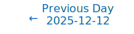
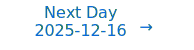

# Personalized Daily ArXiv Papers 2025-12-15

| *[gpt-5]*   | Prompt   | Completion   | Total   |
|:-----------:|:--------:|:------------:|:-------:|
| **Token**   | 22337    | 22900        | 45237   |
| **Cost**    | $0.03    | $0.23        | $0.26   |

Total arXiv papers: 389

Total scanned papers: 190

Total relevant papers: 10

**Table of contents with paper titles:**

1. [Softmax as Linear Attention in the Large-Prompt Regime: a Measure-based Perspective](#user-content-link1)
**Authors:** Etienne Boursier, Claire Boyer

2. [Features Emerge as Discrete States: The First Application of SAEs to 3D Representations](#user-content-link2)
**Authors:** Albert Miao, Chenliang Zhou, Jiawei Zhou, Cengiz Oztireli

3. [Emergence of Nonequilibrium Latent Cycles in Unsupervised Generative Modeling](#user-content-link3)
**Authors:** Marco Baiesi, Alberto Rosso

4. [Gradient Descent as a Perceptron Algorithm: Understanding Dynamics and Implicit Acceleration](#user-content-link4)
**Authors:** Alexander Tyurin

5. [TPV: Parameter Perturbations Through the Lens of Test Prediction Variance](#user-content-link5)
**Authors:** Devansh Arpit

6. [A Simple Generalisation of the Implicit Dynamics of In-Context Learning](#user-content-link6)
**Authors:** Francesco Innocenti, El Mehdi Achour

7. [Stable spectral neural operator for learning stiff PDE systems from limited data](#user-content-link7)
**Authors:** Rui Zhang, Han Wan, Yang Liu, Hao Sun

8. [CogniSNN: Enabling Neuron-Expandability, Pathway-Reusability, and Dynamic-Configurability with Random Graph Architectures in Spiking Neural Networks](#user-content-link8)
**Authors:** Yongsheng Huang, Peibo Duan, Yujie Wu, Kai Sun, Zhipeng Liu, Changsheng Zhang, Bin Zhang, Mingkun Xu

9. [Cognitive Mirrors: Exploring the Diverse Functional Roles of Attention Heads in LLM Reasoning](#user-content-link9)
**Authors:** Xueqi Ma, Jun Wang, Yanbei Jiang, Sarah Monazam Erfani, Tongliang Liu, James Bailey

10. [Fully Inductive Node Representation Learning via Graph View Transformation](#user-content-link10)
**Authors:** Dooho Lee, Myeong Kong, Minho Jeong, Jaemin Yoo

---

## 1. [Softmax as Linear Attention in the Large-Prompt Regime: a Measure-based Perspective](https://arxiv.org/abs/2512.11784) 

**ArXiv ID:** 2512.11784

**Authors:** Etienne Boursier, Claire Boyer

**Abstract:** Softmax attention is a central component of transformer architectures, yet its nonlinear structure poses significant challenges for theoretical analysis. We develop a unified, measure-based framework for studying single-layer softmax attention under both finite and infinite prompts. For i.i.d. Gaussian inputs, we lean on the fact that the softmax operator converges in the infinite-prompt limit to a linear operator acting on the underlying input-token measure. Building on this insight, we establish non-asymptotic concentration bounds for the output and gradient of softmax attention, quantifying how rapidly the finite-prompt model approaches its infinite-prompt counterpart, and prove that this concentration remains stable along the entire training trajectory in general in-context learning settings with sub-Gaussian tokens. In the case of in-context linear regression, we use the tractable infinite-prompt dynamics to analyze training at finite prompt length. Our results allow optimization analyses developed for linear attention to transfer directly to softmax attention when prompts are sufficiently long, showing that large-prompt softmax attention inherits the analytical structure of its linear counterpart. This, in turn, provides a principled and broadly applicable toolkit for studying the training dynamics and statistical behavior of softmax attention layers in large prompt regimes.

**Comment:** Model Architecture: theoretical analysis of softmax attention showing large-prompt linearization with non-asymptotic concentration bounds, enabling training-dynamics analysis.

**Relevance:** 10
**Novelty:** 9

---

## 2. [Features Emerge as Discrete States: The First Application of SAEs to 3D Representations](https://arxiv.org/abs/2512.11263) 

**ArXiv ID:** 2512.11263

**Authors:** Albert Miao, Chenliang Zhou, Jiawei Zhou, Cengiz Oztireli

**Abstract:** Sparse Autoencoders (SAEs) are a powerful dictionary learning technique for decomposing neural network activations, translating the hidden state into human ideas with high semantic value despite no external intervention or guidance. However, this technique has rarely been applied outside of the textual domain, limiting theoretical explorations of feature decomposition. We present the \textbf{first application of SAEs to the 3D domain}, analyzing the features used by a state-of-the-art 3D reconstruction VAE applied to 53k 3D models from the Objaverse dataset. We observe that the network encodes discrete rather than continuous features, leading to our key finding: \textbf{such models approximate a discrete state space, driven by phase-like transitions from feature activations}. Through this state transition framework, we address three otherwise unintuitive behaviors -- the inclination of the reconstruction model towards positional encoding representations, the sigmoidal behavior of reconstruction loss from feature ablation, and the bimodality in the distribution of phase transition points. This final observation suggests the model \textbf{redistributes the interference caused by superposition to prioritize the saliency of different features}. Our work not only compiles and explains unexpected phenomena regarding feature decomposition, but also provides a framework to explain the model's feature learning dynamics. The code and dataset of encoded 3D objects will be available on release.

**Comment:** Matches Representation Learning: applies Sparse Autoencoders (dictionary learning) to 3D activations, revealing discrete state features and training dynamics.

**Relevance:** 9
**Novelty:** 8

---

## 3. [Emergence of Nonequilibrium Latent Cycles in Unsupervised Generative Modeling](https://arxiv.org/abs/2512.11415) 

**ArXiv ID:** 2512.11415

**Authors:** Marco Baiesi, Alberto Rosso

**Abstract:** We show that nonequilibrium dynamics can play a constructive role in unsupervised machine learning by inducing the spontaneous emergence of latent-state cycles. We introduce a model in which visible and hidden variables interact through two independently parametrized transition matrices, defining a Markov chain whose steady state is intrinsically out of equilibrium. Likelihood maximization drives this system toward nonequilibrium steady states with finite entropy production, reduced self-transition probabilities, and persistent probability currents in the latent space. These cycles are not imposed by the architecture but arise from training, and models that develop them avoid the low-log-likelihood regime associated with nearly reversible dynamics while more faithfully reproducing the empirical distribution of data classes. Compared with equilibrium approaches such as restricted Boltzmann machines, our model breaks the detailed balance between the forward and backward conditional transitions and relies on a log-likelihood gradient that depends explicitly on the last two steps of the Markov chain. Hence, this exploration of the interface between nonequilibrium statistical physics and modern machine learning suggests that introducing irreversibility into latent-variable models can enhance generative performance.

**Comment:** Matches Representation Learning/Generative modeling: proposes a nonequilibrium latent-variable architecture breaking detailed balance with theoretical insights into training dynamics.

**Relevance:** 9
**Novelty:** 8

---

## 4. [Gradient Descent as a Perceptron Algorithm: Understanding Dynamics and Implicit Acceleration](https://arxiv.org/abs/2512.11587) 

**ArXiv ID:** 2512.11587

**Authors:** Alexander Tyurin

**Abstract:** Even for the gradient descent (GD) method applied to neural network training, understanding its optimization dynamics, including convergence rate, iterate trajectories, function value oscillations, and especially its implicit acceleration, remains a challenging problem. We analyze nonlinear models with the logistic loss and show that the steps of GD reduce to those of generalized perceptron algorithms (Rosenblatt, 1958), providing a new perspective on the dynamics. This reduction yields significantly simpler algorithmic steps, which we analyze using classical linear algebra tools. Using these tools, we demonstrate on a minimalistic example that the nonlinearity in a two-layer model can provably yield a faster iteration complexity $\tilde{O}(\sqrt{d})$ compared to $\Omega(d)$ achieved by linear models, where $d$ is the number of features. This helps explain the optimization dynamics and the implicit acceleration phenomenon observed in neural networks. The theoretical results are supported by extensive numerical experiments. We believe that this alternative view will further advance research on the optimization of neural networks.

**Comment:** Training dynamics criterion: theoretical analysis linking GD steps to generalized perceptron algorithms, explaining implicit acceleration in nonlinear networks.

**Relevance:** 9
**Novelty:** 8

---

## 5. [TPV: Parameter Perturbations Through the Lens of Test Prediction Variance](https://arxiv.org/abs/2512.11089) 

**ArXiv ID:** 2512.11089

**Authors:** Devansh Arpit

**Abstract:** We identify test prediction variance (TPV) -- the first-order sensitivity of model outputs to parameter perturbations around a trained solution -- as a unifying quantity that links several classical observations about generalization in deep networks. TPV is a fully label-free object whose trace form separates the geometry of the trained model from the specific perturbation mechanism, allowing a broad family of parameter perturbations like SGD noise, label noise, finite-precision noise, and other post-training perturbations to be analyzed under a single framework. Theoretically, we show that TPV estimated on the training set converges to its test-set value in the overparameterized limit, providing the first result that prediction variance under local parameter perturbations can be inferred from training inputs alone. Empirically, TPV exhibits a striking stability across datasets and architectures -- including extremely narrow networks -- and correlates well with clean test loss. Finally, we demonstrate that modeling pruning as a TPV perturbation yields a simple label-free importance measure that performs competitively with state-of-the-art pruning methods, illustrating the practical utility of TPV. Code available at github.com/devansharpit/TPV.

**Comment:** Representation Learning and Compression/Efficiency: introduces label-free test prediction variance linking generalization to parameter perturbations and yields a pruning importance measure.

**Relevance:** 9
**Novelty:** 8

---

## 6. [A Simple Generalisation of the Implicit Dynamics of In-Context Learning](https://arxiv.org/abs/2512.11255) 

**ArXiv ID:** 2512.11255

**Authors:** Francesco Innocenti, El Mehdi Achour

**Abstract:** In-context learning (ICL) refers to the ability of a model to learn new tasks from examples in its input without any parameter updates. In contrast to previous theories of ICL relying on toy models and data settings, recently it has been shown that an abstraction of a transformer block can be seen as implicitly updating the weights of its feedforward network according to the context (Dherin et al., 2025). Here, we provide a simple generalisation of this result for (i) all sequence positions beyond the last, (ii) any transformer block beyond the first, and (iii) more realistic residual blocks including layer normalisation. We empirically verify our theory on simple in-context linear regression tasks and investigate the relationship between the implicit updates related to different tokens within and between blocks. These results help to bring the theory of Dherin et al. (2025) even closer to practice, with potential for validation on large-scale models.

**Comment:** Model Architecture: theoretical extension of implicit weight-update dynamics in transformer blocks (ICL) across layers/positions with layer normalization.

**Relevance:** 9
**Novelty:** 7

---

## 7. [Stable spectral neural operator for learning stiff PDE systems from limited data](https://arxiv.org/abs/2512.11686) 

**ArXiv ID:** 2512.11686

**Authors:** Rui Zhang, Han Wan, Yang Liu, Hao Sun

**Abstract:** Accurate modeling of spatiotemporal dynamics is crucial to understanding complex phenomena across science and engineering. However, this task faces a fundamental challenge when the governing equations are unknown and observational data are sparse. System stiffness, the coupling of multiple time-scales, further exacerbates this problem and hinders long-term prediction. Existing methods fall short: purely data-driven methods demand massive datasets, whereas physics-aware approaches are constrained by their reliance on known equations and fine-grained time steps. To overcome these limitations, we introduce an equation-free learning framework, namely, the Stable Spectral Neural Operator (SSNO), for modeling stiff partial differential equation (PDE) systems based on limited data. Instead of encoding specific equation terms, SSNO embeds spectrally inspired structures in its architecture, yielding strong inductive biases for learning the underlying physics. It automatically learns local and global spatial interactions in the frequency domain, while handling system stiffness with a robust integrating factor time-stepping scheme. Demonstrated across multiple 2D and 3D benchmarks in Cartesian and spherical geometries, SSNO achieves prediction errors one to two orders of magnitude lower than leading models. Crucially, it shows remarkable data efficiency, requiring only very few (2--5) training trajectories for robust generalization to out-of-distribution conditions. This work offers a robust and generalizable approach to learning stiff spatiotemporal dynamics from limited data without explicit \textit{a priori} knowledge of PDE terms.

**Comment:** Model architecture criterion: Stable Spectral Neural Operator with integrating-factor time-stepping embeds spectral inductive biases for stiff PDEs under limited data.

**Relevance:** 8
**Novelty:** 8

---

## 8. [CogniSNN: Enabling Neuron-Expandability, Pathway-Reusability, and Dynamic-Configurability with Random Graph Architectures in Spiking Neural Networks](https://arxiv.org/abs/2512.11743) 

**ArXiv ID:** 2512.11743

**Authors:** Yongsheng Huang, Peibo Duan, Yujie Wu, Kai Sun, Zhipeng Liu, Changsheng Zhang, Bin Zhang, Mingkun Xu

**Abstract:** Spiking neural networks (SNNs), regarded as the third generation of artificial neural networks, are expected to bridge the gap between artificial intelligence and computational neuroscience. However, most mainstream SNN research directly adopts the rigid, chain-like hierarchical architecture of traditional artificial neural networks (ANNs), ignoring key structural characteristics of the brain. Biological neurons are stochastically interconnected, forming complex neural pathways that exhibit Neuron-Expandability, Pathway-Reusability, and Dynamic-Configurability. In this paper, we introduce a new SNN paradigm, named Cognition-aware SNN (CogniSNN), by incorporating Random Graph Architecture (RGA). Furthermore, we address the issues of network degradation and dimensional mismatch in deep pathways by introducing an improved pure spiking residual mechanism alongside an adaptive pooling strategy. Then, we design a Key Pathway-based Learning without Forgetting (KP-LwF) approach, which selectively reuses critical neural pathways while retaining historical knowledge, enabling efficient multi-task transfer. Finally, we propose a Dynamic Growth Learning (DGL) algorithm that allows neurons and synapses to grow dynamically along the internal temporal dimension. Extensive experiments demonstrate that CogniSNN achieves performance comparable to, or even surpassing, current state-of-the-art SNNs on neuromorphic datasets and Tiny-ImageNet. The Pathway-Reusability enhances the network's continuous learning capability across different scenarios, while the dynamic growth algorithm improves robustness against interference and mitigates the fixed-timestep constraints during neuromorphic chip deployment. This work demonstrates the potential of SNNs with random graph structures in advancing brain-inspired intelligence and lays the foundation for their practical application on neuromorphic hardware.

**Comment:** Matches Model Architecture (dynamic/conditional networks): introduces random graph SNN architectures with dynamic growth and residual mechanisms.

**Relevance:** 8
**Novelty:** 7

---

## 9. [Cognitive Mirrors: Exploring the Diverse Functional Roles of Attention Heads in LLM Reasoning](https://arxiv.org/abs/2512.10978) 

**ArXiv ID:** 2512.10978

**Authors:** Xueqi Ma, Jun Wang, Yanbei Jiang, Sarah Monazam Erfani, Tongliang Liu, James Bailey

**Abstract:** Large language models (LLMs) have achieved state-of-the-art performance in a variety of tasks, but remain largely opaque in terms of their internal mechanisms. Understanding these mechanisms is crucial to improve their reasoning abilities. Drawing inspiration from the interplay between neural processes and human cognition, we propose a novel interpretability framework to systematically analyze the roles and behaviors of attention heads, which are key components of LLMs. We introduce CogQA, a dataset that decomposes complex questions into step-by-step subquestions with a chain-of-thought design, each associated with specific cognitive functions such as retrieval or logical reasoning. By applying a multi-class probing method, we identify the attention heads responsible for these functions. Our analysis across multiple LLM families reveals that attention heads exhibit functional specialization, characterized as cognitive heads. These cognitive heads exhibit several key properties: they are universally sparse, vary in number and distribution across different cognitive functions, and display interactive and hierarchical structures. We further show that cognitive heads play a vital role in reasoning tasks - removing them leads to performance degradation, while augmenting them enhances reasoning accuracy. These insights offer a deeper understanding of LLM reasoning and suggest important implications for model design, training, and fine-tuning strategies.

**Comment:** Matches Representation Learning/interpretability: analyzes functional specialization of Transformer attention heads and their role in reasoning.

**Relevance:** 8
**Novelty:** 7

---

## 10. [Fully Inductive Node Representation Learning via Graph View Transformation](https://arxiv.org/abs/2512.11561) 

**ArXiv ID:** 2512.11561

**Authors:** Dooho Lee, Myeong Kong, Minho Jeong, Jaemin Yoo

**Abstract:** Generalizing a pretrained model to unseen datasets without retraining is an essential step toward a foundation model. However, achieving such cross-dataset, fully inductive inference is difficult in graph-structured data where feature spaces vary widely in both dimensionality and semantics. Any transformation in the feature space can easily violate the inductive applicability to unseen datasets, strictly limiting the design space of a graph model. In this work, we introduce the view space, a novel representational axis in which arbitrary graphs can be naturally encoded in a unified manner. We then propose Graph View Transformation (GVT), a node- and feature-permutation-equivariant mapping in the view space. GVT serves as the building block for Recurrent GVT, a fully inductive model for node representation learning. Pretrained on OGBN-Arxiv and evaluated on 27 node-classification benchmarks, Recurrent GVT outperforms GraphAny, the prior fully inductive graph model, by +8.93% and surpasses 12 individually tuned GNNs by at least +3.30%. These results establish the view space as a principled and effective ground for fully inductive node representation learning.

**Comment:** Model Architecture: permutation-equivariant Graph View Transformation and recurrent design enabling fully inductive cross-dataset node representation learning.

**Relevance:** 8
**Novelty:** 7

---

# Paper Selection Prompt

## System Prompt

> You are a helpful paper reading assistant whose job is to read daily posts from ArXiv and identify a few papers that your friend will enjoy reading.
> Your job is to carefully read the paper titles and abstracts below and find the ones that match the criteria below.

## User Prompt

> ## Instructions
> 
> Write the response in JSONL format with {ARXIVID, COMMENT, RELEVANCE, NOVELTY} on each line, one for each paper.
> 
> - ARXIVID: should be the ArXiv ID.
> - COMMENT: should identify whether there is a criteria that match the paper very closely. These matches should not be based on general terms like "language modeling" or "advancements" and should specifically refer to a criterion. No need to mention the non-matching criteria.
> - RELEVANCE: should be a score from 1-10.
> - NOVELTY: should be a score from 1-10.
> 
> ## Scoring Criteria
> 
> > The "Relevance" score measures how closely the paper aligns with the core topics of the prompt.
> > The "Novelty" score assesses the originality and impact of the paper.
> > They are two **ORTHONORMAL** axes and **SHOULD NOT** be confused with each other.
> 
> ### Relevance Scoring
> 
> - Relevance 9-10 (Completely Relevant)
>   - Focus: Fully aligned with core topics with no deviation, score the highest if contains relevant keywords in it.
>   - Examples: Papers focused on foundational methods or theoretical research, whose titles contain topic keywords like "MoE".
> 
> - Relevance 7-8 (Relevant)
>   - Focus: Retain a solid link to the main research area, though may touch on peripheral elements.
>   - Examples: Papers research on the fundamental part of MoE through a less critical aspect like its behavior in GNN.
> 
> - Relevance 5-6 (Borderline)
>   - Focus: Maintains a link to the core topic but also extends into at least one other domain/area beyond the primary focus.
>   - Examples: Work referencing MoE centered on reinforcement learning.
> 
> - Relevance 3-4 (Irrelevant)
>   - Focus: Largely outside our interests with no association to our topics.
>   - Examples: Application-focused papers like using MoE to solve a problem in the real world.
> 
> - Relevance 1-2 (Ignore)
>   - Focus: Purely unrelated to our topics. Completely a different domain.
>   - **Exception**: If the paper hints at a cutting-edge, radically new direction that could eventually transform the primary domain, consider a score of 9–10 despite initial appearances. (Usually a very rare concept that belongs to the fundamental research)
> 
> ### Novelty Scoring
> 
> - Novelty 9-10 (Breakthrough)
>   - Definition: Groundbreaking methods/theory introducing new directions or solving major challenges.
>   - Examples: Entirely new paradigm for foundational models; a novel theory transforming representation learning.
> 
> - Novelty 7-8 (Improvements)
>   - Definition: Substantial insights/enhancements, though not a full paradigm shift.
>   - Examples: Modifications on existing methods yielding significantly better results.
> 
> - Novelty 5-6 (Borderline)
>   - Definition: Incremental contributions with possible long-term benefits, not immediately transformative.
>   - Examples: Moderately novel extension to an existing architecture; refining current methods without fundamentally altering them.
> 
> - Novelty 3-4 (Tangential)
>   - Definition: Minor or domain-specific improvements with limited broader impact.
>   - Examples: Slight modifications to known methods with strange motivation; purely engineering jobs like a new benchmark/dataset.
> 
> - Novelty 1-2 (Low)
>   - Definition: Minimal originality, applying standard approaches without real innovation.
>   - Examples: Using an off-the-shelf model without adding new insights; purely application-driven studies like finetuning a pretrained model using existing methods.
> 
> ## Papers
> 
> [PAPER LIST HERE]
> 
> ## Relevant Topics
> 
> Use the following relevance criteria to focus on foundational research. Keep **relevant** papers and filter out **irrelevant** ones. Avoid purely **application-driven** work.
> 
> 1. Model Architecture
>    - Relevant: Mixture-of-Experts (MoE), Transformers, Conditional/Dynamic Networks, Autoencoders, analysis/innovations on existing architectures.
>    - Irrelevant: Merely using existing architectures for a certain task without insights into the structure themselves.
> 
> 2. Model Compression and Efficiency
>    - Relevant: Sparsity, pruning, quantization, low-rank approaches, cache, or other algorithmic/theoretical efficiency breakthroughs.
>    - Irrelevant: Straightforward applications of existing compression methods to new tasks.
> 
> 3. High Performance Computing
>    - Relevant: Algorithmic or systems-level innovations enabling training of large-scale models, distributed training techniques, memory optimization.
>    - Irrelevant: Incremental engineering improvements without novel algorithmic contributions.
> 
> 4. Representation Learning
>    - Relevant: Insights into how deep networks encode information, feature/dictionary learning, sparse/contrastive methods, training dynamics in neural networks.
>    - Irrelevant: Standard applications of known techniques lacking new theoretical or methodological contributions.
> 
> **Keywords:**
> 
> - Relevant: Mixture of Experts (MoE), Representation Learning, Compression/Efficiency, Sparse/Sparsity, Pruning, Quantization, Low-rank, Foundation Model, etc.
> - Irrelevant: Reinforcement Learning, Transfer Learning, Federated Learning, Online Learning, Diffusion Models, etc.
> - Application: Image Segmentation, Medical Imaging, 3D Vision, Video Understanding, Information Retrieval, Summarization, Recommendation Systems, Machine Translation, Speech Recognition, Signal Processing, Spatial/Temporal Modeling, Time Series, Knowledge Graph, etc.