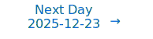

# Personalized Daily ArXiv Papers 2025-12-22

| *[gpt-5]*   | Prompt   | Completion   | Total   |
|:-----------:|:--------:|:------------:|:-------:|
| **Token**   | 23313    | 26570        | 49883   |
| **Cost**    | $0.03    | $0.27        | $0.29   |

Total arXiv papers: 394

Total scanned papers: 232

Total relevant papers: 12

**Table of contents with paper titles:**

1. [Learning What to Write: Write-Gated KV for Efficient Long-Context Inference](#user-content-link1)
**Authors:** Yen-Chieh Huang, Rui Fang, Ming-Syan Chen, Pi-Cheng Hsiu

2. [A Unified Representation of Neural Networks Architectures](#user-content-link2)
**Authors:** Christophe Prieur, Mircea Lazar, Bogdan Robu

3. [Bandwidth-Efficient Adaptive Mixture-of-Experts via Low-Rank Compensation](#user-content-link3)
**Authors:** Zhenyu Liu, Yunzhen Liu, Zehao Fan, Garrett Gagnon, Yayue Hou, Nan Wu, Yangwook Kang, Liu Liu

4. [GreedySnake: Accelerating SSD-Offloaded LLM Training with Efficient Scheduling and Optimizer Step Overlapping](#user-content-link4)
**Authors:** Yikang Yue, Yishu Yin, Xuehai Qian

5. [Bridging Training and Merging Through Momentum-Aware Optimization](#user-content-link5)
**Authors:** Alireza Moayedikia, Alicia Troncoso

6. [InfoTok: Adaptive Discrete Video Tokenizer via Information-Theoretic Compression](#user-content-link6)
**Authors:** Haotian Ye, Qiyuan He, Jiaqi Han, Puheng Li, Jiaojiao Fan, Zekun Hao, Fitsum Reda, Yogesh Balaji, Huayu Chen, Sheng Liu, Angela Yao, James Zou, Stefano Ermon, Haoxiang Wang, Ming-Yu Liu

7. [Disentangled representations via score-based variational autoencoders](#user-content-link7)
**Authors:** Benjamin S. H. Lyo, Eero P. Simoncelli, Cristina Savin

8. [Smoothing DiLoCo with Primal Averaging for Faster Training of LLMs](#user-content-link8)
**Authors:** Aaron Defazio, Konstantin Mishchenko, Parameswaran Raman, Hao-Jun Michael Shi, Lin Xiao

9. [Mitigating Forgetting in Low Rank Adaptation](#user-content-link9)
**Authors:** Joanna Sliwa, Frank Schneider, Philipp Hennig, Jose Miguel Hernandez-Lobato

10. [Dion2: A Simple Method to Shrink Matrix in Muon](#user-content-link10)
**Authors:** Kwangjun Ahn, Noah Amsel, John Langford

11. [Enabling Disaggregated Multi-Stage MLLM Inference via GPU-Internal Scheduling and Resource Sharing](#user-content-link11)
**Authors:** Lingxiao Zhao, Haoran Zhou, Yuezhi Che, Dazhao Cheng

12. [DeepShare: Sharing ReLU Across Channels and Layers for Efficient Private Inference](#user-content-link12)
**Authors:** Yonathan Bornfeld, Shai Avidan

---

## 1. [Learning What to Write: Write-Gated KV for Efficient Long-Context Inference](https://arxiv.org/abs/2512.17452) 

**ArXiv ID:** 2512.17452

**Authors:** Yen-Chieh Huang, Rui Fang, Ming-Syan Chen, Pi-Cheng Hsiu

**Abstract:** Long-context LLM inference is bottlenecked by the quadratic attention complexity and linear KV cache growth. Prior approaches mitigate this via post-hoc selection or eviction but overlook the root inefficiency: indiscriminate writing to persistent memory. In this paper, we formalize KV cache management as a causal system of three primitives: KV Admission, Selection, and Eviction. We instantiate KV Admission via Write-Gated KV, a lightweight mechanism that learns to predict token utility before it enters the cache. By filtering out low-utility states early to maintain a compact global cache alongside a sliding local cache, Write-Gated KV reduces memory usage by 46-57% and delivers 3.03-3.45$\times$ prefill and 1.89-2.56$\times$ decode speedups on Llama model with negligible accuracy loss, all while remaining compatible with FlashAttention and paged-KV systems. These results demonstrate that learning what to write, is a principled and practical recipe for efficient long-context inference. Code is available at https://github.com/EMCLab-Sinica/WG-KV .

**Comment:** Transformer efficiency: learned KV admission (write-gated KV) and compact global+local cache to reduce KV size and attention cost—cache/memory optimization for long-context inference.

**Relevance:** 10
**Novelty:** 8

---

## 2. [A Unified Representation of Neural Networks Architectures](https://arxiv.org/abs/2512.17593) 

**ArXiv ID:** 2512.17593

**Authors:** Christophe Prieur, Mircea Lazar, Bogdan Robu

**Abstract:** In this paper we consider the limiting case of neural networks (NNs) architectures when the number of neurons in each hidden layer and the number of hidden layers tend to infinity thus forming a continuum, and we derive approximation errors as a function of the number of neurons and/or hidden layers. Firstly, we consider the case of neural networks with a single hidden layer and we derive an integral infinite width neural representation that generalizes existing continuous neural networks (CNNs) representations. Then we extend this to deep residual CNNs that have a finite number of integral hidden layers and residual connections. Secondly, we revisit the relation between neural ODEs and deep residual NNs and we formalize approximation errors via discretization techniques. Then, we merge these two approaches into a unified homogeneous representation of NNs as a Distributed Parameter neural Network (DiPaNet) and we show that most of the existing finite and infinite-dimensional NNs architectures are related via homogeneization/discretization with the DiPaNet representation. Our approach is purely deterministic and applies to general, uniformly continuous matrix weight functions. Differences and similarities with neural fields are discussed along with further possible generalizations and applications of the DiPaNet framework.

**Comment:** Foundational architecture theory: unified continuum representation (DiPaNet) linking infinite width/depth, residual nets, and neural ODEs with approximation error analysis.

**Relevance:** 10
**Novelty:** 8

---

## 3. [Bandwidth-Efficient Adaptive Mixture-of-Experts via Low-Rank Compensation](https://arxiv.org/abs/2512.17073) 

**ArXiv ID:** 2512.17073

**Authors:** Zhenyu Liu, Yunzhen Liu, Zehao Fan, Garrett Gagnon, Yayue Hou, Nan Wu, Yangwook Kang, Liu Liu

**Abstract:** Mixture-of-Experts (MoE) models scale capacity via sparse activation but stress memory and bandwidth. Offloading alleviates GPU memory by fetching experts on demand, yet token-level routing causes irregular transfers that make inference I/O-bound. Static uniform quantization reduces traffic but degrades accuracy under aggressive compression by ignoring expert heterogeneity. We present Bandwidth-Efficient Adaptive Mixture-of-Experts via Low-Rank Compensation, which performs router-guided precision restoration using precomputed low-rank compensators. At inference time, our method transfers compact low-rank factors with Top-n (n<k) experts per token and applies compensation to them, keeping others low-bit. Integrated with offloading on GPU and GPU-NDP systems, our method delivers a superior bandwidth-accuracy trade-off and improved throughput.

**Comment:** Model Architecture (Mixture-of-Experts) + Model Compression/Efficiency — router-guided low-rank compensation with quantization/offloading to cut bandwidth while preserving accuracy.

**Relevance:** 10
**Novelty:** 8

---

## 4. [GreedySnake: Accelerating SSD-Offloaded LLM Training with Efficient Scheduling and Optimizer Step Overlapping](https://arxiv.org/abs/2512.17570) 

**ArXiv ID:** 2512.17570

**Authors:** Yikang Yue, Yishu Yin, Xuehai Qian

**Abstract:** SSD-offloaded training offers a practical and promising approach to making LLM training cost-effective. Building on gradient accumulation with micro-batches, this paper introduces GreedySnake, a new SSD-offloaded training system that employs vertical scheduling, which executes all microbatches of a layer before proceeding to the next. Compared to existing systems that use horizontal scheduling (i.e., executing micro-batches sequentially), GreedySnake achieves higher training throughput with smaller batch sizes, bringing the system much closer to the ideal scenario predicted by the roofline model. To further mitigate the I/O bottleneck, GreedySnake overlaps part of the optimization step with the forward pass of the next iteration. Experimental results on A100 GPUs show that GreedySnake achieves saturated training throughput improvements over ZeRO-Infinity: 1.96x on 1 GPU and 1.93x on 4 GPUs for GPT-65B, and 2.53x on 1 GPU for GPT-175B. The code is open-sourced at https://github.com/npz7yyk/GreedySnake

**Comment:** Systems/HPC contribution: SSD-offloaded LLM training with vertical micro-batch scheduling and optimizer-step overlap for memory/throughput optimization.

**Relevance:** 9
**Novelty:** 8

---

## 5. [Bridging Training and Merging Through Momentum-Aware Optimization](https://arxiv.org/abs/2512.17109) 

**ArXiv ID:** 2512.17109

**Authors:** Alireza Moayedikia, Alicia Troncoso

**Abstract:** Training large neural networks and merging task-specific models both exploit low-rank structure and require parameter importance estimation, yet these challenges have been pursued in isolation. Current workflows compute curvature information during training, discard it, then recompute similar information for merging -- wasting computation and discarding valuable trajectory data. We introduce a unified framework that maintains factorized momentum and curvature statistics during training, then reuses this information for geometry-aware model composition. The proposed method achieves memory efficiency comparable to state-of-the-art approaches while accumulating task saliency scores that enable curvature-aware merging without post-hoc Fisher computation. We establish convergence guarantees for non-convex objectives with approximation error bounded by gradient singular value decay. On natural language understanding benchmarks, curvature-aware parameter selection outperforms magnitude-only baselines across all sparsity levels, with multi-task merging improving over strong baselines. The proposed framework exhibits rank-invariant convergence and superior hyperparameter robustness compared to existing low-rank optimizers. By treating the optimization trajectory as a reusable asset rather than discarding it, our approach eliminates redundant computation while enabling more principled model composition.

**Comment:** Momentum/curvature-aware optimization that preserves factorized statistics for curvature-aware model merging—low-rank optimization and efficient model composition.

**Relevance:** 9
**Novelty:** 8

---

## 6. [InfoTok: Adaptive Discrete Video Tokenizer via Information-Theoretic Compression](https://arxiv.org/abs/2512.16975) 

**ArXiv ID:** 2512.16975

**Authors:** Haotian Ye, Qiyuan He, Jiaqi Han, Puheng Li, Jiaojiao Fan, Zekun Hao, Fitsum Reda, Yogesh Balaji, Huayu Chen, Sheng Liu, Angela Yao, James Zou, Stefano Ermon, Haoxiang Wang, Ming-Yu Liu

**Abstract:** Accurate and efficient discrete video tokenization is essential for long video sequences processing. Yet, the inherent complexity and variable information density of videos present a significant bottleneck for current tokenizers, which rigidly compress all content at a fixed rate, leading to redundancy or information loss. Drawing inspiration from Shannon's information theory, this paper introduces InfoTok, a principled framework for adaptive video tokenization. We rigorously prove that existing data-agnostic training methods are suboptimal in representation length, and present a novel evidence lower bound (ELBO)-based algorithm that approaches theoretical optimality. Leveraging this framework, we develop a transformer-based adaptive compressor that enables adaptive tokenization. Empirical results demonstrate state-of-the-art compression performance, saving 20% tokens without influence on performance, and achieving 2.3x compression rates while still outperforming prior heuristic adaptive approaches. By allocating tokens according to informational richness, InfoTok enables a more compressed yet accurate tokenization for video representation, offering valuable insights for future research.

**Comment:** Model Compression and Efficiency: introduces an ELBO-based adaptive video tokenization framework that reduces token budget; Model Architecture: transformer-based adaptive compressor for variable-rate discrete tokens.

**Relevance:** 9
**Novelty:** 8

---

## 7. [Disentangled representations via score-based variational autoencoders](https://arxiv.org/abs/2512.17127) 

**ArXiv ID:** 2512.17127

**Authors:** Benjamin S. H. Lyo, Eero P. Simoncelli, Cristina Savin

**Abstract:** We present the Score-based Autoencoder for Multiscale Inference (SAMI), a method for unsupervised representation learning that combines the theoretical frameworks of diffusion models and VAEs. By unifying their respective evidence lower bounds, SAMI formulates a principled objective that learns representations through score-based guidance of the underlying diffusion process. The resulting representations automatically capture meaningful structure in the data: it recovers ground truth generative factors in our synthetic dataset, learns factorized, semantic latent dimensions from complex natural images, and encodes video sequences into latent trajectories that are straighter than those of alternative encoders, despite training exclusively on static images. Furthermore, SAMI can extract useful representations from pre-trained diffusion models with minimal additional training. Finally, the explicitly probabilistic formulation provides new ways to identify semantically meaningful axes in the absence of supervised labels, and its mathematical exactness allows us to make formal statements about the nature of the learned representation. Overall, these results indicate that implicit structural information in diffusion models can be made explicit and interpretable through synergistic combination with a variational autoencoder.

**Comment:** Representation Learning: unifies diffusion and VAE ELBOs in a score-based autoencoder to learn interpretable, disentangled latent representations.

**Relevance:** 9
**Novelty:** 8

---

## 8. [Smoothing DiLoCo with Primal Averaging for Faster Training of LLMs](https://arxiv.org/abs/2512.17131) 

**ArXiv ID:** 2512.17131

**Authors:** Aaron Defazio, Konstantin Mishchenko, Parameswaran Raman, Hao-Jun Michael Shi, Lin Xiao

**Abstract:** We propose Generalized Primal Averaging (GPA), an extension of Nesterov's method in its primal averaging formulation that addresses key limitations of recent averaging-based optimizers such as single-worker DiLoCo and Schedule-Free (SF) in the non-distributed setting. These two recent algorithmic approaches improve the performance of base optimizers, such as AdamW, through different iterate averaging strategies. Schedule-Free explicitly maintains a uniform average of past weights, while single-worker DiLoCo performs implicit averaging by periodically aggregating trajectories, called pseudo-gradients, to update the model parameters. However, single-worker DiLoCo's periodic averaging introduces a two-loop structure, increasing its memory requirements and number of hyperparameters. GPA overcomes these limitations by decoupling the interpolation constant in the primal averaging formulation of Nesterov. This decoupling enables GPA to smoothly average iterates at every step, generalizing and improving upon single-worker DiLoCo. Empirically, GPA consistently outperforms single-worker DiLoCo while removing the two-loop structure, simplifying hyperparameter tuning, and reducing its memory overhead to a single additional buffer. On the Llama-160M model, GPA provides a 24.22% speedup in terms of steps to reach the baseline (AdamW's) validation loss. Likewise, GPA achieves speedups of 12% and 27% on small and large batch setups, respectively, to attain AdamW's validation accuracy on the ImageNet ViT workload. Furthermore, we prove that for any base optimizer with regret bounded by $O(\sqrt{T})$, where $T$ is the number of iterations, GPA can match or exceed the convergence guarantee of the original optimizer, depending on the choice of interpolation constants.

**Comment:** High Performance Computing — optimizer-level innovation (Generalized Primal Averaging) that accelerates LLM training with reduced memory and convergence guarantees.

**Relevance:** 9
**Novelty:** 8

---

## 9. [Mitigating Forgetting in Low Rank Adaptation](https://arxiv.org/abs/2512.17720) 

**ArXiv ID:** 2512.17720

**Authors:** Joanna Sliwa, Frank Schneider, Philipp Hennig, Jose Miguel Hernandez-Lobato

**Abstract:** Parameter-efficient fine-tuning methods, such as Low-Rank Adaptation (LoRA), enable fast specialization of large pre-trained models to different downstream applications. However, this process often leads to catastrophic forgetting of the model's prior domain knowledge. We address this issue with LaLoRA, a weight-space regularization technique that applies a Laplace approximation to Low-Rank Adaptation. Our approach estimates the model's confidence in each parameter and constrains updates in high-curvature directions, preserving prior knowledge while enabling efficient target-domain learning. By applying the Laplace approximation only to the LoRA weights, the method remains lightweight. We evaluate LaLoRA by fine-tuning a Llama model for mathematical reasoning and demonstrate an improved learning-forgetting trade-off, which can be directly controlled via the method's regularization strength. We further explore different loss landscape curvature approximations for estimating parameter confidence, analyze the effect of the data used for the Laplace approximation, and study robustness across hyperparameters.

**Comment:** Parameter-efficient fine-tuning: Low-Rank Adaptation with Laplace-based weight-space regularization to mitigate forgetting—low-rank/PEFT and training dynamics.

**Relevance:** 9
**Novelty:** 7

---

## 10. [Dion2: A Simple Method to Shrink Matrix in Muon](https://arxiv.org/abs/2512.16928) 

**ArXiv ID:** 2512.16928

**Authors:** Kwangjun Ahn, Noah Amsel, John Langford

**Abstract:** The Muon optimizer enjoys strong empirical performance and theoretical grounding. However, the super-linear cost of its orthonormalization step introduces increasing overhead with scale. To alleviate this cost, several works have attempted to reduce the size of the matrix entering the orthonormalization step. We introduce Dion2, a much simpler method for shrinking the matrix involved in Muon's computation compared to prior approaches. At a high level, Dion2 selects a fraction of rows or columns at each iteration and orthonormalizes only those. This sampling procedure makes the update sparse, reducing both computation and communication costs which in turn improves the scalability of Muon.

**Comment:** Optimizer efficiency: Shrinks Muon’s orthonormalization step via sampled rows/columns, inducing sparse updates to reduce compute/communication costs.

**Relevance:** 9
**Novelty:** 7

---

## 11. [Enabling Disaggregated Multi-Stage MLLM Inference via GPU-Internal Scheduling and Resource Sharing](https://arxiv.org/abs/2512.17574) 

**ArXiv ID:** 2512.17574

**Authors:** Lingxiao Zhao, Haoran Zhou, Yuezhi Che, Dazhao Cheng

**Abstract:** Multimodal large language models (MLLMs) extend LLMs with visual understanding through a three-stage pipeline: multimodal preprocessing, vision encoding, and LLM inference. While these stages enhance capability, they introduce significant system bottlenecks. First, multimodal preprocessing-especially video decoding-often dominates Time-to-First-Token (TTFT). Most systems rely on CPU-based decoding, which severely limits throughput, while existing GPU-based approaches prioritize throughput-oriented parallelism and fail to meet the latency-sensitive requirements of MLLM inference. Second, the vision encoder is a standalone, compute-intensive stage that produces visual embeddings and cannot be co-batched with LLM prefill or decoding. This heterogeneity forces inter-stage blocking and increases token-generation latency. Even when deployed on separate GPUs, these stages underutilize available compute and memory resources, reducing overall utilization and constraining system throughput.   To address these challenges, we present FlashCodec and UnifiedServe, two complementary designs that jointly optimize the end-to-end MLLM pipeline. FlashCodec accelerates the multimodal preprocessing stage through collaborative multi-GPU video decoding, reducing decoding latency while preserving high throughput. UnifiedServe optimizes the vision-to-text and inference stages using a logically decoupled their execution to eliminate inter-stage blocking, yet physically sharing GPU resources to maximize GPU system utilization. By carefully orchestrating execution across stages and minimizing interference, UnifiedServe Together, our proposed framework forms an end-to-end optimized stack that can serve up to 3.0$\times$ more requests or enforce 1.5$\times$ tighter SLOs, while achieving up to 4.4$\times$ higher throughput compared to state-of-the-art systems.

**Comment:** Systems-level inference optimization: GPU-internal scheduling and resource sharing across multimodal preprocessing, vision encoding, and LLM inference to reduce latency and improve utilization.

**Relevance:** 8
**Novelty:** 7

---

## 12. [DeepShare: Sharing ReLU Across Channels and Layers for Efficient Private Inference](https://arxiv.org/abs/2512.17398) 

**ArXiv ID:** 2512.17398

**Authors:** Yonathan Bornfeld, Shai Avidan

**Abstract:** Private Inference (PI) uses cryptographic primitives to perform privacy preserving machine learning. In this setting, the owner of the network runs inference on the data of the client without learning anything about the data and without revealing any information about the model. It has been observed that a major computational bottleneck of PI is the calculation of the gate (i.e., ReLU), so a considerable amount of effort have been devoted to reducing the number of ReLUs in a given network.   We focus on the DReLU, which is the non-linear step function of the ReLU and show that one DReLU can serve many ReLU operations. We suggest a new activation module where the DReLU operation is only performed on a subset of the channels (Prototype channels), while the rest of the channels (replicate channels) replicates the DReLU of each of their neurons from the corresponding neurons in one of the prototype channels. We then extend this idea to work across different layers.   We show that this formulation can drastically reduce the number of DReLU operations in resnet type network. Furthermore, our theoretical analysis shows that this new formulation can solve an extended version of the XOR problem, using just one non-linearity and two neurons, something that traditional formulations and some PI specific methods cannot achieve. We achieve new SOTA results on several classification setups, and achieve SOTA results on image segmentation.

**Comment:** Model Compression and Efficiency: architectural sharing of DReLU across channels and layers to cut expensive non-linear operations in private inference, with expressivity analysis.

**Relevance:** 8
**Novelty:** 7

---

# Paper Selection Prompt

## System Prompt

> You are a helpful paper reading assistant whose job is to read daily posts from ArXiv and identify a few papers that your friend will enjoy reading.
> Your job is to carefully read the paper titles and abstracts below and find the ones that match the criteria below.

## User Prompt

> ## Instructions
> 
> Write the response in JSONL format with {ARXIVID, COMMENT, RELEVANCE, NOVELTY} on each line, one for each paper.
> 
> - ARXIVID: should be the ArXiv ID.
> - COMMENT: should identify whether there is a criteria that match the paper very closely. These matches should not be based on general terms like "language modeling" or "advancements" and should specifically refer to a criterion. No need to mention the non-matching criteria.
> - RELEVANCE: should be a score from 1-10.
> - NOVELTY: should be a score from 1-10.
> 
> ## Scoring Criteria
> 
> > The "Relevance" score measures how closely the paper aligns with the core topics of the prompt.
> > The "Novelty" score assesses the originality and impact of the paper.
> > They are two **ORTHONORMAL** axes and **SHOULD NOT** be confused with each other.
> 
> ### Relevance Scoring
> 
> - Relevance 9-10 (Completely Relevant)
>   - Focus: Fully aligned with core topics with no deviation, score the highest if contains relevant keywords in it.
>   - Examples: Papers focused on foundational methods or theoretical research, whose titles contain topic keywords like "MoE".
> 
> - Relevance 7-8 (Relevant)
>   - Focus: Retain a solid link to the main research area, though may touch on peripheral elements.
>   - Examples: Papers research on the fundamental part of MoE through a less critical aspect like its behavior in GNN.
> 
> - Relevance 5-6 (Borderline)
>   - Focus: Maintains a link to the core topic but also extends into at least one other domain/area beyond the primary focus.
>   - Examples: Work referencing MoE centered on reinforcement learning.
> 
> - Relevance 3-4 (Irrelevant)
>   - Focus: Largely outside our interests with no association to our topics.
>   - Examples: Application-focused papers like using MoE to solve a problem in the real world.
> 
> - Relevance 1-2 (Ignore)
>   - Focus: Purely unrelated to our topics. Completely a different domain.
>   - **Exception**: If the paper hints at a cutting-edge, radically new direction that could eventually transform the primary domain, consider a score of 9–10 despite initial appearances. (Usually a very rare concept that belongs to the fundamental research)
> 
> ### Novelty Scoring
> 
> - Novelty 9-10 (Breakthrough)
>   - Definition: Groundbreaking methods/theory introducing new directions or solving major challenges.
>   - Examples: Entirely new paradigm for foundational models; a novel theory transforming representation learning.
> 
> - Novelty 7-8 (Improvements)
>   - Definition: Substantial insights/enhancements, though not a full paradigm shift.
>   - Examples: Modifications on existing methods yielding significantly better results.
> 
> - Novelty 5-6 (Borderline)
>   - Definition: Incremental contributions with possible long-term benefits, not immediately transformative.
>   - Examples: Moderately novel extension to an existing architecture; refining current methods without fundamentally altering them.
> 
> - Novelty 3-4 (Tangential)
>   - Definition: Minor or domain-specific improvements with limited broader impact.
>   - Examples: Slight modifications to known methods with strange motivation; purely engineering jobs like a new benchmark/dataset.
> 
> - Novelty 1-2 (Low)
>   - Definition: Minimal originality, applying standard approaches without real innovation.
>   - Examples: Using an off-the-shelf model without adding new insights; purely application-driven studies like finetuning a pretrained model using existing methods.
> 
> ## Papers
> 
> [PAPER LIST HERE]
> 
> ## Relevant Topics
> 
> Use the following relevance criteria to focus on foundational research. Keep **relevant** papers and filter out **irrelevant** ones. Avoid purely **application-driven** work.
> 
> 1. Model Architecture
>    - Relevant: Mixture-of-Experts (MoE), Transformers, Conditional/Dynamic Networks, Autoencoders, analysis/innovations on existing architectures.
>    - Irrelevant: Merely using existing architectures for a certain task without insights into the structure themselves.
> 
> 2. Model Compression and Efficiency
>    - Relevant: Sparsity, pruning, quantization, low-rank approaches, cache, or other algorithmic/theoretical efficiency breakthroughs.
>    - Irrelevant: Straightforward applications of existing compression methods to new tasks.
> 
> 3. High Performance Computing
>    - Relevant: Algorithmic or systems-level innovations enabling training of large-scale models, distributed training techniques, memory optimization.
>    - Irrelevant: Incremental engineering improvements without novel algorithmic contributions.
> 
> 4. Representation Learning
>    - Relevant: Insights into how deep networks encode information, feature/dictionary learning, sparse/contrastive methods, training dynamics in neural networks.
>    - Irrelevant: Standard applications of known techniques lacking new theoretical or methodological contributions.
> 
> **Keywords:**
> 
> - Relevant: Mixture of Experts (MoE), Representation Learning, Compression/Efficiency, Sparse/Sparsity, Pruning, Quantization, Low-rank, Foundation Model, etc.
> - Irrelevant: Reinforcement Learning, Transfer Learning, Federated Learning, Online Learning, Diffusion Models, etc.
> - Application: Image Segmentation, Medical Imaging, 3D Vision, Video Understanding, Information Retrieval, Summarization, Recommendation Systems, Machine Translation, Speech Recognition, Signal Processing, Spatial/Temporal Modeling, Time Series, Knowledge Graph, etc.