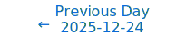
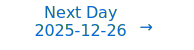

# Personalized Daily ArXiv Papers 2025-12-25

| *[gpt-5]*   | Prompt   | Completion   | Total   |
|:-----------:|:--------:|:------------:|:-------:|
| **Token**   | 38119    | 28133        | 66252   |
| **Cost**    | $0.05    | $0.28        | $0.33   |

Total arXiv papers: 354

Total scanned papers: 222

Total relevant papers: 20

**Table of contents with paper titles:**

1. [PHOTON: Hierarchical Autoregressive Modeling for Lightspeed and Memory-Efficient Language Generation](#user-content-link1)
**Authors:** Yuma Ichikawa, Naoya Takagi, Takumi Nakagawa, Yuzi Kanazawa, Akira Sakai

2. [UCCL-EP: Portable Expert-Parallel Communication](#user-content-link2)
**Authors:** Ziming Mao, Yihan Zhang, Chihan Cui, Kaichao You, Zhongjie Chen, Zhiying Xu, Scott Shenker, Costin Raiciu, Yang Zhou, Ion Stoica

3. [Data-Free Pruning of Self-Attention Layers in LLMs](#user-content-link3)
**Authors:** Dhananjay Saikumar, Blesson Varghese

4. [How Many Experts Are Enough? Towards Optimal Semantic Specialization for Mixture-of-Experts](#user-content-link4)
**Authors:** Sumin Park, Noseong Park

5. [Understanding Scaling Laws in Deep Neural Networks via Feature Learning Dynamics](#user-content-link5)
**Authors:** Zihan Yao, Ruoyu Wu, Tianxiang Gao

6. [SHRP: Specialized Head Routing and Pruning for Efficient Encoder Compression](#user-content-link6)
**Authors:** Zeli Su, Ziyin Zhang, Wenzheng Zhang, Zhou Liu, Guixian Xu, Wentao Zhang

7. [Nemotron 3 Nano: Open, Efficient Mixture-of-Experts Hybrid Mamba-Transformer Model for Agentic Reasoning](#user-content-link7)
**Authors:** NVIDIA, :, Aaron Blakeman, Aaron Grattafiori, Aarti Basant, Abhibha Gupta, Abhinav Khattar, Adi Renduchintala, Aditya Vavre, Akanksha Shukla, Akhiad Bercovich, Aleksander Ficek, Aleksandr Shaposhnikov, Alex Kondratenko, Alexander Bukharin, Alexandre Milesi, Ali Taghibakhshi, Alisa Liu, Amelia Barton, Ameya Sunil Mahabaleshwarkar, Amir Klein, Amit Zuker, Amnon Geifman, Amy Shen, Anahita Bhiwandiwalla, Andrew Tao, Ann Guan, Anubhav Mandarwal, Arham Mehta, Ashwath Aithal, Ashwin Poojary, Asif Ahamed, Asma Kuriparambil Thekkumpate, Ayush Dattagupta, Banghua Zhu, Bardiya Sadeghi, Barnaby Simkin, Ben Lanir, Benedikt Schifferer, Besmira Nushi, Bilal Kartal, Bita Darvish Rouhani, Boris Ginsburg, Brandon Norick, Brandon Soubasis, Branislav Kisacanin, Brian Yu, Bryan Catanzaro, Carlo del Mundo, Chantal Hwang, Charles Wang, Cheng-Ping Hsieh, Chenghao Zhang, Chenhan Yu, Chetan Mungekar, Chintan Patel, Chris Alexiuk, Christopher Parisien, Collin Neale, Damon Mosk-Aoyama, Dan Su, Dane Corneil, Daniel Afrimi, Daniel Rohrer, Daniel Serebrenik, Daria Gitman, Daria Levy, Darko Stosic, David Mosallanezhad, Deepak Narayanan, Dhruv Nathawani, Dima Rekesh, Dina Yared, Divyanshu Kakwani, Dong Ahn, Duncan Riach, Dusan Stosic, Edgar Minasyan, Edward Lin, Eileen Long, Eileen Peters Long, Elena Lantz, Ellie Evans, Elliott Ning, Eric Chung, Eric Harper, Eric Tramel, Erick Galinkin, Erik Pounds, Evan Briones, Evelina Bakhturina, Faisal Ladhak, Fay Wang, Fei Jia, Felipe Soares, Feng Chen, Ferenc Galko, Frankie Siino, Gal Hubara Agam, Ganesh Ajjanagadde, Gantavya Bhatt, Gargi Prasad, George Armstrong, Gerald Shen, Gorkem Batmaz, Grigor Nalbandyan, Haifeng Qian, Harsh Sharma, Hayley Ross, Helen Ngo, Herman Sahota, Hexin Wang, Himanshu Soni, Hiren Upadhyay, Huizi Mao, Huy C Nguyen, Huy Q Nguyen, Iain Cunningham, Ido Shahaf, Igor Gitman, Ilya Loshchilov, Ivan Moshkov, Izzy Putterman, Jan Kautz, Jane Polak Scowcroft, Jared Casper, Jatin Mitra, Jeffrey Glick, Jenny Chen, Jesse Oliver, Jian Zhang, Jiaqi Zeng, Jie Lou, Jimmy Zhang, Jining Huang, Joey Conway, Joey Guman, John Kamalu, Johnny Greco, Jonathan Cohen, Joseph Jennings, Joyjit Daw, Julien Veron Vialard, Junkeun Yi, Jupinder Parmar, Kai Xu, Kan Zhu, Kari Briski, Katherine Cheung, Katherine Luna, Keshav Santhanam, Kevin Shih, Kezhi Kong, Khushi Bhardwaj, Krishna C. Puvvada, Krzysztof Pawelec, Kumar Anik, Lawrence McAfee, Laya Sleiman, Leon Derczynski, Li Ding, Lucas Liebenwein, Luis Vega, Maanu Grover, Maarten Van Segbroeck, Maer Rodrigues de Melo, Makesh Narsimhan Sreedhar, Manoj Kilaru, Maor Ashkenazi, Marc Romeijn, Mark Cai, Markus Kliegl, Maryam Moosaei, Matvei Novikov, Mehrzad Samadi, Melissa Corpuz, Mengru Wang, Meredith Price, Michael Boone, Michael Evans, Miguel Martinez, Mike Chrzanowski, Mohammad Shoeybi, Mostofa Patwary, Nabin Mulepati, Natalie Hereth, Nave Assaf, Negar Habibi, Neta Zmora, Netanel Haber, Nicola Sessions, Nidhi Bhatia, Nikhil Jukar, Nikki Pope, Nikolai Ludwig, Nima Tajbakhsh, Nirmal Juluru, Oleksii Hrinchuk, Oleksii Kuchaiev, Olivier Delalleau, Oluwatobi Olabiyi, Omer Ullman Argov, Ouye Xie, Parth Chadha, Pasha Shamis, Pavlo Molchanov, Pawel Morkisz, Peter Dykas, Peter Jin, Pinky Xu, Piotr Januszewski, Pranav Prashant Thombre, Prasoon Varshney, Pritam Gundecha, Qing Miao, Rabeeh Karimi Mahabadi, Ran El-Yaniv, Ran Zilberstein, Rasoul Shafipour, Rich Harang, Rick Izzo, Rima Shahbazyan, Rishabh Garg, Ritika Borkar, Ritu Gala, Riyad Islam, Roger Waleffe, Rohit Watve, Roi Koren, Ruoxi Zhang, Russell J. Hewett, Ryan Prenger, Ryan Timbrook, Sadegh Mahdavi, Sahil Modi, Samuel Kriman, Sanjay Kariyappa, Sanjeev Satheesh, Saori Kaji, Satish Pasumarthi, Sean Narentharen, Sean Narenthiran, Seonmyeong Bak, Sergey Kashirsky, Seth Poulos, Shahar Mor, Shanmugam Ramasamy, Shantanu Acharya, Shaona Ghosh, Sharath Turuvekere Sreenivas, Shelby Thomas, Shiqing Fan, Shreya Gopal, Shrimai Prabhumoye, Shubham Pachori, Shubham Toshniwal, Shuoyang Ding, Siddharth Singh, Simeng Sun, Smita Ithape, Somshubra Majumdar, Soumye Singhal, Stefania Alborghetti, Stephen Ge, Sugam Dipak Devare, Sumeet Kumar Barua, Suseella Panguluri, Suyog Gupta, Sweta Priyadarshi, Syeda Nahida Akter, Tan Bui, Teodor-Dumitru Ene, Terry Kong, Thanh Do, Tijmen Blankevoort, Tom Balough, Tomer Asida, Tomer Bar Natan, Tugrul Konuk, Twinkle Vashishth, Udi Karpas, Ushnish De, Vahid Noorozi, Vahid Noroozi, Venkat Srinivasan, Venmugil Elango, Vijay Korthikanti, Vitaly Kurin, Vitaly Lavrukhin, Wanli Jiang, Wasi Uddin Ahmad, Wei Du, Wei Ping, Wenfei Zhou, Will Jennings, William Zhang, Wojciech Prazuch, Xiaowei Ren, Yashaswi Karnati, Yejin Choi, Yev Meyer, Yi-Fu Wu, Yian Zhang, Ying Lin, Yonatan Geifman, Yonggan Fu, Yoshi Subara, Yoshi Suhara, Yubo Gao, Zach Moshe, Zhen Dong, Zihan Liu, Zijia Chen, Zijie Yan

8. [RevFFN: Memory-Efficient Full-Parameter Fine-Tuning of Mixture-of-Experts LLMs with Reversible Blocks](#user-content-link8)
**Authors:** Ningyuan Liu, Jing Yang, Kaitong Cai, Keze Wang

9. [Block-Recurrent Dynamics in Vision Transformers](#user-content-link9)
**Authors:** Mozes Jacobs, Thomas Fel, Richard Hakim, Alessandra Brondetta, Demba Ba, T. Andy Keller

10. [Forward Only Learning for Orthogonal Neural Networks of any Depth](#user-content-link10)
**Authors:** Paul Caillon, Alex Colagrande, Erwan Fagnou, Blaise Delattre, Alexandre Allauzen

11. [Parallel Token Prediction for Language Models](#user-content-link11)
**Authors:** Felix Draxler, Justus Will, Farrin Marouf Sofian, Theofanis Karaletsos, Sameer Singh, Stephan Mandt

12. [NVIDIA Nemotron 3: Efficient and Open Intelligence](#user-content-link12)
**Authors:** NVIDIA, :, Aaron Blakeman, Aaron Grattafiori, Aarti Basant, Abhibha Gupta, Abhinav Khattar, Adi Renduchintala, Aditya Vavre, Akanksha Shukla, Akhiad Bercovich, Aleksander Ficek, Aleksandr Shaposhnikov, Alex Kondratenko, Alexander Bukharin, Alexandre Milesi, Ali Taghibakhshi, Alisa Liu, Amelia Barton, Ameya Sunil Mahabaleshwarkar, Amir Klein, Amit Zuker, Amnon Geifman, Amy Shen, Anahita Bhiwandiwalla, Andrew Tao, Anjulie Agrusa, Ankur Verma, Ann Guan, Anubhav Mandarwal, Arham Mehta, Ashwath Aithal, Ashwin Poojary, Asif Ahamed, Asit Mishra, Asma Kuriparambil Thekkumpate, Ayush Dattagupta, Banghua Zhu, Bardiya Sadeghi, Barnaby Simkin, Ben Lanir, Benedikt Schifferer, Besmira Nushi, Bilal Kartal, Bita Darvish Rouhani, Boris Ginsburg, Brandon Norick, Brandon Soubasis, Branislav Kisacanin, Brian Yu, Bryan Catanzaro, Carlo del Mundo, Chantal Hwang, Charles Wang, Cheng-Ping Hsieh, Chenghao Zhang, Chenhan Yu, Chetan Mungekar, Chintan Patel, Chris Alexiuk, Christopher Parisien, Collin Neale, Cyril Meurillon, Damon Mosk-Aoyama, Dan Su, Dane Corneil, Daniel Afrimi, Daniel Lo, Daniel Rohrer, Daniel Serebrenik, Daria Gitman, Daria Levy, Darko Stosic, David Mosallanezhad, Deepak Narayanan, Dhruv Nathawani, Dima Rekesh, Dina Yared, Divyanshu Kakwani, Dong Ahn, Duncan Riach, Dusan Stosic, Edgar Minasyan, Edward Lin, Eileen Long, Eileen Peters Long, Elad Segal, Elena Lantz, Ellie Evans, Elliott Ning, Eric Chung, Eric Harper, Eric Tramel, Erick Galinkin, Erik Pounds, Evan Briones, Evelina Bakhturina, Evgeny Tsykunov, Faisal Ladhak, Fay Wang, Fei Jia, Felipe Soares, Feng Chen, Ferenc Galko, Frank Sun, Frankie Siino, Gal Hubara Agam, Ganesh Ajjanagadde, Gantavya Bhatt, Gargi Prasad, George Armstrong, Gerald Shen, Gorkem Batmaz, Grigor Nalbandyan, Haifeng Qian, Harsh Sharma, Hayley Ross, Helen Ngo, Herbert Hum, Herman Sahota, Hexin Wang, Himanshu Soni, Hiren Upadhyay, Huizi Mao, Huy C Nguyen, Huy Q Nguyen, Iain Cunningham, Ido Galil, Ido Shahaf, Igor Gitman, Ilya Loshchilov, Itamar Schen, Itay Levy, Ivan Moshkov, Izik Golan, Izzy Putterman, Jan Kautz, Jane Polak Scowcroft, Jared Casper, Jatin Mitra, Jeffrey Glick, Jenny Chen, Jesse Oliver, Jian Zhang, Jiaqi Zeng, Jie Lou, Jimmy Zhang, Jinhang Choi, Jining Huang, Joey Conway, Joey Guman, John Kamalu, Johnny Greco, Jonathan Cohen, Joseph Jennings, Joyjit Daw, Julien Veron Vialard, Junkeun Yi, Jupinder Parmar, Kai Xu, Kan Zhu, Kari Briski, Katherine Cheung, Katherine Luna, Keith Wyss, Keshav Santhanam, Kevin Shih, Kezhi Kong, Khushi Bhardwaj, Kirthi Shankar, Krishna C. Puvvada, Krzysztof Pawelec, Kumar Anik, Lawrence McAfee, Laya Sleiman, Leon Derczynski, Li Ding, Lizzie Wei, Lucas Liebenwein, Luis Vega, Maanu Grover, Maarten Van Segbroeck, Maer Rodrigues de Melo, Mahdi Nazemi, Makesh Narsimhan Sreedhar, Manoj Kilaru, Maor Ashkenazi, Marc Romeijn, Marcin Chochowski, Mark Cai, Markus Kliegl, Maryam Moosaei, Matt Kulka, Matvei Novikov, Mehrzad Samadi, Melissa Corpuz, Mengru Wang, Meredith Price, Michael Andersch, Michael Boone, Michael Evans, Miguel Martinez, Mikail Khona, Mike Chrzanowski, Minseok Lee, Mohammad Dabbah, Mohammad Shoeybi, Mostofa Patwary, Nabin Mulepati, Najeeb Nabwani, Natalie Hereth, Nave Assaf, Negar Habibi, Neta Zmora, Netanel Haber, Nicola Sessions, Nidhi Bhatia, Nikhil Jukar, Nikki Pope, Nikolai Ludwig, Nima Tajbakhsh, Nir Ailon, Nirmal Juluru, Nishant Sharma, Oleksii Hrinchuk, Oleksii Kuchaiev, Olivier Delalleau, Oluwatobi Olabiyi, Omer Ullman Argov, Omri Puny, Oren Tropp, Ouye Xie, Parth Chadha, Pasha Shamis, Paul Gibbons, Pavlo Molchanov, Pawel Morkisz, Peter Dykas, Peter Jin, Pinky Xu, Piotr Januszewski, Pranav Prashant Thombre, Prasoon Varshney, Pritam Gundecha, Przemek Tredak, Qing Miao, Qiyu Wan, Rabeeh Karimi Mahabadi, Rachit Garg, Ran El-Yaniv, Ran Zilberstein, Rasoul Shafipour, Rich Harang, Rick Izzo, Rima Shahbazyan, Rishabh Garg, Ritika Borkar, Ritu Gala, Riyad Islam, Robert Hesse, Roger Waleffe, Rohit Watve, Roi Koren, Ruoxi Zhang, Russell Hewett, Russell J. Hewett, Ryan Prenger, Ryan Timbrook, Sadegh Mahdavi, Sahil Modi, Samuel Kriman, Sangkug Lim, Sanjay Kariyappa, Sanjeev Satheesh, Saori Kaji, Satish Pasumarthi, Saurav Muralidharan, Sean Narentharen, Sean Narenthiran, Seonmyeong Bak, Sergey Kashirsky, Seth Poulos, Shahar Mor, Shanmugam Ramasamy, Shantanu Acharya, Shaona Ghosh, Sharath Turuvekere Sreenivas, Shelby Thomas, Shiqing Fan, Shreya Gopal, Shrimai Prabhumoye, Shubham Pachori, Shubham Toshniwal, Shuoyang Ding, Siddharth Singh, Simeng Sun, Smita Ithape, Somshubra Majumdar, Soumye Singhal, Stas Sergienko, Stefania Alborghetti, Stephen Ge, Sugam Dipak Devare, Sumeet Kumar Barua, Suseella Panguluri, Suyog Gupta, Sweta Priyadarshi, Syeda Nahida Akter, Tan Bui, Teodor-Dumitru Ene, Terry Kong, Thanh Do, Tijmen Blankevoort, Tim Moon, Tom Balough, Tomer Asida, Tomer Bar Natan, Tomer Ronen, Tugrul Konuk, Twinkle Vashishth, Udi Karpas, Ushnish De, Vahid Noorozi, Vahid Noroozi, Venkat Srinivasan, Venmugil Elango, Victor Cui, Vijay Korthikanti, Vinay Rao, Vitaly Kurin, Vitaly Lavrukhin, Vladimir Anisimov, Wanli Jiang, Wasi Uddin Ahmad, Wei Du, Wei Ping, Wenfei Zhou, Will Jennings, William Zhang, Wojciech Prazuch, Xiaowei Ren, Yashaswi Karnati, Yejin Choi, Yev Meyer, Yi-Fu Wu, Yian Zhang, Yigong Qin, Ying Lin, Yonatan Geifman, Yonggan Fu, Yoshi Subara, Yoshi Suhara, Yubo Gao, Zach Moshe, Zhen Dong, Zhongbo Zhu, Zihan Liu, Zijia Chen, Zijie Yan

13. [Distilling to Hybrid Attention Models via KL-Guided Layer Selection](#user-content-link13)
**Authors:** Yanhong Li, Songlin Yang, Shawn Tan, Mayank Mishra, Rameswar Panda, Jiawei Zhou, Yoon Kim

14. [Memory-Efficient Acceleration of Block Low-Rank Foundation Models on Resource Constrained GPUs](#user-content-link14)
**Authors:** Pierre Abillama, Changwoo Lee, Juechu Dong, David Blaauw, Dennis Sylvester, Hun-Seok Kim

15. [A Mechanistic Analysis of Transformers for Dynamical Systems](#user-content-link15)
**Authors:** Gregory Duth\'e, Nikolaos Evangelou, Wei Liu, Ioannis G. Kevrekidis, Eleni Chatzi

16. [Demystifying LLM-as-a-Judge: Analytically Tractable Model for Inference-Time Scaling](#user-content-link16)
**Authors:** Indranil Halder, Cengiz Pehlevan

17. [TokSuite: Measuring the Impact of Tokenizer Choice on Language Model Behavior](#user-content-link17)
**Authors:** G\"ul Sena Alt{\i}nta\c{s}, Malikeh Ehghaghi, Brian Lester, Fengyuan Liu, Wanru Zhao, Marco Ciccone, Colin Raffel

18. [Neuron-Guided Interpretation of Code LLMs: Where, Why, and How?](#user-content-link18)
**Authors:** Zhe Yin, Xiaodong Gu, Beijun Shen

19. [How Much 3D Do Video Foundation Models Encode?](#user-content-link19)
**Authors:** Zixuan Huang, Xiang Li, Zhaoyang Lv, James M. Rehg

20. [Q-RUN: Quantum-Inspired Data Re-uploading Networks](#user-content-link20)
**Authors:** Wenbo Qiao, Shuaixian Wang, Peng Zhang, Yan Ming, Jiaming Zhao

---

## 1. [PHOTON: Hierarchical Autoregressive Modeling for Lightspeed and Memory-Efficient Language Generation](https://arxiv.org/abs/2512.20687) 

**ArXiv ID:** 2512.20687

**Authors:** Yuma Ichikawa, Naoya Takagi, Takumi Nakagawa, Yuzi Kanazawa, Akira Sakai

**Abstract:** Transformers operate as horizontal token-by-token scanners; at each generation step, the model attends to an ever-growing sequence of token-level states. This access pattern increases prefill latency and makes long-context decoding increasingly memory-bound, as KV-cache reads and writes dominate inference throughput rather than arithmetic computation. We propose Parallel Hierarchical Operation for Top-down Networks (PHOTON), a hierarchical autoregressive model that replaces flat scanning with vertical, multi-resolution context access. PHOTON maintains a hierarchy of latent streams: a bottom-up encoder progressively compresses tokens into low-rate contextual states, while lightweight top-down decoders reconstruct fine-grained token representations. Experimental results show that PHOTON is superior to competitive Transformer-based language models regarding the throughput-quality trade-off, offering significant advantages in long-context and multi-query tasks. This reduces decode-time KV-cache traffic, yielding up to $10^{3}\times$ higher throughput per unit memory.

**Comment:** Matches Model Architecture and Efficiency: hierarchical autoregressive design reducing KV-cache traffic for long-context decoding, improving throughput–memory trade-offs.

**Relevance:** 10
**Novelty:** 9

---

## 2. [UCCL-EP: Portable Expert-Parallel Communication](https://arxiv.org/abs/2512.19849) 

**ArXiv ID:** 2512.19849

**Authors:** Ziming Mao, Yihan Zhang, Chihan Cui, Kaichao You, Zhongjie Chen, Zhiying Xu, Scott Shenker, Costin Raiciu, Yang Zhou, Ion Stoica

**Abstract:** Mixture-of-Experts (MoE) workloads rely on expert parallelism (EP) to achieve high GPU efficiency. State-of-the-art EP communication systems such as DeepEP demonstrate strong performance but exhibit poor portability across heterogeneous GPU and NIC platforms. The poor portability is rooted in architecture: GPU-initiated token-level RDMA communication requires tight vertical integration between GPUs and NICs, e.g., GPU writes to NIC driver/MMIO interfaces.   We present UCCL-EP, a portable EP communication system that delivers DeepEP-level performance across heterogeneous GPU and NIC hardware. UCCL-EP replaces GPU-initiated RDMA with a high-throughput GPU-CPU control channel: compact token-routing commands are transferred to multithreaded CPU proxies, which then issue GPUDirect RDMA operations on behalf of GPUs. UCCL-EP further emulates various ordering semantics required by specialized EP communication modes using RDMA immediate data, enabling correctness on NICs that lack such ordering, e.g., AWS EFA. We implement UCCL-EP on NVIDIA and AMD GPUs with EFA and Broadcom NICs. On EFA, it outperforms the best existing EP solution by up to $2.1\times$ for dispatch and combine throughput. On NVIDIA-only platform, UCCL-EP achieves comparable performance to the original DeepEP. UCCL-EP also improves token throughput on SGLang by up to 40% on the NVIDIA+EFA platform, and improves DeepSeek-V3 training throughput over the AMD Primus/Megatron-LM framework by up to 45% on a 16-node AMD+Broadcom platform.

**Comment:** Matches High Performance Computing and MoE: portable expert-parallel communication for Mixture-of-Experts using a GPU–CPU control channel and GPUDirect RDMA.

**Relevance:** 10
**Novelty:** 8

---

## 3. [Data-Free Pruning of Self-Attention Layers in LLMs](https://arxiv.org/abs/2512.20636) 

**ArXiv ID:** 2512.20636

**Authors:** Dhananjay Saikumar, Blesson Varghese

**Abstract:** Many self-attention sublayers in large language models (LLMs) can be removed with little to no loss. We attribute this to the Attention Suppression Hypothesis: during pre-training, some deep attention layers learn to mute their own contribution, leaving the residual stream and the MLP to carry the representation. We propose Gate-Norm, a one-shot, weight-only criterion that ranks attention sublayers by query--key coupling and removes the least coupled ones, requiring no calibration data, no forward passes, no fine-tuning, and no specialized kernels. On 40-layer, 13B-parameter LLaMA models, Gate-Norm prunes the model in under a second. Pruning $8$--$16$ attention sublayers yields up to $1.30\times$ higher inference throughput while keeping average zero-shot accuracy within $2\%$ of the unpruned baseline across BoolQ, RTE, HellaSwag, WinoGrande, ARC-Easy/Challenge, and OpenBookQA. Across these settings, Gate-Norm matches data-driven pruning methods in accuracy while being $\sim 1000\times$ faster to score layers, enabling practical, data-free compression of LLMs.

**Comment:** Model Compression and Efficiency: data-free pruning of self-attention sublayers in LLMs via a one-shot Gate-Norm criterion, enabling throughput gains without calibration or fine-tuning.

**Relevance:** 10
**Novelty:** 8

---

## 4. [How Many Experts Are Enough? Towards Optimal Semantic Specialization for Mixture-of-Experts](https://arxiv.org/abs/2512.19765) 

**ArXiv ID:** 2512.19765

**Authors:** Sumin Park, Noseong Park

**Abstract:** Finding the optimal configuration of Sparse Mixture-ofExperts (SMoE) that maximizes semantic differentiation among experts is essential for exploiting the full potential of MoE architectures. However, existing SMoE frameworks either heavily rely on hyperparameter tuning or overlook the importance of diversifying semantic roles across experts when adapting the expert pool size. We propose Mixture-of-Experts for Adaptive Semantic Specialization (MASS), a semanticaware MoE framework for adaptive expert expansion and dynamic routing. MASS introduces two key advancements: (i) a gradient-based semantic drift detector that prompts targeted expert expansion when the existing expert pool lacks capacity to capture the full semantic diversity of the data, and (ii) an integration of adaptive routing strategy that dynamically adjusts expert usage based on token-level routing confidence mass. We first demonstrate that MASS reliably converges to the point of optimal balance between cost-performance trade-off with notably improved sematic specialization in a highly controlled synthetic setup. Further empirical results on real-world datasets across language and vision domains show that MASS consistently outperforms a range of strong MoE baselines, demonstrating its domain robustness and enhanced expert specialization.

**Comment:** Model Architecture (MoE): adaptive expert expansion via semantic drift detection and dynamic routing by confidence mass to optimize expert specialization.

**Relevance:** 10
**Novelty:** 8

---

## 5. [Understanding Scaling Laws in Deep Neural Networks via Feature Learning Dynamics](https://arxiv.org/abs/2512.21075) 

**ArXiv ID:** 2512.21075

**Authors:** Zihan Yao, Ruoyu Wu, Tianxiang Gao

**Abstract:** The empirical success of deep learning is often attributed to scaling laws that predict consistent gains as model, data, and compute grow; however, large models can exhibit training instability and diminishing returns, suggesting that scaling laws describe what success looks like but not when and why scaling succeeds or fails. A central obstacle is the lack of a rigorous understanding of feature learning at large depth. While muP characterizes feature-learning dynamics in the infinite-width limit and enables hyperparameter transfer across width, its depth extension (depth-muP) breaks down for residual blocks with more than one internal layer. We derive Neural Feature Dynamics (NFD) for ResNets with single-layer residual blocks, characterizing feature learning via a coupled forward-backward stochastic system in the joint infinite-width and infinite-depth limit. In this regime, NFD identifies when scaling-law trends persist and explains diminishing returns. It also reveals a vanishing mechanism induced by the 1/sqrt(depth) residual scaling under which the gradient-independence assumption (GIA), known to fail during training at finite depth, becomes provably valid again at infinite depth, yielding an analytically tractable regime for end-to-end feature learning. Motivated by this insight, we study two-layer residual blocks and show that the same mechanism causes feature-learning collapse in the first internal layer at large depth, providing a structural explanation for the empirical failure of depth-muP. Based on this diagnosis, we propose a depth-aware learning-rate correction that counteracts the collapse and empirically restores depth-wise hyperparameter transfer, yielding stronger performance in deeper ResNets.

**Comment:** Representation Learning/Training Dynamics: derives Neural Feature Dynamics in the infinite-width/depth limit to explain scaling laws and proposes a depth-aware learning-rate correction.

**Relevance:** 9
**Novelty:** 9

---

## 6. [SHRP: Specialized Head Routing and Pruning for Efficient Encoder Compression](https://arxiv.org/abs/2512.20635) 

**ArXiv ID:** 2512.20635

**Authors:** Zeli Su, Ziyin Zhang, Wenzheng Zhang, Zhou Liu, Guixian Xu, Wentao Zhang

**Abstract:** Transformer encoders are widely deployed in large-scale web services for natural language understanding tasks such as text classification, semantic retrieval, and content ranking. However, their high inference latency and memory consumption pose significant challenges for real-time serving and scalability. These limitations stem largely from architectural redundancy, particularly in the attention module. The inherent parameter redundancy of the attention mechanism, coupled with the fact that its attention heads operate with a degree of independence, makes it particularly amenable to structured model compression. In this paper, we propose SHRP (Specialized Head Routing and Pruning), a novel structured pruning framework that automatically identifies and removes redundant attention heads while preserving most of the model's accuracy and compatibility. SHRP introduces Expert Attention, a modular design that treats each attention head as an independent expert, followed by a lightweight shared expander feed-forward network that refines their outputs. The framework employs a unified Top-1 usage-driven mechanism to jointly perform dynamic routing during training and deterministic pruning at deployment. Experimental results on the GLUE benchmark using a BERT-base encoder show that SHRP achieves 93% of the original model accuracy while reducing parameters by 48 percent. Under an extreme compression scenario where 11/12 of the layers are pruned, the model still maintains 84% accuracy and delivers a 4.2x throughput gain while reducing computation to as low as 11.5 percent of the original FLOPs, demonstrating its practical utility for large-scale and latency-sensitive web deployments.

**Comment:** Matches Compression/Efficiency: structured pruning of attention heads via usage-driven routing; treats heads as experts to enable deterministic pruning with high retention.

**Relevance:** 10
**Novelty:** 7

---

## 7. [Nemotron 3 Nano: Open, Efficient Mixture-of-Experts Hybrid Mamba-Transformer Model for Agentic Reasoning](https://arxiv.org/abs/2512.20848) 

**ArXiv ID:** 2512.20848

**Authors:** NVIDIA, :, Aaron Blakeman, Aaron Grattafiori, Aarti Basant, Abhibha Gupta, Abhinav Khattar, Adi Renduchintala, Aditya Vavre, Akanksha Shukla, Akhiad Bercovich, Aleksander Ficek, Aleksandr Shaposhnikov, Alex Kondratenko, Alexander Bukharin, Alexandre Milesi, Ali Taghibakhshi, Alisa Liu, Amelia Barton, Ameya Sunil Mahabaleshwarkar, Amir Klein, Amit Zuker, Amnon Geifman, Amy Shen, Anahita Bhiwandiwalla, Andrew Tao, Ann Guan, Anubhav Mandarwal, Arham Mehta, Ashwath Aithal, Ashwin Poojary, Asif Ahamed, Asma Kuriparambil Thekkumpate, Ayush Dattagupta, Banghua Zhu, Bardiya Sadeghi, Barnaby Simkin, Ben Lanir, Benedikt Schifferer, Besmira Nushi, Bilal Kartal, Bita Darvish Rouhani, Boris Ginsburg, Brandon Norick, Brandon Soubasis, Branislav Kisacanin, Brian Yu, Bryan Catanzaro, Carlo del Mundo, Chantal Hwang, Charles Wang, Cheng-Ping Hsieh, Chenghao Zhang, Chenhan Yu, Chetan Mungekar, Chintan Patel, Chris Alexiuk, Christopher Parisien, Collin Neale, Damon Mosk-Aoyama, Dan Su, Dane Corneil, Daniel Afrimi, Daniel Rohrer, Daniel Serebrenik, Daria Gitman, Daria Levy, Darko Stosic, David Mosallanezhad, Deepak Narayanan, Dhruv Nathawani, Dima Rekesh, Dina Yared, Divyanshu Kakwani, Dong Ahn, Duncan Riach, Dusan Stosic, Edgar Minasyan, Edward Lin, Eileen Long, Eileen Peters Long, Elena Lantz, Ellie Evans, Elliott Ning, Eric Chung, Eric Harper, Eric Tramel, Erick Galinkin, Erik Pounds, Evan Briones, Evelina Bakhturina, Faisal Ladhak, Fay Wang, Fei Jia, Felipe Soares, Feng Chen, Ferenc Galko, Frankie Siino, Gal Hubara Agam, Ganesh Ajjanagadde, Gantavya Bhatt, Gargi Prasad, George Armstrong, Gerald Shen, Gorkem Batmaz, Grigor Nalbandyan, Haifeng Qian, Harsh Sharma, Hayley Ross, Helen Ngo, Herman Sahota, Hexin Wang, Himanshu Soni, Hiren Upadhyay, Huizi Mao, Huy C Nguyen, Huy Q Nguyen, Iain Cunningham, Ido Shahaf, Igor Gitman, Ilya Loshchilov, Ivan Moshkov, Izzy Putterman, Jan Kautz, Jane Polak Scowcroft, Jared Casper, Jatin Mitra, Jeffrey Glick, Jenny Chen, Jesse Oliver, Jian Zhang, Jiaqi Zeng, Jie Lou, Jimmy Zhang, Jining Huang, Joey Conway, Joey Guman, John Kamalu, Johnny Greco, Jonathan Cohen, Joseph Jennings, Joyjit Daw, Julien Veron Vialard, Junkeun Yi, Jupinder Parmar, Kai Xu, Kan Zhu, Kari Briski, Katherine Cheung, Katherine Luna, Keshav Santhanam, Kevin Shih, Kezhi Kong, Khushi Bhardwaj, Krishna C. Puvvada, Krzysztof Pawelec, Kumar Anik, Lawrence McAfee, Laya Sleiman, Leon Derczynski, Li Ding, Lucas Liebenwein, Luis Vega, Maanu Grover, Maarten Van Segbroeck, Maer Rodrigues de Melo, Makesh Narsimhan Sreedhar, Manoj Kilaru, Maor Ashkenazi, Marc Romeijn, Mark Cai, Markus Kliegl, Maryam Moosaei, Matvei Novikov, Mehrzad Samadi, Melissa Corpuz, Mengru Wang, Meredith Price, Michael Boone, Michael Evans, Miguel Martinez, Mike Chrzanowski, Mohammad Shoeybi, Mostofa Patwary, Nabin Mulepati, Natalie Hereth, Nave Assaf, Negar Habibi, Neta Zmora, Netanel Haber, Nicola Sessions, Nidhi Bhatia, Nikhil Jukar, Nikki Pope, Nikolai Ludwig, Nima Tajbakhsh, Nirmal Juluru, Oleksii Hrinchuk, Oleksii Kuchaiev, Olivier Delalleau, Oluwatobi Olabiyi, Omer Ullman Argov, Ouye Xie, Parth Chadha, Pasha Shamis, Pavlo Molchanov, Pawel Morkisz, Peter Dykas, Peter Jin, Pinky Xu, Piotr Januszewski, Pranav Prashant Thombre, Prasoon Varshney, Pritam Gundecha, Qing Miao, Rabeeh Karimi Mahabadi, Ran El-Yaniv, Ran Zilberstein, Rasoul Shafipour, Rich Harang, Rick Izzo, Rima Shahbazyan, Rishabh Garg, Ritika Borkar, Ritu Gala, Riyad Islam, Roger Waleffe, Rohit Watve, Roi Koren, Ruoxi Zhang, Russell J. Hewett, Ryan Prenger, Ryan Timbrook, Sadegh Mahdavi, Sahil Modi, Samuel Kriman, Sanjay Kariyappa, Sanjeev Satheesh, Saori Kaji, Satish Pasumarthi, Sean Narentharen, Sean Narenthiran, Seonmyeong Bak, Sergey Kashirsky, Seth Poulos, Shahar Mor, Shanmugam Ramasamy, Shantanu Acharya, Shaona Ghosh, Sharath Turuvekere Sreenivas, Shelby Thomas, Shiqing Fan, Shreya Gopal, Shrimai Prabhumoye, Shubham Pachori, Shubham Toshniwal, Shuoyang Ding, Siddharth Singh, Simeng Sun, Smita Ithape, Somshubra Majumdar, Soumye Singhal, Stefania Alborghetti, Stephen Ge, Sugam Dipak Devare, Sumeet Kumar Barua, Suseella Panguluri, Suyog Gupta, Sweta Priyadarshi, Syeda Nahida Akter, Tan Bui, Teodor-Dumitru Ene, Terry Kong, Thanh Do, Tijmen Blankevoort, Tom Balough, Tomer Asida, Tomer Bar Natan, Tugrul Konuk, Twinkle Vashishth, Udi Karpas, Ushnish De, Vahid Noorozi, Vahid Noroozi, Venkat Srinivasan, Venmugil Elango, Vijay Korthikanti, Vitaly Kurin, Vitaly Lavrukhin, Wanli Jiang, Wasi Uddin Ahmad, Wei Du, Wei Ping, Wenfei Zhou, Will Jennings, William Zhang, Wojciech Prazuch, Xiaowei Ren, Yashaswi Karnati, Yejin Choi, Yev Meyer, Yi-Fu Wu, Yian Zhang, Ying Lin, Yonatan Geifman, Yonggan Fu, Yoshi Subara, Yoshi Suhara, Yubo Gao, Zach Moshe, Zhen Dong, Zihan Liu, Zijia Chen, Zijie Yan

**Abstract:** We present Nemotron 3 Nano 30B-A3B, a Mixture-of-Experts hybrid Mamba-Transformer language model. Nemotron 3 Nano was pretrained on 25 trillion text tokens, including more than 3 trillion new unique tokens over Nemotron 2, followed by supervised fine tuning and large-scale RL on diverse environments. Nemotron 3 Nano achieves better accuracy than our previous generation Nemotron 2 Nano while activating less than half of the parameters per forward pass. It achieves up to 3.3x higher inference throughput than similarly-sized open models like GPT-OSS-20B and Qwen3-30B-A3B-Thinking-2507, while also being more accurate on popular benchmarks. Nemotron 3 Nano demonstrates enhanced agentic, reasoning, and chat abilities and supports context lengths up to 1M tokens. We release both our pretrained Nemotron 3 Nano 30B-A3B Base and post-trained Nemotron 3 Nano 30B-A3B checkpoints on Hugging Face.

**Comment:** Matches Model Architecture and Efficiency: Mixture-of-Experts hybrid Mamba-Transformer with high-throughput inference and long-context support.

**Relevance:** 10
**Novelty:** 7

---

## 8. [RevFFN: Memory-Efficient Full-Parameter Fine-Tuning of Mixture-of-Experts LLMs with Reversible Blocks](https://arxiv.org/abs/2512.20920) 

**ArXiv ID:** 2512.20920

**Authors:** Ningyuan Liu, Jing Yang, Kaitong Cai, Keze Wang

**Abstract:** Full parameter fine tuning is a key technique for adapting large language models (LLMs) to downstream tasks, but it incurs substantial memory overhead due to the need to cache extensive intermediate activations for backpropagation. This bottleneck makes full fine tuning of contemporary large scale LLMs challenging in practice. Existing distributed training frameworks such as DeepSpeed alleviate this issue using techniques like ZeRO and FSDP, which rely on multi GPU memory or CPU offloading, but often require additional hardware resources and reduce training speed. We introduce RevFFN, a memory efficient fine tuning paradigm for mixture of experts (MoE) LLMs. RevFFN employs carefully designed reversible Transformer blocks that allow reconstruction of layer input activations from outputs during backpropagation, eliminating the need to store most intermediate activations in memory. While preserving the expressive capacity of MoE architectures, this approach significantly reduces peak memory consumption for full parameter fine tuning. As a result, RevFFN enables efficient full fine tuning on a single consumer grade or server grade GPU.

**Comment:** Matches High Performance Computing and Model Architecture: uses reversible Transformer blocks tailored to MoE LLMs to reconstruct activations during backprop, sharply reducing activation memory for full-parameter fine-tuning on single GPUs.

**Relevance:** 10
**Novelty:** 7

---

## 9. [Block-Recurrent Dynamics in Vision Transformers](https://arxiv.org/abs/2512.19941) 

**ArXiv ID:** 2512.19941

**Authors:** Mozes Jacobs, Thomas Fel, Richard Hakim, Alessandra Brondetta, Demba Ba, T. Andy Keller

**Abstract:** As Vision Transformers (ViTs) become standard vision backbones, a mechanistic account of their computational phenomenology is essential. Despite architectural cues that hint at dynamical structure, there is no settled framework that interprets Transformer depth as a well-characterized flow. In this work, we introduce the Block-Recurrent Hypothesis (BRH), arguing that trained ViTs admit a block-recurrent depth structure such that the computation of the original $L$ blocks can be accurately rewritten using only $k \ll L$ distinct blocks applied recurrently. Across diverse ViTs, between-layer representational similarity matrices suggest few contiguous phases. To determine whether these phases reflect genuinely reusable computation, we train block-recurrent surrogates of pretrained ViTs: Recurrent Approximations to Phase-structured TransfORmers (Raptor). In small-scale, we demonstrate that stochastic depth and training promote recurrent structure and subsequently correlate with our ability to accurately fit Raptor. We then provide an empirical existence proof for BRH by training a Raptor model to recover $96\%$ of DINOv2 ImageNet-1k linear probe accuracy in only 2 blocks at equivalent computational cost. Finally, we leverage our hypothesis to develop a program of Dynamical Interpretability. We find i) directional convergence into class-dependent angular basins with self-correcting trajectories under small perturbations, ii) token-specific dynamics, where cls executes sharp late reorientations while patch tokens exhibit strong late-stage coherence toward their mean direction, and iii) a collapse to low rank updates in late depth, consistent with convergence to low-dimensional attractors. Altogether, we find a compact recurrent program emerges along ViT depth, pointing to a low-complexity normative solution that enables these models to be studied through principled dynamical systems analysis.

**Comment:** Matches Representation Learning and Architecture analysis: proposes a block-recurrent hypothesis for ViTs, recurrent surrogates (Raptor), and reveals low-rank late-depth dynamics.

**Relevance:** 9
**Novelty:** 8

---

## 10. [Forward Only Learning for Orthogonal Neural Networks of any Depth](https://arxiv.org/abs/2512.20668) 

**ArXiv ID:** 2512.20668

**Authors:** Paul Caillon, Alex Colagrande, Erwan Fagnou, Blaise Delattre, Alexandre Allauzen

**Abstract:** Backpropagation is still the de facto algorithm used today to   train neural networks.   With the exponential growth of recent architectures, the   computational cost of this algorithm also becomes a burden. The   recent PEPITA and forward-only frameworks have proposed promising   alternatives, but they failed to scale up to a handful of hidden   layers, yet limiting their use.   In this paper, we first analyze theoretically the main limitations of   these approaches. It allows us the design of a forward-only   algorithm, which is equivalent to backpropagation under the linear   and orthogonal assumptions. By relaxing the linear assumption, we   then introduce FOTON (Forward-Only Training of Orthogonal Networks)   that bridges the gap with the backpropagation   algorithm. Experimental results show that it outperforms PEPITA,   enabling us to train neural networks of any depth, without the need   for a backward pass.   Moreover its performance on convolutional networks clearly opens up avenues for its application to more   advanced architectures. The code is open-sourced at https://github.com/p0lcAi/FOTON .

**Comment:** Model Compression and Efficiency: forward-only training (FOTON) for orthogonal networks eliminating backward pass; scalable alternative to backprop with strong empirical performance.

**Relevance:** 9
**Novelty:** 8

---

## 11. [Parallel Token Prediction for Language Models](https://arxiv.org/abs/2512.21323) 

**ArXiv ID:** 2512.21323

**Authors:** Felix Draxler, Justus Will, Farrin Marouf Sofian, Theofanis Karaletsos, Sameer Singh, Stephan Mandt

**Abstract:** We propose Parallel Token Prediction (PTP), a universal framework for parallel sequence generation in language models. PTP jointly predicts multiple dependent tokens in a single transformer call by incorporating the sampling procedure into the model. This reduces the latency bottleneck of autoregressive decoding, and avoids the restrictive independence assumptions common in existing multi-token prediction methods. We prove that PTP can represent arbitrary autoregressive sequence distributions. PTP is trained either by distilling an existing model or through inverse autoregressive training without a teacher. Experimentally, we achieve state-of-the-art speculative decoding performance on Vicuna-7B by accepting over four tokens per step on Spec-Bench. The universality of our framework indicates that parallel generation of long sequences is feasible without loss of modeling power.

**Comment:** Matches Model Architecture/Efficiency: introduces Parallel Token Prediction to jointly predict dependent tokens in a single transformer call with a universality proof, reducing autoregressive decoding latency without independence assumptions.

**Relevance:** 9
**Novelty:** 8

---

## 12. [NVIDIA Nemotron 3: Efficient and Open Intelligence](https://arxiv.org/abs/2512.20856) 

**ArXiv ID:** 2512.20856

**Authors:** NVIDIA, :, Aaron Blakeman, Aaron Grattafiori, Aarti Basant, Abhibha Gupta, Abhinav Khattar, Adi Renduchintala, Aditya Vavre, Akanksha Shukla, Akhiad Bercovich, Aleksander Ficek, Aleksandr Shaposhnikov, Alex Kondratenko, Alexander Bukharin, Alexandre Milesi, Ali Taghibakhshi, Alisa Liu, Amelia Barton, Ameya Sunil Mahabaleshwarkar, Amir Klein, Amit Zuker, Amnon Geifman, Amy Shen, Anahita Bhiwandiwalla, Andrew Tao, Anjulie Agrusa, Ankur Verma, Ann Guan, Anubhav Mandarwal, Arham Mehta, Ashwath Aithal, Ashwin Poojary, Asif Ahamed, Asit Mishra, Asma Kuriparambil Thekkumpate, Ayush Dattagupta, Banghua Zhu, Bardiya Sadeghi, Barnaby Simkin, Ben Lanir, Benedikt Schifferer, Besmira Nushi, Bilal Kartal, Bita Darvish Rouhani, Boris Ginsburg, Brandon Norick, Brandon Soubasis, Branislav Kisacanin, Brian Yu, Bryan Catanzaro, Carlo del Mundo, Chantal Hwang, Charles Wang, Cheng-Ping Hsieh, Chenghao Zhang, Chenhan Yu, Chetan Mungekar, Chintan Patel, Chris Alexiuk, Christopher Parisien, Collin Neale, Cyril Meurillon, Damon Mosk-Aoyama, Dan Su, Dane Corneil, Daniel Afrimi, Daniel Lo, Daniel Rohrer, Daniel Serebrenik, Daria Gitman, Daria Levy, Darko Stosic, David Mosallanezhad, Deepak Narayanan, Dhruv Nathawani, Dima Rekesh, Dina Yared, Divyanshu Kakwani, Dong Ahn, Duncan Riach, Dusan Stosic, Edgar Minasyan, Edward Lin, Eileen Long, Eileen Peters Long, Elad Segal, Elena Lantz, Ellie Evans, Elliott Ning, Eric Chung, Eric Harper, Eric Tramel, Erick Galinkin, Erik Pounds, Evan Briones, Evelina Bakhturina, Evgeny Tsykunov, Faisal Ladhak, Fay Wang, Fei Jia, Felipe Soares, Feng Chen, Ferenc Galko, Frank Sun, Frankie Siino, Gal Hubara Agam, Ganesh Ajjanagadde, Gantavya Bhatt, Gargi Prasad, George Armstrong, Gerald Shen, Gorkem Batmaz, Grigor Nalbandyan, Haifeng Qian, Harsh Sharma, Hayley Ross, Helen Ngo, Herbert Hum, Herman Sahota, Hexin Wang, Himanshu Soni, Hiren Upadhyay, Huizi Mao, Huy C Nguyen, Huy Q Nguyen, Iain Cunningham, Ido Galil, Ido Shahaf, Igor Gitman, Ilya Loshchilov, Itamar Schen, Itay Levy, Ivan Moshkov, Izik Golan, Izzy Putterman, Jan Kautz, Jane Polak Scowcroft, Jared Casper, Jatin Mitra, Jeffrey Glick, Jenny Chen, Jesse Oliver, Jian Zhang, Jiaqi Zeng, Jie Lou, Jimmy Zhang, Jinhang Choi, Jining Huang, Joey Conway, Joey Guman, John Kamalu, Johnny Greco, Jonathan Cohen, Joseph Jennings, Joyjit Daw, Julien Veron Vialard, Junkeun Yi, Jupinder Parmar, Kai Xu, Kan Zhu, Kari Briski, Katherine Cheung, Katherine Luna, Keith Wyss, Keshav Santhanam, Kevin Shih, Kezhi Kong, Khushi Bhardwaj, Kirthi Shankar, Krishna C. Puvvada, Krzysztof Pawelec, Kumar Anik, Lawrence McAfee, Laya Sleiman, Leon Derczynski, Li Ding, Lizzie Wei, Lucas Liebenwein, Luis Vega, Maanu Grover, Maarten Van Segbroeck, Maer Rodrigues de Melo, Mahdi Nazemi, Makesh Narsimhan Sreedhar, Manoj Kilaru, Maor Ashkenazi, Marc Romeijn, Marcin Chochowski, Mark Cai, Markus Kliegl, Maryam Moosaei, Matt Kulka, Matvei Novikov, Mehrzad Samadi, Melissa Corpuz, Mengru Wang, Meredith Price, Michael Andersch, Michael Boone, Michael Evans, Miguel Martinez, Mikail Khona, Mike Chrzanowski, Minseok Lee, Mohammad Dabbah, Mohammad Shoeybi, Mostofa Patwary, Nabin Mulepati, Najeeb Nabwani, Natalie Hereth, Nave Assaf, Negar Habibi, Neta Zmora, Netanel Haber, Nicola Sessions, Nidhi Bhatia, Nikhil Jukar, Nikki Pope, Nikolai Ludwig, Nima Tajbakhsh, Nir Ailon, Nirmal Juluru, Nishant Sharma, Oleksii Hrinchuk, Oleksii Kuchaiev, Olivier Delalleau, Oluwatobi Olabiyi, Omer Ullman Argov, Omri Puny, Oren Tropp, Ouye Xie, Parth Chadha, Pasha Shamis, Paul Gibbons, Pavlo Molchanov, Pawel Morkisz, Peter Dykas, Peter Jin, Pinky Xu, Piotr Januszewski, Pranav Prashant Thombre, Prasoon Varshney, Pritam Gundecha, Przemek Tredak, Qing Miao, Qiyu Wan, Rabeeh Karimi Mahabadi, Rachit Garg, Ran El-Yaniv, Ran Zilberstein, Rasoul Shafipour, Rich Harang, Rick Izzo, Rima Shahbazyan, Rishabh Garg, Ritika Borkar, Ritu Gala, Riyad Islam, Robert Hesse, Roger Waleffe, Rohit Watve, Roi Koren, Ruoxi Zhang, Russell Hewett, Russell J. Hewett, Ryan Prenger, Ryan Timbrook, Sadegh Mahdavi, Sahil Modi, Samuel Kriman, Sangkug Lim, Sanjay Kariyappa, Sanjeev Satheesh, Saori Kaji, Satish Pasumarthi, Saurav Muralidharan, Sean Narentharen, Sean Narenthiran, Seonmyeong Bak, Sergey Kashirsky, Seth Poulos, Shahar Mor, Shanmugam Ramasamy, Shantanu Acharya, Shaona Ghosh, Sharath Turuvekere Sreenivas, Shelby Thomas, Shiqing Fan, Shreya Gopal, Shrimai Prabhumoye, Shubham Pachori, Shubham Toshniwal, Shuoyang Ding, Siddharth Singh, Simeng Sun, Smita Ithape, Somshubra Majumdar, Soumye Singhal, Stas Sergienko, Stefania Alborghetti, Stephen Ge, Sugam Dipak Devare, Sumeet Kumar Barua, Suseella Panguluri, Suyog Gupta, Sweta Priyadarshi, Syeda Nahida Akter, Tan Bui, Teodor-Dumitru Ene, Terry Kong, Thanh Do, Tijmen Blankevoort, Tim Moon, Tom Balough, Tomer Asida, Tomer Bar Natan, Tomer Ronen, Tugrul Konuk, Twinkle Vashishth, Udi Karpas, Ushnish De, Vahid Noorozi, Vahid Noroozi, Venkat Srinivasan, Venmugil Elango, Victor Cui, Vijay Korthikanti, Vinay Rao, Vitaly Kurin, Vitaly Lavrukhin, Vladimir Anisimov, Wanli Jiang, Wasi Uddin Ahmad, Wei Du, Wei Ping, Wenfei Zhou, Will Jennings, William Zhang, Wojciech Prazuch, Xiaowei Ren, Yashaswi Karnati, Yejin Choi, Yev Meyer, Yi-Fu Wu, Yian Zhang, Yigong Qin, Ying Lin, Yonatan Geifman, Yonggan Fu, Yoshi Subara, Yoshi Suhara, Yubo Gao, Zach Moshe, Zhen Dong, Zhongbo Zhu, Zihan Liu, Zijia Chen, Zijie Yan

**Abstract:** We introduce the Nemotron 3 family of models - Nano, Super, and Ultra. These models deliver strong agentic, reasoning, and conversational capabilities. The Nemotron 3 family uses a Mixture-of-Experts hybrid Mamba-Transformer architecture to provide best-in-class throughput and context lengths of up to 1M tokens. Super and Ultra models are trained with NVFP4 and incorporate LatentMoE, a novel approach that improves model quality. The two larger models also include MTP layers for faster text generation. All Nemotron 3 models are post-trained using multi-environment reinforcement learning enabling reasoning, multi-step tool use, and support granular reasoning budget control. Nano, the smallest model, outperforms comparable models in accuracy while remaining extremely cost-efficient for inference. Super is optimized for collaborative agents and high-volume workloads such as IT ticket automation. Ultra, the largest model, provides state-of-the-art accuracy and reasoning performance. Nano is released together with its technical report and this white paper, while Super and Ultra will follow in the coming months. We will openly release the model weights, pre- and post-training software, recipes, and all data for which we hold redistribution rights.

**Comment:** Matches Model Architecture and Efficiency: hybrid Mamba-Transformer with Mixture-of-Experts (LatentMoE) and throughput/context-length optimizations.

**Relevance:** 9
**Novelty:** 7

---

## 13. [Distilling to Hybrid Attention Models via KL-Guided Layer Selection](https://arxiv.org/abs/2512.20569) 

**ArXiv ID:** 2512.20569

**Authors:** Yanhong Li, Songlin Yang, Shawn Tan, Mayank Mishra, Rameswar Panda, Jiawei Zhou, Yoon Kim

**Abstract:** Distilling pretrained softmax attention Transformers into more efficient hybrid architectures that interleave softmax and linear attention layers is a promising approach for improving the inference efficiency of LLMs without requiring expensive pretraining from scratch. A critical factor in the conversion process is layer selection, i.e., deciding on which layers to convert to linear attention variants. This paper describes a simple and efficient recipe for layer selection that uses layer importance scores derived from a small amount of training on generic text data. Once the layers have been selected we use a recent pipeline for the distillation process itself \citep[RADLADS;][]{goldstein2025radlads}, which consists of attention weight transfer, hidden state alignment, KL-based distribution matching, followed by a small amount of finetuning. We find that this approach is more effective than existing approaches for layer selection, including heuristics that uniformly interleave linear attentions based on a fixed ratio, as well as more involved approaches that rely on specialized diagnostic datasets.

**Comment:** Matches Compression/Efficiency and Architecture: KL-guided layer selection for distilling to hybrid softmax/linear attention, improving efficient LLM inference.

**Relevance:** 9
**Novelty:** 7

---

## 14. [Memory-Efficient Acceleration of Block Low-Rank Foundation Models on Resource Constrained GPUs](https://arxiv.org/abs/2512.20861) 

**ArXiv ID:** 2512.20861

**Authors:** Pierre Abillama, Changwoo Lee, Juechu Dong, David Blaauw, Dennis Sylvester, Hun-Seok Kim

**Abstract:** Recent advances in transformer-based foundation models have made them the default choice for many tasks, but their rapidly growing size makes fitting a full model on a single GPU increasingly difficult and their computational cost prohibitive. Block low-rank (BLR) compression techniques address this challenge by learning compact representations of weight matrices. While traditional low-rank (LR) methods often incur sharp accuracy drops, BLR approaches such as Monarch and BLAST can better capture the underlying structure, thus preserving accuracy while reducing computations and memory footprints. In this work, we use roofline analysis to show that, although BLR methods achieve theoretical savings and practical speedups for single-token inference, multi-token inference often becomes memory-bound in practice, increasing latency despite compiler-level optimizations in PyTorch. To address this, we introduce custom Triton kernels with partial fusion and memory layout optimizations for both Monarch and BLAST. On memory-constrained NVIDIA GPUs such as Jetson Orin Nano and A40, our kernels deliver up to $3.76\times$ speedups and $3\times$ model size compression over PyTorch dense baselines using CUDA backend and compiler-level optimizations, while supporting various models including Llama-7/1B, GPT2-S, DiT-XL/2, and ViT-B. Our code is available at https://github.com/pabillam/mem-efficient-blr .

**Comment:** Model Compression and Efficiency: implements optimized Triton kernels and memory layouts for block low-rank (Monarch/BLAST) to alleviate memory-bound multi-token inference on resource-constrained GPUs.

**Relevance:** 9
**Novelty:** 7

---

## 15. [A Mechanistic Analysis of Transformers for Dynamical Systems](https://arxiv.org/abs/2512.21113) 

**ArXiv ID:** 2512.21113

**Authors:** Gregory Duth\'e, Nikolaos Evangelou, Wei Liu, Ioannis G. Kevrekidis, Eleni Chatzi

**Abstract:** Transformers are increasingly adopted for modeling and forecasting time-series, yet their internal mechanisms remain poorly understood from a dynamical systems perspective. In contrast to classical autoregressive and state-space models, which benefit from well-established theoretical foundations, Transformer architectures are typically treated as black boxes. This gap becomes particularly relevant as attention-based models are considered for general-purpose or zero-shot forecasting across diverse dynamical regimes. In this work, we do not propose a new forecasting model, but instead investigate the representational capabilities and limitations of single-layer Transformers when applied to dynamical data. Building on a dynamical systems perspective we interpret causal self-attention as a linear, history-dependent recurrence and analyze how it processes temporal information. Through a series of linear and nonlinear case studies, we identify distinct operational regimes. For linear systems, we show that the convexity constraint imposed by softmax attention fundamentally restricts the class of dynamics that can be represented, leading to oversmoothing in oscillatory settings. For nonlinear systems under partial observability, attention instead acts as an adaptive delay-embedding mechanism, enabling effective state reconstruction when sufficient temporal context and latent dimensionality are available. These results help bridge empirical observations with classical dynamical systems theory, providing insight into when and why Transformers succeed or fail as models of dynamical systems.

**Comment:** Representation Learning/Mechanistic Interpretability: analyzes single-layer Transformers as history-dependent recurrences; identifies regimes and limitations for dynamical systems modeling.

**Relevance:** 9
**Novelty:** 7

---

## 16. [Demystifying LLM-as-a-Judge: Analytically Tractable Model for Inference-Time Scaling](https://arxiv.org/abs/2512.19905) 

**ArXiv ID:** 2512.19905

**Authors:** Indranil Halder, Cengiz Pehlevan

**Abstract:** Recent developments in large language models have shown advantages in reallocating a notable share of computational resource from training time to inference time. However, the principles behind inference time scaling are not well understood. In this paper, we introduce an analytically tractable model of inference-time scaling: Bayesian linear regression with a reward-weighted sampler, where the reward is determined from a linear model, modeling LLM-as-a-judge scenario. We study this problem in the high-dimensional regime, where the deterministic equivalents dictate a closed-form expression for the posterior predictive mean and variance. We analyze the generalization error when training data are sampled from a teacher model. We draw $k$ inference-time samples and select via softmax at a temperature applied to a quadratic reward. When the reward is not too different from the teacher, the generalization error decreases monotonically with increasing inference time samples $k$. However, the specific reward that optimizes inference-time selection generally differs from the teacher. In contrast, substantial reward misspecification induces a finite optimal $k$ beyond which more sampling can increase the generalization error. For fixed $k$, there exists an optimal sampling temperature. We experimentally verify these facts in large language model inference with an additional large language model as a judge. In the "best-of-$k$" limit with the teacher as reward, we theoretically show that the generalization error decays as $\Theta(1/k^2)$ and determine the leading coefficient via extreme value theory. These formulas delineate domains where scaling inference-time computation is provably preferable to collecting more data. Finally, we demonstrate that when task difficulty increases, the previously mentioned advantage of inference-time compute degrades.

**Comment:** Representation Learning/Training Dynamics: analytically tractable model of inference-time scaling (best-of-k with LLM-as-a-judge), deriving generalization behavior and optimality regimes.

**Relevance:** 8
**Novelty:** 8

---

## 17. [TokSuite: Measuring the Impact of Tokenizer Choice on Language Model Behavior](https://arxiv.org/abs/2512.20757) 

**ArXiv ID:** 2512.20757

**Authors:** G\"ul Sena Alt{\i}nta\c{s}, Malikeh Ehghaghi, Brian Lester, Fengyuan Liu, Wanru Zhao, Marco Ciccone, Colin Raffel

**Abstract:** Tokenizers provide the fundamental basis through which text is represented and processed by language models (LMs). Despite the importance of tokenization, its role in LM performance and behavior is poorly understood due to the challenge of measuring the impact of tokenization in isolation. To address this need, we present TokSuite, a collection of models and a benchmark that supports research into tokenization's influence on LMs. Specifically, we train fourteen models that use different tokenizers but are otherwise identical using the same architecture, dataset, training budget, and initialization. Additionally, we curate and release a new benchmark that specifically measures model performance subject to real-world perturbations that are likely to influence tokenization. Together, TokSuite allows robust decoupling of the influence of a model's tokenizer, supporting a series of novel findings that elucidate the respective benefits and shortcomings of a wide range of popular tokenizers.

**Comment:** Matches Representation Learning/Architecture analysis: isolates tokenizer effects with matched models and a targeted benchmark to study tokenization’s impact.

**Relevance:** 8
**Novelty:** 7

---

## 18. [Neuron-Guided Interpretation of Code LLMs: Where, Why, and How?](https://arxiv.org/abs/2512.19980) 

**ArXiv ID:** 2512.19980

**Authors:** Zhe Yin, Xiaodong Gu, Beijun Shen

**Abstract:** Code language models excel on code intelligence tasks, yet their internal interpretability is underexplored. Existing neuron interpretability techniques from NLP are suboptimal for source code due to programming languages formal, hierarchical, and executable nature. We empirically investigate code LLMs at the neuron level, localizing language-specific neurons (selectively responsive to one language) and concept layers (feed-forward layers encoding language-agnostic code representations). We analyze Llama-3.1-8B and Qwen2.5-Coder-32B on multilingual inputs in C++, Java, Python, Go, and JavaScript, measuring neuron selectivity and layerwise contributions during generation. We find (1) neurons specialized for individual languages alongside a universal subset supporting general-purpose generation; and (2) lower layers mainly encode language-specific syntax, while middle layers capture semantic abstractions shared across languages, emerging as concept layers. We demonstrate utility on three tasks: neuron-guided fine-tuning for code generation, clone detection via concept-layer embeddings, and concept-layer-guided transfer for code summarization, each yielding consistent gains in multilingual settings.

**Comment:** Representation Learning: neuron-level analysis of code LLMs revealing language-specific neurons and concept layers, with neuron-guided fine-tuning and embeddings.

**Relevance:** 8
**Novelty:** 7

---

## 19. [How Much 3D Do Video Foundation Models Encode?](https://arxiv.org/abs/2512.19949) 

**ArXiv ID:** 2512.19949

**Authors:** Zixuan Huang, Xiang Li, Zhaoyang Lv, James M. Rehg

**Abstract:** Videos are continuous 2D projections of 3D worlds. After training on large video data, will global 3D understanding naturally emerge? We study this by quantifying the 3D understanding of existing Video Foundation Models (VidFMs) pretrained on vast video data. We propose the first model-agnostic framework that measures the 3D awareness of various VidFMs by estimating multiple 3D properties from their features via shallow read-outs. Our study presents meaningful findings regarding the 3D awareness of VidFMs on multiple axes. In particular, we show that state-of-the-art video generation models exhibit a strong understanding of 3D objects and scenes, despite not being trained on any 3D data. Such understanding can even surpass that of large expert models specifically trained for 3D tasks. Our findings, together with the 3D benchmarking of major VidFMs, provide valuable observations for building scalable 3D models.

**Comment:** Representation Learning: model-agnostic probing of 3D properties encoded by video foundation models using shallow readouts, yielding insights into learned representations.

**Relevance:** 8
**Novelty:** 7

---

## 20. [Q-RUN: Quantum-Inspired Data Re-uploading Networks](https://arxiv.org/abs/2512.20654) 

**ArXiv ID:** 2512.20654

**Authors:** Wenbo Qiao, Shuaixian Wang, Peng Zhang, Yan Ming, Jiaming Zhao

**Abstract:** Data re-uploading quantum circuits (DRQC) are a key approach to implementing quantum neural networks and have been shown to outperform classical neural networks in fitting high-frequency functions. However, their practical application is limited by the scalability of current quantum hardware. In this paper, we introduce the mathematical paradigm of DRQC into classical models by proposing a quantum-inspired data re-uploading network (Q-RUN), which retains the Fourier-expressive advantages of quantum models without any quantum hardware. Experimental results demonstrate that Q-RUN delivers superior performance across both data modeling and predictive modeling tasks. Compared to the fully connected layers and the state-of-the-art neural network layers, Q-RUN reduces model parameters while decreasing error by approximately one to three orders of magnitude on certain tasks. Notably, Q-RUN can serve as a drop-in replacement for standard fully connected layers, improving the performance of a wide range of neural architectures. This work illustrates how principles from quantum machine learning can guide the design of more expressive artificial intelligence.

**Comment:** Model Architecture: quantum-inspired data re-uploading network layer with strong Fourier expressivity as a drop-in alternative to fully connected layers, reducing parameters.

**Relevance:** 8
**Novelty:** 7

---

# Paper Selection Prompt

## System Prompt

> You are a helpful paper reading assistant whose job is to read daily posts from ArXiv and identify a few papers that your friend will enjoy reading.
> Your job is to carefully read the paper titles and abstracts below and find the ones that match the criteria below.

## User Prompt

> ## Instructions
> 
> Write the response in JSONL format with {ARXIVID, COMMENT, RELEVANCE, NOVELTY} on each line, one for each paper.
> 
> - ARXIVID: should be the ArXiv ID.
> - COMMENT: should identify whether there is a criteria that match the paper very closely. These matches should not be based on general terms like "language modeling" or "advancements" and should specifically refer to a criterion. No need to mention the non-matching criteria.
> - RELEVANCE: should be a score from 1-10.
> - NOVELTY: should be a score from 1-10.
> 
> ## Scoring Criteria
> 
> > The "Relevance" score measures how closely the paper aligns with the core topics of the prompt.
> > The "Novelty" score assesses the originality and impact of the paper.
> > They are two **ORTHONORMAL** axes and **SHOULD NOT** be confused with each other.
> 
> ### Relevance Scoring
> 
> - Relevance 9-10 (Completely Relevant)
>   - Focus: Fully aligned with core topics with no deviation, score the highest if contains relevant keywords in it.
>   - Examples: Papers focused on foundational methods or theoretical research, whose titles contain topic keywords like "MoE".
> 
> - Relevance 7-8 (Relevant)
>   - Focus: Retain a solid link to the main research area, though may touch on peripheral elements.
>   - Examples: Papers research on the fundamental part of MoE through a less critical aspect like its behavior in GNN.
> 
> - Relevance 5-6 (Borderline)
>   - Focus: Maintains a link to the core topic but also extends into at least one other domain/area beyond the primary focus.
>   - Examples: Work referencing MoE centered on reinforcement learning.
> 
> - Relevance 3-4 (Irrelevant)
>   - Focus: Largely outside our interests with no association to our topics.
>   - Examples: Application-focused papers like using MoE to solve a problem in the real world.
> 
> - Relevance 1-2 (Ignore)
>   - Focus: Purely unrelated to our topics. Completely a different domain.
>   - **Exception**: If the paper hints at a cutting-edge, radically new direction that could eventually transform the primary domain, consider a score of 9–10 despite initial appearances. (Usually a very rare concept that belongs to the fundamental research)
> 
> ### Novelty Scoring
> 
> - Novelty 9-10 (Breakthrough)
>   - Definition: Groundbreaking methods/theory introducing new directions or solving major challenges.
>   - Examples: Entirely new paradigm for foundational models; a novel theory transforming representation learning.
> 
> - Novelty 7-8 (Improvements)
>   - Definition: Substantial insights/enhancements, though not a full paradigm shift.
>   - Examples: Modifications on existing methods yielding significantly better results.
> 
> - Novelty 5-6 (Borderline)
>   - Definition: Incremental contributions with possible long-term benefits, not immediately transformative.
>   - Examples: Moderately novel extension to an existing architecture; refining current methods without fundamentally altering them.
> 
> - Novelty 3-4 (Tangential)
>   - Definition: Minor or domain-specific improvements with limited broader impact.
>   - Examples: Slight modifications to known methods with strange motivation; purely engineering jobs like a new benchmark/dataset.
> 
> - Novelty 1-2 (Low)
>   - Definition: Minimal originality, applying standard approaches without real innovation.
>   - Examples: Using an off-the-shelf model without adding new insights; purely application-driven studies like finetuning a pretrained model using existing methods.
> 
> ## Papers
> 
> [PAPER LIST HERE]
> 
> ## Relevant Topics
> 
> Use the following relevance criteria to focus on foundational research. Keep **relevant** papers and filter out **irrelevant** ones. Avoid purely **application-driven** work.
> 
> 1. Model Architecture
>    - Relevant: Mixture-of-Experts (MoE), Transformers, Conditional/Dynamic Networks, Autoencoders, analysis/innovations on existing architectures.
>    - Irrelevant: Merely using existing architectures for a certain task without insights into the structure themselves.
> 
> 2. Model Compression and Efficiency
>    - Relevant: Sparsity, pruning, quantization, low-rank approaches, cache, or other algorithmic/theoretical efficiency breakthroughs.
>    - Irrelevant: Straightforward applications of existing compression methods to new tasks.
> 
> 3. High Performance Computing
>    - Relevant: Algorithmic or systems-level innovations enabling training of large-scale models, distributed training techniques, memory optimization.
>    - Irrelevant: Incremental engineering improvements without novel algorithmic contributions.
> 
> 4. Representation Learning
>    - Relevant: Insights into how deep networks encode information, feature/dictionary learning, sparse/contrastive methods, training dynamics in neural networks.
>    - Irrelevant: Standard applications of known techniques lacking new theoretical or methodological contributions.
> 
> **Keywords:**
> 
> - Relevant: Mixture of Experts (MoE), Representation Learning, Compression/Efficiency, Sparse/Sparsity, Pruning, Quantization, Low-rank, Foundation Model, etc.
> - Irrelevant: Reinforcement Learning, Transfer Learning, Federated Learning, Online Learning, Diffusion Models, etc.
> - Application: Image Segmentation, Medical Imaging, 3D Vision, Video Understanding, Information Retrieval, Summarization, Recommendation Systems, Machine Translation, Speech Recognition, Signal Processing, Spatial/Temporal Modeling, Time Series, Knowledge Graph, etc.