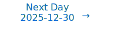

# Personalized Daily ArXiv Papers 2025-12-29

| *[gpt-5]*   | Prompt   | Completion   | Total   |
|:-----------:|:--------:|:------------:|:-------:|
| **Token**   | 22899    | 20931        | 43830   |
| **Cost**    | $0.03    | $0.21        | $0.24   |

Total arXiv papers: 341

Total scanned papers: 188

Total relevant papers: 17

**Table of contents with paper titles:**

1. [A Comedy of Estimators: On KL Regularization in RL Training of LLMs](#user-content-link1)
**Authors:** Vedant Shah, Johan Obando-Ceron, Vineet Jain, Brian Bartoldson, Bhavya Kailkhura, Sarthak Mittal, Glen Berseth, Pablo Samuel Castro, Yoshua Bengio, Nikolay Malkin, Moksh Jain, Siddarth Venkatraman, Aaron Courville

2. [Rethinking Output Alignment For 1-bit Post-Training Quantization of Large Language Models](#user-content-link2)
**Authors:** Dung Anh Hoang, Cuong Pham, Cuong Nguyen, Trung le, Jianfei Cai, Thanh-Toan Do

3. [Pruning as a Game: Equilibrium-Driven Sparsification of Neural Networks](#user-content-link3)
**Authors:** Zubair Shah, Noaman Khan

4. [Efficient MoE Inference with Fine-Grained Scheduling of Disaggregated Expert Parallelism](#user-content-link4)
**Authors:** Xinglin Pan, Shaohuai Shi, Wenxiang Lin, Yuxin Wang, Zhenheng Tang, Wei Wang, Xiaowen Chu

5. [GQ-VAE: A gated quantized VAE for learning variable length tokens](#user-content-link5)
**Authors:** Theo Datta, Kayla Huang, Sham Kakade, David Brandfonbrener

6. [An Equivariance Toolbox for Learning Dynamics](#user-content-link6)
**Authors:** Yongyi Yang, Liu Ziyin

7. [Optimizing Resource Allocation for Geographically-Distributed Inference by Large Language Models](#user-content-link7)
**Authors:** Tingyang Sun, Ting He, Bo Ji, Parimal Parag

8. [Approximation Capabilities of Feedforward Neural Networks with GELU Activations](#user-content-link8)
**Authors:** Konstantin Yakovlev, Nikita Puchkin

9. [Prefill vs. Decode Bottlenecks: SRAM-Frequency Tradeoffs and the Memory-Bandwidth Ceiling](#user-content-link9)
**Authors:** Hannah Atmer, Yuan Yao, Thiemo Voigt, Stefanos Kaxiras

10. [nncase: An End-to-End Compiler for Efficient LLM Deployment on Heterogeneous Storage Architectures](#user-content-link10)
**Authors:** Hui Guo, Qihang Zheng, Chenghai Huo, Dongliang Guo, Haoqi Yang, Yang Zhang

11. [Dictionary-Transform Generative Adversarial Networks](#user-content-link11)
**Authors:** Angshul Majumdar

12. [Perplexity-Aware Data Scaling Law: Perplexity Landscapes Predict Performance for Continual Pre-training](#user-content-link12)
**Authors:** Lei Liu, Hao Zhu, Yue Shen, Zhixuan Chu, Jian Wang, Jinjie Gu, Kui Ren

13. [InstructMoLE: Instruction-Guided Mixture of Low-rank Experts for Multi-Conditional Image Generation](#user-content-link13)
**Authors:** Jinqi Xiao, Qing Yan, Liming Jiang, Zichuan Liu, Hao Kang, Shen Sang, Tiancheng Zhi, Jing Liu, Cheng Yang, Xin Lu, Bo Yuan

14. [Scalable Deep Subspace Clustering Network](#user-content-link14)
**Authors:** Nairouz Mrabah, Mohamed Bouguessa, Sihem Sami

15. [Do Latent Tokens Think? A Causal and Adversarial Analysis of Chain-of-Continuous-Thought](#user-content-link15)
**Authors:** Yuyi Zhang, Boyu Tang, Tianjie Ju, Sufeng Duan, Gongshen Liu

16. [Towards Long-window Anchoring in Vision-Language Model Distillation](#user-content-link16)
**Authors:** Haoyi Zhou, Shuo Li, Tianyu Chen, Qi Song, Chonghan Gao, Jianxin Li

17. [Explainable Multimodal Regression via Information Decomposition](#user-content-link17)
**Authors:** Zhaozhao Ma, Shujian Yu

---

## 1. [A Comedy of Estimators: On KL Regularization in RL Training of LLMs](https://arxiv.org/abs/2512.21852) 

**ArXiv ID:** 2512.21852

**Authors:** Vedant Shah, Johan Obando-Ceron, Vineet Jain, Brian Bartoldson, Bhavya Kailkhura, Sarthak Mittal, Glen Berseth, Pablo Samuel Castro, Yoshua Bengio, Nikolay Malkin, Moksh Jain, Siddarth Venkatraman, Aaron Courville

**Abstract:** The reasoning performance of large language models (LLMs) can be substantially improved by training them with reinforcement learning (RL). The RL objective for LLM training involves a regularization term, which is the reverse Kullback-Leibler (KL) divergence between the trained policy and the reference policy. Since computing the KL divergence exactly is intractable, various estimators are used in practice to estimate it from on-policy samples. Despite its wide adoption, including in several open-source libraries, there is no systematic study analyzing the numerous ways of incorporating KL estimators in the objective and their effect on the downstream performance of RL-trained models. Recent works show that prevailing practices for incorporating KL regularization do not provide correct gradients for stated objectives, creating a discrepancy between the objective and its implementation. In this paper, we further analyze these practices and study the gradients of several estimators configurations, revealing how design choices shape gradient bias. We substantiate these findings with empirical observations by RL fine-tuning \texttt{Qwen2.5-7B}, \texttt{Llama-3.1-8B-Instruct} and \texttt{Qwen3-4B-Instruct-2507} with different configurations and evaluating their performance on both in- and out-of-distribution tasks. Through our analysis, we observe that, in on-policy settings: (1) estimator configurations with biased gradients can result in training instabilities; and (2) using estimator configurations resulting in unbiased gradients leads to better performance on in-domain as well as out-of-domain tasks. We also investigate the performance resulting from different KL configurations in off-policy settings and observe that KL regularization can help stabilize off-policy RL training resulting from asynchronous setups.

**Comment:** Author match

---

## 2. [Rethinking Output Alignment For 1-bit Post-Training Quantization of Large Language Models](https://arxiv.org/abs/2512.21651) 

**ArXiv ID:** 2512.21651

**Authors:** Dung Anh Hoang, Cuong Pham, Cuong Nguyen, Trung le, Jianfei Cai, Thanh-Toan Do

**Abstract:** Large Language Models (LLMs) deliver strong performance across a wide range of NLP tasks, but their massive sizes hinder deployment on resource-constrained devices. To reduce their computational and memory burden, various compression techniques have been proposed, including quantization, pruning, and knowledge distillation. Among these, post-training quantization (PTQ) is widely adopted for its efficiency, as it requires no retraining and only a small dataset for calibration, enabling low-cost deployment. Recent advances for post-training quantization have demonstrated that even sub-4-bit methods can maintain most of the original model performance. However, 1-bit quantization that converts floating-point weights to \(\pm\)1, remains particularly challenging, as existing 1-bit PTQ methods often suffer from significant performance degradation compared to the full-precision models. Specifically, most of existing 1-bit PTQ approaches focus on weight alignment, aligning the full-precision model weights with those of the quantized models, rather than directly aligning their outputs. Although the output-matching approach objective is more intuitive and aligns with the quantization goal, naively applying it in 1-bit LLMs often leads to notable performance degradation. In this paper, we investigate why and under what conditions output-matching fails, in the context of 1-bit LLM quantization. Based on our findings, we propose a novel data-aware PTQ approach for 1-bit LLMs that explicitly accounts for activation error accumulation while keeping optimization efficient. Empirical experiments demonstrate that our solution consistently outperforms existing 1-bit PTQ methods with minimal overhead.

**Comment:** Compression/Efficiency: post-training 1-bit quantization for LLMs with data-aware output alignment accounting for activation error accumulation.

**Relevance:** 10
**Novelty:** 8

---

## 3. [Pruning as a Game: Equilibrium-Driven Sparsification of Neural Networks](https://arxiv.org/abs/2512.22106) 

**ArXiv ID:** 2512.22106

**Authors:** Zubair Shah, Noaman Khan

**Abstract:** Neural network pruning is widely used to reduce model size and computational cost. Yet, most existing methods treat sparsity as an externally imposed constraint, enforced through heuristic importance scores or training-time regularization. In this work, we propose a fundamentally different perspective: pruning as an equilibrium outcome of strategic interaction among model components. We model parameter groups such as weights, neurons, or filters as players in a continuous non-cooperative game, where each player selects its level of participation in the network to balance contribution against redundancy and competition. Within this formulation, sparsity emerges naturally when continued participation becomes a dominated strategy at equilibrium. We analyze the resulting game and show that dominated players collapse to zero participation under mild conditions, providing a principled explanation for pruning behavior. Building on this insight, we derive a simple equilibrium-driven pruning algorithm that jointly updates network parameters and participation variables without relying on explicit importance scores. This work focuses on establishing a principled formulation and empirical validation of pruning as an equilibrium phenomenon, rather than exhaustive architectural or large-scale benchmarking. Experiments on standard benchmarks demonstrate that the proposed approach achieves competitive sparsity-accuracy trade-offs while offering an interpretable, theory-grounded alternative to existing pruning methods.

**Comment:** Compression/Sparsity: pruning formulated as a game yielding equilibrium-driven sparsification with an interpretable algorithm.

**Relevance:** 10
**Novelty:** 8

---

## 4. [Efficient MoE Inference with Fine-Grained Scheduling of Disaggregated Expert Parallelism](https://arxiv.org/abs/2512.21487) 

**ArXiv ID:** 2512.21487

**Authors:** Xinglin Pan, Shaohuai Shi, Wenxiang Lin, Yuxin Wang, Zhenheng Tang, Wei Wang, Xiaowen Chu

**Abstract:** The mixture-of-experts (MoE) architecture scales model size with sublinear computational increase but suffers from memory-intensive inference due to KV caches and sparse expert activation. Recent disaggregated expert parallelism (DEP) distributes attention and experts to dedicated GPU groups but lacks support for shared experts and efficient task scheduling, limiting performance.   We propose FinDEP, a fine-grained task scheduling algorithm for DEP that maximizes task overlap to improve MoE inference throughput. FinDEP introduces three innovations: 1) partitioning computation/communication into smaller tasks for fine-grained pipelining, 2) formulating a scheduling optimization supporting variable granularity and ordering, and 3) developing an efficient solver for this large search space.   Experiments on four GPU systems with DeepSeek-V2 and Qwen3-MoE show FinDEP improves throughput by up to 1.61x over prior methods, achieving up to 1.24x speedup on a 32-GPU system.

**Comment:** Directly targets Model Architecture (Mixture-of-Experts) and High Performance Computing via fine-grained scheduling for disaggregated expert parallelism to improve MoE inference throughput and KV-cache/communication overlap.

**Relevance:** 10
**Novelty:** 8

---

## 5. [GQ-VAE: A gated quantized VAE for learning variable length tokens](https://arxiv.org/abs/2512.21913) 

**ArXiv ID:** 2512.21913

**Authors:** Theo Datta, Kayla Huang, Sham Kakade, David Brandfonbrener

**Abstract:** While most frontier models still use deterministic frequency-based tokenization algorithms such as byte-pair encoding (BPE), there has been significant recent work to design learned neural tokenizers. However, these schemes generally add to underlying language model complexity and force large changes to architecture, making them hard to implement at large scales. To overcome these challenges, we propose the gated quantized variational autoencoder (GQ-VAE), a novel architecture that can be independently pre-trained to serve as a drop-in replacement for existing tokenizers. The key innovation of the architecture is to learn to encode variable-length discrete tokens. GQ-VAE improves compression and language modeling performance over a standard VQ-VAE tokenizer, and approaches the compression rate and language modeling performance of BPE. Interestingly, if we use BPE with a smaller vocabulary, such that the compression is equivalent between GQ-VAE and BPE, we find that GQ-VAE improves downstream language model learning. We conclude with a discussion of several exciting avenues for future work. Code can be found at https://github.com/Theo-Datta-115/gq-vae.

**Comment:** Model Architecture and Compression/Efficiency: a learned tokenizer (gated quantized VAE) producing variable-length discrete tokens; improves compression while remaining a drop-in replacement for BPE.

**Relevance:** 9
**Novelty:** 8

---

## 6. [An Equivariance Toolbox for Learning Dynamics](https://arxiv.org/abs/2512.21447) 

**ArXiv ID:** 2512.21447

**Authors:** Yongyi Yang, Liu Ziyin

**Abstract:** Many theoretical results in deep learning can be traced to symmetry or equivariance of neural networks under parameter transformations. However, existing analyses are typically problem-specific and focus on first-order consequences such as conservation laws, while the implications for second-order structure remain less understood. We develop a general equivariance toolbox that yields coupled first- and second-order constraints on learning dynamics. The framework extends classical Noether-type analyses in three directions: from gradient constraints to Hessian constraints, from symmetry to general equivariance, and from continuous to discrete transformations. At the first order, our framework unifies conservation laws and implicit-bias relations as special cases of a single identity. At the second order, it provides structural predictions about curvature: which directions are flat or sharp, how the gradient aligns with Hessian eigenspaces, and how the loss landscape geometry reflects the underlying transformation structure. We illustrate the framework through several applications, recovering known results while also deriving new characterizations that connect transformation structure to modern empirical observations about optimization geometry.

**Comment:** Representation Learning: theoretical framework linking symmetry/equivariance to first- and second-order learning dynamics (gradient–Hessian geometry).

**Relevance:** 9
**Novelty:** 8

---

## 7. [Optimizing Resource Allocation for Geographically-Distributed Inference by Large Language Models](https://arxiv.org/abs/2512.21884) 

**ArXiv ID:** 2512.21884

**Authors:** Tingyang Sun, Ting He, Bo Ji, Parimal Parag

**Abstract:** Large language models have demonstrated extraordinary performance in many AI tasks but are expensive to use, even after training, due to their requirement of high-end GPUs. Recently, a distributed system called PETALS was developed to lower the barrier for deploying LLMs by splitting the model blocks across multiple servers with low-end GPUs distributed over the Internet, which was much faster than swapping the model parameters between the GPU memory and other cheaper but slower local storage media. However, the performance of such a distributed system critically depends on the resource allocation, and how to do so optimally remains unknown. In this work, we present the first systematic study of the resource allocation problem in distributed LLM inference, with focus on two important decisions: block placement and request routing. Our main results include: experimentally validated performance models that can predict the inference performance under given block placement and request routing decisions, a formulation of the offline optimization of block placement and request routing as a mixed integer linear programming problem together with the NP-hardness proof and a polynomial-complexity algorithm with guaranteed performance, and an adaptation of the offline algorithm for the online setting with the same performance guarantee under bounded load. Through both experiments and experimentally-validated simulations, we have verified that the proposed solution can substantially reduce the inference time compared to the state-of-the-art solution in diverse settings with geographically-distributed servers. As a byproduct, we have also developed a light-weighted CPU-only simulator capable of predicting the performance of distributed LLM inference on GPU servers, which can evaluate large deployments and facilitate future research for researchers with limited GPU access.

**Comment:** High Performance Computing: algorithmic optimization of distributed LLM inference (block placement and request routing) with models and guarantees.

**Relevance:** 9
**Novelty:** 8

---

## 8. [Approximation Capabilities of Feedforward Neural Networks with GELU Activations](https://arxiv.org/abs/2512.21749) 

**ArXiv ID:** 2512.21749

**Authors:** Konstantin Yakovlev, Nikita Puchkin

**Abstract:** We derive an approximation error bound that holds simultaneously for a function and all its derivatives up to any prescribed order. The bounds apply to elementary functions, including multivariate polynomials, the exponential function, and the reciprocal function, and are obtained using feedforward neural networks with the Gaussian Error Linear Unit (GELU) activation. In addition, we report the network size, weight magnitudes, and behavior at infinity. Our analysis begins with a constructive approximation of multiplication, where we prove the simultaneous validity of error bounds over domains of increasing size for a given approximator. Leveraging this result, we obtain approximation guarantees for division and the exponential function, ensuring that all higher-order derivatives of the resulting approximators remain globally bounded.

**Comment:** Representation Learning/Theory: approximation bounds for GELU networks covering functions and higher-order derivatives (expressivity/approximation theory).

**Relevance:** 9
**Novelty:** 8

---

## 9. [Prefill vs. Decode Bottlenecks: SRAM-Frequency Tradeoffs and the Memory-Bandwidth Ceiling](https://arxiv.org/abs/2512.22066) 

**ArXiv ID:** 2512.22066

**Authors:** Hannah Atmer, Yuan Yao, Thiemo Voigt, Stefanos Kaxiras

**Abstract:** Energy consumption dictates the cost and environmental impact of deploying Large Language Models. This paper investigates the impact of on-chip SRAM size and operating frequency on the energy efficiency and performance of LLM inference, focusing on the distinct behaviors of the compute-bound prefill and memory-bound decode phases. Our simulation methodology combines OpenRAM for energy modeling, LLMCompass for latency simulation, and ScaleSIM for systolic array operational intensity. Our findings show that total energy use is predominantly determined by SRAM size in both phases, with larger buffers significantly increasing static energy due to leakage, which is not offset by corresponding latency benefits. We quantitatively explore the memory-bandwidth bottleneck, demonstrating that while high operating frequencies reduce prefill latency, their positive impact on memory-bound decode latency is capped by the external memory bandwidth. Counter-intuitively, high compute frequency can reduce total energy by reducing execution time and consequently decreasing static energy consumption more than the resulting dynamic power increase. We identify an optimal hardware configuration for the simulated workload: high operating frequencies (1200MHz-1400MHz) and a small local buffer size of 32KB to 64KB. This combination achieves the best energy-delay product, balancing low latency with high energy efficiency. Furthermore, we demonstrate how memory bandwidth acts as a performance ceiling, and that increasing compute frequency only yields performance gains up to the point where the workload becomes memory-bound. This analysis provides concrete architectural insights for designing energy-efficient LLM accelerators, especially for datacenters aiming to minimize their energy overhead.

**Comment:** High-performance computing: systems-level analysis of SRAM size/frequency and memory-bandwidth bottlenecks for LLM inference.

**Relevance:** 9
**Novelty:** 7

---

## 10. [nncase: An End-to-End Compiler for Efficient LLM Deployment on Heterogeneous Storage Architectures](https://arxiv.org/abs/2512.21571) 

**ArXiv ID:** 2512.21571

**Authors:** Hui Guo, Qihang Zheng, Chenghai Huo, Dongliang Guo, Haoqi Yang, Yang Zhang

**Abstract:** The efficient deployment of large language models (LLMs) is hindered by memory architecture heterogeneity, where traditional compilers suffer from fragmented workflows and high adaptation costs. We present nncase, an open-source, end-to-end compilation framework designed to unify optimization across diverse targets. Central to nncase is an e-graph-based term rewriting engine that mitigates the phase ordering problem, enabling global exploration of computation and data movement strategies. The framework integrates three key modules: Auto Vectorize for adapting to heterogeneous computing units, Auto Distribution for searching parallel strategies with cost-aware communication optimization, and Auto Schedule for maximizing on-chip cache locality. Furthermore, a buffer-aware Codegen phase ensures efficient kernel instantiation. Evaluations show that nncase outperforms mainstream frameworks like MLC LLM and Intel IPEX on Qwen3 series models and achieves performance comparable to the hand-optimized llama.cpp on CPUs, demonstrating the viability of automated compilation for high-performance LLM deployment. The source code is available at https://github.com/kendryte/nncase.

**Comment:** High Performance Computing/Efficiency: end-to-end compiler with e-graph rewriting, auto-parallel distribution, and cache-aware scheduling for LLM deployment.

**Relevance:** 9
**Novelty:** 7

---

## 11. [Dictionary-Transform Generative Adversarial Networks](https://arxiv.org/abs/2512.21677) 

**ArXiv ID:** 2512.21677

**Authors:** Angshul Majumdar

**Abstract:** Generative adversarial networks (GANs) are widely used for distribution learning, yet their classical formulations remain theoretically fragile, with ill-posed objectives, unstable training dynamics, and limited interpretability. In this work, we introduce \emph{Dictionary-Transform Generative Adversarial Networks} (DT-GAN), a fully model-based adversarial framework in which the generator is a sparse synthesis dictionary and the discriminator is an analysis transform acting as an energy model. By restricting both players to linear operators with explicit constraints, DT-GAN departs fundamentally from neural GAN architectures and admits rigorous theoretical analysis.   We show that the DT-GAN adversarial game is well posed and admits at least one Nash equilibrium. Under a sparse generative model, equilibrium solutions are provably identifiable up to standard permutation and sign ambiguities and exhibit a precise geometric alignment between synthesis and analysis operators. We further establish finite-sample stability and consistency of empirical equilibria, demonstrating that DT-GAN training converges reliably under standard sampling assumptions and remains robust in heavy-tailed regimes.   Experiments on mixture-structured synthetic data validate the theoretical predictions, showing that DT-GAN consistently recovers underlying structure and exhibits stable behavior under identical optimization budgets where a standard GAN degrades. DT-GAN is not proposed as a universal replacement for neural GANs, but as a principled adversarial alternative for data distributions that admit sparse synthesis structure. The results demonstrate that adversarial learning can be made interpretable, stable, and provably correct when grounded in classical sparse modeling.

**Comment:** Advances Representation Learning with sparse synthesis/analysis operators and a model-based adversarial framework; strong theoretical guarantees on identifiability and stability for sparse dictionary learning.

**Relevance:** 8
**Novelty:** 8

---

## 12. [Perplexity-Aware Data Scaling Law: Perplexity Landscapes Predict Performance for Continual Pre-training](https://arxiv.org/abs/2512.21515) 

**ArXiv ID:** 2512.21515

**Authors:** Lei Liu, Hao Zhu, Yue Shen, Zhixuan Chu, Jian Wang, Jinjie Gu, Kui Ren

**Abstract:** Continual Pre-training (CPT) serves as a fundamental approach for adapting foundation models to domain-specific applications. Scaling laws for pre-training define a power-law relationship between dataset size and the test loss of an LLM. However, the marginal gains from simply increasing data for CPT diminish rapidly, yielding suboptimal data utilization and inefficient training. To address this challenge, we propose a novel perplexity-aware data scaling law to establish a predictive relationship between the perplexity landscape of domain-specific data and the test loss. Our approach leverages the perplexity derived from the pre-trained model on domain data as a proxy for estimating the knowledge gap, effectively quantifying the informational perplexity landscape of candidate training samples. By fitting this scaling law across diverse perplexity regimes, we enable adaptive selection of high-utility data subsets, prioritizing content that maximizes knowledge absorption while minimizing redundancy and noise. Extensive experiments demonstrate that our method consistently identifies near-optimal training subsets and achieves superior performance on both medical and general-domain benchmarks.

**Comment:** Training dynamics/data scaling: perplexity-aware scaling law for continual pre-training, guiding data selection.

**Relevance:** 8
**Novelty:** 7

---

## 13. [InstructMoLE: Instruction-Guided Mixture of Low-rank Experts for Multi-Conditional Image Generation](https://arxiv.org/abs/2512.21788) 

**ArXiv ID:** 2512.21788

**Authors:** Jinqi Xiao, Qing Yan, Liming Jiang, Zichuan Liu, Hao Kang, Shen Sang, Tiancheng Zhi, Jing Liu, Cheng Yang, Xin Lu, Bo Yuan

**Abstract:** Parameter-Efficient Fine-Tuning of Diffusion Transformers (DiTs) for diverse, multi-conditional tasks often suffers from task interference when using monolithic adapters like LoRA. The Mixture of Low-rank Experts (MoLE) architecture offers a modular solution, but its potential is usually limited by routing policies that operate at a token level. Such local routing can conflict with the global nature of user instructions, leading to artifacts like spatial fragmentation and semantic drift in complex image generation tasks. To address these limitations, we introduce InstructMoLE, a novel framework that employs an Instruction-Guided Mixture of Low-Rank Experts. Instead of per-token routing, InstructMoLE utilizes a global routing signal, Instruction-Guided Routing (IGR), derived from the user's comprehensive instruction. This ensures that a single, coherently chosen expert council is applied uniformly across all input tokens, preserving the global semantics and structural integrity of the generation process. To complement this, we introduce an output-space orthogonality loss, which promotes expert functional diversity and mitigates representational collapse. Extensive experiments demonstrate that InstructMoLE significantly outperforms existing LoRA adapters and MoLE variants across challenging multi-conditional generation benchmarks. Our work presents a robust and generalizable framework for instruction-driven fine-tuning of generative models, enabling superior compositional control and fidelity to user intent.

**Comment:** Model architecture: Mixture of Low-rank Experts with instruction-guided global routing for coherent expert selection.

**Relevance:** 8
**Novelty:** 7

---

## 14. [Scalable Deep Subspace Clustering Network](https://arxiv.org/abs/2512.21434) 

**ArXiv ID:** 2512.21434

**Authors:** Nairouz Mrabah, Mohamed Bouguessa, Sihem Sami

**Abstract:** Subspace clustering methods face inherent scalability limits due to the $O(n^3)$ cost (with $n$ denoting the number of data samples) of constructing full $n\times n$ affinities and performing spectral decomposition. While deep learning-based approaches improve feature extraction, they maintain this computational bottleneck through exhaustive pairwise similarity computations. We propose SDSNet (Scalable Deep Subspace Network), a deep subspace clustering framework that achieves $\mathcal{O}(n)$ complexity through (1) landmark-based approximation, avoiding full affinity matrices, (2) joint optimization of auto-encoder reconstruction with self-expression objectives, and (3) direct spectral clustering on factorized representations. The framework combines convolutional auto-encoders with subspace-preserving constraints. Experimental results demonstrate that SDSNet achieves comparable clustering quality to state-of-the-art methods with significantly improved computational efficiency.

**Comment:** Architecture/Efficiency: scalable deep subspace clustering using autoencoders with landmark-based O(n) complexity.

**Relevance:** 8
**Novelty:** 7

---

## 15. [Do Latent Tokens Think? A Causal and Adversarial Analysis of Chain-of-Continuous-Thought](https://arxiv.org/abs/2512.21711) 

**ArXiv ID:** 2512.21711

**Authors:** Yuyi Zhang, Boyu Tang, Tianjie Ju, Sufeng Duan, Gongshen Liu

**Abstract:** Latent tokens are gaining attention for enhancing reasoning in large language models (LLMs), yet their internal mechanisms remain unclear. This paper examines the problem from a reliability perspective, uncovering fundamental weaknesses: latent tokens function as uninterpretable placeholders rather than encoding faithful reasoning. While resistant to perturbation, they promote shortcut usage over genuine reasoning. We focus on Chain-of-Continuous-Thought (COCONUT), which claims better efficiency and stability than explicit Chain-of-Thought (CoT) while maintaining performance. We investigate this through two complementary approaches. First, steering experiments perturb specific token subsets, namely COCONUT and explicit CoT. Unlike CoT tokens, COCONUT tokens show minimal sensitivity to steering and lack reasoning-critical information. Second, shortcut experiments evaluate models under biased and out-of-distribution settings. Results on MMLU and HotpotQA demonstrate that COCONUT consistently exploits dataset artifacts, inflating benchmark performance without true reasoning. These findings reposition COCONUT as a pseudo-reasoning mechanism: it generates plausible traces that conceal shortcut dependence rather than faithfully representing reasoning processes.

**Comment:** Provides Representation Learning insights by causally/adversarially analyzing latent tokens vs. CoT, revealing shortcut reliance and lack of reasoning signal.

**Relevance:** 8
**Novelty:** 7

---

## 16. [Towards Long-window Anchoring in Vision-Language Model Distillation](https://arxiv.org/abs/2512.21576) 

**ArXiv ID:** 2512.21576

**Authors:** Haoyi Zhou, Shuo Li, Tianyu Chen, Qi Song, Chonghan Gao, Jianxin Li

**Abstract:** While large vision-language models (VLMs) demonstrate strong long-context understanding, their prevalent small branches fail on linguistics-photography alignment for a limited window size. We discover that knowledge distillation improves students' capability as a complement to Rotary Position Embeddings (RoPE) on window sizes (anchored from large models). Building on this insight, we propose LAid, which directly aims at the transfer of long-range attention mechanisms through two complementary components: (1) a progressive distance-weighted attention matching that dynamically emphasizes longer position differences during training, and (2) a learnable RoPE response gain modulation that selectively amplifies position sensitivity where needed. Extensive experiments across multiple model families demonstrate that LAid-distilled models achieve up to 3.2 times longer effective context windows compared to baseline small models, while maintaining or improving performance on standard VL benchmarks. Spectral analysis also suggests that LAid successfully preserves crucial low-frequency attention components that conventional methods fail to transfer. Our work not only provides practical techniques for building more efficient long-context VLMs but also offers theoretical insights into how positional understanding emerges and transfers during distillation.

**Comment:** Model Compression/Efficiency via knowledge distillation of long-range attention (distance-weighted attention matching and RoPE gain modulation) for long-context VLMs.

**Relevance:** 8
**Novelty:** 7

---

## 17. [Explainable Multimodal Regression via Information Decomposition](https://arxiv.org/abs/2512.22102) 

**ArXiv ID:** 2512.22102

**Authors:** Zhaozhao Ma, Shujian Yu

**Abstract:** Multimodal regression aims to predict a continuous target from heterogeneous input sources and typically relies on fusion strategies such as early or late fusion. However, existing methods lack principled tools to disentangle and quantify the individual contributions of each modality and their interactions, limiting the interpretability of multimodal fusion. We propose a novel multimodal regression framework grounded in Partial Information Decomposition (PID), which decomposes modality-specific representations into unique, redundant, and synergistic components. The basic PID framework is inherently underdetermined. To resolve this, we introduce inductive bias by enforcing Gaussianity in the joint distribution of latent representations and the transformed response variable (after inverse normal transformation), thereby enabling analytical computation of the PID terms. Additionally, we derive a closed-form conditional independence regularizer to promote the isolation of unique information within each modality. Experiments on six real-world datasets, including a case study on large-scale brain age prediction from multimodal neuroimaging data, demonstrate that our framework outperforms state-of-the-art methods in both predictive accuracy and interpretability, while also enabling informed modality selection for efficient inference. Implementation is available at https://github.com/zhaozhaoma/PIDReg.

**Comment:** Representation Learning: principled multimodal fusion via Partial Information Decomposition with analytic estimators and independence regularization.

**Relevance:** 8
**Novelty:** 7

---

# Paper Selection Prompt

## System Prompt

> You are a helpful paper reading assistant whose job is to read daily posts from ArXiv and identify a few papers that your friend will enjoy reading.
> Your job is to carefully read the paper titles and abstracts below and find the ones that match the criteria below.

## User Prompt

> ## Instructions
> 
> Write the response in JSONL format with {ARXIVID, COMMENT, RELEVANCE, NOVELTY} on each line, one for each paper.
> 
> - ARXIVID: should be the ArXiv ID.
> - COMMENT: should identify whether there is a criteria that match the paper very closely. These matches should not be based on general terms like "language modeling" or "advancements" and should specifically refer to a criterion. No need to mention the non-matching criteria.
> - RELEVANCE: should be a score from 1-10.
> - NOVELTY: should be a score from 1-10.
> 
> ## Scoring Criteria
> 
> > The "Relevance" score measures how closely the paper aligns with the core topics of the prompt.
> > The "Novelty" score assesses the originality and impact of the paper.
> > They are two **ORTHONORMAL** axes and **SHOULD NOT** be confused with each other.
> 
> ### Relevance Scoring
> 
> - Relevance 9-10 (Completely Relevant)
>   - Focus: Fully aligned with core topics with no deviation, score the highest if contains relevant keywords in it.
>   - Examples: Papers focused on foundational methods or theoretical research, whose titles contain topic keywords like "MoE".
> 
> - Relevance 7-8 (Relevant)
>   - Focus: Retain a solid link to the main research area, though may touch on peripheral elements.
>   - Examples: Papers research on the fundamental part of MoE through a less critical aspect like its behavior in GNN.
> 
> - Relevance 5-6 (Borderline)
>   - Focus: Maintains a link to the core topic but also extends into at least one other domain/area beyond the primary focus.
>   - Examples: Work referencing MoE centered on reinforcement learning.
> 
> - Relevance 3-4 (Irrelevant)
>   - Focus: Largely outside our interests with no association to our topics.
>   - Examples: Application-focused papers like using MoE to solve a problem in the real world.
> 
> - Relevance 1-2 (Ignore)
>   - Focus: Purely unrelated to our topics. Completely a different domain.
>   - **Exception**: If the paper hints at a cutting-edge, radically new direction that could eventually transform the primary domain, consider a score of 9–10 despite initial appearances. (Usually a very rare concept that belongs to the fundamental research)
> 
> ### Novelty Scoring
> 
> - Novelty 9-10 (Breakthrough)
>   - Definition: Groundbreaking methods/theory introducing new directions or solving major challenges.
>   - Examples: Entirely new paradigm for foundational models; a novel theory transforming representation learning.
> 
> - Novelty 7-8 (Improvements)
>   - Definition: Substantial insights/enhancements, though not a full paradigm shift.
>   - Examples: Modifications on existing methods yielding significantly better results.
> 
> - Novelty 5-6 (Borderline)
>   - Definition: Incremental contributions with possible long-term benefits, not immediately transformative.
>   - Examples: Moderately novel extension to an existing architecture; refining current methods without fundamentally altering them.
> 
> - Novelty 3-4 (Tangential)
>   - Definition: Minor or domain-specific improvements with limited broader impact.
>   - Examples: Slight modifications to known methods with strange motivation; purely engineering jobs like a new benchmark/dataset.
> 
> - Novelty 1-2 (Low)
>   - Definition: Minimal originality, applying standard approaches without real innovation.
>   - Examples: Using an off-the-shelf model without adding new insights; purely application-driven studies like finetuning a pretrained model using existing methods.
> 
> ## Papers
> 
> [PAPER LIST HERE]
> 
> ## Relevant Topics
> 
> Use the following relevance criteria to focus on foundational research. Keep **relevant** papers and filter out **irrelevant** ones. Avoid purely **application-driven** work.
> 
> 1. Model Architecture
>    - Relevant: Mixture-of-Experts (MoE), Transformers, Conditional/Dynamic Networks, Autoencoders, analysis/innovations on existing architectures.
>    - Irrelevant: Merely using existing architectures for a certain task without insights into the structure themselves.
> 
> 2. Model Compression and Efficiency
>    - Relevant: Sparsity, pruning, quantization, low-rank approaches, cache, or other algorithmic/theoretical efficiency breakthroughs.
>    - Irrelevant: Straightforward applications of existing compression methods to new tasks.
> 
> 3. High Performance Computing
>    - Relevant: Algorithmic or systems-level innovations enabling training of large-scale models, distributed training techniques, memory optimization.
>    - Irrelevant: Incremental engineering improvements without novel algorithmic contributions.
> 
> 4. Representation Learning
>    - Relevant: Insights into how deep networks encode information, feature/dictionary learning, sparse/contrastive methods, training dynamics in neural networks.
>    - Irrelevant: Standard applications of known techniques lacking new theoretical or methodological contributions.
> 
> **Keywords:**
> 
> - Relevant: Mixture of Experts (MoE), Representation Learning, Compression/Efficiency, Sparse/Sparsity, Pruning, Quantization, Low-rank, Foundation Model, etc.
> - Irrelevant: Reinforcement Learning, Transfer Learning, Federated Learning, Online Learning, Diffusion Models, etc.
> - Application: Image Segmentation, Medical Imaging, 3D Vision, Video Understanding, Information Retrieval, Summarization, Recommendation Systems, Machine Translation, Speech Recognition, Signal Processing, Spatial/Temporal Modeling, Time Series, Knowledge Graph, etc.