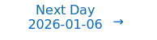

# Personalized Daily ArXiv Papers 2026-01-05

| *[gpt-5]*   | Prompt   | Completion   | Total   |
|:-----------:|:--------:|:------------:|:-------:|
| **Token**   | 23063    | 22799        | 45862   |
| **Cost**    | $0.03    | $0.23        | $0.26   |

Total arXiv papers: 331

Total scanned papers: 202

Total relevant papers: 12

**Table of contents with paper titles:**

1. [Task-Driven Kernel Flows: Label Rank Compression and Laplacian Spectral Filtering](#user-content-link1)
**Authors:** Hongxi Li, Chunlin Huang

2. [Fast-weight Product Key Memory](#user-content-link2)
**Authors:** Tianyu Zhao, Llion Jones

3. [GRIT -- Geometry-Aware PEFT with K-FACPreconditioning, Fisher-Guided Reprojection, andDynamic Rank Adaptation](#user-content-link3)
**Authors:** Pritish Saha, Chandrav Rajbangshi, Rudra Goyal, Mohit Goyal, Anurag Deo, Biswajit Roy, Ningthoujam Dhanachandra Singh, Raxit Goswami, Amitava Das

4. [Deep Networks Learn Deep Hierarchical Models](#user-content-link4)
**Authors:** Amit Daniely

5. [Constructing a Neuro-Symbolic Mathematician from First Principles](#user-content-link5)
**Authors:** Keqin Xie

6. [Deep Delta Learning](#user-content-link6)
**Authors:** Yifan Zhang, Yifeng Liu, Mengdi Wang, Quanquan Gu

7. [RMAAT: Astrocyte-Inspired Memory Compression and Replay for Efficient Long-Context Transformers](#user-content-link7)
**Authors:** Md Zesun Ahmed Mia, Malyaban Bal, Abhronil Sengupta

8. [Revati: Transparent GPU-Free Time-Warp Emulation for LLM Serving](#user-content-link8)
**Authors:** Amey Agrawal, Mayank Yadav, Sukrit Kumar, Anirudha Agrawal, Garv Ghai, Souradeep Bera, Elton Pinto, Sirish Gambhira, Mohammad Adain, Kasra Sohrab, Chus Antonanzas, Alexey Tumanov

9. [QSLM: A Performance- and Memory-aware Quantization Framework with Tiered Search Strategy for Spike-driven Language Models](#user-content-link9)
**Authors:** Rachmad Vidya Wicaksana Putra, Pasindu Wickramasinghe, Muhammad Shafique

10. [The Reasoning-Creativity Trade-off: Toward Creativity-Driven Problem Solving](#user-content-link10)
**Authors:** Max Ruiz Luyten, Mihaela van der Schaar

11. [Three factor delay learning rules for spiking neural networks](#user-content-link11)
**Authors:** Luke Vassallo, Nima Taherinejad

12. [Toward Large-Scale Photonics-Empowered AI Systems: From Physical Design Automation to System-Algorithm Co-Exploration](#user-content-link12)
**Authors:** Ziang Yin, Hongjian Zhou, Nicholas Gangi, Meng Zhang, Jeff Zhang, Zhaoran Rena Huang, Jiaqi Gu

---

## 1. [Task-Driven Kernel Flows: Label Rank Compression and Laplacian Spectral Filtering](https://arxiv.org/abs/2601.00276) 

**ArXiv ID:** 2601.00276

**Authors:** Hongxi Li, Chunlin Huang

**Abstract:** We present a theory of feature learning in wide L2-regularized networks showing that supervised learning is inherently compressive. We derive a kernel ODE that predicts a "water-filling" spectral evolution and prove that for any stable steady state, the kernel rank is bounded by the number of classes ($C$). We further demonstrate that SGD noise is similarly low-rank ($O(C)$), confining dynamics to the task-relevant subspace. This framework unifies the deterministic and stochastic views of alignment and contrasts the low-rank nature of supervised learning with the high-rank, expansive representations of self-supervision.

**Comment:** Representation Learning and Efficiency: theory showing supervised learning induces low-rank kernels (rank bounded by number of classes) via a kernel ODE and low-rank SGD noise.

**Relevance:** 10
**Novelty:** 9

---

## 2. [Fast-weight Product Key Memory](https://arxiv.org/abs/2601.00671) 

**ArXiv ID:** 2601.00671

**Authors:** Tianyu Zhao, Llion Jones

**Abstract:** Sequence modeling layers in modern language models typically face a trade-off between storage capacity and computational efficiency. While Softmax attention offers unbounded storage at prohibitive quadratic costs, linear variants provide efficiency but suffer from limited, fixed-size storage. We propose Fast-weight Product Key Memory (FwPKM), a novel architecture that resolves this tension by transforming the sparse Product Key Memory (PKM) from a static module into a dynamic, "fast-weight" episodic memory. Unlike PKM, FwPKM updates its parameters dynamically at both training and inference time via local chunk-level gradient descent, allowing the model to rapidly memorize and retrieve new key-value pairs from input sequences. Experiments reveal that FwPKM functions as an effective episodic memory that complements the semantic memory of standard modules, yielding significant perplexity reductions on long-context datasets. Notably, in Needle in a Haystack evaluations, FwPKM generalizes to 128K-token contexts despite being trained on only 4K-token sequences.

**Comment:** Introduces a dynamic fast-weight Product Key Memory—sparse episodic memory updated at train/inference time—for sequence models (Model Architecture; Efficiency via sparse memory).

**Relevance:** 10
**Novelty:** 9

---

## 3. [GRIT -- Geometry-Aware PEFT with K-FACPreconditioning, Fisher-Guided Reprojection, andDynamic Rank Adaptation](https://arxiv.org/abs/2601.00231) 

**ArXiv ID:** 2601.00231

**Authors:** Pritish Saha, Chandrav Rajbangshi, Rudra Goyal, Mohit Goyal, Anurag Deo, Biswajit Roy, Ningthoujam Dhanachandra Singh, Raxit Goswami, Amitava Das

**Abstract:** Parameter-efficient fine-tuning (PEFT) is the default way to adapt LLMs, but widely used LoRA and QLoRA are largely geometry-agnostic: they optimize in fixed, randomly oriented low-rank subspaces with first-order descent, mostly ignoring local loss curvature. This can inflate the effective update budget and amplify drift along weakly constrained directions. We introduce GRIT, a dynamic, curvature-aware LoRA procedure that preserves the LoRA parameterization but: (1) preconditions gradients in rank space using K-FAC as a natural-gradient proxy; (2) periodically reprojects the low-rank basis onto dominant Fisher eigendirections to suppress drift; and (3) adapts the effective rank from the spectrum so capacity concentrates where signal resides. Across instruction-following, comprehension, and reasoning benchmarks on LLaMA backbones, GRIT matches or surpasses LoRA and QLoRA while reducing trainable parameters by 46% on average (25--80% across tasks), without practical quality loss across prompt styles and data mixes. To model forgetting, we fit a curvature-modulated power law. Empirically, GRIT yields lower drift and a better updates-vs-retention frontier than strong PEFT-optimizer baselines (Orthogonal-LoRA, IA3, DoRA, Eff-FT, Shampoo).

**Comment:** Model Compression and Efficiency: low-rank PEFT with K-FAC preconditioning, Fisher-guided reprojection, and dynamic rank adaptation.

**Relevance:** 10
**Novelty:** 8

---

## 4. [Deep Networks Learn Deep Hierarchical Models](https://arxiv.org/abs/2601.00455) 

**ArXiv ID:** 2601.00455

**Authors:** Amit Daniely

**Abstract:** We consider supervised learning with $n$ labels and show that layerwise SGD on residual networks can efficiently learn a class of hierarchical models. This model class assumes the existence of an (unknown) label hierarchy $L_1 \subseteq L_2 \subseteq \dots \subseteq L_r = [n]$, where labels in $L_1$ are simple functions of the input, while for $i > 1$, labels in $L_i$ are simple functions of simpler labels.   Our class surpasses models that were previously shown to be learnable by deep learning algorithms, in the sense that it reaches the depth limit of efficient learnability. That is, there are models in this class that require polynomial depth to express, whereas previous models can be computed by log-depth circuits.   Furthermore, we suggest that learnability of such hierarchical models might eventually form a basis for understanding deep learning. Beyond their natural fit for domains where deep learning excels, we argue that the mere existence of human ``teachers" supports the hypothesis that hierarchical structures are inherently available. By providing granular labels, teachers effectively reveal ``hints'' or ``snippets'' of the internal algorithms used by the brain. We formalize this intuition, showing that in a simplified model where a teacher is partially aware of their internal logic, a hierarchical structure emerges that facilitates efficient learnability.

**Comment:** Representation Learning/Theory: proves layerwise SGD on ResNets efficiently learns deep hierarchical label models (polynomial depth), advancing learnability theory.

**Relevance:** 9
**Novelty:** 9

---

## 5. [Constructing a Neuro-Symbolic Mathematician from First Principles](https://arxiv.org/abs/2601.00125) 

**ArXiv ID:** 2601.00125

**Authors:** Keqin Xie

**Abstract:** Large Language Models (LLMs) exhibit persistent logical failures in complex reasoning due to the lack of an internal axiomatic framework. We propose Mathesis, a neuro-symbolic architecture that encodes mathematical states as higher-order hypergraphs and uses a Symbolic Reasoning Kernel (SRK)--a differentiable logic engine that maps constraints to a continuous energy landscape. By defining a global energy function E(G), where zero energy implies logical consistency, the SRK yields gradient-based signals to train a Hypergraph Transformer Brain, turning proof search into energy minimization. Multi-step deduction is enabled via Monte Carlo Tree Search and Evolutionary Proof Search, guided by learned value functions and semantic unification.

**Comment:** Model Architecture: neuro-symbolic design using a Hypergraph Transformer and a differentiable symbolic reasoning kernel with energy-based training signals.

**Relevance:** 9
**Novelty:** 8

---

## 6. [Deep Delta Learning](https://arxiv.org/abs/2601.00417) 

**ArXiv ID:** 2601.00417

**Authors:** Yifan Zhang, Yifeng Liu, Mengdi Wang, Quanquan Gu

**Abstract:** The efficacy of deep residual networks is fundamentally predicated on the identity shortcut connection. While this mechanism effectively mitigates the vanishing gradient problem, it imposes a strictly additive inductive bias on feature transformations, thereby limiting the network's capacity to model complex state transitions. In this paper, we introduce Deep Delta Learning (DDL), a novel architecture that generalizes the standard residual connection by modulating the identity shortcut with a learnable, data-dependent geometric transformation. This transformation, termed the Delta Operator, constitutes a rank-1 perturbation of the identity matrix, parameterized by a reflection direction vector $\mathbf{k}(\mathbf{X})$ and a gating scalar $\beta(\mathbf{X})$. We provide a spectral analysis of this operator, demonstrating that the gate $\beta(\mathbf{X})$ enables dynamic interpolation between identity mapping, orthogonal projection, and geometric reflection. Furthermore, we restructure the residual update as a synchronous rank-1 injection, where the gate acts as a dynamic step size governing both the erasure of old information and the writing of new features. This unification empowers the network to explicitly control the spectrum of its layer-wise transition operator, enabling the modeling of complex, non-monotonic dynamics while preserving the stable training characteristics of gated residual architectures.

**Comment:** Model Architecture: generalizes residual connections via a learnable rank‑1 Delta operator with spectral control and gated dynamics.

**Relevance:** 9
**Novelty:** 8

---

## 7. [RMAAT: Astrocyte-Inspired Memory Compression and Replay for Efficient Long-Context Transformers](https://arxiv.org/abs/2601.00426) 

**ArXiv ID:** 2601.00426

**Authors:** Md Zesun Ahmed Mia, Malyaban Bal, Abhronil Sengupta

**Abstract:** The quadratic complexity of self-attention mechanism presents a significant impediment to applying Transformer models to long sequences. This work explores computational principles derived from astrocytes-glial cells critical for biological memory and synaptic modulation-as a complementary approach to conventional architectural modifications for efficient self-attention. We introduce the Recurrent Memory Augmented Astromorphic Transformer (RMAAT), an architecture integrating abstracted astrocyte functionalities. RMAAT employs a recurrent, segment-based processing strategy where persistent memory tokens propagate contextual information. An adaptive compression mechanism, governed by a novel retention factor derived from simulated astrocyte long-term plasticity (LTP), modulates these tokens. Attention within segments utilizes an efficient, linear-complexity mechanism inspired by astrocyte short-term plasticity (STP). Training is performed using Astrocytic Memory Replay Backpropagation (AMRB), a novel algorithm designed for memory efficiency in recurrent networks. Evaluations on the Long Range Arena (LRA) benchmark demonstrate RMAAT's competitive accuracy and substantial improvements in computational and memory efficiency, indicating the potential of incorporating astrocyte-inspired dynamics into scalable sequence models.

**Comment:** Model Architecture and Efficiency: recurrent memory tokens with adaptive compression and memory-efficient backprop (AMRB) for long-context Transformers.

**Relevance:** 9
**Novelty:** 8

---

## 8. [Revati: Transparent GPU-Free Time-Warp Emulation for LLM Serving](https://arxiv.org/abs/2601.00397) 

**ArXiv ID:** 2601.00397

**Authors:** Amey Agrawal, Mayank Yadav, Sukrit Kumar, Anirudha Agrawal, Garv Ghai, Souradeep Bera, Elton Pinto, Sirish Gambhira, Mohammad Adain, Kasra Sohrab, Chus Antonanzas, Alexey Tumanov

**Abstract:** Deploying LLMs efficiently requires testing hundreds of serving configurations, but evaluating each one on a GPU cluster takes hours and costs thousands of dollars. Discrete-event simulators are faster and cheaper, but they require re-implementing the serving system's control logic -- a burden that compounds as frameworks evolve.   We present Revati, a time-warp emulator that enables performance modeling by directly executing real serving system code at simulation-like speed. The system intercepts CUDA API calls to virtualize device management, allowing serving frameworks to run without physical GPUs. Instead of executing GPU kernels, it performs time jumps -- fast-forwarding virtual time by predicted kernel durations. We propose a coordination protocol that synchronizes these jumps across distributed processes while preserving causality. On vLLM and SGLang, Revati achieves less than 5% prediction error across multiple models and parallelism configurations, while running 5-17x faster than real GPU execution.

**Comment:** Systems-level method for LLM serving emulation via CUDA virtualization and distributed time-warp coordination (High Performance Computing).

**Relevance:** 9
**Novelty:** 8

---

## 9. [QSLM: A Performance- and Memory-aware Quantization Framework with Tiered Search Strategy for Spike-driven Language Models](https://arxiv.org/abs/2601.00679) 

**ArXiv ID:** 2601.00679

**Authors:** Rachmad Vidya Wicaksana Putra, Pasindu Wickramasinghe, Muhammad Shafique

**Abstract:** Large Language Models (LLMs) have been emerging as prominent AI models for solving many natural language tasks due to their high performance (e.g., accuracy) and capabilities in generating high-quality responses to the given inputs. However, their large computational cost, huge memory footprints, and high processing power/energy make it challenging for their embedded deployments. Amid several tinyLLMs, recent works have proposed spike-driven language models (SLMs) for significantly reducing the processing power/energy of LLMs. However, their memory footprints still remain too large for low-cost and resource-constrained embedded devices. Manual quantization approach may effectively compress SLM memory footprints, but it requires a huge design time and compute power to find the quantization setting for each network, hence making this approach not-scalable for handling different networks, performance requirements, and memory budgets. To bridge this gap, we propose QSLM, a novel framework that performs automated quantization for compressing pre-trained SLMs, while meeting the performance and memory constraints. To achieve this, QSLM first identifies the hierarchy of the given network architecture and the sensitivity of network layers under quantization, then employs a tiered quantization strategy (e.g., global-, block-, and module-level quantization) while leveraging a multi-objective performance-and-memory trade-off function to select the final quantization setting. Experimental results indicate that our QSLM reduces memory footprint by up to 86.5%, reduces power consumption by up to 20%, maintains high performance across different tasks (i.e., by up to 84.4% accuracy of sentiment classification on the SST-2 dataset and perplexity score of 23.2 for text generation on the WikiText-2 dataset) close to the original non-quantized model while meeting the performance and memory constraints.

**Comment:** Model Compression and Efficiency: automated quantization with tiered (global/block/module) search optimizing a performance–memory trade-off for spike-driven LMs.

**Relevance:** 9
**Novelty:** 7

---

## 10. [The Reasoning-Creativity Trade-off: Toward Creativity-Driven Problem Solving](https://arxiv.org/abs/2601.00747) 

**ArXiv ID:** 2601.00747

**Authors:** Max Ruiz Luyten, Mihaela van der Schaar

**Abstract:** State-of-the-art large language model (LLM) pipelines rely on bootstrapped reasoning loops: sampling diverse chains of thought and reinforcing the highest-scoring ones, mainly optimizing correctness. We analyze how this design choice is sensitive to the collapse of the model's distribution over reasoning paths, slashing semantic entropy and undermining creative problem-solving. To analyze this failure, we introduce Distributional Creative Reasoning (DCR), a unified variational objective that casts training as gradient flow through probability measures on solution traces. STaR, GRPO, and DPO, as well as entropy bonuses, and other methods, all constitute special cases of the same loss. The framework delivers three core results: (i) the diversity decay theorem, describing how correctness-based objectives lead to distinct modes of diversity decay for STaR, GRPO, and DPO; (ii) designs that ensure convergence to a stable and diverse policy, effectively preventing collapse; and (iii) simple, actionable recipes to achieve this in practice. DCR thus offers the first principled recipe for LLMs that remain both correct and creative.

**Comment:** Proposes a unified training objective (DCR) to prevent diversity collapse in reasoning, addressing training dynamics and representation over solution traces (Representation Learning).

**Relevance:** 8
**Novelty:** 8

---

## 11. [Three factor delay learning rules for spiking neural networks](https://arxiv.org/abs/2601.00668) 

**ArXiv ID:** 2601.00668

**Authors:** Luke Vassallo, Nima Taherinejad

**Abstract:** Spiking Neural Networks (SNNs) are dynamical systems that operate on spatiotemporal data, yet their learnable parameters are often limited to synaptic weights, contributing little to temporal pattern recognition. Learnable parameters that delay spike times can improve classification performance in temporal tasks, but existing methods rely on large networks and offline learning, making them unsuitable for real-time operation in resource-constrained environments. In this paper, we introduce synaptic and axonal delays to leaky integrate and fire (LIF)-based feedforward and recurrent SNNs, and propose three-factor learning rules to simultaneously learn delay parameters online. We employ a smooth Gaussian surrogate to approximate spike derivatives exclusively for the eligibility trace calculation, and together with a top-down error signal determine parameter updates. Our experiments show that incorporating delays improves accuracy by up to 20% over a weights-only baseline, and for networks with similar parameter counts, jointly learning weights and delays yields up to 14% higher accuracy. On the SHD speech recognition dataset, our method achieves similar accuracy to offline backpropagation-based approaches. Compared to state-of-the-art methods, it reduces model size by 6.6x and inference latency by 67%, with only a 2.4% drop in classification accuracy. Our findings benefit the design of power and area-constrained neuromorphic processors by enabling on-device learning and lowering memory requirements.

**Comment:** Model Architecture/Training rules for SNNs: online three-factor learning of synaptic/axonal delays for temporal tasks, improving efficiency on neuromorphic hardware.

**Relevance:** 8
**Novelty:** 7

---

## 12. [Toward Large-Scale Photonics-Empowered AI Systems: From Physical Design Automation to System-Algorithm Co-Exploration](https://arxiv.org/abs/2601.00129) 

**ArXiv ID:** 2601.00129

**Authors:** Ziang Yin, Hongjian Zhou, Nicholas Gangi, Meng Zhang, Jeff Zhang, Zhaoran Rena Huang, Jiaqi Gu

**Abstract:** In this work, we identify three considerations that are essential for realizing practical photonic AI systems at scale: (1) dynamic tensor operation support for modern models rather than only weight-static kernels, especially for attention/Transformer-style workloads; (2) systematic management of conversion, control, and data-movement overheads, where multiplexing and dataflow must amortize electronic costs instead of letting ADC/DAC and I/O dominate; and (3) robustness under hardware non-idealities that become more severe as integration density grows. To study these coupled tradeoffs quantitatively, and to ensure they remain meaningful under real implementation constraints, we build a cross-layer toolchain that supports photonic AI design from early exploration to physical realization. SimPhony provides implementation-aware modeling and rapid cross-layer evaluation, translating physical costs into system-level metrics so architectural decisions are grounded in realistic assumptions. ADEPT and ADEPT-Z enable end-to-end circuit and topology exploration, connecting system objectives to feasible photonic fabrics under practical device and circuit constraints. Finally, Apollo and LiDAR provide scalable photonic physical design automation, turning candidate circuits into manufacturable layouts while accounting for routing, thermal, and crosstalk constraints.

**Comment:** Cross-layer systems/toolchain for photonic AI with dynamic tensor ops for Transformers and implementation-aware co-design (High Performance Computing).

**Relevance:** 8
**Novelty:** 7

---

# Paper Selection Prompt

## System Prompt

> You are a helpful paper reading assistant whose job is to read daily posts from ArXiv and identify a few papers that your friend will enjoy reading.
> Your job is to carefully read the paper titles and abstracts below and find the ones that match the criteria below.

## User Prompt

> ## Instructions
> 
> Write the response in JSONL format with {ARXIVID, COMMENT, RELEVANCE, NOVELTY} on each line, one for each paper.
> 
> - ARXIVID: should be the ArXiv ID.
> - COMMENT: should identify whether there is a criteria that match the paper very closely. These matches should not be based on general terms like "language modeling" or "advancements" and should specifically refer to a criterion. No need to mention the non-matching criteria.
> - RELEVANCE: should be a score from 1-10.
> - NOVELTY: should be a score from 1-10.
> 
> ## Scoring Criteria
> 
> > The "Relevance" score measures how closely the paper aligns with the core topics of the prompt.
> > The "Novelty" score assesses the originality and impact of the paper.
> > They are two **ORTHONORMAL** axes and **SHOULD NOT** be confused with each other.
> 
> ### Relevance Scoring
> 
> - Relevance 9-10 (Completely Relevant)
>   - Focus: Fully aligned with core topics with no deviation, score the highest if contains relevant keywords in it.
>   - Examples: Papers focused on foundational methods or theoretical research, whose titles contain topic keywords like "MoE".
> 
> - Relevance 7-8 (Relevant)
>   - Focus: Retain a solid link to the main research area, though may touch on peripheral elements.
>   - Examples: Papers research on the fundamental part of MoE through a less critical aspect like its behavior in GNN.
> 
> - Relevance 5-6 (Borderline)
>   - Focus: Maintains a link to the core topic but also extends into at least one other domain/area beyond the primary focus.
>   - Examples: Work referencing MoE centered on reinforcement learning.
> 
> - Relevance 3-4 (Irrelevant)
>   - Focus: Largely outside our interests with no association to our topics.
>   - Examples: Application-focused papers like using MoE to solve a problem in the real world.
> 
> - Relevance 1-2 (Ignore)
>   - Focus: Purely unrelated to our topics. Completely a different domain.
>   - **Exception**: If the paper hints at a cutting-edge, radically new direction that could eventually transform the primary domain, consider a score of 9–10 despite initial appearances. (Usually a very rare concept that belongs to the fundamental research)
> 
> ### Novelty Scoring
> 
> - Novelty 9-10 (Breakthrough)
>   - Definition: Groundbreaking methods/theory introducing new directions or solving major challenges.
>   - Examples: Entirely new paradigm for foundational models; a novel theory transforming representation learning.
> 
> - Novelty 7-8 (Improvements)
>   - Definition: Substantial insights/enhancements, though not a full paradigm shift.
>   - Examples: Modifications on existing methods yielding significantly better results.
> 
> - Novelty 5-6 (Borderline)
>   - Definition: Incremental contributions with possible long-term benefits, not immediately transformative.
>   - Examples: Moderately novel extension to an existing architecture; refining current methods without fundamentally altering them.
> 
> - Novelty 3-4 (Tangential)
>   - Definition: Minor or domain-specific improvements with limited broader impact.
>   - Examples: Slight modifications to known methods with strange motivation; purely engineering jobs like a new benchmark/dataset.
> 
> - Novelty 1-2 (Low)
>   - Definition: Minimal originality, applying standard approaches without real innovation.
>   - Examples: Using an off-the-shelf model without adding new insights; purely application-driven studies like finetuning a pretrained model using existing methods.
> 
> ## Papers
> 
> [PAPER LIST HERE]
> 
> ## Relevant Topics
> 
> Use the following relevance criteria to focus on foundational research. Keep **relevant** papers and filter out **irrelevant** ones. Avoid purely **application-driven** work.
> 
> 1. Model Architecture
>    - Relevant: Mixture-of-Experts (MoE), Transformers, Conditional/Dynamic Networks, Autoencoders, analysis/innovations on existing architectures.
>    - Irrelevant: Merely using existing architectures for a certain task without insights into the structure themselves.
> 
> 2. Model Compression and Efficiency
>    - Relevant: Sparsity, pruning, quantization, low-rank approaches, cache, or other algorithmic/theoretical efficiency breakthroughs.
>    - Irrelevant: Straightforward applications of existing compression methods to new tasks.
> 
> 3. High Performance Computing
>    - Relevant: Algorithmic or systems-level innovations enabling training of large-scale models, distributed training techniques, memory optimization.
>    - Irrelevant: Incremental engineering improvements without novel algorithmic contributions.
> 
> 4. Representation Learning
>    - Relevant: Insights into how deep networks encode information, feature/dictionary learning, sparse/contrastive methods, training dynamics in neural networks.
>    - Irrelevant: Standard applications of known techniques lacking new theoretical or methodological contributions.
> 
> **Keywords:**
> 
> - Relevant: Mixture of Experts (MoE), Representation Learning, Compression/Efficiency, Sparse/Sparsity, Pruning, Quantization, Low-rank, Foundation Model, etc.
> - Irrelevant: Reinforcement Learning, Transfer Learning, Federated Learning, Online Learning, Diffusion Models, etc.
> - Application: Image Segmentation, Medical Imaging, 3D Vision, Video Understanding, Information Retrieval, Summarization, Recommendation Systems, Machine Translation, Speech Recognition, Signal Processing, Spatial/Temporal Modeling, Time Series, Knowledge Graph, etc.