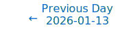
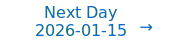

# Personalized Daily ArXiv Papers 2026-01-14

| *[gpt-5]*   | Prompt   | Completion   | Total   |
|:-----------:|:--------:|:------------:|:-------:|
| **Token**   | 40049    | 35996        | 76045   |
| **Cost**    | $0.05    | $0.36        | $0.41   |

Total arXiv papers: 524

Total scanned papers: 322

Total relevant papers: 25

**Table of contents with paper titles:**

1. [Hierarchical Sparse Plus Low Rank Compression of LLM](#user-content-link1)
**Authors:** Pawan Kumar, Aditi Gupta

2. [Reasoning Beyond Chain-of-Thought: A Latent Computational Mode in Large Language Models](#user-content-link2)
**Authors:** Zhenghao He, Guangzhi Xiong, Bohan Liu, Sanchit Sinha, Aidong Zhang

3. [Sherry: Hardware-Efficient 1.25-Bit Ternary Quantization via Fine-grained Sparsification](#user-content-link3)
**Authors:** Hong Huang, Decheng Wu, Qiangqiang Hu, Guanghua Yu, Jinhai Yang, Jianchen Zhu, Xue Liu, Dapeng Wu

4. [WaveFormer: Frequency-Time Decoupled Vision Modeling with Wave Equation](#user-content-link4)
**Authors:** Zishan Shu, Juntong Wu, Wei Yan, Xudong Liu, Hongyu Zhang, Chang Liu, Youdong Mao, Jie Chen

5. [Towards Principled Design of Mixture-of-Experts Language Models under Memory and Inference Constraints](#user-content-link5)
**Authors:** Seng Pei Liew, Kenta Shinzato, Yuyang Dong

6. [KVzap: Fast, Adaptive, and Faithful KV Cache Pruning](#user-content-link6)
**Authors:** Simon Jegou, Maximilian Jeblick

7. [Towards Specialized Generalists: A Multi-Task MoE-LoRA Framework for Domain-Specific LLM Adaptation](#user-content-link7)
**Authors:** Yuxin Yang, Aoxiong Zeng, Xiangquan Yang

8. [Demystifying the Slash Pattern in Attention: The Role of RoPE](#user-content-link8)
**Authors:** Yuan Cheng, Fengzhuo Zhang, Yunlong Hou, Cunxiao Du, Chao Du, Tianyu Pang, Aixin Sun, Zhuoran Yang

9. [Multiplex Thinking: Reasoning via Token-wise Branch-and-Merge](#user-content-link9)
**Authors:** Yao Tang, Li Dong, Yaru Hao, Qingxiu Dong, Furu Wei, Jiatao Gu

10. [Controlled LLM Training on Spectral Sphere](#user-content-link10)
**Authors:** Tian Xie, Haoming Luo, Haoyu Tang, Yiwen Hu, Jason Klein Liu, Qingnan Ren, Yang Wang, Wayne Xin Zhao, Rui Yan, Bing Su, Chong Luo, Baining Guo

11. [LDLT L-Lipschitz Network Weight Parameterization Initialization](#user-content-link11)
**Authors:** Marius F. R. Juston, Ramavarapu S. Sreenivas, Dustin Nottage, Ahmet Soylemezoglu

12. [Parallel Context-of-Experts Decoding for Retrieval Augmented Generation](#user-content-link12)
**Authors:** Giulio Corallo, Paolo Papotti

13. [Towards A Unified PAC-Bayesian Framework for Norm-based Generalization Bounds](#user-content-link13)
**Authors:** Xinping Yi, Gaojie Jin, Xiaowei Huang, Shi Jin

14. [M$^2$FMoE: Multi-Resolution Multi-View Frequency Mixture-of-Experts for Extreme-Adaptive Time Series Forecasting](#user-content-link14)
**Authors:** Yaohui Huang, Runmin Zou, Yun Wang, Laeeq Aslam, Ruipeng Dong

15. [Deconstructing Pre-training: Knowledge Attribution Analysis in MoE and Dense Models](#user-content-link15)
**Authors:** Bo Wang, Junzhuo Li, Hong Chen, Yuanlin Chu, Yuxuan Fan, Xuming Hu

16. [Sliced-Wasserstein Distribution Alignment Loss Improves the Ultra-Low-Bit Quantization of Large Language Models](#user-content-link16)
**Authors:** Deyu Cao, Yixin Yin, Samin Aref

17. [YaPO: Learnable Sparse Activation Steering Vectors for Domain Adaptation](#user-content-link17)
**Authors:** Abdelaziz Bounhar, Rania Hossam Elmohamady Elbadry, Hadi Abdine, Preslav Nakov, Michalis Vazirgiannis, Guokan Shang

18. [HIPPO: Accelerating Video Large Language Models Inference via Holistic-aware Parallel Speculative Decoding](#user-content-link18)
**Authors:** Qitan Lv, Tianyu Liu, Wen Wu, Xuenan Xu, Bowen Zhou, Feng Wu, Chao Zhang

19. [Deep Exploration of Epoch-wise Double Descent in Noisy Data: Signal Separation, Large Activation, and Benign Overfitting](#user-content-link19)
**Authors:** Tomoki Kubo, Ryuken Uda, Yusuke Iida

20. [ORBIT: On-policy Exploration-Exploitation for Controllable Multi-Budget Reasoning](#user-content-link20)
**Authors:** Kun Liang, Clive Bai, Xin Xu, Chenming Tang, Sanwoo Lee, Weijie Liu, Saiyong Yang, Yunfang Wu

21. [Hyperbolic Heterogeneous Graph Transformer](#user-content-link21)
**Authors:** Jongmin Park, Seunghoon Han, Hyewon Lee, Won-Yong Shin, Sungsu Lim

22. [Representations of Text and Images Align From Layer One](#user-content-link22)
**Authors:** Ev\v{z}en Wybitul, Javier Rando, Florian Tram\`er, Stanislav Fort

23. [NOVAK: Unified adaptive optimizer for deep neural networks](#user-content-link23)
**Authors:** Sergii Kavun

24. [Mechanisms are Transferable: Data-Efficient Low-Resource Adaptation via Circuit-Targeted Supervised Fine-Tuning](#user-content-link24)
**Authors:** Khumaisa Nur'aini, Ayu Purwarianti, Alham Fikri Aji, Derry Wijaya

25. [Supervised Spike Agreement Dependent Plasticity for Fast Local Learning in Spiking Neural Networks](#user-content-link25)
**Authors:** Gouri Lakshmi S, Athira Chandrasekharan, Harshit Kumar, Muhammed Sahad E, Bikas C Das, Saptarshi Bej

---

## 1. [Hierarchical Sparse Plus Low Rank Compression of LLM](https://arxiv.org/abs/2601.07839) 

**ArXiv ID:** 2601.07839

**Authors:** Pawan Kumar, Aditi Gupta

**Abstract:** Modern large language models (LLMs) place extraordinary pressure on memory and compute budgets, making principled compression indispensable for both deployment and continued training. We present Hierarchical Sparse Plus Low-Rank (HSS) compression, a two-stage scheme that (i) removes the largest-magnitude weights into a sparse matrix S and (ii) applies a recursive Hierarchically Sparse Separable (HSS) low-rank factorisation to the dense residual matrix. A recursive rank-reducing strategy and a reverse Cuthill-Mckee (RCM) permutation are introduced to align high weights towards the diagonal with the block-diagonal hierarchy, maximising off-diagonal compressibility (because they are touched only once). HSS is hardware-friendly: its matrix-vector multiply reduces to one sparse and a sequence of thin-matrix multiplications and can be trained end-to-end with standard optimisers.   Experiments on LLaMA-7B show that targeting only the self-attention projections (1.6 B parameters of Q, K, and V matrices out of a total 7B parameters) suffices to yield large memory savings while retaining comparable state-of-the-art perplexity scores on test samples of the WikiText dataset. For example, with a 30\% sparsity budget and an outer rank of 512, sHSS-RCM achieves a perplexity of 1.64, outperforming dense baselines and classical sparse-plus-SVD variants, while also achieving significant memory savings.

**Comment:** Strongly matches Model Compression and Efficiency: sparse-plus-low-rank (HSS) decomposition for LLM layers with hardware-friendly matvec.

**Relevance:** 10
**Novelty:** 8

---

## 2. [Reasoning Beyond Chain-of-Thought: A Latent Computational Mode in Large Language Models](https://arxiv.org/abs/2601.08058) 

**ArXiv ID:** 2601.08058

**Authors:** Zhenghao He, Guangzhi Xiong, Bohan Liu, Sanchit Sinha, Aidong Zhang

**Abstract:** Chain-of-Thought (CoT) prompting has improved the reasoning performance of large language models (LLMs), but it remains unclear why it works and whether it is the unique mechanism for triggering reasoning in large language models. In this work, we study this question by directly analyzing and intervening on the internal representations of LLMs with Sparse Autoencoders (SAEs), identifying a small set of latent features that are causally associated with LLM reasoning behavior. Across multiple model families and reasoning benchmarks, we find that steering a single reasoning-related latent feature can substantially improve accuracy without explicit CoT prompting. For large models, latent steering achieves performance comparable to standard CoT prompting while producing more efficient outputs. We further observe that this reasoning-oriented internal state is triggered early in generation and can override prompt-level instructions that discourage explicit reasoning. Overall, our results suggest that multi-step reasoning in LLMs is supported by latent internal activations that can be externally activated, while CoT prompting is one effective, but not unique, way of activating this mechanism rather than its necessary cause.

**Comment:** Strongly matches Representation Learning: identifies and steers sparse latent features (via SAEs) causally tied to reasoning, enabling activation-level control.

**Relevance:** 10
**Novelty:** 8

---

## 3. [Sherry: Hardware-Efficient 1.25-Bit Ternary Quantization via Fine-grained Sparsification](https://arxiv.org/abs/2601.07892) 

**ArXiv ID:** 2601.07892

**Authors:** Hong Huang, Decheng Wu, Qiangqiang Hu, Guanghua Yu, Jinhai Yang, Jianchen Zhu, Xue Liu, Dapeng Wu

**Abstract:** The deployment of Large Language Models (LLMs) on resource-constrained edge devices is increasingly hindered by prohibitive memory and computational requirements. While ternary quantization offers a compelling solution by reducing weights to {-1, 0, +1}, current implementations suffer from a fundamental misalignment with commodity hardware. Most existing methods must choose between 2-bit aligned packing, which incurs significant bit wastage, or 1.67-bit irregular packing, which degrades inference speed. To resolve this tension, we propose Sherry, a hardware-efficient ternary quantization framework. Sherry introduces a 3:4 fine-grained sparsity that achieves a regularized 1.25-bit width by packing blocks of four weights into five bits, restoring power-of-two alignment. Furthermore, we identify weight trapping issue in sparse ternary training, which leads to representational collapse. To address this, Sherry introduces Arenas, an annealing residual synapse mechanism that maintains representational diversity during training. Empirical evaluations on LLaMA-3.2 across five benchmarks demonstrate that Sherry matches state-of-the-art ternary performance while significantly reducing model size. Notably, on an Intel i7-14700HX CPU, our 1B model achieves zero accuracy loss compared to SOTA baselines while providing 25% bit savings and 10% speed up. The code is available at https://github.com/Tencent/AngelSlim .

**Comment:** Compression/Efficiency: hardware-aligned 1.25-bit ternary quantization via 3:4 fine-grained sparsity and novel training (Arenas) to avoid trapping; notable packing innovation.

**Relevance:** 10
**Novelty:** 8

---

## 4. [WaveFormer: Frequency-Time Decoupled Vision Modeling with Wave Equation](https://arxiv.org/abs/2601.08602) 

**ArXiv ID:** 2601.08602

**Authors:** Zishan Shu, Juntong Wu, Wei Yan, Xudong Liu, Hongyu Zhang, Chang Liu, Youdong Mao, Jie Chen

**Abstract:** Vision modeling has advanced rapidly with Transformers, whose attention mechanisms capture visual dependencies but lack a principled account of how semantic information propagates spatially. We revisit this problem from a wave-based perspective: feature maps are treated as spatial signals whose evolution over an internal propagation time (aligned with network depth) is governed by an underdamped wave equation. In this formulation, spatial frequency-from low-frequency global layout to high-frequency edges and textures-is modeled explicitly, and its interaction with propagation time is controlled rather than implicitly fixed. We derive a closed-form, frequency-time decoupled solution and implement it as the Wave Propagation Operator (WPO), a lightweight module that models global interactions in O(N log N) time-far lower than attention. Building on WPO, we propose a family of WaveFormer models as drop-in replacements for standard ViTs and CNNs, achieving competitive accuracy across image classification, object detection, and semantic segmentation, while delivering up to 1.6x higher throughput and 30% fewer FLOPs than attention-based alternatives. Furthermore, our results demonstrate that wave propagation introduces a complementary modeling bias to heat-based methods, effectively capturing both global coherence and high-frequency details essential for rich visual semantics. Codes are available at: https://github.com/ZishanShu/WaveFormer.

**Comment:** Model Architecture and Efficiency: replaces attention with a wave propagation operator (O(N log N)) via frequency-time decoupled formulation for global interactions.

**Relevance:** 10
**Novelty:** 8

---

## 5. [Towards Principled Design of Mixture-of-Experts Language Models under Memory and Inference Constraints](https://arxiv.org/abs/2601.08215) 

**ArXiv ID:** 2601.08215

**Authors:** Seng Pei Liew, Kenta Shinzato, Yuyang Dong

**Abstract:** Modern Mixture-of-Experts (MoE) language models are designed based on total parameters (memory footprint) and active parameters (inference cost). However, we find these two factors alone are insufficient to describe an optimal architecture. Through a systematic study, we demonstrate that MoE performance is primarily determined by total parameters ($N_{total}$) and expert sparsity ($s:=n_{exp}/n_{topk}$).   Moreover, $n_{exp}$ and $n_{topk}$ do not "cancel out" within the sparsity ratio; instead, a larger total number of experts slightly penalizes performance by forcing a reduction in core model dimensions (depth and width) to meet memory constraints. This motivates a simple principle for MoE design which maximizes $N_{total}$ while minimizing $s$ (maximizing $n_{topk}$) and $n_{exp}$ under the given constraints. Our findings provide a robust framework for resolving architectural ambiguity and guiding MoE design.

**Comment:** Model Architecture (MoE): principled design under memory/inference constraints; highlights total parameters and expert sparsity as key factors.

**Relevance:** 10
**Novelty:** 7

---

## 6. [KVzap: Fast, Adaptive, and Faithful KV Cache Pruning](https://arxiv.org/abs/2601.07891) 

**ArXiv ID:** 2601.07891

**Authors:** Simon Jegou, Maximilian Jeblick

**Abstract:** Growing context lengths in transformer-based language models have made the key-value (KV) cache a critical inference bottleneck. While many KV cache pruning methods have been proposed, they have not yet been adopted in major inference engines due to speed--accuracy trade-offs. We introduce KVzap, a fast, input-adaptive approximation of KVzip that works in both prefilling and decoding. On Qwen3-8B, Llama-3.1-8B-Instruct, and Qwen3-32B across long-context and reasoning tasks, KVzap achieves $2$--$4\times$ KV cache compression with negligible accuracy loss and achieves state-of-the-art performance on the KVpress leaderboard. Code and models are available at https://github.com/NVIDIA/kvpress.

**Comment:** Strongly matches Model Compression and Efficiency: fast, input-adaptive KV cache pruning for Transformers (memory and latency optimization).

**Relevance:** 10
**Novelty:** 7

---

## 7. [Towards Specialized Generalists: A Multi-Task MoE-LoRA Framework for Domain-Specific LLM Adaptation](https://arxiv.org/abs/2601.07935) 

**ArXiv ID:** 2601.07935

**Authors:** Yuxin Yang, Aoxiong Zeng, Xiangquan Yang

**Abstract:** The rapid evolution of Large Language Models (LLMs) has shifted focus from general-purpose capabilities to domain-specific expertise. However, adapting LLMs to specialized fields such as medicine presents two challenge: (1) the "Stability-Plasticity Dilemma", where the model must acquire complex clinical knowledge without suffering from catastrophic forgetting of general world knowledge; and (2) "Task Interference", where disparate sub-tasks, such as medical diagnosis, report summarization, and drug-drug interaction prediction, compete for limited low-rank parameter space. In this paper, we propose Med-MoE-LoRA, a novel framework that integrates Mixture-of-Experts (MoE) with Low-Rank Adaptation (LoRA) to enable efficient multi-task domain adaptation, especially for medical scenarios. Drawing inspiration from recent advances, our framework employs an asymmetric expert distribution where deeper layers are equipped with a higher density of LoRA experts to capture complex semantic abstractions. We further introduce a "Knowledge-Preservation Plugin", inspired by LoRA MoE, to isolate and protect general-purpose reasoning. By utilizing soft merging with adaptive routing and rank-wise decoupling, Med-MoE-LoRA achieves superior performance in medical benchmarks while reducing interference. Experimental results demonstrate that our approach consistently outperforms standard LoRA and conventional MoE architectures across multiple clinical NLP tasks while retaining the model's general cognitive capabilities.

**Comment:** Model Architecture: combines Mixture-of-Experts with Low-Rank Adaptation (LoRA) for multi-task domain adaptation and interference mitigation.

**Relevance:** 10
**Novelty:** 7

---

## 8. [Demystifying the Slash Pattern in Attention: The Role of RoPE](https://arxiv.org/abs/2601.08297) 

**ArXiv ID:** 2601.08297

**Authors:** Yuan Cheng, Fengzhuo Zhang, Yunlong Hou, Cunxiao Du, Chao Du, Tianyu Pang, Aixin Sun, Zhuoran Yang

**Abstract:** Large Language Models (LLMs) often exhibit slash attention patterns, where attention scores concentrate along the $\Delta$-th sub-diagonal for some offset $\Delta$. These patterns play a key role in passing information across tokens. But why do they emerge? In this paper, we demystify the emergence of these Slash-Dominant Heads (SDHs) from both empirical and theoretical perspectives. First, by analyzing open-source LLMs, we find that SDHs are intrinsic to models and generalize to out-of-distribution prompts. To explain the intrinsic emergence, we analyze the queries, keys, and Rotary Position Embedding (RoPE), which jointly determine attention scores. Our empirical analysis reveals two characteristic conditions of SDHs: (1) Queries and keys are almost rank-one, and (2) RoPE is dominated by medium- and high-frequency components. Under these conditions, queries and keys are nearly identical across tokens, and interactions between medium- and high-frequency components of RoPE give rise to SDHs. Beyond empirical evidence, we theoretically show that these conditions are sufficient to ensure the emergence of SDHs by formalizing them as our modeling assumptions. Particularly, we analyze the training dynamics of a shallow Transformer equipped with RoPE under these conditions, and prove that models trained via gradient descent exhibit SDHs. The SDHs generalize to out-of-distribution prompts.

**Comment:** Representation/Architecture analysis: explains slash attention patterns via RoPE with theoretical and empirical support.

**Relevance:** 9
**Novelty:** 8

---

## 9. [Multiplex Thinking: Reasoning via Token-wise Branch-and-Merge](https://arxiv.org/abs/2601.08808) 

**ArXiv ID:** 2601.08808

**Authors:** Yao Tang, Li Dong, Yaru Hao, Qingxiu Dong, Furu Wei, Jiatao Gu

**Abstract:** Large language models often solve complex reasoning tasks more effectively with Chain-of-Thought (CoT), but at the cost of long, low-bandwidth token sequences. Humans, by contrast, often reason softly by maintaining a distribution over plausible next steps. Motivated by this, we propose Multiplex Thinking, a stochastic soft reasoning mechanism that, at each thinking step, samples K candidate tokens and aggregates their embeddings into a single continuous multiplex token. This preserves the vocabulary embedding prior and the sampling dynamics of standard discrete generation, while inducing a tractable probability distribution over multiplex rollouts. Consequently, multiplex trajectories can be directly optimized with on-policy reinforcement learning (RL). Importantly, Multiplex Thinking is self-adaptive: when the model is confident, the multiplex token is nearly discrete and behaves like standard CoT; when it is uncertain, it compactly represents multiple plausible next steps without increasing sequence length. Across challenging math reasoning benchmarks, Multiplex Thinking consistently outperforms strong discrete CoT and RL baselines from Pass@1 through Pass@1024, while producing shorter sequences. The code and checkpoints are available at https://github.com/GMLR-Penn/Multiplex-Thinking.

**Comment:** Matches Model Architecture: introduces a conditional/dynamic token-wise branch-and-merge mechanism with RL-optimized multiplex tokens.

**Relevance:** 9
**Novelty:** 8

---

## 10. [Controlled LLM Training on Spectral Sphere](https://arxiv.org/abs/2601.08393) 

**ArXiv ID:** 2601.08393

**Authors:** Tian Xie, Haoming Luo, Haoyu Tang, Yiwen Hu, Jason Klein Liu, Qingnan Ren, Yang Wang, Wayne Xin Zhao, Rui Yan, Bing Su, Chong Luo, Baining Guo

**Abstract:** Scaling large models requires optimization strategies that ensure rapid convergence grounded in stability. Maximal Update Parametrization ($\boldsymbol{\mu}$P) provides a theoretical safeguard for width-invariant $\Theta(1)$ activation control, whereas emerging optimizers like Muon are only ``half-aligned'' with these constraints: they control updates but allow weights to drift. To address this limitation, we introduce the \textbf{Spectral Sphere Optimizer (SSO)}, which enforces strict module-wise spectral constraints on both weights and their updates. By deriving the steepest descent direction on the spectral sphere, SSO realizes a fully $\boldsymbol{\mu}$P-aligned optimization process. To enable large-scale training, we implement SSO as an efficient parallel algorithm within Megatron. Through extensive pretraining on diverse architectures, including Dense 1.7B, MoE 8B-A1B, and 200-layer DeepNet models, SSO consistently outperforms AdamW and Muon. Furthermore, we observe significant practical stability benefits, including improved MoE router load balancing, suppressed outliers, and strictly bounded activations.

**Comment:** Matches HPC/Systems-level training: Spectral Sphere Optimizer enforces module-wise spectral constraints, µP-aligned stability, benefiting MoE routing and activations.

**Relevance:** 9
**Novelty:** 8

---

## 11. [LDLT L-Lipschitz Network Weight Parameterization Initialization](https://arxiv.org/abs/2601.08253) 

**ArXiv ID:** 2601.08253

**Authors:** Marius F. R. Juston, Ramavarapu S. Sreenivas, Dustin Nottage, Ahmet Soylemezoglu

**Abstract:** We analyze initialization dynamics for LDLT-based $\mathcal{L}$-Lipschitz layers by deriving the exact marginal output variance when the underlying parameter matrix $W_0\in \mathbb{R}^{m\times n}$ is initialized with IID Gaussian entries $\mathcal{N}(0,\sigma^2)$. The Wishart distribution, $S=W_0W_0^\top\sim\mathcal{W}_m(n,\sigma^2 \boldsymbol{I}_m)$, used for computing the output marginal variance is derived in closed form using expectations of zonal polynomials via James' theorem and a Laplace-integral expansion of $(\alpha \boldsymbol{I}_m+S)^{-1}$. We develop an Isserlis/Wick-based combinatorial expansion for $\operatorname{\mathbb{E}}\left[\operatorname{tr}(S^k)\right]$ and provide explicit truncated moments up to $k=10$, which yield accurate series approximations for small-to-moderate $\sigma^2$. Monte Carlo experiments confirm the theoretical estimates. Furthermore, empirical analysis was performed to quantify that, using current He or Kaiming initialization with scaling $1/\sqrt{n}$, the output variance is $0.41$, whereas the new parameterization with $10/ \sqrt{n}$ for $\alpha=1$ results in an output variance of $0.9$. The findings clarify why deep $\mathcal{L}$-Lipschitz networks suffer rapid information loss at initialization and offer practical prescriptions for choosing initialization hyperparameters to mitigate this effect. However, using the Higgs boson classification dataset, a hyperparameter sweep over optimizers, initialization scale, and depth was conducted to validate the results on real-world data, showing that although the derivation ensures variance preservation, empirical results indicate He initialization still performs better.

**Comment:** Model Architecture/Training Dynamics: analytic initialization for LDLT L-Lipschitz layers with exact variance derivations; practical prescriptions for stable deep Lipschitz networks.

**Relevance:** 9
**Novelty:** 8

---

## 12. [Parallel Context-of-Experts Decoding for Retrieval Augmented Generation](https://arxiv.org/abs/2601.08670) 

**ArXiv ID:** 2601.08670

**Authors:** Giulio Corallo, Paolo Papotti

**Abstract:** Retrieval Augmented Generation faces a trade-off: concatenating documents in a long prompt enables multi-document reasoning but creates prefill bottlenecks, while encoding document KV caches separately offers speed but breaks cross-document interaction. We propose Parallel Context-of-Experts Decoding (Pced), a training-free framework that shifts evidence aggregation from the attention mechanism to the decoding. Pced treats retrieved documents as isolated "experts", synchronizing their predictions via a novel retrieval-aware contrastive decoding rule that weighs expert logits against the model prior. This approach recovers cross-document reasoning capabilities without constructing a shared attention across documents.

**Comment:** Model Architecture/Efficiency: Parallel Context-of-Experts decoding treats retrieved docs as experts with contrastive aggregation, avoiding shared attention and prefill bottlenecks.

**Relevance:** 9
**Novelty:** 8

---

## 13. [Towards A Unified PAC-Bayesian Framework for Norm-based Generalization Bounds](https://arxiv.org/abs/2601.08100) 

**ArXiv ID:** 2601.08100

**Authors:** Xinping Yi, Gaojie Jin, Xiaowei Huang, Shi Jin

**Abstract:** Understanding the generalization behavior of deep neural networks remains a fundamental challenge in modern statistical learning theory. Among existing approaches, PAC-Bayesian norm-based bounds have demonstrated particular promise due to their data-dependent nature and their ability to capture algorithmic and geometric properties of learned models. However, most existing results rely on isotropic Gaussian posteriors, heavy use of spectral-norm concentration for weight perturbations, and largely architecture-agnostic analyses, which together limit both the tightness and practical relevance of the resulting bounds. To address these limitations, in this work, we propose a unified framework for PAC-Bayesian norm-based generalization by reformulating the derivation of generalization bounds as a stochastic optimization problem over anisotropic Gaussian posteriors. The key to our approach is a sensitivity matrix that quantifies the network outputs with respect to structured weight perturbations, enabling the explicit incorporation of heterogeneous parameter sensitivities and architectural structures. By imposing different structural assumptions on this sensitivity matrix, we derive a family of generalization bounds that recover several existing PAC-Bayesian results as special cases, while yielding bounds that are comparable to or tighter than state-of-the-art approaches. Such a unified framework provides a principled and flexible way for geometry-/structure-aware and interpretable generalization analysis in deep learning.

**Comment:** Representation Learning/Theory: unified PAC-Bayesian norm-based generalization bounds using anisotropic posteriors and an architecture-aware sensitivity matrix.

**Relevance:** 9
**Novelty:** 8

---

## 14. [M$^2$FMoE: Multi-Resolution Multi-View Frequency Mixture-of-Experts for Extreme-Adaptive Time Series Forecasting](https://arxiv.org/abs/2601.08631) 

**ArXiv ID:** 2601.08631

**Authors:** Yaohui Huang, Runmin Zou, Yun Wang, Laeeq Aslam, Ruipeng Dong

**Abstract:** Forecasting time series with extreme events is critical yet challenging due to their high variance, irregular dynamics, and sparse but high-impact nature. While existing methods excel in modeling dominant regular patterns, their performance degrades significantly during extreme events, constituting the primary source of forecasting errors in real-world applications. Although some approaches incorporate auxiliary signals to improve performance, they still fail to capture extreme events' complex temporal dynamics. To address these limitations, we propose M$^2$FMoE, an extreme-adaptive forecasting model that learns both regular and extreme patterns through multi-resolution and multi-view frequency modeling. It comprises three modules: (1) a multi-view frequency mixture-of-experts module assigns experts to distinct spectral bands in Fourier and Wavelet domains, with cross-view shared band splitter aligning frequency partitions and enabling inter-expert collaboration to capture both dominant and rare fluctuations; (2) a multi-resolution adaptive fusion module that hierarchically aggregates frequency features from coarse to fine resolutions, enhancing sensitivity to both short-term variations and sudden changes; (3) a temporal gating integration module that dynamically balances long-term trends and short-term frequency-aware features, improving adaptability to both regular and extreme temporal patterns. Experiments on real-world hydrological datasets with extreme patterns demonstrate that M$^2$FMoE outperforms state-of-the-art baselines without requiring extreme-event labels.

**Comment:** Model Architecture (MoE): multi-resolution, multi-view frequency Mixture-of-Experts with temporal gating for extreme-adaptive forecasting.

**Relevance:** 9
**Novelty:** 7

---

## 15. [Deconstructing Pre-training: Knowledge Attribution Analysis in MoE and Dense Models](https://arxiv.org/abs/2601.08383) 

**ArXiv ID:** 2601.08383

**Authors:** Bo Wang, Junzhuo Li, Hong Chen, Yuanlin Chu, Yuxuan Fan, Xuming Hu

**Abstract:** Mixture-of-Experts (MoE) architectures decouple model capacity from per-token computation, enabling scaling beyond the computational limits imposed by dense scaling laws. Yet how MoE architectures shape knowledge acquisition during pre-training, and how this process differs from dense architectures, remains unknown. To address this issue, we introduce Gated-LPI (Log-Probability Increase), a neuron-level attribution metric that decomposes log-probability increase across neurons. We present a time-resolved comparison of knowledge acquisition dynamics in MoE and dense architectures, tracking checkpoints over 1.2M training steps (~ 5.0T tokens) and 600K training steps (~ 2.5T tokens), respectively. Our experiments uncover three patterns: (1) Low-entropy backbone. The top approximately 1% of MoE neurons capture over 45% of positive updates, forming a high-utility core, which is absent in the dense baseline. (2) Early consolidation. The MoE model locks into a stable importance profile within < 100K steps, whereas the dense model remains volatile throughout training. (3) Functional robustness. Masking the ten most important MoE attention heads reduces relational HIT@10 by  50% for the dense model, showing that sparsity fosters distributed -- rather than brittle -- knowledge storage. These patterns collectively demonstrate that sparsity fosters an intrinsically stable and distributed computational backbone from early in training, helping bridge the gap between sparse architectures and training-time interpretability.

**Comment:** MoE analysis: neuron-level attribution (Gated-LPI) reveals stable sparse computational backbone and training dynamics vs dense models.

**Relevance:** 9
**Novelty:** 7

---

## 16. [Sliced-Wasserstein Distribution Alignment Loss Improves the Ultra-Low-Bit Quantization of Large Language Models](https://arxiv.org/abs/2601.07878) 

**ArXiv ID:** 2601.07878

**Authors:** Deyu Cao, Yixin Yin, Samin Aref

**Abstract:** The benefits of most large language models come with steep and often hidden economic and environmental costs due to their resource usage inefficiency during deployment. Model quantization improves energy and memory efficiency through representing model parameters by lower-precision values. However, compression below 4-bits often distorts activation distributions and degrades performance. We address this challenge by introducing a sliced Wasserstein loss function for distribution-aware calibration in ultra-low-bit post-training quantization. The proposed loss aligns the output distributions of full-precision and quantized models under random linear projections, complementing standard mean-squared error loss without adding any computational overhead during inference. Our proposed loss function can be incorporated with any post-training quantization framework that has a retraining component. We demonstrate the performance gains of our proposed model by incorporating it with two frontier methods known as OmniQuant and TesseraQ. Compared to these two baselines, the proposed loss consistently improves both perplexity and downstream task accuracy across multiple ultra-low-bit settings. Our proposed loss function recovers 4.12-20.37% of the OmniQuant's lost accuracy on the language model LLaMA-2-7B, 0.93-7.65% on OPT-6.7B, and 2.26-6.20% on LLaMA-2-13B. TesseraQ's accuracy degradation is recovered by 3.63-7.63% in relative terms when augmented by our proposed loss function. Taken together, these results demonstrate that distributional alignment provides a simple yet effective performance boost that can push the limits of frontier quantization methods. Our method is available on GitHub to facilitate future progress in ultra-low-bit quantization.

**Comment:** Strongly matches Model Compression and Efficiency: ultra-low-bit post-training quantization with sliced-Wasserstein distribution alignment.

**Relevance:** 9
**Novelty:** 7

---

## 17. [YaPO: Learnable Sparse Activation Steering Vectors for Domain Adaptation](https://arxiv.org/abs/2601.08441) 

**ArXiv ID:** 2601.08441

**Authors:** Abdelaziz Bounhar, Rania Hossam Elmohamady Elbadry, Hadi Abdine, Preslav Nakov, Michalis Vazirgiannis, Guokan Shang

**Abstract:** Steering Large Language Models (LLMs) through activation interventions has emerged as a lightweight alternative to fine-tuning for alignment and personalization. Recent work on Bi-directional Preference Optimization (BiPO) shows that dense steering vectors can be learned directly from preference data in a Direct Preference Optimization (DPO) fashion, enabling control over truthfulness, hallucinations, and safety behaviors. However, dense steering vectors often entangle multiple latent factors due to neuron multi-semanticity, limiting their effectiveness and stability in fine-grained settings such as cultural alignment, where closely related values and behaviors (e.g., among Middle Eastern cultures) must be distinguished. In this paper, we propose Yet another Policy Optimization (YaPO), a \textit{reference-free} method that learns \textit{sparse steering vectors} in the latent space of a Sparse Autoencoder (SAE). By optimizing sparse codes, YaPO produces disentangled, interpretable, and efficient steering directions. Empirically, we show that YaPO converges faster, achieves stronger performance, and exhibits improved training stability compared to dense steering baselines. Beyond cultural alignment, YaPO generalizes to a range of alignment-related behaviors, including hallucination, wealth-seeking, jailbreak, and power-seeking. Importantly, YaPO preserves general knowledge, with no measurable degradation on MMLU. Overall, our results show that YaPO provides a general recipe for efficient, stable, and fine-grained alignment of LLMs, with broad applications to controllability and domain adaptation. The associated code and data are publicly available\footnote{https://github.com/MBZUAI-Paris/YaPO}.

**Comment:** Matches Representation Learning with sparsity: learns sparse activation steering vectors in SAE latent space for controllable alignment.

**Relevance:** 9
**Novelty:** 7

---

## 18. [HIPPO: Accelerating Video Large Language Models Inference via Holistic-aware Parallel Speculative Decoding](https://arxiv.org/abs/2601.08273) 

**ArXiv ID:** 2601.08273

**Authors:** Qitan Lv, Tianyu Liu, Wen Wu, Xuenan Xu, Bowen Zhou, Feng Wu, Chao Zhang

**Abstract:** Speculative decoding (SD) has emerged as a promising approach to accelerate LLM inference without sacrificing output quality. Existing SD methods tailored for video-LLMs primarily focus on pruning redundant visual tokens to mitigate the computational burden of massive visual inputs. However, existing methods do not achieve inference acceleration comparable to text-only LLMs. We observe from extensive experiments that this phenomenon mainly stems from two limitations: (i) their pruning strategies inadequately preserve visual semantic tokens, degrading draft quality and acceptance rates; (ii) even with aggressive pruning (e.g., 90% visual tokens removed), the draft model's remaining inference cost limits overall speedup. To address these limitations, we propose HIPPO, a general holistic-aware parallel speculative decoding framework. Specifically, HIPPO proposes (i) a semantic-aware token preservation method, which fuses global attention scores with local visual semantics to retain semantic information at high pruning ratios; (ii) a video parallel SD algorithm that decouples and overlaps draft generation and target verification phases. Experiments on four video-LLMs across six benchmarks demonstrate HIPPO's effectiveness, yielding up to 3.51x speedup compared to vanilla auto-regressive decoding.

**Comment:** Matches HPC/Efficiency: holistic-aware parallel speculative decoding for Video-LLMs combining semantic token preservation and overlapped draft/verify for acceleration.

**Relevance:** 9
**Novelty:** 7

---

## 19. [Deep Exploration of Epoch-wise Double Descent in Noisy Data: Signal Separation, Large Activation, and Benign Overfitting](https://arxiv.org/abs/2601.08316) 

**ArXiv ID:** 2601.08316

**Authors:** Tomoki Kubo, Ryuken Uda, Yusuke Iida

**Abstract:** Deep double descent is one of the key phenomena underlying the generalization capability of deep learning models. In this study, epoch-wise double descent, which is delayed generalization following overfitting, was empirically investigated by focusing on the evolution of internal structures. Fully connected neural networks of three different sizes were trained on the CIFAR-10 dataset with 30% label noise. By decomposing the loss curves into signal contributions from clean and noisy training data, the epoch-wise evolutions of internal signals were analyzed separately. Three main findings were obtained from this analysis. First, the model achieved strong re-generalization on test data even after perfectly fitting noisy training data during the double descent phase, corresponding to a "benign overfitting" state. Second, noisy data were learned after clean data, and as learning progressed, their corresponding internal activations became increasingly separated in outer layers; this enabled the model to overfit only noisy data. Third, a single, very large activation emerged in the shallow layer across all models; this phenomenon is referred as "outliers," "massive activa-tions," and "super activations" in recent large language models and evolves with re-generalization. The magnitude of large activation correlated with input patterns but not with output patterns. These empirical findings directly link the recent key phenomena of "deep double descent," "benign overfitting," and "large activation", and support the proposal of a novel scenario for understanding deep double descent.

**Comment:** Representation Learning: empirical analysis of epoch-wise double descent, benign overfitting, and large activations in deep nets.

**Relevance:** 8
**Novelty:** 7

---

## 20. [ORBIT: On-policy Exploration-Exploitation for Controllable Multi-Budget Reasoning](https://arxiv.org/abs/2601.08310) 

**ArXiv ID:** 2601.08310

**Authors:** Kun Liang, Clive Bai, Xin Xu, Chenming Tang, Sanwoo Lee, Weijie Liu, Saiyong Yang, Yunfang Wu

**Abstract:** Recent Large Reasoning Models (LRMs) achieve strong performance by leveraging long-form Chain-of-Thought (CoT) reasoning, but uniformly applying overlong reasoning at inference time incurs substantial and often unnecessary computational cost. To address this, prior work explores various strategies to infer an appropriate reasoning budget from the input. However, such approaches are unreliable in the worst case, as estimating the minimal required reasoning effort is fundamentally difficult, and they implicitly fix the trade-off between reasoning cost and accuracy during training, limiting flexibility under varying deployment scenarios. Motivated by these limitations, we propose ORBIT, a controllable multi-budget reasoning framework with well-separated reasoning modes triggered by input. ORBIT employs multi-stage reinforcement learning to discover Pareto-optimal reasoning behaviors at each effort, followed by on-policy distillation to fuse these behaviors into a single unified model. Experiments show that ORBIT achieves (1) controllable reasoning behavior over multiple modes, (2) competitive reasoning density within each mode, and (3) integration of these frontier policies into a single unified student model while preserving clear mode separation and high per-mode performance.

**Comment:** Matches Model Architecture/Conditional Computation: controllable multi-budget reasoning via on-policy RL and distillation enabling distinct compute modes.

**Relevance:** 8
**Novelty:** 7

---

## 21. [Hyperbolic Heterogeneous Graph Transformer](https://arxiv.org/abs/2601.08251) 

**ArXiv ID:** 2601.08251

**Authors:** Jongmin Park, Seunghoon Han, Hyewon Lee, Won-Yong Shin, Sungsu Lim

**Abstract:** In heterogeneous graphs, we can observe complex structures such as tree-like or hierarchical structures. Recently, the hyperbolic space has been widely adopted in many studies to effectively learn these complex structures. Although these methods have demonstrated the advantages of the hyperbolic space in learning heterogeneous graphs, most existing methods still have several challenges. They rely heavily on tangent-space operations, which often lead to mapping distortions during frequent transitions. Moreover, their message-passing architectures mainly focus on local neighborhood information, making it difficult to capture global hierarchical structures and long-range dependencies between different types of nodes. To address these limitations, we propose Hyperbolic Heterogeneous Graph Transformer (HypHGT), which effectively and efficiently learns heterogeneous graph representations entirely within the hyperbolic space. Unlike previous message-passing based hyperbolic heterogeneous GNNs, HypHGT naturally captures both local and global dependencies through transformer-based architecture. Furthermore, the proposed relation-specific hyperbolic attention mechanism in HypHGT, which operates with linear time complexity, enables efficient computation while preserving the heterogeneous information across different relation types. This design allows HypHGT to effectively capture the complex structural properties and semantic information inherent in heterogeneous graphs. We conduct comprehensive experiments to evaluate the effectiveness and efficiency of HypHGT, and the results demonstrate that it consistently outperforms state-of-the-art methods in node classification task, with significantly reduced training time and memory usage.

**Comment:** Model Architecture/Efficiency: hyperbolic heterogeneous graph Transformer with relation-specific hyperbolic attention operating fully in manifold and linear-time attention.

**Relevance:** 8
**Novelty:** 7

---

## 22. [Representations of Text and Images Align From Layer One](https://arxiv.org/abs/2601.08017) 

**ArXiv ID:** 2601.08017

**Authors:** Ev\v{z}en Wybitul, Javier Rando, Florian Tram\`er, Stanislav Fort

**Abstract:** We show that for a variety of concepts in adapter-based vision-language models, the representations of their images and their text descriptions are meaningfully aligned from the very first layer. This contradicts the established view that such image-text alignment only appears in late layers. We show this using a new synthesis-based method inspired by DeepDream: given a textual concept such as "Jupiter", we extract its concept vector at a given layer, and then use optimisation to synthesise an image whose representation aligns with that vector. We apply our approach to hundreds of concepts across seven layers in Gemma 3, and find that the synthesised images often depict salient visual features of the targeted textual concepts: for example, already at layer 1, more than 50 % of images depict recognisable features of animals, activities, or seasons. Our method thus provides direct, constructive evidence of image-text alignment on a concept-by-concept and layer-by-layer basis. Unlike previous methods for measuring multimodal alignment, our approach is simple, fast, and does not require auxiliary models or datasets. It also offers a new path towards model interpretability, by providing a way to visualise a model's representation space by backtracing through its image processing components.

**Comment:** Representation Learning: constructive, layer-wise evidence of image–text alignment from early layers using synthesis-based probes.

**Relevance:** 8
**Novelty:** 7

---

## 23. [NOVAK: Unified adaptive optimizer for deep neural networks](https://arxiv.org/abs/2601.07876) 

**ArXiv ID:** 2601.07876

**Authors:** Sergii Kavun

**Abstract:** This work introduces NOVAK, a modular gradient-based optimization algorithm that integrates adaptive moment estimation, rectified learning-rate scheduling, decoupled weight regularization, multiple variants of Nesterov momentum, and lookahead synchronization into a unified, performance-oriented framework. NOVAK adopts a dual-mode architecture consisting of a streamlined fast path designed for production. The optimizer employs custom CUDA kernels that deliver substantial speedups (3-5 for critical operations) while preserving numerical stability under standard stochastic-optimization assumptions. We provide fully developed mathematical formulations for rectified adaptive learning rates, a memory-efficient lookahead mechanism that reduces overhead from O(2p) to O(p + p/k), and the synergistic coupling of complementary optimization components. Theoretical analysis establishes convergence guarantees and elucidates the stability and variance-reduction properties of the method. Extensive empirical evaluation on CIFAR-10, CIFAR-100, ImageNet, and ImageNette demonstrates NOVAK superiority over 14 contemporary optimizers, including Adam, AdamW, RAdam, Lion, and Adan. Across architectures such as ResNet-50, VGG-16, and ViT, NOVAK consistently achieves state-of-the-art accuracy, and exceptional robustness, attaining very high accuracy on VGG-16/ImageNette demonstrating superior architectural robustness compared to contemporary optimizers. The results highlight that NOVAKs architectural contributions (particularly rectification, decoupled decay, and hybrid momentum) are crucial for reliable training of deep plain networks lacking skip connections, addressing a long-standing limitation of existing adaptive optimization methods.

**Comment:** HPC/Systems: unified adaptive optimizer with custom CUDA kernels and rectified adaptive rates; systems-level speedups for large-scale training.

**Relevance:** 8
**Novelty:** 7

---

## 24. [Mechanisms are Transferable: Data-Efficient Low-Resource Adaptation via Circuit-Targeted Supervised Fine-Tuning](https://arxiv.org/abs/2601.08146) 

**ArXiv ID:** 2601.08146

**Authors:** Khumaisa Nur'aini, Ayu Purwarianti, Alham Fikri Aji, Derry Wijaya

**Abstract:** Adapting LLMs to low-resource languages is difficult: labeled data is scarce, full-model fine-tuning is unstable, and continued cross-lingual tuning can cause catastrophic forgetting. We propose Circuit-Targeted Supervised Fine-Tuning (CT-SFT): a counterfactual-free adaptation of CD-T (Contextual Decomposition Transformer) that uses a label-balanced mean baseline and task-directional relevance scoring to identify a sparse set of task-relevant attention heads in a proxy-language checkpoint, then transfer learns to a target language by updating only those heads (plus LayerNorm) via head-level gradient masking. Across NusaX-Senti and XNLI, CT-SFT improves cross-lingual accuracy over continued full fine-tuning while updating only a small subset of model parameters. We find an editing-preserving trade-off: harder transfers favor editing circuit heads, while easier transfers often favor near-zero (i.e., low-relevance heads) updates, preserving the source mechanism. CT-SFT also substantially reduces catastrophic forgetting, preserving proxy/source-language competence during transfer.

**Comment:** Model Architecture and Efficiency: circuit-targeted fine-tuning that updates only a sparse set of attention heads via head-level gradient masking, reducing trainable parameters while targeting task-relevant mechanisms.

**Relevance:** 8
**Novelty:** 7

---

## 25. [Supervised Spike Agreement Dependent Plasticity for Fast Local Learning in Spiking Neural Networks](https://arxiv.org/abs/2601.08526) 

**ArXiv ID:** 2601.08526

**Authors:** Gouri Lakshmi S, Athira Chandrasekharan, Harshit Kumar, Muhammed Sahad E, Bikas C Das, Saptarshi Bej

**Abstract:** Spike-Timing-Dependent Plasticity (STDP) provides a biologically grounded learning rule for spiking neural networks (SNNs), but its reliance on precise spike timing and pairwise updates limits fast learning of weights. We introduce a supervised extension of Spike Agreement-Dependent Plasticity (SADP), which replaces pairwise spike-timing comparisons with population-level agreement metrics such as Cohen's kappa. The proposed learning rule preserves strict synaptic locality, admits linear-time complexity, and enables efficient supervised learning without backpropagation, surrogate gradients, or teacher forcing.   We integrate supervised SADP within hybrid CNN-SNN architectures, where convolutional encoders provide compact feature representations that are converted into Poisson spike trains for agreement-driven learning in the SNN. Extensive experiments on MNIST, Fashion-MNIST, CIFAR-10, and biomedical image classification tasks demonstrate competitive performance and fast convergence. Additional analyses show stable performance across broad hyperparameter ranges and compatibility with device-inspired synaptic update dynamics. Together, these results establish supervised SADP as a scalable, biologically grounded, and hardware-aligned learning paradigm for spiking neural networks.

**Comment:** Representation Learning/Training dynamics: supervised spike agreement-dependent plasticity enabling local, backprop-free learning with linear-time complexity in SNNs.

**Relevance:** 8
**Novelty:** 7

---

# Paper Selection Prompt

## System Prompt

> You are a helpful paper reading assistant whose job is to read daily posts from ArXiv and identify a few papers that your friend will enjoy reading.
> Your job is to carefully read the paper titles and abstracts below and find the ones that match the criteria below.

## User Prompt

> ## Instructions
> 
> Write the response in JSONL format with {ARXIVID, COMMENT, RELEVANCE, NOVELTY} on each line, one for each paper.
> 
> - ARXIVID: should be the ArXiv ID.
> - COMMENT: should identify whether there is a criteria that match the paper very closely. These matches should not be based on general terms like "language modeling" or "advancements" and should specifically refer to a criterion. No need to mention the non-matching criteria.
> - RELEVANCE: should be a score from 1-10.
> - NOVELTY: should be a score from 1-10.
> 
> ## Scoring Criteria
> 
> > The "Relevance" score measures how closely the paper aligns with the core topics of the prompt.
> > The "Novelty" score assesses the originality and impact of the paper.
> > They are two **ORTHONORMAL** axes and **SHOULD NOT** be confused with each other.
> 
> ### Relevance Scoring
> 
> - Relevance 9-10 (Completely Relevant)
>   - Focus: Fully aligned with core topics with no deviation, score the highest if contains relevant keywords in it.
>   - Examples: Papers focused on foundational methods or theoretical research, whose titles contain topic keywords like "MoE".
> 
> - Relevance 7-8 (Relevant)
>   - Focus: Retain a solid link to the main research area, though may touch on peripheral elements.
>   - Examples: Papers research on the fundamental part of MoE through a less critical aspect like its behavior in GNN.
> 
> - Relevance 5-6 (Borderline)
>   - Focus: Maintains a link to the core topic but also extends into at least one other domain/area beyond the primary focus.
>   - Examples: Work referencing MoE centered on reinforcement learning.
> 
> - Relevance 3-4 (Irrelevant)
>   - Focus: Largely outside our interests with no association to our topics.
>   - Examples: Application-focused papers like using MoE to solve a problem in the real world.
> 
> - Relevance 1-2 (Ignore)
>   - Focus: Purely unrelated to our topics. Completely a different domain.
>   - **Exception**: If the paper hints at a cutting-edge, radically new direction that could eventually transform the primary domain, consider a score of 9–10 despite initial appearances. (Usually a very rare concept that belongs to the fundamental research)
> 
> ### Novelty Scoring
> 
> - Novelty 9-10 (Breakthrough)
>   - Definition: Groundbreaking methods/theory introducing new directions or solving major challenges.
>   - Examples: Entirely new paradigm for foundational models; a novel theory transforming representation learning.
> 
> - Novelty 7-8 (Improvements)
>   - Definition: Substantial insights/enhancements, though not a full paradigm shift.
>   - Examples: Modifications on existing methods yielding significantly better results.
> 
> - Novelty 5-6 (Borderline)
>   - Definition: Incremental contributions with possible long-term benefits, not immediately transformative.
>   - Examples: Moderately novel extension to an existing architecture; refining current methods without fundamentally altering them.
> 
> - Novelty 3-4 (Tangential)
>   - Definition: Minor or domain-specific improvements with limited broader impact.
>   - Examples: Slight modifications to known methods with strange motivation; purely engineering jobs like a new benchmark/dataset.
> 
> - Novelty 1-2 (Low)
>   - Definition: Minimal originality, applying standard approaches without real innovation.
>   - Examples: Using an off-the-shelf model without adding new insights; purely application-driven studies like finetuning a pretrained model using existing methods.
> 
> ## Papers
> 
> [PAPER LIST HERE]
> 
> ## Relevant Topics
> 
> Use the following relevance criteria to focus on foundational research. Keep **relevant** papers and filter out **irrelevant** ones. Avoid purely **application-driven** work.
> 
> 1. Model Architecture
>    - Relevant: Mixture-of-Experts (MoE), Transformers, Conditional/Dynamic Networks, Autoencoders, analysis/innovations on existing architectures.
>    - Irrelevant: Merely using existing architectures for a certain task without insights into the structure themselves.
> 
> 2. Model Compression and Efficiency
>    - Relevant: Sparsity, pruning, quantization, low-rank approaches, cache, or other algorithmic/theoretical efficiency breakthroughs.
>    - Irrelevant: Straightforward applications of existing compression methods to new tasks.
> 
> 3. High Performance Computing
>    - Relevant: Algorithmic or systems-level innovations enabling training of large-scale models, distributed training techniques, memory optimization.
>    - Irrelevant: Incremental engineering improvements without novel algorithmic contributions.
> 
> 4. Representation Learning
>    - Relevant: Insights into how deep networks encode information, feature/dictionary learning, sparse/contrastive methods, training dynamics in neural networks.
>    - Irrelevant: Standard applications of known techniques lacking new theoretical or methodological contributions.
> 
> **Keywords:**
> 
> - Relevant: Mixture of Experts (MoE), Representation Learning, Compression/Efficiency, Sparse/Sparsity, Pruning, Quantization, Low-rank, Foundation Model, etc.
> - Irrelevant: Reinforcement Learning, Transfer Learning, Federated Learning, Online Learning, Diffusion Models, etc.
> - Application: Image Segmentation, Medical Imaging, 3D Vision, Video Understanding, Information Retrieval, Summarization, Recommendation Systems, Machine Translation, Speech Recognition, Signal Processing, Spatial/Temporal Modeling, Time Series, Knowledge Graph, etc.