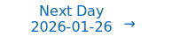

# Personalized Daily ArXiv Papers 2026-01-19

| *[gpt-5]*   | Prompt   | Completion   | Total   |
|:-----------:|:--------:|:------------:|:-------:|
| **Token**   | 29906    | 29549        | 59455   |
| **Cost**    | $0.04    | $0.3         | $0.33   |

Total arXiv papers: 365

Total scanned papers: 203

Total relevant papers: 17

**Table of contents with paper titles:**

1. [Low-Rank Key Value Attention](#user-content-link1)
**Authors:** James O'Neill, Robert Clancy, Mariia Matskevichus, Fergal Reid

2. [Transient learning dynamics drive escape from sharp valleys in Stochastic Gradient Descent](#user-content-link2)
**Authors:** Ning Yang, Yikuan Zhang, Qi Ouyang, Chao Tang, Yuhai Tu

3. [Finding the Translation Switch: Discovering and Exploiting the Task-Initiation Features in LLMs](#user-content-link3)
**Authors:** Xinwei Wu, Heng Liu, Xiaohu Zhao, Yuqi Ren, Linlong Xu, Longyue Wang, Deyi Xiong, Weihua Luo, Kaifu Zhang

4. [Unit-Consistent (UC) Adjoint for GSD and Backprop in Deep Learning Applications](#user-content-link4)
**Authors:** Jeffrey Uhlmann

5. [Spectral Characterization and Mitigation of Sequential Knowledge Editing Collapse](#user-content-link5)
**Authors:** Chi Zhang, Mengqi Zhang, Xiaotian Ye, Runxi Cheng, Zisheng Zhou, Ying Zhou, Pengjie Ren, Zhumin Chen

6. [Mugi: Value Level Parallelism For Efficient LLMs](#user-content-link6)
**Authors:** Daniel Price, Prabhu Vellaisamy, John Shen, Di Wu

7. [ORBITFLOW: SLO-Aware Long-Context LLM Serving with Fine-Grained KV Cache Reconfiguration](#user-content-link7)
**Authors:** Xinyue Ma, Heelim Hong, Taegeon Um, Jongseop Lee, Seoyeong Choy, Woo-Yeon Lee, Myeongjae Jeon

8. [MHA2MLA-VLM: Enabling DeepSeek's Economical Multi-Head Latent Attention across Vision-Language Models](#user-content-link8)
**Authors:** Xiaoran Fan, Zhichao Sun, Tao Ji, Lixing Shen, Tao Gui

9. [FAQ: Mitigating Quantization Error via Regenerating Calibration Data with Family-Aware Quantization](#user-content-link9)
**Authors:** Haiyang Xiao, Weiqing Li, Jinyue Guo, Guochao Jiang, Guohua Liu, Yuewei Zhang

10. [Digital Metabolism: Decoupling Logic from Facts via Regenerative Unlearning -- Towards a Pure Neural Logic Core](#user-content-link10)
**Authors:** Mengmeng Peng, Zhenyu Fang, He Sun

11. [Analytic Bijections for Smooth and Interpretable Normalizing Flows](#user-content-link11)
**Authors:** Mathis Gerdes, Miranda C. N. Cheng

12. [Spurious Rewards Paradox: Mechanistically Understanding How RLVR Activates Memorization Shortcuts in LLMs](#user-content-link12)
**Authors:** Lecheng Yan, Ruizhe Li, Guanhua Chen, Qing Li, Jiahui Geng, Wenxi Li, Vincent Wang, Chris Lee

13. [Relational Linearity is a Predictor of Hallucinations](#user-content-link13)
**Authors:** Yuetian Lu, Yihong Liu, Hinrich Sch\"utze

14. [Hierarchical Orthogonal Residual Spread for Precise Massive Editing in Large Language Models](#user-content-link14)
**Authors:** Xiaojie Gu, Guangxu Chen, Yuheng Yang, Jingxin Han, Andi Zhang

15. [Differentially Private Subspace Fine-Tuning for Large Language Models](#user-content-link15)
**Authors:** Lele Zheng, Xiang Wang, Tao Zhang, Yang Cao, Ke Cheng, Yulong Shen

16. [Operator learning on domain boundary through combining fundamental solution-based artificial data and boundary integral techniques](#user-content-link16)
**Authors:** Haochen Wu, Heng Wu, Benzhuo Lu

17. [HOSL: Hybrid-Order Split Learning for Memory-Constrained Edge Training](#user-content-link17)
**Authors:** Aakriti, Zhe Li, Dandan Liang, Chao Huang, Rui Li, Haibo Yang

---

## 1. [Low-Rank Key Value Attention](https://arxiv.org/abs/2601.11471) 

**ArXiv ID:** 2601.11471

**Authors:** James O'Neill, Robert Clancy, Mariia Matskevichus, Fergal Reid

**Abstract:** Transformer pretraining is increasingly constrained by memory and compute requirements, with the key-value (KV) cache emerging as a dominant bottleneck during training and autoregressive decoding. We propose \textit{low-rank KV adaptation} (LRKV), a simple modification of multi-head attention that reduces KV cache memory by exploiting redundancy across attention heads while preserving full token-level resolution. Each layer uses a shared full-rank KV projection augmented with low-rank, head-specific residuals, yielding a continuous trade-off between complete sharing and fully independent attention.   LRKV is a drop-in replacement for standard multi-head attention and directly subsumes query-sharing approaches such as multi-query and grouped-query attention, while remaining distinct from latent-compression methods such as multi-latent attention (MLA). Across large-scale pretraining experiments, LRKV consistently achieves faster loss reduction, lower validation perplexity, and stronger downstream task performance than standard attention, MQA/GQA, and MLA. At the 2.5B scale, LRKV outperforms standard attention while using roughly half the KV cache, and reaches equivalent model quality with up to \textbf{20-25\% less training compute} when measured in cumulative FLOPs. To explain these gains, we analyze attention head structure in operator space and show that LRKV preserves nearly all functional head diversity relative to standard attention, whereas more aggressive KV-sharing mechanisms rely on compensatory query specialization. Together, these results establish LRKV as a practical and effective attention mechanism for scaling Transformer pretraining under memory- and compute-constrained regimes.

**Comment:** Architecture/efficiency: low-rank KV attention reduces KV cache while preserving head diversity; improves pretraining compute efficiency.

**Relevance:** 10
**Novelty:** 9

---

## 2. [Transient learning dynamics drive escape from sharp valleys in Stochastic Gradient Descent](https://arxiv.org/abs/2601.10962) 

**ArXiv ID:** 2601.10962

**Authors:** Ning Yang, Yikuan Zhang, Qi Ouyang, Chao Tang, Yuhai Tu

**Abstract:** Stochastic gradient descent (SGD) is central to deep learning, yet the dynamical origin of its preference for flatter, more generalizable solutions remains unclear. Here, by analyzing SGD learning dynamics, we identify a nonequilibrium mechanism governing solution selection. Numerical experiments reveal a transient exploratory phase in which SGD trajectories repeatedly escape sharp valleys and transition toward flatter regions of the loss landscape. By using a tractable physical model, we show that the SGD noise reshapes the landscape into an effective potential that favors flat solutions. Crucially, we uncover a transient freezing mechanism: as training proceeds, growing energy barriers suppress inter-valley transitions and ultimately trap the dynamics within a single basin. Increasing the SGD noise strength delays this freezing, which enhances convergence to flatter minima. Together, these results provide a unified physical framework linking learning dynamics, loss-landscape geometry, and generalization, and suggest principles for the design of more effective optimization algorithms.

**Comment:** Matches 'Representation Learning: training dynamics in neural networks' by theoretically linking SGD noise, effective potentials, and transient freezing to preference for flat minima.

**Relevance:** 9
**Novelty:** 8

---

## 3. [Finding the Translation Switch: Discovering and Exploiting the Task-Initiation Features in LLMs](https://arxiv.org/abs/2601.11019) 

**ArXiv ID:** 2601.11019

**Authors:** Xinwei Wu, Heng Liu, Xiaohu Zhao, Yuqi Ren, Linlong Xu, Longyue Wang, Deyi Xiong, Weihua Luo, Kaifu Zhang

**Abstract:** Large Language Models (LLMs) frequently exhibit strong translation abilities, even without task-specific fine-tuning. However, the internal mechanisms governing this innate capability remain largely opaque. To demystify this process, we leverage Sparse Autoencoders (SAEs) and introduce a novel framework for identifying task-specific features. Our method first recalls features that are frequently co-activated on translation inputs and then filters them for functional coherence using a PCA-based consistency metric. This framework successfully isolates a small set of **translation initiation** features. Causal interventions demonstrate that amplifying these features steers the model towards correct translation, while ablating them induces hallucinations and off-task outputs, confirming they represent a core component of the model's innate translation competency. Moving from analysis to application, we leverage this mechanistic insight to propose a new data selection strategy for efficient fine-tuning. Specifically, we prioritize training on **mechanistically hard** samples-those that fail to naturally activate the translation initiation features. Experiments show this approach significantly improves data efficiency and suppresses hallucinations. Furthermore, we find these mechanisms are transferable to larger models of the same family. Our work not only decodes a core component of the translation mechanism in LLMs but also provides a blueprint for using internal model mechanism to create more robust and efficient models. The codes are available at https://github.com/flamewei123/AAAI26-translation-Initiation-Features.

**Comment:** Representation Learning: uses Sparse Autoencoders to identify causal, task-specific features ("translation initiation") inside LLMs and validates via interventions.

**Relevance:** 9
**Novelty:** 8

---

## 4. [Unit-Consistent (UC) Adjoint for GSD and Backprop in Deep Learning Applications](https://arxiv.org/abs/2601.10873) 

**ArXiv ID:** 2601.10873

**Authors:** Jeffrey Uhlmann

**Abstract:** Deep neural networks constructed from linear maps and positively homogeneous nonlinearities (e.g., ReLU) possess a fundamental gauge symmetry: the network function is invariant to node-wise diagonal rescalings. However, standard gradient descent is not equivariant to this symmetry, causing optimization trajectories to depend heavily on arbitrary parameterizations. Prior work has proposed rescaling-invariant optimization schemes for positively homogeneous networks (e.g., path-based or path-space updates). Our contribution is complementary: we formulate the invariance requirement at the level of the backward adjoint/optimization geometry, which provides a simple, operator-level recipe that can be applied uniformly across network components and optimizer state. By replacing the Euclidean transpose with a Unit-Consistent (UC) adjoint, we derive UC gauge-consistent steepest descent and backprogation.

**Comment:** Model Architecture/Optimization: introduces a unit-consistent adjoint for gauge-equivariant backprop/steepest descent in positively homogeneous networks.

**Relevance:** 9
**Novelty:** 8

---

## 5. [Spectral Characterization and Mitigation of Sequential Knowledge Editing Collapse](https://arxiv.org/abs/2601.11042) 

**ArXiv ID:** 2601.11042

**Authors:** Chi Zhang, Mengqi Zhang, Xiaotian Ye, Runxi Cheng, Zisheng Zhou, Ying Zhou, Pengjie Ren, Zhumin Chen

**Abstract:** Sequential knowledge editing in large language models often causes catastrophic collapse of the model's general abilities, especially for parameter-modifying methods. Existing approaches mitigate this issue through heuristic constraints on parameter updates, yet the mechanisms underlying such degradation remain insufficiently understood. In this work, we present a spectral analysis of sequential knowledge editing and show that a model's general abilities are closely associated with dominant singular directions of pretrained weight matrices. These directions are highly sensitive to perturbations and are progressively disrupted by repeated edits, closely tracking the collapse in both editing efficacy and general performance. Building on this insight, we propose REVIVE, a plug-and-play framework that stabilizes sequential editing by explicitly preserving the dominant singular subspace. REVIVE represents parameter updates in the spectral basis of the original weights and filters components that would interfere with the protected region. Extensive experiments across multiple models and benchmarks show that REVIVE consistently improves editing efficacy while substantially preserving general abilities under long-horizon sequential editing, including extreme settings with up to 20,000 edits.

**Comment:** Representation Learning/Training Dynamics: spectral analysis ties collapse to dominant singular directions; REVIVE preserves singular subspace during editing.

**Relevance:** 9
**Novelty:** 8

---

## 6. [Mugi: Value Level Parallelism For Efficient LLMs](https://arxiv.org/abs/2601.10823) 

**ArXiv ID:** 2601.10823

**Authors:** Daniel Price, Prabhu Vellaisamy, John Shen, Di Wu

**Abstract:** Value level parallelism (VLP) has been proposed to improve the efficiency of large-batch, low-precision general matrix multiply (GEMM) between symmetric activations and weights. In transformer based large language models (LLMs), there exist more sophisticated operations beyond activation-weight GEMM. In this paper, we explore how VLP benefits LLMs. First, we generalize VLP for nonlinear approximations, outperforming existing nonlinear approximations in end-to-end LLM accuracy, performance, and efficiency. Our VLP approximation follows a value-centric approach, where important values are assigned with greater accuracy. Second, we optimize VLP for small-batch GEMMs with asymmetric inputs efficiently, which leverages timely LLM optimizations, including weight-only quantization, key-value (KV) cache quantization, and group query attention. Finally, we design a new VLP architecture, Mugi, to encapsulate the innovations above and support full LLM workloads, while providing better performance, efficiency and sustainability. Our experimental results show that Mugi can offer significant improvements on throughput and energy efficiency, up to $45\times$ and $668\times$ for nonlinear softmax operations, and $2.07\times$ and $3.11\times$ for LLMs, and also decrease operational carbon for LLM operation by $1.45\times$ and embodied carbon by $1.48\times$.

**Comment:** Compression/Efficiency: value-level parallelism generalized to nonlinear ops, weight/KV-cache quantization, and a new VLP architecture (Mugi) for full LLM workloads.

**Relevance:** 9
**Novelty:** 8

---

## 7. [ORBITFLOW: SLO-Aware Long-Context LLM Serving with Fine-Grained KV Cache Reconfiguration](https://arxiv.org/abs/2601.10729) 

**ArXiv ID:** 2601.10729

**Authors:** Xinyue Ma, Heelim Hong, Taegeon Um, Jongseop Lee, Seoyeong Choy, Woo-Yeon Lee, Myeongjae Jeon

**Abstract:** Serving long-context LLMs is challenging because request lengths and batch composition vary during token generation, causing the memory footprint to fluctuate significantly at runtime. Offloading KV caches to host memory limits effective memory usage, but existing static and predetermined offloading strategies cannot adapt to the rapidly shifting memory demands of long-context serving. This often leads to excessive CPU-to-GPU KV transfers that translate into latency spikes and frequent SLO violations. To address these challenges, we introduce ORBITFLOW, a fine-grained and adaptive KV cache management system that meets latency SLOs in long-context LLM serving. ORBITFLOW employs a lightweight ILP solver to decide which layers' KV caches to retain on the GPU for each request, within memory capacity constraints. It continuously refines KV placements based on runtime feedback when the active plan becomes suboptimal during token generation. Under heavy load, ORBITFLOW invokes a fallback mechanism to temporarily defer in-flight requests with large memory footprints, preserving overall SLO attainment. Our experiments demonstrate that ORBITFLOW improves SLO attainment for TPOT and TBT by up to 66% and 48%, respectively, while reducing the 95th percentile latency by 38% and achieving up to 3.3x higher throughput compared to existing offloading methods.

**Comment:** HPC/Systems for LLM serving: fine-grained, adaptive KV cache placement with ILP and runtime feedback to meet SLOs.

**Relevance:** 9
**Novelty:** 8

---

## 8. [MHA2MLA-VLM: Enabling DeepSeek's Economical Multi-Head Latent Attention across Vision-Language Models](https://arxiv.org/abs/2601.11464) 

**ArXiv ID:** 2601.11464

**Authors:** Xiaoran Fan, Zhichao Sun, Tao Ji, Lixing Shen, Tao Gui

**Abstract:** As vision-language models (VLMs) tackle increasingly complex and multimodal tasks, the rapid growth of Key-Value (KV) cache imposes significant memory and computational bottlenecks during inference. While Multi-Head Latent Attention (MLA) offers an effective means to compress the KV cache and accelerate inference, adapting existing VLMs to the MLA architecture without costly pretraining remains largely unexplored. In this work, we present MHA2MLA-VLM, a parameter-efficient and multimodal-aware framework for converting off-the-shelf VLMs to MLA. Our approach features two core techniques: (1) a modality-adaptive partial-RoPE strategy that supports both traditional and multimodal settings by selectively masking nonessential dimensions, and (2) a modality-decoupled low-rank approximation method that independently compresses the visual and textual KV spaces. Furthermore, we introduce parameter-efficient fine-tuning to minimize adaptation cost and demonstrate that minimizing output activation error, rather than parameter distance, substantially reduces performance loss. Extensive experiments on three representative VLMs show that MHA2MLA-VLM restores original model performance with minimal supervised data, significantly reduces KV cache footprint, and integrates seamlessly with KV quantization.

**Comment:** KV-cache efficiency via adapting MLA to VLMs with modality-decoupled low-rank KV compression and RoPE modification; parameter-efficient adaptation.

**Relevance:** 9
**Novelty:** 7

---

## 9. [FAQ: Mitigating Quantization Error via Regenerating Calibration Data with Family-Aware Quantization](https://arxiv.org/abs/2601.11200) 

**ArXiv ID:** 2601.11200

**Authors:** Haiyang Xiao, Weiqing Li, Jinyue Guo, Guochao Jiang, Guohua Liu, Yuewei Zhang

**Abstract:** Although post-training quantization (PTQ) provides an efficient numerical compression scheme for deploying large language models (LLMs) on resource-constrained devices, the representativeness and universality of calibration data remain a core bottleneck in determining the accuracy of quantization parameters. Traditional PTQ methods typically rely on limited samples, making it difficult to capture the activation distribution during the inference phase, leading to biases in quantization parameters. To address this, we propose \textbf{FAQ} (Family-Aware Quantization), a calibration data regeneration framework that leverages prior knowledge from LLMs of the same family to generate high-fidelity calibration samples. Specifically, FAQ first inputs the original calibration samples into a larger LLM from the same family as the target model, regenerating a series of high-fidelity calibration data using a highly consistent knowledge system. Subsequently, this data, carrying Chain-of-Thought reasoning and conforming to the expected activation distribution, undergoes group competition under expert guidance to select the best samples, which are then re-normalized to enhance the effectiveness of standard PTQ. Experiments on multiple model series, including Qwen3-8B, show that FAQ reduces accuracy loss by up to 28.5\% compared to the baseline with original calibration data, demonstrating its powerful potential and contribution.

**Comment:** Matches 'Model Compression and Efficiency: Quantization' by regenerating family-aware calibration data to improve PTQ accuracy in LLMs.

**Relevance:** 9
**Novelty:** 7

---

## 10. [Digital Metabolism: Decoupling Logic from Facts via Regenerative Unlearning -- Towards a Pure Neural Logic Core](https://arxiv.org/abs/2601.10810) 

**ArXiv ID:** 2601.10810

**Authors:** Mengmeng Peng, Zhenyu Fang, He Sun

**Abstract:** Large language models (LLMs) currently suffer from parameter entanglement, where general reasoning capabilities (logic) and specific factual knowledge (facts) exist in a superposition state within shared weights. This coupling leads to the "memory wall," where computational capacity is squandered on simulating retrieval, often resulting in hallucinations. In this paper, we propose "digital metabolism," a thermodynamic hypothesis suggesting that targeted forgetting is necessary for distilling a pure neural logic core. To validate this hypothesis, we introduce the Regenerative Logic-Core Protocol (RLCP), a dual-stream training framework that renders specific factual dependencies linearly undecodable via deep-layer gradient reversal. Applying RLCP to Qwen2.5-0.5B, we observe a distinct phase transition: the model achieves near-zero retention of targeted factual associations (Accuracy < 7%) while exhibiting changes consistent with an emergent "structural crystallization" effect. Empirical analysis on GSM8K reveals that the "metabolized" model spontaneously adopts chain-of-thought (CoT) scaffolding, which we interpret as compensating for the loss of direct associative recall (shifting from $O(1)$ recall to $O(N)$ reasoning). While the causal mechanism underlying this behavioral shift requires further investigation, our findings provide a dynamic weight-level counterpart to architectural innovations like DeepSeek's Engram, paving the way for modular "Neural CPU + Symbolic RAM" architectures.

**Comment:** Representation learning/training dynamics: protocol to decouple logic from facts via gradient reversal—toward modular neural logic core.

**Relevance:** 8
**Novelty:** 8

---

## 11. [Analytic Bijections for Smooth and Interpretable Normalizing Flows](https://arxiv.org/abs/2601.10774) 

**ArXiv ID:** 2601.10774

**Authors:** Mathis Gerdes, Miranda C. N. Cheng

**Abstract:** A key challenge in designing normalizing flows is finding expressive scalar bijections that remain invertible with tractable Jacobians. Existing approaches face trade-offs: affine transformations are smooth and analytically invertible but lack expressivity; monotonic splines offer local control but are only piecewise smooth and act on bounded domains; residual flows achieve smoothness but need numerical inversion. We introduce three families of analytic bijections -- cubic rational, sinh, and cubic polynomial -- that are globally smooth ($C^\infty$), defined on all of $\mathbb{R}$, and analytically invertible in closed form, combining the favorable properties of all prior approaches. These bijections serve as drop-in replacements in coupling flows, matching or exceeding spline performance. Beyond coupling layers, we develop radial flows: a novel architecture using direct parametrization that transforms the radial coordinate while preserving angular direction. Radial flows exhibit exceptional training stability, produce geometrically interpretable transformations, and on targets with radial structure can achieve comparable quality to coupling flows with $1000\times$ fewer parameters. We provide comprehensive evaluation on 1D and 2D benchmarks, and demonstrate applicability to higher-dimensional physics problems through experiments on $\phi^4$ lattice field theory, where our bijections outperform affine baselines and enable problem-specific designs that address mode collapse.

**Comment:** Model Architecture: new analytic bijections and a radial flow architecture delivering smooth, interpretable and closed-form invertible transformations.

**Relevance:** 8
**Novelty:** 8

---

## 12. [Spurious Rewards Paradox: Mechanistically Understanding How RLVR Activates Memorization Shortcuts in LLMs](https://arxiv.org/abs/2601.11061) 

**ArXiv ID:** 2601.11061

**Authors:** Lecheng Yan, Ruizhe Li, Guanhua Chen, Qing Li, Jiahui Geng, Wenxi Li, Vincent Wang, Chris Lee

**Abstract:** Reinforcement Learning with Verifiable Rewards (RLVR) is highly effective for enhancing LLM reasoning, yet recent evidence shows models like Qwen 2.5 achieve significant gains even with spurious or incorrect rewards. We investigate this phenomenon and identify a "Perplexity Paradox": spurious RLVR triggers a divergence where answer-token perplexity drops while prompt-side coherence degrades, suggesting the model is bypassing reasoning in favor of memorization. Using Path Patching, Logit Lens, JSD analysis, and Neural Differential Equations, we uncover a hidden Anchor-Adapter circuit that facilitates this shortcut. We localize a Functional Anchor in the middle layers (L18-20) that triggers the retrieval of memorized solutions, followed by Structural Adapters in later layers (L21+) that transform representations to accommodate the shortcut signal. Finally, we demonstrate that scaling specific MLP keys within this circuit allows for bidirectional causal steering-artificially amplifying or suppressing contamination-driven performance. Our results provide a mechanistic roadmap for identifying and mitigating data contamination in RLVR-tuned models. Code is available at https://github.com/idwts/How-RLVR-Activates-Memorization-Shortcuts.

**Comment:** Representation Learning/Mechanistic Interpretability: identifies anchor–adapter circuits causing shortcut memorization under RLVR and demonstrates causal steering.

**Relevance:** 8
**Novelty:** 8

---

## 13. [Relational Linearity is a Predictor of Hallucinations](https://arxiv.org/abs/2601.11429) 

**ArXiv ID:** 2601.11429

**Authors:** Yuetian Lu, Yihong Liu, Hinrich Sch\"utze

**Abstract:** Hallucination is a central failure mode in large language models (LLMs). We focus on hallucinations of answers to questions like: "Which instrument did Glenn Gould play?", but we ask these questions for synthetic entities that are unknown to the model. Surprisingly, we find that medium-size models like Gemma-7B-IT frequently hallucinate, i.e., they have difficulty recognizing that the hallucinated fact is not part of their knowledge. We hypothesize that an important factor in causing these hallucinations is the linearity of the relation: linear relations tend to be stored more abstractly, making it difficult for the LLM to assess its knowledge; the facts of nonlinear relations tend to be stored more directly, making knowledge assessment easier. To investigate this hypothesis, we create SyntHal, a dataset of 6000 synthetic entities for six relations. In our experiments with four models, we determine, for each relation, the hallucination rate on SyntHal and also measure its linearity, using $\Delta\cos$. We find a strong correlation ($r \in [.78,.82]$) between relational linearity and hallucination rate, providing evidence for our hypothesis that the underlying storage of triples of a relation is a factor in how well a model can self-assess its knowledge. This finding has implications for how to manage hallucination behavior and suggests new research directions for improving the representation of factual knowledge in LLMs.

**Comment:** Representation learning/training dynamics: links relational linearity in embeddings to hallucination behavior, offering insight into how LLMs store facts.

**Relevance:** 8
**Novelty:** 7

---

## 14. [Hierarchical Orthogonal Residual Spread for Precise Massive Editing in Large Language Models](https://arxiv.org/abs/2601.11441) 

**ArXiv ID:** 2601.11441

**Authors:** Xiaojie Gu, Guangxu Chen, Yuheng Yang, Jingxin Han, Andi Zhang

**Abstract:** Large language models (LLMs) exhibit exceptional performance across various domains, yet they face critical safety concerns. Model editing has emerged as an effective approach to mitigate these issues. Existing model editing methods often focus on optimizing an information matrix that blends new and old knowledge. While effective, these approaches can be computationally expensive and may cause conflicts. In contrast, we shift our attention to Hierarchical Orthogonal Residual SprEad of the information matrix, which reduces noisy gradients and enables more stable edits from a different perspective. We demonstrate the effectiveness of our method HORSE through a clear theoretical comparison with several popular methods and extensive experiments conducted on two datasets across multiple LLMs. The results show that HORSE maintains precise massive editing across diverse scenarios. The code is available at https://github.com/XiaojieGu/HORSE

**Comment:** Matches 'Model Architecture: conditional/dynamic networks' by introducing Hierarchical Orthogonal Residual Spread to stabilize and localize large-scale LLM edits.

**Relevance:** 8
**Novelty:** 7

---

## 15. [Differentially Private Subspace Fine-Tuning for Large Language Models](https://arxiv.org/abs/2601.11113) 

**ArXiv ID:** 2601.11113

**Authors:** Lele Zheng, Xiang Wang, Tao Zhang, Yang Cao, Ke Cheng, Yulong Shen

**Abstract:** Fine-tuning large language models on downstream tasks is crucial for realizing their cross-domain potential but often relies on sensitive data, raising privacy concerns. Differential privacy (DP) offers rigorous privacy guarantees and has been widely adopted in fine-tuning; however, naively injecting noise across the high-dimensional parameter space creates perturbations with large norms, degrading performance and destabilizing training. To address this issue, we propose DP-SFT, a two-stage subspace fine-tuning method that substantially reduces noise magnitude while preserving formal DP guarantees. Our intuition is that, during fine-tuning, significant parameter updates lie within a low-dimensional, task-specific subspace, while other directions change minimally. Hence, we only inject DP noise into this subspace to protect privacy without perturbing irrelevant parameters. In phase one, we identify the subspace by analyzing principal gradient directions to capture task-specific update signals. In phase two, we project full gradients onto this subspace, add DP noise, and map the perturbed gradients back to the original parameter space for model updates, markedly lowering noise impact. Experiments on multiple datasets demonstrate that DP-SFT enhances accuracy and stability under rigorous DP constraints, accelerates convergence, and achieves substantial gains over DP fine-tuning baselines.

**Comment:** Model Compression and Efficiency: subspace (low-rank) DP fine-tuning injects noise only along principal gradient directions, preserving DP while reducing perturbation.

**Relevance:** 8
**Novelty:** 7

---

## 16. [Operator learning on domain boundary through combining fundamental solution-based artificial data and boundary integral techniques](https://arxiv.org/abs/2601.11222) 

**ArXiv ID:** 2601.11222

**Authors:** Haochen Wu, Heng Wu, Benzhuo Lu

**Abstract:** For linear partial differential equations with known fundamental solutions, this work introduces a novel operator learning framework that relies exclusively on domain boundary data, including solution values and normal derivatives, rather than full-domain sampling. By integrating the previously developed Mathematical Artificial Data (MAD) method, which enforces physical consistency, all training data are synthesized directly from the fundamental solutions of the target problems, resulting in a fully data-driven pipeline without the need for external measurements or numerical simulations. We refer to this approach as the Mathematical Artificial Data Boundary Neural Operator (MAD-BNO), which learns boundary-to-boundary mappings using MAD-generated Dirichlet-Neumann data pairs. Once trained, the interior solution at arbitrary locations can be efficiently recovered through boundary integral formulations, supporting Dirichlet, Neumann, and mixed boundary conditions as well as general source terms. The proposed method is validated on benchmark operator learning tasks for two-dimensional Laplace, Poisson, and Helmholtz equations, where it achieves accuracy comparable to or better than existing neural operator approaches while significantly reducing training time. The framework is naturally extensible to three-dimensional problems and complex geometries.

**Comment:** Representation Learning: boundary-only neural operator (MAD-BNO) learns Dirichlet–Neumann maps from mathematical artificial data; recovers interiors via boundary integrals.

**Relevance:** 8
**Novelty:** 7

---

## 17. [HOSL: Hybrid-Order Split Learning for Memory-Constrained Edge Training](https://arxiv.org/abs/2601.10940) 

**ArXiv ID:** 2601.10940

**Authors:** Aakriti, Zhe Li, Dandan Liang, Chao Huang, Rui Li, Haibo Yang

**Abstract:** Split learning (SL) enables collaborative training of large language models (LLMs) between resource-constrained edge devices and compute-rich servers by partitioning model computation across the network boundary. However, existing SL systems predominantly rely on first-order (FO) optimization, which requires clients to store intermediate quantities such as activations for backpropagation. This results in substantial memory overhead, largely negating benefits of model partitioning. In contrast, zeroth-order (ZO) optimization eliminates backpropagation and significantly reduces memory usage, but often suffers from slow convergence and degraded performance. In this work, we propose HOSL, a novel Hybrid-Order Split Learning framework that addresses this fundamental trade-off between memory efficiency and optimization effectiveness by strategically integrating ZO optimization on the client side with FO optimization on the server side. By employing memory-efficient ZO gradient estimation at the client, HOSL eliminates backpropagation and activation storage, reducing client memory consumption. Meanwhile, server-side FO optimization ensures fast convergence and competitive performance. Theoretically, we show that HOSL achieves a $\mathcal{O}(\sqrt{d_c/TQ})$ rate, which depends on client-side model dimension $d_c$ rather than the full model dimension $d$, demonstrating that convergence improves as more computation is offloaded to the server. Extensive experiments on OPT models (125M and 1.3B parameters) across 6 tasks demonstrate that HOSL reduces client GPU memory by up to 3.7$\times$ compared to the FO method while achieving accuracy within 0.20%-4.23% of this baseline. Furthermore, HOSL outperforms the ZO baseline by up to 15.55%, validating the effectiveness of our hybrid strategy for memory-efficient training on edge devices.

**Comment:** High-Performance/Distributed Training: hybrid-order split learning that reduces client memory (no backprop activations) with convergence analysis.

**Relevance:** 8
**Novelty:** 7

---

# Paper Selection Prompt

## System Prompt

> You are a helpful paper reading assistant whose job is to read daily posts from ArXiv and identify a few papers that your friend will enjoy reading.
> Your job is to carefully read the paper titles and abstracts below and find the ones that match the criteria below.

## User Prompt

> ## Instructions
> 
> Write the response in JSONL format with {ARXIVID, COMMENT, RELEVANCE, NOVELTY} on each line, one for each paper.
> 
> - ARXIVID: should be the ArXiv ID.
> - COMMENT: should identify whether there is a criteria that match the paper very closely. These matches should not be based on general terms like "language modeling" or "advancements" and should specifically refer to a criterion. No need to mention the non-matching criteria.
> - RELEVANCE: should be a score from 1-10.
> - NOVELTY: should be a score from 1-10.
> 
> ## Scoring Criteria
> 
> > The "Relevance" score measures how closely the paper aligns with the core topics of the prompt.
> > The "Novelty" score assesses the originality and impact of the paper.
> > They are two **ORTHONORMAL** axes and **SHOULD NOT** be confused with each other.
> 
> ### Relevance Scoring
> 
> - Relevance 9-10 (Completely Relevant)
>   - Focus: Fully aligned with core topics with no deviation, score the highest if contains relevant keywords in it.
>   - Examples: Papers focused on foundational methods or theoretical research, whose titles contain topic keywords like "MoE".
> 
> - Relevance 7-8 (Relevant)
>   - Focus: Retain a solid link to the main research area, though may touch on peripheral elements.
>   - Examples: Papers research on the fundamental part of MoE through a less critical aspect like its behavior in GNN.
> 
> - Relevance 5-6 (Borderline)
>   - Focus: Maintains a link to the core topic but also extends into at least one other domain/area beyond the primary focus.
>   - Examples: Work referencing MoE centered on reinforcement learning.
> 
> - Relevance 3-4 (Irrelevant)
>   - Focus: Largely outside our interests with no association to our topics.
>   - Examples: Application-focused papers like using MoE to solve a problem in the real world.
> 
> - Relevance 1-2 (Ignore)
>   - Focus: Purely unrelated to our topics. Completely a different domain.
>   - **Exception**: If the paper hints at a cutting-edge, radically new direction that could eventually transform the primary domain, consider a score of 9–10 despite initial appearances. (Usually a very rare concept that belongs to the fundamental research)
> 
> ### Novelty Scoring
> 
> - Novelty 9-10 (Breakthrough)
>   - Definition: Groundbreaking methods/theory introducing new directions or solving major challenges.
>   - Examples: Entirely new paradigm for foundational models; a novel theory transforming representation learning.
> 
> - Novelty 7-8 (Improvements)
>   - Definition: Substantial insights/enhancements, though not a full paradigm shift.
>   - Examples: Modifications on existing methods yielding significantly better results.
> 
> - Novelty 5-6 (Borderline)
>   - Definition: Incremental contributions with possible long-term benefits, not immediately transformative.
>   - Examples: Moderately novel extension to an existing architecture; refining current methods without fundamentally altering them.
> 
> - Novelty 3-4 (Tangential)
>   - Definition: Minor or domain-specific improvements with limited broader impact.
>   - Examples: Slight modifications to known methods with strange motivation; purely engineering jobs like a new benchmark/dataset.
> 
> - Novelty 1-2 (Low)
>   - Definition: Minimal originality, applying standard approaches without real innovation.
>   - Examples: Using an off-the-shelf model without adding new insights; purely application-driven studies like finetuning a pretrained model using existing methods.
> 
> ## Papers
> 
> [PAPER LIST HERE]
> 
> ## Relevant Topics
> 
> Use the following relevance criteria to focus on foundational research. Keep **relevant** papers and filter out **irrelevant** ones. Avoid purely **application-driven** work.
> 
> 1. Model Architecture
>    - Relevant: Mixture-of-Experts (MoE), Transformers, Conditional/Dynamic Networks, Autoencoders, analysis/innovations on existing architectures.
>    - Irrelevant: Merely using existing architectures for a certain task without insights into the structure themselves.
> 
> 2. Model Compression and Efficiency
>    - Relevant: Sparsity, pruning, quantization, low-rank approaches, cache, or other algorithmic/theoretical efficiency breakthroughs.
>    - Irrelevant: Straightforward applications of existing compression methods to new tasks.
> 
> 3. High Performance Computing
>    - Relevant: Algorithmic or systems-level innovations enabling training of large-scale models, distributed training techniques, memory optimization.
>    - Irrelevant: Incremental engineering improvements without novel algorithmic contributions.
> 
> 4. Representation Learning
>    - Relevant: Insights into how deep networks encode information, feature/dictionary learning, sparse/contrastive methods, training dynamics in neural networks.
>    - Irrelevant: Standard applications of known techniques lacking new theoretical or methodological contributions.
> 
> **Keywords:**
> 
> - Relevant: Mixture of Experts (MoE), Representation Learning, Compression/Efficiency, Sparse/Sparsity, Pruning, Quantization, Low-rank, Foundation Model, etc.
> - Irrelevant: Reinforcement Learning, Transfer Learning, Federated Learning, Online Learning, Diffusion Models, etc.
> - Application: Image Segmentation, Medical Imaging, 3D Vision, Video Understanding, Information Retrieval, Summarization, Recommendation Systems, Machine Translation, Speech Recognition, Signal Processing, Spatial/Temporal Modeling, Time Series, Knowledge Graph, etc.