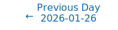
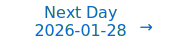

# Personalized Daily ArXiv Papers 2026-01-27

| *[gpt-5]*   | Prompt   | Completion   | Total   |
|:-----------:|:--------:|:------------:|:-------:|
| **Token**   | 62520    | 54902        | 117422  |
| **Cost**    | $0.08    | $0.55        | $0.63   |

Total arXiv papers: 708

Total scanned papers: 398

Total relevant papers: 37

**Table of contents with paper titles:**

1. [LongCat-Flash-Thinking-2601 Technical Report](#user-content-link1)
**Authors:** Meituan LongCat Team, Anchun Gui, Bei Li, Bingyang Tao, Bole Zhou, Borun Chen, Chao Zhang, Chao Zhang, Chen Gao, Chen Zhang, Chengcheng Han, Chenhui Yang, Chuyu Zhang, Cong Chen, Cunguang Wang, Daoru Pan, Defei Bu, Dengchang Zhao, Di Xiu, Dishan Liu, Dongyu Ru, Dunwei Tu, Fan Wu, Fengcheng Yuan, Fengcun Li, Gang Xu, Guanyu Wu, Guoyuan Lin, Haibin Wang, Hansi Yang, Hao Yang, Haonan Yan, Haoxiang Ma, Haoxing Wen, Hongyan Hao, Hongyin Tang, Hongyu Zang, Hongzhi Ni, Hui Su, Jiacheng Zhang, Jiahong Zhou, Jiahuan Li, Jiaming Wang, Jian Yang, Jianfei Zhang, Jianhao Xu, Jianing Wang, Jiapeng Zhu, Jiaqi Sun, Jiarong Shi, Jiarui Zhao, Jingang Wang, Jinluan Yang, Jinrui Ding, Jinwei Xiao, Jiyuan He, Juncan Xu, Kefeng Zhang, Keheng Wang, Li Wei, Lianhui Ma, Lin Qiu, Lingbing Kong, Lingchuan Liu, Linsen Guo, Mengshen Zhu, Mengxia Shen, Mingyang Zhu, Peiguang Li, Peng Pei, Pengcheng Jia, Pengtao Zhang, Peng Zhao, Qi Gu, Qiong Huang, Qiyuan Duan, Quanchi Weng, Rongxiang Weng, Rongzhi Zhang, Rumei Li, Shanglin Lei, Shengnan An, Shijun Dai, Shuaikang Liu, Shuang Zhou, Shuo Wang, Songyuan Zhao, Tao Liang, Tianhao Hu, Tianze Chen, Wei Liu, Wei Shi, Wei Wang, Weifeng Tang, Wenjie Shi, Wenlong Zhu, Wentao Chen, Wentao Shi, Xi Su, Xiangcheng Liu, Xiandi Ma, Xiangyu Xi, Xiangyuan Liu, Xiangzhou Huang, Xiao Liu, Xiaodong Cai, Xiaolong Chen, Xiaowei Shi, Xiaoyu Li, Xin Chen, Xingchen Liu, Xuan Huang, Xuezhi Cao, Xunliang Cai, Yan Chen, Yang Bai, Yang Liu, Yang Yang, Yang Zheng, Yaoming Wang, Yaoming Zhu, Yaqi Huo, Yanyu Chen, Yaorui Shi, Yerui Sun, Yi Zhang, Yihao Chen, Yi-Kai Zhang, Yifan Lu, Yifan Zhao, Yitao Zhai, Yongjing Yin, Yongwei Zhou, Youshao Xiao, Yuchuan Dai, Yuchen Xie, Yuchen Yu, Yufei Zhang, Yuhuai Wei, Yulei Qian, Yunfan Liang, Yunke Zhao, Yuwei Jiang, Yuxin Bian, Yuxin Chen, Yuxin Liu, Yue Xu, Yueqing Sun, Zeyang Yu, Zhao Yang, Zhengsheng Huang, Zhengyu Chen, Zhijian Liu, Zhikang Xia, Zhimin Lin, Zhiyuan Yao, Zhuofan Chen, Zhuowen Han, Zijian Zhang, Ziran Li, Ziwen Wang, Ziyuan Zhuang

2. [Superlinear Multi-Step Attention](#user-content-link2)
**Authors:** Yufeng Huang

3. [LatentMoE: Toward Optimal Accuracy per FLOP and Parameter in Mixture of Experts](#user-content-link3)
**Authors:** Venmugil Elango, Nidhi Bhatia, Roger Waleffe, Rasoul Shafipour, Tomer Asida, Abhinav Khattar, Nave Assaf, Maximilian Golub, Joey Guman, Tiyasa Mitra, Ritchie Zhao, Ritika Borkar, Ran Zilberstein, Mostofa Patwary, Mohammad Shoeybi, Bita Rouhani

4. [GRIP: Algorithm-Agnostic Machine Unlearning for Mixture-of-Experts via Geometric Router Constraints](#user-content-link4)
**Authors:** Andy Zhu, Rongzhe Wei, Yupu Gu, Pan Li

5. [Space Filling Curves is All You Need: Communication-Avoiding Matrix Multiplication Made Simple](#user-content-link5)
**Authors:** Evangelos Georganas, Alexander Heinecke, Pradeep Dubey

6. [Crystal-KV: Efficient KV Cache Management for Chain-of-Thought LLMs via Answer-First Principle](#user-content-link6)
**Authors:** Zihan Wang, Cheng Tang, Lei Gong, Cheng Li, Chao Wang, teng wang, Wenqi Lou, Xuehai Zhou

7. [Sparsity-Aware Low-Rank Representation for Efficient Fine-Tuning of Large Language Models](#user-content-link7)
**Authors:** Longteng Zhang, Sen Wu, Shuai Hou, Zhengyu Qing, Zhuo Zheng, Danning Ke, Qihong Lin, Qiang Wang, Shaohuai Shi, Xiaowen Chu

8. [FlashMoE: Reducing SSD I/O Bottlenecks via ML-Based Cache Replacement for Mixture-of-Experts Inference on Edge Devices](#user-content-link8)
**Authors:** Byeongju Kim, Jungwan Lee, Donghyeon Han, Hoi-Jun Yoo, Sangyeob Kim

9. [Least-Loaded Expert Parallelism: Load Balancing An Imbalanced Mixture-of-Experts](#user-content-link9)
**Authors:** Xuan-Phi Nguyen, Shrey Pandit, Austin Xu, Caiming Xiong, Shafiq Joty

10. [$\infty$-MoE: Generalizing Mixture of Experts to Infinite Experts](#user-content-link10)
**Authors:** Shota Takashiro, Takeshi Kojima, Shohei Taniguchi, Yusuke Iwasawa, Yutaka Matsuo

11. [AGZO: Activation-Guided Zeroth-Order Optimization for LLM Fine-Tuning](#user-content-link11)
**Authors:** Wei Lin, Yining Jiang, Qingyu Song, Qiao Xiang, Hong Xu

12. [A Scalable Measure of Loss Landscape Curvature for Analyzing the Training Dynamics of LLMs](#user-content-link12)
**Authors:** Dayal Singh Kalra, Jean-Christophe Gagnon-Audet, Andrey Gromov, Ishita Mediratta, Kelvin Niu, Alexander H Miller, Michael Shvartsman

13. [FP8-RL: A Practical and Stable Low-Precision Stack for LLM Reinforcement Learning](#user-content-link13)
**Authors:** Zhaopeng Qiu, Shuang Yu, Jingqi Zhang, Shuai Zhang, Xue Huang, Jingyi Yang, Junjie Lai

14. [LipNeXt: Scaling up Lipschitz-based Certified Robustness to Billion-parameter Models](#user-content-link14)
**Authors:** Kai Hu, Haoqi Hu, Matt Fredrikson

15. [Neural Network Approximation: A View from Polytope Decomposition](#user-content-link15)
**Authors:** ZeYu Li, ShiJun Zhang, TieYong Zeng, FengLei Fan

16. [Power-based Partial Attention: Bridging Linear-Complexity and Full Attention](#user-content-link16)
**Authors:** Yufeng Huang

17. [S$^3$-Attention:Attention-Aligned Endogenous Retrieval for Memory-Bounded Long-Context Inference](#user-content-link17)
**Authors:** Qingsen Ma, Dianyun Wang, Yaoye Wang, Lechen Ning, Sujie Zhu, Xiaohang Zhang, Jiaming Lyu, Linhao Ren, Zhenbo Xu, Zhaofeng He

18. [E2Former-V2: On-the-Fly Equivariant Attention with Linear Activation Memory](#user-content-link18)
**Authors:** Lin Huang, Chengxiang Huang, Ziang Wang, Yiyue Du, Chu Wang, Haocheng Lu, Yunyang Li, Xiaoli Liu, Arthur Jiang, Jia Zhang

19. [Finite-Time Analysis of Gradient Descent for Shallow Transformers](#user-content-link19)
**Authors:** Enes Arda, Semih Cayci, Atilla Eryilmaz

20. [A Collision-Free Hot-Tier Extension for Engram-Style Conditional Memory: A Controlled Study of Training Dynamics](#user-content-link20)
**Authors:** Tao Lin

21. [Fast KVzip: Efficient and Accurate LLM Inference with Gated KV Eviction](#user-content-link21)
**Authors:** Jang-Hyun Kim, Dongyoon Han, Sangdoo Yun

22. [From LLMs to LRMs: Rethinking Pruning for Reasoning-Centric Models](#user-content-link22)
**Authors:** Longwei Ding, Anhao Zhao, Fanghua Ye, Ziyang Chen, Xiaoyu Shen

23. [Jacobian Scopes: token-level causal attributions in LLMs](#user-content-link23)
**Authors:** Toni J. B. Liu, Baran Zadeo\u{g}lu, Nicolas Boull\'e, Rapha\"el Sarfati, Christopher J. Earls

24. [Split-on-Share: Mixture of Sparse Experts for Task-Agnostic Continual Learning](#user-content-link24)
**Authors:** Fatema Siddika, Md Anwar Hossen, Tanwi Mallick, Ali Jannesari

25. [TensorLens: End-to-End Transformer Analysis via High-Order Attention Tensors](#user-content-link25)
**Authors:** Ido Andrew Atad, Itamar Zimerman, Shahar Katz, Lior Wolf

26. [Low-Rank Tensor Approximation of Weights in Large Language Models via Cosine Lanczos Bidiagonalization](#user-content-link26)
**Authors:** A. El Ichi, K. Jbilou

27. [LLM-42: Enabling Determinism in LLM Inference with Verified Speculation](#user-content-link27)
**Authors:** Raja Gond, Aditya K Kamath, Arkaprava Basu, Ramachandran Ramjee, Ashish Panwar

28. [Stability as a Liability:Systematic Breakdown of Linguistic Structure in LLMs](#user-content-link28)
**Authors:** Xianzhe Meng, Qiangsheng Zeng, Ling Luo, Qinghan Yang, Jiarui Hao, Wenbo Wu, Qinyu Wang, Rui Yin, Lin Qi, Renzhi Lu

29. [Nonlinear multi-study factor analysis](#user-content-link29)
**Authors:** Gemma E. Moran, Anandi Krishnan

30. [NewPINNs: Physics-Informing Neural Networks Using Conventional Solvers for Partial Differential Equations](#user-content-link30)
**Authors:** Maedeh Makki, Satish Chandran, Maziar Raissi, Adrien Grenier, Behzad Mohebbi

31. [Attention-MoA: Enhancing Mixture-of-Agents via Inter-Agent Semantic Attention and Deep Residual Synthesis](#user-content-link31)
**Authors:** Jianyu Wen, Yang Wei, Xiongxi Yu, Changxuan Xiao, Ke Zeng

32. [Gradient Regularized Natural Gradients](#user-content-link32)
**Authors:** Satya Prakash Dash, Hossein Abdi, Wei Pan, Samuel Kaski, Mingfei Sun

33. [A Constrained Optimization Perspective of Unrolled Transformers](#user-content-link33)
**Authors:** Javier Porras-Valenzuela, Samar Hadou, Alejandro Ribeiro

34. [Process-Tensor Tomography of SGD: Measuring Non-Markovian Memory via Back-Flow of Distinguishability](#user-content-link34)
**Authors:** Vasileios Sevetlidis, George Pavlidis

35. [Sparse RBF Networks for PDEs and nonlocal equations: function space theory, operator calculus, and training algorithms](#user-content-link35)
**Authors:** Zihan Shao, Konstantin Pieper, Xiaochuan Tian

36. [Spelling Bee Embeddings for Language Modeling](#user-content-link36)
**Authors:** Markus N. Rabe, Judith Clymo, Zheren Dong

37. [Kareus: Joint Reduction of Dynamic and Static Energy in Large Model Training](#user-content-link37)
**Authors:** Ruofan Wu, Jae-Won Chung, Mosharaf Chowdhury

---

## 1. [LongCat-Flash-Thinking-2601 Technical Report](https://arxiv.org/abs/2601.16725) 

**ArXiv ID:** 2601.16725

**Authors:** Meituan LongCat Team, Anchun Gui, Bei Li, Bingyang Tao, Bole Zhou, Borun Chen, Chao Zhang, Chao Zhang, Chen Gao, Chen Zhang, Chengcheng Han, Chenhui Yang, Chuyu Zhang, Cong Chen, Cunguang Wang, Daoru Pan, Defei Bu, Dengchang Zhao, Di Xiu, Dishan Liu, Dongyu Ru, Dunwei Tu, Fan Wu, Fengcheng Yuan, Fengcun Li, Gang Xu, Guanyu Wu, Guoyuan Lin, Haibin Wang, Hansi Yang, Hao Yang, Haonan Yan, Haoxiang Ma, Haoxing Wen, Hongyan Hao, Hongyin Tang, Hongyu Zang, Hongzhi Ni, Hui Su, Jiacheng Zhang, Jiahong Zhou, Jiahuan Li, Jiaming Wang, Jian Yang, Jianfei Zhang, Jianhao Xu, Jianing Wang, Jiapeng Zhu, Jiaqi Sun, Jiarong Shi, Jiarui Zhao, Jingang Wang, Jinluan Yang, Jinrui Ding, Jinwei Xiao, Jiyuan He, Juncan Xu, Kefeng Zhang, Keheng Wang, Li Wei, Lianhui Ma, Lin Qiu, Lingbing Kong, Lingchuan Liu, Linsen Guo, Mengshen Zhu, Mengxia Shen, Mingyang Zhu, Peiguang Li, Peng Pei, Pengcheng Jia, Pengtao Zhang, Peng Zhao, Qi Gu, Qiong Huang, Qiyuan Duan, Quanchi Weng, Rongxiang Weng, Rongzhi Zhang, Rumei Li, Shanglin Lei, Shengnan An, Shijun Dai, Shuaikang Liu, Shuang Zhou, Shuo Wang, Songyuan Zhao, Tao Liang, Tianhao Hu, Tianze Chen, Wei Liu, Wei Shi, Wei Wang, Weifeng Tang, Wenjie Shi, Wenlong Zhu, Wentao Chen, Wentao Shi, Xi Su, Xiangcheng Liu, Xiandi Ma, Xiangyu Xi, Xiangyuan Liu, Xiangzhou Huang, Xiao Liu, Xiaodong Cai, Xiaolong Chen, Xiaowei Shi, Xiaoyu Li, Xin Chen, Xingchen Liu, Xuan Huang, Xuezhi Cao, Xunliang Cai, Yan Chen, Yang Bai, Yang Liu, Yang Yang, Yang Zheng, Yaoming Wang, Yaoming Zhu, Yaqi Huo, Yanyu Chen, Yaorui Shi, Yerui Sun, Yi Zhang, Yihao Chen, Yi-Kai Zhang, Yifan Lu, Yifan Zhao, Yitao Zhai, Yongjing Yin, Yongwei Zhou, Youshao Xiao, Yuchuan Dai, Yuchen Xie, Yuchen Yu, Yufei Zhang, Yuhuai Wei, Yulei Qian, Yunfan Liang, Yunke Zhao, Yuwei Jiang, Yuxin Bian, Yuxin Chen, Yuxin Liu, Yue Xu, Yueqing Sun, Zeyang Yu, Zhao Yang, Zhengsheng Huang, Zhengyu Chen, Zhijian Liu, Zhikang Xia, Zhimin Lin, Zhiyuan Yao, Zhuofan Chen, Zhuowen Han, Zijian Zhang, Ziran Li, Ziwen Wang, Ziyuan Zhuang

**Abstract:** We introduce LongCat-Flash-Thinking-2601, a 560-billion-parameter open-source Mixture-of-Experts (MoE) reasoning model with superior agentic reasoning capability. LongCat-Flash-Thinking-2601 achieves state-of-the-art performance among open-source models on a wide range of agentic benchmarks, including agentic search, agentic tool use, and tool-integrated reasoning. Beyond benchmark performance, the model demonstrates strong generalization to complex tool interactions and robust behavior under noisy real-world environments. Its advanced capability stems from a unified training framework that combines domain-parallel expert training with subsequent fusion, together with an end-to-end co-design of data construction, environments, algorithms, and infrastructure spanning from pre-training to post-training. In particular, the model's strong generalization capability in complex tool-use are driven by our in-depth exploration of environment scaling and principled task construction. To optimize long-tailed, skewed generation and multi-turn agentic interactions, and to enable stable training across over 10,000 environments spanning more than 20 domains, we systematically extend our asynchronous reinforcement learning framework, DORA, for stable and efficient large-scale multi-environment training. Furthermore, recognizing that real-world tasks are inherently noisy, we conduct a systematic analysis and decomposition of real-world noise patterns, and design targeted training procedures to explicitly incorporate such imperfections into the training process, resulting in improved robustness for real-world applications. To further enhance performance on complex reasoning tasks, we introduce a Heavy Thinking mode that enables effective test-time scaling by jointly expanding reasoning depth and width through intensive parallel thinking.

**Comment:** Matches Model Architecture (MoE) and HPC/Distributed Training: 560B MoE with domain-parallel expert training, large-scale asynchronous RL infrastructure, and test-time scaling.

**Relevance:** 10
**Novelty:** 9

---

## 2. [Superlinear Multi-Step Attention](https://arxiv.org/abs/2601.18401) 

**ArXiv ID:** 2601.18401

**Authors:** Yufeng Huang

**Abstract:** In this paper, we propose \textbf{Superlinear attention}, a fully trainable multi-step attention architecture that achieves subquadratic complexity for long sequences while preserving \textbf{random context access} (a.k.a.\ structural non-exclusion): no eligible token position is structurally excluded from being selected for attention. Superlinear attention reformulates standard causal self-attention as a multi-step search problem with $N$ steps, yielding an overall complexity of $O(L^{1+\frac{1}{N}})$. To illustrate the architecture, we present a baseline $N=2$ implementation, which is algorithmically analogous to standard jump search. In this $O(L^{3/2})$ instantiation, the first step performs $O(L^{3/2})$ span-search to select relevant spans of the sequence, and the second step applies $O(L^{3/2})$ span-attention (standard attention restricted to the selected spans). In an upscaled $O(L^{1.54})$ configuration for robustness, we achieve an average decoding throughput of 114 tokens/sec at 1M context length and 80 tokens/sec at 10M context in our implementation on a modified 30B hybrid MoE model on a single B200 GPU. With limited training, we also obtain strong performance on the NIAH (Needle In A Haystack) task up to 256K context length, demonstrating that the routed span selection is learnable end-to-end. This paper emphasizes architectural formulation, scaling analysis, and systems feasibility, and presents initial validation; comprehensive quality evaluations across diverse long-context tasks are left to future work.

**Comment:** Model Architecture and Efficiency: multi-step attention achieving subquadratic complexity while preserving random context access; scalable design for long contexts.

**Relevance:** 10
**Novelty:** 9

---

## 3. [LatentMoE: Toward Optimal Accuracy per FLOP and Parameter in Mixture of Experts](https://arxiv.org/abs/2601.18089) 

**ArXiv ID:** 2601.18089

**Authors:** Venmugil Elango, Nidhi Bhatia, Roger Waleffe, Rasoul Shafipour, Tomer Asida, Abhinav Khattar, Nave Assaf, Maximilian Golub, Joey Guman, Tiyasa Mitra, Ritchie Zhao, Ritika Borkar, Ran Zilberstein, Mostofa Patwary, Mohammad Shoeybi, Bita Rouhani

**Abstract:** Mixture of Experts (MoEs) have become a central component of many state-of-the-art open-source and proprietary large language models. Despite their widespread adoption, it remains unclear how close existing MoE architectures are to optimal with respect to inference cost, as measured by accuracy per floating-point operation and per parameter. In this work, we revisit MoE design from a hardware-software co-design perspective, grounded in empirical and theoretical considerations. We characterize key performance bottlenecks across diverse deployment regimes, spanning offline high-throughput execution and online, latency-critical inference. Guided by these insights, we introduce LatentMoE, a new model architecture resulting from systematic design exploration and optimized for maximal accuracy per unit of compute. Empirical design space exploration at scales of up to 95B parameters and over a 1T-token training horizon, together with supporting theoretical analysis, shows that LatentMoE consistently outperforms standard MoE architectures in terms of accuracy per FLOP and per parameter. Given its strong performance, the LatentMoE architecture has been adopted by the flagship Nemotron-3 Super and Ultra models and scaled to substantially larger regimes, including longer token horizons and larger model sizes, as reported in Nvidia et al. (arXiv:2512.20856).

**Comment:** MoE Architecture + Efficiency: hardware–software co-designed LatentMoE optimizing accuracy per FLOP/parameter, with empirical/theoretical backing.

**Relevance:** 10
**Novelty:** 9

---

## 4. [GRIP: Algorithm-Agnostic Machine Unlearning for Mixture-of-Experts via Geometric Router Constraints](https://arxiv.org/abs/2601.16905) 

**ArXiv ID:** 2601.16905

**Authors:** Andy Zhu, Rongzhe Wei, Yupu Gu, Pan Li

**Abstract:** Machine unlearning (MU) for large language models has become critical for AI safety, yet existing methods fail to generalize to Mixture-of-Experts (MoE) architectures. We identify that traditional unlearning methods exploit MoE's architectural vulnerability: they manipulate routers to redirect queries away from knowledgeable experts rather than erasing knowledge, causing a loss of model utility and superficial forgetting. We propose Geometric Routing Invariance Preservation (GRIP), an algorithm-agnostic framework for unlearning for MoE. Our core contribution is a geometric constraint, implemented by projecting router gradient updates into an expert-specific null-space. Crucially, this decouples routing stability from parameter rigidity: while discrete expert selections remain stable for retained knowledge, the continuous router parameters remain plastic within the null space, allowing the model to undergo necessary internal reconfiguration to satisfy unlearning objectives. This forces the unlearning optimization to erase knowledge directly from expert parameters rather than exploiting the superficial router manipulation shortcut. GRIP functions as an adapter, constraining router parameter updates without modifying the underlying unlearning algorithm. Extensive experiments on large-scale MoE models demonstrate that our adapter eliminates expert selection shift (achieving over 95% routing stability) across all tested unlearning methods while preserving their utility. By preventing existing algorithms from exploiting MoE model's router vulnerability, GRIP adapts existing unlearning research from dense architectures to MoEs.

**Comment:** Matches Model Architecture (MoE): geometric router constraints (null-space projection) for algorithm-agnostic unlearning that preserves routing while erasing expert knowledge.

**Relevance:** 10
**Novelty:** 8

---

## 5. [Space Filling Curves is All You Need: Communication-Avoiding Matrix Multiplication Made Simple](https://arxiv.org/abs/2601.16294) 

**ArXiv ID:** 2601.16294

**Authors:** Evangelos Georganas, Alexander Heinecke, Pradeep Dubey

**Abstract:** General Matrix Multiplication (GEMM) is the cornerstone of Deep Learning and HPC workloads; accordingly, academia and industry have heavily optimized this kernel. Modern platforms with matrix multiplication accelerators exhibit high FLOP/Byte machine balance, which makes implementing optimal matrix multiplication challenging. On modern CPU platforms with matrix engines, state-of-the-art vendor libraries tune input tensor layouts, parallelization schemes, and cache blocking to minimize data movement across the memory hierarchy and maximize throughput. However, the best settings for these parameters depend strongly on the target platform (number of cores, memory hierarchy, cache sizes) and on the shapes of the matrices, making exhaustive tuning infeasible; in practice this leads to performance "glass jaws". In this work we revisit space filling curves (SFC) to alleviate the problem of this cumbersome tuning. SFC convert multi-dimensional coordinates (e.g. 2D) into a single dimension (1D), keeping nearby points in the high-dimensional space close in the 1D order. We partition the Matrix Multiplication computation space using recent advancements in generalized SFC (Generalized Hilbert Curves), and we obtain platform-oblivious and shape-oblivious matrix-multiplication schemes that exhibit inherently high degree of data locality. Furthermore, we extend the SFC-based work partitioning to implement Communication-Avoiding (CA) algorithms that replicate the input tensors and provably minimize communication/data-movement on the critical path. The integration of CA-algorithms is seamless and yields compact code (~30 LOC), yet it achieves state-of-the-art results on multiple CPU platforms, outperforming vendor libraries by up to 2x(geometric-mean speedup) for a range of GEMM shapes.

**Comment:** Matches High Performance Computing: communication-avoiding GEMM via generalized space-filling curves with platform/shape-oblivious partitioning minimizing data movement.

**Relevance:** 10
**Novelty:** 8

---

## 6. [Crystal-KV: Efficient KV Cache Management for Chain-of-Thought LLMs via Answer-First Principle](https://arxiv.org/abs/2601.16986) 

**ArXiv ID:** 2601.16986

**Authors:** Zihan Wang, Cheng Tang, Lei Gong, Cheng Li, Chao Wang, teng wang, Wenqi Lou, Xuehai Zhou

**Abstract:** Chain-of-Thought (CoT) reasoning in large language models (LLMs) significantly improves accuracy on complex tasks, yet incurs excessive memory overhead due to the long think-stage sequences stored in the Key-Value (KV) cache. Unlike traditional generation tasks where all tokens are uniformly important, CoT emphasizes the final answer, rendering conventional KV compression strategies ineffective. In this paper, we present Crystal-KV, an efficient KV cache management framework tailored for CoT reasoning. Our key insight is the answer-first principle. By mapping answer preferences into think-stage attention map, we distinguish between SlipKV, which mainly maintains the reasoning flow but may occasionally introduce misleading context, and CrystalKV, which truly contributes to the correctness of the final answer. Next, we propose an attention-based Least Recently Frequently Used algorithm. It precisely identifies when a SlipKV entry's utility expires and evicts it, retaining CrystalKV without disrupting reasoning flow. Finally, we introduce an adaptive cache budget allocation algorithm. Based on the dynamic proportion of CrystalKV, it estimates the importance of each layer/head and adjusts the KV cache budget during inference, amplifying critical components to improve budget utilization. Results show that Crystal-KV achieves state-of-the-art KV cache compression, significantly improves throughput, and enables faster response time, while maintaining, or even improving, answer accuracy for CoT reasoning.

**Comment:** Matches Cache/Efficiency: KV cache compression for CoT with answer-first principle, attention-based LRFU eviction, and adaptive budget allocation.

**Relevance:** 10
**Novelty:** 8

---

## 7. [Sparsity-Aware Low-Rank Representation for Efficient Fine-Tuning of Large Language Models](https://arxiv.org/abs/2601.16991) 

**ArXiv ID:** 2601.16991

**Authors:** Longteng Zhang, Sen Wu, Shuai Hou, Zhengyu Qing, Zhuo Zheng, Danning Ke, Qihong Lin, Qiang Wang, Shaohuai Shi, Xiaowen Chu

**Abstract:** Adapting large pre-trained language models to downstream tasks often entails fine-tuning millions of parameters or deploying costly dense weight updates, which hinders their use in resource-constrained environments. Low-rank Adaptation (LoRA) reduces trainable parameters by factorizing weight updates, yet the underlying dense weights still impose high storage and computation costs. Magnitude-based pruning can yield sparse models but typically degrades LoRA's performance when applied naively. In this paper, we introduce SALR (Sparsity-Aware Low-Rank Representation), a novel fine-tuning paradigm that unifies low-rank adaptation with sparse pruning under a rigorous mean-squared-error framework. We prove that statically pruning only the frozen base weights minimizes the pruning error bound, and we recover the discarded residual information via a truncated-SVD low-rank adapter, which provably reduces per-entry MSE by a factor of $(1 - r/\min(d,k))$. To maximize hardware efficiency, we fuse multiple low-rank adapters into a single concatenated GEMM, and we adopt a bitmap-based encoding with a two-stage pipelined decoding + GEMM design to achieve true model compression and speedup. Empirically, SALR attains 50\% sparsity on various LLMs while matching the performance of LoRA on GSM8K and MMLU, reduces model size by $2\times$, and delivers up to a $1.7\times$ inference speedup.

**Comment:** Matches Compression/Efficiency: unifies sparsity and low-rank fine-tuning with provable MSE bounds, fused GEMM, and bitmap encoding for true speedups.

**Relevance:** 10
**Novelty:** 8

---

## 8. [FlashMoE: Reducing SSD I/O Bottlenecks via ML-Based Cache Replacement for Mixture-of-Experts Inference on Edge Devices](https://arxiv.org/abs/2601.17063) 

**ArXiv ID:** 2601.17063

**Authors:** Byeongju Kim, Jungwan Lee, Donghyeon Han, Hoi-Jun Yoo, Sangyeob Kim

**Abstract:** Recently, Mixture-of-Experts (MoE) models have gained attention for efficiently scaling large language models. Although these models are extremely large, their sparse activation enables inference to be performed by accessing only a fraction of the model at a time. This property opens the possibility of on-device inference of MoE, which was previously considered infeasible for such large models. Consequently, various systems have been proposed to leverage this sparsity and enable efficient MoE inference for edge devices. However, previous MoE inference systems like Fiddler[8] or DAOP[13] rely on DRAM-based offloading and are not suitable for memory constrained on-device environments. As recent MoE models grow to hundreds of gigabytes, RAM-offloading solutions become impractical. To address this, we propose FlashMoE, a system that offloads inactive experts to SSD, enabling efficient MoE inference under limited RAM. FlashMoE incorporates a lightweight ML-based caching strategy that adaptively combines recency and frequency signals to maximize expert reuse, significantly reducing storage I/O. In addition, we built a user-grade desktop platform to demonstrate the practicality of FlashMoE. On this real hardware setup, FlashMoE improves cache hit rate by up to 51% over well-known offloading policies such as LRU and LFU, and achieves up to 2.6x speedup compared to existing MoE inference systems.

**Comment:** High Performance Computing/Efficiency for MoE: ML-based cache replacement for SSD-offloaded experts enabling on-device MoE inference and reducing I/O bottlenecks.

**Relevance:** 10
**Novelty:** 8

---

## 9. [Least-Loaded Expert Parallelism: Load Balancing An Imbalanced Mixture-of-Experts](https://arxiv.org/abs/2601.17111) 

**ArXiv ID:** 2601.17111

**Authors:** Xuan-Phi Nguyen, Shrey Pandit, Austin Xu, Caiming Xiong, Shafiq Joty

**Abstract:** Mixture-of-Experts (MoE) models are typically pre-trained with explicit load-balancing constraints to ensure statistically balanced expert routing. Despite this, we observe that even well-trained MoE models exhibit significantly imbalanced routing. This behavior is arguably natural-and even desirable - as imbalanced routing allows models to concentrate domain-specific knowledge within a subset of experts. Expert parallelism (EP) is designed to scale MoE models by distributing experts across multiple devices, but with a less-discussed assumption of balanced routing. Under extreme imbalance, EP can funnel a disproportionate number of tokens to a small number of experts, leading to compute- and memory-bound failures on overloaded devices during post-training or inference, where explicit load balancing is often inapplicable. We propose Least-Loaded Expert Parallelism (LLEP), a novel EP algorithm that dynamically reroutes excess tokens and associated expert parameters from overloaded devices to underutilized ones. This ensures that all devices complete their workloads within the minimum collective latency while respecting memory constraints. Across different model scales, LLEP achieves up to 5x speedup and 4x reduction in peak memory usage compared to standard EP. This enables faster and higher-throughput post-training and inference, with ~1.9x faster for gpt-oss-120b. We support our method with extensive theoretical analysis and comprehensive empirical evaluations, including ablation studies. These results illuminate key trade-offs and enable a principled framework for hardware-specific hyper-parameter tuning to achieve optimal performance.

**Comment:** MoE + Systems: proposes Least-Loaded Expert Parallelism to dynamically rebalance imbalanced MoE routing across devices for latency/memory efficiency.

**Relevance:** 10
**Novelty:** 8

---

## 10. [$\infty$-MoE: Generalizing Mixture of Experts to Infinite Experts](https://arxiv.org/abs/2601.17680) 

**ArXiv ID:** 2601.17680

**Authors:** Shota Takashiro, Takeshi Kojima, Shohei Taniguchi, Yusuke Iwasawa, Yutaka Matsuo

**Abstract:** The Mixture of Experts (MoE) selects a few feed-forward networks (FFNs) per token, achieving an effective trade-off between computational cost and performance. In conventional MoE, each expert is treated as entirely independent, and experts are combined in a discrete space. As a result, when the number of experts increases, it becomes difficult to train each expert effectively. To stabilize training while increasing the number of experts, we propose $\infty$-MoE that selects a portion of the parameters of large FFNs based on continuous values sampled for each token. By considering experts in a continuous space, this approach allows for an infinite number of experts while maintaining computational efficiency. Experiments show that a GPT-2 Small-based $\infty$-MoE model, with 129M active and 186M total parameters, achieves comparable performance to a dense GPT-2 Medium with 350M parameters. Adjusting the number of sampled experts at inference time allows for a flexible trade-off between accuracy and speed, with an improvement of up to 2.5\% in accuracy over conventional MoE.

**Comment:** MoE Architecture: continuous expert parameterization (infinite experts) enabling flexible compute–accuracy trade-offs at inference.

**Relevance:** 10
**Novelty:** 8

---

## 11. [AGZO: Activation-Guided Zeroth-Order Optimization for LLM Fine-Tuning](https://arxiv.org/abs/2601.17261) 

**ArXiv ID:** 2601.17261

**Authors:** Wei Lin, Yining Jiang, Qingyu Song, Qiao Xiang, Hong Xu

**Abstract:** Zeroth-Order (ZO) optimization has emerged as a promising solution for fine-tuning LLMs under strict memory constraints, as it avoids the prohibitive memory cost of storing activations for backpropagation. However, existing ZO methods typically employ isotropic perturbations, neglecting the rich structural information available during the forward pass. In this paper, we identify a crucial link between gradient formation and activation structure: the gradient of a linear layer is confined to the subspace spanned by its input activations. Leveraging this insight, we propose Activation-Guided Zeroth-Order optimization (AGZO). Unlike prior methods, AGZO extracts a compact, activation-informed subspace on the fly during the forward pass and restricts perturbations to this low-rank subspace. We provide a theoretical framework showing that AGZO optimizes a subspace-smoothed objective and provably yields update directions with higher cosine similarity to the true gradient than isotropic baselines. Empirically, we evaluate AGZO on Qwen3 and Pangu models across various benchmarks. AGZO consistently outperforms state-of-the-art ZO baselines and significantly narrows the performance gap with first-order fine-tuning, while maintaining almost the same peak memory footprint as other ZO methods.

**Comment:** Matches Efficiency: activation-guided low-rank subspace ZO optimization enabling memory-efficient LLM fine-tuning with theoretical guarantees.

**Relevance:** 9
**Novelty:** 8

---

## 12. [A Scalable Measure of Loss Landscape Curvature for Analyzing the Training Dynamics of LLMs](https://arxiv.org/abs/2601.16979) 

**ArXiv ID:** 2601.16979

**Authors:** Dayal Singh Kalra, Jean-Christophe Gagnon-Audet, Andrey Gromov, Ishita Mediratta, Kelvin Niu, Alexander H Miller, Michael Shvartsman

**Abstract:** Understanding the curvature evolution of the loss landscape is fundamental to analyzing the training dynamics of neural networks. The most commonly studied measure, Hessian sharpness ($\lambda_{\max}^H$) -- the largest eigenvalue of the loss Hessian -- determines local training stability and interacts with the learning rate throughout training. Despite its significance in analyzing training dynamics, direct measurement of Hessian sharpness remains prohibitive for Large Language Models (LLMs) due to high computational cost. We analyze $\textit{critical sharpness}$ ($\lambda_c$), a computationally efficient measure requiring fewer than $10$ forward passes given the update direction $\Delta \mathbf{\theta}$. Critically, this measure captures well-documented Hessian sharpness phenomena, including progressive sharpening and Edge of Stability. Using this measure, we provide the first demonstration of these sharpness phenomena at scale, up to $7$B parameters, spanning both pre-training and mid-training of OLMo-2 models. We further introduce $\textit{relative critical sharpness}$ ($\lambda_c^{1\to 2}$), which quantifies the curvature of one loss landscape while optimizing another, to analyze the transition from pre-training to fine-tuning and guide data mixing strategies. Critical sharpness provides practitioners with a practical tool for diagnosing curvature dynamics and informing data composition choices at scale. More broadly, our work shows that scalable curvature measures can provide actionable insights for large-scale training.

**Comment:** Matches High-Performance Training Dynamics: scalable critical sharpness measure (few forward passes) capturing curvature phenomena in LLM training up to 7B.

**Relevance:** 9
**Novelty:** 8

---

## 13. [FP8-RL: A Practical and Stable Low-Precision Stack for LLM Reinforcement Learning](https://arxiv.org/abs/2601.18150) 

**ArXiv ID:** 2601.18150

**Authors:** Zhaopeng Qiu, Shuang Yu, Jingqi Zhang, Shuai Zhang, Xue Huang, Jingyi Yang, Junjie Lai

**Abstract:** Reinforcement learning (RL) for large language models (LLMs) is increasingly bottlenecked by rollout (generation), where long output sequence lengths make attention and KV-cache memory dominate end-to-end step time. FP8 offers an attractive lever for accelerating RL by reducing compute cost and memory traffic during rollout, but applying FP8 in RL introduces unique engineering and algorithmic challenges: policy weights change every step (requiring repeated quantization and weight synchronization into the inference engine) and low-precision rollouts can deviate from the higher-precision policy assumed by the trainer, causing train-inference mismatch and potential instability. This report presents a practical FP8 rollout stack for LLM RL, implemented in the veRL ecosystem with support for common training backends (e.g., FSDP/Megatron-LM) and inference engines (e.g., vLLM/SGLang). We (i) enable FP8 W8A8 linear-layer rollout using blockwise FP8 quantization, (ii) extend FP8 to KV-cache to remove long-context memory bottlenecks via per-step QKV scale recalibration, and (iii) mitigate mismatch using importance-sampling-based rollout correction (token-level TIS/MIS variants). Across dense and MoE models, these techniques deliver up to 44% rollout throughput gains while preserving learning behavior comparable to BF16 baselines.

**Comment:** Matches Quantization and KV-cache efficiency: FP8 W8A8 rollout, FP8 KV-cache with per-step recalibration, and mismatch correction for LLM RL.

**Relevance:** 9
**Novelty:** 8

---

## 14. [LipNeXt: Scaling up Lipschitz-based Certified Robustness to Billion-parameter Models](https://arxiv.org/abs/2601.18513) 

**ArXiv ID:** 2601.18513

**Authors:** Kai Hu, Haoqi Hu, Matt Fredrikson

**Abstract:** Lipschitz-based certification offers efficient, deterministic robustness guarantees but has struggled to scale in model size, training efficiency, and ImageNet performance. We introduce \emph{LipNeXt}, the first \emph{constraint-free} and \emph{convolution-free} 1-Lipschitz architecture for certified robustness. LipNeXt is built using two techniques: (1) a manifold optimization procedure that updates parameters directly on the orthogonal manifold and (2) a \emph{Spatial Shift Module} to model spatial pattern without convolutions. The full network uses orthogonal projections, spatial shifts, a simple 1-Lipschitz $\beta$-Abs nonlinearity, and $L_2$ spatial pooling to maintain tight Lipschitz control while enabling expressive feature mixing. Across CIFAR-10/100 and Tiny-ImageNet, LipNeXt achieves state-of-the-art clean and certified robust accuracy (CRA), and on ImageNet it scales to 1-2B large models, improving CRA over prior Lipschitz models (e.g., up to $+8\%$ at $\varepsilon{=}1$) while retaining efficient, stable low-precision training. These results demonstrate that Lipschitz-based certification can benefit from modern scaling trends without sacrificing determinism or efficiency.

**Comment:** Matches Model Architecture and Certified Robustness: constraint-free, convolution-free 1-Lipschitz architecture with manifold optimization and scalable training.

**Relevance:** 9
**Novelty:** 8

---

## 15. [Neural Network Approximation: A View from Polytope Decomposition](https://arxiv.org/abs/2601.18264) 

**ArXiv ID:** 2601.18264

**Authors:** ZeYu Li, ShiJun Zhang, TieYong Zeng, FengLei Fan

**Abstract:** Universal approximation theory offers a foundational framework to verify neural network expressiveness, enabling principled utilization in real-world applications. However, most existing theoretical constructions are established by uniformly dividing the input space into tiny hypercubes without considering the local regularity of the target function. In this work, we investigate the universal approximation capabilities of ReLU networks from a view of polytope decomposition, which offers a more realistic and task-oriented approach compared to current methods. To achieve this, we develop an explicit kernel polynomial method to derive an universal approximation of continuous functions, which is characterized not only by the refined Totik-Ditzian-type modulus of continuity, but also by polytopical domain decomposition. Then, a ReLU network is constructed to approximate the kernel polynomial in each subdomain separately. Furthermore, we find that polytope decomposition makes our approximation more efficient and flexible than existing methods in many cases, especially near singular points of the objective function. Lastly, we extend our approach to analytic functions to reach a higher approximation rate.

**Comment:** Matches Representation Learning Theory: universal approximation via polytope decomposition with explicit ReLU constructions and improved rates.

**Relevance:** 9
**Novelty:** 8

---

## 16. [Power-based Partial Attention: Bridging Linear-Complexity and Full Attention](https://arxiv.org/abs/2601.17334) 

**ArXiv ID:** 2601.17334

**Authors:** Yufeng Huang

**Abstract:** It is widely accepted from transformer research that "attention is all we need", but the amount of attention required has never been systematically quantified. Is quadratic $O(L^2)$ attention necessary, or is there a sub-quadratic attention mechanism that can achieve comparable performance? To answer this question, we introduce power-based partial attention (PPA), an attention mechanism of order $O(L^{1+p})$, where $0 \leq p \leq 1$, such that $p=0$ corresponds to sliding window attention with linear complexity, and $p=1$ corresponds to full attention. With this attention construction, we can explore how transformer architecture performance varies as a function of the attention scaling behavior controlled by $p$. The overall trend from our experiments shows an S-curve-like behavior where the performance transitions from sliding-window (linear-complexity) attention to full attention over a narrow window of $p$ values, and plateaus as $p$ approaches $1$. In our experiments, we show that there exists $0<1$ such that $O(L^{1+p})$ attention is sufficient to achieve similar results as $O(L^2)$ full attention.

**Comment:** Matches Model Architecture/Efficiency: sub-quadratic attention (O(L^{1+p})) bridging linear and full attention to quantify necessary attention.

**Relevance:** 9
**Novelty:** 8

---

## 17. [S$^3$-Attention:Attention-Aligned Endogenous Retrieval for Memory-Bounded Long-Context Inference](https://arxiv.org/abs/2601.17702) 

**ArXiv ID:** 2601.17702

**Authors:** Qingsen Ma, Dianyun Wang, Yaoye Wang, Lechen Ning, Sujie Zhu, Xiaohang Zhang, Jiaming Lyu, Linhao Ren, Zhenbo Xu, Zhaofeng He

**Abstract:** Large language models are increasingly applied to multi-document and long-form inputs, yet long-context inference remains memory- and noise-inefficient. Key-value (KV) caching scales linearly with context length, while external retrieval methods often return lexically similar but causally irrelevant passages.   We present S3-Attention, a memory-first inference-time framework that treats long-context processing as attention-aligned endogenous retrieval. S3-Attention decodes transient key and query projections into top-k sparse feature identifiers using lightweight sparse autoencoders, and constructs a CPU-based inverted index mapping features to token positions or spans during a single streaming scan. This design allows the KV cache to be discarded entirely and bounds GPU memory usage by the scan chunk size.   At generation time, feature co-activation is used to retrieve compact evidence spans, optionally fused with BM25 for exact lexical matching. Under a unified LongBench evaluation protocol with fixed prompting, decoding, and matched token budgets, S3-Hybrid closely matches full-context inference across multiple model families and improves robustness in several information-dense settings. We also report an engineering limitation of the current prototype, which incurs higher wall-clock latency than optimized full-KV baselines, motivating future kernel-level optimization.

**Comment:** Model Compression/Efficiency: replaces full KV cache with attention-aligned endogenous retrieval via sparse autoencoders and a CPU inverted index to bound GPU memory during long-context inference.

**Relevance:** 9
**Novelty:** 8

---

## 18. [E2Former-V2: On-the-Fly Equivariant Attention with Linear Activation Memory](https://arxiv.org/abs/2601.16622) 

**ArXiv ID:** 2601.16622

**Authors:** Lin Huang, Chengxiang Huang, Ziang Wang, Yiyue Du, Chu Wang, Haocheng Lu, Yunyang Li, Xiaoli Liu, Arthur Jiang, Jia Zhang

**Abstract:** Equivariant Graph Neural Networks (EGNNs) have become a widely used approach for modeling 3D atomistic systems. However, mainstream architectures face critical scalability bottlenecks due to the explicit construction of geometric features or dense tensor products on \textit{every} edge. To overcome this, we introduce \textbf{E2Former-V2}, a scalable architecture that integrates algebraic sparsity with hardware-aware execution. We first propose \textbf{E}quivariant \textbf{A}xis-\textbf{A}ligned \textbf{S}parsification (EAAS). EAAS builds on Wigner-$6j$ convolution by exploiting an $\mathrm{SO}(3) \rightarrow \mathrm{SO}(2)$ change of basis to transform computationally expensive dense tensor contractions into efficient, sparse parity re-indexing operations. Building on this representation, we introduce \textbf{On-the-Fly Equivariant Attention}, a fully node-centric mechanism implemented via a custom fused Triton kernel. By eliminating materialized edge tensors and maximizing SRAM utilization, our kernel achieves a \textbf{20$\times$ improvement in TFLOPS} compared to standard implementations. Extensive experiments on the SPICE and OMol25 datasets demonstrate that E2Former-V2 maintains comparable predictive performance while notably accelerating inference. This work demonstrates that large equivariant transformers can be trained efficiently using widely accessible GPU platforms. The code is avalible at https://github.com/IQuestLab/UBio-MolFM/tree/e2formerv2.

**Comment:** HPC/Efficiency + Architecture: equivariant axis-aligned sparsification and custom fused kernels enabling on-the-fly equivariant attention with linear activation memory.

**Relevance:** 9
**Novelty:** 8

---

## 19. [Finite-Time Analysis of Gradient Descent for Shallow Transformers](https://arxiv.org/abs/2601.16514) 

**ArXiv ID:** 2601.16514

**Authors:** Enes Arda, Semih Cayci, Atilla Eryilmaz

**Abstract:** Understanding why Transformers perform so well remains challenging due to their non-convex optimization landscape. In this work, we analyze a shallow Transformer with $m$ independent heads trained by projected gradient descent in the kernel regime. Our analysis reveals two main findings: (i) the width required for nonasymptotic guarantees scales only logarithmically with the sample size $n$, and (ii) the optimization error is independent of the sequence length $T$. This contrasts sharply with recurrent architectures, where the optimization error can grow exponentially with $T$. The trade-off is memory: to keep the full context, the Transformer's memory requirement grows with the sequence length. We validate our theoretical results numerically in a teacher-student setting and confirm the predicted scaling laws for Transformers.

**Comment:** Theoretical Training Dynamics: finite-time analysis of gradient descent for shallow Transformers with width scaling and sequence-length–independent optimization error.

**Relevance:** 9
**Novelty:** 8

---

## 20. [A Collision-Free Hot-Tier Extension for Engram-Style Conditional Memory: A Controlled Study of Training Dynamics](https://arxiv.org/abs/2601.16531) 

**ArXiv ID:** 2601.16531

**Authors:** Tao Lin

**Abstract:** We investigate whether high-frequency key collisions are a primary bottleneck in Engram-style conditional memory. To isolate the effect of collisions, we introduce Engram-Nine, a collision-free hot-tier extension that maps the most frequent n-grams through a Minimal Perfect Hash Function (MPHF) while retaining the original multi-head hashed lookup as a cold tier. Under a strictly iso-parameter setup, the collision-free design does not consistently improve validation loss.   Through route-stratified evaluation (decomposing per-token loss into hot/cold contributions), we uncover a consistent "hot-to-cold advantage flip" during training: hot (high-frequency) positions initially have lower loss, but cold positions eventually surpass them. Crucially, collision-free configurations flip earlier than collision-prone baselines, suggesting that collisions act as implicit regularization. We also identify a gating mismatch: the gate learns to favor hot positions early in training, but this preference persists even after the flip, assigning higher weights to positions with higher loss.   Our findings suggest that improving lookup precision alone does not guarantee better training outcomes. The dominant limitation may lie in gating credit assignment rather than index accuracy, and collision-induced noise may provide beneficial regularization that should not be naively eliminated.

**Comment:** Model Architecture/Training Dynamics: controlled study of Engram-style conditional memory; collision-free hot-tier and analysis revealing collision-induced regularization and gating credit issues.

**Relevance:** 9
**Novelty:** 8

---

## 21. [Fast KVzip: Efficient and Accurate LLM Inference with Gated KV Eviction](https://arxiv.org/abs/2601.17668) 

**ArXiv ID:** 2601.17668

**Authors:** Jang-Hyun Kim, Dongyoon Han, Sangdoo Yun

**Abstract:** Efficient key-value (KV) cache management is crucial for the practical deployment of large language models (LLMs), yet existing compression techniques often incur a trade-off between performance degradation and computational overhead. We propose a novel gating-based KV cache eviction method for frozen-weight LLMs that achieves high compression ratios with negligible computational cost. Our approach introduces lightweight sink-attention gating modules to identify and retain critical KV pairs, and integrates seamlessly into both the prefill and decoding stages. The proposed gate training algorithm relies on forward passes of an LLM, avoiding expensive backpropagation, while achieving strong task generalization through a task-agnostic reconstruction objective. Extensive experiments across the Qwen2.5-1M, Qwen3, and Gemma3 families show that our method maintains near-lossless performance while evicting up to 70% of the KV cache. The results are consistent across a wide range of tasks, including long-context understanding, code comprehension, and mathematical reasoning, demonstrating the generality of our approach.

**Comment:** Model Compression and Efficiency: proposes gating-based KV cache eviction with forward-only gate training for memory/compute-efficient LLM inference.

**Relevance:** 9
**Novelty:** 8

---

## 22. [From LLMs to LRMs: Rethinking Pruning for Reasoning-Centric Models](https://arxiv.org/abs/2601.18091) 

**ArXiv ID:** 2601.18091

**Authors:** Longwei Ding, Anhao Zhao, Fanghua Ye, Ziyang Chen, Xiaoyu Shen

**Abstract:** Large language models (LLMs) are increasingly costly to deploy, motivating extensive research on model pruning. However, most existing studies focus on instruction-following LLMs, leaving it unclear whether established pruning strategies transfer to reasoning-augmented models that explicitly generate long intermediate reasoning traces. In this work, we conduct a controlled study of pruning for both instruction-following ($\textbf{LLM-instruct}$) and reasoning-augmented ($\textbf{LLM-think}$) models. To isolate the effects of pruning, we align pruning calibration and post-pruning recovery data with each model's original training distribution, which we show yields more stable and reliable pruning behavior. We evaluate static depth pruning, static width pruning, and dynamic pruning across 17 tasks spanning classification, generation, and reasoning. Our results reveal clear paradigm-dependent differences: depth pruning outperforms width pruning on classification tasks, while width pruning is more robust for generation and reasoning. Moreover, static pruning better preserves reasoning performance, whereas dynamic pruning excels on classification and generation but remains challenging for long-chain reasoning. These findings underscore the need for pruning strategies that explicitly account for the distinct characteristics of reasoning-augmented LLMs. Our code is publicly available at https://github.com/EIT-NLP/LRM-Pruning.

**Comment:** Matches Model Compression and Efficiency: controlled study of depth/width/static/dynamic pruning strategies for reasoning-centric LLMs.

**Relevance:** 9
**Novelty:** 7

---

## 23. [Jacobian Scopes: token-level causal attributions in LLMs](https://arxiv.org/abs/2601.16407) 

**ArXiv ID:** 2601.16407

**Authors:** Toni J. B. Liu, Baran Zadeo\u{g}lu, Nicolas Boull\'e, Rapha\"el Sarfati, Christopher J. Earls

**Abstract:** Large language models (LLMs) make next-token predictions based on clues present in their context, such as semantic descriptions and in-context examples. Yet, elucidating which prior tokens most strongly influence a given prediction remains challenging due to the proliferation of layers and attention heads in modern architectures. We propose Jacobian Scopes, a suite of gradient-based, token-level causal attribution methods for interpreting LLM predictions. By analyzing the linearized relations of final hidden state with respect to inputs, Jacobian Scopes quantify how input tokens influence a model's prediction. We introduce three variants - Semantic, Fisher, and Temperature Scopes - which respectively target sensitivity of specific logits, the full predictive distribution, and model confidence (inverse temperature). Through case studies spanning instruction understanding, translation and in-context learning (ICL), we uncover interesting findings, such as when Jacobian Scopes point to implicit political biases. We believe that our proposed methods also shed light on recently debated mechanisms underlying in-context time-series forecasting. Our code and interactive demonstrations are publicly available at https://github.com/AntonioLiu97/JacobianScopes.

**Comment:** Matches Representation Learning/Analysis: gradient-based token-level causal attributions (Jacobian Scopes) for interpreting LLM predictions.

**Relevance:** 9
**Novelty:** 7

---

## 24. [Split-on-Share: Mixture of Sparse Experts for Task-Agnostic Continual Learning](https://arxiv.org/abs/2601.17616) 

**ArXiv ID:** 2601.17616

**Authors:** Fatema Siddika, Md Anwar Hossen, Tanwi Mallick, Ali Jannesari

**Abstract:** Continual learning in Large Language Models (LLMs) is hindered by the plasticity-stability dilemma, where acquiring new capabilities often leads to catastrophic forgetting of previous knowledge. Existing methods typically treat parameters uniformly, failing to distinguish between specific task knowledge and shared capabilities. We introduce Mixture of Sparse Experts for Task-Agnostic Continual Learning, referred to as SETA, a framework that resolves the plasticity-stability conflict by decomposing the model into modular subspaces. Unlike standard updates, where tasks compete for the same parameters, SETA separates knowledge into unique experts, designed to isolate task-specific patterns, and shared experts, responsible for capturing common features. This structure is maintained through elastic weight anchoring, which protects critical shared knowledge and enables a unified gating network to automatically retrieve the correct expert combination for each task during inference. Extensive experiments across diverse domain-specific and general benchmarks demonstrate that SETA consistently outperforms state-of-the-art parameter-efficient fine-tuning-based continual learning methods.

**Comment:** Model Architecture (MoE): Mixture of Sparse Experts with shared/unique experts and unified gating for task-agnostic continual learning.

**Relevance:** 9
**Novelty:** 7

---

## 25. [TensorLens: End-to-End Transformer Analysis via High-Order Attention Tensors](https://arxiv.org/abs/2601.17958) 

**ArXiv ID:** 2601.17958

**Authors:** Ido Andrew Atad, Itamar Zimerman, Shahar Katz, Lior Wolf

**Abstract:** Attention matrices are fundamental to transformer research, supporting a broad range of applications including interpretability, visualization, manipulation, and distillation. Yet, most existing analyses focus on individual attention heads or layers, failing to account for the model's global behavior. While prior efforts have extended attention formulations across multiple heads via averaging and matrix multiplications or incorporated components such as normalization and FFNs, a unified and complete representation that encapsulates all transformer blocks is still lacking. We address this gap by introducing TensorLens, a novel formulation that captures the entire transformer as a single, input-dependent linear operator expressed through a high-order attention-interaction tensor. This tensor jointly encodes attention, FFNs, activations, normalizations, and residual connections, offering a theoretically coherent and expressive linear representation of the model's computation. TensorLens is theoretically grounded and our empirical validation shows that it yields richer representations than previous attention-aggregation methods. Our experiments demonstrate that the attention tensor can serve as a powerful foundation for developing tools aimed at interpretability and model understanding. Our code is attached as a supplementary.

**Comment:** Model Architecture/Representation Learning: provides a unified high-order attention-interaction tensor that linearly represents full Transformer computations (attention, FFN, norms, residuals).

**Relevance:** 9
**Novelty:** 7

---

## 26. [Low-Rank Tensor Approximation of Weights in Large Language Models via Cosine Lanczos Bidiagonalization](https://arxiv.org/abs/2601.17112) 

**ArXiv ID:** 2601.17112

**Authors:** A. El Ichi, K. Jbilou

**Abstract:** Large Language Models (LLMs) have demonstrated remarkable capabilities across diverse natural language tasks but suffer from extremely large memory footprints and computational costs. In this paper, we introduce a tensor compression framework based on the cproduct for computing low rank approximation In the first part of our approach, we leverage the algebraic structure of the cproduct to represent weight tensors such as those in embedding layers, attention projections, and feed forward networks in a transform domain where frontal slices can be jointly approximated by low rank tensor factors. This enables computationally efficient compression that exploits multidimensional correlations beyond traditional SVD methods.

**Comment:** Compression/Efficiency: low-rank tensor approximation of LLM weight tensors via cosine Lanczos bidiagonalization in a transform domain (cproduct).

**Relevance:** 9
**Novelty:** 7

---

## 27. [LLM-42: Enabling Determinism in LLM Inference with Verified Speculation](https://arxiv.org/abs/2601.17768) 

**ArXiv ID:** 2601.17768

**Authors:** Raja Gond, Aditya K Kamath, Arkaprava Basu, Ramachandran Ramjee, Ashish Panwar

**Abstract:** In LLM inference, the same prompt may yield different outputs across different runs. At the system level, this non-determinism arises from floating-point non-associativity combined with dynamic batching and GPU kernels whose reduction orders vary with batch size. A straightforward way to eliminate non-determinism is to disable dynamic batching during inference, but doing so severely degrades throughput. Another approach is to make kernels batch-invariant; however, this tightly couples determinism to kernel design, requiring new implementations. This coupling also imposes fixed runtime overheads, regardless of how much of the workload actually requires determinism.   Inspired by ideas from speculative decoding, we present LLM-42, a scheduling-based approach to enable determinism in LLM inference. Our key observation is that if a sequence is in a consistent state, the next emitted token is likely to be consistent even with dynamic batching. Moreover, most GPU kernels use shape-consistent reductions. Leveraging these insights, LLM-42 decodes tokens using a non-deterministic fast path and enforces determinism via a lightweight verify-rollback loop. The verifier replays candidate tokens under a fixed-shape reduction schedule, commits those that are guaranteed to be consistent across runs, and rolls back those violating determinism. LLM-42 mostly re-uses existing kernels unchanged and incurs overhead only in proportion to the traffic that requires determinism.

**Comment:** High Performance Computing: scheduling-based deterministic inference via verify-rollback that preserves dynamic batching without changing kernels.

**Relevance:** 8
**Novelty:** 8

---

## 28. [Stability as a Liability:Systematic Breakdown of Linguistic Structure in LLMs](https://arxiv.org/abs/2601.18588) 

**ArXiv ID:** 2601.18588

**Authors:** Xianzhe Meng, Qiangsheng Zeng, Ling Luo, Qinghan Yang, Jiarui Hao, Wenbo Wu, Qinyu Wang, Rui Yin, Lin Qi, Renzhi Lu

**Abstract:** Training stability is typically regarded as a prerequisite for reliable optimization in large language models. In this work, we analyze how stabilizing training dynamics affects the induced generation distribution. We show that under standard maximum likelihood training, stable parameter trajectories lead stationary solutions to approximately minimize the forward KL divergence to the empirical distribution, while implicitly reducing generative entropy. As a consequence, the learned model can concentrate probability mass on a limited subset of empirical modes, exhibiting systematic degeneration despite smooth loss convergence. We empirically validate this effect using a controlled feedback-based training framework that stabilizes internal generation statistics, observing consistent low-entropy outputs and repetitive behavior across architectures and random seeds. It indicates that optimization stability and generative expressivity are not inherently aligned, and that stability alone is an insufficient indicator of generative quality.

**Comment:** Matches Representation Learning: analyzes training dynamics under MLE, showing stability leads to forward-KL minimization and low-entropy generations.

**Relevance:** 8
**Novelty:** 7

---

## 29. [Nonlinear multi-study factor analysis](https://arxiv.org/abs/2601.18128) 

**ArXiv ID:** 2601.18128

**Authors:** Gemma E. Moran, Anandi Krishnan

**Abstract:** High-dimensional data often exhibit variation that can be captured by lower dimensional factors. For high-dimensional data from multiple studies or environments, one goal is to understand which underlying factors are common to all studies, and which factors are study or environment-specific. As a particular example, we consider platelet gene expression data from patients in different disease groups. In this data, factors correspond to clusters of genes which are co-expressed; we may expect some clusters (or biological pathways) to be active for all diseases, while some clusters are only active for a specific disease. To learn these factors, we consider a nonlinear multi-study factor model, which allows for both shared and specific factors. To fit this model, we propose a multi-study sparse variational autoencoder. The underlying model is sparse in that each observed feature (i.e. each dimension of the data) depends on a small subset of the latent factors. In the genomics example, this means each gene is active in only a few biological processes. Further, the model implicitly induces a penalty on the number of latent factors, which helps separate the shared factors from the group-specific factors. We prove that the latent factors are identified, and demonstrate our method recovers meaningful factors in the platelet gene expression data.

**Comment:** Matches Representation Learning: sparse multi-study variational autoencoder for shared/specific nonlinear factors with identifiability guarantees.

**Relevance:** 8
**Novelty:** 7

---

## 30. [NewPINNs: Physics-Informing Neural Networks Using Conventional Solvers for Partial Differential Equations](https://arxiv.org/abs/2601.17207) 

**ArXiv ID:** 2601.17207

**Authors:** Maedeh Makki, Satish Chandran, Maziar Raissi, Adrien Grenier, Behzad Mohebbi

**Abstract:** We introduce NewPINNs, a physics-informing learning framework that couples neural networks with conventional numerical solvers for solving differential equations. Rather than enforcing governing equations and boundary conditions through residual-based loss terms, NewPINNs integrates the solver directly into the training loop and defines learning objectives through solver-consistency. The neural network produces candidate solution states that are advanced by the numerical solver, and training minimizes the discrepancy between the network prediction and the solver-evolved state. This pull-push interaction enables the network to learn physically admissible solutions through repeated exposure to the solver's action, without requiring problem-specific loss engineering or explicit evaluation of differential equation residuals. By delegating the enforcement of physics, boundary conditions, and numerical stability to established numerical solvers, NewPINNs mitigates several well-known failure modes of standard physics-informed neural networks, including optimization pathologies, sensitivity to loss weighting, and poor performance in stiff or nonlinear regimes. We demonstrate the effectiveness of the proposed approach across multiple forward and inverse problems involving finite volume, finite element, and spectral solvers.

**Comment:** Matches Model Architecture/Training Dynamics: solver-in-the-loop physics-informing (NewPINNs) replacing residual-based losses for stable training.

**Relevance:** 8
**Novelty:** 7

---

## 31. [Attention-MoA: Enhancing Mixture-of-Agents via Inter-Agent Semantic Attention and Deep Residual Synthesis](https://arxiv.org/abs/2601.16596) 

**ArXiv ID:** 2601.16596

**Authors:** Jianyu Wen, Yang Wei, Xiongxi Yu, Changxuan Xiao, Ke Zeng

**Abstract:** As the development of Large Language Models (LLMs) shifts from parameter scaling to inference-time collaboration, the Mixture-of-Agents (MoA) framework has emerged as a general paradigm to harness collective intelligence by layering diverse models. While recent MoA variants have introduced dynamic routing and residual connections to improve efficiency, these methods often fail to facilitate deep semantic interaction between agents, limiting the system's ability to actively correct hallucinations and refine logic. In this paper, we introduce Attention-MoA, a novel MoA-based framework that redefines collaboration through Inter-agent Semantic Attention. Complemented by an Inter-layer Residual Module with Adaptive Early Stopping Mechanism, our architecture mitigates information degradation in deep layers while improving computational efficiency. Extensive evaluations across AlpacaEval 2.0, MT-Bench, and FLASK demonstrate that Attention-MoA significantly outperforms state-of-the-art baselines, achieving a 91.15% Length-Controlled Win Rate on AlpacaEval 2.0 and dominating in 10 out of 12 capabilities on FLASK. Notably, Attention-MoA enables an ensemble of small open-source models to outperform massive proprietary models like Claude-4.5-Sonnet and GPT-4.1, achieving an MT-Bench score of 8.83 and an AlpacaEval 2.0 LC Win Rate of 77.36%.

**Comment:** Model Architecture: Mixture-of-Agents with inter-agent semantic attention and deep residual synthesis for collaborative inference.

**Relevance:** 8
**Novelty:** 7

---

## 32. [Gradient Regularized Natural Gradients](https://arxiv.org/abs/2601.18420) 

**ArXiv ID:** 2601.18420

**Authors:** Satya Prakash Dash, Hossein Abdi, Wei Pan, Samuel Kaski, Mingfei Sun

**Abstract:** Gradient regularization (GR) has been shown to improve the generalizability of trained models. While Natural Gradient Descent has been shown to accelerate optimization in the initial phase of training, little attention has been paid to how the training dynamics of second-order optimizers can benefit from GR. In this work, we propose Gradient-Regularized Natural Gradients (GRNG), a family of scalable second-order optimizers that integrate explicit gradient regularization with natural gradient updates. Our framework provides two complementary algorithms: a frequentist variant that avoids explicit inversion of the Fisher Information Matrix (FIM) via structured approximations, and a Bayesian variant based on a Regularized-Kalman formulation that eliminates the need for FIM inversion entirely. We establish convergence guarantees for GRNG, showing that gradient regularization improves stability and enables convergence to global minima. Empirically, we demonstrate that GRNG consistently enhances both optimization speed and generalization compared to first-order methods (SGD, AdamW) and second-order baselines (K-FAC, Sophia), with strong results on vision and language benchmarks. Our findings highlight gradient regularization as a principled and practical tool to unlock the robustness of natural gradient methods for large-scale deep learning.

**Comment:** Optimization/Efficiency: Gradient-Regularized Natural Gradients with structured FIM approximations and a Kalman-based variant; convergence guarantees.

**Relevance:** 8
**Novelty:** 7

---

## 33. [A Constrained Optimization Perspective of Unrolled Transformers](https://arxiv.org/abs/2601.17257) 

**ArXiv ID:** 2601.17257

**Authors:** Javier Porras-Valenzuela, Samar Hadou, Alejandro Ribeiro

**Abstract:** We introduce a constrained optimization framework for training transformers that behave like optimization descent algorithms. Specifically, we enforce layerwise descent constraints on the objective function and replace standard empirical risk minimization (ERM) with a primal-dual training scheme. This approach yields models whose intermediate representations decrease the loss monotonically in expectation across layers. We apply our method to both unrolled transformer architectures and conventional pretrained transformers on tasks of video denoising and text classification. Across these settings, we observe constrained transformers achieve stronger robustness to perturbations and maintain higher out-of-distribution generalization, while preserving in-distribution performance.

**Comment:** Model Architecture/Training Dynamics: constrained optimization with layerwise descent constraints via primal–dual training for Transformers.

**Relevance:** 8
**Novelty:** 7

---

## 34. [Process-Tensor Tomography of SGD: Measuring Non-Markovian Memory via Back-Flow of Distinguishability](https://arxiv.org/abs/2601.16563) 

**ArXiv ID:** 2601.16563

**Authors:** Vasileios Sevetlidis, George Pavlidis

**Abstract:** This work proposes neural training as a \emph{process tensor}: a multi-time map that takes a sequence of controllable instruments (batch choices, augmentations, optimizer micro-steps) and returns an observable of the trained model. Building on this operational lens, we introduce a simple, model-agnostic witness of training memory based on \emph{back-flow of distinguishability}. In a controlled two-step protocol, we compare outcome distributions after one intervention versus two; the increase $\Delta_{\mathrm{BF}} = D_2 - D_1>0$ (with $D\in\{\mathrm{TV}, \mathrm{JS}, \mathrm{H}\}$ measured on softmax predictions over a fixed probe set) certifies non-Markovianity. We observe consistent positive back-flow with tight bootstrap confidence intervals, amplification under higher momentum, larger batch overlap, and more micro-steps, and collapse under a \emph{causal break} (resetting optimizer state), directly attributing the effect to optimizer/data-state memory. The witness is robust across TV/JS/Hellinger, inexpensive to compute, and requires no architectural changes. We position this as a \emph{measurement} contribution: a principled diagnostic and empirical evidence that practical SGD deviates from the Markov idealization. An exploratory case study illustrates how the micro-level signal can inform curriculum orderings. "Data order matters" turns into a testable operator with confidence bounds, our framework offers a common stage to compare optimizers, curricula, and schedules through their induced training memory.

**Comment:** Training Dynamics/Representation Learning: introduces a process-tensor view of SGD and a measurable non-Markovian memory witness (back-flow of distinguishability).

**Relevance:** 8
**Novelty:** 7

---

## 35. [Sparse RBF Networks for PDEs and nonlocal equations: function space theory, operator calculus, and training algorithms](https://arxiv.org/abs/2601.17562) 

**ArXiv ID:** 2601.17562

**Authors:** Zihan Shao, Konstantin Pieper, Xiaochuan Tian

**Abstract:** This work presents a systematic analysis and extension of the sparse radial basis function network (SparseRBFnet) previously introduced for solving nonlinear partial differential equations (PDEs). Based on its adaptive-width shallow kernel network formulation, we further investigate its function-space characterization, operator evaluation, and computational algorithm. We provide a unified description of the solution space for a broad class of radial basis functions (RBFs). Under mild assumptions, this space admits a characterization as a Besov space, independent of the specific kernel choice. We further demonstrate how the explicit kernel-based structure enables quasi-analytical evaluation of both differential and nonlocal operators, including fractional Laplacians. On the computational end, we study the adaptive-width network and related three-phase training strategy through a comparison with variants concerning the modeling and algorithmic details. In particular, we assess the roles of second-order optimization, inner-weight training, network adaptivity, and anisotropic kernel parameterizations. Numerical experiments on high-order, fractional, and anisotropic PDE benchmarks illustrate the empirical insensitivity to kernel choice, as well as the resulting trade-offs between accuracy, sparsity, and computational cost. Collectively, these results consolidate and generalize the theoretical and computational framework of SparseRBFnet, supporting accurate sparse representations with efficient operator evaluation and offering theory-grounded guidance for algorithmic and modeling choices.

**Comment:** Model Architecture and Sparsity: Sparse RBF networks with function-space theory (Besov characterization) and efficient operator calculus/training for PDEs.

**Relevance:** 8
**Novelty:** 7

---

## 36. [Spelling Bee Embeddings for Language Modeling](https://arxiv.org/abs/2601.18030) 

**ArXiv ID:** 2601.18030

**Authors:** Markus N. Rabe, Judith Clymo, Zheren Dong

**Abstract:** We introduce a simple modification to the embedding layer. The key change is to infuse token embeddings with information about their spelling. Models trained with these embeddings improve not only on spelling, but also across standard benchmarks. We conduct scaling studies for models with 40M to 800M parameters, which suggest that the improvements are equivalent to needing about 8% less compute and data to achieve the same test loss.

**Comment:** Model Architecture: modifies the embedding layer to inject spelling features, improving representation quality with compute/data savings.

**Relevance:** 8
**Novelty:** 7

---

## 37. [Kareus: Joint Reduction of Dynamic and Static Energy in Large Model Training](https://arxiv.org/abs/2601.17654) 

**ArXiv ID:** 2601.17654

**Authors:** Ruofan Wu, Jae-Won Chung, Mosharaf Chowdhury

**Abstract:** The computing demand of AI is growing at an unprecedented rate, but energy supply is not keeping pace. As a result, energy has become an expensive, contended resource that requires explicit management and optimization. Although recent works have made significant progress in large model training optimization, they focus only on a single aspect of energy consumption: dynamic or static energy.   We find that fine-grained kernel scheduling and frequency scaling jointly and interdependently impact both dynamic and static energy consumption. Based on this finding, we design Kareus, a training system that pushes the time--energy tradeoff frontier by optimizing both aspects. Kareus decomposes the intractable joint optimization problem into local, partition-based subproblems. It then uses a multi-pass multi-objective optimization algorithm to find execution schedules that push the time--energy tradeoff frontier. Compared to the state of the art, Kareus reduces training energy by up to 28.3% at the same training time, or reduces training time by up to 27.5% at the same energy consumption.

**Comment:** High Performance Computing: joint optimization of kernel scheduling and frequency scaling to reduce training energy/time—systems-level training efficiency.

**Relevance:** 8
**Novelty:** 7

---

# Paper Selection Prompt

## System Prompt

> You are a helpful paper reading assistant whose job is to read daily posts from ArXiv and identify a few papers that your friend will enjoy reading.
> Your job is to carefully read the paper titles and abstracts below and find the ones that match the criteria below.

## User Prompt

> ## Instructions
> 
> Write the response in JSONL format with {ARXIVID, COMMENT, RELEVANCE, NOVELTY} on each line, one for each paper.
> 
> - ARXIVID: should be the ArXiv ID.
> - COMMENT: should identify whether there is a criteria that match the paper very closely. These matches should not be based on general terms like "language modeling" or "advancements" and should specifically refer to a criterion. No need to mention the non-matching criteria.
> - RELEVANCE: should be a score from 1-10.
> - NOVELTY: should be a score from 1-10.
> 
> ## Scoring Criteria
> 
> > The "Relevance" score measures how closely the paper aligns with the core topics of the prompt.
> > The "Novelty" score assesses the originality and impact of the paper.
> > They are two **ORTHONORMAL** axes and **SHOULD NOT** be confused with each other.
> 
> ### Relevance Scoring
> 
> - Relevance 9-10 (Completely Relevant)
>   - Focus: Fully aligned with core topics with no deviation, score the highest if contains relevant keywords in it.
>   - Examples: Papers focused on foundational methods or theoretical research, whose titles contain topic keywords like "MoE".
> 
> - Relevance 7-8 (Relevant)
>   - Focus: Retain a solid link to the main research area, though may touch on peripheral elements.
>   - Examples: Papers research on the fundamental part of MoE through a less critical aspect like its behavior in GNN.
> 
> - Relevance 5-6 (Borderline)
>   - Focus: Maintains a link to the core topic but also extends into at least one other domain/area beyond the primary focus.
>   - Examples: Work referencing MoE centered on reinforcement learning.
> 
> - Relevance 3-4 (Irrelevant)
>   - Focus: Largely outside our interests with no association to our topics.
>   - Examples: Application-focused papers like using MoE to solve a problem in the real world.
> 
> - Relevance 1-2 (Ignore)
>   - Focus: Purely unrelated to our topics. Completely a different domain.
>   - **Exception**: If the paper hints at a cutting-edge, radically new direction that could eventually transform the primary domain, consider a score of 9–10 despite initial appearances. (Usually a very rare concept that belongs to the fundamental research)
> 
> ### Novelty Scoring
> 
> - Novelty 9-10 (Breakthrough)
>   - Definition: Groundbreaking methods/theory introducing new directions or solving major challenges.
>   - Examples: Entirely new paradigm for foundational models; a novel theory transforming representation learning.
> 
> - Novelty 7-8 (Improvements)
>   - Definition: Substantial insights/enhancements, though not a full paradigm shift.
>   - Examples: Modifications on existing methods yielding significantly better results.
> 
> - Novelty 5-6 (Borderline)
>   - Definition: Incremental contributions with possible long-term benefits, not immediately transformative.
>   - Examples: Moderately novel extension to an existing architecture; refining current methods without fundamentally altering them.
> 
> - Novelty 3-4 (Tangential)
>   - Definition: Minor or domain-specific improvements with limited broader impact.
>   - Examples: Slight modifications to known methods with strange motivation; purely engineering jobs like a new benchmark/dataset.
> 
> - Novelty 1-2 (Low)
>   - Definition: Minimal originality, applying standard approaches without real innovation.
>   - Examples: Using an off-the-shelf model without adding new insights; purely application-driven studies like finetuning a pretrained model using existing methods.
> 
> ## Papers
> 
> [PAPER LIST HERE]
> 
> ## Relevant Topics
> 
> Use the following relevance criteria to focus on foundational research. Keep **relevant** papers and filter out **irrelevant** ones. Avoid purely **application-driven** work.
> 
> 1. Model Architecture
>    - Relevant: Mixture-of-Experts (MoE), Transformers, Conditional/Dynamic Networks, Autoencoders, analysis/innovations on existing architectures.
>    - Irrelevant: Merely using existing architectures for a certain task without insights into the structure themselves.
> 
> 2. Model Compression and Efficiency
>    - Relevant: Sparsity, pruning, quantization, low-rank approaches, cache, or other algorithmic/theoretical efficiency breakthroughs.
>    - Irrelevant: Straightforward applications of existing compression methods to new tasks.
> 
> 3. High Performance Computing
>    - Relevant: Algorithmic or systems-level innovations enabling training of large-scale models, distributed training techniques, memory optimization.
>    - Irrelevant: Incremental engineering improvements without novel algorithmic contributions.
> 
> 4. Representation Learning
>    - Relevant: Insights into how deep networks encode information, feature/dictionary learning, sparse/contrastive methods, training dynamics in neural networks.
>    - Irrelevant: Standard applications of known techniques lacking new theoretical or methodological contributions.
> 
> **Keywords:**
> 
> - Relevant: Mixture of Experts (MoE), Representation Learning, Compression/Efficiency, Sparse/Sparsity, Pruning, Quantization, Low-rank, Foundation Model, etc.
> - Irrelevant: Reinforcement Learning, Transfer Learning, Federated Learning, Online Learning, Diffusion Models, etc.
> - Application: Image Segmentation, Medical Imaging, 3D Vision, Video Understanding, Information Retrieval, Summarization, Recommendation Systems, Machine Translation, Speech Recognition, Signal Processing, Spatial/Temporal Modeling, Time Series, Knowledge Graph, etc.