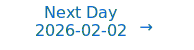

# Personalized Daily ArXiv Papers 2026-01-30

| *[gpt-5]*   | Prompt   | Completion   | Total   |
|:-----------:|:--------:|:------------:|:-------:|
| **Token**   | 94363    | 68277        | 162640  |
| **Cost**    | $0.12    | $0.68        | $0.8    |

Total arXiv papers: 770

Total scanned papers: 451

Total relevant papers: 68

**Table of contents with paper titles:**

1. [L$^3$: Large Lookup Layers](#user-content-link1)
**Authors:** Albert Tseng, Christopher De Sa

2. [HeRo-Q: A General Framework for Stable Low Bit Quantization via Hessian Conditioning](#user-content-link2)
**Authors:** Jinhao Zhang Yunquan Zhang, Zicheng yan, Boyang Zhang, Jun Sun, Daning Cheng

3. [Scaling Embeddings Outperforms Scaling Experts in Language Models](#user-content-link3)
**Authors:** Hong Liu, Jiaqi Zhang, Chao Wang, Xing Hu, Linkun Lyu, Jiaqi Sun, Xurui Yang, Bo Wang, Fengcun Li, Yulei Qian, Lingtong Si, Yerui Sun, Rumei Li, Peng Pei, Yuchen Xie, Xunliang Cai

4. [HESTIA: A Hessian-Guided Differentiable Quantization-Aware Training Framework for Extremely Low-Bit LLMs](#user-content-link4)
**Authors:** Guoan Wang, Feiyu Wang, Zongwei Lv, Yikun Zong, Tong Yang

5. [Depth-Recurrent Attention Mixtures: Giving Latent Reasoning the Attention it Deserves](#user-content-link5)
**Authors:** Jonas Knupp, Jan Hendrik Metzen, Jeremias Bohn, Georg Groh, Kristian Kersting

6. [ZipMoE: Efficient On-Device MoE Serving via Lossless Compression and Cache-Affinity Scheduling](#user-content-link6)
**Authors:** Yuchen Yang, Yaru Zhao, Pu Yang, Shaowei Wang, Zhi-Hua Zhou

7. [ConceptMoE: Adaptive Token-to-Concept Compression for Implicit Compute Allocation](#user-content-link7)
**Authors:** Zihao Huang, Jundong Zhou, Xingwei Qu, Qiyang Min, Ge Zhang

8. [ECO: Quantized Training without Full-Precision Master Weights](#user-content-link8)
**Authors:** Mahdi Nikdan, Amir Zandieh, Dan Alistarh, Vahab Mirrokni

9. [Don't be so Stief! Learning KV Cache low-rank approximation over the Stiefel manifold](#user-content-link9)
**Authors:** Luca Benfenati, Matteo Risso, Andrea Vannozzi, Ahmet Caner Y\"uz\"ug\"uler, Lukas Cavigelli, Enrico Macii, Daniele Jahier Pagliari, Alessio Burrello

10. [L2R: Low-Rank and Lipschitz-Controlled Routing for Mixture-of-Experts](#user-content-link10)
**Authors:** Minghao Yang, Ren Togo, Guang Li, Takahiro Ogawa, Miki Haseyama

11. [Modeling Next-Token Prediction as Left-Nested Intuitionistic Implication](#user-content-link11)
**Authors:** Paul Tarau

12. [High-dimensional learning dynamics of multi-pass Stochastic Gradient Descent in multi-index models](#user-content-link12)
**Authors:** Zhou Fan, Leda Wang

13. [Perceptrons and localization of attention's mean-field landscape](#user-content-link13)
**Authors:** Antonio \'Alvarez-L\'opez, Borjan Geshkovski, Dom\`enec Ruiz-Balet

14. [PRISM: Distribution-free Adaptive Computation of Matrix Functions for Accelerating Neural Network Training](#user-content-link14)
**Authors:** Shenghao Yang, Zhichao Wang, Oleg Balabanov, N. Benjamin Erichson, Michael W. Mahoney

15. [DASH: Deterministic Attention Scheduling for High-throughput Reproducible LLM Training](#user-content-link15)
**Authors:** Xinwei Qiang, Hongmin Chen, Shixuan Sun, Jingwen Leng, Xin Liu, Minyi Guo

16. [Can Local Learning Match Self-Supervised Backpropagation?](#user-content-link16)
**Authors:** Wu S. Zihan, Ariane Delrocq, Wulfram Gerstner, Guillaume Bellec

17. [SuperInfer: SLO-Aware Rotary Scheduling and Memory Management for LLM Inference on Superchips](#user-content-link17)
**Authors:** Jiahuan Yu, Mingtao Hu, Zichao Lin, Minjia Zhang

18. [Understanding Model Merging: A Unified Generalization Framework for Heterogeneous Experts](#user-content-link18)
**Authors:** Qinglun Li, Anke Tang, Miao Zhang, Mengzhu Wang, Quanjun Yin, Li Shen

19. [Value-Based Pre-Training with Downstream Feedback](#user-content-link19)
**Authors:** Shuqi Ke, Giulia Fanti

20. [Towards Compact and Robust DNNs via Compression-aware Sharpness Minimization](#user-content-link20)
**Authors:** Jialuo He, Huangxun Chen

21. [Beyond Speedup -- Utilizing KV Cache for Sampling and Reasoning](#user-content-link21)
**Authors:** Zeyu Xing, Xing Li, Hui-Ling Zhen, Mingxuan Yuan, Sinno Jialin Pan

22. [Hybrid Linear Attention Done Right: Efficient Distillation and Effective Architectures for Extremely Long Contexts](#user-content-link22)
**Authors:** Yingfa Chen, Zhen Leng Thai, Zihan Zhou, Zhu Zhang, Xingyu Shen, Shuo Wang, Chaojun Xiao, Xu Han, Zhiyuan Liu

23. [Mechanistic Data Attribution: Tracing the Training Origins of Interpretable LLM Units](#user-content-link23)
**Authors:** Jianhui Chen, Yuzhang Luo, Liangming Pan

24. [The Depth Delusion: Why Transformers Should Be Wider, Not Deeper](#user-content-link24)
**Authors:** Md Muhtasim Munif Fahim, Md Rezaul Karim

25. [A Separable Architecture for Continuous Token Representation in Language Models](#user-content-link25)
**Authors:** Reza T. Batley, Sourav Saha

26. [LAMP: Look-Ahead Mixed-Precision Inference of Large Language Models](#user-content-link26)
**Authors:** Stanislav Budzinskiy, Marian Gloser, Tolunay Yilmaz, Ying Hong Tham, Yuanyi Lin, Wenyi Fang, Fan Wu, Philipp Petersen

27. [Clustering in Deep Stochastic Transformers](#user-content-link27)
**Authors:** Lev Fedorov, Micha\"el E. Sander, Romuald Elie, Pierre Marion, Mathieu Lauri\`ere

28. [Soft Quantization: Model Compression Via Weight Coupling](#user-content-link28)
**Authors:** Daniel T. Bernstein, Luca Di Carlo, David Schwab

29. [GeoNorm: Unify Pre-Norm and Post-Norm with Geodesic Optimization](#user-content-link29)
**Authors:** Chuanyang Zheng, Jiankai Sun, Yihang Gao, Chi Wang, Yuehao Wang, Jing Xiong, Liliang Ren, Bo Peng, Qingmei Wang, Xiaoran Shang, Mac Schwager, Anderson Schneider, Yuriy Nevmyvaka, Xiaodong Liu

30. [Seg-MoE: Multi-Resolution Segment-wise Mixture-of-Experts for Time Series Forecasting Transformers](#user-content-link30)
**Authors:** Evandro S. Ortigossa, Eran Segal

31. [Routing the Lottery: Adaptive Subnetworks for Heterogeneous Data](#user-content-link31)
**Authors:** Grzegorz Stefanski, Alberto Presta, Michal Byra

32. [Beyond GEMM-Centric NPUs: Enabling Efficient Diffusion LLM Sampling](#user-content-link32)
**Authors:** Binglei Lou, Haoran Wu, Yao Lai, Jiayi Nie, Can Xiao, Xuan Guo, Rika Antonova, Robert Mullins, Aaron Zhao

33. [Fast and Geometrically Grounded Lorentz Neural Networks](#user-content-link33)
**Authors:** Robert van der Klis, Ricardo Ch\'avez Torres, Max van Spengler, Yuhui Ding, Thomas Hofmann, Pascal Mettes

34. [Pay for Hints, Not Answers: LLM Shepherding for Cost-Efficient Inference](#user-content-link34)
**Authors:** Ziming Dong, Hardik Sharma, Evan O'Toole, Jaya Prakash Champati, Kui Wu

35. [Scalable Power Sampling: Unlocking Efficient, Training-Free Reasoning for LLMs via Distribution Sharpening](#user-content-link35)
**Authors:** Xiaotong Ji, Rasul Tutunov, Matthieu Zimmer, Haitham Bou Ammar

36. [LoRA and Privacy: When Random Projections Help (and When They Don't)](#user-content-link36)
**Authors:** Yaxi Hu, Johanna D\"ungler, Bernhard Sch\"olkopf, Amartya Sanyal

37. [Representation Unlearning: Forgetting through Information Compression](#user-content-link37)
**Authors:** Antonio Almud\'evar, Alfonso Ortega

38. [Procedural Pretraining: Warming Up Language Models with Abstract Data](#user-content-link38)
**Authors:** Liangze Jiang, Zachary Shinnick, Anton van den Hengel, Hemanth Saratchandran, Damien Teney

39. [CORDS: Continuous Representations of Discrete Structures](#user-content-link39)
**Authors:** Tin Had\v{z}i Veljkovi\'c, Erik Bekkers, Michael Tiemann, Jan-Willem van de Meent

40. [TRACE: Trajectory Recovery for Continuous Mechanism Evolution in Causal Representation Learning](#user-content-link40)
**Authors:** Shicheng Fan, Kun Zhang, Lu Cheng

41. [Order-Optimal Sample Complexity of Rectified Flows](#user-content-link41)
**Authors:** Hari Krishna Sahoo, Mudit Gaur, Vaneet Aggarwal

42. [Bridging Functional and Representational Similarity via Usable Information](#user-content-link42)
**Authors:** Antonio Almud\'evar, Alfonso Ortega

43. [$\mathbb{R}^{2k}$ is Theoretically Large Enough for Embedding-based Top-$k$ Retrieval](#user-content-link43)
**Authors:** Zihao Wang, Hang Yin, Lihui Liu, Hanghang Tong, Yangqiu Song, Ginny Wong, Simon See

44. [Dynamics Reveals Structure: Challenging the Linear Propagation Assumption](#user-content-link44)
**Authors:** Hoyeon Chang, B\'alint Mucs\'anyi, Seong Joon Oh

45. [Identifiable Equivariant Networks are Layerwise Equivariant](#user-content-link45)
**Authors:** Vahid Shahverdi, Giovanni Luca Marchetti, Georg B\"okman, Kathl\'en Kohn

46. [From Logits to Latents: Contrastive Representation Shaping for LLM Unlearning](#user-content-link46)
**Authors:** Haoran Tang, Rajiv Khanna

47. [Grounding and Enhancing Informativeness and Utility in Dataset Distillation](#user-content-link47)
**Authors:** Shaobo Wang, Yantai Yang, Guo Chen, Peiru Li, Kaixin Li, Yufa Zhou, Zhaorun Chen, Linfeng Zhang

48. [Multi-Modal Time Series Prediction via Mixture of Modulated Experts](#user-content-link48)
**Authors:** Lige Zhang, Ali Maatouk, Jialin Chen, Leandros Tassiulas, Rex Ying

49. [Hebbian Learning with Global Direction](#user-content-link49)
**Authors:** Wenjia Hua, Kejie Zhao, Luziwei Leng, Ran Cheng, Yuxin Ma, Qinghai Guo

50. [KromHC: Manifold-Constrained Hyper-Connections with Kronecker-Product Residual Matrices](#user-content-link50)
**Authors:** Wuyang Zhou, Yuxuan Gu, Giorgos Iacovides, Danilo Mandic

51. [XFACTORS: Disentangled Information Bottleneck via Contrastive Supervision](#user-content-link51)
**Authors:** Alexandre Myara, Nicolas Bourriez, Thomas Boyer, Thomas Lemercier, Ihab Bendidi, Auguste Genovesio

52. [Missing-Data-Induced Phase Transitions in Spectral PLS for Multimodal Learning](#user-content-link52)
**Authors:** Anders Gj{\o}lbye, Ida Kargaard, Emma Kargaard, Lars Kai Hansen

53. [FISMO: Fisher-Structured Momentum-Orthogonalized Optimizer](#user-content-link53)
**Authors:** Chenrui Xu, Wenjing Yan, Ying-Jun Angela Zhang

54. [Theoretically Optimal Attention/FFN Ratios in Disaggregated LLM Serving](#user-content-link54)
**Authors:** Chendong Song, Meixuan Wang, Hang Zhou, Hong Liang, Yuan Lyu, Zixi Chen, Yuwei Fan, Zijie Zhou

55. [MeanCache: From Instantaneous to Average Velocity for Accelerating Flow Matching Inference](#user-content-link55)
**Authors:** Huanlin Gao, Ping Chen, Fuyuan Shi, Ruijia Wu, Li YanTao, Qiang Hui, Yuren You, Ting Lu, Chao Tan, Shaoan Zhao, Zhaoxiang Liu, Fang Zhao, Kai Wang, Shiguo Lian

56. [How Expressive Are Graph Neural Networks in the Presence of Node Identifiers?](#user-content-link56)
**Authors:** Arie Soeteman, Michael Benedikt, Martin Grohe, Balder ten Cate

57. [Amortized Spectral Kernel Discovery via Prior-Data Fitted Network](#user-content-link57)
**Authors:** Kaustubh Sharma, Srijan Tiwari, Ojasva Nema, Parikshit Pareek

58. [Learning the Mechanism of Catastrophic Forgetting: A Perspective from Gradient Similarity](#user-content-link58)
**Authors:** Mutian Yang, Zisen Zhan, Yutong Chen, Haolin Li, Kaiwen Wang, Kaili Zheng, Yuguang Wang, Qi Wang, Jiandong Gao, Ji Wu

59. [Is Parameter Isolation Better for Prompt-Based Continual Learning?](#user-content-link59)
**Authors:** Jiangyang Li, Chenhao Ding, Songlin Dong, Qiang Wang, Jianchao Zhao, Yuhang He, Yihong Gong

60. [Effective LoRA Adapter Routing using Task Representations](#user-content-link60)
**Authors:** Akash Dhasade, Anne-Marie Kermarrec, Igor Pavlovic, Diana Petrescu, Rafael Pires, Mathis Randl, Martijn de Vos

61. [LinguaMap: Which Layers of LLMs Speak Your Language and How to Tune Them?](#user-content-link61)
**Authors:** J. Ben Tamo, Daniel Carlander-Reuterfelt, Jonathan Rubin, Dezhi Hong, Mingxian Wang, Oleg Poliannikov

62. [Why Adam Works Better with $\beta_1 = \beta_2$: The Missing Gradient Scale Invariance Principle](#user-content-link62)
**Authors:** Alberto Fern\'andez-Hern\'andez, Cristian P\'erez-Corral, Jose I. Mestre, Manuel F. Dolz, Enrique S. Quintana-Ort\'i

63. [Flow Perturbation++: Multi-Step Unbiased Jacobian Estimation for High-Dimensional Boltzmann Sampling](#user-content-link63)
**Authors:** Xin Peng, Ang Gao

64. [Putting a Face to Forgetting: Continual Learning meets Mechanistic Interpretability](#user-content-link64)
**Authors:** Sergi Masip, Gido M. van de Ven, Javier Ferrando, Tinne Tuytelaars

65. [FlexCausal: Flexible Causal Disentanglement via Structural Flow Priors and Manifold-Aware Interventions](#user-content-link65)
**Authors:** Yutao Jin, Yuang Tao, Junyong Zhai

66. [MAR: Efficient Large Language Models via Module-aware Architecture Refinement](#user-content-link66)
**Authors:** Junhong Cai, Guiqin Wang, Kejie Zhao, Jianxiong Tang, Xiang Wang, Luziwei Leng, Ran Cheng, Yuxin Ma, Qinghai Guo

67. [CCMamba: Selective State-Space Models for Higher-Order Graph Learning on Combinatorial Complexes](#user-content-link67)
**Authors:** Jiawen Chen, Qi Shao, Mingtong Zhou, Duxin Chen, Wenwu Yu

68. [Making Foundation Models Probabilistic via Singular Value Ensembles](#user-content-link68)
**Authors:** Mehmet Ozgur Turkoglu, Dominik J. M\"uhlematter, Alexander Becker, Konrad Schindler, Helge Aasen

---

## 1. [L$^3$: Large Lookup Layers](https://arxiv.org/abs/2601.21461) 

**ArXiv ID:** 2601.21461

**Authors:** Albert Tseng, Christopher De Sa

**Abstract:** Modern sparse language models typically achieve sparsity through Mixture-of-Experts (MoE) layers, which dynamically route tokens to dense MLP "experts." However, dynamic hard routing has a number of drawbacks, such as potentially poor hardware efficiency and needing auxiliary losses for stable training. In contrast, the tokenizer embedding table, which is natively sparse, largely avoids these issues by selecting a single embedding per token at the cost of not having contextual information. In this work, we introduce the Large Lookup Layer (L$^3$), which unlocks a new axis of sparsity by generalizing embedding tables to model decoder layers. L$^3$ layers use static token-based routing to aggregate a set of learned embeddings per token in a context-dependent way, allowing the model to efficiently balance memory and compute by caching information in embeddings. L$^3$ has two main components: (1) a systems-friendly architecture that allows for fast training and CPU-offloaded inference with no overhead, and (2) an information-theoretic embedding allocation algorithm that effectively balances speed and quality. We empirically test L$^3$ by training transformers with up to 2.6B active parameters and find that L$^3$ strongly outperforms both dense models and iso-sparse MoEs in both language modeling and downstream tasks.

**Comment:** Model Architecture & Sparsity: proposes Large Lookup Layers as a systems-friendly sparse alternative to MoE with static token-based routing and embedding allocation; enables CPU-offloaded inference.

**Relevance:** 10
**Novelty:** 9

---

## 2. [HeRo-Q: A General Framework for Stable Low Bit Quantization via Hessian Conditioning](https://arxiv.org/abs/2601.21626) 

**ArXiv ID:** 2601.21626

**Authors:** Jinhao Zhang Yunquan Zhang, Zicheng yan, Boyang Zhang, Jun Sun, Daning Cheng

**Abstract:** Post Training Quantization (PTQ), a mainstream model compression technique, often leads to the paradoxical 'low error, high loss' phenomenon because it focuses solely on minimizing quantization error. The root cause lies in the Hessian matrix of the LLM loss landscape: a few high curvature directions are extremely sensitive to perturbations. To address this, we propose the Hessian Robust Quantization (HeRo Q) algorithm, which applies a lightweight, learnable rotation-compression matrix to the weight space prior to quantization. This joint framework reshapes the loss landscape by reducing the largest Hessian eigenvalue and reducing its max eigenvalue, thereby significantly enhancing robustness to quantization noise. HeRo-Q requires no architectural modifications, incurs negligible computational overhead, and integrates seamlessly into existing PTQ pipelines. Experiments on Llama and Qwen models show that HeRo Q consistently outperforms state of the art methods including GPTQ, AWQ, and SpinQuant not only achieving superior performance under standard W4A8 settings, but also excelling in the highly challenging W3A16 ultra low bit regime, where it boosts GSM8K accuracy on Llama3 8B to 70.15\% and effectively avoids the logical collapse commonly seen in aggressive quantization.

**Comment:** Model Compression and Efficiency: low-bit PTQ via Hessian conditioning with learnable rotations to reduce curvature sensitivity.

**Relevance:** 10
**Novelty:** 8

---

## 3. [Scaling Embeddings Outperforms Scaling Experts in Language Models](https://arxiv.org/abs/2601.21204) 

**ArXiv ID:** 2601.21204

**Authors:** Hong Liu, Jiaqi Zhang, Chao Wang, Xing Hu, Linkun Lyu, Jiaqi Sun, Xurui Yang, Bo Wang, Fengcun Li, Yulei Qian, Lingtong Si, Yerui Sun, Rumei Li, Peng Pei, Yuchen Xie, Xunliang Cai

**Abstract:** While Mixture-of-Experts (MoE) architectures have become the standard for sparsity scaling in large language models, they increasingly face diminishing returns and system-level bottlenecks. In this work, we explore embedding scaling as a potent, orthogonal dimension for scaling sparsity. Through a comprehensive analysis and experiments, we identify specific regimes where embedding scaling achieves a superior Pareto frontier compared to expert scaling. We systematically characterize the critical architectural factors governing this efficacy -- ranging from parameter budgeting to the interplay with model width and depth. Moreover, by integrating tailored system optimizations and speculative decoding, we effectively convert this sparsity into tangible inference speedups. Guided by these insights, we introduce LongCat-Flash-Lite, a 68.5B parameter model with ~3B activated trained from scratch. Despite allocating over 30B parameters to embeddings, LongCat-Flash-Lite not only surpasses parameter-equivalent MoE baselines but also exhibits exceptional competitiveness against existing models of comparable scale, particularly in agentic and coding domains.

**Comment:** Model architecture and efficiency: proposes scaling embeddings as an alternative to MoE sparsity scaling; includes system optimizations/speculative decoding; directly targets MoE/LLM scaling.

**Relevance:** 10
**Novelty:** 8

---

## 4. [HESTIA: A Hessian-Guided Differentiable Quantization-Aware Training Framework for Extremely Low-Bit LLMs](https://arxiv.org/abs/2601.20745) 

**ArXiv ID:** 2601.20745

**Authors:** Guoan Wang, Feiyu Wang, Zongwei Lv, Yikun Zong, Tong Yang

**Abstract:** As large language models (LLMs) continue to scale, deployment is increasingly bottlenecked by the memory wall, motivating a shift toward extremely low-bit quantization. However, most quantization-aware training (QAT) methods apply hard rounding and the straight-through estimator (STE) from the beginning of the training, which prematurely discretizes the optimization landscape and induces persistent gradient mismatch between latent weights and quantized weights, hindering effective optimization of quantized models. To address this, we propose Hestia, a Hessian-guided differentiable QAT framework for extremely low-bit LLMs, which replaces the rigid step function with a temperature-controlled softmax relaxation to maintain gradient flow early in training while progressively hardening quantization. Furthermore, Hestia leverages a tensor-wise Hessian trace metric as a lightweight curvature signal to drive fine-grained temperature annealing, enabling sensitivity-aware discretization across the model. Evaluations on Llama-3.2 show that Hestia consistently outperforms existing ternary QAT baselines, yielding average zero-shot improvements of 5.39% and 4.34% for the 1B and 3B models. These results indicate that Hessian-guided relaxation effectively recovers representational capacity, establishing a more robust training path for 1.58-bit LLMs. The code is available at https://github.com/hestia2026/Hestia.

**Comment:** Model Compression and Efficiency: introduces a Hessian-guided, differentiable QAT with temperature annealing for ultra-low-bit LLMs, improving optimization over STE-based methods.

**Relevance:** 10
**Novelty:** 8

---

## 5. [Depth-Recurrent Attention Mixtures: Giving Latent Reasoning the Attention it Deserves](https://arxiv.org/abs/2601.21582) 

**ArXiv ID:** 2601.21582

**Authors:** Jonas Knupp, Jan Hendrik Metzen, Jeremias Bohn, Georg Groh, Kristian Kersting

**Abstract:** Depth-recurrence facilitates latent reasoning by sharing parameters across depths. However, prior work lacks combined FLOP-, parameter-, and memory-matched baselines, underutilizes depth-recurrence due to partially fixed layer stacks, and ignores the bottleneck of constant hidden-sizes that restricts many-step latent reasoning. To address this, we introduce a modular framework of depth-recurrent attention mixtures (Dreamer), combining sequence attention, depth attention, and sparse expert attention. It alleviates the hidden-size bottleneck through attention along depth, decouples scaling dimensions, and allows depth-recurrent models to scale efficiently and effectively. Across language reasoning benchmarks, our models require 2 to 8x fewer training tokens for the same accuracy as FLOP-, parameter-, and memory-matched SOTA, and outperform ca. 2x larger SOTA models with the same training tokens. We further present insights into knowledge usage across depths, e.g., showing 2 to 11x larger expert selection diversity than SOTA MoEs.

**Comment:** Model Architecture: proposes depth-recurrent attention mixtures combining depth attention and sparse expert attention (MoE) to scale latent reasoning efficiently.

**Relevance:** 10
**Novelty:** 8

---

## 6. [ZipMoE: Efficient On-Device MoE Serving via Lossless Compression and Cache-Affinity Scheduling](https://arxiv.org/abs/2601.21198) 

**ArXiv ID:** 2601.21198

**Authors:** Yuchen Yang, Yaru Zhao, Pu Yang, Shaowei Wang, Zhi-Hua Zhou

**Abstract:** While Mixture-of-Experts (MoE) architectures substantially bolster the expressive power of large-language models, their prohibitive memory footprint severely impedes the practical deployment on resource-constrained edge devices, especially when model behavior must be preserved without relying on lossy quantization. In this paper, we present ZipMoE, an efficient and semantically lossless on-device MoE serving system. ZipMoE exploits the synergy between the hardware properties of edge devices and the statistical redundancy inherent to MoE parameters via a caching-scheduling co-design with provable performance guarantee. Fundamentally, our design shifts the paradigm of on-device MoE inference from an I/O-bound bottleneck to a compute-centric workflow that enables efficient parallelization. We implement a prototype of ZipMoE and conduct extensive experiments on representative edge computing platforms using popular open-source MoE models and real-world workloads. Our evaluation reveals that ZipMoE achieves up to $72.77\%$ inference latency reduction and up to $6.76\times$ higher throughput than the state-of-the-art systems.

**Comment:** HPC/Systems + MoE: lossless compression and cache-affinity scheduling for on-device MoE serving with provable performance, shifting I/O to compute-centric.

**Relevance:** 10
**Novelty:** 8

---

## 7. [ConceptMoE: Adaptive Token-to-Concept Compression for Implicit Compute Allocation](https://arxiv.org/abs/2601.21420) 

**ArXiv ID:** 2601.21420

**Authors:** Zihao Huang, Jundong Zhou, Xingwei Qu, Qiyang Min, Ge Zhang

**Abstract:** Large language models allocate uniform computation across all tokens, ignoring that some sequences are trivially predictable while others require deep reasoning. We introduce ConceptMoE, which dynamically merges semantically similar tokens into concept representations, performing implicit token-level compute allocation. A learnable chunk module identifies optimal boundaries by measuring inter-token similarity, compressing sequences by a target ratio $R$ before they enter the compute-intensive concept model. Crucially, the MoE architecture enables controlled evaluation: we reallocate saved computation to match baseline activated FLOPs (excluding attention map computation) and total parameters, isolating genuine architectural benefits. Under these conditions, ConceptMoE consistently outperforms standard MoE across language and vision-language tasks, achieving +0.9 points on language pretraining, +2.3 points on long context understanding, and +0.6 points on multimodal benchmarks. When converting pretrained MoE during continual training with layer looping, gains reach +5.5 points, demonstrating practical applicability. Beyond performance, ConceptMoE reduces attention computation by up to $R^2\times$ and KV cache by $R\times$. At $R=2$, empirical measurements show prefill speedups reaching 175\% and decoding speedups up to 117\% on long sequences. The minimal architectural modifications enable straightforward integration into existing MoE, demonstrating that adaptive concept-level processing fundamentally improves both effectiveness and efficiency of large language models.

**Comment:** Model Architecture/Compression: MoE with adaptive token-to-concept compression for implicit compute allocation; reduces attention/KV cache and improves efficiency.

**Relevance:** 10
**Novelty:** 8

---

## 8. [ECO: Quantized Training without Full-Precision Master Weights](https://arxiv.org/abs/2601.22101) 

**ArXiv ID:** 2601.22101

**Authors:** Mahdi Nikdan, Amir Zandieh, Dan Alistarh, Vahab Mirrokni

**Abstract:** Quantization has significantly improved the compute and memory efficiency of Large Language Model (LLM) training. However, existing approaches still rely on accumulating their updates in high-precision: concretely, gradient updates must be applied to a high-precision weight buffer, known as $\textit{master weights}$. This buffer introduces substantial memory overhead, particularly for Sparse Mixture of Experts (SMoE) models, where model parameters and optimizer states dominate memory usage. To address this, we introduce the Error-Compensating Optimizer (ECO), which eliminates master weights by applying updates directly to quantized parameters. ECO quantizes weights after each step and carefully injects the resulting quantization error into the optimizer momentum, forming an error-feedback loop with no additional memory. We prove that, under standard assumptions and a decaying learning rate, ECO converges to a constant-radius neighborhood of the optimum, while naive master-weight removal can incur an error that is inversely proportional to the learning rate. We show empirical results for pretraining small Transformers (30-800M), a Gemma-3 1B model, and a 2.1B parameter Sparse MoE model with FP8 quantization, and fine-tuning DeepSeek-MoE-16B in INT4 precision. Throughout, ECO matches baselines with master weights up to near-lossless accuracy, significantly shifting the static memory vs validation loss Pareto frontier.

**Comment:** Compression/Efficiency: quantized training without full-precision master weights via error-compensating optimizer; theory and SMoE applicability.

**Relevance:** 10
**Novelty:** 8

---

## 9. [Don't be so Stief! Learning KV Cache low-rank approximation over the Stiefel manifold](https://arxiv.org/abs/2601.21686) 

**ArXiv ID:** 2601.21686

**Authors:** Luca Benfenati, Matteo Risso, Andrea Vannozzi, Ahmet Caner Y\"uz\"ug\"uler, Lukas Cavigelli, Enrico Macii, Daniele Jahier Pagliari, Alessio Burrello

**Abstract:** Key--value (KV) caching enables fast autoregressive decoding but at long contexts becomes a dominant bottleneck in High Bandwidth Memory (HBM) capacity and bandwidth. A common mitigation is to compress cached keys and values by projecting per-head matrixes to a lower rank, storing only the projections in the HBM. However, existing post-training approaches typically fit these projections using SVD-style proxy objectives, which may poorly reflect end-to-end reconstruction after softmax, value mixing, and subsequent decoder-layer transformations.   For these reasons, we introduce StiefAttention, a post-training KV-cache compression method that learns \emph{orthonormal} projection bases by directly minimizing \emph{decoder-layer output reconstruction error}. StiefAttention additionally precomputes, for each layer, an error-rank profile over candidate ranks, enabling flexible layer-wise rank allocation under a user-specified error budget. Noteworthy, on Llama3-8B under the same conditions, StiefAttention outperforms EigenAttention by $11.9$ points on C4 perplexity and $5.4\%$ on 0-shot MMLU accuracy at iso-compression, yielding lower relative error and higher cosine similarity with respect to the original decoder-layer outputs.

**Comment:** Model Compression and Efficiency: KV-cache low-rank projection learned on the Stiefel manifold by minimizing decoder-layer output error with rank allocation profiles.

**Relevance:** 10
**Novelty:** 8

---

## 10. [L2R: Low-Rank and Lipschitz-Controlled Routing for Mixture-of-Experts](https://arxiv.org/abs/2601.21349) 

**ArXiv ID:** 2601.21349

**Authors:** Minghao Yang, Ren Togo, Guang Li, Takahiro Ogawa, Miki Haseyama

**Abstract:** Mixture-of-Experts (MoE) models scale neural networks by conditionally activating a small subset of experts, where the router plays a central role in determining expert specialization and overall model performance. However, many modern MoE systems still adopt linear routers in raw high-dimensional representation spaces, where representation mismatch, angular concentration, and scale-sensitive scoring can jointly undermine routing discriminability and stable expert specialization. In this work, we propose Low-rank \& Lipschitz-controlled Routing (L2R), a unified routing framework that reshapes both the routing space and scoring geometry. L2R performs expert assignment in a shared low-rank latent routing space and introduces Saturated Inner-Product Scoring (SIPS) to explicitly control the Lipschitz behavior of routing functions, yielding smoother and more stable routing geometry. In addition, L2R incorporates a parameter-efficient multi-anchor routing mechanism to enhance expert expressiveness. Extensive experiments on a large-scale language MoE model and a vision MoE setting on ImageNet demonstrate that L2R consistently improves routing stability, expert specialization, and overall model performance.

**Comment:** Matches Model Architecture: MoE routing improved via low-rank latent routing space and Lipschitz-controlled scoring geometry.

**Relevance:** 10
**Novelty:** 8

---

## 11. [Modeling Next-Token Prediction as Left-Nested Intuitionistic Implication](https://arxiv.org/abs/2601.19915) 

**ArXiv ID:** 2601.19915

**Authors:** Paul Tarau

**Abstract:** We introduce the \emph{Arrow Language Model}, a neural architecture derived from an intuitionistic-logic interpretation of next-token prediction. Instead of representing tokens as additive embeddings mixed by attention, we encode a prefix as a \emph{left-nested implication chain} whose structure preserves order through non-commutative composition. Next-token prediction corresponds to \emph{modus ponens}, and sequence processing becomes constructive proof extension under the Curry--Howard correspondence. Our Prolog-based specialized theorem provers validate fundamental properties of the neural models, among which relations between commutative vs. non-commutative sequencing and single-token vs. multi-token prediction choices. We show that a neural architecture equivalent to multiplicative RNNs arises naturally from a proof-theoretic interpretation of next-token prediction as nested intuitionistic implication, we present a practical low-rank neural realization and position the model relative to Transformers and state-space models.   Keywords: logic-based derivation of neural architectures, intuitionistic implicational logic, token-as-operator neural models, state-space models, alternatives to transformer-based foundational models.

**Comment:** Model Architecture: logic-derived Arrow Language Model interpreting next-token prediction as nested intuitionistic implication with low-rank realization.

**Relevance:** 9
**Novelty:** 9

---

## 12. [High-dimensional learning dynamics of multi-pass Stochastic Gradient Descent in multi-index models](https://arxiv.org/abs/2601.21093) 

**ArXiv ID:** 2601.21093

**Authors:** Zhou Fan, Leda Wang

**Abstract:** We study the learning dynamics of a multi-pass, mini-batch Stochastic Gradient Descent (SGD) procedure for empirical risk minimization in high-dimensional multi-index models with isotropic random data. In an asymptotic regime where the sample size $n$ and data dimension $d$ increase proportionally, for any sub-linear batch size $\kappa \asymp n^\alpha$ where $\alpha \in [0,1)$, and for a commensurate ``critical'' scaling of the learning rate, we provide an asymptotically exact characterization of the coordinate-wise dynamics of SGD. This characterization takes the form of a system of dynamical mean-field equations, driven by a scalar Poisson jump process that represents the asymptotic limit of SGD sampling noise. We develop an analogous characterization of the Stochastic Modified Equation (SME) which provides a Gaussian diffusion approximation to SGD.   Our analyses imply that the limiting dynamics for SGD are the same for any batch size scaling $\alpha \in [0,1)$, and that under a commensurate scaling of the learning rate, dynamics of SGD, SME, and gradient flow are mutually distinct, with those of SGD and SME coinciding in the special case of a linear model. We recover a known dynamical mean-field characterization of gradient flow in a limit of small learning rate, and of one-pass/online SGD in a limit of increasing sample size $n/d \to \infty$.

**Comment:** Training dynamics: asymptotically exact mean-field characterization of multi-pass mini-batch SGD vs SME vs gradient flow in high dimensions.

**Relevance:** 9
**Novelty:** 8

---

## 13. [Perceptrons and localization of attention's mean-field landscape](https://arxiv.org/abs/2601.21366) 

**ArXiv ID:** 2601.21366

**Authors:** Antonio \'Alvarez-L\'opez, Borjan Geshkovski, Dom\`enec Ruiz-Balet

**Abstract:** The forward pass of a Transformer can be seen as an interacting particle system on the unit sphere: time plays the role of layers, particles that of token embeddings, and the unit sphere idealizes layer normalization. In some weight settings the system can even be seen as a gradient flow for an explicit energy, and one can make sense of the infinite context length (mean-field) limit thanks to Wasserstein gradient flows. In this paper we study the effect of the perceptron block in this setting, and show that critical points are generically atomic and localized on subsets of the sphere.

**Comment:** Model Architecture theory: mean-field analysis of Transformer attention/perceptron blocks showing atomic localization of critical points.

**Relevance:** 9
**Novelty:** 8

---

## 14. [PRISM: Distribution-free Adaptive Computation of Matrix Functions for Accelerating Neural Network Training](https://arxiv.org/abs/2601.22137) 

**ArXiv ID:** 2601.22137

**Authors:** Shenghao Yang, Zhichao Wang, Oleg Balabanov, N. Benjamin Erichson, Michael W. Mahoney

**Abstract:** Matrix functions such as square root, inverse roots, and orthogonalization play a central role in preconditioned gradient methods for neural network training. This has motivated the development of iterative algorithms that avoid explicit eigendecompositions and rely primarily on matrix multiplications, making them well suited for modern GPU accelerators. We present PRISM (Polynomial-fitting and Randomized Iterative Sketching for Matrix functions computation), a general framework for accelerating iterative algorithms for computing matrix functions. PRISM combines adaptive polynomial approximation with randomized sketching: at each iteration, it fits a polynomial surrogate to the current spectrum via a sketched least-squares problem, adapting to the instance at hand with minimal overhead. We apply PRISM to accelerate Newton-Schulz-like iterations for matrix square roots and orthogonalization, which are core primitives in machine learning. Unlike prior methods, PRISM requires no explicit spectral bounds or singular value estimates; and it adapts automatically to the evolving spectrum. Empirically, PRISM accelerates training when integrated into Shampoo and Muon optimizers.

**Comment:** Systems/efficiency: algorithmic framework (adaptive polynomial fitting + randomized sketching) to accelerate matrix functions used in optimizers (Shampoo/Muon), enabling faster large-model training.

**Relevance:** 9
**Novelty:** 8

---

## 15. [DASH: Deterministic Attention Scheduling for High-throughput Reproducible LLM Training](https://arxiv.org/abs/2601.21824) 

**ArXiv ID:** 2601.21824

**Authors:** Xinwei Qiang, Hongmin Chen, Shixuan Sun, Jingwen Leng, Xin Liu, Minyi Guo

**Abstract:** Determinism is indispensable for reproducibility in large language model (LLM) training, yet it often exacts a steep performance cost. In widely used attention implementations such as FlashAttention-3, the deterministic backward pass can incur up to a 37.9% throughput reduction relative to its non-deterministic counterpart, primarily because gradient accumulation operations must be serialized to guarantee numerical consistency. This performance loss stems from suboptimal scheduling of compute and gradient-reduction phases, leading to significant hardware underutilization.   To address this challenge, we formulate the backward pass of deterministic attention as a scheduling problem on a Directed Acyclic Graph (DAG) and derive schedules that minimize the critical path length. Building on this formulation, we present DASH (Deterministic Attention Scheduling for High-Throughput), which encapsulates two complementary scheduling strategies: (i) Descending Q-Tile Iteration, a reversed query-block traversal that shrinks pipeline stalls in causal attention, and (ii) Shift Scheduling, a theoretically optimal schedule within our DAG model that reduces pipeline stalls for both full and causal masks.   Our empirical evaluations on NVIDIA H800 GPUs demonstrate that DASH narrows the performance gap of deterministic attention. The proposed strategies improve the throughput of the attention backward pass by up to 1.28$\times$ compared to the baseline, significantly advancing the efficiency of reproducible LLM training.   Our code is open-sourced at https://github.com/SJTU-Liquid/deterministic-FA3.

**Comment:** HPC/systems: deterministic attention scheduling (backward pass DAG scheduling) to regain throughput for reproducible LLM training.

**Relevance:** 9
**Novelty:** 8

---

## 16. [Can Local Learning Match Self-Supervised Backpropagation?](https://arxiv.org/abs/2601.21683) 

**ArXiv ID:** 2601.21683

**Authors:** Wu S. Zihan, Ariane Delrocq, Wulfram Gerstner, Guillaume Bellec

**Abstract:** While end-to-end self-supervised learning with backpropagation (global BP-SSL) has become central for training modern AI systems, theories of local self-supervised learning (local-SSL) have struggled to build functional representations in deep neural networks. To establish a link between global and local rules, we first develop a theory for deep linear networks: we identify conditions for local-SSL algorithms (like Forward-forward or CLAPP) to implement exactly the same weight update as a global BP-SSL. Starting from the theoretical insights, we then develop novel variants of local-SSL algorithms to approximate global BP-SSL in deep non-linear convolutional neural networks. Variants that improve the similarity between gradient updates of local-SSL with those of global BP-SSL also show better performance on image datasets (CIFAR-10, STL-10, and Tiny ImageNet). The best local-SSL rule with the CLAPP loss function matches the performance of a comparable global BP-SSL with InfoNCE or CPC-like loss functions, and improves upon state-of-the-art for local SSL on these benchmarks.

**Comment:** Representation learning/training dynamics: theoretical equivalence conditions between local SSL and global BP-SSL and practical local-SSL variants matching global SSL.

**Relevance:** 9
**Novelty:** 8

---

## 17. [SuperInfer: SLO-Aware Rotary Scheduling and Memory Management for LLM Inference on Superchips](https://arxiv.org/abs/2601.20309) 

**ArXiv ID:** 2601.20309

**Authors:** Jiahuan Yu, Mingtao Hu, Zichao Lin, Minjia Zhang

**Abstract:** Large Language Model (LLM) serving faces a fundamental tension between stringent latency Service Level Objectives (SLOs) and limited GPU memory capacity. When high request rates exhaust the KV cache budget, existing LLM inference systems often suffer severe head-of-line (HOL) blocking. While prior work explored PCIe-based offloading, these approaches cannot sustain responsiveness under high request rates, often failing to meet tight Time-To-First-Token (TTFT) and Time-Between-Tokens (TBT) SLOs. We present SuperInfer, a high-performance LLM inference system designed for emerging Superchips (e.g., NVIDIA GH200) with tightly coupled GPU-CPU architecture via NVLink-C2C. SuperInfer introduces RotaSched, the first proactive, SLO-aware rotary scheduler that rotates requests to maintain responsiveness on Superchips, and DuplexKV, an optimized rotation engine that enables full-duplex transfer over NVLink-C2C. Evaluations on GH200 using various models and datasets show that SuperInfer improves TTFT SLO attainment rates by up to 74.7% while maintaining comparable TBT and throughput compared to state-of-the-art systems, demonstrating that SLO-aware scheduling and memory co-design unlocks the full potential of Superchips for responsive LLM serving.

**Comment:** High Performance Computing: SLO-aware rotary scheduling (RotaSched) and DuplexKV memory co-design on Superchips for responsive LLM serving.

**Relevance:** 9
**Novelty:** 8

---

## 18. [Understanding Model Merging: A Unified Generalization Framework for Heterogeneous Experts](https://arxiv.org/abs/2601.21690) 

**ArXiv ID:** 2601.21690

**Authors:** Qinglun Li, Anke Tang, Miao Zhang, Mengzhu Wang, Quanjun Yin, Li Shen

**Abstract:** Model merging efficiently aggregates capabilities from multiple fine-tuned models into a single one, operating purely in parameter space without original data or expensive re-computation. Despite empirical successes, a unified theory for its effectiveness under heterogeneous finetuning hyperparameters (e.g., varying learning rates, batch sizes) remains missing. Moreover, the lack of hyperparameter transparency in open-source fine-tuned models makes it difficult to predict merged-model performance, leaving practitioners without guidance on how to fine-tune merge-friendly experts. To address those two challenges, we employ $L_2$-Stability theory under heterogeneous hyperparameter environments to analyze the generalization of the merged model $\boldsymbol{x}_{avg}$. This pioneering analysis yields two key contributions: (i) \textit{A unified theoretical framework} is provided to explain existing merging algorithms, revealing how they optimize specific terms in our bound, thus offering a strong theoretical foundation for empirical observations. (ii) \textit{Actionable recommendations} are proposed for practitioners to strategically fine-tune expert models, enabling the construction of merge-friendly models within the pretraining-to-finetuning pipeline. Extensive experiments on the ResNet/Vit family across 20/8 visual classification tasks, involving thousands of finetuning models, robustly confirm the impact of different hyperparameters on the generalization of $\boldsymbol{x}_{avg}$ predicted by our theoretical results.

**Comment:** Model Architecture/Training Theory: unified generalization framework via L2-stability for parameter-space model merging across heterogeneous experts, with actionable merging guidance.

**Relevance:** 9
**Novelty:** 8

---

## 19. [Value-Based Pre-Training with Downstream Feedback](https://arxiv.org/abs/2601.22108) 

**ArXiv ID:** 2601.22108

**Authors:** Shuqi Ke, Giulia Fanti

**Abstract:** Can a small amount of verified goal information steer the expensive self-supervised pretraining of foundation models? Standard pretraining optimizes a fixed proxy objective (e.g., next-token prediction), which can misallocate compute away from downstream capabilities of interest. We introduce V-Pretraining: a value-based, modality-agnostic method for controlled continued pretraining in which a lightweight task designer reshapes the pretraining task to maximize the value of each gradient step. For example, consider self-supervised learning (SSL) with sample augmentation. The V-Pretraining task designer selects pretraining tasks (e.g., augmentations) for which the pretraining loss gradient is aligned with a gradient computed over a downstream task (e.g., image segmentation). This helps steer pretraining towards relevant downstream capabilities. Notably, the pretrained model is never updated on downstream task labels; they are used only to shape the pretraining task. Under matched learner update budgets, V-Pretraining of 0.5B--7B language models improves reasoning (GSM8K test Pass@1) by up to 18% relative over standard next-token prediction using only 12% of GSM8K training examples as feedback. In vision SSL, we improve the state-of-the-art results on ADE20K by up to 1.07 mIoU and reduce NYUv2 RMSE while improving ImageNet linear accuracy, and we provide pilot evidence of improved token efficiency in continued pretraining.

**Comment:** Representation/Training Dynamics: value-based continued pretraining steers SSL using downstream-gradient alignment to maximize gradient value per step.

**Relevance:** 9
**Novelty:** 8

---

## 20. [Towards Compact and Robust DNNs via Compression-aware Sharpness Minimization](https://arxiv.org/abs/2601.20301) 

**ArXiv ID:** 2601.20301

**Authors:** Jialuo He, Huangxun Chen

**Abstract:** Sharpness-Aware Minimization (SAM) has recently emerged as an effective technique for improving DNN robustness to input variations. However, its interplay with the compactness requirements of on-device DNN deployments remains less explored. Simply pruning a SAM-trained model can undermine robustness, since flatness in the continuous parameter space does not necessarily translate to robustness under the discrete structural changes induced by pruning. Conversely, applying SAM after pruning may be fundamentally constrained by architectural limitations imposed by an early, robustness-agnostic pruning pattern. To address this gap, we propose Compression-aware ShArpness Minimization (C-SAM), a framework that shifts sharpness-aware learning from parameter perturbations to mask perturbations. By explicitly perturbing pruning masks during training, C-SAM promotes a flatter loss landscape with respect to model structure, enabling the discovery of pruning patterns that simultaneously optimize model compactness and robustness to input variations. Extensive experiments on CelebA-HQ, Flowers-102, and CIFAR-10-C across ResNet-18, GoogLeNet, and MobileNet-V2 show that C-SAM consistently achieves higher certified robustness than strong baselines, with improvements of up to 42%, while maintaining task accuracy comparable to the corresponding unpruned models.

**Comment:** Compression/Efficiency & Robustness: sharpness-aware training over pruning masks (structure perturbations) to co-optimize compactness and robustness.

**Relevance:** 9
**Novelty:** 8

---

## 21. [Beyond Speedup -- Utilizing KV Cache for Sampling and Reasoning](https://arxiv.org/abs/2601.20326) 

**ArXiv ID:** 2601.20326

**Authors:** Zeyu Xing, Xing Li, Hui-Ling Zhen, Mingxuan Yuan, Sinno Jialin Pan

**Abstract:** KV caches, typically used only to speed up autoregressive decoding, encode contextual information that can be reused for downstream tasks at no extra cost. We propose treating the KV cache as a lightweight representation, eliminating the need to recompute or store full hidden states. Despite being weaker than dedicated embeddings, KV-derived representations are shown to be sufficient for two key applications: \textbf{(i) Chain-of-Embedding}, where they achieve competitive or superior performance on Llama-3.1-8B-Instruct and Qwen2-7B-Instruct; and \textbf{(ii) Fast/Slow Thinking Switching}, where they enable adaptive reasoning on Qwen3-8B and DeepSeek-R1-Distil-Qwen-14B, reducing token generation by up to $5.7\times$ with minimal accuracy loss. Our findings establish KV caches as a free, effective substrate for sampling and reasoning, opening new directions for representation reuse in LLM inference. Code: https://github.com/cmd2001/ICLR2026_KV-Embedding.

**Comment:** Efficiency/Cache: repurposes KV cache as lightweight representation for chain-of-embedding and fast/slow reasoning switching, reducing tokens at inference.

**Relevance:** 9
**Novelty:** 8

---

## 22. [Hybrid Linear Attention Done Right: Efficient Distillation and Effective Architectures for Extremely Long Contexts](https://arxiv.org/abs/2601.22156) 

**ArXiv ID:** 2601.22156

**Authors:** Yingfa Chen, Zhen Leng Thai, Zihan Zhou, Zhu Zhang, Xingyu Shen, Shuo Wang, Chaojun Xiao, Xu Han, Zhiyuan Liu

**Abstract:** Hybrid Transformer architectures, which combine softmax attention blocks and recurrent neural networks (RNNs), have shown a desirable performance-throughput tradeoff for long-context modeling, but their adoption and studies are hindered by the prohibitive cost of large-scale pre-training from scratch. Some recent studies have shown that pre-trained softmax attention blocks can be converted into RNN blocks through parameter transfer and knowledge distillation. However, these transfer methods require substantial amounts of training data (more than 10B tokens), and the resulting hybrid models also exhibit poor long-context performance, which is the scenario where hybrid models enjoy significant inference speedups over Transformer-based models. In this paper, we present HALO (Hybrid Attention via Layer Optimization), a pipeline for distilling Transformer models into RNN-attention hybrid models. We then present HypeNet, a hybrid architecture with superior length generalization enabled by a novel position encoding scheme (named HyPE) and various architectural modifications. We convert the Qwen3 series into HypeNet using HALO, achieving performance comparable to the original Transformer models while enjoying superior long-context performance and efficiency. The conversion requires just 2.3B tokens, less than 0.01% of their pre-training data

**Comment:** Model Architecture/Efficiency: distills Transformers into RNN-attention hybrids (HALO/HypeNet) with improved long-context efficiency and length generalization.

**Relevance:** 9
**Novelty:** 8

---

## 23. [Mechanistic Data Attribution: Tracing the Training Origins of Interpretable LLM Units](https://arxiv.org/abs/2601.21996) 

**ArXiv ID:** 2601.21996

**Authors:** Jianhui Chen, Yuzhang Luo, Liangming Pan

**Abstract:** While Mechanistic Interpretability has identified interpretable circuits in LLMs, their causal origins in training data remain elusive. We introduce Mechanistic Data Attribution (MDA), a scalable framework that employs Influence Functions to trace interpretable units back to specific training samples. Through extensive experiments on the Pythia family, we causally validate that targeted intervention--removing or augmenting a small fraction of high-influence samples--significantly modulates the emergence of interpretable heads, whereas random interventions show no effect. Our analysis reveals that repetitive structural data (e.g., LaTeX, XML) acts as a mechanistic catalyst. Furthermore, we observe that interventions targeting induction head formation induce a concurrent change in the model's in-context learning (ICL) capability. This provides direct causal evidence for the long-standing hypothesis regarding the functional link between induction heads and ICL. Finally, we propose a mechanistic data augmentation pipeline that consistently accelerates circuit convergence across model scales, providing a principled methodology for steering the developmental trajectories of LLMs.

**Comment:** Representation Learning/Training Dynamics: influence-function-based mechanistic data attribution linking training samples to interpretable circuits and ICL heads.

**Relevance:** 9
**Novelty:** 8

---

## 24. [The Depth Delusion: Why Transformers Should Be Wider, Not Deeper](https://arxiv.org/abs/2601.20994) 

**ArXiv ID:** 2601.20994

**Authors:** Md Muhtasim Munif Fahim, Md Rezaul Karim

**Abstract:** Neural scaling laws describe how language model loss decreases with parameters and data, but treat architecture as interchangeable--a billion parameters could arise from a shallow-wide model (10 layers & 8,192 hidden dimension) or a deep-narrow one (80 layers & 2,048 hidden dimension). We propose architecture-conditioned scaling laws decomposing this dependence, finding that optimal depth scales as D* ~ C^0.12 while optimal width scales as W* ~ C^0.34, meaning width should grow 2.8x faster than depth. We discover a critical depth phenomenon: beyond D_crit ~ W^0.44 (sublinear in W), adding layers increases loss despite adding parameters--the Depth Delusion. Empirically, we validate these findings across 30 transformer architectures spanning 17M to 7B parameters, each trained on representative high-compute samples, achieving R^2 = 0.922. Our central finding: at 7B scale, a 64-layer model (6.38B params) underperforms a 32-layer model (6.86B params) by 0.12 nats, despite being significantly deeper. This demonstrates that optimal depth-width tradeoffs persist at the production scale.

**Comment:** Model Architecture/Scaling Laws: architecture-conditioned scaling revealing critical depth and advocating width-over-depth tradeoffs.

**Relevance:** 9
**Novelty:** 8

---

## 25. [A Separable Architecture for Continuous Token Representation in Language Models](https://arxiv.org/abs/2601.22040) 

**ArXiv ID:** 2601.22040

**Authors:** Reza T. Batley, Sourav Saha

**Abstract:** Transformer scaling law analyses typically treat parameters as interchangeable; an abstraction that accurately predicts loss-compute relationships. Yet, in sub-billion-parameter small language models (SLMs), embedding matrices dominate the parameter budget. This work argues that this allocation is as suboptimal as it is counterintuitive. Leviathan is an architecture with a continuous embedding generator to replace the discrete lookup tables of canonical models. Evaluating on the Pile dataset under isoparametric settings, Leviathan consistently outperforms a standard, LLaMA-style architecture. By means of an empirical power-law fit, Leviathan exhibits a markedly superior effective parameter capacity. Across the regime studied, Leviathan behaves as a dense model with $1.47$ to $2.11 \times$ more parameters.

**Comment:** Model Architecture/Efficiency: replaces embedding tables with a continuous token generator (separable architecture) improving parametric efficiency.

**Relevance:** 9
**Novelty:** 8

---

## 26. [LAMP: Look-Ahead Mixed-Precision Inference of Large Language Models](https://arxiv.org/abs/2601.21623) 

**ArXiv ID:** 2601.21623

**Authors:** Stanislav Budzinskiy, Marian Gloser, Tolunay Yilmaz, Ying Hong Tham, Yuanyi Lin, Wenyi Fang, Fan Wu, Philipp Petersen

**Abstract:** Mixed-precision computations are a hallmark of the current stage of AI, driving the progress in large language models towards efficient, locally deployable solutions. This article addresses the floating-point computation of compositionally-rich functions, concentrating on transformer inference. Based on the rounding error analysis of a composition $f(g(\mathrm{x}))$, we provide an adaptive strategy that selects a small subset of components of $g(\mathrm{x})$ to be computed more accurately while all other computations can be carried out with lower accuracy. We then explain how this strategy can be applied to different compositions within a transformer and illustrate its overall effect on transformer inference. We study the effectiveness of this algorithm numerically on GPT-2 models and demonstrate that already very low recomputation rates allow for improvements of up to two orders of magnitude in accuracy.

**Comment:** Model Compression and Efficiency: adaptive look-ahead mixed-precision inference selecting small subsets for high precision to control rounding error in Transformers.

**Relevance:** 9
**Novelty:** 8

---

## 27. [Clustering in Deep Stochastic Transformers](https://arxiv.org/abs/2601.21942) 

**ArXiv ID:** 2601.21942

**Authors:** Lev Fedorov, Micha\"el E. Sander, Romuald Elie, Pierre Marion, Mathieu Lauri\`ere

**Abstract:** Transformers have revolutionized deep learning across various domains but understanding the precise token dynamics remains a theoretical challenge. Existing theories of deep Transformers with layer normalization typically predict that tokens cluster to a single point; however, these results rely on deterministic weight assumptions, which fail to capture the standard initialization scheme in Transformers. In this work, we show that accounting for the intrinsic stochasticity of random initialization alters this picture. More precisely, we analyze deep Transformers where noise arises from the random initialization of value matrices. Under diffusion scaling and token-wise RMS normalization, we prove that, as the number of Transformer layers goes to infinity, the discrete token dynamics converge to an interacting-particle system on the sphere where tokens are driven by a \emph{common} matrix-valued Brownian noise. In this limit, we show that initialization noise prevents the collapse to a single cluster predicted by deterministic models. For two tokens, we prove a phase transition governed by the interaction strength and the token dimension: unlike deterministic attention flows, antipodal configurations become attracting with positive probability. Numerical experiments confirm the predicted transition, reveal that antipodal formations persist for more than two tokens, and demonstrate that suppressing the intrinsic noise degrades accuracy.

**Comment:** Matches Representation Learning/Theory: stochastic analysis of deep Transformer token dynamics; interacting-particle limit prevents collapse.

**Relevance:** 9
**Novelty:** 8

---

## 28. [Soft Quantization: Model Compression Via Weight Coupling](https://arxiv.org/abs/2601.21219) 

**ArXiv ID:** 2601.21219

**Authors:** Daniel T. Bernstein, Luca Di Carlo, David Schwab

**Abstract:** We show that introducing short-range attractive couplings between the weights of a neural network during training provides a novel avenue for model quantization. These couplings rapidly induce the discretization of a model's weight distribution, and they do so in a mixed-precision manner despite only relying on two additional hyperparameters. We demonstrate that, within an appropriate range of hyperparameters, our "soft quantization'' scheme outperforms histogram-equalized post-training quantization on ResNet-20/CIFAR-10. Soft quantization provides both a new pipeline for the flexible compression of machine learning models and a new tool for investigating the trade-off between compression and generalization in high-dimensional loss landscapes.

**Comment:** Compression/quantization: training-time weight coupling induces mixed-precision discretization; a novel route to quantization beyond standard PTQ.

**Relevance:** 9
**Novelty:** 7

---

## 29. [GeoNorm: Unify Pre-Norm and Post-Norm with Geodesic Optimization](https://arxiv.org/abs/2601.22095) 

**ArXiv ID:** 2601.22095

**Authors:** Chuanyang Zheng, Jiankai Sun, Yihang Gao, Chi Wang, Yuehao Wang, Jing Xiong, Liliang Ren, Bo Peng, Qingmei Wang, Xiaoran Shang, Mac Schwager, Anderson Schneider, Yuriy Nevmyvaka, Xiaodong Liu

**Abstract:** The placement of normalization layers, specifically Pre-Norm and Post-Norm, remains an open question in Transformer architecture design. In this work, we rethink these approaches through the lens of manifold optimization, interpreting the outputs of the Feed-Forward Network (FFN) and attention layers as update directions in optimization. Building on this perspective, we introduce GeoNorm, a novel method that replaces standard normalization with geodesic updates on the manifold. Furthermore, analogous to learning rate schedules, we propose a layer-wise update decay for the FFN and attention components. Comprehensive experiments demonstrate that GeoNorm consistently outperforms existing normalization methods in Transformer models. Crucially, GeoNorm can be seamlessly integrated into standard Transformer architectures, achieving performance improvements with negligible additional computational cost.

**Comment:** Model Architecture: Transformer normalization innovation (GeoNorm) unifying pre-/post-norm via geodesic updates with negligible overhead.

**Relevance:** 9
**Novelty:** 7

---

## 30. [Seg-MoE: Multi-Resolution Segment-wise Mixture-of-Experts for Time Series Forecasting Transformers](https://arxiv.org/abs/2601.21641) 

**ArXiv ID:** 2601.21641

**Authors:** Evandro S. Ortigossa, Eran Segal

**Abstract:** Transformer-based models have recently made significant advances in accurate time-series forecasting, but even these architectures struggle to scale efficiently while capturing long-term temporal dynamics. Mixture-of-Experts (MoE) layers are a proven solution to scaling problems in natural language processing. However, existing MoE approaches for time-series forecasting rely on token-wise routing mechanisms, which may fail to exploit the natural locality and continuity of temporal data. In this work, we introduce Seg-MoE, a sparse MoE design that routes and processes contiguous time-step segments rather than making independent expert decisions. Token segments allow each expert to model intra-segment interactions directly, naturally aligning with inherent temporal patterns. We integrate Seg-MoE layers into a time-series Transformer and evaluate it on multiple multivariate long-term forecasting benchmarks. Seg-MoE consistently achieves state-of-the-art forecasting accuracy across almost all prediction horizons, outperforming both dense Transformers and prior token-wise MoE models. Comprehensive ablation studies confirm that segment-level routing is the key factor driving these gains. Our results show that aligning the MoE routing granularity with the inherent structure of time series provides a powerful, yet previously underexplored, inductive bias, opening new avenues for conditionally sparse architectures in sequential data modeling.

**Comment:** Model Architecture: MoE innovation with segment-wise routing for time-series Transformers, aligning conditional sparsity with temporal locality.

**Relevance:** 9
**Novelty:** 7

---

## 31. [Routing the Lottery: Adaptive Subnetworks for Heterogeneous Data](https://arxiv.org/abs/2601.22141) 

**ArXiv ID:** 2601.22141

**Authors:** Grzegorz Stefanski, Alberto Presta, Michal Byra

**Abstract:** In pruning, the Lottery Ticket Hypothesis posits that large networks contain sparse subnetworks, or winning tickets, that can be trained in isolation to match the performance of their dense counterparts. However, most existing approaches assume a single universal winning ticket shared across all inputs, ignoring the inherent heterogeneity of real-world data. In this work, we propose Routing the Lottery (RTL), an adaptive pruning framework that discovers multiple specialized subnetworks, called adaptive tickets, each tailored to a class, semantic cluster, or environmental condition. Across diverse datasets and tasks, RTL consistently outperforms single- and multi-model baselines in balanced accuracy and recall, while using up to 10 times fewer parameters than independent models and exhibiting semantically aligned. Furthermore, we identify subnetwork collapse, a performance drop under aggressive pruning, and introduce a subnetwork similarity score that enables label-free diagnosis of oversparsification. Overall, our results recast pruning as a mechanism for aligning model structure with data heterogeneity, paving the way toward more modular and context-aware deep learning.

**Comment:** Matches Model Compression/Sparsity: adaptive pruning discovers routed, specialized subnetworks ('adaptive tickets') for heterogeneous data.

**Relevance:** 9
**Novelty:** 7

---

## 32. [Beyond GEMM-Centric NPUs: Enabling Efficient Diffusion LLM Sampling](https://arxiv.org/abs/2601.20706) 

**ArXiv ID:** 2601.20706

**Authors:** Binglei Lou, Haoran Wu, Yao Lai, Jiayi Nie, Can Xiao, Xuan Guo, Rika Antonova, Robert Mullins, Aaron Zhao

**Abstract:** Diffusion Large Language Models (dLLMs) introduce iterative denoising to enable parallel token generation, but their sampling phase displays fundamentally different characteristics compared to GEMM-centric transformer layers. Profiling on modern GPUs reveals that sampling can account for up to 70% of total model inference latency-primarily due to substantial memory loads and writes from vocabulary-wide logits, reduction-based token selection, and iterative masked updates. These processes demand large on-chip SRAM and involve irregular memory accesses that conventional NPUs struggle to handle efficiently. To address this, we identify a set of critical instructions that an NPU architecture must specifically optimize for dLLM sampling. Our design employs lightweight non-GEMM vector primitives, in-place memory reuse strategies, and a decoupled mixed-precision memory hierarchy. Together, these optimizations deliver up to a 2.53x speedup over the NVIDIA RTX A6000 GPU under an equivalent nm technology node. We also open-source our cycle-accurate simulation and post-synthesis RTL verification code, confirming functional equivalence with current dLLM PyTorch implementations.

**Comment:** High Performance Computing: systems-level NPU design and instruction/memory optimizations tailored to diffusion-LLM sampling workloads.

**Relevance:** 8
**Novelty:** 8

---

## 33. [Fast and Geometrically Grounded Lorentz Neural Networks](https://arxiv.org/abs/2601.21529) 

**ArXiv ID:** 2601.21529

**Authors:** Robert van der Klis, Ricardo Ch\'avez Torres, Max van Spengler, Yuhui Ding, Thomas Hofmann, Pascal Mettes

**Abstract:** Hyperbolic space is quickly gaining traction as a promising geometry for hierarchical and robust representation learning. A core open challenge is the development of a mathematical formulation of hyperbolic neural networks that is both efficient and captures the key properties of hyperbolic space. The Lorentz model of hyperbolic space has been shown to enable both fast forward and backward propagation. However, we prove that, with the current formulation of Lorentz linear layers, the hyperbolic norms of the outputs scale logarithmically with the number of gradient descent steps, nullifying the key advantage of hyperbolic geometry. We propose a new Lorentz linear layer grounded in the well-known ``distance-to-hyperplane" formulation. We prove that our formulation results in the usual linear scaling of output hyperbolic norms with respect to the number of gradient descent steps. Our new formulation, together with further algorithmic efficiencies through Lorentzian activation functions and a new caching strategy results in neural networks fully abiding by hyperbolic geometry while simultaneously bridging the computation gap to Euclidean neural networks. Code available at: https://github.com/robertdvdk/hyperbolic-fully-connected.

**Comment:** Model architecture: new Lorentz linear layer with geometric guarantees plus efficient activations/caching for hyperbolic NNs, improving representation learning in non-Euclidean space.

**Relevance:** 8
**Novelty:** 8

---

## 34. [Pay for Hints, Not Answers: LLM Shepherding for Cost-Efficient Inference](https://arxiv.org/abs/2601.22132) 

**ArXiv ID:** 2601.22132

**Authors:** Ziming Dong, Hardik Sharma, Evan O'Toole, Jaya Prakash Champati, Kui Wu

**Abstract:** Large Language Models (LLMs) deliver state-of-the-art performance on complex reasoning tasks, but their inference costs limit deployment at scale. Small Language Models (SLMs) offer dramatic cost savings yet lag substantially in accuracy. Existing approaches - routing and cascading - treat the LLM as an all-or-nothing resource: either the query bypasses the LLM entirely, or the LLM generates a complete response at full cost. We introduce LLM Shepherding, a framework that requests only a short prefix (a hint) from the LLM and provides it to SLM. This simple mechanism is surprisingly effective for math and coding tasks: even hints comprising 10-30% of the full LLM response improve SLM accuracy significantly. Shepherding generalizes both routing and cascading, and it achieves lower cost under oracle decision-making. We develop a two-stage predictor that jointly determines whether a hint is needed and how many tokens to request. On the widely-used mathematical reasoning (GSM8K, CNK12) and code generation (HumanEval, MBPP) benchmarks, Shepherding reduces costs by 42-94% relative to LLM-only inference. Compared to state-of-the-art routing and cascading baselines, shepherding delivers up to 2.8x cost reduction while matching accuracy. To our knowledge, this is the first work to exploit token-level budget control for SLM-LLM collaboration.

**Comment:** Model Compression and Efficiency: token-budgeted LLM–SLM collaboration via hint prefixes and learned hint-length routing for cost-efficient inference.

**Relevance:** 8
**Novelty:** 8

---

## 35. [Scalable Power Sampling: Unlocking Efficient, Training-Free Reasoning for LLMs via Distribution Sharpening](https://arxiv.org/abs/2601.21590) 

**ArXiv ID:** 2601.21590

**Authors:** Xiaotong Ji, Rasul Tutunov, Matthieu Zimmer, Haitham Bou Ammar

**Abstract:** Reinforcement learning (RL) post-training is a dominant approach for improving the reasoning performance of large language models (LLMs), yet growing evidence suggests that its gains arise primarily from distribution sharpening rather than the acquisition of new capabilities. Recent work has shown that sampling from the power distribution of LLMs using Markov chain Monte Carlo (MCMC) can recover performance comparable to RL post-training without relying on external rewards; however, the high computational cost of MCMC makes such approaches impractical for widespread adoption. In this work, we propose a theoretically grounded alternative that eliminates the need for iterative MCMC. We derive a novel formulation showing that the global power distribution can be approximated by a token-level scaled low-temperature one, where the scaling factor captures future trajectory quality. Leveraging this insight, we introduce a training-free and verifier-free algorithm that sharpens the base model's generative distribution autoregressively. Empirically, we evaluate our method on math, QA, and code tasks across four LLMs, and show that our method matches or surpasses one-shot GRPO without relying on any external rewards, while reducing inference latency by over 10x compared to MCMC-based sampling.

**Comment:** Model Compression and Efficiency: training-free distribution sharpening via scaled low-temperature token sampling to match RL post-training gains without MCMC.

**Relevance:** 8
**Novelty:** 8

---

## 36. [LoRA and Privacy: When Random Projections Help (and When They Don't)](https://arxiv.org/abs/2601.21719) 

**ArXiv ID:** 2601.21719

**Authors:** Yaxi Hu, Johanna D\"ungler, Bernhard Sch\"olkopf, Amartya Sanyal

**Abstract:** We introduce the (Wishart) projection mechanism, a randomized map of the form $S \mapsto M f(S)$ with $M \sim W_d(1/r I_d, r)$ and study its differential privacy properties. For vector-valued queries $f$, we prove non-asymptotic DP guarantees without any additive noise, showing that Wishart randomness alone can suffice. For matrix-valued queries, however, we establish a sharp negative result: in the noise-free setting, the mechanism is not DP, and we demonstrate its vulnerability by implementing a near perfect membership inference attack (AUC $> 0.99$). We then analyze a noisy variant and prove privacy amplification due to randomness and low rank projection, in both large- and small-rank regimes, yielding stronger privacy guarantees than additive noise alone. Finally, we show that LoRA-style updates are an instance of the matrix-valued mechanism, implying that LoRA is not inherently private despite its built-in randomness, but that low-rank fine-tuning can be more private than full fine-tuning at the same noise level. Preliminary experiments suggest that tighter accounting enables lower noise and improved accuracy in practice.

**Comment:** Low-Rank/Compression + Privacy theory: DP analysis of Wishart/projection mechanisms; shows LoRA randomness is not inherently private and when low-rank helps with DP.

**Relevance:** 8
**Novelty:** 8

---

## 37. [Representation Unlearning: Forgetting through Information Compression](https://arxiv.org/abs/2601.21564) 

**ArXiv ID:** 2601.21564

**Authors:** Antonio Almud\'evar, Alfonso Ortega

**Abstract:** Machine unlearning seeks to remove the influence of specific training data from a model, a need driven by privacy regulations and robustness concerns. Existing approaches typically modify model parameters, but such updates can be unstable, computationally costly, and limited by local approximations. We introduce Representation Unlearning, a framework that performs unlearning directly in the model's representation space. Instead of modifying model parameters, we learn a transformation over representations that imposes an information bottleneck: maximizing mutual information with retained data while suppressing information about data to be forgotten. We derive variational surrogates that make this objective tractable and show how they can be instantiated in two practical regimes: when both retain and forget data are available, and in a zero-shot setting where only forget data can be accessed. Experiments across several benchmarks demonstrate that Representation Unlearning achieves more reliable forgetting, better utility retention, and greater computational efficiency than parameter-centric baselines.

**Comment:** Representation Unlearning: imposes an information bottleneck in representation space to forget while retaining utility, with variational objectives.

**Relevance:** 8
**Novelty:** 8

---

## 38. [Procedural Pretraining: Warming Up Language Models with Abstract Data](https://arxiv.org/abs/2601.21725) 

**ArXiv ID:** 2601.21725

**Authors:** Liangze Jiang, Zachary Shinnick, Anton van den Hengel, Hemanth Saratchandran, Damien Teney

**Abstract:** Pretraining directly on web-scale corpora is the de facto paradigm for building language models. We study an alternative setting where the model is initially exposed to abstract structured data, as a means to ease the subsequent acquisition of rich semantic knowledge, much like humans learn simple logic and mathematics before higher reasoning. We specifically focus on procedural data, generated by formal languages and other simple algorithms, as such abstract data.   We first diagnose the algorithmic skills that different forms of procedural data can improve, often significantly. For example, on context recall (Needle-in-a-haystack), the accuracy jumps from 10 to 98% when pretraining on Dyck sequences (balanced brackets). Second, we study how these gains are reflected in pretraining larger models (up to 1.3B). We find that front-loading as little as 0.1% procedural data significantly outperforms standard pretraining on natural language, code, and informal mathematics (C4, CodeParrot, and DeepMind-Math datasets). Notably, this procedural pretraining enables the models to reach the same loss value with only 55, 67, 86% of the original data. Third, we explore the mechanisms behind and find that procedural pretraining instils non-trivial structure in both attention and MLP layers. The former is particularly important for structured domains (e.g. code), and the latter for language. Finally, we lay a path for combining multiple forms of procedural data. Our results show that procedural pretraining is a simple, lightweight means to improving performance and accelerating language model pretraining, ultimately suggesting the promise of disentangling knowledge acquisition from reasoning in LLMs.

**Comment:** Training Dynamics/Efficiency: procedural pretraining on abstract data to induce algorithmic structure and accelerate LLM pretraining with less data.

**Relevance:** 8
**Novelty:** 8

---

## 39. [CORDS: Continuous Representations of Discrete Structures](https://arxiv.org/abs/2601.21583) 

**ArXiv ID:** 2601.21583

**Authors:** Tin Had\v{z}i Veljkovi\'c, Erik Bekkers, Michael Tiemann, Jan-Willem van de Meent

**Abstract:** Many learning problems require predicting sets of objects when the number of objects is not known beforehand. Examples include object detection, molecular modeling, and scientific inference tasks such as astrophysical source detection. Existing methods often rely on padded representations or must explicitly infer the set size, which often poses challenges. We present a novel strategy for addressing this challenge by casting prediction of variable-sized sets as a continuous inference problem. Our approach, CORDS (Continuous Representations of Discrete Structures), provides an invertible mapping that transforms a set of spatial objects into continuous fields: a density field that encodes object locations and count, and a feature field that carries their attributes over the same support. Because the mapping is invertible, models operate entirely in field space while remaining exactly decodable to discrete sets. We evaluate CORDS across molecular generation and regression, object detection, simulation-based inference, and a mathematical task involving recovery of local maxima, demonstrating robust handling of unknown set sizes with competitive accuracy.

**Comment:** Representation Learning/Set Modeling: invertible continuous fields (density/feature) for variable-sized sets enabling exact decoding.

**Relevance:** 8
**Novelty:** 8

---

## 40. [TRACE: Trajectory Recovery for Continuous Mechanism Evolution in Causal Representation Learning](https://arxiv.org/abs/2601.21135) 

**ArXiv ID:** 2601.21135

**Authors:** Shicheng Fan, Kun Zhang, Lu Cheng

**Abstract:** Temporal causal representation learning methods assume that causal mechanisms switch instantaneously between discrete domains, yet real-world systems often exhibit continuous mechanism transitions. For example, a vehicle's dynamics evolve gradually through a turning maneuver, and human gait shifts smoothly from walking to running. We formalize this setting by modeling transitional mechanisms as convex combinations of finitely many atomic mechanisms, governed by time-varying mixing coefficients. Our theoretical contributions establish that both the latent causal variables and the continuous mixing trajectory are jointly identifiable. We further propose TRACE, a Mixture-of-Experts framework where each expert learns one atomic mechanism during training, enabling recovery of mechanism trajectories at test time. This formulation generalizes to intermediate mechanism states never observed during training. Experiments on synthetic and real-world data demonstrate that TRACE recovers mixing trajectories with up to 0.99 correlation, substantially outperforming discrete-switching baselines.

**Comment:** Representation Learning with MoE: identifiable continuous mechanism trajectories via MoE experts for causal representation learning.

**Relevance:** 8
**Novelty:** 8

---

## 41. [Order-Optimal Sample Complexity of Rectified Flows](https://arxiv.org/abs/2601.20250) 

**ArXiv ID:** 2601.20250

**Authors:** Hari Krishna Sahoo, Mudit Gaur, Vaneet Aggarwal

**Abstract:** Recently, flow-based generative models have shown superior efficiency compared to diffusion models. In this paper, we study rectified flow models, which constrain transport trajectories to be linear from the base distribution to the data distribution. This structural restriction greatly accelerates sampling, often enabling high-quality generation with a single Euler step. Under standard assumptions on the neural network classes used to parameterize the velocity field and data distribution, we prove that rectified flows achieve sample complexity $\tilde{O}(\varepsilon^{-2})$. This improves on the best known $O(\varepsilon^{-4})$ bounds for flow matching model and matches the optimal rate for mean estimation. Our analysis exploits the particular structure of rectified flows: because the model is trained with a squared loss along linear paths, the associated hypothesis class admits a sharply controlled localized Rademacher complexity. This yields the improved, order-optimal sample complexity and provides a theoretical explanation for the strong empirical performance of rectified flow models.

**Comment:** Representation learning/theory: proves order-optimal sample complexity for rectified flows in generative modeling.

**Relevance:** 8
**Novelty:** 8

---

## 42. [Bridging Functional and Representational Similarity via Usable Information](https://arxiv.org/abs/2601.21568) 

**ArXiv ID:** 2601.21568

**Authors:** Antonio Almud\'evar, Alfonso Ortega

**Abstract:** We present a unified framework for quantifying the similarity between representations through the lens of \textit{usable information}, offering a rigorous theoretical and empirical synthesis across three key dimensions. First, addressing functional similarity, we establish a formal link between stitching performance and conditional mutual information. We further reveal that stitching is inherently asymmetric, demonstrating that robust functional comparison necessitates a bidirectional analysis rather than a unidirectional mapping. Second, concerning representational similarity, we prove that reconstruction-based metrics and standard tools (e.g., CKA, RSA) act as estimators of usable information under specific constraints. Crucially, we show that similarity is relative to the capacity of the predictive family: representations that appear distinct to a rigid observer may be identical to a more expressive one. Third, we demonstrate that representational similarity is sufficient but not necessary for functional similarity. We unify these concepts through a task-granularity hierarchy: similarity on a complex task guarantees similarity on any coarser derivative, establishing representational similarity as the limit of maximum granularity: input reconstruction.

**Comment:** Representation Learning Theory: unifies functional and representational similarity via usable information linking stitching, CKA/RSA, and reconstruction.

**Relevance:** 8
**Novelty:** 8

---

## 43. [$\mathbb{R}^{2k}$ is Theoretically Large Enough for Embedding-based Top-$k$ Retrieval](https://arxiv.org/abs/2601.20844) 

**ArXiv ID:** 2601.20844

**Authors:** Zihao Wang, Hang Yin, Lihui Liu, Hanghang Tong, Yangqiu Song, Ginny Wong, Simon See

**Abstract:** This paper studies the minimal dimension required to embed subset memberships ($m$ elements and ${m\choose k}$ subsets of at most $k$ elements) into vector spaces, denoted as Minimal Embeddable Dimension (MED). The tight bounds of MED are derived theoretically and supported empirically for various notions of "distances" or "similarities," including the $\ell_2$ metric, inner product, and cosine similarity. In addition, we conduct numerical simulation in a more achievable setting, where the ${m\choose k}$ subset embeddings are chosen as the centroid of the embeddings of the contained elements. Our simulation easily realizes a logarithmic dependency between the MED and the number of elements to embed. These findings imply that embedding-based retrieval limitations stem primarily from learnability challenges, not geometric constraints, guiding future algorithm design.

**Comment:** Representation/Compression Theory: tight bounds on minimal embeddable dimension for top-k retrieval under common similarities, informing embedding design.

**Relevance:** 8
**Novelty:** 8

---

## 44. [Dynamics Reveals Structure: Challenging the Linear Propagation Assumption](https://arxiv.org/abs/2601.21601) 

**ArXiv ID:** 2601.21601

**Authors:** Hoyeon Chang, B\'alint Mucs\'anyi, Seong Joon Oh

**Abstract:** Neural networks adapt through first-order parameter updates, yet it remains unclear whether such updates preserve logical coherence. We investigate the geometric limits of the Linear Propagation Assumption (LPA), the premise that local updates coherently propagate to logical consequences. To formalize this, we adopt relation algebra and study three core operations on relations: negation flips truth values, converse swaps argument order, and composition chains relations. For negation and converse, we prove that guaranteeing direction-agnostic first-order propagation necessitates a tensor factorization separating entity-pair context from relation content. However, for composition, we identify a fundamental obstruction. We show that composition reduces to conjunction, and prove that any conjunction well-defined on linear features must be bilinear. Since bilinearity is incompatible with negation, this forces the feature map to collapse. These results suggest that failures in knowledge editing, the reversal curse, and multi-hop reasoning may stem from common structural limitations inherent to the LPA.

**Comment:** Matches Representation Learning: theoretical analysis of first-order update propagation and constraints (bilinearity vs negation) on feature maps.

**Relevance:** 8
**Novelty:** 8

---

## 45. [Identifiable Equivariant Networks are Layerwise Equivariant](https://arxiv.org/abs/2601.21645) 

**ArXiv ID:** 2601.21645

**Authors:** Vahid Shahverdi, Giovanni Luca Marchetti, Georg B\"okman, Kathl\'en Kohn

**Abstract:** We investigate the relation between end-to-end equivariance and layerwise equivariance in deep neural networks. We prove the following: For a network whose end-to-end function is equivariant with respect to group actions on the input and output spaces, there is a parameter choice yielding the same end-to-end function such that its layers are equivariant with respect to some group actions on the latent spaces. Our result assumes that the parameters of the model are identifiable in an appropriate sense. This identifiability property has been established in the literature for a large class of networks, to which our results apply immediately, while it is conjectural for others. The theory we develop is grounded in an abstract formalism, and is therefore architecture-agnostic. Overall, our results provide a mathematical explanation for the emergence of equivariant structures in the weights of neural networks during training -- a phenomenon that is consistently observed in practice.

**Comment:** Matches Model Architecture/Theory: identifiability-based proof linking end-to-end equivariance to layerwise equivariance.

**Relevance:** 8
**Novelty:** 8

---

## 46. [From Logits to Latents: Contrastive Representation Shaping for LLM Unlearning](https://arxiv.org/abs/2601.22028) 

**ArXiv ID:** 2601.22028

**Authors:** Haoran Tang, Rajiv Khanna

**Abstract:** Most LLM unlearning methods aim to approximate retrain-from-scratch behaviors with minimal distribution shift, often via alignment-style objectives defined in the prediction space. While effective at reducing forgotten content generation, such approaches may act as suppression: forgotten concepts can persist in representations and remain entangled with retained knowledge. We introduce CLReg, a contrastive representation regularizer that identifies forget features while pushing them away from retain features, explicitly reducing forget-retain interference with minimal shifts on retain features. We provide first theoretical insights that relate representation shaping to entanglement reduction. Across unlearning benchmarks and LLMs of different sizes, CLReg decreases forget-retain representation entanglement that facilitates mainstream unlearning methods without positing extra privacy risks, inspiring future work that reshapes the representation space to remove forget concepts.

**Comment:** Representation Learning: contrastive latent regularizer to reduce forget–retain entanglement for LLM unlearning (explicit representation shaping).

**Relevance:** 8
**Novelty:** 7

---

## 47. [Grounding and Enhancing Informativeness and Utility in Dataset Distillation](https://arxiv.org/abs/2601.21296) 

**ArXiv ID:** 2601.21296

**Authors:** Shaobo Wang, Yantai Yang, Guo Chen, Peiru Li, Kaixin Li, Yufa Zhou, Zhaorun Chen, Linfeng Zhang

**Abstract:** Dataset Distillation (DD) seeks to create a compact dataset from a large, real-world dataset. While recent methods often rely on heuristic approaches to balance efficiency and quality, the fundamental relationship between original and synthetic data remains underexplored. This paper revisits knowledge distillation-based dataset distillation within a solid theoretical framework. We introduce the concepts of Informativeness and Utility, capturing crucial information within a sample and essential samples in the training set, respectively. Building on these principles, we define optimal dataset distillation mathematically. We then present InfoUtil, a framework that balances informativeness and utility in synthesizing the distilled dataset. InfoUtil incorporates two key components: (1) game-theoretic informativeness maximization using Shapley Value attribution to extract key information from samples, and (2) principled utility maximization by selecting globally influential samples based on Gradient Norm. These components ensure that the distilled dataset is both informative and utility-optimized. Experiments demonstrate that our method achieves a 6.1\% performance improvement over the previous state-of-the-art approach on ImageNet-1K dataset using ResNet-18.

**Comment:** Model Compression and Efficiency: principled dataset distillation balancing informativeness and utility with theoretical underpinnings.

**Relevance:** 8
**Novelty:** 7

---

## 48. [Multi-Modal Time Series Prediction via Mixture of Modulated Experts](https://arxiv.org/abs/2601.21547) 

**ArXiv ID:** 2601.21547

**Authors:** Lige Zhang, Ali Maatouk, Jialin Chen, Leandros Tassiulas, Rex Ying

**Abstract:** Real-world time series exhibit complex and evolving dynamics, making accurate forecasting extremely challenging. Recent multi-modal forecasting methods leverage textual information such as news reports to improve prediction, but most rely on token-level fusion that mixes temporal patches with language tokens in a shared embedding space. However, such fusion can be ill-suited when high-quality time-text pairs are scarce and when time series exhibit substantial variation in scale and characteristics, thus complicating cross-modal alignment. In parallel, Mixture-of-Experts (MoE) architectures have proven effective for both time series modeling and multi-modal learning, yet many existing MoE-based modality integration methods still depend on token-level fusion. To address this, we propose Expert Modulation, a new paradigm for multi-modal time series prediction that conditions both routing and expert computation on textual signals, enabling direct and efficient cross-modal control over expert behavior. Through comprehensive theoretical analysis and experiments, our proposed method demonstrates substantial improvements in multi-modal time series prediction. The current code is available at https://github.com/BruceZhangReve/MoME

**Comment:** Model Architecture: Mixture-of-Experts with expert modulation (conditioning routing and computation) for multi-modal time series.

**Relevance:** 8
**Novelty:** 7

---

## 49. [Hebbian Learning with Global Direction](https://arxiv.org/abs/2601.21367) 

**ArXiv ID:** 2601.21367

**Authors:** Wenjia Hua, Kejie Zhao, Luziwei Leng, Ran Cheng, Yuxin Ma, Qinghai Guo

**Abstract:** Backpropagation algorithm has driven the remarkable success of deep neural networks, but its lack of biological plausibility and high computational costs have motivated the ongoing search for alternative training methods. Hebbian learning has attracted considerable interest as a biologically plausible alternative to backpropagation. Nevertheless, its exclusive reliance on local information, without consideration of global task objectives, fundamentally limits its scalability. Inspired by the biological synergy between neuromodulators and local plasticity, we introduce a novel model-agnostic Global-guided Hebbian Learning (GHL) framework, which seamlessly integrates local and global information to scale up across diverse networks and tasks. In specific, the local component employs Oja's rule with competitive learning to ensure stable and effective local updates. Meanwhile, the global component introduces a sign-based signal that guides the direction of local Hebbian plasticity updates. Extensive experiments demonstrate that our method consistently outperforms existing Hebbian approaches. Notably, on large-scale network and complex datasets like ImageNet, our framework achieves the competitive results and significantly narrows the gap with standard backpropagation.

**Comment:** Training dynamics: biologically plausible Hebbian framework augmented with global directional signals as an alternative to backprop.

**Relevance:** 8
**Novelty:** 7

---

## 50. [KromHC: Manifold-Constrained Hyper-Connections with Kronecker-Product Residual Matrices](https://arxiv.org/abs/2601.21579) 

**ArXiv ID:** 2601.21579

**Authors:** Wuyang Zhou, Yuxuan Gu, Giorgos Iacovides, Danilo Mandic

**Abstract:** The success of Hyper-Connections (HC) in neural networks (NN) has also highlighted issues related to its training instability and restricted scalability. The Manifold-Constrained Hyper-Connections (mHC) mitigate these challenges by projecting the residual connection space onto a Birkhoff polytope, however, it faces two issues: 1) its iterative Sinkhorn-Knopp (SK) algorithm does not always yield exact doubly stochastic residual matrices; 2) mHC incurs a prohibitive $\mathcal{O}(n^3C)$ parameter complexity with $n$ as the width of the residual stream and $C$ as the feature dimension. The recently proposed mHC-lite reparametrizes the residual matrix via the Birkhoff-von-Neumann theorem to guarantee double stochasticity, but also faces a factorial explosion in its parameter complexity, $\mathcal{O} \left( nC \cdot n! \right)$. To address both challenges, we propose \textbf{KromHC}, which uses the \underline{Kro}necker products of smaller doubly stochastic matrices to parametrize the residual matrix in \underline{mHC}. By enforcing manifold constraints across the factor residual matrices along each mode of the tensorized residual stream, KromHC guarantees exact double stochasticity of the residual matrices while reducing parameter complexity to $\mathcal{O}(n^2C)$. Comprehensive experiments demonstrate that KromHC matches or even outperforms state-of-the-art (SOTA) mHC variants, while requiring significantly fewer trainable parameters. The code is available at \texttt{https://github.com/wz1119/KromHC}.

**Comment:** Model architecture/efficiency: Kronecker-product parameterization of manifold-constrained hyper-connections to guarantee double stochasticity with reduced parameters.

**Relevance:** 8
**Novelty:** 7

---

## 51. [XFACTORS: Disentangled Information Bottleneck via Contrastive Supervision](https://arxiv.org/abs/2601.21688) 

**ArXiv ID:** 2601.21688

**Authors:** Alexandre Myara, Nicolas Bourriez, Thomas Boyer, Thomas Lemercier, Ihab Bendidi, Auguste Genovesio

**Abstract:** Disentangled representation learning aims to map independent factors of variation to independent representation components. On one hand, purely unsupervised approaches have proven successful on fully disentangled synthetic data, but fail to recover semantic factors from real data without strong inductive biases. On the other hand, supervised approaches are unstable and hard to scale to large attribute sets because they rely on adversarial objectives or auxiliary classifiers.   We introduce \textsc{XFactors}, a weakly-supervised VAE framework that disentangles and provides explicit control over a chosen set of factors. Building on the Disentangled Information Bottleneck perspective, we decompose the representation into a residual subspace $\mathcal{S}$ and factor-specific subspaces $\mathcal{T}_1,\ldots,\mathcal{T}_K$ and a residual subspace $\mathcal{S}$. Each target factor is encoded in its assigned $\mathcal{T}_i$ through contrastive supervision: an InfoNCE loss pulls together latents sharing the same factor value and pushes apart mismatched pairs. In parallel, KL regularization imposes a Gaussian structure on both $\mathcal{S}$ and the aggregated factor subspaces, organizing the geometry without additional supervision for non-targeted factors and avoiding adversarial training and classifiers.   Across multiple datasets, with constant hyperparameters, \textsc{XFactors} achieves state-of-the-art disentanglement scores and yields consistent qualitative factor alignment in the corresponding subspaces, enabling controlled factor swapping via latent replacement. We further demonstrate that our method scales correctly with increasing latent capacity and evaluate it on the real-world dataset CelebA. Our code is available at \href{https://github.com/ICML26-anon/XFactors}{github.com/ICML26-anon/XFactors}.

**Comment:** Representation learning: weakly-supervised disentanglement via contrastive supervision within a VAE/Information Bottleneck framework, enabling controllable factors.

**Relevance:** 8
**Novelty:** 7

---

## 52. [Missing-Data-Induced Phase Transitions in Spectral PLS for Multimodal Learning](https://arxiv.org/abs/2601.21294) 

**ArXiv ID:** 2601.21294

**Authors:** Anders Gj{\o}lbye, Ida Kargaard, Emma Kargaard, Lars Kai Hansen

**Abstract:** Partial Least Squares (PLS) learns shared structure from paired data via the top singular vectors of the empirical cross-covariance (PLS-SVD), but multimodal datasets often have missing entries in both views. We study PLS-SVD under independent entry-wise missing-completely-at-random masking in a proportional high-dimensional spiked model. After appropriate normalization, the masked cross-covariance behaves like a spiked rectangular random matrix whose effective signal strength is attenuated by $\sqrt{\rho}$, where $\rho$ is the joint entry retention probability. As a result, PLS-SVD exhibits a sharp BBP-type phase transition: below a critical signal-to-noise threshold the leading singular vectors are asymptotically uninformative, while above it they achieve nontrivial alignment with the latent shared directions, with closed-form asymptotic overlap formulas. Simulations and semi-synthetic multimodal experiments corroborate the predicted phase diagram and recovery curves across aspect ratios, signal strengths, and missingness levels.

**Comment:** Representation learning theory: phase transition analysis for spectral PLS under missing data using spiked random matrix theory; insights into multimodal representation recovery.

**Relevance:** 8
**Novelty:** 7

---

## 53. [FISMO: Fisher-Structured Momentum-Orthogonalized Optimizer](https://arxiv.org/abs/2601.21750) 

**ArXiv ID:** 2601.21750

**Authors:** Chenrui Xu, Wenjing Yan, Ying-Jun Angela Zhang

**Abstract:** Training large-scale neural networks requires solving nonconvex optimization where the choice of optimizer fundamentally determines both convergence behavior and computational efficiency. While adaptive methods like Adam have long dominated practice, the recently proposed Muon optimizer achieves superior performance through orthogonalized momentum updates that enforce isotropic geometry with uniform singular values. However, this strict isotropy discards potentially valuable curvature information encoded in gradient spectra, motivating optimization methods that balance geometric structure with adaptivity. We introduce FISMO (Fisher-Structured Momentum-Orthogonalized) optimizer, which generalizes isotropic updates to incorporate anisotropic curvature information through Fisher information geometry. By reformulating the optimizer update as a trust-region problem constrained by a Kronecker-factored Fisher metric, FISMO achieves structured preconditioning that adapts to local loss landscape geometry while maintaining computational tractability. We establish convergence guarantees for FISMO in stochastic nonconvex settings, proving an $\mathcal{O}(1/\sqrt{T})$ rate for the expected squared gradient norm with explicit characterization of variance reduction through mini-batching. Empirical evaluation on image classification and language modeling benchmarks demonstrates that FISMO achieves superior training efficiency and final performance compared to established baselines.

**Comment:** Optimization for large-scale training: momentum-orthogonalized updates structured by Fisher geometry (trust-region with K-FAC metric), balancing isotropy and adaptivity.

**Relevance:** 8
**Novelty:** 7

---

## 54. [Theoretically Optimal Attention/FFN Ratios in Disaggregated LLM Serving](https://arxiv.org/abs/2601.21351) 

**ArXiv ID:** 2601.21351

**Authors:** Chendong Song, Meixuan Wang, Hang Zhou, Hong Liang, Yuan Lyu, Zixi Chen, Yuwei Fan, Zijie Zhou

**Abstract:** Attention-FFN disaggregation (AFD) is an emerging architecture for LLM decoding that separates state-heavy, KV-cache-dominated Attention computation from stateless, compute-intensive FFN computation, connected by per-step communication. While AFD enables independent scaling of memory and compute resources, its performance is highly sensitive to the Attention/FFN provisioning ratio: mis-sizing induces step-level blocking and costly device idle time. We develop a tractable analytical framework for sizing AFD bundles in an $r$A-$1$F topology, where the key difficulty is that Attention-side work is nonstationary-token context grows and requests are continuously replenished with random lengths-while FFN work is stable given the aggregated batch. Using a probabilistic workload model, we derive closed-form rules for the optimal A/F ratio that maximize average throughput per instance across the system. A trace-calibrated AFD simulator validates the theory: across workloads, the theoretical optimal A/F ratio matches the simulation-optimal within 10%, and consistently reduces idle time.

**Comment:** HPC/systems for LLM serving: analytical sizing of Attention/FFN ratios in disaggregated architecture to maximize throughput and minimize idle time.

**Relevance:** 8
**Novelty:** 7

---

## 55. [MeanCache: From Instantaneous to Average Velocity for Accelerating Flow Matching Inference](https://arxiv.org/abs/2601.19961) 

**ArXiv ID:** 2601.19961

**Authors:** Huanlin Gao, Ping Chen, Fuyuan Shi, Ruijia Wu, Li YanTao, Qiang Hui, Yuren You, Ting Lu, Chao Tan, Shaoan Zhao, Zhaoxiang Liu, Fang Zhao, Kai Wang, Shiguo Lian

**Abstract:** We present MeanCache, a training-free caching framework for efficient Flow Matching inference. Existing caching methods reduce redundant computation but typically rely on instantaneous velocity information (e.g., feature caching), which often leads to severe trajectory deviations and error accumulation under high acceleration ratios. MeanCache introduces an average-velocity perspective: by leveraging cached Jacobian--vector products (JVP) to construct interval average velocities from instantaneous velocities, it effectively mitigates local error accumulation. To further improve cache timing and JVP reuse stability, we develop a trajectory-stability scheduling strategy as a practical tool, employing a Peak-Suppressed Shortest Path under budget constraints to determine the schedule. Experiments on FLUX.1, Qwen-Image, and HunyuanVideo demonstrate that MeanCache achieves 4.12X and 4.56X and 3.59X acceleration, respectively, while consistently outperforming state-of-the-art caching baselines in generation quality. We believe this simple yet effective approach provides a new perspective for Flow Matching inference and will inspire further exploration of stability-driven acceleration in commercial-scale generative models.

**Comment:** Model Compression and Efficiency: training-free caching for flow-matching inference via average-velocity JVP reuse and stability-aware scheduling to reduce compute without retraining.

**Relevance:** 8
**Novelty:** 7

---

## 56. [How Expressive Are Graph Neural Networks in the Presence of Node Identifiers?](https://arxiv.org/abs/2601.21882) 

**ArXiv ID:** 2601.21882

**Authors:** Arie Soeteman, Michael Benedikt, Martin Grohe, Balder ten Cate

**Abstract:** Graph neural networks (GNNs) are a widely used class of machine learning models for graph-structured data, based on local aggregation over neighbors. GNNs have close connections to logic. In particular, their expressive power is linked to that of modal logics and bounded-variable logics with counting. In many practical scenarios, graphs processed by GNNs have node features that act as unique identifiers. In this work, we study how such identifiers affect the expressive power of GNNs. We initiate a study of the key-invariant expressive power of GNNs, inspired by the notion of order-invariant definability in finite model theory: which node queries that depend only on the underlying graph structure can GNNs express on graphs with unique node identifiers? We provide answers for various classes of GNNs with local max- or sum-aggregation.

**Comment:** Representation Learning: formal analysis of GNN expressive power with unique node identifiers (key-invariant expressivity) links to logic classes.

**Relevance:** 8
**Novelty:** 7

---

## 57. [Amortized Spectral Kernel Discovery via Prior-Data Fitted Network](https://arxiv.org/abs/2601.21731) 

**ArXiv ID:** 2601.21731

**Authors:** Kaustubh Sharma, Srijan Tiwari, Ojasva Nema, Parikshit Pareek

**Abstract:** Prior-Data Fitted Networks (PFNs) enable efficient amortized inference but lack transparent access to their learned priors and kernels. This opacity hinders their use in downstream tasks, such as surrogate-based optimization, that require explicit covariance models. We introduce an interpretability-driven framework for amortized spectral discovery from pre-trained PFNs with decoupled attention. We perform a mechanistic analysis on a trained PFN that identifies attention latent output as the key intermediary, linking observed function data to spectral structure. Building on this insight, we propose decoder architectures that map PFN latents to explicit spectral density estimates and corresponding stationary kernels via Bochner's theorem. We study this pipeline in both single-realization and multi-realization regimes, contextualizing theoretical limits on spectral identifiability and proving consistency when multiple function samples are available. Empirically, the proposed decoders recover complex multi-peak spectral mixtures and produce explicit kernels that support Gaussian process regression with accuracy comparable to PFNs and optimization-based baselines, while requiring only a single forward pass. This yields orders-of-magnitude reductions in inference time compared to optimization-based baselines.

**Comment:** Representation Learning/Architecture analysis: decoders mapping PFN latents to spectral densities and stationary kernels (Bochner) enabling amortized kernel discovery.

**Relevance:** 8
**Novelty:** 7

---

## 58. [Learning the Mechanism of Catastrophic Forgetting: A Perspective from Gradient Similarity](https://arxiv.org/abs/2601.21577) 

**ArXiv ID:** 2601.21577

**Authors:** Mutian Yang, Zisen Zhan, Yutong Chen, Haolin Li, Kaiwen Wang, Kaili Zheng, Yuguang Wang, Qi Wang, Jiandong Gao, Ji Wu

**Abstract:** Catastrophic forgetting during knowledge injection severely undermines the continual learning capability of large language models (LLMs). Although existing methods attempt to mitigate this issue, they often lack a foundational theoretical explanation. We establish a gradient-based theoretical framework to explain catastrophic forgetting. We first prove that strongly negative gradient similarity is a fundamental cause of forgetting. We then use gradient similarity to identify two types of neurons: conflicting neurons that induce forgetting and account for 50%-75% of neurons, and collaborative neurons that mitigate forgetting and account for 25%-50%. Based on this analysis, we propose a knowledge injection method, Collaborative Neural Learning (CNL). By freezing conflicting neurons and updating only collaborative neurons, CNL theoretically eliminates catastrophic forgetting under an infinitesimal learning rate eta and an exactly known mastered set. Experiments on five LLMs, four datasets, and four optimizers show that CNL achieves zero forgetting in in-set settings and reduces forgetting by 59.1%-81.7% in out-of-set settings.

**Comment:** Representation Learning/Training dynamics: gradient-similarity theory identifies conflicting vs collaborative neurons; proposes selective freezing to prevent forgetting.

**Relevance:** 8
**Novelty:** 7

---

## 59. [Is Parameter Isolation Better for Prompt-Based Continual Learning?](https://arxiv.org/abs/2601.20894) 

**ArXiv ID:** 2601.20894

**Authors:** Jiangyang Li, Chenhao Ding, Songlin Dong, Qiang Wang, Jianchao Zhao, Yuhang He, Yihong Gong

**Abstract:** Prompt-based continual learning methods effectively mitigate catastrophic forgetting. However, most existing methods assign a fixed set of prompts to each task, completely isolating knowledge across tasks and resulting in suboptimal parameter utilization. To address this, we consider the practical needs of continual learning and propose a prompt-sharing framework. This framework constructs a global prompt pool and introduces a task-aware gated routing mechanism that sparsely activates a subset of prompts to achieve dynamic decoupling and collaborative optimization of task-specific feature representations. Furthermore, we introduce a history-aware modulator that leverages cumulative prompt activation statistics to protect frequently used prompts from excessive updates, thereby mitigating inefficient parameter usage and knowledge forgetting. Extensive analysis and empirical results demonstrate that our approach consistently outperforms existing static allocation strategies in effectiveness and efficiency.

**Comment:** Model Architecture: prompt-sharing with gated routing and history-aware modulation (sparse activation) for continual learning—conditional/dynamic prompts.

**Relevance:** 8
**Novelty:** 7

---

## 60. [Effective LoRA Adapter Routing using Task Representations](https://arxiv.org/abs/2601.21795) 

**ArXiv ID:** 2601.21795

**Authors:** Akash Dhasade, Anne-Marie Kermarrec, Igor Pavlovic, Diana Petrescu, Rafael Pires, Mathis Randl, Martijn de Vos

**Abstract:** Low-rank adaptation (LoRA) enables parameter efficient specialization of large language models (LLMs) through modular adapters, resulting in rapidly growing public adapter pools spanning diverse tasks. Effectively using these adapters requires routing: selecting and composing the appropriate adapters for a query. We introduce LORAUTER, a novel routing framework that selects and composes LoRA adapters using task representations rather than adapter characteristics. Unlike existing approaches that map queries directly to adapters, LORAUTER routes queries via task embeddings derived from small validation sets and does not require adapter training data. By operating at the task level, LORAUTER achieves efficient routing that scales with the number of tasks rather than the number of adapters. Experiments across multiple tasks show that LORAUTER consistently outperforms baseline routing approaches, matching Oracle performance (101.2%) when task-aligned adapters exist and achieving state-of-the-art results on unseen tasks (+5.2 points). We further demonstrate the robustness of LORAUTER to very large, noisy adapter pools by scaling it to over 1500 adapters.

**Comment:** Model Architecture/Efficiency: task-representation-based routing and composition of LoRA adapters (adapter MoE-style selection) scaling with tasks, not adapters.

**Relevance:** 8
**Novelty:** 7

---

## 61. [LinguaMap: Which Layers of LLMs Speak Your Language and How to Tune Them?](https://arxiv.org/abs/2601.20009) 

**ArXiv ID:** 2601.20009

**Authors:** J. Ben Tamo, Daniel Carlander-Reuterfelt, Jonathan Rubin, Dezhi Hong, Mingxian Wang, Oleg Poliannikov

**Abstract:** Despite multilingual pretraining, large language models often struggle with non-English tasks, particularly in language control, the ability to respond in the intended language. We identify and characterize two key failure modes: the multilingual transfer bottleneck (correct language, incorrect task response) and the language consistency bottleneck (correct task response, wrong language). To systematically surface these issues, we design a four-scenario evaluation protocol spanning MMLU, MGSM, and XQuAD benchmarks. To probe these issues with interpretability, we extend logit lens analysis to track language probabilities layer by layer and compute cross-lingual semantic similarity of hidden states. The results reveal a three-phase internal structure: early layers align inputs into a shared semantic space, middle layers perform task reasoning, and late layers drive language-specific generation. Guided by these insights, we introduce selective fine-tuning of only the final layers responsible for language control. On Qwen-3-32B and Bloom-7.1B, this method achieves over 98 percent language consistency across six languages while fine-tuning only 3-5 percent of parameters, without sacrificing task accuracy. Importantly, this result is nearly identical to that of full-scope fine-tuning (for example, above 98 percent language consistency for both methods across all prompt scenarios) but uses a fraction of the computational resources. To the best of our knowledge, this is the first approach to leverage layer-localization of language control for efficient multilingual adaptation.

**Comment:** Representation Learning/Efficient Fine-tuning: layer-wise analysis localizes language control and selectively tunes final layers (few parameters) to fix multilingual consistency.

**Relevance:** 8
**Novelty:** 7

---

## 62. [Why Adam Works Better with $\beta_1 = \beta_2$: The Missing Gradient Scale Invariance Principle](https://arxiv.org/abs/2601.21739) 

**ArXiv ID:** 2601.21739

**Authors:** Alberto Fern\'andez-Hern\'andez, Cristian P\'erez-Corral, Jose I. Mestre, Manuel F. Dolz, Enrique S. Quintana-Ort\'i

**Abstract:** Adam has been at the core of large-scale training for almost a decade, yet a simple empirical fact remains unaccounted for: both validation scores and the qualitative behaviour of the training runs improve when the momentum parameters satisfy $\beta_{1}=\beta_{2}$. Some recent studies have reported this pattern, but there is still no explanation for why this choice helps. We show that this choice is closely tied to a structural property that we refer to as \textit{gradient scale invariance}. We formalize this notion and prove that Adam becomes gradient scale invariant of first order if and only if $\beta_{1}=\beta_{2}$. This perspective places the balanced regime of Adam in direct alignment with the design principles underlying several recent optimizers that explicitly enforce scale-robust updates. The theory is supported by experiments across vision and language tasks, and across different architectural families, in which rescaling the gradient has a markedly smoother effect on the update when $\beta_{1}=\beta_{2}$. Overall, our results offer a coherent explanation for an open question in the behavior of Adam and provide a simple principle that helps guide the design of future optimizers.

**Comment:** Optimizer/training dynamics: explains Adam’s behavior via gradient scale invariance when β1=β2; guides optimizer design.

**Relevance:** 8
**Novelty:** 7

---

## 63. [Flow Perturbation++: Multi-Step Unbiased Jacobian Estimation for High-Dimensional Boltzmann Sampling](https://arxiv.org/abs/2601.21177) 

**ArXiv ID:** 2601.21177

**Authors:** Xin Peng, Ang Gao

**Abstract:** The scalability of continuous normalizing flows (CNFs) for unbiased Boltzmann sampling remains limited in high-dimensional systems due to the cost of Jacobian-determinant evaluation, which requires $D$ backpropagation passes through the flow layers. Existing stochastic Jacobian estimators such as the Hutchinson trace estimator reduce computation but introduce bias, while the recently proposed Flow Perturbation method is unbiased yet suffers from high variance. We present \textbf{Flow Perturbation++}, a variance-reduced extension of Flow Perturbation that discretizes the probability-flow ODE and performs unbiased stepwise Jacobian estimation at each integration step. This multi-step construction retains the unbiasedness of Flow Perturbation while achieves substantially lower estimator variance. Integrated into a Sequential Monte Carlo framework, Flow Perturbation++ achieves significantly improved equilibrium sampling on a 1000D Gaussian Mixture Model and the all-atom Chignolin protein compared with Hutchinson-based and single-step Flow Perturbation baselines.

**Comment:** Efficiency for CNFs: unbiased multi-step Jacobian estimation (Flow Perturbation++) reduces variance for high-dimensional Boltzmann sampling.

**Relevance:** 8
**Novelty:** 7

---

## 64. [Putting a Face to Forgetting: Continual Learning meets Mechanistic Interpretability](https://arxiv.org/abs/2601.22012) 

**ArXiv ID:** 2601.22012

**Authors:** Sergi Masip, Gido M. van de Ven, Javier Ferrando, Tinne Tuytelaars

**Abstract:** Catastrophic forgetting in continual learning is often measured at the performance or last-layer representation level, overlooking the underlying mechanisms. We introduce a mechanistic framework that offers a geometric interpretation of catastrophic forgetting as the result of transformations to the encoding of individual features. These transformations can lead to forgetting by reducing the allocated capacity of features (worse representation) and disrupting their readout by downstream computations. Analysis of a tractable model formalizes this view, allowing us to identify best- and worst-case scenarios. Through experiments on this model, we empirically test our formal analysis and highlight the detrimental effect of depth. Finally, we demonstrate how our framework can be used in the analysis of practical models through the use of Crosscoders. We present a case study of a Vision Transformer trained on sequential CIFAR-10. Our work provides a new, feature-centric vocabulary for continual learning.

**Comment:** Representation learning/Mechanistic interpretability: geometric, feature-centric framework explaining catastrophic forgetting; analysis on ViTs.

**Relevance:** 8
**Novelty:** 7

---

## 65. [FlexCausal: Flexible Causal Disentanglement via Structural Flow Priors and Manifold-Aware Interventions](https://arxiv.org/abs/2601.21567) 

**ArXiv ID:** 2601.21567

**Authors:** Yutao Jin, Yuang Tao, Junyong Zhai

**Abstract:** Causal Disentangled Representation Learning(CDRL) aims to learn and disentangle low dimensional representations and their underlying causal structure from observations. However, existing disentanglement methods rely on a standard mean-field approximation with a diagonal posterior covariance, which decorrelates all latent dimensions. Additionally, these methods often assume isotropic Gaussian priors for exogenous noise, failing to capture the complex, non-Gaussian statistical properties prevalent in real-world causal factors. Therefore, we propose FlexCausal, a novel CDRL framework based on a block-diagonal covariance VAE. FlexCausal utilizes a Factorized Flow-based Prior to realistically model the complex densities of exogenous noise, effectively decoupling the learning of causal mechanisms from distributional statistics. By integrating supervised alignment objectives with counterfactual consistency constraints, our framework ensures a precise structural correspondence between the learned latent subspaces and the ground-truth causal relations. Finally, we introduce a manifold-aware relative intervention strategy to ensure high-fidelity generation. Experimental results on both synthetic and real-world datasets demonstrate that FlexCausal significantly outperforms other methods.

**Comment:** Representation Learning: causal disentanglement with block-diagonal VAE and flow-based priors plus manifold-aware interventions.

**Relevance:** 8
**Novelty:** 7

---

## 66. [MAR: Efficient Large Language Models via Module-aware Architecture Refinement](https://arxiv.org/abs/2601.21503) 

**ArXiv ID:** 2601.21503

**Authors:** Junhong Cai, Guiqin Wang, Kejie Zhao, Jianxiong Tang, Xiang Wang, Luziwei Leng, Ran Cheng, Yuxin Ma, Qinghai Guo

**Abstract:** Large Language Models (LLMs) excel across diverse domains but suffer from high energy costs due to quadratic attention and dense Feed-Forward Network (FFN) operations. To address these issues, we propose Module-aware Architecture Refinement (MAR), a two-stage framework that integrates State Space Models (SSMs) for linear-time sequence modeling and applies activation sparsification to reduce FFN costs. In addition, to mitigate low information density and temporal mismatch in integrating Spiking Neural Networks (SNNs) with SSMs, we design the Adaptive Ternary Multi-step Neuron (ATMN) and the Spike-aware Bidirectional Distillation Strategy (SBDS). Extensive experiments demonstrate that MAR effectively restores the performance of its dense counterpart under constrained resources while substantially reducing inference energy consumption. Furthermore, it outperforms efficient models of comparable or even larger scale, underscoring its potential for building efficient and practical LLMs.

**Comment:** Model Architecture and Efficiency: integrates SSMs and activation sparsification with spiking-aware components to reduce LLM inference energy.

**Relevance:** 8
**Novelty:** 7

---

## 67. [CCMamba: Selective State-Space Models for Higher-Order Graph Learning on Combinatorial Complexes](https://arxiv.org/abs/2601.20518) 

**ArXiv ID:** 2601.20518

**Authors:** Jiawen Chen, Qi Shao, Mingtong Zhou, Duxin Chen, Wenwu Yu

**Abstract:** Topological deep learning has emerged for modeling higher-order relational structures beyond pairwise interactions that standard graph neural networks fail to capture. Although combinatorial complexes offer a unified topological framework, most existing topological deep learning methods rely on local message passing via attention mechanisms, which incur quadratic complexity and remain low-dimensional, limiting scalability and rank-aware information aggregation in higher-order complexes.We propose Combinatorial Complex Mamba (CCMamba), the first unified mamba-based neural framework for learning on combinatorial complexes. CCMamba reformulates message passing as a selective state-space modeling problem by organizing multi-rank incidence relations into structured sequences processed by rank-aware state-space models. This enables adaptive, directional, and long range information propagation in linear time without self attention. We further establish the theoretical analysis that the expressive power upper-bound of CCMamba message passing is the 1-Weisfeiler-Lehman test. Experiments on graph, hypergraph, and simplicial benchmarks demonstrate that CCMamba consistently outperforms existing methods while exhibiting improved scalability and robustness to depth.

**Comment:** Matches Model Architecture/Efficiency: replaces attention with selective state-space models for linear-time, long-range message passing on combinatorial complexes.

**Relevance:** 8
**Novelty:** 7

---

## 68. [Making Foundation Models Probabilistic via Singular Value Ensembles](https://arxiv.org/abs/2601.22068) 

**ArXiv ID:** 2601.22068

**Authors:** Mehmet Ozgur Turkoglu, Dominik J. M\"uhlematter, Alexander Becker, Konrad Schindler, Helge Aasen

**Abstract:** Foundation models have become a dominant paradigm in machine learning, achieving remarkable performance across diverse tasks through large-scale pretraining. However, these models often yield overconfident, uncalibrated predictions. The standard approach to quantifying epistemic uncertainty, training an ensemble of independent models, incurs prohibitive computational costs that scale linearly with ensemble size, making it impractical for large foundation models. We propose Singular Value Ensemble (SVE), a parameter-efficient implicit ensemble method that builds on a simple, but powerful core assumption: namely, that the singular vectors of the weight matrices constitute meaningful subspaces of the model's knowledge. Pretrained foundation models encode rich, transferable information in their weight matrices. If the singular vectors are indeed meaningful (orthogonal) "knowledge directions". To obtain a model ensemble, we modulate only how strongly each direction contributes to the output. Rather than learning entirely new parameters, we freeze the singular vectors and only train per-member singular values that rescale the contribution of each direction in that shared knowledge basis. Ensemble diversity emerges naturally as stochastic initialization and random sampling of mini-batches during joint training cause different members to converge to different combinations of the same underlying knowledge. SVE achieves uncertainty quantification comparable to explicit deep ensembles while increasing the parameter count of the base model by less than 1%, making principled uncertainty estimation accessible in resource-constrained settings. We validate SVE on NLP and vision tasks with various different backbones and show that it improves calibration while maintaining predictive accuracy.

**Comment:** Matches Compression/Efficiency: parameter-efficient implicit ensembles by freezing singular vectors and learning per-member singular values.

**Relevance:** 8
**Novelty:** 7

---

# Paper Selection Prompt

## System Prompt

> You are a helpful paper reading assistant whose job is to read daily posts from ArXiv and identify a few papers that your friend will enjoy reading.
> Your job is to carefully read the paper titles and abstracts below and find the ones that match the criteria below.

## User Prompt

> ## Instructions
> 
> Write the response in JSONL format with {ARXIVID, COMMENT, RELEVANCE, NOVELTY} on each line, one for each paper.
> 
> - ARXIVID: should be the ArXiv ID.
> - COMMENT: should identify whether there is a criteria that match the paper very closely. These matches should not be based on general terms like "language modeling" or "advancements" and should specifically refer to a criterion. No need to mention the non-matching criteria.
> - RELEVANCE: should be a score from 1-10.
> - NOVELTY: should be a score from 1-10.
> 
> ## Scoring Criteria
> 
> > The "Relevance" score measures how closely the paper aligns with the core topics of the prompt.
> > The "Novelty" score assesses the originality and impact of the paper.
> > They are two **ORTHONORMAL** axes and **SHOULD NOT** be confused with each other.
> 
> ### Relevance Scoring
> 
> - Relevance 9-10 (Completely Relevant)
>   - Focus: Fully aligned with core topics with no deviation, score the highest if contains relevant keywords in it.
>   - Examples: Papers focused on foundational methods or theoretical research, whose titles contain topic keywords like "MoE".
> 
> - Relevance 7-8 (Relevant)
>   - Focus: Retain a solid link to the main research area, though may touch on peripheral elements.
>   - Examples: Papers research on the fundamental part of MoE through a less critical aspect like its behavior in GNN.
> 
> - Relevance 5-6 (Borderline)
>   - Focus: Maintains a link to the core topic but also extends into at least one other domain/area beyond the primary focus.
>   - Examples: Work referencing MoE centered on reinforcement learning.
> 
> - Relevance 3-4 (Irrelevant)
>   - Focus: Largely outside our interests with no association to our topics.
>   - Examples: Application-focused papers like using MoE to solve a problem in the real world.
> 
> - Relevance 1-2 (Ignore)
>   - Focus: Purely unrelated to our topics. Completely a different domain.
>   - **Exception**: If the paper hints at a cutting-edge, radically new direction that could eventually transform the primary domain, consider a score of 9–10 despite initial appearances. (Usually a very rare concept that belongs to the fundamental research)
> 
> ### Novelty Scoring
> 
> - Novelty 9-10 (Breakthrough)
>   - Definition: Groundbreaking methods/theory introducing new directions or solving major challenges.
>   - Examples: Entirely new paradigm for foundational models; a novel theory transforming representation learning.
> 
> - Novelty 7-8 (Improvements)
>   - Definition: Substantial insights/enhancements, though not a full paradigm shift.
>   - Examples: Modifications on existing methods yielding significantly better results.
> 
> - Novelty 5-6 (Borderline)
>   - Definition: Incremental contributions with possible long-term benefits, not immediately transformative.
>   - Examples: Moderately novel extension to an existing architecture; refining current methods without fundamentally altering them.
> 
> - Novelty 3-4 (Tangential)
>   - Definition: Minor or domain-specific improvements with limited broader impact.
>   - Examples: Slight modifications to known methods with strange motivation; purely engineering jobs like a new benchmark/dataset.
> 
> - Novelty 1-2 (Low)
>   - Definition: Minimal originality, applying standard approaches without real innovation.
>   - Examples: Using an off-the-shelf model without adding new insights; purely application-driven studies like finetuning a pretrained model using existing methods.
> 
> ## Papers
> 
> [PAPER LIST HERE]
> 
> ## Relevant Topics
> 
> Use the following relevance criteria to focus on foundational research. Keep **relevant** papers and filter out **irrelevant** ones. Avoid purely **application-driven** work.
> 
> 1. Model Architecture
>    - Relevant: Mixture-of-Experts (MoE), Transformers, Conditional/Dynamic Networks, Autoencoders, analysis/innovations on existing architectures.
>    - Irrelevant: Merely using existing architectures for a certain task without insights into the structure themselves.
> 
> 2. Model Compression and Efficiency
>    - Relevant: Sparsity, pruning, quantization, low-rank approaches, cache, or other algorithmic/theoretical efficiency breakthroughs.
>    - Irrelevant: Straightforward applications of existing compression methods to new tasks.
> 
> 3. High Performance Computing
>    - Relevant: Algorithmic or systems-level innovations enabling training of large-scale models, distributed training techniques, memory optimization.
>    - Irrelevant: Incremental engineering improvements without novel algorithmic contributions.
> 
> 4. Representation Learning
>    - Relevant: Insights into how deep networks encode information, feature/dictionary learning, sparse/contrastive methods, training dynamics in neural networks.
>    - Irrelevant: Standard applications of known techniques lacking new theoretical or methodological contributions.
> 
> **Keywords:**
> 
> - Relevant: Mixture of Experts (MoE), Representation Learning, Compression/Efficiency, Sparse/Sparsity, Pruning, Quantization, Low-rank, Foundation Model, etc.
> - Irrelevant: Reinforcement Learning, Transfer Learning, Federated Learning, Online Learning, Diffusion Models, etc.
> - Application: Image Segmentation, Medical Imaging, 3D Vision, Video Understanding, Information Retrieval, Summarization, Recommendation Systems, Machine Translation, Speech Recognition, Signal Processing, Spatial/Temporal Modeling, Time Series, Knowledge Graph, etc.