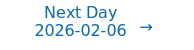

# Personalized Daily ArXiv Papers 2026-02-05

| *[gpt-5]*   | Prompt   | Completion   | Total   |
|:-----------:|:--------:|:------------:|:-------:|
| **Token**   | 53923    | 46726        | 100649  |
| **Cost**    | $0.07    | $0.47        | $0.53   |

Total arXiv papers: 705

Total scanned papers: 391

Total relevant papers: 37

**Table of contents with paper titles:**

1. [Synthesizable Molecular Generation via Soft-constrained GFlowNets with Rich Chemical Priors](#user-content-link1)
**Authors:** Hyeonah Kim, Minsu Kim, Celine Roget, Dionessa Biton, Louis Vaillancourt, Yves V. Brun, Yoshua Bengio, Alex Hernandez-Garcia

2. [GeoIB: Geometry-Aware Information Bottleneck via Statistical-Manifold Compression](#user-content-link2)
**Authors:** Weiqi Wang, Zhiyi Tian, Chenhan Zhang, Shui Yu

3. [BPDQ: Bit-Plane Decomposition Quantization on a Variable Grid for Large Language Models](#user-content-link3)
**Authors:** Junyu Chen, Jungang Li, Jing Xiong, Wenjie Wang, Qingyao Yang, He Xiao, Zhen Li, Taiqiang Wu, Mengzhao Chen, Zhen Peng, Chaofan Tao, Long Shi, Hongxia Yang, Ngai Wong

4. [LoRDO: Distributed Low-Rank Optimization with Infrequent Communication](#user-content-link4)
**Authors:** Andrej Jovanovi\'c, Alex Iacob, Mher Safaryan, Ionut-Vlad Modoranu, Lorenzo Sani, William F. Shen, Xinchi Qiu, Dan Alistarh, Nicholas D. Lane

5. [Disentangling Causal Importance from Emergent Structure in Multi-Expert Orchestration](#user-content-link5)
**Authors:** Sudipto Ghosh, Sujoy Nath, Sunny Manchanda, Tanmoy Chakraborty

6. [Online Vector Quantized Attention](#user-content-link6)
**Authors:** Nick Alonso, Tomas Figliolia, Beren Millidge

7. [From Dead Neurons to Deep Approximators: Deep Bernstein Networks as a Provable Alternative to Residual Layers](#user-content-link7)
**Authors:** Ibrahim Albool, Malak Gamal El-Din, Salma Elmalaki, Yasser Shoukry

8. [Multi-Head LatentMoE and Head Parallel: Communication-Efficient and Deterministic MoE Parallelism](#user-content-link8)
**Authors:** Chenwei Cui, Rockwell Jackson, Benjamin Joseph Herrera, Ana Mar\'ia T\'arano, Hannah Kerner

9. [Semantic Rate Distortion and Posterior Design: Compute Constraints, Multimodality, and Strategic Inference](#user-content-link9)
**Authors:** Emrah Akyol

10. [SpecMD: A Comprehensive Study On Speculative Expert Prefetching](#user-content-link10)
**Authors:** Duc Hoang, Ajay Jaiswal, Mohammad Samragh, Minsik Cho

11. [Understanding and Guiding Layer Placement in Parameter-Efficient Fine-Tuning of Large Language Models](#user-content-link11)
**Authors:** Yichen Xu, Yuyang Liang, Shan Dai, Tianyang Hu, Tsz Nam Chan, Chenhao Ma

12. [Rethinking Weight Tying: Pseudo-Inverse Tying for Stable LM Training and Updates](#user-content-link12)
**Authors:** Jian Gu, Aldeida Aleti, Chunyang Chen, Hongyu Zhang

13. [Proxy Compression for Language Modeling](#user-content-link13)
**Authors:** Lin Zheng, Xinyu Li, Qian Liu, Xiachong Feng, Lingpeng Kong

14. [SparVAR: Exploring Sparsity in Visual AutoRegressive Modeling for Training-Free Acceleration](#user-content-link14)
**Authors:** Zekun Li, Ning Wang, Tongxin Bai, Changwang Mei, Peisong Wang, Shuang Qiu, Jian Cheng

15. [Provable Target Sample Complexity Improvements as Pre-Trained Models Scale](#user-content-link15)
**Authors:** Kazuto Fukuchi, Ryuichiro Hataya, Kota Matsui

16. [The Key to State Reduction in Linear Attention: A Rank-based Perspective](#user-content-link16)
**Authors:** Philipp Nazari, T. Konstantin Rusch

17. [LycheeDecode: Accelerating Long-Context LLM Inference via Hybrid-Head Sparse Decoding](#user-content-link17)
**Authors:** Gang Lin, Dongfang Li, Zhuoen Chen, Yukun Shi, Xuhui Chen, Baotian Hu, Min Zhang

18. [Multi-layer Cross-Attention is Provably Optimal for Multi-modal In-context Learning](#user-content-link18)
**Authors:** Nicholas Barnfield, Subhabrata Sen, Pragya Sur

19. [Decomposing Query-Key Feature Interactions Using Contrastive Covariances](#user-content-link19)
**Authors:** Andrew Lee, Yonatan Belinkov, Fernanda Vi\'egas, Martin Wattenberg

20. [Billion-Scale Graph Foundation Models](#user-content-link20)
**Authors:** Maya Bechler-Speicher, Yoel Gottlieb, Andrey Isakov, David Abensur, Ami Tavory, Daniel Haimovich, Ido Guy, Udi Weinsberg

21. [Gradient Flow Through Diagram Expansions: Learning Regimes and Explicit Solutions](#user-content-link21)
**Authors:** Dmitry Yarotsky, Eugene Golikov, Yaroslav Gusev

22. [RASA: Routing-Aware Safety Alignment for Mixture-of-Experts Models](#user-content-link22)
**Authors:** Jiacheng Liang, Yuhui Wang, Tanqiu Jiang, Ting Wang

23. [Rational ANOVA Networks](#user-content-link23)
**Authors:** Jusheng Zhang, Ningyuan Liu, Qinhan Lyu, Jing Yang, Keze Wang

24. [Greedy-Gnorm: A Gradient Matrix Norm-Based Alternative to Attention Entropy for Head Pruning](#user-content-link24)
**Authors:** Yuxi Guo, Paul Sheridan

25. [LORE: Jointly Learning the Intrinsic Dimensionality and Relative Similarity Structure From Ordinal Data](#user-content-link25)
**Authors:** Vivek Anand, Alec Helbling, Mark Davenport, Gordon Berman, Sankar Alagapan, Christopher Rozell

26. [Topology-Aware Revival for Efficient Sparse Training](#user-content-link26)
**Authors:** Meiling Jin, Fei Wang, Xiaoyun Yuan, Chen Qian, Yuan Cheng

27. [Theory of Optimal Learning Rate Schedules and Scaling Laws for a Random Feature Model](#user-content-link27)
**Authors:** Blake Bordelon, Francesco Mori

28. [Learning to Reason in 13 Parameters](#user-content-link28)
**Authors:** John X. Morris, Niloofar Mireshghallah, Mark Ibrahim, Saeed Mahloujifar

29. [Supervised Learning as Lossy Compression: Characterizing Generalization and Sample Complexity via Finite Blocklength Analysis](#user-content-link29)
**Authors:** Kosuke Sugiyama, Masato Uchida

30. [Subliminal Effects in Your Data: A General Mechanism via Log-Linearity](#user-content-link30)
**Authors:** Ishaq Aden-Ali, Noah Golowich, Allen Liu, Abhishek Shetty, Ankur Moitra, Nika Haghtalab

31. [Continual Learning through Control Minimization](#user-content-link31)
**Authors:** Sander de Haan, Yassine Taoudi-Benchekroun, Pau Vilimelis Aceituno, Benjamin F. Grewe

32. [Towards Understanding and Avoiding Limitations of Convolutions on Graphs](#user-content-link32)
**Authors:** Andreas Roth

33. [Fluid Representations in Reasoning Models](#user-content-link33)
**Authors:** Dmitrii Kharlapenko, Alessandro Stolfo, Arthur Conmy, Mrinmaya Sachan, Zhijing Jin

34. [SEIS: Subspace-based Equivariance and Invariance Scores for Neural Representations](#user-content-link34)
**Authors:** Huahua Lin, Katayoun Farrahi, Xiaohao Cai

35. [Finding Structure in Continual Learning](#user-content-link35)
**Authors:** Pourya Shamsolmoali, Masoumeh Zareapoor

36. [MirrorLA: Reflecting Feature Map for Vision Linear Attention](#user-content-link36)
**Authors:** Weikang Meng, Liangyu Huo, Yadan Luo, Yaowei Wang, Yingjian Li, Zheng Zhang

37. [A Hitchhiker's Guide to Poisson Gradient Estimation](#user-content-link37)
**Authors:** Michael Ibrahim, Hanqi Zhao, Eli Sennesh, Zhi Li, Anqi Wu, Jacob L. Yates, Chengrui Li, Hadi Vafaii

---

## 1. [Synthesizable Molecular Generation via Soft-constrained GFlowNets with Rich Chemical Priors](https://arxiv.org/abs/2602.04119) 

**ArXiv ID:** 2602.04119

**Authors:** Hyeonah Kim, Minsu Kim, Celine Roget, Dionessa Biton, Louis Vaillancourt, Yves V. Brun, Yoshua Bengio, Alex Hernandez-Garcia

**Abstract:** The application of generative models for experimental drug discovery campaigns is severely limited by the difficulty of designing molecules de novo that can be synthesized in practice. Previous works have leveraged Generative Flow Networks (GFlowNets) to impose hard synthesizability constraints through the design of state and action spaces based on predefined reaction templates and building blocks. Despite the promising prospects of this approach, it currently lacks flexibility and scalability. As an alternative, we propose S3-GFN, which generates synthesizable SMILES molecules via simple soft regularization of a sequence-based GFlowNet. Our approach leverages rich molecular priors learned from large-scale SMILES corpora to steer molecular generation towards high-reward, synthesizable chemical spaces. The model induces constraints through off-policy replay training with a contrastive learning signal based on separate buffers of synthesizable and unsynthesizable samples. Our experiments show that S3-GFN learns to generate synthesizable molecules ($\geq 95\%$) with higher rewards in diverse tasks.

**Comment:** Author match

---

## 2. [GeoIB: Geometry-Aware Information Bottleneck via Statistical-Manifold Compression](https://arxiv.org/abs/2602.03906) 

**ArXiv ID:** 2602.03906

**Authors:** Weiqi Wang, Zhiyi Tian, Chenhan Zhang, Shui Yu

**Abstract:** Information Bottleneck (IB) is widely used, but in deep learning, it is usually implemented through tractable surrogates, such as variational bounds or neural mutual information (MI) estimators, rather than directly controlling the MI I(X;Z) itself. The looseness and estimator-dependent bias can make IB "compression" only indirectly controlled and optimization fragile.   We revisit the IB problem through the lens of information geometry and propose a \textbf{Geo}metric \textbf{I}nformation \textbf{B}ottleneck (\textbf{GeoIB}) that dispenses with mutual information (MI) estimation. We show that I(X;Z) and I(Z;Y) admit exact projection forms as minimal Kullback-Leibler (KL) distances from the joint distributions to their respective independence manifolds. Guided by this view, GeoIB controls information compression with two complementary terms: (i) a distribution-level Fisher-Rao (FR) discrepancy, which matches KL to second order and is reparameterization-invariant; and (ii) a geometry-level Jacobian-Frobenius (JF) term that provides a local capacity-type upper bound on I(Z;X) by penalizing pullback volume expansion of the encoder. We further derive a natural-gradient optimizer consistent with the FR metric and prove that the standard additive natural-gradient step is first-order equivalent to the geodesic update. We conducted extensive experiments and observed that the GeoIB achieves a better trade-off between prediction accuracy and compression ratio in the information plane than the mainstream IB baselines on popular datasets. GeoIB improves invariance and optimization stability by unifying distributional and geometric regularization under a single bottleneck multiplier. The source code of GeoIB is released at "https://anonymous.4open.science/r/G-IB-0569".

**Comment:** Representation Learning/Compression — Geometry-aware Information Bottleneck replacing MI estimation with Fisher–Rao and Jacobian-based controls plus natural-gradient updates.

**Relevance:** 10
**Novelty:** 9

---

## 3. [BPDQ: Bit-Plane Decomposition Quantization on a Variable Grid for Large Language Models](https://arxiv.org/abs/2602.04163) 

**ArXiv ID:** 2602.04163

**Authors:** Junyu Chen, Jungang Li, Jing Xiong, Wenjie Wang, Qingyao Yang, He Xiao, Zhen Li, Taiqiang Wu, Mengzhao Chen, Zhen Peng, Chaofan Tao, Long Shi, Hongxia Yang, Ngai Wong

**Abstract:** Large language model (LLM) inference is often bounded by memory footprint and memory bandwidth in resource-constrained deployments, making quantization a fundamental technique for efficient serving. While post-training quantization (PTQ) maintains high fidelity at 4-bit, it deteriorates at 2-3 bits. Fundamentally, existing methods enforce a shape-invariant quantization grid (e.g., the fixed uniform intervals of UINT2) for each group, severely restricting the feasible set for error minimization. To address this, we propose Bit-Plane Decomposition Quantization (BPDQ), which constructs a variable quantization grid via bit-planes and scalar coefficients, and iteratively refines them using approximate second-order information while progressively compensating quantization errors to minimize output discrepancy. In the 2-bit regime, BPDQ enables serving Qwen2.5-72B on a single RTX 3090 with 83.85% GSM8K accuracy (vs. 90.83% at 16-bit). Moreover, we provide theoretical analysis showing that the variable grid expands the feasible set, and that the quantization process consistently aligns with the optimization objective in Hessian-induced geometry. Code: github.com/KingdalfGoodman/BPDQ.

**Comment:** Model Compression and Efficiency: 2-bit LLM quantization via variable bit-plane grids with second-order refinement and theory.

**Relevance:** 10
**Novelty:** 9

---

## 4. [LoRDO: Distributed Low-Rank Optimization with Infrequent Communication](https://arxiv.org/abs/2602.04396) 

**ArXiv ID:** 2602.04396

**Authors:** Andrej Jovanovi\'c, Alex Iacob, Mher Safaryan, Ionut-Vlad Modoranu, Lorenzo Sani, William F. Shen, Xinchi Qiu, Dan Alistarh, Nicholas D. Lane

**Abstract:** Distributed training of foundation models via $\texttt{DDP}$ is limited by interconnect bandwidth. While infrequent communication strategies reduce synchronization frequency, they remain bottlenecked by the memory and communication requirements of optimizer states. Low-rank optimizers can alleviate these constraints; however, in the local-update regime, workers lack access to the full-batch gradients required to compute low-rank projections, which degrades performance. We propose $\texttt{LoRDO}$, a principled framework unifying low-rank optimization with infrequent synchronization. We first demonstrate that, while global projections based on pseudo-gradients are theoretically superior, they permanently restrict the optimization trajectory to a low-rank subspace. To restore subspace exploration, we introduce a full-rank quasi-hyperbolic update. $\texttt{LoRDO}$ achieves near-parity with low-rank $\texttt{DDP}$ in language modeling and downstream tasks at model scales of $125$M--$720$M, while reducing communication by $\approx 10 \times$. Finally, we show that $\texttt{LoRDO}$ improves performance even more in very low-memory settings with small rank/batch size.

**Comment:** High Performance Computing — unifies low-rank optimization with infrequent synchronization for distributed training, reducing optimizer-state communication and restoring subspace exploration.

**Relevance:** 10
**Novelty:** 8

---

## 5. [Disentangling Causal Importance from Emergent Structure in Multi-Expert Orchestration](https://arxiv.org/abs/2602.04291) 

**ArXiv ID:** 2602.04291

**Authors:** Sudipto Ghosh, Sujoy Nath, Sunny Manchanda, Tanmoy Chakraborty

**Abstract:** Multi-expert systems, where multiple Large Language Models (LLMs) collaborate to solve complex tasks, are increasingly adopted for high-performance reasoning and generation. However, the orchestration policies governing expert interaction and sequencing remain largely opaque. We introduce INFORM, an interpretability analysis that treats orchestration as an explicit, analyzable computation, enabling the decoupling of expert interaction structure, execution order, and causal attribution. We use INFORM to evaluate an orchestrator on GSM8K, HumanEval, and MMLU using a homogeneous consortium of ten instruction-tuned experts drawn from LLaMA-3.1 8B, Qwen-3 8B, and DeepSeek-R1 8B, with controlled decoding-temperature variation, and a secondary heterogeneous consortium spanning 1B-7B parameter models. Across tasks, routing dominance is a poor proxy for functional necessity. We reveal a divergence between relational importance, captured by routing mass and interaction topology, and intrinsic importance, measured via gradient-based causal attribution: frequently selected experts often act as interaction hubs with limited causal influence, while sparsely routed experts can be structurally critical. Orchestration behaviors emerge asynchronously, with expert centralization preceding stable routing confidence and expert ordering remaining non-deterministic. Targeted ablations show that masking intrinsically important experts induces disproportionate collapse in interaction structure compared to masking frequent peers, confirming that INFORM exposes causal and structural dependencies beyond accuracy metrics alone.

**Comment:** Model Architecture: analysis of multi-expert (MoE) orchestration and routing with causal attribution disentanglement.

**Relevance:** 10
**Novelty:** 8

---

## 6. [Online Vector Quantized Attention](https://arxiv.org/abs/2602.03922) 

**ArXiv ID:** 2602.03922

**Authors:** Nick Alonso, Tomas Figliolia, Beren Millidge

**Abstract:** Standard sequence mixing layers used in language models struggle to balance efficiency and performance. Self-attention performs well on long context tasks but has expensive quadratic compute and linear memory costs, while linear attention and SSMs use only linear compute and constant memory but struggle with long context processing. In this paper, we develop a sequence mixing layer that aims to find a better compromise between memory-compute costs and long-context processing, which we call online vector-quantized (OVQ) attention. OVQ-attention requires linear compute costs and constant memory, but, unlike linear attention and SSMs, it uses a sparse memory update that allows it to greatly increase the size of its memory state and, consequently, memory capacity. We develop a theoretical basis for OVQ-attention based on Gaussian mixture regression, and we test it on a variety of synthetic long context tasks and on long context language modeling. OVQ-attention shows significant improvements over linear attention baselines and the original VQ-attention, on which OVQ-attention was inspired. It demonstrates competitive, and sometimes identical, performance to strong self-attention baselines up 64k sequence length, despite using a small fraction of the memory of full self-attention.

**Comment:** Model Architecture + Efficiency: online vector-quantized attention with linear compute/constant memory and sparse memory updates for long-context tasks.

**Relevance:** 10
**Novelty:** 8

---

## 7. [From Dead Neurons to Deep Approximators: Deep Bernstein Networks as a Provable Alternative to Residual Layers](https://arxiv.org/abs/2602.04264) 

**ArXiv ID:** 2602.04264

**Authors:** Ibrahim Albool, Malak Gamal El-Din, Salma Elmalaki, Yasser Shoukry

**Abstract:** Residual connections are the de facto standard for mitigating vanishing gradients, yet they impose structural constraints and fail to address the inherent inefficiencies of piecewise linear activations. We show that Deep Bernstein Networks (which utilizes Bernstein polynomials as activation functions) can act as residual-free architecture while simultaneously optimize trainability and representation power. We provide a two-fold theoretical foundation for our approach. First, we derive a theoretical lower bound on the local derivative, proving it remains strictly bounded away from zero. This directly addresses the root cause of gradient stagnation; empirically, our architecture reduces ``dead'' neurons from 90\% in standard deep networks to less than 5\%, outperforming ReLU, Leaky ReLU, SeLU, and GeLU. Second, we establish that the approximation error for Bernstein-based networks decays exponentially with depth, a significant improvement over the polynomial rates of ReLU-based architectures. By unifying these results, we demonstrate that Bernstein activations provide a superior mechanism for function approximation and signal flow. Our experiments on HIGGS and MNIST confirm that Deep Bernstein Networks achieve high-performance training without skip-connections, offering a principled path toward deep, residual-free architectures with enhanced expressive capacity.

**Comment:** Model architecture: Bernstein activation-based deep networks as residual-free alternatives with provable trainability and exponential approximation rates.

**Relevance:** 10
**Novelty:** 8

---

## 8. [Multi-Head LatentMoE and Head Parallel: Communication-Efficient and Deterministic MoE Parallelism](https://arxiv.org/abs/2602.04870) 

**ArXiv ID:** 2602.04870

**Authors:** Chenwei Cui, Rockwell Jackson, Benjamin Joseph Herrera, Ana Mar\'ia T\'arano, Hannah Kerner

**Abstract:** Large language models have transformed many applications but remain expensive to train. Sparse Mixture of Experts (MoE) addresses this through conditional computation, with Expert Parallel (EP) as the standard distributed training method. However, EP has three limitations: communication cost grows linearly with the number of activated experts $k$, load imbalance affects latency and memory usage, and data-dependent communication requires metadata exchange. We propose Multi-Head LatentMoE and Head Parallel (HP), a new architecture and parallelism achieving $O(1)$ communication cost regardless of $k$, completely balanced traffic, and deterministic communication, all while remaining compatible with EP. To accelerate Multi-Head LatentMoE, we propose IO-aware routing and expert computation. Compared to MoE with EP, Multi-Head LatentMoE with HP trains up to $1.61\times$ faster while having identical performance. With doubled granularity, it achieves higher overall performance while still being $1.11\times$ faster. Our method makes multi-billion-parameter foundation model research more accessible.

**Comment:** Direct hit on Model Architecture (Mixture-of-Experts) and High Performance Computing: proposes a new MoE variant with deterministic O(1) communication Head Parallelism for distributed training.

**Relevance:** 10
**Novelty:** 8

---

## 9. [Semantic Rate Distortion and Posterior Design: Compute Constraints, Multimodality, and Strategic Inference](https://arxiv.org/abs/2602.03949) 

**ArXiv ID:** 2602.03949

**Authors:** Emrah Akyol

**Abstract:** We study strategic Gaussian semantic compression under rate and compute constraints, where an encoder and decoder optimize distinct quadratic objectives. A latent Gaussian state generates a task dependent semantic variable, and the decoder best responds via MMSE estimation, reducing the encoder's problem to posterior covariance design under an information rate constraint. We characterize the strategic rate distortion function in direct, remote, and full information regimes, derive semantic waterfilling and rate constrained Gaussian persuasion solutions, and establish Gaussian optimality under misaligned objectives. We further show that architectural compute limits act as implicit rate constraints, yielding exponential improvements in semantic accuracy with model depth and inference time compute, while multimodal observation eliminates the geometric mean penalty inherent to remote encoding. These results provide information theoretic foundations for data and energy efficient AI and offer a principled interpretation of modern multimodal language models as posterior design mechanisms under resource constraints.

**Comment:** Compression/Efficiency Theory: strategic semantic compression and posterior design under rate and compute constraints with formal characterizations.

**Relevance:** 9
**Novelty:** 9

---

## 10. [SpecMD: A Comprehensive Study On Speculative Expert Prefetching](https://arxiv.org/abs/2602.03921) 

**ArXiv ID:** 2602.03921

**Authors:** Duc Hoang, Ajay Jaiswal, Mohammad Samragh, Minsik Cho

**Abstract:** Mixture-of-Experts (MoE) models enable sparse expert activation, meaning that only a subset of the model's parameters is used during each inference. However, to translate this sparsity into practical performance, an expert caching mechanism is required. Previous works have proposed hardware-centric caching policies, but how these various caching policies interact with each other and different hardware specification remains poorly understood. To address this gap, we develop \textbf{SpecMD}, a standardized framework for benchmarking ad-hoc cache policies on various hardware configurations. Using SpecMD, we perform an exhaustive benchmarking of several MoE caching strategies, reproducing and extending prior approaches in controlled settings with realistic constraints. Our experiments reveal that MoE expert access is not consistent with temporal locality assumptions (e.g LRU, LFU). Motivated by this observation, we propose \textbf{Least-Stale}, a novel eviction policy that exploits MoE's predictable expert access patterns to reduce collision misses by up to $85\times$ over LRU. With such gains, we achieve over $88\%$ hit rates with up to $34.7\%$ Time-to-first-token (TTFT) reduction on OLMoE at only $5\%$ or $0.6GB$ of VRAM cache capacity.

**Comment:** MoE Efficiency/HPC: standardized expert-caching benchmark and a novel Least-Stale eviction policy tailored to MoE access patterns.

**Relevance:** 10
**Novelty:** 7

---

## 11. [Understanding and Guiding Layer Placement in Parameter-Efficient Fine-Tuning of Large Language Models](https://arxiv.org/abs/2602.04019) 

**ArXiv ID:** 2602.04019

**Authors:** Yichen Xu, Yuyang Liang, Shan Dai, Tianyang Hu, Tsz Nam Chan, Chenhao Ma

**Abstract:** As large language models (LLMs) continue to grow, the cost of full-parameter fine-tuning has made parameter-efficient fine-tuning (PEFT) the default strategy for downstream adaptation. Constraints from inference latency in scalable serving and fine-tuning cost in edge or rapid-deployment settings make the choice of which layers to fine-tune unavoidable. Yet current practice typically applies PEFT uniformly across all layers, with limited understanding or leverage of layer selection. This paper develops a unified projected residual view of PEFT on top of a frozen base model. Under a local quadratic approximation, layerwise adaptation is governed by three quantities: (i) the projected residual norm (resnorm), which measures how much correctable bias a layer can capture; (ii) the activation energy, which determines feature conditioning; and (iii) layer coupling, which quantifies how strongly residuals interact across layers. We show that, for squared loss and linear adapters, the resnorm equals a normalized gradient norm, activation energy controls ill-conditioning and noise amplification, and weak coupling yields approximately additive layerwise contributions. Building on these insights, we introduce the Layer Card, a reusable diagnostic that summarizes residual signal strength, compute cost, and performance for each layer of a given model. With an identical model and LoRA configuration, Layer Card-guided placement refines the choice of adapted layers to flexibly prioritize different objectives, such as maximizing performance or reducing fine-tuning cost. Moreover, on Qwen3-8B, we show that selectively adapting a subset of layers can achieve performance close to full-layer LoRA while substantially reducing fine-tuning cost and the number of adapter-augmented layers during inference, offering a more cost-performance-aware alternative to full-layer insertion.

**Comment:** Model Compression/Efficiency — principled layer selection for PEFT via projected residual view; introduces Layer Card to optimize LoRA placement under compute/performance trade-offs.

**Relevance:** 9
**Novelty:** 8

---

## 12. [Rethinking Weight Tying: Pseudo-Inverse Tying for Stable LM Training and Updates](https://arxiv.org/abs/2602.04556) 

**ArXiv ID:** 2602.04556

**Authors:** Jian Gu, Aldeida Aleti, Chunyang Chen, Hongyu Zhang

**Abstract:** Weight tying is widely used in compact language models to reduce parameters by sharing the token table between the input embedding and the output projection. However, weight sharing does not guarantee a stable token interface: during training, the correspondence between encoding tokens into hidden states and decoding hidden states into logits can drift, worsening optimization sensitivity and making post-training interventions such as editing, patching, and lightweight adaptation less predictable. We propose Pseudo-Inverse Tying (PIT), which synchronizes embedding and unembedding as coupled projections of a shared latent token memory, guaranteeing a pseudo-inverse-consistent interface throughout training. PIT maintains an orthonormal shared memory, obtained by thin polar decomposition for teacher initialization or random orthonormal initialization from scratch, and introduces a fully learned symmetric positive definite hidden-space transform parameterized via a Cholesky factor. The output head applies this transform to hidden states before the vocabulary projection, while the embedding applies the inverse transform to token vectors using stable triangular solves, avoiding explicit pseudo-inverse recomputation and any vocabulary-sized auxiliary parameters. We evaluate PIT on on-device models spanning 256M-1.3B parameters across pretraining and adaptation, and consistently observe improved training stability, stronger layerwise semantic consistency, and substantially reduced side effects.

**Comment:** Model Architecture: pseudo-inverse-consistent tying of embedding/unembedding for stable LM training and interventions.

**Relevance:** 9
**Novelty:** 8

---

## 13. [Proxy Compression for Language Modeling](https://arxiv.org/abs/2602.04289) 

**ArXiv ID:** 2602.04289

**Authors:** Lin Zheng, Xinyu Li, Qian Liu, Xiachong Feng, Lingpeng Kong

**Abstract:** Modern language models are trained almost exclusively on token sequences produced by a fixed tokenizer, an external lossless compressor often over UTF-8 byte sequences, thereby coupling the model to that compressor. This work introduces proxy compression, an alternative training scheme that preserves the efficiency benefits of compressed inputs while providing an end-to-end, raw-byte interface at inference time. During training, one language model is jointly trained on raw byte sequences and compressed views generated by external compressors; through the process, the model learns to internally align compressed sequences and raw bytes. This alignment enables strong transfer between the two formats, even when training predominantly on compressed inputs which are discarded at inference. Extensive experiments on code language modeling demonstrate that proxy compression substantially improves training efficiency and significantly outperforms pure byte-level baselines given fixed compute budgets. As model scale increases, these gains become more pronounced, and proxy-trained models eventually match or rival tokenizer approaches, all while operating solely on raw bytes and retaining the inherent robustness of byte-level modeling.

**Comment:** Model Compression and Efficiency: proxy compression scheme aligning compressed inputs with raw bytes for compute-efficient LM training.

**Relevance:** 9
**Novelty:** 8

---

## 14. [SparVAR: Exploring Sparsity in Visual AutoRegressive Modeling for Training-Free Acceleration](https://arxiv.org/abs/2602.04361) 

**ArXiv ID:** 2602.04361

**Authors:** Zekun Li, Ning Wang, Tongxin Bai, Changwang Mei, Peisong Wang, Shuang Qiu, Jian Cheng

**Abstract:** Visual AutoRegressive (VAR) modeling has garnered significant attention for its innovative next-scale prediction paradigm. However, mainstream VAR paradigms attend to all tokens across historical scales at each autoregressive step. As the next scale resolution grows, the computational complexity of attention increases quartically with resolution, causing substantial latency. Prior accelerations often skip high-resolution scales, which speeds up inference but discards high-frequency details and harms image quality. To address these problems, we present SparVAR, a training-free acceleration framework that exploits three properties of VAR attention: (i) strong attention sinks, (ii) cross-scale activation similarity, and (iii) pronounced locality. Specifically, we dynamically predict the sparse attention pattern of later high-resolution scales from a sparse decision scale, and construct scale self-similar sparse attention via an efficient index-mapping mechanism, enabling high-efficiency sparse attention computation at large scales. Furthermore, we propose cross-scale local sparse attention and implement an efficient block-wise sparse kernel, which achieves $\mathbf{> 5\times}$ faster forward speed than FlashAttention. Extensive experiments demonstrate that the proposed SparseVAR can reduce the generation time of an 8B model producing $1024\times1024$ high-resolution images to the 1s, without skipping the last scales. Compared with the VAR baseline accelerated by FlashAttention, our method achieves a $\mathbf{1.57\times}$ speed-up while preserving almost all high-frequency details. When combined with existing scale-skipping strategies, SparseVAR attains up to a $\mathbf{2.28\times}$ acceleration, while maintaining competitive visual generation quality. Code is available at https://github.com/CAS-CLab/SparVAR.

**Comment:** Compression/Efficiency: training-free sparse attention patterns and efficient sparse kernels for accelerating VAR generation.

**Relevance:** 9
**Novelty:** 8

---

## 15. [Provable Target Sample Complexity Improvements as Pre-Trained Models Scale](https://arxiv.org/abs/2602.04233) 

**ArXiv ID:** 2602.04233

**Authors:** Kazuto Fukuchi, Ryuichiro Hataya, Kota Matsui

**Abstract:** Pre-trained models have become indispensable for efficiently building models across a broad spectrum of downstream tasks. The advantages of pre-trained models have been highlighted by empirical studies on scaling laws, which demonstrate that larger pre-trained models can significantly reduce the sample complexity of downstream learning. However, existing theoretical investigations of pre-trained models lack the capability to explain this phenomenon. In this paper, we provide a theoretical investigation by introducing a novel framework, caulking, inspired by parameter-efficient fine-tuning (PEFT) methods such as adapter-based fine-tuning, low-rank adaptation, and partial fine-tuning. Our analysis establishes that improved pre-trained models provably decrease the sample complexity of downstream tasks, thereby offering theoretical justification for the empirically observed scaling laws relating pre-trained model size to downstream performance, a relationship not covered by existing results.

**Comment:** Representation Learning/Theory: PEFT-inspired caulking framework proving reduced downstream sample complexity as pre-trained models scale.

**Relevance:** 9
**Novelty:** 8

---

## 16. [The Key to State Reduction in Linear Attention: A Rank-based Perspective](https://arxiv.org/abs/2602.04852) 

**ArXiv ID:** 2602.04852

**Authors:** Philipp Nazari, T. Konstantin Rusch

**Abstract:** Linear attention offers a computationally efficient yet expressive alternative to softmax attention. However, recent empirical results indicate that the state of trained linear attention models often exhibits a low-rank structure, suggesting that these models underexploit their capacity in practice. To illuminate this phenomenon, we provide a theoretical analysis of the role of rank in linear attention, revealing that low effective rank can affect retrieval error by amplifying query noise. In addition to these theoretical insights, we conjecture that the low-rank states can be substantially reduced post-training with only minimal performance degradation, yielding faster and more memory-efficient models. To this end, we propose a novel hardware-aware approach that structurally prunes key and query matrices, reducing the state size while retaining compatibility with existing CUDA kernels. We adapt several existing pruning strategies to fit our framework and, building on our theoretical analysis, propose a novel structured pruning method based on a rank-revealing QR decomposition. Our empirical results, evaluated across models of varying sizes and on various downstream tasks, demonstrate the effectiveness of our state reduction framework. We highlight that our framework enables the removal of 50% of the query and key channels at only a marginal increase in perplexity. The code for this project can be found at https://github.com/camail-official/LinearAttentionPruning.

**Comment:** Compression/Efficiency: rank-based analysis of linear attention with structured pruning of Q/K states (hardware-aware, CUDA-compatible) for memory/speed gains.

**Relevance:** 9
**Novelty:** 8

---

## 17. [LycheeDecode: Accelerating Long-Context LLM Inference via Hybrid-Head Sparse Decoding](https://arxiv.org/abs/2602.04541) 

**ArXiv ID:** 2602.04541

**Authors:** Gang Lin, Dongfang Li, Zhuoen Chen, Yukun Shi, Xuhui Chen, Baotian Hu, Min Zhang

**Abstract:** The proliferation of long-context large language models (LLMs) exposes a key bottleneck: the rapidly expanding key-value cache during decoding, which imposes heavy memory and latency costs. While recent approaches attempt to alleviate this by sharing a single set of crucial tokens across layers, such coarse-grained sharing undermines model performance by neglecting the functional diversity of attention heads. To address this, we propose LycheeDecode, an efficient decoding method centered on a fine-grained hybrid-head attention mechanism that employs a hardware-efficient top-k selection strategy. Specifically, the novel HardKuma-based mechanism partitions attention heads into a small subset of retrieval heads that dynamically identify crucial tokens and a majority of sparse heads that reuse them for efficient computation. Through extensive experiments on leading models like Llama3 and Qwen3 across diverse benchmarks for long-context understanding (e.g., LongBench, RULER) and complex reasoning (e.g., AIME24, OlympiadBench), we demonstrate that LycheeDecode achieves generative quality comparable to, and at times surpassing even the full-attention baseline. Crucially, this is accomplished with up to a 2.7x speedup at a 128K context length. By preserving the functional diversity of attention heads, our fine-grained strategy overcomes the performance bottlenecks of existing methods, providing a powerful and validated pathway to both efficient and high-quality long-context LLM inference.

**Comment:** High-Performance Inference: hybrid-head sparse decoding with head-level token reuse to reduce KV-cache costs and accelerate long-context LLMs.

**Relevance:** 9
**Novelty:** 8

---

## 18. [Multi-layer Cross-Attention is Provably Optimal for Multi-modal In-context Learning](https://arxiv.org/abs/2602.04872) 

**ArXiv ID:** 2602.04872

**Authors:** Nicholas Barnfield, Subhabrata Sen, Pragya Sur

**Abstract:** Recent progress has rapidly advanced our understanding of the mechanisms underlying in-context learning in modern attention-based neural networks. However, existing results focus exclusively on unimodal data; in contrast, the theoretical underpinnings of in-context learning for multi-modal data remain poorly understood. We introduce a mathematically tractable framework for studying multi-modal learning and explore when transformer-like architectures can recover Bayes-optimal performance in-context. To model multi-modal problems, we assume the observed data arises from a latent factor model. Our first result comprises a negative take on expressibility: we prove that single-layer, linear self-attention fails to recover the Bayes-optimal predictor uniformly over the task distribution. To address this limitation, we introduce a novel, linearized cross-attention mechanism, which we study in the regime where both the number of cross-attention layers and the context length are large. We show that this cross-attention mechanism is provably Bayes optimal when optimized using gradient flow. Our results underscore the benefits of depth for in-context learning and establish the provable utility of cross-attention for multi-modal distributions.

**Comment:** Model Architecture/Theory: proves multi-layer cross-attention achieves Bayes-optimal multi-modal in-context learning; depth benefits established.

**Relevance:** 9
**Novelty:** 8

---

## 19. [Decomposing Query-Key Feature Interactions Using Contrastive Covariances](https://arxiv.org/abs/2602.04752) 

**ArXiv ID:** 2602.04752

**Authors:** Andrew Lee, Yonatan Belinkov, Fernanda Vi\'egas, Martin Wattenberg

**Abstract:** Despite the central role of attention heads in Transformers, we lack tools to understand why a model attends to a particular token. To address this, we study the query-key (QK) space -- the bilinear joint embedding space between queries and keys. We present a contrastive covariance method to decompose the QK space into low-rank, human-interpretable components. It is when features in keys and queries align in these low-rank subspaces that high attention scores are produced. We first study our method both analytically and empirically in a simplified setting. We then apply our method to large language models to identify human-interpretable QK subspaces for categorical semantic features and binding features. Finally, we demonstrate how attention scores can be attributed to our identified features.

**Comment:** Representation learning/interpretability: low-rank decomposition of the query–key space via contrastive covariances to attribute attention mechanisms.

**Relevance:** 9
**Novelty:** 8

---

## 20. [Billion-Scale Graph Foundation Models](https://arxiv.org/abs/2602.04768) 

**ArXiv ID:** 2602.04768

**Authors:** Maya Bechler-Speicher, Yoel Gottlieb, Andrey Isakov, David Abensur, Ami Tavory, Daniel Haimovich, Ido Guy, Udi Weinsberg

**Abstract:** Graph-structured data underpins many critical applications. While foundation models have transformed language and vision via large-scale pretraining and lightweight adaptation, extending this paradigm to general, real-world graphs is challenging. In this work, we present Graph Billion- Foundation-Fusion (GraphBFF): the first end-to-end recipe for building billion-parameter Graph Foundation Models (GFMs) for arbitrary heterogeneous, billion-scale graphs. Central to the recipe is the GraphBFF Transformer, a flexible and scalable architecture designed for practical billion-scale GFMs. Using the GraphBFF, we present the first neural scaling laws for general graphs and show that loss decreases predictably as either model capacity or training data scales, depending on which factor is the bottleneck. The GraphBFF framework provides concrete methodologies for data batching, pretraining, and fine-tuning for building GFMs at scale. We demonstrate the effectiveness of the framework with an evaluation of a 1.4 billion-parameter GraphBFF Transformer pretrained on one billion samples. Across ten diverse, real-world downstream tasks on graphs unseen during training, spanning node- and link-level classification and regression, GraphBFF achieves remarkable zero-shot and probing performance, including in few-shot settings, with large margins of up to 31 PRAUC points. Finally, we discuss key challenges and open opportunities for making GFMs a practical and principled foundation for graph learning at industrial scale.

**Comment:** HPC and architecture: scalable GraphBFF Transformer for billion-scale graphs with data batching, pretraining/fine-tuning recipes, and scaling laws.

**Relevance:** 9
**Novelty:** 8

---

## 21. [Gradient Flow Through Diagram Expansions: Learning Regimes and Explicit Solutions](https://arxiv.org/abs/2602.04548) 

**ArXiv ID:** 2602.04548

**Authors:** Dmitry Yarotsky, Eugene Golikov, Yaroslav Gusev

**Abstract:** We develop a general mathematical framework to analyze scaling regimes and derive explicit analytic solutions for gradient flow (GF) in large learning problems. Our key innovation is a formal power series expansion of the loss evolution, with coefficients encoded by diagrams akin to Feynman diagrams. We show that this expansion has a well-defined large-size limit that can be used to reveal different learning phases and, in some cases, to obtain explicit solutions of the nonlinear GF. We focus on learning Canonical Polyadic (CP) decompositions of high-order tensors, and show that this model has several distinct extreme lazy and rich GF regimes such as free evolution, NTK and under- and over-parameterized mean-field. We show that these regimes depend on the parameter scaling, tensor order, and symmetry of the model in a specific and subtle way. Moreover, we propose a general approach to summing the formal loss expansion by reducing it to a PDE; in a wide range of scenarios, it turns out to be 1st order and solvable by the method of characteristics. We observe a very good agreement of our theoretical predictions with experiment.

**Comment:** Matches Representation Learning: theoretical analysis of training dynamics via gradient flow with explicit regimes/solutions, offering fundamental insights into learning behavior.

**Relevance:** 8
**Novelty:** 9

---

## 22. [RASA: Routing-Aware Safety Alignment for Mixture-of-Experts Models](https://arxiv.org/abs/2602.04448) 

**ArXiv ID:** 2602.04448

**Authors:** Jiacheng Liang, Yuhui Wang, Tanqiu Jiang, Ting Wang

**Abstract:** Mixture-of-Experts (MoE) language models introduce unique challenges for safety alignment due to their sparse routing mechanisms, which can enable degenerate optimization behaviors under standard full-parameter fine-tuning. In our preliminary experiments, we observe that naively applying full-parameter safety fine-tuning to MoE models can reduce attack success rates through routing or expert dominance effects, rather than by directly repairing Safety-Critical Experts. To address this challenge, we propose RASA, a routing-aware expert-level alignment framework that explicitly repairs Safety-Critical Experts while preventing routing-based bypasses. RASA identifies experts disproportionately activated by successful jailbreaks, selectively fine-tunes only these experts under fixed routing, and subsequently enforces routing consistency with safety-aligned contexts. Across two representative MoE architectures and a diverse set of jailbreak attacks, RASA achieves near-perfect robustness, strong cross-attack generalization, and substantially reduced over-refusal, while preserving general capabilities on benchmarks such as MMLU, GSM8K, and TruthfulQA. Our results suggest that robust MoE safety alignment benefits from targeted expert repair rather than global parameter updates, offering a practical and architecture-preserving alternative to prior approaches.

**Comment:** Model Architecture (MoE) — routing-aware, expert-level safety alignment that targets safety-critical experts and enforces routing consistency to prevent bypasses.

**Relevance:** 9
**Novelty:** 7

---

## 23. [Rational ANOVA Networks](https://arxiv.org/abs/2602.04006) 

**ArXiv ID:** 2602.04006

**Authors:** Jusheng Zhang, Ningyuan Liu, Qinhan Lyu, Jing Yang, Keze Wang

**Abstract:** Deep neural networks typically treat nonlinearities as fixed primitives (e.g., ReLU), limiting both interpretability and the granularity of control over the induced function class. While recent additive models (like KANs) attempt to address this using splines, they often suffer from computational inefficiency and boundary instability. We propose the Rational-ANOVA Network (RAN), a foundational architecture grounded in functional ANOVA decomposition and Pad\'e-style rational approximation. RAN models f(x) as a composition of main effects and sparse pairwise interactions, where each component is parameterized by a stable, learnable rational unit. Crucially, we enforce a strictly positive denominator, which avoids poles and numerical instability while capturing sharp transitions and near-singular behaviors more efficiently than polynomial bases. This ANOVA structure provides an explicit low-order interaction bias for data efficiency and interpretability, while the rational parameterization significantly improves extrapolation. Across controlled function benchmarks and vision classification tasks (e.g., CIFAR-10) under matched parameter and compute budgets, RAN matches or surpasses parameter-matched MLPs and learnable-activation baselines, with better stability and throughput. Code is available at https://github.com/jushengzhang/Rational-ANOVA-Networks.git.

**Comment:** Model Architecture — Rational-ANOVA Network with explicit low-order interactions and stable Padé-style rational units for learnable nonlinearities and extrapolation.

**Relevance:** 9
**Novelty:** 7

---

## 24. [Greedy-Gnorm: A Gradient Matrix Norm-Based Alternative to Attention Entropy for Head Pruning](https://arxiv.org/abs/2602.04491) 

**ArXiv ID:** 2602.04491

**Authors:** Yuxi Guo, Paul Sheridan

**Abstract:** Attention head pruning has emerged as an effective technique for transformer model compression, an increasingly important goal in the era of Green AI. However, existing pruning methods often rely on static importance scores, which fail to capture the evolving role of attention heads during iterative removal. We propose Greedy-Gradient norm (Greedy-Gnorm), a novel head pruning algorithm that dynamically recalculates head importance after each pruning step. Specifically, each head is scored by the elementwise product of the l2-norms of its Q/K/V gradient blocks, as estimated from a hold-out validation set and updated at every greedy iteration. This dynamic approach to scoring mitigates against stale rankings and better reflects gradient-informed importance as pruning progresses. Extensive experiments on BERT, ALBERT, RoBERTa, and XLM-RoBERTa demonstrate that Greedy-Gnorm consistently preserves accuracy under substantial head removal, outperforming attention entropy. By effectively reducing model size while maintaining task performance, Greedy-Gnorm offers a promising step toward more energy-efficient transformer model deployment.

**Comment:** Model Compression — dynamic attention-head pruning via gradient-matrix norm scoring with iterative re-evaluation, improving over entropy-based pruning.

**Relevance:** 9
**Novelty:** 7

---

## 25. [LORE: Jointly Learning the Intrinsic Dimensionality and Relative Similarity Structure From Ordinal Data](https://arxiv.org/abs/2602.04192) 

**ArXiv ID:** 2602.04192

**Authors:** Vivek Anand, Alec Helbling, Mark Davenport, Gordon Berman, Sankar Alagapan, Christopher Rozell

**Abstract:** Learning the intrinsic dimensionality of subjective perceptual spaces such as taste, smell, or aesthetics from ordinal data is a challenging problem. We introduce LORE (Low Rank Ordinal Embedding), a scalable framework that jointly learns both the intrinsic dimensionality and an ordinal embedding from noisy triplet comparisons of the form, "Is A more similar to B than C?". Unlike existing methods that require the embedding dimension to be set apriori, LORE regularizes the solution using the nonconvex Schatten-$p$ quasi norm, enabling automatic joint recovery of both the ordinal embedding and its dimensionality. We optimize this joint objective via an iteratively reweighted algorithm and establish convergence guarantees. Extensive experiments on synthetic datasets, simulated perceptual spaces, and real world crowdsourced ordinal judgements show that LORE learns compact, interpretable and highly accurate low dimensional embeddings that recover the latent geometry of subjective percepts. By simultaneously inferring both the intrinsic dimensionality and ordinal embeddings, LORE enables more interpretable and data efficient perceptual modeling in psychophysics and opens new directions for scalable discovery of low dimensional structure from ordinal data in machine learning.

**Comment:** Representation learning with low-rank structure: jointly learns intrinsic dimensionality and ordinal embedding via Schatten-p regularization and IRLS optimization with guarantees.

**Relevance:** 9
**Novelty:** 7

---

## 26. [Topology-Aware Revival for Efficient Sparse Training](https://arxiv.org/abs/2602.04166) 

**ArXiv ID:** 2602.04166

**Authors:** Meiling Jin, Fei Wang, Xiaoyun Yuan, Chen Qian, Yuan Cheng

**Abstract:** Static sparse training is a promising route to efficient learning by committing to a fixed mask pattern, yet the constrained structure reduces robustness. Early pruning decisions can lock the network into a brittle structure that is difficult to escape, especially in deep reinforcement learning (RL) where the evolving policy continually shifts the training distribution. We propose Topology-Aware Revival (TAR), a lightweight one-shot post-pruning procedure that improves static sparsity without dynamic rewiring. After static pruning, TAR performs a single revival step by allocating a small reserve budget across layers according to topology needs, randomly uniformly reactivating a few previously pruned connections within each layer, and then keeping the resulting connectivity fixed for the remainder of training. Across multiple continuous-control tasks with SAC and TD3, TAR improves final return over static sparse baselines by up to +37.9% and also outperforms dynamic sparse training baselines with a median gain of +13.5%.

**Comment:** Model compression/efficiency via sparsity: one-shot topology-aware revival improves static sparse training without dynamic rewiring.

**Relevance:** 9
**Novelty:** 7

---

## 27. [Theory of Optimal Learning Rate Schedules and Scaling Laws for a Random Feature Model](https://arxiv.org/abs/2602.04774) 

**ArXiv ID:** 2602.04774

**Authors:** Blake Bordelon, Francesco Mori

**Abstract:** Setting the learning rate for a deep learning model is a critical part of successful training, yet choosing this hyperparameter is often done empirically with trial and error. In this work, we explore a solvable model of optimal learning rate schedules for a powerlaw random feature model trained with stochastic gradient descent (SGD). We consider the optimal schedule $\eta_T^\star(t)$ where $t$ is the current iterate and $T$ is the total training horizon. This schedule is computed both numerically and analytically (when possible) using optimal control methods. Our analysis reveals two regimes which we term the easy phase and hard phase. In the easy phase the optimal schedule is a polynomial decay $\eta_T^\star(t) \simeq T^{-\xi} (1-t/T)^{\delta}$ where $\xi$ and $\delta$ depend on the properties of the features and task. In the hard phase, the optimal schedule resembles warmup-stable-decay with constant (in $T$) initial learning rate and annealing performed over a vanishing (in $T$) fraction of training steps. We investigate joint optimization of learning rate and batch size, identifying a degenerate optimality condition. Our model also predicts the compute-optimal scaling laws (where model size and training steps are chosen optimally) in both easy and hard regimes. Going beyond SGD, we consider optimal schedules for the momentum $\beta(t)$, where speedups in the hard phase are possible. We compare our optimal schedule to various benchmarks in our task including (1) optimal constant learning rates $\eta_T(t) \sim T^{-\xi}$ (2) optimal power laws $\eta_T(t) \sim T^{-\xi} t^{-\chi}$, finding that our schedule achieves better rates than either of these. Our theory suggests that learning rate transfer across training horizon depends on the structure of the model and task. We explore these ideas in simple experimental pretraining setups.

**Comment:** Training Dynamics/Theory: optimal learning-rate (and momentum) schedules and compute-optimal scaling laws in a solvable model.

**Relevance:** 8
**Novelty:** 8

---

## 28. [Learning to Reason in 13 Parameters](https://arxiv.org/abs/2602.04118) 

**ArXiv ID:** 2602.04118

**Authors:** John X. Morris, Niloofar Mireshghallah, Mark Ibrahim, Saeed Mahloujifar

**Abstract:** Recent research has shown that language models can learn to \textit{reason}, often via reinforcement learning. Some work even trains low-rank parameterizations for reasoning, but conventional LoRA cannot scale below the model dimension. We question whether even rank=1 LoRA is necessary for learning to reason and propose TinyLoRA, a method for scaling low-rank adapters to sizes as small as one parameter. Within our new parameterization, we are able to train the 8B parameter size of Qwen2.5 to 91\% accuracy on GSM8K with only 13 trained parameters in bf16 (26 total bytes). We find this trend holds in general: we are able to recover 90\% of performance improvements while training $1000x$ fewer parameters across a suite of more difficult learning-to-reason benchmarks such as AIME, AMC, and MATH500. Notably, we are only able to achieve such strong performance with RL: models trained using SFT require $100-1000x$ larger updates to reach the same performance.

**Comment:** Compression/Efficiency: extreme low-rank adapters (TinyLoRA) scaling to near-parameterless updates, demonstrating minimal-parameter reasoning improvements.

**Relevance:** 8
**Novelty:** 8

---

## 29. [Supervised Learning as Lossy Compression: Characterizing Generalization and Sample Complexity via Finite Blocklength Analysis](https://arxiv.org/abs/2602.04107) 

**ArXiv ID:** 2602.04107

**Authors:** Kosuke Sugiyama, Masato Uchida

**Abstract:** This paper presents a novel information-theoretic perspective on generalization in machine learning by framing the learning problem within the context of lossy compression and applying finite blocklength analysis. In our approach, the sampling of training data formally corresponds to an encoding process, and the model construction to a decoding process. By leveraging finite blocklength analysis, we derive lower bounds on sample complexity and generalization error for a fixed randomized learning algorithm and its associated optimal sampling strategy. Our bounds explicitly characterize the degree of overfitting of the learning algorithm and the mismatch between its inductive bias and the task as distinct terms. This separation provides a significant advantage over existing frameworks. Additionally, we decompose the overfitting term to show its theoretical connection to existing metrics found in information-theoretic bounds and stability theory, unifying these perspectives under our proposed framework.

**Comment:** Representation Learning/Theory: reframes supervised learning as finite-blocklength lossy compression, yielding explicit generalization/sample complexity bounds.

**Relevance:** 8
**Novelty:** 8

---

## 30. [Subliminal Effects in Your Data: A General Mechanism via Log-Linearity](https://arxiv.org/abs/2602.04863) 

**ArXiv ID:** 2602.04863

**Authors:** Ishaq Aden-Ali, Noah Golowich, Allen Liu, Abhishek Shetty, Ankur Moitra, Nika Haghtalab

**Abstract:** Training modern large language models (LLMs) has become a veritable smorgasbord of algorithms and datasets designed to elicit particular behaviors, making it critical to develop techniques to understand the effects of datasets on the model's properties. This is exacerbated by recent experiments that show datasets can transmit signals that are not directly observable from individual datapoints, posing a conceptual challenge for dataset-centric understandings of LLM training and suggesting a missing fundamental account of such phenomena. Towards understanding such effects, inspired by recent work on the linear structure of LLMs, we uncover a general mechanism through which hidden subtexts can arise in generic datasets.   We introduce Logit-Linear-Selection (LLS), a method that prescribes how to select subsets of a generic preference dataset to elicit a wide range of hidden effects. We apply LLS to discover subsets of real-world datasets so that models trained on them exhibit behaviors ranging from having specific preferences, to responding to prompts in a different language not present in the dataset, to taking on a different persona. Crucially, the effect persists for the selected subset, across models with varying architectures, supporting its generality and universality.

**Comment:** Representation Learning/Training Dynamics: uncovers a logit-linearity mechanism (LLS) for eliciting hidden behaviors via dataset subset selection.

**Relevance:** 8
**Novelty:** 8

---

## 31. [Continual Learning through Control Minimization](https://arxiv.org/abs/2602.04542) 

**ArXiv ID:** 2602.04542

**Authors:** Sander de Haan, Yassine Taoudi-Benchekroun, Pau Vilimelis Aceituno, Benjamin F. Grewe

**Abstract:** Catastrophic forgetting remains a fundamental challenge for neural networks when tasks are trained sequentially. In this work, we reformulate continual learning as a control problem where learning and preservation signals compete within neural activity dynamics. We convert regularization penalties into preservation signals that protect prior-task representations. Learning then proceeds by minimizing the control effort required to integrate new tasks while competing with the preservation of prior tasks. At equilibrium, the neural activities produce weight updates that implicitly encode the full prior-task curvature, a property we term the continual-natural gradient, requiring no explicit curvature storage. Experiments confirm that our learning framework recovers true prior-task curvature and enables task discrimination, outperforming existing methods on standard benchmarks without replay.

**Comment:** Continual learning/training dynamics: control-theoretic formulation yielding continual-natural gradient without curvature storage; foundational algorithmic innovation.

**Relevance:** 8
**Novelty:** 8

---

## 32. [Towards Understanding and Avoiding Limitations of Convolutions on Graphs](https://arxiv.org/abs/2602.04709) 

**ArXiv ID:** 2602.04709

**Authors:** Andreas Roth

**Abstract:** While message-passing neural networks (MPNNs) have shown promising results, their real-world impact remains limited. Although various limitations have been identified, their theoretical foundations remain poorly understood, leading to fragmented research efforts. In this thesis, we provide an in-depth theoretical analysis and identify several key properties limiting the performance of MPNNs. Building on these findings, we propose several frameworks that address these shortcomings. We identify two properties exhibited by many MPNNs: shared component amplification (SCA), where each message-passing iteration amplifies the same components across all feature channels, and component dominance (CD), where a single component gets increasingly amplified as more message-passing steps are applied. These properties lead to the observable phenomenon of rank collapse of node representations, which generalizes the established over-smoothing phenomenon. By generalizing and decomposing over-smoothing, we enable a deeper understanding of MPNNs, more targeted solutions, and more precise communication within the field. To avoid SCA, we show that utilizing multiple computational graphs or edge relations is necessary. Our multi-relational split (MRS) framework transforms any existing MPNN into one that leverages multiple edge relations. Additionally, we introduce the spectral graph convolution for multiple feature channels (MIMO-GC), which naturally uses multiple computational graphs. A localized variant, LMGC, approximates the MIMO-GC while inheriting its beneficial properties. To address CD, we demonstrate a close connection between MPNNs and the PageRank algorithm. Based on personalized PageRank, we propose a variant of MPNNs that allows for infinitely many message-passing iterations, while preserving initial node features. Collectively, these results deepen the theoretical understanding of MPNNs.

**Comment:** Representation Learning — theoretical analysis of rank collapse/over-smoothing in MPNNs; Model Architecture — proposes MRS/MIMO-GC/LMGC to mitigate these limitations.

**Relevance:** 8
**Novelty:** 7

---

## 33. [Fluid Representations in Reasoning Models](https://arxiv.org/abs/2602.04843) 

**ArXiv ID:** 2602.04843

**Authors:** Dmitrii Kharlapenko, Alessandro Stolfo, Arthur Conmy, Mrinmaya Sachan, Zhijing Jin

**Abstract:** Reasoning language models, which generate long chains of thought, dramatically outperform non-reasoning language models on abstract problems. However, the internal model mechanisms that allow this superior performance remain poorly understood. We present a mechanistic analysis of how QwQ-32B - a model specifically trained to produce extensive reasoning traces - process abstract structural information. On Mystery Blocksworld - a semantically obfuscated planning domain - we find that QwQ-32B gradually improves its internal representation of actions and concepts during reasoning. The model develops abstract encodings that focus on structure rather than specific action names. Through steering experiments, we establish causal evidence that these adaptations improve problem solving: injecting refined representations from successful traces boosts accuracy, while symbolic representations can replace many obfuscated encodings with minimal performance loss. We find that one of the factors driving reasoning model performance is in-context refinement of token representations, which we dub Fluid Reasoning Representations.

**Comment:** Representation Learning — mechanistic analysis showing in-context refinement (“Fluid Reasoning Representations”) improves abstract reasoning via internal representation updates.

**Relevance:** 8
**Novelty:** 7

---

## 34. [SEIS: Subspace-based Equivariance and Invariance Scores for Neural Representations](https://arxiv.org/abs/2602.04054) 

**ArXiv ID:** 2602.04054

**Authors:** Huahua Lin, Katayoun Farrahi, Xiaohao Cai

**Abstract:** Understanding how neural representations respond to geometric transformations is essential for evaluating whether learned features preserve meaningful spatial structure. Existing approaches primarily assess robustness by comparing model outputs under transformed inputs, offering limited insight into how geometric information is organized within internal representations and failing to distinguish between information loss and re-encoding. In this work, we introduce SEIS (Subspace-based Equivariance and Invariance Scores), a subspace metric for analyzing layer-wise feature representations under geometric transformations, disentangling equivariance from invariance without requiring labels or explicit knowledge of the transformation. Synthetic validation confirms that SEIS correctly recovers known transformations. Applied to trained classification networks, SEIS reveals a transition from equivariance in early layers to invariance in deeper layers, and that data augmentation increases invariance while preserving equivariance. We further show that multi-task learning induces synergistic gains in both properties at the shared encoder, and skip connections restore equivariance lost during decoding.

**Comment:** Representation Learning — SEIS subspace metrics disentangling equivariance vs invariance layer-wise without labels or explicit transformation knowledge.

**Relevance:** 8
**Novelty:** 7

---

## 35. [Finding Structure in Continual Learning](https://arxiv.org/abs/2602.04555) 

**ArXiv ID:** 2602.04555

**Authors:** Pourya Shamsolmoali, Masoumeh Zareapoor

**Abstract:** Learning from a stream of tasks usually pits plasticity against stability: acquiring new knowledge often causes catastrophic forgetting of past information. Most methods address this by summing competing loss terms, creating gradient conflicts that are managed with complex and often inefficient strategies such as external memory replay or parameter regularization. We propose a reformulation of the continual learning objective using Douglas-Rachford Splitting (DRS). This reframes the learning process not as a direct trade-off, but as a negotiation between two decoupled objectives: one promoting plasticity for new tasks and the other enforcing stability of old knowledge. By iteratively finding a consensus through their proximal operators, DRS provides a more principled and stable learning dynamic. Our approach achieves an efficient balance between stability and plasticity without the need for auxiliary modules or complex add-ons, providing a simpler yet more powerful paradigm for continual learning systems.

**Comment:** Optimization/Training Dynamics — reframes continual learning via Douglas–Rachford splitting to decouple plasticity vs stability without replay/regularization.

**Relevance:** 8
**Novelty:** 7

---

## 36. [MirrorLA: Reflecting Feature Map for Vision Linear Attention](https://arxiv.org/abs/2602.04346) 

**ArXiv ID:** 2602.04346

**Authors:** Weikang Meng, Liangyu Huo, Yadan Luo, Yaowei Wang, Yingjian Li, Zheng Zhang

**Abstract:** Linear attention significantly reduces the computational complexity of Transformers from quadratic to linear, yet it consistently lags behind softmax-based attention in performance. We identify the root cause of this degradation as the non-negativity constraint imposed on kernel feature maps: standard projections like ReLU act as "passive truncation" operators, indiscriminately discarding semantic information residing in the negative domain. We propose MirrorLA, a geometric framework that substitutes passive truncation with active reorientation. By leveraging learnable Householder reflections, MirrorLA rotates the feature geometry into the non-negative orthant to maximize information retention. Our approach restores representational density through a cohesive, multi-scale design: it first optimizes local discriminability via block-wise isometries, stabilizes long-context dynamics using variance-aware modulation to diversify activations, and finally, integrates dispersed subspaces via cross-head reflections to induce global covariance mixing. MirrorLA achieves state-of-the-art performance across standard benchmarks, demonstrating that strictly linear efficiency can be achieved without compromising representational fidelity.

**Comment:** Model Architecture: geometric linear attention via learnable Householder reflections to preserve information under non-negativity constraints.

**Relevance:** 8
**Novelty:** 7

---

## 37. [A Hitchhiker's Guide to Poisson Gradient Estimation](https://arxiv.org/abs/2602.03896) 

**ArXiv ID:** 2602.03896

**Authors:** Michael Ibrahim, Hanqi Zhao, Eli Sennesh, Zhi Li, Anqi Wu, Jacob L. Yates, Chengrui Li, Hadi Vafaii

**Abstract:** Poisson-distributed latent variable models are widely used in computational neuroscience, but differentiating through discrete stochastic samples remains challenging. Two approaches address this: Exponential Arrival Time (EAT) simulation and Gumbel-SoftMax (GSM) relaxation. We provide the first systematic comparison of these methods, along with practical guidance for practitioners. Our main technical contribution is a modification to the EAT method that theoretically guarantees an unbiased first moment (exactly matching the firing rate), and reduces second-moment bias. We evaluate these methods on their distributional fidelity, gradient quality, and performance on two tasks: (1) variational autoencoders with Poisson latents, and (2) partially observable generalized linear models, where latent neural connectivity must be inferred from observed spike trains. Across all metrics, our modified EAT method exhibits better overall performance (often comparable to exact gradients), and substantially higher robustness to hyperparameter choices. Together, our results clarify the trade-offs between these methods and offer concrete recommendations for practitioners working with Poisson latent variable models.

**Comment:** Training dynamics and representation learning: improved Poisson gradient estimation (modified EAT) evaluated in VAEs with Poisson latents; practical guidance and theory.

**Relevance:** 8
**Novelty:** 7

---

# Paper Selection Prompt

## System Prompt

> You are a helpful paper reading assistant whose job is to read daily posts from ArXiv and identify a few papers that your friend will enjoy reading.
> Your job is to carefully read the paper titles and abstracts below and find the ones that match the criteria below.

## User Prompt

> ## Instructions
> 
> Write the response in JSONL format with {ARXIVID, COMMENT, RELEVANCE, NOVELTY} on each line, one for each paper.
> 
> - ARXIVID: should be the ArXiv ID.
> - COMMENT: should identify whether there is a criteria that match the paper very closely. These matches should not be based on general terms like "language modeling" or "advancements" and should specifically refer to a criterion. No need to mention the non-matching criteria.
> - RELEVANCE: should be a score from 1-10.
> - NOVELTY: should be a score from 1-10.
> 
> ## Scoring Criteria
> 
> > The "Relevance" score measures how closely the paper aligns with the core topics of the prompt.
> > The "Novelty" score assesses the originality and impact of the paper.
> > They are two **ORTHONORMAL** axes and **SHOULD NOT** be confused with each other.
> 
> ### Relevance Scoring
> 
> - Relevance 9-10 (Completely Relevant)
>   - Focus: Fully aligned with core topics with no deviation, score the highest if contains relevant keywords in it.
>   - Examples: Papers focused on foundational methods or theoretical research, whose titles contain topic keywords like "MoE".
> 
> - Relevance 7-8 (Relevant)
>   - Focus: Retain a solid link to the main research area, though may touch on peripheral elements.
>   - Examples: Papers research on the fundamental part of MoE through a less critical aspect like its behavior in GNN.
> 
> - Relevance 5-6 (Borderline)
>   - Focus: Maintains a link to the core topic but also extends into at least one other domain/area beyond the primary focus.
>   - Examples: Work referencing MoE centered on reinforcement learning.
> 
> - Relevance 3-4 (Irrelevant)
>   - Focus: Largely outside our interests with no association to our topics.
>   - Examples: Application-focused papers like using MoE to solve a problem in the real world.
> 
> - Relevance 1-2 (Ignore)
>   - Focus: Purely unrelated to our topics. Completely a different domain.
>   - **Exception**: If the paper hints at a cutting-edge, radically new direction that could eventually transform the primary domain, consider a score of 9–10 despite initial appearances. (Usually a very rare concept that belongs to the fundamental research)
> 
> ### Novelty Scoring
> 
> - Novelty 9-10 (Breakthrough)
>   - Definition: Groundbreaking methods/theory introducing new directions or solving major challenges.
>   - Examples: Entirely new paradigm for foundational models; a novel theory transforming representation learning.
> 
> - Novelty 7-8 (Improvements)
>   - Definition: Substantial insights/enhancements, though not a full paradigm shift.
>   - Examples: Modifications on existing methods yielding significantly better results.
> 
> - Novelty 5-6 (Borderline)
>   - Definition: Incremental contributions with possible long-term benefits, not immediately transformative.
>   - Examples: Moderately novel extension to an existing architecture; refining current methods without fundamentally altering them.
> 
> - Novelty 3-4 (Tangential)
>   - Definition: Minor or domain-specific improvements with limited broader impact.
>   - Examples: Slight modifications to known methods with strange motivation; purely engineering jobs like a new benchmark/dataset.
> 
> - Novelty 1-2 (Low)
>   - Definition: Minimal originality, applying standard approaches without real innovation.
>   - Examples: Using an off-the-shelf model without adding new insights; purely application-driven studies like finetuning a pretrained model using existing methods.
> 
> ## Papers
> 
> [PAPER LIST HERE]
> 
> ## Relevant Topics
> 
> Use the following relevance criteria to focus on foundational research. Keep **relevant** papers and filter out **irrelevant** ones. Avoid purely **application-driven** work.
> 
> 1. Model Architecture
>    - Relevant: Mixture-of-Experts (MoE), Transformers, Conditional/Dynamic Networks, Autoencoders, analysis/innovations on existing architectures.
>    - Irrelevant: Merely using existing architectures for a certain task without insights into the structure themselves.
> 
> 2. Model Compression and Efficiency
>    - Relevant: Sparsity, pruning, quantization, low-rank approaches, cache, or other algorithmic/theoretical efficiency breakthroughs.
>    - Irrelevant: Straightforward applications of existing compression methods to new tasks.
> 
> 3. High Performance Computing
>    - Relevant: Algorithmic or systems-level innovations enabling training of large-scale models, distributed training techniques, memory optimization.
>    - Irrelevant: Incremental engineering improvements without novel algorithmic contributions.
> 
> 4. Representation Learning
>    - Relevant: Insights into how deep networks encode information, feature/dictionary learning, sparse/contrastive methods, training dynamics in neural networks.
>    - Irrelevant: Standard applications of known techniques lacking new theoretical or methodological contributions.
> 
> **Keywords:**
> 
> - Relevant: Mixture of Experts (MoE), Representation Learning, Compression/Efficiency, Sparse/Sparsity, Pruning, Quantization, Low-rank, Foundation Model, etc.
> - Irrelevant: Reinforcement Learning, Transfer Learning, Federated Learning, Online Learning, Diffusion Models, etc.
> - Application: Image Segmentation, Medical Imaging, 3D Vision, Video Understanding, Information Retrieval, Summarization, Recommendation Systems, Machine Translation, Speech Recognition, Signal Processing, Spatial/Temporal Modeling, Time Series, Knowledge Graph, etc.