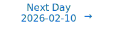

# Personalized Daily ArXiv Papers 2026-02-09

| *[gpt-5]*   | Prompt   | Completion   | Total   |
|:-----------:|:--------:|:------------:|:-------:|
| **Token**   | 50077    | 42089        | 92166   |
| **Cost**    | $0.06    | $0.42        | $0.48   |

Total arXiv papers: 591

Total scanned papers: 334

Total relevant papers: 41

**Table of contents with paper titles:**

1. [To 2:4 Sparsity and Beyond: Neuron-level Activation Function to Accelerate LLM Pre-Training](#user-content-link1)
**Authors:** Meghana Madhyastha, Daniel Haziza, Jesse Cai, Newsha Ardalani, Zhiqi Bu, Carole-Jean Wu

2. [MoSE: Mixture of Slimmable Experts for Efficient and Adaptive Language Models](#user-content-link2)
**Authors:** Nurbek Tastan, Stefanos Laskaridis, Karthik Nandakumar, Samuel Horvath

3. [POP: Online Structural Pruning Enables Efficient Inference of Large Foundation Models](#user-content-link3)
**Authors:** Yi Chen, Wonjin Shin, Shuhong Liu, Tho Mai, Jeongmo Lee, Chuanbo Hua, Kun Wang, Jun Liu, Joo-Young Kim

4. [Learning Rate Scaling across LoRA Ranks and Transfer to Full Finetuning](#user-content-link4)
**Authors:** Nan Chen, Soledad Villar, Soufiane Hayou

5. [NanoQuant: Efficient Sub-1-Bit Quantization of Large Language Models](#user-content-link5)
**Authors:** Hyochan Chong, Dongkyu Kim, Changdong Kim, Minseop Choi

6. [Emergent Low-Rank Training Dynamics in MLPs with Smooth Activations](#user-content-link6)
**Authors:** Alec S. Xu, Can Yaras, Matthew Asato, Qing Qu, Laura Balzano

7. [SOCKET: SOft Collison Kernel EsTimator for Sparse Attention](#user-content-link7)
**Authors:** Sahil Joshi, Agniva Chowdhury, Wyatt Bellinger, Amar Kanakamedala, Ekam Singh, Hoang Anh Duy Le, Aditya Desai, Anshumali Shrivastava

8. [Compressing LLMs with MoP: Mixture of Pruners](#user-content-link8)
**Authors:** Bruno Lopes Yamamoto, Lucas Lauton de Alcantara, Victor Zacarias, Leandro Giusti Mugnaini, Keith Ando Ogawa, Lucas Pellicer, Rosimeire Pereira Costa, Edson Bollis, Anna Helena Reali Costa, Artur Jordao

9. [Cross-Modal Redundancy and the Geometry of Vision-Language Embeddings](#user-content-link9)
**Authors:** Gr\'egoire Dhimo\"ila, Thomas Fel, Victor Boutin, Agustin Picard

10. [EUGens: Efficient, Unified, and General Dense Layers](#user-content-link10)
**Authors:** Sang Min Kim, Byeongchan Kim, Arijit Sehanobish, Somnath Basu Roy Chowdhury, Rahul Kidambi, Dongseok Shim, Avinava Dubey, Snigdha Chaturvedi, Min-hwan Oh, Krzysztof Choromanski

11. [Optimal Learning-Rate Schedules under Functional Scaling Laws: Power Decay and Warmup-Stable-Decay](#user-content-link11)
**Authors:** Binghui Li, Zilin Wang, Fengling Chen, Shiyang Zhao, Ruiheng Zheng, Lei Wu

12. [Uniform Spectral Growth and Convergence of Muon in LoRA-Style Matrix Factorization](#user-content-link12)
**Authors:** Changmin Kang, Jihun Yun, Baekrok Shin, Yeseul Cho, Chulhee Yun

13. [Disentanglement by means of action-induced representations](#user-content-link13)
**Authors:** Gorka Mu\~noz-Gil, Hendrik Poulsen Nautrup, Arunava Majumder, Paulin de Schoulepnikoff, Florian F\"urrutter, Marius Krumm, Hans J. Briegel

14. [High-Dimensional Limit of Stochastic Gradient Flow via Dynamical Mean-Field Theory](#user-content-link14)
**Authors:** Sota Nishiyama, Masaaki Imaizumi

15. [Inference-Time Rethinking with Latent Thought Vectors for Math Reasoning](#user-content-link15)
**Authors:** Deqian Kong, Minglu Zhao, Aoyang Qin, Bo Pang, Chenxin Tao, David Hartmann, Edouardo Honig, Dehong Xu, Amit Kumar, Matt Sarte, Chuan Li, Jianwen Xie, Ying Nian Wu

16. [Learning a Generative Meta-Model of LLM Activations](#user-content-link16)
**Authors:** Grace Luo, Jiahai Feng, Trevor Darrell, Alec Radford, Jacob Steinhardt

17. [From Kepler to Newton: Inductive Biases Guide Learned World Models in Transformers](#user-content-link17)
**Authors:** Ziming Liu, Sophia Sanborn, Surya Ganguli, Andreas Tolias

18. [Canzona: A Unified, Asynchronous, and Load-Balanced Framework for Distributed Matrix-based Optimizers](#user-content-link18)
**Authors:** Liangyu Wang, Siqi Zhang, Junjie Wang, Yiming Dong, Bo Zheng, Zihan Qiu, Shengkun Tang, Di Wang, Rui Men, Dayiheng Liu

19. [Deep networks learn to parse uniform-depth context-free languages from local statistics](#user-content-link19)
**Authors:** Jack T. Parley, Francesco Cagnetta, Matthieu Wyart

20. [A Multiplicative Neural Network Architecture: Locality and Regularity of Appriximation](#user-content-link20)
**Authors:** Hee-Sun Choi, Beom-Seok Han

21. [PackInfer: Compute- and I/O-Efficient Attention for Batched LLM Inference](#user-content-link21)
**Authors:** Rui Ning, Wei Zhang, Fan Lai

22. [Fine-Grained Model Merging via Modular Expert Recombination](#user-content-link22)
**Authors:** Haiyun Qiu, Xingyu Wu, Liang Feng, Kay Chen Tan

23. [Revisiting the Shape Convention of Transformer Language Models](#user-content-link23)
**Authors:** Feng-Ting Liao, Meng-Hsi Chen, Guan-Ting Yi, Da-shan Shiu

24. [Decoupling Variance and Scale-Invariant Updates in Adaptive Gradient Descent for Unified Vector and Matrix Optimization](#user-content-link24)
**Authors:** Zitao Song, Cedar Site Bai, Zhe Zhang, Brian Bullins, David F. Gleich

25. [Algebraic Robustness Verification of Neural Networks](#user-content-link25)
**Authors:** Yulia Alexandr, Hao Duan, Guido Mont\'ufar

26. [HyPER: Bridging Exploration and Exploitation for Scalable LLM Reasoning with Hypothesis Path Expansion and Reduction](#user-content-link26)
**Authors:** Shengxuan Qiu, Haochen Huang, Shuzhang Zhong, Pengfei Zuo, Meng Li

27. [Explaining Grokking in Transformers through the Lens of Inductive Bias](#user-content-link27)
**Authors:** Jaisidh Singh, Diganta Misra, Antonio Orvieto

28. [Robustness Beyond Known Groups with Low-rank Adaptation](#user-content-link28)
**Authors:** Abinitha Gourabathina, Hyewon Jeong, Teya Bergamaschi, Marzyeh Ghassemi, Collin Stultz

29. [SHINE: A Scalable In-Context Hypernetwork for Mapping Context to LoRA in a Single Pass](#user-content-link29)
**Authors:** Yewei Liu, Xiyuan Wang, Yansheng Mao, Yoav Gelbery, Haggai Maron, Muhan Zhang

30. [When RL Meets Adaptive Speculative Training: A Unified Training-Serving System](#user-content-link30)
**Authors:** Junxiong Wang, Fengxiang Bie, Jisen Li, Zhongzhu Zhou, Zelei Shao, Yubo Wang, Yinghui Liu, Qingyang Wu, Avner May, Sri Yanamandra, Yineng Zhang, Ce Zhang, Tri Dao, Percy Liang, Ben Athiwaratkun, Shuaiwen Leon Song, Chenfeng Xu, Xiaoxia Wu

31. [SPARC: Separating Perception And Reasoning Circuits for Test-time Scaling of VLMs](#user-content-link31)
**Authors:** Niccolo Avogaro, Nayanika Debnath, Li Mi, Thomas Frick, Junling Wang, Zexue He, Hang Hua, Konrad Schindler, Mattia Rigotti

32. [Weisfeiler and Lehman Go Categorical](#user-content-link32)
**Authors:** Seongjin Choi, Gahee Kim, Se-Young Yun

33. [Vision Transformer Finetuning Benefits from Non-Smooth Components](#user-content-link33)
**Authors:** Ambroise Odonnat, Laetitia Chapel, Romain Tavenard, Ievgen Redko

34. [Multi-Way Representation Alignment](#user-content-link34)
**Authors:** Akshit Achara, Tatiana Gaintseva, Mateo Mahaut, Pritish Chakraborty, Viktor Stenby Johansson, Melih Barsbey, Emanuele Rodol\`a, Donato Crisostomi

35. [Accelerating Vision Transformers on Brain Processing Unit](#user-content-link35)
**Authors:** Jinchi Tang, Yan Guo

36. [Not All Layers Need Tuning: Selective Layer Restoration Recovers Diversity](#user-content-link36)
**Authors:** Bowen Zhang, Meiyi Wang, Harold Soh

37. [Endogenous Resistance to Activation Steering in Language Models](#user-content-link37)
**Authors:** Alex McKenzie, Keenan Pepper, Stijn Servaes, Martin Leitgab, Murat Cubuktepe, Mike Vaiana, Diogo de Lucena, Judd Rosenblatt, Michael S. A. Graziano

38. [The Quantum Sieve Tracer: A Hybrid Framework for Layer-Wise Activation Tracing in Large Language Models](#user-content-link38)
**Authors:** Jonathan Pan

39. [Diffeomorphism-Equivariant Neural Networks](#user-content-link39)
**Authors:** Josephine Elisabeth Oettinger, Zakhar Shumaylov, Johannes Bostelmann, Jan Lellmann, Carola-Bibiane Sch\"onlieb

40. [Same Answer, Different Representations: Hidden instability in VLMs](#user-content-link40)
**Authors:** Farooq Ahmad Wani, Alessandro Suglia, Rohit Saxena, Aryo Pradipta Gema, Wai-Chung Kwan, Fazl Barez, Maria Sofia Bucarelli, Fabrizio Silvestri, Pasquale Minervini

41. [Optimal rates for density and mode estimation with expand-and-sparsify representations](#user-content-link41)
**Authors:** Kaushik Sinha, Christopher Tosh

---

## 1. [To 2:4 Sparsity and Beyond: Neuron-level Activation Function to Accelerate LLM Pre-Training](https://arxiv.org/abs/2602.06183) 

**ArXiv ID:** 2602.06183

**Authors:** Meghana Madhyastha, Daniel Haziza, Jesse Cai, Newsha Ardalani, Zhiqi Bu, Carole-Jean Wu

**Abstract:** Trainings of Large Language Models are generally bottlenecked by matrix multiplications. In the Transformer architecture, a large portion of these operations happens in the Feed Forward Network (FFN), and this portion increases for larger models, up to 50% of the total pretraining floating point operations. We show that we can leverage hardware-accelerated sparsity to accelerate all matrix multiplications in the FFN, with 2:4 sparsity for weights and v:n:m (Venom) sparsity for activations. Our recipe relies on sparse training steps to accelerate a large part of the pretraining, associated with regular dense training steps towards the end. Overall, models trained with this approach exhibit the same performance on our quality benchmarks, and can speed up training end-to-end by 1.4 to 1.7x. This approach is applicable to all NVIDIA GPUs starting with the A100 generation, and is orthogonal to common optimization techniques, such as, quantization, and can also be applied to mixture-of-experts model architectures.

**Comment:** Compression/Efficiency: combines 2:4 structured weight sparsity with v:n:m activation sparsity and sparse-to-dense training to accelerate LLM pretraining with maintained quality.

**Relevance:** 10
**Novelty:** 8

---

## 2. [MoSE: Mixture of Slimmable Experts for Efficient and Adaptive Language Models](https://arxiv.org/abs/2602.06154) 

**ArXiv ID:** 2602.06154

**Authors:** Nurbek Tastan, Stefanos Laskaridis, Karthik Nandakumar, Samuel Horvath

**Abstract:** Mixture-of-Experts (MoE) models scale large language models efficiently by sparsely activating experts, but once an expert is selected, it is executed fully. Hence, the trade-off between accuracy and computation in an MoE model typically exhibits large discontinuities. We propose Mixture of Slimmable Experts (MoSE), an MoE architecture in which each expert has a nested, slimmable structure that can be executed at variable widths. This enables conditional computation not only over which experts are activated, but also over how much of each expert is utilized. Consequently, a single pretrained MoSE model can support a more continuous spectrum of accuracy-compute trade-offs at inference time. We present a simple and stable training recipe for slimmable experts under sparse routing, combining multi-width training with standard MoE objectives. During inference, we explore strategies for runtime width determination, including a lightweight test-time training mechanism that learns how to map router confidence/probabilities to expert widths under a fixed budget. Experiments on GPT models trained on OpenWebText demonstrate that MoSE matches or improves upon standard MoE at full width and consistently shifts the Pareto frontier for accuracy vs. cost, achieving comparable performance with significantly fewer FLOPs.

**Comment:** Model Architecture/Efficiency: Mixture of Slimmable Experts (MoSE) introduces slimmable experts within MoE for conditional widths, enabling continuous accuracy–compute trade-offs from a single pretrained model.

**Relevance:** 10
**Novelty:** 8

---

## 3. [POP: Online Structural Pruning Enables Efficient Inference of Large Foundation Models](https://arxiv.org/abs/2602.06822) 

**ArXiv ID:** 2602.06822

**Authors:** Yi Chen, Wonjin Shin, Shuhong Liu, Tho Mai, Jeongmo Lee, Chuanbo Hua, Kun Wang, Jun Liu, Joo-Young Kim

**Abstract:** Large foundation models (LFMs) achieve strong performance through scaling, yet current structural pruning methods derive fixed pruning decisions during inference, overlooking sparsity patterns that emerge in the autoregressive token generation. In this paper, we propose POP (Partition-guided Online Pruning), an efficient online structural pruning framework that enables context-conditioned dynamic pruning with minimal computational overhead. POP partitions model channels into retained, candidate, and pruned regions, where prefilling defines a coarse pruning partition, and the decoding stage generates a fine-grained mask within the candidate region, avoiding full-channel re-evaluation. The coarse pruning partition preserves consistently important weights, while the fine-grained masking provides context-conditioned variation during decoding. Moreover, POP is a lightweight, plug-and-play method that requires no preprocessing, including offline calibration, retraining, or learning predictors. Extensive evaluations across diverse LFMs, including large language models (LLMs), mixture-of-experts models (MoEs), and vision-language models (VLMs), demonstrate that POP consistently delivers higher accuracy than existing pruning approaches while incurring smaller computational overhead and minimizing inference latency.

**Comment:** Compression/Efficiency: online structural pruning with context-conditioned dynamic masks for LLMs/MoEs/VLMs; plug-and-play efficient inference.

**Relevance:** 10
**Novelty:** 8

---

## 4. [Learning Rate Scaling across LoRA Ranks and Transfer to Full Finetuning](https://arxiv.org/abs/2602.06204) 

**ArXiv ID:** 2602.06204

**Authors:** Nan Chen, Soledad Villar, Soufiane Hayou

**Abstract:** Low-Rank Adaptation (LoRA) is a standard tool for parameter-efficient finetuning of large models. While it induces a small memory footprint, its training dynamics can be surprisingly complex as they depend on several hyperparameters such as initialization, adapter rank, and learning rate. In particular, it is unclear how the optimal learning rate scales with adapter rank, which forces practitioners to re-tune the learning rate whenever the rank is changed. In this paper, we introduce Maximal-Update Adaptation ($\mu$A), a theoretical framework that characterizes how the "optimal" learning rate should scale with model width and adapter rank to produce stable, non-vanishing feature updates under standard configurations. $\mu$A is inspired from the Maximal-Update Parametrization ($\mu$P) in pretraining. Our analysis leverages techniques from hyperparameter transfer and reveals that the optimal learning rate exhibits different scaling patterns depending on initialization and LoRA scaling factor. Specifically, we identify two regimes: one where the optimal learning rate remains roughly invariant across ranks, and another where it scales inversely with rank. We further identify a configuration that allows learning rate transfer from LoRA to full finetuning, drastically reducing the cost of learning rate tuning for full finetuning. Experiments across language, vision, vision--language, image generation, and reinforcement learning tasks validate our scaling rules and show that learning rates tuned on LoRA transfer reliably to full finetuning.

**Comment:** Low-Rank/Training Dynamics: learning-rate scaling laws across LoRA ranks (μA) with transfer to full finetuning; hyperparameter transfer theory for low-rank adaptation.

**Relevance:** 10
**Novelty:** 8

---

## 5. [NanoQuant: Efficient Sub-1-Bit Quantization of Large Language Models](https://arxiv.org/abs/2602.06694) 

**ArXiv ID:** 2602.06694

**Authors:** Hyochan Chong, Dongkyu Kim, Changdong Kim, Minseop Choi

**Abstract:** Weight-only quantization has become a standard approach for efficiently serving large language models (LLMs). However, existing methods fail to efficiently compress models to binary (1-bit) levels, as they either require large amounts of data and compute or incur additional storage. In this work, we propose NanoQuant, the first post-training quantization (PTQ) method to compress LLMs to both binary and sub-1-bit levels. NanoQuant formulates quantization as a low-rank binary factorization problem, and compresses full-precision weights to low-rank binary matrices and scales. Specifically, it utilizes an efficient alternating direction method of multipliers (ADMM) method to precisely initialize latent binary matrices and scales, and then tune the initialized parameters through a block and model reconstruction process. Consequently, NanoQuant establishes a new Pareto frontier in low-memory post-training quantization, achieving state-of-the-art accuracy even at sub-1-bit compression rates. NanoQuant makes large-scale deployment feasible on consumer hardware. For example, it compresses Llama2-70B by 25.8$\times$ in just 13 hours on a single H100, enabling a 70B model to operate on a consumer 8 GB GPU.

**Comment:** Compression/Efficiency: PTQ to sub-1-bit via low-rank binary factorization with ADMM initialization and reconstruction; state-of-the-art ultra-low-bit LLM quantization.

**Relevance:** 10
**Novelty:** 8

---

## 6. [Emergent Low-Rank Training Dynamics in MLPs with Smooth Activations](https://arxiv.org/abs/2602.06208) 

**ArXiv ID:** 2602.06208

**Authors:** Alec S. Xu, Can Yaras, Matthew Asato, Qing Qu, Laura Balzano

**Abstract:** Recent empirical evidence has demonstrated that the training dynamics of large-scale deep neural networks occur within low-dimensional subspaces. While this has inspired new research into low-rank training, compression, and adaptation, theoretical justification for these dynamics in nonlinear networks remains limited. %compared to deep linear settings. To address this gap, this paper analyzes the learning dynamics of multi-layer perceptrons (MLPs) under gradient descent (GD). We demonstrate that the weight dynamics concentrate within invariant low-dimensional subspaces throughout training. Theoretically, we precisely characterize these invariant subspaces for two-layer networks with smooth nonlinear activations, providing insight into their emergence. Experimentally, we validate that this phenomenon extends beyond our theoretical assumptions. Leveraging these insights, we empirically show there exists a low-rank MLP parameterization that, when initialized within the appropriate subspaces, matches the classification performance of fully-parameterized counterparts on a variety of classification tasks.

**Comment:** Compression/Efficiency and Representation Learning: proves emergent low-rank/invariant subspace training dynamics in MLPs and motivates effective low-rank parameterizations.

**Relevance:** 10
**Novelty:** 8

---

## 7. [SOCKET: SOft Collison Kernel EsTimator for Sparse Attention](https://arxiv.org/abs/2602.06283) 

**ArXiv ID:** 2602.06283

**Authors:** Sahil Joshi, Agniva Chowdhury, Wyatt Bellinger, Amar Kanakamedala, Ekam Singh, Hoang Anh Duy Le, Aditya Desai, Anshumali Shrivastava

**Abstract:** Exploiting sparsity during long-context inference is central to scaling large language models, as attention dominates the cost of autoregressive decoding. Sparse attention reduces this cost by restricting computation to a subset of tokens, but its effectiveness depends critically on efficient scoring and selection of relevant tokens at inference time. We revisit Locality-Sensitive Hashing (LSH) as a sparsification primitive and introduce SOCKET, a SOft Collision Kernel EsTimator that replaces hard bucket matches with probabilistic, similarity-aware aggregation. Our key insight is that hard LSH produces discrete collision signals and is therefore poorly suited for ranking. In contrast, soft LSH aggregates graded collision evidence across hash tables, preserving the stability of relative ordering among the true top-$k$ tokens. This transformation elevates LSH from a candidate-generation heuristic to a principled and mathematically grounded scoring kernel for sparse attention. Leveraging this property, SOCKET enables efficient token selection without ad-hoc voting mechanism, and matches or surpasses established sparse attention baselines across multiple long-context benchmarks using diverse set of models. With a custom CUDA kernel for scoring keys and a Flash Decode Triton backend for sparse attention, SOCKET achieves up to 1.5$\times$ higher throughput than FlashAttention, making it an effective tool for long-context inference. Code is open-sourced at https://github.com/amarka8/SOCKET.

**Comment:** Compression/Efficiency: sparse attention via soft LSH scoring kernel for top-k token selection; systems-level acceleration with custom CUDA/Triton yielding up to 1.5× throughput over FlashAttention.

**Relevance:** 10
**Novelty:** 8

---

## 8. [Compressing LLMs with MoP: Mixture of Pruners](https://arxiv.org/abs/2602.06127) 

**ArXiv ID:** 2602.06127

**Authors:** Bruno Lopes Yamamoto, Lucas Lauton de Alcantara, Victor Zacarias, Leandro Giusti Mugnaini, Keith Ando Ogawa, Lucas Pellicer, Rosimeire Pereira Costa, Edson Bollis, Anna Helena Reali Costa, Artur Jordao

**Abstract:** The high computational demands of Large Language Models (LLMs) motivate methods that reduce parameter count and accelerate inference. In response, model pruning emerges as an effective strategy, yet current methods typically focus on a single dimension-depth or width. We introduce MoP (Mixture of Pruners), an iterative framework that unifies these dimensions. At each iteration, MoP generates two branches-pruning in depth versus pruning in width-and selects a candidate to advance the path. On LLaMA-2 and LLaMA-3, MoP advances the frontier of structured pruning, exceeding the accuracy of competing methods across a broad set of compression regimes. It also consistently outperforms depth-only and width-only pruning. Furthermore, MoP translates structural pruning into real speedup, reducing end-to-end latency by 39% at 40% compression. Finally, extending MoP to the vision-language model LLaVA-1.5, we notably improve computational efficiency and demonstrate that text-only recovery fine-tuning can restore performance even on visual tasks.

**Comment:** Compression/Efficiency: structured pruning via a mixture-of-pruners combining depth and width pruning, yielding latency reductions and improved accuracy under fixed compression.

**Relevance:** 10
**Novelty:** 8

---

## 9. [Cross-Modal Redundancy and the Geometry of Vision-Language Embeddings](https://arxiv.org/abs/2602.06218) 

**ArXiv ID:** 2602.06218

**Authors:** Gr\'egoire Dhimo\"ila, Thomas Fel, Victor Boutin, Agustin Picard

**Abstract:** Vision-language models (VLMs) align images and text with remarkable success, yet the geometry of their shared embedding space remains poorly understood. To probe this geometry, we begin from the Iso-Energy Assumption, which exploits cross-modal redundancy: a concept that is truly shared should exhibit the same average energy across modalities. We operationalize this assumption with an Aligned Sparse Autoencoder (SAE) that encourages energy consistency during training while preserving reconstruction. We find that this inductive bias changes the SAE solution without harming reconstruction, giving us a representation that serves as a tool for geometric analysis. Sanity checks on controlled data with known ground truth confirm that alignment improves when Iso-Energy holds and remains neutral when it does not. Applied to foundational VLMs, our framework reveals a clear structure with practical consequences: (i) sparse bimodal atoms carry the entire cross-modal alignment signal; (ii) unimodal atoms act as modality-specific biases and fully explain the modality gap; (iii) removing unimodal atoms collapses the gap without harming performance; (iv) restricting vector arithmetic to the bimodal subspace yields in-distribution edits and improved retrieval. These findings suggest that the right inductive bias can both preserve model fidelity and render the latent geometry interpretable and actionable.

**Comment:** Representation Learning: aligned sparse autoencoder with an iso-energy inductive bias to analyze and disentangle VLM embedding geometry (bimodal vs. unimodal atoms).

**Relevance:** 9
**Novelty:** 8

---

## 10. [EUGens: Efficient, Unified, and General Dense Layers](https://arxiv.org/abs/2410.09771) 

**ArXiv ID:** 2410.09771

**Authors:** Sang Min Kim, Byeongchan Kim, Arijit Sehanobish, Somnath Basu Roy Chowdhury, Rahul Kidambi, Dongseok Shim, Avinava Dubey, Snigdha Chaturvedi, Min-hwan Oh, Krzysztof Choromanski

**Abstract:** Efficient neural networks are essential for scaling machine learning models to real-time applications and resource-constrained environments. Fully-connected feedforward layers (FFLs) introduce computation and parameter count bottlenecks within neural network architectures. To address this challenge, in this work, we propose a new class of dense layers that generalize standard fully-connected feedforward layers, \textbf{E}fficient, \textbf{U}nified and \textbf{Gen}eral dense layers (EUGens). EUGens leverage random features to approximate standard FFLs and go beyond them by incorporating a direct dependence on the input norms in their computations. The proposed layers unify existing efficient FFL extensions and improve efficiency by reducing inference complexity from quadratic to linear time. They also lead to \textbf{the first} unbiased algorithms approximating FFLs with arbitrary polynomial activation functions. Furthermore, EuGens reduce the parameter count and computational overhead while preserving the expressive power and adaptability of FFLs. We also present a layer-wise knowledge transfer technique that bypasses backpropagation, enabling efficient adaptation of EUGens to pre-trained models. Empirically, we observe that integrating EUGens into Transformers and MLPs yields substantial improvements in inference speed (up to \textbf{27}\%) and memory efficiency (up to \textbf{30}\%) across a range of tasks, including image classification, language model pre-training, and 3D scene reconstruction. Overall, our results highlight the potential of EUGens for the scalable deployment of large-scale neural networks in real-world scenarios.

**Comment:** Model Architecture and Efficiency: introduces EUGens, a new dense layer class using random features to approximate FFLs, reducing inference from quadratic to linear time and enabling backprop-free layer-wise transfer.

**Relevance:** 9
**Novelty:** 8

---

## 11. [Optimal Learning-Rate Schedules under Functional Scaling Laws: Power Decay and Warmup-Stable-Decay](https://arxiv.org/abs/2602.06797) 

**ArXiv ID:** 2602.06797

**Authors:** Binghui Li, Zilin Wang, Fengling Chen, Shiyang Zhao, Ruiheng Zheng, Lei Wu

**Abstract:** We study optimal learning-rate schedules (LRSs) under the functional scaling law (FSL) framework introduced in Li et al. (2025), which accurately models the loss dynamics of both linear regression and large language model (LLM) pre-training. Within FSL, loss dynamics are governed by two exponents: a source exponent $s>0$ controlling the rate of signal learning, and a capacity exponent $\beta>1$ determining the rate of noise forgetting. Focusing on a fixed training horizon $N$, we derive the optimal LRSs and reveal a sharp phase transition. In the easy-task regime $s \ge 1 - 1/\beta$, the optimal schedule follows a power decay to zero, $\eta^*(z) = \eta_{\mathrm{peak}}(1 - z/N)^{2\beta - 1}$, where the peak learning rate scales as $\eta_{\mathrm{peak}} \eqsim N^{-\nu}$ for an explicit exponent $\nu = \nu(s,\beta)$. In contrast, in the hard-task regime $s < 1 - 1/\beta$, the optimal LRS exhibits a warmup-stable-decay (WSD) (Hu et al. (2024)) structure: it maintains the largest admissible learning rate for most of training and decays only near the end, with the decay phase occupying a vanishing fraction of the horizon.   We further analyze optimal shape-fixed schedules, where only the peak learning rate is tuned -- a strategy widely adopted in practiceand characterize their strengths and intrinsic limitations. This yields a principled evaluation of commonly used schedules such as cosine and linear decay. Finally, we apply the power-decay LRS to one-pass stochastic gradient descent (SGD) for kernel regression and show the last iterate attains the exact minimax-optimal rate, eliminating the logarithmic suboptimality present in prior analyses. Numerical experiments corroborate our theoretical predictions.

**Comment:** Training dynamics: optimal learning-rate schedules under functional scaling laws applicable to LLM pretraining; theory-driven.

**Relevance:** 9
**Novelty:** 8

---

## 12. [Uniform Spectral Growth and Convergence of Muon in LoRA-Style Matrix Factorization](https://arxiv.org/abs/2602.06385) 

**ArXiv ID:** 2602.06385

**Authors:** Changmin Kang, Jihun Yun, Baekrok Shin, Yeseul Cho, Chulhee Yun

**Abstract:** Spectral gradient descent (SpecGD) orthogonalizes the matrix parameter updates and has inspired practical optimizers such as Muon. They often perform well in large language model (LLM) training, but their dynamics remain poorly understood. In the low-rank adaptation (LoRA) setting, where weight updates are parameterized as a product of two low-rank factors, we find a distinctive spectral phenomenon under Muon in LoRA fine-tuning of LLMs: singular values of the LoRA product show near-uniform growth across the spectrum, despite orthogonalization being performed on the two factors separately. Motivated by this observation, we analyze spectral gradient flow (SpecGF)-a continuous-time analogue of SpecGD-in a simplified LoRA-style matrix factorization setting and prove "equal-rate" dynamics: all singular values grow at equal rates up to small deviations. Consequently, smaller singular values attain their target values earlier than larger ones, sharply contrasting with the largest-first stepwise learning observed in standard gradient flow. Moreover, we prove that SpecGF in our setting converges to global minima from almost all initializations, provided the factor norms remain bounded; with $\ell_2$ regularization, we obtain global convergence. Lastly, we corroborate our theory with experiments in the same setting.

**Comment:** Low-Rank/Training Dynamics: theoretical analysis of SpecGF/Muon in LoRA-style matrix factorization showing uniform spectral growth and global convergence properties.

**Relevance:** 9
**Novelty:** 8

---

## 13. [Disentanglement by means of action-induced representations](https://arxiv.org/abs/2602.06741) 

**ArXiv ID:** 2602.06741

**Authors:** Gorka Mu\~noz-Gil, Hendrik Poulsen Nautrup, Arunava Majumder, Paulin de Schoulepnikoff, Florian F\"urrutter, Marius Krumm, Hans J. Briegel

**Abstract:** Learning interpretable representations with variational autoencoders (VAEs) is a major goal of representation learning. The main challenge lies in obtaining disentangled representations, where each latent dimension corresponds to a distinct generative factor. This difficulty is fundamentally tied to the inability to perform nonlinear independent component analysis. Here, we introduce the framework of action-induced representations (AIRs) which models representations of physical systems given experiments (or actions) that can be performed on them. We show that, in this framework, we can provably disentangle degrees of freedom w.r.t. their action dependence. We further introduce a variational AIR architecture (VAIR) that can extract AIRs and therefore achieve provable disentanglement where standard VAEs fail. Beyond state representation, VAIR also captures the action dependence of the underlying generative factors, directly linking experiments to the degrees of freedom they influence.

**Comment:** Representation Learning: introduces action-induced representations with provable disentanglement and a variational AIR architecture (VAIR).

**Relevance:** 9
**Novelty:** 8

---

## 14. [High-Dimensional Limit of Stochastic Gradient Flow via Dynamical Mean-Field Theory](https://arxiv.org/abs/2602.06320) 

**ArXiv ID:** 2602.06320

**Authors:** Sota Nishiyama, Masaaki Imaizumi

**Abstract:** Modern machine learning models are typically trained via multi-pass stochastic gradient descent (SGD) with small batch sizes, and understanding their dynamics in high dimensions is of great interest. However, an analytical framework for describing the high-dimensional asymptotic behavior of multi-pass SGD with small batch sizes for nonlinear models is currently missing. In this study, we address this gap by analyzing the high-dimensional dynamics of a stochastic differential equation called a \emph{stochastic gradient flow} (SGF), which approximates multi-pass SGD in this regime. In the limit where the number of data samples $n$ and the dimension $d$ grow proportionally, we derive a closed system of low-dimensional and continuous-time equations and prove that it characterizes the asymptotic distribution of the SGF parameters. Our theory is based on the dynamical mean-field theory (DMFT) and is applicable to a wide range of models encompassing generalized linear models and two-layer neural networks. We further show that the resulting DMFT equations recover several existing high-dimensional descriptions of SGD dynamics as special cases, thereby providing a unifying perspective on prior frameworks such as online SGD and high-dimensional linear regression. Our proof builds on the existing DMFT technique for gradient flow and extends it to handle the stochasticity in SGF using tools from stochastic calculus.

**Comment:** Training Dynamics Theory: DMFT-based high-dimensional limit for stochastic gradient flow covering GLMs and two-layer nets; unifies prior SGD dynamics frameworks.

**Relevance:** 9
**Novelty:** 8

---

## 15. [Inference-Time Rethinking with Latent Thought Vectors for Math Reasoning](https://arxiv.org/abs/2602.06584) 

**ArXiv ID:** 2602.06584

**Authors:** Deqian Kong, Minglu Zhao, Aoyang Qin, Bo Pang, Chenxin Tao, David Hartmann, Edouardo Honig, Dehong Xu, Amit Kumar, Matt Sarte, Chuan Li, Jianwen Xie, Ying Nian Wu

**Abstract:** Standard chain-of-thought reasoning generates a solution in a single forward pass, committing irrevocably to each token and lacking a mechanism to recover from early errors. We introduce Inference-Time Rethinking, a generative framework that enables iterative self-correction by decoupling declarative latent thought vectors from procedural generation. We factorize reasoning into a continuous latent thought vector (what to reason about) and a decoder that verbalizes the trace conditioned on this vector (how to reason). Beyond serving as a declarative buffer, latent thought vectors compress the reasoning structure into a continuous representation that abstracts away surface-level token variability, making gradient-based optimization over reasoning strategies well-posed. Our prior model maps unstructured noise to a learned manifold of valid reasoning patterns, and at test time we employ a Gibbs-style procedure that alternates between generating a candidate trace and optimizing the latent vector to better explain that trace, effectively navigating the latent manifold to refine the reasoning strategy. Training a 0.2B-parameter model from scratch on GSM8K, our method with 30 rethinking iterations surpasses baselines with 10 to 15 times more parameters, including a 3B counterpart. This result demonstrates that effective mathematical reasoning can emerge from sophisticated inference-time computation rather than solely from massive parameter counts.

**Comment:** Model Architecture/Inference-time Computation: decouples reasoning into latent thought vectors and a decoder, enabling gradient-based refinement over a learned latent manifold.

**Relevance:** 9
**Novelty:** 8

---

## 16. [Learning a Generative Meta-Model of LLM Activations](https://arxiv.org/abs/2602.06964) 

**ArXiv ID:** 2602.06964

**Authors:** Grace Luo, Jiahai Feng, Trevor Darrell, Alec Radford, Jacob Steinhardt

**Abstract:** Existing approaches for analyzing neural network activations, such as PCA and sparse autoencoders, rely on strong structural assumptions. Generative models offer an alternative: they can uncover structure without such assumptions and act as priors that improve intervention fidelity. We explore this direction by training diffusion models on one billion residual stream activations, creating "meta-models" that learn the distribution of a network's internal states. We find that diffusion loss decreases smoothly with compute and reliably predicts downstream utility. In particular, applying the meta-model's learned prior to steering interventions improves fluency, with larger gains as loss decreases. Moreover, the meta-model's neurons increasingly isolate concepts into individual units, with sparse probing scores that scale as loss decreases. These results suggest generative meta-models offer a scalable path toward interpretability without restrictive structural assumptions. Project page: https://generative-latent-prior.github.io.

**Comment:** Representation Learning/Interpretability: trains diffusion meta-models on LLM activations to learn a prior over internal states, improving intervention fidelity and sparsity of concepts.

**Relevance:** 9
**Novelty:** 8

---

## 17. [From Kepler to Newton: Inductive Biases Guide Learned World Models in Transformers](https://arxiv.org/abs/2602.06923) 

**ArXiv ID:** 2602.06923

**Authors:** Ziming Liu, Sophia Sanborn, Surya Ganguli, Andreas Tolias

**Abstract:** Can general-purpose AI architectures go beyond prediction to discover the physical laws governing the universe? True intelligence relies on "world models" -- causal abstractions that allow an agent to not only predict future states but understand the underlying governing dynamics. While previous "AI Physicist" approaches have successfully recovered such laws, they typically rely on strong, domain-specific priors that effectively "bake in" the physics. Conversely, Vafa et al. recently showed that generic Transformers fail to acquire these world models, achieving high predictive accuracy without capturing the underlying physical laws. We bridge this gap by systematically introducing three minimal inductive biases. We show that ensuring spatial smoothness (by formulating prediction as continuous regression) and stability (by training with noisy contexts to mitigate error accumulation) enables generic Transformers to surpass prior failures and learn a coherent Keplerian world model, successfully fitting ellipses to planetary trajectories. However, true physical insight requires a third bias: temporal locality. By restricting the attention window to the immediate past -- imposing the simple assumption that future states depend only on the local state rather than a complex history -- we force the model to abandon curve-fitting and discover Newtonian force representations. Our results demonstrate that simple architectural choices determine whether an AI becomes a curve-fitter or a physicist, marking a critical step toward automated scientific discovery.

**Comment:** Inductive Bias/Architecture: shows how minimal biases (spatial smoothness, stability via noisy contexts, temporal locality via restricted attention) guide transformers from curve-fitting to learning Newtonian world models.

**Relevance:** 9
**Novelty:** 7

---

## 18. [Canzona: A Unified, Asynchronous, and Load-Balanced Framework for Distributed Matrix-based Optimizers](https://arxiv.org/abs/2602.06079) 

**ArXiv ID:** 2602.06079

**Authors:** Liangyu Wang, Siqi Zhang, Junjie Wang, Yiming Dong, Bo Zheng, Zihan Qiu, Shengkun Tang, Di Wang, Rui Men, Dayiheng Liu

**Abstract:** The scaling of Large Language Models (LLMs) drives interest in matrix-based optimizers (e.g., Shampoo, Muon, SOAP) for their convergence efficiency; yet their requirement for holistic updates conflicts with the tensor fragmentation in distributed frameworks like Megatron. Existing solutions are suboptimal: synchronous approaches suffer from computational redundancy, while layer-wise partitioning fails to reconcile this conflict without violating the geometric constraints of efficient communication primitives. To bridge this gap, we propose Canzona, a Unified, Asynchronous, and Load-Balanced framework that decouples logical optimizer assignment from physical parameter distribution. For Data Parallelism, we introduce an alpha-Balanced Static Partitioning strategy that respects atomicity while neutralizing the load imbalance. For Tensor Parallelism, we design an Asynchronous Compute pipeline utilizing Micro-Group Scheduling to batch fragmented updates and hide reconstruction overhead. Extensive evaluations on the Qwen3 model family (up to 32B parameters) on 256 GPUs demonstrate that our approach preserves the efficiency of established parallel architectures, achieving a 1.57x speedup in end-to-end iteration time and reducing optimizer step latency by 5.8x compared to the baseline.

**Comment:** High Performance Computing: distributed training innovation for matrix-based optimizers with asynchronous scheduling and load-balanced partitioning.

**Relevance:** 9
**Novelty:** 7

---

## 19. [Deep networks learn to parse uniform-depth context-free languages from local statistics](https://arxiv.org/abs/2602.06065) 

**ArXiv ID:** 2602.06065

**Authors:** Jack T. Parley, Francesco Cagnetta, Matthieu Wyart

**Abstract:** Understanding how the structure of language can be learned from sentences alone is a central question in both cognitive science and machine learning. Studies of the internal representations of Large Language Models (LLMs) support their ability to parse text when predicting the next word, while representing semantic notions independently of surface form. Yet, which data statistics make these feats possible, and how much data is required, remain largely unknown. Probabilistic context-free grammars (PCFGs) provide a tractable testbed for studying these questions. However, prior work has focused either on the post-hoc characterization of the parsing-like algorithms used by trained networks; or on the learnability of PCFGs with fixed syntax, where parsing is unnecessary. Here, we (i) introduce a tunable class of PCFGs in which both the degree of ambiguity and the correlation structure across scales can be controlled; (ii) provide a learning mechanism -- an inference algorithm inspired by the structure of deep convolutional networks -- that links learnability and sample complexity to specific language statistics; and (iii) validate our predictions empirically across deep convolutional and transformer-based architectures. Overall, we propose a unifying framework where correlations at different scales lift local ambiguities, enabling the emergence of hierarchical representations of the data.

**Comment:** Representation Learning: theoretical and empirical insights into how deep nets learn hierarchical structure from local statistics in PCFGs.

**Relevance:** 9
**Novelty:** 7

---

## 20. [A Multiplicative Neural Network Architecture: Locality and Regularity of Appriximation](https://arxiv.org/abs/2602.06374) 

**ArXiv ID:** 2602.06374

**Authors:** Hee-Sun Choi, Beom-Seok Han

**Abstract:** We introduce a multiplicative neural network architecture in which multiplicative interactions constitute the fundamental representation, rather than appearing as auxiliary components within an additive model. We establish a universal approximation theorem for this architecture and analyze its approximation properties in terms of locality and regularity in Bessel potential spaces.   To complement the theoretical results, we conduct numerical experiments on representative targets exhibiting sharp transition layers or pointwise loss of higher-order regularity. The experiments focus on the spatial structure of approximation errors and on regularity-sensitive quantities, in particular the convergence of Zygmund-type seminorms. The results show that the proposed multiplicative architecture yields residual error structures that are more tightly aligned with regions of reduced regularity and exhibits more stable convergence in regularity-sensitive metrics.   These results demonstrate that adopting a multiplicative representation format has concrete implications for the localization and regularity behavior of neural network approximations, providing a direct connection between architectural design and analytical properties of the approximating functions.

**Comment:** Model Architecture: proposes a multiplicative neural network with universal approximation and locality/regularity analysis.

**Relevance:** 9
**Novelty:** 7

---

## 21. [PackInfer: Compute- and I/O-Efficient Attention for Batched LLM Inference](https://arxiv.org/abs/2602.06072) 

**ArXiv ID:** 2602.06072

**Authors:** Rui Ning, Wei Zhang, Fan Lai

**Abstract:** Attention efficiency is critical to large language model (LLM) inference. While prior advances optimize attention execution for individual requests (e.g., FlashAttention), production LLM serving relies on batching requests with highly heterogeneous sequence lengths for high serving throughput. This mismatch induces severe computation and I/O imbalance, exacerbates stragglers, and underutilizes GPU resources. We present PackInfer, a kernel-level attention framework that enables compute- and I/O-aware execution for heterogeneous batched inference. PackInfer orchestrates batched requests into load-balanced execution groups, effectively saturating GPU utilization by packing multiple requests into unified kernel launches. By constructing attention kernels directly over packed query-key regions, PackInfer eliminates redundant computation and balances thread-block execution. It then incorporates I/O-aware grouping that co-locates shared-prefix requests and reorganizes KV caches into group-contiguous layouts, reducing memory fragmentation and redundant data movement as generation evolves. Evaluations on real-world workloads show that PackInfer reduces inference latency by 13.0-20.1%, and improves throughput by 20% compared to the state-of-the-art FlashAttention.

**Comment:** High-Performance Computing: kernel-level attention packing and KV-cache reorganization for heterogeneous batched LLM inference (compute- and I/O-aware execution).

**Relevance:** 9
**Novelty:** 7

---

## 22. [Fine-Grained Model Merging via Modular Expert Recombination](https://arxiv.org/abs/2602.06552) 

**ArXiv ID:** 2602.06552

**Authors:** Haiyun Qiu, Xingyu Wu, Liang Feng, Kay Chen Tan

**Abstract:** Model merging constructs versatile models by integrating task-specific models without requiring labeled data or expensive joint retraining. Although recent methods improve adaptability to heterogeneous tasks by generating customized merged models for each instance, they face two critical limitations. First, the instance-specific merged models lack reusability, restricting the exploitation of high-quality merging configurations and efficient batch inference. Second, these methods treat each task-specific model as a monolithic whole, overlooking the diverse mergeability of homologous components such as attention and multilayer perceptron layers, and the differing merging sensitivities across components. To address these limitations, we propose MERGE (\underline{M}odular \underline{E}xpert \underline{R}ecombination for fine-\underline{G}rained m\underline{E}rging), a method that enables component-wise model merging and input-aware, on-demand module recombination at inference. MERGE formulates component-wise merging as a bi-objective optimization problem that balances cross-task performance and storage efficiency, and develops a surrogate-assisted evolutionary algorithm to efficiently identify Pareto-optimal merging configurations. These high-quality configurations underpin a reusable modular expert library, from which a lightweight routing network dynamically activates and recombines modular experts to assemble input-specific models and enable efficient inference under storage constraints. Extensive experiments across various model scales, task types, and fine-tuning strategies demonstrate that MERGE consistently outperforms strong baselines and generalizes effectively.

**Comment:** Model Architecture: fine-grained, component-wise model merging with a reusable modular expert library and input-aware routing (conditional/dynamic networks).

**Relevance:** 9
**Novelty:** 7

---

## 23. [Revisiting the Shape Convention of Transformer Language Models](https://arxiv.org/abs/2602.06471) 

**ArXiv ID:** 2602.06471

**Authors:** Feng-Ting Liao, Meng-Hsi Chen, Guan-Ting Yi, Da-shan Shiu

**Abstract:** Dense Transformer language models have largely adhered to one consistent architectural shape: each layer consists of an attention module followed by a feed-forward network (FFN) with a narrow-wide-narrow MLP, allocating most parameters to the MLP at expansion ratios between 2 and 4. Motivated by recent results that residual wide-narrow-wide (hourglass) MLPs offer superior function approximation capabilities, we revisit the long-standing MLP shape convention in Transformer, challenging the necessity of the narrow-wide-narrow design. To study this, we develop a Transformer variant that replaces the conventional FFN with a deeper hourglass-shaped FFN, comprising a stack of hourglass sub-MLPs connected by residual pathways. We posit that a deeper but lighter hourglass FFN can serve as a competitive alternative to the conventional FFN, and that parameters saved by using a lighter hourglass FFN can be more effectively utilized, such as by enlarging model hidden dimensions under fixed budgets. We confirm these through empirical validations across model scales: hourglass FFNs outperform conventional FFNs up to 400M and achieve comparable performance at larger scales to 1B parameters; hourglass FFN variants with reduced FFN and increased attention parameters show consistent improvements over conventional configurations at matched budgets. Together, these findings shed new light on recent work and prompt a rethinking of the narrow-wide-narrow MLP convention and the balance between attention and FFN towards efficient and expressive modern language models.

**Comment:** Model Architecture/Efficiency: replaces Transformer FFN with deeper hourglass FFNs and rebalances attention vs FFN under fixed budgets, challenging the narrow–wide–narrow MLP convention.

**Relevance:** 9
**Novelty:** 7

---

## 24. [Decoupling Variance and Scale-Invariant Updates in Adaptive Gradient Descent for Unified Vector and Matrix Optimization](https://arxiv.org/abs/2602.06880) 

**ArXiv ID:** 2602.06880

**Authors:** Zitao Song, Cedar Site Bai, Zhe Zhang, Brian Bullins, David F. Gleich

**Abstract:** Adaptive methods like Adam have become the $\textit{de facto}$ standard for large-scale vector and Euclidean optimization due to their coordinate-wise adaptation with a second-order nature. More recently, matrix-based spectral optimizers like Muon (Jordan et al., 2024b) show the power of treating weight matrices as matrices rather than long vectors. Linking these is hard because many natural generalizations are not feasible to implement, and we also cannot simply move the Adam adaptation to the matrix spectrum. To address this, we reformulate the AdaGrad update and decompose it into a variance adaptation term and a scale-invariant term. This decoupling produces $\textbf{DeVA}$ ($\textbf{De}$coupled $\textbf{V}$ariance $\textbf{A}$daptation), a framework that bridges between vector-based variance adaptation and matrix spectral optimization, enabling a seamless transition from Adam to adaptive spectral descent. Extensive experiments across language modeling and image classification demonstrate that DeVA consistently outperforms state-of-the-art methods such as Muon and SOAP (Vyas et al., 2024), reducing token usage by around 6.6\%. Theoretically, we show that the variance adaptation term effectively improves the blockwise smoothness, facilitating faster convergence. Our implementation is available at https://github.com/Tsedao/Decoupled-Variance-Adaptation

**Comment:** Optimization/Efficiency: decouples variance adaptation and scale-invariant terms (DeVA), bridging Adam-like methods with matrix spectral optimizers for faster large-scale training.

**Relevance:** 8
**Novelty:** 8

---

## 25. [Algebraic Robustness Verification of Neural Networks](https://arxiv.org/abs/2602.06105) 

**ArXiv ID:** 2602.06105

**Authors:** Yulia Alexandr, Hao Duan, Guido Mont\'ufar

**Abstract:** We formulate formal robustness verification of neural networks as an algebraic optimization problem. We leverage the Euclidean Distance (ED) degree, which is the generic number of complex critical points of the distance minimization problem to a classifier's decision boundary, as an architecture-dependent measure of the intrinsic complexity of robustness verification. To make this notion operational, we define the associated ED discriminant, which characterizes input points at which the number of real critical points changes, distinguishing test instances that are easier or harder to verify. We provide an explicit algorithm for computing this discriminant. We further introduce the parameter discriminant of a neural network, identifying parameters where the ED degree drops and the decision boundary exhibits reduced algebraic complexity. We derive closed-form expressions for the ED degree for several classes of neural architectures, as well as formulas for the expected number of real critical points in the infinite-width limit. Finally, we present an exact robustness certification algorithm based on numerical homotopy continuation, establishing a concrete link between metric algebraic geometry and neural network verification.

**Comment:** Theory for Robustness Verification: formulates verification via ED degree/discriminants and provides an exact certification algorithm via homotopy; architecture-dependent complexity measure.

**Relevance:** 8
**Novelty:** 8

---

## 26. [HyPER: Bridging Exploration and Exploitation for Scalable LLM Reasoning with Hypothesis Path Expansion and Reduction](https://arxiv.org/abs/2602.06527) 

**ArXiv ID:** 2602.06527

**Authors:** Shengxuan Qiu, Haochen Huang, Shuzhang Zhong, Pengfei Zuo, Meng Li

**Abstract:** Scaling test-time compute with multi-path chain-of-thought improves reasoning accuracy, but its effectiveness depends critically on the exploration-exploitation trade-off. Existing approaches address this trade-off in rigid ways: tree-structured search hard-codes exploration through brittle expansion rules that interfere with post-trained reasoning, while parallel reasoning over-explores redundant hypothesis paths and relies on weak answer selection. Motivated by the observation that the optimal balance is phase-dependent and that correct and incorrect reasoning paths often diverge only at late stages, we reformulate test-time scaling as a dynamic expand-reduce control problem over a pool of hypotheses. We propose HyPER, a training-free online control policy for multi-path decoding in mixture-of-experts models that reallocates computation under a fixed budget using lightweight path statistics. HyPER consists of an online controller that transitions from exploration to exploitation as the hypothesis pool evolves, a token-level refinement mechanism that enables efficient generation-time exploitation without full-path resampling, and a length- and confidence-aware aggregation strategy for reliable answer-time exploitation. Experiments on four mixture-of-experts language models across diverse reasoning benchmarks show that HyPER consistently achieves a superior accuracy-compute trade-off, improving accuracy by 8 to 10 percent while reducing token usage by 25 to 40 percent.

**Comment:** MoE Efficiency: training-free online expand–reduce control for multi-path decoding in mixture-of-experts LLMs, reallocating compute under fixed budgets.

**Relevance:** 8
**Novelty:** 7

---

## 27. [Explaining Grokking in Transformers through the Lens of Inductive Bias](https://arxiv.org/abs/2602.06702) 

**ArXiv ID:** 2602.06702

**Authors:** Jaisidh Singh, Diganta Misra, Antonio Orvieto

**Abstract:** We investigate grokking in transformers through the lens of inductive bias: dispositions arising from architecture or optimization that let the network prefer one solution over another. We first show that architectural choices such as the position of Layer Normalization (LN) strongly modulates grokking speed. This modulation is explained by isolating how LN on specific pathways shapes shortcut-learning and attention entropy. Subsequently, we study how different optimization settings modulate grokking, inducing distinct interpretations of previously proposed controls such as readout scale. Particularly, we find that using readout scale as a control for lazy training can be confounded by learning rate and weight decay in our setting. Accordingly, we show that features evolve continuously throughout training, suggesting grokking in transformers can be more nuanced than a lazy-to-rich transition of the learning regime. Finally, we show how generalization predictably emerges with feature compressibility in grokking, across different modulators of inductive bias. Our code is released at https://tinyurl.com/y52u3cad.

**Comment:** Representation Learning/Training Dynamics: analyzes grokking in transformers via inductive biases (e.g., LayerNorm placement) and relates generalization to feature compressibility.

**Relevance:** 8
**Novelty:** 7

---

## 28. [Robustness Beyond Known Groups with Low-rank Adaptation](https://arxiv.org/abs/2602.06924) 

**ArXiv ID:** 2602.06924

**Authors:** Abinitha Gourabathina, Hyewon Jeong, Teya Bergamaschi, Marzyeh Ghassemi, Collin Stultz

**Abstract:** Deep learning models trained to optimize average accuracy often exhibit systematic failures on particular subpopulations. In real world settings, the subpopulations most affected by such disparities are frequently unlabeled or unknown, thereby motivating the development of methods that are performant on sensitive subgroups without being pre-specified. However, existing group-robust methods typically assume prior knowledge of relevant subgroups, using group annotations for training or model selection. We propose Low-rank Error Informed Adaptation (LEIA), a simple two-stage method that improves group robustness by identifying a low-dimensional subspace in the representation space where model errors concentrate. LEIA restricts adaptation to this error-informed subspace via a low-rank adjustment to the classifier logits, directly targeting latent failure modes without modifying the backbone or requiring group labels. Using five real-world datasets, we analyze group robustness under three settings: (1) truly no knowledge of subgroup relevance, (2) partial knowledge of subgroup relevance, and (3) full knowledge of subgroup relevance. Across all settings, LEIA consistently improves worst-group performance while remaining fast, parameter-efficient, and robust to hyperparameter choice.

**Comment:** Low-rank Adaptation: restricts adaptation to a low-dimensional error subspace via low-rank logit adjustments to improve worst-group performance without backbone changes.

**Relevance:** 8
**Novelty:** 7

---

## 29. [SHINE: A Scalable In-Context Hypernetwork for Mapping Context to LoRA in a Single Pass](https://arxiv.org/abs/2602.06358) 

**ArXiv ID:** 2602.06358

**Authors:** Yewei Liu, Xiyuan Wang, Yansheng Mao, Yoav Gelbery, Haggai Maron, Muhan Zhang

**Abstract:** We propose SHINE (Scalable Hyper In-context NEtwork), a scalable hypernetwork that can map diverse meaningful contexts into high-quality LoRA adapters for large language models (LLM). By reusing the frozen LLM's own parameters in an in-context hypernetwork design and introducing architectural innovations, SHINE overcomes key limitations of prior hypernetworks and achieves strong expressive power with a relatively small number of parameters. We introduce a pretraining and instruction fine-tuning pipeline, and train our hypernetwork to generate high quality LoRA adapters from diverse meaningful contexts in a single forward pass. It updates LLM parameters without any fine-tuning, and immediately enables complex question answering tasks related to the context without directly accessing the context, effectively transforming in-context knowledge to in-parameter knowledge in one pass. Our work achieves outstanding results on various tasks, greatly saves time, computation and memory costs compared to SFT-based LLM adaptation, and shows great potential for scaling. Our code is available at https://github.com/Yewei-Liu/SHINE

**Comment:** Model Architecture/Efficiency: scalable in-context hypernetwork generating LoRA adapters in a single pass for fast adaptation without fine-tuning.

**Relevance:** 8
**Novelty:** 7

---

## 30. [When RL Meets Adaptive Speculative Training: A Unified Training-Serving System](https://arxiv.org/abs/2602.06932) 

**ArXiv ID:** 2602.06932

**Authors:** Junxiong Wang, Fengxiang Bie, Jisen Li, Zhongzhu Zhou, Zelei Shao, Yubo Wang, Yinghui Liu, Qingyang Wu, Avner May, Sri Yanamandra, Yineng Zhang, Ce Zhang, Tri Dao, Percy Liang, Ben Athiwaratkun, Shuaiwen Leon Song, Chenfeng Xu, Xiaoxia Wu

**Abstract:** Speculative decoding can significantly accelerate LLM serving, yet most deployments today disentangle speculator training from serving, treating speculator training as a standalone offline modeling problem. We show that this decoupled formulation introduces substantial deployment and adaptation lag: (1) high time-to-serve, since a speculator must be trained offline for a considerable period before deployment; (2) delayed utility feedback, since the true end-to-end decoding speedup is only known after training and cannot be inferred reliably from acceptance rate alone due to model-architecture and system-level overheads; and (3) domain-drift degradation, as the target model is repurposed to new domains and the speculator becomes stale and less effective.   To address these issues, we present Aurora, a unified training-serving system that closes the loop by continuously learning a speculator directly from live inference traces. Aurora reframes online speculator learning as an asynchronous reinforcement-learning problem: accepted tokens provide positive feedback, while rejected speculator proposals provide implicit negative feedback that we exploit to improve sample efficiency. Our design integrates an SGLang-based inference server with an asynchronous training server, enabling hot-swapped speculator updates without service interruption. Crucially, Aurora supports day-0 deployment: a speculator can be served immediately and rapidly adapted to live traffic, improving system performance while providing immediate utility feedback. Across experiments, Aurora achieves a 1.5x day-0 speedup on recently released frontier models (e.g., MiniMax M2.1 229B and Qwen3-Coder-Next 80B). Aurora also adapts effectively to distribution shifts in user traffic, delivering an additional 1.25x speedup over a well-trained but static speculator on widely used models (e.g., Qwen3 and Llama3).

**Comment:** High Performance Computing/Efficiency: unified training-serving system for speculative decoding with online adaptation and asynchronous RL updates.

**Relevance:** 8
**Novelty:** 7

---

## 31. [SPARC: Separating Perception And Reasoning Circuits for Test-time Scaling of VLMs](https://arxiv.org/abs/2602.06566) 

**ArXiv ID:** 2602.06566

**Authors:** Niccolo Avogaro, Nayanika Debnath, Li Mi, Thomas Frick, Junling Wang, Zexue He, Hang Hua, Konrad Schindler, Mattia Rigotti

**Abstract:** Despite recent successes, test-time scaling - i.e., dynamically expanding the token budget during inference as needed - remains brittle for vision-language models (VLMs): unstructured chains-of-thought about images entangle perception and reasoning, leading to long, disorganized contexts where small perceptual mistakes may cascade into completely wrong answers. Moreover, expensive reinforcement learning with hand-crafted rewards is required to achieve good performance. Here, we introduce SPARC (Separating Perception And Reasoning Circuits), a modular framework that explicitly decouples visual perception from reasoning. Inspired by sequential sensory-to-cognitive processing in the brain, SPARC implements a two-stage pipeline where the model first performs explicit visual search to localize question-relevant regions, then conditions its reasoning on those regions to produce the final answer. This separation enables independent test-time scaling with asymmetric compute allocation (e.g., prioritizing perceptual processing under distribution shift), supports selective optimization (e.g., improving the perceptual stage alone when it is the bottleneck for end-to-end performance), and accommodates compressed contexts by running global search at lower image resolutions and allocating high-resolution processing only to selected regions, thereby reducing total visual tokens count and compute. Across challenging visual reasoning benchmarks, SPARC outperforms monolithic baselines and strong visual-grounding approaches. For instance, SPARC improves the accuracy of Qwen3VL-4B on the $V^*$ VQA benchmark by 6.7 percentage points, and it surpasses "thinking with images" by 4.6 points on a challenging OOD task despite requiring a 200$\times$ lower token budget.

**Comment:** Model Architecture/Efficiency: modular separation of perception and reasoning in VLMs enabling test-time scaling and asymmetric compute allocation.

**Relevance:** 8
**Novelty:** 7

---

## 32. [Weisfeiler and Lehman Go Categorical](https://arxiv.org/abs/2602.06787) 

**ArXiv ID:** 2602.06787

**Authors:** Seongjin Choi, Gahee Kim, Se-Young Yun

**Abstract:** While lifting map has significantly enhanced the expressivity of graph neural networks, extending this paradigm to hypergraphs remains fragmented. To address this, we introduce the categorical Weisfeiler-Lehman framework, which formalizes lifting as a functorial mapping from an arbitrary data category to the unifying category of graded posets. When applied to hypergraphs, this perspective allows us to systematically derive Hypergraph Isomorphism Networks, a family of neural architectures where the message passing topology is strictly determined by the choice of functor. We introduce two distinct functors from the category of hypergraphs: an incidence functor and a symmetric simplicial complex functor. While the incidence architecture structurally mirrors standard bipartite schemes, our functorial derivation enforces a richer information flow over the resulting poset, capturing complex intersection geometries often missed by existing methods. We theoretically characterize the expressivity of these models, proving that both the incidence-based and symmetric simplicial approaches subsume the expressive power of the standard Hypergraph Weisfeiler-Lehman test. Extensive experiments on real-world benchmarks validate these theoretical findings.

**Comment:** Model Architecture theory: categorical WL framework deriving hypergraph neural architectures with provable expressivity gains.

**Relevance:** 8
**Novelty:** 7

---

## 33. [Vision Transformer Finetuning Benefits from Non-Smooth Components](https://arxiv.org/abs/2602.06883) 

**ArXiv ID:** 2602.06883

**Authors:** Ambroise Odonnat, Laetitia Chapel, Romain Tavenard, Ievgen Redko

**Abstract:** The smoothness of the transformer architecture has been extensively studied in the context of generalization, training stability, and adversarial robustness. However, its role in transfer learning remains poorly understood. In this paper, we analyze the ability of vision transformer components to adapt their outputs to changes in inputs, or, in other words, their plasticity. Defined as an average rate of change, it captures the sensitivity to input perturbation; in particular, a high plasticity implies low smoothness. We demonstrate through theoretical analysis and comprehensive experiments that this perspective provides principled guidance in choosing the components to prioritize during adaptation. A key takeaway for practitioners is that the high plasticity of the attention modules and feedforward layers consistently leads to better finetuning performance. Our findings depart from the prevailing assumption that smoothness is desirable, offering a novel perspective on the functional properties of transformers. The code is available at https://github.com/ambroiseodt/vit-plasticity.

**Comment:** Representation Learning/training dynamics: analyzes ViT plasticity (non-smoothness) to guide finetuning component selection.

**Relevance:** 8
**Novelty:** 7

---

## 34. [Multi-Way Representation Alignment](https://arxiv.org/abs/2602.06205) 

**ArXiv ID:** 2602.06205

**Authors:** Akshit Achara, Tatiana Gaintseva, Mateo Mahaut, Pritish Chakraborty, Viktor Stenby Johansson, Melih Barsbey, Emanuele Rodol\`a, Donato Crisostomi

**Abstract:** The Platonic Representation Hypothesis suggests that independently trained neural networks converge to increasingly similar latent spaces. However, current strategies for mapping these representations are inherently pairwise, scaling quadratically with the number of models and failing to yield a consistent global reference. In this paper, we study the alignment of $M \ge 3$ models. We first adapt Generalized Procrustes Analysis (GPA) to construct a shared orthogonal universe that preserves the internal geometry essential for tasks like model stitching. We then show that strict isometric alignment is suboptimal for retrieval, where agreement-maximizing methods like Canonical Correlation Analysis (CCA) typically prevail. To bridge this gap, we finally propose Geometry-Corrected Procrustes Alignment (GCPA), which establishes a robust GPA-based universe followed by a post-hoc correction for directional mismatch. Extensive experiments demonstrate that GCPA consistently improves any-to-any retrieval while retaining a practical shared reference space.

**Comment:** Representation Learning: multi-model latent space alignment beyond pairwise methods via GPA/GCPA, preserving geometry and improving any-to-any retrieval.

**Relevance:** 8
**Novelty:** 7

---

## 35. [Accelerating Vision Transformers on Brain Processing Unit](https://arxiv.org/abs/2602.06300) 

**ArXiv ID:** 2602.06300

**Authors:** Jinchi Tang, Yan Guo

**Abstract:** With the advancement of deep learning technologies, specialized neural processing hardware such as Brain Processing Units (BPUs) have emerged as dedicated platforms for CNN acceleration, offering optimized INT8 computation capabilities for convolutional operations. Meanwhile, Vision Transformer (ViT) models, such as the Data-efficient Image Transformer (DeiT), have demonstrated superior performance and play increasingly crucial roles in computer vision tasks. However, due to the architectural mismatch between CNN-optimized hardware and Vision Transformer computation characteristics--namely, that linear layers in Transformers operate on three-dimensional data while BPU acceleration is designed for four-dimensional convolution operations-it is difficult or even impossible to leverage BPU's advantages when deploying Vision Transformers. To address this challenge, we propose a novel approach that restructures the Vision Transformer by replacing linear layers and layer normalization operations with carefully designed convolutional operators. This enables DeiT to fully utilize the acceleration capabilities of BPUs, while allowing the original weight parameters to be inherited by the restructured models without retraining or fine-tuning. To the best of our knowledge, this is the first successful deployment of Vision Transformers that fully leverages BPU classification datasets demonstrate the effectiveness of our approach. Specifically, the quantized DeiT-Base model achieves 80.4% accuracy on ImageNet, compared to the original 81.8%, while obtaining up to a 3.8* inference speedup. Our finetuned DeiT model on the flower classification dataset also achieves excellent performance, with only a 0.5% accuracy drop for the DeiT-Base model, further demonstrating the effectiveness of our method.

**Comment:** Model Architecture and Efficiency: restructures ViT (linear/LN→conv ops) to exploit CNN-optimized BPU hardware with INT8 acceleration, enabling weight transfer without retraining.

**Relevance:** 8
**Novelty:** 7

---

## 36. [Not All Layers Need Tuning: Selective Layer Restoration Recovers Diversity](https://arxiv.org/abs/2602.06665) 

**ArXiv ID:** 2602.06665

**Authors:** Bowen Zhang, Meiyi Wang, Harold Soh

**Abstract:** Post-training improves instruction-following and helpfulness of large language models (LLMs) but often reduces generation diversity, which leads to repetitive outputs in open-ended settings, a phenomenon known as mode collapse. Motivated by evidence that LLM layers play distinct functional roles, we hypothesize that mode collapse can be localized to specific layers and that restoring a carefully chosen range of layers to their pre-trained weights can recover diversity while maintaining high output quality. To validate this hypothesis and decide which layers to restore, we design a proxy task -- Constrained Random Character(CRC) -- with an explicit validity set and a natural diversity objective. Results on CRC reveal a clear diversity-validity trade-off across restoration ranges and identify configurations that increase diversity with minimal quality loss. Based on these findings, we propose Selective Layer Restoration (SLR), a training-free method that restores selected layers in a post-trained model to their pre-trained weights, yielding a hybrid model with the same architecture and parameter count, incurring no additional inference cost. Across three different tasks (creative writing, open-ended question answering, and multi-step reasoning) and three different model families (Llama, Qwen, and Gemma), we find SLR can consistently and substantially improve output diversity while maintaining high output quality.

**Comment:** Architecture/Training Dynamics: training-free Selective Layer Restoration (restore chosen layers to pretrain) to recover diversity without quality loss; layerwise functional roles.

**Relevance:** 8
**Novelty:** 7

---

## 37. [Endogenous Resistance to Activation Steering in Language Models](https://arxiv.org/abs/2602.06941) 

**ArXiv ID:** 2602.06941

**Authors:** Alex McKenzie, Keenan Pepper, Stijn Servaes, Martin Leitgab, Murat Cubuktepe, Mike Vaiana, Diogo de Lucena, Judd Rosenblatt, Michael S. A. Graziano

**Abstract:** Large language models can resist task-misaligned activation steering during inference, sometimes recovering mid-generation to produce improved responses even when steering remains active. We term this Endogenous Steering Resistance (ESR). Using sparse autoencoder (SAE) latents to steer model activations, we find that Llama-3.3-70B shows substantial ESR, while smaller models from the Llama-3 and Gemma-2 families exhibit the phenomenon less frequently. We identify 26 SAE latents that activate differentially during off-topic content and are causally linked to ESR in Llama-3.3-70B. Zero-ablating these latents reduces the multi-attempt rate by 25%, providing causal evidence for dedicated internal consistency-checking circuits. We demonstrate that ESR can be deliberately enhanced through both prompting and training: meta-prompts instructing the model to self-monitor increase the multi-attempt rate by 4x for Llama-3.3-70B, and fine-tuning on self-correction examples successfully induces ESR-like behavior in smaller models. These findings have dual implications: ESR could protect against adversarial manipulation but might also interfere with beneficial safety interventions that rely on activation steering. Understanding and controlling these resistance mechanisms is important for developing transparent and controllable AI systems. Code is available at github.com/agencyenterprise/endogenous-steering-resistance.

**Comment:** Representation Learning/Mechanistic Interpretability: identifies internal circuits via sparse autoencoder latents and analyzes resistance to activation steering in LLMs.

**Relevance:** 8
**Novelty:** 7

---

## 38. [The Quantum Sieve Tracer: A Hybrid Framework for Layer-Wise Activation Tracing in Large Language Models](https://arxiv.org/abs/2602.06852) 

**ArXiv ID:** 2602.06852

**Authors:** Jonathan Pan

**Abstract:** Mechanistic interpretability aims to reverse-engineer the internal computations of Large Language Models (LLMs), yet separating sparse semantic signals from high-dimensional polysemantic noise remains a significant challenge. This paper introduces the Quantum Sieve Tracer, a hybrid quantum-classical framework designed to characterize factual recall circuits. We implement a modular pipeline that first localizes critical layers using classical causal tracing, then maps specific attention head activations into an exponentially large quantum Hilbert space. Using open-weight models (Meta Llama-3.2-1B and Alibaba Qwen2.5-1.5B-Instruct), we perform a two-stage analysis that reveals a fundamental architectural divergence. While Qwen's layer 7 circuit functions as a classic Recall Hub, we discover that Llama's layer 9 acts as an Interference Suppression circuit, where ablating the identified heads paradoxically improves factual recall. Our results demonstrate that quantum kernels can distinguish between these constructive (recall) and reductive (suppression) mechanisms, offering a high-resolution tool for analyzing the fine-grained topology of attention.

**Comment:** Mechanistic Interpretability: hybrid quantum-classical activation tracing to disentangle sparse semantic signals from polysemantic noise in LLM attention circuits.

**Relevance:** 8
**Novelty:** 7

---

## 39. [Diffeomorphism-Equivariant Neural Networks](https://arxiv.org/abs/2602.06695) 

**ArXiv ID:** 2602.06695

**Authors:** Josephine Elisabeth Oettinger, Zakhar Shumaylov, Johannes Bostelmann, Jan Lellmann, Carola-Bibiane Sch\"onlieb

**Abstract:** Incorporating group symmetries via equivariance into neural networks has emerged as a robust approach for overcoming the efficiency and data demands of modern deep learning. While most existing approaches, such as group convolutions and averaging-based methods, focus on compact, finite, or low-dimensional groups with linear actions, this work explores how equivariance can be extended to infinite-dimensional groups. We propose a strategy designed to induce diffeomorphism equivariance in pre-trained neural networks via energy-based canonicalisation. Formulating equivariance as an optimisation problem allows us to access the rich toolbox of already established differentiable image registration methods. Empirical results on segmentation and classification tasks confirm that our approach achieves approximate equivariance and generalises to unseen transformations without relying on extensive data augmentation or retraining.

**Comment:** Model Architecture/Equivariance: induces diffeomorphism equivariance via energy-based canonicalisation, extending symmetry handling to infinite-dimensional groups.

**Relevance:** 8
**Novelty:** 7

---

## 40. [Same Answer, Different Representations: Hidden instability in VLMs](https://arxiv.org/abs/2602.06652) 

**ArXiv ID:** 2602.06652

**Authors:** Farooq Ahmad Wani, Alessandro Suglia, Rohit Saxena, Aryo Pradipta Gema, Wai-Chung Kwan, Fazl Barez, Maria Sofia Bucarelli, Fabrizio Silvestri, Pasquale Minervini

**Abstract:** The robustness of Vision Language Models (VLMs) is commonly assessed through output-level invariance, implicitly assuming that stable predictions reflect stable multimodal processing. In this work, we argue that this assumption is insufficient. We introduce a representation-aware and frequency-aware evaluation framework that measures internal embedding drift, spectral sensitivity, and structural smoothness (spatial consistency of vision tokens), alongside standard label-based metrics. Applying this framework to modern VLMs across the SEEDBench, MMMU, and POPE datasets reveals three distinct failure modes. First, models frequently preserve predicted answers while undergoing substantial internal representation drift; for perturbations such as text overlays, this drift approaches the magnitude of inter-image variability, indicating that representations move to regions typically occupied by unrelated inputs despite unchanged outputs. Second, robustness does not improve with scale; larger models achieve higher accuracy but exhibit equal or greater sensitivity, consistent with sharper yet more fragile decision boundaries. Third, we find that perturbations affect tasks differently: they harm reasoning when they disrupt how models combine coarse and fine visual cues, but on the hallucination benchmarks, they can reduce false positives by making models generate more conservative answers.

**Comment:** Representation Learning: probes internal representation drift, spectral sensitivity, and spatial smoothness in VLMs beyond output invariance.

**Relevance:** 8
**Novelty:** 7

---

## 41. [Optimal rates for density and mode estimation with expand-and-sparsify representations](https://arxiv.org/abs/2602.06175) 

**ArXiv ID:** 2602.06175

**Authors:** Kaushik Sinha, Christopher Tosh

**Abstract:** Expand-and-sparsify representations are a class of theoretical models that capture sparse representation phenomena observed in the sensory systems of many animals. At a high level, these representations map an input $x \in \mathbb{R}^d$ to a much higher dimension $m \gg d$ via random linear projections before zeroing out all but the $k \ll m$ largest entries. The result is a $k$-sparse vector in $\{0,1\}^m$. We study the suitability of this representation for two fundamental statistical problems: density estimation and mode estimation. For density estimation, we show that a simple linear function of the expand-and-sparsify representation produces an estimator with minimax-optimal $\ell_{\infty}$ convergence rates. In mode estimation, we provide simple algorithms on top of our density estimator that recover single or multiple modes at optimal rates up to logarithmic factors under mild conditions.

**Comment:** Representation Learning/Theory: analyzes expand-and-sparsify sparse representations, proving minimax-optimal rates for density and mode estimation.

**Relevance:** 8
**Novelty:** 7

---

# Paper Selection Prompt

## System Prompt

> You are a helpful paper reading assistant whose job is to read daily posts from ArXiv and identify a few papers that your friend will enjoy reading.
> Your job is to carefully read the paper titles and abstracts below and find the ones that match the criteria below.

## User Prompt

> ## Instructions
> 
> Write the response in JSONL format with {ARXIVID, COMMENT, RELEVANCE, NOVELTY} on each line, one for each paper.
> 
> - ARXIVID: should be the ArXiv ID.
> - COMMENT: should identify whether there is a criteria that match the paper very closely. These matches should not be based on general terms like "language modeling" or "advancements" and should specifically refer to a criterion. No need to mention the non-matching criteria.
> - RELEVANCE: should be a score from 1-10.
> - NOVELTY: should be a score from 1-10.
> 
> ## Scoring Criteria
> 
> > The "Relevance" score measures how closely the paper aligns with the core topics of the prompt.
> > The "Novelty" score assesses the originality and impact of the paper.
> > They are two **ORTHONORMAL** axes and **SHOULD NOT** be confused with each other.
> 
> ### Relevance Scoring
> 
> - Relevance 9-10 (Completely Relevant)
>   - Focus: Fully aligned with core topics with no deviation, score the highest if contains relevant keywords in it.
>   - Examples: Papers focused on foundational methods or theoretical research, whose titles contain topic keywords like "MoE".
> 
> - Relevance 7-8 (Relevant)
>   - Focus: Retain a solid link to the main research area, though may touch on peripheral elements.
>   - Examples: Papers research on the fundamental part of MoE through a less critical aspect like its behavior in GNN.
> 
> - Relevance 5-6 (Borderline)
>   - Focus: Maintains a link to the core topic but also extends into at least one other domain/area beyond the primary focus.
>   - Examples: Work referencing MoE centered on reinforcement learning.
> 
> - Relevance 3-4 (Irrelevant)
>   - Focus: Largely outside our interests with no association to our topics.
>   - Examples: Application-focused papers like using MoE to solve a problem in the real world.
> 
> - Relevance 1-2 (Ignore)
>   - Focus: Purely unrelated to our topics. Completely a different domain.
>   - **Exception**: If the paper hints at a cutting-edge, radically new direction that could eventually transform the primary domain, consider a score of 9–10 despite initial appearances. (Usually a very rare concept that belongs to the fundamental research)
> 
> ### Novelty Scoring
> 
> - Novelty 9-10 (Breakthrough)
>   - Definition: Groundbreaking methods/theory introducing new directions or solving major challenges.
>   - Examples: Entirely new paradigm for foundational models; a novel theory transforming representation learning.
> 
> - Novelty 7-8 (Improvements)
>   - Definition: Substantial insights/enhancements, though not a full paradigm shift.
>   - Examples: Modifications on existing methods yielding significantly better results.
> 
> - Novelty 5-6 (Borderline)
>   - Definition: Incremental contributions with possible long-term benefits, not immediately transformative.
>   - Examples: Moderately novel extension to an existing architecture; refining current methods without fundamentally altering them.
> 
> - Novelty 3-4 (Tangential)
>   - Definition: Minor or domain-specific improvements with limited broader impact.
>   - Examples: Slight modifications to known methods with strange motivation; purely engineering jobs like a new benchmark/dataset.
> 
> - Novelty 1-2 (Low)
>   - Definition: Minimal originality, applying standard approaches without real innovation.
>   - Examples: Using an off-the-shelf model without adding new insights; purely application-driven studies like finetuning a pretrained model using existing methods.
> 
> ## Papers
> 
> [PAPER LIST HERE]
> 
> ## Relevant Topics
> 
> Use the following relevance criteria to focus on foundational research. Keep **relevant** papers and filter out **irrelevant** ones. Avoid purely **application-driven** work.
> 
> 1. Model Architecture
>    - Relevant: Mixture-of-Experts (MoE), Transformers, Conditional/Dynamic Networks, Autoencoders, analysis/innovations on existing architectures.
>    - Irrelevant: Merely using existing architectures for a certain task without insights into the structure themselves.
> 
> 2. Model Compression and Efficiency
>    - Relevant: Sparsity, pruning, quantization, low-rank approaches, cache, or other algorithmic/theoretical efficiency breakthroughs.
>    - Irrelevant: Straightforward applications of existing compression methods to new tasks.
> 
> 3. High Performance Computing
>    - Relevant: Algorithmic or systems-level innovations enabling training of large-scale models, distributed training techniques, memory optimization.
>    - Irrelevant: Incremental engineering improvements without novel algorithmic contributions.
> 
> 4. Representation Learning
>    - Relevant: Insights into how deep networks encode information, feature/dictionary learning, sparse/contrastive methods, training dynamics in neural networks.
>    - Irrelevant: Standard applications of known techniques lacking new theoretical or methodological contributions.
> 
> **Keywords:**
> 
> - Relevant: Mixture of Experts (MoE), Representation Learning, Compression/Efficiency, Sparse/Sparsity, Pruning, Quantization, Low-rank, Foundation Model, etc.
> - Irrelevant: Reinforcement Learning, Transfer Learning, Federated Learning, Online Learning, Diffusion Models, etc.
> - Application: Image Segmentation, Medical Imaging, 3D Vision, Video Understanding, Information Retrieval, Summarization, Recommendation Systems, Machine Translation, Speech Recognition, Signal Processing, Spatial/Temporal Modeling, Time Series, Knowledge Graph, etc.