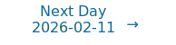

# Personalized Daily ArXiv Papers 2026-02-10

| *[gpt-5]*   | Prompt   | Completion   | Total   |
|:-----------:|:--------:|:------------:|:-------:|
| **Token**   | 114967   | 94525        | 209492  |
| **Cost**    | $0.14    | $0.95        | $1.09   |

Total arXiv papers: 1425

Total scanned papers: 852

Total relevant papers: 82

**Table of contents with paper titles:**

1. [When Benign Inputs Lead to Severe Harms: Eliciting Unsafe Unintended Behaviors of Computer-Use Agents](#user-content-link1)
**Authors:** Jaylen Jones, Zhehao Zhang, Yuting Ning, Eric Fosler-Lussier, Pierre-Luc St-Charles, Yoshua Bengio, Dawn Song, Yu Su, Huan Sun

2. [stable-worldmodel-v1: Reproducible World Modeling Research and Evaluation](#user-content-link2)
**Authors:** Lucas Maes, Quentin Le Lidec, Dan Haramati, Nassim Massaudi, Damien Scieur, Yann LeCun, Randall Balestriero

3. [From $O(mn)$ to $O(r^2)$: Two-Sided Low-Rank Communication for Adam in Distributed Training with Memory Efficiency](#user-content-link3)
**Authors:** Sizhe Dang, Jiaqi Shao, Xiaodong Zheng, Guang Dai, Yan Song, Haishan Ye

4. [Free Energy Mixer](#user-content-link4)
**Authors:** Jiecheng Lu, Shihao Yang

5. [DeltaKV: Residual-Based KV Cache Compression via Long-Range Similarity](#user-content-link5)
**Authors:** Jitai Hao, Qiang Huang, Yaowei Wang, Min Zhang, Jun Yu

6. [FlattenGPT: Depth Compression for Transformer with Layer Flattening](#user-content-link6)
**Authors:** Ruihan Xu, Qingpei Guo, Yao Zhu, Xiangyang Ji, Ming Yang, Shiliang Zhang

7. [Fast Model Selection and Stable Optimization for Softmax-Gated Multinomial-Logistic Mixture of Experts Models](#user-content-link7)
**Authors:** TrungKhang Tran, TrungTin Nguyen, Md Abul Bashar, Nhat Ho, Richi Nayak, Christopher Drovandi

8. [ParisKV: Fast and Drift-Robust KV-Cache Retrieval for Long-Context LLMs](#user-content-link8)
**Authors:** Yanlin Qi, Xinhang Chen, Huiqiang Jiang, Qitong Wang, Botao Peng, Themis Palpanas

9. [Near-Oracle KV Selection via Pre-hoc Sparsity for Long-Context Inference](#user-content-link9)
**Authors:** Yifei Gao, Lei Wang, Rong-Cheng Tu, Qixin Zhang, Jun Cheng, Dacheng Tao

10. [DirMoE: Dirichlet-routed Mixture of Experts](#user-content-link10)
**Authors:** Amirhossein Vahidi, Hesam Asadollahzadeh, Navid Akhavan Attar, Marie Moullet, Kevin Ly, Xingyi Yang, Mohammad Lotfollahi

11. [Spectral Gating Networks](#user-content-link11)
**Authors:** Jusheng Zhang, Yijia Fan, Kaitong Cai, Jing Yang, Yongsen Zheng, Kwok-Yan Lam, Liang Lin, Keze Wang

12. [Free(): Learning to Forget in Malloc-Only Reasoning Models](#user-content-link12)
**Authors:** Yilun Zheng, Dongyang Ma, Tian Liang, Jiahao Xu, Xinting Huang, Lijie Chen, Haitao Mi, Yan Wang

13. [Astro: Activation-guided Structured Regularization for Outlier-Robust LLM Post-Training Quantization](#user-content-link13)
**Authors:** Xi Chen, Ming Li, Junxi Li, Changsheng Li, Peisong Wang, Lizhong Ding, Ye Yuan, Guoren Wang

14. [SERE: Similarity-based Expert Re-routing for Efficient Batch Decoding in MoE Models](#user-content-link14)
**Authors:** Juntong Wu, Jialiang Cheng, Fuyu Lv, Ou Dan, Li Yuan

15. [XShare: Collaborative in-Batch Expert Sharing for Faster MoE Inference](#user-content-link15)
**Authors:** Daniil Vankov, Nikita Ivkin, Kyle Ulrich, Xiang Song, Ashish Khetan, George Karypis

16. [Prism: Spectral-Aware Block-Sparse Attention](#user-content-link16)
**Authors:** Xinghao Wang, Pengyu Wang, Xiaoran Liu, Fangxu Liu, Jason Chu, Kai Song, Xipeng Qiu

17. [LUCID-SAE: Learning Unified Vision-Language Sparse Codes for Interpretable Concept Discovery](#user-content-link17)
**Authors:** Difei Gu, Yunhe Gao, Gerasimos Chatzoudis, Zihan Dong, Guoning Zhang, Bangwei Guo, Yang Zhou, Mu Zhou, Dimitris Metaxas

18. [DynamiQ: Accelerating Gradient Synchronization using Compressed Multi-hop All-reduce](#user-content-link18)
**Authors:** Wenchen Han, Shay Vargaftik, Michael Mitzenmacher, Ran Ben Basat

19. [Hyperparameter Transfer Laws for Non-Recurrent Multi-Path Neural Networks](#user-content-link19)
**Authors:** Shenxi Wu, Haosong Zhang, Xingjian Ma, Shirui Bian, Yichi Zhang, Xi Chen, Wei Lin

20. [Dense Neural Networks are not Universal Approximators](#user-content-link20)
**Authors:** Levi Rauchwerger, Stefanie Jegelka, Ron Levie

21. [Constructive conditional normalizing flows](#user-content-link21)
**Authors:** Borjan Geshkovski, Dom\`enec Ruiz-Balet

22. [ARO: A New Lens On Matrix Optimization For Large Models](#user-content-link22)
**Authors:** Wenbo Gong, Javier Zazo, Qijun Luo, Puqian Wang, James Hensman, Chao Ma

23. [Radial M\"untz-Sz\'asz Networks: Neural Architectures with Learnable Power Bases for Multidimensional Singularities](#user-content-link23)
**Authors:** Gnankan Landry Regis N'guessan, Bum Jun Kim

24. [BitLogic: Training Framework for Gradient-Based FPGA-Native Neural Networks](#user-content-link24)
**Authors:** Simon B\"uhrer, Andreas Plesner, Aczel Till, Roger Wattenhofer

25. [ANCRe: Adaptive Neural Connection Reassignment for Efficient Depth Scaling](#user-content-link25)
**Authors:** Yilang Zhang, Bingcong Li, Niao He, Georgios B. Giannakis

26. [StretchTime: Adaptive Time Series Forecasting via Symplectic Attention](#user-content-link26)
**Authors:** Yubin Kim, Viresh Pati, Jevon Twitty, Vinh Pham, Shihao Yang, Jiecheng Lu

27. [SiameseNorm: Breaking the Barrier to Reconciling Pre/Post-Norm](#user-content-link27)
**Authors:** Tianyu Li, Dongchen Han, Zixuan Cao, Haofeng Huang, Mengyu Zhou, Ming Chen, Erchao Zhao, Xiaoxi Jiang, Guanjun Jiang, Gao Huang

28. [Discovering Interpretable Algorithms by Decompiling Transformers to RASP](#user-content-link28)
**Authors:** Xinting Huang, Aleksandra Bakalova, Satwik Bhattamishra, William Merrill, Michael Hahn

29. [Noise Stability of Transformer Models](#user-content-link29)
**Authors:** Themistoklis Haris, Zihan Zhang, Yuichi Yoshida

30. [Improving Variable-Length Generation in Diffusion Language Models via Length Regularization](#user-content-link30)
**Authors:** Zicong Cheng, Ruixuan Jia, Jia Li, Guo-Wei Yang, Meng-Hao Guo, Shi-Min Hu

31. [V-ABFT: Variance-Based Adaptive Threshold for Fault-Tolerant Matrix Multiplication in Mixed-Precision Deep Learning](#user-content-link31)
**Authors:** Yiheng Gao, Qin Hua, Zizhong Chen

32. [Gaussian Match-and-Copy: A Minimalist Benchmark for Studying Transformer Induction](#user-content-link32)
**Authors:** Antoine Gonon, Alexandre Cordonnier, Nicolas Boumal

33. [OJBKQ: Objective-Joint Babai-Klein Quantization](#user-content-link33)
**Authors:** Xinyu Wang, Ziyu Zhao, Peng Lu, Yu Gu, Xiao-Wen Chang

34. [Dichotomy of Feature Learning and Unlearning: Fast-Slow Analysis on Neural Networks with Stochastic Gradient Descent](#user-content-link34)
**Authors:** Shota Imai, Sota Nishiyama, Masaaki Imaizumi

35. [Efficient Post-Training Pruning of Large Language Models with Statistical Correction](#user-content-link35)
**Authors:** Peiqi Yu, Jinhao Wang, Xinyi Sui, Nam Ling, Wei Wang, Wei Jiang

36. [On the Importance of a Multi-Scale Calibration for Quantization](#user-content-link36)
**Authors:** Seungwoo Son, Ingyu Seong, Junhan Kim, Hyemi Jang, Yongkweon Jeon

37. [CompilerKV: Risk-Adaptive KV Compression via Offline Experience Compilation](#user-content-link37)
**Authors:** Ning Yang, Chengzhi Wang, Yibo Liu, Baoliang Tian, Haijun Zhang

38. [ManifoldKV: Training-Free KV Cache Compression via Euclidean Outlier Detection](#user-content-link38)
**Authors:** Debajyoti Datta, Trishala Neeraj, Bibek Paudel, Vyom Sharma, Subhabrata Mukherjee

39. [QUOKA: Query-Oriented KV Selection For Efficient LLM Prefill](#user-content-link39)
**Authors:** Dalton Jones, Junyoung Park, Matthew Morse, Mingu Lee, Chris Lott, Harper Langston

40. [Diffusion-Inspired Reconfiguration of Transformers for Uncertainty Calibration](#user-content-link40)
**Authors:** Manh Cuong Dao, Quang Hung Pham, Phi Le Nguyen, Thao Nguyen Truong, Bryan Kian Hsiang Low, Trong Nghia Hoang

41. [Pruning as a Cooperative Game: Surrogate-Assisted Layer Contribution Estimation for Large Language Models](#user-content-link41)
**Authors:** Xuan Ding, Pengyu Tong, Ranjie Duan, Yunjian Zhang, Rui Sun, Yao Zhu

42. [FlashVID: Efficient Video Large Language Models via Training-free Tree-based Spatiotemporal Token Merging](#user-content-link42)
**Authors:** Ziyang Fan, Keyu Chen, Ruilong Xing, Yulin Li, Li Jiang, Zhuotao Tian

43. [Parallel Track Transformers: Enabling Fast GPU Inference with Reduced Synchronization](#user-content-link43)
**Authors:** Chong Wang, Nan Du, Tom Gunter, Tao Lei, Kulin Seth, Senyu Tong, Jianyu Wang, Guoli Yin, Xiyou Zhou, Kelvin Zou, Ruoming Pang

44. [ODELoRA: Training Low-Rank Adaptation by Solving Ordinary Differential Equations](#user-content-link44)
**Authors:** Yihang Gao, Vincent Y. F. Tan

45. [FlexMoRE: A Flexible Mixture of Rank-heterogeneous Experts for Efficient Federatedly-trained Large Language Models](#user-content-link45)
**Authors:** Annemette Brok Pirchert, Jacob Nielsen, Mogens Henrik From, Lukas Galke Poech, Peter Schneider-Kamp

46. [Predicting Future Utility: Global Combinatorial Optimization for Task-Agnostic KV Cache Eviction](#user-content-link46)
**Authors:** Ziyao Tang, Pengkun Jiao, Xinhang Chen, Wei Liu, Shiyong Li, Jingjing Chen

47. [tLoRA: Efficient Multi-LoRA Training with Elastic Shared Super-Models](#user-content-link47)
**Authors:** Kevin Li, Dibyadeep Saha, Avni Kanodia, Fan Lai

48. [SpecAttn: Co-Designing Sparse Attention with Self-Speculative Decoding](#user-content-link48)
**Authors:** Yikang Yue, Yuqi Xue, Jian Huang

49. [A Thermodynamic Theory of Learning Part II: Critical Period Closure and Continual Learning Failure](#user-content-link49)
**Authors:** Daisuke Okanohara

50. [Latent Reasoning with Supervised Thinking States](#user-content-link50)
**Authors:** Ido Amos, Avi Caciularu, Mor Geva, Amir Globerson, Jonathan Herzig, Lior Shani, Idan Szpektor

51. [LatentChem: From Textual CoT to Latent Thinking in Chemical Reasoning](#user-content-link51)
**Authors:** Xinwu Ye, Yicheng Mao, Jia Zhang, Yimeng Liu, Li Hao, Fang Wu, Zhiwei Li, Yuxuan Liao, Zehong Wang, Zhiyuan Liu, Zhenfei Yin, Li Yuan, Philip Torr, Huan Sun, Xiangxiang Zeng, Mengdi Wang, Le Cong, Shenghua Gao, Xiangru Tang

52. [Riemannian MeanFlow](#user-content-link52)
**Authors:** Dongyeop Woo, Marta Skreta, Seonghyun Park, Sungsoo Ahn, Kirill Neklyudov

53. [Physical Analog Kolmogorov-Arnold Networks based on Reconfigurable Nonlinear-Processing Units](#user-content-link53)
**Authors:** Manuel Escudero, Mohamadreza Zolfagharinejad, Sjoerd van den Belt, Nikolaos Alachiotis, Wilfred G. van der Wiel

54. [Escaping Spectral Bias without Backpropagation: Fast Implicit Neural Representations with Extreme Learning Machines](#user-content-link54)
**Authors:** Woojin Cho, Junghwan Park

55. [Featured Reproducing Kernel Banach Spaces for Learning and Neural Networks](#user-content-link55)
**Authors:** Isabel de la Higuera, Francisco Herrera, M. Victoria Velasco

56. [Deriving Neural Scaling Laws from the statistics of natural language](#user-content-link56)
**Authors:** Francesco Cagnetta, Allan Ravent\'os, Surya Ganguli, Matthieu Wyart

57. [A Graphop Analysis of Graph Neural Networks on Sparse Graphs: Generalization and Universal Approximation](#user-content-link57)
**Authors:** Ofek Amran, Tom Gilat, Ron Levie

58. [On the Infinite Width and Depth Limits of Predictive Coding Networks](#user-content-link58)
**Authors:** Francesco Innocenti, El Mehdi Achour, Rafal Bogacz

59. [Emergent Structured Representations Support Flexible In-Context Inference in Large Language Models](#user-content-link59)
**Authors:** Ningyu Xu, Qi Zhang, Xipeng Qiu, Xuanjing Huang

60. [Towards Robust Scaling Laws for Optimizers](#user-content-link60)
**Authors:** Alexandra Volkova, Mher Safaryan, Christoph H. Lampert, Dan Alistarh

61. [Sparsity-Aware Evolution for Model Merging](#user-content-link61)
**Authors:** Huan Zhang, Yanjian Zhang, Guillaume Wisniewski, Nadi Tomeh, Bang Liu

62. [Compiler-Assisted Speculative Sampling for Accelerated LLM Inference on Heterogeneous Edge Devices](#user-content-link62)
**Authors:** Alejandro Ruiz y Mesa, Guilherme Korol, Moritz Riesteter, Jo\~ao Paulo Cardoso de Lima, Jeronimo Castrillon

63. [HypRAG: Hyperbolic Dense Retrieval for Retrieval Augmented Generation](#user-content-link63)
**Authors:** Hiren Madhu, Ngoc Bui, Ali Maatouk, Leandros Tassiulas, Smita Krishnaswamy, Menglin Yang, Sukanta Ganguly, Kiran Srinivasan, Rex Ying

64. [Time-Delayed Transformers for Data-Driven Modeling of Low-Dimensional Dynamics](#user-content-link64)
**Authors:** Albert Alcalde, Markus Widhalm, Emre Y{\i}lmaz

65. [Towards Understanding Multimodal Fine-Tuning: Spatial Features](#user-content-link65)
**Authors:** Lachin Naghashyar, Hunar Batra, Ashkan Khakzar, Philip Torr, Ronald Clark, Christian Schroeder de Witt, Constantin Venhoff

66. [Understanding Dynamic Compute Allocation in Recurrent Transformers](#user-content-link66)
**Authors:** Ibraheem Muhammad Moosa, Suhas Lohit, Ye Wang, Moitreya Chatterjee, Wenpeng Yin

67. [Sparse Models, Sparse Safety: Unsafe Routes in Mixture-of-Experts LLMs](#user-content-link67)
**Authors:** Yukun Jiang, Hai Huang, Mingjie Li, Yage Zhang, Michael Backes, Yang Zhang

68. [The Confidence Manifold: Geometric Structure of Correctness Representations in Language Models](#user-content-link68)
**Authors:** Seonglae Cho, Zekun Wu, Kleyton Da Costa, Adriano Koshiyama

69. [Convex Dominance in Deep Learning I: A Scaling Law of Loss and Learning Rate](#user-content-link69)
**Authors:** Zhiqi Bu, Shiyun Xu, Jialin Mao

70. [M-Loss: Quantifying Model Merging Compatibility with Limited Unlabeled Data](#user-content-link70)
**Authors:** Tiantong Wang, Yiyang Duan, Haoyu Chen, Tiantong Wu, Wei Yang Bryan Lim

71. [Steer2Adapt: Dynamically Composing Steering Vectors Elicits Efficient Adaptation of LLMs](#user-content-link71)
**Authors:** Pengrui Han, Xueqiang Xu, Keyang Xuan, Peiyang Song, Siru Ouyang, Runchu Tian, Yuqing Jiang, Cheng Qian, Pengcheng Jiang, Jiashuo Sun, Junxia Cui, Ming Zhong, Ge Liu, Jiawei Han, Jiaxuan You

72. [Interpreting Physics in Video World Models](#user-content-link72)
**Authors:** Sonia Joseph, Quentin Garrido, Randall Balestriero, Matthew Kowal, Thomas Fel, Shahab Bakhtiari, Blake Richards, Mike Rabbat

73. [The Median is Easier than it Looks: Approximation with a Constant-Depth, Linear-Width ReLU Network](#user-content-link73)
**Authors:** Abhigyan Dutta, Itay Safran, Paul Valiant

74. [Next Concept Prediction in Discrete Latent Space Leads to Stronger Language Models](#user-content-link74)
**Authors:** Yuliang Liu, Yunchong Song, Yixuan Wang, Kewen Ge, Alex Lamb, Qipeng Guo, Kai Chen, Bowen Zhou, Zhouhan Lin

75. [Linearization Explains Fine-Tuning in Large Language Models](#user-content-link75)
**Authors:** Zahra Rahimi Afzal, Tara Esmaeilbeig, Mojtaba Soltanalian, Mesrob I. Ohannessian

76. [Mutual information and task-relevant latent dimensionality](#user-content-link76)
**Authors:** Paarth Gulati, Eslam Abdelaleem, Audrey Sederberg, Ilya Nemenman

77. [Regime Change Hypothesis: Foundations for Decoupled Dynamics in Neural Network Training](#user-content-link77)
**Authors:** Cristian P\'erez-Corral, Alberto Fern\'andez-Hern\'andez, Jose I. Mestre, Manuel F. Dolz, Jose Duato, Enrique S. Quintana-Ort\'i

78. [Your Language Model Secretly Contains Personality Subnetworks](#user-content-link78)
**Authors:** Ruimeng Ye, Zihan Wang, Zinan Ling, Yang Xiao, Manling Li, Xiaolong Ma, Bo Hui

79. [LQA: A Lightweight Quantized-Adaptive Framework for Vision-Language Models on the Edge](#user-content-link79)
**Authors:** Xin Wang, Hualin Zhou, Sheng Guang Wang, Ting Dang, Yu Zhang, Hong Jia, Tao Gu

80. [CauScale: Neural Causal Discovery at Scale](#user-content-link80)
**Authors:** Bo Peng, Sirui Chen, Jiaguo Tian, Yu Qiao, Chaochao Lu

81. [Modality Gap-Driven Subspace Alignment Training Paradigm For Multimodal Large Language Models](#user-content-link81)
**Authors:** Xiaomin Yu, Yi Xin, Wenjie Zhang, Chonghan Liu, Hanzhen Zhao, Xiaoxing Hu, Xinlei Yu, Ziyue Qiao, Hao Tang, Xue Yang, Xiaobin Hu, Chengwei Qin, Hui Xiong, Yu Qiao, Shuicheng Yan

82. [Emergent Misalignment is Easy, Narrow Misalignment is Hard](#user-content-link82)
**Authors:** Anna Soligo, Edward Turner, Senthooran Rajamanoharan, Neel Nanda

---

## 1. [When Benign Inputs Lead to Severe Harms: Eliciting Unsafe Unintended Behaviors of Computer-Use Agents](https://arxiv.org/abs/2602.08235) 

**ArXiv ID:** 2602.08235

**Authors:** Jaylen Jones, Zhehao Zhang, Yuting Ning, Eric Fosler-Lussier, Pierre-Luc St-Charles, Yoshua Bengio, Dawn Song, Yu Su, Huan Sun

**Abstract:** Although computer-use agents (CUAs) hold significant potential to automate increasingly complex OS workflows, they can demonstrate unsafe unintended behaviors that deviate from expected outcomes even under benign input contexts. However, exploration of this risk remains largely anecdotal, lacking concrete characterization and automated methods to proactively surface long-tail unintended behaviors under realistic CUA scenarios. To fill this gap, we introduce the first conceptual and methodological framework for unintended CUA behaviors, by defining their key characteristics, automatically eliciting them, and analyzing how they arise from benign inputs. We propose AutoElicit: an agentic framework that iteratively perturbs benign instructions using CUA execution feedback, and elicits severe harms while keeping perturbations realistic and benign. Using AutoElicit, we surface hundreds of harmful unintended behaviors from state-of-the-art CUAs such as Claude 4.5 Haiku and Opus. We further evaluate the transferability of human-verified successful perturbations, identifying persistent susceptibility to unintended behaviors across various other frontier CUAs. This work establishes a foundation for systematically analyzing unintended behaviors in realistic computer-use settings.

**Comment:** Author match

---

## 2. [stable-worldmodel-v1: Reproducible World Modeling Research and Evaluation](https://arxiv.org/abs/2602.08968) 

**ArXiv ID:** 2602.08968

**Authors:** Lucas Maes, Quentin Le Lidec, Dan Haramati, Nassim Massaudi, Damien Scieur, Yann LeCun, Randall Balestriero

**Abstract:** World Models have emerged as a powerful paradigm for learning compact, predictive representations of environment dynamics, enabling agents to reason, plan, and generalize beyond direct experience. Despite recent interest in World Models, most available implementations remain publication-specific, severely limiting their reusability, increasing the risk of bugs, and reducing evaluation standardization. To mitigate these issues, we introduce stable-worldmodel (SWM), a modular, tested, and documented world-model research ecosystem that provides efficient data-collection tools, standardized environments, planning algorithms, and baseline implementations. In addition, each environment in SWM enables controllable factors of variation, including visual and physical properties, to support robustness and continual learning research. Finally, we demonstrate the utility of SWM by using it to study zero-shot robustness in DINO-WM.

**Comment:** Author match

---

## 3. [From $O(mn)$ to $O(r^2)$: Two-Sided Low-Rank Communication for Adam in Distributed Training with Memory Efficiency](https://arxiv.org/abs/2602.08007) 

**ArXiv ID:** 2602.08007

**Authors:** Sizhe Dang, Jiaqi Shao, Xiaodong Zheng, Guang Dai, Yan Song, Haishan Ye

**Abstract:** As foundation models continue to scale, pretraining increasingly relies on data-parallel distributed optimization, making bandwidth-limited gradient synchronization a key bottleneck. Orthogonally, projection-based low-rank optimizers were mainly designed for memory efficiency, but remain suboptimal for communication-limited training: one-sided synchronization still transmits an $O(rn)$ object for an $m\times n$ matrix gradient and refresh steps can dominate peak communicated bytes. We propose TSR, which brings two-sided low-rank communication to Adam-family updates (TSR-Adam) by synchronizing a compact core $U^\top G V\in\mathbb{R}^{r\times r}$, reducing the dominant per-step payload from $O(mn)$ to $O(r^2)$ while keeping moment states in low-dimensional cores. To further reduce the peak communication from subspace refresh, TSR-Adam adopts a randomized SVD-based refresh that avoids full-gradient synchronization. We additionally extend low-rank communication to embedding gradients with embedding-specific ranks and refresh schedules, yielding additional communication and memory savings over keeping embeddings dense. Across pretraining from 60M to 1B model scales, TSR-Adam reduces average communicated bytes per step by $13\times$, and on GLUE fine-tuning it reduces communication by $25\times$, while achieving comparable performance; we further provide a theoretical stationarity analysis for the proposed update. Code is available at https://github.com/DKmiyan/TSR-Adam.

**Comment:** High Performance Computing/Compression: two-sided low-rank communication for Adam (sync U^T G V) reduces payload from O(mn) to O(r^2), with randomized refresh avoiding full-gradient sync; embedding-specific ranks further cut cost.

**Relevance:** 10
**Novelty:** 9

---

## 4. [Free Energy Mixer](https://arxiv.org/abs/2602.07160) 

**ArXiv ID:** 2602.07160

**Authors:** Jiecheng Lu, Shihao Yang

**Abstract:** Standard attention stores keys/values losslessly but reads them via a per-head convex average, blocking channel-wise selection. We propose the Free Energy Mixer (FEM): a free-energy (log-sum-exp) read that applies a value-driven, per-channel log-linear tilt to a fast prior (e.g., from queries/keys in standard attention) over indices. Unlike methods that attempt to improve and enrich the $(q,k)$ scoring distribution, FEM treats it as a prior and yields a value-aware posterior read at unchanged complexity, smoothly moving from averaging to per-channel selection as the learnable inverse temperature increases, while still preserving parallelism and the original asymptotic complexity ($O(T^2)$ for softmax; $O(T)$ for linearizable variants). We instantiate a two-level gated FEM that is plug-and-play with standard and linear attention, linear RNNs and SSMs. It consistently outperforms strong baselines on NLP, vision, and time-series at matched parameter budgets.

**Comment:** Model Architecture: Free Energy Mixer replaces convex attention read with per-channel log-sum-exp tilt enabling channel-wise selection at same complexity.

**Relevance:** 10
**Novelty:** 8

---

## 5. [DeltaKV: Residual-Based KV Cache Compression via Long-Range Similarity](https://arxiv.org/abs/2602.08005) 

**ArXiv ID:** 2602.08005

**Authors:** Jitai Hao, Qiang Huang, Yaowei Wang, Min Zhang, Jun Yu

**Abstract:** The deployment of efficient long-context LLMs in applications like autonomous agents, long-chain reasoning, and creative writing is fundamentally bottlenecked by the linear growth of KV cache memory. Existing compression and eviction methods often struggle to balance accuracy, compression ratio, and hardware efficiency. We propose DeltaKV, a residual-based KV cache compression framework motivated by two empirical findings: long-range inter-token similarity and highly shared latent components in KV representations. Instead of discarding tokens, DeltaKV encodes semantic residuals relative to retrieved historical references, preserving fidelity while substantially reducing storage. To translate compression gains into real system speedups, we further introduce Sparse-vLLM, a high-performance inference engine with decoupled memory management and kernels optimized for sparse and irregular KV layouts. Experiments show that DeltaKV reduces KV cache memory to 29\% of the original while maintaining near-lossless accuracy on LongBench, SCBench, and AIME. When integrated with Sparse-vLLM, it achieves up to 2$\times$ throughput improvement over vLLM in long-context scenarios, demonstrating a practical path toward scalable long-context LLM deployment. Code, model checkpoints, and datasets are available at https://github.com/CURRENTF/Sparse-vLLM.

**Comment:** Compression/Efficiency: residual-based KV cache compression exploiting long-range similarity plus a sparse-aware inference engine (Sparse-vLLM) for real speedups.

**Relevance:** 10
**Novelty:** 8

---

## 6. [FlattenGPT: Depth Compression for Transformer with Layer Flattening](https://arxiv.org/abs/2602.08858) 

**ArXiv ID:** 2602.08858

**Authors:** Ruihan Xu, Qingpei Guo, Yao Zhu, Xiangyang Ji, Ming Yang, Shiliang Zhang

**Abstract:** Recent works have indicated redundancy across transformer blocks, prompting the research of depth compression to prune less crucial blocks. However, current ways of entire-block pruning suffer from risks of discarding meaningful cues learned in those blocks, leading to substantial performance degradation. As another line of model compression, channel pruning can better preserve performance, while it cannot reduce model depth and is challenged by inconsistent pruning ratios for individual layers. To pursue better model compression and acceleration, this paper proposes \textbf{FlattenGPT}, a novel way to detect and reduce depth-wise redundancies. By flatting two adjacent blocks into one, it compresses the network depth, meanwhile enables more effective parameter redundancy detection and removal. FlattenGPT allows to preserve the knowledge learned in all blocks, and remains consistent with the original transformer architecture. Extensive experiments demonstrate that FlattenGPT enhances model efficiency with a decent trade-off to performance. It outperforms existing pruning methods in both zero-shot accuracies and WikiText-2 perplexity across various model types and parameter sizes. On LLaMA-2/3 and Qwen-1.5 models, FlattenGPT retains 90-96\% of zero-shot performance with a compression ratio of 20\%. It also outperforms other pruning methods in accelerating LLM inference, making it promising for enhancing the efficiency of transformers.

**Comment:** Compression: depth compression via layer flattening that merges adjacent Transformer blocks to remove redundancy while preserving knowledge.

**Relevance:** 10
**Novelty:** 8

---

## 7. [Fast Model Selection and Stable Optimization for Softmax-Gated Multinomial-Logistic Mixture of Experts Models](https://arxiv.org/abs/2602.07997) 

**ArXiv ID:** 2602.07997

**Authors:** TrungKhang Tran, TrungTin Nguyen, Md Abul Bashar, Nhat Ho, Richi Nayak, Christopher Drovandi

**Abstract:** Mixture-of-Experts (MoE) architectures combine specialized predictors through a learned gate and are effective across regression and classification, but for classification with softmax multinomial-logistic gating, rigorous guarantees for stable maximum-likelihood training and principled model selection remain limited. We address both issues in the full-data (batch) regime. First, we derive a batch minorization-maximization (MM) algorithm for softmax-gated multinomial-logistic MoE using an explicit quadratic minorizer, yielding coordinate-wise closed-form updates that guarantee monotone ascent of the objective and global convergence to a stationary point (in the standard MM sense), avoiding approximate M-steps common in EM-type implementations. Second, we prove finite-sample rates for conditional density estimation and parameter recovery, and we adapt dendrograms of mixing measures to the classification setting to obtain a sweep-free selector of the number of experts that achieves near-parametric optimal rates after merging redundant fitted atoms. Experiments on biological protein--protein interaction prediction validate the full pipeline, delivering improved accuracy and better-calibrated probabilities than strong statistical and machine-learning baselines.

**Comment:** MoE Architecture/Theory: stable batch MM algorithm with convergence guarantees for softmax-gated multinomial-logistic MoE; finite-sample rates and near-optimal expert selection.

**Relevance:** 10
**Novelty:** 8

---

## 8. [ParisKV: Fast and Drift-Robust KV-Cache Retrieval for Long-Context LLMs](https://arxiv.org/abs/2602.07721) 

**ArXiv ID:** 2602.07721

**Authors:** Yanlin Qi, Xinhang Chen, Huiqiang Jiang, Qitong Wang, Botao Peng, Themis Palpanas

**Abstract:** KV-cache retrieval is essential for long-context LLM inference, yet existing methods struggle with distribution drift and high latency at scale. We introduce ParisKV, a drift-robust, GPU-native KV-cache retrieval framework based on collision-based candidate selection, followed by a quantized inner-product reranking estimator. For million-token contexts, ParisKV supports CPU-offloaded KV caches via Unified Virtual Addressing (UVA), enabling on-demand top-$k$ fetching with minimal overhead. ParisKV matches or outperforms full attention quality on long-input and long-generation benchmarks. It achieves state-of-the-art long-context decoding efficiency: it matches or exceeds full attention speed even at batch size 1 for long contexts, delivers up to 2.8$\times$ higher throughput within full attention's runnable range, and scales to million-token contexts where full attention runs out of memory. At million-token scale, ParisKV reduces decode latency by 17$\times$ and 44$\times$ compared to MagicPIG and PQCache, respectively, two state-of-the-art KV-cache Top-$k$ retrieval baselines.

**Comment:** Efficiency/Systems: drift-robust GPU-native KV-cache top-k retrieval with collision candidates and quantized reranking; supports UVA offloading and million-token contexts.

**Relevance:** 10
**Novelty:** 8

---

## 9. [Near-Oracle KV Selection via Pre-hoc Sparsity for Long-Context Inference](https://arxiv.org/abs/2602.08329) 

**ArXiv ID:** 2602.08329

**Authors:** Yifei Gao, Lei Wang, Rong-Cheng Tu, Qixin Zhang, Jun Cheng, Dacheng Tao

**Abstract:** A core bottleneck in large language model (LLM) inference is the cost of attending over the ever-growing key-value (KV) cache. Although near-oracle top-k KV selection can preserve the quality of dense attention while sharply reducing computation and bandwidth, existing sparse methods generally rely on posterior heuristics, i.e., selectors conditioned on observed attention or proxy scores. Such conditioning introduces posterior bias: it tends to distort true token importance and miss salient tokens, thereby impairing long-range reasoning. To tackle this problem, we propose Pre-hoc Sparsity (PrHS), which selects KV entries before attention scoring and provides explicit accuracy control. Let the attention mass of discarded entries be delta (the dropped mass). Through a marginal-to-mutual-information analysis, we derive an upper bound on the mutual-information loss that depends only on the dropped mass. This relation explains failure modes of posterior heuristics and enables verifiable guarantees by controlling the dropped mass in advance. Within PrHS, we instantiate three orthogonal pre-hoc selectors along the axes of time, depth, and layer. Extensive experiments on LLaMA and Mistral families validate PrHS. Across GSM8K and CoQA, PrHS reduces retrieval overhead by over 90%, achieving 3x higher retrieval sparsity than HShare at matched or better accuracy. It incurs under 1% average degradation on LongBench, lowers attention FLOPs by about 15% versus prior sparse baselines, and yields a 9.9x speedup in attention-operator latency and 2.8x higher throughput on NVIDIA A100-80GB GPUs than the dense baseline.

**Comment:** Model Compression and Efficiency: pre-hoc KV cache sparsity with MI-based accuracy guarantees and multi-axis selectors.

**Relevance:** 10
**Novelty:** 8

---

## 10. [DirMoE: Dirichlet-routed Mixture of Experts](https://arxiv.org/abs/2602.09001) 

**ArXiv ID:** 2602.09001

**Authors:** Amirhossein Vahidi, Hesam Asadollahzadeh, Navid Akhavan Attar, Marie Moullet, Kevin Ly, Xingyi Yang, Mohammad Lotfollahi

**Abstract:** Mixture-of-Experts (MoE) models have demonstrated exceptional performance in large-scale language models. Existing routers typically rely on non-differentiable Top-$k$+Softmax, limiting their performance and scalability. We argue that two distinct decisions, which experts to activate and how to distribute expert contributions among them, are conflated in standard Top-$k$+Softmax. We introduce Dirichlet-Routed MoE (DirMoE), a novel end-to-end differentiable routing mechanism built on a Dirichlet variational autoencoder framework. This design fundamentally disentangles the core routing problems: expert selection, modeled by a Bernoulli component, and expert contribution among chosen experts, handled by a Dirichlet component. The entire forward pass remains fully differentiable through the use of Gumbel-Sigmoid relaxation for the expert selection and implicit reparameterization for the Dirichlet distribution. Our training objective, a variational ELBO, includes a direct sparsity penalty that precisely controls the number of active experts in expectation, alongside a schedule for key hyperparameters that guides the model from an exploratory to a definitive routing state. Moreover, our DirMoE router matches or exceeds other methods while improving expert specialization.

**Comment:** Model Architecture: Mixture-of-Experts with differentiable Dirichlet/Bernoulli routing (DirMoE) decoupling selection and contribution.

**Relevance:** 10
**Novelty:** 8

---

## 11. [Spectral Gating Networks](https://arxiv.org/abs/2602.07679) 

**ArXiv ID:** 2602.07679

**Authors:** Jusheng Zhang, Yijia Fan, Kaitong Cai, Jing Yang, Yongsen Zheng, Kwok-Yan Lam, Liang Lin, Keze Wang

**Abstract:** Gating mechanisms are ubiquitous, yet a complementary question in feed-forward networks remains under-explored: how to introduce frequency-rich expressivity without sacrificing stability and scalability? This tension is exposed by spline-based Kolmogorov-Arnold Network (KAN) parameterizations, where grid refinement can induce parameter growth and brittle optimization in high dimensions. To propose a stability-preserving way to inject spectral capacity into existing MLP/FFN layers under fixed parameter and training budgets, we introduce Spectral Gating Networks (SGN), a drop-in spectral reparameterization. SGN augments a standard activation pathway with a compact spectral pathway and learnable gates that allow the model to start from a stable base behavior and progressively allocate capacity to spectral features during training. The spectral pathway is instantiated with trainable Random Fourier Features (learned frequencies and phases), replacing grid-based splines and removing resolution dependence. A hybrid GELU-Fourier formulation further improves optimization robustness while enhancing high-frequency fidelity. Across vision, NLP, audio, and PDE benchmarks, SGN consistently improves accuracy-efficiency trade-offs under comparable computational budgets, achieving 93.15% accuracy on CIFAR-10 and up to 11.7x faster inference than spline-based KAN variants. Code and trained models will be released.

**Comment:** Model Architecture: Spectral Gating Networks add a compact learnable Fourier pathway with gates to FFN/MLP layers under fixed budgets.

**Relevance:** 10
**Novelty:** 8

---

## 12. [Free(): Learning to Forget in Malloc-Only Reasoning Models](https://arxiv.org/abs/2602.08030) 

**ArXiv ID:** 2602.08030

**Authors:** Yilun Zheng, Dongyang Ma, Tian Liang, Jiahao Xu, Xinting Huang, Lijie Chen, Haitao Mi, Yan Wang

**Abstract:** Reasoning models enhance problem-solving by scaling test-time compute, yet they face a critical paradox: excessive thinking tokens often degrade performance rather than improve it. We attribute this to a fundamental architectural flaw: standard LLMs operate as "malloc-only" engines, continuously accumulating valid and redundant steps alike without a mechanism to prune obsolete information. To break this cycle, we propose Free()LM, a model that introduces an intrinsic self-forgetting capability via the Free-Module, a plug-and-play LoRA adapter. By iteratively switching between reasoning and cleaning modes, Free()LM dynamically identifies and prunes useless context chunks, maintaining a compact and noise-free state.   Extensive experiments show that Free()LM provides consistent improvements across all model scales (8B to 685B). It achieves a 3.3% average improvement over top-tier reasoning baselines, even establishing a new SOTA on IMOanswerBench using DeepSeek V3.2-Speciale. Most notably, in long-horizon tasks where the standard Qwen3-235B-A22B model suffers a total collapse (0% accuracy), Free()LM restores performance to 50%. Our findings suggest that sustainable intelligence requires the freedom to forget as much as the power to think.

**Comment:** Model Architecture/Efficiency: plug-and-play Free-Module (LoRA) enabling self-forgetting to prune useless context during reasoning.

**Relevance:** 9
**Novelty:** 9

---

## 13. [Astro: Activation-guided Structured Regularization for Outlier-Robust LLM Post-Training Quantization](https://arxiv.org/abs/2602.07596) 

**ArXiv ID:** 2602.07596

**Authors:** Xi Chen, Ming Li, Junxi Li, Changsheng Li, Peisong Wang, Lizhong Ding, Ye Yuan, Guoren Wang

**Abstract:** Weight-only post-training quantization (PTQ) is crucial for efficient Large Language Model (LLM) deployment but suffers from accuracy degradation caused by weight and activation outliers. Existing mitigation strategies often face critical limitations: they either yield insufficient outlier suppression or incur significant deployment inefficiencies, such as inference latency, heavy preprocessing, or reliance on complex operator fusion. To resolve these limitations, we leverage a key insight: over-parameterized LLMs often converge to Flat Minima, implying a vast equivalent solution space where weights can be adjusted without compromising accuracy. Building on this, we propose Astro, an Activation-guided Structured Regularization framework designed to suppress the negative effects of outliers in a hardware-friendly and efficient manner. Leveraging the activation-guided regularization objective, Astro actively reconstructs intrinsically robust weights, aggressively suppressing weight outliers corresponding to high-magnitude activations without sacrificing model accuracy. Crucially, Astro introduces zero inference latency and is orthogonal to mainstream quantization methods like GPTQ. Extensive experiments show that Astro achieves highly competitive performance; notably, on LLaMA-2-7B, it achieves better performance than complex learning-based rotation methods with almost 1/3 of the quantization time.

**Comment:** Compression/Quantization: activation-guided structured regularization to suppress outliers pre-PTQ, improving weight-only LLM quantization with zero latency.

**Relevance:** 10
**Novelty:** 7

---

## 14. [SERE: Similarity-based Expert Re-routing for Efficient Batch Decoding in MoE Models](https://arxiv.org/abs/2602.07616) 

**ArXiv ID:** 2602.07616

**Authors:** Juntong Wu, Jialiang Cheng, Fuyu Lv, Ou Dan, Li Yuan

**Abstract:** Mixture-of-Experts (MoE) architectures employ sparse activation to deliver faster training and inference with higher accuracy than dense LLMs. However, in production serving, MoE models require batch inference to optimize hardware efficiency, which may cause excessive expert activation and thus slow the memory-bound decoding stage. To address the fundamental tension between batch decoding and expert sparsity, we present SERE, a Similarity-based Expert Re-routing method for Efficient batch decoding in MoE models. SERE dynamically reduces the number of active experts in an input-aware manner by re-routing tokens from secondary experts to their most similar primary counterparts. It also leverages similarity patterns to identify and preserve critical experts, thereby preventing capability loss. Notably, SERE avoids static expert pruning or merging, instead enabling dynamic expert skipping based on batch-level expert redundancy. Additionally, we provide an efficient custom CUDA kernel for SERE, enabling plug-and-play use in vLLM with only a single-line code change. Extensive experiments on various complex reasoning benchmarks demonstrate that SERE achieves up to 2.0x speedup with minimal quality loss, providing a practical solution for cost-efficient and latency-sensitive large-scale MoE deployment. Code implementation of SERE can be found in https://github.com/JL-Cheng/SERE.

**Comment:** MoE Efficiency: similarity-based expert re-routing to reduce active experts during batch decoding with a custom CUDA kernel for speed.

**Relevance:** 10
**Novelty:** 7

---

## 15. [XShare: Collaborative in-Batch Expert Sharing for Faster MoE Inference](https://arxiv.org/abs/2602.07265) 

**ArXiv ID:** 2602.07265

**Authors:** Daniil Vankov, Nikita Ivkin, Kyle Ulrich, Xiang Song, Ashish Khetan, George Karypis

**Abstract:** Mixture-of-Experts (MoE) architectures are increasingly used to efficiently scale large language models. However, in production inference, request batching and speculative decoding significantly amplify expert activation, eroding these efficiency benefits. We address this issue by modeling batch-aware expert selection as a modular optimization problem and designing efficient greedy algorithms for different deployment settings. The proposed method, namely XShare, requires no retraining and dynamically adapts to each batch by maximizing the total gating score of selected experts. It reduces expert activation by up to 30% under standard batching, cuts peak GPU load by up to 3x in expert-parallel deployments, and achieves up to 14% throughput gains in speculative decoding via hierarchical, correlation-aware expert selection even if requests in a batch drawn from heterogeneous datasets.

**Comment:** Model Architecture/Efficiency (MoE): batch-aware expert selection (XShare) reduces expert activation and GPU load without retraining, improving inference throughput.

**Relevance:** 10
**Novelty:** 7

---

## 16. [Prism: Spectral-Aware Block-Sparse Attention](https://arxiv.org/abs/2602.08426) 

**ArXiv ID:** 2602.08426

**Authors:** Xinghao Wang, Pengyu Wang, Xiaoran Liu, Fangxu Liu, Jason Chu, Kai Song, Xipeng Qiu

**Abstract:** Block-sparse attention is promising for accelerating long-context LLM pre-filling, yet identifying relevant blocks efficiently remains a bottleneck. Existing methods typically employ coarse-grained attention as a proxy for block importance estimation, but often resort to expensive token-level searching or scoring, resulting in significant selection overhead. In this work, we trace the inaccuracy of standard coarse-grained attention via mean pooling to a theoretical root cause: the interaction between mean pooling and Rotary Positional Embeddings (RoPE). We prove that mean pooling acts as a low-pass filter that induces destructive interference in high-frequency dimensions, effectively creating a "blind spot" for local positional information (e.g., slash patterns). To address this, we introduce Prism, a training-free spectral-aware approach that decomposes block selection into high-frequency and low-frequency branches. By applying energy-based temperature calibration, Prism restores the attenuated positional signals directly from pooled representations, enabling block importance estimation using purely block-level operations, thereby improving efficiency. Extensive evaluations confirm that Prism maintains accuracy parity with full attention while delivering up to $\mathbf{5.1\times}$ speedup.

**Comment:** Model Architecture and Efficiency: spectral-aware block-sparse attention selection addressing RoPE pooling artifacts; training-free speedups.

**Relevance:** 9
**Novelty:** 8

---

## 17. [LUCID-SAE: Learning Unified Vision-Language Sparse Codes for Interpretable Concept Discovery](https://arxiv.org/abs/2602.07311) 

**ArXiv ID:** 2602.07311

**Authors:** Difei Gu, Yunhe Gao, Gerasimos Chatzoudis, Zihan Dong, Guoning Zhang, Bangwei Guo, Yang Zhou, Mu Zhou, Dimitris Metaxas

**Abstract:** Sparse autoencoders (SAEs) offer a natural path toward comparable explanations across different representation spaces. However, current SAEs are trained per modality, producing dictionaries whose features are not directly understandable and whose explanations do not transfer across domains. In this study, we introduce LUCID (Learning Unified vision-language sparse Codes for Interpretable concept Discovery), a unified vision-language sparse autoencoder that learns a shared latent dictionary for image patch and text token representations, while reserving private capacity for modality-specific details. We achieve feature alignment by coupling the shared codes with a learned optimal transport matching objective without the need of labeling. LUCID yields interpretable shared features that support patch-level grounding, establish cross-modal neuron correspondence, and enhance robustness against the concept clustering problem in similarity-based evaluation. Leveraging the alignment properties, we develop an automated dictionary interpretation pipeline based on term clustering without manual observations. Our analysis reveals that LUCID's shared features capture diverse semantic categories beyond objects, including actions, attributes, and abstract concepts, demonstrating a comprehensive approach to interpretable multimodal representations.

**Comment:** Representation Learning/Architecture: unified vision-language sparse autoencoder with shared dictionary via learned OT alignment for interpretable concepts.

**Relevance:** 9
**Novelty:** 8

---

## 18. [DynamiQ: Accelerating Gradient Synchronization using Compressed Multi-hop All-reduce](https://arxiv.org/abs/2602.08923) 

**ArXiv ID:** 2602.08923

**Authors:** Wenchen Han, Shay Vargaftik, Michael Mitzenmacher, Ran Ben Basat

**Abstract:** Multi-hop all-reduce is the de facto backbone of large model training. As the training scale increases, the network often becomes a bottleneck, motivating reducing the volume of transmitted data. Accordingly, recent systems demonstrated significant acceleration of the training process using gradient quantization. However, these systems are not optimized for multi-hop aggregation, where entries are partially summed multiple times along their aggregation topology.   This paper presents DynamiQ, a quantization framework that bridges the gap between quantization best practices and multi-hop aggregation. DynamiQ introduces novel techniques to better represent partial sums, co-designed with a decompress-accumulate-recompress fused kernel to facilitate fast execution.   We extended PyTorch DDP to support DynamiQ over NCCL P2P, and across different LLMs, tasks, and scales, we demonstrate consistent improvement of up to 34.2% over the best among state-of-the-art methods such as Omni-Reduce, THC, and emerging standards such as MXFP4, MXFP6, and MXFP8. Further, DynamiQ is the only evaluated method that consistently reaches near-baseline accuracy (e.g., 99.9% of the BF16 baseline) and does so while significantly accelerating the training.

**Comment:** HPC + Compression: quantization co-designed for multi-hop all-reduce with a fused decompress-accumulate-recompress kernel to accelerate distributed training.

**Relevance:** 9
**Novelty:** 8

---

## 19. [Hyperparameter Transfer Laws for Non-Recurrent Multi-Path Neural Networks](https://arxiv.org/abs/2602.07494) 

**ArXiv ID:** 2602.07494

**Authors:** Shenxi Wu, Haosong Zhang, Xingjian Ma, Shirui Bian, Yichi Zhang, Xi Chen, Wei Lin

**Abstract:** Deeper modern architectures are costly to train, making hyperparameter transfer preferable to expensive repeated tuning. Maximal Update Parametrization ($\mu$P) helps explain why many hyperparameters transfer across width. Yet depth scaling is less understood for modern architectures, whose computation graphs contain multiple parallel paths and residual aggregation. To unify various non-recurrent multi-path neural networks such as CNNs, ResNets, and Transformers, we introduce a graph-based notion of effective depth. Under stabilizing initializations and a maximal-update criterion, we show that the optimal learning rate decays with effective depth following a universal -3/2 power law. Here, the maximal-update criterion maximizes the typical one-step representation change at initialization without causing instability, and effective depth is the minimal path length from input to output, counting layers and residual additions. Experiments across diverse architectures confirm the predicted slope and enable reliable zero-shot transfer of learning rates across depths and widths, turning depth scaling into a predictable hyperparameter-transfer problem.

**Comment:** Training Dynamics/Architecture Theory: derives a universal −3/2 depth-scaling law for learning rates via effective depth across CNNs/ResNets/Transformers under μP.

**Relevance:** 9
**Novelty:** 8

---

## 20. [Dense Neural Networks are not Universal Approximators](https://arxiv.org/abs/2602.07618) 

**ArXiv ID:** 2602.07618

**Authors:** Levi Rauchwerger, Stefanie Jegelka, Ron Levie

**Abstract:** We investigate the approximation capabilities of dense neural networks. While universal approximation theorems establish that sufficiently large architectures can approximate arbitrary continuous functions if there are no restrictions on the weight values, we show that dense neural networks do not possess this universality. Our argument is based on a model compression approach, combining the weak regularity lemma with an interpretation of feedforward networks as message passing graph neural networks. We consider ReLU neural networks subject to natural constraints on weights and input and output dimensions, which model a notion of dense connectivity. Within this setting, we demonstrate the existence of Lipschitz continuous functions that cannot be approximated by such networks. This highlights intrinsic limitations of neural networks with dense layers and motivates the use of sparse connectivity as a necessary ingredient for achieving true universality.

**Comment:** Matches Architecture Theory/Sparsity: proves limits of dense networks under natural constraints, motivating sparse connectivity for universality.

**Relevance:** 9
**Novelty:** 8

---

## 21. [Constructive conditional normalizing flows](https://arxiv.org/abs/2602.08606) 

**ArXiv ID:** 2602.08606

**Authors:** Borjan Geshkovski, Dom\`enec Ruiz-Balet

**Abstract:** Motivated by applications in conditional sampling, given a probability measure $\mu$ and a diffeomorphism $\phi$, we consider the problem of simultaneously approximating $\phi$ and the pushforward $\phi_{\#}\mu$ by means of the flow of a continuity equation whose velocity field is a perceptron neural network with piecewise constant weights. We provide an explicit construction based on a polar-like decomposition of the Lagrange interpolant of $\phi$. The latter involves a compressible component, given by the gradient of a particular convex function, which can be realized exactly, and an incompressible component, which -- after approximating via permutations -- can be implemented through shear flows intrinsic to the continuity equation. For more regular maps $\phi$ -- such as the Kn\"othe-Rosenblatt rearrangement -- we provide an alternative, probabilistic construction inspired by the Maurey empirical method, in which the number of discontinuities in the weights doesn't scale inversely with the ambient dimension.

**Comment:** Matches Model Architecture/Theory: constructive conditional normalizing flows via perceptron-driven continuity equations with explicit implementable decomposition.

**Relevance:** 9
**Novelty:** 8

---

## 22. [ARO: A New Lens On Matrix Optimization For Large Models](https://arxiv.org/abs/2602.09006) 

**ArXiv ID:** 2602.09006

**Authors:** Wenbo Gong, Javier Zazo, Qijun Luo, Puqian Wang, James Hensman, Chao Ma

**Abstract:** Matrix-based optimizers have attracted growing interest for improving LLM training efficiency, with significant progress centered on orthogonalization/whitening based methods. While yielding substantial performance gains, a fundamental question arises: can we develop new paradigms beyond orthogonalization, pushing the efficiency frontier further? We present \textbf{Adaptively Rotated Optimization (ARO}, a new matrix optimization framework that treats gradient rotation as a first class design principle. ARO accelerates LLM training by performing normed steepest descent in a rotated coordinate system, where the rotation is determined by a novel norm-informed policy. This perspective yields update rules that go beyond existing orthogonalization and whitening optimizers, improving sample efficiency in practice. To make comparisons reliable, we propose a rigorously controlled benchmarking protocol that reduces confounding and bias. Under this protocol, ARO consistently outperforms AdamW (by 1.3 $\sim$1.35$\times$) and orthogonalization methods (by 1.1$\sim$1.15$\times$) in LLM pretraining at up to 8B activated parameters, and up to $8\times$ overtrain budget, without evidence of diminishing returns. Finally, we discuss how ARO can be reformulated as a symmetry-aware optimizer grounded in rotational symmetries of residual streams, motivating advanced designs that enable computationally efficient exploitation of cross-layer/cross module couplings.

**Comment:** Matches Training Efficiency/HPC: matrix-based optimizer (gradient rotation) for large models, outperforming AdamW/orthogonalization.

**Relevance:** 9
**Novelty:** 8

---

## 23. [Radial M\"untz-Sz\'asz Networks: Neural Architectures with Learnable Power Bases for Multidimensional Singularities](https://arxiv.org/abs/2602.08419) 

**ArXiv ID:** 2602.08419

**Authors:** Gnankan Landry Regis N'guessan, Bum Jun Kim

**Abstract:** Radial singular fields, such as $1/r$, $\log r$, and crack-tip profiles, are difficult to model for coordinate-separable neural architectures. We show that any $C^2$ function that is both radial and additively separable must be quadratic, establishing a fundamental obstruction for coordinate-wise power-law models. Motivated by this result, we introduce Radial M\"untz-Sz\'asz Networks (RMN), which represent fields as linear combinations of learnable radial powers $r^\mu$, including negative exponents, together with a limit-stable log-primitive for exact $\log r$ behavior. RMN admits closed-form spatial gradients and Laplacians, enabling physics-informed learning on punctured domains. Across ten 2D and 3D benchmarks, RMN achieves 1.5$\times$--51$\times$ lower RMSE than MLPs and 10$\times$--100$\times$ lower RMSE than SIREN while using 27 parameters, compared with 33,537 for MLPs and 8,577 for SIREN. We extend RMN to angular dependence (RMN-Angular) and to multiple sources with learnable centers (RMN-MC); when optimization converges, source-center recovery errors fall below $10^{-4}$. We also report controlled failures on smooth, strongly non-radial targets to delineate RMN's operating regime.

**Comment:** Model Architecture: introduces Radial Müntz–Szász Networks with learnable radial power bases and a log-primitive, with closed-form gradients enabling physics-informed training and extreme parameter efficiency.

**Relevance:** 9
**Novelty:** 8

---

## 24. [BitLogic: Training Framework for Gradient-Based FPGA-Native Neural Networks](https://arxiv.org/abs/2602.07400) 

**ArXiv ID:** 2602.07400

**Authors:** Simon B\"uhrer, Andreas Plesner, Aczel Till, Roger Wattenhofer

**Abstract:** The energy and latency costs of deep neural network inference are increasingly driven by deployment rather than training, motivating hardware-specialized alternatives to arithmetic-heavy models. Field-Programmable Gate Arrays (FPGAs) provide an attractive substrate for such specialization, yet existing FPGA-based neural approaches are fragmented and difficult to compare. We present BitLogic, a fully gradient-based, end-to-end trainable framework for FPGA-native neural networks built around Lookup Table (LUT) computation. BitLogic replaces multiply-accumulate operations with differentiable LUT nodes that map directly to FPGA primitives, enabling native binary computation, sparse connectivity, and efficient hardware realization. The framework offers a modular functional API supporting diverse architectures, along with learned encoders, hardware-aware heads, and multiple boundary-consistent LUT relaxations. An automated Register Transfer Level (RTL) export pipeline translates trained PyTorch models into synthesizable HDL, ensuring equivalence between software and hardware inference. Experiments across standard vision benchmarks and heterogeneous hardware platforms demonstrate competitive accuracy and substantial gains in FPGA efficiency, including 72.3% test accuracy on CIFAR-10 achieved with fewer than 0.3M logic gates, while attaining sub-20 ns single-sample inference using only LUT resources.

**Comment:** Model Architecture/Hardware Efficiency: differentiable LUT-based FPGA-native neural networks with gradient training and RTL export, replacing MACs with LUT nodes for sparse, binary computation.

**Relevance:** 9
**Novelty:** 8

---

## 25. [ANCRe: Adaptive Neural Connection Reassignment for Efficient Depth Scaling](https://arxiv.org/abs/2602.09009) 

**ArXiv ID:** 2602.09009

**Authors:** Yilang Zhang, Bingcong Li, Niao He, Georgios B. Giannakis

**Abstract:** Scaling network depth has been a central driver behind the success of modern foundation models, yet recent investigations suggest that deep layers are often underutilized. This paper revisits the default mechanism for deepening neural networks, namely residual connections, from an optimization perspective. Rigorous analysis proves that the layout of residual connections can fundamentally shape convergence behavior, and even induces an exponential gap in convergence rates. Prompted by this insight, we introduce adaptive neural connection reassignment (ANCRe), a principled and lightweight framework that parameterizes and learns residual connectivities from the data. ANCRe adaptively reassigns residual connections with negligible computational and memory overhead ($<1\%$), while enabling more effective utilization of network depth. Extensive numerical tests across pre-training of large language models, diffusion models, and deep ResNets demonstrate consistently accelerated convergence, boosted performance, and enhanced depth efficiency over conventional residual connections.

**Comment:** Model Architecture/Optimization: learns residual connection patterns (ANCRe) to accelerate convergence and improve depth utilization with <1% overhead across large models.

**Relevance:** 9
**Novelty:** 8

---

## 26. [StretchTime: Adaptive Time Series Forecasting via Symplectic Attention](https://arxiv.org/abs/2602.08983) 

**ArXiv ID:** 2602.08983

**Authors:** Yubin Kim, Viresh Pati, Jevon Twitty, Vinh Pham, Shihao Yang, Jiecheng Lu

**Abstract:** Transformer architectures have established strong baselines in time series forecasting, yet they typically rely on positional encodings that assume uniform, index-based temporal progression. However, real-world systems, from shifting financial cycles to elastic biological rhythms, frequently exhibit "time-warped" dynamics where the effective flow of time decouples from the sampling index. In this work, we first formalize this misalignment and prove that rotary position embedding (RoPE) is mathematically incapable of representing non-affine temporal warping. To address this, we propose Symplectic Positional Embeddings (SyPE), a learnable encoding framework derived from Hamiltonian mechanics. SyPE strictly generalizes RoPE by extending the rotation group $\mathrm{SO}(2)$ to the symplectic group $\mathrm{Sp}(2,\mathbb{R})$, modulated by a novel input-dependent adaptive warp module. By allowing the attention mechanism to adaptively dilate or contract temporal coordinates end-to-end, our approach captures locally varying periodicities without requiring pre-defined warping functions. We implement this mechanism in StretchTime, a multivariate forecasting architecture that achieves state-of-the-art performance on standard benchmarks, demonstrating superior robustness on datasets exhibiting non-stationary temporal dynamics.

**Comment:** Model Architecture: proposes Symplectic Positional Embeddings generalizing RoPE to Sp(2,R) with adaptive time-warped attention.

**Relevance:** 9
**Novelty:** 8

---

## 27. [SiameseNorm: Breaking the Barrier to Reconciling Pre/Post-Norm](https://arxiv.org/abs/2602.08064) 

**ArXiv ID:** 2602.08064

**Authors:** Tianyu Li, Dongchen Han, Zixuan Cao, Haofeng Huang, Mengyu Zhou, Ming Chen, Erchao Zhao, Xiaoxi Jiang, Guanjun Jiang, Gao Huang

**Abstract:** Modern Transformers predominantly adopt the Pre-Norm paradigm for its optimization stability, foregoing the superior potential of the unstable Post-Norm architecture. Prior attempts to combine their strengths typically lead to a stability-performance trade-off. We attribute this phenomenon to a structural incompatibility within a single-stream design: Any application of the Post-Norm operation inevitably obstructs the clean identity gradient preserved by Pre-Norm. To fundamentally reconcile these paradigms, we propose SiameseNorm, a two-stream architecture that couples Pre-Norm-like and Post-Norm-like streams with shared parameters. This design decouples the optimization dynamics of the two streams, retaining the distinct characteristics of both Pre-Norm and Post-Norm by enabling all residual blocks to receive combined gradients inherited from both paradigms, where one stream secures stability while the other enhances expressivity. Extensive pre-training experiments on 1.3B-parameter models demonstrate that SiameseNorm exhibits exceptional optimization robustness and consistently outperforms strong baselines. Code is available at https://github.com/Qwen-Applications/SiameseNorm.

**Comment:** Model Architecture: two-stream SiameseNorm reconciles Pre-/Post-Norm, preserving stability and expressivity.

**Relevance:** 9
**Novelty:** 8

---

## 28. [Discovering Interpretable Algorithms by Decompiling Transformers to RASP](https://arxiv.org/abs/2602.08857) 

**ArXiv ID:** 2602.08857

**Authors:** Xinting Huang, Aleksandra Bakalova, Satwik Bhattamishra, William Merrill, Michael Hahn

**Abstract:** Recent work has shown that the computations of Transformers can be simulated in the RASP family of programming languages. These findings have enabled improved understanding of the expressive capacity and generalization abilities of Transformers. In particular, Transformers have been suggested to length-generalize exactly on problems that have simple RASP programs. However, it remains open whether trained models actually implement simple interpretable programs. In this paper, we present a general method to extract such programs from trained Transformers. The idea is to faithfully re-parameterize a Transformer as a RASP program and then apply causal interventions to discover a small sufficient sub-program. In experiments on small Transformers trained on algorithmic and formal language tasks, we show that our method often recovers simple and interpretable RASP programs from length-generalizing transformers. Our results provide the most direct evidence so far that Transformers internally implement simple RASP programs.

**Comment:** Representation Learning: decompiles Transformers to RASP and extracts faithful sub-programs, directly analyzing how Transformers encode and execute algorithms.

**Relevance:** 9
**Novelty:** 8

---

## 29. [Noise Stability of Transformer Models](https://arxiv.org/abs/2602.08287) 

**ArXiv ID:** 2602.08287

**Authors:** Themistoklis Haris, Zihan Zhang, Yuichi Yoshida

**Abstract:** Understanding simplicity biases in deep learning offers a promising path toward developing reliable AI. A common metric for this, inspired by Boolean function analysis, is average sensitivity, which captures a model's robustness to single-token perturbations. We argue that average sensitivity has two key limitations: it lacks a natural generalization to real-valued domains and fails to explain the "junta-like" input dependence we empirically observe in modern LLMs. To address these limitations, we propose noise stability as a more comprehensive simplicity metric. Noise stability expresses a model's robustness to correlated noise applied to all input coordinates simultaneously. We provide a theoretical analysis of noise stability for single-layer attention and ReLU MLP layers and tackle the multi-layer propagation problem with a covariance interval propagation approach. Building on this theory, we develop a practical noise stability regularization method. Experiments on algorithmic and next-token-prediction tasks show that our regularizer consistently catalyzes grokking and accelerates training by approximately $35\%$ and $75\%$ respectively. Our results sculpt a new connection between signal propagation in neural networks and interpretability, with noise stability emerging as a powerful tool for understanding and improving modern Transformers.

**Comment:** Representation Learning/Training Dynamics: introduces noise stability as a simplicity metric with theory for attention/MLP and a practical regularizer.

**Relevance:** 9
**Novelty:** 8

---

## 30. [Improving Variable-Length Generation in Diffusion Language Models via Length Regularization](https://arxiv.org/abs/2602.07546) 

**ArXiv ID:** 2602.07546

**Authors:** Zicong Cheng, Ruixuan Jia, Jia Li, Guo-Wei Yang, Meng-Hao Guo, Shi-Min Hu

**Abstract:** Diffusion Large Language Models (DLLMs) are inherently ill-suited for variable-length generation, as their inference is defined on a fixed-length canvas and implicitly assumes a known target length. When the length is unknown, as in realistic completion and infilling, naively comparing confidence across mask lengths becomes systematically biased, leading to under-generation or redundant continuations. In this paper, we show that this failure arises from an intrinsic lengthinduced bias in generation confidence estimates, leaving existing DLLMs without a robust way to determine generation length and making variablelength inference unreliable. To address this issue, we propose LR-DLLM, a length-regularized inference framework for DLLMs that treats generation length as an explicit variable and achieves reliable length determination at inference time. It decouples semantic compatibility from lengthinduced uncertainty through an explicit length regularization that corrects biased confidence estimates. Based on this, LR-DLLM enables dynamic expansion or contraction of the generation span without modifying the underlying DLLM or its training procedure. Experiments show that LRDLLM achieves 51.3% Pass@1 on HumanEvalInfilling under fully unknown lengths (+13.4% vs. DreamOn) and 51.5% average Pass@1 on four-language McEval (+14.3% vs. DreamOn).

**Comment:** Model Architecture/Efficiency: length-regularized inference for diffusion LMs enabling reliable variable-length generation without retraining.

**Relevance:** 9
**Novelty:** 8

---

## 31. [V-ABFT: Variance-Based Adaptive Threshold for Fault-Tolerant Matrix Multiplication in Mixed-Precision Deep Learning](https://arxiv.org/abs/2602.08043) 

**ArXiv ID:** 2602.08043

**Authors:** Yiheng Gao, Qin Hua, Zizhong Chen

**Abstract:** Algorithm-Based Fault Tolerance (ABFT) is widely adopted to detect silent data corruptions (SDCs) in matrix multiplication, a cornerstone operation in deep learning systems. However, existing threshold determination methods face critical challenges: analytical bounds are overly conservative, while probabilistic approaches like A-ABFT yield thresholds $160$--$4200\times$ larger than actual rounding errors. We present V-ABFT, a variance-based adaptive threshold algorithm that achieves tighter error bounds by directly modeling the verification difference. By leveraging statistical variance estimation, V-ABFT reduces the threshold-to-actual-error ratio to approximately $7$--$20\times$ for FP32/FP64 and $48$--$158\times$ for BF16, representing a \textbf{6--48$\times$ improvement} over A-ABFT while maintaining zero false positive rate across BF16, FP16, FP32, and FP64 precisions. Furthermore, we demonstrate that for fused-kernel ABFT implementations that verify before output quantization, low-precision GEMM can use FP32-level thresholds ($e_{\max} \approx 10^{-6}$), enabling \textbf{$\sim$1000$\times$ finer detection granularity} compared to offline verification with low-precision output ($e_{\max} \approx 10^{-3}$). We reproduce A-ABFT's experimental setup and validate our implementation against the original paper's results. Our method requires only $O(n)$ complexity using max/min/mean statistics, compared to A-ABFT's $O(pn)$ for finding $p$ largest values. Extensive experiments on synthetic data and real model weights (LLaMA-7B, GPT-2, ViT) demonstrate V-ABFT's effectiveness across diverse distributions. V-ABFT is platform-agnostic and has been integrated into fault-tolerant GEMM implementations on both NPUs and GPUs.

**Comment:** High Performance Computing: variance-based adaptive thresholds for ABFT in mixed-precision GEMM, enabling finer SDC detection in DL training/inference

**Relevance:** 9
**Novelty:** 8

---

## 32. [Gaussian Match-and-Copy: A Minimalist Benchmark for Studying Transformer Induction](https://arxiv.org/abs/2602.07562) 

**ArXiv ID:** 2602.07562

**Authors:** Antoine Gonon, Alexandre Cordonnier, Nicolas Boumal

**Abstract:** Match-and-copy is a core retrieval primitive used at inference time by large language models to retrieve a matching token from the context then copy its successor. Yet, understanding how this behavior emerges on natural data is challenging because retrieval and memorization are entangled. To disentangle the two, we introduce Gaussian Match-and-Copy (GMC), a minimalist benchmark that isolates long-range retrieval through pure second-order correlation signals. Numerical investigations show that this task retains key qualitative aspects of how Transformers develop match-and-copy circuits in practice, and separates architectures by their retrieval capabilities. We also analyze the optimization dynamics in a simplified attention setting. Although many solutions are a priori possible under a regression objective, including ones that do not implement retrieval, we identify an implicit-bias regime in which gradient descent drives the parameters to diverge while their direction aligns with the max-margin separator, yielding hard match selection. We prove this max-margin alignment for GD trajectories that reach vanishing empirical loss under explicit technical conditions.

**Comment:** Representation Learning/Architecture Analysis: minimalist benchmark and theory for Transformer induction (match-and-copy) with implicit-bias max-margin result

**Relevance:** 9
**Novelty:** 8

---

## 33. [OJBKQ: Objective-Joint Babai-Klein Quantization](https://arxiv.org/abs/2602.08376) 

**ArXiv ID:** 2602.08376

**Authors:** Xinyu Wang, Ziyu Zhao, Peng Lu, Yu Gu, Xiao-Wen Chang

**Abstract:** Post-training quantization (PTQ) is widely used to compress large language models without retraining. However, many existing weight-only methods rely on heuristic objectives and greedy rounding, thus leading to noticeable degradation under low-bit quantization. In this work, we introduce OJBKQ (Objective-Joint Babai-Klein Quantization with K-Best Sampling), a layer-wise PTQ method that formulates weight quantization as a joint optimization problem over activations and weights. This formulation results in a multiple-right-hand-side box-constrained integer least squares (BILS) problem in each layer, which is NP-hard. For each column of the weight matrix, we apply an extended Babai nearest-plane algorithm and an extended version of Klein's randomized Babai algorithm to find the minimum-residual Babai-Klein point, a sub-optimal solution to the BILS problem. Experimental results on large language models show that OJBKQ achieves lower perplexity at 3-4 bits compared to existing PTQ approaches, while maintaining comparable computational cost.

**Comment:** Model Compression and Efficiency: post-training quantization via joint BILS solved with extended Babai/Klein algorithms, improving 3–4 bit LLM PTQ

**Relevance:** 9
**Novelty:** 8

---

## 34. [Dichotomy of Feature Learning and Unlearning: Fast-Slow Analysis on Neural Networks with Stochastic Gradient Descent](https://arxiv.org/abs/2602.07378) 

**ArXiv ID:** 2602.07378

**Authors:** Shota Imai, Sota Nishiyama, Masaaki Imaizumi

**Abstract:** The dynamics of gradient-based training in neural networks often exhibit nontrivial structures; hence, understanding them remains a central challenge in theoretical machine learning. In particular, a concept of feature unlearning, in which a neural network progressively loses previously learned features over long training, has gained attention. In this study, we consider the infinite-width limit of a two-layer neural network updated with a large-batch stochastic gradient, then derive differential equations with different time scales, revealing the mechanism and conditions for feature unlearning to occur. Specifically, we utilize the fast-slow dynamics: while an alignment of first-layer weights develops rapidly, the second-layer weights develop slowly. The direction of a flow on a critical manifold, determined by the slow dynamics, decides whether feature unlearning occurs. We give numerical validation of the result, and derive theoretical grounding and scaling laws of the feature unlearning. Our results yield the following insights: (i) the strength of the primary nonlinear term in data induces the feature unlearning, and (ii) an initial scale of the second-layer weights mitigates the feature unlearning. Technically, our analysis utilizes Tensor Programs and the singular perturbation theory.

**Comment:** Representation Learning/Training Dynamics: fast–slow analysis of SGD in infinite-width 2-layer nets explaining feature unlearning with scaling laws

**Relevance:** 9
**Novelty:** 8

---

## 35. [Efficient Post-Training Pruning of Large Language Models with Statistical Correction](https://arxiv.org/abs/2602.07375) 

**ArXiv ID:** 2602.07375

**Authors:** Peiqi Yu, Jinhao Wang, Xinyi Sui, Nam Ling, Wei Wang, Wei Jiang

**Abstract:** Post-training pruning is an effective approach for reducing the size and inference cost of large language models (LLMs), but existing methods often face a trade-off between pruning quality and computational efficiency. Heuristic pruning methods are efficient but sensitive to activation outliers, while reconstruction-based approaches improve fidelity at the cost of heavy computation. In this work, we propose a lightweight post-training pruning framework based on first-order statistical properties of model weights and activations. During pruning, channel-wise statistics are used to calibrate magnitude-based importance scores, reducing bias from activation-dominated channels. After pruning, we apply an analytic energy compensation to correct distributional distortions caused by weight removal. Both steps operate without retraining, gradients, or second-order information. Experiments across multiple LLM families, sparsity patterns, and evaluation tasks show that the proposed approach improves pruning performance while maintaining computational cost comparable to heuristic methods. The results suggest that simple statistical corrections can be effective for post-training pruning of LLMs.

**Comment:** Model Compression and Efficiency: post-training pruning for LLMs with channel-wise statistical calibration and analytic energy compensation (no retraining).

**Relevance:** 9
**Novelty:** 7

---

## 36. [On the Importance of a Multi-Scale Calibration for Quantization](https://arxiv.org/abs/2602.07465) 

**ArXiv ID:** 2602.07465

**Authors:** Seungwoo Son, Ingyu Seong, Junhan Kim, Hyemi Jang, Yongkweon Jeon

**Abstract:** Post-training quantization (PTQ) is a cornerstone for efficiently deploying large language models (LLMs), where a small calibration set critically affects quantization performance. However, conventional practices rely on random sequences of fixed length, overlooking the variable-length nature of LLM inputs. Input length directly influences the activation distribution and, consequently, the weight importance captured by the Hessian, which in turn affects quantization outcomes. As a result, Hessian estimates derived from fixed-length calibration may fail to represent the true importance of weights across diverse input scenarios. We propose MaCa (Matryoshka Calibration), a simple yet effective method for length-aware Hessian construction. MaCa (i) incorporates multi-scale sequence length information into Hessian estimation and (ii) regularizes each sequence as an independent sample, yielding a more stable and fruitful Hessian for accurate quantization. Experiments on state-of-the-art LLMs (e.g., Qwen3, Gemma3, LLaMA3) demonstrate that MaCa consistently improves accuracy under low bit quantization, offering a lightweight enhancement compatible with existing PTQ frameworks. To the best of our knowledge, this is the first work to systematically highlight the role of multi-scale calibration in LLM quantization.

**Comment:** Model Compression and Efficiency: PTQ for LLMs with multi-scale sequence-length-aware Hessian calibration (Matryoshka Calibration).

**Relevance:** 9
**Novelty:** 7

---

## 37. [CompilerKV: Risk-Adaptive KV Compression via Offline Experience Compilation](https://arxiv.org/abs/2602.08686) 

**ArXiv ID:** 2602.08686

**Authors:** Ning Yang, Chengzhi Wang, Yibo Liu, Baoliang Tian, Haijun Zhang

**Abstract:** Large Language Models (LLMs) in long-context scenarios are severely constrained by the linear growth of Key-Value (KV) cache memory. Existing KV compression methods rely either on static thresholds and attention-only heuristics or on coarse memory budget allocation. Under tight memory budgets, these methods overlook two key factors: prompt-dependent variation in compression risk and functional heterogeneity across attention heads, which destabilize token selection and lead to tail failures. To address these challenges, we propose CompilerKV, a risk-adaptive and head-aware compression framework that compiles offline experience into reusable decision tables for prefill-only deployment. CompilerKV integrates two key synergistic components: (i) a Head Heterogeneity Table, learned via offline contextual bandits, which assigns head-specific reliability weights to govern functional differences across attention heads explicitly; and (ii) a Risk-Adaptive Threshold Gating mechanism that jointly models attention entropy and local perplexity, transforming prompt-level risk into deployable retention thresholds. Experiments on LongBench show CompilerKV dominates SOTA methods under a 512-token budget, recovering 97.7\% of FullKV performance while achieving up to +5.2 points gain over the strongest competitor.

**Comment:** Compression/Efficiency: risk-adaptive, head-aware KV cache compression using offline-compiled decision tables (bandits + entropy/perplexity-based gating).

**Relevance:** 9
**Novelty:** 7

---

## 38. [ManifoldKV: Training-Free KV Cache Compression via Euclidean Outlier Detection](https://arxiv.org/abs/2602.08343) 

**ArXiv ID:** 2602.08343

**Authors:** Debajyoti Datta, Trishala Neeraj, Bibek Paudel, Vyom Sharma, Subhabrata Mukherjee

**Abstract:** Long-context inference is constrained by KV-cache memory, which grows linearly with sequence length; KV-cache compression therefore hinges on reliably selecting which past tokens to retain. Most geometry-based eviction methods score keys by cosine similarity to a global centroid, but cosine is scale-invariant and can discard magnitude cues that distinguish semantically salient tokens. We propose ManifoldKV, a training-free scorer that ranks tokens by Euclidean distance to the key centroid, capturing both angular and radial deviations.   On the RULER benchmark, ManifoldKV achieves 95.7% accuracy at 4K-16K contexts with 20% compression; matching the best geometric baseline while improving robustness in two regimes where cosine scoring fails. First, on multi-key retrieval, ManifoldKV reduces directional collisions, achieving 92.4% vs KeyDiff's 77.0% (+15.4 points) on 3-key NIAH at 50% compression. Second, to address dilution and performance collapse of global centroids at 64K context, we introduce WindowedManifoldKV, which restores accuracy to 84.3% at 25% compression, a 49-point recovery over global L2 and +3.2 points over KeyDiff. The method requires only 3 lines of code and works across 4 architectures without tuning.

**Comment:** Compression/Efficiency: training-free KV cache eviction using Euclidean centroid distance and windowed variants for long contexts.

**Relevance:** 9
**Novelty:** 7

---

## 39. [QUOKA: Query-Oriented KV Selection For Efficient LLM Prefill](https://arxiv.org/abs/2602.08722) 

**ArXiv ID:** 2602.08722

**Authors:** Dalton Jones, Junyoung Park, Matthew Morse, Mingu Lee, Chris Lott, Harper Langston

**Abstract:** We present QUOKA: Query-oriented KV selection for efficient attention, a training-free and hardware agnostic sparse attention algorithm for accelerating transformer inference under chunked prefill. While many queries focus on a smaller group of keys in the attention operator, we observe that queries with low cosine similarity with respect to the mean query interact more strongly with more keys and have the greatest contribution to final attention logits. By prioritizing these low cosine similarity queries, the behavior of full attention during the prefill stage can be closely approximated. QUOKA leverages this observation, accelerating attention by (1) first retaining a small set of representative queries and (2) then subselectin the keys most aligned with those queries. Through experiments on Needle-In-A-Haystack, LongBench, RULER, and Math500, we show that, while realizing a 3x reduction in time-to-first-token, 5x speedup in attention on Nvidia GPUs and up to nearly a 7x speedup on Intel Xeon CPUs, QUOKA achieves near-baseline accuracy, utilizing 88% fewer key-value pairs per attention evaluation.

**Comment:** Compression/Efficiency: training-free, query-oriented KV selection for sparse attention during prefill, yielding large TTFT and attention speedups.

**Relevance:** 9
**Novelty:** 7

---

## 40. [Diffusion-Inspired Reconfiguration of Transformers for Uncertainty Calibration](https://arxiv.org/abs/2602.08920) 

**ArXiv ID:** 2602.08920

**Authors:** Manh Cuong Dao, Quang Hung Pham, Phi Le Nguyen, Thao Nguyen Truong, Bryan Kian Hsiang Low, Trong Nghia Hoang

**Abstract:** Uncertainty calibration in pre-trained transformers is critical for their reliable deployment in risk-sensitive applications. Yet, most existing pre-trained transformers do not have a principled mechanism for uncertainty propagation through their feature transformation stack. In this work, we propose a diffusion-inspired reconfiguration of transformers in which each feature transformation block is modeled as a probabilistic mapping. Composing these probabilistic mappings reveals a probability path that mimics the structure of a diffusion process, transporting data mass from the input distribution to the pre-trained feature distribution. This probability path can then be recompiled on a diffusion process with a unified transition model to enable principled propagation of representation uncertainty throughout the pre-trained model's architecture while maintaining its original predictive performance. Empirical results across a variety of vision and language benchmarks demonstrate that our method achieves superior calibration and predictive accuracy compared to existing uncertainty-aware transformers.

**Comment:** Matches Model Architecture: reconfigures transformer blocks as probabilistic mappings compiled onto a diffusion-like path for principled uncertainty propagation.

**Relevance:** 9
**Novelty:** 7

---

## 41. [Pruning as a Cooperative Game: Surrogate-Assisted Layer Contribution Estimation for Large Language Models](https://arxiv.org/abs/2602.07804) 

**ArXiv ID:** 2602.07804

**Authors:** Xuan Ding, Pengyu Tong, Ranjie Duan, Yunjian Zhang, Rui Sun, Yao Zhu

**Abstract:** While large language models (LLMs) demonstrate impressive performance across various tasks, their deployment in real-world scenarios is still constrained by high computational demands. Layer-wise pruning, a commonly employed strategy to mitigate inference costs, can partially address this challenge. However, existing approaches generally depend on static heuristic rules and fail to account for the interdependencies among layers, thereby limiting the effectiveness of the pruning process. To this end, this paper proposes a game-theoretic framework that formulates layer pruning as a cooperative game in which each layer acts as a player and model performance serves as the utility. As computing exact Shapley values is computationally infeasible for large language models (LLMs), we propose using a lightweight surrogate network to estimate layer-wise marginal contributions. This network can predict LLM performance for arbitrary layer combinations at a low computational cost. Additionally, we employ stratified Monte Carlo mask sampling to further reduce the cost of Sharpley value estimation. This approach captures inter-layer dependencies and dynamically identifies critical layers for pruning. Extensive experiments demonstrate the consistent superiority of our method in terms of perplexity and zero-shot accuracy, achieving more efficient and effective layer-wise pruning for large language models.

**Comment:** Compression/Efficiency: formulates layer pruning as a cooperative game with surrogate-predicted Shapley values capturing inter-layer dependencies for LLM pruning.

**Relevance:** 9
**Novelty:** 7

---

## 42. [FlashVID: Efficient Video Large Language Models via Training-free Tree-based Spatiotemporal Token Merging](https://arxiv.org/abs/2602.08024) 

**ArXiv ID:** 2602.08024

**Authors:** Ziyang Fan, Keyu Chen, Ruilong Xing, Yulin Li, Li Jiang, Zhuotao Tian

**Abstract:** Although Video Large Language Models (VLLMs) have shown remarkable capabilities in video understanding, they are required to process high volumes of visual tokens, causing significant computational inefficiency. Existing VLLMs acceleration frameworks usually compress spatial and temporal redundancy independently, which overlooks the spatiotemporal relationships, thereby leading to suboptimal spatiotemporal compression. The highly correlated visual features are likely to change in spatial position, scale, orientation, and other attributes over time due to the dynamic nature of video. Building on this insight, we introduce FlashVID, a training-free inference acceleration framework for VLLMs. Specifically, FlashVID utilizes Attention and Diversity-based Token Selection (ADTS) to select the most representative tokens for basic video representation, then applies Tree-based Spatiotemporal Token Merging (TSTM) for fine-grained spatiotemporal redundancy elimination. Extensive experiments conducted on three representative VLLMs across five video understanding benchmarks demonstrate the effectiveness and generalization of our method. Notably, by retaining only 10% of visual tokens, FlashVID preserves 99.1% of the performance of LLaVA-OneVision. Consequently, FlashVID can serve as a training-free and plug-and-play module for extending long video frames, which enables a 10x increase in video frame input to Qwen2.5-VL, resulting in a relative improvement of 8.6% within the same computational budget. Code is available at https://github.com/Fanziyang-v/FlashVID.

**Comment:** Efficiency: training-free spatiotemporal token merging with attention/diversity selection for VLLMs, greatly reducing visual tokens while preserving accuracy.

**Relevance:** 9
**Novelty:** 7

---

## 43. [Parallel Track Transformers: Enabling Fast GPU Inference with Reduced Synchronization](https://arxiv.org/abs/2602.07306) 

**ArXiv ID:** 2602.07306

**Authors:** Chong Wang, Nan Du, Tom Gunter, Tao Lei, Kulin Seth, Senyu Tong, Jianyu Wang, Guoli Yin, Xiyou Zhou, Kelvin Zou, Ruoming Pang

**Abstract:** Efficient large-scale inference of transformer-based large language models (LLMs) remains a fundamental systems challenge, frequently requiring multi-GPU parallelism to meet stringent latency and throughput targets. Conventional tensor parallelism decomposes matrix operations across devices but introduces substantial inter-GPU synchronization, leading to communication bottlenecks and degraded scalability. We propose the Parallel Track (PT) Transformer, a novel architectural paradigm that restructures computation to minimize cross-device dependencies. PT achieves up to a 16x reduction in synchronization operations relative to standard tensor parallelism, while maintaining competitive model quality in our experiments. We integrate PT into two widely adopted LLM serving stacks-Tensor-RT-LLM and vLLM-and report consistent improvements in serving efficiency, including up to 15-30% reduced time to first token, 2-12% reduced time per output token, and up to 31.90% increased throughput in both settings.

**Comment:** High Performance Computing: restructures Transformer computation to minimize cross-GPU synchronization for faster multi-GPU inference.

**Relevance:** 9
**Novelty:** 7

---

## 44. [ODELoRA: Training Low-Rank Adaptation by Solving Ordinary Differential Equations](https://arxiv.org/abs/2602.07479) 

**ArXiv ID:** 2602.07479

**Authors:** Yihang Gao, Vincent Y. F. Tan

**Abstract:** Low-rank adaptation (LoRA) has emerged as a widely adopted parameter-efficient fine-tuning method in deep transfer learning, due to its reduced number of trainable parameters and lower memory requirements enabled by Burer-Monteiro factorization on adaptation matrices. However, classical LoRA training methods treat the low-rank factor matrices individually and optimize them using standard gradient-based algorithms. Such decoupled optimization schemes are theoretically and empirically suboptimal, as they fail to fully exploit the intrinsic structure of the LoRA parameterization. In this work, we propose a novel continuous-time optimization dynamic for LoRA factor matrices in the form of an ordinary differential equation (ODE) that emulates the gradient flow of full fine-tuning on the balanced manifold. We term this approach ODELoRA. To faithfully track the trajectories of ODELoRA, we adopt well-established and theoretically grounded time-discretization schemes, including Euler and Runge--Kutta methods. Our framework provides a unified ODE-based perspective for understanding and designing LoRA training algorithms. We establish linear convergence of the proposed method under strongly convex objectives for certain discretization schemes under mild conditions, and further extend our analysis to the matrix sensing setting. Moreover, we show that ODELoRA achieves stable feature learning, a property that is crucial for training deep neural networks at different scales of problem dimensionality. Empirical results on matrix sensing tasks confirm the derived linear convergence behavior, and experiments on training physics-informed neural networks further demonstrate the superiority of ODELoRA over existing baselines, especially in the training stability.

**Comment:** Model Compression and Efficiency: LoRA training via ODE-based dynamics emulating full fine-tuning with convergence guarantees.

**Relevance:** 9
**Novelty:** 7

---

## 45. [FlexMoRE: A Flexible Mixture of Rank-heterogeneous Experts for Efficient Federatedly-trained Large Language Models](https://arxiv.org/abs/2602.08818) 

**ArXiv ID:** 2602.08818

**Authors:** Annemette Brok Pirchert, Jacob Nielsen, Mogens Henrik From, Lukas Galke Poech, Peter Schneider-Kamp

**Abstract:** Recent advances in mixture-of-experts architectures have shown that individual experts models can be trained federatedly, i.e., in isolation from other experts by using a common base model to facilitate coordination. However, we hypothesize that full-sized experts may not be necessary for all domains and that instead low-rank adapters may be sufficient. Here, we introduce FlexMoRE, a Flexible Mixture of Rank-heterogenous Experts, which may be either full-sized experts or adapters of a suitable rank. We systematically investigate the trade-off between expert rank and downstream task performance by evaluating $6$ experts with ranks $2^0$ to $2^{14}$ resulting in experiments covering 150 mixtures (96 with 2 experts, 54 with 7 experts) that are evaluated across $120$ tasks. For our experiments, we build on FlexOlmo and turn its pre-trained experts into low-rank versions. Our regression analysis from expert rank to downstream task performance reveals that the best-performing rank is substantially higher for reasoning-heavy benchmarks than for knowledge-heavy benchmarks. These findings on rank sensitivity come with direct implications for memory efficiency: Using optimal ranks, FlexMoRE yields improved downstream task performance (average score $47.18$) compared to the baseline FlexOlmo-style mixture of full-sized experts (average score $45.46$) at less than one third the parameters ($10.75$B for FlexMoRE vs. $33.27$B for FlexOlmo). All code will be made available.

**Comment:** Model Architecture/Efficiency: federated MoE with rank-heterogeneous experts (low-rank adapters) reducing parameters.

**Relevance:** 9
**Novelty:** 7

---

## 46. [Predicting Future Utility: Global Combinatorial Optimization for Task-Agnostic KV Cache Eviction](https://arxiv.org/abs/2602.08585) 

**ArXiv ID:** 2602.08585

**Authors:** Ziyao Tang, Pengkun Jiao, Xinhang Chen, Wei Liu, Shiyong Li, Jingjing Chen

**Abstract:** Given the quadratic complexity of attention, KV cache eviction is vital to accelerate model inference. Current KV cache eviction methods typically rely on instantaneous heuristic metrics, implicitly assuming that score magnitudes are consistent proxies for importance across all heads. However, this overlooks the heterogeneity in predictive fidelity across attention heads. While certain heads prioritize the instantaneous contribution of tokens, others are dedicated to capturing long-horizon utility. In this paper, we propose that optimal budget allocation should be governed by the marginal utility in preserving long-term semantic information. Based on this insight, we propose LU-KV, a novel framework that optimizes head-level budget allocation through a convex-hull relaxation and a marginal-utility-based greedy solver to achieve near-optimal precision. Furthermore, we implement a data-driven offline profiling protocol to facilitate the practical deployment of LU-KV. Extensive evaluations on LongBench and RULER benchmarks demonstrate that LU-KV achieves an 80% reduction in KV cache size with minimal performance degradation, while simultaneously reducing inference latency and GPU memory footprint.

**Comment:** Model Compression and Efficiency: head-level KV cache eviction via convex-hull relaxation and marginal-utility-based allocation for long-context attention

**Relevance:** 9
**Novelty:** 7

---

## 47. [tLoRA: Efficient Multi-LoRA Training with Elastic Shared Super-Models](https://arxiv.org/abs/2602.07263) 

**ArXiv ID:** 2602.07263

**Authors:** Kevin Li, Dibyadeep Saha, Avni Kanodia, Fan Lai

**Abstract:** As Low-Rank Adaptation (LoRA) becomes the standard approach for efficiently fine-tuning large language models (LLMs), shared clusters increasingly execute many concurrent LoRA training jobs over the same frozen backbone. While recent advances enable batching (co-locating) multiple adapters during serving, efficient training-time co-location of heterogeneous LoRA adapters presents unique challenges. Jobs often differ in adapter rank, batch size, and resource allocation, and na\"ive batching can introduce synchronization stalls, communication overheads, and per-job slowdowns that are worse than executing independently. We introduce tLoRA, a framework that enables efficient batch training of multiple LoRA jobs. tLoRA fuses adapters that share the same base model into an elastic shared super-model, exploiting existing distributed training frameworks to derive parallelism plans that share resources effectively. At the kernel level, tLoRA employs a fused LoRA kernel that adaptively reconstructs low-rank computation tiles and schedules rank-aware nano-batches to maximize overlap between computation and communication across adapters. At the scheduling layer, tLoRA incorporates an online, residual-capacity-aware scheduler that adaptively groups jobs to maximize collective throughput. Evaluations using real-world cluster traces demonstrate that tLoRA improves training throughput by 1.2--1.8x, job training completion time by 2.3--5.4x, and GPU utilization by 37%.

**Comment:** High-Performance Computing + Efficiency: systems-level co-training of multiple LoRA adapters via an elastic shared super-model with fused low-rank kernels and adaptive scheduling.

**Relevance:** 9
**Novelty:** 7

---

## 48. [SpecAttn: Co-Designing Sparse Attention with Self-Speculative Decoding](https://arxiv.org/abs/2602.07223) 

**ArXiv ID:** 2602.07223

**Authors:** Yikang Yue, Yuqi Xue, Jian Huang

**Abstract:** Long-context large language model (LLM) inference has become the norm for today's AI applications. However, it is severely bottlenecked by the increasing memory demands of its KV cache. Previous works have shown that self-speculative decoding with sparse attention, where tokens are drafted using a subset of the KV cache and verified in parallel with full KV cache, speeds up inference in a lossless way. However, this approach relies on standalone KV selection algorithms to select the KV entries used for drafting and overlooks that the criticality of each KV entry is inherently computed during verification. In this paper, we propose SpecAttn, a self-speculative decoding method with verification-guided sparse attention. SpecAttn identifies critical KV entries as a byproduct of verification and only loads these entries when drafting subsequent tokens. This not only improves draft token acceptance rate but also incurs low KV selection overhead, thereby improving decoding throughput. SpecAttn achieves 2.81$\times$ higher throughput over vanilla auto-regressive decoding and 1.29$\times$ improvement over state-of-the-art sparsity-based self-speculative decoding methods.

**Comment:** Model Compression/Efficiency: verification-guided sparse attention co-designed with self-speculative decoding to reduce KV-cache usage and accelerate long-context inference.

**Relevance:** 9
**Novelty:** 7

---

## 49. [A Thermodynamic Theory of Learning Part II: Critical Period Closure and Continual Learning Failure](https://arxiv.org/abs/2602.07950) 

**ArXiv ID:** 2602.07950

**Authors:** Daisuke Okanohara

**Abstract:** Learning performed over finite time is necessarily irreversible. In Part~I of this series, we modeled learning as a transport process in the space of parameter distributions and derived the Epistemic Speed Limit, which lower-bounds entropy production under finite-time learning.   In this work (Part~II), we study the consequences of this irreversibility for continual learning from a trajectory-level perspective. We show that finite dissipation constrains not only which solutions are reachable, but which learning paths remain dynamically accessible.   Although a continuum of task-equivalent realizations can achieve identical task performance, finite-time learning irreversibly selects among these realizations. This selection occurs through the progressive elimination of degrees of freedom that would otherwise enable structural reconfiguration. We refer to this phenomenon as \emph{critical period closure}: beyond a certain stage of learning, transitions between compatible representations become dynamically inaccessible under any finite dissipation budget.   As a result, continual learning failure arises not from the absence of solutions satisfying multiple tasks, but from an irreversible loss of representational freedom induced by prior learning. This reframes catastrophic forgetting as a dynamical constraint imposed by finite-time dissipation, rather than direct task interference.

**Comment:** Training Dynamics Theory: thermodynamic perspective introduces critical period closure explaining continual learning failures under finite dissipation.

**Relevance:** 8
**Novelty:** 8

---

## 50. [Latent Reasoning with Supervised Thinking States](https://arxiv.org/abs/2602.08332) 

**ArXiv ID:** 2602.08332

**Authors:** Ido Amos, Avi Caciularu, Mor Geva, Amir Globerson, Jonathan Herzig, Lior Shani, Idan Szpektor

**Abstract:** Reasoning with a chain-of-thought (CoT) enables Large Language Models (LLMs) to solve complex tasks but incurs significant inference costs due to the generation of long rationales. We propose Thinking States, a method that performs reasoning {\em while} the input is processing. Specifically, Thinking States generates sequences of thinking tokens every few input tokens, transforms the thoughts back into embedding space, and adds them to the following input tokens. This has two key advantages. First, it captures the recurrent nature of CoT, but where the thought tokens are generated as input is processing. Second, since the thoughts are represented as tokens, they can be learned from natural language supervision, and using teacher-forcing, which is parallelizable. Empirically, Thinking States outperforms other latent reasoning methods on multiple reasoning tasks, narrowing the gap to CoT on math problems, and matching its performance on 2-Hop QA with improved latency. On state-tracking tasks, we show Thinking States leads to stronger reasoning behavior than CoT, successfully extrapolating to longer sequences than seen during training.

**Comment:** Model Architecture/Training: latent Thinking States generate intermediate reasoning tokens during input processing with parallelizable supervision.

**Relevance:** 8
**Novelty:** 8

---

## 51. [LatentChem: From Textual CoT to Latent Thinking in Chemical Reasoning](https://arxiv.org/abs/2602.07075) 

**ArXiv ID:** 2602.07075

**Authors:** Xinwu Ye, Yicheng Mao, Jia Zhang, Yimeng Liu, Li Hao, Fang Wu, Zhiwei Li, Yuxuan Liao, Zehong Wang, Zhiyuan Liu, Zhenfei Yin, Li Yuan, Philip Torr, Huan Sun, Xiangxiang Zeng, Mengdi Wang, Le Cong, Shenghua Gao, Xiangru Tang

**Abstract:** Chemical large language models (LLMs) predominantly rely on explicit Chain-of-Thought (CoT) in natural language to perform complex reasoning. However, chemical reasoning is inherently continuous and structural, and forcing it into discrete linguistic tokens introduces a fundamental representation mismatch that constrains both efficiency and performance. We introduce LatentChem, a latent reasoning interface that decouples chemical computation from textual generation, enabling models to perform multi-step reasoning directly in continuous latent space while emitting language only for final outputs. Remarkably, we observe a consistent emergent behavior: when optimized solely for task success, models spontaneously internalize reasoning, progressively abandoning verbose textual derivations in favor of implicit latent computation. This shift is not merely stylistic but computationally advantageous. Across diverse chemical reasoning benchmarks, LatentChem achieves a 59.88\% non-tie win rate over strong CoT-based baselines on ChemCoTBench, while delivering a 10.84$\times$ average inference speedup. Our results provide empirical evidence that chemical reasoning is more naturally and effectively realized as continuous latent dynamics rather than discretized linguistic trajectories.

**Comment:** Model Architecture/Reasoning: latent reasoning interface decouples chemical computation from text, using continuous latent dynamics instead of CoT.

**Relevance:** 8
**Novelty:** 8

---

## 52. [Riemannian MeanFlow](https://arxiv.org/abs/2602.07744) 

**ArXiv ID:** 2602.07744

**Authors:** Dongyeop Woo, Marta Skreta, Seonghyun Park, Sungsoo Ahn, Kirill Neklyudov

**Abstract:** Diffusion and flow models have become the dominant paradigm for generative modeling on Riemannian manifolds, with successful applications in protein backbone generation and DNA sequence design. However, these methods require tens to hundreds of neural network evaluations at inference time, which can become a computational bottleneck in large-scale scientific sampling workflows. We introduce Riemannian MeanFlow~(RMF), a framework for learning flow maps directly on manifolds, enabling high-quality generations with as few as one forward pass. We derive three equivalent characterizations of the manifold average velocity (Eulerian, Lagrangian, and semigroup identities), and analyze parameterizations and stabilization techniques to improve training on high-dimensional manifolds. In promoter DNA design and protein backbone generation settings, RMF achieves comparable sample quality to prior methods while requiring up to 10$\times$ fewer function evaluations. Finally, we show that few-step flow maps enable efficient reward-guided design through reward look-ahead, where terminal states can be predicted from intermediate steps at minimal additional cost.

**Comment:** Matches Model Architecture/Efficiency: learns manifold flow maps (few/one-step generations) for generative modeling on Riemannian manifolds, reducing compute.

**Relevance:** 8
**Novelty:** 8

---

## 53. [Physical Analog Kolmogorov-Arnold Networks based on Reconfigurable Nonlinear-Processing Units](https://arxiv.org/abs/2602.07518) 

**ArXiv ID:** 2602.07518

**Authors:** Manuel Escudero, Mohamadreza Zolfagharinejad, Sjoerd van den Belt, Nikolaos Alachiotis, Wilfred G. van der Wiel

**Abstract:** Kolmogorov-Arnold Networks (KANs) shift neural computation from linear layers to learnable nonlinear edge functions, but implementing these nonlinearities efficiently in hardware remains an open challenge. Here we introduce a physical analog KAN architecture in which edge functions are realized in materia using reconfigurable nonlinear-processing units (RNPUs): multi-terminal nanoscale silicon devices whose input-output characteristics are tuned via control voltages. By combining multiple RNPUs into an edge processor and assembling these blocks into a reconfigurable analog KAN (aKAN) architecture with integrated mixed-signal interfacing, we establish a realistic system-level hardware implementation that enables compact KAN-style regression and classification with programmable nonlinear transformations. Using experimentally calibrated RNPU models and hardware measurements, we demonstrate accurate function approximation across increasing task complexity while requiring fewer or comparable trainable parameters than multilayer perceptrons (MLPs). System-level estimates indicate an energy per inference of $\sim$250 pJ and an end-to-end inference latency of $\sim$600 ns for a representative workload, corresponding to a $\sim$10$^{2}$-10$^{3}\times$ reduction in energy accompanied by a $\sim$10$\times$ reduction in area compared to a digital fixed-point MLP at similar approximation error. These results establish RNPUs as scalable, hardware-native nonlinear computing primitives and identify analog KAN architectures as a realistic silicon-based pathway toward energy-, latency-, and footprint-efficient analog neural-network hardware, particularly for edge inference.

**Comment:** Matches Model Architecture/Efficiency/Hardware: analog KAN with reconfigurable nonlinear-processing units enabling energy/latency-efficient inference.

**Relevance:** 8
**Novelty:** 8

---

## 54. [Escaping Spectral Bias without Backpropagation: Fast Implicit Neural Representations with Extreme Learning Machines](https://arxiv.org/abs/2602.07603) 

**ArXiv ID:** 2602.07603

**Authors:** Woojin Cho, Junghwan Park

**Abstract:** Training implicit neural representations (INRs) to capture fine-scale details typically relies on iterative backpropagation and is often hindered by spectral bias when the target exhibits highly non-uniform frequency content. We propose ELM-INR, a backpropagation-free INR that decomposes the domain into overlapping subdomains and fits each local problem using an Extreme Learning Machine (ELM) in closed form, replacing iterative optimization with stable linear least-squares solutions. This design yields fast and numerically robust reconstruction by combining local predictors through a partition of unity. To understand where approximation becomes difficult under fixed local capacity, we analyze the method from a spectral Barron norm perspective, which reveals that global reconstruction error is dominated by regions with high spectral complexity. Building on this insight, we introduce BEAM, an adaptive mesh refinement strategy that balances spectral complexity across subdomains to improve reconstruction quality in capacity-constrained regimes.

**Comment:** Model Architecture/Efficiency: backprop-free INRs via Extreme Learning Machines with domain decomposition and partition-of-unity; spectral Barron norm analysis guides adaptive refinement.

**Relevance:** 8
**Novelty:** 8

---

## 55. [Featured Reproducing Kernel Banach Spaces for Learning and Neural Networks](https://arxiv.org/abs/2602.07141) 

**ArXiv ID:** 2602.07141

**Authors:** Isabel de la Higuera, Francisco Herrera, M. Victoria Velasco

**Abstract:** Reproducing kernel Hilbert spaces provide a foundational framework for kernel-based learning, where regularization and interpolation problems admit finite-dimensional solutions through classical representer theorems. Many modern learning models, however -- including fixed-architecture neural networks equipped with non-quadratic norms -- naturally give rise to non-Hilbertian geometries that fall outside this setting. In Banach spaces, continuity of point-evaluation functionals alone is insufficient to guarantee feature representations or kernel-based learning formulations. In this work, we develop a functional-analytic framework for learning in Banach spaces based on the notion of featured reproducing kernel Banach spaces. We identify the precise structural conditions under which feature maps, kernel constructions, and representer-type results can be recovered beyond the Hilbertian regime. Within this framework, supervised learning is formulated as a minimal-norm interpolation or regularization problem, and existence results together with conditional representer theorems are established. We further extend the theory to vector-valued featured reproducing kernel Banach spaces and show that fixed-architecture neural networks naturally induce special instances of such spaces. This provides a unified function-space perspective on kernel methods and neural networks and clarifies when kernel-based learning principles extend beyond reproducing kernel Hilbert spaces.

**Comment:** Representation Learning/Theory: establishes featured reproducing kernel Banach spaces, extending representer theorems and linking fixed-architecture neural networks to kernel methods beyond Hilbert spaces.

**Relevance:** 8
**Novelty:** 8

---

## 56. [Deriving Neural Scaling Laws from the statistics of natural language](https://arxiv.org/abs/2602.07488) 

**ArXiv ID:** 2602.07488

**Authors:** Francesco Cagnetta, Allan Ravent\'os, Surya Ganguli, Matthieu Wyart

**Abstract:** Despite the fact that experimental neural scaling laws have substantially guided empirical progress in large-scale machine learning, no existing theory can quantitatively predict the exponents of these important laws for any modern LLM trained on any natural language dataset. We provide the first such theory in the case of data-limited scaling laws. We isolate two key statistical properties of language that alone can predict neural scaling exponents: (i) the decay of pairwise token correlations with time separation between token pairs, and (ii) the decay of the next-token conditional entropy with the length of the conditioning context. We further derive a simple formula in terms of these statistics that predicts data-limited neural scaling exponents from first principles without any free parameters or synthetic data models. Our theory exhibits a remarkable match with experimentally measured neural scaling laws obtained from training GPT-2 and LLaMA style models from scratch on two qualitatively different benchmarks, TinyStories and WikiText.

**Comment:** Representation Learning: theory derives data-limited neural scaling exponents from token-correlation and conditional-entropy statistics.

**Relevance:** 8
**Novelty:** 8

---

## 57. [A Graphop Analysis of Graph Neural Networks on Sparse Graphs: Generalization and Universal Approximation](https://arxiv.org/abs/2602.08785) 

**ArXiv ID:** 2602.08785

**Authors:** Ofek Amran, Tom Gilat, Ron Levie

**Abstract:** Generalization and approximation capabilities of message passing graph neural networks (MPNNs) are often studied by defining a compact metric on a space of input graphs under which MPNNs are H\"older continuous. Such analyses are of two varieties: 1) when the metric space includes graphs of unbounded sizes, the theory is only appropriate for dense graphs, and, 2) when studying sparse graphs, the metric space only includes graphs of uniformly bounded size. In this work, we present a unified approach, defining a compact metric on the space of graphs of all sizes, both sparse and dense, under which MPNNs are H\"older continuous. This leads to more powerful universal approximation theorems and generalization bounds than previous works. The theory is based on, and extends, a recent approach to graph limit theory called graphop analysis.

**Comment:** Model Architecture Theory: unified compact metric space and graphop analysis yielding stronger generalization and universal approximation results for MPNNs on sparse graphs

**Relevance:** 8
**Novelty:** 8

---

## 58. [On the Infinite Width and Depth Limits of Predictive Coding Networks](https://arxiv.org/abs/2602.07697) 

**ArXiv ID:** 2602.07697

**Authors:** Francesco Innocenti, El Mehdi Achour, Rafal Bogacz

**Abstract:** Predictive coding (PC) is a biologically plausible alternative to standard backpropagation (BP) that minimises an energy function with respect to network activities before updating weights. Recent work has improved the training stability of deep PC networks (PCNs) by leveraging some BP-inspired reparameterisations. However, the full scalability and theoretical basis of these approaches remains unclear. To address this, we study the infinite width and depth limits of PCNs. For linear residual networks, we show that the set of width- and depth-stable feature-learning parameterisations for PC is exactly the same as for BP. Moreover, under any of these parameterisations, the PC energy with equilibrated activities converges to the BP loss in a regime where the model width is much larger than the depth, resulting in PC computing the same gradients as BP. Experiments show that these results hold in practice for deep nonlinear networks, as long as an activity equilibrium seem to be reached. Overall, this work unifies various previous theoretical and empirical results and has potentially important implications for the scaling of PCNs.

**Comment:** Representation Learning/Training Dynamics: infinite width/depth analysis of predictive coding networks showing convergence to backprop under stable parameterizations.

**Relevance:** 8
**Novelty:** 7

---

## 59. [Emergent Structured Representations Support Flexible In-Context Inference in Large Language Models](https://arxiv.org/abs/2602.07794) 

**ArXiv ID:** 2602.07794

**Authors:** Ningyu Xu, Qi Zhang, Xipeng Qiu, Xuanjing Huang

**Abstract:** Large language models (LLMs) exhibit emergent behaviors suggestive of human-like reasoning. While recent work has identified structured, human-like conceptual representations within these models, it remains unclear whether they functionally rely on such representations for reasoning. Here we investigate the internal processing of LLMs during in-context concept inference. Our results reveal a conceptual subspace emerging in middle to late layers, whose representational structure persists across contexts. Using causal mediation analyses, we demonstrate that this subspace is not merely an epiphenomenon but is functionally central to model predictions, establishing its causal role in inference. We further identify a layer-wise progression where attention heads in early-to-middle layers integrate contextual cues to construct and refine the subspace, which is subsequently leveraged by later layers to generate predictions. Together, these findings provide evidence that LLMs dynamically construct and use structured, latent representations in context for inference, offering insights into the computational processes underlying flexible adaptation.

**Comment:** Representation Learning: identifies and causally validates a conceptual subspace mediating in-context inference within LLMs.

**Relevance:** 8
**Novelty:** 7

---

## 60. [Towards Robust Scaling Laws for Optimizers](https://arxiv.org/abs/2602.07712) 

**ArXiv ID:** 2602.07712

**Authors:** Alexandra Volkova, Mher Safaryan, Christoph H. Lampert, Dan Alistarh

**Abstract:** The quality of Large Language Model (LLM) pretraining depends on multiple factors, including the compute budget and the choice of optimization algorithm. Empirical scaling laws are widely used to predict loss as model size and training data grow, however, almost all existing studies fix the optimizer (typically AdamW). At the same time, a new generation of optimizers (e.g., Muon, Shampoo, SOAP) promises faster and more stable convergence, but their relationship with model and data scaling is not yet well understood. In this work, we study scaling laws across different optimizers. Empirically, we show that 1) separate Chinchilla-style scaling laws for each optimizer are ill-conditioned and have highly correlated parameters. Instead, 2) we propose a more robust law with shared power-law exponents and optimizer-specific rescaling factors, which enable direct comparison between optimizers. Finally, 3) we provide a theoretical analysis of gradient-based methods for the proxy task of a convex quadratic objective, demonstrating that Chinchilla-style scaling laws emerge naturally as a result of loss decomposition into irreducible, approximation, and optimization errors.

**Comment:** HPC/Training Dynamics: optimizer-aware scaling laws with shared exponents and theoretical grounding on convex quadratics.

**Relevance:** 8
**Novelty:** 7

---

## 61. [Sparsity-Aware Evolution for Model Merging](https://arxiv.org/abs/2602.08218) 

**ArXiv ID:** 2602.08218

**Authors:** Huan Zhang, Yanjian Zhang, Guillaume Wisniewski, Nadi Tomeh, Bang Liu

**Abstract:** We propose a sparsity-aware evolutionary (SAE) framework for model merging that involves iterative pruning-merging cycles to act as a novel mutation operator. We incorporate the sparsity constraints into the score function, which steers the evolutionary process to favor more sparse models, in addition to other conventional performance scores. Interestingly, the by-product of \textit{competition} for sparsity introduces an extra local \textit{attraction} and interplay into the evolutionary process: if one competitor has more zero elements, the other competitor's non-zero elements will occupy those positions, even though the less sparse competitor loses to the more sparse competitor in other positions. The proposed pipeline is evaluated on a variety of large-scale LLM benchmarks. Experiments demonstrate that our approach can improve model merging reliability across multiple benchmarks, and is easy to incorporate due to its simplicity and being orthogonal to most existing approaches.

**Comment:** Model Compression/Efficiency: sparsity-aware evolutionary model merging with iterative prune-merge cycles and sparsity-constrained scoring.

**Relevance:** 8
**Novelty:** 7

---

## 62. [Compiler-Assisted Speculative Sampling for Accelerated LLM Inference on Heterogeneous Edge Devices](https://arxiv.org/abs/2602.08060) 

**ArXiv ID:** 2602.08060

**Authors:** Alejandro Ruiz y Mesa, Guilherme Korol, Moritz Riesteter, Jo\~ao Paulo Cardoso de Lima, Jeronimo Castrillon

**Abstract:** LLM deployment on resource-constrained edge devices faces severe latency constraints, particularly in real-time applications where delayed responses can compromise safety or usability. Among many approaches to mitigate the inefficiencies of sequential token-by-token generation, Speculative Decoding (SD) has emerged as a promising technique. However, SD at the edge is hindered by two major challenges: (1) integrating SD into a compiler-based workflow without sacrificing performance or programmability, and (2) exploiting the heterogeneous compute resources of modern SoCs through carefully designed partitioning strategies. This work addresses these challenges by using an analytical cost model that explores heterogeneous hardware configurations and guides coarse-grained partitioning of LLM subgraphs, particularly with edge-typical short input sequence lengths. The cost model predicts when speculative sampling and heterogeneous execution are jointly beneficial and is validated on an edge device featuring a hexacore Cortex-A CPU and a Mali GPU, revealing up to 1.68$\times$ speedup for translation tasks, closely matching analytic expectations.

**Comment:** High Performance Computing/Efficiency: compiler-assisted speculative sampling with heterogeneous partitioning for edge LLM inference.

**Relevance:** 8
**Novelty:** 7

---

## 63. [HypRAG: Hyperbolic Dense Retrieval for Retrieval Augmented Generation](https://arxiv.org/abs/2602.07739) 

**ArXiv ID:** 2602.07739

**Authors:** Hiren Madhu, Ngoc Bui, Ali Maatouk, Leandros Tassiulas, Smita Krishnaswamy, Menglin Yang, Sukanta Ganguly, Kiran Srinivasan, Rex Ying

**Abstract:** Embedding geometry plays a fundamental role in retrieval quality, yet dense retrievers for retrieval-augmented generation (RAG) remain largely confined to Euclidean space. However, natural language exhibits hierarchical structure from broad topics to specific entities that Euclidean embeddings fail to preserve, causing semantically distant documents to appear spuriously similar and increasing hallucination risk. To address these limitations, we introduce hyperbolic dense retrieval, developing two model variants in the Lorentz model of hyperbolic space: HyTE-FH, a fully hyperbolic transformer, and HyTE-H, a hybrid architecture projecting pre-trained Euclidean embeddings into hyperbolic space. To prevent representational collapse during sequence aggregation, we introduce the Outward Einstein Midpoint, a geometry-aware pooling operator that provably preserves hierarchical structure. On MTEB, HyTE-FH outperforms equivalent Euclidean baselines, while on RAGBench, HyTE-H achieves up to 29% gains over Euclidean baselines in context relevance and answer relevance using substantially smaller models than current state-of-the-art retrievers. Our analysis also reveals that hyperbolic representations encode document specificity through norm-based separation, with over 20% radial increase from general to specific concepts, a property absent in Euclidean embeddings, underscoring the critical role of geometric inductive bias in faithful RAG systems.

**Comment:** Model Architecture: introduces a fully hyperbolic transformer and a geometry-aware pooling operator (Outward Einstein Midpoint) that preserves hierarchy; Representation Learning via hyperbolic norms encoding specificity.

**Relevance:** 8
**Novelty:** 7

---

## 64. [Time-Delayed Transformers for Data-Driven Modeling of Low-Dimensional Dynamics](https://arxiv.org/abs/2602.08478) 

**ArXiv ID:** 2602.08478

**Authors:** Albert Alcalde, Markus Widhalm, Emre Y{\i}lmaz

**Abstract:** We propose the time-delayed transformer (TD-TF), a simplified transformer architecture for data-driven modeling of unsteady spatio-temporal dynamics. TD-TF bridges linear operator-based methods and deep sequence models by showing that a single-layer, single-head transformer can be interpreted as a nonlinear generalization of time-delayed dynamic mode decomposition (TD-DMD). The architecture is deliberately minimal, consisting of one self-attention layer with a single query per prediction and one feedforward layer, resulting in linear computational complexity in sequence length and a small parameter count. Numerical experiments demonstrate that TD-TF matches the performance of strong linear baselines on near-linear systems, while significantly outperforming them in nonlinear and chaotic regimes, where it accurately captures long-term dynamics. Validation studies on synthetic signals, unsteady aerodynamics, the Lorenz '63 system, and a reaction-diffusion model show that TD-TF preserves the interpretability and efficiency of linear models while providing substantially enhanced expressive power for complex dynamics.

**Comment:** Model Architecture: proposes a minimal time-delayed transformer linking to TD-DMD with linear complexity; Representation Learning for nonlinear/chaotic dynamics.

**Relevance:** 8
**Novelty:** 7

---

## 65. [Towards Understanding Multimodal Fine-Tuning: Spatial Features](https://arxiv.org/abs/2602.08713) 

**ArXiv ID:** 2602.08713

**Authors:** Lachin Naghashyar, Hunar Batra, Ashkan Khakzar, Philip Torr, Ronald Clark, Christian Schroeder de Witt, Constantin Venhoff

**Abstract:** Contemporary Vision-Language Models (VLMs) achieve strong performance on a wide range of tasks by pairing a vision encoder with a pre-trained language model, fine-tuned for visual-text inputs. Yet despite these gains, it remains unclear how language backbone representations adapt during multimodal training and when vision-specific capabilities emerge. In this work, we present the first mechanistic analysis of VLM adaptation. Using stage-wise model diffing, a technique that isolates representational changes introduced during multimodal fine-tuning, we reveal how a language model learns to "see". We first identify vision-preferring features that emerge or reorient during fine-tuning. We then show that a selective subset of these features reliably encodes spatial relations, revealed through controlled shifts to spatial prompts. Finally, we trace the causal activation of these features to a small group of attention heads. Our findings show that stage-wise model diffing reveals when and where spatially grounded multimodal features arise. It also provides a clearer view of modality fusion by showing how visual grounding reshapes features that were previously text-only. This methodology enhances the interpretability of multimodal training and provides a foundation for understanding and refining how pretrained language models acquire vision-grounded capabilities.

**Comment:** Representation Learning: mechanistic analysis of multimodal fine-tuning via stage-wise model diffing, revealing spatially grounded features and causal attention heads.

**Relevance:** 8
**Novelty:** 7

---

## 66. [Understanding Dynamic Compute Allocation in Recurrent Transformers](https://arxiv.org/abs/2602.08864) 

**ArXiv ID:** 2602.08864

**Authors:** Ibraheem Muhammad Moosa, Suhas Lohit, Ye Wang, Moitreya Chatterjee, Wenpeng Yin

**Abstract:** Token-level adaptive computation seeks to reduce inference cost by allocating more computation to harder tokens and less to easier ones. However, prior work is primarily evaluated on natural-language benchmarks using task-level metrics, where token-level difficulty is unobservable and confounded with architectural factors, making it unclear whether compute allocation truly aligns with underlying complexity. We address this gap through three contributions. First, we introduce a complexity-controlled evaluation paradigm using algorithmic and synthetic language tasks with parameterized difficulty, enabling direct testing of token-level compute allocation. Second, we propose ANIRA, a unified recurrent Transformer framework that supports per-token variable-depth computation while isolating compute allocation decisions from other model factors. Third, we use this framework to conduct a systematic analysis of token-level adaptive computation across alignment with complexity, generalization, and decision timing. Our results show that compute allocation aligned with task complexity can emerge without explicit difficulty supervision, but such alignment does not imply algorithmic generalization: models fail to extrapolate to unseen input sizes despite allocating additional computation. We further find that early compute decisions rely on static structural cues, whereas online halting more closely tracks algorithmic execution state.

**Comment:** Architecture/Training Dynamics: unified recurrent Transformer (ANIRA) enabling per-token variable-depth computation; analyzes alignment with token complexity.

**Relevance:** 8
**Novelty:** 7

---

## 67. [Sparse Models, Sparse Safety: Unsafe Routes in Mixture-of-Experts LLMs](https://arxiv.org/abs/2602.08621) 

**ArXiv ID:** 2602.08621

**Authors:** Yukun Jiang, Hai Huang, Mingjie Li, Yage Zhang, Michael Backes, Yang Zhang

**Abstract:** By introducing routers to selectively activate experts in Transformer layers, the mixture-of-experts (MoE) architecture significantly reduces computational costs in large language models (LLMs) while maintaining competitive performance, especially for models with massive parameters. However, prior work has largely focused on utility and efficiency, leaving the safety risks associated with this sparse architecture underexplored. In this work, we show that the safety of MoE LLMs is as sparse as their architecture by discovering unsafe routes: routing configurations that, once activated, convert safe outputs into harmful ones. Specifically, we first introduce the Router Safety importance score (RoSais) to quantify the safety criticality of each layer's router. Manipulation of only the high-RoSais router(s) can flip the default route into an unsafe one. For instance, on JailbreakBench, masking 5 routers in DeepSeek-V2-Lite increases attack success rate (ASR) by over 4$\times$ to 0.79, highlighting an inherent risk that router manipulation may naturally occur in MoE LLMs. We further propose a Fine-grained token-layer-wise Stochastic Optimization framework to discover more concrete Unsafe Routes (F-SOUR), which explicitly considers the sequentiality and dynamics of input tokens. Across four representative MoE LLM families, F-SOUR achieves an average ASR of 0.90 and 0.98 on JailbreakBench and AdvBench, respectively. Finally, we outline defensive perspectives, including safety-aware route disabling and router training, as promising directions to safeguard MoE LLMs. We hope our work can inform future red-teaming and safeguarding of MoE LLMs. Our code is provided in https://github.com/TrustAIRLab/UnsafeMoE.

**Comment:** MoE Safety/Architecture: defines router safety importance (RoSais) and discovers unsafe routes (F-SOUR), highlighting routing vulnerabilities and defenses.

**Relevance:** 8
**Novelty:** 7

---

## 68. [The Confidence Manifold: Geometric Structure of Correctness Representations in Language Models](https://arxiv.org/abs/2602.08159) 

**ArXiv ID:** 2602.08159

**Authors:** Seonglae Cho, Zekun Wu, Kleyton Da Costa, Adriano Koshiyama

**Abstract:** When a language model asserts that "the capital of Australia is Sydney," does it know this is wrong? We characterize the geometry of correctness representations across 9 models from 5 architecture families. The structure is simple: the discriminative signal occupies 3-8 dimensions, performance degrades with additional dimensions, and no nonlinear classifier improves over linear separation. Centroid distance in the low-dimensional subspace matches trained probe performance (0.90 AUC), enabling few-shot detection: on GPT-2, 25 labeled examples achieve 89% of full-data accuracy. We validate causally through activation steering: the learned direction produces 10.9 percentage point changes in error rates while random directions show no effect. Internal probes achieve 0.80-0.97 AUC; output-based methods (P(True), semantic entropy) achieve only 0.44-0.64 AUC. The correctness signal exists internally but is not expressed in outputs. That centroid distance matches probe performance indicates class separation is a mean shift, making detection geometric rather than learned.

**Comment:** Representation Learning: identifies a low-dimensional linear geometry of correctness (confidence manifold) with causal activation steering.

**Relevance:** 8
**Novelty:** 7

---

## 69. [Convex Dominance in Deep Learning I: A Scaling Law of Loss and Learning Rate](https://arxiv.org/abs/2602.07145) 

**ArXiv ID:** 2602.07145

**Authors:** Zhiqi Bu, Shiyun Xu, Jialin Mao

**Abstract:** Deep learning has non-convex loss landscape and its optimization dynamics is hard to analyze or control. Nevertheless, the dynamics can be empirically convex-like across various tasks, models, optimizers, hyperparameters, etc. In this work, we examine the applicability of convexity and Lipschitz continuity in deep learning, in order to precisely control the loss dynamics via the learning rate schedules. We illustrate that deep learning quickly becomes weakly convex after a short period of training, and the loss is predicable by an upper bound on the last iterate, which further informs the scaling of optimal learning rate. Through the lens of convexity, we build scaling laws of learning rates and losses that extrapolate as much as 80X across training horizons and 70X across model sizes.

**Comment:** Matches Training Dynamics: convexity/Lipschitz-based scaling laws linking loss and learning rate across model sizes/horizons.

**Relevance:** 8
**Novelty:** 7

---

## 70. [M-Loss: Quantifying Model Merging Compatibility with Limited Unlabeled Data](https://arxiv.org/abs/2602.08564) 

**ArXiv ID:** 2602.08564

**Authors:** Tiantong Wang, Yiyang Duan, Haoyu Chen, Tiantong Wu, Wei Yang Bryan Lim

**Abstract:** Training of large-scale models is both computationally intensive and often constrained by the availability of labeled data. Model merging offers a compelling alternative by directly integrating the weights of multiple source models without requiring additional data or extensive training. However, conventional model merging techniques, such as parameter averaging, often suffer from the unintended combination of non-generalizable features, especially when source models exhibit significant weight disparities. Comparatively, model ensembling generally provides more stable and superior performance that aggregates multiple models by averaging outputs. However, it incurs higher inference costs and increased storage requirements. While previous studies experimentally showed the similarities between model merging and ensembling, theoretical evidence and evaluation metrics remain lacking. To address this gap, we introduce Merging-ensembling loss (M-Loss), a novel evaluation metric that quantifies the compatibility of merging source models using very limited unlabeled data. By measuring the discrepancy between parameter averaging and model ensembling at layer and node levels, M-Loss facilitates more effective merging strategies. Specifically, M-Loss serves both as a quantitative criterion of the theoretical feasibility of model merging, and a guide for parameter significance in model pruning. Our theoretical analysis and empirical evaluations demonstrate that incorporating M-Loss into the merging process significantly improves the alignment between merged models and model ensembling, providing a scalable and efficient framework for accurate model consolidation.

**Comment:** Matches Model Compression/Efficiency: metric (M-Loss) to assess and guide model merging with limited unlabeled data; links to pruning/parameter significance.

**Relevance:** 8
**Novelty:** 7

---

## 71. [Steer2Adapt: Dynamically Composing Steering Vectors Elicits Efficient Adaptation of LLMs](https://arxiv.org/abs/2602.07276) 

**ArXiv ID:** 2602.07276

**Authors:** Pengrui Han, Xueqiang Xu, Keyang Xuan, Peiyang Song, Siru Ouyang, Runchu Tian, Yuqing Jiang, Cheng Qian, Pengcheng Jiang, Jiashuo Sun, Junxia Cui, Ming Zhong, Ge Liu, Jiawei Han, Jiaxuan You

**Abstract:** Activation steering has emerged as a promising approach for efficiently adapting large language models (LLMs) to downstream behaviors. However, most existing steering methods rely on a single static direction per task or concept, making them inflexible under task variation and inadequate for complex tasks that require multiple coordinated capabilities. To address this limitation, we propose STEER2ADAPT, a lightweight framework that adapts LLMs by composing steering vectors rather than learning new ones from scratch. In many domains (e.g., reasoning or safety), tasks share a small set of underlying concept dimensions. STEER2ADAPT captures these dimensions as a reusable, low-dimensional semantic prior subspace, and adapts to new tasks by dynamically discovering a linear combination of basis vectors from only a handful of examples. Experiments across 9 tasks and 3 models in both reasoning and safety domains demonstrate the effectiveness of STEER2ADAPT, achieving an average improvement of 8.2%. Extensive analyses further show that STEER2ADAPT is a data-efficient, stable, and transparent inference-time adaptation method for LLMs.

**Comment:** Matches Conditional/Dynamic Networks: composes steering vectors from a reusable low-dim prior for efficient inference-time LLM adaptation.

**Relevance:** 8
**Novelty:** 7

---

## 72. [Interpreting Physics in Video World Models](https://arxiv.org/abs/2602.07050) 

**ArXiv ID:** 2602.07050

**Authors:** Sonia Joseph, Quentin Garrido, Randall Balestriero, Matthew Kowal, Thomas Fel, Shahab Bakhtiari, Blake Richards, Mike Rabbat

**Abstract:** A long-standing question in physical reasoning is whether video-based models need to rely on factorized representations of physical variables in order to make physically accurate predictions, or whether they can implicitly represent such variables in a task-specific, distributed manner. While modern video world models achieve strong performance on intuitive physics benchmarks, it remains unclear which of these representational regimes they implement internally. Here, we present the first interpretability study to directly examine physical representations inside large-scale video encoders. Using layerwise probing, subspace geometry, patch-level decoding, and targeted attention ablations, we characterize where physical information becomes accessible and how it is organized within encoder-based video transformers.   Across architectures, we identify a sharp intermediate-depth transition -- which we call the Physics Emergence Zone -- at which physical variables become accessible. Physics-related representations peak shortly after this transition and degrade toward the output layers. Decomposing motion into explicit variables, we find that scalar quantities such as speed and acceleration are available from early layers onwards, whereas motion direction becomes accessible only at the Physics Emergence Zone. Notably, we find that direction is encoded through a high-dimensional population structure with circular geometry, requiring coordinated multi-feature intervention to control. These findings suggest that modern video models do not use factorized representations of physical variables like a classical physics engine. Instead, they use a distributed representation that is nonetheless sufficient for making physical predictions.

**Comment:** Representation Learning/Interpretability: layerwise analysis of video transformers reveals a Physics Emergence Zone and distributed geometric encodings of motion variables.

**Relevance:** 8
**Novelty:** 7

---

## 73. [The Median is Easier than it Looks: Approximation with a Constant-Depth, Linear-Width ReLU Network](https://arxiv.org/abs/2602.07219) 

**ArXiv ID:** 2602.07219

**Authors:** Abhigyan Dutta, Itay Safran, Paul Valiant

**Abstract:** We study the approximation of the median of $d$ inputs using ReLU neural networks. We present depth-width tradeoffs under several settings, culminating in a constant-depth, linear-width construction that achieves exponentially small approximation error with respect to the uniform distribution over the unit hypercube. By further establishing a general reduction from the maximum to the median, our results break a barrier suggested by prior work on the maximum function, which indicated that linear width should require depth growing at least as $\log\log d$ to achieve comparable accuracy. Our construction relies on a multi-stage procedure that iteratively eliminates non-central elements while preserving a candidate set around the median. We overcome obstacles that do not arise for the maximum to yield approximation results that are strictly stronger than those previously known for the maximum itself.

**Comment:** Model Architecture/Theory: expressivity of ReLU nets—constant-depth, linear-width median approximation and reduction from max.

**Relevance:** 8
**Novelty:** 7

---

## 74. [Next Concept Prediction in Discrete Latent Space Leads to Stronger Language Models](https://arxiv.org/abs/2602.08984) 

**ArXiv ID:** 2602.08984

**Authors:** Yuliang Liu, Yunchong Song, Yixuan Wang, Kewen Ge, Alex Lamb, Qipeng Guo, Kai Chen, Bowen Zhou, Zhouhan Lin

**Abstract:** We propose Next Concept Prediction (NCP), a generative pretraining paradigm built on top of Next Token Prediction (NTP). NCP predicts discrete concepts that span multiple tokens, thereby forming a more challenging pretraining objective. Our model, ConceptLM, quantizes hidden states using Vector Quantization and constructs a concept vocabulary. It leverages both NCP and NTP to drive parameter updates and generates a concept to guide the generation of the following tokens. We train ConceptLM from scratch at scales ranging from 70M to 1.5B parameters with up to 300B training data, including Pythia and GPT-2 backbones. Results on 13 benchmarks show that NCP yields consistent performance gains over traditional token-level models. Furthermore, continual pretraining experiments on an 8B-parameter Llama model indicate that NCP can further improve an NTP-trained model. Our analysis suggests that NCP leads to more powerful language models by introducing a harder pretraining task, providing a promising path toward better language modeling.

**Comment:** Model Architecture/Training Objective: Next Concept Prediction with vector-quantized discrete concepts atop NTP.

**Relevance:** 8
**Novelty:** 7

---

## 75. [Linearization Explains Fine-Tuning in Large Language Models](https://arxiv.org/abs/2602.08239) 

**ArXiv ID:** 2602.08239

**Authors:** Zahra Rahimi Afzal, Tara Esmaeilbeig, Mojtaba Soltanalian, Mesrob I. Ohannessian

**Abstract:** Parameter-Efficient Fine-Tuning (PEFT) is a popular class of techniques that strive to adapt large models in a scalable and resource-efficient manner. Yet, the mechanisms underlying their training performance and generalization remain underexplored. In this paper, we provide several insights into such fine-tuning through the lens of linearization. Fine-tuned models are often implicitly encouraged to remain close to the pretrained model. By making this explicit, using an Euclidean distance inductive bias in parameter space, we show that fine-tuning dynamics become equivalent to learning with the positive-definite neural tangent kernel (NTK). We specifically analyze how close the fully linear and the linearized fine-tuning optimizations are, based on the strength of the regularization. This allows us to be pragmatic about how good a model linearization is when fine-tuning large language models (LLMs). When linearization is a good model, our findings reveal a strong correlation between the eigenvalue spectrum of the NTK and the performance of model adaptation. Motivated by this, we give spectral perturbation bounds on the NTK induced by the choice of layers selected for fine-tuning. We empirically validate our theory on Low Rank Adaptation (LoRA) on LLMs. These insights not only characterize fine-tuning but also have the potential to enhance PEFT techniques, paving the way to better informed and more nimble adaptation in LLMs.

**Comment:** Representation Learning/Training Dynamics: NTK-based linearization explains and predicts PEFT/LoRA fine-tuning behavior.

**Relevance:** 8
**Novelty:** 7

---

## 76. [Mutual information and task-relevant latent dimensionality](https://arxiv.org/abs/2602.08105) 

**ArXiv ID:** 2602.08105

**Authors:** Paarth Gulati, Eslam Abdelaleem, Audrey Sederberg, Ilya Nemenman

**Abstract:** Estimating the dimensionality of the latent representation needed for prediction -- the task-relevant dimension -- is a difficult, largely unsolved problem with broad scientific applications. We cast it as an Information Bottleneck question: what embedding bottleneck dimension is sufficient to compress predictor and predicted views while preserving their mutual information (MI). This repurposes neural MI estimators for dimensionality estimation. We show that standard neural estimators with separable/bilinear critics systematically inflate the inferred dimension, and we address this by introducing a hybrid critic that retains an explicit dimensional bottleneck while allowing flexible nonlinear cross-view interactions, thereby preserving the latent geometry. We further propose a one-shot protocol that reads off the effective dimension from a single over-parameterized hybrid model, without sweeping over bottleneck sizes. We validate the approach on synthetic problems with known task-relevant dimension. We extend the approach to intrinsic dimensionality by constructing paired views of a single dataset, enabling comparison with classical geometric dimension estimators. In noisy regimes where those estimators degrade, our approach remains reliable. Finally, we demonstrate the utility of the method on multiple physics datasets.

**Comment:** Representation Learning: MI-based hybrid critic to infer task-relevant latent dimensionality, preserving latent geometry.

**Relevance:** 8
**Novelty:** 7

---

## 77. [Regime Change Hypothesis: Foundations for Decoupled Dynamics in Neural Network Training](https://arxiv.org/abs/2602.08333) 

**ArXiv ID:** 2602.08333

**Authors:** Cristian P\'erez-Corral, Alberto Fern\'andez-Hern\'andez, Jose I. Mestre, Manuel F. Dolz, Jose Duato, Enrique S. Quintana-Ort\'i

**Abstract:** Despite the empirical success of DNN, their internal training dynamics remain difficult to characterize. In ReLU-based models, the activation pattern induced by a given input determines the piecewise-linear region in which the network behaves affinely. Motivated by this geometry, we investigate whether training exhibits a two-timescale behavior: an early stage with substantial changes in activation patterns and a later stage where weight updates predominantly refine the model within largely stable activation regimes. We first prove a local stability property: outside measure-zero sets of parameters and inputs, sufficiently small parameter perturbations preserve the activation pattern of a fixed input, implying locally affine behavior within activation regions. We then empirically track per-iteration changes in weights and activation patterns across fully-connected and convolutional architectures, as well as Transformer-based models, where activation patterns are recorded in the ReLU feed-forward (MLP/FFN) submodules, using fixed validation subsets. Across the evaluated settings, activation-pattern changes decay 3 times earlier than weight-update magnitudes, showing that late-stage training often proceeds within relatively stable activation regimes. These findings provide a concrete, architecture-agnostic instrument for monitoring training dynamics and motivate further study of decoupled optimization strategies for piecewise-linear networks. For reproducibility, code and experiment configurations will be released upon acceptance.

**Comment:** Representation Learning/Training Dynamics: identifies two-timescale training with activation-pattern stabilization preceding weight refinement across architectures.

**Relevance:** 8
**Novelty:** 7

---

## 78. [Your Language Model Secretly Contains Personality Subnetworks](https://arxiv.org/abs/2602.07164) 

**ArXiv ID:** 2602.07164

**Authors:** Ruimeng Ye, Zihan Wang, Zinan Ling, Yang Xiao, Manling Li, Xiaolong Ma, Bo Hui

**Abstract:** Humans shift between different personas depending on social context. Large Language Models (LLMs) demonstrate a similar flexibility in adopting different personas and behaviors. Existing approaches, however, typically adapt such behavior through external knowledge such as prompting, retrieval-augmented generation (RAG), or fine-tuning. We ask: do LLMs really need external context or parameters to adapt to different behaviors, or do they already have such knowledge embedded in their parameters? In this work, we show that LLMs already contain persona-specialized subnetworks in their parameter space. Using small calibration datasets, we identify distinct activation signatures associated with different personas. Guided by these statistics, we develop a masking strategy that isolates lightweight persona subnetworks. Building on the findings, we further discuss: how can we discover opposing subnetwork from the model that lead to binary-opposing personas, such as introvert-extrovert? To further enhance separation in binary opposition scenarios, we introduce a contrastive pruning strategy that identifies parameters responsible for the statistical divergence between opposing personas. Our method is entirely training-free and relies solely on the language model's existing parameter space. Across diverse evaluation settings, the resulting subnetworks exhibit significantly stronger persona alignment than baselines that require external knowledge while being more efficient. Our findings suggest that diverse human-like behaviors are not merely induced in LLMs, but are already embedded in their parameter space, pointing toward a new perspective on controllable and interpretable personalization in large language models.

**Comment:** Model Compression/Efficiency: discovers persona-specialized subnetworks via masking and contrastive pruning for training-free controllability.

**Relevance:** 8
**Novelty:** 7

---

## 79. [LQA: A Lightweight Quantized-Adaptive Framework for Vision-Language Models on the Edge](https://arxiv.org/abs/2602.07849) 

**ArXiv ID:** 2602.07849

**Authors:** Xin Wang, Hualin Zhou, Sheng Guang Wang, Ting Dang, Yu Zhang, Hong Jia, Tao Gu

**Abstract:** Deploying Vision-Language Models (VLMs) on edge devices is challenged by resource constraints and performance degradation under distribution shifts. While test-time adaptation (TTA) can counteract such shifts, existing methods are too resource-intensive for on-device deployment. To address this challenge, we propose LQA, a lightweight, quantized-adaptive framework for VLMs that combines a modality-aware quantization strategy with gradient-free test-time adaptation. We introduce Selective Hybrid Quantization (SHQ) and a quantized, gradient-free adaptation mechanism to enable robust and efficient VLM deployment on resource-constrained hardware. Experiments across both synthetic and real-world distribution shifts show that LQA improves overall adaptation performance by 4.5\%, uses less memory than full-precision models, and significantly outperforms gradient-based TTA methods, achieving up to 19.9$\times$ lower memory usage across seven open-source datasets. These results demonstrate that LQA offers a practical pathway for robust, privacy-preserving, and efficient VLM deployment on edge devices.

**Comment:** Model Compression and Efficiency: modality-aware quantization plus gradient-free test-time adaptation for VLMs on edge devices

**Relevance:** 8
**Novelty:** 7

---

## 80. [CauScale: Neural Causal Discovery at Scale](https://arxiv.org/abs/2602.08629) 

**ArXiv ID:** 2602.08629

**Authors:** Bo Peng, Sirui Chen, Jiaguo Tian, Yu Qiao, Chaochao Lu

**Abstract:** Causal discovery is essential for advancing data-driven fields such as scientific AI and data analysis, yet existing approaches face significant time- and space-efficiency bottlenecks when scaling to large graphs. To address this challenge, we present CauScale, a neural architecture designed for efficient causal discovery that scales inference to graphs with up to 1000 nodes. CauScale improves time efficiency via a reduction unit that compresses data embeddings and improves space efficiency by adopting tied attention weights to avoid maintaining axis-specific attention maps. To keep high causal discovery accuracy, CauScale adopts a two-stream design: a data stream extracts relational evidence from high-dimensional observations, while a graph stream integrates statistical graph priors and preserves key structural signals. CauScale successfully scales to 500-node graphs during training, where prior work fails due to space limitations. Across testing data with varying graph scales and causal mechanisms, CauScale achieves 99.6% mAP on in-distribution data and 84.4% on out-of-distribution data, while delivering 4-13,000 times inference speedups over prior methods. Our project page is at https://github.com/OpenCausaLab/CauScale.

**Comment:** High Performance Computing/Architecture Scaling: neural causal discovery with reduction unit and tied attention to cut memory/time, scaling to 1k-node graphs

**Relevance:** 8
**Novelty:** 7

---

## 81. [Modality Gap-Driven Subspace Alignment Training Paradigm For Multimodal Large Language Models](https://arxiv.org/abs/2602.07026) 

**ArXiv ID:** 2602.07026

**Authors:** Xiaomin Yu, Yi Xin, Wenjie Zhang, Chonghan Liu, Hanzhen Zhao, Xiaoxing Hu, Xinlei Yu, Ziyue Qiao, Hao Tang, Xue Yang, Xiaobin Hu, Chengwei Qin, Hui Xiong, Yu Qiao, Shuicheng Yan

**Abstract:** Despite the success of multimodal contrastive learning in aligning visual and linguistic representations, a persistent geometric anomaly, the Modality Gap, remains: embeddings of distinct modalities expressing identical semantics occupy systematically offset regions. Prior approaches to bridge this gap are largely limited by oversimplified isotropic assumptions, hindering their application in large-scale scenarios. In this paper, we address these limitations by precisely characterizing the geometric shape of the modality gap and leveraging it for efficient model scaling. First, we propose the Fixed-frame Modality Gap Theory, which decomposes the modality gap within a frozen reference frame into stable biases and anisotropic residuals. Guided by this precise modeling, we introduce ReAlign, a training-free modality alignment strategy. Utilizing statistics from massive unpaired data, ReAlign aligns text representation into the image representation distribution via a three-step process comprising Anchor, Trace, and Centroid Alignment, thereby explicitly rectifying geometric misalignment. Building on ReAlign, we propose ReVision, a scalable training paradigm for Multimodal Large Language Models (MLLMs). ReVision integrates ReAlign into the pretraining stage, enabling the model to learn the distribution of visual representations from unpaired text before visual instruction tuning, without the need for large-scale, high-quality image-text pairs. Our framework demonstrates that statistically aligned unpaired data can effectively substitute for expensive image-text pairs, offering a robust path for the efficient scaling of MLLMs.

**Comment:** Representation Learning/Architecture: explicit modality-gap geometry with training-free ReAlign and scalable ReVision paradigm for MLLMs using unpaired data

**Relevance:** 8
**Novelty:** 7

---

## 82. [Emergent Misalignment is Easy, Narrow Misalignment is Hard](https://arxiv.org/abs/2602.07852) 

**ArXiv ID:** 2602.07852

**Authors:** Anna Soligo, Edward Turner, Senthooran Rajamanoharan, Neel Nanda

**Abstract:** Finetuning large language models on narrowly harmful datasets can cause them to become emergently misaligned, giving stereotypically `evil' responses across diverse unrelated settings. Concerningly, a pre-registered survey of experts failed to predict this result, highlighting our poor understanding of the inductive biases governing learning and generalisation in LLMs. We use emergent misalignment (EM) as a case study to investigate these inductive biases and find that models can just learn the narrow dataset task, but that the general solution appears to be more stable and more efficient. To establish this, we build on the result that different EM finetunes converge to the same linear representation of general misalignment, which can be used to mediate misaligned behaviour. We find a linear representation of the narrow solution also exists, and can be learned by introducing a KL divergence loss. Comparing these representations reveals that general misalignment achieves lower loss, is more robust to perturbations, and is more influential in the pre-training distribution. This work isolates a concrete representation of general misalignment for monitoring and mitigation. More broadly, it offers a detailed case study and preliminary metrics for investigating how inductive biases shape generalisation in LLMs. We open-source all code, datasets and model finetunes.

**Comment:** Representation Learning: isolates linear representations for general vs. narrow misalignment in LLMs, offering insights into inductive biases and training dynamics.

**Relevance:** 8
**Novelty:** 7

---

# Paper Selection Prompt

## System Prompt

> You are a helpful paper reading assistant whose job is to read daily posts from ArXiv and identify a few papers that your friend will enjoy reading.
> Your job is to carefully read the paper titles and abstracts below and find the ones that match the criteria below.

## User Prompt

> ## Instructions
> 
> Write the response in JSONL format with {ARXIVID, COMMENT, RELEVANCE, NOVELTY} on each line, one for each paper.
> 
> - ARXIVID: should be the ArXiv ID.
> - COMMENT: should identify whether there is a criteria that match the paper very closely. These matches should not be based on general terms like "language modeling" or "advancements" and should specifically refer to a criterion. No need to mention the non-matching criteria.
> - RELEVANCE: should be a score from 1-10.
> - NOVELTY: should be a score from 1-10.
> 
> ## Scoring Criteria
> 
> > The "Relevance" score measures how closely the paper aligns with the core topics of the prompt.
> > The "Novelty" score assesses the originality and impact of the paper.
> > They are two **ORTHONORMAL** axes and **SHOULD NOT** be confused with each other.
> 
> ### Relevance Scoring
> 
> - Relevance 9-10 (Completely Relevant)
>   - Focus: Fully aligned with core topics with no deviation, score the highest if contains relevant keywords in it.
>   - Examples: Papers focused on foundational methods or theoretical research, whose titles contain topic keywords like "MoE".
> 
> - Relevance 7-8 (Relevant)
>   - Focus: Retain a solid link to the main research area, though may touch on peripheral elements.
>   - Examples: Papers research on the fundamental part of MoE through a less critical aspect like its behavior in GNN.
> 
> - Relevance 5-6 (Borderline)
>   - Focus: Maintains a link to the core topic but also extends into at least one other domain/area beyond the primary focus.
>   - Examples: Work referencing MoE centered on reinforcement learning.
> 
> - Relevance 3-4 (Irrelevant)
>   - Focus: Largely outside our interests with no association to our topics.
>   - Examples: Application-focused papers like using MoE to solve a problem in the real world.
> 
> - Relevance 1-2 (Ignore)
>   - Focus: Purely unrelated to our topics. Completely a different domain.
>   - **Exception**: If the paper hints at a cutting-edge, radically new direction that could eventually transform the primary domain, consider a score of 9–10 despite initial appearances. (Usually a very rare concept that belongs to the fundamental research)
> 
> ### Novelty Scoring
> 
> - Novelty 9-10 (Breakthrough)
>   - Definition: Groundbreaking methods/theory introducing new directions or solving major challenges.
>   - Examples: Entirely new paradigm for foundational models; a novel theory transforming representation learning.
> 
> - Novelty 7-8 (Improvements)
>   - Definition: Substantial insights/enhancements, though not a full paradigm shift.
>   - Examples: Modifications on existing methods yielding significantly better results.
> 
> - Novelty 5-6 (Borderline)
>   - Definition: Incremental contributions with possible long-term benefits, not immediately transformative.
>   - Examples: Moderately novel extension to an existing architecture; refining current methods without fundamentally altering them.
> 
> - Novelty 3-4 (Tangential)
>   - Definition: Minor or domain-specific improvements with limited broader impact.
>   - Examples: Slight modifications to known methods with strange motivation; purely engineering jobs like a new benchmark/dataset.
> 
> - Novelty 1-2 (Low)
>   - Definition: Minimal originality, applying standard approaches without real innovation.
>   - Examples: Using an off-the-shelf model without adding new insights; purely application-driven studies like finetuning a pretrained model using existing methods.
> 
> ## Papers
> 
> [PAPER LIST HERE]
> 
> ## Relevant Topics
> 
> Use the following relevance criteria to focus on foundational research. Keep **relevant** papers and filter out **irrelevant** ones. Avoid purely **application-driven** work.
> 
> 1. Model Architecture
>    - Relevant: Mixture-of-Experts (MoE), Transformers, Conditional/Dynamic Networks, Autoencoders, analysis/innovations on existing architectures.
>    - Irrelevant: Merely using existing architectures for a certain task without insights into the structure themselves.
> 
> 2. Model Compression and Efficiency
>    - Relevant: Sparsity, pruning, quantization, low-rank approaches, cache, or other algorithmic/theoretical efficiency breakthroughs.
>    - Irrelevant: Straightforward applications of existing compression methods to new tasks.
> 
> 3. High Performance Computing
>    - Relevant: Algorithmic or systems-level innovations enabling training of large-scale models, distributed training techniques, memory optimization.
>    - Irrelevant: Incremental engineering improvements without novel algorithmic contributions.
> 
> 4. Representation Learning
>    - Relevant: Insights into how deep networks encode information, feature/dictionary learning, sparse/contrastive methods, training dynamics in neural networks.
>    - Irrelevant: Standard applications of known techniques lacking new theoretical or methodological contributions.
> 
> **Keywords:**
> 
> - Relevant: Mixture of Experts (MoE), Representation Learning, Compression/Efficiency, Sparse/Sparsity, Pruning, Quantization, Low-rank, Foundation Model, etc.
> - Irrelevant: Reinforcement Learning, Transfer Learning, Federated Learning, Online Learning, Diffusion Models, etc.
> - Application: Image Segmentation, Medical Imaging, 3D Vision, Video Understanding, Information Retrieval, Summarization, Recommendation Systems, Machine Translation, Speech Recognition, Signal Processing, Spatial/Temporal Modeling, Time Series, Knowledge Graph, etc.