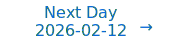

# Personalized Daily ArXiv Papers 2026-02-11

| *[gpt-5]*   | Prompt   | Completion   | Total   |
|:-----------:|:--------:|:------------:|:-------:|
| **Token**   | 102988   | 79878        | 182866  |
| **Cost**    | $0.13    | $0.8         | $0.93   |

Total arXiv papers: 1016

Total scanned papers: 610

Total relevant papers: 78

**Table of contents with paper titles:**

1. [When Benign Inputs Lead to Severe Harms: Eliciting Unsafe Unintended Behaviors of Computer-Use Agents](#user-content-link1)
**Authors:** Jaylen Jones, Zhehao Zhang, Yuting Ning, Eric Fosler-Lussier, Pierre-Luc St-Charles, Yoshua Bengio, Dawn Song, Yu Su, Huan Sun

2. [Soft Clustering Anchors for Self-Supervised Speech Representation Learning in Joint Embedding Prediction Architectures](#user-content-link2)
**Authors:** Georgios Ioannides, Adrian Kieback, Judah Goldfeder, Linsey Pang, Aman Chadha, Aaron Elkins, Yann LeCun, Ravid Shwartz-Ziv

3. [stable-worldmodel-v1: Reproducible World Modeling Research and Evaluation](#user-content-link3)
**Authors:** Lucas Maes, Quentin Le Lidec, Dan Haramati, Nassim Massaudi, Damien Scieur, Yann LeCun, Randall Balestriero

4. [WildCat: Near-Linear Attention in Theory and Practice](#user-content-link4)
**Authors:** Tobias Schr\"oder, Lester Mackey

5. [From $O(mn)$ to $O(r^2)$: Two-Sided Low-Rank Communication for Adam in Distributed Training with Memory Efficiency](#user-content-link5)
**Authors:** Sizhe Dang, Jiaqi Shao, Xiaodong Zheng, Guang Dai, Yan Song, Haishan Ye

6. [Free Energy Mixer](#user-content-link6)
**Authors:** Jiecheng Lu, Shihao Yang

7. [Near-Oracle KV Selection via Pre-hoc Sparsity for Long-Context Inference](#user-content-link7)
**Authors:** Yifei Gao, Lei Wang, Rong-Cheng Tu, Qixin Zhang, Jun Cheng, Dacheng Tao

8. [Effective MoE-based LLM Compression by Exploiting Heterogeneous Inter-Group Experts Routing Frequency and Information Density](#user-content-link8)
**Authors:** Zhendong Mi, Yixiao Chen, Pu Zhao, Xiaodong Yu, Hao Wang, Yanzhi Wang, Shaoyi Huang

9. [DeltaKV: Residual-Based KV Cache Compression via Long-Range Similarity](#user-content-link9)
**Authors:** Jitai Hao, Qiang Huang, Yaowei Wang, Min Zhang, Jun Yu

10. [Noise Stability of Transformer Models](#user-content-link10)
**Authors:** Themistoklis Haris, Zihan Zhang, Yuichi Yoshida

11. [ManifoldKV: Training-Free KV Cache Compression via Euclidean Outlier Detection](#user-content-link11)
**Authors:** Debajyoti Datta, Trishala Neeraj, Bibek Paudel, Vyom Sharma, Subhabrata Mukherjee

12. [Generalizing GNNs with Tokenized Mixture of Experts](#user-content-link12)
**Authors:** Xiaoguang Guo, Zehong Wang, Jiazheng Li, Shawn Spitzel, Qi Yang, Kaize Ding, Jundong Li, Chuxu Zhang

13. [SERE: Similarity-based Expert Re-routing for Efficient Batch Decoding in MoE Models](#user-content-link13)
**Authors:** Juntong Wu, Jialiang Cheng, Fuyu Lv, Ou Dan, Li Yuan

14. [Prism: Spectral-Aware Block-Sparse Attention](#user-content-link14)
**Authors:** Xinghao Wang, Pengyu Wang, Xiaoran Liu, Fangxu Liu, Jason Chu, Kai Song, Xipeng Qiu

15. [FlattenGPT: Depth Compression for Transformer with Layer Flattening](#user-content-link15)
**Authors:** Ruihan Xu, Qingpei Guo, Yao Zhu, Xiangyang Ji, Ming Yang, Shiliang Zhang

16. [Train Less, Infer Faster: Efficient Model Finetuning and Compression via Structured Sparsity](#user-content-link16)
**Authors:** Jonathan Svirsky, Yehonathan Refael, Ofir Lindenbaum

17. [Deriving Neural Scaling Laws from the statistics of natural language](#user-content-link17)
**Authors:** Francesco Cagnetta, Allan Ravent\'os, Surya Ganguli, Matthieu Wyart

18. [ARO: A New Lens On Matrix Optimization For Large Models](#user-content-link18)
**Authors:** Wenbo Gong, Javier Zazo, Qijun Luo, Puqian Wang, James Hensman, Chao Ma

19. [Astro: Activation-guided Structured Regularization for Outlier-Robust LLM Post-Training Quantization](#user-content-link19)
**Authors:** Xi Chen, Ming Li, Junxi Li, Changsheng Li, Peisong Wang, Lizhong Ding, Ye Yuan, Guoren Wang

20. [The Laplacian Mechanism Improves Transformers by Reshaping Token Geometry](#user-content-link20)
**Authors:** Yuchong Zhang, Vardan Papyan

21. [XShare: Collaborative in-Batch Expert Sharing for Faster MoE Inference](#user-content-link21)
**Authors:** Daniil Vankov, Nikita Ivkin, Kyle Ulrich, Xiang Song, Ashish Khetan, George Karypis

22. [Predicting Future Utility: Global Combinatorial Optimization for Task-Agnostic KV Cache Eviction](#user-content-link22)
**Authors:** Ziyao Tang, Pengkun Jiao, Xinhang Chen, Wei Liu, Shiyong Li, Jingjing Chen

23. [Learning to Remember, Learn, and Forget in Attention-Based Models](#user-content-link23)
**Authors:** Djohan Bonnet, Jamie Lohoff, Jan Finkbeiner, Elidona Skhikerujah, Emre Neftci

24. [Mutual Information Collapse Explains Disentanglement Failure in $\beta$-VAEs](#user-content-link24)
**Authors:** Minh Vu, Xiaoliang Wan, Shuangqing Wei

25. [Gaussian Match-and-Copy: A Minimalist Benchmark for Studying Transformer Induction](#user-content-link25)
**Authors:** Antoine Gonon, Alexandre Cordonnier, Nicolas Boumal

26. [Why Linear Interpretability Works: Invariant Subspaces as a Result of Architectural Constraints](#user-content-link26)
**Authors:** Andres Saurez, Yousung Lee, Dongsoo Har

27. [Discovering Interpretable Algorithms by Decompiling Transformers to RASP](#user-content-link27)
**Authors:** Xinting Huang, Aleksandra Bakalova, Satwik Bhattamishra, William Merrill, Michael Hahn

28. [Dynamic Long Context Reasoning over Compressed Memory via End-to-End Reinforcement Learning](#user-content-link28)
**Authors:** Zhuoen Chen, Dongfang Li, Meishan Zhang, Baotian Hu, Min Zhang

29. [Modality Gap-Driven Subspace Alignment Training Paradigm For Multimodal Large Language Models](#user-content-link29)
**Authors:** Xiaomin Yu, Yi Xin, Wenjie Zhang, Chonghan Liu, Hanzhen Zhao, Xiaoxing Hu, Xinlei Yu, Ziyue Qiao, Hao Tang, Xue Yang, Xiaobin Hu, Chengwei Qin, Hui Xiong, Yu Qiao, Shuicheng Yan

30. [Latent Reasoning with Supervised Thinking States](#user-content-link30)
**Authors:** Ido Amos, Avi Caciularu, Mor Geva, Amir Globerson, Jonathan Herzig, Lior Shani, Idan Szpektor

31. [The Confidence Manifold: Geometric Structure of Correctness Representations in Language Models](#user-content-link31)
**Authors:** Seonglae Cho, Zekun Wu, Kleyton Da Costa, Adriano Koshiyama

32. [Do We Need Adam? Surprisingly Strong and Sparse Reinforcement Learning with SGD in LLMs](#user-content-link32)
**Authors:** Sagnik Mukherjee, Lifan Yuan, Pavan Jayasinha, Dilek Hakkani-T\"ur, Hao Peng

33. [Spectral Gating Networks](#user-content-link33)
**Authors:** Jusheng Zhang, Yijia Fan, Kaitong Cai, Jing Yang, Yongsen Zheng, Kwok-Yan Lam, Liang Lin, Keze Wang

34. [Linearization Explains Fine-Tuning in Large Language Models](#user-content-link34)
**Authors:** Zahra Rahimi Afzal, Tara Esmaeilbeig, Mojtaba Soltanalian, Mesrob I. Ohannessian

35. [ANCRe: Adaptive Neural Connection Reassignment for Efficient Depth Scaling](#user-content-link35)
**Authors:** Yilang Zhang, Bingcong Li, Niao He, Georgios B. Giannakis

36. [QUOKA: Query-Oriented KV Selection For Efficient LLM Prefill](#user-content-link36)
**Authors:** Dalton Jones, Junyoung Park, Matthew Morse, Mingu Lee, Chris Lott, Harper Langston

37. [Statistical-Computational Trade-offs in Learning Multi-Index Models via Harmonic Analysis](#user-content-link37)
**Authors:** Hugo Latourelle-Vigeant, Theodor Misiakiewicz

38. [SiameseNorm: Breaking the Barrier to Reconciling Pre/Post-Norm](#user-content-link38)
**Authors:** Tianyu Li, Dongchen Han, Zixuan Cao, Haofeng Huang, Mengyu Zhou, Ming Chen, Erchao Zhao, Xiaoxi Jiang, Guanjun Jiang, Gao Huang

39. [Sparse Layer Sharpness-Aware Minimization for Efficient Fine-Tuning](#user-content-link39)
**Authors:** Yifei Cheng, Xianglin Yang, Guoxia Wang, Chao Huang, Fei Ma, Dianhai Yu, Xiaochun Cao, Li Shen

40. [Pruning as a Cooperative Game: Surrogate-Assisted Layer Contribution Estimation for Large Language Models](#user-content-link40)
**Authors:** Xuan Ding, Pengyu Tong, Ranjie Duan, Yunjian Zhang, Rui Sun, Yao Zhu

41. [CompilerKV: Risk-Adaptive KV Compression via Offline Experience Compilation](#user-content-link41)
**Authors:** Ning Yang, Chengzhi Wang, Yibo Liu, Baoliang Tian, Haijun Zhang

42. [Beyond Student: An Asymmetric Network for Neural Network Inheritance](#user-content-link42)
**Authors:** Yiyun Zhou, Jingwei Shi, Mingjing Xu, Zhonghua Jiang, Jingyuan Chen

43. [FlashVID: Efficient Video Large Language Models via Training-free Tree-based Spatiotemporal Token Merging](#user-content-link43)
**Authors:** Ziyang Fan, Keyu Chen, Ruilong Xing, Yulin Li, Li Jiang, Zhuotao Tian

44. [Sparse Models, Sparse Safety: Unsafe Routes in Mixture-of-Experts LLMs](#user-content-link44)
**Authors:** Yukun Jiang, Hai Huang, Mingjie Li, Yage Zhang, Michael Backes, Yang Zhang

45. [Gradient Residual Connections](#user-content-link45)
**Authors:** Yangchen Pan, Qizhen Ying, Philip Torr, Bo Liu

46. [Understanding Dynamic Compute Allocation in Recurrent Transformers](#user-content-link46)
**Authors:** Ibraheem Muhammad Moosa, Suhas Lohit, Ye Wang, Moitreya Chatterjee, Wenpeng Yin

47. [Model soups need only one ingredient](#user-content-link47)
**Authors:** Alireza Abdollahpoorrostam, Nikolaos Dimitriadis, Adam Hazimeh, Pascal Frossard

48. [Training deep physical neural networks with local physical information bottleneck](#user-content-link48)
**Authors:** Hao Wang, Ziao Wang, Xiangpeng Liang, Han Zhao, Jianqi Hu, Junjie Jiang, Xing Fu, Jianshi Tang, Huaqiang Wu, Sylvain Gigan, Qiang Liu

49. [Free(): Learning to Forget in Malloc-Only Reasoning Models](#user-content-link49)
**Authors:** Yilun Zheng, Dongyang Ma, Tian Liang, Jiahao Xu, Xinting Huang, Lihui Chen, Haitao Mi, Yan Wang

50. [Barycentric alignment for instance-level comparison of neural representations](#user-content-link50)
**Authors:** Shreya Saha, Zoe Wanying He, Meenakshi Khosla

51. [A Task-Centric Theory for Iterative Self-Improvement with Easy-to-Hard Curricula](#user-content-link51)
**Authors:** Chenruo Liu, Yijun Dong, Yiqiu Shen, Qi Lei

52. [StretchTime: Adaptive Time Series Forecasting via Symplectic Attention](#user-content-link52)
**Authors:** Yubin Kim, Viresh Pati, Jevon Twitty, Vinh Pham, Shihao Yang, Jiecheng Lu

53. [V-ABFT: Variance-Based Adaptive Threshold for Fault-Tolerant Matrix Multiplication in Mixed-Precision Deep Learning](#user-content-link53)
**Authors:** Yiheng Gao, Qin Hua, Zizhong Chen

54. [Next Concept Prediction in Discrete Latent Space Leads to Stronger Language Models](#user-content-link54)
**Authors:** Yuliang Liu, Yunchong Song, Yixuan Wang, Kewen Ge, Alex Lamb, Qipeng Guo, Kai Chen, Bowen Zhou, Zhouhan Lin

55. [LUCID-SAE: Learning Unified Vision-Language Sparse Codes for Interpretable Concept Discovery](#user-content-link55)
**Authors:** Difei Gu, Yunhe Gao, Gerasimos Chatzoudis, Zihan Dong, Guoning Zhang, Bangwei Guo, Yang Zhou, Mu Zhou, Dimitris Metaxas

56. [Circuit Fingerprints: How Answer Tokens Encode Their Geometrical Path](#user-content-link56)
**Authors:** Andres Saurez, Neha Sengar, Dongsoo Har

57. [Towards Uniformity and Alignment for Multimodal Representation Learning](#user-content-link57)
**Authors:** Wenzhe Yin, Pan Zhou, Zehao Xiao, Jie Liu, Shujian Yu, Jan-Jakob Sonke, Efstratios Gavves

58. [On the Infinite Width and Depth Limits of Predictive Coding Networks](#user-content-link58)
**Authors:** Francesco Innocenti, El Mehdi Achour, Rafal Bogacz

59. [Looping Back to Move Forward: Recursive Transformers for Efficient and Flexible Large Multimodal Models](#user-content-link59)
**Authors:** Ruihan Xu, Yuting Gao, Lan Wang, Jianing Li, Weihao Chen, Qingpei Guo, Ming Yang, Shiliang Zhang

60. [Emergent Misalignment is Easy, Narrow Misalignment is Hard](#user-content-link60)
**Authors:** Anna Soligo, Edward Turner, Senthooran Rajamanoharan, Neel Nanda

61. [FIRE: Frobenius-Isometry Reinitialization for Balancing the Stability-Plasticity Tradeoff](#user-content-link61)
**Authors:** Isaac Han, Sangyeon Park, Seungwon Oh, Donghu Kim, Hojoon Lee, Kyung-Joong Kim

62. [The Geometry of Representational Failures in Vision Language Models](#user-content-link62)
**Authors:** Daniele Savietto, Declan Campbell, Andr\'e Panisson, Marco Nurisso, Giovanni Petri, Jonathan D. Cohen, Alan Perotti

63. [Dynamics Within Latent Chain-of-Thought: An Empirical Study of Causal Structure](#user-content-link63)
**Authors:** Zirui Li, Xuefeng Bai, Kehai Chen, Yizhi Li, Jian Yang, Chenghua Lin, Min Zhang

64. [Spectral Disentanglement and Enhancement: A Dual-domain Contrastive Framework for Representation Learning](#user-content-link64)
**Authors:** Jinjin Guo, Yexin Li, Zhichao Huang, Jun Fang, Zhiyuan Liu, Chao Liu, Pengzhang Liu, Qixia Jiang

65. [Your Language Model Secretly Contains Personality Subnetworks](#user-content-link65)
**Authors:** Ruimeng Ye, Zihan Wang, Zinan Ling, Yang Xiao, Manling Li, Xiaolong Ma, Bo Hui

66. [Self-Supervised Learning as Discrete Communication](#user-content-link66)
**Authors:** Kawtar Zaher, Ilyass Moummad, Olivier Buisson, Alexis Joly

67. [Collaborative and Efficient Fine-tuning: Leveraging Task Similarity](#user-content-link67)
**Authors:** Gagik Magakyan, Amirhossein Reisizadeh, Chanwoo Park, Pablo A. Parrilo, Asuman Ozdaglar

68. [The Median is Easier than it Looks: Approximation with a Constant-Depth, Linear-Width ReLU Network](#user-content-link68)
**Authors:** Abhigyan Dutta, Itay Safran, Paul Valiant

69. [LARV: Data-Free Layer-wise Adaptive Rescaling Veneer for Model Merging](#user-content-link69)
**Authors:** Xinyu Wang, Ke Deng, Fei Dou, Jinbo Bi, Jin Lu

70. [Emergent Structured Representations Support Flexible In-Context Inference in Large Language Models](#user-content-link70)
**Authors:** Ningyu Xu, Qi Zhang, Xipeng Qiu, Xuanjing Huang

71. [Regime Change Hypothesis: Foundations for Decoupled Dynamics in Neural Network Training](#user-content-link71)
**Authors:** Cristian P\'erez-Corral, Alberto Fern\'andez-Hern\'andez, Jose I. Mestre, Manuel F. Dolz, Jose Duato, Enrique S. Quintana-Ort\'i

72. [When Less is More: The LLM Scaling Paradox in Context Compression](#user-content-link72)
**Authors:** Ruishan Guo, Yibing Liu, Guoxin Ma, Yan Wang, Yueyang Zhang, Long Xia, Kecheng Chen, Zhiyuan Sun, Daiting Shi

73. [Is Memorization Helpful or Harmful? Prior Information Sets the Threshold](#user-content-link73)
**Authors:** Chen Cheng, Rina Foygel Barber

74. [Step-resolved data attribution for looped transformers](#user-content-link74)
**Authors:** Georgios Kaissis, David Mildenberger, Juan Felipe Gomez, Martin J. Menten, Eleni Triantafillou

75. [Revealing the Semantic Selection Gap in DINOv3 through Training-Free Few-Shot Segmentation](#user-content-link75)
**Authors:** Hussni Mohd Zakir, Eric Tatt Wei Ho

76. [Clarifying Shampoo: Adapting Spectral Descent to Stochasticity and the Parameter Trajectory](#user-content-link76)
**Authors:** Runa Eschenhagen, Anna Cai, Tsung-Hsien Lee, Hao-Jun Michael Shi

77. [Effective Reasoning Chains Reduce Intrinsic Dimensionality](#user-content-link77)
**Authors:** Archiki Prasad, Mandar Joshi, Kenton Lee, Mohit Bansal, Peter Shaw

78. [Sparsity-Aware Evolution for Model Merging](#user-content-link78)
**Authors:** Huan Zhang, Yanjian Zhang, Guillaume Wisniewski, Nadi Tomeh, Bang Liu

---

## 1. [When Benign Inputs Lead to Severe Harms: Eliciting Unsafe Unintended Behaviors of Computer-Use Agents](https://arxiv.org/abs/2602.08235) 

**ArXiv ID:** 2602.08235

**Authors:** Jaylen Jones, Zhehao Zhang, Yuting Ning, Eric Fosler-Lussier, Pierre-Luc St-Charles, Yoshua Bengio, Dawn Song, Yu Su, Huan Sun

**Abstract:** Although computer-use agents (CUAs) hold significant potential to automate increasingly complex OS workflows, they can demonstrate unsafe unintended behaviors that deviate from expected outcomes even under benign input contexts. However, exploration of this risk remains largely anecdotal, lacking concrete characterization and automated methods to proactively surface long-tail unintended behaviors under realistic CUA scenarios. To fill this gap, we introduce the first conceptual and methodological framework for unintended CUA behaviors, by defining their key characteristics, automatically eliciting them, and analyzing how they arise from benign inputs. We propose AutoElicit: an agentic framework that iteratively perturbs benign instructions using CUA execution feedback, and elicits severe harms while keeping perturbations realistic and benign. Using AutoElicit, we surface hundreds of harmful unintended behaviors from state-of-the-art CUAs such as Claude 4.5 Haiku and Opus. We further evaluate the transferability of human-verified successful perturbations, identifying persistent susceptibility to unintended behaviors across various other frontier CUAs. This work establishes a foundation for systematically analyzing unintended behaviors in realistic computer-use settings.

**Comment:** Author match

---

## 2. [Soft Clustering Anchors for Self-Supervised Speech Representation Learning in Joint Embedding Prediction Architectures](https://arxiv.org/abs/2602.09040) 

**ArXiv ID:** 2602.09040

**Authors:** Georgios Ioannides, Adrian Kieback, Judah Goldfeder, Linsey Pang, Aman Chadha, Aaron Elkins, Yann LeCun, Ravid Shwartz-Ziv

**Abstract:** Joint Embedding Predictive Architectures (JEPA) offer a promising approach to self-supervised speech representation learning, but suffer from representation collapse without explicit grounding. We propose GMM-Anchored JEPA, which fits a Gaussian Mixture Model once on log-mel spectrograms and uses its frozen soft posteriors as auxiliary targets throughout training. A decaying supervision schedule allows GMM regularization to dominate early training before gradually yielding to the JEPA objective. Unlike HuBERT and WavLM, which require iterative re-clustering, our approach clusters input features once with soft rather than hard assignments. On ~50k hours of speech, GMM anchoring improves ASR (28.68% vs. 33.22% WER), emotion recognition (67.76% vs. 65.46%), and slot filling (64.7% vs. 59.1% F1) compared to a WavLM-style baseline with matched compute. Cluster analysis shows GMM-anchored representations achieve up to 98% entropy compared to 31% for WavLM-style, indicating substantially more uniform cluster utilization. Code is made available at https://github.com/gioannides/clustering-anchored-jepa.

**Comment:** Author match

---

## 3. [stable-worldmodel-v1: Reproducible World Modeling Research and Evaluation](https://arxiv.org/abs/2602.08968) 

**ArXiv ID:** 2602.08968

**Authors:** Lucas Maes, Quentin Le Lidec, Dan Haramati, Nassim Massaudi, Damien Scieur, Yann LeCun, Randall Balestriero

**Abstract:** World Models have emerged as a powerful paradigm for learning compact, predictive representations of environment dynamics, enabling agents to reason, plan, and generalize beyond direct experience. Despite recent interest in World Models, most available implementations remain publication-specific, severely limiting their reusability, increasing the risk of bugs, and reducing evaluation standardization. To mitigate these issues, we introduce stable-worldmodel (SWM), a modular, tested, and documented world-model research ecosystem that provides efficient data-collection tools, standardized environments, planning algorithms, and baseline implementations. In addition, each environment in SWM enables controllable factors of variation, including visual and physical properties, to support robustness and continual learning research. Finally, we demonstrate the utility of SWM by using it to study zero-shot robustness in DINO-WM.

**Comment:** Author match

---

## 4. [WildCat: Near-Linear Attention in Theory and Practice](https://arxiv.org/abs/2602.10056) 

**ArXiv ID:** 2602.10056

**Authors:** Tobias Schr\"oder, Lester Mackey

**Abstract:** We introduce WildCat, a high-accuracy, low-cost approach to compressing the attention mechanism in neural networks. While attention is a staple of modern network architectures, it is also notoriously expensive to deploy due to resource requirements that scale quadratically with the input sequence length $n$. WildCat avoids these quadratic costs by only attending over a small weighted coreset. Crucially, we select the coreset using a fast but spectrally-accurate subsampling algorithm -- randomly pivoted Cholesky -- and weight the elements optimally to minimise reconstruction error. Remarkably, given bounded inputs, WildCat approximates exact attention with super-polynomial $O(n^{-\sqrt{\log(\log(n))}})$ error decay while running in near-linear $O(n^{1+o(1)})$ time. In contrast, prior practical approximations either lack error guarantees or require quadratic runtime to guarantee such high fidelity. We couple this advance with a GPU-optimized PyTorch implementation and a suite of benchmark experiments demonstrating the benefits of WildCat for image generation, image classification, and language model KV cache compression.

**Comment:** Model Compression and Efficiency: near-linear attention via coreset selection (randomly pivoted Cholesky) with strong approximation guarantees and practical GPU implementation.

**Relevance:** 10
**Novelty:** 9

---

## 5. [From $O(mn)$ to $O(r^2)$: Two-Sided Low-Rank Communication for Adam in Distributed Training with Memory Efficiency](https://arxiv.org/abs/2602.08007) 

**ArXiv ID:** 2602.08007

**Authors:** Sizhe Dang, Jiaqi Shao, Xiaodong Zheng, Guang Dai, Yan Song, Haishan Ye

**Abstract:** As foundation models continue to scale, pretraining increasingly relies on data-parallel distributed optimization, making bandwidth-limited gradient synchronization a key bottleneck. Orthogonally, projection-based low-rank optimizers were mainly designed for memory efficiency, but remain suboptimal for communication-limited training: one-sided synchronization still transmits an $O(rn)$ object for an $m\times n$ matrix gradient and refresh steps can dominate peak communicated bytes. We propose TSR, which brings two-sided low-rank communication to Adam-family updates (TSR-Adam) by synchronizing a compact core $U^\top G V\in\mathbb{R}^{r\times r}$, reducing the dominant per-step payload from $O(mn)$ to $O(r^2)$ while keeping moment states in low-dimensional cores. To further reduce the peak communication from subspace refresh, TSR-Adam adopts a randomized SVD-based refresh that avoids full-gradient synchronization. We additionally extend low-rank communication to embedding gradients with embedding-specific ranks and refresh schedules, yielding additional communication and memory savings over keeping embeddings dense. Across pretraining from 60M to 1B model scales, TSR-Adam reduces average communicated bytes per step by $13\times$, and on GLUE fine-tuning it reduces communication by $25\times$, while achieving comparable performance; we further provide a theoretical stationarity analysis for the proposed update. Code is available at https://github.com/DKmiyan/TSR-Adam.

**Comment:** High Performance Computing: two-sided low-rank communication for Adam-family optimizers reducing per-step payload from O(mn) to O(r^2) with randomized refresh; strong distributed training efficiency gains.

**Relevance:** 10
**Novelty:** 9

---

## 6. [Free Energy Mixer](https://arxiv.org/abs/2602.07160) 

**ArXiv ID:** 2602.07160

**Authors:** Jiecheng Lu, Shihao Yang

**Abstract:** Standard attention stores keys/values losslessly but reads them via a per-head convex average, blocking channel-wise selection. We propose the Free Energy Mixer (FEM): a free-energy (log-sum-exp) read that applies a value-driven, per-channel log-linear tilt to a fast prior (e.g., from queries/keys in standard attention) over indices. Unlike methods that attempt to improve and enrich the $(q,k)$ scoring distribution, FEM treats it as a prior and yields a value-aware posterior read at unchanged complexity, smoothly moving from averaging to per-channel selection as the learnable inverse temperature increases, while still preserving parallelism and the original asymptotic complexity ($O(T^2)$ for softmax; $O(T)$ for linearizable variants). We instantiate a two-level gated FEM that is plug-and-play with standard and linear attention, linear RNNs and SSMs. It consistently outperforms strong baselines on NLP, vision, and time-series at matched parameter budgets.

**Comment:** Model Architecture: introduces Free Energy Mixer, a value-aware per-channel read mechanism plug-and-play with attention/SSMs for selection vs averaging.

**Relevance:** 10
**Novelty:** 9

---

## 7. [Near-Oracle KV Selection via Pre-hoc Sparsity for Long-Context Inference](https://arxiv.org/abs/2602.08329) 

**ArXiv ID:** 2602.08329

**Authors:** Yifei Gao, Lei Wang, Rong-Cheng Tu, Qixin Zhang, Jun Cheng, Dacheng Tao

**Abstract:** A core bottleneck in large language model (LLM) inference is the cost of attending over the ever-growing key-value (KV) cache. Although near-oracle top-k KV selection can preserve the quality of dense attention while sharply reducing computation and bandwidth, existing sparse methods generally rely on posterior heuristics, i.e., selectors conditioned on observed attention or proxy scores. Such conditioning introduces posterior bias: it tends to distort true token importance and miss salient tokens, thereby impairing long-range reasoning. To tackle this problem, we propose Pre-hoc Sparsity (PrHS), which selects KV entries before attention scoring and provides explicit accuracy control. Let the attention mass of discarded entries be delta (the dropped mass). Through a marginal-to-mutual-information analysis, we derive an upper bound on the mutual-information loss that depends only on the dropped mass. This relation explains failure modes of posterior heuristics and enables verifiable guarantees by controlling the dropped mass in advance. Within PrHS, we instantiate three orthogonal pre-hoc selectors along the axes of time, depth, and layer. Extensive experiments on LLaMA and Mistral families validate PrHS. Across GSM8K and CoQA, PrHS reduces retrieval overhead by over 90%, achieving 3x higher retrieval sparsity than HShare at matched or better accuracy. It incurs under 1% average degradation on LongBench, lowers attention FLOPs by about 15% versus prior sparse baselines, and yields a 9.9x speedup in attention-operator latency and 2.8x higher throughput on NVIDIA A100-80GB GPUs than the dense baseline.

**Comment:** Model Compression and Efficiency: pre-hoc KV-cache sparsity with MI-based accuracy guarantees for long-context inference.

**Relevance:** 10
**Novelty:** 8

---

## 8. [Effective MoE-based LLM Compression by Exploiting Heterogeneous Inter-Group Experts Routing Frequency and Information Density](https://arxiv.org/abs/2602.09316) 

**ArXiv ID:** 2602.09316

**Authors:** Zhendong Mi, Yixiao Chen, Pu Zhao, Xiaodong Yu, Hao Wang, Yanzhi Wang, Shaoyi Huang

**Abstract:** Mixture-of-Experts (MoE) based Large Language Models (LLMs) have achieved superior performance, yet the massive memory overhead caused by storing multiple expert networks severely hinders their practical deployment. Singular Value Decomposition (SVD)-based compression has emerged as a promising post-training technique; however, most existing methods apply uniform rank allocation or rely solely on static weight properties. This overlooks the substantial heterogeneity in expert utilization observed in MoE models, where frequent routing patterns and intrinsic information density vary significantly across experts. In this work, we propose RFID-MoE, an effective framework for MoE compression by exploiting heterogeneous Routing Frequency and Information Density. We first introduce a fused metric that combines expert activation frequency with effective rank to measure expert importance, adaptively allocating higher ranks to critical expert groups under a fixed budget. Moreover, instead of discarding compression residuals, we reconstruct them via a parameter-efficient sparse projection mechanism to recover lost information with minimal parameter overhead. Extensive experiments on representative MoE LLMs (e.g., Qwen3, DeepSeekMoE) across multiple compression ratios demonstrate that RFID-MoE consistently outperforms state-of-the-art methods like MoBE and D2-MoE. Notably, RFID-MoE achieves a perplexity of 16.92 on PTB with the Qwen3-30B model at a 60% compression ratio, reducing perplexity by over 8.0 compared to baselines, and improves zero-shot accuracy on HellaSwag by approximately 8%.

**Comment:** Model Architecture + Compression: MoE-aware SVD compression with routing-frequency and information-density–guided rank allocation plus sparse residual reconstruction.

**Relevance:** 10
**Novelty:** 8

---

## 9. [DeltaKV: Residual-Based KV Cache Compression via Long-Range Similarity](https://arxiv.org/abs/2602.08005) 

**ArXiv ID:** 2602.08005

**Authors:** Jitai Hao, Qiang Huang, Yaowei Wang, Min Zhang, Jun Yu

**Abstract:** The deployment of efficient long-context LLMs in applications like autonomous agents, long-chain reasoning, and creative writing is fundamentally bottlenecked by the linear growth of KV cache memory. Existing compression and eviction methods often struggle to balance accuracy, compression ratio, and hardware efficiency. We propose DeltaKV, a residual-based KV cache compression framework motivated by two empirical findings: long-range inter-token similarity and highly shared latent components in KV representations. Instead of discarding tokens, DeltaKV encodes semantic residuals relative to retrieved historical references, preserving fidelity while substantially reducing storage. To translate compression gains into real system speedups, we further introduce Sparse-vLLM, a high-performance inference engine with decoupled memory management and kernels optimized for sparse and irregular KV layouts. Experiments show that DeltaKV reduces KV cache memory to 29\% of the original while maintaining near-lossless accuracy on LongBench, SCBench, and AIME. When integrated with Sparse-vLLM, it achieves up to 2$\times$ throughput improvement over vLLM in long-context scenarios, demonstrating a practical path toward scalable long-context LLM deployment. Code, model checkpoints, and datasets are available at https://github.com/CURRENTF/Sparse-vLLM.

**Comment:** Model Compression and Efficiency + HPC: residual-based KV cache compression leveraging long-range similarity and a specialized sparse inference engine for speedups.

**Relevance:** 10
**Novelty:** 8

---

## 10. [Noise Stability of Transformer Models](https://arxiv.org/abs/2602.08287) 

**ArXiv ID:** 2602.08287

**Authors:** Themistoklis Haris, Zihan Zhang, Yuichi Yoshida

**Abstract:** Understanding simplicity biases in deep learning offers a promising path toward developing reliable AI. A common metric for this, inspired by Boolean function analysis, is average sensitivity, which captures a model's robustness to single-token perturbations. We argue that average sensitivity has two key limitations: it lacks a natural generalization to real-valued domains and fails to explain the "junta-like" input dependence we empirically observe in modern LLMs. To address these limitations, we propose noise stability as a more comprehensive simplicity metric. Noise stability expresses a model's robustness to correlated noise applied to all input coordinates simultaneously. We provide a theoretical analysis of noise stability for single-layer attention and ReLU MLP layers and tackle the multi-layer propagation problem with a covariance interval propagation approach. Building on this theory, we develop a practical noise stability regularization method. Experiments on algorithmic and next-token-prediction tasks show that our regularizer consistently catalyzes grokking and accelerates training by approximately $35\%$ and $75\%$ respectively. Our results sculpt a new connection between signal propagation in neural networks and interpretability, with noise stability emerging as a powerful tool for understanding and improving modern Transformers.

**Comment:** Matches Representation Learning and Model Architecture: introduces noise stability as a simplicity/robustness metric for Transformers, with theory and a regularizer that accelerates grokking/training.

**Relevance:** 10
**Novelty:** 8

---

## 11. [ManifoldKV: Training-Free KV Cache Compression via Euclidean Outlier Detection](https://arxiv.org/abs/2602.08343) 

**ArXiv ID:** 2602.08343

**Authors:** Debajyoti Datta, Trishala Neeraj, Bibek Paudel, Vyom Sharma, Subhabrata Mukherjee

**Abstract:** Long-context inference is constrained by KV-cache memory, which grows linearly with sequence length; KV-cache compression therefore hinges on reliably selecting which past tokens to retain. Most geometry-based eviction methods score keys by cosine similarity to a global centroid, but cosine is scale-invariant and can discard magnitude cues that distinguish semantically salient tokens. We propose ManifoldKV, a training-free scorer that ranks tokens by Euclidean distance to the key centroid, capturing both angular and radial deviations.   On the RULER benchmark, ManifoldKV achieves 95.7% accuracy at 4K-16K contexts with 20% compression; matching the best geometric baseline while improving robustness in two regimes where cosine scoring fails. First, on multi-key retrieval, ManifoldKV reduces directional collisions, achieving 92.4% vs KeyDiff's 77.0% (+15.4 points) on 3-key NIAH at 50% compression. Second, to address dilution and performance collapse of global centroids at 64K context, we introduce WindowedManifoldKV, which restores accuracy to 84.3% at 25% compression, a 49-point recovery over global L2 and +3.2 points over KeyDiff. The method requires only 3 lines of code and works across 4 architectures without tuning.

**Comment:** Matches Model Compression and Efficiency: training-free KV-cache compression via Euclidean distance scoring and windowed variants for long-context robustness.

**Relevance:** 10
**Novelty:** 8

---

## 12. [Generalizing GNNs with Tokenized Mixture of Experts](https://arxiv.org/abs/2602.09258) 

**ArXiv ID:** 2602.09258

**Authors:** Xiaoguang Guo, Zehong Wang, Jiazheng Li, Shawn Spitzel, Qi Yang, Kaize Ding, Jundong Li, Chuxu Zhang

**Abstract:** Deployed graph neural networks (GNNs) are frozen at deployment yet must fit clean data, generalize under distribution shifts, and remain stable to perturbations. We show that static inference induces a fundamental tradeoff: improving stability requires reducing reliance on shift-sensitive features, leaving an irreducible worst-case generalization floor. Instance-conditional routing can break this ceiling, but is fragile because shifts can mislead routing and perturbations can make routing fluctuate. We capture these effects via two decompositions separating coverage vs selection, and base sensitivity vs fluctuation amplification. Based on these insights, we propose STEM-GNN, a pretrain-then-finetune framework with a mixture-of-experts encoder for diverse computation paths, a vector-quantized token interface to stabilize encoder-to-head signals, and a Lipschitz-regularized head to bound output amplification. Across nine node, link, and graph benchmarks, STEM-GNN achieves a stronger three-way balance, improving robustness to degree/homophily shifts and to feature/edge corruptions while remaining competitive on clean graphs.

**Comment:** Matches Model Architecture (Mixture-of-Experts): tokenized MoE encoder with vector-quantized interface and Lipschitz-regularized head to improve GNN generalization/robustness.

**Relevance:** 10
**Novelty:** 8

---

## 13. [SERE: Similarity-based Expert Re-routing for Efficient Batch Decoding in MoE Models](https://arxiv.org/abs/2602.07616) 

**ArXiv ID:** 2602.07616

**Authors:** Juntong Wu, Jialiang Cheng, Fuyu Lv, Ou Dan, Li Yuan

**Abstract:** Mixture-of-Experts (MoE) architectures employ sparse activation to deliver faster training and inference with higher accuracy than dense LLMs. However, in production serving, MoE models require batch inference to optimize hardware efficiency, which may cause excessive expert activation and thus slow the memory-bound decoding stage. To address the fundamental tension between batch decoding and expert sparsity, we present SERE, a Similarity-based Expert Re-routing method for Efficient batch decoding in MoE models. SERE dynamically reduces the number of active experts in an input-aware manner by re-routing tokens from secondary experts to their most similar primary counterparts. It also leverages similarity patterns to identify and preserve critical experts, thereby preventing capability loss. Notably, SERE avoids static expert pruning or merging, instead enabling dynamic expert skipping based on batch-level expert redundancy. Additionally, we provide an efficient custom CUDA kernel for SERE, enabling plug-and-play use in vLLM with only a single-line code change. Extensive experiments on various complex reasoning benchmarks demonstrate that SERE achieves up to 2.0x speedup with minimal quality loss, providing a practical solution for cost-efficient and latency-sensitive large-scale MoE deployment. Code implementation of SERE can be found in https://github.com/JL-Cheng/SERE.

**Comment:** Matches Model Architecture (MoE) and Efficiency: similarity-based dynamic expert re-routing to reduce active experts in batch decoding; includes custom CUDA and vLLM integration.

**Relevance:** 10
**Novelty:** 8

---

## 14. [Prism: Spectral-Aware Block-Sparse Attention](https://arxiv.org/abs/2602.08426) 

**ArXiv ID:** 2602.08426

**Authors:** Xinghao Wang, Pengyu Wang, Xiaoran Liu, Fangxu Liu, Jason Chu, Kai Song, Xipeng Qiu

**Abstract:** Block-sparse attention is promising for accelerating long-context LLM pre-filling, yet identifying relevant blocks efficiently remains a bottleneck. Existing methods typically employ coarse-grained attention as a proxy for block importance estimation, but often resort to expensive token-level searching or scoring, resulting in significant selection overhead. In this work, we trace the inaccuracy of standard coarse-grained attention via mean pooling to a theoretical root cause: the interaction between mean pooling and Rotary Positional Embeddings (RoPE). We prove that mean pooling acts as a low-pass filter that induces destructive interference in high-frequency dimensions, effectively creating a "blind spot" for local positional information (e.g., slash patterns). To address this, we introduce Prism, a training-free spectral-aware approach that decomposes block selection into high-frequency and low-frequency branches. By applying energy-based temperature calibration, Prism restores the attenuated positional signals directly from pooled representations, enabling block importance estimation using purely block-level operations, thereby improving efficiency. Extensive evaluations confirm that Prism maintains accuracy parity with full attention while delivering up to $\mathbf{5.1\times}$ speedup.

**Comment:** Matches Efficiency (Attention): spectral-aware block-sparse attention with theory on RoPE-induced pooling artifacts and a training-free block selection method yielding large speedups.

**Relevance:** 10
**Novelty:** 8

---

## 15. [FlattenGPT: Depth Compression for Transformer with Layer Flattening](https://arxiv.org/abs/2602.08858) 

**ArXiv ID:** 2602.08858

**Authors:** Ruihan Xu, Qingpei Guo, Yao Zhu, Xiangyang Ji, Ming Yang, Shiliang Zhang

**Abstract:** Recent works have indicated redundancy across transformer blocks, prompting the research of depth compression to prune less crucial blocks. However, current ways of entire-block pruning suffer from risks of discarding meaningful cues learned in those blocks, leading to substantial performance degradation. As another line of model compression, channel pruning can better preserve performance, while it cannot reduce model depth and is challenged by inconsistent pruning ratios for individual layers. To pursue better model compression and acceleration, this paper proposes \textbf{FlattenGPT}, a novel way to detect and reduce depth-wise redundancies. By flatting two adjacent blocks into one, it compresses the network depth, meanwhile enables more effective parameter redundancy detection and removal. FlattenGPT allows to preserve the knowledge learned in all blocks, and remains consistent with the original transformer architecture. Extensive experiments demonstrate that FlattenGPT enhances model efficiency with a decent trade-off to performance. It outperforms existing pruning methods in both zero-shot accuracies and WikiText-2 perplexity across various model types and parameter sizes. On LLaMA-2/3 and Qwen-1.5 models, FlattenGPT retains 90-96\% of zero-shot performance with a compression ratio of 20\%. It also outperforms other pruning methods in accelerating LLM inference, making it promising for enhancing the efficiency of transformers.

**Comment:** Model Compression and Efficiency: depth compression via layer flattening to merge adjacent Transformer blocks, preserving structure and improving inference efficiency.

**Relevance:** 10
**Novelty:** 8

---

## 16. [Train Less, Infer Faster: Efficient Model Finetuning and Compression via Structured Sparsity](https://arxiv.org/abs/2602.09169) 

**ArXiv ID:** 2602.09169

**Authors:** Jonathan Svirsky, Yehonathan Refael, Ofir Lindenbaum

**Abstract:** Fully finetuning foundation language models (LMs) with billions of parameters is often impractical due to high computational costs, memory requirements, and the risk of overfitting. Although methods like low-rank adapters help address these challenges by adding small trainable modules to the frozen LM, they also increase memory usage and do not reduce inference latency. We uncover an intriguing phenomenon: sparsifying specific model rows and columns enables efficient task adaptation without requiring weight tuning. We propose a scheme for effective finetuning via sparsification using training stochastic gates, which requires minimal trainable parameters, reduces inference time, and removes 20--40\% of model parameters without significant accuracy loss. Empirical results show it outperforms recent finetuning baselines in efficiency and performance. Additionally, we provide theoretical guarantees for the convergence of this stochastic gating process, and show that our method admits a simpler and better-conditioned optimization landscape compared to LoRA. Our results highlight sparsity as a compelling mechanism for task-specific adaptation in LMs.

**Comment:** Model Compression and Efficiency: structured sparsity via stochastic gates to prune rows/columns, cutting 20–40% params and inference time with theory.

**Relevance:** 10
**Novelty:** 8

---

## 17. [Deriving Neural Scaling Laws from the statistics of natural language](https://arxiv.org/abs/2602.07488) 

**ArXiv ID:** 2602.07488

**Authors:** Francesco Cagnetta, Allan Ravent\'os, Surya Ganguli, Matthieu Wyart

**Abstract:** Despite the fact that experimental neural scaling laws have substantially guided empirical progress in large-scale machine learning, no existing theory can quantitatively predict the exponents of these important laws for any modern LLM trained on any natural language dataset. We provide the first such theory in the case of data-limited scaling laws. We isolate two key statistical properties of language that alone can predict neural scaling exponents: (i) the decay of pairwise token correlations with time separation between token pairs, and (ii) the decay of the next-token conditional entropy with the length of the conditioning context. We further derive a simple formula in terms of these statistics that predicts data-limited neural scaling exponents from first principles without any free parameters or synthetic data models. Our theory exhibits a remarkable match with experimentally measured neural scaling laws obtained from training GPT-2 and LLaMA style models from scratch on two qualitatively different benchmarks, TinyStories and WikiText.

**Comment:** Foundational Theory: derives neural scaling law exponents from measurable language statistics (correlation decay and conditional entropy) with parameter-free predictions.

**Relevance:** 9
**Novelty:** 9

---

## 18. [ARO: A New Lens On Matrix Optimization For Large Models](https://arxiv.org/abs/2602.09006) 

**ArXiv ID:** 2602.09006

**Authors:** Wenbo Gong, Javier Zazo, Qijun Luo, Puqian Wang, James Hensman, Chao Ma

**Abstract:** Matrix-based optimizers have attracted growing interest for improving LLM training efficiency, with significant progress centered on orthogonalization/whitening based methods. While yielding substantial performance gains, a fundamental question arises: can we develop new paradigms beyond orthogonalization, pushing the efficiency frontier further? We present \textbf{Adaptively Rotated Optimization (ARO}, a new matrix optimization framework that treats gradient rotation as a first class design principle. ARO accelerates LLM training by performing normed steepest descent in a rotated coordinate system, where the rotation is determined by a novel norm-informed policy. This perspective yields update rules that go beyond existing orthogonalization and whitening optimizers, improving sample efficiency in practice. To make comparisons reliable, we propose a rigorously controlled benchmarking protocol that reduces confounding and bias. Under this protocol, ARO consistently outperforms AdamW (by 1.3 $\sim$1.35$\times$) and orthogonalization methods (by 1.1$\sim$1.15$\times$) in LLM pretraining at up to 8B activated parameters, and up to $8\times$ overtrain budget, without evidence of diminishing returns. Finally, we discuss how ARO can be reformulated as a symmetry-aware optimizer grounded in rotational symmetries of residual streams, motivating advanced designs that enable computationally efficient exploitation of cross-layer/cross module couplings.

**Comment:** High Performance Computing/Efficiency: new matrix optimizer (gradient rotation) for faster LLM training beyond orthogonalization/whitening.

**Relevance:** 9
**Novelty:** 9

---

## 19. [Astro: Activation-guided Structured Regularization for Outlier-Robust LLM Post-Training Quantization](https://arxiv.org/abs/2602.07596) 

**ArXiv ID:** 2602.07596

**Authors:** Xi Chen, Ming Li, Junxi Li, Changsheng Li, Peisong Wang, Lizhong Ding, Ye Yuan, Guoren Wang

**Abstract:** Weight-only post-training quantization (PTQ) is crucial for efficient Large Language Model (LLM) deployment but suffers from accuracy degradation caused by weight and activation outliers. Existing mitigation strategies often face critical limitations: they either yield insufficient outlier suppression or incur significant deployment inefficiencies, such as inference latency, heavy preprocessing, or reliance on complex operator fusion. To resolve these limitations, we leverage a key insight: over-parameterized LLMs often converge to Flat Minima, implying a vast equivalent solution space where weights can be adjusted without compromising accuracy. Building on this, we propose Astro, an Activation-guided Structured Regularization framework designed to suppress the negative effects of outliers in a hardware-friendly and efficient manner. Leveraging the activation-guided regularization objective, Astro actively reconstructs intrinsically robust weights, aggressively suppressing weight outliers corresponding to high-magnitude activations without sacrificing model accuracy. Crucially, Astro introduces zero inference latency and is orthogonal to mainstream quantization methods like GPTQ. Extensive experiments show that Astro achieves highly competitive performance; notably, on LLaMA-2-7B, it achieves better performance than complex learning-based rotation methods with almost 1/3 of the quantization time.

**Comment:** Model Compression and Efficiency: post-training quantization for LLMs with activation-guided structured regularization to suppress outliers without inference latency.

**Relevance:** 10
**Novelty:** 7

---

## 20. [The Laplacian Mechanism Improves Transformers by Reshaping Token Geometry](https://arxiv.org/abs/2602.09297) 

**ArXiv ID:** 2602.09297

**Authors:** Yuchong Zhang, Vardan Papyan

**Abstract:** Transformers leverage attention, the residual connection, and layer normalization to control the variance of token representations. We propose to modify attention into a Laplacian mechanism that gives the model more direct control over token variance. We conjecture that this helps transformers achieve the ideal token geometry. To investigate our conjecture, we first show that incorporating the Laplacian mechanism into transformers induces consistent improvements across benchmarks in computer vision and language. Next, we study how the Laplacian mechanism impacts the geometry of token representations using various tools: 1) principal component analysis, 2) cosine similarity metric, 3) analysis of variance, and 4) Neural Collapse metrics. Our investigation shows that the Laplacian mechanism reshapes token embeddings toward a geometry of maximal separability: tokens collapse according to their classes, and the class means exhibit Neural Collapse.

**Comment:** Model Architecture + Representation Geometry: modifies attention into a Laplacian mechanism to directly control token variance and induce neural collapse–like geometry.

**Relevance:** 10
**Novelty:** 7

---

## 21. [XShare: Collaborative in-Batch Expert Sharing for Faster MoE Inference](https://arxiv.org/abs/2602.07265) 

**ArXiv ID:** 2602.07265

**Authors:** Daniil Vankov, Nikita Ivkin, Kyle Ulrich, Xiang Song, Ashish Khetan, George Karypis

**Abstract:** Mixture-of-Experts (MoE) architectures are increasingly used to efficiently scale large language models. However, in production inference, request batching and speculative decoding significantly amplify expert activation, eroding these efficiency benefits. We address this issue by modeling batch-aware expert selection as a modular optimization problem and designing efficient greedy algorithms for different deployment settings. The proposed method, namely XShare, requires no retraining and dynamically adapts to each batch by maximizing the total gating score of selected experts. It reduces expert activation by up to 30% under standard batching, cuts peak GPU load by up to 3x in expert-parallel deployments, and achieves up to 14% throughput gains in speculative decoding via hierarchical, correlation-aware expert selection even if requests in a batch drawn from heterogeneous datasets.

**Comment:** Matches Model Architecture (MoE) and Efficiency: in-batch expert sharing via greedy optimization to reduce expert activation and improve throughput without retraining.

**Relevance:** 10
**Novelty:** 7

---

## 22. [Predicting Future Utility: Global Combinatorial Optimization for Task-Agnostic KV Cache Eviction](https://arxiv.org/abs/2602.08585) 

**ArXiv ID:** 2602.08585

**Authors:** Ziyao Tang, Pengkun Jiao, Xinhang Chen, Wei Liu, Shiyong Li, Jingjing Chen

**Abstract:** Given the quadratic complexity of attention, KV cache eviction is vital to accelerate model inference. Current KV cache eviction methods typically rely on instantaneous heuristic metrics, implicitly assuming that score magnitudes are consistent proxies for importance across all heads. However, this overlooks the heterogeneity in predictive fidelity across attention heads. While certain heads prioritize the instantaneous contribution of tokens, others are dedicated to capturing long-horizon utility. In this paper, we propose that optimal budget allocation should be governed by the marginal utility in preserving long-term semantic information. Based on this insight, we propose LU-KV, a novel framework that optimizes head-level budget allocation through a convex-hull relaxation and a marginal-utility-based greedy solver to achieve near-optimal precision. Furthermore, we implement a data-driven offline profiling protocol to facilitate the practical deployment of LU-KV. Extensive evaluations on LongBench and RULER benchmarks demonstrate that LU-KV achieves an 80% reduction in KV cache size with minimal performance degradation, while simultaneously reducing inference latency and GPU memory footprint.

**Comment:** Model Compression and Efficiency: optimizes Transformer KV cache eviction via head-level budget allocation using convex-hull relaxation and a marginal-utility greedy solver.

**Relevance:** 9
**Novelty:** 8

---

## 23. [Learning to Remember, Learn, and Forget in Attention-Based Models](https://arxiv.org/abs/2602.09075) 

**ArXiv ID:** 2602.09075

**Authors:** Djohan Bonnet, Jamie Lohoff, Jan Finkbeiner, Elidona Skhikerujah, Emre Neftci

**Abstract:** In-Context Learning (ICL) in transformers acts as an online associative memory and is believed to underpin their high performance on complex sequence processing tasks. However, in gated linear attention models, this memory has a fixed capacity and is prone to interference, especially for long sequences. We propose Palimpsa, a self-attention model that views ICL as a continual learning problem that must address a stability-plasticity dilemma. Palimpsa uses Bayesian metaplasticity, where the plasticity of each attention state is tied to an importance state grounded by a prior distribution that captures accumulated knowledge. We demonstrate that various gated linear attention models emerge as specific architecture choices and posterior approximations, and that Mamba2 is a special case of Palimpsa where forgetting dominates. This theoretical link enables the transformation of any non-metaplastic model into a metaplastic one, significantly expanding its memory capacity. Our experiments show that Palimpsa consistently outperforms baselines on the Multi-Query Associative Recall (MQAR) benchmark and on Commonsense Reasoning tasks.

**Comment:** Model Architecture and Training Dynamics: Bayesian metaplasticity for attention (Palimpsa), unifying and extending gated linear attention and linking to Mamba2.

**Relevance:** 9
**Novelty:** 8

---

## 24. [Mutual Information Collapse Explains Disentanglement Failure in $\beta$-VAEs](https://arxiv.org/abs/2602.09277) 

**ArXiv ID:** 2602.09277

**Authors:** Minh Vu, Xiaoliang Wan, Shuangqing Wei

**Abstract:** The $\beta$-VAE is a foundational framework for unsupervised disentanglement, using $\beta$ to regulate the trade-off between latent factorization and reconstruction fidelity. Empirically, however, disentanglement performance exhibits a pervasive non-monotonic trend: benchmarks such as MIG and SAP typically peak at intermediate $\beta$ and collapse as regularization increases. We demonstrate that this collapse is a fundamental information-theoretic failure, where strong Kullback-Leibler pressure promotes marginal independence at the expense of the latent channel's semantic informativeness. By formalizing this mechanism in a linear-Gaussian setting, we prove that for $\beta > 1$, stationarity-induced dynamics trigger a spectral contraction of the encoder gain, driving latent-factor mutual information to zero. To resolve this, we introduce the $\lambda\beta$-VAE, which decouples regularization pressure from informational collapse via an auxiliary $L_2$ reconstruction penalty $\lambda$. Extensive experiments on dSprites, Shapes3D, and MPI3D-real confirm that $\lambda > 0$ stabilizes disentanglement and restores latent informativeness over a significantly broader range of $\beta$, providing a principled theoretical justification for dual-parameter regularization in variational inference backbones.

**Comment:** Matches Representation Learning: analyzes MI collapse in β-VAEs and proposes λβ-VAE to decouple KL pressure from latent informativeness, stabilizing disentanglement.

**Relevance:** 9
**Novelty:** 8

---

## 25. [Gaussian Match-and-Copy: A Minimalist Benchmark for Studying Transformer Induction](https://arxiv.org/abs/2602.07562) 

**ArXiv ID:** 2602.07562

**Authors:** Antoine Gonon, Alexandre Cordonnier, Nicolas Boumal

**Abstract:** Match-and-copy is a core retrieval primitive used at inference time by large language models to retrieve a matching token from the context then copy its successor. Yet, understanding how this behavior emerges on natural data is challenging because retrieval and memorization are entangled. To disentangle the two, we introduce Gaussian Match-and-Copy (GMC), a minimalist benchmark that isolates long-range retrieval through pure second-order correlation signals. Numerical investigations show that this task retains key qualitative aspects of how Transformers develop match-and-copy circuits in practice, and separates architectures by their retrieval capabilities. We also analyze the optimization dynamics in a simplified attention setting. Although many solutions are a priori possible under a regression objective, including ones that do not implement retrieval, we identify an implicit-bias regime in which gradient descent drives the parameters to diverge while their direction aligns with the max-margin separator, yielding hard match selection. We prove this max-margin alignment for GD trajectories that reach vanishing empirical loss under explicit technical conditions.

**Comment:** Matches Model Architecture/Training Dynamics: minimalist Transformer benchmark to isolate induction and analysis showing max-margin implicit bias for hard match selection.

**Relevance:** 9
**Novelty:** 8

---

## 26. [Why Linear Interpretability Works: Invariant Subspaces as a Result of Architectural Constraints](https://arxiv.org/abs/2602.09783) 

**ArXiv ID:** 2602.09783

**Authors:** Andres Saurez, Yousung Lee, Dongsoo Har

**Abstract:** Linear probes and sparse autoencoders consistently recover meaningful structure from transformer representations -- yet why should such simple methods succeed in deep, nonlinear systems? We show this is not merely an empirical regularity but a consequence of architectural necessity: transformers communicate information through linear interfaces (attention OV circuits, unembedding matrices), and any semantic feature decoded through such an interface must occupy a context-invariant linear subspace. We formalize this as the \emph{Invariant Subspace Necessity} theorem and derive the \emph{Self-Reference Property}: tokens directly provide the geometric direction for their associated features, enabling zero-shot identification of semantic structure without labeled data or learned probes. Empirical validation in eight classification tasks and four model families confirms the alignment between class tokens and semantically related instances. Our framework provides \textbf{a principled architectural explanation} for why linear interpretability methods work, unifying linear probes and sparse autoencoders.

**Comment:** Matches Representation Learning/Interpretability and Architecture: proves invariant subspace necessity for transformer linear interfaces, explaining success of linear probes and sparse autoencoders.

**Relevance:** 9
**Novelty:** 8

---

## 27. [Discovering Interpretable Algorithms by Decompiling Transformers to RASP](https://arxiv.org/abs/2602.08857) 

**ArXiv ID:** 2602.08857

**Authors:** Xinting Huang, Aleksandra Bakalova, Satwik Bhattamishra, William Merrill, Michael Hahn

**Abstract:** Recent work has shown that the computations of Transformers can be simulated in the RASP family of programming languages. These findings have enabled improved understanding of the expressive capacity and generalization abilities of Transformers. In particular, Transformers have been suggested to length-generalize exactly on problems that have simple RASP programs. However, it remains open whether trained models actually implement simple interpretable programs. In this paper, we present a general method to extract such programs from trained Transformers. The idea is to faithfully re-parameterize a Transformer as a RASP program and then apply causal interventions to discover a small sufficient sub-program. In experiments on small Transformers trained on algorithmic and formal language tasks, we show that our method often recovers simple and interpretable RASP programs from length-generalizing transformers. Our results provide the most direct evidence so far that Transformers internally implement simple RASP programs.

**Comment:** Matches Interpretability/Model Analysis: reparameterizes Transformers as RASP and extracts minimal causal sub-programs, directly connecting trained models to interpretable algorithms.

**Relevance:** 9
**Novelty:** 8

---

## 28. [Dynamic Long Context Reasoning over Compressed Memory via End-to-End Reinforcement Learning](https://arxiv.org/abs/2602.08382) 

**ArXiv ID:** 2602.08382

**Authors:** Zhuoen Chen, Dongfang Li, Meishan Zhang, Baotian Hu, Min Zhang

**Abstract:** Large Language Models (LLMs) face significant challenges in long-context processing, including quadratic computational costs, information forgetting, and the context fragmentation inherent in retrieval-augmented generation (RAG). We propose a cognitively inspired framework for efficient long-context inference based on chunk-wise compression and selective memory recall, rather than processing all raw tokens. The framework segments long inputs into chunks and encodes each chunk into compressed memory representations using a learned compressor. A gating module dynamically selects relevant memory blocks, which are then iteratively processed by a reasoning module with an evolving working memory to solve downstream tasks. The compressor and reasoner are jointly optimized via end-to-end reinforcement learning, while the gating module is trained separately as a classifier. Experimental results show that the proposed method achieves competitive accuracy on multi-hop reasoning benchmarks such as RULER-HQA, extrapolates context length from 7K to 1.75M tokens, and offers a favorable accuracy-efficiency trade-off compared to strong long-context baselines. In particular, it achieves up to a 2 times reduction in peak GPU memory usage and a 6 times inference speedup over MemAgent.

**Comment:** Model Architecture and Efficiency: compressive chunk-wise memory with learned compressor and dynamic gating for selective recall, enabling long-context reasoning with reduced memory and faster inference.

**Relevance:** 9
**Novelty:** 8

---

## 29. [Modality Gap-Driven Subspace Alignment Training Paradigm For Multimodal Large Language Models](https://arxiv.org/abs/2602.07026) 

**ArXiv ID:** 2602.07026

**Authors:** Xiaomin Yu, Yi Xin, Wenjie Zhang, Chonghan Liu, Hanzhen Zhao, Xiaoxing Hu, Xinlei Yu, Ziyue Qiao, Hao Tang, Xue Yang, Xiaobin Hu, Chengwei Qin, Hui Xiong, Yu Qiao, Shuicheng Yan

**Abstract:** Despite the success of multimodal contrastive learning in aligning visual and linguistic representations, a persistent geometric anomaly, the Modality Gap, remains: embeddings of distinct modalities expressing identical semantics occupy systematically offset regions. Prior approaches to bridge this gap are largely limited by oversimplified isotropic assumptions, hindering their application in large-scale scenarios. In this paper, we address these limitations by precisely characterizing the geometric shape of the modality gap and leveraging it for efficient model scaling. First, we propose the Fixed-frame Modality Gap Theory, which decomposes the modality gap within a frozen reference frame into stable biases and anisotropic residuals. Guided by this precise modeling, we introduce ReAlign, a training-free modality alignment strategy. Utilizing statistics from massive unpaired data, ReAlign aligns text representation into the image representation distribution via a three-step process comprising Anchor, Trace, and Centroid Alignment, thereby explicitly rectifying geometric misalignment. Building on ReAlign, we propose ReVision, a scalable training paradigm for Multimodal Large Language Models (MLLMs). ReVision integrates ReAlign into the pretraining stage, enabling the model to learn the distribution of visual representations from unpaired text before visual instruction tuning, without the need for large-scale, high-quality image-text pairs. Our framework demonstrates that statistically aligned unpaired data can effectively substitute for expensive image-text pairs, offering a robust path for the efficient scaling of MLLMs.

**Comment:** Representation Learning and Efficient Scaling: formalizes modality gap geometry and introduces ReAlign (training-free) and ReVision (scalable pretraining paradigm) to align modalities using unpaired data.

**Relevance:** 9
**Novelty:** 8

---

## 30. [Latent Reasoning with Supervised Thinking States](https://arxiv.org/abs/2602.08332) 

**ArXiv ID:** 2602.08332

**Authors:** Ido Amos, Avi Caciularu, Mor Geva, Amir Globerson, Jonathan Herzig, Lior Shani, Idan Szpektor

**Abstract:** Reasoning with a chain-of-thought (CoT) enables Large Language Models (LLMs) to solve complex tasks but incurs significant inference costs due to the generation of long rationales. We propose Thinking States, a method that performs reasoning {\em while} the input is processing. Specifically, Thinking States generates sequences of thinking tokens every few input tokens, transforms the thoughts back into embedding space, and adds them to the following input tokens. This has two key advantages. First, it captures the recurrent nature of CoT, but where the thought tokens are generated as input is processing. Second, since the thoughts are represented as tokens, they can be learned from natural language supervision, and using teacher-forcing, which is parallelizable. Empirically, Thinking States outperforms other latent reasoning methods on multiple reasoning tasks, narrowing the gap to CoT on math problems, and matching its performance on 2-Hop QA with improved latency. On state-tracking tasks, we show Thinking States leads to stronger reasoning behavior than CoT, successfully extrapolating to longer sequences than seen during training.

**Comment:** Model Architecture: latent reasoning with supervised thinking tokens injected during input processing, reducing CoT cost while preserving reasoning ability.

**Relevance:** 9
**Novelty:** 8

---

## 31. [The Confidence Manifold: Geometric Structure of Correctness Representations in Language Models](https://arxiv.org/abs/2602.08159) 

**ArXiv ID:** 2602.08159

**Authors:** Seonglae Cho, Zekun Wu, Kleyton Da Costa, Adriano Koshiyama

**Abstract:** When a language model asserts that "the capital of Australia is Sydney," does it know this is wrong? We characterize the geometry of correctness representations across 9 models from 5 architecture families. The structure is simple: the discriminative signal occupies 3-8 dimensions, performance degrades with additional dimensions, and no nonlinear classifier improves over linear separation. Centroid distance in the low-dimensional subspace matches trained probe performance (0.90 AUC), enabling few-shot detection: on GPT-2, 25 labeled examples achieve 89% of full-data accuracy. We validate causally through activation steering: the learned direction produces 10.9 percentage point changes in error rates while random directions show no effect. Internal probes achieve 0.80-0.97 AUC; output-based methods (P(True), semantic entropy) achieve only 0.44-0.64 AUC. The correctness signal exists internally but is not expressed in outputs. That centroid distance matches probe performance indicates class separation is a mean shift, making detection geometric rather than learned.

**Comment:** Representation Learning: identifies a low-dimensional correctness manifold in LMs with linear separability and causal activation steering; output uncertainty fails to capture it.

**Relevance:** 9
**Novelty:** 8

---

## 32. [Do We Need Adam? Surprisingly Strong and Sparse Reinforcement Learning with SGD in LLMs](https://arxiv.org/abs/2602.07729) 

**ArXiv ID:** 2602.07729

**Authors:** Sagnik Mukherjee, Lifan Yuan, Pavan Jayasinha, Dilek Hakkani-T\"ur, Hao Peng

**Abstract:** Reinforcement learning (RL), particularly RL from verifiable reward (RLVR), has become a crucial phase of training large language models (LLMs) and a key focus of current scaling efforts. However, optimization practices in RL largely follow those of next-token prediction stages (e.g., pretraining and supervised fine-tuning), despite fundamental differences between RL and these stages highlighted by recent work. One such practice is the use of the AdamW optimizer, which is widely adopted for training large-scale transformers despite its high memory overhead. Our analysis shows that both momentum and adaptive learning rates in AdamW are less influential in RL than in SFT, leading us to hypothesize that RL benefits less from Adam-style per-parameter adaptive learning rates and momentum. Confirming this hypothesis, our experiments demonstrate that the substantially more memory-efficient SGD, which is known to perform poorly in supervised learning of large-scale transformers, matches or even outperforms AdamW in RL for LLMs. Remarkably, full fine-tuning with SGD updates fewer than 0.02% of model parameters without any sparsity-promoting regularization, more than 1000 times fewer than AdamW. Our analysis offers potential reasons for this update sparsity. These findings provide new insights into the optimization dynamics of RL in LLMs and show that RL can be substantially more parameter-efficient than previously recognized.

**Comment:** High Performance Computing/Efficiency: shows SGD matches/outperforms AdamW in RL for LLMs with extreme update sparsity, reducing memory; training dynamics insight.

**Relevance:** 9
**Novelty:** 8

---

## 33. [Spectral Gating Networks](https://arxiv.org/abs/2602.07679) 

**ArXiv ID:** 2602.07679

**Authors:** Jusheng Zhang, Yijia Fan, Kaitong Cai, Jing Yang, Yongsen Zheng, Kwok-Yan Lam, Liang Lin, Keze Wang

**Abstract:** Gating mechanisms are ubiquitous, yet a complementary question in feed-forward networks remains under-explored: how to introduce frequency-rich expressivity without sacrificing stability and scalability? This tension is exposed by spline-based Kolmogorov-Arnold Network (KAN) parameterizations, where grid refinement can induce parameter growth and brittle optimization in high dimensions. To propose a stability-preserving way to inject spectral capacity into existing MLP/FFN layers under fixed parameter and training budgets, we introduce Spectral Gating Networks (SGN), a drop-in spectral reparameterization. SGN augments a standard activation pathway with a compact spectral pathway and learnable gates that allow the model to start from a stable base behavior and progressively allocate capacity to spectral features during training. The spectral pathway is instantiated with trainable Random Fourier Features (learned frequencies and phases), replacing grid-based splines and removing resolution dependence. A hybrid GELU-Fourier formulation further improves optimization robustness while enhancing high-frequency fidelity. Across vision, NLP, audio, and PDE benchmarks, SGN consistently improves accuracy-efficiency trade-offs under comparable computational budgets, achieving 93.15% accuracy on CIFAR-10 and up to 11.7x faster inference than spline-based KAN variants. Code and trained models will be released.

**Comment:** Model Architecture: Spectral Gating Networks add a compact Fourier pathway with learnable gates to MLP/FFN, enhancing expressivity under fixed budget.

**Relevance:** 9
**Novelty:** 8

---

## 34. [Linearization Explains Fine-Tuning in Large Language Models](https://arxiv.org/abs/2602.08239) 

**ArXiv ID:** 2602.08239

**Authors:** Zahra Rahimi Afzal, Tara Esmaeilbeig, Mojtaba Soltanalian, Mesrob I. Ohannessian

**Abstract:** Parameter-Efficient Fine-Tuning (PEFT) is a popular class of techniques that strive to adapt large models in a scalable and resource-efficient manner. Yet, the mechanisms underlying their training performance and generalization remain underexplored. In this paper, we provide several insights into such fine-tuning through the lens of linearization. Fine-tuned models are often implicitly encouraged to remain close to the pretrained model. By making this explicit, using an Euclidean distance inductive bias in parameter space, we show that fine-tuning dynamics become equivalent to learning with the positive-definite neural tangent kernel (NTK). We specifically analyze how close the fully linear and the linearized fine-tuning optimizations are, based on the strength of the regularization. This allows us to be pragmatic about how good a model linearization is when fine-tuning large language models (LLMs). When linearization is a good model, our findings reveal a strong correlation between the eigenvalue spectrum of the NTK and the performance of model adaptation. Motivated by this, we give spectral perturbation bounds on the NTK induced by the choice of layers selected for fine-tuning. We empirically validate our theory on Low Rank Adaptation (LoRA) on LLMs. These insights not only characterize fine-tuning but also have the potential to enhance PEFT techniques, paving the way to better informed and more nimble adaptation in LLMs.

**Comment:** Representation Learning/Training dynamics: linearization/NTK lens explains PEFT, with spectral insights and layer selection bounds.

**Relevance:** 9
**Novelty:** 8

---

## 35. [ANCRe: Adaptive Neural Connection Reassignment for Efficient Depth Scaling](https://arxiv.org/abs/2602.09009) 

**ArXiv ID:** 2602.09009

**Authors:** Yilang Zhang, Bingcong Li, Niao He, Georgios B. Giannakis

**Abstract:** Scaling network depth has been a central driver behind the success of modern foundation models, yet recent investigations suggest that deep layers are often underutilized. This paper revisits the default mechanism for deepening neural networks, namely residual connections, from an optimization perspective. Rigorous analysis proves that the layout of residual connections can fundamentally shape convergence behavior, and even induces an exponential gap in convergence rates. Prompted by this insight, we introduce adaptive neural connection reassignment (ANCRe), a principled and lightweight framework that parameterizes and learns residual connectivities from the data. ANCRe adaptively reassigns residual connections with negligible computational and memory overhead ($<1\%$), while enabling more effective utilization of network depth. Extensive numerical tests across pre-training of large language models, diffusion models, and deep ResNets demonstrate consistently accelerated convergence, boosted performance, and enhanced depth efficiency over conventional residual connections.

**Comment:** Model Architecture/Training Dynamics: learns and reassigns residual connections to improve depth utilization with negligible overhead.

**Relevance:** 9
**Novelty:** 8

---

## 36. [QUOKA: Query-Oriented KV Selection For Efficient LLM Prefill](https://arxiv.org/abs/2602.08722) 

**ArXiv ID:** 2602.08722

**Authors:** Dalton Jones, Junyoung Park, Matthew Morse, Mingu Lee, Chris Lott, Harper Langston

**Abstract:** We present QUOKA: Query-oriented KV selection for efficient attention, a training-free and hardware agnostic sparse attention algorithm for accelerating transformer inference under chunked prefill. While many queries focus on a smaller group of keys in the attention operator, we observe that queries with low cosine similarity with respect to the mean query interact more strongly with more keys and have the greatest contribution to final attention logits. By prioritizing these low cosine similarity queries, the behavior of full attention during the prefill stage can be closely approximated. QUOKA leverages this observation, accelerating attention by (1) first retaining a small set of representative queries and (2) then subselectin the keys most aligned with those queries. Through experiments on Needle-In-A-Haystack, LongBench, RULER, and Math500, we show that, while realizing a 3x reduction in time-to-first-token, 5x speedup in attention on Nvidia GPUs and up to nearly a 7x speedup on Intel Xeon CPUs, QUOKA achieves near-baseline accuracy, utilizing 88% fewer key-value pairs per attention evaluation.

**Comment:** Compression/Efficiency: training-free sparse attention via query-oriented KV selection to accelerate prefill while preserving accuracy.

**Relevance:** 9
**Novelty:** 8

---

## 37. [Statistical-Computational Trade-offs in Learning Multi-Index Models via Harmonic Analysis](https://arxiv.org/abs/2602.09959) 

**ArXiv ID:** 2602.09959

**Authors:** Hugo Latourelle-Vigeant, Theodor Misiakiewicz

**Abstract:** We study the problem of learning multi-index models (MIMs), where the label depends on the input $\boldsymbol{x} \in \mathbb{R}^d$ only through an unknown $\mathsf{s}$-dimensional projection $\boldsymbol{W}_*^\mathsf{T} \boldsymbol{x} \in \mathbb{R}^\mathsf{s}$. Exploiting the equivariance of this problem under the orthogonal group $\mathcal{O}_d$, we obtain a sharp harmonic-analytic characterization of the learning complexity for MIMs with spherically symmetric inputs -- which refines and generalizes previous Gaussian-specific analyses. Specifically, we derive statistical and computational complexity lower bounds within the Statistical Query (SQ) and Low-Degree Polynomial (LDP) frameworks. These bounds decompose naturally across spherical harmonic subspaces. Guided by this decomposition, we construct a family of spectral algorithms based on harmonic tensor unfolding that sequentially recover the latent directions and (nearly) achieve these SQ and LDP lower bounds. Depending on the choice of harmonic degree sequence, these estimators can realize a broad range of trade-offs between sample and runtime complexity. From a technical standpoint, our results build on the semisimple decomposition of the $\mathcal{O}_d$-action on $L^2 (\mathbb{S}^{d-1})$ and the intertwining isomorphism between spherical harmonics and traceless symmetric tensors.

**Comment:** Representation Learning Theory: harmonic-analytic characterization and SQ/LDP lower bounds for learning multi-index models, with spectral algorithms achieving near-optimal trade-offs.

**Relevance:** 8
**Novelty:** 9

---

## 38. [SiameseNorm: Breaking the Barrier to Reconciling Pre/Post-Norm](https://arxiv.org/abs/2602.08064) 

**ArXiv ID:** 2602.08064

**Authors:** Tianyu Li, Dongchen Han, Zixuan Cao, Haofeng Huang, Mengyu Zhou, Ming Chen, Erchao Zhao, Xiaoxi Jiang, Guanjun Jiang, Gao Huang

**Abstract:** Modern Transformers predominantly adopt the Pre-Norm paradigm for its optimization stability, foregoing the superior potential of the unstable Post-Norm architecture. Prior attempts to combine their strengths typically lead to a stability-performance trade-off. We attribute this phenomenon to a structural incompatibility within a single-stream design: Any application of the Post-Norm operation inevitably obstructs the clean identity gradient preserved by Pre-Norm. To fundamentally reconcile these paradigms, we propose SiameseNorm, a two-stream architecture that couples Pre-Norm-like and Post-Norm-like streams with shared parameters. This design decouples the optimization dynamics of the two streams, retaining the distinct characteristics of both Pre-Norm and Post-Norm by enabling all residual blocks to receive combined gradients inherited from both paradigms, where one stream secures stability while the other enhances expressivity. Extensive pre-training experiments on 1.3B-parameter models demonstrate that SiameseNorm exhibits exceptional optimization robustness and consistently outperforms strong baselines. Code is available at https://github.com/Qwen-Applications/SiameseNorm.

**Comment:** Model Architecture: two-stream normalization (SiameseNorm) reconciling Pre-/Post-Norm optimization dynamics within Transformer blocks.

**Relevance:** 9
**Novelty:** 7

---

## 39. [Sparse Layer Sharpness-Aware Minimization for Efficient Fine-Tuning](https://arxiv.org/abs/2602.09395) 

**ArXiv ID:** 2602.09395

**Authors:** Yifei Cheng, Xianglin Yang, Guoxia Wang, Chao Huang, Fei Ma, Dianhai Yu, Xiaochun Cao, Li Shen

**Abstract:** Sharpness-aware minimization (SAM) seeks the minima with a flat loss landscape to improve the generalization performance in machine learning tasks, including fine-tuning. However, its extra parameter perturbation step doubles the computation cost, which becomes the bottleneck of SAM in the practical implementation. In this work, we propose an approach SL-SAM to break this bottleneck by introducing the sparse technique to layers. Our key innovation is to frame the dynamic selection of layers for both the gradient ascent (perturbation) and descent (update) steps as a multi-armed bandit problem. At the beginning of each iteration, SL-SAM samples a part of the layers of the model according to the gradient norm to participate in the backpropagation of the following parameter perturbation and update steps, thereby reducing the computation complexity. We then provide the analysis to guarantee the convergence of SL-SAM. In the experiments of fine-tuning models in several tasks, SL-SAM achieves the performances comparable to the state-of-the-art baselines, including a \#1 rank on LLM fine-tuning. Meanwhile, SL-SAM significantly reduces the ratio of active parameters in backpropagation compared to vanilla SAM (SL-SAM activates 47\%, 22\% and 21\% parameters on the vision, moderate and large language model respectively while vanilla SAM always activates 100\%), verifying the efficiency of our proposed algorithm.

**Comment:** Model Compression and Efficiency with Sparsity: sparse layer selection for SAM via multi-armed bandits to cut backprop compute during fine-tuning.

**Relevance:** 9
**Novelty:** 7

---

## 40. [Pruning as a Cooperative Game: Surrogate-Assisted Layer Contribution Estimation for Large Language Models](https://arxiv.org/abs/2602.07804) 

**ArXiv ID:** 2602.07804

**Authors:** Xuan Ding, Pengyu Tong, Ranjie Duan, Yunjian Zhang, Rui Sun, Yao Zhu

**Abstract:** While large language models (LLMs) demonstrate impressive performance across various tasks, their deployment in real-world scenarios is still constrained by high computational demands. Layer-wise pruning, a commonly employed strategy to mitigate inference costs, can partially address this challenge. However, existing approaches generally depend on static heuristic rules and fail to account for the interdependencies among layers, thereby limiting the effectiveness of the pruning process. To this end, this paper proposes a game-theoretic framework that formulates layer pruning as a cooperative game in which each layer acts as a player and model performance serves as the utility. As computing exact Shapley values is computationally infeasible for large language models (LLMs), we propose using a lightweight surrogate network to estimate layer-wise marginal contributions. This network can predict LLM performance for arbitrary layer combinations at a low computational cost. Additionally, we employ stratified Monte Carlo mask sampling to further reduce the cost of Sharpley value estimation. This approach captures inter-layer dependencies and dynamically identifies critical layers for pruning. Extensive experiments demonstrate the consistent superiority of our method in terms of perplexity and zero-shot accuracy, achieving more efficient and effective layer-wise pruning for large language models.

**Comment:** Model Compression and Efficiency: layer-wise pruning via cooperative-game Shapley at scale using surrogate performance predictors and stratified sampling.

**Relevance:** 9
**Novelty:** 7

---

## 41. [CompilerKV: Risk-Adaptive KV Compression via Offline Experience Compilation](https://arxiv.org/abs/2602.08686) 

**ArXiv ID:** 2602.08686

**Authors:** Ning Yang, Chengzhi Wang, Yibo Liu, Baoliang Tian, Haijun Zhang

**Abstract:** Large Language Models (LLMs) in long-context scenarios are severely constrained by the linear growth of Key-Value (KV) cache memory. Existing KV compression methods rely either on static thresholds and attention-only heuristics or on coarse memory budget allocation. Under tight memory budgets, these methods overlook two key factors: prompt-dependent variation in compression risk and functional heterogeneity across attention heads, which destabilize token selection and lead to tail failures. To address these challenges, we propose CompilerKV, a risk-adaptive and head-aware compression framework that compiles offline experience into reusable decision tables for prefill-only deployment. CompilerKV integrates two key synergistic components: (i) a Head Heterogeneity Table, learned via offline contextual bandits, which assigns head-specific reliability weights to govern functional differences across attention heads explicitly; and (ii) a Risk-Adaptive Threshold Gating mechanism that jointly models attention entropy and local perplexity, transforming prompt-level risk into deployable retention thresholds. Experiments on LongBench show CompilerKV dominates SOTA methods under a 512-token budget, recovering 97.7\% of FullKV performance while achieving up to +5.2 points gain over the strongest competitor.

**Comment:** Model Compression and Efficiency: risk-adaptive, head-aware KV cache compression using offline bandits and entropy/perplexity–gated thresholds for long-context LLMs.

**Relevance:** 9
**Novelty:** 7

---

## 42. [Beyond Student: An Asymmetric Network for Neural Network Inheritance](https://arxiv.org/abs/2602.09509) 

**ArXiv ID:** 2602.09509

**Authors:** Yiyun Zhou, Jingwei Shi, Mingjing Xu, Zhonghua Jiang, Jingyuan Chen

**Abstract:** Knowledge Distillation (KD) has emerged as a powerful technique for model compression, enabling lightweight student networks to benefit from the performance of redundant teacher networks. However, the inherent capacity gap often limits the performance of student networks. Inspired by the expressiveness of pretrained teacher networks, a compelling research question arises: is there a type of network that can not only inherit the teacher's structure but also maximize the inheritance of its knowledge? Furthermore, how does the performance of such an inheriting network compare to that of student networks, all benefiting from the same teacher network? To further explore this question, we propose InherNet, a neural network inheritance method that performs asymmetric low-rank decomposition on the teacher's weights and reconstructs a lightweight yet expressive network without significant architectural disruption. By leveraging Singular Value Decomposition (SVD) for initialization to ensure the inheritance of principal knowledge, InherNet effectively balances depth, width, and compression efficiency. Experimental results across unimodal and multimodal tasks demonstrate that InherNet achieves higher performance compared to student networks of similar parameter sizes. Our findings reveal a promising direction for future research in efficient model compression beyond traditional distillation.

**Comment:** Model Compression and Efficiency: asymmetric low-rank decomposition (SVD-initialized) to inherit teacher knowledge and reconstruct lightweight, expressive networks.

**Relevance:** 9
**Novelty:** 7

---

## 43. [FlashVID: Efficient Video Large Language Models via Training-free Tree-based Spatiotemporal Token Merging](https://arxiv.org/abs/2602.08024) 

**ArXiv ID:** 2602.08024

**Authors:** Ziyang Fan, Keyu Chen, Ruilong Xing, Yulin Li, Li Jiang, Zhuotao Tian

**Abstract:** Although Video Large Language Models (VLLMs) have shown remarkable capabilities in video understanding, they are required to process high volumes of visual tokens, causing significant computational inefficiency. Existing VLLMs acceleration frameworks usually compress spatial and temporal redundancy independently, which overlooks the spatiotemporal relationships, thereby leading to suboptimal spatiotemporal compression. The highly correlated visual features are likely to change in spatial position, scale, orientation, and other attributes over time due to the dynamic nature of video. Building on this insight, we introduce FlashVID, a training-free inference acceleration framework for VLLMs. Specifically, FlashVID utilizes Attention and Diversity-based Token Selection (ADTS) to select the most representative tokens for basic video representation, then applies Tree-based Spatiotemporal Token Merging (TSTM) for fine-grained spatiotemporal redundancy elimination. Extensive experiments conducted on three representative VLLMs across five video understanding benchmarks demonstrate the effectiveness and generalization of our method. Notably, by retaining only 10% of visual tokens, FlashVID preserves 99.1% of the performance of LLaVA-OneVision. Consequently, FlashVID can serve as a training-free and plug-and-play module for extending long video frames, which enables a 10x increase in video frame input to Qwen2.5-VL, resulting in a relative improvement of 8.6% within the same computational budget. Code is available at https://github.com/Fanziyang-v/FlashVID.

**Comment:** Matches Model Compression and Efficiency: training-free spatiotemporal token merging for VLLMs to reduce visual tokens while preserving accuracy.

**Relevance:** 9
**Novelty:** 7

---

## 44. [Sparse Models, Sparse Safety: Unsafe Routes in Mixture-of-Experts LLMs](https://arxiv.org/abs/2602.08621) 

**ArXiv ID:** 2602.08621

**Authors:** Yukun Jiang, Hai Huang, Mingjie Li, Yage Zhang, Michael Backes, Yang Zhang

**Abstract:** By introducing routers to selectively activate experts in Transformer layers, the mixture-of-experts (MoE) architecture significantly reduces computational costs in large language models (LLMs) while maintaining competitive performance, especially for models with massive parameters. However, prior work has largely focused on utility and efficiency, leaving the safety risks associated with this sparse architecture underexplored. In this work, we show that the safety of MoE LLMs is as sparse as their architecture by discovering unsafe routes: routing configurations that, once activated, convert safe outputs into harmful ones. Specifically, we first introduce the Router Safety importance score (RoSais) to quantify the safety criticality of each layer's router. Manipulation of only the high-RoSais router(s) can flip the default route into an unsafe one. For instance, on JailbreakBench, masking 5 routers in DeepSeek-V2-Lite increases attack success rate (ASR) by over 4$\times$ to 0.79, highlighting an inherent risk that router manipulation may naturally occur in MoE LLMs. We further propose a Fine-grained token-layer-wise Stochastic Optimization framework to discover more concrete Unsafe Routes (F-SOUR), which explicitly considers the sequentiality and dynamics of input tokens. Across four representative MoE LLM families, F-SOUR achieves an average ASR of 0.90 and 0.98 on JailbreakBench and AdvBench, respectively. Finally, we outline defensive perspectives, including safety-aware route disabling and router training, as promising directions to safeguard MoE LLMs. We hope our work can inform future red-teaming and safeguarding of MoE LLMs. Our code is provided in https://github.com/TrustAIRLab/UnsafeMoE.

**Comment:** Matches Model Architecture (MoE): analyzes router safety with Router Safety importance score (RoSais) and F-SOUR to expose unsafe routing configurations in MoE LLMs.

**Relevance:** 9
**Novelty:** 7

---

## 45. [Gradient Residual Connections](https://arxiv.org/abs/2602.09190) 

**ArXiv ID:** 2602.09190

**Authors:** Yangchen Pan, Qizhen Ying, Philip Torr, Bo Liu

**Abstract:** Existing work has linked properties of a function's gradient to the difficulty of function approximation. Motivated by these insights, we study how gradient information can be leveraged to improve neural network's ability to approximate high-frequency functions, and we propose a gradient-based residual connection as a complement to the standard identity skip connection used in residual networks. We provide simple theoretical intuition for why gradient information can help distinguish inputs and improve the approximation of functions with rapidly varying behaviour. On a synthetic regression task with a high-frequency sinusoidal ground truth, we show that conventional residual connections struggle to capture high-frequency patterns. In contrast, our gradient residual substantially improves approximation quality. We then introduce a convex combination of the standard and gradient residuals, allowing the network to flexibly control how strongly it relies on gradient information. After validating the design choices of our proposed method through an ablation study, we further validate our approach's utility on the single-image super-resolution task, where the underlying function may be high-frequency. Finally, on standard tasks such as image classification and segmentation, our method achieves performance comparable to standard residual networks, suggesting its broad utility.

**Comment:** Model Architecture: introduces gradient-based residual connections to better approximate high-frequency functions while retaining standard skips.

**Relevance:** 9
**Novelty:** 7

---

## 46. [Understanding Dynamic Compute Allocation in Recurrent Transformers](https://arxiv.org/abs/2602.08864) 

**ArXiv ID:** 2602.08864

**Authors:** Ibraheem Muhammad Moosa, Suhas Lohit, Ye Wang, Moitreya Chatterjee, Wenpeng Yin

**Abstract:** Token-level adaptive computation seeks to reduce inference cost by allocating more computation to harder tokens and less to easier ones. However, prior work is primarily evaluated on natural-language benchmarks using task-level metrics, where token-level difficulty is unobservable and confounded with architectural factors, making it unclear whether compute allocation truly aligns with underlying complexity. We address this gap through three contributions. First, we introduce a complexity-controlled evaluation paradigm using algorithmic and synthetic language tasks with parameterized difficulty, enabling direct testing of token-level compute allocation. Second, we propose ANIRA, a unified recurrent Transformer framework that supports per-token variable-depth computation while isolating compute allocation decisions from other model factors. Third, we use this framework to conduct a systematic analysis of token-level adaptive computation across alignment with complexity, generalization, and decision timing. Our results show that compute allocation aligned with task complexity can emerge without explicit difficulty supervision, but such alignment does not imply algorithmic generalization: models fail to extrapolate to unseen input sizes despite allocating additional computation. We further find that early compute decisions rely on static structural cues, whereas online halting more closely tracks algorithmic execution state.

**Comment:** Model Architecture/Adaptive Computation: unified recurrent Transformer enabling per-token variable depth; analyzes compute allocation vs complexity.

**Relevance:** 9
**Novelty:** 7

---

## 47. [Model soups need only one ingredient](https://arxiv.org/abs/2602.09689) 

**ArXiv ID:** 2602.09689

**Authors:** Alireza Abdollahpoorrostam, Nikolaos Dimitriadis, Adam Hazimeh, Pascal Frossard

**Abstract:** Fine-tuning large pre-trained models on a target distribution often improves in-distribution (ID) accuracy, but at the cost of out-of-distribution (OOD) robustness as representations specialize to the fine-tuning data. Weight-space ensembling methods, such as Model Soups, mitigate this effect by averaging multiple checkpoints, but they are computationally prohibitive, requiring the training and storage of dozens of fine-tuned models. In this paper, we introduce MonoSoup, a simple, data-free, hyperparameter-free, post-hoc method that achieves a strong ID-OOD balance using only a single checkpoint. Our method applies Singular Value Decomposition (SVD) to each layer's update and decomposes it into high-energy directions that capture task-specific adaptation and low-energy directions that introduce noise but may still encode residual signals useful for robustness. MonoSoup then uses entropy-based effective rank to automatically re-weigh these components with layer-wise coefficients that account for the spectral and geometric structure of the model. Experiments on CLIP models fine-tuned on ImageNet and evaluated under natural distribution shifts, as well as on Qwen language models tested on mathematical reasoning and multiple-choice benchmarks, show that this plug-and-play approach is a practical and effective alternative to multi-checkpoint methods, retaining much of their benefits without their computational overhead.

**Comment:** Model Compression/Efficiency: single-checkpoint weight-space ensembling via SVD and entropy-ranked reweighting.

**Relevance:** 8
**Novelty:** 8

---

## 48. [Training deep physical neural networks with local physical information bottleneck](https://arxiv.org/abs/2602.09569) 

**ArXiv ID:** 2602.09569

**Authors:** Hao Wang, Ziao Wang, Xiangpeng Liang, Han Zhao, Jianqi Hu, Junjie Jiang, Xing Fu, Jianshi Tang, Huaqiang Wu, Sylvain Gigan, Qiang Liu

**Abstract:** Deep learning has revolutionized modern society but faces growing energy and latency constraints. Deep physical neural networks (PNNs) are interconnected computing systems that directly exploit analog dynamics for energy-efficient, ultrafast AI execution. Realizing this potential, however, requires universal training methods tailored to physical intricacies. Here, we present the Physical Information Bottleneck (PIB), a general and efficient framework that integrates information theory and local learning, enabling deep PNNs to learn under arbitrary physical dynamics. By allocating matrix-based information bottlenecks to each unit, we demonstrate supervised, unsupervised, and reinforcement learning across electronic memristive chips and optical computing platforms. PIB also adapts to severe hardware faults and allows for parallel training via geographically distributed resources. Bypassing auxiliary digital models and contrastive measurements, PIB recasts PNN training as an intrinsic, scalable information-theoretic process compatible with diverse physical substrates.

**Comment:** HPC/Training Methods: local physical information bottleneck enabling scalable training of physical neural networks on analog substrates.

**Relevance:** 8
**Novelty:** 8

---

## 49. [Free(): Learning to Forget in Malloc-Only Reasoning Models](https://arxiv.org/abs/2602.08030) 

**ArXiv ID:** 2602.08030

**Authors:** Yilun Zheng, Dongyang Ma, Tian Liang, Jiahao Xu, Xinting Huang, Lihui Chen, Haitao Mi, Yan Wang

**Abstract:** Reasoning models enhance problem-solving by scaling test-time compute, yet they face a critical paradox: excessive thinking tokens often degrade performance rather than improve it. We attribute this to a fundamental architectural flaw: standard LLMs operate as "malloc-only" engines, continuously accumulating valid and redundant steps alike without a mechanism to prune obsolete information. To break this cycle, we propose Free()LM, a model that introduces an intrinsic self-forgetting capability via the Free-Module, a plug-and-play LoRA adapter. By iteratively switching between reasoning and cleaning modes, Free()LM dynamically identifies and prunes useless context chunks, maintaining a compact and noise-free state.   Extensive experiments show that Free()LM provides consistent improvements across all model scales (8B to 685B). It achieves a 3.3% average improvement over top-tier reasoning baselines, even establishing a new SOTA on IMOanswerBench using DeepSeek V3.2-Speciale. Most notably, in long-horizon tasks where the standard Qwen3-235B-A22B model suffers a total collapse (0% accuracy), Free()LM restores performance to 50%. Our findings suggest that sustainable intelligence requires the freedom to forget as much as the power to think.

**Comment:** Matches Model Architecture and Efficiency: introduces a LoRA-based Free-Module enabling intrinsic self-forgetting/pruning during reasoning to maintain a compact, noise-free context.

**Relevance:** 8
**Novelty:** 8

---

## 50. [Barycentric alignment for instance-level comparison of neural representations](https://arxiv.org/abs/2602.09225) 

**ArXiv ID:** 2602.09225

**Authors:** Shreya Saha, Zoe Wanying He, Meenakshi Khosla

**Abstract:** Comparing representations across neural networks is challenging because representations admit symmetries, such as arbitrary reordering of units or rotations of activation space, that obscure underlying equivalence between models. We introduce a barycentric alignment framework that quotients out these nuisance symmetries to construct a universal embedding space across many models. Unlike existing similarity measures, which summarize relationships over entire stimulus sets, this framework enables similarity to be defined at the level of individual stimuli, revealing inputs that elicit convergent versus divergent representations across models. Using this instance-level notion of similarity, we identify systematic input properties that predict representational convergence versus divergence across vision and language model families. We also construct universal embedding spaces for brain representations across individuals and cortical regions, enabling instance-level comparison of representational agreement across stages of the human visual hierarchy. Finally, we apply the same barycentric alignment framework to purely unimodal vision and language models and find that post-hoc alignment into a shared space yields image text similarity scores that closely track human cross-modal judgments and approach the performance of contrastively trained vision-language models. This strikingly suggests that independently learned representations already share sufficient geometric structure for human-aligned cross-modal comparison. Together, these results show that resolving representational similarity at the level of individual stimuli reveals phenomena that cannot be detected by set-level comparison metrics.

**Comment:** Matches Representation Learning: barycentric alignment that quotients symmetries to build a universal embedding enabling instance-level representational comparison across models/brains.

**Relevance:** 8
**Novelty:** 8

---

## 51. [A Task-Centric Theory for Iterative Self-Improvement with Easy-to-Hard Curricula](https://arxiv.org/abs/2602.10014) 

**ArXiv ID:** 2602.10014

**Authors:** Chenruo Liu, Yijun Dong, Yiqiu Shen, Qi Lei

**Abstract:** Iterative self-improvement fine-tunes an autoregressive large language model (LLM) on reward-verified outputs generated by the LLM itself. In contrast to the empirical success of self-improvement, the theoretical foundation of this generative, iterative procedure in a practical, finite-sample setting remains limited. We make progress toward this goal by modeling each round of self-improvement as maximum-likelihood fine-tuning on a reward-filtered distribution and deriving finite-sample guarantees for the expected reward. Our analysis reveals an explicit feedback loop where better models accept more data per iteration, supporting sustained self-improvement while explaining eventual saturation of such improvement. Adopting a task-centric view by considering reasoning tasks with multiple difficulty levels, we further prove quantifiable conditions on model initialization, task difficulty, and sample budget where easy-to-hard curricula provably achieve better guarantees than training on fixed mixtures of tasks. Our analyses are validated via Monte-Carlo simulations and controlled experiments on graph-based reasoning tasks.

**Comment:** Training Dynamics/Theory: finite-sample analysis of iterative self-improvement and easy-to-hard curricula with explicit guarantees and feedback-loop characterization.

**Relevance:** 8
**Novelty:** 8

---

## 52. [StretchTime: Adaptive Time Series Forecasting via Symplectic Attention](https://arxiv.org/abs/2602.08983) 

**ArXiv ID:** 2602.08983

**Authors:** Yubin Kim, Viresh Pati, Jevon Twitty, Vinh Pham, Shihao Yang, Jiecheng Lu

**Abstract:** Transformer architectures have established strong baselines in time series forecasting, yet they typically rely on positional encodings that assume uniform, index-based temporal progression. However, real-world systems, from shifting financial cycles to elastic biological rhythms, frequently exhibit "time-warped" dynamics where the effective flow of time decouples from the sampling index. In this work, we first formalize this misalignment and prove that rotary position embedding (RoPE) is mathematically incapable of representing non-affine temporal warping. To address this, we propose Symplectic Positional Embeddings (SyPE), a learnable encoding framework derived from Hamiltonian mechanics. SyPE strictly generalizes RoPE by extending the rotation group $\mathrm{SO}(2)$ to the symplectic group $\mathrm{Sp}(2,\mathbb{R})$, modulated by a novel input-dependent adaptive warp module. By allowing the attention mechanism to adaptively dilate or contract temporal coordinates end-to-end, our approach captures locally varying periodicities without requiring pre-defined warping functions. We implement this mechanism in StretchTime, a multivariate forecasting architecture that achieves state-of-the-art performance on standard benchmarks, demonstrating superior robustness on datasets exhibiting non-stationary temporal dynamics.

**Comment:** Model Architecture: Symplectic positional embeddings (SyPE) generalize RoPE via Sp(2,R) with adaptive temporal warping for Transformers, addressing non-affine time dynamics.

**Relevance:** 8
**Novelty:** 8

---

## 53. [V-ABFT: Variance-Based Adaptive Threshold for Fault-Tolerant Matrix Multiplication in Mixed-Precision Deep Learning](https://arxiv.org/abs/2602.08043) 

**ArXiv ID:** 2602.08043

**Authors:** Yiheng Gao, Qin Hua, Zizhong Chen

**Abstract:** Algorithm-Based Fault Tolerance (ABFT) is widely adopted to detect silent data corruptions (SDCs) in matrix multiplication, a cornerstone operation in deep learning systems. However, existing threshold determination methods face critical challenges: analytical bounds are overly conservative, while probabilistic approaches like A-ABFT yield thresholds $160$--$4200\times$ larger than actual rounding errors. We present V-ABFT, a variance-based adaptive threshold algorithm that achieves tighter error bounds by directly modeling the verification difference. By leveraging statistical variance estimation, V-ABFT reduces the threshold-to-actual-error ratio to approximately $7$--$20\times$ for FP32/FP64 and $48$--$158\times$ for BF16, representing a \textbf{6--48$\times$ improvement} over A-ABFT while maintaining zero false positive rate across BF16, FP16, FP32, and FP64 precisions. Furthermore, we demonstrate that for fused-kernel ABFT implementations that verify before output quantization, low-precision GEMM can use FP32-level thresholds ($e_{\max} \approx 10^{-6}$), enabling \textbf{$\sim$1000$\times$ finer detection granularity} compared to offline verification with low-precision output ($e_{\max} \approx 10^{-3}$). We reproduce A-ABFT's experimental setup and validate our implementation against the original paper's results. Our method requires only $O(n)$ complexity using max/min/mean statistics, compared to A-ABFT's $O(pn)$ for finding $p$ largest values. Extensive experiments on synthetic data and real model weights (LLaMA-7B, GPT-2, ViT) demonstrate V-ABFT's effectiveness across diverse distributions. V-ABFT is platform-agnostic and has been integrated into fault-tolerant GEMM implementations on both NPUs and GPUs.

**Comment:** High Performance Computing: variance-based adaptive thresholds for ABFT in GEMM with tighter bounds across precisions; mixed-precision training reliability.

**Relevance:** 8
**Novelty:** 8

---

## 54. [Next Concept Prediction in Discrete Latent Space Leads to Stronger Language Models](https://arxiv.org/abs/2602.08984) 

**ArXiv ID:** 2602.08984

**Authors:** Yuliang Liu, Yunchong Song, Yixuan Wang, Kewen Ge, Alex Lamb, Qipeng Guo, Kai Chen, Bowen Zhou, Zhouhan Lin

**Abstract:** We propose Next Concept Prediction (NCP), a generative pretraining paradigm built on top of Next Token Prediction (NTP). NCP predicts discrete concepts that span multiple tokens, thereby forming a more challenging pretraining objective. Our model, ConceptLM, quantizes hidden states using Vector Quantization and constructs a concept vocabulary. It leverages both NCP and NTP to drive parameter updates and generates a concept to guide the generation of the following tokens. We train ConceptLM from scratch at scales ranging from 70M to 1.5B parameters with up to 300B training data, including Pythia and GPT-2 backbones. Results on 13 benchmarks show that NCP yields consistent performance gains over traditional token-level models. Furthermore, continual pretraining experiments on an 8B-parameter Llama model indicate that NCP can further improve an NTP-trained model. Our analysis suggests that NCP leads to more powerful language models by introducing a harder pretraining task, providing a promising path toward better language modeling.

**Comment:** Model Architecture and Representation Learning: introduces discrete concept prediction with vector quantization atop NTP to form a harder pretraining objective.

**Relevance:** 8
**Novelty:** 7

---

## 55. [LUCID-SAE: Learning Unified Vision-Language Sparse Codes for Interpretable Concept Discovery](https://arxiv.org/abs/2602.07311) 

**ArXiv ID:** 2602.07311

**Authors:** Difei Gu, Yunhe Gao, Gerasimos Chatzoudis, Zihan Dong, Guoning Zhang, Bangwei Guo, Yang Zhou, Mu Zhou, Dimitris Metaxas

**Abstract:** Sparse autoencoders (SAEs) offer a natural path toward comparable explanations across different representation spaces. However, current SAEs are trained per modality, producing dictionaries whose features are not directly understandable and whose explanations do not transfer across domains. In this study, we introduce LUCID (Learning Unified vision-language sparse Codes for Interpretable concept Discovery), a unified vision-language sparse autoencoder that learns a shared latent dictionary for image patch and text token representations, while reserving private capacity for modality-specific details. We achieve feature alignment by coupling the shared codes with a learned optimal transport matching objective without the need of labeling. LUCID yields interpretable shared features that support patch-level grounding, establish cross-modal neuron correspondence, and enhance robustness against the concept clustering problem in similarity-based evaluation. Leveraging the alignment properties, we develop an automated dictionary interpretation pipeline based on term clustering without manual observations. Our analysis reveals that LUCID's shared features capture diverse semantic categories beyond objects, including actions, attributes, and abstract concepts, demonstrating a comprehensive approach to interpretable multimodal representations.

**Comment:** Representation Learning with Sparsity: unified vision-language sparse autoencoder with OT-based feature alignment for interpretable shared dictionaries.

**Relevance:** 8
**Novelty:** 7

---

## 56. [Circuit Fingerprints: How Answer Tokens Encode Their Geometrical Path](https://arxiv.org/abs/2602.09784) 

**ArXiv ID:** 2602.09784

**Authors:** Andres Saurez, Neha Sengar, Dongsoo Har

**Abstract:** Circuit discovery and activation steering in transformers have developed as separate research threads, yet both operate on the same representational space. Are they two views of the same underlying structure? We show they follow a single geometric principle: answer tokens, processed in isolation, encode the directions that would produce them. This Circuit Fingerprint hypothesis enables circuit discovery without gradients or causal intervention -- recovering comparable structure to gradient-based methods through geometric alignment alone. We validate this on standard benchmarks (IOI, SVA, MCQA) across four model families, achieving circuit discovery performance comparable to gradient-based methods. The same directions that identify circuit components also enable controlled steering -- achieving 69.8\% emotion classification accuracy versus 53.1\% for instruction prompting while preserving factual accuracy. Beyond method development, this read-write duality reveals that transformer circuits are fundamentally geometric structures: interpretability and controllability are two facets of the same object.

**Comment:** Representation Learning/Interpretability: geometric principle for circuit discovery and activation steering in transformers (read-write duality).

**Relevance:** 8
**Novelty:** 7

---

## 57. [Towards Uniformity and Alignment for Multimodal Representation Learning](https://arxiv.org/abs/2602.09507) 

**ArXiv ID:** 2602.09507

**Authors:** Wenzhe Yin, Pan Zhou, Zehao Xiao, Jie Liu, Shujian Yu, Jan-Jakob Sonke, Efstratios Gavves

**Abstract:** Multimodal representation learning aims to construct a shared embedding space in which heterogeneous modalities are semantically aligned. Despite strong empirical results, InfoNCE-based objectives introduce inherent conflicts that yield distribution gaps across modalities. In this work, we identify two conflicts in the multimodal regime, both exacerbated as the number of modalities increases: (i) an alignment-uniformity conflict, whereby the repulsion of uniformity undermines pairwise alignment, and (ii) an intra-alignment conflict, where aligning multiple modalities induces competing alignment directions. To address these issues, we propose a principled decoupling of alignment and uniformity for multimodal representations, providing a conflict-free recipe for multimodal learning that simultaneously supports discriminative and generative use cases without task-specific modules. We then provide a theoretical guarantee that our method acts as an efficient proxy for a global H\"older divergence over multiple modality distributions, and thus reduces the distribution gap among modalities. Extensive experiments on retrieval and UnCLIP-style generation demonstrate consistent gains.

**Comment:** Representation Learning: decouples alignment and uniformity across modalities with theory via global Holder divergence.

**Relevance:** 8
**Novelty:** 7

---

## 58. [On the Infinite Width and Depth Limits of Predictive Coding Networks](https://arxiv.org/abs/2602.07697) 

**ArXiv ID:** 2602.07697

**Authors:** Francesco Innocenti, El Mehdi Achour, Rafal Bogacz

**Abstract:** Predictive coding (PC) is a biologically plausible alternative to standard backpropagation (BP) that minimises an energy function with respect to network activities before updating weights. Recent work has improved the training stability of deep PC networks (PCNs) by leveraging some BP-inspired reparameterisations. However, the full scalability and theoretical basis of these approaches remains unclear. To address this, we study the infinite width and depth limits of PCNs. For linear residual networks, we show that the set of width- and depth-stable feature-learning parameterisations for PC is exactly the same as for BP. Moreover, under any of these parameterisations, the PC energy with equilibrated activities converges to the BP loss in a regime where the model width is much larger than the depth, resulting in PC computing the same gradients as BP. Experiments show that these results hold in practice for deep nonlinear networks, as long as an activity equilibrium seem to be reached. Overall, this work unifies various previous theoretical and empirical results and has potentially important implications for the scaling of PCNs.

**Comment:** Representation Learning/Training Dynamics: infinite-width/depth analysis of predictive coding networks showing BP equivalence.

**Relevance:** 8
**Novelty:** 7

---

## 59. [Looping Back to Move Forward: Recursive Transformers for Efficient and Flexible Large Multimodal Models](https://arxiv.org/abs/2602.09080) 

**ArXiv ID:** 2602.09080

**Authors:** Ruihan Xu, Yuting Gao, Lan Wang, Jianing Li, Weihao Chen, Qingpei Guo, Ming Yang, Shiliang Zhang

**Abstract:** Large Multimodal Models (LMMs) have achieved remarkable success in vision-language tasks, yet their vast parameter counts are often underutilized during both training and inference. In this work, we embrace the idea of looping back to move forward: reusing model parameters through recursive refinement to extract stronger multimodal representations without increasing model size. We propose RecursiveVLM, a recursive Transformer architecture tailored for LMMs. Two key innovations enable effective looping: (i) a Recursive Connector that aligns features across recursion steps by fusing intermediate-layer hidden states and applying modality-specific projections, respecting the distinct statistical structures of vision and language tokens; (ii) a Monotonic Recursion Loss that supervises every step and guarantees performance improves monotonically with recursion depth. This design transforms recursion into an on-demand refinement mechanism: delivering strong results with few loops on resource-constrained devices and progressively improving outputs when more computation resources are available. Experiments show consistent gains of +3% over standard Transformers and +7% over vanilla recursive baselines, demonstrating that strategic looping is a powerful path toward efficient, deployment-adaptive LMMs.

**Comment:** Model Architecture/Efficiency: recursive Transformer with connector and monotonic recursion loss for compute-adaptive refinement.

**Relevance:** 8
**Novelty:** 7

---

## 60. [Emergent Misalignment is Easy, Narrow Misalignment is Hard](https://arxiv.org/abs/2602.07852) 

**ArXiv ID:** 2602.07852

**Authors:** Anna Soligo, Edward Turner, Senthooran Rajamanoharan, Neel Nanda

**Abstract:** Finetuning large language models on narrowly harmful datasets can cause them to become emergently misaligned, giving stereotypically `evil' responses across diverse unrelated settings. Concerningly, a pre-registered survey of experts failed to predict this result, highlighting our poor understanding of the inductive biases governing learning and generalisation in LLMs. We use emergent misalignment (EM) as a case study to investigate these inductive biases and find that models can just learn the narrow dataset task, but that the general solution appears to be more stable and more efficient. To establish this, we build on the result that different EM finetunes converge to the same linear representation of general misalignment, which can be used to mediate misaligned behaviour. We find a linear representation of the narrow solution also exists, and can be learned by introducing a KL divergence loss. Comparing these representations reveals that general misalignment achieves lower loss, is more robust to perturbations, and is more influential in the pre-training distribution. This work isolates a concrete representation of general misalignment for monitoring and mitigation. More broadly, it offers a detailed case study and preliminary metrics for investigating how inductive biases shape generalisation in LLMs. We open-source all code, datasets and model finetunes.

**Comment:** Representation Learning: isolates linear representations underlying emergent misalignment and generalization in LLMs.

**Relevance:** 8
**Novelty:** 7

---

## 61. [FIRE: Frobenius-Isometry Reinitialization for Balancing the Stability-Plasticity Tradeoff](https://arxiv.org/abs/2602.08040) 

**ArXiv ID:** 2602.08040

**Authors:** Isaac Han, Sangyeon Park, Seungwon Oh, Donghu Kim, Hojoon Lee, Kyung-Joong Kim

**Abstract:** Deep neural networks trained on nonstationary data must balance stability (i.e., retaining prior knowledge) and plasticity (i.e., adapting to new tasks). Standard reinitialization methods, which reinitialize weights toward their original values, are widely used but difficult to tune: conservative reinitializations fail to restore plasticity, while aggressive ones erase useful knowledge. We propose FIRE, a principled reinitialization method that explicitly balances the stability-plasticity tradeoff. FIRE quantifies stability through Squared Frobenius Error (SFE), measuring proximity to past weights, and plasticity through Deviation from Isometry (DfI), reflecting weight isotropy. The reinitialization point is obtained by solving a constrained optimization problem, minimizing SFE subject to DfI being zero, which is efficiently approximated by Newton-Schulz iteration. FIRE is evaluated on continual visual learning (CIFAR-10 with ResNet-18), language modeling (OpenWebText with GPT-0.1B), and reinforcement learning (HumanoidBench with SAC and Atari games with DQN). Across all domains, FIRE consistently outperforms both naive training without intervention and standard reinitialization methods, demonstrating effective balancing of the stability-plasticity tradeoff.

**Comment:** Optimization/Training: Frobenius-Isometry Reinitialization balancing stability-plasticity via constrained objective.

**Relevance:** 8
**Novelty:** 7

---

## 62. [The Geometry of Representational Failures in Vision Language Models](https://arxiv.org/abs/2602.07025) 

**ArXiv ID:** 2602.07025

**Authors:** Daniele Savietto, Declan Campbell, Andr\'e Panisson, Marco Nurisso, Giovanni Petri, Jonathan D. Cohen, Alan Perotti

**Abstract:** Vision-Language Models (VLMs) exhibit puzzling failures in multi-object visual tasks, such as hallucinating non-existent elements or failing to identify the most similar objects among distractions. While these errors mirror human cognitive constraints, such as the "Binding Problem", the internal mechanisms driving them in artificial systems remain poorly understood. Here, we propose a mechanistic insight by analyzing the representational geometry of open-weight VLMs (Qwen, InternVL, Gemma), comparing methodologies to distill "concept vectors" - latent directions encoding visual concepts. We validate our concept vectors via steering interventions that reliably manipulate model behavior in both simplified and naturalistic vision tasks (e.g., forcing the model to perceive a red flower as blue). We observe that the geometric overlap between these vectors strongly correlates with specific error patterns, offering a grounded quantitative framework to understand how internal representations shape model behavior and drive visual failures.

**Comment:** Representation Learning: mechanistic analysis of concept-vector geometry in VLMs with steering interventions linking representational overlap to failure modes.

**Relevance:** 8
**Novelty:** 7

---

## 63. [Dynamics Within Latent Chain-of-Thought: An Empirical Study of Causal Structure](https://arxiv.org/abs/2602.08783) 

**ArXiv ID:** 2602.08783

**Authors:** Zirui Li, Xuefeng Bai, Kehai Chen, Yizhi Li, Jian Yang, Chenghua Lin, Min Zhang

**Abstract:** Latent or continuous chain-of-thought methods replace explicit textual rationales with a number of internal latent steps, but these intermediate computations are difficult to evaluate beyond correlation-based probes. In this paper, we view latent chain-of-thought as a manipulable causal process in representation space by modeling latent steps as variables in a structural causal model (SCM) and analyzing their effects through step-wise $\mathrm{do}$-interventions. We study two representative paradigms (i.e., Coconut and CODI) on both mathematical and general reasoning tasks to investigate three key questions: (1) which steps are causally necessary for correctness and when answers become decidable early; (2) how does influence propagate across steps, and how does this structure compare to explicit CoT; and (3) do intermediate trajectories retain competing answer modes, and how does output-level commitment differ from representational commitment across steps. We find that latent-step budgets behave less like homogeneous extra depth and more like staged functionality with non-local routing, and we identify a persistent gap between early output bias and late representational commitment. These results motivate mode-conditional and stability-aware analyses -- and corresponding training/decoding objectives -- as more reliable tools for interpreting and improving latent reasoning systems.

**Comment:** Representation Learning / Training dynamics: causal do-interventions over latent chain-of-thought steps to analyze necessity, influence propagation, and mode commitment.

**Relevance:** 8
**Novelty:** 7

---

## 64. [Spectral Disentanglement and Enhancement: A Dual-domain Contrastive Framework for Representation Learning](https://arxiv.org/abs/2602.09066) 

**ArXiv ID:** 2602.09066

**Authors:** Jinjin Guo, Yexin Li, Zhichao Huang, Jun Fang, Zhiyuan Liu, Chao Liu, Pengzhang Liu, Qixia Jiang

**Abstract:** Large-scale multimodal contrastive learning has recently achieved impressive success in learning rich and transferable representations, yet it remains fundamentally limited by the uniform treatment of feature dimensions and the neglect of the intrinsic spectral structure of the learned features. Empirical evidence indicates that high-dimensional embeddings tend to collapse into narrow cones, concentrating task-relevant semantics in a small subspace, while the majority of dimensions remain occupied by noise and spurious correlations. Such spectral imbalance and entanglement undermine model generalization. We propose Spectral Disentanglement and Enhancement (SDE), a novel framework that bridges the gap between the geometry of the embedded spaces and their spectral properties. Our approach leverages singular value decomposition to adaptively partition feature dimensions into strong signals that capture task-critical semantics, weak signals that reflect ancillary correlations, and noise representing irrelevant perturbations. A curriculum-based spectral enhancement strategy is then applied, selectively amplifying informative components with theoretical guarantees on training stability. Building upon the enhanced features, we further introduce a dual-domain contrastive loss that jointly optimizes alignment in both the feature and spectral spaces, effectively integrating spectral regularization into the training process and encouraging richer, more robust representations. Extensive experiments on large-scale multimodal benchmarks demonstrate that SDE consistently improves representation robustness and generalization, outperforming state-of-the-art methods. SDE integrates seamlessly with existing contrastive pipelines, offering an effective solution for multimodal representation learning.

**Comment:** Representation Learning: SVD-based spectral disentanglement with dual-domain (feature+spectrum) contrastive objectives and curriculum spectral enhancement.

**Relevance:** 8
**Novelty:** 7

---

## 65. [Your Language Model Secretly Contains Personality Subnetworks](https://arxiv.org/abs/2602.07164) 

**ArXiv ID:** 2602.07164

**Authors:** Ruimeng Ye, Zihan Wang, Zinan Ling, Yang Xiao, Manling Li, Xiaolong Ma, Bo Hui

**Abstract:** Humans shift between different personas depending on social context. Large Language Models (LLMs) demonstrate a similar flexibility in adopting different personas and behaviors. Existing approaches, however, typically adapt such behavior through external knowledge such as prompting, retrieval-augmented generation (RAG), or fine-tuning. We ask: do LLMs really need external context or parameters to adapt to different behaviors, or do they already have such knowledge embedded in their parameters? In this work, we show that LLMs already contain persona-specialized subnetworks in their parameter space. Using small calibration datasets, we identify distinct activation signatures associated with different personas. Guided by these statistics, we develop a masking strategy that isolates lightweight persona subnetworks. Building on the findings, we further discuss: how can we discover opposing subnetwork from the model that lead to binary-opposing personas, such as introvert-extrovert? To further enhance separation in binary opposition scenarios, we introduce a contrastive pruning strategy that identifies parameters responsible for the statistical divergence between opposing personas. Our method is entirely training-free and relies solely on the language model's existing parameter space. Across diverse evaluation settings, the resulting subnetworks exhibit significantly stronger persona alignment than baselines that require external knowledge while being more efficient. Our findings suggest that diverse human-like behaviors are not merely induced in LLMs, but are already embedded in their parameter space, pointing toward a new perspective on controllable and interpretable personalization in large language models.

**Comment:** Sparsity/Subnetworks + Representation Learning: identifies and isolates persona-specific subnetworks via masking and contrastive pruning without training.

**Relevance:** 8
**Novelty:** 7

---

## 66. [Self-Supervised Learning as Discrete Communication](https://arxiv.org/abs/2602.09764) 

**ArXiv ID:** 2602.09764

**Authors:** Kawtar Zaher, Ilyass Moummad, Olivier Buisson, Alexis Joly

**Abstract:** Most self-supervised learning (SSL) methods learn continuous visual representations by aligning different views of the same input, offering limited control over how information is structured across representation dimensions. In this work, we frame visual self-supervised learning as a discrete communication process between a teacher and a student network, where semantic information is transmitted through a fixed-capacity binary channel. Rather than aligning continuous features, the student predicts multi-label binary messages produced by the teacher. Discrete agreement is enforced through an element-wise binary cross-entropy objective, while a coding-rate regularization term encourages effective utilization of the constrained channel, promoting structured representations. We further show that periodically reinitializing the projection head strengthens this effect by encouraging embeddings that remain predictive across multiple discrete encodings. Extensive experiments demonstrate consistent improvements over continuous agreement baselines on image classification, retrieval, and dense visual prediction tasks, as well as under domain shift through self-supervised adaptation. Beyond backbone representations, we analyze the learned binary codes and show that they form a compact and informative discrete language, capturing semantic factors reusable across classes.

**Comment:** Representation Learning: frames SSL as discrete communication over a fixed-capacity binary channel with coding-rate regularization and periodic head reinitialization.

**Relevance:** 8
**Novelty:** 7

---

## 67. [Collaborative and Efficient Fine-tuning: Leveraging Task Similarity](https://arxiv.org/abs/2602.07218) 

**ArXiv ID:** 2602.07218

**Authors:** Gagik Magakyan, Amirhossein Reisizadeh, Chanwoo Park, Pablo A. Parrilo, Asuman Ozdaglar

**Abstract:** Adaptability has been regarded as a central feature in the foundation models, enabling them to effectively acclimate to unseen downstream tasks. Parameter-efficient fine-tuning methods such as celebrated LoRA facilitate efficient adaptation of large foundation models using labeled, high-quality and generally scarce task data. To mitigate data scarcity in fine-tuning of foundation models, we propose to leverage task similarity across multiple downstream users. Intuitively, users with similar tasks must be able to assist each other in boosting the effective fine-tuning data size. We propose Collaborative Low-Rank Adaptation, or CoLoRA, which exploits task similarity to collaboratively and efficiently fine-tune personalized foundation models. The main idea in CoLoRA is to train one shared adapter capturing underlying task similarities across all tasks, and personalized adapters tailored to user-specific tasks. We theoretically study CoLoRA on heterogeneous linear regression and provide provable guarantees for ground truth recovery. We also conduct several natural language experiments with varying task similarity, which further demonstrate that when trained together with similar tasks, individual performances are significantly boosted.

**Comment:** Matches Model Compression and Efficiency: collaborative low-rank adaptation (LoRA) with shared/personalized adapters; includes theory for heterogeneous linear regression.

**Relevance:** 8
**Novelty:** 7

---

## 68. [The Median is Easier than it Looks: Approximation with a Constant-Depth, Linear-Width ReLU Network](https://arxiv.org/abs/2602.07219) 

**ArXiv ID:** 2602.07219

**Authors:** Abhigyan Dutta, Itay Safran, Paul Valiant

**Abstract:** We study the approximation of the median of $d$ inputs using ReLU neural networks. We present depth-width tradeoffs under several settings, culminating in a constant-depth, linear-width construction that achieves exponentially small approximation error with respect to the uniform distribution over the unit hypercube. By further establishing a general reduction from the maximum to the median, our results break a barrier suggested by prior work on the maximum function, which indicated that linear width should require depth growing at least as $\log\log d$ to achieve comparable accuracy. Our construction relies on a multi-stage procedure that iteratively eliminates non-central elements while preserving a candidate set around the median. We overcome obstacles that do not arise for the maximum to yield approximation results that are strictly stronger than those previously known for the maximum itself.

**Comment:** Matches Model Architecture theory: expressivity/depth–width tradeoffs for ReLU networks to approximate the median with constant depth and linear width.

**Relevance:** 8
**Novelty:** 7

---

## 69. [LARV: Data-Free Layer-wise Adaptive Rescaling Veneer for Model Merging](https://arxiv.org/abs/2602.09413) 

**ArXiv ID:** 2602.09413

**Authors:** Xinyu Wang, Ke Deng, Fei Dou, Jinbo Bi, Jin Lu

**Abstract:** Model merging aims to combine multiple fine-tuned models into a single multi-task model without access to training data. Existing task-vector merging methods such as TIES, TSV-M, and Iso-C/CTS differ in their aggregation rules but treat all layers nearly uniformly. This assumption overlooks the strong layer-wise heterogeneity in large vision transformers, where shallow layers are sensitive to interference while deeper layers encode stable task-specific features. We introduce LARV, a training-free, data-free, merger-agnostic Layer-wise Adaptive Rescaling Veneer that plugs into any task-vector merger and assigns a per-layer scale to each task vector before aggregation, and show it consistently boosts diverse merging rules. LARV adaptively suppresses shallow-layer interference and amplifies deeper-layer alignment using a simple deterministic schedule, requiring no retraining or modification to existing mergers. To our knowledge, this is the first work to perform layer-aware scaling for task-vector merging. LARV computes simple data-free layer proxies and turns them into scales through a lightweight rule; we study several instantiations within one framework (e.g., tiered two/three-level scaling with fixed values, or continuous mappings) and show that tiered choices offer the best robustness, while continuous mappings remain an ablation. LARV is orthogonal to the base merger and adds negligible cost. On FusionBench with Vision Transformers, LARV consistently improves all task-vector baselines across 8/14/20-task settings; for example, Iso-C + LARV reaches 85.9% on ViT-B/32, 89.2% on ViT-B/16, and 92.6% on ViT-L/14. Layerwise analysis and corruption tests further indicate that LARV suppresses shallow-layer interference while modestly amplifying deeper, task-stable features, turning model merging into a robust, layer-aware procedure rather than a uniform one.

**Comment:** Matches Model Compression and Efficiency: data-free, layer-wise adaptive rescaling veneer for model merging that respects layer heterogeneity in ViTs.

**Relevance:** 8
**Novelty:** 7

---

## 70. [Emergent Structured Representations Support Flexible In-Context Inference in Large Language Models](https://arxiv.org/abs/2602.07794) 

**ArXiv ID:** 2602.07794

**Authors:** Ningyu Xu, Qi Zhang, Xipeng Qiu, Xuanjing Huang

**Abstract:** Large language models (LLMs) exhibit emergent behaviors suggestive of human-like reasoning. While recent work has identified structured, human-like conceptual representations within these models, it remains unclear whether they functionally rely on such representations for reasoning. Here we investigate the internal processing of LLMs during in-context concept inference. Our results reveal a conceptual subspace emerging in middle to late layers, whose representational structure persists across contexts. Using causal mediation analyses, we demonstrate that this subspace is not merely an epiphenomenon but is functionally central to model predictions, establishing its causal role in inference. We further identify a layer-wise progression where attention heads in early-to-middle layers integrate contextual cues to construct and refine the subspace, which is subsequently leveraged by later layers to generate predictions. Together, these findings provide evidence that LLMs dynamically construct and use structured, latent representations in context for inference, offering insights into the computational processes underlying flexible adaptation.

**Comment:** Matches Representation Learning: uncovers and causally validates a conceptual subspace mediating in-context inference in LLMs; analyzes layer-wise construction/use.

**Relevance:** 8
**Novelty:** 7

---

## 71. [Regime Change Hypothesis: Foundations for Decoupled Dynamics in Neural Network Training](https://arxiv.org/abs/2602.08333) 

**ArXiv ID:** 2602.08333

**Authors:** Cristian P\'erez-Corral, Alberto Fern\'andez-Hern\'andez, Jose I. Mestre, Manuel F. Dolz, Jose Duato, Enrique S. Quintana-Ort\'i

**Abstract:** Despite the empirical success of DNN, their internal training dynamics remain difficult to characterize. In ReLU-based models, the activation pattern induced by a given input determines the piecewise-linear region in which the network behaves affinely. Motivated by this geometry, we investigate whether training exhibits a two-timescale behavior: an early stage with substantial changes in activation patterns and a later stage where weight updates predominantly refine the model within largely stable activation regimes. We first prove a local stability property: outside measure-zero sets of parameters and inputs, sufficiently small parameter perturbations preserve the activation pattern of a fixed input, implying locally affine behavior within activation regions. We then empirically track per-iteration changes in weights and activation patterns across fully-connected and convolutional architectures, as well as Transformer-based models, where activation patterns are recorded in the ReLU feed-forward (MLP/FFN) submodules, using fixed validation subsets. Across the evaluated settings, activation-pattern changes decay 3 times earlier than weight-update magnitudes, showing that late-stage training often proceeds within relatively stable activation regimes. These findings provide a concrete, architecture-agnostic instrument for monitoring training dynamics and motivate further study of decoupled optimization strategies for piecewise-linear networks. For reproducibility, code and experiment configurations will be released upon acceptance.

**Comment:** Matches Representation Learning/Training Dynamics: theoretical and empirical study of activation-pattern stability and two-timescale behavior across architectures including Transformers.

**Relevance:** 8
**Novelty:** 7

---

## 72. [When Less is More: The LLM Scaling Paradox in Context Compression](https://arxiv.org/abs/2602.09789) 

**ArXiv ID:** 2602.09789

**Authors:** Ruishan Guo, Yibing Liu, Guoxin Ma, Yan Wang, Yueyang Zhang, Long Xia, Kecheng Chen, Zhiyuan Sun, Daiting Shi

**Abstract:** Scaling up model parameters has long been a prevalent training paradigm driven by the assumption that larger models yield superior generation capabilities. However, under lossy context compression in a compressor-decoder setup, we observe a Size-Fidelity Paradox: increasing the compressor size can lessen the faithfulness of reconstructed contexts though training loss decreases. Through extensive experiments across models from 0.6B to 90B, we coin this paradox arising from two dominant factors: 1) knowledge overwriting: larger models increasingly replace source facts with their own prior beliefs, e.g., ``the white strawberry'' $\to$ ``the red strawberry''; and 2) semantic drift: larger models tend to paraphrase or restructure content instead of reproducing it verbatim, e.g., ``Alice hit Bob'' $\to$ ``Bob hit Alice''. By holding model size fixed, we reflect on the emergent properties of compressed context representations. We show that the culprit is not parameter count itself, but the excessive semantic capacity and amplified generative uncertainty that accompany scaling. Specifically, the increased rank of context embeddings facilitates prior knowledge intrusion, whereas higher entropy over token prediction distributions promotes rewriting. Our results complement existing evaluations over context compression paradigm, underpinning a breakdown in scaling laws for faithful preservation in open-ended generation.

**Comment:** Matches Representation Learning: analysis of scaling in compressor–decoder context compression revealing knowledge overwriting and semantic drift tied to embedding rank and entropy.

**Relevance:** 8
**Novelty:** 7

---

## 73. [Is Memorization Helpful or Harmful? Prior Information Sets the Threshold](https://arxiv.org/abs/2602.09405) 

**ArXiv ID:** 2602.09405

**Authors:** Chen Cheng, Rina Foygel Barber

**Abstract:** We examine the connection between training error and generalization error for arbitrary estimating procedures, working in an overparameterized linear model under general priors in a Bayesian setup. We find determining factors inherent to the prior distribution $\pi$, giving explicit conditions under which optimal generalization necessitates that the training error be (i) near interpolating relative to the noise size (i.e., memorization is necessary), or (ii) close to the noise level (i.e., overfitting is harmful). Remarkably, these phenomena occur when the noise reaches thresholds determined by the Fisher information and the variance parameters of the prior $\pi$.

**Comment:** Matches Representation Learning/Training Theory: Bayesian analysis in overparameterized linear models linking memorization vs overfitting to prior Fisher information thresholds.

**Relevance:** 8
**Novelty:** 7

---

## 74. [Step-resolved data attribution for looped transformers](https://arxiv.org/abs/2602.10097) 

**ArXiv ID:** 2602.10097

**Authors:** Georgios Kaissis, David Mildenberger, Juan Felipe Gomez, Martin J. Menten, Eleni Triantafillou

**Abstract:** We study how individual training examples shape the internal computation of looped transformers, where a shared block is applied for $\tau$ recurrent iterations to enable latent reasoning. Existing training-data influence estimators such as TracIn yield a single scalar score that aggregates over all loop iterations, obscuring when during the recurrent computation a training example matters. We introduce \textit{Step-Decomposed Influence (SDI)}, which decomposes TracIn into a length-$\tau$ influence trajectory by unrolling the recurrent computation graph and attributing influence to specific loop iterations. To make SDI practical at transformer scale, we propose a TensorSketch implementation that never materialises per-example gradients. Experiments on looped GPT-style models and algorithmic reasoning tasks show that SDI scales excellently, matches full-gradient baselines with low error and supports a broad range of data attribution and interpretability tasks with per-step insights into the latent reasoning process.

**Comment:** Representation Learning/Interpretability in Transformers: step-decomposed training-data influence for looped transformers with scalable TensorSketch implementation.

**Relevance:** 8
**Novelty:** 7

---

## 75. [Revealing the Semantic Selection Gap in DINOv3 through Training-Free Few-Shot Segmentation](https://arxiv.org/abs/2602.07550) 

**ArXiv ID:** 2602.07550

**Authors:** Hussni Mohd Zakir, Eric Tatt Wei Ho

**Abstract:** Recent self-supervised Vision Transformers (ViTs), such as DINOv3, provide rich feature representations for dense vision tasks. This study investigates the intrinsic few-shot semantic segmentation (FSS) capabilities of frozen DINOv3 features through a training-free baseline, FSSDINO, utilizing class-specific prototypes and Gram-matrix refinement. Our results across binary, multi-class, and cross-domain (CDFSS) benchmarks demonstrate that this minimal approach, applied to the final backbone layer, is highly competitive with specialized methods involving complex decoders or test-time adaptation. Crucially, we conduct an Oracle-guided layer analysis, identifying a significant performance gap between the standard last-layer features and globally optimal intermediate representations. We reveal a "Safest vs. Optimal" dilemma: while the Oracle proves higher performance is attainable, matching the results of compute-intensive adaptation methods, current unsupervised and support-guided selection metrics consistently yield lower performance than the last-layer baseline. This characterizes a "Semantic Selection Gap" in Foundation Models, a disconnect where traditional heuristics fail to reliably identify high-fidelity features. Our work establishes the "Last-Layer" as a deceptively strong baseline and provides a rigorous diagnostic of the latent semantic potentials in DINOv3.The code is publicly available at https://github.com/hussni0997/fssdino.

**Comment:** Representation Learning/Analysis: training-free few-shot segmentation with DINOv3 features revealing a "Semantic Selection Gap" across layers and strong last-layer baseline.

**Relevance:** 8
**Novelty:** 7

---

## 76. [Clarifying Shampoo: Adapting Spectral Descent to Stochasticity and the Parameter Trajectory](https://arxiv.org/abs/2602.09314) 

**ArXiv ID:** 2602.09314

**Authors:** Runa Eschenhagen, Anna Cai, Tsung-Hsien Lee, Hao-Jun Michael Shi

**Abstract:** Optimizers leveraging the matrix structure in neural networks, such as Shampoo and Muon, are more data-efficient than element-wise algorithms like Adam and Signum. While in specific settings, Shampoo and Muon reduce to spectral descent analogous to how Adam and Signum reduce to sign descent, their general relationship and relative data efficiency under controlled settings remain unclear. Through extensive experiments on language models, we demonstrate that Shampoo achieves higher token efficiency than Muon, mirroring Adam's advantage over Signum. We show that Shampoo's update applied to weight matrices can be decomposed into an adapted Muon update. Consistent with this, Shampoo's benefits can be exclusively attributed to its application to weight matrices, challenging interpretations agnostic to parameter shapes. This admits a new perspective that also avoids shortcomings of related interpretations based on variance adaptation and whitening: rather than enforcing semi-orthogonality as in spectral descent, Shampoo's updates are time-averaged semi-orthogonal in expectation.

**Comment:** Optimization/Training Efficiency: clarifies Shampoo vs. Muon by decomposing updates, linking to spectral descent, and demonstrating higher token efficiency.

**Relevance:** 8
**Novelty:** 7

---

## 77. [Effective Reasoning Chains Reduce Intrinsic Dimensionality](https://arxiv.org/abs/2602.09276) 

**ArXiv ID:** 2602.09276

**Authors:** Archiki Prasad, Mandar Joshi, Kenton Lee, Mohit Bansal, Peter Shaw

**Abstract:** Chain-of-thought (CoT) reasoning and its variants have substantially improved the performance of language models on complex reasoning tasks, yet the precise mechanisms by which different strategies facilitate generalization remain poorly understood. While current explanations often point to increased test-time computation or structural guidance, establishing a consistent, quantifiable link between these factors and generalization remains challenging. In this work, we identify intrinsic dimensionality as a quantitative measure for characterizing the effectiveness of reasoning chains. Intrinsic dimensionality quantifies the minimum number of model dimensions needed to reach a given accuracy threshold on a given task. By keeping the model architecture fixed and varying the task formulation through different reasoning strategies, we demonstrate that effective reasoning strategies consistently reduce the intrinsic dimensionality of the task. Validating this on GSM8K with Gemma-3 1B and 4B, we observe a strong inverse correlation between the intrinsic dimensionality of a reasoning strategy and its generalization performance on both in-distribution and out-of-distribution data. Our findings suggest that effective reasoning chains facilitate learning by better compressing the task using fewer parameters, offering a new quantitative metric for analyzing reasoning processes.

**Comment:** Representation Learning: quantifies how reasoning strategies reduce intrinsic dimensionality and link to generalization.

**Relevance:** 8
**Novelty:** 7

---

## 78. [Sparsity-Aware Evolution for Model Merging](https://arxiv.org/abs/2602.08218) 

**ArXiv ID:** 2602.08218

**Authors:** Huan Zhang, Yanjian Zhang, Guillaume Wisniewski, Nadi Tomeh, Bang Liu

**Abstract:** We propose a sparsity-aware evolutionary (SAE) framework for model merging that involves iterative pruning-merging cycles to act as a novel mutation operator. We incorporate the sparsity constraints into the score function, which steers the evolutionary process to favor more sparse models, in addition to other conventional performance scores. Interestingly, the by-product of \textit{competition} for sparsity introduces an extra local \textit{attraction} and interplay into the evolutionary process: if one competitor has more zero elements, the other competitor's non-zero elements will occupy those positions, even though the less sparse competitor loses to the more sparse competitor in other positions. The proposed pipeline is evaluated on a variety of large-scale LLM benchmarks. Experiments demonstrate that our approach can improve model merging reliability across multiple benchmarks, and is easy to incorporate due to its simplicity and being orthogonal to most existing approaches.

**Comment:** Compression/Efficiency: sparsity-aware evolutionary model merging via iterative pruning–merging and sparsity-weighted selection.

**Relevance:** 8
**Novelty:** 7

---

# Paper Selection Prompt

## System Prompt

> You are a helpful paper reading assistant whose job is to read daily posts from ArXiv and identify a few papers that your friend will enjoy reading.
> Your job is to carefully read the paper titles and abstracts below and find the ones that match the criteria below.

## User Prompt

> ## Instructions
> 
> Write the response in JSONL format with {ARXIVID, COMMENT, RELEVANCE, NOVELTY} on each line, one for each paper.
> 
> - ARXIVID: should be the ArXiv ID.
> - COMMENT: should identify whether there is a criteria that match the paper very closely. These matches should not be based on general terms like "language modeling" or "advancements" and should specifically refer to a criterion. No need to mention the non-matching criteria.
> - RELEVANCE: should be a score from 1-10.
> - NOVELTY: should be a score from 1-10.
> 
> ## Scoring Criteria
> 
> > The "Relevance" score measures how closely the paper aligns with the core topics of the prompt.
> > The "Novelty" score assesses the originality and impact of the paper.
> > They are two **ORTHONORMAL** axes and **SHOULD NOT** be confused with each other.
> 
> ### Relevance Scoring
> 
> - Relevance 9-10 (Completely Relevant)
>   - Focus: Fully aligned with core topics with no deviation, score the highest if contains relevant keywords in it.
>   - Examples: Papers focused on foundational methods or theoretical research, whose titles contain topic keywords like "MoE".
> 
> - Relevance 7-8 (Relevant)
>   - Focus: Retain a solid link to the main research area, though may touch on peripheral elements.
>   - Examples: Papers research on the fundamental part of MoE through a less critical aspect like its behavior in GNN.
> 
> - Relevance 5-6 (Borderline)
>   - Focus: Maintains a link to the core topic but also extends into at least one other domain/area beyond the primary focus.
>   - Examples: Work referencing MoE centered on reinforcement learning.
> 
> - Relevance 3-4 (Irrelevant)
>   - Focus: Largely outside our interests with no association to our topics.
>   - Examples: Application-focused papers like using MoE to solve a problem in the real world.
> 
> - Relevance 1-2 (Ignore)
>   - Focus: Purely unrelated to our topics. Completely a different domain.
>   - **Exception**: If the paper hints at a cutting-edge, radically new direction that could eventually transform the primary domain, consider a score of 9–10 despite initial appearances. (Usually a very rare concept that belongs to the fundamental research)
> 
> ### Novelty Scoring
> 
> - Novelty 9-10 (Breakthrough)
>   - Definition: Groundbreaking methods/theory introducing new directions or solving major challenges.
>   - Examples: Entirely new paradigm for foundational models; a novel theory transforming representation learning.
> 
> - Novelty 7-8 (Improvements)
>   - Definition: Substantial insights/enhancements, though not a full paradigm shift.
>   - Examples: Modifications on existing methods yielding significantly better results.
> 
> - Novelty 5-6 (Borderline)
>   - Definition: Incremental contributions with possible long-term benefits, not immediately transformative.
>   - Examples: Moderately novel extension to an existing architecture; refining current methods without fundamentally altering them.
> 
> - Novelty 3-4 (Tangential)
>   - Definition: Minor or domain-specific improvements with limited broader impact.
>   - Examples: Slight modifications to known methods with strange motivation; purely engineering jobs like a new benchmark/dataset.
> 
> - Novelty 1-2 (Low)
>   - Definition: Minimal originality, applying standard approaches without real innovation.
>   - Examples: Using an off-the-shelf model without adding new insights; purely application-driven studies like finetuning a pretrained model using existing methods.
> 
> ## Papers
> 
> [PAPER LIST HERE]
> 
> ## Relevant Topics
> 
> Use the following relevance criteria to focus on foundational research. Keep **relevant** papers and filter out **irrelevant** ones. Avoid purely **application-driven** work.
> 
> 1. Model Architecture
>    - Relevant: Mixture-of-Experts (MoE), Transformers, Conditional/Dynamic Networks, Autoencoders, analysis/innovations on existing architectures.
>    - Irrelevant: Merely using existing architectures for a certain task without insights into the structure themselves.
> 
> 2. Model Compression and Efficiency
>    - Relevant: Sparsity, pruning, quantization, low-rank approaches, cache, or other algorithmic/theoretical efficiency breakthroughs.
>    - Irrelevant: Straightforward applications of existing compression methods to new tasks.
> 
> 3. High Performance Computing
>    - Relevant: Algorithmic or systems-level innovations enabling training of large-scale models, distributed training techniques, memory optimization.
>    - Irrelevant: Incremental engineering improvements without novel algorithmic contributions.
> 
> 4. Representation Learning
>    - Relevant: Insights into how deep networks encode information, feature/dictionary learning, sparse/contrastive methods, training dynamics in neural networks.
>    - Irrelevant: Standard applications of known techniques lacking new theoretical or methodological contributions.
> 
> **Keywords:**
> 
> - Relevant: Mixture of Experts (MoE), Representation Learning, Compression/Efficiency, Sparse/Sparsity, Pruning, Quantization, Low-rank, Foundation Model, etc.
> - Irrelevant: Reinforcement Learning, Transfer Learning, Federated Learning, Online Learning, Diffusion Models, etc.
> - Application: Image Segmentation, Medical Imaging, 3D Vision, Video Understanding, Information Retrieval, Summarization, Recommendation Systems, Machine Translation, Speech Recognition, Signal Processing, Spatial/Temporal Modeling, Time Series, Knowledge Graph, etc.