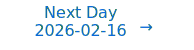

# Personalized Daily ArXiv Papers 2026-02-13

| *[gpt-5]*   | Prompt   | Completion   | Total   |
|:-----------:|:--------:|:------------:|:-------:|
| **Token**   | 59225    | 54067        | 113292  |
| **Cost**    | $0.07    | $0.54        | $0.61   |

Total arXiv papers: 684

Total scanned papers: 441

Total relevant papers: 36

**Table of contents with paper titles:**

1. [Causal-JEPA: Learning World Models through Object-Level Latent Interventions](#user-content-link1)
**Authors:** Heejeong Nam, Quentin Le Lidec, Lucas Maes, Yann LeCun, Randall Balestriero

2. [RAM-Net: Expressive Linear Attention with Selectively Addressable Memory](#user-content-link2)
**Authors:** Kaicheng Xiao, Haotian Li, Liran Dong, Guoliang Xing

3. [Extending Puzzle for Mixture-of-Experts Reasoning Models with Application to GPT-OSS Acceleration](#user-content-link3)
**Authors:** Akhiad Bercovich, Nir Ailon, Vladimir Anisimov, Tomer Asida, Nave Assaf, Mohammad Dabbah, Ido Galil, Amnon Geifman, Yonatan Geifman, Izhak Golan, Roi Koren, Itay Levy, Zach Moshe, Pavlo Molchanov, Najeeb Nabwani, Mostofa Patwari, Omri Puny, Tomer Ronen, Itamar Schen, Elad Segal, Ido Shahaf, Oren Tropp, Ran Zilberstein, Ran El-Yaniv

4. [Krause Synchronization Transformers](#user-content-link4)
**Authors:** Jingkun Liu, Yisong Yue, Max Welling, Yue Song

5. [LAER-MoE: Load-Adaptive Expert Re-layout for Efficient Mixture-of-Experts Training](#user-content-link5)
**Authors:** Xinyi Liu, Yujie Wang, Fangcheng Fu, Xuefeng Xiao, Huixia Li, Jiashi Li, Bin Cui

6. [KBVQ-MoE: KLT-guided SVD with Bias-Corrected Vector Quantization for MoE Large Language Models](#user-content-link6)
**Authors:** Zukang Xu, Zhixiong Zhao, Xing Hu, Zhixuan Chen, Dawei Yang

7. [Retrieval-Aware Distillation for Transformer-SSM Hybrids](#user-content-link7)
**Authors:** Aviv Bick, Eric P. Xing, Albert Gu

8. [MELINOE: Fine-Tuning Enables Memory-Efficient Inference for Mixture-of-Experts Models](#user-content-link8)
**Authors:** Arian Raje, Anupam Nayak, Gauri Joshi

9. [Learning to Forget Attention: Memory Consolidation for Adaptive Compute Reduction](#user-content-link9)
**Authors:** Ibne Farabi Shihab, Sanjeda Akter, Anuj Sharma

10. [From Atoms to Trees: Building a Structured Feature Forest with Hierarchical Sparse Autoencoders](#user-content-link10)
**Authors:** Yifan Luo, Yang Zhan, Jiedong Jiang, Tianyang Liu, Mingrui Wu, Zhennan Zhou, Bin Dong

11. [Spectra: Rethinking Optimizers for LLMs Under Spectral Anisotropy](#user-content-link11)
**Authors:** Zhendong Huang, Hengjie Cao, Fang Dong, Ruijun Huang, Mengyi Chen, Yifeng Yang, Xin Zhang, Anrui Chen, Mingzhi Dong, Yujiang Wang, Jinlong Hou, Qin Lv, Robert P. Dick, Yuan Cheng, Fan Yang, Tun Lu, Li Shang

12. [GHOST: Unmasking Phantom States in Mamba2 via Grouped Hidden-state Output-aware Selection & Truncation](#user-content-link12)
**Authors:** Michael Menezes, Anastasios Kyrillidis

13. [Improved state mixing in higher-order and block diagonal linear recurrent networks](#user-content-link13)
**Authors:** Igor Dubinin, Antonio Orvieto, Felix Effenberger

14. [Sparse Semantic Dimension as a Generalization Certificate for LLMs](#user-content-link14)
**Authors:** Dibyanayan Bandyopadhyay, Asif Ekbal

15. [HiFloat4 Format for Language Model Inference](#user-content-link15)
**Authors:** Yuanyong Luo, Jing Huang, Yu Cheng, Ziwei Yu, Kaihua Zhang, Kehong Hong, Xinda Ma, Xin Wang, Anping Tong, Guipeng Hu, Yun Xu, Mehran Taghian, Peng Wu, Guanglin Li, Yunke Peng, Tianchi Hu, Minqi Chen, Michael Bi Mi, Hu Liu, Xiping Zhou, Junsong Wang, Qiang Lin, Heng Liao

16. [SpiralFormer: Looped Transformers Can Learn Hierarchical Dependencies via Multi-Resolution Recursion](#user-content-link16)
**Authors:** Chengting Yu, Xiaobo Shu, Yadao Wang, Yizhen Zhang, Haoyi Wu, You Wu, Rujiao Long, Ziheng Chen, Yuchi Xu, Wenbo Su, Bo Zheng

17. [MiniCPM-SALA: Hybridizing Sparse and Linear Attention for Efficient Long-Context Modeling](#user-content-link17)
**Authors:** MiniCPM Team, Wenhao An, Yingfa Chen, Yewei Fang, Jiayi Li, Xin Li, Yaohui Li, Yishan Li, Yuxuan Li, Biyuan Lin, Chuan Liu, Hezi Liu, Siyuan Liu, Hongya Lyu, Yinxu Pan, Shixin Ren, Xingyu Shen, Zhou Su, Haojun Sun, Yangang Sun, Zhen Leng Thai, Xin Tian, Rui Wang, Xiaorong Wang, Yudong Wang, Bo Wu, Xiaoyue Xu, Dong Xu, Shuaikang Xue, Jiawei Yang, Bowen Zhang, Jinqian Zhang, Letian Zhang, Shengnan Zhang, Xinyu Zhang, Xinyuan Zhang, Zhu Zhang, Hengyu Zhao, Jiacheng Zhao, Jie Zhou, Zihan Zhou, Shuo Wang, Chaojun Xiao, Xu Han, Zhiyuan Liu, Maosong Sun

18. [PrefillShare: A Shared Prefill Module for KV Reuse in Multi-LLM Disaggregated Serving](#user-content-link18)
**Authors:** Sunghyeon Woo, Hoseung Kim, Sunghwan Shim, Minjung Jo, Hyunjoon Jeong, Jeongtae Lee, Joonghoon Kim, Sungjae Lee, Baeseong Park, Se Jung Kwon, Dongsoo Lee

19. [Towards Compressive and Scalable Recurrent Memory](#user-content-link19)
**Authors:** Yunchong Song, Jushi Kai, Liming Lu, Kaixi Qiu, Zhouhan Lin

20. [Prototype Transformer: Towards Language Model Architectures Interpretable by Design](#user-content-link20)
**Authors:** Yordan Yordanov, Matteo Forasassi, Bayar Menzat, Ruizhi Wang, Chang Qi, Markus Kaltenberger, Amine M'Charrak, Tommaso Salvatori, Thomas Lukasiewicz

21. [HLA: Hadamard Linear Attention](#user-content-link21)
**Authors:** Hanno Ackermann, Hong Cai, Mohsen Ghafoorian, Amirhossein Habibian

22. [Predicting LLM Output Length via Entropy-Guided Representations](#user-content-link22)
**Authors:** Huanyi Xie, Yubin Chen, Liangyu Wang, Lijie Hu, Di Wang

23. [The Implicit Bias of Logit Regularization](#user-content-link23)
**Authors:** Alon Beck, Yohai Bar Sinai, Noam Levi

24. [Protein Circuit Tracing via Cross-layer Transcoders](#user-content-link24)
**Authors:** Darin Tsui, Kunal Talreja, Daniel Saeedi, Amirali Aghazadeh

25. [MonarchRT: Efficient Attention for Real-Time Video Generation](#user-content-link25)
**Authors:** Krish Agarwal, Zhuoming Chen, Cheng Luo, Yongqi Chen, Haizhong Zheng, Xun Huang, Atri Rudra, Beidi Chen

26. [Efficient Analysis of the Distilled Neural Tangent Kernel](#user-content-link26)
**Authors:** Jamie Mahowald, Brian Bell, Alex Ho, Michael Geyer

27. [ThinkRouter: Efficient Reasoning via Routing Thinking between Latent and Discrete Spaces](#user-content-link27)
**Authors:** Xin Xu, Tong Yu, Xiang Chen, Haoliang Wang, Julian McAuley, Saayan Mitra

28. [Manifold-Aware Temporal Domain Generalization for Large Language Models](#user-content-link28)
**Authors:** Yiheng Yao, Zekun Cai, Xinyuan Song, Hiroki Hill Kobayashi, Xuan Song, Ryosuke Shibasaki, Liang Zhao

29. [Beyond Parameter Arithmetic: Sparse Complementary Fusion for Distribution-Aware Model Merging](#user-content-link29)
**Authors:** Weihong Lin, Lin Sun, Qilong Shi, Aomufei Yuan, Yuxuan Tian, Zhengyang Wang, Guangxiang Zhao, Xiangzheng Zhang, Tong Yang

30. [RooflineBench: A Benchmarking Framework for On-Device LLMs via Roofline Analysis](#user-content-link30)
**Authors:** Zhen Bi, Xueshu Chen, Luoyang Sun, Yuhang Yao, Qing Shen, Jungang Lou, Cheng Deng

31. [Enforcing Reciprocity in Operator Learning for Seismic Wave Propagation](#user-content-link31)
**Authors:** Caifeng Zou, Yaozhong Shi, Zachary E. Ross, Robert W. Clayton, Kamyar Azizzadenesheli

32. [Differentially Private and Communication Efficient Large Language Model Split Inference via Stochastic Quantization and Soft Prompt](#user-content-link32)
**Authors:** Yujie Gu, Richeng Jin, Xiaoyu Ji, Yier Jin, Wenyuan Xu

33. [Hierarchical Concept Embedding & Pursuit for Interpretable Image Classification](#user-content-link33)
**Authors:** Nghia Nguyen, Tianjiao Ding, Ren\'e Vidal

34. [In-Context Function Learning in Large Language Models](#user-content-link34)
**Authors:** Elif Akata, Konstantinos Voudouris, Vincent Fortuin, Eric Schulz

35. [The Observer Effect in World Models: Invasive Adaptation Corrupts Latent Physics](#user-content-link35)
**Authors:** Christian Intern\`o, Jumpei Yamaguchi, Loren Amdahl-Culleton, Markus Olhofer, David Klindt, Barbara Hammer

36. [TAVAE: A VAE with Adaptable Priors Explains Contextual Modulation in the Visual Cortex](#user-content-link36)
**Authors:** Bal\'azs Mesz\'ena, Keith T. Murray, Julien Corbo, O. Batuhan Erkat, M\'arton A. Hajnal, Pierre-Olivier Polack, Gerg\H{o} Orb\'an

---

## 1. [Causal-JEPA: Learning World Models through Object-Level Latent Interventions](https://arxiv.org/abs/2602.11389) 

**ArXiv ID:** 2602.11389

**Authors:** Heejeong Nam, Quentin Le Lidec, Lucas Maes, Yann LeCun, Randall Balestriero

**Abstract:** World models require robust relational understanding to support prediction, reasoning, and control. While object-centric representations provide a useful abstraction, they are not sufficient to capture interaction-dependent dynamics. We therefore propose C-JEPA, a simple and flexible object-centric world model that extends masked joint embedding prediction from image patches to object-centric representations. By applying object-level masking that requires an object's state to be inferred from other objects, C-JEPA induces latent interventions with counterfactual-like effects and prevents shortcut solutions, making interaction reasoning essential. Empirically, C-JEPA leads to consistent gains in visual question answering, with an absolute improvement of about 20\% in counterfactual reasoning compared to the same architecture without object-level masking. On agent control tasks, C-JEPA enables substantially more efficient planning by using only 1\% of the total latent input features required by patch-based world models, while achieving comparable performance. Finally, we provide a formal analysis demonstrating that object-level masking induces a causal inductive bias via latent interventions. Our code is available at https://github.com/galilai-group/cjepa.

**Comment:** Author match

---

## 2. [RAM-Net: Expressive Linear Attention with Selectively Addressable Memory](https://arxiv.org/abs/2602.11958) 

**ArXiv ID:** 2602.11958

**Authors:** Kaicheng Xiao, Haotian Li, Liran Dong, Guoliang Xing

**Abstract:** While linear attention architectures offer efficient inference, compressing unbounded history into a fixed-size memory inherently limits expressivity and causes information loss. To address this limitation, we introduce Random Access Memory Network (RAM-Net), a novel architecture designed to bridge the gap between the representational capacity of full attention and the memory efficiency of linear models. The core of RAM-Net maps inputs to high-dimensional sparse vectors serving as explicit addresses, allowing the model to selectively access a massive memory state. This design enables exponential state size scaling without additional parameters, which significantly mitigates signal interference and enhances retrieval fidelity. Moreover, the inherent sparsity ensures exceptional computational efficiency, as state updates are confined to minimal entries. Extensive experiments demonstrate that RAM-Net consistently surpasses state-of-the-art baselines in fine-grained long-range retrieval tasks and achieves competitive performance in standard language modeling and zero-shot commonsense reasoning benchmarks, validating its superior capability to capture complex dependencies with significantly reduced computational overhead.

**Comment:** Matches Model Architecture and Efficiency: RAM-Net introduces selectively addressable sparse memory enabling expressive linear attention with random access.

**Relevance:** 10
**Novelty:** 9

---

## 3. [Extending Puzzle for Mixture-of-Experts Reasoning Models with Application to GPT-OSS Acceleration](https://arxiv.org/abs/2602.11937) 

**ArXiv ID:** 2602.11937

**Authors:** Akhiad Bercovich, Nir Ailon, Vladimir Anisimov, Tomer Asida, Nave Assaf, Mohammad Dabbah, Ido Galil, Amnon Geifman, Yonatan Geifman, Izhak Golan, Roi Koren, Itay Levy, Zach Moshe, Pavlo Molchanov, Najeeb Nabwani, Mostofa Patwari, Omri Puny, Tomer Ronen, Itamar Schen, Elad Segal, Ido Shahaf, Oren Tropp, Ran Zilberstein, Ran El-Yaniv

**Abstract:** Reasoning-focused LLMs improve answer quality by generating longer reasoning traces, but the additional tokens dramatically increase serving cost, motivating inference optimization. We extend and apply Puzzle, a post-training neural architecture search (NAS) framework, to gpt-oss-120B to produce gpt-oss-puzzle-88B, a deployment-optimized derivative. Our approach combines heterogeneous MoE expert pruning, selective replacement of full-context attention with window attention, FP8 KV-cache quantization with calibrated scales, and post-training reinforcement learning to recover accuracy, while maintaining low generation length. In terms of per-token speeds, on an 8XH100 node we achieve 1.63X and 1.22X throughput speedups in long-context and short-context settings, respectively. gpt-oss-puzzle-88B also delivers throughput speedups of 2.82X on a single NVIDIA H100 GPU. However, because token counts can change with reasoning effort and model variants, per-token throughput (tok/s) and latency (ms/token) do not necessarily lead to end-to-end speedups: a 2X throughput gain is erased if traces grow 2X. Conversely, throughput gains can be spent on more reasoning tokens to improve accuracy; we therefore advocate request-level efficiency metrics that normalize throughput by tokens generated and trace an accuracy--speed frontier across reasoning efforts. We show that gpt-oss-puzzle-88B improves over gpt-oss-120B along the entire frontier, delivering up to 1.29X higher request-level efficiency. Across various benchmarks, gpt-oss-puzzle-88B matches or slightly exceeds the parent on suite-average accuracy across reasoning efforts, with retention ranging from 100.8% (high) to 108.2% (low), showing that post-training architecture search can substantially reduce inference costs without sacrificing quality.

**Comment:** Model Compression and Efficiency + MoE: heterogeneous MoE expert pruning, windowed attention replacement, and FP8 KV-cache quantization via post-training NAS for inference acceleration.

**Relevance:** 10
**Novelty:** 8

---

## 4. [Krause Synchronization Transformers](https://arxiv.org/abs/2602.11534) 

**ArXiv ID:** 2602.11534

**Authors:** Jingkun Liu, Yisong Yue, Max Welling, Yue Song

**Abstract:** Self-attention in Transformers relies on globally normalized softmax weights, causing all tokens to compete for influence at every layer. When composed across depth, this interaction pattern induces strong synchronization dynamics that favor convergence toward a dominant mode, a behavior associated with representation collapse and attention sink phenomena. We introduce Krause Attention, a principled attention mechanism inspired by bounded-confidence consensus dynamics. Krause Attention replaces similarity-based global aggregation with distance-based, localized, and selectively sparse interactions, promoting structured local synchronization instead of global mixing. We relate this behavior to recent theory modeling Transformer dynamics as interacting particle systems, and show how bounded-confidence interactions naturally moderate attention concentration and alleviate attention sinks. Restricting interactions to local neighborhoods also reduces runtime complexity from quadratic to linear in sequence length. Experiments across vision (ViT on CIFAR/ImageNet), autoregressive generation (MNIST/CIFAR-10), and large language models (Llama/Qwen) demonstrate consistent gains with substantially reduced computation, highlighting bounded-confidence dynamics as a scalable and effective inductive bias for attention.

**Comment:** C1+C2: Model architecture and efficiency—localized, selectively sparse attention (Krause Attention) with linear time complexity.

**Relevance:** 10
**Novelty:** 8

---

## 5. [LAER-MoE: Load-Adaptive Expert Re-layout for Efficient Mixture-of-Experts Training](https://arxiv.org/abs/2602.11686) 

**ArXiv ID:** 2602.11686

**Authors:** Xinyi Liu, Yujie Wang, Fangcheng Fu, Xuefeng Xiao, Huixia Li, Jiashi Li, Bin Cui

**Abstract:** Expert parallelism is vital for effectively training Mixture-of-Experts (MoE) models, enabling different devices to host distinct experts, with each device processing different input data. However, during expert parallel training, dynamic routing results in significant load imbalance among experts: a handful of overloaded experts hinder overall iteration, emerging as a training bottleneck.   In this paper, we introduce LAER-MoE, an efficient MoE training framework. The core of LAER-MoE is a novel parallel paradigm, Fully Sharded Expert Parallel (FSEP), which fully partitions each expert parameter by the number of devices and restores partial experts at expert granularity through All-to-All communication during training. This allows for flexible re-layout of expert parameters during training to enhance load balancing. In particular, we perform fine-grained scheduling of communication operations to minimize communication overhead. Additionally, we develop a load balancing planner to formulate re-layout strategies of experts and routing schemes for tokens during training. We perform experiments on an A100 cluster, and the results indicate that our system achieves up to 1.69x acceleration compared to the current state-of-the-art training systems. Source code available at https://github.com/PKU-DAIR/Hetu-Galvatron/tree/laer-moe.

**Comment:** Matches High Performance Computing and MoE Architecture: introduces Fully Sharded Expert Parallelism and adaptive expert re-layout for load-balanced MoE training.

**Relevance:** 10
**Novelty:** 8

---

## 6. [KBVQ-MoE: KLT-guided SVD with Bias-Corrected Vector Quantization for MoE Large Language Models](https://arxiv.org/abs/2602.11184) 

**ArXiv ID:** 2602.11184

**Authors:** Zukang Xu, Zhixiong Zhao, Xing Hu, Zhixuan Chen, Dawei Yang

**Abstract:** Mixture of Experts (MoE) models have achieved great success by significantly improving performance while maintaining computational efficiency through sparse expert activation. However, their enormous parameter sizes and memory demands pose major challenges for deployment in resource-constrained environments. Vector Quantization (VQ) offers a promising approach for ultra-low-bit compression in Large Language Models (LLMs) by leveraging a codebook, where weight vectors are mapped to the most similar discrete codewords. Yet, directly applying VQ to MoEs often leads to substantial performance degradation due to two critical obstacles: (1) redundant representations among experts cause VQ to repeatedly quantize similar representations for each expert, resulting in inefficient use of limited codebook capacity; and (2) cumulative output bias is amplified by expert aggregation in MoE layers, leading to distributional shifts in the quantized outputs. To address these issues, we propose KBVQ-MoE, a novel VQ framework to enhance extremely low-bit quantization for MoE-based LLMs. KBVQ-MoE integrates two techniques: (1) input-driven redundancy elimination, where a Karhunen-Loeve Transform (KLT) guided singular value decomposition (SVD) extracts dominant weight components and shares them across experts; and (2) bias-corrected output stabilization, where vector quantization is applied only to expert-specific (non-redundant) representations and the quantized outputs are corrected via channel-wise affine compensation. Experiments on various MoE LLMs demonstrate that KBVQ-MoE preserves accuracy substantially better than existing quantization methods. For example, 3-bit quantization of Qwen1.5-MoE-A2.7B achieves an average accuracy of 67.99, nearly identical to the FP16 baseline of 68.07, underscoring KBVQ-MoE's potential for efficient deployment on edge devices and other resource-constrained platforms.

**Comment:** Matches Compression/Efficiency and MoE: KLT-guided SVD plus bias-corrected vector quantization for ultra-low-bit MoE LLMs.

**Relevance:** 10
**Novelty:** 8

---

## 7. [Retrieval-Aware Distillation for Transformer-SSM Hybrids](https://arxiv.org/abs/2602.11374) 

**ArXiv ID:** 2602.11374

**Authors:** Aviv Bick, Eric P. Xing, Albert Gu

**Abstract:** State-space models (SSMs) offer efficient sequence modeling but lag behind Transformers on benchmarks that require in-context retrieval. Prior work links this gap to a small set of attention heads, termed Gather-and-Aggregate (G&A), which SSMs struggle to reproduce. We propose *retrieval-aware distillation*, which converts a pretrained Transformer into a hybrid student by preserving only these retrieval-critical heads and distilling the rest into recurrent heads. We identify the essential heads via ablation on a synthetic retrieval task, producing a hybrid with sparse, non-uniform attention placement. We show that preserving **just 2% of attention heads recovers over 95% of teacher performance on retrieval-heavy tasks** (10 heads in a 1B model), requiring far fewer heads than hybrids that retain at least 25%. We further find that large recurrent states often compensate for missing retrieval: once retrieval is handled by these heads, the SSM backbone can be simplified with limited loss, even with an $8\times$ reduction in state dimension. By reducing both the attention cache and the SSM state, the resulting hybrid is $5$--$6\times$ more memory-efficient than comparable hybrids, closing the Transformer--SSM gap at a fraction of the memory cost.

**Comment:** Model Architecture/Efficiency: retrieval-aware distillation to build Transformer–SSM hybrids by preserving only retrieval-critical heads; 5–6x memory savings.

**Relevance:** 10
**Novelty:** 8

---

## 8. [MELINOE: Fine-Tuning Enables Memory-Efficient Inference for Mixture-of-Experts Models](https://arxiv.org/abs/2602.11192) 

**ArXiv ID:** 2602.11192

**Authors:** Arian Raje, Anupam Nayak, Gauri Joshi

**Abstract:** Mixture-of-Experts (MoE) model architectures can significantly reduce the number of activated parameters per token, enabling computationally efficient training and inference. However, their large overall parameter counts and model sizes have precluded their widespread usage in resource-constrained settings as all of the parameters must still be loaded into GPU memory. Prior works aim to address this memory bottleneck by offloading certain experts into CPU memory and porting them to GPU memory only when they are activated. In practice, these methods suffer from the significant I/O latency incurred by expert transfer. We present MELINOE, a method that fine-tunes an MoE model to more strongly prefer activating a smaller number of experts per sequence. Caching these preferred experts in GPU memory reduces expert churn and CPU-GPU transfer overhead. MELINOE increases throughput by $1.2-3\times$ over efficient baselines and up to $14.7\times$ over transfer-heavy baselines while retaining or even improving the performance of the model on a downstream task, making it a reliable method for improving MoE inference efficiency.

**Comment:** Mixture-of-Experts Efficiency: fine-tuning to reduce experts-per-sequence and cache preferred experts, cutting CPU–GPU transfers and boosting throughput up to 14.7x.

**Relevance:** 10
**Novelty:** 8

---

## 9. [Learning to Forget Attention: Memory Consolidation for Adaptive Compute Reduction](https://arxiv.org/abs/2602.12204) 

**ArXiv ID:** 2602.12204

**Authors:** Ibne Farabi Shihab, Sanjeda Akter, Anuj Sharma

**Abstract:** Hybrid architectures combining state-space models with attention have achieved strong efficiency-quality tradeoffs, yet existing approaches either apply attention uniformly or learn static sparse patterns. This misses a key opportunity: \emph{attention demand should decrease over time as recurring patterns become familiar}. We present a surprising finding from analyzing GPT-2 models: \textbf{88\%} of attention operations retrieve information already predictable from the model's hidden state, and this redundancy does \emph{not} decrease during training. Motivated by this observation, we introduce \textbf{\ours{}} (\textbf{C}onsolidation-based \textbf{R}outing for \textbf{A}daptive \textbf{M}emory), a biologically inspired memory consolidation mechanism that gradually distills episodic retrievals into parametric semantic memory. Unlike prior sparse attention methods, \ours{} exhibits \emph{decreasing attention utilization} over training, achieving a \textbf{37.8$\times$} reduction through a sharp phase transition at approximately 3K steps. We prove that this capability is \emph{impossible} without consolidation: any static routing scheme requires $\Omega(f \cdot n)$ attention for tasks with recurring patterns of frequency $f$. On our proposed SRCD benchmark, \ours{} achieves \textbf{100\% retrieval accuracy} at 1.6\% attention compute (vs.\ 68\% for baselines), and consolidated patterns transfer to unseen tasks with \textbf{48--52\%} attention reduction without retraining. Remarkably, the learned consolidation dynamics quantitatively match human episodic-to-semantic memory transition curves from cognitive psychology ($\gamma = 0.43$ vs.\ $\gamma_{\text{human}} \approx 0.4$--$0.5$). Code and benchmarks are available at [anonymized].

**Comment:** Efficiency/Conditional Networks: consolidation-based routing that provably reduces attention compute over training with adaptive memory consolidation.

**Relevance:** 9
**Novelty:** 9

---

## 10. [From Atoms to Trees: Building a Structured Feature Forest with Hierarchical Sparse Autoencoders](https://arxiv.org/abs/2602.11881) 

**ArXiv ID:** 2602.11881

**Authors:** Yifan Luo, Yang Zhan, Jiedong Jiang, Tianyang Liu, Mingrui Wu, Zhennan Zhou, Bin Dong

**Abstract:** Sparse autoencoders (SAEs) have proven effective for extracting monosemantic features from large language models (LLMs), yet these features are typically identified in isolation. However, broad evidence suggests that LLMs capture the intrinsic structure of natural language, where the phenomenon of "feature splitting" in particular indicates that such structure is hierarchical. To capture this, we propose the Hierarchical Sparse Autoencoder (HSAE), which jointly learns a series of SAEs and the parent-child relationships between their features. HSAE strengthens the alignment between parent and child features through two novel mechanisms: a structural constraint loss and a random feature perturbation mechanism. Extensive experiments across various LLMs and layers demonstrate that HSAE consistently recovers semantically meaningful hierarchies, supported by both qualitative case studies and rigorous quantitative metrics. At the same time, HSAE preserves the reconstruction fidelity and interpretability of standard SAEs across different dictionary sizes. Our work provides a powerful, scalable tool for discovering and analyzing the multi-scale conceptual structures embedded in LLM representations.

**Comment:** Representation Learning: introduces hierarchical sparse autoencoders to discover multi-scale, monosemantic feature hierarchies in LLMs.

**Relevance:** 9
**Novelty:** 8

---

## 11. [Spectra: Rethinking Optimizers for LLMs Under Spectral Anisotropy](https://arxiv.org/abs/2602.11185) 

**ArXiv ID:** 2602.11185

**Authors:** Zhendong Huang, Hengjie Cao, Fang Dong, Ruijun Huang, Mengyi Chen, Yifeng Yang, Xin Zhang, Anrui Chen, Mingzhi Dong, Yujiang Wang, Jinlong Hou, Qin Lv, Robert P. Dick, Yuan Cheng, Fan Yang, Tun Lu, Li Shang

**Abstract:** Gradient signals in LLM training are highly anisotropic: recurrent linguistic structure concentrates energy into a small set of dominant spectral directions, while context specific information resides in a long tail. We show that this spike tail separation persists throughout training, with the spike occupying only about 1.5% of directions yet dominating optimizer statistics. This dominance suppresses tail learning by contracting tail updates through second moment normalization and tightening the globally stable learning rate bound. Motivated by this analysis, we propose Spectra, a spike aware optimizer that suppresses the dominant low rank spike subspace without amplifying the noise sensitive spectral tail. Spectra tracks the spike subspace via cached, warm started power iteration and applies low rank spectral shaping with negligible overhead and substantially reduced optimizer state memory. On LLaMA3 8B trained on 50B tokens, Spectra reaches the same target loss 30% faster than AdamW, reduces per step end to end overhead by 0.7%, cuts optimizer state memory by 49.25%, and improves average downstream accuracy by 1.62%. Compared to Muon, Spectra is 5.1x faster in optimizer processing time, achieves a lower final loss, and improves average accuracy by 0.66%.

**Comment:** High Performance Computing/Efficiency: spike-aware optimizer that shapes low-rank spectral components, accelerates LLM training, and cuts optimizer state memory.

**Relevance:** 9
**Novelty:** 8

---

## 12. [GHOST: Unmasking Phantom States in Mamba2 via Grouped Hidden-state Output-aware Selection & Truncation](https://arxiv.org/abs/2602.11408) 

**ArXiv ID:** 2602.11408

**Authors:** Michael Menezes, Anastasios Kyrillidis

**Abstract:** While Mamba2's expanded state dimension enhances temporal modeling, it incurs substantial inference overhead that saturates bandwidth during autoregressive generation. Standard pruning methods fail to address this bottleneck: unstructured sparsity leaves activations dense, magnitude-based selection ignores runtime dynamics, and gradient-based methods impose prohibitive costs. We introduce GHOST (Grouped Hidden-state Output-aware Selection and Truncation), a structured pruning framework that approximates control-theoretic balanced truncation using only forward-pass statistics. By jointly measuring controllability and observability, GHOST rivals the fidelity of gradient-based methods without requiring backpropagation. As a highlight, on models ranging from 130M to 2.7B parameters, our approach achieves a 50\% state-dimension reduction with approximately 1 perplexity point increase on WikiText-2. Code is available at https://anonymous.4open.science/r/mamba2_ghost-7BCB/.

**Comment:** Model Compression and Efficiency: structured pruning of Mamba2 state dimension via forward-only controllability/observability (balanced truncation-inspired).

**Relevance:** 9
**Novelty:** 8

---

## 13. [Improved state mixing in higher-order and block diagonal linear recurrent networks](https://arxiv.org/abs/2602.12021) 

**ArXiv ID:** 2602.12021

**Authors:** Igor Dubinin, Antonio Orvieto, Felix Effenberger

**Abstract:** Linear recurrent networks (LRNNs) and linear state space models (SSMs) promise computational and memory efficiency on long-sequence modeling tasks, yet their diagonal state transitions limit expressivity. Dense and nonlinear architectures (e.g., LSTMs) on the other hand are provably more expressive, but computationally costly. Here, we explore how expressivity in LRNNs can be increased via richer state mixing across time and channels while maintaining competitive efficiency. Specifically, we introduce two structured LRNN architectures: (i) Higher-order Linear Recurrent Units (H-LRU), which generalize first-order recurrence to higher order, mixing multiple past states, and (ii) Block-Diagonal LRUs (BD-LRU), which enable dense intra-block channel mixing. Per-channel (H-LRU) or per-row (BD-LRU) L1-normalization of selective gates stabilizes training and allows for scaling window/block sizes. A parallel-scan implementation of the proposed architectures keeps the throughput competitive with diagonal LRNNs for moderate orders (H-LRU) and block sizes (BD-LRU). In synthetic sequence modeling tasks, the performance of BD-LRU matches or exceeds those of linear SSMs (Mamba), low-rank LRNNs (DeltaNet) and LSTM baselines, while H-LRU is found to be the most parameter-efficient in compression task. In both synthetic sequence modeling and language modeling, our results indicate that the structure of state mixing rather than width alone shapes expressivity of LRNNs, offering a practical route to closing the efficiency-expressivity gap in linear sequence models.

**Comment:** Model Architecture — introduces higher-order and block-diagonal linear recurrent units (H-LRU, BD-LRU) with structured state mixing and parallel-scan implementation to boost expressivity at LRNN efficiency.

**Relevance:** 9
**Novelty:** 8

---

## 14. [Sparse Semantic Dimension as a Generalization Certificate for LLMs](https://arxiv.org/abs/2602.11388) 

**ArXiv ID:** 2602.11388

**Authors:** Dibyanayan Bandyopadhyay, Asif Ekbal

**Abstract:** Standard statistical learning theory predicts that Large Language Models (LLMs) should overfit because their parameter counts vastly exceed the number of training tokens. Yet, in practice, they generalize robustly. We propose that the effective capacity controlling generalization lies in the geometry of the model's internal representations: while the parameter space is high-dimensional, the activation states lie on a low-dimensional, sparse manifold. To formalize this, we introduce the Sparse Semantic Dimension (SSD), a complexity measure derived from the active feature vocabulary of a Sparse Autoencoder (SAE) trained on the model's layers. Treating the LLM and SAE as frozen oracles, we utilize this framework to attribute the model's generalization capabilities to the sparsity of the dictionary rather than the total parameter count. Empirically, we validate this framework on GPT-2 Small and Gemma-2B, demonstrating that our bound provides non-vacuous certificates at realistic sample sizes. Crucially, we uncover a counter-intuitive "feature sharpness" scaling law: despite being an order of magnitude larger, Gemma-2B requires significantly fewer calibration samples to identify its active manifold compared to GPT-2, suggesting that larger models learn more compressible, distinct semantic structures. Finally, we show that this framework functions as a reliable safety monitor: out-of-distribution inputs trigger a measurable "feature explosion" (a sharp spike in active features), effectively signaling epistemic uncertainty through learned feature violation. Code is available at: https://github.com/newcodevelop/sparse-semantic-dimension.

**Comment:** Representation Learning — proposes Sparse Semantic Dimension using sparse autoencoder feature vocabularies to certify LLM generalization and reveals scaling laws of learned features.

**Relevance:** 9
**Novelty:** 8

---

## 15. [HiFloat4 Format for Language Model Inference](https://arxiv.org/abs/2602.11287) 

**ArXiv ID:** 2602.11287

**Authors:** Yuanyong Luo, Jing Huang, Yu Cheng, Ziwei Yu, Kaihua Zhang, Kehong Hong, Xinda Ma, Xin Wang, Anping Tong, Guipeng Hu, Yun Xu, Mehran Taghian, Peng Wu, Guanglin Li, Yunke Peng, Tianchi Hu, Minqi Chen, Michael Bi Mi, Hu Liu, Xiping Zhou, Junsong Wang, Qiang Lin, Heng Liao

**Abstract:** This paper introduces HiFloat4 (HiF4), a block floating-point data format tailored for deep learning. Each HiF4 unit packs 64 4-bit elements with 32 bits of shared scaling metadata, averaging 4.5 bits per value. The metadata specifies a three-level scaling hierarchy, capturing inter- and intra-group dynamic range while improving the utilization of the representational space. In addition, the large 64-element group size enables matrix multiplications to be executed in a highly fixed-point manner, significantly reducing hardware area and power consumption. To evaluate the proposed format, we conducted inference experiments on several language models, including LLaMA, Qwen, Mistral, DeepSeek-V3.1 and LongCat. Results show that HiF4 achieves higher average accuracy than the state-of-the-art NVFP4 format across multiple models and diverse downstream tasks.

**Comment:** Model Compression and Efficiency — introduces a hierarchical 4-bit block floating-point format (HiF4) enabling mostly fixed-point matmuls and improved inference efficiency on LLMs.

**Relevance:** 9
**Novelty:** 8

---

## 16. [SpiralFormer: Looped Transformers Can Learn Hierarchical Dependencies via Multi-Resolution Recursion](https://arxiv.org/abs/2602.11698) 

**ArXiv ID:** 2602.11698

**Authors:** Chengting Yu, Xiaobo Shu, Yadao Wang, Yizhen Zhang, Haoyi Wu, You Wu, Rujiao Long, Ziheng Chen, Yuchi Xu, Wenbo Su, Bo Zheng

**Abstract:** Recursive (looped) Transformers decouple computational depth from parameter depth by repeatedly applying shared layers, providing an explicit architectural primitive for iterative refinement and latent reasoning. However, early looped Transformers often underperform non-recursive baselines of equal compute. While recent literature has introduced more effective recursion mechanisms to mitigate this gap, existing architectures still operate at a fixed, full-token resolution, neglecting the potential efficiency of computing over compressed latent representations. In this paper, we propose SpiralFormer, a looped Transformer that executes recurrence under a multi-resolution recursion schedule. We provide probing evidence that multi-resolution recursion enables the model to learn hierarchical dependencies by inducing iteration-wise functional specialization across different scales. Empirically, SpiralFormer achieves better parameter and compute efficiency than both looped and non-looped baselines across model scales from 160M to 1.4B, establishing sequence resolution as a potential axis for scaling recursive architectures.

**Comment:** Model Architecture — introduces SpiralFormer, a looped Transformer with multi-resolution recursion enabling hierarchical dependencies and improved parameter/compute efficiency.

**Relevance:** 9
**Novelty:** 8

---

## 17. [MiniCPM-SALA: Hybridizing Sparse and Linear Attention for Efficient Long-Context Modeling](https://arxiv.org/abs/2602.11761) 

**ArXiv ID:** 2602.11761

**Authors:** MiniCPM Team, Wenhao An, Yingfa Chen, Yewei Fang, Jiayi Li, Xin Li, Yaohui Li, Yishan Li, Yuxuan Li, Biyuan Lin, Chuan Liu, Hezi Liu, Siyuan Liu, Hongya Lyu, Yinxu Pan, Shixin Ren, Xingyu Shen, Zhou Su, Haojun Sun, Yangang Sun, Zhen Leng Thai, Xin Tian, Rui Wang, Xiaorong Wang, Yudong Wang, Bo Wu, Xiaoyue Xu, Dong Xu, Shuaikang Xue, Jiawei Yang, Bowen Zhang, Jinqian Zhang, Letian Zhang, Shengnan Zhang, Xinyu Zhang, Xinyuan Zhang, Zhu Zhang, Hengyu Zhao, Jiacheng Zhao, Jie Zhou, Zihan Zhou, Shuo Wang, Chaojun Xiao, Xu Han, Zhiyuan Liu, Maosong Sun

**Abstract:** The evolution of large language models (LLMs) towards applications with ultra-long contexts faces challenges posed by the high computational and memory costs of the Transformer architecture. While existing sparse and linear attention mechanisms attempt to mitigate these issues, they typically involve a trade-off between memory efficiency and model performance. This paper introduces MiniCPM-SALA, a 9B-parameter hybrid architecture that integrates the high-fidelity long-context modeling of sparse attention (InfLLM-V2) with the global efficiency of linear attention (Lightning Attention). By employing a layer selection algorithm to integrate these mechanisms in a 1:3 ratio and utilizing a hybrid positional encoding (HyPE), the model maintains efficiency and performance for long-context tasks. Furthermore, we introduce a cost-effective continual training framework that transforms pre-trained Transformer-based models into hybrid models, which reduces training costs by approximately 75% compared to training from scratch. Extensive experiments show that MiniCPM-SALA maintains general capabilities comparable to full-attention models while offering improved efficiency. On a single NVIDIA A6000D GPU, the model achieves up to 3.5x the inference speed of the full-attention model at the sequence length of 256K tokens and supports context lengths of up to 1M tokens, a scale where traditional full-attention 8B models fail because of memory constraints.

**Comment:** Model Architecture + Efficiency: hybrid sparse (InfLLM-V2) and linear (Lightning) attention with hybrid positional encoding enabling 256K–1M context at up to 3.5x speed.

**Relevance:** 9
**Novelty:** 8

---

## 18. [PrefillShare: A Shared Prefill Module for KV Reuse in Multi-LLM Disaggregated Serving](https://arxiv.org/abs/2602.12029) 

**ArXiv ID:** 2602.12029

**Authors:** Sunghyeon Woo, Hoseung Kim, Sunghwan Shim, Minjung Jo, Hyunjoon Jeong, Jeongtae Lee, Joonghoon Kim, Sungjae Lee, Baeseong Park, Se Jung Kwon, Dongsoo Lee

**Abstract:** Multi-agent systems increasingly orchestrate multiple specialized language models to solve complex real-world problems, often invoking them over a shared context. This execution pattern repeatedly processes the same prompt prefix across models. Consequently, each model redundantly executes the prefill stage and maintains its own key-value (KV) cache, increasing aggregate prefill load and worsening tail latency by intensifying prefill-decode interference in existing LLM serving stacks. Disaggregated serving reduces such interference by placing prefill and decode on separate GPUs, but disaggregation does not fundamentally eliminate inter-model redundancy in computation and KV storage for the same prompt. To address this issue, we propose PrefillShare, a novel algorithm that enables sharing the prefill stage across multiple models in a disaggregated setting. PrefillShare factorizes the model into prefill and decode modules, freezes the prefill module, and fine-tunes only the decode module. This design allows multiple task-specific models to share a prefill module and the KV cache generated for the same prompt. We further introduce a routing mechanism that enables effective prefill sharing across heterogeneous models in a vLLM-based disaggregated system. PrefillShare not only matches full fine-tuning accuracy on a broad range of tasks and models, but also delivers 4.5x lower p95 latency and 3.9x higher throughput in multi-model agent workloads.

**Comment:** HPC/Systems: shared prefill module and KV-cache reuse across multiple LLMs in disaggregated serving, with routing; 4.5x lower p95 latency and 3.9x higher throughput.

**Relevance:** 9
**Novelty:** 8

---

## 19. [Towards Compressive and Scalable Recurrent Memory](https://arxiv.org/abs/2602.11212) 

**ArXiv ID:** 2602.11212

**Authors:** Yunchong Song, Jushi Kai, Liming Lu, Kaixi Qiu, Zhouhan Lin

**Abstract:** Transformers face a quadratic bottleneck in attention when scaling to long contexts. Recent approaches introduce recurrent memory to extend context beyond the current window, yet these often face a fundamental trade-off between theoretical principles and practical scalability. To address this, we introduce Elastic Memory, a novel memory architecture grounded in the HiPPO framework for online function approximation. Elastic Memory treats historical sequence as samples from continuous signals, applying optimal online compression to encode them into a fixed-size memory state. For retrieval, we propose a flexible \textit{polynomial sampling} mechanism that reconstructs a history summary from this compressed state. Elastic Memory consistently outperformed baselines on long-context (32k+) datasets across three domains. With equal parameters, it beat Memorizing Transformer by 16x memory and outperformed Melodi at all memory sizes, even when Melodi had 30% more parameters. When scaling model size, Elastic Memory stayed ahead of all baselines and was significantly faster than Melodi at 4x size. Furthermore, its decoupled design allows for injecting inductive biases at test-time to boost performance.

**Comment:** Model Architecture/Efficiency: HiPPO-grounded Elastic Memory with polynomial sampling for long-context recurrent memory; large memory and speed advantages.

**Relevance:** 9
**Novelty:** 8

---

## 20. [Prototype Transformer: Towards Language Model Architectures Interpretable by Design](https://arxiv.org/abs/2602.11852) 

**ArXiv ID:** 2602.11852

**Authors:** Yordan Yordanov, Matteo Forasassi, Bayar Menzat, Ruizhi Wang, Chang Qi, Markus Kaltenberger, Amine M'Charrak, Tommaso Salvatori, Thomas Lukasiewicz

**Abstract:** While state-of-the-art language models (LMs) surpass the vast majority of humans in certain domains, their reasoning remains largely opaque, undermining trust in their output. Furthermore, while autoregressive LMs can output explicit reasoning, their true reasoning process is opaque, which introduces risks like deception and hallucination. In this work, we introduce the Prototype Transformer (ProtoT) -- an autoregressive LM architecture based on prototypes (parameter vectors), posed as an alternative to the standard self-attention-based transformers. ProtoT works by means of two-way communication between the input sequence and the prototypes, and we show that this leads to the prototypes automatically capturing nameable concepts (e.g. "woman") during training. They provide the potential to interpret the model's reasoning and allow for targeted edits of its behavior. Furthermore, by design, the prototypes create communication channels that aggregate contextual information at different time scales, aiding interpretability. In terms of computation scalability, ProtoT scales linearly with sequence length vs the quadratic scalability of SOTA self-attention transformers. Compared to baselines, ProtoT scales well with model and data size, and performs well on text generation and downstream tasks (GLUE). ProtoT exhibits robustness to input perturbations on par or better than some baselines, but differs from them by providing interpretable pathways showing how robustness and sensitivity arises. Reaching close to the performance of state-of-the-art architectures, ProtoT paves the way to creating well-performing autoregressive LMs interpretable by design.

**Comment:** Model Architecture: prototype-based autoregressive LM replacing self-attention with two-way prototype communication; linear sequence scaling and interpretability.

**Relevance:** 9
**Novelty:** 8

---

## 21. [HLA: Hadamard Linear Attention](https://arxiv.org/abs/2602.12128) 

**ArXiv ID:** 2602.12128

**Authors:** Hanno Ackermann, Hong Cai, Mohsen Ghafoorian, Amirhossein Habibian

**Abstract:** The attention mechanism is an important reason for the success of transformers. It relies on computing pairwise relations between tokens. To reduce the high computational cost of standard quadratic attention, linear attention has been proposed as an efficient approximation. It employs kernel functions that are applied independently to the inputs before the pairwise similarities are calculated. That allows for an efficient computational procedure which, however, amounts to a low-degree rational function approximating softmax.   We propose Hadamard Linear Attention (HLA). Unlike previous works on linear attention, the nonlinearity in HLA is not applied separately to queries and keys, but, analogously to standard softmax attention, after the pairwise similarities have been computed. It will be shown that the proposed nonlinearity amounts to a higher-degree rational function to approximate softmax. An efficient computational scheme for the proposed method is derived that is similar to that of standard linear attention. In contrast to other approaches, no time-consuming tensor reshaping is necessary to apply the proposed algorithm. The effectiveness of the approach is demonstrated by applying it to a large diffusion transformer model for video generation, an application that involves very large amounts of tokens.

**Comment:** Model Architecture/Efficiency: proposes a new linear attention (Hadamard Linear Attention) with an efficient scheme approximating softmax.

**Relevance:** 9
**Novelty:** 7

---

## 22. [Predicting LLM Output Length via Entropy-Guided Representations](https://arxiv.org/abs/2602.11812) 

**ArXiv ID:** 2602.11812

**Authors:** Huanyi Xie, Yubin Chen, Liangyu Wang, Lijie Hu, Di Wang

**Abstract:** The long-tailed distribution of sequence lengths in LLM serving and reinforcement learning (RL) sampling causes significant computational waste due to excessive padding in batched inference. Existing methods rely on auxiliary models for static length prediction, but they incur high overhead, generalize poorly, and fail in stochastic "one-to-many" sampling scenarios. We introduce a lightweight framework that reuses the main model's internal hidden states for efficient length prediction. Our framework features two core components: 1) Entropy-Guided Token Pooling (EGTP), which uses on-the-fly activations and token entropy for highly accurate static prediction with negligible cost, and 2) Progressive Length Prediction (PLP), which dynamically estimates the remaining length at each decoding step to handle stochastic generation. To validate our approach, we build and release ForeLen, a comprehensive benchmark with long-sequence, Chain-of-Thought, and RL data. On ForeLen, EGTP achieves state-of-the-art accuracy, reducing MAE by 29.16\% over the best baseline. Integrating our methods with a length-aware scheduler yields significant end-to-end throughput gains. Our work provides a new technical and evaluation baseline for efficient LLM inference.

**Comment:** Matches Efficiency/HPC: reuses model hidden states for entropy-guided and progressive length prediction to improve batched inference throughput.

**Relevance:** 9
**Novelty:** 7

---

## 23. [The Implicit Bias of Logit Regularization](https://arxiv.org/abs/2602.12039) 

**ArXiv ID:** 2602.12039

**Authors:** Alon Beck, Yohai Bar Sinai, Noam Levi

**Abstract:** Logit regularization, the addition a convex penalty directly in logit space, is widely used in modern classifiers, with label smoothing as a prominent example. While such methods often improve calibration and generalization, their mechanism remains under-explored. In this work, we analyze a general class of such logit regularizers in the context of linear classification, and demonstrate that they induce an implicit bias of logit clustering around finite per-sample targets. For Gaussian data, or whenever logits are sufficiently clustered, we prove that logit clustering drives the weight vector to align exactly with Fisher's Linear Discriminant. To demonstrate the consequences, we study a simple signal-plus-noise model in which this transition has dramatic effects: Logit regularization halves the critical sample complexity and induces grokking in the small-noise limit, while making generalization robust to noise. Our results extend the theoretical understanding of label smoothing and highlight the efficacy of a broader class of logit-regularization methods.

**Comment:** C4: Representation learning—theoretical analysis of logit regularization’s implicit bias and training dynamics.

**Relevance:** 8
**Novelty:** 8

---

## 24. [Protein Circuit Tracing via Cross-layer Transcoders](https://arxiv.org/abs/2602.12026) 

**ArXiv ID:** 2602.12026

**Authors:** Darin Tsui, Kunal Talreja, Daniel Saeedi, Amirali Aghazadeh

**Abstract:** Protein language models (pLMs) have emerged as powerful predictors of protein structure and function. However, the computational circuits underlying their predictions remain poorly understood. Recent mechanistic interpretability methods decompose pLM representations into interpretable features, but they treat each layer independently and thus fail to capture cross-layer computation, limiting their ability to approximate the full model. We introduce ProtoMech, a framework for discovering computational circuits in pLMs using cross-layer transcoders that learn sparse latent representations jointly across layers to capture the model's full computational circuitry. Applied to the pLM ESM2, ProtoMech recovers 82-89% of the original performance on protein family classification and function prediction tasks. ProtoMech then identifies compressed circuits that use <1% of the latent space while retaining up to 79% of model accuracy, revealing correspondence with structural and functional motifs, including binding, signaling, and stability. Steering along these circuits enables high-fitness protein design, surpassing baseline methods in more than 70% of cases. These results establish ProtoMech as a principled framework for protein circuit tracing.

**Comment:** Matches Representation Learning and Compression: cross-layer sparse transcoders recover and compress computational circuits across layers in pLMs.

**Relevance:** 8
**Novelty:** 8

---

## 25. [MonarchRT: Efficient Attention for Real-Time Video Generation](https://arxiv.org/abs/2602.12271) 

**ArXiv ID:** 2602.12271

**Authors:** Krish Agarwal, Zhuoming Chen, Cheng Luo, Yongqi Chen, Haizhong Zheng, Xun Huang, Atri Rudra, Beidi Chen

**Abstract:** Real-time video generation with Diffusion Transformers is bottlenecked by the quadratic cost of 3D self-attention, especially in real-time regimes that are both few-step and autoregressive, where errors compound across time and each denoising step must carry substantially more information. In this setting, we find that prior sparse-attention approximations break down, despite showing strong results for bidirectional, many-step diffusion. Specifically, we observe that video attention is not reliably sparse, but instead combines pronounced periodic structure driven by spatiotemporal position with dynamic, sparse semantic correspondences and dense mixing, exceeding the representational capacity of even oracle top-k attention. Building on this insight, we propose Monarch-RT, a structured attention parameterization for video diffusion models that factorizes attention using Monarch matrices. Through appropriately aligned block structure and our extended tiled Monarch parameterization, we achieve high expressivity while preserving computational efficiency. We further overcome the overhead of parameterization through finetuning, with custom Triton kernels. We first validate the high efficacy of Monarch-RT over existing sparse baselines designed only for bidirectional models. We further observe that Monarch-RT attains up to 95% attention sparsity with no loss in quality when applied to the state-of-the-art model Self-Forcing, making Monarch-RT a pioneering work on highly-capable sparse attention parameterization for real-time video generation. Our optimized implementation outperforms FlashAttention-2, FlashAttention-3, and FlashAttention-4 kernels on Nvidia RTX 5090, H100, and B200 GPUs respectively, providing kernel speedups in the range of 1.4-11.8X. This enables us, for the first time, to achieve true real-time video generation with Self-Forcing at 16 FPS on a single RTX 5090.

**Comment:** Model Efficiency: structured attention via Monarch matrices with custom kernels, achieving large speedups and high sparsity while preserving video diffusion quality.

**Relevance:** 8
**Novelty:** 8

---

## 26. [Efficient Analysis of the Distilled Neural Tangent Kernel](https://arxiv.org/abs/2602.11320) 

**ArXiv ID:** 2602.11320

**Authors:** Jamie Mahowald, Brian Bell, Alex Ho, Michael Geyer

**Abstract:** Neural tangent kernel (NTK) methods are computationally limited by the need to evaluate large Jacobians across many data points. Existing approaches reduce this cost primarily through projecting and sketching the Jacobian. We show that NTK computation can also be reduced by compressing the data dimension itself using NTK-tuned dataset distillation. We demonstrate that the neural tangent space spanned by the input data can be induced by dataset distillation, yielding a 20-100$\times$ reduction in required Jacobian calculations. We further show that per-class NTK matrices have low effective rank that is preserved by this reduction. Building on these insights, we propose the distilled neural tangent kernel (DNTK), which combines NTK-tuned dataset distillation with state-of-the-art projection methods to reduce up NTK computational complexity by up to five orders of magnitude while preserving kernel structure and predictive performance.

**Comment:** Efficiency for NTK computation: NTK-tuned dataset distillation (DNTK) drastically reduces Jacobian evaluations while preserving kernel structure/performance.

**Relevance:** 8
**Novelty:** 8

---

## 27. [ThinkRouter: Efficient Reasoning via Routing Thinking between Latent and Discrete Spaces](https://arxiv.org/abs/2602.11683) 

**ArXiv ID:** 2602.11683

**Authors:** Xin Xu, Tong Yu, Xiang Chen, Haoliang Wang, Julian McAuley, Saayan Mitra

**Abstract:** Recent work explores latent reasoning to improve reasoning efficiency by replacing explicit reasoning trajectories with continuous representations in a latent space, yet its effectiveness varies across settings. Analysis of model confidence dynamics under latent reasoning reveals that thinking trajectories ending in incorrect answers contain fewer low-confidence steps than those ending in correct answers. Meanwhile, we suggest that soft embeddings aggregated by multiple low-confidence thinking alternatives may introduce and propagate noise, leading to high confidence in unreliable reasoning trajectories. Motivated by these observations, ThinkRouter, an inference-time confidence-aware routing mechanism is proposed to avoid high confidence and noise for efficient reasoning. ThinkRouter routes thinking to the discrete token space when model confidence is low, and to the latent space otherwise. Extensive experiments on STEM reasoning and coding benchmarks across diverse large reasoning models demonstrate that ThinkRouter outperforms explicit CoT, random routing, and latent reasoning baselines in terms of accuracy, achieving an average improvement of 19.70 points in Pass@1, while reducing generation length by up to 15.55%. Further comprehensive analysis reveals that ThinkRouter can calibrate errors arising from explicit CoT and latent reasoning, and accelerates end-of-thinking token generation by globally lowering model confidence.

**Comment:** Conditional/Dynamic Networks: confidence-aware routing between discrete CoT and latent reasoning to improve efficiency and accuracy.

**Relevance:** 8
**Novelty:** 7

---

## 28. [Manifold-Aware Temporal Domain Generalization for Large Language Models](https://arxiv.org/abs/2602.11965) 

**ArXiv ID:** 2602.11965

**Authors:** Yiheng Yao, Zekun Cai, Xinyuan Song, Hiroki Hill Kobayashi, Xuan Song, Ryosuke Shibasaki, Liang Zhao

**Abstract:** Temporal distribution shifts are pervasive in real-world deployments of Large Language Models (LLMs), where data evolves continuously over time. While Temporal Domain Generalization (TDG) seeks to model such structured evolution, existing approaches characterize model adaptation in the full parameter space. This formulation becomes computationally infeasible for modern LLMs. This paper introduces a geometric reformulation of TDG under parameter-efficient fine-tuning. We establish that the low-dimensional temporal structure underlying model evolution can be preserved under parameter-efficient reparameterization, enabling temporal modeling without operating in the ambient parameter space. Building on this principle, we propose Manifold-aware Temporal LoRA (MaT-LoRA), which constrains temporal updates to a shared low-dimensional manifold within a low-rank adaptation subspace, and models its evolution through a structured temporal core. This reparameterization dramatically reduces temporal modeling complexity while retaining expressive power. Extensive experiments on synthetic and real-world datasets, including scientific documents, news publishers, and review ratings, demonstrate that MaT-LoRA achieves superior temporal generalization performance with practical scalability for LLMs.

**Comment:** Model Compression and Efficiency — Manifold-aware Temporal LoRA constrains temporal updates to a shared low-dimensional manifold within a low-rank adaptation subspace; also offers insights into temporal representation dynamics.

**Relevance:** 8
**Novelty:** 7

---

## 29. [Beyond Parameter Arithmetic: Sparse Complementary Fusion for Distribution-Aware Model Merging](https://arxiv.org/abs/2602.11717) 

**ArXiv ID:** 2602.11717

**Authors:** Weihong Lin, Lin Sun, Qilong Shi, Aomufei Yuan, Yuxuan Tian, Zhengyang Wang, Guangxiang Zhao, Xiangzheng Zhang, Tong Yang

**Abstract:** Model merging has emerged as a promising paradigm for composing the capabilities of large language models by directly operating in weight space, enabling the integration of specialized models without costly retraining. However, existing merging methods largely rely on parameter-space heuristics, which often introduce severe interference, leading to degraded generalization and unstable generation behaviors such as repetition and incoherent outputs. In this work, we propose Sparse Complementary Fusion with reverse KL (SCF-RKL), a novel model merging framework that explicitly controls functional interference through sparse, distribution-aware updates. Instead of assuming linear additivity in parameter space, SCF-RKL measures the functional divergence between models using reverse Kullback-Leibler divergence and selectively incorporates complementary parameters. This mode-seeking, sparsity-inducing design effectively preserves stable representations while integrating new capabilities. We evaluate SCF-RKL across a wide range of model scales and architectures, covering both reasoning-focused and instruction-tuned models. Extensive experiments on 24 benchmarks spanning advanced reasoning, general reasoning and knowledge, instruction following, and safety demonstrate, vision classification that SCF-RKL consistently outperforms existing model merging methods while maintaining strong generalization and generation stability.

**Comment:** Model Compression and Efficiency — proposes sparse, distribution-aware weight-space merging via reverse KL to control interference and fuse capabilities without retraining.

**Relevance:** 8
**Novelty:** 7

---

## 30. [RooflineBench: A Benchmarking Framework for On-Device LLMs via Roofline Analysis](https://arxiv.org/abs/2602.11506) 

**ArXiv ID:** 2602.11506

**Authors:** Zhen Bi, Xueshu Chen, Luoyang Sun, Yuhang Yao, Qing Shen, Jungang Lou, Cheng Deng

**Abstract:** The transition toward localized intelligence through Small Language Models (SLMs) has intensified the need for rigorous performance characterization on resource-constrained edge hardware. However, objectively measuring the theoretical performance ceilings of diverse architectures across heterogeneous platforms remains a formidable challenge. In this work, we propose a systematic framework based on the Roofline model that unifies architectural primitives and hardware constraints through the lens of operational intensity (OI). By defining an inference-potential region, we introduce the Relative Inference Potential as a novel metric to compare efficiency differences between Large Language Models (LLMs) on the same hardware substrate. Extensive empirical analysis across diverse compute tiers reveals that variations in performance and OI are significantly influenced by sequence length. We further identify a critical regression in OI as model depth increases. Additionally, our findings highlight an efficiency trap induced by hardware heterogeneity and demonstrate how structural refinements, such as Multi-head Latent Attention (M LA), can effectively unlock latent inference potential across various hardware substrates. These insights provide actionable directions for hardware-software co-design to align neural structures with physical constraints in on-device intelligence. The released code is available in the Appendix C.

**Comment:** High Performance Computing — Roofline-based benchmarking and a new Relative Inference Potential metric to analyze and compare on-device LLM efficiency under hardware constraints.

**Relevance:** 8
**Novelty:** 7

---

## 31. [Enforcing Reciprocity in Operator Learning for Seismic Wave Propagation](https://arxiv.org/abs/2602.11631) 

**ArXiv ID:** 2602.11631

**Authors:** Caifeng Zou, Yaozhong Shi, Zachary E. Ross, Robert W. Clayton, Kamyar Azizzadenesheli

**Abstract:** Accurate and efficient wavefield modeling underpins seismic structure and source studies. Traditional methods comply with physical laws but are computationally intensive. Data-driven methods, while opening new avenues for advancement, have yet to incorporate strict physical consistency. The principle of reciprocity is one of the most fundamental physical laws in wave propagation. We introduce the Reciprocity-Enforced Neural Operator (RENO), a transformer-based architecture for modeling seismic wave propagation that hard-codes the reciprocity principle. The model leverages the cross-attention mechanism and commutative operations to guarantee invariance under swapping source and receiver positions. Beyond improved physical consistency, the proposed architecture supports simultaneous realizations for multiple sources without crosstalk issues. This yields an order-of-magnitude inference speedup at a similar memory footprint over an reciprocity-unenforced neural operator on a realistic configuration. We demonstrate the functionality using the reciprocity relation for particle velocity fields under single forces. This architecture is also applicable to pressure fields under dilatational sources and travel-time fields governed by the eikonal equation, paving the way for encoding more complex reciprocity relations.

**Comment:** C1: Model architecture—transformer-based neural operator with reciprocity hard-coded via cross-attention and commutative operations.

**Relevance:** 8
**Novelty:** 7

---

## 32. [Differentially Private and Communication Efficient Large Language Model Split Inference via Stochastic Quantization and Soft Prompt](https://arxiv.org/abs/2602.11513) 

**ArXiv ID:** 2602.11513

**Authors:** Yujie Gu, Richeng Jin, Xiaoyu Ji, Yier Jin, Wenyuan Xu

**Abstract:** Large Language Models (LLMs) have achieved remarkable performance and received significant research interest. The enormous computational demands, however, hinder the local deployment on devices with limited resources. The current prevalent LLM inference paradigms require users to send queries to the service providers for processing, which raises critical privacy concerns. Existing approaches propose to allow the users to obfuscate the token embeddings before transmission and utilize local models for denoising. Nonetheless, transmitting the token embeddings and deploying local models may result in excessive communication and computation overhead, preventing practical implementation. In this work, we propose \textbf{DEL}, a framework for \textbf{D}ifferentially private and communication \textbf{E}fficient \textbf{L}LM split inference. More specifically, an embedding projection module and a differentially private stochastic quantization mechanism are proposed to reduce the communication overhead in a privacy-preserving manner. To eliminate the need for local models, we adapt soft prompt at the server side to compensate for the utility degradation caused by privacy. To the best of our knowledge, this is the first work that utilizes soft prompt to improve the trade-off between privacy and utility in LLM inference, and extensive experiments on text generation and natural language understanding benchmarks demonstrate the effectiveness of the proposed method.

**Comment:** C2: Compression/Efficiency—stochastic quantization and embedding projection for private, communication-efficient split inference.

**Relevance:** 8
**Novelty:** 7

---

## 33. [Hierarchical Concept Embedding & Pursuit for Interpretable Image Classification](https://arxiv.org/abs/2602.11448) 

**ArXiv ID:** 2602.11448

**Authors:** Nghia Nguyen, Tianjiao Ding, Ren\'e Vidal

**Abstract:** Interpretable-by-design models are gaining traction in computer vision because they provide faithful explanations for their predictions. In image classification, these models typically recover human-interpretable concepts from an image and use them for classification. Sparse concept recovery methods leverage the latent space of vision-language models to represent image embeddings as a sparse combination of concept embeddings. However, because such methods ignore the hierarchical structure of concepts, they can produce correct predictions with explanations that are inconsistent with the hierarchy. In this work, we propose Hierarchical Concept Embedding \& Pursuit (HCEP), a framework that induces a hierarchy of concept embeddings in the latent space and uses hierarchical sparse coding to recover the concepts present in an image. Given a hierarchy of semantic concepts, we construct a corresponding hierarchy of concept embeddings and, assuming the correct concepts for an image form a rooted path in the hierarchy, derive desirable conditions for identifying them in the embedded space. We show that hierarchical sparse coding reliably recovers hierarchical concept embeddings, whereas vanilla sparse coding fails. Our experiments on real-world datasets demonstrate that HCEP outperforms baselines in concept precision and recall while maintaining competitive classification accuracy. Moreover, when the number of samples is limited, HCEP achieves superior classification accuracy and concept recovery. These results show that incorporating hierarchical structures into sparse coding yields more reliable and interpretable image classification models.

**Comment:** Matches Representation Learning: hierarchical sparse coding with concept embeddings leveraging VLM latent space for interpretable classification.

**Relevance:** 8
**Novelty:** 7

---

## 34. [In-Context Function Learning in Large Language Models](https://arxiv.org/abs/2602.11863) 

**ArXiv ID:** 2602.11863

**Authors:** Elif Akata, Konstantinos Voudouris, Vincent Fortuin, Eric Schulz

**Abstract:** Large language models (LLMs) can learn from a few demonstrations provided at inference time. We study this in-context learning phenomenon through the lens of Gaussian Processes (GPs). We build controlled experiments where models observe sequences of multivariate scalar-valued function samples drawn from known GP priors. We evaluate prediction error in relation to the number of demonstrations and compare against two principled references: (i) an empirical GP-regression learner that gives a lower bound on achievable error, and (ii) the expected error of a 1-nearest-neighbor (1-NN) rule, which gives a data-driven upper bound. Across model sizes, we find that LLM learning curves are strongly influenced by the function-generating kernels and approach the GP lower bound as the number of demonstrations increases. We then study the inductive biases of these models using a likelihood-based analysis. We find that LLM predictions are most likely under less smooth GP kernels. Finally, we explore whether post-training can shift these inductive biases and improve sample-efficiency on functions sampled from GPs with smoother kernels. We find that both reinforcement learning and supervised fine-tuning can effectively shift inductive biases in the direction of the training data. Together, our framework quantifies the extent to which LLMs behave like GP learners and provides tools for steering their inductive biases for continuous function learning tasks.

**Comment:** Matches Representation Learning/Training Dynamics: GP-based analysis of in-context learning and inductive biases with methods to steer them.

**Relevance:** 8
**Novelty:** 7

---

## 35. [The Observer Effect in World Models: Invasive Adaptation Corrupts Latent Physics](https://arxiv.org/abs/2602.12218) 

**ArXiv ID:** 2602.12218

**Authors:** Christian Intern\`o, Jumpei Yamaguchi, Loren Amdahl-Culleton, Markus Olhofer, David Klindt, Barbara Hammer

**Abstract:** Determining whether neural models internalize physical laws as world models, rather than exploiting statistical shortcuts, remains challenging, especially under out-of-distribution (OOD) shifts. Standard evaluations often test latent capability via downstream adaptation (e.g., fine-tuning or high-capacity probes), but such interventions can change the representations being measured and thus confound what was learned during self-supervised learning (SSL). We propose a non-invasive evaluation protocol, PhyIP. We test whether physical quantities are linearly decodable from frozen representations, motivated by the linear representation hypothesis. Across fluid dynamics and orbital mechanics, we find that when SSL achieves low error, latent structure becomes linearly accessible. PhyIP recovers internal energy and Newtonian inverse-square scaling on OOD tests (e.g., $\rho > 0.90$). In contrast, adaptation-based evaluations can collapse this structure ($\rho \approx 0.05$). These findings suggest that adaptation-based evaluation can obscure latent structures and that low-capacity probes offer a more accurate evaluation of physical world models.

**Comment:** Matches Representation Learning: proposes non-invasive linear-probe evaluation (PhyIP) to assess latent physical structure without adaptation.

**Relevance:** 8
**Novelty:** 7

---

## 36. [TAVAE: A VAE with Adaptable Priors Explains Contextual Modulation in the Visual Cortex](https://arxiv.org/abs/2602.11956) 

**ArXiv ID:** 2602.11956

**Authors:** Bal\'azs Mesz\'ena, Keith T. Murray, Julien Corbo, O. Batuhan Erkat, M\'arton A. Hajnal, Pierre-Olivier Polack, Gerg\H{o} Orb\'an

**Abstract:** The brain interprets visual information through learned regularities, a computation formalized as probabilistic inference under a prior. The visual cortex establishes priors for this inference, some delivered through established top-down connections that inform low-level cortices about statistics represented at higher levels in the cortical hierarchy. While evidence shows that adaptation leads to priors reflecting the structure of natural images, it remains unclear whether similar priors can be flexibly acquired when learning a specific task. To investigate this, we built a generative model of V1 optimized for a simple discrimination task and analyzed it together with large-scale recordings from mice performing an analogous task. In line with recent approaches, we assumed that neuronal activity in V1 corresponds to latent posteriors in the generative model, enabling investigation of task-related priors in neuronal responses. To obtain a flexible test bed, we extended the VAE formalism so that a task can be acquired efficiently by reusing previously learned representations. Task-specific priors learned by this Task-Amortized VAE were used to investigate biases in mice and model when presenting stimuli that violated trained task statistics. Mismatch between learned task statistics and incoming sensory evidence produced signatures of uncertainty in stimulus category in the TAVAE posterior, reflecting properties of bimodal response profiles in V1 recordings. The task-optimized generative model accounted for key characteristics of V1 population activity, including within-day updates to population responses. Our results confirm that flexible task-specific contextual priors can be learned on demand by the visual system and deployed as early as the entry level of visual cortex.

**Comment:** Model Architecture and Representation Learning: extends VAE with adaptable task-specific priors (Task-Amortized VAE) enabling flexible contextual inference.

**Relevance:** 8
**Novelty:** 7

---

# Paper Selection Prompt

## System Prompt

> You are a helpful paper reading assistant whose job is to read daily posts from ArXiv and identify a few papers that your friend will enjoy reading.
> Your job is to carefully read the paper titles and abstracts below and find the ones that match the criteria below.

## User Prompt

> ## Instructions
> 
> Write the response in JSONL format with {ARXIVID, COMMENT, RELEVANCE, NOVELTY} on each line, one for each paper.
> 
> - ARXIVID: should be the ArXiv ID.
> - COMMENT: should identify whether there is a criteria that match the paper very closely. These matches should not be based on general terms like "language modeling" or "advancements" and should specifically refer to a criterion. No need to mention the non-matching criteria.
> - RELEVANCE: should be a score from 1-10.
> - NOVELTY: should be a score from 1-10.
> 
> ## Scoring Criteria
> 
> > The "Relevance" score measures how closely the paper aligns with the core topics of the prompt.
> > The "Novelty" score assesses the originality and impact of the paper.
> > They are two **ORTHONORMAL** axes and **SHOULD NOT** be confused with each other.
> 
> ### Relevance Scoring
> 
> - Relevance 9-10 (Completely Relevant)
>   - Focus: Fully aligned with core topics with no deviation, score the highest if contains relevant keywords in it.
>   - Examples: Papers focused on foundational methods or theoretical research, whose titles contain topic keywords like "MoE".
> 
> - Relevance 7-8 (Relevant)
>   - Focus: Retain a solid link to the main research area, though may touch on peripheral elements.
>   - Examples: Papers research on the fundamental part of MoE through a less critical aspect like its behavior in GNN.
> 
> - Relevance 5-6 (Borderline)
>   - Focus: Maintains a link to the core topic but also extends into at least one other domain/area beyond the primary focus.
>   - Examples: Work referencing MoE centered on reinforcement learning.
> 
> - Relevance 3-4 (Irrelevant)
>   - Focus: Largely outside our interests with no association to our topics.
>   - Examples: Application-focused papers like using MoE to solve a problem in the real world.
> 
> - Relevance 1-2 (Ignore)
>   - Focus: Purely unrelated to our topics. Completely a different domain.
>   - **Exception**: If the paper hints at a cutting-edge, radically new direction that could eventually transform the primary domain, consider a score of 9–10 despite initial appearances. (Usually a very rare concept that belongs to the fundamental research)
> 
> ### Novelty Scoring
> 
> - Novelty 9-10 (Breakthrough)
>   - Definition: Groundbreaking methods/theory introducing new directions or solving major challenges.
>   - Examples: Entirely new paradigm for foundational models; a novel theory transforming representation learning.
> 
> - Novelty 7-8 (Improvements)
>   - Definition: Substantial insights/enhancements, though not a full paradigm shift.
>   - Examples: Modifications on existing methods yielding significantly better results.
> 
> - Novelty 5-6 (Borderline)
>   - Definition: Incremental contributions with possible long-term benefits, not immediately transformative.
>   - Examples: Moderately novel extension to an existing architecture; refining current methods without fundamentally altering them.
> 
> - Novelty 3-4 (Tangential)
>   - Definition: Minor or domain-specific improvements with limited broader impact.
>   - Examples: Slight modifications to known methods with strange motivation; purely engineering jobs like a new benchmark/dataset.
> 
> - Novelty 1-2 (Low)
>   - Definition: Minimal originality, applying standard approaches without real innovation.
>   - Examples: Using an off-the-shelf model without adding new insights; purely application-driven studies like finetuning a pretrained model using existing methods.
> 
> ## Papers
> 
> [PAPER LIST HERE]
> 
> ## Relevant Topics
> 
> Use the following relevance criteria to focus on foundational research. Keep **relevant** papers and filter out **irrelevant** ones. Avoid purely **application-driven** work.
> 
> 1. Model Architecture
>    - Relevant: Mixture-of-Experts (MoE), Transformers, Conditional/Dynamic Networks, Autoencoders, analysis/innovations on existing architectures.
>    - Irrelevant: Merely using existing architectures for a certain task without insights into the structure themselves.
> 
> 2. Model Compression and Efficiency
>    - Relevant: Sparsity, pruning, quantization, low-rank approaches, cache, or other algorithmic/theoretical efficiency breakthroughs.
>    - Irrelevant: Straightforward applications of existing compression methods to new tasks.
> 
> 3. High Performance Computing
>    - Relevant: Algorithmic or systems-level innovations enabling training of large-scale models, distributed training techniques, memory optimization.
>    - Irrelevant: Incremental engineering improvements without novel algorithmic contributions.
> 
> 4. Representation Learning
>    - Relevant: Insights into how deep networks encode information, feature/dictionary learning, sparse/contrastive methods, training dynamics in neural networks.
>    - Irrelevant: Standard applications of known techniques lacking new theoretical or methodological contributions.
> 
> **Keywords:**
> 
> - Relevant: Mixture of Experts (MoE), Representation Learning, Compression/Efficiency, Sparse/Sparsity, Pruning, Quantization, Low-rank, Foundation Model, etc.
> - Irrelevant: Reinforcement Learning, Transfer Learning, Federated Learning, Online Learning, Diffusion Models, etc.
> - Application: Image Segmentation, Medical Imaging, 3D Vision, Video Understanding, Information Retrieval, Summarization, Recommendation Systems, Machine Translation, Speech Recognition, Signal Processing, Spatial/Temporal Modeling, Time Series, Knowledge Graph, etc.