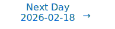

# Personalized Daily ArXiv Papers 2026-02-17

| *[gpt-5]*   | Prompt   | Completion   | Total   |
|:-----------:|:--------:|:------------:|:-------:|
| **Token**   | 79972    | 67019        | 146991  |
| **Cost**    | $0.1     | $0.67        | $0.77   |

Total arXiv papers: 1082

Total scanned papers: 655

Total relevant papers: 56

**Table of contents with paper titles:**

1. [Radial-VCReg: More Informative Representation Learning Through Radial Gaussianization](#user-content-link1)
**Authors:** Yilun Kuang, Yash Dagade, Deep Chakraborty, Erik Learned-Miller, Randall Balestriero, Tim G. J. Rudner, Yann LeCun

2. [Geometry-Preserving Aggregation for Mixture-of-Experts Embedding Models](#user-content-link2)
**Authors:** Sajjad Kachuee, Mohammad Sharifkhani

3. [WiSparse: Boosting LLM Inference Efficiency with Weight-Aware Mixed Activation Sparsity](#user-content-link3)
**Authors:** Lei Chen, Yuan Meng, Xiaoyu Zhan, Zhi Wang, Wenwu Zhu

4. [Divine Benevolence is an $x^2$: GLUs scale asymptotically faster than MLPs](#user-content-link4)
**Authors:** Alejandro Francisco Queiruga

5. [S2D: Selective Spectral Decay for Quantization-Friendly Conditioning of Neural Activations](#user-content-link5)
**Authors:** Arnav Chavan, Nahush Lele, Udbhav Bamba, Sankalp Dayal, Aditi Raghunathan, Deepak Gupta

6. [Synergistic Intra- and Cross-Layer Regularization Losses for MoE Expert Specialization](#user-content-link6)
**Authors:** Rizhen Hu, Yuan Cao, Boao Kong, Mou Sun, Kun Yuan

7. [The Quantization Trap: Breaking Linear Scaling Laws in Multi-Hop Reasoning](#user-content-link7)
**Authors:** Henry Han, Xiyang Liu, Xiaodong Wang, Fei Han, Xiaodong Li

8. [SpargeAttention2: Trainable Sparse Attention via Hybrid Top-k+Top-p Masking and Distillation Fine-Tuning](#user-content-link8)
**Authors:** Jintao Zhang, Kai Jiang, Chendong Xiang, Weiqi Feng, Yuezhou Hu, Haocheng Xi, Jianfei Chen, Jun Zhu

9. [Cognitive Chunking for Soft Prompts: Accelerating Compressor Learning via Block-wise Causal Masking](#user-content-link9)
**Authors:** Guojie Liu, Yiqi Wang, Yanfeng Yang, Wenqi Fan, Songlei Jian, Jianfeng Zhang, Jie Yu

10. [Algorithmic Simplification of Neural Networks with Mosaic-of-Motifs](#user-content-link10)
**Authors:** Pedram Bakhtiarifard, Tong Chen, Jonathan Wensh{\o}j, Erik B Dam, Raghavendra Selvan

11. [KernelBlaster: Continual Cross-Task CUDA Optimization via Memory-Augmented In-Context Reinforcement Learning](#user-content-link11)
**Authors:** Kris Shengjun Dong, Sahil Modi, Dima Nikiforov, Sana Damani, Edward Lin, Siva Kumar Sastry Hari, Christos Kozyrakis

12. [A Theoretical Framework for LLM Fine-tuning Using Early Stopping for Non-random Initialization](#user-content-link12)
**Authors:** Zexuan Sun, Garvesh Raskutti

13. [General learned delegation by clones](#user-content-link13)
**Authors:** Darren Li, Meiqi Chen, Chenze Shao, Fandong Meng, Jie Zhou

14. [Fast Catch-Up, Late Switching: Optimal Batch Size Scheduling via Functional Scaling Laws](#user-content-link14)
**Authors:** Jinbo Wang, Binghui Li, Zhanpeng Zhou, Mingze Wang, Yuxuan Sun, Jiaqi Zhang, Xunliang Cai, Lei Wu

15. [Unbiased Approximate Vector-Jacobian Products for Efficient Backpropagation](#user-content-link15)
**Authors:** Killian Bakong (DI-ENS), Laurent Massouli\'e (Inria, ARGO, CMAP), Edouard Oyallon (MLIA), Kevin Scaman

16. [Text Has Curvature](#user-content-link16)
**Authors:** Karish Grover, Hanqing Zeng, Yinglong Xia, Christos Faloutsos, Geoffrey J. Gordon

17. [FUTON: Fourier Tensor Network for Implicit Neural Representations](#user-content-link17)
**Authors:** Pooya Ashtari, Pourya Behmandpoor, Nikos Deligiannis, Aleksandra Pizurica

18. [MAGE: All-[MASK] Block Already Knows Where to Look in Diffusion LLM](#user-content-link18)
**Authors:** Omin Kwon, Yeonjae Kim, Doyeon Kim, Minseo Kim, Yeonhong Park, Jae W. Lee

19. [Symmetry in language statistics shapes the geometry of model representations](#user-content-link19)
**Authors:** Dhruva Karkada, Daniel J. Korchinski, Andres Nava, Matthieu Wyart, Yasaman Bahri

20. [BitDance: Scaling Autoregressive Generative Models with Binary Tokens](#user-content-link20)
**Authors:** Yuang Ai, Jiaming Han, Shaobin Zhuang, Weijia Mao, Xuefeng Hu, Ziyan Yang, Zhenheng Yang, Huaibo Huang, Xiangyu Yue, Hao Chen

21. [D2-LoRA: A Synergistic Approach to Differential and Directional Low-Rank Adaptation](#user-content-link21)
**Authors:** Nozomu Fujisawa, Masaaki Kondo

22. [Sanity Checks for Sparse Autoencoders: Do SAEs Beat Random Baselines?](#user-content-link22)
**Authors:** Anton Korznikov, Andrey Galichin, Alexey Dontsov, Oleg Rogov, Ivan Oseledets, Elena Tutubalina

23. [Singular Vectors of Attention Heads Align with Features](#user-content-link23)
**Authors:** Gabriel Franco, Carson Loughridge, Mark Crovella

24. [Residual Connections and the Causal Shift: Uncovering a Structural Misalignment in Transformers](#user-content-link24)
**Authors:** Jonathan Lys, Vincent Gripon, Bastien Pasdeloup, Lukas Mauch, Fabien Cardinaux, Ghouthi Boukli Hacene

25. [You Can Learn Tokenization End-to-End with Reinforcement Learning](#user-content-link25)
**Authors:** Sam Dauncey, Roger Wattenhofer

26. [Sufficient Conditions for Stability of Minimum-Norm Interpolating Deep ReLU Networks](#user-content-link26)
**Authors:** Ouns El Harzli, Yoonsoo Nam, Ilja Kuzborskij, Bernardo Cuenca Grau, Ard A. Louis

27. [Position Encoding with Random Float Sampling Enhances Length Generalization of Transformers](#user-content-link27)
**Authors:** Atsushi Shimizu, Shohei Taniguchi, Yutaka Matsuo

28. [Parameter-Efficient Fine-Tuning of LLMs with Mixture of Space Experts](#user-content-link28)
**Authors:** Buze Zhang, Jinkai Tao, Zilang Zeng, Neil He, Ali Maatouk, Menglin Yang, Rex Ying

29. [AllMem: A Memory-centric Recipe for Efficient Long-context Modeling](#user-content-link29)
**Authors:** Ziming Wang, Xiang Wang, Kailong Peng, Lang Qin, Juan Gabriel Kostelec, Christos Sourmpis, Axel Laborieux, Qinghai Guo

30. [Drift-Diffusion Matching: Embedding dynamics in latent manifolds of asymmetric neural networks](#user-content-link30)
**Authors:** Ram\'on Nartallo-Kaluarachchi, Renaud Lambiotte, Alain Goriely

31. [Steady-State Behavior of Constant-Stepsize Stochastic Approximation: Gaussian Approximation and Tail Bounds](#user-content-link31)
**Authors:** Zedong Wang, Yuyang Wang, Ijay Narang, Felix Wang, Yuzhou Wang, Siva Theja Maguluri

32. [On the Stability of Nonlinear Dynamics in GD and SGD: Beyond Quadratic Potentials](#user-content-link32)
**Authors:** Rotem Mulayoff, Sebastian U. Stich

33. [KoopGen: Koopman Generator Networks for Representing and Predicting Dynamical Systems with Continuous Spectra](#user-content-link33)
**Authors:** Liangyu Su, Jun Shu, Rui Liu, Deyu Meng, Zongben Xu

34. [Finding Highly Interpretable Prompt-Specific Circuits in Language Models](#user-content-link34)
**Authors:** Gabriel Franco, Lucas M. Tassis, Azalea Rohr, Mark Crovella

35. [UniWeTok: An Unified Binary Tokenizer with Codebook Size $\mathit{2^{128}}$ for Unified Multimodal Large Language Model](#user-content-link35)
**Authors:** Shaobin Zhuang, Yuang Ai, Jiaming Han, Weijia Mao, Xiaohui Li, Fangyikang Wang, Xiao Wang, Yan Li, Shanchuan Lin, Kun Xu, Zhenheng Yang, Huaibo Huang, Xiangyu Yue, Hao Chen, Yali Wang

36. [MergePipe: A Budget-Aware Parameter Management System for Scalable LLM Merging](#user-content-link36)
**Authors:** Yuanyi Wang, Yanggan Gu, Zihao Wang, Kunxi Li, Yifan Yang, Zhaoyi Yan, Congkai Xie, Jianmin Wu, Hongxia Yang

37. [Why is Normalization Preferred? A Worst-Case Complexity Theory for Stochastically Preconditioned SGD under Heavy-Tailed Noise](#user-content-link37)
**Authors:** Yuchen Fang, James Demmel, Javad Lavaei

38. [AdaCorrection: Adaptive Offset Cache Correction for Accurate Diffusion Transformers](#user-content-link38)
**Authors:** Dong Liu, Yanxuan Yu, Ben Lengerich, Ying Nian Wu

39. [Scaling Beyond Masked Diffusion Language Models](#user-content-link39)
**Authors:** Subham Sekhar Sahoo, Jean-Marie Lemercier, Zhihan Yang, Justin Deschenaux, Jingyu Liu, John Thickstun, Ante Jukic

40. [Diagnosing Knowledge Conflict in Multimodal Long-Chain Reasoning](#user-content-link40)
**Authors:** Jing Tang, Kun Wang, Haolang Lu, Hongjin Chen, KaiTao Chen, Zhongxiang Sun, Qiankun Li, Lingjuan Lyu, Guoshun Nan, Zhigang Zeng

41. [Use What You Know: Causal Foundation Models with Partial Graphs](#user-content-link41)
**Authors:** Arik Reuter, Anish Dhir, Cristiana Diaconu, Jake Robertson, Ole Ossen, Frank Hutter, Adrian Weller, Mark van der Wilk, Bernhard Sch\"olkopf

42. [Silent Inconsistency in Data-Parallel Full Fine-Tuning: Diagnosing Worker-Level Optimization Misalignment](#user-content-link42)
**Authors:** Hong Li, Zhen Zhou, Honggang Zhang, Yuping Luo, Xinyue Wang, Han Gong, Zhiyuan Liu

43. [The geometry of invariant learning: an information-theoretic analysis of data augmentation and generalization](#user-content-link43)
**Authors:** Abdelali Bouyahia, Fr\'ed\'eric LeBlanc, Mario Marchand

44. [Concept Influence: Leveraging Interpretability to Improve Performance and Efficiency in Training Data Attribution](#user-content-link44)
**Authors:** Matthew Kowal, Goncalo Paulo, Louis Jaburi, Tom Tseng, Lev E McKinney, Stefan Heimersheim, Aaron David Tucker, Adam Gleave, Kellin Pelrine

45. [Inner Loop Inference for Pretrained Transformers: Unlocking Latent Capabilities Without Training](#user-content-link45)
**Authors:** Jonathan Lys, Vincent Gripon, Bastien Pasdeloup, Lukas Mauch, Fabien Cardinaux, Ghouthi Boukli Hacene

46. [The Well-Tempered Classifier: Some Elementary Properties of Temperature Scaling](#user-content-link46)
**Authors:** Pierre-Alexandre Mattei, Bruno Loureiro

47. [Preventing Rank Collapse in Federated Low-Rank Adaptation with Client Heterogeneity](#user-content-link47)
**Authors:** Fei Wu, Jia Hu, Geyong Min, Shiqiang Wang

48. [Revisiting the Platonic Representation Hypothesis: An Aristotelian View](#user-content-link48)
**Authors:** Fabian Gr\"oger, Shuo Wen, Maria Brbi\'c

49. [HyFunc: Accelerating LLM-based Function Calls for Agentic AI through Hybrid-Model Cascade and Dynamic Templating](#user-content-link49)
**Authors:** Weibin Liao, Jian-guang Lou, Haoyi Xiong

50. [Zero-Order Optimization for LLM Fine-Tuning via Learnable Direction Sampling](#user-content-link50)
**Authors:** Valery Parfenov, Grigoriy Evseev, Andrey Veprikov, Nikolay Bushkov, Stanislav Moiseev, Aleksandr Beznosikov

51. [HBVLA: Pushing 1-Bit Post-Training Quantization for Vision-Language-Action Models](#user-content-link51)
**Authors:** Xin Yan, Zhenglin Wan, Feiyang Ye, Xingrui Yu, Hangyu Du, Yang You, Ivor Tsang

52. [Metabolic cost of information processing in Poisson variational autoencoders](#user-content-link52)
**Authors:** Hadi Vafaii, Jacob L. Yates

53. [IDPruner: Harmonizing Importance and Diversity in Visual Token Pruning for MLLMs](#user-content-link53)
**Authors:** Yifan Tan, Yifu Sun, Shirui Huang, Hong Liu, Guanghua Yu, Jianchen Zhu, Yangdong Deng

54. [OneLatent: Single-Token Compression for Visual Latent Reasoning](#user-content-link54)
**Authors:** Bo Lv, Yasheng Sun, Junjie Wang, Haoxiang Shi

55. [Spectral Convolution on Orbifolds for Geometric Deep Learning](#user-content-link55)
**Authors:** Tim Mangliers, Bernhard M\"ossner, Benjamin Himpel

56. [LRD-MPC: Efficient MPC Inference through Low-rank Decomposition](#user-content-link56)
**Authors:** Tingting Tang, Yongqin Wang, Murali Annavaram

---

## 1. [Radial-VCReg: More Informative Representation Learning Through Radial Gaussianization](https://arxiv.org/abs/2602.14272) 

**ArXiv ID:** 2602.14272

**Authors:** Yilun Kuang, Yash Dagade, Deep Chakraborty, Erik Learned-Miller, Randall Balestriero, Tim G. J. Rudner, Yann LeCun

**Abstract:** Self-supervised learning aims to learn maximally informative representations, but explicit information maximization is hindered by the curse of dimensionality. Existing methods like VCReg address this by regularizing first and second-order feature statistics, which cannot fully achieve maximum entropy. We propose Radial-VCReg, which augments VCReg with a radial Gaussianization loss that aligns feature norms with the Chi distribution-a defining property of high-dimensional Gaussians. We prove that Radial-VCReg transforms a broader class of distributions towards normality compared to VCReg and show on synthetic and real-world datasets that it consistently improves performance by reducing higher-order dependencies and promoting more diverse and informative representations.

**Comment:** Author match

---

## 2. [Geometry-Preserving Aggregation for Mixture-of-Experts Embedding Models](https://arxiv.org/abs/2602.14039) 

**ArXiv ID:** 2602.14039

**Authors:** Sajjad Kachuee, Mohammad Sharifkhani

**Abstract:** Mixture-of-Experts (MoE) embedding models combine expert outputs using weighted linear summation, implicitly assuming a linear subspace structure in the embedding space. This assumption is shown to be inconsistent with the geometry of expert representations. Geometric analysis of a modern MoE embedding model reveals that expert outputs lie on a shared hyperspherical manifold characterized by tightly concentrated norms and substantial angular separation. Under this geometry, linear aggregation induces inward collapse toward the manifold interior, distorting vector magnitude and direction and reducing embedding comparability. To address this inconsistency, Spherical Barycentric Aggregation (SBA) is introduced as a geometry-preserving aggregation operator that separates radial and angular components to maintain hyperspherical structure while remaining fully compatible with existing routing mechanisms. Experiments on selected tasks from the Massive Text Embedding Benchmark (MTEB), including semantic similarity, clustering, and duplicate question detection, demonstrate consistent performance improvements with identical training cost and full stability. Additional geometric analyses confirm that SBA prevents aggregation-induced collapse and preserves hyperspherical consistency, highlighting the importance of geometry-aware aggregation in MoE embedding architectures.

**Comment:** Model Architecture (MoE): introduces geometry-preserving spherical barycentric aggregation for MoE embeddings to respect hyperspherical manifold structure.

**Relevance:** 10
**Novelty:** 8

---

## 3. [WiSparse: Boosting LLM Inference Efficiency with Weight-Aware Mixed Activation Sparsity](https://arxiv.org/abs/2602.14452) 

**ArXiv ID:** 2602.14452

**Authors:** Lei Chen, Yuan Meng, Xiaoyu Zhan, Zhi Wang, Wenwu Zhu

**Abstract:** Large Language Models (LLMs) offer strong capabilities but incur high inference costs due to dense computation and memory access. Training-free activation sparsity is a promising approach for efficient LLM inference, yet existing methods often rely solely on activation information and uniform sparsity ratios. This overlooks the critical interplay with weights and inter-block sensitivity variation, leading to suboptimal performance. We identify two key phenomena in modern LLMs: 1) less significant activations may align with highly important weights, and 2) sparsity sensitivity varies non-monotonically across model blocks. We propose Weight-aware Mixed-Granularity Training-free Activation Sparsity (WiSparse), which leverages both activation and weight information for adaptive sparsity allocation. Specifically, we introduce a weight-aware mechanism integrating activation magnitudes with precomputed weight norms to accurately identify salient channels. This is combined with a mixed-granularity allocation scheme: a global budget is distributed across blocks via evolutionary search to protect sensitive regions, then refined within blocks to minimize reconstruction error. We improve sparse kernels and demonstrate effectiveness on three representative models. Notably, at 50% sparsity, WiSparse preserves 97% of Llama3.1's dense performance, surpassing the strongest baseline by 2.23 percentage points while achieving a 21.4% acceleration in end-to-end inference speed. Our research advances the limits of training-free approaches for efficient LLM inference, pushing the boundaries of achievable speedup without training.

**Comment:** Model Compression and Efficiency: training-free, weight-aware mixed-granularity activation sparsity with improved sparse kernels for LLM inference.

**Relevance:** 10
**Novelty:** 8

---

## 4. [Divine Benevolence is an $x^2$: GLUs scale asymptotically faster than MLPs](https://arxiv.org/abs/2602.14495) 

**ArXiv ID:** 2602.14495

**Authors:** Alejandro Francisco Queiruga

**Abstract:** Scaling laws can be understood from ground-up numerical analysis, where traditional function approximation theory can explain shifts in model architecture choices. GLU variants now dominate frontier LLMs and similar outer-product architectures are prevalent in ranking models. The success of these architectures has mostly been left as an empirical discovery. In this paper, we apply the tools of numerical analysis to expose a key factor: these models have an $x^2$ which enables \emph{asymptotically} faster scaling than MLPs. GLUs have piecewise quadratic functional forms that are sufficient to exhibit quadratic order of approximation. Our key contribution is to demonstrate that the $L(P)$ scaling slope is $L(P)\propto P^{-3}$ for GLUs but only $L(P)=P^{-2}$ for MLPs on function reconstruction problems. We provide a parameter construction and empirical verification of these slopes for 1D function approximation. From the first principles we discover, we make one stride and propose the ``Gated Quadratic Unit'' which has an even steeper $L(P)$ slope than the GLU and MLP. This opens the possibility of architecture design from first principles numerical theory to unlock superior scaling in large models. Replication code is available at https://github.com/afqueiruga/divine_scaling.

**Comment:** Model Architecture: theoretical scaling-law advantage of GLUs (quadratic approximation order) over MLPs; introduces Gated Quadratic Unit with steeper L(P) slope.

**Relevance:** 10
**Novelty:** 8

---

## 5. [S2D: Selective Spectral Decay for Quantization-Friendly Conditioning of Neural Activations](https://arxiv.org/abs/2602.14432) 

**ArXiv ID:** 2602.14432

**Authors:** Arnav Chavan, Nahush Lele, Udbhav Bamba, Sankalp Dayal, Aditi Raghunathan, Deepak Gupta

**Abstract:** Activation outliers in large-scale transformer models pose a fundamental challenge to model quantization, creating excessively large ranges that cause severe accuracy drops during quantization. We empirically observe that outlier severity intensifies with pre-training scale (e.g., progressing from CLIP to the more extensively trained SigLIP and SigLIP2). Through theoretical analysis as well as empirical correlation studies, we establish the direct link between these activation outliers and dominant singular values of the weights. Building on this insight, we propose Selective Spectral Decay ($S^2D$), a geometrically-principled conditioning method that surgically regularizes only the weight components corresponding to the largest singular values during fine-tuning. Through extensive experiments, we demonstrate that $S^2D$ significantly reduces activation outliers and produces well-conditioned representations that are inherently quantization-friendly. Models trained with $S^2D$ achieve up to 7% improved PTQ accuracy on ImageNet under W4A4 quantization and 4% gains when combined with QAT. These improvements also generalize across downstream tasks and vision-language models, enabling the scaling of increasingly large and rigorously trained models without sacrificing deployment efficiency.

**Comment:** Model Compression and Efficiency: reduces activation outliers via selective spectral decay tied to dominant singular values, yielding quantization-friendly activations (PTQ/QAT gains).

**Relevance:** 10
**Novelty:** 8

---

## 6. [Synergistic Intra- and Cross-Layer Regularization Losses for MoE Expert Specialization](https://arxiv.org/abs/2602.14159) 

**ArXiv ID:** 2602.14159

**Authors:** Rizhen Hu, Yuan Cao, Boao Kong, Mou Sun, Kun Yuan

**Abstract:** Sparse Mixture-of-Experts (MoE) models scale Transformers efficiently but suffer from expert overlap -- redundant representations across experts and routing ambiguity, resulting in severely underutilized model capacity. While architectural solutions like DeepSeekMoE promote specialization, they require substantial structural modifications and rely solely on intra-layer signals. In this paper, we propose two plug-and-play regularization losses that enhance MoE specialization and routing efficiency without modifying router or model architectures. First, an intra-layer specialization loss penalizes cosine similarity between experts' SwiGLU activations on identical tokens, encouraging experts to specialize in complementary knowledge. Second, a cross-layer coupling loss maximizes joint Top-$k$ routing probabilities across adjacent layers, establishing coherent expert pathways through network depth while reinforcing intra-layer expert specialization. Both losses are orthogonal to the standard load-balancing loss and compatible with both the shared-expert architecture in DeepSeekMoE and vanilla top-$k$ MoE architectures. We implement both losses as a drop-in Megatron-LM module. Extensive experiments across pre-training, fine-tuning, and zero-shot benchmarks demonstrate consistent task gains, higher expert specialization, and lower-entropy routing; together, these improvements translate into faster inference via more stable expert pathways.

**Comment:** Model Architecture (MoE): intra-layer specialization and cross-layer coupling losses to improve expert specialization and routing efficiency without architectural changes.

**Relevance:** 10
**Novelty:** 7

---

## 7. [The Quantization Trap: Breaking Linear Scaling Laws in Multi-Hop Reasoning](https://arxiv.org/abs/2602.13595) 

**ArXiv ID:** 2602.13595

**Authors:** Henry Han, Xiyang Liu, Xiaodong Wang, Fei Han, Xiaodong Li

**Abstract:** Neural scaling laws provide a predictable recipe for AI advancement: reducing numerical precision should linearly improve computational efficiency and energy profile (E proportional to bits). In this paper, we demonstrate that this scaling law breaks in the context of multi-hop reasoning. We reveal a 'quantization trap' where reducing precision from 16-bit to 8/4-bit paradoxically increases more net energy consumption while degrading reasoning accuracy. We provide a rigorous theoretical decomposition that attributes this failure to hardware casting overhead, the hidden latency cost of dequantization kernels, which becomes a dominant bottleneck in sequential reasoning chains, as well as to a sequential energy amortization failure. As a result, scaling law breaking is unavoidable in practice. Our findings suggest that the industry's "smaller-is-better" heuristic is mathematically counterproductive for complex reasoning tasks.

**Comment:** Matches 'Compression/Efficiency (Quantization)': theoretical decomposition showing precision reduction can increase net energy in multi-hop reasoning due to dequantization and sequential amortization effects.

**Relevance:** 9
**Novelty:** 8

---

## 8. [SpargeAttention2: Trainable Sparse Attention via Hybrid Top-k+Top-p Masking and Distillation Fine-Tuning](https://arxiv.org/abs/2602.13515) 

**ArXiv ID:** 2602.13515

**Authors:** Jintao Zhang, Kai Jiang, Chendong Xiang, Weiqi Feng, Yuezhou Hu, Haocheng Xi, Jianfei Chen, Jun Zhu

**Abstract:** Many training-free sparse attention methods are effective for accelerating diffusion models. Recently, several works suggest that making sparse attention trainable can further increase sparsity while preserving generation quality. We study three key questions: (1) when do the two common masking rules, i.e., Top-k and Top-p, fail, and how can we avoid these failures? (2) why can trainable sparse attention reach higher sparsity than training-free methods? (3) what are the limitations of fine-tuning sparse attention using the diffusion loss, and how can we address them? Based on this analysis, we propose SpargeAttention2, a trainable sparse attention method that achieves high sparsity without degrading generation quality. SpargeAttention2 includes (i) a hybrid masking rule that combines Top-k and Top-p for more robust masking at high sparsity, (ii) an efficient trainable sparse attention implementation, and (iii) a distillation-inspired fine-tuning objective to better preserve generation quality during fine-tuning using sparse attention. Experiments on video diffusion models show that SpargeAttention2 reaches 95% attention sparsity and a 16.2x attention speedup while maintaining generation quality, consistently outperforming prior sparse attention methods.

**Comment:** Matches 'Compression/Efficiency (Sparse Attention)': trainable hybrid Top-k+Top-p masking with distillation fine-tuning achieving 95% sparsity and large speedups.

**Relevance:** 9
**Novelty:** 8

---

## 9. [Cognitive Chunking for Soft Prompts: Accelerating Compressor Learning via Block-wise Causal Masking](https://arxiv.org/abs/2602.13980) 

**ArXiv ID:** 2602.13980

**Authors:** Guojie Liu, Yiqi Wang, Yanfeng Yang, Wenqi Fan, Songlei Jian, Jianfeng Zhang, Jie Yu

**Abstract:** Providing extensive context via prompting is vital for leveraging the capabilities of Large Language Models (LLMs). However, lengthy contexts significantly increase inference latency, as the computational cost of self-attention grows quadratically with sequence length. To mitigate this issue, context compression-particularly soft prompt compressio-has emerged as a widely studied solution, which converts long contexts into shorter memory embeddings via a trained compressor. Existing methods typically compress the entire context indiscriminately into a set of memory tokens, requiring the compressor to capture global dependencies and necessitating extensive pre-training data to learn effective patterns. Inspired by the chunking mechanism in human working memory and empirical observations of the spatial specialization of memory embeddings relative to original tokens, we propose Parallelized Iterative Compression (PIC). By simply modifying the Transformer's attention mask, PIC explicitly restricts the receptive field of memory tokens to sequential local chunks, thereby lowering the difficulty of compressor training. Experiments across multiple downstream tasks demonstrate that PIC consistently outperforms competitive baselines, with superiority being particularly pronounced in high compression scenarios (e.g., achieving relative improvements of 29.8\% in F1 score and 40.7\% in EM score on QA tasks at the $64\times$ compression ratio). Furthermore, PIC significantly expedites the training process. Specifically, when training the 16$\times$ compressor, it surpasses the peak performance of the competitive baseline while effectively reducing the training time by approximately 40\%.

**Comment:** Compression/Efficiency: modifies Transformer attention mask for block-wise causal masking to ease and accelerate soft prompt (context) compression at high ratios.

**Relevance:** 9
**Novelty:** 8

---

## 10. [Algorithmic Simplification of Neural Networks with Mosaic-of-Motifs](https://arxiv.org/abs/2602.14896) 

**ArXiv ID:** 2602.14896

**Authors:** Pedram Bakhtiarifard, Tong Chen, Jonathan Wensh{\o}j, Erik B Dam, Raghavendra Selvan

**Abstract:** Large-scale deep learning models are well-suited for compression. Methods like pruning, quantization, and knowledge distillation have been used to achieve massive reductions in the number of model parameters, with marginal performance drops across a variety of architectures and tasks. This raises the central question: \emph{Why are deep neural networks suited for compression?} In this work, we take up the perspective of algorithmic complexity to explain this behavior. We hypothesize that the parameters of trained models have more structure and, hence, exhibit lower algorithmic complexity compared to the weights at (random) initialization. Furthermore, that model compression methods harness this reduced algorithmic complexity to compress models. Although an unconstrained parameterization of model weights, $\mathbf{w} \in \mathbb{R}^n$, can represent arbitrary weight assignments, the solutions found during training exhibit repeatability and structure, making them algorithmically simpler than a generic program. To this end, we formalize the Kolmogorov complexity of $\mathbf{w}$ by $\mathcal{K}(\mathbf{w})$. We introduce a constrained parameterization $\widehat{\mathbf{w}}$, that partitions parameters into blocks of size $s$, and restricts each block to be selected from a set of $k$ reusable motifs, specified by a reuse pattern (or mosaic). The resulting method, $\textit{Mosaic-of-Motifs}$ (MoMos), yields algorithmically simpler model parameterization compared to unconstrained models. Empirical evidence from multiple experiments shows that the algorithmic complexity of neural networks, measured using approximations to Kolmogorov complexity, can be reduced during training. This results in models that perform comparably with unconstrained models while being algorithmically simpler.

**Comment:** Compression/Efficiency: constrained parameterization (Mosaic-of-Motifs) leveraging reusable motifs to reduce algorithmic (Kolmogorov) complexity of neural weights.

**Relevance:** 9
**Novelty:** 8

---

## 11. [KernelBlaster: Continual Cross-Task CUDA Optimization via Memory-Augmented In-Context Reinforcement Learning](https://arxiv.org/abs/2602.14293) 

**ArXiv ID:** 2602.14293

**Authors:** Kris Shengjun Dong, Sahil Modi, Dima Nikiforov, Sana Damani, Edward Lin, Siva Kumar Sastry Hari, Christos Kozyrakis

**Abstract:** Optimizing CUDA code across multiple generations of GPU architectures is challenging, as achieving peak performance requires an extensive exploration of an increasingly complex, hardware-specific optimization space. Traditional compilers are constrained by fixed heuristics, whereas finetuning Large Language Models (LLMs) can be expensive. However, agentic workflows for CUDA code optimization have limited ability to aggregate knowledge from prior exploration, leading to biased sampling and suboptimal solutions. We propose KernelBlaster, a Memory-Augmented In-context Reinforcement Learning (MAIC-RL) framework designed to improve CUDA optimization search capabilities of LLM-based GPU coding agents. KernelBlaster enables agents to learn from experience and make systematically informed decisions on future tasks by accumulating knowledge into a retrievable Persistent CUDA Knowledge Base. We propose a novel profile-guided, textual-gradient-based agentic flow for CUDA generation and optimization to achieve high performance across generations of GPU architectures. KernelBlaster guides LLM agents to systematically explore high-potential optimization strategies beyond naive rewrites. Compared to the PyTorch baseline, our method achieves geometric mean speedups of 1.43x, 2.50x, and 1.50x on KernelBench Levels 1, 2, and 3, respectively. We release KernelBlaster as an open-source agentic framework, accompanied by a test harness, verification components, and a reproducible evaluation pipeline.

**Comment:** HPC/Systems: memory-augmented in-context RL for cross-task CUDA kernel optimization with a persistent knowledge base for improved GPU performance.

**Relevance:** 9
**Novelty:** 8

---

## 12. [A Theoretical Framework for LLM Fine-tuning Using Early Stopping for Non-random Initialization](https://arxiv.org/abs/2602.13942) 

**ArXiv ID:** 2602.13942

**Authors:** Zexuan Sun, Garvesh Raskutti

**Abstract:** In the era of large language models (LLMs), fine-tuning pretrained models has become ubiquitous. Yet the theoretical underpinning remains an open question. A central question is why only a few epochs of fine-tuning are typically sufficient to achieve strong performance on many different tasks. In this work, we approach this question by developing a statistical framework, combining rigorous early stopping theory with the attention-based Neural Tangent Kernel (NTK) for LLMs, offering new theoretical insights on fine-tuning practices. Specifically, we formally extend classical NTK theory [Jacot et al., 2018] to non-random (i.e., pretrained) initializations and provide a convergence guarantee for attention-based fine-tuning. One key insight provided by the theory is that the convergence rate with respect to sample size is closely linked to the eigenvalue decay rate of the empirical kernel matrix induced by the NTK. We also demonstrate how the framework can be used to explain task vectors for multiple tasks in LLMs. Finally, experiments with modern language models on real-world datasets provide empirical evidence supporting our theoretical insights.

**Comment:** Representation Learning/Training Dynamics Theory: extends NTK to non-random (pretrained) inits and analyzes early-stopping convergence for LLM fine-tuning.

**Relevance:** 9
**Novelty:** 8

---

## 13. [General learned delegation by clones](https://arxiv.org/abs/2602.13262) 

**ArXiv ID:** 2602.13262

**Authors:** Darren Li, Meiqi Chen, Chenze Shao, Fandong Meng, Jie Zhou

**Abstract:** Frontier language models improve with additional test-time computation, but serial reasoning or uncoordinated parallel sampling can be compute-inefficient under fixed inference budgets. We propose SELFCEST, which equips a base model with the ability to spawn same-weight clones in separate parallel contexts by agentic reinforcement learning. Training is end-to-end under a global task reward with shared-parameter rollouts, yielding a learned controller that allocates both generation and context budget across branches. Across challenging math reasoning benchmarks and long-context multi-hop QA, SELFCEST improves the accuracy-cost Pareto frontier relative to monolithic baselines at matched inference budget, and exhibits out-of-distribution generalization in both domains.

**Comment:** Conditional/Dynamic Networks & Efficiency: learned delegation by spawning coordinated clones to allocate compute across branches under a global reward.

**Relevance:** 9
**Novelty:** 8

---

## 14. [Fast Catch-Up, Late Switching: Optimal Batch Size Scheduling via Functional Scaling Laws](https://arxiv.org/abs/2602.14208) 

**ArXiv ID:** 2602.14208

**Authors:** Jinbo Wang, Binghui Li, Zhanpeng Zhou, Mingze Wang, Yuxuan Sun, Jiaqi Zhang, Xunliang Cai, Lei Wu

**Abstract:** Batch size scheduling (BSS) plays a critical role in large-scale deep learning training, influencing both optimization dynamics and computational efficiency. Yet, its theoretical foundations remain poorly understood. In this work, we show that the functional scaling law (FSL) framework introduced in Li et al. (2025a) provides a principled lens for analyzing BSS. Specifically, we characterize the optimal BSS under a fixed data budget and show that its structure depends sharply on task difficulty. For easy tasks, optimal schedules keep increasing batch size throughout. In contrast, for hard tasks, the optimal schedule maintains small batch sizes for most of training and switches to large batches only in a late stage. To explain the emergence of late switching, we uncover a dynamical mechanism -- the fast catch-up effect -- which also manifests in large language model (LLM) pretraining. After switching from small to large batches, the loss rapidly aligns with the constant large-batch trajectory. Using FSL, we show that this effect stems from rapid forgetting of accumulated gradient noise, with the catch-up speed determined by task difficulty. Crucially, this effect implies that large batches can be safely deferred to late training without sacrificing performance, while substantially reducing data consumption. Finally, extensive LLM pretraining experiments -- covering both Dense and MoE architectures with up to 1.1B parameters and 1T tokens -- validate our theoretical predictions. Across all settings, late-switch schedules consistently outperform constant-batch and early-switch baselines.

**Comment:** High Performance Computing/Training dynamics: optimal batch size scheduling via functional scaling laws; validated on Dense and MoE LLM pretraining.

**Relevance:** 9
**Novelty:** 8

---

## 15. [Unbiased Approximate Vector-Jacobian Products for Efficient Backpropagation](https://arxiv.org/abs/2602.14701) 

**ArXiv ID:** 2602.14701

**Authors:** Killian Bakong (DI-ENS), Laurent Massouli\'e (Inria, ARGO, CMAP), Edouard Oyallon (MLIA), Kevin Scaman

**Abstract:** In this work we introduce methods to reduce the computational and memory costs of training deep neural networks. Our approach consists in replacing exact vector-jacobian products by randomized, unbiased approximations thereof during backpropagation. We provide a theoretical analysis of the trade-off between the number of epochs needed to achieve a target precision and the cost reduction for each epoch. We then identify specific unbiased estimates of vector-jacobian products for which we establish desirable optimality properties of minimal variance under sparsity constraints. Finally we provide in-depth experiments on multi-layer perceptrons, BagNets and Visual Transfomers architectures. These validate our theoretical results, and confirm the potential of our proposed unbiased randomized backpropagation approach for reducing the cost of deep learning.

**Comment:** Efficiency: unbiased randomized approximate vector–Jacobian products for backprop to reduce compute/memory with variance-optimal estimators.

**Relevance:** 9
**Novelty:** 8

---

## 16. [Text Has Curvature](https://arxiv.org/abs/2602.13418) 

**ArXiv ID:** 2602.13418

**Authors:** Karish Grover, Hanqing Zeng, Yinglong Xia, Christos Faloutsos, Geoffrey J. Gordon

**Abstract:** Does text have an intrinsic curvature? Language is increasingly modeled in curved geometries - hyperbolic spaces for hierarchy, mixed-curvature manifolds for compositional structure - yet a basic scientific question remains unresolved: what does curvature mean for text itself, in a way that is native to language rather than an artifact of the embedding space we choose? We argue that text does indeed have curvature, and show how to detect it, define it, and use it. To this end, we propose Texture, a text-native, word-level discrete curvature signal, and make three contributions. (a) Existence: We provide empirical and theoretical certificates that semantic inference in natural corpora is non-flat, i.e. language has inherent curvature. (b) Definition: We define Texture by reconciling left- and right-context beliefs around a masked word through a Schrodinger bridge, yielding a curvature field that is positive where context focuses meaning and negative where it fans out into competing continuations. (c) Utility: Texture is actionable: it serves as a general-purpose measurement and control primitive enabling geometry without geometric training; we instantiate it on two representative tasks, improving long-context inference through curvature-guided compression and retrieval-augmented generation through curvature-guided routing. Together, our results establish a text-native curvature paradigm, making curvature measurable and practically useful.

**Comment:** Representation Learning/Geometry: introduces a text-native curvature signal (Texture) and uses it for compression/routing without geometric training.

**Relevance:** 9
**Novelty:** 8

---

## 17. [FUTON: Fourier Tensor Network for Implicit Neural Representations](https://arxiv.org/abs/2602.13414) 

**ArXiv ID:** 2602.13414

**Authors:** Pooya Ashtari, Pourya Behmandpoor, Nikos Deligiannis, Aleksandra Pizurica

**Abstract:** Implicit neural representations (INRs) have emerged as powerful tools for encoding signals, yet dominant MLP-based designs often suffer from slow convergence, overfitting to noise, and poor extrapolation. We introduce FUTON (Fourier Tensor Network), which models signals as generalized Fourier series whose coefficients are parameterized by a low-rank tensor decomposition. FUTON implicitly expresses signals as weighted combinations of orthonormal, separable basis functions, combining complementary inductive biases: Fourier bases capture smoothness and periodicity, while the low-rank parameterization enforces low-dimensional spectral structure. We provide theoretical guarantees through a universal approximation theorem and derive an inference algorithm with complexity linear in the spectral resolution and the input dimension. On image and volume representation, FUTON consistently outperforms state-of-the-art MLP-based INRs while training 2--5$\times$ faster. On inverse problems such as image denoising and super-resolution, FUTON generalizes better and converges faster.

**Comment:** Model Architecture: Fourier Tensor Network with low-rank tensor parameterization for INRs; exploits low-rank structure for efficiency and generalization.

**Relevance:** 9
**Novelty:** 8

---

## 18. [MAGE: All-[MASK] Block Already Knows Where to Look in Diffusion LLM](https://arxiv.org/abs/2602.14209) 

**ArXiv ID:** 2602.14209

**Authors:** Omin Kwon, Yeonjae Kim, Doyeon Kim, Minseo Kim, Yeonhong Park, Jae W. Lee

**Abstract:** Block diffusion LLMs are emerging as a promising next paradigm for language generation, but their use of KV caching makes memory access a dominant bottleneck in long-context settings. While dynamic sparse attention has been actively explored, existing methods designed for autoregressive LLMs rely on approximate importance estimation and perform poorly when adapted to block diffusion. This work identifies a key opportunity unique to block diffusion: attention at the first All-[MASK] denoising step reliably predicts important KV entries and budget requirements, enabling MAGE to perform a single exact attention pass per block and reuse it for training-free sparse denoising. Across long-context benchmarks including LongBench and Needle-in-a-Haystack, MAGE achieves near-lossless accuracy with a fraction of the KV budget while delivering up to 3-4x end-to-end speedup, consistently outperforming AR-oriented sparse attention baselines. A lightweight fine-tuning strategy further strengthens [MASK]-guided patterns with minimal cost, requiring only a few hours of training on a single NVIDIA H100 GPU for both 1.5B and 7B models.

**Comment:** Model Compression and Efficiency: training-free sparse denoising guided by the first All-[MASK] attention to prune KV cache accesses, delivering large long-context speedups.

**Relevance:** 9
**Novelty:** 8

---

## 19. [Symmetry in language statistics shapes the geometry of model representations](https://arxiv.org/abs/2602.15029) 

**ArXiv ID:** 2602.15029

**Authors:** Dhruva Karkada, Daniel J. Korchinski, Andres Nava, Matthieu Wyart, Yasaman Bahri

**Abstract:** Although learned representations underlie neural networks' success, their fundamental properties remain poorly understood. A striking example is the emergence of simple geometric structures in LLM representations: for example, calendar months organize into a circle, years form a smooth one-dimensional manifold, and cities' latitudes and longitudes can be decoded by a linear probe. We show that the statistics of language exhibit a translation symmetry -- e.g., the co-occurrence probability of two months depends only on the time interval between them -- and we prove that the latter governs the aforementioned geometric structures in high-dimensional word embedding models. Moreover, we find that these structures persist even when the co-occurrence statistics are strongly perturbed (for example, by removing all sentences in which two months appear together) and at moderate embedding dimension. We show that this robustness naturally emerges if the co-occurrence statistics are collectively controlled by an underlying continuous latent variable. We empirically validate this theoretical framework in word embedding models, text embedding models, and large language models.

**Comment:** Representation Learning Theory: links translation symmetries in language statistics to emergent geometric structures in embeddings across models.

**Relevance:** 9
**Novelty:** 8

---

## 20. [BitDance: Scaling Autoregressive Generative Models with Binary Tokens](https://arxiv.org/abs/2602.14041) 

**ArXiv ID:** 2602.14041

**Authors:** Yuang Ai, Jiaming Han, Shaobin Zhuang, Weijia Mao, Xuefeng Hu, Ziyan Yang, Zhenheng Yang, Huaibo Huang, Xiangyu Yue, Hao Chen

**Abstract:** We present BitDance, a scalable autoregressive (AR) image generator that predicts binary visual tokens instead of codebook indices. With high-entropy binary latents, BitDance lets each token represent up to $2^{256}$ states, yielding a compact yet highly expressive discrete representation. Sampling from such a huge token space is difficult with standard classification. To resolve this, BitDance uses a binary diffusion head: instead of predicting an index with softmax, it employs continuous-space diffusion to generate the binary tokens. Furthermore, we propose next-patch diffusion, a new decoding method that predicts multiple tokens in parallel with high accuracy, greatly speeding up inference. On ImageNet 256x256, BitDance achieves an FID of 1.24, the best among AR models. With next-patch diffusion, BitDance beats state-of-the-art parallel AR models that use 1.4B parameters, while using 5.4x fewer parameters (260M) and achieving 8.7x speedup. For text-to-image generation, BitDance trains on large-scale multimodal tokens and generates high-resolution, photorealistic images efficiently, showing strong performance and favorable scaling. When generating 1024x1024 images, BitDance achieves a speedup of over 30x compared to prior AR models. We release code and models to facilitate further research on AR foundation models. Code and models are available at: https://github.com/shallowdream204/BitDance.

**Comment:** Model Architecture and Efficiency: binary-token latent representation with diffusion head and parallel next-patch decoding for fast, scalable AR generation.

**Relevance:** 9
**Novelty:** 8

---

## 21. [D2-LoRA: A Synergistic Approach to Differential and Directional Low-Rank Adaptation](https://arxiv.org/abs/2602.14728) 

**ArXiv ID:** 2602.14728

**Authors:** Nozomu Fujisawa, Masaaki Kondo

**Abstract:** We systematically investigate the parameter-efficient fine-tuning design space under practical data and compute constraints, and propose D2-LoRA. D2-LoRA achieves 76.4 percent average accuracy across eight question answering and reading comprehension benchmarks using only 5k training samples per task and two epochs, while preserving algebraic mergeability at inference with near-exact numerical equivalence. The method combines signed low-rank residual updates with additive and subtractive components, together with a train-time column-wise projection that keeps each column close to its original norm. After training, the adapter is merged into a single weight matrix, adding zero inference latency. Compared with LoRA, D2-LoRA improves average accuracy by 2.2 percentage points; at matched parameter counts (LoRA rank 2r versus D2-LoRA rank r), the improvement is 1.6 points, indicating gains from architectural design rather than increased parameterization. Compared with DoRA, it matches or exceeds performance on most tasks. Beyond QA and reading comprehension, D2-LoRA improves generative tasks (plus 1.2 ROUGE-L and plus 1.1 percent win rate) and shows 36 percent lower training volatility. The merge preserves numerical fidelity (mean gap about 0.03 percentage points) and recovers about 1.91x evaluation throughput. Training overhead is 19 percent, comparable to DoRA, and decreases with longer input sequences. We provide a geometric analysis explaining how the projection stabilizes training, together with ablation studies isolating the contribution of each design component.

**Comment:** Matches 'Compression/Efficiency (Low-rank)': D2-LoRA introduces differential+directional low-rank adaptation with mergeability and improved accuracy.

**Relevance:** 9
**Novelty:** 7

---

## 22. [Sanity Checks for Sparse Autoencoders: Do SAEs Beat Random Baselines?](https://arxiv.org/abs/2602.14111) 

**ArXiv ID:** 2602.14111

**Authors:** Anton Korznikov, Andrey Galichin, Alexey Dontsov, Oleg Rogov, Ivan Oseledets, Elena Tutubalina

**Abstract:** Sparse Autoencoders (SAEs) have emerged as a promising tool for interpreting neural networks by decomposing their activations into sparse sets of human-interpretable features. Recent work has introduced multiple SAE variants and successfully scaled them to frontier models. Despite much excitement, a growing number of negative results in downstream tasks casts doubt on whether SAEs recover meaningful features. To directly investigate this, we perform two complementary evaluations. On a synthetic setup with known ground-truth features, we demonstrate that SAEs recover only $9\%$ of true features despite achieving $71\%$ explained variance, showing that they fail at their core task even when reconstruction is strong. To evaluate SAEs on real activations, we introduce three baselines that constrain SAE feature directions or their activation patterns to random values. Through extensive experiments across multiple SAE architectures, we show that our baselines match fully-trained SAEs in interpretability (0.87 vs 0.90), sparse probing (0.69 vs 0.72), and causal editing (0.73 vs 0.72). Together, these results suggest that SAEs in their current state do not reliably decompose models' internal mechanisms.

**Comment:** Matches 'Model Architecture/Representation Learning (Autoencoders/Sparsity)': rigorous sanity checks showing current SAEs often match random baselines.

**Relevance:** 9
**Novelty:** 7

---

## 23. [Singular Vectors of Attention Heads Align with Features](https://arxiv.org/abs/2602.13524) 

**ArXiv ID:** 2602.13524

**Authors:** Gabriel Franco, Carson Loughridge, Mark Crovella

**Abstract:** Identifying feature representations in language models is a central task in mechanistic interpretability. Several recent studies have made an implicit assumption that feature representations can be inferred in some cases from singular vectors of attention matrices. However, sound justification for this assumption is lacking. In this paper we address that question, asking: why and when do singular vectors align with features? First, we demonstrate that singular vectors robustly align with features in a model where features can be directly observed. We then show theoretically that such alignment is expected under a range of conditions. We close by asking how, operationally, alignment may be recognized in real models where feature representations are not directly observable. We identify sparse attention decomposition as a testable prediction of alignment, and show evidence that it emerges in a manner consistent with predictions in real models. Together these results suggest that alignment of singular vectors with features can be a sound and theoretically justified basis for feature identification in language models.

**Comment:** Representation Learning/Mechanistic Interpretability: theoretical and empirical evidence that singular vectors of attention align with features; proposes testable predictions.

**Relevance:** 9
**Novelty:** 7

---

## 24. [Residual Connections and the Causal Shift: Uncovering a Structural Misalignment in Transformers](https://arxiv.org/abs/2602.14760) 

**ArXiv ID:** 2602.14760

**Authors:** Jonathan Lys, Vincent Gripon, Bastien Pasdeloup, Lukas Mauch, Fabien Cardinaux, Ghouthi Boukli Hacene

**Abstract:** Large Language Models (LLMs) are trained with next-token prediction, implemented in autoregressive Transformers via causal masking for parallelism. This creates a subtle misalignment: residual connections tie activations to the current token, while supervision targets the next token, potentially propagating mismatched information if the current token is not the most informative for prediction. In this work, we empirically localize this input-output alignment shift in pretrained LLMs, using decoding trajectories over tied embedding spaces and similarity-based metrics. Our experiments reveal that the hidden token representations switch from input alignment to output alignment deep within the network. Motivated by this observation, we propose a lightweight residual-path mitigation based on residual attenuation, implemented either as a fixed-layer intervention or as a learnable gating mechanism. Experiments on multiple benchmarks show that these strategies alleviate the representation misalignment and yield improvements, providing an efficient and general architectural enhancement for autoregressive Transformers.

**Comment:** Model Architecture analysis: uncovers residual-path causal shift in Transformers and proposes residual attenuation/gating mitigation.

**Relevance:** 9
**Novelty:** 7

---

## 25. [You Can Learn Tokenization End-to-End with Reinforcement Learning](https://arxiv.org/abs/2602.13940) 

**ArXiv ID:** 2602.13940

**Authors:** Sam Dauncey, Roger Wattenhofer

**Abstract:** Tokenization is a hardcoded compression step which remains in the training pipeline of Large Language Models (LLMs), despite a general trend towards architectures becoming increasingly end-to-end. Prior work has shown promising results at scale in bringing this compression step inside the LLMs' architecture with heuristics to draw token boundaries, and also attempts to learn these token boundaries with straight-through estimates, which treat the problem of drawing discrete token boundaries as a continuous one. We show that these token boundaries can instead be learned using score function estimates, which have tighter theoretical guarantees due to directly optimizing the problem of drawing discrete token boundaries to minimize loss. We observe that techniques from reinforcement learning, such as time discounting, are necessary to reduce the variance of this score function sufficiently to make it practicable. We demonstrate that the resultant method outperforms prior proposed straight-through estimates, both qualitatively and quantitatively at the $100$ million parameter scale.

**Comment:** Model Architecture/Training Pipeline: learns tokenization end-to-end via score-function (REINFORCE) with variance reduction, replacing hardcoded tokenizers.

**Relevance:** 9
**Novelty:** 7

---

## 26. [Sufficient Conditions for Stability of Minimum-Norm Interpolating Deep ReLU Networks](https://arxiv.org/abs/2602.13910) 

**ArXiv ID:** 2602.13910

**Authors:** Ouns El Harzli, Yoonsoo Nam, Ilja Kuzborskij, Bernardo Cuenca Grau, Ard A. Louis

**Abstract:** Algorithmic stability is a classical framework for analyzing the generalization error of learning algorithms. It predicts that an algorithm has small generalization error if it is insensitive to small perturbations in the training set such as the removal or replacement of a training point. While stability has been demonstrated for numerous well-known algorithms, this framework has had limited success in analyses of deep neural networks. In this paper we study the algorithmic stability of deep ReLU homogeneous neural networks that achieve zero training error using parameters with the smallest $L_2$ norm, also known as the minimum-norm interpolation, a phenomenon that can be observed in overparameterized models trained by gradient-based algorithms. We investigate sufficient conditions for such networks to be stable. We find that 1) such networks are stable when they contain a (possibly small) stable sub-network, followed by a layer with a low-rank weight matrix, and 2) such networks are not guaranteed to be stable even when they contain a stable sub-network, if the following layer is not low-rank. The low-rank assumption is inspired by recent empirical and theoretical results which demonstrate that training deep neural networks is biased towards low-rank weight matrices, for minimum-norm interpolation and weight-decay regularization.

**Comment:** Representation Learning / Training Dynamics: stability analysis of minimum-norm interpolating deep ReLU networks with a low-rank layer condition.

**Relevance:** 9
**Novelty:** 7

---

## 27. [Position Encoding with Random Float Sampling Enhances Length Generalization of Transformers](https://arxiv.org/abs/2602.14050) 

**ArXiv ID:** 2602.14050

**Authors:** Atsushi Shimizu, Shohei Taniguchi, Yutaka Matsuo

**Abstract:** Length generalization is the ability of language models to maintain performance on inputs longer than those seen during pretraining. In this work, we introduce a simple yet powerful position encoding (PE) strategy, Random Float Sampling (RFS), that generalizes well to lengths unseen during pretraining or fine-tuning. In particular, instead of selecting position indices from a predefined discrete set, RFS uses randomly sampled continuous values, thereby avoiding out-of-distribution (OOD) issues on unseen lengths by exposing the model to diverse indices during training. Since assigning indices to tokens is a common and fundamental procedure in widely used PEs, the advantage of RFS can easily be incorporated into, for instance, the absolute sinusoidal encoding, RoPE, and ALiBi. Experiments corroborate its effectiveness by showing that RFS results in superior performance in length generalization tasks as well as zero-shot commonsense reasoning benchmarks.

**Comment:** Model Architecture (Transformers): Random Float Sampling for position encoding improves length generalization; applicable to sinusoidal, RoPE, and ALiBi.

**Relevance:** 9
**Novelty:** 7

---

## 28. [Parameter-Efficient Fine-Tuning of LLMs with Mixture of Space Experts](https://arxiv.org/abs/2602.14490) 

**ArXiv ID:** 2602.14490

**Authors:** Buze Zhang, Jinkai Tao, Zilang Zeng, Neil He, Ali Maatouk, Menglin Yang, Rex Ying

**Abstract:** Large Language Models (LLMs) have achieved remarkable progress, with Parameter-Efficient Fine-Tuning (PEFT) emerging as a key technique for downstream task adaptation. However, existing PEFT methods mainly operate in Euclidean space, fundamentally limiting their capacity to capture complex geometric structures inherent in language data. While alternative geometric spaces, like hyperbolic geometries for hierarchical data and spherical manifolds for circular patterns, offer theoretical advantages, forcing representations into a single manifold type ultimately limits expressiveness, even when curvature parameters are learnable. To address this, we propose Mixture of Space (MoS), a unified framework that leverages multiple geometric spaces simultaneously to learn richer, curvature-aware representations. Building on this scheme, we develop MoSLoRA, which extends Low-Rank Adaptation (LoRA) with heterogeneous geometric experts, enabling models to dynamically select or combine appropriate geometric spaces based on input context. Furthermore, to address the computational overhead of frequent manifold switching, we develop a lightweight routing mechanism. Moreover, we provide empirical insights into how curvature optimization impacts training stability and model performance. Our experiments across diverse benchmarks demonstrate that MoSLoRA consistently outperforms strong baselines, achieving up to 5.6% improvement on MATH500 and 15.9% on MAWPS.

**Comment:** Model Architecture / PEFT: Mixture of Space experts with lightweight routing extends LoRA to heterogeneous geometries for curvature-aware adaptation.

**Relevance:** 9
**Novelty:** 7

---

## 29. [AllMem: A Memory-centric Recipe for Efficient Long-context Modeling](https://arxiv.org/abs/2602.13680) 

**ArXiv ID:** 2602.13680

**Authors:** Ziming Wang, Xiang Wang, Kailong Peng, Lang Qin, Juan Gabriel Kostelec, Christos Sourmpis, Axel Laborieux, Qinghai Guo

**Abstract:** Large Language Models (LLMs) encounter significant performance bottlenecks in long-sequence tasks due to the computational complexity and memory overhead inherent in the self-attention mechanism. To address these challenges, we introduce \textsc{AllMem}, a novel and efficient hybrid architecture that integrates Sliding Window Attention (SWA) with non-linear Test-Time Training (TTT) memory networks. \textsc{AllMem} enables models to effectively scale to ultra-long contexts while mitigating catastrophic forgetting. This approach not only overcomes the representation constraints typical of linear memory models but also significantly reduces the computational and memory footprint during long-sequence inference. Furthermore, we implement a Memory-Efficient Fine-Tuning strategy to replace standard attention layers in pre-trained models with memory-augmented sliding window layers. This framework facilitates the efficient transformation of any off-the-shelf pre-trained LLM into an \textsc{AllMem}-based architecture. Empirical evaluations confirm that our 4k window model achieves near-lossless performance on 37k LongBench with a marginal 0.83 drop compared to full attention. Furthermore, on InfiniteBench at a 128k context, our 8k window variant outperforms full attention, which validates the effectiveness of our parameterized memory in mitigating noise and maintaining robust long-range modeling without the prohibitive costs of global attention.

**Comment:** High Performance Computing / Model Architecture: hybrid sliding-window attention with non-linear test-time memory and memory-efficient fine-tuning for long-context scaling with reduced compute/memory.

**Relevance:** 9
**Novelty:** 7

---

## 30. [Drift-Diffusion Matching: Embedding dynamics in latent manifolds of asymmetric neural networks](https://arxiv.org/abs/2602.14885) 

**ArXiv ID:** 2602.14885

**Authors:** Ram\'on Nartallo-Kaluarachchi, Renaud Lambiotte, Alain Goriely

**Abstract:** Recurrent neural networks (RNNs) provide a theoretical framework for understanding computation in biological neural circuits, yet classical results, such as Hopfield's model of associative memory, rely on symmetric connectivity that restricts network dynamics to gradient-like flows. In contrast, biological networks support rich time-dependent behaviour facilitated by their asymmetry. Here we introduce a general framework, which we term drift-diffusion matching, for training continuous-time RNNs to represent arbitrary stochastic dynamical systems within a low-dimensional latent subspace. Allowing asymmetric connectivity, we show that RNNs can faithfully embed the drift and diffusion of a given stochastic differential equation, including nonlinear and nonequilibrium dynamics such as chaotic attractors. As an application, we construct RNN realisations of stochastic systems that transiently explore various attractors through both input-driven switching and autonomous transitions driven by nonequilibrium currents, which we interpret as models of associative and sequential (episodic) memory. To elucidate how these dynamics are encoded in the network, we introduce decompositions of the RNN based on its asymmetric connectivity and its time-irreversibility. Our results extend attractor neural network theory beyond equilibrium, showing that asymmetric neural populations can implement a broad class of dynamical computations within low-dimensional manifolds, unifying ideas from associative memory, nonequilibrium statistical mechanics, and neural computation.

**Comment:** Matches 'Model Architecture' and 'Representation Learning': asymmetric continuous-time RNNs trained to embed arbitrary SDE dynamics with analyses of encoding and time-irreversibility.

**Relevance:** 8
**Novelty:** 8

---

## 31. [Steady-State Behavior of Constant-Stepsize Stochastic Approximation: Gaussian Approximation and Tail Bounds](https://arxiv.org/abs/2602.13960) 

**ArXiv ID:** 2602.13960

**Authors:** Zedong Wang, Yuyang Wang, Ijay Narang, Felix Wang, Yuzhou Wang, Siva Theja Maguluri

**Abstract:** Constant-stepsize stochastic approximation (SA) is widely used in learning for computational efficiency. For a fixed stepsize, the iterates typically admit a stationary distribution that is rarely tractable. Prior work shows that as the stepsize $\alpha \downarrow 0$, the centered-and-scaled steady state converges weakly to a Gaussian random vector. However, for fixed $\alpha$, this weak convergence offers no usable error bound for approximating the steady-state by its Gaussian limit. This paper provides explicit, non-asymptotic error bounds for fixed $\alpha$. We first prove general-purpose theorems that bound the Wasserstein distance between the centered-scaled steady state and an appropriate Gaussian distribution, under regularity conditions for drift and moment conditions for noise. To ensure broad applicability, we cover both i.i.d. and Markovian noise models. We then instantiate these theorems for three representative SA settings: (1) stochastic gradient descent (SGD) for smooth strongly convex objectives, (2) linear SA, and (3) contractive nonlinear SA. We obtain dimension- and stepsize-dependent, explicit bounds in Wasserstein distance of order $\alpha^{1/2}\log(1/\alpha)$ for small $\alpha$. Building on the Wasserstein approximation error, we further derive non-uniform Berry--Esseen-type tail bounds that compare the steady-state tail probability to Gaussian tails. We achieve an explicit error term that decays in both the deviation level and stepsize $\alpha$. We adapt the same analysis for SGD beyond strongly convexity and study general convex objectives. We identify a non-Gaussian (Gibbs) limiting law under the correct scaling, which is validated numerically, and provide a corresponding pre-limit Wasserstein error bound.

**Comment:** Matches 'Training Dynamics': non-asymptotic Gaussian approximation and tail bounds for constant-stepsize SA/SGD steady states (i.i.d. and Markovian noise).

**Relevance:** 8
**Novelty:** 8

---

## 32. [On the Stability of Nonlinear Dynamics in GD and SGD: Beyond Quadratic Potentials](https://arxiv.org/abs/2602.14789) 

**ArXiv ID:** 2602.14789

**Authors:** Rotem Mulayoff, Sebastian U. Stich

**Abstract:** The dynamical stability of the iterates during training plays a key role in determining the minima obtained by optimization algorithms. For example, stable solutions of gradient descent (GD) correspond to flat minima, which have been associated with favorable features. While prior work often relies on linearization to determine stability, it remains unclear whether linearized dynamics faithfully capture the full nonlinear behavior. Recent work has shown that GD may stably oscillate near a linearly unstable minimum and still converge once the step size decays, indicating that linear analysis can be misleading. In this work, we explicitly study the effect of nonlinear terms. Specifically, we derive an exact criterion for stable oscillations of GD near minima in the multivariate setting. Our condition depends on high-order derivatives, generalizing existing results. Extending the analysis to stochastic gradient descent (SGD), we show that nonlinear dynamics can diverge in expectation even if a single batch is unstable. This implies that stability can be dictated by a single batch that oscillates unstably, rather than an average effect, as linear analysis suggests. Finally, we prove that if all batches are linearly stable, the nonlinear dynamics of SGD are stable in expectation.

**Comment:** Matches 'Training Dynamics': nonlinear stability criteria for GD/SGD beyond linearization, including stochastic effects and oscillations.

**Relevance:** 8
**Novelty:** 8

---

## 33. [KoopGen: Koopman Generator Networks for Representing and Predicting Dynamical Systems with Continuous Spectra](https://arxiv.org/abs/2602.14011) 

**ArXiv ID:** 2602.14011

**Authors:** Liangyu Su, Jun Shu, Rui Liu, Deyu Meng, Zongben Xu

**Abstract:** Representing and predicting high-dimensional and spatiotemporally chaotic dynamical systems remains a fundamental challenge in dynamical systems and machine learning. Although data-driven models can achieve accurate short-term forecasts, they often lack stability, interpretability, and scalability in regimes dominated by broadband or continuous spectra. Koopman-based approaches provide a principled linear perspective on nonlinear dynamics, but existing methods rely on restrictive finite-dimensional assumptions or explicit spectral parameterizations that degrade in high-dimensional settings. Against these issues, we introduce KoopGen, a generator-based neural Koopman framework that models dynamics through a structured, state-dependent representation of Koopman generators. By exploiting the intrinsic Cartesian decomposition into skew-adjoint and self-adjoint components, KoopGen separates conservative transport from irreversible dissipation while enforcing exact operator-theoretic constraints during learning. Across systems ranging from nonlinear oscillators to high-dimensional chaotic and spatiotemporal dynamics, KoopGen improves prediction accuracy and stability, while clarifying which components of continuous-spectrum dynamics admit interpretable and learnable representations.

**Comment:** Model Architecture: neural Koopman generator with operator-theoretic constraints (skew-/self-adjoint decomposition) for representing continuous-spectrum dynamics.

**Relevance:** 8
**Novelty:** 8

---

## 34. [Finding Highly Interpretable Prompt-Specific Circuits in Language Models](https://arxiv.org/abs/2602.13483) 

**ArXiv ID:** 2602.13483

**Authors:** Gabriel Franco, Lucas M. Tassis, Azalea Rohr, Mark Crovella

**Abstract:** Understanding the internal circuits that language models use to solve tasks remains a central challenge in mechanistic interpretability. Most prior work identifies circuits at the task level by averaging across many prompts, implicitly assuming a single stable mechanism per task. We show that this assumption can obscure a crucial source of structure: circuits are prompt-specific, even within a fixed task. Building on attention causal communication (ACC) (Franco & Crovella, 2025), we introduce ACC++, refinements that extract cleaner, lower-dimensional causal signals inside attention heads from a single forward pass. Like ACC, our approach does not require replacement models (e.g., SAEs) or activation patching; ACC++ further improves circuit precision by reducing attribution noise. Applying ACC++ to indirect object identification (IOI) in GPT-2, Pythia, and Gemma 2, we find there is no single circuit for IOI in any model: different prompt templates induce systematically different mechanisms. Despite this variation, prompts cluster into prompt families with similar circuits, and we propose a representative circuit for each family as a practical unit of analysis. Finally, we develop an automated interpretability pipeline that uses ACC++ signals to surface human-interpretable features and assemble mechanistic explanations for prompt families behavior. Together, our results recast circuits as a meaningful object of study by shifting the unit of analysis from tasks to prompts, enabling scalable circuit descriptions in the presence of prompt-specific mechanisms.

**Comment:** Representation Learning/Mechanistic Interpretability: ACC++ extracts prompt-specific causal communication circuits in attention without SAEs or activation patching.

**Relevance:** 8
**Novelty:** 8

---

## 35. [UniWeTok: An Unified Binary Tokenizer with Codebook Size $\mathit{2^{128}}$ for Unified Multimodal Large Language Model](https://arxiv.org/abs/2602.14178) 

**ArXiv ID:** 2602.14178

**Authors:** Shaobin Zhuang, Yuang Ai, Jiaming Han, Weijia Mao, Xiaohui Li, Fangyikang Wang, Xiao Wang, Yan Li, Shanchuan Lin, Kun Xu, Zhenheng Yang, Huaibo Huang, Xiangyu Yue, Hao Chen, Yali Wang

**Abstract:** Unified Multimodal Large Language Models (MLLMs) require a visual representation that simultaneously supports high-fidelity reconstruction, complex semantic extraction, and generative suitability. However, existing visual tokenizers typically struggle to satisfy these conflicting objectives within a single framework. In this paper, we introduce UniWeTok, a unified discrete tokenizer designed to bridge this gap using a massive binary codebook ($\mathit{2^{128}}$). For training framework, we introduce Pre-Post Distillation and a Generative-Aware Prior to enhance the semantic extraction and generative prior of the discrete tokens. In terms of model architecture, we propose a convolution-attention hybrid architecture with the SigLu activation function. SigLu activation not only bounds the encoder output and stabilizes the semantic distillation process but also effectively addresses the optimization conflict between token entropy loss and commitment loss. We further propose a three-stage training framework designed to enhance UniWeTok's adaptability cross various image resolutions and perception-sensitive scenarios, such as those involving human faces and textual content. On ImageNet, UniWeTok achieves state-of-the-art image generation performance (FID: UniWeTok 1.38 vs. REPA 1.42) while requiring a remarkably low training compute (Training Tokens: UniWeTok 33B vs. REPA 262B). On general-domain, UniWeTok demonstrates highly competitive capabilities across a broad range of tasks, including multimodal understanding, image generation (DPG Score: UniWeTok 86.63 vs. FLUX.1 [Dev] 83.84), and editing (GEdit Overall Score: UniWeTok 5.09 vs. OmniGen 5.06). We release code and models to facilitate community exploration of unified tokenizer and MLLM.

**Comment:** Model Architecture/Representation: unified discrete visual tokenizer with massive binary codebook and SigLu activation; conv–attention hybrid and staged training.

**Relevance:** 8
**Novelty:** 8

---

## 36. [MergePipe: A Budget-Aware Parameter Management System for Scalable LLM Merging](https://arxiv.org/abs/2602.13273) 

**ArXiv ID:** 2602.13273

**Authors:** Yuanyi Wang, Yanggan Gu, Zihao Wang, Kunxi Li, Yifan Yang, Zhaoyi Yan, Congkai Xie, Jianmin Wu, Hongxia Yang

**Abstract:** Large language model (LLM) merging has become a key technique in modern LLM development pipelines, enabling the integration of multiple task- or domain-specific expert models without retraining. However, as the number of experts grows, existing merging implementations treat model parameters as unstructured files and execute merges in a stateless, one-shot manner, leading to excessive disk I/O, redundant parameter scans, and poor scalability.   In this paper, we present \textbf{MergePipe}, a parameter management system for scalable LLM merging. MergePipe is the first system that treats LLM merging as a data management and execution problem, and introduces a catalog-driven abstraction over model parameters, merge plans, and execution lineage. At its core, MergePipe employs a cost-aware planner that explicitly models expert parameter I/O and enforces user-specified I/O budgets, followed by a streaming execution engine that materializes merged models under transactional guarantees. Our key insight is that while base model reads and output writes are unavoidable, expert parameter reads dominate merge cost and constitute the primary optimization target. By making expert access budget-aware throughout planning and execution, MergePipe mitigates the $O(K)$ I/O growth of naive pipelines and achieves predictable scaling behavior. Experiments show that MergePipe reduces total I/O by up to an order of magnitude and delivers up to $11\times$ end-to-end speedups (up to 90\% wall-time reduction) over state-of-the-art LLM merging pipelines.

**Comment:** High Performance Computing / Systems: catalog-driven, budget-aware parameter management and streaming execution for scalable LLM merging with drastic I/O reductions.

**Relevance:** 8
**Novelty:** 8

---

## 37. [Why is Normalization Preferred? A Worst-Case Complexity Theory for Stochastically Preconditioned SGD under Heavy-Tailed Noise](https://arxiv.org/abs/2602.13413) 

**ArXiv ID:** 2602.13413

**Authors:** Yuchen Fang, James Demmel, Javad Lavaei

**Abstract:** We develop a worst-case complexity theory for stochastically preconditioned stochastic gradient descent (SPSGD) and its accelerated variants under heavy-tailed noise, a setting that encompasses widely used adaptive methods such as Adam, RMSProp, and Shampoo. We assume the stochastic gradient noise has a finite $p$-th moment for some $p \in (1,2]$, and measure convergence after $T$ iterations. While clipping and normalization are parallel tools for stabilizing training of SGD under heavy-tailed noise, there is a fundamental separation in their worst-case properties in stochastically preconditioned settings. We demonstrate that normalization guarantees convergence to a first-order stationary point at rate $\mathcal{O}(T^{-\frac{p-1}{3p-2}})$ when problem parameters are known, and $\mathcal{O}(T^{-\frac{p-1}{2p}})$ when problem parameters are unknown, matching the optimal rates for normalized SGD, respectively. In contrast, we prove that clipping may fail to converge in the worst case due to the statistical dependence between the stochastic preconditioner and the gradient estimates. To enable the analysis, we develop a novel vector-valued Burkholder-type inequality that may be of independent interest. These results provide a theoretical explanation for the empirical preference for normalization over clipping in large-scale model training.

**Comment:** Training Efficiency / Optimization Theory: worst-case analysis of stochastically preconditioned SGD under heavy-tailed noise showing normalization superiority over clipping.

**Relevance:** 8
**Novelty:** 8

---

## 38. [AdaCorrection: Adaptive Offset Cache Correction for Accurate Diffusion Transformers](https://arxiv.org/abs/2602.13357) 

**ArXiv ID:** 2602.13357

**Authors:** Dong Liu, Yanxuan Yu, Ben Lengerich, Ying Nian Wu

**Abstract:** Diffusion Transformers (DiTs) achieve state-of-the-art performance in high-fidelity image and video generation but suffer from expensive inference due to their iterative denoising structure. While prior methods accelerate sampling by caching intermediate features, they rely on static reuse schedules or coarse-grained heuristics, which often lead to temporal drift and cache misalignment that significantly degrade generation quality. We introduce \textbf{AdaCorrection}, an adaptive offset cache correction framework that maintains high generation fidelity while enabling efficient cache reuse across Transformer layers during diffusion inference. At each timestep, AdaCorrection estimates cache validity with lightweight spatio-temporal signals and adaptively blends cached and fresh activations. This correction is computed on-the-fly without additional supervision or retraining. Our approach achieves strong generation quality with minimal computational overhead, maintaining near-original FID while providing moderate acceleration. Experiments on image and video diffusion benchmarks show that AdaCorrection consistently improves generation performance.

**Comment:** Matches 'Efficiency/Cache': adaptive cache correction for Diffusion Transformers enabling activation reuse without retraining.

**Relevance:** 8
**Novelty:** 7

---

## 39. [Scaling Beyond Masked Diffusion Language Models](https://arxiv.org/abs/2602.15014) 

**ArXiv ID:** 2602.15014

**Authors:** Subham Sekhar Sahoo, Jean-Marie Lemercier, Zhihan Yang, Justin Deschenaux, Jingyu Liu, John Thickstun, Ante Jukic

**Abstract:** Diffusion language models are a promising alternative to autoregressive models due to their potential for faster generation. Among discrete diffusion approaches, Masked diffusion currently dominates, largely driven by strong perplexity on language modeling benchmarks. In this work, we present the first scaling law study of uniform-state and interpolating discrete diffusion methods. We also show that Masked diffusion models can be made approximately 12% more FLOPs-efficient when trained with a simple cross-entropy objective. We find that perplexity is informative within a diffusion family but can be misleading across families, where models with worse likelihood scaling may be preferable due to faster and more practical sampling, as reflected by the speed-quality Pareto frontier. These results challenge the view that Masked diffusion is categorically the future of diffusion language modeling and that perplexity alone suffices for cross-algorithm comparison. Scaling all methods to 1.7B parameters, we show that uniform-state diffusion remains competitive on likelihood-based benchmarks and outperforms autoregressive and Masked diffusion models on GSM8K, despite worse validation perplexity. We provide the code, model checkpoints, and video tutorials on the project page: http://s-sahoo.github.io/scaling-dllms

**Comment:** Matches 'Model Architecture and Scaling': scaling study of discrete diffusion LMs with FLOPs-efficient training objective and speed–quality Pareto analysis.

**Relevance:** 8
**Novelty:** 7

---

## 40. [Diagnosing Knowledge Conflict in Multimodal Long-Chain Reasoning](https://arxiv.org/abs/2602.14518) 

**ArXiv ID:** 2602.14518

**Authors:** Jing Tang, Kun Wang, Haolang Lu, Hongjin Chen, KaiTao Chen, Zhongxiang Sun, Qiankun Li, Lingjuan Lyu, Guoshun Nan, Zhigang Zeng

**Abstract:** Multimodal large language models (MLLMs) in long chain-of-thought reasoning often fail when different knowledge sources provide conflicting signals. We formalize these failures under a unified notion of knowledge conflict, distinguishing input-level objective conflict from process-level effective conflict. Through probing internal representations, we reveal that: (I) Linear Separability: different conflict types are explicitly encoded as linearly separable features rather than entangled; (II) Depth Localization: conflict signals concentrate in mid-to-late layers, indicating a distinct processing stage for conflict encoding; (III) Hierarchical Consistency: aggregating noisy token-level signals along trajectories robustly recovers input-level conflict types; and (IV) Directional Asymmetry: reinforcing the model's implicit source preference under conflict is far easier than enforcing the opposite source. Our findings provide a mechanism-level view of multimodal reasoning under knowledge conflict and enable principled diagnosis and control of long-CoT failures.

**Comment:** Representation Learning/Training Dynamics: probes internal representations to diagnose and localize knowledge conflict signals in MLLMs.

**Relevance:** 8
**Novelty:** 7

---

## 41. [Use What You Know: Causal Foundation Models with Partial Graphs](https://arxiv.org/abs/2602.14972) 

**ArXiv ID:** 2602.14972

**Authors:** Arik Reuter, Anish Dhir, Cristiana Diaconu, Jake Robertson, Ole Ossen, Frank Hutter, Adrian Weller, Mark van der Wilk, Bernhard Sch\"olkopf

**Abstract:** Estimating causal quantities traditionally relies on bespoke estimators tailored to specific assumptions. Recently proposed Causal Foundation Models (CFMs) promise a more unified approach by amortising causal discovery and inference in a single step. However, in their current state, they do not allow for the incorporation of any domain knowledge, which can lead to suboptimal predictions. We bridge this gap by introducing methods to condition CFMs on causal information, such as the causal graph or more readily available ancestral information. When access to complete causal graph information is too strict a requirement, our approach also effectively leverages partial causal information. We systematically evaluate conditioning strategies and find that injecting learnable biases into the attention mechanism is the most effective method to utilise full and partial causal information. Our experiments show that this conditioning allows a general-purpose CFM to match the performance of specialised models trained on specific causal structures. Overall, our approach addresses a central hurdle on the path towards all-in-one causal foundation models: the capability to answer causal queries in a data-driven manner while effectively leveraging any amount of domain expertise.

**Comment:** Model Architecture/Attention: conditions causal foundation models on partial graphs via learnable attention biases to leverage domain knowledge.

**Relevance:** 8
**Novelty:** 7

---

## 42. [Silent Inconsistency in Data-Parallel Full Fine-Tuning: Diagnosing Worker-Level Optimization Misalignment](https://arxiv.org/abs/2602.14462) 

**ArXiv ID:** 2602.14462

**Authors:** Hong Li, Zhen Zhou, Honggang Zhang, Yuping Luo, Xinyue Wang, Han Gong, Zhiyuan Liu

**Abstract:** Data-parallel (DP) training with synchronous all-reduce is a dominant paradigm for full-parameter fine-tuning of large language models (LLMs). While parameter synchronization guarantees numerical equivalence of model weights after each iteration, it does not necessarily imply alignment of worker-level optimization dynamics before gradient aggregation. This paper identifies and studies this latent mismatch, termed \emph{silent inconsistency}, where cross-worker divergence in losses and gradients can remain invisible under conventional aggregated monitoring signals. We propose a lightweight, model-agnostic diagnostic framework that quantifies worker-level consistency using training signals readily available in standard pipelines. Specifically, we introduce three complementary metrics: loss dispersion, gradient-norm dispersion, and gradient-direction consistency measured by inter-worker cosine similarity. The proposed metrics incur negligible overhead and require no modification to model architecture, synchronization mechanisms, or optimization algorithms. We validate the framework by fully fine-tuning the 1B-parameter \texttt{openPangu-Embedded-1B-V1.1} model on the \texttt{tatsu-lab/alpaca} dataset using an 8-NPU DP setup, under controlled perturbations of cross-rank stochasticity. Experimental results show that progressively desynchronized data shuffling and random seeds lead to substantial increases in loss/gradient dispersion and reduced directional alignment, despite smooth globally averaged loss curves. These findings demonstrate that the proposed indicators provide actionable visibility into hidden instability modes in large-scale DP fine-tuning, enabling more reliable diagnosis and configuration assessment.

**Comment:** HPC/Distributed Training: introduces lightweight metrics to diagnose worker-level optimization misalignment in synchronous data-parallel fine-tuning.

**Relevance:** 8
**Novelty:** 7

---

## 43. [The geometry of invariant learning: an information-theoretic analysis of data augmentation and generalization](https://arxiv.org/abs/2602.14423) 

**ArXiv ID:** 2602.14423

**Authors:** Abdelali Bouyahia, Fr\'ed\'eric LeBlanc, Mario Marchand

**Abstract:** Data augmentation is one of the most widely used techniques to improve generalization in modern machine learning, often justified by its ability to promote invariance to label-irrelevant transformations. However, its theoretical role remains only partially understood. In this work, we propose an information-theoretic framework that systematically accounts for the effect of augmentation on generalization and invariance learning. Our approach builds upon mutual information-based bounds, which relate the generalization gap to the amount of information a learning algorithm retains about its training data. We extend this framework by modeling the augmented distribution as a composition of the original data distribution with a distribution over transformations, which naturally induces an orbit-averaged loss function. Under mild sub-Gaussian assumptions on the loss function and the augmentation process, we derive a new generalization bound that decompose the expected generalization gap into three interpretable terms: (1) a distributional divergence between the original and augmented data, (2) a stability term measuring the algorithm dependence on training data, and (3) a sensitivity term capturing the effect of augmentation variability. To connect our bounds to the geometry of the augmentation group, we introduce the notion of group diameter, defined as the maximal perturbation that augmentations can induce in the input space. The group diameter provides a unified control parameter that bounds all three terms and highlights an intrinsic trade-off: small diameters preserve data fidelity but offer limited regularization, while large diameters enhance stability at the cost of increased bias and sensitivity. We validate our theoretical bounds with numerical experiments, demonstrating that it reliably tracks and predicts the behavior of the true generalization gap.

**Comment:** Representation Learning: information-theoretic generalization bounds for data augmentation with a geometric group-diameter control.

**Relevance:** 8
**Novelty:** 7

---

## 44. [Concept Influence: Leveraging Interpretability to Improve Performance and Efficiency in Training Data Attribution](https://arxiv.org/abs/2602.14869) 

**ArXiv ID:** 2602.14869

**Authors:** Matthew Kowal, Goncalo Paulo, Louis Jaburi, Tom Tseng, Lev E McKinney, Stefan Heimersheim, Aaron David Tucker, Adam Gleave, Kellin Pelrine

**Abstract:** As large language models are increasingly trained and fine-tuned, practitioners need methods to identify which training data drive specific behaviors, particularly unintended ones. Training Data Attribution (TDA) methods address this by estimating datapoint influence. Existing approaches like influence functions are both computationally expensive and attribute based on single test examples, which can bias results toward syntactic rather than semantic similarity. To address these issues of scalability and influence to abstract behavior, we leverage interpretable structures within the model during the attribution. First, we introduce Concept Influence which attribute model behavior to semantic directions (such as linear probes or sparse autoencoder features) rather than individual test examples. Second, we show that simple probe-based attribution methods are first-order approximations of Concept Influence that achieve comparable performance while being over an order-of-magnitude faster. We empirically validate Concept Influence and approximations across emergent misalignment benchmarks and real post-training datasets, and demonstrate they achieve comparable performance to classical influence functions while being substantially more scalable. More broadly, we show that incorporating interpretable structure within traditional TDA pipelines can enable more scalable, explainable, and better control of model behavior through data.

**Comment:** Representation Learning + Efficiency: concept-level training data attribution leveraging probes/sparse autoencoder features with scalable approximations.

**Relevance:** 8
**Novelty:** 7

---

## 45. [Inner Loop Inference for Pretrained Transformers: Unlocking Latent Capabilities Without Training](https://arxiv.org/abs/2602.14759) 

**ArXiv ID:** 2602.14759

**Authors:** Jonathan Lys, Vincent Gripon, Bastien Pasdeloup, Lukas Mauch, Fabien Cardinaux, Ghouthi Boukli Hacene

**Abstract:** Deep Learning architectures, and in particular Transformers, are conventionally viewed as a composition of layers. These layers are actually often obtained as the sum of two contributions: a residual path that copies the input and the output of a Transformer block. As a consequence, the inner representations (i.e. the input of these blocks) can be interpreted as iterative refinement of a propagated latent representation. Under this lens, many works suggest that the inner space is shared across layers, meaning that tokens can be decoded at early stages. Mechanistic interpretability even goes further by conjecturing that some layers act as refinement layers. Following this path, we propose inference-time inner looping, which prolongs refinement in pretrained off-the-shelf language models by repeatedly re-applying a selected block range. Across multiple benchmarks, inner looping yields modest but consistent accuracy improvements. Analyses of the resulting latent trajectories suggest more stable state evolution and continued semantic refinement. Overall, our results suggest that additional refinement can be obtained through simple test-time looping, extending computation in frozen pretrained models.

**Comment:** Model Architecture/Inference-time computation: inner-loop reapplication of transformer blocks to extend refinement without training.

**Relevance:** 8
**Novelty:** 7

---

## 46. [The Well-Tempered Classifier: Some Elementary Properties of Temperature Scaling](https://arxiv.org/abs/2602.14862) 

**ArXiv ID:** 2602.14862

**Authors:** Pierre-Alexandre Mattei, Bruno Loureiro

**Abstract:** Temperature scaling is a simple method that allows to control the uncertainty of probabilistic models. It is mostly used in two contexts: improving the calibration of classifiers and tuning the stochasticity of large language models (LLMs). In both cases, temperature scaling is the most popular method for the job. Despite its popularity, a rigorous theoretical analysis of the properties of temperature scaling has remained elusive. We investigate here some of these properties. For classification, we show that increasing the temperature increases the uncertainty in the model in a very general sense (and in particular increases its entropy). However, for LLMs, we challenge the common claim that increasing temperature increases diversity. Furthermore, we introduce two new characterisations of temperature scaling. The first one is geometric: the tempered model is shown to be the information projection of the original model onto the set of models with a given entropy. The second characterisation clarifies the role of temperature scaling as a submodel of more general linear scalers such as matrix scaling and Dirichlet calibration: we show that temperature scaling is the only linear scaler that does not change the hard predictions of the model.

**Comment:** Representation Learning/Calibration theory: properties and characterizations of temperature scaling, incl. entropy monotonicity and information projection.

**Relevance:** 8
**Novelty:** 7

---

## 47. [Preventing Rank Collapse in Federated Low-Rank Adaptation with Client Heterogeneity](https://arxiv.org/abs/2602.13486) 

**ArXiv ID:** 2602.13486

**Authors:** Fei Wu, Jia Hu, Geyong Min, Shiqiang Wang

**Abstract:** Federated low-rank adaptation (FedLoRA) has facilitated communication-efficient and privacy-preserving fine-tuning of foundation models for downstream tasks. In practical federated learning scenarios, client heterogeneity in system resources and data distributions motivates heterogeneous LoRA ranks across clients. We identify a previously overlooked phenomenon in heterogeneous FedLoRA, termed rank collapse, where the energy of the global update concentrates on the minimum shared rank, resulting in suboptimal performance and high sensitivity to rank configurations. Through theoretical analysis, we reveal the root cause of rank collapse: a mismatch between rank-agnostic aggregation weights and rank-dependent client contributions, which systematically suppresses higher-rank updates at a geometric rate over rounds. Motivated by this insight, we propose raFLoRA, a rank-partitioned aggregation method that decomposes local updates into rank partitions and then aggregates each partition weighted by its effective client contributions. Extensive experiments across classification and reasoning tasks show that raFLoRA prevents rank collapse, improves model performance, and preserves communication efficiency compared to state-of-the-art FedLoRA baselines.

**Comment:** Model Compression and Efficiency: addresses LoRA rank heterogeneity with rank-partitioned aggregation to prevent rank collapse in federated adaptation.

**Relevance:** 8
**Novelty:** 7

---

## 48. [Revisiting the Platonic Representation Hypothesis: An Aristotelian View](https://arxiv.org/abs/2602.14486) 

**ArXiv ID:** 2602.14486

**Authors:** Fabian Gr\"oger, Shuo Wen, Maria Brbi\'c

**Abstract:** The Platonic Representation Hypothesis suggests that representations from neural networks are converging to a common statistical model of reality. We show that the existing metrics used to measure representational similarity are confounded by network scale: increasing model depth or width can systematically inflate representational similarity scores. To correct these effects, we introduce a permutation-based null-calibration framework that transforms any representational similarity metric into a calibrated score with statistical guarantees. We revisit the Platonic Representation Hypothesis with our calibration framework, which reveals a nuanced picture: the apparent convergence reported by global spectral measures largely disappears after calibration, while local neighborhood similarity, but not local distances, retains significant agreement across different modalities. Based on these findings, we propose the Aristotelian Representation Hypothesis: representations in neural networks are converging to shared local neighborhood relationships.

**Comment:** Representation Learning: permutation-calibrated representational similarity metrics with statistical guarantees; proposes Aristotelian hypothesis on local neighborhoods.

**Relevance:** 8
**Novelty:** 7

---

## 49. [HyFunc: Accelerating LLM-based Function Calls for Agentic AI through Hybrid-Model Cascade and Dynamic Templating](https://arxiv.org/abs/2602.13665) 

**ArXiv ID:** 2602.13665

**Authors:** Weibin Liao, Jian-guang Lou, Haoyi Xiong

**Abstract:** While agentic AI systems rely on LLMs to translate user intent into structured function calls, this process is fraught with computational redundancy, leading to high inference latency that hinders real-time applications. This paper identifies and addresses three key redundancies: (1) the redundant processing of a large library of function descriptions for every request; (2) the redundant use of a large, slow model to generate an entire, often predictable, token sequence; and (3) the redundant generation of fixed, boilerplate parameter syntax. We introduce HyFunc, a novel framework that systematically eliminates these inefficiencies. HyFunc employs a hybrid-model cascade where a large model distills user intent into a single "soft token." This token guides a lightweight retriever to select relevant functions and directs a smaller, prefix-tuned model to generate the final call, thus avoiding redundant context processing and full-sequence generation by the large model. To eliminate syntactic redundancy, our "dynamic templating" technique injects boilerplate parameter syntax on-the-fly within an extended vLLM engine. To avoid potential limitations in generalization, we evaluate HyFunc on an unseen benchmark dataset, BFCL. Experimental results demonstrate that HyFunc achieves an excellent balance between efficiency and performance. It achieves an inference latency of 0.828 seconds, outperforming all baseline models, and reaches a performance of 80.1%, surpassing all models with a comparable parameter scale. These results suggest that HyFunc offers a more efficient paradigm for agentic AI. Our code is publicly available at https://github.com/MrBlankness/HyFunc.

**Comment:** Model Efficiency/Systems: hybrid-model cascade and dynamic templating inside vLLM to reduce function-calling latency and redundant large-model generation.

**Relevance:** 8
**Novelty:** 7

---

## 50. [Zero-Order Optimization for LLM Fine-Tuning via Learnable Direction Sampling](https://arxiv.org/abs/2602.13659) 

**ArXiv ID:** 2602.13659

**Authors:** Valery Parfenov, Grigoriy Evseev, Andrey Veprikov, Nikolay Bushkov, Stanislav Moiseev, Aleksandr Beznosikov

**Abstract:** Fine-tuning large pretrained language models (LLMs) is a cornerstone of modern NLP, yet its growing memory demands (driven by backpropagation and large optimizer States) limit deployment in resource-constrained settings. Zero-order (ZO) methods bypass backpropagation by estimating directional derivatives from forward evaluations, offering substantial memory savings. However, classical ZO estimators suffer from high variance and an adverse dependence on the parameter dimensionality $d$, which has constrained their use to low-dimensional problems. In this work, we propose a policy-driven ZO framework that treats the sampling distribution over perturbation directions as a learnable policy and updates it to reduce the variance of directional estimates. We develop a practical algorithm implementing this idea and provide a theoretical analysis, showing that learned sampling distributions improve the quality of gradient information and relax the explicit dependence on $d$ in convergence bounds. Empirically, we validate the approach on challenging LLM fine-tuning benchmarks, demonstrating substantially improved performance compared to standard ZO baselines. Our results suggest that adaptive direction sampling is a promising route to make ZO fine-tuning viable at scale. The source code is available at https://github.com/brain-lab-research/zo_ldsd

**Comment:** High Performance Computing / Training Efficiency: zero-order fine-tuning with learnable direction sampling policy that reduces variance and dimensionality dependence, with theory.

**Relevance:** 8
**Novelty:** 7

---

## 51. [HBVLA: Pushing 1-Bit Post-Training Quantization for Vision-Language-Action Models](https://arxiv.org/abs/2602.13710) 

**ArXiv ID:** 2602.13710

**Authors:** Xin Yan, Zhenglin Wan, Feiyang Ye, Xingrui Yu, Hangyu Du, Yang You, Ivor Tsang

**Abstract:** Vision-Language-Action (VLA) models enable instruction-following embodied control, but their large compute and memory footprints hinder deployment on resource-constrained robots and edge platforms. While reducing weights to 1-bit precision through binarization can greatly improve efficiency, existing methods fail to narrow the distribution gap between binarized and full-precision weights, causing quantization errors to accumulate under long-horizon closed-loop execution and severely degrade actions. To fill this gap, we propose HBVLA, a VLA-tailored binarization framework. First, we use a policy-aware enhanced Hessian to identify weights that are truly critical for action generation. Then, we employ a sparse orthogonal transform for non-salient weights to induce a low-entropy intermediate state. Finally, we quantize both salient and non-salient weights in the Harr domain with group-wise 1-bit quantization. We have evaluated our approach on different VLAs: on LIBERO, quantized OpenVLA-OFT retains 92.2% of full-precision performance; on SimplerEnv, quantized CogAct retains 93.6%, significantly outperforming state-of-the-art binarization methods. We further validate our method on real-world evaluation suite and the results show that HBVLA incurs only marginal success-rate degradation compared to the full-precision model, demonstrating robust deployability under tight hardware constraints. Our work provides a practical foundation for ultra-low-bit quantization of VLAs, enabling more reliable deployment on hardware-limited robotic platforms.

**Comment:** Model Compression and Efficiency: 1-bit post-training quantization for VLA models using Hessian-guided salience and sparse orthogonal transforms.

**Relevance:** 8
**Novelty:** 7

---

## 52. [Metabolic cost of information processing in Poisson variational autoencoders](https://arxiv.org/abs/2602.13421) 

**ArXiv ID:** 2602.13421

**Authors:** Hadi Vafaii, Jacob L. Yates

**Abstract:** Computation in biological systems is fundamentally energy-constrained, yet standard theories of computation treat energy as freely available. Here, we argue that variational free energy minimization under a Poisson assumption offers a principled path toward an energy-aware theory of computation. Our key observation is that the Kullback-Leibler (KL) divergence term in the Poisson free energy objective becomes proportional to the prior firing rates of model neurons, yielding an emergent metabolic cost term that penalizes high baseline activity. This structure couples an abstract information-theoretic quantity -- the *coding rate* -- to a concrete biophysical variable -- the *firing rate* -- which enables a trade-off between coding fidelity and energy expenditure. Such a coupling arises naturally in the Poisson variational autoencoder (P-VAE) -- a brain-inspired generative model that encodes inputs as discrete spike counts and recovers a spiking form of *sparse coding* as a special case -- but is absent from standard Gaussian VAEs. To demonstrate that this metabolic cost structure is unique to the Poisson formulation, we compare the P-VAE against Grelu-VAE, a Gaussian VAE with ReLU rectification applied to latent samples, which controls for the non-negativity constraint. Across a systematic sweep of the KL term weighting coefficient $\beta$ and latent dimensionality, we find that increasing $\beta$ monotonically increases sparsity and reduces average spiking activity in the P-VAE. In contrast, Grelu-VAE representations remain unchanged, confirming that the effect is specific to Poisson statistics rather than a byproduct of non-negative representations. These results establish Poisson variational inference as a promising foundation for a resource-constrained theory of computation.

**Comment:** Representation Learning / Autoencoders: Poisson VAE links KL to firing rates yielding metabolic cost and emergent sparse coding, contrasting Gaussian VAEs.

**Relevance:** 8
**Novelty:** 7

---

## 53. [IDPruner: Harmonizing Importance and Diversity in Visual Token Pruning for MLLMs](https://arxiv.org/abs/2602.13315) 

**ArXiv ID:** 2602.13315

**Authors:** Yifan Tan, Yifu Sun, Shirui Huang, Hong Liu, Guanghua Yu, Jianchen Zhu, Yangdong Deng

**Abstract:** Multimodal Large Language Models (MLLMs) have demonstrated impressive capabilities, yet they encounter significant computational bottlenecks due to the massive volume of visual tokens. Consequently, visual token pruning, which substantially reduces the token count, has emerged as a critical technique for accelerating MLLM inference. Existing approaches focus on token importance, diversity, or an intuitive combination of both, without a principled framework for their optimal integration. To address this issue, we first conduct a systematic analysis to characterize the trade-off between token importance and semantic diversity. Guided by this analysis, we propose the \textbf{I}mportance and \textbf{D}iversity Pruner (\textbf{IDPruner}), which leverages the Maximal Marginal Relevance (MMR) algorithm to achieve a Pareto-optimal balance between these two objectives. Crucially, our method operates without requiring attention maps, ensuring full compatibility with FlashAttention and efficient deployment via one-shot pruning. We conduct extensive experiments across various model architectures and multimodal benchmarks, demonstrating that IDPruner achieves state-of-the-art performance and superior generalization across diverse architectures and tasks. Notably, on Qwen2.5-VL-7B-Instruct, IDPruner retains 95.18\% of baseline performance when pruning 75\% of the tokens, and still maintains 86.40\% even under an extreme 90\% pruning ratio. Our code is available at https://github.com/Tencent/AngelSlim.

**Comment:** Model Compression and Efficiency: visual token pruning for MLLMs via MMR balancing importance/diversity; attention-map free and FlashAttention compatible.

**Relevance:** 8
**Novelty:** 7

---

## 54. [OneLatent: Single-Token Compression for Visual Latent Reasoning](https://arxiv.org/abs/2602.13738) 

**ArXiv ID:** 2602.13738

**Authors:** Bo Lv, Yasheng Sun, Junjie Wang, Haoxiang Shi

**Abstract:** Chain-of-thought (CoT) prompting improves reasoning but often increases inference cost by one to two orders of magnitude. To address these challenges, we present \textbf{OneLatent}, a framework that compresses intermediate reasoning into a single latent token via supervision from rendered CoT images and DeepSeek-OCR hidden states. By rendering textual steps into images, we obtain a deterministic supervision signal that can be inspected and audited without requiring the model to output verbose textual rationales. Across benchmarks, OneLatent reduces average output length by $11\times$ with only a $2.21\%$ average accuracy drop relative to textual CoT, while improving output token contribution (OTC) by $6.8\times$. On long-chain logical reasoning, OneLatent reaches $99.80\%$ on ProntoQA and $97.80\%$ on ProsQA with one latent token, with compression up to $87.4\times$, supporting compression-constrained generalization.

**Comment:** Model Compression and Efficiency: compresses chain-of-thought into a single latent token using visualized CoT and hidden-state supervision.

**Relevance:** 8
**Novelty:** 7

---

## 55. [Spectral Convolution on Orbifolds for Geometric Deep Learning](https://arxiv.org/abs/2602.14997) 

**ArXiv ID:** 2602.14997

**Authors:** Tim Mangliers, Bernhard M\"ossner, Benjamin Himpel

**Abstract:** Geometric deep learning (GDL) deals with supervised learning on data domains that go beyond Euclidean structure, such as data with graph or manifold structure. Due to the demand that arises from application-related data, there is a need to identify further topological and geometric structures with which these use cases can be made accessible to machine learning. There are various techniques, such as spectral convolution, that form the basic building blocks for some convolutional neural network-like architectures on non-Euclidean data. In this paper, the concept of spectral convolution on orbifolds is introduced. This provides a building block for making learning on orbifold structured data accessible using GDL. The theory discussed is illustrated using an example from music theory.

**Comment:** Model Architecture: extends spectral convolution to orbifolds as a foundational GDL building block.

**Relevance:** 8
**Novelty:** 7

---

## 56. [LRD-MPC: Efficient MPC Inference through Low-rank Decomposition](https://arxiv.org/abs/2602.14397) 

**ArXiv ID:** 2602.14397

**Authors:** Tingting Tang, Yongqin Wang, Murali Annavaram

**Abstract:** Secure Multi-party Computation (MPC) enables untrusted parties to jointly compute a function without revealing their inputs. Its application to machine learning (ML) has gained significant attention, particularly for secure inference services deployed across multiple cloud virtual machines (VMs), where each VM acts as an MPC party. Model providers secret-share model weights, and users secret-share inputs, ensuring that each server operates only on random shares. While MPC provides strong cryptographic guarantees, it incurs substantial computational and communication overhead. Deep neural networks rely heavily on convolutional and fully connected layers, which require costly matrix multiplications in MPC. To reduce this cost, we propose leveraging low-rank decomposition (LRD) for linear layers, replacing one large matrix multiplication with two smaller ones. Each matrix multiplication in MPC incurs a round of communication, meaning decomposing one matrix multiplication into two leads to an additional communication round. Second, the added matrix multiplication requires an additional truncation step to maintain numerical precision. Since truncation itself requires communication and computation, these overheads can offset the gains from decomposition. To address this, we introduce two complementary optimizations: truncation skipping and efficient linear layer concatenation. Truncation skipping removes the extra truncation induced by LRD, while linear layer concatenation pipelines operations to hide the additional communication round. Together, these techniques mitigate the main overheads of LRD in MPC and improve overall efficiency. Our approach is broadly applicable across MPC protocols. Experiments show up to 25% speedup in n-PC and 33% in 3-PC protocols over full-rank baselines, along with up to 52% GPU energy savings and 88% reduction in offline-phase latency.

**Comment:** Model Compression and Efficiency: low-rank decomposition for linear layers under MPC with truncation skipping and pipelined concatenation to reduce communication/compute.

**Relevance:** 8
**Novelty:** 7

---

# Paper Selection Prompt

## System Prompt

> You are a helpful paper reading assistant whose job is to read daily posts from ArXiv and identify a few papers that your friend will enjoy reading.
> Your job is to carefully read the paper titles and abstracts below and find the ones that match the criteria below.

## User Prompt

> ## Instructions
> 
> Write the response in JSONL format with {ARXIVID, COMMENT, RELEVANCE, NOVELTY} on each line, one for each paper.
> 
> - ARXIVID: should be the ArXiv ID.
> - COMMENT: should identify whether there is a criteria that match the paper very closely. These matches should not be based on general terms like "language modeling" or "advancements" and should specifically refer to a criterion. No need to mention the non-matching criteria.
> - RELEVANCE: should be a score from 1-10.
> - NOVELTY: should be a score from 1-10.
> 
> ## Scoring Criteria
> 
> > The "Relevance" score measures how closely the paper aligns with the core topics of the prompt.
> > The "Novelty" score assesses the originality and impact of the paper.
> > They are two **ORTHONORMAL** axes and **SHOULD NOT** be confused with each other.
> 
> ### Relevance Scoring
> 
> - Relevance 9-10 (Completely Relevant)
>   - Focus: Fully aligned with core topics with no deviation, score the highest if contains relevant keywords in it.
>   - Examples: Papers focused on foundational methods or theoretical research, whose titles contain topic keywords like "MoE".
> 
> - Relevance 7-8 (Relevant)
>   - Focus: Retain a solid link to the main research area, though may touch on peripheral elements.
>   - Examples: Papers research on the fundamental part of MoE through a less critical aspect like its behavior in GNN.
> 
> - Relevance 5-6 (Borderline)
>   - Focus: Maintains a link to the core topic but also extends into at least one other domain/area beyond the primary focus.
>   - Examples: Work referencing MoE centered on reinforcement learning.
> 
> - Relevance 3-4 (Irrelevant)
>   - Focus: Largely outside our interests with no association to our topics.
>   - Examples: Application-focused papers like using MoE to solve a problem in the real world.
> 
> - Relevance 1-2 (Ignore)
>   - Focus: Purely unrelated to our topics. Completely a different domain.
>   - **Exception**: If the paper hints at a cutting-edge, radically new direction that could eventually transform the primary domain, consider a score of 9–10 despite initial appearances. (Usually a very rare concept that belongs to the fundamental research)
> 
> ### Novelty Scoring
> 
> - Novelty 9-10 (Breakthrough)
>   - Definition: Groundbreaking methods/theory introducing new directions or solving major challenges.
>   - Examples: Entirely new paradigm for foundational models; a novel theory transforming representation learning.
> 
> - Novelty 7-8 (Improvements)
>   - Definition: Substantial insights/enhancements, though not a full paradigm shift.
>   - Examples: Modifications on existing methods yielding significantly better results.
> 
> - Novelty 5-6 (Borderline)
>   - Definition: Incremental contributions with possible long-term benefits, not immediately transformative.
>   - Examples: Moderately novel extension to an existing architecture; refining current methods without fundamentally altering them.
> 
> - Novelty 3-4 (Tangential)
>   - Definition: Minor or domain-specific improvements with limited broader impact.
>   - Examples: Slight modifications to known methods with strange motivation; purely engineering jobs like a new benchmark/dataset.
> 
> - Novelty 1-2 (Low)
>   - Definition: Minimal originality, applying standard approaches without real innovation.
>   - Examples: Using an off-the-shelf model without adding new insights; purely application-driven studies like finetuning a pretrained model using existing methods.
> 
> ## Papers
> 
> [PAPER LIST HERE]
> 
> ## Relevant Topics
> 
> Use the following relevance criteria to focus on foundational research. Keep **relevant** papers and filter out **irrelevant** ones. Avoid purely **application-driven** work.
> 
> 1. Model Architecture
>    - Relevant: Mixture-of-Experts (MoE), Transformers, Conditional/Dynamic Networks, Autoencoders, analysis/innovations on existing architectures.
>    - Irrelevant: Merely using existing architectures for a certain task without insights into the structure themselves.
> 
> 2. Model Compression and Efficiency
>    - Relevant: Sparsity, pruning, quantization, low-rank approaches, cache, or other algorithmic/theoretical efficiency breakthroughs.
>    - Irrelevant: Straightforward applications of existing compression methods to new tasks.
> 
> 3. High Performance Computing
>    - Relevant: Algorithmic or systems-level innovations enabling training of large-scale models, distributed training techniques, memory optimization.
>    - Irrelevant: Incremental engineering improvements without novel algorithmic contributions.
> 
> 4. Representation Learning
>    - Relevant: Insights into how deep networks encode information, feature/dictionary learning, sparse/contrastive methods, training dynamics in neural networks.
>    - Irrelevant: Standard applications of known techniques lacking new theoretical or methodological contributions.
> 
> **Keywords:**
> 
> - Relevant: Mixture of Experts (MoE), Representation Learning, Compression/Efficiency, Sparse/Sparsity, Pruning, Quantization, Low-rank, Foundation Model, etc.
> - Irrelevant: Reinforcement Learning, Transfer Learning, Federated Learning, Online Learning, Diffusion Models, etc.
> - Application: Image Segmentation, Medical Imaging, 3D Vision, Video Understanding, Information Retrieval, Summarization, Recommendation Systems, Machine Translation, Speech Recognition, Signal Processing, Spatial/Temporal Modeling, Time Series, Knowledge Graph, etc.