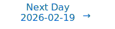

# Personalized Daily ArXiv Papers 2026-02-18

| *[gpt-5]*   | Prompt   | Completion   | Total   |
|:-----------:|:--------:|:------------:|:-------:|
| **Token**   | 37457    | 34563        | 72020   |
| **Cost**    | $0.05    | $0.35        | $0.39   |

Total arXiv papers: 441

Total scanned papers: 249

Total relevant papers: 28

**Table of contents with paper titles:**

1. [A unified theory of feature learning in RNNs and DNNs](#user-content-link1)
**Authors:** Jan P. Bauer, Kirsten Fischer, Moritz Helias, Agostina Palmigiano

2. [Approximation Theory for Lipschitz Continuous Transformers](#user-content-link2)
**Authors:** Takashi Furuya, Davide Murari, Carola-Bibiane Sch\"onlieb

3. [ExpertWeaver: Unlocking the Inherent MoE in Dense LLMs with GLU Activation Patterns](#user-content-link3)
**Authors:** Ziyu Zhao, Tong Zhu, Zhi Zhang, Tiantian Fan, Jinluan Yang, Kun Kuang, Zhongyu Wei, Fei Wu, Yu Cheng

4. [Avey-B](#user-content-link4)
**Authors:** Devang Acharya, Mohammad Hammoud

5. [COMPOT: Calibration-Optimized Matrix Procrustes Orthogonalization for Transformers Compression](#user-content-link5)
**Authors:** Denis Makhov, Dmitriy Shopkhoev, Magauiya Zhussip, Ammar Ali, Baher Mohammad, Stamatios Lefkimmiatis

6. [1-Bit Wonder: Improving QAT Performance in the Low-Bit Regime through K-Means Quantization](#user-content-link6)
**Authors:** Sohir Maskey, Constantin Eichenberg, Johannes Messner, Douglas Orr

7. [Uniform error bounds for quantized dynamical models](#user-content-link7)
**Authors:** Abdelkader Metakalard (CRAN, SYNALP), Fabien Lauer (SYNALP, LORIA), Kevin Colin (CRAN), Marion Gilson (CRAN)

8. [Logit Distance Bounds Representational Similarity](#user-content-link8)
**Authors:** Beatrix M. B. Nielsen, Emanuele Marconato, Luigi Gresele, Andrea Dittadi, Simon Buchholz

9. [How Vision Becomes Language: A Layer-wise Information-Theoretic Analysis of Multimodal Reasoning](#user-content-link9)
**Authors:** Hongxuan Wu, Yukun Zhang, Xueqing Zhou

10. [Continuous-Time Piecewise-Linear Recurrent Neural Networks](#user-content-link10)
**Authors:** Alena Br\"andle, Lukas Eisenmann, Florian G\"otz, Daniel Durstewitz

11. [On Surprising Effectiveness of Masking Updates in Adaptive Optimizers](#user-content-link11)
**Authors:** Taejong Joo, Wenhan Xia, Cheolmin Kim, Ming Zhang, Eugene Ie

12. [Beyond ReLU: Bifurcation, Oversmoothing, and Topological Priors](#user-content-link12)
**Authors:** Erkan Turan, Gaspard Abel, Maysam Behmanesh, Emery Pierson, Maks Ovsjanikov

13. [PolyNODE: Variable-dimension Neural ODEs on M-polyfolds](#user-content-link13)
**Authors:** Per {\AA}hag, Alexander Friedrich, Fredrik Ohlsson, Viktor Vigren N\"aslund

14. [The Information Geometry of Softmax: Probing and Steering](#user-content-link14)
**Authors:** Kiho Park, Todd Nief, Yo Joong Choe, Victor Veitch

15. [The Geometry of Alignment Collapse: When Fine-Tuning Breaks Safety](#user-content-link15)
**Authors:** Max Springer, Chung Peng Lee, Blossom Metevier, Jane Castleman, Bohdan Turbal, Hayoung Jung, Zeyu Shen, Aleksandra Korolova

16. [Panini: Continual Learning in Token Space via Structured Memory](#user-content-link16)
**Authors:** Shreyas Rajesh, Pavan Holur, Mehmet Yigit Turali, Chenda Duan, Vwani Roychowdhury

17. [Size Transferability of Graph Transformers with Convolutional Positional Encodings](#user-content-link17)
**Authors:** Javier Porras-Valenzuela, Zhiyang Wang, Alejandro Ribeiro

18. [CrispEdit: Low-Curvature Projections for Scalable Non-Destructive LLM Editing](#user-content-link18)
**Authors:** Zarif Ikram, Arad Firouzkouhi, Stephen Tu, Mahdi Soltanolkotabi, Paria Rashidinejad

19. [Universal priors: solving empirical Bayes via Bayesian inference and pretraining](#user-content-link19)
**Authors:** Nick Cannella, Anzo Teh, Yanjun Han, Yury Polyanskiy

20. [Spanning the Visual Analogy Space with a Weight Basis of LoRAs](#user-content-link20)
**Authors:** Hila Manor, Rinon Gal, Haggai Maron, Tomer Michaeli, Gal Chechik

21. [The Equalizer: Introducing Shape-Gain Decomposition in Neural Audio Codecs](#user-content-link21)
**Authors:** Samir Sadok, Laurent Girin, Xavier Alameda-Pineda

22. [Seeing to Generalize: How Visual Data Corrects Binding Shortcuts](#user-content-link22)
**Authors:** Nicolas Buzeta, Felipe del Rio, Cristian Hinostroza, Denis Parra, Hans Lobel, Rodrigo Toro Icarte

23. [Refine Now, Query Fast: A Decoupled Refinement Paradigm for Implicit Neural Fields](#user-content-link23)
**Authors:** Tianyu Xiong, Skylar Wurster, Han-Wei Shen

24. [Neural-POD: A Plug-and-Play Neural Operator Framework for Infinite-Dimensional Functional Nonlinear Proper Orthogonal Decomposition](#user-content-link24)
**Authors:** Changhong Mou, Binghang Lu, Guang Lin

25. [Fast and Effective On-policy Distillation from Reasoning Prefixes](#user-content-link25)
**Authors:** Dongxu Zhang, Zhichao Yang, Sepehr Janghorbani, Jun Han, Andrew Ressler II, Qian Qian, Gregory D. Lyng, Sanjit Singh Batra, Robert E. Tillman

26. [Complex-Valued Unitary Representations as Classification Heads for Improved Uncertainty Quantification in Deep Neural Networks](#user-content-link26)
**Authors:** Akbar Anbar Jafari, Cagri Ozcinar, Gholamreza Anbarjafari

27. [FlashMem: Supporting Modern DNN Workloads on Mobile with GPU Memory Hierarchy Optimizations](#user-content-link27)
**Authors:** Zhihao Shu, Md Musfiqur Rahman Sanim, Hangyu Zheng, Kunxiong Zhu, Miao Yin, Gagan Agrawal, Wei Niu

28. [Functional Central Limit Theorem for Stochastic Gradient Descent](#user-content-link28)
**Authors:** Kessang Flamand, Victor-Emmanuel Brunel

---

## 1. [A unified theory of feature learning in RNNs and DNNs](https://arxiv.org/abs/2602.15593) 

**ArXiv ID:** 2602.15593

**Authors:** Jan P. Bauer, Kirsten Fischer, Moritz Helias, Agostina Palmigiano

**Abstract:** Recurrent and deep neural networks (RNNs/DNNs) are cornerstone architectures in machine learning. Remarkably, RNNs differ from DNNs only by weight sharing, as can be shown through unrolling in time. How does this structural similarity fit with the distinct functional properties these networks exhibit? To address this question, we here develop a unified mean-field theory for RNNs and DNNs in terms of representational kernels, describing fully trained networks in the feature learning ($\mu$P) regime. This theory casts training as Bayesian inference over sequences and patterns, directly revealing the functional implications induced by the RNNs' weight sharing. In DNN-typical tasks, we identify a phase transition when the learning signal overcomes the noise due to randomness in the weights: below this threshold, RNNs and DNNs behave identically; above it, only RNNs develop correlated representations across timesteps. For sequential tasks, the RNNs' weight sharing furthermore induces an inductive bias that aids generalization by interpolating unsupervised time steps. Overall, our theory offers a way to connect architectural structure to functional biases.

**Comment:** Representation learning/training dynamics: unified mean-field theory linking RNNs and DNNs via representational kernels in the μP regime.

**Relevance:** 10
**Novelty:** 9

---

## 2. [Approximation Theory for Lipschitz Continuous Transformers](https://arxiv.org/abs/2602.15503) 

**ArXiv ID:** 2602.15503

**Authors:** Takashi Furuya, Davide Murari, Carola-Bibiane Sch\"onlieb

**Abstract:** Stability and robustness are critical for deploying Transformers in safety-sensitive settings. A principled way to enforce such behavior is to constrain the model's Lipschitz constant. However, approximation-theoretic guarantees for architectures that explicitly preserve Lipschitz continuity have yet to be established. In this work, we bridge this gap by introducing a class of gradient-descent-type in-context Transformers that are Lipschitz-continuous by construction. We realize both MLP and attention blocks as explicit Euler steps of negative gradient flows, ensuring inherent stability without sacrificing expressivity. We prove a universal approximation theorem for this class within a Lipschitz-constrained function space. Crucially, our analysis adopts a measure-theoretic formalism, interpreting Transformers as operators on probability measures, to yield approximation guarantees independent of token count. These results provide a rigorous theoretical foundation for the design of robust, Lipschitz continuous Transformer architectures.

**Comment:** Model Architecture/Theory: constructs Lipschitz-continuous Transformer blocks via gradient-flow Euler steps and proves universal approximation under Lipschitz constraints.

**Relevance:** 10
**Novelty:** 9

---

## 3. [ExpertWeaver: Unlocking the Inherent MoE in Dense LLMs with GLU Activation Patterns](https://arxiv.org/abs/2602.15521) 

**ArXiv ID:** 2602.15521

**Authors:** Ziyu Zhao, Tong Zhu, Zhi Zhang, Tiantian Fan, Jinluan Yang, Kun Kuang, Zhongyu Wei, Fei Wu, Yu Cheng

**Abstract:** Mixture-of-Experts (MoE) effectively scales model capacity while preserving computational efficiency through sparse expert activation. However, training high-quality MoEs from scratch is prohibitively expensive. A promising alternative is to convert pretrained dense models into sparse MoEs. Existing dense-to-MoE methods fall into two categories: \textbf{dynamic structural pruning} that converts dense models into MoE architectures with moderate sparsity to balance performance and inference efficiency, and \textbf{downcycling} approaches that use pretrained dense models to initialize highly sparse MoE architectures. However, existing methods break the intrinsic activation patterns within dense models, leading to suboptimal expert construction. In this work, we argue that the Gated Linear Unit (GLU) mechanism provides a natural blueprint for dense-to-MoE conversion. We show that the fine-grained neural-wise activation patterns of GLU reveal a coarse-grained structure, uncovering an inherent MoE architecture composed of consistently activated universal neurons and dynamically activated specialized neurons. Leveraging this discovery, we introduce ExpertWeaver, a training-free framework that partitions neurons according to their activation patterns and constructs shared experts and specialized routed experts with layer-adaptive configurations. Our experiments demonstrate that ExpertWeaver significantly outperforms existing methods, both as a training-free dynamic structural pruning technique and as a downcycling strategy for superior MoE initialization.

**Comment:** MoE Architecture: training-free dense-to-MoE conversion using GLU activation patterns to form shared and routed experts without breaking activation regularities.

**Relevance:** 10
**Novelty:** 8

---

## 4. [Avey-B](https://arxiv.org/abs/2602.15814) 

**ArXiv ID:** 2602.15814

**Authors:** Devang Acharya, Mohammad Hammoud

**Abstract:** Compact pretrained bidirectional encoders remain the backbone of industrial NLP under tight compute and memory budgets. Their effectiveness stems from self-attention's ability to deliver high-quality bidirectional contextualization with sequence-level parallelism, as popularized by BERT-style architectures. Recently, Avey was introduced as an autoregressive, attention-free alternative that naturally admits an encoder-only adaptation. In this paper, we reformulate Avey for the encoder-only paradigm and propose several innovations to its architecture, including decoupled static and dynamic parameterizations, stability-oriented normalization, and neural compression. Results show that this reformulated architecture compares favorably to four widely used Transformer-based encoders, consistently outperforming them on standard token-classification and information-retrieval benchmarks while scaling more efficiently to long contexts.

**Comment:** Model Architecture: proposes an attention-free encoder-only alternative with decoupled static/dynamic parameterizations, stability-oriented normalization, and neural compression for efficient long-context encoding.

**Relevance:** 10
**Novelty:** 8

---

## 5. [COMPOT: Calibration-Optimized Matrix Procrustes Orthogonalization for Transformers Compression](https://arxiv.org/abs/2602.15200) 

**ArXiv ID:** 2602.15200

**Authors:** Denis Makhov, Dmitriy Shopkhoev, Magauiya Zhussip, Ammar Ali, Baher Mohammad, Stamatios Lefkimmiatis

**Abstract:** Post-training compression of Transformer models commonly relies on truncated singular value decomposition (SVD). However, enforcing a single shared subspace can degrade accuracy even at moderate compression. Sparse dictionary learning provides a more flexible union-of-subspaces representation, but existing approaches often suffer from iterative dictionary and coefficient updates. We propose COMPOT (Calibration-Optimized Matrix Procrustes Orthogonalization for Transformers), a training-free compression framework that uses a small calibration dataset to estimate a sparse weight factorization. COMPOT employs orthogonal dictionaries that enable closed-form Procrustes updates for the dictionary and analytical single-step sparse coding for the coefficients, eliminating iterative optimization. To handle heterogeneous layer sensitivity under a global compression budget, COMPOT further introduces a one-shot dynamic allocation strategy that adaptively redistributes layer-wise compression rates. Extensive experiments across diverse architectures and tasks show that COMPOT consistently delivers a superior quality-compression trade-off over strong low-rank and sparse baselines, while remaining fully compatible with post-training quantization for extreme compression. Code is available $\href{https://github.com/mts-ai/COMPOT}{here}$.

**Comment:** Model Compression and Efficiency: training-free sparse factorization for Transformer compression using orthogonal dictionaries with closed-form Procrustes updates and one-shot dynamic layer-wise budget allocation.

**Relevance:** 10
**Novelty:** 8

---

## 6. [1-Bit Wonder: Improving QAT Performance in the Low-Bit Regime through K-Means Quantization](https://arxiv.org/abs/2602.15563) 

**ArXiv ID:** 2602.15563

**Authors:** Sohir Maskey, Constantin Eichenberg, Johannes Messner, Douglas Orr

**Abstract:** Quantization-aware training (QAT) is an effective method to drastically reduce the memory footprint of LLMs while keeping performance degradation at an acceptable level. However, the optimal choice of quantization format and bit-width presents a challenge in practice. The full design space of quantization is not fully explored in the context of QAT, and the precise trade-off between quantization and downstream performance is poorly understood, as comparisons often rely solely on perplexity-based evaluations. In this work, we address these shortcomings with an empirical study of QAT in the low-bit regime. We show that k-means based weight quantization outperforms integer formats and can be implemented efficiently on standard hardware. Furthermore, we find that, under a fixed inference memory budget, the best performance on generative downstream tasks is achieved with $1$-bit quantized weights.

**Comment:** Model Compression and Efficiency: low-bit QAT with k-means weight quantization; demonstrates efficient 1-bit weight regimes under fixed memory budgets.

**Relevance:** 10
**Novelty:** 7

---

## 7. [Uniform error bounds for quantized dynamical models](https://arxiv.org/abs/2602.15586) 

**ArXiv ID:** 2602.15586

**Authors:** Abdelkader Metakalard (CRAN, SYNALP), Fabien Lauer (SYNALP, LORIA), Kevin Colin (CRAN), Marion Gilson (CRAN)

**Abstract:** This paper provides statistical guarantees on the accuracy of dynamical models learned from dependent data sequences. Specifically, we develop uniform error bounds that apply to quantized models and imperfect optimization algorithms commonly used in practical contexts for system identification, and in particular hybrid system identification. Two families of bounds are obtained: slow-rate bounds via a block decomposition and fast-rate, variance-adaptive, bounds via a novel spaced-point strategy. The bounds scale with the number of bits required to encode the model and thus translate hardware constraints into interpretable statistical complexities.

**Comment:** Compression/quantization theory: uniform error bounds for quantized dynamical models, with complexity scaling in bits (hardware–statistical link).

**Relevance:** 9
**Novelty:** 8

---

## 8. [Logit Distance Bounds Representational Similarity](https://arxiv.org/abs/2602.15438) 

**ArXiv ID:** 2602.15438

**Authors:** Beatrix M. B. Nielsen, Emanuele Marconato, Luigi Gresele, Andrea Dittadi, Simon Buchholz

**Abstract:** For a broad family of discriminative models that includes autoregressive language models, identifiability results imply that if two models induce the same conditional distributions, then their internal representations agree up to an invertible linear transformation. We ask whether an analogous conclusion holds approximately when the distributions are close instead of equal. Building on the observation of Nielsen et al. (2025) that closeness in KL divergence need not imply high linear representational similarity, we study a distributional distance based on logit differences and show that closeness in this distance does yield linear similarity guarantees. Specifically, we define a representational dissimilarity measure based on the models' identifiability class and prove that it is bounded by the logit distance. We further show that, when model probabilities are bounded away from zero, KL divergence upper-bounds logit distance; yet the resulting bound fails to provide nontrivial control in practice. As a consequence, KL-based distillation can match a teacher's predictions while failing to preserve linear representational properties, such as linear-probe recoverability of human-interpretable concepts. In distillation experiments on synthetic and image datasets, logit-distance distillation yields students with higher linear representational similarity and better preservation of the teacher's linearly recoverable concepts.

**Comment:** Representation learning theory: establishes a logit-distance that bounds linear representational dissimilarity; implications for distillation beyond KL.

**Relevance:** 9
**Novelty:** 8

---

## 9. [How Vision Becomes Language: A Layer-wise Information-Theoretic Analysis of Multimodal Reasoning](https://arxiv.org/abs/2602.15580) 

**ArXiv ID:** 2602.15580

**Authors:** Hongxuan Wu, Yukun Zhang, Xueqing Zhou

**Abstract:** When a multimodal Transformer answers a visual question, is the prediction driven by visual evidence, linguistic reasoning, or genuinely fused cross-modal computation -- and how does this structure evolve across layers? We address this question with a layer-wise framework based on Partial Information Decomposition (PID) that decomposes the predictive information at each Transformer layer into redundant, vision-unique, language-unique, and synergistic components. To make PID tractable for high-dimensional neural representations, we introduce \emph{PID Flow}, a pipeline combining dimensionality reduction, normalizing-flow Gaussianization, and closed-form Gaussian PID estimation. Applying this framework to LLaVA-1.5-7B and LLaVA-1.6-7B across six GQA reasoning tasks, we uncover a consistent \emph{modal transduction} pattern: visual-unique information peaks early and decays with depth, language-unique information surges in late layers to account for roughly 82\% of the final prediction, and cross-modal synergy remains below 2\%. This trajectory is highly stable across model variants (layer-wise correlations $>$0.96) yet strongly task-dependent, with semantic redundancy governing the detailed information fingerprint. To establish causality, we perform targeted Image$\rightarrow$Question attention knockouts and show that disrupting the primary transduction pathway induces predictable increases in trapped visual-unique information, compensatory synergy, and total information cost -- effects that are strongest in vision-dependent tasks and weakest in high-redundancy tasks. Together, these results provide an information-theoretic, causal account of how vision becomes language in multimodal Transformers, and offer quantitative guidance for identifying architectural bottlenecks where modality-specific information is lost.

**Comment:** Representation learning analysis: layer-wise PID quantifies vision, language, and synergy flows in multimodal Transformers; training dynamics insights.

**Relevance:** 9
**Novelty:** 8

---

## 10. [Continuous-Time Piecewise-Linear Recurrent Neural Networks](https://arxiv.org/abs/2602.15649) 

**ArXiv ID:** 2602.15649

**Authors:** Alena Br\"andle, Lukas Eisenmann, Florian G\"otz, Daniel Durstewitz

**Abstract:** In dynamical systems reconstruction (DSR) we aim to recover the dynamical system (DS) underlying observed time series. Specifically, we aim to learn a generative surrogate model which approximates the underlying, data-generating DS, and recreates its long-term properties (`climate statistics'). In scientific and medical areas, in particular, these models need to be mechanistically tractable -- through their mathematical analysis we would like to obtain insight into the recovered system's workings. Piecewise-linear (PL), ReLU-based RNNs (PLRNNs) have a strong track-record in this regard, representing SOTA DSR models while allowing mathematical insight by virtue of their PL design. However, all current PLRNN variants are discrete-time maps. This is in disaccord with the assumed continuous-time nature of most physical and biological processes, and makes it hard to accommodate data arriving at irregular temporal intervals. Neural ODEs are one solution, but they do not reach the DSR performance of PLRNNs and often lack their tractability. Here we develop theory for continuous-time PLRNNs (cPLRNNs): We present a novel algorithm for training and simulating such models, bypassing numerical integration by efficiently exploiting their PL structure. We further demonstrate how important topological objects like equilibria or limit cycles can be determined semi-analytically in trained models. We compare cPLRNNs to both their discrete-time cousins as well as Neural ODEs on DSR benchmarks, including systems with discontinuities which come with hard thresholds.

**Comment:** Model Architecture: introduces continuous-time piecewise-linear RNNs with a training/simulation algorithm that exploits PL structure, improving tractability and efficiency over Neural ODEs.

**Relevance:** 9
**Novelty:** 8

---

## 11. [On Surprising Effectiveness of Masking Updates in Adaptive Optimizers](https://arxiv.org/abs/2602.15322) 

**ArXiv ID:** 2602.15322

**Authors:** Taejong Joo, Wenhan Xia, Cheolmin Kim, Ming Zhang, Eugene Ie

**Abstract:** Training large language models (LLMs) relies almost exclusively on dense adaptive optimizers with increasingly sophisticated preconditioners. We challenge this by showing that randomly masking parameter updates can be highly effective, with a masked variant of RMSProp consistently outperforming recent state-of-the-art optimizers. Our analysis reveals that the random masking induces a curvature-dependent geometric regularization that smooths the optimization trajectory. Motivated by this finding, we introduce Momentum-aligned gradient masking (Magma), which modulates the masked updates using momentum-gradient alignment. Extensive LLM pre-training experiments show that Magma is a simple drop-in replacement for adaptive optimizers with consistent gains and negligible computational overhead. Notably, for the 1B model size, Magma reduces perplexity by over 19\% and 9\% compared to Adam and Muon, respectively.

**Comment:** High Performance Computing/Optimization: masked adaptive updates (Magma) provide a simple, efficient optimizer improving LLM pretraining with curvature-regularization effects.

**Relevance:** 9
**Novelty:** 8

---

## 12. [Beyond ReLU: Bifurcation, Oversmoothing, and Topological Priors](https://arxiv.org/abs/2602.15634) 

**ArXiv ID:** 2602.15634

**Authors:** Erkan Turan, Gaspard Abel, Maysam Behmanesh, Emery Pierson, Maks Ovsjanikov

**Abstract:** Graph Neural Networks (GNNs) learn node representations through iterative network-based message-passing. While powerful, deep GNNs suffer from oversmoothing, where node features converge to a homogeneous, non-informative state. We re-frame this problem of representational collapse from a \emph{bifurcation theory} perspective, characterizing oversmoothing as convergence to a stable ``homogeneous fixed point.'' Our central contribution is the theoretical discovery that this undesired stability can be broken by replacing standard monotone activations (e.g., ReLU) with a class of functions. Using Lyapunov-Schmidt reduction, we analytically prove that this substitution induces a bifurcation that destabilizes the homogeneous state and creates a new pair of stable, non-homogeneous \emph{patterns} that provably resist oversmoothing. Our theory predicts a precise, nontrivial scaling law for the amplitude of these emergent patterns, which we quantitatively validate in experiments. Finally, we demonstrate the practical utility of our theory by deriving a closed-form, bifurcation-aware initialization and showing its utility in real benchmark experiments.

**Comment:** Model Architecture/Theory: introduces a class of non-monotone activations to induce bifurcations that mitigate GNN oversmoothing, with initialization derived from theory.

**Relevance:** 9
**Novelty:** 8

---

## 13. [PolyNODE: Variable-dimension Neural ODEs on M-polyfolds](https://arxiv.org/abs/2602.15128) 

**ArXiv ID:** 2602.15128

**Authors:** Per {\AA}hag, Alexander Friedrich, Fredrik Ohlsson, Viktor Vigren N\"aslund

**Abstract:** Neural ordinary differential equations (NODEs) are geometric deep learning models based on dynamical systems and flows generated by vector fields on manifolds. Despite numerous successful applications, particularly within the flow matching paradigm, all existing NODE models are fundamentally constrained to fixed-dimensional dynamics by the intrinsic nature of the manifold's dimension. In this paper, we extend NODEs to M-polyfolds (spaces that can simultaneously accommodate varying dimensions and a notion of differentiability) and introduce PolyNODEs, the first variable-dimensional flow-based model in geometric deep learning. As an example application, we construct explicit M-polyfolds featuring dimensional bottlenecks and PolyNODE autoencoders based on parametrised vector fields that traverse these bottlenecks. We demonstrate experimentally that our PolyNODE models can be trained to solve reconstruction tasks in these spaces, and that latent representations of the input can be extracted and used to solve downstream classification tasks. The code used in our experiments is publicly available at https://github.com/turbotage/PolyNODE .

**Comment:** Model Architecture: extends Neural ODEs to variable-dimension flows on M-polyfolds (PolyNODE), enabling dimensional bottlenecks and new autoencoder designs.

**Relevance:** 9
**Novelty:** 8

---

## 14. [The Information Geometry of Softmax: Probing and Steering](https://arxiv.org/abs/2602.15293) 

**ArXiv ID:** 2602.15293

**Authors:** Kiho Park, Todd Nief, Yo Joong Choe, Victor Veitch

**Abstract:** This paper concerns the question of how AI systems encode semantic structure into the geometric structure of their representation spaces. The motivating observation of this paper is that the natural geometry of these representation spaces should reflect the way models use representations to produce behavior. We focus on the important special case of representations that define softmax distributions. In this case, we argue that the natural geometry is information geometry. Our focus is on the role of information geometry on semantic encoding and the linear representation hypothesis. As an illustrative application, we develop "dual steering", a method for robustly steering representations to exhibit a particular concept using linear probes. We prove that dual steering optimally modifies the target concept while minimizing changes to off-target concepts. Empirically, we find that dual steering enhances the controllability and stability of concept manipulation.

**Comment:** Representation learning and geometry: information geometry of softmax representations with a principled steering method (dual steering).

**Relevance:** 9
**Novelty:** 7

---

## 15. [The Geometry of Alignment Collapse: When Fine-Tuning Breaks Safety](https://arxiv.org/abs/2602.15799) 

**ArXiv ID:** 2602.15799

**Authors:** Max Springer, Chung Peng Lee, Blossom Metevier, Jane Castleman, Bohdan Turbal, Hayoung Jung, Zeyu Shen, Aleksandra Korolova

**Abstract:** Fine-tuning aligned language models on benign tasks unpredictably degrades safety guardrails, even when training data contains no harmful content and developers have no adversarial intent. We show that the prevailing explanation, that fine-tuning updates should be orthogonal to safety-critical directions in high-dimensional parameter space, offers false reassurance: we show this orthogonality is structurally unstable and collapses under the dynamics of gradient descent. We then resolve this through a novel geometric analysis, proving that alignment concentrates in low-dimensional subspaces with sharp curvature, creating a brittle structure that first-order methods cannot detect or defend. While initial fine-tuning updates may indeed avoid these subspaces, the curvature of the fine-tuning loss generates second-order acceleration that systematically steers trajectories into alignment-sensitive regions. We formalize this mechanism through the Alignment Instability Condition, three geometric properties that, when jointly satisfied, lead to safety degradation. Our main result establishes a quartic scaling law: alignment loss grows with the fourth power of training time, governed by the sharpness of alignment geometry and the strength of curvature coupling between the fine-tuning task and safety-critical parameters. These results expose a structural blind spot in the current safety paradigm. The dominant approaches to safe fine-tuning address only the initial snapshot of a fundamentally dynamic problem. Alignment fragility is not a bug to be patched; it is an intrinsic geometric property of gradient descent on curved manifolds. Our results motivate the development of curvature-aware methods, and we hope will further enable a shift in alignment safety analysis from reactive red-teaming to predictive diagnostics for open-weight model deployment.

**Comment:** Training Dynamics: geometric analysis reveals curvature-driven alignment collapse under fine-tuning, with an instability condition and quartic scaling law.

**Relevance:** 8
**Novelty:** 8

---

## 16. [Panini: Continual Learning in Token Space via Structured Memory](https://arxiv.org/abs/2602.15156) 

**ArXiv ID:** 2602.15156

**Authors:** Shreyas Rajesh, Pavan Holur, Mehmet Yigit Turali, Chenda Duan, Vwani Roychowdhury

**Abstract:** Language models are increasingly used to reason over content they were not trained on, such as new documents, evolving knowledge, and user-specific data. A common approach is retrieval-augmented generation (RAG), which stores verbatim documents externally (as chunks) and retrieves only a relevant subset at inference time for an LLM to reason over. However, this results in inefficient usage of test-time compute (LLM repeatedly reasons over the same documents); moreover, chunk retrieval can inject irrelevant context that increases unsupported generation. We propose a human-like non-parametric continual learning framework, where the base model remains fixed, and learning occurs by integrating each new experience into an external semantic memory state that accumulates and consolidates itself continually. We present Panini, which realizes this by representing documents as Generative Semantic Workspaces (GSW) -- an entity- and event-aware network of question-answer (QA) pairs, sufficient for an LLM to reconstruct the experienced situations and mine latent knowledge via reasoning-grounded inference chains on the network. Given a query, Panini only traverses the continually-updated GSW (not the verbatim documents or chunks), and retrieves the most likely inference chains. Across six QA benchmarks, Panini achieves the highest average performance, 5%-7% higher than other competitive baselines, while using 2-30x fewer answer-context tokens, supports fully open-source pipelines, and reduces unsupported answers on curated unanswerable queries. The results show that efficient and accurate structuring of experiences at write time -- as achieved by the GSW framework -- yields both efficiency and reliability gains at read time. Code is available at https://github.com/roychowdhuryresearch/gsw-memory.

**Comment:** Training Dynamics/Representation Learning: theoretical account of pretraining via universal priors and posterior contraction, explaining adaptation and length generalization.

**Relevance:** 8
**Novelty:** 8

---

## 17. [Size Transferability of Graph Transformers with Convolutional Positional Encodings](https://arxiv.org/abs/2602.15239) 

**ArXiv ID:** 2602.15239

**Authors:** Javier Porras-Valenzuela, Zhiyang Wang, Alejandro Ribeiro

**Abstract:** Transformers have achieved remarkable success across domains, motivating the rise of Graph Transformers (GTs) as attention-based architectures for graph-structured data. A key design choice in GTs is the use of Graph Neural Network (GNN)-based positional encodings to incorporate structural information. In this work, we study GTs through the lens of manifold limit models for graph sequences and establish a theoretical connection between GTs with GNN positional encodings and Manifold Neural Networks (MNNs). Building on transferability results for GNNs under manifold convergence, we show that GTs inherit transferability guarantees from their positional encodings. In particular, GTs trained on small graphs provably generalize to larger graphs under mild assumptions. We complement our theory with extensive experiments on standard graph benchmarks, demonstrating that GTs exhibit scalable behavior on par with GNNs. To further show the efficiency in a real-world scenario, we implement GTs for shortest path distance estimation over terrains to better illustrate the efficiency of the transferable GTs. Our results provide new insights into the understanding of GTs and suggest practical directions for efficient training of GTs in large-scale settings.

**Comment:** Model Architecture/Theory: links Graph Transformers with GNN positional encodings to manifold neural networks, establishing size transferability guarantees.

**Relevance:** 8
**Novelty:** 8

---

## 18. [CrispEdit: Low-Curvature Projections for Scalable Non-Destructive LLM Editing](https://arxiv.org/abs/2602.15823) 

**ArXiv ID:** 2602.15823

**Authors:** Zarif Ikram, Arad Firouzkouhi, Stephen Tu, Mahdi Soltanolkotabi, Paria Rashidinejad

**Abstract:** A central challenge in large language model (LLM) editing is capability preservation: methods that successfully change targeted behavior can quietly game the editing proxy and corrupt general capabilities, producing degenerate behaviors reminiscent of proxy/reward hacking. We present CrispEdit, a scalable and principled second-order editing algorithm that treats capability preservation as an explicit constraint, unifying and generalizing several existing editing approaches. CrispEdit formulates editing as constrained optimization and enforces the constraint by projecting edit updates onto the low-curvature subspace of the capability-loss landscape. At the crux of CrispEdit is expressing capability constraint via Bregman divergence, whose quadratic form yields the Gauss-Newton Hessian exactly and even when the base model is not trained to convergence. We make this second-order procedure efficient at the LLM scale using Kronecker-factored approximate curvature (K-FAC) and a novel matrix-free projector that exploits Kronecker structure to avoid constructing massive projection matrices. Across standard model-editing benchmarks, CrispEdit achieves high edit success while keeping capability degradation below 1% on average across datasets, significantly improving over prior editors.

**Comment:** High Performance Computing/Optimization: second-order constrained LLM editing using K-FAC and matrix-free low-curvature projections to preserve capabilities.

**Relevance:** 8
**Novelty:** 8

---

## 19. [Universal priors: solving empirical Bayes via Bayesian inference and pretraining](https://arxiv.org/abs/2602.15136) 

**ArXiv ID:** 2602.15136

**Authors:** Nick Cannella, Anzo Teh, Yanjun Han, Yury Polyanskiy

**Abstract:** We theoretically justify the recent empirical finding of [Teh et al., 2025] that a transformer pretrained on synthetically generated data achieves strong performance on empirical Bayes (EB) problems. We take an indirect approach to this question: rather than analyzing the model architecture or training dynamics, we ask why a pretrained Bayes estimator, trained under a prespecified training distribution, can adapt to arbitrary test distributions. Focusing on Poisson EB problems, we identify the existence of universal priors such that training under these priors yields a near-optimal regret bound of $\widetilde{O}(\frac{1}{n})$ uniformly over all test distributions. Our analysis leverages the classical phenomenon of posterior contraction in Bayesian statistics, showing that the pretrained transformer adapts to unknown test distributions precisely through posterior contraction. This perspective also explains the phenomenon of length generalization, in which the test sequence length exceeds the training length, as the model performs Bayesian inference using a generalized posterior.

**Comment:** Matches Representation Learning: provides a theoretical account (universal priors, posterior contraction) for adaptation and length generalization in pretrained transformers, offering foundational insights into training/generalization dynamics.

**Relevance:** 8
**Novelty:** 8

---

## 20. [Spanning the Visual Analogy Space with a Weight Basis of LoRAs](https://arxiv.org/abs/2602.15727) 

**ArXiv ID:** 2602.15727

**Authors:** Hila Manor, Rinon Gal, Haggai Maron, Tomer Michaeli, Gal Chechik

**Abstract:** Visual analogy learning enables image manipulation through demonstration rather than textual description, allowing users to specify complex transformations difficult to articulate in words. Given a triplet $\{\mathbf{a}$, $\mathbf{a}'$, $\mathbf{b}\}$, the goal is to generate $\mathbf{b}'$ such that $\mathbf{a} : \mathbf{a}' :: \mathbf{b} : \mathbf{b}'$. Recent methods adapt text-to-image models to this task using a single Low-Rank Adaptation (LoRA) module, but they face a fundamental limitation: attempting to capture the diverse space of visual transformations within a fixed adaptation module constrains generalization capabilities. Inspired by recent work showing that LoRAs in constrained domains span meaningful, interpolatable semantic spaces, we propose LoRWeB, a novel approach that specializes the model for each analogy task at inference time through dynamic composition of learned transformation primitives, informally, choosing a point in a "space of LoRAs". We introduce two key components: (1) a learnable basis of LoRA modules, to span the space of different visual transformations, and (2) a lightweight encoder that dynamically selects and weighs these basis LoRAs based on the input analogy pair. Comprehensive evaluations demonstrate our approach achieves state-of-the-art performance and significantly improves generalization to unseen visual transformations. Our findings suggest that LoRA basis decompositions are a promising direction for flexible visual manipulation. Code and data are in https://research.nvidia.com/labs/par/lorweb

**Comment:** Low-rank architecture innovation: learnable basis of LoRA modules with dynamic composition for conditional specialization (aligns with low-rank/architecture efficiency).

**Relevance:** 8
**Novelty:** 7

---

## 21. [The Equalizer: Introducing Shape-Gain Decomposition in Neural Audio Codecs](https://arxiv.org/abs/2602.15491) 

**ArXiv ID:** 2602.15491

**Authors:** Samir Sadok, Laurent Girin, Xavier Alameda-Pineda

**Abstract:** Neural audio codecs (NACs) typically encode the short-term energy (gain) and normalized structure (shape) of speech/audio signals jointly within the same latent space. As a result, they are poorly robust to a global variation of the input signal level in the sense that such variation has strong influence on the embedding vectors at the output of the encoder and their quantization. This methodology is inherently inefficient, leading to codebook redundancy and suboptimal bitrate-distortion performance. To address these limitations, we propose to introduce shape-gain decomposition, widely used in classical speech/audio coding, into the NAC framework. The principle of the proposed Equalizer methodology is to decompose the input signal -- before the NAC encoder -- into gain and normalized shape vector on a short-term basis. The shape vector is processed by the NAC, while the gain is quantized with scalar quantization and transmitted separately. The output (decoded) signal is reconstructed from the normalized output of the NAC and the quantized gain. Our experiments conducted on speech signals show that this general methodology, easily applicable to any NAC, enables a substantial gain in bitrate-distortion performance, as well as a massive reduction in complexity.

**Comment:** Compression/efficiency: explicit shape–gain decomposition in neural audio codecs to reduce bitrate and complexity.

**Relevance:** 8
**Novelty:** 7

---

## 22. [Seeing to Generalize: How Visual Data Corrects Binding Shortcuts](https://arxiv.org/abs/2602.15183) 

**ArXiv ID:** 2602.15183

**Authors:** Nicolas Buzeta, Felipe del Rio, Cristian Hinostroza, Denis Parra, Hans Lobel, Rodrigo Toro Icarte

**Abstract:** Vision Language Models (VLMs) are designed to extend Large Language Models (LLMs) with visual capabilities, yet in this work we observe a surprising phenomenon: VLMs can outperform their underlying LLMs on purely text-only tasks, particularly in long-context information retrieval. To investigate this effect, we build a controlled synthetic retrieval task and find that a transformer trained only on text achieves perfect in-distribution accuracy but fails to generalize out of distribution, while subsequent training on an image-tokenized version of the same task nearly doubles text-only OOD performance. Mechanistic interpretability reveals that visual training changes the model's internal binding strategy: text-only training encourages positional shortcuts, whereas image-based training disrupts them through spatial translation invariance, forcing the model to adopt a more robust symbolic binding mechanism that persists even after text-only examples are reintroduced. We further characterize how binding strategies vary across training regimes, visual encoders, and initializations, and show that analogous shifts occur during pretrained LLM-to-VLM transitions. Our findings suggest that cross-modal training can enhance reasoning and generalization even for tasks grounded in a single modality.

**Comment:** Representation learning/training dynamics: shows cross-modal training corrects positional binding shortcuts and improves OOD generalization.

**Relevance:** 8
**Novelty:** 7

---

## 23. [Refine Now, Query Fast: A Decoupled Refinement Paradigm for Implicit Neural Fields](https://arxiv.org/abs/2602.15155) 

**ArXiv ID:** 2602.15155

**Authors:** Tianyu Xiong, Skylar Wurster, Han-Wei Shen

**Abstract:** Implicit Neural Representations (INRs) have emerged as promising surrogates for large 3D scientific simulations due to their ability to continuously model spatial and conditional fields, yet they face a critical fidelity-speed dilemma: deep MLPs suffer from high inference cost, while efficient embedding-based models lack sufficient expressiveness. To resolve this, we propose the Decoupled Representation Refinement (DRR) architectural paradigm. DRR leverages a deep refiner network, alongside non-parametric transformations, in a one-time offline process to encode rich representations into a compact and efficient embedding structure. This approach decouples slow neural networks with high representational capacity from the fast inference path. We introduce DRR-Net, a simple network that validates this paradigm, and a novel data augmentation strategy, Variational Pairs (VP) for improving INRs under complex tasks like high-dimensional surrogate modeling. Experiments on several ensemble simulation datasets demonstrate that our approach achieves state-of-the-art fidelity, while being up to 27$\times$ faster at inference than high-fidelity baselines and remaining competitive with the fastest models. The DRR paradigm offers an effective strategy for building powerful and practical neural field surrogates and \rev{INRs in broader applications}, with a minimal compromise between speed and quality.

**Comment:** Model efficiency/architecture: decoupled representation refinement to encode rich features into compact embeddings for fast INR inference.

**Relevance:** 8
**Novelty:** 7

---

## 24. [Neural-POD: A Plug-and-Play Neural Operator Framework for Infinite-Dimensional Functional Nonlinear Proper Orthogonal Decomposition](https://arxiv.org/abs/2602.15632) 

**ArXiv ID:** 2602.15632

**Authors:** Changhong Mou, Binghang Lu, Guang Lin

**Abstract:** The rapid development of AI for Science is often hindered by the "discretization", where learned representations remain restricted to the specific grids or resolutions used during training. We propose the Neural Proper Orthogonal Decomposition (Neural-POD), a plug-and-play neural operator framework that constructs nonlinear, orthogonal basis functions in infinite-dimensional space using neural networks. Unlike the classical Proper Orthogonal Decomposition (POD), which is limited to linear subspace approximations obtained through singular value decomposition (SVD), Neural-POD formulates basis construction as a sequence of residual minimization problems solved through neural network training. Each basis function is obtained by learning to represent the remaining structure in the data, following a process analogous to Gram--Schmidt orthogonalization. This neural formulation introduces several key advantages over classical POD: it enables optimization in arbitrary norms (e.g., $L^2$, $L^1$), learns mappings between infinite-dimensional function spaces that is resolution-invariant, generalizes effectively to unseen parameter regimes, and inherently captures nonlinear structures in complex spatiotemporal systems. The resulting basis functions are interpretable, reusable, and enabling integration into both reduced order modeling (ROM) and operator learning frameworks such as deep operator learning (DeepONet). We demonstrate the robustness of Neural-POD with different complex spatiotemporal systems, including the Burgers' and Navier-Stokes equations. We further show that Neural-POD serves as a high performance, plug-and-play bridge between classical Galerkin projection and operator learning that enables consistent integration with both projection-based reduced order models and DeepONet frameworks.

**Comment:** Representation Learning: proposes a neural-operator framework to learn nonlinear, orthogonal basis functions (resolution-invariant) as a POD alternative.

**Relevance:** 8
**Novelty:** 7

---

## 25. [Fast and Effective On-policy Distillation from Reasoning Prefixes](https://arxiv.org/abs/2602.15260) 

**ArXiv ID:** 2602.15260

**Authors:** Dongxu Zhang, Zhichao Yang, Sepehr Janghorbani, Jun Han, Andrew Ressler II, Qian Qian, Gregory D. Lyng, Sanjit Singh Batra, Robert E. Tillman

**Abstract:** On-policy distillation (OPD), which samples trajectories from the student model and supervises them with a teacher at the token level, avoids relying solely on verifiable terminal rewards and can yield better generalization than off-policy distillation. However, OPD requires expensive on-the-fly sampling of the student policy during training, which substantially increases training cost, especially for long responses. Our initial analysis shows that, during OPD, training signals are often concentrated in the prefix of each output, and that even a short teacher-generated prefix can significantly help the student produce the correct answer. Motivated by these observations, we propose a simple yet effective modification of OPD: we apply the distillation objective only to prefixes of student-generated outputs and terminate each sampling early during distillation. Experiments on a suite of AI-for-Math and out-of-domain benchmarks show that on-policy prefix distillation matches the performance of full OPD while reducing training FLOP by 2x-47x.

**Comment:** Efficiency: modifies on-policy distillation to supervise only prefixes, reducing training FLOPs 2x–47x while matching full OPD performance.

**Relevance:** 8
**Novelty:** 7

---

## 26. [Complex-Valued Unitary Representations as Classification Heads for Improved Uncertainty Quantification in Deep Neural Networks](https://arxiv.org/abs/2602.15283) 

**ArXiv ID:** 2602.15283

**Authors:** Akbar Anbar Jafari, Cagri Ozcinar, Gholamreza Anbarjafari

**Abstract:** Modern deep neural networks achieve high predictive accuracy but remain poorly calibrated: their confidence scores do not reliably reflect the true probability of correctness. We propose a quantum-inspired classification head architecture that projects backbone features into a complex-valued Hilbert space and evolves them under a learned unitary transformation parameterised via the Cayley map. Through a controlled hybrid experimental design - training a single shared backbone and comparing lightweight interchangeable heads - we isolate the effect of complex-valued unitary representations on calibration. Our ablation study on CIFAR-10 reveals that the unitary magnitude head (complex features evolved under a Cayley unitary, read out via magnitude and softmax) achieves an Expected Calibration Error (ECE) of 0.0146, representing a 2.4x improvement over a standard softmax head (0.0355) and a 3.5x improvement over temperature scaling (0.0510). Surprisingly, replacing the softmax readout with a Born rule measurement layer - the quantum-mechanically motivated approach - degrades calibration to an ECE of 0.0819. On the CIFAR-10H human-uncertainty benchmark, the wave function head achieves the lowest KL-divergence (0.336) to human soft labels among all compared methods, indicating that complex-valued representations better capture the structure of human perceptual ambiguity. We provide theoretical analysis connecting norm-preserving unitary dynamics to calibration through feature-space geometry, report negative results on out-of-distribution detection and sentiment analysis to delineate the method's scope, and discuss practical implications for safety-critical applications. Code is publicly available.

**Comment:** Model Architecture: introduces a complex-valued unitary classification head (Cayley-parameterized) that improves calibration over standard softmax.

**Relevance:** 8
**Novelty:** 7

---

## 27. [FlashMem: Supporting Modern DNN Workloads on Mobile with GPU Memory Hierarchy Optimizations](https://arxiv.org/abs/2602.15379) 

**ArXiv ID:** 2602.15379

**Authors:** Zhihao Shu, Md Musfiqur Rahman Sanim, Hangyu Zheng, Kunxiong Zhu, Miao Yin, Gagan Agrawal, Wei Niu

**Abstract:** The increasing size and complexity of modern deep neural networks (DNNs) pose significant challenges for on-device inference on mobile GPUs, with limited memory and computational resources. Existing DNN acceleration frameworks primarily deploy a weight preloading strategy, where all model parameters are loaded into memory before execution on mobile GPUs. We posit that this approach is not adequate for modern DNN workloads that comprise very large model(s) and possibly execution of several distinct models in succession. In this work, we introduce FlashMem, a memory streaming framework designed to efficiently execute large-scale modern DNNs and multi-DNN workloads while minimizing memory consumption and reducing inference latency. Instead of fully preloading weights, FlashMem statically determines model loading schedules and dynamically streams them on demand, leveraging 2.5D texture memory to minimize data transformations and improve execution efficiency. Experimental results on 11 models demonstrate that FlashMem achieves 2.0x to 8.4x memory reduction and 1.7x to 75.0x speedup compared to existing frameworks, enabling efficient execution of large-scale models and multi-DNN support on resource-constrained mobile GPUs.

**Comment:** HPC/Efficiency: GPU memory hierarchy optimizations and streaming schedules (2.5D textures) to run large/multi-DNN workloads on mobile with strong speed/memory gains.

**Relevance:** 8
**Novelty:** 7

---

## 28. [Functional Central Limit Theorem for Stochastic Gradient Descent](https://arxiv.org/abs/2602.15538) 

**ArXiv ID:** 2602.15538

**Authors:** Kessang Flamand, Victor-Emmanuel Brunel

**Abstract:** We study the asymptotic shape of the trajectory of the stochastic gradient descent algorithm applied to a convex objective function. Under mild regularity assumptions, we prove a functional central limit theorem for the properly rescaled trajectory. Our result characterizes the long-term fluctuations of the algorithm around the minimizer by providing a diffusion limit for the trajectory. In contrast with classical central limit theorems for the last iterate or Polyak-Ruppert averages, this functional result captures the temporal structure of the fluctuations and applies to non-smooth settings such as robust location estimation, including the geometric median.

**Comment:** Training Dynamics/Theory: functional CLT for SGD trajectories characterizing temporal fluctuations around minimizers.

**Relevance:** 8
**Novelty:** 7

---

# Paper Selection Prompt

## System Prompt

> You are a helpful paper reading assistant whose job is to read daily posts from ArXiv and identify a few papers that your friend will enjoy reading.
> Your job is to carefully read the paper titles and abstracts below and find the ones that match the criteria below.

## User Prompt

> ## Instructions
> 
> Write the response in JSONL format with {ARXIVID, COMMENT, RELEVANCE, NOVELTY} on each line, one for each paper.
> 
> - ARXIVID: should be the ArXiv ID.
> - COMMENT: should identify whether there is a criteria that match the paper very closely. These matches should not be based on general terms like "language modeling" or "advancements" and should specifically refer to a criterion. No need to mention the non-matching criteria.
> - RELEVANCE: should be a score from 1-10.
> - NOVELTY: should be a score from 1-10.
> 
> ## Scoring Criteria
> 
> > The "Relevance" score measures how closely the paper aligns with the core topics of the prompt.
> > The "Novelty" score assesses the originality and impact of the paper.
> > They are two **ORTHONORMAL** axes and **SHOULD NOT** be confused with each other.
> 
> ### Relevance Scoring
> 
> - Relevance 9-10 (Completely Relevant)
>   - Focus: Fully aligned with core topics with no deviation, score the highest if contains relevant keywords in it.
>   - Examples: Papers focused on foundational methods or theoretical research, whose titles contain topic keywords like "MoE".
> 
> - Relevance 7-8 (Relevant)
>   - Focus: Retain a solid link to the main research area, though may touch on peripheral elements.
>   - Examples: Papers research on the fundamental part of MoE through a less critical aspect like its behavior in GNN.
> 
> - Relevance 5-6 (Borderline)
>   - Focus: Maintains a link to the core topic but also extends into at least one other domain/area beyond the primary focus.
>   - Examples: Work referencing MoE centered on reinforcement learning.
> 
> - Relevance 3-4 (Irrelevant)
>   - Focus: Largely outside our interests with no association to our topics.
>   - Examples: Application-focused papers like using MoE to solve a problem in the real world.
> 
> - Relevance 1-2 (Ignore)
>   - Focus: Purely unrelated to our topics. Completely a different domain.
>   - **Exception**: If the paper hints at a cutting-edge, radically new direction that could eventually transform the primary domain, consider a score of 9–10 despite initial appearances. (Usually a very rare concept that belongs to the fundamental research)
> 
> ### Novelty Scoring
> 
> - Novelty 9-10 (Breakthrough)
>   - Definition: Groundbreaking methods/theory introducing new directions or solving major challenges.
>   - Examples: Entirely new paradigm for foundational models; a novel theory transforming representation learning.
> 
> - Novelty 7-8 (Improvements)
>   - Definition: Substantial insights/enhancements, though not a full paradigm shift.
>   - Examples: Modifications on existing methods yielding significantly better results.
> 
> - Novelty 5-6 (Borderline)
>   - Definition: Incremental contributions with possible long-term benefits, not immediately transformative.
>   - Examples: Moderately novel extension to an existing architecture; refining current methods without fundamentally altering them.
> 
> - Novelty 3-4 (Tangential)
>   - Definition: Minor or domain-specific improvements with limited broader impact.
>   - Examples: Slight modifications to known methods with strange motivation; purely engineering jobs like a new benchmark/dataset.
> 
> - Novelty 1-2 (Low)
>   - Definition: Minimal originality, applying standard approaches without real innovation.
>   - Examples: Using an off-the-shelf model without adding new insights; purely application-driven studies like finetuning a pretrained model using existing methods.
> 
> ## Papers
> 
> [PAPER LIST HERE]
> 
> ## Relevant Topics
> 
> Use the following relevance criteria to focus on foundational research. Keep **relevant** papers and filter out **irrelevant** ones. Avoid purely **application-driven** work.
> 
> 1. Model Architecture
>    - Relevant: Mixture-of-Experts (MoE), Transformers, Conditional/Dynamic Networks, Autoencoders, analysis/innovations on existing architectures.
>    - Irrelevant: Merely using existing architectures for a certain task without insights into the structure themselves.
> 
> 2. Model Compression and Efficiency
>    - Relevant: Sparsity, pruning, quantization, low-rank approaches, cache, or other algorithmic/theoretical efficiency breakthroughs.
>    - Irrelevant: Straightforward applications of existing compression methods to new tasks.
> 
> 3. High Performance Computing
>    - Relevant: Algorithmic or systems-level innovations enabling training of large-scale models, distributed training techniques, memory optimization.
>    - Irrelevant: Incremental engineering improvements without novel algorithmic contributions.
> 
> 4. Representation Learning
>    - Relevant: Insights into how deep networks encode information, feature/dictionary learning, sparse/contrastive methods, training dynamics in neural networks.
>    - Irrelevant: Standard applications of known techniques lacking new theoretical or methodological contributions.
> 
> **Keywords:**
> 
> - Relevant: Mixture of Experts (MoE), Representation Learning, Compression/Efficiency, Sparse/Sparsity, Pruning, Quantization, Low-rank, Foundation Model, etc.
> - Irrelevant: Reinforcement Learning, Transfer Learning, Federated Learning, Online Learning, Diffusion Models, etc.
> - Application: Image Segmentation, Medical Imaging, 3D Vision, Video Understanding, Information Retrieval, Summarization, Recommendation Systems, Machine Translation, Speech Recognition, Signal Processing, Spatial/Temporal Modeling, Time Series, Knowledge Graph, etc.