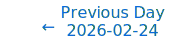
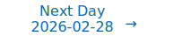

# Personalized Daily ArXiv Papers 2026-02-27

| *[gpt-5]*   | Prompt   | Completion   | Total   |
|:-----------:|:--------:|:------------:|:-------:|
| **Token**   | 60745    | 51376        | 112121  |
| **Cost**    | $0.08    | $0.51        | $0.59   |

Total arXiv papers: 613

Total scanned papers: 420

Total relevant papers: 40

**Table of contents with paper titles:**

1. [Semantic Tube Prediction: Beating LLM Data Efficiency with JEPA](#user-content-link1)
**Authors:** Hai Huang, Yann LeCun, Randall Balestriero

2. [PRAC: Principal-Random Subspace for LLM Activation Compression and Memory-Efficient Training](#user-content-link2)
**Authors:** Yanyi Li, Yimu Zhang, Cong Fang

3. [pQuant: Towards Effective Low-Bit Language Models via Decoupled Linear Quantization-Aware Training](#user-content-link3)
**Authors:** Wenzheng Zhang, Bingzheng Liu, Yang Hu, Xiaoying Bai, Wentao Zhang, Bin Cui

4. [S2O: Early Stopping for Sparse Attention via Online Permutation](#user-content-link4)
**Authors:** Yu Zhang, Songwei Liu, Chenqian Yan, Sheng Lin, Beichen Ning, Fangmin Chen, Xing Wang

5. [InnerQ: Hardware-aware Tuning-free Quantization of KV Cache for Large Language Models](#user-content-link5)
**Authors:** Sayed Mohammadreza Tayaranian Hosseini, Amir Ardakani, Warren J. Gross

6. [FlashOptim: Optimizers for Memory Efficient Training](#user-content-link6)
**Authors:** Jose Javier Gonzalez Ortiz, Abhay Gupta, Chris Renard, Davis Blalock

7. [Learning Tangent Bundles and Characteristic Classes with Autoencoder Atlases](#user-content-link7)
**Authors:** Eduardo Paluzo-Hidalgo, Yuichi Ike

8. [Modality Collapse as Mismatched Decoding: Information-Theoretic Limits of Multimodal LLMs](#user-content-link8)
**Authors:** Jayadev Billa

9. [Residual Koopman Spectral Profiling for Predicting and Preventing Transformer Training Instability](#user-content-link9)
**Authors:** Bum Jun Kim, Shohei Taniguchi, Makoto Kawano, Yusuke Iwasawa, Yutaka Matsuo

10. [Accelerating LLM Pre-Training through Flat-Direction Dynamics Enhancement](#user-content-link10)
**Authors:** Shuchen Zhu, Rizhen Hu, Mingze Wang, Mou Sun, Xue Wang, Kun Yuan, Zaiwen Wen

11. [veScale-FSDP: Flexible and High-Performance FSDP at Scale](#user-content-link11)
**Authors:** Zezhou Wang, Youjie Li, Zhiqi Lin, Jiacheng Yang, Cong Xie, Guanyu Feng, Zheng Zhong, Ziyue Huang, Hongyu Zhu, Zhi Zhang, Yanghua Peng, Xin Liu

12. [Vectorizing the Trie: Efficient Constrained Decoding for LLM-based Generative Retrieval on Accelerators](#user-content-link12)
**Authors:** Zhengyang Su, Isay Katsman, Yueqi Wang, Ruining He, Lukasz Heldt, Raghunandan Keshavan, Shao-Chuan Wang, Xinyang Yi, Mingyan Gao, Onkar Dalal, Lichan Hong, Ed Chi, Ningren Han

13. [Beyond NNGP: Large Deviations and Feature Learning in Bayesian Neural Networks](#user-content-link13)
**Authors:** Katerina Papagiannouli, Dario Trevisan, Giuseppe Pio Zitto

14. [SideQuest: Model-Driven KV Cache Management for Long-Horizon Agentic Reasoning](#user-content-link14)
**Authors:** Sanjay Kariyappa, G. Edward Suh

15. [Support Tokens, Stability Margins, and a New Foundation for Robust LLMs](#user-content-link15)
**Authors:** Deepak Agarwal, Dhyey Dharmendrakumar Mavani, Suyash Gupta, Karthik Sethuraman, Tejas Dharamsi

16. [Why Diffusion Language Models Struggle with Truly Parallel (Non-Autoregressive) Decoding?](#user-content-link16)
**Authors:** Pengxiang Li, Dilxat Muhtar, Lu Yin, Tianlong Chen, Shiwei Liu

17. [A 1/R Law for Kurtosis Contrast in Balanced Mixtures](#user-content-link17)
**Authors:** Yuda Bi, Wenjun Xiao, Linhao Bai, Vince D Calhoun

18. [NoRA: Breaking the Linear Ceiling of Low-Rank Adaptation via Manifold Expansion](#user-content-link18)
**Authors:** Hung-Hsuan Chen

19. [Affine-Scaled Attention: Towards Flexible and Stable Transformer Attention](#user-content-link19)
**Authors:** Jeongin Bae, Baeseong Park, Gunho Park, Minsub Kim, Joonhyung Lee, Junhee Yoo, Sunghyeon Woo, Jiwon Ryu, Se Jung Kwon, Dongsoo Lee

20. [AutoQRA: Joint Optimization of Mixed-Precision Quantization and Low-rank Adapters for Efficient LLM Fine-Tuning](#user-content-link20)
**Authors:** Changhai Zhou, Shiyang Zhang, Yuhua Zhou, Qian Qiao, Jun Gao, Cheng Jin, Kaizhou Qin, Weizhong Zhang

21. [Learning Physical Operators using Neural Operators](#user-content-link21)
**Authors:** Vignesh Gopakumar, Ander Gray, Dan Giles, Lorenzo Zanisi, Matt J. Kusner, Timo Betcke, Stanislas Pamela, Marc Peter Deisenroth

22. [Fine-Tuning Without Forgetting In-Context Learning: A Theoretical Analysis of Linear Attention Models](#user-content-link22)
**Authors:** Chungpa Lee, Jy-yong Sohn, Kangwook Lee

23. [RAIN-Merging: A Gradient-Free Method to Enhance Instruction Following in Large Reasoning Models with Preserved Thinking Format](#user-content-link23)
**Authors:** Zhehao Huang, Yuhang Liu, Baijiong Lin, Yixin Lou, Zhengbao He, Hanling Tian, Tao Li, Xiaolin Huang

24. [Efficient Encoder-Free Fourier-based 3D Large Multimodal Model](#user-content-link24)
**Authors:** Guofeng Mei, Wei Lin, Luigi Riz, Yujiao Wu, Yiming Wang, Fabio Poiesi

25. [Latent Matters: Learning Deep State-Space Models](#user-content-link25)
**Authors:** Alexej Klushyn, Richard Kurle, Maximilian Soelch, Botond Cseke, Patrick van der Smagt

26. [Disentangling Shared and Target-Enriched Topics via Background-Contrastive Non-negative Matrix Factorization](#user-content-link26)
**Authors:** Yixuan Li, Archer Y. Yang, Yue Li

27. [Differentiable Zero-One Loss via Hypersimplex Projections](#user-content-link27)
**Authors:** Camilo Gomez, Pengyang Wang, Liansheng Tang

28. [IBCircuit: Towards Holistic Circuit Discovery with Information Bottleneck](#user-content-link28)
**Authors:** Tian Bian, Yifan Niu, Chaohao Yuan, Chengzhi Piao, Bingzhe Wu, Long-Kai Huang, Yu Rong, Tingyang Xu, Hong Cheng, Jia Li

29. [Orthogonal Weight Modification Enhances Learning Scalability and Convergence Efficiency without Gradient Backpropagation](#user-content-link29)
**Authors:** Guoqing Ma, Shan Yu

30. [Takeuchi's Information Criteria as Generalization Measures for DNNs Close to NTK Regime](#user-content-link30)
**Authors:** Hiroki Naganuma, Taiji Suzuki, Rio Yokota, Masahiro Nomura, Kohta Ishikawa, Ikuro Sato

31. [Interpreting and Steering State-Space Models via Activation Subspace Bottlenecks](#user-content-link31)
**Authors:** Vamshi Sunku Mohan, Kaustubh Gupta, Aneesha Das, Chandan Singh

32. [Causality $\neq$ Invariance: Function and Concept Vectors in LLMs](#user-content-link32)
**Authors:** Gustaw Opie{\l}ka, Hannes Rosenbusch, Claire E. Stevenson

33. [WaveSSM: Multiscale State-Space Models for Non-stationary Signal Attention](#user-content-link33)
**Authors:** Ruben Solozabal, Velibor Bojkovic, Hilal Alquabeh, Klea Ziu, Kentaro Inui, Martin Takac

34. [LLMServingSim 2.0: A Unified Simulator for Heterogeneous and Disaggregated LLM Serving Infrastructure](#user-content-link34)
**Authors:** Jaehong Cho, Hyunmin Choi, Guseul Heo, Jongse Park

35. [Generalization Bounds of Stochastic Gradient Descent in Homogeneous Neural Networks](#user-content-link35)
**Authors:** Wenquan Ma, Yang Sui, Jiaye Teng, Bohan Wang, Jing Xu, Jingqin Yang

36. [pMoE: Prompting Diverse Experts Together Wins More in Visual Adaptation](#user-content-link36)
**Authors:** Shentong Mo, Xufang Luo, Dongsheng Li

37. [Model Agreement via Anchoring](#user-content-link37)
**Authors:** Eric Eaton, Surbhi Goel, Marcel Hussing, Michael Kearns, Aaron Roth, Sikata Bela Sengupta, Jessica Sorrell

38. [LUMOS: Democratizing SciML Workflows with L0-Regularized Learning for Unified Feature and Parameter Adaptation](#user-content-link38)
**Authors:** Shouwei Gao, Xu Zheng, Dongsheng Luo, Sheng Di, Wenqian Dong

39. [GetBatch: Distributed Multi-Object Retrieval for ML Data Loading](#user-content-link39)
**Authors:** Alex Aizman, Abhishek Gaikwad, Piotr \.Zelasko

40. [GRAU: Generic Reconfigurable Activation Unit Design for Neural Network Hardware Accelerators](#user-content-link40)
**Authors:** Yuhao Liu, Salim Ullah, Akash Kumar

---

## 1. [Semantic Tube Prediction: Beating LLM Data Efficiency with JEPA](https://arxiv.org/abs/2602.22617) 

**ArXiv ID:** 2602.22617

**Authors:** Hai Huang, Yann LeCun, Randall Balestriero

**Abstract:** Large Language Models (LLMs) obey consistent scaling laws -- empirical power-law fits that predict how loss decreases with compute, data, and parameters. While predictive, these laws are descriptive rather than prescriptive: they characterize typical training, not optimal training. Surprisingly few works have successfully challenged the data-efficiency bounds implied by these laws -- which is our primary focus. To that end, we introduce the Geodesic Hypothesis, positing that token sequences trace geodesics on a smooth semantic manifold and are therefore locally linear. Building on this principle, we propose a novel Semantic Tube Prediction (STP) task, a JEPA-style regularizer that confines hidden-state trajectories to a tubular neighborhood of the geodesic. STP generalizes JEPA to language without requiring explicit multi-view augmentations. We show this constraint improves signal-to-noise ratio, and consequently preserves diversity by preventing trajectory collisions during inference. Empirically, STP allows LLMs to match baseline accuracy with 16$\times$ less training data on the NL-RX-SYNTH dataset, directly violating the data term of Chinchilla-style scaling laws and demonstrating that principled geometric priors can surpass brute-force scaling. Code is available at https://github.com/galilai-group/llm-jepa#stp.

**Comment:** Author match

---

## 2. [PRAC: Principal-Random Subspace for LLM Activation Compression and Memory-Efficient Training](https://arxiv.org/abs/2602.23111) 

**ArXiv ID:** 2602.23111

**Authors:** Yanyi Li, Yimu Zhang, Cong Fang

**Abstract:** Activations have become the primary memory bottleneck in large-batch LLM training. However, existing compression methods fail to exploit the spectral structure of activations, resulting in slow convergence or limited compression. To address this, we bridge the relationship between the algorithm's fast convergence and the requirements for subspace projection, and show that an effective compression should yield an unbiased estimate of the original activation with low variance. We propose Principal-Random Subspace for LLM Activation Compression (PRAC), which novelly decomposes activations into two components: a principal subspace captured via SVD to retain dominant information, and a random subspace sampled from the orthogonal complement to approximate the tail. By introducing a precise scaling factor, we prove that PRAC yields an unbiased gradient estimator with minimum variance under certain conditions. Extensive experiments on pre-training and fine-tuning tasks demonstrate that PRAC achieves up to 36% total memory reduction with negligible performance degradation and minimal computational cost.

**Comment:** Model Compression and Efficiency: activation compression via principal (SVD) + random orthogonal subspace with unbiased low-variance gradient estimation, reducing activation memory in LLM training.

**Relevance:** 10
**Novelty:** 8

---

## 3. [pQuant: Towards Effective Low-Bit Language Models via Decoupled Linear Quantization-Aware Training](https://arxiv.org/abs/2602.22592) 

**ArXiv ID:** 2602.22592

**Authors:** Wenzheng Zhang, Bingzheng Liu, Yang Hu, Xiaoying Bai, Wentao Zhang, Bin Cui

**Abstract:** Quantization-Aware Training from scratch has emerged as a promising approach for building efficient large language models (LLMs) with extremely low-bit weights (sub 2-bit), which can offer substantial advantages for edge deployment. However, existing methods still fail to achieve satisfactory accuracy and scalability. In this work, we identify a parameter democratization effect as a key bottleneck: the sensitivity of all parameters becomes homogenized, severely limiting expressivity. To address this, we propose pQuant, a method that decouples parameters by splitting linear layers into two specialized branches: a dominant 1-bit branch for efficient computation and a compact high-precision branch dedicated to preserving the most sensitive parameters. Through tailored feature scaling, we explicitly guide the model to allocate sensitive parameters to the high-precision branch. Furthermore, we extend this branch into multiple, sparsely-activated experts, enabling efficient capacity scaling. Extensive experiments indicate our pQuant achieves state-of-the-art performance in extremely low-bit quantization.

**Comment:** Model Compression and Efficiency: decoupled linear QAT with a dominant 1-bit branch plus compact high-precision branch (and sparse experts) to overcome democratization and enable sub-2-bit LLMs.

**Relevance:** 10
**Novelty:** 8

---

## 4. [S2O: Early Stopping for Sparse Attention via Online Permutation](https://arxiv.org/abs/2602.22575) 

**ArXiv ID:** 2602.22575

**Authors:** Yu Zhang, Songwei Liu, Chenqian Yan, Sheng Lin, Beichen Ning, Fangmin Chen, Xing Wang

**Abstract:** Attention scales quadratically with sequence length, fundamentally limiting long-context inference. Existing block-granularity sparsification can reduce latency, but coarse blocks impose an intrinsic sparsity ceiling, making further improvements difficult even with carefully engineered designs. We present S2O, which performs early stopping for sparse attention via online permutation. Inspired by virtual-to-physical address mapping in memory systems, S2O revisits and factorizes FlashAttention execution, enabling inference to load non-contiguous tokens rather than a contiguous span in the original order. Motivated by fine-grained structures in attention heatmaps, we transform explicit permutation into an online, index-guided, discrete loading policy; with extremely lightweight preprocessing and index-remapping overhead, it concentrates importance on a small set of high-priority blocks. Building on this importance-guided online permutation for loading, S2O further introduces an early-stopping rule: computation proceeds from high to low importance; once the current block score falls below a threshold, S2O terminates early and skips the remaining low-contribution blocks, thereby increasing effective sparsity and reducing computation under a controlled error budget.   As a result, S2O substantially raises the practical sparsity ceiling. On Llama-3.1-8B under a 128K context, S2O reduces single-operator MSE by 3.82$\times$ at matched sparsity, and reduces prefill compute density by 3.31$\times$ at matched MSE; meanwhile, it preserves end-to-end accuracy and achieves 7.51$\times$ attention and 3.81$\times$ end-to-end speedups.

**Comment:** Model Compression and Efficiency: sparse attention via online permutation and early stopping to raise effective sparsity and accelerate long-context attention with controlled error.

**Relevance:** 10
**Novelty:** 8

---

## 5. [InnerQ: Hardware-aware Tuning-free Quantization of KV Cache for Large Language Models](https://arxiv.org/abs/2602.23200) 

**ArXiv ID:** 2602.23200

**Authors:** Sayed Mohammadreza Tayaranian Hosseini, Amir Ardakani, Warren J. Gross

**Abstract:** Reducing the hardware footprint of large language models (LLMs) during decoding is critical for efficient long-sequence generation. A key bottleneck is the key-value (KV) cache, whose size scales with sequence length and easily dominates the memory footprint of the model. Previous work proposed quantization methods that are focused on compressing the KV cache while maintaining its information. We introduce InnerQ, a hardware-aware KV-cache quantization scheme that lowers decode latency without sacrificing accuracy. InnerQ applies group-wise quantization while grouping the cache matrices over their inner dimension. Unlike previous work that group over the outer dimension, InnerQ aligns dequantization with the vector-matrix multiplication and enables scale factor reuse across GPU compute units. This reduces memory accesses and accelerates dequantization, yielding up to $22\%$ speedup over previous work and up to $88\%$ over half-precision vector-matrix multiplication. To preserve fidelity under aggressive compression, InnerQ incorporates (i) hybrid quantization, selecting symmetric or asymmetric quantization per group based on local statistics; (ii) high-precision windows for both the most recent tokens and the attention sink tokens to mitigate outlier leakage; and (iii) per-channel normalization of the key cache, computed once during prefill and folded into the query to avoid runtime overhead. Our evaluation experiments on Llama models shows that InnerQ maintains a few-shot GSM8K performance comparable to non-quantized KV caches and surpasses prior KV cache quantization methods.

**Comment:** Model compression and efficiency: hardware-aware inner-dimension groupwise KV-cache quantization with hybrid schemes and normalization to speed LLM decoding.

**Relevance:** 10
**Novelty:** 8

---

## 6. [FlashOptim: Optimizers for Memory Efficient Training](https://arxiv.org/abs/2602.23349) 

**ArXiv ID:** 2602.23349

**Authors:** Jose Javier Gonzalez Ortiz, Abhay Gupta, Chris Renard, Davis Blalock

**Abstract:** Standard mixed-precision training of neural networks requires many bytes of accelerator memory for each model parameter. These bytes reflect not just the parameter itself, but also its gradient and one or more optimizer state variables. With each of these values typically requiring 4 bytes, training even a 7 billion parameter model can be impractical for researchers with less than 100GB of accelerator memory.   We introduce FlashOptim, a suite of optimizations that reduces per-parameter memory by over 50% while preserving model quality and API compatibility. Our approach introduces two key techniques. First, we improve master weight splitting by finding and exploiting a tight bound on its quantization error. Second, we design companding functions that greatly reduce the error in 8-bit optimizer state quantization. Together with 16-bit gradients, these techniques reduce AdamW memory from 16 bytes to 7 bytes per parameter, or 5 bytes with gradient release. They also cut model checkpoint sizes by more than half.   Experiments with FlashOptim applied to SGD, AdamW, and Lion show no measurable quality degradation on any task from a collection of standard vision and language benchmarks, including Llama-3.1-8B finetuning.

**Comment:** Model Compression and Efficiency: optimizer-state quantization and bounded master-weight splitting cut per-parameter memory from 16B→7B with preserved quality.

**Relevance:** 10
**Novelty:** 8

---

## 7. [Learning Tangent Bundles and Characteristic Classes with Autoencoder Atlases](https://arxiv.org/abs/2602.22873) 

**ArXiv ID:** 2602.22873

**Authors:** Eduardo Paluzo-Hidalgo, Yuichi Ike

**Abstract:** We introduce a theoretical framework that connects multi-chart autoencoders in manifold learning with the classical theory of vector bundles and characteristic classes. Rather than viewing autoencoders as producing a single global Euclidean embedding, we treat a collection of locally trained encoder-decoder pairs as a learned atlas on a manifold. We show that any reconstruction-consistent autoencoder atlas canonically defines transition maps satisfying the cocycle condition, and that linearising these transition maps yields a vector bundle coinciding with the tangent bundle when the latent dimension matches the intrinsic dimension of the manifold. This construction provides direct access to differential-topological invariants of the data. In particular, we show that the first Stiefel-Whitney class can be computed from the signs of the Jacobians of learned transition maps, yielding an algorithmic criterion for detecting orientability. We also show that non-trivial characteristic classes provide obstructions to single-chart representations, and that the minimum number of autoencoder charts is determined by the good cover structure of the manifold. Finally, we apply our methodology to low-dimensional orientable and non-orientable manifolds, as well as to a non-orientable high-dimensional image dataset.

**Comment:** Representation Learning — establishes a theory linking multi-chart autoencoders to tangent bundles and characteristic classes, yielding algorithmic tests (e.g., orientability) and chart complexity results.

**Relevance:** 9
**Novelty:** 9

---

## 8. [Modality Collapse as Mismatched Decoding: Information-Theoretic Limits of Multimodal LLMs](https://arxiv.org/abs/2602.23136) 

**ArXiv ID:** 2602.23136

**Authors:** Jayadev Billa

**Abstract:** Multimodal LLMs can process speech and images, but they cannot hear a speaker's voice or see an object's texture. We show this is not a failure of encoding: speaker identity, emotion, and visual attributes survive through every LLM layer (3--55$\times$ above chance in linear probes), yet removing 64--71% of modality-specific variance improves decoder loss. The decoder has no learned use for these directions; their presence is noise.   We formalize this as a mismatched decoder problem: a decoder trained on text can only extract information along text-aligned directions. Accessible information is bounded by the Generalized Mutual Information (GMI), with degradation scaling with distributional distance and decoder sensitivity. The bound is a property of the decoder's scoring rule, not of any particular architecture; it applies whether non-text inputs arrive through a learned projection, a discrete codebook, or no explicit adapter at all. We validate this across five models spanning speech and vision. A controlled experiment (two Prismatic VLMs differing only in encoder text-alignment) confirms the bottleneck is the decoder's scoring rule, not the encoder or projection. A LoRA intervention demonstrates the fix: training with an emotion objective improves emotion accessibility ($+$7.5%) without affecting other attributes, confirming that the training objective determines what becomes accessible.

**Comment:** Representation Learning/Training Dynamics: information-theoretic analysis of multimodal LLM modality collapse (GMI bound) with objective-level fix via LoRA.

**Relevance:** 9
**Novelty:** 9

---

## 9. [Residual Koopman Spectral Profiling for Predicting and Preventing Transformer Training Instability](https://arxiv.org/abs/2602.22988) 

**ArXiv ID:** 2602.22988

**Authors:** Bum Jun Kim, Shohei Taniguchi, Makoto Kawano, Yusuke Iwasawa, Yutaka Matsuo

**Abstract:** Training divergence in transformers wastes compute, yet practitioners discover instability only after expensive runs begin. They therefore need an expected probability of failure for a transformer before training starts. Our study of Residual Koopman Spectral Profiling (RKSP) provides such an estimate. From a single forward pass at initialization, RKSP extracts Koopman spectral features by applying whitened dynamic mode decomposition to layer-wise residual snapshots. Our central diagnostic, the near-unit spectral mass, quantifies the fraction of modes concentrated near the unit circle, which captures instability risk. For predicting divergence across extensive configurations, this estimator achieves an AUROC of 0.995, outperforming the best gradient baseline. We further make this diagnostic actionable through Koopman Spectral Shaping (KSS), which reshapes spectra during training. We empirically validate that our method works in practice: RKSP predicts divergence at initialization, and when RKSP flags high risk, turning on KSS successfully prevents divergence. In the challenging high learning rate regime without normalization layers, KSS reduces the divergence rate from 66.7% to 12.5% and enables learning rates that are 50% to 150% higher. These findings generalize to WikiText-103 language modeling, vision transformers on CIFAR-10, and pretrained language models, including GPT-2 and LLaMA-2 up to 7B, as well as emerging architectures such as MoE, Mamba-style SSMs, and KAN.

**Comment:** Training Dynamics/Stability: predicts transformer divergence from initialization via Koopman spectral profiling and prevents it with spectral shaping; general across architectures (Transformer, MoE, SSM).

**Relevance:** 9
**Novelty:** 8

---

## 10. [Accelerating LLM Pre-Training through Flat-Direction Dynamics Enhancement](https://arxiv.org/abs/2602.22681) 

**ArXiv ID:** 2602.22681

**Authors:** Shuchen Zhu, Rizhen Hu, Mingze Wang, Mou Sun, Xue Wang, Kun Yuan, Zaiwen Wen

**Abstract:** Pre-training Large Language Models requires immense computational resources, making optimizer efficiency essential. The optimization landscape is highly anisotropic, with loss reduction driven predominantly by progress along flat directions. While matrix-based optimizers such as Muon and SOAP leverage fine-grained curvature information to outperform AdamW, their updates tend toward isotropy -- relatively conservative along flat directions yet potentially aggressive along sharp ones. To address this limitation, we first establish a unified Riemannian Ordinary Differential Equation (ODE) framework that elucidates how common adaptive algorithms operate synergistically: the preconditioner induces a Riemannian geometry that mitigates ill-conditioning, while momentum serves as a Riemannian damping term that promotes convergence. Guided by these insights, we propose LITE, a generalized acceleration strategy that enhances training dynamics by applying larger Hessian damping coefficients and learning rates along flat trajectories. Extensive experiments demonstrate that LITE significantly accelerates both Muon and SOAP across diverse architectures (Dense, MoE), parameter scales (130M--1.3B), datasets (C4, Pile), and learning-rate schedules (cosine, warmup-stable-decay). Theoretical analysis confirms that LITE facilitates faster convergence along flat directions in anisotropic landscapes, providing a principled approach to efficient LLM pre-training. The code is available at https://github.com/SHUCHENZHU/LITE.

**Comment:** High Performance Computing/Efficiency — optimizer-level acceleration by emphasizing flat-direction dynamics via a Riemannian ODE framework; applicable to Dense and MoE pretraining.

**Relevance:** 9
**Novelty:** 8

---

## 11. [veScale-FSDP: Flexible and High-Performance FSDP at Scale](https://arxiv.org/abs/2602.22437) 

**ArXiv ID:** 2602.22437

**Authors:** Zezhou Wang, Youjie Li, Zhiqi Lin, Jiacheng Yang, Cong Xie, Guanyu Feng, Zheng Zhong, Ziyue Huang, Hongyu Zhu, Zhi Zhang, Yanghua Peng, Xin Liu

**Abstract:** Fully Sharded Data Parallel (FSDP), also known as ZeRO, is widely used for training large-scale models, featuring its flexibility and minimal intrusion on model code. However, current FSDP systems struggle with structure-aware training methods (e.g., block-wise quantized training) and with non-element-wise optimizers (e.g., Shampoo and Muon) used in cutting-edge models (e.g., Gemini, Kimi K2). FSDP's fixed element- or row-wise sharding formats conflict with the block-structured computations. In addition, today's implementations fall short in communication and memory efficiency, limiting scaling to tens of thousands of GPUs. We introduce veScale-FSDP, a redesigned FSDP system that couples a flexible sharding format, RaggedShard, with a structure-aware planning algorithm to deliver both flexibility and performance at scale. veScale-FSDP natively supports efficient data placement required by FSDP, empowering block-wise quantization and non-element-wise optimizers. As a result, veScale-FSDP achieves 5~66% higher throughput and 16~30% lower memory usage than existing FSDP systems, while scaling efficiently to tens of thousands of GPUs.

**Comment:** High Performance Computing — introduces flexible RaggedShard and structure-aware planning for FSDP, enabling block-wise quantized training and non-element-wise optimizers with improved memory/throughput at massive scale.

**Relevance:** 9
**Novelty:** 8

---

## 12. [Vectorizing the Trie: Efficient Constrained Decoding for LLM-based Generative Retrieval on Accelerators](https://arxiv.org/abs/2602.22647) 

**ArXiv ID:** 2602.22647

**Authors:** Zhengyang Su, Isay Katsman, Yueqi Wang, Ruining He, Lukasz Heldt, Raghunandan Keshavan, Shao-Chuan Wang, Xinyang Yi, Mingyan Gao, Onkar Dalal, Lichan Hong, Ed Chi, Ningren Han

**Abstract:** Generative retrieval has emerged as a powerful paradigm for LLM-based recommendation. However, industrial recommender systems often benefit from restricting the output space to a constrained subset of items based on business logic (e.g. enforcing content freshness or product category), which standard autoregressive decoding cannot natively support. Moreover, existing constrained decoding methods that make use of prefix trees (Tries) incur severe latency penalties on hardware accelerators (TPUs/GPUs). In this work, we introduce STATIC (Sparse Transition Matrix-Accelerated Trie Index for Constrained Decoding), an efficient and scalable constrained decoding technique designed specifically for high-throughput LLM-based generative retrieval on TPUs/GPUs. By flattening the prefix tree into a static Compressed Sparse Row (CSR) matrix, we transform irregular tree traversals into fully vectorized sparse matrix operations, unlocking massive efficiency gains on hardware accelerators. We deploy STATIC on a large-scale industrial video recommendation platform serving billions of users. STATIC produces significant product metric impact with minimal latency overhead (0.033 ms per step and 0.25% of inference time), achieving a 948x speedup over a CPU trie implementation and a 47-1033x speedup over a hardware-accelerated binary-search baseline. Furthermore, the runtime overhead of STATIC remains extremely low across a wide range of practical configurations. To the best of our knowledge, STATIC enables the first production-scale deployment of strictly constrained generative retrieval. In addition, evaluation on academic benchmarks demonstrates that STATIC can considerably improve cold-start performance for generative retrieval. Our code is available at https://github.com/youtube/static-constraint-decoding.

**Comment:** High Performance Computing/Efficiency — vectorized constrained decoding via CSR sparse ops (STATIC) for accelerator-friendly trie operations, enabling production-scale constrained generative retrieval.

**Relevance:** 9
**Novelty:** 8

---

## 13. [Beyond NNGP: Large Deviations and Feature Learning in Bayesian Neural Networks](https://arxiv.org/abs/2602.22925) 

**ArXiv ID:** 2602.22925

**Authors:** Katerina Papagiannouli, Dario Trevisan, Giuseppe Pio Zitto

**Abstract:** We study wide Bayesian neural networks focusing on the rare but statistically dominant fluctuations that govern posterior concentration, beyond Gaussian-process limits. Large-deviation theory provides explicit variational objectives-rate functions-on predictors, providing an emerging notion of complexity and feature learning directly at the functional level. We show that the posterior output rate function is obtained by a joint optimization over predictors and internal kernels, in contrast with fixed-kernel (NNGP) theory. Numerical experiments demonstrate that the resulting predictions accurately describe finite-width behavior for moderately sized networks, capturing non-Gaussian tails, posterior deformation, and data-dependent kernel selection effects.

**Comment:** Representation learning/theory: large-deviation rate functions for wide Bayesian NNs capturing feature learning beyond fixed-kernel NNGP.

**Relevance:** 9
**Novelty:** 8

---

## 14. [SideQuest: Model-Driven KV Cache Management for Long-Horizon Agentic Reasoning](https://arxiv.org/abs/2602.22603) 

**ArXiv ID:** 2602.22603

**Authors:** Sanjay Kariyappa, G. Edward Suh

**Abstract:** Long-running agentic tasks, such as deep research, require multi-hop reasoning over information distributed across multiple webpages and documents. In such tasks, the LLM context is dominated by tokens from external retrieval, causing memory usage to grow rapidly and limiting decode performance. While several KV cache compression techniques exist for long-context inputs, we find that existing heuristics fail to support multi-step reasoning models effectively. We address this challenge with SideQuest -- a novel approach that leverages the Large Reasoning Model (LRM) itself to perform KV cache compression by reasoning about the usefulness of tokens in its context. To prevent the tokens associated with this management process from polluting the model's memory, we frame KV cache compression as an auxiliary task executed in parallel to the main reasoning task. Our evaluations, using a model trained with just 215 samples, show that SideQuest reduces peak token usage by up to 65% on agentic tasks with minimal degradation in accuracy, outperforming heuristic-based KV cache compression techniques.

**Comment:** HPC/memory optimization: model-driven KV cache management and compression for long-horizon agentic reasoning.

**Relevance:** 9
**Novelty:** 8

---

## 15. [Support Tokens, Stability Margins, and a New Foundation for Robust LLMs](https://arxiv.org/abs/2602.22271) 

**ArXiv ID:** 2602.22271

**Authors:** Deepak Agarwal, Dhyey Dharmendrakumar Mavani, Suyash Gupta, Karthik Sethuraman, Tejas Dharamsi

**Abstract:** Self-attention is usually described as a flexible, content-adaptive way to mix a token with information from its past. We re-interpret causal self-attention transformers, the backbone of modern foundation models, within a probabilistic framework, much like how classical PCA is extended to probabilistic PCA. However, this re-formulation reveals a surprising and deeper structural insight: due to a change-of-variables phenomenon, a barrier constraint emerges on the self-attention parameters. This induces a highly structured geometry on the token space, providing theoretical insights into the dynamics of LLM decoding. This reveals a boundary where attention becomes ill-conditioned, leading to a margin interpretation similar to classical support vector machines. Just like support vectors, this naturally gives rise to the concept of support tokens.   Furthermore, we show that LLMs can be interpreted as a stochastic process over the power set of the token space, providing a rigorous probabilistic framework for sequence modeling. We propose a Bayesian framework and derive a MAP estimation objective that requires only a minimal modification to standard LLM training: the addition of a smooth log-barrier penalty to the usual cross-entropy loss. We demonstrate that this provides more robust models without sacrificing out-of-sample accuracy and that it is straightforward to incorporate in practice.

**Comment:** Model Architecture/Training Dynamics: probabilistic reformulation of self-attention with log-barrier MAP objective for robust LLMs (support tokens, stability margins).

**Relevance:** 9
**Novelty:** 8

---

## 16. [Why Diffusion Language Models Struggle with Truly Parallel (Non-Autoregressive) Decoding?](https://arxiv.org/abs/2602.23225) 

**ArXiv ID:** 2602.23225

**Authors:** Pengxiang Li, Dilxat Muhtar, Lu Yin, Tianlong Chen, Shiwei Liu

**Abstract:** Diffusion Language Models (DLMs) are often advertised as enabling parallel token generation, yet practical fast DLMs frequently converge to left-to-right, autoregressive (AR)-like decoding dynamics. In contrast, genuinely non-AR generation is promising because it removes AR's sequential bottleneck, better exploiting parallel hardware to reduce synchronization/communication overhead and improve latency scaling with output length. We argue that a primary driver of AR-like decoding is a mismatch between DLM objectives and the highly sequential structure of widely used training data, including standard pretraining corpora and long chain-of-thought (CoT) supervision. Motivated by this diagnosis, we propose NAP (Non-Autoregressive Parallel DLMs), a proof-of-concept, data-centric approach that better aligns supervision with non-AR parallel decoding. NAP curates examples as multiple independent reasoning trajectories and couples them with a parallel-forced decoding strategy that encourages multi-token parallel updates. Across math reasoning benchmarks, NAP yields stronger performance under parallel decoding than DLMs trained on standard long CoT data, with gains growing as parallelism increases. Our results suggest that revisiting data and supervision is a principled direction for mitigating AR-like behavior and moving toward genuinely non-autoregressive parallel generation in DLMs. Our code is available at https://github.com/pixeli99/NAP.

**Comment:** Model Architecture/Training Dynamics: data-centric supervision (NAP) to enable truly parallel non-autoregressive decoding in DLMs.

**Relevance:** 9
**Novelty:** 8

---

## 17. [A 1/R Law for Kurtosis Contrast in Balanced Mixtures](https://arxiv.org/abs/2602.22334) 

**ArXiv ID:** 2602.22334

**Authors:** Yuda Bi, Wenjun Xiao, Linhao Bai, Vince D Calhoun

**Abstract:** Kurtosis-based Independent Component Analysis (ICA) weakens in wide, balanced mixtures. We prove a sharp redundancy law: for a standardized projection with effective width $R_{\mathrm{eff}}$ (participation ratio), the population excess kurtosis obeys $|\kappa(y)|=O(\kappa_{\max}/R_{\mathrm{eff}})$, yielding the order-tight $O(c_b\kappa_{\max}/R)$ under balance (typically $c_b=O(\log R)$). As an impossibility screen, under standard finite-moment conditions for sample kurtosis estimation, surpassing the $O(1/\sqrt{T})$ estimation scale requires $R\lesssim \kappa_{\max}\sqrt{T}$. We also show that \emph{purification} -- selecting $m\!\ll\!R$ sign-consistent sources -- restores $R$-independent contrast $\Omega(1/m)$, with a simple data-driven heuristic. Synthetic experiments validate the predicted decay, the $\sqrt{T}$ crossover, and contrast recovery.

**Comment:** Matches Representation Learning: theoretical analysis of kurtosis-based ICA with a 1/R redundancy law and purification restoring contrast.

**Relevance:** 9
**Novelty:** 8

---

## 18. [NoRA: Breaking the Linear Ceiling of Low-Rank Adaptation via Manifold Expansion](https://arxiv.org/abs/2602.22911) 

**ArXiv ID:** 2602.22911

**Authors:** Hung-Hsuan Chen

**Abstract:** Low-Rank Adaptation (LoRA) dominates parameter-efficient fine-tuning (PEFT). However, it faces a critical ``linear ceiling'' in complex reasoning tasks: simply increasing the rank yields diminishing returns due to intrinsic linear constraints. We introduce NoRA (Non-linear Rank Adaptation), a weight-level parallel adapter that injects SiLU gating and structural dropout to induce manifold expansion. On the SlimOrca benchmark, NoRA breaks this linear barrier: NoRA remarkably at rank 64 (PPL 3.89) outperforms LoRA at rank 512 (PPL 3.90), demonstrating superior spectral efficiency. This advantage generalizes to mathematical reasoning, where NoRA achieves a perplexity of 1.97 on MathInstruct, significantly surpassing LoRA's saturation point of 2.07. Mechanism analysis via Singular Value Decomposition (SVD) confirms that NoRA activates the dormant tail of the singular value spectrum, effectively preventing the rank collapse observed in linear methods.

**Comment:** Matches Compression/Efficiency: advances low-rank adaptation by adding non-linear gating/dropout to surpass LoRA’s linear rank ceiling.

**Relevance:** 9
**Novelty:** 8

---

## 19. [Affine-Scaled Attention: Towards Flexible and Stable Transformer Attention](https://arxiv.org/abs/2602.23057) 

**ArXiv ID:** 2602.23057

**Authors:** Jeongin Bae, Baeseong Park, Gunho Park, Minsub Kim, Joonhyung Lee, Junhee Yoo, Sunghyeon Woo, Jiwon Ryu, Se Jung Kwon, Dongsoo Lee

**Abstract:** Transformer attention is typically implemented using softmax normalization, which enforces attention weights with unit sum normalization. While effective in many settings, this constraint can limit flexibility in controlling attention magnitudes and may contribute to overly concentrated or unstable attention patterns during training. Prior work has explored modifications such as attention sinks or gating mechanisms, but these approaches provide only limited or indirect control over attention reweighting. We propose Affine-Scaled Attention, a simple extension to standard attention that introduces input-dependent scaling and a corresponding bias term applied to softmax-normalized attention weights. This design relaxes the strict normalization constraint while maintaining aggregation of value representations, allowing the model to adjust both the relative distribution and the scale of attention in a controlled manner.   We empirically evaluate Affine-Scaled Attention in large-scale language model pretraining across multiple model sizes. Experimental results show consistent improvements in training stability, optimization behavior, and downstream task performance compared to standard softmax attention and attention sink baselines. These findings suggest that modest reweighting of attention outputs provides a practical and effective way to improve attention behavior in Transformer models.

**Comment:** Model Architecture: introduces Affine-Scaled Attention that relaxes softmax normalization with input-dependent scaling/bias, improving Transformer training stability and performance.

**Relevance:** 9
**Novelty:** 7

---

## 20. [AutoQRA: Joint Optimization of Mixed-Precision Quantization and Low-rank Adapters for Efficient LLM Fine-Tuning](https://arxiv.org/abs/2602.22268) 

**ArXiv ID:** 2602.22268

**Authors:** Changhai Zhou, Shiyang Zhang, Yuhua Zhou, Qian Qiao, Jun Gao, Cheng Jin, Kaizhou Qin, Weizhong Zhang

**Abstract:** Quantization followed by parameter-efficient fine-tuning has emerged as a promising paradigm for downstream adaptation under tight GPU memory constraints. However, this sequential pipeline fails to leverage the intricate interaction between quantization bit-width and LoRA rank. Specifically, a carefully optimized quantization allocation with low quantization error does not always translate to strong fine-tuning performance, and different bit-width and rank configurations can lead to significantly varying outcomes under the same memory budget. To address this limitation, we propose AutoQRA, a joint optimization framework that simultaneously optimizes the bit-width and LoRA rank configuration for each layer during the mixed quantized fine-tuning process. To tackle the challenges posed by the large discrete search space and the high evaluation cost associated with frequent fine-tuning iterations, AutoQRA decomposes the optimization process into two stages. First, it first conducts a global multi-fidelity evolutionary search, where the initial population is warm-started by injecting layer-wise importance priors. This stage employs specific operators and a performance model to efficiently screen candidate configurations. Second, trust-region Bayesian optimization is applied to locally refine promising regions of the search space and identify optimal configurations under the given memory budget. This approach enables active compensation for quantization noise in specific layers during training. Experiments show that AutoQRA achieves performance close to full-precision fine-tuning with a memory footprint comparable to uniform 4-bit methods.

**Comment:** Model Compression and Efficiency: joint optimization of mixed-precision quantization and per-layer LoRA ranks via evolutionary + Bayesian search for memory-constrained fine-tuning.

**Relevance:** 9
**Novelty:** 7

---

## 21. [Learning Physical Operators using Neural Operators](https://arxiv.org/abs/2602.23113) 

**ArXiv ID:** 2602.23113

**Authors:** Vignesh Gopakumar, Ander Gray, Dan Giles, Lorenzo Zanisi, Matt J. Kusner, Timo Betcke, Stanislas Pamela, Marc Peter Deisenroth

**Abstract:** Neural operators have emerged as promising surrogate models for solving partial differential equations (PDEs), but struggle to generalise beyond training distributions and are often constrained to a fixed temporal discretisation. This work introduces a physics-informed training framework that addresses these limitations by decomposing PDEs using operator splitting methods, training separate neural operators to learn individual non-linear physical operators while approximating linear operators with fixed finite-difference convolutions. This modular mixture-of-experts architecture enables generalisation to novel physical regimes by explicitly encoding the underlying operator structure. We formulate the modelling task as a neural ordinary differential equation (ODE) where these learned operators constitute the right-hand side, enabling continuous-in-time predictions through standard ODE solvers and implicitly enforcing PDE constraints. Demonstrated on incompressible and compressible Navier-Stokes equations, our approach achieves better convergence and superior performance when generalising to unseen physics. The method remains parameter-efficient, enabling temporal extrapolation beyond training horizons, and provides interpretable components whose behaviour can be verified against known physics.

**Comment:** Model Architecture: physics-informed neural operators trained via operator splitting with a modular mixture-of-experts and neural ODE formulation for generalization across regimes.

**Relevance:** 9
**Novelty:** 7

---

## 22. [Fine-Tuning Without Forgetting In-Context Learning: A Theoretical Analysis of Linear Attention Models](https://arxiv.org/abs/2602.23197) 

**ArXiv ID:** 2602.23197

**Authors:** Chungpa Lee, Jy-yong Sohn, Kangwook Lee

**Abstract:** Transformer-based large language models exhibit in-context learning, enabling adaptation to downstream tasks via few-shot prompting with demonstrations. In practice, such models are often fine-tuned to improve zero-shot performance on downstream tasks, allowing them to solve tasks without examples and thereby reducing inference costs. However, fine-tuning can degrade in-context learning, limiting the performance of fine-tuned models on tasks not seen during fine-tuning. Using linear attention models, we provide a theoretical analysis that characterizes how fine-tuning objectives modify attention parameters and identifies conditions under which this leads to degraded few-shot performance. We show that fine-tuning all attention parameters can harm in-context learning, whereas restricting updates to the value matrix improves zero-shot performance while preserving in-context learning. We further show that incorporating an auxiliary few-shot loss enhances in-context learning primarily on the target task, at the expense of degraded in-context learning ability on tasks not seen during fine-tuning. We empirically validate our theoretical results.

**Comment:** Representation Learning/Architecture analysis: theoretical effects of fine-tuning on in-context learning in linear attention models; value-only updates preserve ICL.

**Relevance:** 9
**Novelty:** 7

---

## 23. [RAIN-Merging: A Gradient-Free Method to Enhance Instruction Following in Large Reasoning Models with Preserved Thinking Format](https://arxiv.org/abs/2602.22538) 

**ArXiv ID:** 2602.22538

**Authors:** Zhehao Huang, Yuhang Liu, Baijiong Lin, Yixin Lou, Zhengbao He, Hanling Tian, Tao Li, Xiaolin Huang

**Abstract:** Large reasoning models (LRMs) excel at a long chain of reasoning but often fail to faithfully follow instructions regarding output format, constraints, or specific requirements. We investigate whether this gap can be closed by integrating an instruction-tuned model (ITM) into an LRM. Analyzing their differences in parameter space, namely task vectors, we find that their principal subspaces are nearly orthogonal across key modules, suggesting a lightweight merging with minimal interference. However, we also demonstrate that naive merges are fragile because they overlook the output format mismatch between LRMs (with explicit thinking and response segments) and ITMs (answers-only). We introduce RAIN-Merging (Reasoning-Aware Instruction-attention guided Null-space projection Merging), a gradient-free method that integrates instruction following while preserving thinking format and reasoning performance. First, with a small reasoning calibration set, we project the ITM task vector onto the null space of forward features at thinking special tokens, which preserves the LRM's structured reasoning mechanisms. Second, using a small instruction calibration set, we estimate instruction attention to derive module-specific scaling that amplifies instruction-relevant components and suppresses leakage. Across four instruction-following benchmarks and nine reasoning & general capability benchmarks, RAIN-Merging substantially improves instruction adherence while maintaining reasoning quality. The gains are consistent across model scales and architectures, translating to improved performance in agent settings.

**Comment:** Model Architecture/Efficiency: gradient-free task-vector merging via null-space projection and instruction-attention scaling preserves reasoning format.

**Relevance:** 8
**Novelty:** 8

---

## 24. [Efficient Encoder-Free Fourier-based 3D Large Multimodal Model](https://arxiv.org/abs/2602.23153) 

**ArXiv ID:** 2602.23153

**Authors:** Guofeng Mei, Wei Lin, Luigi Riz, Yujiao Wu, Yiming Wang, Fabio Poiesi

**Abstract:** Large Multimodal Models (LMMs) that process 3D data typically rely on heavy, pre-trained visual encoders to extract geometric features. While recent 2D LMMs have begun to eliminate such encoders for efficiency and scalability, extending this paradigm to 3D remains challenging due to the unordered and large-scale nature of point clouds. This leaves a critical unanswered question: How can we design an LMM that tokenizes unordered 3D data effectively and efficiently without a cumbersome encoder? We propose Fase3D, the first efficient encoder-free Fourier-based 3D scene LMM. Fase3D tackles the challenges of scalability and permutation invariance with a novel tokenizer that combines point cloud serialization and the Fast Fourier Transform (FFT) to approximate self-attention. This design enables an effective and computationally minimal architecture, built upon three key innovations: First, we represent large scenes compactly via structured superpoints. Second, our space-filling curve serialization followed by an FFT enables efficient global context modeling and graph-based token merging. Lastly, our Fourier-augmented LoRA adapters inject global frequency-aware interactions into the LLMs at a negligible cost. Fase3D achieves performance comparable to encoder-based 3D LMMs while being significantly more efficient in computation and parameters. Project website: https://tev-fbk.github.io/Fase3D.

**Comment:** Model Architecture and Efficiency: encoder-free 3D LMM with FFT-based tokenizer approximating self-attention and Fourier-augmented LoRA adapters.

**Relevance:** 8
**Novelty:** 8

---

## 25. [Latent Matters: Learning Deep State-Space Models](https://arxiv.org/abs/2602.23050) 

**ArXiv ID:** 2602.23050

**Authors:** Alexej Klushyn, Richard Kurle, Maximilian Soelch, Botond Cseke, Patrick van der Smagt

**Abstract:** Deep state-space models (DSSMs) enable temporal predictions by learning the underlying dynamics of observed sequence data. They are often trained by maximising the evidence lower bound. However, as we show, this does not ensure the model actually learns the underlying dynamics. We therefore propose a constrained optimisation framework as a general approach for training DSSMs. Building upon this, we introduce the extended Kalman VAE (EKVAE), which combines amortised variational inference with classic Bayesian filtering/smoothing to model dynamics more accurately than RNN-based DSSMs. Our results show that the constrained optimisation framework significantly improves system identification and prediction accuracy on the example of established state-of-the-art DSSMs. The EKVAE outperforms previous models w.r.t. prediction accuracy, achieves remarkable results in identifying dynamical systems, and can furthermore successfully learn state-space representations where static and dynamic features are disentangled.

**Comment:** Representation Learning/Architecture: constrained optimization framework for DSSMs and EKVAE combining amortized VI with Kalman filtering/smoothing to better learn dynamics.

**Relevance:** 8
**Novelty:** 7

---

## 26. [Disentangling Shared and Target-Enriched Topics via Background-Contrastive Non-negative Matrix Factorization](https://arxiv.org/abs/2602.22387) 

**ArXiv ID:** 2602.22387

**Authors:** Yixuan Li, Archer Y. Yang, Yue Li

**Abstract:** Biological signals of interest in high-dimensional data are often masked by dominant variation shared across conditions. This variation, arising from baseline biological structure or technical effects, can prevent standard dimensionality reduction methods from resolving condition-specific structure. The challenge is that these confounding topics are often unknown and mixed with biological signals. Existing background correction methods are either unscalable to high dimensions or not interpretable. We introduce background contrastive Non-negative Matrix Factorization (\model), which extracts target-enriched latent topics by jointly factorizing a target dataset and a matched background using shared non-negative bases under a contrastive objective that suppresses background-expressed structure. This approach yields non-negative components that are directly interpretable at the feature level, and explicitly isolates target-specific variation. \model is learned by an efficient multiplicative update algorithm via matrix multiplication such that it is highly efficient on GPU hardware and scalable to big data via minibatch training akin to deep learning approach. Across simulations and diverse biological datasets, \model reveals signals obscured by conventional methods, including disease-associated programs in postmortem depressive brain single-cell RNA-seq, genotype-linked protein expression patterns in mice, treatment-specific transcriptional changes in leukemia, and TP53-dependent drug responses in cancer cell lines.

**Comment:** Representation Learning: background-contrastive NMF with shared bases to disentangle target-specific topics; scalable multiplicative updates on GPU.

**Relevance:** 8
**Novelty:** 7

---

## 27. [Differentiable Zero-One Loss via Hypersimplex Projections](https://arxiv.org/abs/2602.23336) 

**ArXiv ID:** 2602.23336

**Authors:** Camilo Gomez, Pengyang Wang, Liansheng Tang

**Abstract:** Recent advances in machine learning have emphasized the integration of structured optimization components into end-to-end differentiable models, enabling richer inductive biases and tighter alignment with task-specific objectives. In this work, we introduce a novel differentiable approximation to the zero-one loss-long considered the gold standard for classification performance, yet incompatible with gradient-based optimization due to its non-differentiability. Our method constructs a smooth, order-preserving projection onto the n,k-dimensional hypersimplex through a constrained optimization framework, leading to a new operator we term Soft-Binary-Argmax. After deriving its mathematical properties, we show how its Jacobian can be efficiently computed and integrated into binary and multiclass learning systems. Empirically, our approach achieves significant improvements in generalization under large-batch training by imposing geometric consistency constraints on the output logits, thereby narrowing the performance gap traditionally observed in large-batch training.

**Comment:** Optimization/Representation: differentiable zero-one loss via hypersimplex projection (Soft-Binary-Argmax) enabling gradient-based training with geometric consistency.

**Relevance:** 8
**Novelty:** 7

---

## 28. [IBCircuit: Towards Holistic Circuit Discovery with Information Bottleneck](https://arxiv.org/abs/2602.22581) 

**ArXiv ID:** 2602.22581

**Authors:** Tian Bian, Yifan Niu, Chaohao Yuan, Chengzhi Piao, Bingzhe Wu, Long-Kai Huang, Yu Rong, Tingyang Xu, Hong Cheng, Jia Li

**Abstract:** Circuit discovery has recently attracted attention as a potential research direction to explain the non-trivial behaviors of language models. It aims to find the computational subgraphs, also known as circuits, within the model that are responsible for solving specific tasks. However, most existing studies overlook the holistic nature of these circuits and require designing specific corrupted activations for different tasks, which is inaccurate and inefficient. In this work, we propose an end-to-end approach based on the principle of Information Bottleneck, called IBCircuit, to identify informative circuits holistically. IBCircuit is an optimization framework for holistic circuit discovery and can be applied to any given task without tediously corrupted activation design. In both the Indirect Object Identification (IOI) and Greater-Than tasks, IBCircuit identifies more faithful and minimal circuits in terms of critical node components and edge components compared to recent related work.

**Comment:** Representation Learning/Mechanistic Interpretability: Information Bottleneck-based end-to-end optimization to discover faithful, minimal circuits without handcrafted corruptions.

**Relevance:** 8
**Novelty:** 7

---

## 29. [Orthogonal Weight Modification Enhances Learning Scalability and Convergence Efficiency without Gradient Backpropagation](https://arxiv.org/abs/2602.22259) 

**ArXiv ID:** 2602.22259

**Authors:** Guoqing Ma, Shan Yu

**Abstract:** Recognizing the substantial computational cost of backpropagation (BP), non-BP methods have emerged as attractive alternatives for efficient learning on emerging neuromorphic systems. However, existing non-BP approaches still face critical challenges in efficiency and scalability. Inspired by neural representations and dynamic mechanisms in the brain, we propose a perturbation-based approach called LOw-rank Cluster Orthogonal (LOCO) weight modification. We find that low-rank is an inherent property of perturbation-based algorithms. Under this condition, the orthogonality constraint limits the variance of the node perturbation (NP) gradient estimates and enhances the convergence efficiency. Through extensive evaluations on multiple datasets, LOCO demonstrates the capability to locally train the deepest spiking neural networks to date (more than 10 layers), while exhibiting strong continual learning ability, improved convergence efficiency, and better task performance compared to other brain-inspired non-BP algorithms. Notably, LOCO requires only O(1) parallel time complexity for weight updates, which is significantly lower than that of BP methods. This offers a promising direction for achieving high-performance, real-time, and lifelong learning on neuromorphic systems.

**Comment:** Model Compression/Efficiency — low-rank perturbation-based updates with orthogonality to reduce gradient estimate variance; High Performance Computing — O(1) parallel-time weight updates enabling deep non-BP training.

**Relevance:** 8
**Novelty:** 7

---

## 30. [Takeuchi's Information Criteria as Generalization Measures for DNNs Close to NTK Regime](https://arxiv.org/abs/2602.23219) 

**ArXiv ID:** 2602.23219

**Authors:** Hiroki Naganuma, Taiji Suzuki, Rio Yokota, Masahiro Nomura, Kohta Ishikawa, Ikuro Sato

**Abstract:** Generalization measures have been studied extensively in the machine learning community to better characterize generalization gaps. However, establishing a reliable generalization measure for statistically singular models such as deep neural networks (DNNs) is difficult due to their complex nature. This study focuses on Takeuchi's information criterion (TIC) to investigate the conditions under which this classical measure can effectively explain the generalization gaps of DNNs. Importantly, the developed theory indicates the applicability of TIC near the neural tangent kernel (NTK) regime. In a series of experiments, we trained more than 5,000 DNN models with 12 architectures, including large models (e.g., VGG-16), on four datasets, and estimated the corresponding TIC values to examine the relationship between the generalization gap and the TIC estimates. We applied several TIC approximation methods with feasible computational costs and assessed the accuracy trade-off. Our experimental results indicate that the estimated TIC values correlate well with the generalization gap under conditions close to the NTK regime. However, we show both theoretically and empirically that outside the NTK regime such correlation disappears. Finally, we demonstrate that TIC provides better trial pruning ability than existing methods for hyperparameter optimization.

**Comment:** Representation Learning/Training Dynamics — evaluates Takeuchi’s Information Criterion as a generalization measure for DNNs near the NTK regime with theoretical and large-scale empirical support.

**Relevance:** 8
**Novelty:** 7

---

## 31. [Interpreting and Steering State-Space Models via Activation Subspace Bottlenecks](https://arxiv.org/abs/2602.22719) 

**ArXiv ID:** 2602.22719

**Authors:** Vamshi Sunku Mohan, Kaustubh Gupta, Aneesha Das, Chandan Singh

**Abstract:** State-space models (SSMs) have emerged as an efficient strategy for building powerful language models, avoiding the quadratic complexity of computing attention in transformers. Despite their promise, the interpretability and steerability of modern SSMs remain relatively underexplored. We take a major step in this direction by identifying activation subspace bottlenecks in the Mamba family of SSM models using tools from mechanistic interpretability. We then introduce a test-time steering intervention that simply multiplies the activations of the identified bottlenecks by a scalar. Across 5 SSMs and 6 diverse benchmarks, this intervention improves performance by an average of 8.27%, without requiring any task-specific tuning. Finally, we validate that the identified bottlenecks are indeed hindering performance by modifying them to yield an architecture we call Stable-Mamba, which achieves long-context performance gains when retrained from scratch.

**Comment:** Model architecture: identifies activation subspace bottlenecks in SSMs and introduces a steered/test-time intervention and Stable-Mamba variant.

**Relevance:** 8
**Novelty:** 7

---

## 32. [Causality $\neq$ Invariance: Function and Concept Vectors in LLMs](https://arxiv.org/abs/2602.22424) 

**ArXiv ID:** 2602.22424

**Authors:** Gustaw Opie{\l}ka, Hannes Rosenbusch, Claire E. Stevenson

**Abstract:** Do large language models (LLMs) represent concepts abstractly, i.e., independent of input format? We revisit Function Vectors (FVs), compact representations of in-context learning (ICL) tasks that causally drive task performance. Across multiple LLMs, we show that FVs are not fully invariant: FVs are nearly orthogonal when extracted from different input formats (e.g., open-ended vs. multiple-choice), even if both target the same concept. We identify Concept Vectors (CVs), which carry more stable concept representations. Like FVs, CVs are composed of attention head outputs; however, unlike FVs, the constituent heads are selected using Representational Similarity Analysis (RSA) based on whether they encode concepts consistently across input formats. While these heads emerge in similar layers to FV-related heads, the two sets are largely distinct, suggesting different underlying mechanisms. Steering experiments reveal that FVs excel in-distribution, when extraction and application formats match (e.g., both open-ended in English), while CVs generalize better out-of-distribution across both question types (open-ended vs. multiple-choice) and languages. Our results show that LLMs do contain abstract concept representations, but these differ from those that drive ICL performance.

**Comment:** Representation learning/mechanistic interpretability: discovers format-invariant Concept Vectors distinct from Function Vectors and demonstrates causal steering.

**Relevance:** 8
**Novelty:** 7

---

## 33. [WaveSSM: Multiscale State-Space Models for Non-stationary Signal Attention](https://arxiv.org/abs/2602.22266) 

**ArXiv ID:** 2602.22266

**Authors:** Ruben Solozabal, Velibor Bojkovic, Hilal Alquabeh, Klea Ziu, Kentaro Inui, Martin Takac

**Abstract:** State-space models (SSMs) have emerged as a powerful foundation for long-range sequence modeling, with the HiPPO framework showing that continuous-time projection operators can be used to derive stable, memory-efficient dynamical systems that encode the past history of the input signal. However, existing projection-based SSMs often rely on polynomial bases with global temporal support, whose inductive biases are poorly matched to signals exhibiting localized or transient structure. In this work, we introduce \emph{WaveSSM}, a collection of SSMs constructed over wavelet frames. Our key observation is that wavelet frames yield a localized support on the temporal dimension, useful for tasks requiring precise localization. Empirically, we show that on equal conditions, \textit{WaveSSM} outperforms orthogonal counterparts as S4 on real-world datasets with transient dynamics, including physiological signals on the PTB-XL dataset and raw audio on Speech Commands.

**Comment:** Model architecture: Wavelet-based SSMs (WaveSSM) providing localized temporal bases for long-range sequence modeling.

**Relevance:** 8
**Novelty:** 7

---

## 34. [LLMServingSim 2.0: A Unified Simulator for Heterogeneous and Disaggregated LLM Serving Infrastructure](https://arxiv.org/abs/2602.23036) 

**ArXiv ID:** 2602.23036

**Authors:** Jaehong Cho, Hyunmin Choi, Guseul Heo, Jongse Park

**Abstract:** Large language model (LLM) serving infrastructures are undergoing a shift toward heterogeneity and disaggregation. Modern deployments increasingly integrate diverse accelerators and near-memory processing technologies, introducing significant hardware heterogeneity, while system software increasingly separates computation, memory, and model components across distributed resources to improve scalability and efficiency. As a result, LLM serving performance is no longer determined by hardware or software choices in isolation, but by their runtime interaction through scheduling, data movement, and interconnect behavior. However, understanding these interactions remains challenging, as existing simulators lack the ability to jointly model heterogeneous hardware and disaggregated serving techniques within a unified, runtime-driven framework.   This paper presents LLMServingSim 2.0, a unified system-level simulator designed to make runtime-driven hardware-software interactions in heterogeneous and disaggregated LLM serving infrastructures explicit and analyzable. LLMServingSim 2.0 embeds serving decisions and hardware behavior into a single runtime loop, enabling interaction-aware modeling of batching, routing, offloading, memory, and power. The simulator supports extensible integration of emerging accelerators and memory systems through profile-based modeling, while capturing dynamic serving behavior and system-level effects. We validate LLMServingSim 2.0 against real deployments, showing that it reproduces key performance, memory, and power metrics with an average error of 0.97%, while maintaining simulation times of around 10 minutes even for complex configurations. These results demonstrate that LLMServingSim 2.0 provides a practical bridge between hardware innovation and serving-system design, enabling systematic exploration and co-design for next-generation LLM serving infrastructures.

**Comment:** HPC/systems: unified simulator for heterogeneous and disaggregated LLM serving, modeling runtime hardware–software interactions.

**Relevance:** 8
**Novelty:** 7

---

## 35. [Generalization Bounds of Stochastic Gradient Descent in Homogeneous Neural Networks](https://arxiv.org/abs/2602.22936) 

**ArXiv ID:** 2602.22936

**Authors:** Wenquan Ma, Yang Sui, Jiaye Teng, Bohan Wang, Jing Xu, Jingqin Yang

**Abstract:** Algorithmic stability is among the most potent techniques in generalization analysis. However, its derivation usually requires a stepsize $\eta_t = \mathcal{O}(1/t)$ under non-convex training regimes, where $t$ denotes iterations. This rigid decay of the stepsize potentially impedes optimization and may not align with practical scenarios. In this paper, we derive the generalization bounds under the homogeneous neural network regimes, proving that this regime enables slower stepsize decay of order $\Omega(1/\sqrt{t})$ under mild assumptions. We further extend the theoretical results from several aspects, e.g., non-Lipschitz regimes. This finding is broadly applicable, as homogeneous neural networks encompass fully-connected and convolutional neural networks with ReLU and LeakyReLU activations.

**Comment:** Training dynamics/generalization theory: stability-based bounds for SGD in homogeneous neural networks allowing slower stepsize decay.

**Relevance:** 8
**Novelty:** 7

---

## 36. [pMoE: Prompting Diverse Experts Together Wins More in Visual Adaptation](https://arxiv.org/abs/2602.22938) 

**ArXiv ID:** 2602.22938

**Authors:** Shentong Mo, Xufang Luo, Dongsheng Li

**Abstract:** Parameter-efficient fine-tuning has demonstrated promising results across various visual adaptation tasks, such as classification and segmentation. Typically, prompt tuning techniques have harnessed knowledge from a single pre-trained model, whether from a general or a specialized medical domain. However, this approach typically overlooks the potential synergies that could arise from integrating diverse domain knowledge within the same tuning process. In this work, we propose a novel Mixture-of-Experts prompt tuning method called pMoE, which leverages the strengths of multiple expert domains through expert-specialized prompt tokens and the learnable dispatcher, effectively combining their expertise in a unified model framework. Our pMoE introduces expert-specific prompt tokens and utilizes a dynamic token dispatching mechanism at various prompt layers to optimize the contribution of each domain expert during the adaptation phase. By incorporating both domain knowledge from diverse experts, the proposed pMoE significantly enhances the model's versatility and applicability to a broad spectrum of tasks. We conduct extensive experiments across 47 adaptation tasks, including both classification and segmentation in general and medical domains. The results demonstrate that our pMoE not only achieves superior performance with a large margin of improvements but also offers an optimal trade-off between computational efficiency and adaptation effectiveness compared to existing methods.

**Comment:** MoE/PEFT architecture: mixture-of-experts prompt tuning with learnable dispatcher to combine diverse domain experts.

**Relevance:** 8
**Novelty:** 7

---

## 37. [Model Agreement via Anchoring](https://arxiv.org/abs/2602.23360) 

**ArXiv ID:** 2602.23360

**Authors:** Eric Eaton, Surbhi Goel, Marcel Hussing, Michael Kearns, Aaron Roth, Sikata Bela Sengupta, Jessica Sorrell

**Abstract:** Numerous lines of aim to control $\textit{model disagreement}$ -- the extent to which two machine learning models disagree in their predictions. We adopt a simple and standard notion of model disagreement in real-valued prediction problems, namely the expected squared difference in predictions between two models trained on independent samples, without any coordination of the training processes. We would like to be able to drive disagreement to zero with some natural parameter(s) of the training procedure using analyses that can be applied to existing training methodologies.   We develop a simple general technique for proving bounds on independent model disagreement based on $\textit{anchoring}$ to the average of two models within the analysis. We then apply this technique to prove disagreement bounds for four commonly used machine learning algorithms: (1) stacked aggregation over an arbitrary model class (where disagreement is driven to 0 with the number of models $k$ being stacked) (2) gradient boosting (where disagreement is driven to 0 with the number of iterations $k$) (3) neural network training with architecture search (where disagreement is driven to 0 with the size $n$ of the architecture being optimized over) and (4) regression tree training over all regression trees of fixed depth (where disagreement is driven to 0 with the depth $d$ of the tree architecture). For clarity, we work out our initial bounds in the setting of one-dimensional regression with squared error loss -- but then show that all of our results generalize to multi-dimensional regression with any strongly convex loss.

**Comment:** Training dynamics/generalization: anchoring technique to bound independent model disagreement across common algorithms.

**Relevance:** 8
**Novelty:** 7

---

## 38. [LUMOS: Democratizing SciML Workflows with L0-Regularized Learning for Unified Feature and Parameter Adaptation](https://arxiv.org/abs/2602.22537) 

**ArXiv ID:** 2602.22537

**Authors:** Shouwei Gao, Xu Zheng, Dongsheng Luo, Sheng Di, Wenqian Dong

**Abstract:** The rapid growth of scientific machine learning (SciML) has accelerated discovery across diverse domains, yet designing effective SciML models remains a challenging task. In practice, building such models often requires substantial prior knowledge and manual expertise, particularly in determining which input features to use and how large the model should be. We introduce LUMOS, an end-to-end framework based on L0-regularized learning that unifies feature selection and model pruning to democratize SciML model design. By employing semi-stochastic gating and reparameterization techniques, LUMOS dynamically selects informative features and prunes redundant parameters during training, reducing the reliance on manual tuning while maintaining predictive accuracy. We evaluate LUMOS across 13 diverse SciML workloads, including cosmology and molecular sciences, and demonstrate its effectiveness and generalizability. Experiments on 13 SciML models show that LUMOS achieves 71.45% parameter reduction and a 6.4x inference speedup on average. Furthermore, Distributed Data Parallel (DDP) training on up to eight GPUs confirms the scalability of

**Comment:** Model Compression and Efficiency: L0-regularized unified feature selection and pruning with semi-stochastic gating for sparsity and speedup.

**Relevance:** 8
**Novelty:** 7

---

## 39. [GetBatch: Distributed Multi-Object Retrieval for ML Data Loading](https://arxiv.org/abs/2602.22434) 

**ArXiv ID:** 2602.22434

**Authors:** Alex Aizman, Abhishek Gaikwad, Piotr \.Zelasko

**Abstract:** Machine learning training pipelines consume data in batches. A single training step may require thousands of samples drawn from shards distributed across a storage cluster. Issuing thousands of individual GET requests incurs per-request overhead that often dominates data transfer time. To solve this problem, we introduce GetBatch - a new object store API that elevates batch retrieval to a first-class storage operation, replacing independent GET operations with a single deterministic, fault-tolerant streaming execution. GetBatch achieves up to 15x throughput improvement for small objects and, in a production training workload, reduces P95 batch retrieval latency by 2x and P99 per-object tail latency by 3.7x compared to individual GET requests.

**Comment:** HPC/Systems: batch multi-object retrieval API for ML data loading, reducing latency and tail effects during training.

**Relevance:** 8
**Novelty:** 7

---

## 40. [GRAU: Generic Reconfigurable Activation Unit Design for Neural Network Hardware Accelerators](https://arxiv.org/abs/2602.22352) 

**ArXiv ID:** 2602.22352

**Authors:** Yuhao Liu, Salim Ullah, Akash Kumar

**Abstract:** With the continuous growth of neural network scales, low-precision quantization is widely used in edge accelerators. Classic multi-threshold activation hardware requires 2^n thresholds for n-bit outputs, causing a rapid increase in hardware cost as precision increases. We propose a reconfigurable activation hardware, GRAU, based on piecewise linear fitting, where the segment slopes are approximated by powers of two. Our design requires only basic comparators and 1-bit right shifters, supporting mixed-precision quantization and nonlinear functions such as SiLU. Compared with multi-threshold activators, GRAU reduces LUT consumption by over 90%, achieving higher hardware efficiency, flexibility, and scalability.

**Comment:** Matches Efficiency/Hardware: reconfigurable piecewise-linear activation with power-of-two slopes enabling mixed-precision and >90% LUT reduction.

**Relevance:** 8
**Novelty:** 7

---

# Paper Selection Prompt

## System Prompt

> You are a helpful paper reading assistant whose job is to read daily posts from ArXiv and identify a few papers that your friend will enjoy reading.
> Your job is to carefully read the paper titles and abstracts below and find the ones that match the criteria below.

## User Prompt

> ## Instructions
> 
> Write the response in JSONL format with {ARXIVID, COMMENT, RELEVANCE, NOVELTY} on each line, one for each paper.
> 
> - ARXIVID: should be the ArXiv ID.
> - COMMENT: should identify whether there is a criteria that match the paper very closely. These matches should not be based on general terms like "language modeling" or "advancements" and should specifically refer to a criterion. No need to mention the non-matching criteria.
> - RELEVANCE: should be a score from 1-10.
> - NOVELTY: should be a score from 1-10.
> 
> ## Scoring Criteria
> 
> > The "Relevance" score measures how closely the paper aligns with the core topics of the prompt.
> > The "Novelty" score assesses the originality and impact of the paper.
> > They are two **ORTHONORMAL** axes and **SHOULD NOT** be confused with each other.
> 
> ### Relevance Scoring
> 
> - Relevance 9-10 (Completely Relevant)
>   - Focus: Fully aligned with core topics with no deviation, score the highest if contains relevant keywords in it.
>   - Examples: Papers focused on foundational methods or theoretical research, whose titles contain topic keywords like "MoE".
> 
> - Relevance 7-8 (Relevant)
>   - Focus: Retain a solid link to the main research area, though may touch on peripheral elements.
>   - Examples: Papers research on the fundamental part of MoE through a less critical aspect like its behavior in GNN.
> 
> - Relevance 5-6 (Borderline)
>   - Focus: Maintains a link to the core topic but also extends into at least one other domain/area beyond the primary focus.
>   - Examples: Work referencing MoE centered on reinforcement learning.
> 
> - Relevance 3-4 (Irrelevant)
>   - Focus: Largely outside our interests with no association to our topics.
>   - Examples: Application-focused papers like using MoE to solve a problem in the real world.
> 
> - Relevance 1-2 (Ignore)
>   - Focus: Purely unrelated to our topics. Completely a different domain.
>   - **Exception**: If the paper hints at a cutting-edge, radically new direction that could eventually transform the primary domain, consider a score of 9–10 despite initial appearances. (Usually a very rare concept that belongs to the fundamental research)
> 
> ### Novelty Scoring
> 
> - Novelty 9-10 (Breakthrough)
>   - Definition: Groundbreaking methods/theory introducing new directions or solving major challenges.
>   - Examples: Entirely new paradigm for foundational models; a novel theory transforming representation learning.
> 
> - Novelty 7-8 (Improvements)
>   - Definition: Substantial insights/enhancements, though not a full paradigm shift.
>   - Examples: Modifications on existing methods yielding significantly better results.
> 
> - Novelty 5-6 (Borderline)
>   - Definition: Incremental contributions with possible long-term benefits, not immediately transformative.
>   - Examples: Moderately novel extension to an existing architecture; refining current methods without fundamentally altering them.
> 
> - Novelty 3-4 (Tangential)
>   - Definition: Minor or domain-specific improvements with limited broader impact.
>   - Examples: Slight modifications to known methods with strange motivation; purely engineering jobs like a new benchmark/dataset.
> 
> - Novelty 1-2 (Low)
>   - Definition: Minimal originality, applying standard approaches without real innovation.
>   - Examples: Using an off-the-shelf model without adding new insights; purely application-driven studies like finetuning a pretrained model using existing methods.
> 
> ## Papers
> 
> [PAPER LIST HERE]
> 
> ## Relevant Topics
> 
> Use the following relevance criteria to focus on foundational research. Keep **relevant** papers and filter out **irrelevant** ones. Avoid purely **application-driven** work.
> 
> 1. Model Architecture
>    - Relevant: Mixture-of-Experts (MoE), Transformers, Conditional/Dynamic Networks, Autoencoders, analysis/innovations on existing architectures.
>    - Irrelevant: Merely using existing architectures for a certain task without insights into the structure themselves.
> 
> 2. Model Compression and Efficiency
>    - Relevant: Sparsity, pruning, quantization, low-rank approaches, cache, or other algorithmic/theoretical efficiency breakthroughs.
>    - Irrelevant: Straightforward applications of existing compression methods to new tasks.
> 
> 3. High Performance Computing
>    - Relevant: Algorithmic or systems-level innovations enabling training of large-scale models, distributed training techniques, memory optimization.
>    - Irrelevant: Incremental engineering improvements without novel algorithmic contributions.
> 
> 4. Representation Learning
>    - Relevant: Insights into how deep networks encode information, feature/dictionary learning, sparse/contrastive methods, training dynamics in neural networks.
>    - Irrelevant: Standard applications of known techniques lacking new theoretical or methodological contributions.
> 
> **Keywords:**
> 
> - Relevant: Mixture of Experts (MoE), Representation Learning, Compression/Efficiency, Sparse/Sparsity, Pruning, Quantization, Low-rank, Foundation Model, etc.
> - Irrelevant: Reinforcement Learning, Transfer Learning, Federated Learning, Online Learning, Diffusion Models, etc.
> - Application: Image Segmentation, Medical Imaging, 3D Vision, Video Understanding, Information Retrieval, Summarization, Recommendation Systems, Machine Translation, Speech Recognition, Signal Processing, Spatial/Temporal Modeling, Time Series, Knowledge Graph, etc.