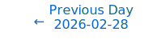
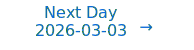

# Personalized Daily ArXiv Papers 2026-03-02

| *[gpt-5]*   | Prompt   | Completion   | Total   |
|:-----------:|:--------:|:------------:|:-------:|
| **Token**   | 36477    | 33650        | 70127   |
| **Cost**    | $0.05    | $0.34        | $0.38   |

Total arXiv papers: 552

Total scanned papers: 274

Total relevant papers: 23

**Table of contents with paper titles:**

1. [AI Must Embrace Specialization via Superhuman Adaptable Intelligence](#user-content-link1)
**Authors:** Judah Goldfeder, Philippe Wyder, Yann LeCun, Ravid Shwartz Ziv

2. [On De-Individuated Neurons: Continuous Symmetries Enable Dynamic Topologies](#user-content-link2)
**Authors:** George Bird

3. [Quant Experts: Token-aware Adaptive Error Reconstruction with Mixture of Experts for Large Vision-Language Models Quantization](#user-content-link3)
**Authors:** Chenwei Jia, Baoting Li, Xuchong Zhang, Mingzhuo Wei, Bochen Lin, Hongbin Sun

4. [GRAIL: Post-hoc Compensation by Linear Reconstruction for Compressed Networks](#user-content-link4)
**Authors:** Wenwu Tang, Dong Wang, Lothar Thiele, Olga Saukh

5. [InfoNCE Induces Gaussian Distribution](#user-content-link5)
**Authors:** Roy Betser, Eyal Gofer, Meir Yossef Levi, Guy Gilboa

6. [Taming Momentum: Rethinking Optimizer States Through Low-Rank Approximation](#user-content-link6)
**Authors:** Zhengbo Wang, Jian Liang, Ran He, Zilei Wang, Tieniu Tan

7. [Provable Subspace Identification of Nonlinear Multi-view CCA](#user-content-link7)
**Authors:** Zhiwei Han, Stefan Matthes, Hao Shen

8. [Efficient Discovery of Approximate Causal Abstractions via Neural Mechanism Sparsification](#user-content-link8)
**Authors:** Amir Asiaee

9. [Memory Caching: RNNs with Growing Memory](#user-content-link9)
**Authors:** Ali Behrouz, Zeman Li, Yuan Deng, Peilin Zhong, Meisam Razaviyayn, Vahab Mirrokni

10. [Compositional Generalization Requires Linear, Orthogonal Representations in Vision Embedding Models](#user-content-link10)
**Authors:** Arnas Uselis, Andrea Dittadi, Seong Joon Oh

11. [Optimizer-Induced Low-Dimensional Drift and Transverse Dynamics in Transformer Training](#user-content-link11)
**Authors:** Yongzhong Xu

12. [CoME: Empowering Channel-of-Mobile-Experts with Informative Hybrid-Capabilities Reasoning](#user-content-link12)
**Authors:** Yuxuan Liu, Weikai Xu, Kun Huang, Changyu Chen, Jiankun Zhao, Pengzhi Gao, Wei Liu, Jian Luan, Shuo Shang, Bo Du, Ji-Rong Wen, Rui Yan

13. [LK Losses: Direct Acceptance Rate Optimization for Speculative Decoding](#user-content-link13)
**Authors:** Alexander Samarin, Sergei Krutikov, Anton Shevtsov, Sergei Skvortsov, Filipp Fisin, Alexander Golubev

14. [Universality of Shallow and Deep Neural Networks on Non-Euclidean Spaces](#user-content-link14)
**Authors:** Vugar Ismailov

15. [Rudder: Steering Prefetching in Distributed GNN Training using LLM Agents](#user-content-link15)
**Authors:** Aishwarya Sarkar, Sayan Ghosh, Nathan Tallent, Aman Chadha, Tanya Roosta, Ali Jannesari

16. [Brain-OF: An Omnifunctional Foundation Model for fMRI, EEG and MEG](#user-content-link16)
**Authors:** Hanning Guo, Farah Abdellatif, Hanwen Bi, Andrei Galbenus, Jon. N. Shah, Abigail Morrison, J\"urgen Dammers

17. [Intrinsic Lorentz Neural Network](#user-content-link17)
**Authors:** Xianglong Shi, Ziheng Chen, Yunhan Jiang, Nicu Sebe

18. [Who Guards the Guardians? The Challenges of Evaluating Identifiability of Learned Representations](#user-content-link18)
**Authors:** Shruti Joshi, Th\'eo Saulus, Wieland Brendel, Philippe Brouillard, Dhanya Sridhar, Patrik Reizinger

19. [A Mixed Diet Makes DINO An Omnivorous Vision Encoder](#user-content-link19)
**Authors:** Rishabh Kabra, Maks Ovsjanikov, Drew A. Hudson, Ye Xia, Skanda Koppula, Andre Araujo, Joao Carreira, Niloy J. Mitra

20. [ODAR: Principled Adaptive Routing for LLM Reasoning via Active Inference](#user-content-link20)
**Authors:** Siyuan Ma, Bo Gao, Xiaojun Jia, Simeng Qin, Tianlin Li, Ke Ma, Xiaoshuang Jia, Wenqi Ren, Yang Liu

21. [MuViT: Multi-Resolution Vision Transformers for Learning Across Scales in Microscopy](#user-content-link21)
**Authors:** Albert Dominguez Mantes, Gioele La Manno, Martin Weigert

22. [KEEP: A KV-Cache-Centric Memory Management System for Efficient Embodied Planning](#user-content-link22)
**Authors:** Zebin Yang, Tong Xie, Baotong Lu, Shaoshan Liu, Bo Yu, Meng Li

23. [Task-Centric Acceleration of Small-Language Models](#user-content-link23)
**Authors:** Dor Tsur, Sharon Adar, Ran Levy

---

## 1. [AI Must Embrace Specialization via Superhuman Adaptable Intelligence](https://arxiv.org/abs/2602.23643) 

**ArXiv ID:** 2602.23643

**Authors:** Judah Goldfeder, Philippe Wyder, Yann LeCun, Ravid Shwartz Ziv

**Abstract:** Everyone from AI executives and researchers to doomsayers, politicians, and activists is talking about Artificial General Intelligence (AGI). Yet, they often don't seem to agree on its exact definition. One common definition of AGI is an AI that can do everything a human can do, but are humans truly general? In this paper, we address what's wrong with our conception of AGI, and why, even in its most coherent formulation, it is a flawed concept to describe the future of AI. We explore whether the most widely accepted definitions are plausible, useful, and truly general. We argue that AI must embrace specialization, rather than strive for generality, and in its specialization strive for superhuman performance, and introduce Superhuman Adaptable Intelligence (SAI). SAI is defined as intelligence that can learn to exceed humans at anything important that we can do, and that can fill in the skill gaps where humans are incapable. We then lay out how SAI can help hone a discussion around AI that was blurred by an overloaded definition of AGI, and extrapolate the implications of using it as a guide for the future.

**Comment:** Author match

---

## 2. [On De-Individuated Neurons: Continuous Symmetries Enable Dynamic Topologies](https://arxiv.org/abs/2602.23405) 

**ArXiv ID:** 2602.23405

**Authors:** George Bird

**Abstract:** This paper introduces a novel methodology for dynamic networks by leveraging a new symmetry-principled class of primitives, isotropic activation functions. This approach enables real-time neuronal growth and shrinkage of the architectures in response to task demand. This is made possible by network structural changes that are invariant under symmetry reparameterisations, leaving the computation identical under neurogenesis and well approximated under neurodegeneration. This is undertaken by leveraging the isotropic primitives' property of basis independence, resulting in the loss of the individuated neurons implicit in the elementwise functional form. Isotropy thereby allows a freedom in the basis to which layers are decomposed and interpreted as individual artificial neurons. This enables a layer-wise diagonalisation procedure, in which typical interconnected layers, such as dense layers, convolutional kernels, and others, can be reexpressed so that neurons have one-to-one, ordered connectivity within alternating layers. This indicates which one-to-one neuron-to-neuron communications are strongly impactful on overall functionality and which are not. Inconsequential neurons can thus be removed (neurodegeneration), and new inactive scaffold neurons added (neurogenesis) whilst remaining analytically invariant in function. A new tunable model parameter, intrinsic length, is also introduced to ensure this analytical invariance. This approach mathematically equates connectivity pruning with neurodegeneration. The diagonalisation also offers new possibilities for mechanistic interpretability into isotropic networks, and it is demonstrated that isotropic dense networks can asymptotically reach a sparsity factor of 50% whilst retaining exact network functionality. Finally, the construction is generalised, demonstrating a nested functional class for this form of isotropic primitive architectures.

**Comment:** Matches Model Architecture and Compression/Efficiency criteria: introduces isotropic activation primitives enabling dynamic topology (neurogenesis/degeneration) and exact connectivity pruning with sparsity.

**Relevance:** 10
**Novelty:** 9

---

## 3. [Quant Experts: Token-aware Adaptive Error Reconstruction with Mixture of Experts for Large Vision-Language Models Quantization](https://arxiv.org/abs/2602.24059) 

**ArXiv ID:** 2602.24059

**Authors:** Chenwei Jia, Baoting Li, Xuchong Zhang, Mingzhuo Wei, Bochen Lin, Hongbin Sun

**Abstract:** Post-Training Quantization (PTQ) has emerged as an effective technique for alleviating the substantial computational and memory overheads of Vision-Language Models (VLMs) by compressing both weights and activations without retraining the full model. Existing PTQ methods primarily rely on static identification and global compensation of sensitive or outlier channels, yet they often overlook the distributional differences of these important channels across inputs, leading to unsatisfactory quantization. In this work, we observe that the distributions and occurrence frequencies of important channels vary significantly both across modalities and among tokens, even within the same modality. Accordingly, we propose \textbf{Quant Experts (QE)}, a token-aware adaptive error compensation with mixture-of-experts for VLMs quantization. QE divides the important channels into token-independent and token-dependent groups. For the former, a shared expert is designed for most tokens to compensate for global quantization error using a low-rank adapter. For the latter, routed experts including multiple routed low-rank adapters are elaborated to compensate for local quantization error related to specific tokens. Extensive experiments demonstrate that QE consistently enhances task accuracy across various quantization settings and model scales, ranging from 2B to 70B parameters, while maintaining performance comparable to full-precision models.

**Comment:** Model Compression and Efficiency + MoE: token-aware adaptive error compensation using routed low-rank mixture-of-experts for PTQ of VLMs.

**Relevance:** 10
**Novelty:** 8

---

## 4. [GRAIL: Post-hoc Compensation by Linear Reconstruction for Compressed Networks](https://arxiv.org/abs/2602.23795) 

**ArXiv ID:** 2602.23795

**Authors:** Wenwu Tang, Dong Wang, Lothar Thiele, Olga Saukh

**Abstract:** Structured deep model compression methods are hardware-friendly and substantially reduce memory and inference costs. However, under aggressive compression, the resulting accuracy degradation often necessitates post-compression finetuning, which can be impractical due to missing labeled data or high training cost. We propose post-hoc blockwise compensation, called GRAIL, a simple zero-finetuning step applied after model compression that restores each block's input-output behavior using a small calibration set. The method summarizes hidden activations via a Gram matrix and applies ridge regression to linearly reconstruct the original hidden representation from the reduced one. The resulting reconstruction map is absorbed into the downstream projection weights, while the upstream layer is compressed. The approach is selector-agnostic (Magnitude, Wanda, Gram-based selection, or folding), data-aware (requiring only a few forward passes without gradients or labels), and recovers classic pruning or folding when the Gram matrix is near identity, indicating weak inter-channel correlations. Across ResNets, ViTs, and decoder-only LLMs, GRAIL consistently improves accuracy or perplexity over data-free and data-aware pruning or folding baselines in practical compression regimes, with manageable overhead and no backpropagation. The code is available at https://github.com/TWWinde/GRAIL.

**Comment:** Model Compression and Efficiency: zero-finetuning post-hoc blockwise compensation via Gram-matrix linear reconstruction to restore compressed network behavior.

**Relevance:** 10
**Novelty:** 8

---

## 5. [InfoNCE Induces Gaussian Distribution](https://arxiv.org/abs/2602.24012) 

**ArXiv ID:** 2602.24012

**Authors:** Roy Betser, Eyal Gofer, Meir Yossef Levi, Guy Gilboa

**Abstract:** Contrastive learning has become a cornerstone of modern representation learning, allowing training with massive unlabeled data for both task-specific and general (foundation) models. A prototypical loss in contrastive training is InfoNCE and its variants. In this work, we show that the InfoNCE objective induces Gaussian structure in representations that emerge from contrastive training. We establish this result in two complementary regimes. First, we show that under certain alignment and concentration assumptions, projections of the high-dimensional representation asymptotically approach a multivariate Gaussian distribution. Next, under less strict assumptions, we show that adding a small asymptotically vanishing regularization term that promotes low feature norm and high feature entropy leads to similar asymptotic results. We support our analysis with experiments on synthetic and CIFAR-10 datasets across multiple encoder architectures and sizes, demonstrating consistent Gaussian behavior. This perspective provides a principled explanation for commonly observed Gaussianity in contrastive representations. The resulting Gaussian model enables principled analytical treatment of learned representations and is expected to support a wide range of applications in contrastive learning.

**Comment:** Representation Learning: theoretical analysis showing InfoNCE induces Gaussian structure in learned features.

**Relevance:** 10
**Novelty:** 8

---

## 6. [Taming Momentum: Rethinking Optimizer States Through Low-Rank Approximation](https://arxiv.org/abs/2602.24283) 

**ArXiv ID:** 2602.24283

**Authors:** Zhengbo Wang, Jian Liang, Ran He, Zilei Wang, Tieniu Tan

**Abstract:** Modern optimizers like Adam and Muon are central to training large language models, but their reliance on first- and second-order momenta introduces significant memory overhead, which constrains scalability and computational efficiency. In this work, we reframe the exponential moving average (EMA) used in these momenta as the training of a linear regressor via online gradient flow. Building on this equivalence, we introduce LoRA-Pre, a novel low-rank optimizer designed for efficient pre-training. Specifically, LoRA-Pre reduces the optimizer's memory footprint by decomposing the full momentum matrix into a compact low-rank subspace within the online linear learner, thereby maintaining optimization performance while improving memory efficiency. We empirically validate LoRA-Pre's efficacy by pre-training models from the Llama architecture family, scaling from 60M to 1B parameters. LoRA-Pre achieves the highest performance across all model sizes. Notably, LoRA-Pre demonstrates remarkable rank efficiency, achieving comparable or superior results using only 1/8 the rank of baseline methods. Beyond pre-training, we evaluate LoRA-Pre's effectiveness in fine-tuning scenarios. With the same rank, LoRA-Pre consistently outperforms all efficient fine-tuning baselines. Specifically, compared to standard LoRA, LoRA-Pre achieves substantial improvements of 3.14 points on Llama-3.1-8B and 6.17 points on Llama-2-7B, validating our approach's effectiveness across both pre-training and fine-tuning paradigms. Our code is publicly available at https://github.com/mrflogs/LoRA-Pre.

**Comment:** Model Compression and Efficiency: low-rank approximation of optimizer states to cut memory while maintaining performance in LLM training.

**Relevance:** 10
**Novelty:** 8

---

## 7. [Provable Subspace Identification of Nonlinear Multi-view CCA](https://arxiv.org/abs/2602.23785) 

**ArXiv ID:** 2602.23785

**Authors:** Zhiwei Han, Stefan Matthes, Hao Shen

**Abstract:** We investigate the identifiability of nonlinear Canonical Correlation Analysis (CCA) in a multi-view setup, where each view is generated by an unknown nonlinear map applied to a linear mixture of shared latents and view-private noise. Rather than attempting exact unmixing, a problem proven to be ill-posed, we instead reframe multi-view CCA as a basis-invariant subspace identification problem. We prove that, under suitable latent priors and spectral separation conditions, multi-view CCA recovers the pairwise correlated signal subspaces up to view-wise orthogonal ambiguity. For $N \geq 3$ views, the objective provably isolates the jointly correlated subspaces shared across all views while eliminating view-private variations. We further establish finite-sample consistency guarantees by translating the concentration of empirical cross-covariances into explicit subspace error bounds via spectral perturbation theory. Experiments on synthetic and rendered image datasets validate our theoretical findings and confirm the necessity of the assumed conditions.

**Comment:** Representation Learning Theory: provable identifiability and finite-sample guarantees for nonlinear multi-view CCA subspace recovery.

**Relevance:** 9
**Novelty:** 8

---

## 8. [Efficient Discovery of Approximate Causal Abstractions via Neural Mechanism Sparsification](https://arxiv.org/abs/2602.24266) 

**ArXiv ID:** 2602.24266

**Authors:** Amir Asiaee

**Abstract:** Neural networks are hypothesized to implement interpretable causal mechanisms, yet verifying this requires finding a causal abstraction -- a simpler, high-level Structural Causal Model (SCM) faithful to the network under interventions. Discovering such abstractions is hard: it typically demands brute-force interchange interventions or retraining. We reframe the problem by viewing structured pruning as a search over approximate abstractions. Treating a trained network as a deterministic SCM, we derive an Interventional Risk objective whose second-order expansion yields closed-form criteria for replacing units with constants or folding them into neighbors. Under uniform curvature, our score reduces to activation variance, recovering variance-based pruning as a special case while clarifying when it fails. The resulting procedure efficiently extracts sparse, intervention-faithful abstractions from pretrained networks, which we validate via interchange interventions.

**Comment:** Model Compression and Efficiency: structured pruning viewed as search over causal abstractions with closed-form interventional risk criteria (sparsity/pruning).

**Relevance:** 9
**Novelty:** 8

---

## 9. [Memory Caching: RNNs with Growing Memory](https://arxiv.org/abs/2602.24281) 

**ArXiv ID:** 2602.24281

**Authors:** Ali Behrouz, Zeman Li, Yuan Deng, Peilin Zhong, Meisam Razaviyayn, Vahab Mirrokni

**Abstract:** Transformers have been established as the de-facto backbones for most recent advances in sequence modeling, mainly due to their growing memory capacity that scales with the context length. While plausible for retrieval tasks, it causes quadratic complexity and so has motivated recent studies to explore viable subquadratic recurrent alternatives. Despite showing promising preliminary results in diverse domains, such recurrent architectures underperform Transformers in recall-intensive tasks, often attributed to their fixed-size memory. In this paper, we introduce Memory Caching (MC), a simple yet effective technique that enhances recurrent models by caching checkpoints of their memory states (a.k.a. hidden states). Memory Caching allows the effective memory capacity of RNNs to grow with sequence length, offering a flexible trade-off that interpolates between the fixed memory (i.e., $O(L)$ complexity) of RNNs and the growing memory (i.e., $O(L^2)$ complexity) of Transformers. We propose four variants of MC, including gated aggregation and sparse selective mechanisms, and discuss their implications on both linear and deep memory modules. Our experimental results on language modeling, and long-context understanding tasks show that MC enhances the performance of recurrent models, supporting its effectiveness. The results of in-context recall tasks indicate that while Transformers achieve the best accuracy, our MC variants show competitive performance, close the gap with Transformers, and performs better than state-of-the-art recurrent models.

**Comment:** Matches Model Architecture and Efficiency criteria: introduces Memory Caching to grow RNN effective memory with sequence length, interpolating between RNN and Transformer memory-compute trade-offs.

**Relevance:** 9
**Novelty:** 8

---

## 10. [Compositional Generalization Requires Linear, Orthogonal Representations in Vision Embedding Models](https://arxiv.org/abs/2602.24264) 

**ArXiv ID:** 2602.24264

**Authors:** Arnas Uselis, Andrea Dittadi, Seong Joon Oh

**Abstract:** Compositional generalization, the ability to recognize familiar parts in novel contexts, is a defining property of intelligent systems. Although modern models are trained on massive datasets, they still cover only a tiny fraction of the combinatorial space of possible inputs, raising the question of what structure representations must have to support generalization to unseen combinations. We formalize three desiderata for compositional generalization under standard training (divisibility, transferability, stability) and show they impose necessary geometric constraints: representations must decompose linearly into per-concept components, and these components must be orthogonal across concepts. This provides theoretical grounding for the Linear Representation Hypothesis: the linear structure widely observed in neural representations is a necessary consequence of compositional generalization. We further derive dimension bounds linking the number of composable concepts to the embedding geometry. Empirically, we evaluate these predictions across modern vision models (CLIP, SigLIP, DINO) and find that representations exhibit partial linear factorization with low-rank, near-orthogonal per-concept factors, and that the degree of this structure correlates with compositional generalization on unseen combinations. As models continue to scale, these conditions predict the representational geometry they may converge to. Code is available at https://github.com/oshapio/necessary-compositionality.

**Comment:** Matches Representation Learning criterion: derives necessary geometric constraints (linear, orthogonal per-concept factors) for compositional generalization with empirical support.

**Relevance:** 9
**Novelty:** 8

---

## 11. [Optimizer-Induced Low-Dimensional Drift and Transverse Dynamics in Transformer Training](https://arxiv.org/abs/2602.23696) 

**ArXiv ID:** 2602.23696

**Authors:** Yongzhong Xu

**Abstract:** We study the geometry of training trajectories in small transformer models and find that parameter updates organize into a dominant drift direction with transverse residual dynamics. Using uncentered, row-normalized trajectory PCA, we show that a single direction captures a large fraction of cumulative parameter movement early in training, while remaining components encode oscillatory behavior in auxiliary probe performance. Instantaneous gradients exhibit little alignment with this dominant direction, indicating that it arises from accumulated optimizer updates rather than per-batch gradient structure. Comparing AdamW with SGD variants at matched loss levels reveals substantial differences in trajectory geometry: AdamW develops multi-dimensional drift structure, whereas SGD-family optimizers produce nearly colinear parameter evolution and weaker probe dynamics. Reheating selectively perturbs transverse components with minimal effect on the dominant drift coordinate. These findings suggest that optimizer choice shapes the effective dimensionality and structure of learning trajectories beyond what is apparent from loss values alone.

**Comment:** Representation Learning/Training Dynamics: analyzes optimizer-induced low-dimensional drift and transverse dynamics in transformer parameter trajectories.

**Relevance:** 9
**Novelty:** 7

---

## 12. [CoME: Empowering Channel-of-Mobile-Experts with Informative Hybrid-Capabilities Reasoning](https://arxiv.org/abs/2602.24142) 

**ArXiv ID:** 2602.24142

**Authors:** Yuxuan Liu, Weikai Xu, Kun Huang, Changyu Chen, Jiankun Zhao, Pengzhi Gao, Wei Liu, Jian Luan, Shuo Shang, Bo Du, Ji-Rong Wen, Rui Yan

**Abstract:** Mobile Agents can autonomously execute user instructions, which requires hybrid-capabilities reasoning, including screen summary, subtask planning, action decision and action function. However, existing agents struggle to achieve both decoupled enhancement and balanced integration of these capabilities. To address these challenges, we propose Channel-of-Mobile-Experts (CoME), a novel agent architecture consisting of four distinct experts, each aligned with a specific reasoning stage, CoME activates the corresponding expert to generate output tokens in each reasoning stage via output-oriented activation. To empower CoME with hybrid-capabilities reasoning, we introduce a progressive training strategy: Expert-FT enables decoupling and enhancement of different experts' capability; Router-FT aligns expert activation with the different reasoning stage; CoT-FT facilitates seamless collaboration and balanced optimization across multiple capabilities. To mitigate error propagation in hybrid-capabilities reasoning, we propose InfoGain-Driven DPO (Info-DPO), which uses information gain to evaluate the contribution of each intermediate step, thereby guiding CoME toward more informative reasoning. Comprehensive experiments show that CoME outperforms dense mobile agents and MoE methods on both AITZ and AMEX datasets.

**Comment:** Model Architecture: Mixture-of-Experts with stage-aligned experts and routing for hybrid-capabilities reasoning.

**Relevance:** 9
**Novelty:** 7

---

## 13. [LK Losses: Direct Acceptance Rate Optimization for Speculative Decoding](https://arxiv.org/abs/2602.23881) 

**ArXiv ID:** 2602.23881

**Authors:** Alexander Samarin, Sergei Krutikov, Anton Shevtsov, Sergei Skvortsov, Filipp Fisin, Alexander Golubev

**Abstract:** Speculative decoding accelerates autoregressive large language model (LLM) inference by using a lightweight draft model to propose candidate tokens that are then verified in parallel by the target model. The speedup is significantly determined by the acceptance rate, yet standard training minimizes Kullback-Leibler (KL) divergence as a proxy objective. While KL divergence and acceptance rate share the same global optimum, small draft models, having limited capacity, typically converge to suboptimal solutions where minimizing KL does not guarantee maximizing acceptance rate. To address this issue, we propose LK losses, special training objectives that directly target acceptance rate. Comprehensive experiments across four draft architectures and six target models, ranging from 8B to 685B parameters, demonstrate consistent improvements in acceptance metrics across all configurations compared to the standard KL-based training. We evaluate our approach on general, coding and math domains and report gains of up to 8-10% in average acceptance length. LK losses are easy to implement, introduce no computational overhead and can be directly integrated into any existing speculator training framework, making them a compelling alternative to the existing draft training objectives.

**Comment:** Model Compression and Efficiency: new training objective directly optimizing acceptance rate in speculative decoding for faster inference.

**Relevance:** 9
**Novelty:** 7

---

## 14. [Universality of Shallow and Deep Neural Networks on Non-Euclidean Spaces](https://arxiv.org/abs/2602.23381) 

**ArXiv ID:** 2602.23381

**Authors:** Vugar Ismailov

**Abstract:** We develop a framework for shallow and deep neural networks whose inputs range over a general topological space. The model is built from a prescribed family of continuous feature maps and a fixed scalar activation function, and it reduces to multilayer feedforward networks in the Euclidean case. We focus on the universal approximation property and establish general conditions under which such networks are dense in spaces of continuous vector-valued functions on arbitrary and locally convex topological spaces. In the absence of width constraints, we obtain universality results that extend classical approximation theorems to non-Euclidean settings. A central focus of the paper is the deep narrow framework, in which the width of each hidden layer is uniformly bounded while the depth is allowed to grow. We identify conditions under which such width constrained deep networks retain universal approximation power. As a concrete example, we employ Ostrand's extension of the Kolmogorov superposition theorem to derive an explicit universality result for products of compact metric spaces, with width bounds expressed in terms of topological dimension.

**Comment:** Model Architecture: theoretical universality for deep narrow networks on general topological spaces; Representation Learning: foundational approximation results beyond Euclidean inputs.

**Relevance:** 8
**Novelty:** 8

---

## 15. [Rudder: Steering Prefetching in Distributed GNN Training using LLM Agents](https://arxiv.org/abs/2602.23556) 

**ArXiv ID:** 2602.23556

**Authors:** Aishwarya Sarkar, Sayan Ghosh, Nathan Tallent, Aman Chadha, Tanya Roosta, Ali Jannesari

**Abstract:** Large-scale Graph Neural Networks (GNNs) are typically trained by sampling a vertex's neighbors to a fixed distance. Because large input graphs are distributed, training requires frequent irregular communication that stalls forward progress. Moreover, fetched data changes with graph, graph distribution, sample and batch parameters, and caching polices. Consequently, any static prefetching method will miss crucial opportunities to adapt to different dynamic conditions. In this paper, we introduce Rudder, a software module embedded in the state-of-the-art AWS DistDGL framework, to autonomously prefetch remote nodes and minimize communication. Rudder's adaptation contrasts with both standard heuristics and traditional ML classifiers. We observe that the generative AI found in contemporary Large Language Models (LLMs) exhibits emergent properties like In-Context Learning (ICL) for zero-shot tasks, with logical multi-step reasoning. We find this behavior well-suited for adaptive control even with substantial undertraining. Evaluations using standard datasets and unseen configurations on the NERSC Perlmutter supercomputer show up to 91% improvement in end-to-end training performance over baseline DistDGL (no prefetching), and an 82% improvement over static prefetching, reducing communication by over 50%. Our code is available at https://github.com/aishwaryyasarkar/rudder-llm-agent.

**Comment:** High Performance Computing: adaptive prefetching to reduce communication in distributed GNN training using an LLM-based controller.

**Relevance:** 8
**Novelty:** 7

---

## 16. [Brain-OF: An Omnifunctional Foundation Model for fMRI, EEG and MEG](https://arxiv.org/abs/2602.23410) 

**ArXiv ID:** 2602.23410

**Authors:** Hanning Guo, Farah Abdellatif, Hanwen Bi, Andrei Galbenus, Jon. N. Shah, Abigail Morrison, J\"urgen Dammers

**Abstract:** Brain foundation models have achieved remarkable advances across a wide range of neuroscience tasks. However, most existing models are limited to a single functional modality, restricting their ability to exploit complementary spatiotemporal dynamics and the collective data scale across imaging techniques. To address this limitation, we propose Brain-OF, the first omnifunctional brain foundation model jointly pretrained on fMRI, EEG and MEG, capable of handling both unimodal and multimodal inputs within a unified framework. To reconcile heterogeneous spatiotemporal resolutions, we introduce the Any-Resolution Neural Signal Sampler, which projects diverse brain signals into a shared semantic space.To further manage semantic shifts, the Brain-OF backbone integrates DINT attention with a Sparse Mixture of Experts, where shared experts capture modality-invariant representations and routed experts specialize in modality-specific semantics. Furthermore, we propose Masked Temporal-Frequency Modeling, a dual-domain pretraining objective that jointly reconstructs brain signals in both the time and frequency domains. Brain-OF is pretrained on a large-scale corpus comprising around 40 datasets and demonstrates superior performance across diverse downstream tasks, highlighting the benefits of joint multimodal integration and dual-domain pretraining.

**Comment:** Model Architecture (MoE): integrates DINT attention with a Sparse Mixture-of-Experts for modality-shared and routed experts in a multimodal foundation model.

**Relevance:** 8
**Novelty:** 7

---

## 17. [Intrinsic Lorentz Neural Network](https://arxiv.org/abs/2602.23981) 

**ArXiv ID:** 2602.23981

**Authors:** Xianglong Shi, Ziheng Chen, Yunhan Jiang, Nicu Sebe

**Abstract:** Real-world data frequently exhibit latent hierarchical structures, which can be naturally represented by hyperbolic geometry. Although recent hyperbolic neural networks have demonstrated promising results, many existing architectures remain partially intrinsic, mixing Euclidean operations with hyperbolic ones or relying on extrinsic parameterizations. To address it, we propose the \emph{Intrinsic Lorentz Neural Network} (ILNN), a fully intrinsic hyperbolic architecture that conducts all computations within the Lorentz model. At its core, the network introduces a novel \emph{point-to-hyperplane} fully connected layer (FC), replacing traditional Euclidean affine logits with closed-form hyperbolic distances from features to learned Lorentz hyperplanes, thereby ensuring that the resulting geometric decision functions respect the inherent curvature. Around this fundamental layer, we design intrinsic modules: GyroLBN, a Lorentz batch normalization that couples gyro-centering with gyro-scaling, consistently outperforming both LBN and GyroBN while reducing training time. We additionally proposed a gyro-additive bias for the FC output, a Lorentz patch-concatenation operator that aligns the expected log-radius across feature blocks via a digamma-based scale, and a Lorentz dropout layer. Extensive experiments conducted on CIFAR-10/100 and two genomic benchmarks (TEB and GUE) illustrate that ILNN achieves state-of-the-art performance and computational cost among hyperbolic models and consistently surpasses strong Euclidean baselines. The code is available at \href{https://github.com/Longchentong/ILNN}{\textcolor{magenta}{this url}}.

**Comment:** Model Architecture: fully intrinsic hyperbolic (Lorentz) neural network with novel point-to-hyperplane layer and intrinsic normalization/operators.

**Relevance:** 8
**Novelty:** 7

---

## 18. [Who Guards the Guardians? The Challenges of Evaluating Identifiability of Learned Representations](https://arxiv.org/abs/2602.24278) 

**ArXiv ID:** 2602.24278

**Authors:** Shruti Joshi, Th\'eo Saulus, Wieland Brendel, Philippe Brouillard, Dhanya Sridhar, Patrik Reizinger

**Abstract:** Identifiability in representation learning is commonly evaluated using standard metrics (e.g., MCC, DCI, R^2) on synthetic benchmarks with known ground-truth factors. These metrics are assumed to reflect recovery up to the equivalence class guaranteed by identifiability theory. We show that this assumption holds only under specific structural conditions: each metric implicitly encodes assumptions about both the data-generating process (DGP) and the encoder. When these assumptions are violated, metrics become misspecified and can produce systematic false positives and false negatives. Such failures occur both within classical identifiability regimes and in post-hoc settings where identifiability is most needed. We introduce a taxonomy separating DGP assumptions from encoder geometry, use it to characterise the validity domains of existing metrics, and release an evaluation suite for reproducible stress testing and comparison.

**Comment:** Representation Learning: critical analysis of identifiability metrics with taxonomy and stress-testing suite.

**Relevance:** 8
**Novelty:** 7

---

## 19. [A Mixed Diet Makes DINO An Omnivorous Vision Encoder](https://arxiv.org/abs/2602.24181) 

**ArXiv ID:** 2602.24181

**Authors:** Rishabh Kabra, Maks Ovsjanikov, Drew A. Hudson, Ye Xia, Skanda Koppula, Andre Araujo, Joao Carreira, Niloy J. Mitra

**Abstract:** Pre-trained vision encoders like DINOv2 have demonstrated exceptional performance on unimodal tasks. However, we observe that their feature representations are poorly aligned across different modalities. For instance, the feature embedding for an RGB image and its corresponding depth map of the same scene exhibit a cosine similarity that is nearly identical to that of two random, unrelated images. To address this, we propose the Omnivorous Vision Encoder, a novel framework that learns a modality-agnostic feature space. We train the encoder with a dual objective: first, to maximize the feature alignment between different modalities of the same scene; and second, a distillation objective that anchors the learned representations to the output of a fully frozen teacher such as DINOv2. The resulting student encoder becomes "omnivorous" by producing a consistent, powerful embedding for a given scene, regardless of the input modality (RGB, Depth, Segmentation, etc.). This approach enables robust cross-modal understanding while retaining the discriminative semantics of the original foundation model.

**Comment:** Matches Representation Learning criterion: cross-modal alignment with a distillation objective to learn a modality-agnostic embedding space anchored to a frozen DINOv2 teacher.

**Relevance:** 8
**Novelty:** 7

---

## 20. [ODAR: Principled Adaptive Routing for LLM Reasoning via Active Inference](https://arxiv.org/abs/2602.23681) 

**ArXiv ID:** 2602.23681

**Authors:** Siyuan Ma, Bo Gao, Xiaojun Jia, Simeng Qin, Tianlin Li, Ke Ma, Xiaoshuang Jia, Wenqi Ren, Yang Liu

**Abstract:** The paradigm of large language model (LLM) reasoning is shifting from parameter scaling to test-time compute scaling, yet many existing approaches still rely on uniform brute-force sampling (for example, fixed best-of-N or self-consistency) that is costly, hard to attribute, and can trigger overthinking with diminishing returns. We propose ODAR-Expert, an adaptive routing framework that optimizes the accuracy-efficiency trade-off via principled resource allocation. ODAR uses a difficulty estimator grounded in amortized active inference to dynamically route queries between a heuristic Fast Agent and a deliberative Slow Agent. We further introduce a free-energy-principled, risk-sensitive fusion mechanism that selects answers by minimizing a variational free energy objective, balancing log-likelihood with epistemic uncertainty (varentropy) as a principled alternative to ad hoc voting over heterogeneous candidates. Extensive evaluation across 23 benchmarks shows strong and consistent gains, including 98.2% accuracy on MATH and 54.8% on Humanity's Last Exam (HLE), while improving the compute-accuracy frontier under compute-matched settings. We also validate reproducibility on a fully open-source stack (Llama 4 + DeepSeek), where ODAR surpasses homogeneous sampling strategies while reducing computational costs by 82%. Overall, our results suggest that thinking-optimal scaling requires adaptive resource allocation with free-energy-based decision-making rather than simply increasing test-time compute.

**Comment:** Matches Model Architecture/Efficiency criterion: conditional/dynamic routing between Fast and Slow agents with free-energy-based fusion for test-time compute scaling in LLM reasoning.

**Relevance:** 8
**Novelty:** 7

---

## 21. [MuViT: Multi-Resolution Vision Transformers for Learning Across Scales in Microscopy](https://arxiv.org/abs/2602.24222) 

**ArXiv ID:** 2602.24222

**Authors:** Albert Dominguez Mantes, Gioele La Manno, Martin Weigert

**Abstract:** Modern microscopy routinely produces gigapixel images that contain structures across multiple spatial scales, from fine cellular morphology to broader tissue organization. Many analysis tasks require combining these scales, yet most vision models operate at a single resolution or derive multi-scale features from one view, limiting their ability to exploit the inherently multi-resolution nature of microscopy data. We introduce MuViT, a transformer architecture built to fuse true multi-resolution observations from the same underlying image. MuViT embeds all patches into a shared world-coordinate system and extends rotary positional embeddings to these coordinates, enabling attention to integrate wide-field context with high-resolution detail within a single encoder. Across synthetic benchmarks, kidney histopathology, and high-resolution mouse-brain microscopy, MuViT delivers consistent improvements over strong ViT and CNN baselines. Multi-resolution MAE pretraining further produces scale-consistent representations that enhance downstream tasks. These results demonstrate that explicit world-coordinate modelling provides a simple yet powerful mechanism for leveraging multi-resolution information in large-scale microscopy analysis.

**Comment:** Matches Model Architecture criterion: multi-resolution Vision Transformer with shared world-coordinate embeddings and extended RoPE for scale-consistent attention.

**Relevance:** 8
**Novelty:** 7

---

## 22. [KEEP: A KV-Cache-Centric Memory Management System for Efficient Embodied Planning](https://arxiv.org/abs/2602.23592) 

**ArXiv ID:** 2602.23592

**Authors:** Zebin Yang, Tong Xie, Baotong Lu, Shaoshan Liu, Bo Yu, Meng Li

**Abstract:** Memory-augmented Large Language Models (LLMs) have demonstrated remarkable capability for complex and long-horizon embodied planning. By keeping track of past experiences and environmental states, memory enables LLMs to maintain a global view, thereby avoiding repetitive exploration. However, existing approaches often store the memory as raw text, leading to excessively long prompts and high prefill latency. While it is possible to store and reuse the KV caches, the efficiency benefits are greatly undermined due to frequent KV cache updates. In this paper, we propose KEEP, a KV-cache-centric memory management system for efficient embodied planning. KEEP features 3 key innovations: (1) a Static-Dynamic Memory Construction algorithm that reduces KV cache recomputation by mixed-granularity memory group; (2) a Multi-hop Memory Re-computation algorithm that dynamically identifies important cross-attention among different memory groups and reconstructs memory interactions iteratively; (3) a Layer-balanced Memory Loading that eliminates unbalanced KV cache loading and cross-attention computation across different layers. Extensive experimental results have demonstrated that KEEP achieves 2.68x speedup with negligible accuracy loss compared with text-based memory methods on ALFRED dataset. Compared with the KV re-computation method CacheBlend (EuroSys'25), KEEP shows 4.13% success rate improvement and 1.90x time-to-first-token (TTFT) reduction. Our code is available on https://github.com/PKU-SEC-Lab/KEEP_Embodied_Memory.

**Comment:** Matches High Performance Computing/Efficiency criterion: KV-cache-centric memory management (construction, recomputation, balanced loading) to reduce LLM inference latency.

**Relevance:** 8
**Novelty:** 7

---

## 23. [Task-Centric Acceleration of Small-Language Models](https://arxiv.org/abs/2602.24174) 

**ArXiv ID:** 2602.24174

**Authors:** Dor Tsur, Sharon Adar, Ran Levy

**Abstract:** Small language models (SLMs) have emerged as efficient alternatives to large language models for task-specific applications. However, they are often employed in high-volume, low-latency settings, where efficiency is crucial. We propose TASC, Task-Adaptive Sequence Compression, a framework for SLM acceleration comprising two use-cases: When performing SLM fine-tuning, we propose TASC-ft, which iteratively enriches the tokenizer vocabulary with high-frequency output n-grams and then fine-tunes the model to utilize the expanded vocabulary. Next, we propose an inference-time method, termed TASC-spec. TASC-spec is a lightweight, training-free speculative decoding method that constructs an n-gram draft model from the task's output corpus, mixing task and context n-gram information.TASC-spec avoids any additional training, while bypassing draft-target vocabulary alignment constraints. We demonstrate the effectiveness of both methods across multiple low output-variability generation tasks. Our methods show consistent improvements in inference efficiency while maintaining task performance.

**Comment:** Model Compression and Efficiency: task-adaptive sequence compression via tokenizer expansion (TASC-ft) and training-free n-gram speculative decoding (TASC-spec) to accelerate SLM inference.

**Relevance:** 8
**Novelty:** 7

---

# Paper Selection Prompt

## System Prompt

> You are a helpful paper reading assistant whose job is to read daily posts from ArXiv and identify a few papers that your friend will enjoy reading.
> Your job is to carefully read the paper titles and abstracts below and find the ones that match the criteria below.

## User Prompt

> ## Instructions
> 
> Write the response in JSONL format with {ARXIVID, COMMENT, RELEVANCE, NOVELTY} on each line, one for each paper.
> 
> - ARXIVID: should be the ArXiv ID.
> - COMMENT: should identify whether there is a criteria that match the paper very closely. These matches should not be based on general terms like "language modeling" or "advancements" and should specifically refer to a criterion. No need to mention the non-matching criteria.
> - RELEVANCE: should be a score from 1-10.
> - NOVELTY: should be a score from 1-10.
> 
> ## Scoring Criteria
> 
> > The "Relevance" score measures how closely the paper aligns with the core topics of the prompt.
> > The "Novelty" score assesses the originality and impact of the paper.
> > They are two **ORTHONORMAL** axes and **SHOULD NOT** be confused with each other.
> 
> ### Relevance Scoring
> 
> - Relevance 9-10 (Completely Relevant)
>   - Focus: Fully aligned with core topics with no deviation, score the highest if contains relevant keywords in it.
>   - Examples: Papers focused on foundational methods or theoretical research, whose titles contain topic keywords like "MoE".
> 
> - Relevance 7-8 (Relevant)
>   - Focus: Retain a solid link to the main research area, though may touch on peripheral elements.
>   - Examples: Papers research on the fundamental part of MoE through a less critical aspect like its behavior in GNN.
> 
> - Relevance 5-6 (Borderline)
>   - Focus: Maintains a link to the core topic but also extends into at least one other domain/area beyond the primary focus.
>   - Examples: Work referencing MoE centered on reinforcement learning.
> 
> - Relevance 3-4 (Irrelevant)
>   - Focus: Largely outside our interests with no association to our topics.
>   - Examples: Application-focused papers like using MoE to solve a problem in the real world.
> 
> - Relevance 1-2 (Ignore)
>   - Focus: Purely unrelated to our topics. Completely a different domain.
>   - **Exception**: If the paper hints at a cutting-edge, radically new direction that could eventually transform the primary domain, consider a score of 9–10 despite initial appearances. (Usually a very rare concept that belongs to the fundamental research)
> 
> ### Novelty Scoring
> 
> - Novelty 9-10 (Breakthrough)
>   - Definition: Groundbreaking methods/theory introducing new directions or solving major challenges.
>   - Examples: Entirely new paradigm for foundational models; a novel theory transforming representation learning.
> 
> - Novelty 7-8 (Improvements)
>   - Definition: Substantial insights/enhancements, though not a full paradigm shift.
>   - Examples: Modifications on existing methods yielding significantly better results.
> 
> - Novelty 5-6 (Borderline)
>   - Definition: Incremental contributions with possible long-term benefits, not immediately transformative.
>   - Examples: Moderately novel extension to an existing architecture; refining current methods without fundamentally altering them.
> 
> - Novelty 3-4 (Tangential)
>   - Definition: Minor or domain-specific improvements with limited broader impact.
>   - Examples: Slight modifications to known methods with strange motivation; purely engineering jobs like a new benchmark/dataset.
> 
> - Novelty 1-2 (Low)
>   - Definition: Minimal originality, applying standard approaches without real innovation.
>   - Examples: Using an off-the-shelf model without adding new insights; purely application-driven studies like finetuning a pretrained model using existing methods.
> 
> ## Papers
> 
> [PAPER LIST HERE]
> 
> ## Relevant Topics
> 
> Use the following relevance criteria to focus on foundational research. Keep **relevant** papers and filter out **irrelevant** ones. Avoid purely **application-driven** work.
> 
> 1. Model Architecture
>    - Relevant: Mixture-of-Experts (MoE), Transformers, Conditional/Dynamic Networks, Autoencoders, analysis/innovations on existing architectures.
>    - Irrelevant: Merely using existing architectures for a certain task without insights into the structure themselves.
> 
> 2. Model Compression and Efficiency
>    - Relevant: Sparsity, pruning, quantization, low-rank approaches, cache, or other algorithmic/theoretical efficiency breakthroughs.
>    - Irrelevant: Straightforward applications of existing compression methods to new tasks.
> 
> 3. High Performance Computing
>    - Relevant: Algorithmic or systems-level innovations enabling training of large-scale models, distributed training techniques, memory optimization.
>    - Irrelevant: Incremental engineering improvements without novel algorithmic contributions.
> 
> 4. Representation Learning
>    - Relevant: Insights into how deep networks encode information, feature/dictionary learning, sparse/contrastive methods, training dynamics in neural networks.
>    - Irrelevant: Standard applications of known techniques lacking new theoretical or methodological contributions.
> 
> **Keywords:**
> 
> - Relevant: Mixture of Experts (MoE), Representation Learning, Compression/Efficiency, Sparse/Sparsity, Pruning, Quantization, Low-rank, Foundation Model, etc.
> - Irrelevant: Reinforcement Learning, Transfer Learning, Federated Learning, Online Learning, Diffusion Models, etc.
> - Application: Image Segmentation, Medical Imaging, 3D Vision, Video Understanding, Information Retrieval, Summarization, Recommendation Systems, Machine Translation, Speech Recognition, Signal Processing, Spatial/Temporal Modeling, Time Series, Knowledge Graph, etc.