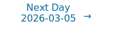

# Personalized Daily ArXiv Papers 2026-03-03

| *[gpt-5]*   | Prompt   | Completion   | Total   |
|:-----------:|:--------:|:------------:|:-------:|
| **Token**   | 95682    | 80996        | 176678  |
| **Cost**    | $0.12    | $0.81        | $0.93   |

Total arXiv papers: 1585

Total scanned papers: 830

Total relevant papers: 47

**Table of contents with paper titles:**

1. [ASTRA-bench: Evaluating Tool-Use Agent Reasoning and Action Planning with Personal User Context](#user-content-link1)
**Authors:** Zidi Xiu, David Q. Sun, Kevin Cheng, Maitrik Patel, Josh Date, Yizhe Zhang, Jiarui Lu, Omar Attia, Raviteja Vemulapalli, Oncel Tuzel, Meng Cao, Samy Bengio

2. [Curvature-Weighted Capacity Allocation: A Minimum Description Length Framework for Layer-Adaptive Large Language Model Optimization](#user-content-link2)
**Authors:** Theophilus Amaefuna, Hitesh Vaidya, Anshuman Chhabra, Ankur Mali

3. [Recursive Models for Long-Horizon Reasoning](#user-content-link3)
**Authors:** Chenxiao Yang, Nathan Srebro, Zhiyuan Li

4. [Expert Divergence Learning for MoE-based Language Models](#user-content-link4)
**Authors:** Jiaang Li, Haibin Chen, Langming Liu, Yujin Yuan, Yadao Wang, Yizhen Zhang, Chengting Yu, Xin Tong, Weidong Zhang, Shilei Liu, Wenbo Su, Bo Zheng

5. [Multi-Head Low-Rank Attention](#user-content-link5)
**Authors:** Songtao Liu, Hongwu Peng, Zhiwei Zhang, Zhengyu Chen, Yue Guo

6. [Attn-QAT: 4-Bit Attention With Quantization-Aware Training](#user-content-link6)
**Authors:** Peiyuan Zhang, Matthew Noto, Wenxuan Tan, Chengquan Jiang, Will Lin, Wei Zhou, Hao Zhang

7. [3BASiL: An Algorithmic Framework for Sparse plus Low-Rank Compression of LLMs](#user-content-link7)
**Authors:** Mehdi Makni, Xiang Meng, Rahul Mazumder

8. [TriMoE: Augmenting GPU with AMX-Enabled CPU and DIMM-NDP for High-Throughput MoE Inference via Offloading](#user-content-link8)
**Authors:** Yudong Pan, Yintao He, Tianhua Han, Lian Liu, Shixin Zhao, Zhirong Chen, Mengdi Wang, Cangyuan Li, Yinhe Han, Ying Wang

9. [The Expressive Limits of Diagonal SSMs for State-Tracking](#user-content-link9)
**Authors:** Mehran Shakerinava, Behnoush Khavari, Siamak Ravanbakhsh, Sarath Chandar

10. [Training Dynamics of Softmax Self-Attention: Fast Global Convergence via Preconditioning](#user-content-link10)
**Authors:** Gautam Goel, Mahdi Soltanolkotabi, Peter Bartlett

11. [Quantitative Convergence of Wasserstein Gradient Flows of Kernel Mean Discrepancies](#user-content-link11)
**Authors:** L\'ena\"ic Chizat, Maria Colombo, Roberto Colombo, Xavier Fern\'andez-Real

12. [Diagnosing Generalization Failures from Representational Geometry Markers](#user-content-link12)
**Authors:** Chi-Ning Chou, Artem Kirsanov, Yao-Yuan Yang, SueYeon Chung

13. [CHLU: The Causal Hamiltonian Learning Unit as a Symplectic Primitive for Deep Learning](#user-content-link13)
**Authors:** Pratik Jawahar, Maurizio Pierini

14. [Grokking as a Phase Transition between Competing Basins: a Singular Learning Theory Approach](#user-content-link14)
**Authors:** Ben Cullen, Sergio Estan-Ruiz, Riya Danait, Jiayi Li

15. [Weight Updates as Activation Shifts: A Principled Framework for Steering](#user-content-link15)
**Authors:** Dyah Adila, John Cooper, Alexander Yun, Avi Trost, Frederic Sala

16. [NNiT: Width-Agnostic Neural Network Generation with Structurally Aligned Weight Spaces](#user-content-link16)
**Authors:** Jiwoo Kim, Swarajh Mehta, Hao-Lun Hsu, Hyunwoo Ryu, Yudong Liu, Miroslav Pajic

17. [Spectral Condition for $\mu$P under Width-Depth Scaling](#user-content-link17)
**Authors:** Chenyu Zheng, Rongzhen Wang, Xinyu Zhang, Chongxuan Li

18. [Demystifying Group Relative Policy Optimization: Its Policy Gradient is a U-Statistic](#user-content-link18)
**Authors:** Hongyi Zhou, Kai Ye, Erhan Xu, Jin Zhu, Shijin Gong, Chengchun Shi

19. [Scalable Multi-Task Low-Rank Model Adaptation](#user-content-link19)
**Authors:** Zichen Tian, Antoine Ledent, Qianru Sun

20. [Efficient Long-Horizon GUI Agents via Training-Free KV Cache Compression](#user-content-link20)
**Authors:** Bowen Zhou, Zhou Xu, Wanli Li, Jingyu Xiao, Haoqian Wang

21. [Theoretical Perspectives on Data Quality and Synergistic Effects in Pre- and Post-Training Reasoning Models](#user-content-link21)
**Authors:** Adel Javanmard, Baharan Mirzasoleiman, Vahab Mirrokni

22. [A Decomposition Framework for Certifiably Optimal Orthogonal Sparse PCA](#user-content-link22)
**Authors:** Difei Cheng, Qiao Hu

23. [Whisper-MLA: Reducing GPU Memory Consumption of ASR Models based on MHA2MLA Conversion](#user-content-link23)
**Authors:** Sen Zhang, Jianguo Wei, Wenhuan Lu, Xianghu Yue, Wei Li, Qiang Li, Pengcheng Zhao, Ming Cai, Luo Si

24. [Never Saddle for Reparameterized Steepest Descent as Mirror Flow](#user-content-link24)
**Authors:** Tom Jacobs, Chao Zhou, Rebekka Burkholz

25. [FreeAct: Freeing Activations for LLM Quantization](#user-content-link25)
**Authors:** Xiaohao Liu, Xiaobo Xia, Manyi Zhang, Ji-Fu Li, Xianzhi Yu, Fei Shen, Xiu Su, See-Kiong Ng, Tat-Seng Chua

26. [Scaling Laws of SignSGD in Linear Regression: When Does It Outperform SGD?](#user-content-link26)
**Authors:** Jihwan Kim, Dogyoon Song, Chulhee Yun

27. [Quasar: Quantized Self-Speculative Acceleration for Rapid Inference via Memory-Efficient Verification](#user-content-link27)
**Authors:** Guang Huang, Zeyi Wen

28. [TiledAttention: a CUDA Tile SDPA Kernel for PyTorch](#user-content-link28)
**Authors:** Taimur Khan

29. [The Lattice Representation Hypothesis of Large Language Models](#user-content-link29)
**Authors:** Bo Xiong

30. [SageBwd: A Trainable Low-bit Attention](#user-content-link30)
**Authors:** Jintao Zhang, Marco Chen, Haoxu Wang, Kai Jiang, Ion Stoica, Joseph E. Gonzalez, Jianfei Chen, Jun Zhu

31. [GPU-friendly and Linearly Convergent First-order Methods for Certifying Optimal $k$-sparse GLMs](#user-content-link31)
**Authors:** Jiachang Liu, Andrea Lodi, Soroosh Shafiee

32. [Accelerating Single-Pass SGD for Generalized Linear Prediction](#user-content-link32)
**Authors:** Qian Chen, Shihong Ding, Cong Fang

33. [Random Features for Operator-Valued Kernels: Bridging Kernel Methods and Neural Operators](#user-content-link33)
**Authors:** Mike Nguyen, Nicole M\"ucke

34. [What Is the Geometry of the Alignment Tax?](#user-content-link34)
**Authors:** Robin Young

35. [Stateful Token Reduction for Long-Video Hybrid VLMs](#user-content-link35)
**Authors:** Jindong Jiang, Amala Sanjay Deshmukh, Kateryna Chumachenko, Karan Sapra, Zhiding Yu, Guilin Liu, Andrew Tao, Pavlo Molchanov, Jan Kautz, Wonmin Byeon

36. [Spectral Attention Steering for Prompt Highlighting](#user-content-link36)
**Authors:** Weixian Waylon Li, Yuchen Niu, Yongxin Yang, Keshuang Li, Tiejun Ma, Shay B. Cohen

37. [Rate-Distortion Signatures of Generalization and Information Trade-offs](#user-content-link37)
**Authors:** Leyla Roksan Caglar, Pedro A. M. Mediano, Baihan Lin

38. [On the Rate of Convergence of GD in Non-linear Neural Networks: An Adversarial Robustness Perspective](#user-content-link38)
**Authors:** Guy Smorodinsky, Sveta Gimpleson, Itay Safran

39. [Symbol-Equivariant Recurrent Reasoning Models](#user-content-link39)
**Authors:** Richard Freinschlag, Timo Bertram, Erich Kobler, Andreas Mayr, G\"unter Klambauer

40. [Phase-Type Variational Autoencoders for Heavy-Tailed Data](#user-content-link40)
**Authors:** Abdelhakim Ziani, Andr\'as Horv\'ath, Paolo Ballarini

41. [MARS: Harmonizing Multimodal Convergence via Adaptive Rank Search](#user-content-link41)
**Authors:** Minkyoung Cho, Insu Jang, Shuowei Jin, Zesen Zhao, Adityan Jothi, Ethem F. Can, Min-Hung Chen, Z. Morley Mao

42. [Polynomial Surrogate Training for Differentiable Ternary Logic Gate Networks](#user-content-link42)
**Authors:** Sai Sandeep Damera, Ryan Matheu, Aniruddh G. Puranic, John S. Baras

43. [Invariant-Stratified Propagation for Expressive Graph Neural Networks](#user-content-link43)
**Authors:** Asela Hevapathige, Ahad N. Zehmakan, Asiri Wijesinghe, Saman Halgamuge

44. [Discrete World Models via Regularization](#user-content-link44)
**Authors:** Davide Bizzaro, Luciano Serafini

45. [Truth as a Trajectory: What Internal Representations Reveal About Large Language Model Reasoning](#user-content-link45)
**Authors:** Hamed Damirchi, Ignacio Meza De la Jara, Ehsan Abbasnejad, Afshar Shamsi, Zhen Zhang, Javen Shi

46. [Polynomial Mixing for Efficient Self-supervised Speech Encoders](#user-content-link46)
**Authors:** Eva Feillet, Ryan Whetten, David Picard, Alexandre Allauzen

47. [Nonconvex Latent Optimally Partitioned Block-Sparse Recovery via Log-Sum and Minimax Concave Penalties](#user-content-link47)
**Authors:** Takanobu Furuhashi, Hiroki Kuroda, Masahiro Yukawa, Qibin Zhao, Hidekata Hontani, Tatsuya Yokota

---

## 1. [ASTRA-bench: Evaluating Tool-Use Agent Reasoning and Action Planning with Personal User Context](https://arxiv.org/abs/2603.01357) 

**ArXiv ID:** 2603.01357

**Authors:** Zidi Xiu, David Q. Sun, Kevin Cheng, Maitrik Patel, Josh Date, Yizhe Zhang, Jiarui Lu, Omar Attia, Raviteja Vemulapalli, Oncel Tuzel, Meng Cao, Samy Bengio

**Abstract:** Next-generation AI must manage vast personal data, diverse tools, and multi-step reasoning, yet most benchmarks remain context-free and single-turn. We present ASTRA-bench (Assistant Skills in Tool-use, Reasoning \& Action-planning), a benchmark that uniquely unifies time-evolving personal context with an interactive toolbox and complex user intents. Our event-driven pipeline generates 2,413 scenarios across four protagonists, grounded in longitudinal life events and annotated by referential, functional, and informational complexity. Evaluation of state-of-the-art models (e.g., Claude-4.5-Opus, DeepSeek-V3.2) reveals significant performance degradation under high-complexity conditions, with argument generation emerging as the primary bottleneck. These findings expose critical limitations in current agents' ability to ground reasoning within messy personal context and orchestrate reliable multi-step plans. We release ASTRA-bench with a full execution environment and evaluation scripts to provide a diagnostic testbed for developing truly context-aware AI assistants.

**Comment:** Author match

---

## 2. [Curvature-Weighted Capacity Allocation: A Minimum Description Length Framework for Layer-Adaptive Large Language Model Optimization](https://arxiv.org/abs/2603.00910) 

**ArXiv ID:** 2603.00910

**Authors:** Theophilus Amaefuna, Hitesh Vaidya, Anshuman Chhabra, Ankur Mali

**Abstract:** Layer-wise capacity in large language models is highly non-uniform: some layers contribute disproportionately to loss reduction while others are near-redundant. Existing methods for exploiting this non-uniformity, such as influence-function-based layer scoring, produce sensitivity estimates but offer no principled mechanism for translating them into allocation or pruning decisions under hardware constraints. We address this gap with a unified, curvature-aware framework grounded in the Minimum Description Length (MDL) principle. Our central quantity is the curvature-adjusted layer gain $\zeta_k^2 = g_k^\top \widetilde{H}_{kk}^{-1} g_k$, which we show equals twice the maximal second-order reduction in empirical risk achievable by updating layer $k$ alone, and which strictly dominates gradient-norm-based scores by incorporating local curvature. Normalizing these gains into layer quality scores $q_k$, we formulate two convex MDL programs: a capacity allocation program that distributes expert slots or LoRA rank preferentially to high-curvature layers under diminishing returns, and a pruning program that concentrates sparsity on low-gain layers while protecting high-gain layers from degradation. Both programs admit unique closed-form solutions parameterized by a single dual variable, computable in $O(K \log 1/\varepsilon)$ via bisection. We prove an $O(\delta^2)$ transfer regret bound showing that source-domain allocations remain near-optimal on target tasks when curvature scores drift by $\delta$, with explicit constants tied to the condition number of the target program. Together, these results elevate layer-wise capacity optimization from an empirical heuristic to a theoretically grounded, computationally efficient framework with provable optimality and generalization guarantees.

**Comment:** Model Compression and Efficiency: curvature-aware MDL framework for layer-adaptive capacity allocation/pruning (e.g., expert slots, LoRA ranks) with closed-form solutions and regret bounds.

**Relevance:** 10
**Novelty:** 9

---

## 3. [Recursive Models for Long-Horizon Reasoning](https://arxiv.org/abs/2603.02112) 

**ArXiv ID:** 2603.02112

**Authors:** Chenxiao Yang, Nathan Srebro, Zhiyuan Li

**Abstract:** Modern language models reason within bounded context, an inherent constraint that poses a fundamental barrier to long-horizon reasoning. We identify recursion as a core principle for overcoming this barrier, and propose recursive models as a minimal realization, where the model can recursively invoke itself to solve subtasks in isolated contexts. We prove that any computable problem admits a recursive decomposition in which each subtask requires only exponentially smaller active context than standard autoregressive models; this strictly surpasses any context management approach confined to a single sequence, such as summarization. We further generalize our framework to modern agentic systems with arbitrary context processing and control flows, and prove that recursive models can achieve optimal power within this broader class. Experimentally, we train a 3B model to reason recursively and evaluate on Boolean satisfiability, a task requiring long-horizon combinatorial search, where it significantly outperforms frontier LLMs.

**Comment:** Model Architecture — formalizes recursive models enabling long-horizon reasoning with provable reductions in active context requirements beyond single-sequence methods.

**Relevance:** 10
**Novelty:** 9

---

## 4. [Expert Divergence Learning for MoE-based Language Models](https://arxiv.org/abs/2603.00054) 

**ArXiv ID:** 2603.00054

**Authors:** Jiaang Li, Haibin Chen, Langming Liu, Yujin Yuan, Yadao Wang, Yizhen Zhang, Chengting Yu, Xin Tong, Weidong Zhang, Shilei Liu, Wenbo Su, Bo Zheng

**Abstract:** The Mixture-of-Experts (MoE) architecture is a powerful technique for scaling language models, yet it often suffers from expert homogenization, where experts learn redundant functionalities, thereby limiting MoE's full potential. To address this, we introduce Expert Divergence Learning, a novel pre-training strategy that explicitly encourages functional specialization among experts. Our method incorporates a label-driven auxiliary loss that leverages domain labels inherent in pre-training corpora to maximize the Jensen-Shannon Divergence between the expert routing distributions of different data domains. This optimization objective guides the model to develop diverged routing policies for varied domains and closer routing policies for the same domain, which leads to emergent and organized expert specialization. We validate our approach by pre-training MoE models of up to 15 billion parameters from scratch. Experimental results demonstrate that models trained with Expert Divergence Learning not only achieve a lower language modeling loss but also exhibit significant performance improvements across a diverse range of downstream benchmarks. Further analysis confirms that our method effectively mitigates expert homogenization and brings greater functional specialization, all with negligible computational overhead during training.

**Comment:** Model Architecture (MoE): encourages expert specialization via label-driven Jensen–Shannon divergence on routing distributions.

**Relevance:** 10
**Novelty:** 8

---

## 5. [Multi-Head Low-Rank Attention](https://arxiv.org/abs/2603.02188) 

**ArXiv ID:** 2603.02188

**Authors:** Songtao Liu, Hongwu Peng, Zhiwei Zhang, Zhengyu Chen, Yue Guo

**Abstract:** Long-context inference in large language models is bottlenecked by Key--Value (KV) cache loading during the decoding stage, where the sequential nature of generation requires repeatedly transferring the KV cache from off-chip High-Bandwidth Memory (HBM) to on-chip Static Random-Access Memory (SRAM) at each step. While Multi-Head Latent Attention (MLA) significantly reduces the total KV cache size, it suffers from a sharding bottleneck during distributed decoding via Tensor Parallelism (TP). Since its single latent head cannot be partitioned, each device is forced to redundantly load the complete KV cache for every token, consuming excessive memory traffic and diminishing TP benefits like weight sharding. In this work, we propose Multi-Head Low-Rank Attention (MLRA), which enables partitionable latent states for efficient 4-way TP decoding. Extensive experiments show that MLRA achieves state-of-the-art perplexity and downstream task performance, while also delivering a 2.8$\times$ decoding speedup over MLA. Code is available at https://github.com/SongtaoLiu0823/MLRA. Pretrained weights, along with the training and evaluation data, are available at https://huggingface.co/Soughing/MLRA.

**Comment:** Model Compression/Efficiency and HPC: low-rank attention with partitionable latent heads enabling TP-friendly decoding and reduced KV cache I/O.

**Relevance:** 10
**Novelty:** 8

---

## 6. [Attn-QAT: 4-Bit Attention With Quantization-Aware Training](https://arxiv.org/abs/2603.00040) 

**ArXiv ID:** 2603.00040

**Authors:** Peiyuan Zhang, Matthew Noto, Wenxuan Tan, Chengquan Jiang, Will Lin, Wei Zhou, Hao Zhang

**Abstract:** Achieving reliable 4-bit attention is a prerequisite for end-to-end FP4 computation on emerging FP4-capable GPUs, yet attention remains the main obstacle due to FP4's tiny dynamic range and attention's heavy-tailed activations. This paper presents the first systematic study of 4-bit quantization-aware training (QAT) for attention. We find that "drop-in" QAT, which naively combines an FP4 forward pass with a high-precision Flash Attention (FA)-style backward pass, leads to training instability. We identify two key principles for stable FP4 attention: (1) matching low-precision recomputation of attention scores in the backward pass, and (2) resolving implicit precision assumptions in FA's gradient calculation. Based on these insights, we propose Attn-QAT and implement fused Triton kernels for training as well as FP4 inference kernels. Across diffusion and language models, Attn-QAT recovers the quality drop from FP4 attention without explicit outlier-mitigation heuristics used in prior FP4 attention, and delivers up to a 1.5x speedup on an RTX 5090. Video demos can be found at https://drive.google.com/drive/folders/190F6xbBDUF2kGQYIcXBt3ehSYij5jlim?usp=sharing.

**Comment:** Model Compression and Efficiency—4-bit quantization-aware training for attention (FP4) with stable backward recomputation and fused kernels.

**Relevance:** 10
**Novelty:** 8

---

## 7. [3BASiL: An Algorithmic Framework for Sparse plus Low-Rank Compression of LLMs](https://arxiv.org/abs/2603.01376) 

**ArXiv ID:** 2603.01376

**Authors:** Mehdi Makni, Xiang Meng, Rahul Mazumder

**Abstract:** Sparse plus Low-Rank $(\mathbf{S} + \mathbf{LR})$ decomposition of Large Language Models (LLMs) has emerged as a promising direction in model compression, aiming to decompose pre-trained model weights into a sum of sparse and low-rank matrices $(\mathbf{W} \approx \mathbf{S} + \mathbf{LR})$. Despite recent progress, existing methods often suffer from substantial performance degradation compared to dense models. In this work, we introduce 3BASiL-TM, an efficient one-shot post-training method for $(\mathbf{S} + \mathbf{LR})$ decomposition of LLMs that addresses this gap. Our approach first introduces a novel 3-Block Alternating Direction Method of Multipliers (ADMM) method, termed 3BASiL, to minimize the layer-wise reconstruction error with convergence guarantees. We then design an efficient transformer-matching (TM) refinement step that jointly optimizes the sparse and low-rank components across transformer layers. This step minimizes a novel memory-efficient loss that aligns outputs at the transformer level. Notably, the TM procedure is universal as it can enhance any $(\mathbf{S} + \mathbf{LR})$ decomposition, including pure sparsity. Our numerical experiments show that 3BASiL-TM reduces the WikiText2 perplexity gap relative to dense LLaMA-8B model by over 30% under a (2:4 Sparse + 64 LR) configuration, compared to prior methods. Moreover, our method achieves over 2.5x faster compression runtime on an A100 GPU compared to SOTA $(\mathbf{S} + \mathbf{LR})$ method. Our code is available at https://github.com/mazumder-lab/3BASiL.

**Comment:** Model Compression and Efficiency: introduces a 3-block ADMM for sparse+low-rank LLM decomposition and transformer-level matching refinement with convergence guarantees.

**Relevance:** 10
**Novelty:** 8

---

## 8. [TriMoE: Augmenting GPU with AMX-Enabled CPU and DIMM-NDP for High-Throughput MoE Inference via Offloading](https://arxiv.org/abs/2603.01058) 

**ArXiv ID:** 2603.01058

**Authors:** Yudong Pan, Yintao He, Tianhua Han, Lian Liu, Shixin Zhao, Zhirong Chen, Mengdi Wang, Cangyuan Li, Yinhe Han, Ying Wang

**Abstract:** To deploy large Mixture-of-Experts (MoE) models cost-effectively, offloading-based single-GPU heterogeneous inference is crucial. While GPU-CPU architectures that offload cold experts are constrained by host memory bandwidth, emerging GPU-NDP architectures utilize DIMM-NDP to offload non-hot experts. However, non-hot experts are not a homogeneous memory-bound group: a significant subset of warm experts exists is severely penalized by high GPU I/O latency yet can saturate NDP compute throughput, exposing a critical compute gap. We present TriMoE, a novel GPU-CPU-NDP architecture that fills this gap by synergistically leveraging AMX-enabled CPU to precisely map hot, warm, and cold experts onto their optimal compute units. We further introduce a bottleneck-aware expert scheduling policy and a prediction-driven dynamic relayout/rebalancing scheme. Experiments demonstrate that TriMoE achieves up to 2.83x speedup over state-of-the-art solutions.

**Comment:** High Performance Computing + MoE: heterogeneous GPU–CPU–DIMM-NDP offloading with bottleneck-aware expert scheduling for high-throughput MoE inference.

**Relevance:** 10
**Novelty:** 8

---

## 9. [The Expressive Limits of Diagonal SSMs for State-Tracking](https://arxiv.org/abs/2603.01959) 

**ArXiv ID:** 2603.01959

**Authors:** Mehran Shakerinava, Behnoush Khavari, Siamak Ravanbakhsh, Sarath Chandar

**Abstract:** State-Space Models (SSMs) have recently been shown to achieve strong empirical performance on a variety of long-range sequence modeling tasks while remaining efficient and highly-parallelizable. However, the theoretical understanding of their expressive power remains limited. In this work, we study the expressivity of input-Dependent Complex-valued Diagonal (DCD) SSMs on sequential state-tracking tasks. We show that single-layer DCD SSMs cannot express state-tracking of any non-Abelian group at finite precision. More generally, we show that $k$-layer DCD SSMs can express state-tracking of a group if and only if that group has a subnormal series of length $k$, with Abelian factors. That is, we identify the precise expressivity range of $k$-layer DCD SSMs within the solvable groups. Empirically, we find that multi-layer models often fail to learn state-tracking for non-Abelian groups, highlighting a gap between expressivity and learnability.

**Comment:** Strongly matches Model Architecture (theoretical analysis): expressivity limits of diagonal SSMs for state-tracking with precise group-theoretic characterization.

**Relevance:** 10
**Novelty:** 8

---

## 10. [Training Dynamics of Softmax Self-Attention: Fast Global Convergence via Preconditioning](https://arxiv.org/abs/2603.01514) 

**ArXiv ID:** 2603.01514

**Authors:** Gautam Goel, Mahdi Soltanolkotabi, Peter Bartlett

**Abstract:** We study the training dynamics of gradient descent in a softmax self-attention layer trained to perform linear regression and show that a simple first-order optimization algorithm can converge to the globally optimal self-attention parameters at a geometric rate. Our analysis proceeds in two steps. First, we show that in the infinite-data limit the regression problem solved by the self-attention layer is equivalent to a nonconvex matrix factorization problem. Second, we exploit this connection to design a novel "structure-aware" variant of gradient descent which efficiently optimizes the original finite-data regression objective. Our optimization algorithm features several innovations over standard gradient descent, including a preconditioner and regularizer which help avoid spurious stationary points, and a data-dependent spectral initialization of parameters which lie near the manifold of global minima with high probability.

**Comment:** Training Dynamics of Self-Attention — structure-aware preconditioned gradient descent with spectral initialization yields geometric-rate global convergence.

**Relevance:** 10
**Novelty:** 8

---

## 11. [Quantitative Convergence of Wasserstein Gradient Flows of Kernel Mean Discrepancies](https://arxiv.org/abs/2603.01977) 

**ArXiv ID:** 2603.01977

**Authors:** L\'ena\"ic Chizat, Maria Colombo, Roberto Colombo, Xavier Fern\'andez-Real

**Abstract:** We study the quantitative convergence of Wasserstein gradient flows of Kernel Mean Discrepancy (KMD) (also known as Maximum Mean Discrepancy (MMD)) functionals. Our setting covers in particular the training dynamics of shallow neural networks in the infinite-width and continuous time limit, as well as interacting particle systems with pairwise Riesz kernel interaction in the mean-field and overdamped limit. Our main analysis concerns the model case of KMD functionals given by the squared Sobolev distance $ \mathscr{E}^{\nu}_{s}(\mu)= \frac{1}{2}\lVert \mu-\nu\rVert_{\dot H^{-s}}^{2}$ for any $s\geq 1 $ and $\nu$ a fixed probability measure on the $d$-dimensional torus. First, inspired by Yudovich theory for the $2d$-Euler equation, we establish existence and uniqueness in natural weak regularity classes. Next, we show that for $s=1$ the flow converges globally at an exponential rate under minimal assumptions, while for $s>1$ we prove local convergence at polynomial rates that depend explicitly on $s$ and on the Sobolev regularity of $\mu$ and $\nu$. These rates hold both at the energy level and in higher regularity classes and are tight for $\nu$ uniform. We then consider the gradient flow of the population loss for shallow neural networks with ReLU activation, which can be cast as a Wasserstein--Fisher--Rao gradient flow on the space of nonnegative measures on the sphere $\mathbb{S}^d$. Exploiting a correspondence with the Sobolev energy case with $s=(d+3)/2$, we derive an explicit polynomial local convergence rate for this dynamics. Except for the special case $s=1$, even non-quantitative convergence was previously open in all these settings. We also include numerical experiments in dimension $d=1$ using both PDE and particle methods which illustrate our analysis.

**Comment:** Representation Learning/Training Dynamics: quantitative convergence of Wasserstein gradient flows (MMD/Sobolev) linking to infinite-width shallow nets.

**Relevance:** 9
**Novelty:** 9

---

## 12. [Diagnosing Generalization Failures from Representational Geometry Markers](https://arxiv.org/abs/2603.01879) 

**ArXiv ID:** 2603.01879

**Authors:** Chi-Ning Chou, Artem Kirsanov, Yao-Yuan Yang, SueYeon Chung

**Abstract:** Generalization, the ability to perform well beyond the training context, is a hallmark of biological and artificial intelligence, yet anticipating unseen failures remains a central challenge. Conventional approaches often take a ``bottom-up'' mechanistic route by reverse-engineering interpretable features or circuits to build explanatory models. While insightful, these methods often struggle to provide the high-level, predictive signals for anticipating failure in real-world deployment. Here, we propose using a ``top-down'' approach to studying generalization failures inspired by medical biomarkers: identifying system-level measurements that serve as robust indicators of a model's future performance. Rather than mapping out detailed internal mechanisms, we systematically design and test network markers to probe structure, function links, identify prognostic indicators, and validate predictions in real-world settings. In image classification, we find that task-relevant geometric properties of in-distribution (ID) object manifolds consistently forecast poor out-of-distribution (OOD) generalization. In particular, reductions in two geometric measures, effective manifold dimensionality and utility, predict weaker OOD performance across diverse architectures, optimizers, and datasets. We apply this finding to transfer learning with ImageNet-pretrained models. We consistently find that the same geometric patterns predict OOD transfer performance more reliably than ID accuracy. This work demonstrates that representational geometry can expose hidden vulnerabilities, offering more robust guidance for model selection and AI interpretability.

**Comment:** Representation Learning: uses representational geometry markers (manifold dimensionality/utility) to predict OOD generalization and guide model selection.

**Relevance:** 9
**Novelty:** 8

---

## 13. [CHLU: The Causal Hamiltonian Learning Unit as a Symplectic Primitive for Deep Learning](https://arxiv.org/abs/2603.01768) 

**ArXiv ID:** 2603.01768

**Authors:** Pratik Jawahar, Maurizio Pierini

**Abstract:** Current deep learning primitives dealing with temporal dynamics suffer from a fundamental dichotomy: they are either discrete and unstable (LSTMs) \citep{pascanu_difficulty_2013}, leading to exploding or vanishing gradients; or they are continuous and dissipative (Neural ODEs) \citep{dupont_augmented_2019}, which destroy information over time to ensure stability. We propose the \textbf{Causal Hamiltonian Learning Unit} (pronounced: \textit{clue}), a novel Physics-grounded computational learning primitive. By enforcing a Relativistic Hamiltonian structure and utilizing symplectic integration, a CHLU strictly conserves phase-space volume, as an attempt to solve the memory-stability trade-off. We show that the CHLU is designed for infinite-horizon stability, as well as controllable noise filtering. We then demonstrate a CHLU's generative ability using the MNIST dataset as a proof-of-principle.

**Comment:** Model Architecture—new symplectic Causal Hamiltonian Learning Unit conserving phase-space volume to stabilize long-horizon memory.

**Relevance:** 9
**Novelty:** 8

---

## 14. [Grokking as a Phase Transition between Competing Basins: a Singular Learning Theory Approach](https://arxiv.org/abs/2603.01192) 

**ArXiv ID:** 2603.01192

**Authors:** Ben Cullen, Sergio Estan-Ruiz, Riya Danait, Jiayi Li

**Abstract:** Grokking, the abrupt transition from memorization to generalisation after extended training, suggests the presence of competing solution basins with distinct statistical properties. We study this phenomenon through the lens of Singular Learning Theory (SLT), a Bayesian framework that characterizes the geometry of the loss landscape via the local learning coefficient (LLC), a measure of the local degeneracy of the loss surface. SLT links lower-LLC basins to higher posterior mass concentration and lower expected generalisation error. Leveraging this theory, we interpret grokking in quadratic networks as a phase transition between competing near-zero-loss solution basins. Our contributions are two-fold: we derive closed-form expressions for the LLC in quadratic networks trained on modular arithmetic tasks, with the corresponding empirical verification; as well as empirical evidence demonstrating that LLC trajectories provide a reliable tool for tracking generalisation dynamics and interpreting phase transitions during training.

**Comment:** Representation Learning/Training Dynamics—Singular Learning Theory explains grokking as phase transition via local learning coefficient.

**Relevance:** 9
**Novelty:** 8

---

## 15. [Weight Updates as Activation Shifts: A Principled Framework for Steering](https://arxiv.org/abs/2603.00425) 

**ArXiv ID:** 2603.00425

**Authors:** Dyah Adila, John Cooper, Alexander Yun, Avi Trost, Frederic Sala

**Abstract:** Activation steering promises to be an extremely parameter-efficient form of adaptation, but its effectiveness depends on critical design choices -- such as intervention location and parameterization -- that currently rely on empirical heuristics rather than a principled foundation. We establish a first-order equivalence between activation-space interventions and weight-space updates, deriving the conditions under which activation steering can replicate fine-tuning behavior. This equivalence yields a principled framework for steering design and identifies the post-block output as a theoretically-backed and highly expressive intervention site. We further explain why certain intervention locations outperform others and show that weight updates and activation updates play distinct, complementary functional roles. This analysis motivates a new approach -- joint adaptation -- that trains in both spaces simultaneously. Our post-block steering achieves accuracy within 0.2%-0.9%$ of full-parameter tuning, on average across tasks and models, while training only 0.04% of model parameters. It consistently outperforms prior activation steering methods such as ReFT and PEFT approaches including LoRA, while using significantly fewer parameters. Finally, we show that joint adaptation often surpasses the performance ceilings of weight and activation updates in isolation, introducing a new paradigm for efficient model adaptation.

**Comment:** Model Architecture/Efficiency: establishes equivalence between activation steering and weight updates and introduces a parameter-efficient joint adaptation method.

**Relevance:** 9
**Novelty:** 8

---

## 16. [NNiT: Width-Agnostic Neural Network Generation with Structurally Aligned Weight Spaces](https://arxiv.org/abs/2603.00180) 

**ArXiv ID:** 2603.00180

**Authors:** Jiwoo Kim, Swarajh Mehta, Hao-Lun Hsu, Hyunwoo Ryu, Yudong Liu, Miroslav Pajic

**Abstract:** Generative modeling of neural network parameters is often tied to architectures because standard parameter representations rely on known weight-matrix dimensions. Generation is further complicated by permutation symmetries that allow networks to model similar input-output functions while having widely different, unaligned parameterizations. In this work, we introduce Neural Network Diffusion Transformers (NNiTs), which generate weights in a width-agnostic manner by tokenizing weight matrices into patches and modeling them as locally structured fields. We establish that Graph HyperNetworks (GHNs) with a convolutional neural network (CNN) decoder structurally align the weight space, creating the local correlation necessary for patch-based processing. Focusing on MLPs, where permutation symmetry is especially apparent, NNiT generates fully functional networks across a range of architectures. Our approach jointly models discrete architecture tokens and continuous weight patches within a single sequence model. On ManiSkill3 robotics tasks, NNiT achieves >85% success on architecture topologies unseen during training, while baseline approaches fail to generalize.

**Comment:** Model Architecture/Representation Learning: width-agnostic generation of neural weights via tokenized patches and GHN-based structural alignment to resolve permutation symmetries.

**Relevance:** 9
**Novelty:** 8

---

## 17. [Spectral Condition for $\mu$P under Width-Depth Scaling](https://arxiv.org/abs/2603.00541) 

**ArXiv ID:** 2603.00541

**Authors:** Chenyu Zheng, Rongzhen Wang, Xinyu Zhang, Chongxuan Li

**Abstract:** Generative foundation models are increasingly scaled in both width and depth, posing significant challenges for stable feature learning and reliable hyperparameter (HP) transfer across model sizes. While maximal update parameterization ($\mu$P) has provided a principled solution to both problems for width scaling, existing extensions to the joint width-depth scaling regime remain fragmented, architecture- and optimizer-specific, and often rely on technically involved theories. In this work, we develop a simple and unified spectral framework for $\mu$P under joint width-depth scaling. Considering residual networks of varying block depths, we first introduce a spectral $\mu$P condition that precisely characterizes how the norms of weights and their per-step updates should scale with width and depth, unifying previously disparate $\mu$P formulations as special cases. Building on this condition, we then derive a general recipe for implementing $\mu$P across a broad class of optimizers by mapping the spectral constraints to concrete HP parameterizations. This approach not only recovers existing $\mu$P formulations (e.g., for SGD and AdamW) but also naturally extends to a wider range of optimizers. Finally, experiments on GPT-2 style language models demonstrate that the proposed spectral $\mu$P condition preserves stable feature learning and enables robust HP transfer under width-depth scaling.

**Comment:** High Performance Computing/Training Dynamics: unified spectral μP condition for stable width–depth scaling and hyperparameter transfer across optimizers.

**Relevance:** 9
**Novelty:** 8

---

## 18. [Demystifying Group Relative Policy Optimization: Its Policy Gradient is a U-Statistic](https://arxiv.org/abs/2603.01162) 

**ArXiv ID:** 2603.01162

**Authors:** Hongyi Zhou, Kai Ye, Erhan Xu, Jin Zhu, Shijin Gong, Chengchun Shi

**Abstract:** Group relative policy optimization (GRPO), a core methodological component of DeepSeekMath and DeepSeek-R1, has emerged as a cornerstone for scaling reasoning capabilities of large language models. Despite its widespread adoption and the proliferation of follow-up works, the theoretical properties of GRPO remain less studied. This paper provides a unified framework to understand GRPO through the lens of classical U-statistics. We demonstrate that the GRPO policy gradient is inherently a U-statistic, allowing us to characterize its mean squared error (MSE), derive the finite-sample error bound and asymptotic distribution of the suboptimality gap for its learned policy. Our findings reveal that GRPO is asymptotically equivalent to an oracle policy gradient algorithm -- one with access to a value function that quantifies the goodness of its learning policy at each training iteration -- and achieves asymptotically optimal performance within a broad class of policy gradient algorithms. Furthermore, we establish a universal scaling law that offers principled guidance for selecting the optimal group size. Empirical experiments further validate our theoretical findings, demonstrating that the optimal group size is universal, and verify the oracle property of GRPO.

**Comment:** Matches Training Dynamics theory: GRPO policy gradient as a U-statistic with MSE bounds, oracle equivalence, and a universal group-size scaling law.

**Relevance:** 9
**Novelty:** 8

---

## 19. [Scalable Multi-Task Low-Rank Model Adaptation](https://arxiv.org/abs/2603.01526) 

**ArXiv ID:** 2603.01526

**Authors:** Zichen Tian, Antoine Ledent, Qianru Sun

**Abstract:** Scaling multi-task low-rank adaptation (LoRA) to a large number of tasks induces catastrophic performance degradation, such as an accuracy drop from 88.2% to 2.0% on DOTA when scaling from 5 to 15 tasks. This failure is due to parameter and representation misalignment. We find that existing solutions, like regularization and dynamic routing, fail at scale because they are constrained by a fundamental trade-off: strengthening regularization to reduce inter-task conflict inadvertently suppresses the essential feature discrimination required for effective routing. In this work, we identify two root causes for this trade-off. First, uniform regularization disrupts inter-task knowledge sharing: shared underlying knowledge concentrates in high-SV components (89% alignment on Flanv2->BBH). Uniform regularization forces high-SV components to update in orthogonal directions, directly disrupting the shared knowledge. Second, Conflict Amplification: Applying LoRA at the component-level (e.g., W_q, W_v) amplifies gradient conflicts; we show block-level adaptation reduces this conflict by 76% with only 50% parameters. Based on these insights, we propose mtLoRA, a scalable solution with three novel designs: 1) Spectral-Aware Regularization to selectively orthogonalize low-SV components while preserving high-SV shared knowledge, 2) Block-Level Adaptation to mitigate conflict amplification and largely improve parameter efficiency, and 3) Fine-Grained Routing using dimension-specific weights for superior expressive power. On four large-scale (15-25 tasks) vision (DOTA and iNat2018) and NLP (Dolly-15k and BBH) benchmarks, mtLoRA achieves 91.7%, 81.5%, 44.5% and 38.5% accuracy on DOTA, iNat2018, Dolly-15k and BBH respectively, outperforming the state-of-the-art by 2.3% on average while using 47% fewer parameters and 24% less training time.

**Comment:** Strongly matches Model Compression/Efficiency (low-rank): scalable multi-task LoRA with spectral-aware regularization, block-level adaptation, and fine-grained routing.

**Relevance:** 9
**Novelty:** 8

---

## 20. [Efficient Long-Horizon GUI Agents via Training-Free KV Cache Compression](https://arxiv.org/abs/2603.00188) 

**ArXiv ID:** 2603.00188

**Authors:** Bowen Zhou, Zhou Xu, Wanli Li, Jingyu Xiao, Haoqian Wang

**Abstract:** Large Vision-Language Models (VLMs) have emerged as powerful engines for autonomous GUI agents, yet their deployment is severely constrained by the substantial memory footprint and latency of the Key-Value (KV) cache during long-horizon interactions. While existing cache compression methods have proven effective for LLMs, we empirically demonstrate that they suffer from suboptimal performance in GUI scenarios due to a fundamental misalignment: unlike general visual tasks where attention sparsity varies across layers, GUI attention patterns exhibit uniform high-sparsity across all transformer layers. Motivated by this insight, we propose ST-Lite, a training-free KV cache compression framework tailored for efficient GUI agents that explicitly addresses the dynamic spatio-trajectory dependencies within GUI data streams. ST-Lite introduces a novel dual-branch scoring policy incorporating Component-centric Spatial Saliency (CSS) and Trajectory-aware Semantic Gating (TSG). Specifically, CSS preserves the structural integrity of interactive UI elements by evaluating local neighborhood saliency, while TSG mitigates historical redundancy by dynamically filtering visually repetitive KV pairs within the interaction trajectory. Extensive evaluations demonstrate that with only a 10-20% cache budget, ST-Lite achieves a 2.45x decoding acceleration while maintaining comparable or even superior performance compared to full-cache baselines, offering a scalable solution for resource-constrained GUI agents.

**Comment:** Strongly matches Model Compression/Efficiency: training-free KV cache compression for VLM-based GUI agents with saliency/trajectory-aware scoring.

**Relevance:** 9
**Novelty:** 8

---

## 21. [Theoretical Perspectives on Data Quality and Synergistic Effects in Pre- and Post-Training Reasoning Models](https://arxiv.org/abs/2603.01293) 

**ArXiv ID:** 2603.01293

**Authors:** Adel Javanmard, Baharan Mirzasoleiman, Vahab Mirrokni

**Abstract:** Large Language Models (LLMs) are pretrained on massive datasets and later instruction-tuned via supervised fine-tuning (SFT) or reinforcement learning (RL). Best practices emphasize large, diverse pretraining data, whereas post-training operates differently: SFT relies on smaller, high-quality datasets, while RL benefits more from scale, with larger amounts of feedback often outweighing label quality. Yet it remains unclear why pretraining and RL require large datasets, why SFT excels on smaller ones, and what defines high-quality SFT data. In this work, we theoretically analyze transformers trained on an in-context weight prediction task for linear regression. Our analysis reveals several key findings: $(i)$ balanced pretraining data can induce latent capabilities later activated during post-training, and $(ii)$ SFT learns best from a small set of examples challenging for the pretrained model, while excessively large SFT datasets may dilute informative pretraining signals. In contrast, RL is most effective on large-scale data that is not overly difficult for the pretrained model. We validate these theoretical insights with experiments on large nonlinear transformer architectures.

**Comment:** Matches Representation Learning/Training dynamics theory: analyzes data quality and synergistic effects across pretraining, SFT, and RL with transformer models.

**Relevance:** 9
**Novelty:** 8

---

## 22. [A Decomposition Framework for Certifiably Optimal Orthogonal Sparse PCA](https://arxiv.org/abs/2603.01144) 

**ArXiv ID:** 2603.01144

**Authors:** Difei Cheng, Qiao Hu

**Abstract:** Sparse Principal Component Analysis (SPCA) is an important technique for high-dimensional data analysis, improving interpretability by imposing sparsity on principal components. However, existing methods often fail to simultaneously guarantee sparsity, orthogonality, and optimality of the principal components.   To address this challenge, this work introduces a novel Sparse Principal Component Analysis (SPCA) algorithm called \textsc{GS-SPCA} (SPCA with Gram-Schmidt Orthogonalization), which simultaneously enforces sparsity, orthogonality, and optimality. However, the original GS-SPCA algorithm is computationally expensive due to the inherent $\ell_0$-norm constraint. To address this issue, we propose two acceleration strategies:   First, we combine \textbf{Branch-and-Bound} with the GS-SPCA algorithm. By incorporating this strategy, we are able to obtain $\varepsilon$-optimal solutions with a trade-off between precision and efficiency, significantly improving computational speed.   Second, we propose a \textbf{decomposition framework} for efficiently solving \textbf{multiple} principal components. This framework approximates the covariance matrix using a block-diagonal matrix through a thresholding method, reducing the original SPCA problem to a set of block-wise subproblems on approximately block-diagonal matrices.

**Comment:** Strongly matches Sparsity/Representation Learning: certifiably optimal orthogonal Sparse PCA with BnB acceleration and block decomposition.

**Relevance:** 9
**Novelty:** 8

---

## 23. [Whisper-MLA: Reducing GPU Memory Consumption of ASR Models based on MHA2MLA Conversion](https://arxiv.org/abs/2603.00563) 

**ArXiv ID:** 2603.00563

**Authors:** Sen Zhang, Jianguo Wei, Wenhuan Lu, Xianghu Yue, Wei Li, Qiang Li, Pengcheng Zhao, Ming Cai, Luo Si

**Abstract:** The Transformer-based Whisper model has achieved state-of-the-art performance in Automatic Speech Recognition (ASR). However, its Multi-Head Attention (MHA) mechanism results in significant GPU memory consumption due to the linearly growing Key-Value (KV) cache usage, which is problematic for many applications especially with long-form audio. To address this, we introduce Whisper-MLA, a novel architecture that incorporates Multi-Head Latent Attention (MLA) into the Whisper model. Specifically, we adapt MLA for Whisper's absolute positional embeddings and systematically investigate its application across encoder self-attention, decoder self-attention, and cross-attention modules. Empirical results indicate that applying MLA exclusively to decoder self-attention yields the desired balance between performance and memory efficiency. Our proposed approach allows conversion of a pretrained Whisper model to Whisper-MLA with minimal fine-tuning. Extensive experiments on the LibriSpeech benchmark validate the effectiveness of this conversion, demonstrating that Whisper-MLA reduces the KV cache size by up to 87.5% while maintaining competitive accuracy.

**Comment:** Model Compression and Efficiency — replaces MHA with Multi-Head Latent Attention in Whisper decoder to shrink KV cache by up to 87.5% with minimal fine-tuning.

**Relevance:** 9
**Novelty:** 8

---

## 24. [Never Saddle for Reparameterized Steepest Descent as Mirror Flow](https://arxiv.org/abs/2603.02064) 

**ArXiv ID:** 2603.02064

**Authors:** Tom Jacobs, Chao Zhou, Rebekka Burkholz

**Abstract:** How does the choice of optimization algorithm shape a model's ability to learn features? To address this question for steepest descent methods --including sign descent, which is closely related to Adam --we introduce steepest mirror flows as a unifying theoretical framework. This framework reveals how optimization geometry governs learning dynamics, implicit bias, and sparsity and it provides two explanations for why Adam and AdamW often outperform SGD in fine-tuning. Focusing on diagonal linear networks and deep diagonal linear reparameterizations (a simplified proxy for attention), we show that steeper descent facilitates both saddle-point escape and feature learning. In contrast, gradient descent requires unrealistically large learning rates to escape saddles, an uncommon regime in fine-tuning. Empirically, we confirm that saddle-point escape is a central challenge in fine-tuning. Furthermore, we demonstrate that decoupled weight decay, as in AdamW, stabilizes feature learning by enforcing novel balance equations. Together, these results highlight two mechanisms how steepest descent can aid modern optimization.

**Comment:** Training Dynamics and Optimization Geometry — introduces steepest mirror flows explaining implicit bias, sparsity, and saddle escape (insights into Adam/AdamW vs. SGD).

**Relevance:** 9
**Novelty:** 8

---

## 25. [FreeAct: Freeing Activations for LLM Quantization](https://arxiv.org/abs/2603.01776) 

**ArXiv ID:** 2603.01776

**Authors:** Xiaohao Liu, Xiaobo Xia, Manyi Zhang, Ji-Fu Li, Xianzhi Yu, Fei Shen, Xiu Su, See-Kiong Ng, Tat-Seng Chua

**Abstract:** Quantization is pivotal for mitigating the significant memory and computational overhead of Large Language Models (LLMs). While emerging transformation-based methods have successfully enhanced quantization by projecting feature spaces onto smoother manifolds using orthogonal matrices, they typically enforce a rigid one-to-one transformation constraint. This static approach fails to account for the dynamic patterns inherent in input activations, particularly within diffusion LLMs (dLLMs) and Multimodal LLMs (MLLMs), where varying token types exhibit distinct distributions. To advance this, we propose FreeAct, a novel quantization framework that relaxes the static one-to-one constraint to accommodate dynamic activation disparities. Theoretically, we leverage the rank-deficient nature of activations to derive a solution space that extends beyond simple inverse matrices, enabling the decoupling of activation transformations from weights. Methodologically, FreeAct identifies token-specific dynamics (i.e., vision v.s. text, or masked tokens) and allocates distinct transformation matrices to the activation side, while maintaining a unified, static transformation for the weights. Extensive experiments across dLLMs and MLLMs demonstrate that FreeAct significantly outperforms baselines, up to 5.3% performance improvement, with in-depth analyses. Our code will be publicly released.

**Comment:** Model Compression and Efficiency: dynamic activation-side transformations (beyond one-to-one orthogonal mappings) for improved LLM quantization.

**Relevance:** 9
**Novelty:** 8

---

## 26. [Scaling Laws of SignSGD in Linear Regression: When Does It Outperform SGD?](https://arxiv.org/abs/2603.02069) 

**ArXiv ID:** 2603.02069

**Authors:** Jihwan Kim, Dogyoon Song, Chulhee Yun

**Abstract:** We study scaling laws of signSGD under a power-law random features (PLRF) model that accounts for both feature and target decay. We analyze the population risk of a linear model trained with one-pass signSGD on Gaussian-sketched features. We express the risk as a function of model size, training steps, learning rate, and the feature and target decay parameters. Comparing against the SGD risk analyzed by Paquette et al. (2024), we identify a drift-normalization effect and a noise-reshaping effect unique to signSGD. We then obtain compute-optimal scaling laws under the optimal choice of learning rate. Our analysis shows that the noise-reshaping effect can make the compute-optimal slope of signSGD steeper than that of SGD in regimes where noise is dominant. Finally, we observe that the widely used warmup-stable-decay (WSD) schedule further reduces the noise term and sharpens the compute-optimal slope, when feature decay is fast but target decay is slow.

**Comment:** Optimization/Training Dynamics: compute-optimal scaling laws for signSGD under power-law random features, revealing noise-reshaping/drift-normalization effects.

**Relevance:** 9
**Novelty:** 8

---

## 27. [Quasar: Quantized Self-Speculative Acceleration for Rapid Inference via Memory-Efficient Verification](https://arxiv.org/abs/2603.01399) 

**ArXiv ID:** 2603.01399

**Authors:** Guang Huang, Zeyi Wen

**Abstract:** Speculative Decoding (SD) has emerged as a premier technique for accelerating Large Language Model (LLM) inference by decoupling token generation into rapid drafting and parallel verification. While recent advancements in self-speculation and lookahead decoding have successfully minimized drafting overhead, they have shifted the primary performance bottleneck to the verification phase. Since verification requires a full forward pass of the target model, it remains strictly memory-bandwidth bound, fundamentally limiting the maximum achievable speedup.In this paper, we introduce \textbf{Quasar} (\textbf{Qua}ntized \textbf{S}elf-speculative \textbf{A}cceleration for \textbf{R}apid Inference), a novel, training-free framework designed to overcome this "memory wall" by employing low-bit quantization specifically for the verification stage. Our empirical analysis reveals that while aggressive structural pruning significantly degrades verification accuracy, quantization-based verification preserves the logit distribution with high fidelity while effectively halving memory traffic. Extensive experiments on state-of-the-art models (e.g., OpenPangu and Qwen3) demonstrate that Quasar maintains a speculative acceptance length comparable to full-precision methods while achieving a $1.28\times$ improvement in end-to-end throughput. Being orthogonal to existing drafting strategies, Quasar offers a generic and efficient pathway to accelerate the verification leg of speculative execution. Code is available at https://github.com/Tom-HG/Quasar.

**Comment:** Model Compression and Efficiency/HPC: applies low-bit quantization specifically to speculative verification to overcome memory bandwidth limits, improving end-to-end throughput.

**Relevance:** 9
**Novelty:** 7

---

## 28. [TiledAttention: a CUDA Tile SDPA Kernel for PyTorch](https://arxiv.org/abs/2603.01960) 

**ArXiv ID:** 2603.01960

**Authors:** Taimur Khan

**Abstract:** TiledAttention is a scaled dot-product attention (SDPA) forward operator for SDPA research on NVIDIA GPUs. Implemented in cuTile Python (TileIR) and exposed as a PyTorch-callable function, it is easier to modify than low-level CUDA templates while retaining realistic behavior via online softmax and tiled $K,V$ streaming. The approach is both performant and directly editable at the schedule level from Python (tile shapes, staging, shared-memory layout), enabling rapid, reproducible kernel research without template-heavy CUDA/CUTLASS rewrites. We benchmark TiledAttention on an NVIDIA DGX GB10 node with a reproducible harness and compare against PyTorch SDPA (auto-dispatch) and explicit unfused baselines across sequence length, head dimension, and precision (FP16/BF16). While production fused baselines remain stronger overall, TiledAttention delivers large speedups over standard eager attention paths and is available for direct use within PyTorch workflows, providing a practical balance between performance and customizability.

**Comment:** High Performance Computing: editable CUDA tile SDPA kernel enabling schedule-level research with online softmax and tiled KV streaming for attention efficiency.

**Relevance:** 9
**Novelty:** 7

---

## 29. [The Lattice Representation Hypothesis of Large Language Models](https://arxiv.org/abs/2603.01227) 

**ArXiv ID:** 2603.01227

**Authors:** Bo Xiong

**Abstract:** We propose the Lattice Representation Hypothesis of large language models: a symbolic backbone that grounds conceptual hierarchies and logical operations in embedding geometry. Our framework unifies the Linear Representation Hypothesis with Formal Concept Analysis (FCA), showing that linear attribute directions with separating thresholds induce a concept lattice via half-space intersections. This geometry enables symbolic reasoning through geometric meet (intersection) and join (union) operations, and admits a canonical form when attribute directions are linearly independent. Experiments on WordNet sub-hierarchies provide empirical evidence that LLM embeddings encode concept lattices and their logical structure, revealing a principled bridge between continuous geometry and symbolic abstraction.

**Comment:** Representation Learning: posits a concept lattice geometry in LLM embeddings enabling meet/join via linear attribute directions and thresholds.

**Relevance:** 9
**Novelty:** 7

---

## 30. [SageBwd: A Trainable Low-bit Attention](https://arxiv.org/abs/2603.02170) 

**ArXiv ID:** 2603.02170

**Authors:** Jintao Zhang, Marco Chen, Haoxu Wang, Kai Jiang, Ion Stoica, Joseph E. Gonzalez, Jianfei Chen, Jun Zhu

**Abstract:** Low-bit attention, such as SageAttention, has emerged as an effective approach for accelerating model inference, but its applicability to training remains poorly understood. In prior work, we introduced SageBwd, a trainable INT8 attention that quantizes six of seven attention matrix multiplications while preserving fine-tuning performance. However, SageBwd exhibited a persistent performance gap to full-precision attention (FPA) during pre-training. In this work, we investigate why this gap occurs and demonstrate that SageBwd matches full-precision attention during pretraining. Through experiments and theoretical analysis, we reach a few important insights and conclusions: (i) QK-norm is necessary for stable training at large tokens per step, (ii) quantization errors primarily arise from the backward-pass score gradient dS, (iii) reducing tokens per step enables SageBwd to match FPA performance in pre-training, and (iv) K-smoothing remains essential for training stability, while Q-smoothing provides limited benefit during pre-training.

**Comment:** Model Compression and Efficiency: quantization of attention (INT8) during training with stability analysis (QK-norm, K-/Q-smoothing) and identification of backward-pass gradient as primary error source.

**Relevance:** 9
**Novelty:** 7

---

## 31. [GPU-friendly and Linearly Convergent First-order Methods for Certifying Optimal $k$-sparse GLMs](https://arxiv.org/abs/2603.01306) 

**ArXiv ID:** 2603.01306

**Authors:** Jiachang Liu, Andrea Lodi, Soroosh Shafiee

**Abstract:** We investigate the problem of certifying optimality for sparse generalized linear models (GLMs), where sparsity is enforced through a cardinality constraint. While Branch-and-Bound (BnB) frameworks can certify optimality using perspective relaxations, existing methods for solving these relaxations are computationally intensive, limiting their scalability. To address this challenge, we reformulate the relaxations as composite optimization problems and develop a unified proximal framework that is both linearly convergent and computationally efficient. Under specific geometric regularity conditions, our analysis links primal quadratic growth to dual quadratic decay, yielding error bounds that make the Fenchel duality gap a sharp proxy for progress towards the solution set. This leads to a duality gap-based restart scheme that upgrades a broad class of sublinear proximal methods to provably linearly convergent methods, and applies beyond the sparse GLM setting. For the implicit perspective regularizer, we further derive specialized routines to evaluate the regularizer and its proximal operator exactly in log-linear time, avoiding costly generic conic solvers. The resulting iterations are dominated by matrix--vector multiplications, which enables GPU acceleration. Experiments on synthetic and real-world datasets show orders-of-magnitude faster dual-bound computations and substantially improved BnB scalability on large instances.

**Comment:** Model Compression/Efficiency and HPC: GPU-friendly, linearly convergent proximal framework for certifying optimal k-sparse GLMs with specialized perspective-prox operators and duality-gap restarts.

**Relevance:** 8
**Novelty:** 8

---

## 32. [Accelerating Single-Pass SGD for Generalized Linear Prediction](https://arxiv.org/abs/2603.01951) 

**ArXiv ID:** 2603.01951

**Authors:** Qian Chen, Shihong Ding, Cong Fang

**Abstract:** We study generalized linear prediction under a streaming setting, where each iteration uses only one fresh data point for a gradient-level update. While momentum is well-established in deterministic optimization, a fundamental open question is whether it can accelerate such single-pass non-quadratic stochastic optimization. We propose the first algorithm that successfully incorporates momentum via a novel data-dependent proximal method, achieving dual-momentum acceleration. Our derived excess risk bound decomposes into three components: an improved optimization error, a minimax optimal statistical error, and a higher-order model-misspecification error. The proof handles mis-specification via a fine-grained stationary analysis of inner updates, while localizing statistical error through a two-phase outer-loop analysis. As a result, we resolve the open problem posed by Jain et al. [2018a] and demonstrate that momentum acceleration is more effective than variance reduction for generalized linear prediction in the streaming setting.

**Comment:** Matches Algorithmic Efficiency/HPC: first momentum-accelerated single-pass SGD for GLMs with sharp excess risk bounds in streaming.

**Relevance:** 8
**Novelty:** 8

---

## 33. [Random Features for Operator-Valued Kernels: Bridging Kernel Methods and Neural Operators](https://arxiv.org/abs/2603.00971) 

**ArXiv ID:** 2603.00971

**Authors:** Mike Nguyen, Nicole M\"ucke

**Abstract:** In this work, we investigate the generalization properties of random feature methods. Our analysis extends prior results for Tikhonov regularization to a broad class of spectral regularization techniques and further generalizes the setting to operator-valued kernels. This unified framework enables a rigorous theoretical analysis of neural operators and neural networks through the lens of the Neural Tangent Kernel (NTK). In particular, it allows us to establish optimal learning rates and provides a good understanding of how many neurons are required to achieve a given accuracy. Furthermore, we establish minimax rates in the well-specified case and also in the misspecified case, where the target is not contained in the reproducing kernel Hilbert space. These results sharpen and complete earlier findings for specific kernel algorithms.

**Comment:** Representation Learning/Theory — generalization analysis of random features for operator-valued kernels, linking to NTK and neural operators with optimal/minimax rates.

**Relevance:** 8
**Novelty:** 8

---

## 34. [What Is the Geometry of the Alignment Tax?](https://arxiv.org/abs/2603.00047) 

**ArXiv ID:** 2603.00047

**Authors:** Robin Young

**Abstract:** The alignment tax is widely discussed but has not been formally characterized. We provide a geometric theory of the alignment tax in representation space. Under linear representation assumptions, we define the alignment tax rate as the squared projection of the safety direction onto the capability subspace and derive the Pareto frontier governing safety-capability tradeoffs, parameterized by a single quantity of the principal angle between the safety and capability subspaces. We prove this frontier is tight (achieved by perturbation) and show it has a recursive structure. safety-safety tradeoffs under capability constraints are governed by the same equation, with the angle replaced by the partial correlation between safety objectives given capability directions. We derive a scaling law decomposing the alignment tax into an irreducible component (determined by data structure) and a packing residual that vanishes as $O(m'/d)$ with model dimension $d$, and establish conditions under which capability preservation mediates or resolves conflicts between safety objectives. We provide an account consistent with prior empirical findings and generates falsifiable predictions about per-task alignment tax rates and their scaling behavior.

**Comment:** Representation Learning theory: geometric characterization of safety–capability tradeoffs in representation subspaces with scaling predictions.

**Relevance:** 8
**Novelty:** 8

---

## 35. [Stateful Token Reduction for Long-Video Hybrid VLMs](https://arxiv.org/abs/2603.00198) 

**ArXiv ID:** 2603.00198

**Authors:** Jindong Jiang, Amala Sanjay Deshmukh, Kateryna Chumachenko, Karan Sapra, Zhiding Yu, Guilin Liu, Andrew Tao, Pavlo Molchanov, Jan Kautz, Wonmin Byeon

**Abstract:** Token reduction is an effective way to accelerate long-video vision-language models (VLMs), but most existing methods are designed for dense Transformers and do not directly account for hybrid architectures that interleave attention with linear-time state-space blocks (e.g., Mamba). We study query-conditioned token reduction for hybrid video VLMs and analyze reduction behavior through two properties: layerwise sparsity (how many tokens capture query-relevant information) and importance stability (whether token-importance rankings persist across depth). Although token importance is sparse within each layer, the set of important tokens changes across layers, so aggressive early pruning is unreliable. Motivated by this, we propose a low-to-high progressive reduction schedule and a unified language-aware scoring mechanism for both attention and Mamba blocks (using an implicit-attention proxy for Mamba), enabling all-layer token reduction in hybrids. Under an aggressive compression setting (retaining 25% of visual tokens), our approach delivers substantial prefilling speedups (3.8--4.2x) with near-baseline accuracy at test time, and light finetuning under reduction further improves performance on long-context video benchmarks.

**Comment:** Model Compression/Efficiency: query-conditioned token reduction for hybrid attention–Mamba VLMs with progressive scheduling and unified scoring.

**Relevance:** 8
**Novelty:** 7

---

## 36. [Spectral Attention Steering for Prompt Highlighting](https://arxiv.org/abs/2603.01281) 

**ArXiv ID:** 2603.01281

**Authors:** Weixian Waylon Li, Yuchen Niu, Yongxin Yang, Keshuang Li, Tiejun Ma, Shay B. Cohen

**Abstract:** Attention steering is an important technique for controlling model focus, enabling capabilities such as prompt highlighting, where the model prioritises user-specified text. However, existing attention steering methods require explicit storage of the full attention matrix, making them incompatible with memory-efficient implementations like FlashAttention. We introduce Spectral Editing Key Amplification (SEKA), a training-free steering method that tackles this by directly editing key embeddings before attention computation. SEKA uses spectral decomposition to steer key embeddings towards latent directions that amplify attention scores for certain tokens. We extend this to Adaptive SEKA (AdaSEKA), a query-adaptive variant that uses a training-free routing mechanism to dynamically combine multiple expert subspaces based on the prompt's semantic intent. Our experiments show both methods significantly outperform strong baselines on standard steering benchmarks while adding much lower latency and memory overhead, in compatibility with optimised attention.

**Comment:** Model Architecture/Efficiency: training-free attention steering via spectral key editing compatible with FlashAttention; query-adaptive expert routing.

**Relevance:** 8
**Novelty:** 7

---

## 37. [Rate-Distortion Signatures of Generalization and Information Trade-offs](https://arxiv.org/abs/2603.01568) 

**ArXiv ID:** 2603.01568

**Authors:** Leyla Roksan Caglar, Pedro A. M. Mediano, Baihan Lin

**Abstract:** Generalization to novel visual conditions remains a central challenge for both human and machine vision, yet standard robustness metrics offer limited insight into how systems trade accuracy for robustness. We introduce a rate-distortion-theoretic framework that treats stimulus-response behavior as an effective communication channel, derives rate-distortion (RD) frontiers from confusion matrices, and summarizes each system with two interpretable geometric signatures - slope ($\beta$) and curvature ($\kappa$) - which capture the marginal cost and abruptness of accuracy-robustness trade-offs. Applying this framework to human psychophysics and 18 deep vision models under controlled image perturbations, we compare generalization geometry across model architectures and training regimes. We find that both biological and artificial systems follow a common lossy-compression principle but occupy systematically different regions of RD space. In particular, humans exhibit smoother, more flexible trade-offs, whereas modern deep networks operate in steeper and more brittle regimes even at matched accuracy. Across training regimes, robustness training induces systematic but dissociable shifts in beta/kappa, revealing cases where improved robustness or accuracy does not translate into more human-like generalization geometry. These results demonstrate that RD geometry provides a compact, model-agnostic lens for comparing generalization behavior across systems beyond standard accuracy-based metrics.

**Comment:** Representation Learning—uses rate–distortion theory to analyze accuracy–robustness/generalization trade-offs across models.

**Relevance:** 8
**Novelty:** 7

---

## 38. [On the Rate of Convergence of GD in Non-linear Neural Networks: An Adversarial Robustness Perspective](https://arxiv.org/abs/2603.02095) 

**ArXiv ID:** 2603.02095

**Authors:** Guy Smorodinsky, Sveta Gimpleson, Itay Safran

**Abstract:** We study the convergence dynamics of Gradient Descent (GD) in a minimal binary classification setting, consisting of a two-neuron ReLU network and two training instances. We prove that even under these strong simplifying assumptions, while GD successfully converges to an optimal robustness margin, effectively maximizing the distance between the decision boundary and the training points, this convergence occurs at a prohibitively slow rate, scaling strictly as $\Theta(1/\ln(t))$. To the best of our knowledge, this establishes the first explicit lower bound on the convergence rate of the robustness margin in a non-linear model. Through empirical simulations, we further demonstrate that this inherent failure mode is pervasive, exhibiting the exact same tight convergence rate across multiple natural network initializations. Our theoretical guarantees are derived via a rigorous analysis of the GD trajectories across the distinct activation patterns of the model. Specifically, we develop tight control over the system's dynamics to bound the trajectory of the decision boundary, overcoming the primary technical challenge introduced by the non-linear nature of the architecture.

**Comment:** Representation Learning/Training Dynamics—provable slow convergence of robustness margin in non-linear ReLU networks.

**Relevance:** 8
**Novelty:** 7

---

## 39. [Symbol-Equivariant Recurrent Reasoning Models](https://arxiv.org/abs/2603.02193) 

**ArXiv ID:** 2603.02193

**Authors:** Richard Freinschlag, Timo Bertram, Erich Kobler, Andreas Mayr, G\"unter Klambauer

**Abstract:** Reasoning problems such as Sudoku and ARC-AGI remain challenging for neural networks. The structured problem solving architecture family of Recurrent Reasoning Models (RRMs), including Hierarchical Reasoning Model (HRM) and Tiny Recursive Model (TRM), offer a compact alternative to large language models, but currently handle symbol symmetries only implicitly via costly data augmentation. We introduce Symbol-Equivariant Recurrent Reasoning Models (SE-RRMs), which enforce permutation equivariance at the architectural level through symbol-equivariant layers, guaranteeing identical solutions under symbol or color permutations. SE-RRMs outperform prior RRMs on 9x9 Sudoku and generalize from just training on 9x9 to smaller 4x4 and larger 16x16 and 25x25 instances, to which existing RRMs cannot extrapolate. On ARC-AGI-1 and ARC-AGI-2, SE-RRMs achieve competitive performance with substantially less data augmentation and only 2 million parameters, demonstrating that explicitly encoding symmetry improves the robustness and scalability of neural reasoning. Code is available at https://github.com/ml-jku/SE-RRM.

**Comment:** Model Architecture: enforces permutation equivariance in recurrent reasoning models via symbol-equivariant layers for symmetry-aware reasoning.

**Relevance:** 8
**Novelty:** 7

---

## 40. [Phase-Type Variational Autoencoders for Heavy-Tailed Data](https://arxiv.org/abs/2603.01800) 

**ArXiv ID:** 2603.01800

**Authors:** Abdelhakim Ziani, Andr\'as Horv\'ath, Paolo Ballarini

**Abstract:** Heavy-tailed distributions are ubiquitous in real-world data, where rare but extreme events dominate risk and variability. However, standard Variational Autoencoders (VAEs) employ simple decoder distributions (e.g., Gaussian) that fail to capture heavy-tailed behavior, while existing heavy-tail-aware extensions remain restricted to predefined parametric families whose tail behavior is fixed a priori.   We propose the Phase-Type Variational Autoencoder (PH-VAE), whose decoder distribution is a latent-conditioned Phase-Type (PH) distribution defined as the absorption time of a continuous-time Markov chain (CTMC). This formulation composes multiple exponential time scales, yielding a flexible and analytically tractable decoder that adapts its tail behavior directly from the observed data. Experiments on synthetic and real-world benchmarks demonstrate that PH-VAE accurately recovers diverse heavy-tailed distributions, significantly outperforming Gaussian, Student-t, and extreme-value-based VAE decoders in modeling tail behavior and extreme quantiles. In multivariate settings, PH-VAE captures realistic cross-dimensional tail dependence through its shared latent representation. To our knowledge, this is the first work to integrate Phase-Type distributions into deep generative modeling, bridging applied probability and representation learning.

**Comment:** Model Architecture: introduces a Phase-Type (CTMC absorption-time) decoder in VAEs for heavy-tailed generative modeling.

**Relevance:** 8
**Novelty:** 7

---

## 41. [MARS: Harmonizing Multimodal Convergence via Adaptive Rank Search](https://arxiv.org/abs/2603.00720) 

**ArXiv ID:** 2603.00720

**Authors:** Minkyoung Cho, Insu Jang, Shuowei Jin, Zesen Zhao, Adityan Jothi, Ethem F. Can, Min-Hung Chen, Z. Morley Mao

**Abstract:** Fine-tuning Multimodal Large Language Models (MLLMs) with parameter-efficient methods like Low-Rank Adaptation (LoRA) is crucial for task adaptation. However, imbalanced training dynamics across modalities often lead to suboptimal accuracy due to negative interference, a challenge typically addressed with inefficient heuristic methods such as manually tuning separate learning rates. To overcome this, we introduce MARS (Multimodal Adaptive Rank Search), an approach to discover optimal rank pairs that balance training dynamics while maximizing performance. Our key innovation, a proposed framework of dual scaling laws, enables this search: one law models module-specific convergence time to prune the search space to candidates with aligned dynamics, while the other predicts final task performance to select the optimal pair from the pruned set. By re-purposing the LoRA rank as a controller for modality-specific convergence speed, MARS outperforms baseline methods and provides a robust, automated strategy for optimizing MLLM fine-tuning.

**Comment:** Compression/Efficiency: adaptive LoRA rank search via dual scaling laws to align modality-specific convergence and maximize MLLM fine-tuning performance.

**Relevance:** 8
**Novelty:** 7

---

## 42. [Polynomial Surrogate Training for Differentiable Ternary Logic Gate Networks](https://arxiv.org/abs/2603.00302) 

**ArXiv ID:** 2603.00302

**Authors:** Sai Sandeep Damera, Ryan Matheu, Aniruddh G. Puranic, John S. Baras

**Abstract:** Differentiable logic gate networks (DLGNs) learn compact, interpretable Boolean circuits via gradient-based training, but all existing variants are restricted to the 16 two-input binary gates. Extending DLGNs to Ternary Kleene $K_3$ logic and training DTLGNs where the UNKNOWN state enables principled abstention under uncertainty is desirable. However, the support set of potential gates per neuron explodes to $19{,}683$, making the established softmax-over-gates training approach intractable. We introduce Polynomial Surrogate Training (PST), which represents each ternary neuron as a degree-$(2,2)$ polynomial with 9 learnable coefficients (a $2{,}187\times$ parameter reduction) and prove that the gap between the trained network and its discretized logic circuit is bounded by a data-independent commitment loss that vanishes at convergence. Scaling experiments from 48K to 512K neurons on CIFAR-10 demonstrate that this hardening gap contracts with overparameterization. Ternary networks train $2$-$3\times$ faster than binary DLGNs and discover true ternary gates that are functionally diverse. On synthetic and tabular tasks we find that the UNKNOWN output acts as a Bayes-optimal uncertainty proxy, enabling selective prediction in which ternary circuits surpass binary accuracy once low-confidence predictions are filtered. More broadly, PST establishes a general polynomial-surrogate methodology whose parameterization cost grows only quadratically with logic valence, opening the door to many-valued differentiable logic.

**Comment:** Model Architecture/Efficiency: polynomial surrogate training for differentiable ternary logic-gate networks with bounded hardening gap and large parameter reduction.

**Relevance:** 8
**Novelty:** 7

---

## 43. [Invariant-Stratified Propagation for Expressive Graph Neural Networks](https://arxiv.org/abs/2603.01388) 

**ArXiv ID:** 2603.01388

**Authors:** Asela Hevapathige, Ahad N. Zehmakan, Asiri Wijesinghe, Saman Halgamuge

**Abstract:** Graph Neural Networks (GNNs) face fundamental limitations in expressivity and capturing structural heterogeneity. Standard message-passing architectures are constrained by the 1-dimensional Weisfeiler-Leman (1-WL) test, unable to distinguish graphs beyond degree sequences, and aggregate information uniformly from neighbors, failing to capture how nodes occupy different structural positions within higher-order patterns. While methods exist to achieve higher expressivity, they incur prohibitive computational costs and lack unified frameworks for flexibly encoding diverse structural properties. To address these limitations, we introduce Invariant-Stratified Propagation (ISP), a framework comprising both a novel WL variant (ISP-WL) and its efficient neural network implementation (ISPGNN). ISP stratifies nodes according to graph invariants, processing them in hierarchical strata that reveal structural distinctions invisible to 1-WL. Through hierarchical structural heterogeneity encoding, ISP quantifies differences in nodes' structural positions within higher-order patterns, distinguishing interactions where participants occupy different roles from those with uniform participation. We provide formal theoretical analysis establishing enhanced expressivity beyond 1-WL, convergence guarantees, and inherent resistance to oversmoothing. Extensive experiments across graph classification, node classification, and influence estimation demonstrate consistent improvements over standard architectures and state-of-the-art expressive baselines.

**Comment:** Model Architecture: Invariant-Stratified Propagation (ISP) with a WL variant and neural implementation for higher-expressive GNNs.

**Relevance:** 8
**Novelty:** 7

---

## 44. [Discrete World Models via Regularization](https://arxiv.org/abs/2603.01748) 

**ArXiv ID:** 2603.01748

**Authors:** Davide Bizzaro, Luciano Serafini

**Abstract:** World models aim to capture the states and dynamics of an environment in a compact latent space. Moreover, using Boolean state representations is particularly useful for search heuristics and symbolic reasoning and planning. Existing approaches keep latents informative via decoder-based reconstruction, or instead via contrastive or reward signals. In this work, we introduce Discrete World Models via Regularization (DWMR): a reconstruction-free and contrastive-free method for unsupervised Boolean world-model learning. In particular, we introduce a novel world-modeling loss that couples latent prediction with specialized regularizers. Such regularizers maximize the entropy and independence of the representation bits through variance, correlation, and coskewness penalties, while simultaneously enforcing a locality prior for sparse action changes. To enable effective optimization, we also introduce a novel training scheme improving robustness to discrete roll-outs. Experiments on two benchmarks with underlying combinatorial structure show that DWMR learns more accurate representations and transitions than reconstruction-based alternatives. Finally, DWMR can also be paired with an auxiliary reconstruction decoder, and this combination yields additional gains.

**Comment:** Matches Representation Learning with sparsity: unsupervised Boolean world models via entropy/independence/locality regularizers and robust discrete optimization.

**Relevance:** 8
**Novelty:** 7

---

## 45. [Truth as a Trajectory: What Internal Representations Reveal About Large Language Model Reasoning](https://arxiv.org/abs/2603.01326) 

**ArXiv ID:** 2603.01326

**Authors:** Hamed Damirchi, Ignacio Meza De la Jara, Ehsan Abbasnejad, Afshar Shamsi, Zhen Zhang, Javen Shi

**Abstract:** Existing explainability methods for Large Language Models (LLMs) typically treat hidden states as static points in activation space, assuming that correct and incorrect inferences can be separated using representations from an individual layer. However, these activations are saturated with polysemantic features, leading to linear probes learning surface-level lexical patterns rather than underlying reasoning structures. We introduce Truth as a Trajectory (TaT), which models the transformer inference as an unfolded trajectory of iterative refinements, shifting analysis from static activations to layer-wise geometric displacement. By analyzing displacement of representations across layers, TaT uncovers geometric invariants that distinguish valid reasoning from spurious behavior. We evaluate TaT across dense and Mixture-of-Experts (MoE) architectures on benchmarks spanning commonsense reasoning, question answering, and toxicity detection. Without access to the activations themselves and using only changes in activations across layers, we show that TaT effectively mitigates reliance on static lexical confounds, outperforming conventional probing, and establishes trajectory analysis as a complementary perspective on LLM explainability.

**Comment:** Representation Learning — introduces trajectory-based analysis of layer-wise representation displacement to distinguish valid vs. spurious reasoning (tested on dense and MoE LLMs).

**Relevance:** 8
**Novelty:** 7

---

## 46. [Polynomial Mixing for Efficient Self-supervised Speech Encoders](https://arxiv.org/abs/2603.00683) 

**ArXiv ID:** 2603.00683

**Authors:** Eva Feillet, Ryan Whetten, David Picard, Alexandre Allauzen

**Abstract:** State-of-the-art speech-to-text models typically employ Transformer-based encoders that model token dependencies via self-attention mechanisms. However, the quadratic complexity of self-attention in both memory and computation imposes significant constraints on scalability. In this work, we propose a novel token-mixing mechanism, the Polynomial Mixer (PoM), as a drop-in replacement for multi-head self-attention. PoM computes a polynomial representation of the input with linear complexity with respect to the input sequence length. We integrate PoM into a self-supervised speech representation learning framework based on BEST-RQ and evaluate its performance on downstream speech recognition tasks. Experimental results demonstrate that PoM achieves a competitive word error rate compared to full self-attention and other linear-complexity alternatives, offering an improved trade-off between performance and efficiency in time and memory.

**Comment:** Model Architecture/Efficiency: Polynomial Mixer as a linear-time token-mixing replacement for self-attention in encoders.

**Relevance:** 8
**Novelty:** 7

---

## 47. [Nonconvex Latent Optimally Partitioned Block-Sparse Recovery via Log-Sum and Minimax Concave Penalties](https://arxiv.org/abs/2603.01304) 

**ArXiv ID:** 2603.01304

**Authors:** Takanobu Furuhashi, Hiroki Kuroda, Masahiro Yukawa, Qibin Zhao, Hidekata Hontani, Tatsuya Yokota

**Abstract:** We propose two nonconvex regularization methods, LogLOP-l2/l1 and AdaLOP-l2/l1, for recovering block-sparse signals with unknown block partitions. These methods address the underestimation bias of existing convex approaches by extending log-sum penalty and the Minimax Concave Penalty (MCP) to the block-sparse domain via novel variational formulations. Unlike Generalized Moreau Enhancement (GME) and Bayesian methods dependent on the squared-error data fidelity term, our proposed methods are compatible with a broad range of data fidelity terms. We develop efficient Alternating Direction Method of Multipliers (ADMM)-based algorithms for these formulations that exhibit stable empirical convergence. Numerical experiments on synthetic data, angular power spectrum estimation, and denoising of nanopore currents demonstrate that our methods outperform state-of-the-art baselines in estimation accuracy.

**Comment:** Sparsity/Compression: nonconvex block-sparse recovery with unknown partitions using log-sum and MCP penalties with ADMM optimization.

**Relevance:** 8
**Novelty:** 7

---

# Paper Selection Prompt

## System Prompt

> You are a helpful paper reading assistant whose job is to read daily posts from ArXiv and identify a few papers that your friend will enjoy reading.
> Your job is to carefully read the paper titles and abstracts below and find the ones that match the criteria below.

## User Prompt

> ## Instructions
> 
> Write the response in JSONL format with {ARXIVID, COMMENT, RELEVANCE, NOVELTY} on each line, one for each paper.
> 
> - ARXIVID: should be the ArXiv ID.
> - COMMENT: should identify whether there is a criteria that match the paper very closely. These matches should not be based on general terms like "language modeling" or "advancements" and should specifically refer to a criterion. No need to mention the non-matching criteria.
> - RELEVANCE: should be a score from 1-10.
> - NOVELTY: should be a score from 1-10.
> 
> ## Scoring Criteria
> 
> > The "Relevance" score measures how closely the paper aligns with the core topics of the prompt.
> > The "Novelty" score assesses the originality and impact of the paper.
> > They are two **ORTHONORMAL** axes and **SHOULD NOT** be confused with each other.
> 
> ### Relevance Scoring
> 
> - Relevance 9-10 (Completely Relevant)
>   - Focus: Fully aligned with core topics with no deviation, score the highest if contains relevant keywords in it.
>   - Examples: Papers focused on foundational methods or theoretical research, whose titles contain topic keywords like "MoE".
> 
> - Relevance 7-8 (Relevant)
>   - Focus: Retain a solid link to the main research area, though may touch on peripheral elements.
>   - Examples: Papers research on the fundamental part of MoE through a less critical aspect like its behavior in GNN.
> 
> - Relevance 5-6 (Borderline)
>   - Focus: Maintains a link to the core topic but also extends into at least one other domain/area beyond the primary focus.
>   - Examples: Work referencing MoE centered on reinforcement learning.
> 
> - Relevance 3-4 (Irrelevant)
>   - Focus: Largely outside our interests with no association to our topics.
>   - Examples: Application-focused papers like using MoE to solve a problem in the real world.
> 
> - Relevance 1-2 (Ignore)
>   - Focus: Purely unrelated to our topics. Completely a different domain.
>   - **Exception**: If the paper hints at a cutting-edge, radically new direction that could eventually transform the primary domain, consider a score of 9–10 despite initial appearances. (Usually a very rare concept that belongs to the fundamental research)
> 
> ### Novelty Scoring
> 
> - Novelty 9-10 (Breakthrough)
>   - Definition: Groundbreaking methods/theory introducing new directions or solving major challenges.
>   - Examples: Entirely new paradigm for foundational models; a novel theory transforming representation learning.
> 
> - Novelty 7-8 (Improvements)
>   - Definition: Substantial insights/enhancements, though not a full paradigm shift.
>   - Examples: Modifications on existing methods yielding significantly better results.
> 
> - Novelty 5-6 (Borderline)
>   - Definition: Incremental contributions with possible long-term benefits, not immediately transformative.
>   - Examples: Moderately novel extension to an existing architecture; refining current methods without fundamentally altering them.
> 
> - Novelty 3-4 (Tangential)
>   - Definition: Minor or domain-specific improvements with limited broader impact.
>   - Examples: Slight modifications to known methods with strange motivation; purely engineering jobs like a new benchmark/dataset.
> 
> - Novelty 1-2 (Low)
>   - Definition: Minimal originality, applying standard approaches without real innovation.
>   - Examples: Using an off-the-shelf model without adding new insights; purely application-driven studies like finetuning a pretrained model using existing methods.
> 
> ## Papers
> 
> [PAPER LIST HERE]
> 
> ## Relevant Topics
> 
> Use the following relevance criteria to focus on foundational research. Keep **relevant** papers and filter out **irrelevant** ones. Avoid purely **application-driven** work.
> 
> 1. Model Architecture
>    - Relevant: Mixture-of-Experts (MoE), Transformers, Conditional/Dynamic Networks, Autoencoders, analysis/innovations on existing architectures.
>    - Irrelevant: Merely using existing architectures for a certain task without insights into the structure themselves.
> 
> 2. Model Compression and Efficiency
>    - Relevant: Sparsity, pruning, quantization, low-rank approaches, cache, or other algorithmic/theoretical efficiency breakthroughs.
>    - Irrelevant: Straightforward applications of existing compression methods to new tasks.
> 
> 3. High Performance Computing
>    - Relevant: Algorithmic or systems-level innovations enabling training of large-scale models, distributed training techniques, memory optimization.
>    - Irrelevant: Incremental engineering improvements without novel algorithmic contributions.
> 
> 4. Representation Learning
>    - Relevant: Insights into how deep networks encode information, feature/dictionary learning, sparse/contrastive methods, training dynamics in neural networks.
>    - Irrelevant: Standard applications of known techniques lacking new theoretical or methodological contributions.
> 
> **Keywords:**
> 
> - Relevant: Mixture of Experts (MoE), Representation Learning, Compression/Efficiency, Sparse/Sparsity, Pruning, Quantization, Low-rank, Foundation Model, etc.
> - Irrelevant: Reinforcement Learning, Transfer Learning, Federated Learning, Online Learning, Diffusion Models, etc.
> - Application: Image Segmentation, Medical Imaging, 3D Vision, Video Understanding, Information Retrieval, Summarization, Recommendation Systems, Machine Translation, Speech Recognition, Signal Processing, Spatial/Temporal Modeling, Time Series, Knowledge Graph, etc.