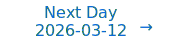

# Personalized Daily ArXiv Papers 2026-03-11

| *[gpt-5]*   | Prompt   | Completion   | Total   |
|:-----------:|:--------:|:------------:|:-------:|
| **Token**   | 49966    | 42995        | 92961   |
| **Cost**    | $0.06    | $0.43        | $0.49   |

Total arXiv papers: 567

Total scanned papers: 341

Total relevant papers: 35

**Table of contents with paper titles:**

1. [Variational Routing: A Scalable Bayesian Framework for Calibrated Mixture-of-Experts Transformers](#user-content-link1)
**Authors:** Albus Yizhuo Li, Matthew Wicker

2. [Uncovering a Winning Lottery Ticket with Continuously Relaxed Bernoulli Gates](#user-content-link2)
**Authors:** Itamar Tsayag, Ofir Lindenbaum

3. [Expressivity-Efficiency Tradeoffs for Hybrid Sequence Models](#user-content-link3)
**Authors:** John Cooper, Ilias Diakonikolas, Mingchen Ma, Frederic Sala

4. [On the Width Scaling of Neural Optimizers Under Matrix Operator Norms I: Row/Column Normalization and Hyperparameter Transfer](#user-content-link4)
**Authors:** Ruihan Xu, Jiajin Li, Yiping Lu

5. [Unveiling the Potential of Quantization with MXFP4: Strategies for Quantization Error Reduction](#user-content-link5)
**Authors:** Jatin Chhugani, Geonhwa Jeong, Bor-Yiing Su, Yunjie Pan, Hanmei Yang, Aayush Ankit, Jiecao Yu, Summer Deng, Yunqing Chen, Nadathur Satish, Changkyu Kim

6. [Exclusive Self Attention](#user-content-link6)
**Authors:** Shuangfei Zhai

7. [From Semantics to Pixels: Coarse-to-Fine Masked Autoencoders for Hierarchical Visual Understanding](#user-content-link7)
**Authors:** Wenzhao Xiang, Yue Wu, Hongyang Yu, Feng Gao, Fan Yang, Xilin Chen

8. [From Data Statistics to Feature Geometry: How Correlations Shape Superposition](#user-content-link8)
**Authors:** Lucas Prieto, Edward Stevinson, Melih Barsbey, Tolga Birdal, Pedro A. M. Mediano

9. [Beyond Test-Time Training: Learning to Reason via Hardware-Efficient Optimal Control](#user-content-link9)
**Authors:** Peihao Wang, Shan Yang, Xijun Wang, Tesi Xiao, Xin Liu, Changlong Yu, Yu Lou, Pan Li, Zhangyang Wang, Ming Lin, Ren\'e Vidal

10. [Memorization capacity of deep ReLU neural networks characterized by width and depth](#user-content-link10)
**Authors:** Xin Yang, Yunfei Yang

11. [The Missing Memory Hierarchy: Demand Paging for LLM Context Windows](#user-content-link11)
**Authors:** Tony Mason

12. [Generalized Reduction to the Isotropy for Flexible Equivariant Neural Fields](#user-content-link12)
**Authors:** Alejandro Garc\'ia-Castellanos, Gijs Bellaard, Remco Duits, Daniel Pelt, Erik J Bekkers

13. [Mousse: Rectifying the Geometry of Muon with Curvature-Aware Preconditioning](#user-content-link13)
**Authors:** Yechen Zhang, Shuhao Xing, Junhao Huang, Kai Lv, Yunhua Zhou, Xipeng Qiu, Qipeng Guo, Kai Chen

14. [An Empirical Study and Theoretical Explanation on Task-Level Model-Merging Collapse](#user-content-link14)
**Authors:** Yuan Cao, Dezhi Ran, Yuzhe Guo, Mengzhou Wu, Simin Chen, Linyi Li, Wei Yang, Tao Xie

15. [Quantifying the Necessity of Chain of Thought through Opaque Serial Depth](#user-content-link15)
**Authors:** Jonah Brown-Cohen, David Lindner, Rohin Shah

16. [Permutation-Equivariant 2D State Space Models: Theory and Canonical Architecture for Multivariate Time Series](#user-content-link16)
**Authors:** Seungwoo Jeong, Heung-Il Suk

17. [A Variational Latent Equilibrium for Learning in Cortex](#user-content-link17)
**Authors:** Simon Brandt, Paul Haider, Walter Senn, Federico Benitez, Mihai A. Petrovici

18. [ARKV: Adaptive and Resource-Efficient KV Cache Management under Limited Memory Budget for Long-Context Inference in LLMs](#user-content-link18)
**Authors:** Jianlong Lei, Shashikant Ilager

19. [GAST: Gradient-aligned Sparse Tuning of Large Language Models with Data-layer Selection](#user-content-link19)
**Authors:** Kai Yao, Zhenghan Song, Kaixin Wu, Mingjie Zhong, Danzhao Cheng, Zhaorui Tan, Yixin Ji, Penglei Gao

20. [Zipage: Maintain High Request Concurrency for LLM Reasoning through Compressed PagedAttention](#user-content-link20)
**Authors:** Mengqi Liao, Lu Wang, Chaoyun Zhang, Bo Qiao, Si Qin, Qingwei Lin, Saravan Rajmohan, Dongmei Zhang, Huaiyu Wan

21. [SoftJAX & SoftTorch: Empowering Automatic Differentiation Libraries with Informative Gradients](#user-content-link21)
**Authors:** Anselm Paulus, A. Ren\'e Geist, V\'it Musil, Sebastian Hoffmann, Onur Beker, Georg Martius

22. [Routing without Forgetting](#user-content-link22)
**Authors:** Alessio Masano, Giovanni Bellitto, Dipam Goswani, Joost Van de Weijer, Concetto Spampinato

23. [A Gaussian Comparison Theorem for Training Dynamics in Machine Learning](#user-content-link23)
**Authors:** Ashkan Panahi

24. [Curveball Steering: The Right Direction To Steer Isn't Always Linear](#user-content-link24)
**Authors:** Shivam Raval, Hae Jin Song, Linlin Wu, Abir Harrasse, Jeff Phillips, Amirali Abdullah

25. [An accurate flatness measure to estimate the generalization performance of CNN models](#user-content-link25)
**Authors:** Rahman Taleghani, Maryam Mohammadi, Francesco Marchetti

26. [Efficiently Aligning Draft Models via Parameter- and Data-Efficient Adaptation](#user-content-link26)
**Authors:** Luxi Lin, Zhihang Lin, Zhanpeng Zeng, Yuhao Chen, Qingyu Zhang, Jixiang Luo, Xuelong Li, Rongrong Ji

27. [Multi-DNN Inference of Sparse Models on Edge SoCs](#user-content-link27)
**Authors:** Jiawei Luo, Di Wu, Simon Dobson, Blesson Varghese

28. [What is Missing? Explaining Neurons Activated by Absent Concepts](#user-content-link28)
**Authors:** Robin Hesse, Simone Schaub-Meyer, Janina Hesse, Bernt Schiele, Stefan Roth

29. [Towards Understanding Adam Convergence on Highly Degenerate Polynomials](#user-content-link29)
**Authors:** Zhiwei Bai, Jiajie Zhao, Zhangchen Zhou, Zhi-Qin John Xu, Yaoyu Zhang

30. [Transductive Generalization via Optimal Transport and Its Application to Graph Node Classification](#user-content-link30)
**Authors:** MoonJeong Park, Seungbeom Lee, Kyungmin Kim, Jaeseung Heo, Seunghyuk Cho, Shouheng Li, Sangdon Park, Dongwoo Kim

31. [DendroNN: Dendrocentric Neural Networks for Energy-Efficient Classification of Event-Based Data](#user-content-link31)
**Authors:** Jann Krausse, Zhe Su, Kyrus Mama, Maryada, Klaus Knobloch, Giacomo Indiveri, J\"urgen Becker

32. [On Catastrophic Forgetting in Low-Rank Decomposition-Based Parameter-Efficient Fine-Tuning](#user-content-link32)
**Authors:** Muhammad Ahmad, Jingjing Zheng, Yankai Cao

33. [FlexServe: A Fast and Secure LLM Serving System for Mobile Devices with Flexible Resource Isolation](#user-content-link33)
**Authors:** Yinpeng Wu, Yitong Chen, Lixiang Wang, Jinyu Gu, Zhichao Hua, Yubin Xia

34. [Evolving Prompt Adaptation for Vision-Language Models](#user-content-link34)
**Authors:** Enming Zhang, Jiayang Li, Yanru Wu, Zhenyu Liu, Yang Li

35. [Skip to the Good Part: Representation Structure & Inference-Time Layer Skipping in Diffusion vs. Autoregressive LLMs](#user-content-link35)
**Authors:** Raghavv Goel, Risheek Garrepalli, Sudhanshu Agrawal, Chris Lott, Mingu Lee, Fatih Porikli

---

## 1. [Variational Routing: A Scalable Bayesian Framework for Calibrated Mixture-of-Experts Transformers](https://arxiv.org/abs/2603.09453) 

**ArXiv ID:** 2603.09453

**Authors:** Albus Yizhuo Li, Matthew Wicker

**Abstract:** Foundation models are increasingly being deployed in contexts where understanding the uncertainty of their outputs is critical to ensuring responsible deployment. While Bayesian methods offer a principled approach to uncertainty quantification, their computational overhead renders their use impractical for training or inference at foundation model scale. State-of-the-art models achieve parameter counts in the trillions through carefully engineered sparsity including Mixture-of-Experts (MoE) layers. In this work, we demonstrate calibrated uncertainty at scale by introducing Variational Mixture-of-Experts Routing (VMoER), a structured Bayesian approach for modelling uncertainty in MoE layers. VMoER confines Bayesian inference to the expert-selection stage which is typically done by a deterministic routing network. We instantiate VMoER using two inference strategies: amortised variational inference over routing logits and inferring a temperature parameter for stochastic expert selection. Across tested foundation models, VMoER improves routing stability under noise by 38\%, reduces calibration error by 94\%, and increases out-of-distribution AUROC by 12\%, while incurring less than 1\% additional FLOPs. These results suggest VMoER offers a scalable path toward robust and uncertainty-aware foundation models.

**Comment:** Model Architecture (MoE): Bayesian variational routing confined to expert selection for calibrated, uncertainty-aware MoE Transformers with <1% extra FLOPs.

**Relevance:** 10
**Novelty:** 8

---

## 2. [Uncovering a Winning Lottery Ticket with Continuously Relaxed Bernoulli Gates](https://arxiv.org/abs/2603.08914) 

**ArXiv ID:** 2603.08914

**Authors:** Itamar Tsayag, Ofir Lindenbaum

**Abstract:** Over-parameterized neural networks incur prohibitive memory and computational costs for resource-constrained deployment. The Strong Lottery Ticket (SLT) hypothesis suggests that randomly initialized networks contain sparse subnetworks achieving competitive accuracy without weight training. Existing SLT methods, notably edge-popup, rely on non-differentiable score-based selection, limiting optimization efficiency and scalability. We propose using continuously relaxed Bernoulli gates to discover SLTs through fully differentiable, end-to-end optimization - training only gating parameters while keeping all network weights frozen at their initialized values. Continuous relaxation enables direct gradient-based optimization of an $\ell_0$-regularization objective, eliminating the need for non-differentiable gradient estimators or iterative pruning cycles. To our knowledge, this is the first fully differentiable approach for SLT discovery that avoids straight-through estimator approximations. Experiments across fully connected networks, CNNs (ResNet, Wide-ResNet), and Vision Transformers (ViT, Swin-T) demonstrate up to 90% sparsity with minimal accuracy loss - nearly double the sparsity achieved by edge-popup at comparable accuracy - establishing a scalable framework for pre-training network sparsification.

**Comment:** Model Compression and Efficiency — differentiable L0 sparsity via relaxed Bernoulli gates to discover Strong Lottery Tickets without training weights.

**Relevance:** 10
**Novelty:** 8

---

## 3. [Expressivity-Efficiency Tradeoffs for Hybrid Sequence Models](https://arxiv.org/abs/2603.08859) 

**ArXiv ID:** 2603.08859

**Authors:** John Cooper, Ilias Diakonikolas, Mingchen Ma, Frederic Sala

**Abstract:** Hybrid sequence models--combining Transformer and state-space model layers--seek to gain the expressive versatility of attention as well as the computational efficiency of state-space model layers. Despite burgeoning interest in hybrid models, we lack a basic understanding of the settings where--and underlying mechanisms through which--they offer benefits over their constituent models. In this paper, we study this question, focusing on a broad family of core synthetic tasks. For this family of tasks, we prove the existence of fundamental limitations for non-hybrid models. Specifically, any Transformer or state-space model that solves the underlying task requires either a large number of parameters or a large working memory. On the other hand, for two prototypical tasks within this family--namely selective copying and associative recall--we construct hybrid models of small size and working memory that provably solve these tasks, thus achieving the best of both worlds. Our experimental evaluation empirically validates our theoretical findings. Importantly, going beyond the settings in our theoretical analysis, we empirically show that learned--rather than constructed--hybrids outperform non-hybrid models with up to 6x as many parameters. We additionally demonstrate that hybrid models exhibit stronger length generalization and out-of-distribution robustness than non-hybrids.

**Comment:** Model Architecture — theoretical expressivity/efficiency benefits of hybrid Transformer+SSM models over non-hybrids.

**Relevance:** 10
**Novelty:** 8

---

## 4. [On the Width Scaling of Neural Optimizers Under Matrix Operator Norms I: Row/Column Normalization and Hyperparameter Transfer](https://arxiv.org/abs/2603.09952) 

**ArXiv ID:** 2603.09952

**Authors:** Ruihan Xu, Jiajin Li, Yiping Lu

**Abstract:** A central question in modern deep learning is how to design optimizers whose behavior remains stable as the network width $w$ increases. We address this question by interpreting several widely used neural-network optimizers, including \textrm{AdamW} and \textrm{Muon}, as instances of steepest descent under matrix operator norms. This perspective links optimizer geometry with the Lipschitz structure of the network forward map, and enables width-independent control of both Lipschitz and smoothness constants. However, steepest-descent rules induced by standard $p \to q$ operator norms lack layerwise composability and therefore cannot provide width-independent bounds in deep architectures. We overcome this limitation by introducing a family of mean-normalized operator norms, denoted $\pmean \to \qmean$, that admit layerwise composability, yield width-independent smoothness bounds, and give rise to practical optimizers such as \emph{rescaled} \textrm{AdamW}, row normalization, and column normalization. The resulting learning rate width-aware scaling rules recover $\mu$P scaling~\cite{yang2021tensor} as a special case and provide a principled mechanism for cross-width learning-rate transfer across a broad class of optimizers. We further show that \textrm{Muon} can suffer an $\mathcal{O}(\sqrt{w})$ worst-case growth in the smoothness constant, whereas a new family of row-normalized optimizers we propose achieves width-independent smoothness guarantees. Based on the observations, we propose MOGA (Matrix Operator Geometry Aware), a width-aware optimizer based only on row/column-wise normalization that enables stable learning-rate transfer across model widths. Large-scale pre-training on GPT-2 and LLaMA shows that MOGA, especially with row normalization, is competitive with Muon while being notably faster in large-token and low-loss regimes.

**Comment:** Optimizer/Scaling Theory: introduces operator-norm-based geometry with mean-normalized, layerwise composable norms enabling width-independent smoothness and learning-rate transfer; proposes row/column-normalized optimizers (MOGA).

**Relevance:** 10
**Novelty:** 8

---

## 5. [Unveiling the Potential of Quantization with MXFP4: Strategies for Quantization Error Reduction](https://arxiv.org/abs/2603.08713) 

**ArXiv ID:** 2603.08713

**Authors:** Jatin Chhugani, Geonhwa Jeong, Bor-Yiing Su, Yunjie Pan, Hanmei Yang, Aayush Ankit, Jiecao Yu, Summer Deng, Yunqing Chen, Nadathur Satish, Changkyu Kim

**Abstract:** Large Language Models (LLMs) have intensified the need for low-precision formats that enable efficient, large-scale inference. The Open Compute Project (OCP) Microscaling (MX) standard is attractive due to its favorable hardware efficiency, but its 4-bit variant (MXFP4) lags behind NVIDIA's NVFP4 in accuracy, limiting adoption. We introduce two software-only techniques, Overflow-Aware Scaling (OAS) and Macro Block Scaling (MBS), that improve MXFP4 quantization fidelity without requiring hardware changes. OAS reduces overall errors by increasing effective dynamic range under power-of-two block scaling, while MBS allocates higher-precision scaling at a coarser granularity to better preserve outliers. Across multiple LLMs and standard downstream benchmarks, OAS and MBS reduce the end-to-end accuracy gap between MXFP4 and NVFP4 from about 10% to below 1% on average, while incurring modest GEMM overhead (6.2% on average). These results re-establish MXFP4 as a practical alternative to NVFP4, enabling near-NVFP4 accuracy while retaining MX's hardware-efficiency advantages (e.g., 12% relative area savings in tensor cores).

**Comment:** Compression/Efficiency: proposes Overflow-Aware Scaling and Macro Block Scaling to improve 4-bit MXFP4 quantization fidelity for LLMs without hardware changes.

**Relevance:** 10
**Novelty:** 8

---

## 6. [Exclusive Self Attention](https://arxiv.org/abs/2603.09078) 

**ArXiv ID:** 2603.09078

**Authors:** Shuangfei Zhai

**Abstract:** We introduce exclusive self attention (XSA), a simple modification of self attention (SA) that improves Transformer's sequence modeling performance. The key idea is to constrain attention to capture only information orthogonal to the token's own value vector (thus excluding information of self position), encouraging better context modeling. Evaluated on the standard language modeling task, XSA consistently outperforms SA across model sizes up to 2.7B parameters and shows increasingly larger gains as sequence length grows.

**Comment:** Model Architecture: Exclusive Self Attention modifies Transformer attention to exclude self-position information, improving long-sequence modeling.

**Relevance:** 10
**Novelty:** 7

---

## 7. [From Semantics to Pixels: Coarse-to-Fine Masked Autoencoders for Hierarchical Visual Understanding](https://arxiv.org/abs/2603.09955) 

**ArXiv ID:** 2603.09955

**Authors:** Wenzhao Xiang, Yue Wu, Hongyang Yu, Feng Gao, Fan Yang, Xilin Chen

**Abstract:** Self-supervised visual pre-training methods face an inherent tension: contrastive learning (CL) captures global semantics but loses fine-grained detail, while masked image modeling (MIM) preserves local textures but suffers from "attention drift" due to semantically-agnostic random masking. We propose C2FMAE, a coarse-to-fine masked autoencoder that resolves this tension by explicitly learning hierarchical visual representations across three data granularities: semantic masks (scene-level), instance masks (object-level), and RGB images (pixel-level). Two synergistic innovations enforce a strict top-down learning principle. First, a cascaded decoder sequentially reconstructs from scene semantics to object instances to pixel details, establishing explicit cross-granularity dependencies that parallel decoders cannot capture. Second, a progressive masking curriculum dynamically shifts the training focus from semantic-guided to instance-guided and finally to random masking, creating a structured learning path from global context to local features. To support this framework, we construct a large-scale multi-granular dataset with high-quality pseudo-labels for all 1.28M ImageNet-1K images. Extensive experiments show that C2FMAE achieves significant performance gains on image classification, object detection, and semantic segmentation, validating the effectiveness of our hierarchical design in learning more robust and generalizable representations.

**Comment:** Model Architecture/Representation Learning: a hierarchical masked autoencoder with a cascaded decoder and progressive masking curriculum for multi-granular representation learning.

**Relevance:** 9
**Novelty:** 8

---

## 8. [From Data Statistics to Feature Geometry: How Correlations Shape Superposition](https://arxiv.org/abs/2603.09972) 

**ArXiv ID:** 2603.09972

**Authors:** Lucas Prieto, Edward Stevinson, Melih Barsbey, Tolga Birdal, Pedro A. M. Mediano

**Abstract:** A central idea in mechanistic interpretability is that neural networks represent more features than they have dimensions, arranging them in superposition to form an over-complete basis. This framing has been influential, motivating dictionary learning approaches such as sparse autoencoders. However, superposition has mostly been studied in idealized settings where features are sparse and uncorrelated. In these settings, superposition is typically understood as introducing interference that must be minimized geometrically and filtered out by non-linearities such as ReLUs, yielding local structures like regular polytopes. We show that this account is incomplete for realistic data by introducing Bag-of-Words Superposition (BOWS), a controlled setting to encode binary bag-of-words representations of internet text in superposition. Using BOWS, we find that when features are correlated, interference can be constructive rather than just noise to be filtered out. This is achieved by arranging features according to their co-activation patterns, making interference between active features constructive, while still using ReLUs to avoid false positives. We show that this kind of arrangement is more prevalent in models trained with weight decay and naturally gives rise to semantic clusters and cyclical structures which have been observed in real language models yet were not explained by the standard picture of superposition. Code for this paper can be found at https://github.com/LucasPrietoAl/correlations-feature-geometry.

**Comment:** Representation Learning: analyzes superposition under correlated features, introducing BOWS to reveal constructive interference and feature geometry beyond the sparse/independent case.

**Relevance:** 9
**Novelty:** 8

---

## 9. [Beyond Test-Time Training: Learning to Reason via Hardware-Efficient Optimal Control](https://arxiv.org/abs/2603.09221) 

**ArXiv ID:** 2603.09221

**Authors:** Peihao Wang, Shan Yang, Xijun Wang, Tesi Xiao, Xin Liu, Changlong Yu, Yu Lou, Pan Li, Zhangyang Wang, Ming Lin, Ren\'e Vidal

**Abstract:** Associative memory has long underpinned the design of sequential models. Beyond recall, humans reason by projecting future states and selecting goal-directed actions, a capability that modern language models increasingly require but do not natively encode. While prior work uses reinforcement learning or test-time training, planning remains external to the model architecture. We formulate reasoning as optimal control and introduce the Test-Time Control (TTC) layer, which performs finite-horizon LQR planning over latent states at inference time, represents a value function within neural architectures, and leverages it as the nested objective to enable planning before prediction. To ensure scalability, we derive a hardware-efficient LQR solver based on a symplectic formulation and implement it as a fused CUDA kernel, enabling parallel execution with minimal overhead. Integrated as an adapter into pretrained LLMs, TTC layers improve mathematical reasoning performance by up to +27.8% on MATH-500 and 2-3x Pass@8 improvements on AMC and AIME, demonstrating that embedding optimal control as an architectural component provides an effective and scalable mechanism for reasoning beyond test-time training.

**Comment:** Model Architecture + HPC: introduces a TTC layer performing finite-horizon LQR planning within neural networks and a fused CUDA solver for hardware-efficient inference-time control.

**Relevance:** 9
**Novelty:** 8

---

## 10. [Memorization capacity of deep ReLU neural networks characterized by width and depth](https://arxiv.org/abs/2603.09589) 

**ArXiv ID:** 2603.09589

**Authors:** Xin Yang, Yunfei Yang

**Abstract:** This paper studies the memorization capacity of deep neural networks with ReLU activation. Specifically, we investigate the minimal size of such networks to memorize any $N$ data points in the unit ball with pairwise separation distance $\delta$ and discrete labels. Most prior studies characterize the memorization capacity by the number of parameters or neurons. We generalize these results by constructing neural networks, whose width $W$ and depth $L$ satisfy $W^2L^2= \mathcal{O}(N\log(\delta^{-1}))$, that can memorize any $N$ data samples. We also prove that any such networks should also satisfy the lower bound $W^2L^2=\Omega (N \log(\delta^{-1}))$, which implies that our construction is optimal up to logarithmic factors when $\delta^{-1}$ is polynomial in $N$. Hence, we explicitly characterize the trade-off between width and depth for the memorization capacity of deep neural networks in this regime.

**Comment:** Theory/Representation: characterizes memorization capacity via a tight width–depth tradeoff (W^2 L^2 ~ N log(1/δ)) for ReLU networks, advancing foundational understanding.

**Relevance:** 9
**Novelty:** 8

---

## 11. [The Missing Memory Hierarchy: Demand Paging for LLM Context Windows](https://arxiv.org/abs/2603.09023) 

**ArXiv ID:** 2603.09023

**Authors:** Tony Mason

**Abstract:** The context window of a large language model is not memory. It is L1 cache: a small, fast, expensive resource that the field treats as the entire memory system. There is no L2, no virtual memory, no paging. Every tool definition, every system prompt, and every stale tool result occupies context for the lifetime of the session. The result is measurable: across 857 production sessions and 4.45 million effective input tokens, 21.8% is structural waste.   We present Pichay, a demand paging system for LLM context windows. Implemented as a transparent proxy between client and inference API, Pichay interposes on the message stream to evict stale content, detect page faults when the model re-requests evicted material, and pin working-set pages identified by fault history. In offline replay across 1.4 million simulated evictions, the fault rate is 0.0254%. In live production deployment over 681turns, the system reduces context consumption by up to 93% (5,038KB to 339KB); under extreme sustained pressure, the system remains operational but exhibits the expected thrashing pathology, with repeated fault-in of evicted content.   The key observation is that the problems the field faces, such as context limits, attention degradation, cost scaling, lost state across sessions, are virtual memory problems wearing different clothes. The solutions exist: working set theory (Denning, 1968), demand paging, fault-driven replacement policies, and memory hierarchies with multiple eviction-managed levels. We describe the architecture of a full memory hierarchy for LLM systems (L1 through persistent storage), report on the first three levels deployed in production use (L1 eviction, L2 fault-driven pinning, L3 model-initiated conversation compaction), and identify cross-session memory as the remaining frontier.

**Comment:** Systems/Memory Optimization: introduces demand paging and multi-level memory hierarchy for LLM context windows, directly addressing context efficiency.

**Relevance:** 9
**Novelty:** 8

---

## 12. [Generalized Reduction to the Isotropy for Flexible Equivariant Neural Fields](https://arxiv.org/abs/2603.08758) 

**ArXiv ID:** 2603.08758

**Authors:** Alejandro Garc\'ia-Castellanos, Gijs Bellaard, Remco Duits, Daniel Pelt, Erik J Bekkers

**Abstract:** Many geometric learning problems require invariants on heterogeneous product spaces, i.e., products of distinct spaces carrying different group actions, where standard techniques do not directly apply. We show that, when a group $G$ acts transitively on a space $M$, any $G$-invariant function on a product space $X \times M$ can be reduced to an invariant of the isotropy subgroup $H$ of $M$ acting on $X$ alone. Our approach establishes an explicit orbit equivalence $(X \times M)/G \cong X/H$, yielding a principled reduction that preserves expressivity. We apply this characterization to Equivariant Neural Fields, extending them to arbitrary group actions and homogeneous conditioning spaces, and thereby removing the major structural constraints imposed by existing methods.

**Comment:** Model Architecture — general orbit-equivalence reduction enabling flexible equivariant neural fields under arbitrary group actions.

**Relevance:** 9
**Novelty:** 8

---

## 13. [Mousse: Rectifying the Geometry of Muon with Curvature-Aware Preconditioning](https://arxiv.org/abs/2603.09697) 

**ArXiv ID:** 2603.09697

**Authors:** Yechen Zhang, Shuhao Xing, Junhao Huang, Kai Lv, Yunhua Zhou, Xipeng Qiu, Qipeng Guo, Kai Chen

**Abstract:** Recent advances in spectral optimization, notably Muon, have demonstrated that constraining update steps to the Stiefel manifold can significantly accelerate training and improve generalization. However, Muon implicitly assumes an isotropic optimization landscape, enforcing a uniform spectral update norm across all eigen-directions. We argue that this "egalitarian" constraint is suboptimal for Deep Neural Networks, where the curvature spectrum is known to be highly heavy-tailed and ill-conditioned. In such landscapes, Muon risks amplifying instabilities in high-curvature directions while limiting necessary progress in flat directions. In this work, we propose \textbf{Mousse} (\textbf{M}uon \textbf{O}ptimization \textbf{U}tilizing \textbf{S}hampoo's \textbf{S}tructural \textbf{E}stimation), a novel optimizer that reconciles the structural stability of spectral methods with the geometric adaptivity of second-order preconditioning. Instead of applying Newton-Schulz orthogonalization directly to the momentum matrix, Mousse operates in a whitened coordinate system induced by Kronecker-factored statistics (derived from Shampoo). Mathematically, we formulate Mousse as the solution to a spectral steepest descent problem constrained by an anisotropic trust region, where the optimal update is derived via the polar decomposition of the whitened gradient. Empirical results across language models ranging from 160M to 800M parameters demonstrate that Mousse consistently outperforms Muon, achieving around $\sim$12\% reduction in training steps with negligible computational overhead.

**Comment:** Optimization/Systems — new optimizer combining spectral constraints with Shampoo-style preconditioning for faster, stable training.

**Relevance:** 9
**Novelty:** 8

---

## 14. [An Empirical Study and Theoretical Explanation on Task-Level Model-Merging Collapse](https://arxiv.org/abs/2603.09463) 

**ArXiv ID:** 2603.09463

**Authors:** Yuan Cao, Dezhi Ran, Yuzhe Guo, Mengzhou Wu, Simin Chen, Linyi Li, Wei Yang, Tao Xie

**Abstract:** Model merging unifies independently fine-tuned LLMs from the same base, enabling reuse and integration of parallel development efforts without retraining. However, in practice we observe that merging does not always succeed: certain combinations of task-specialist models suffer from catastrophic performance degradation after merging. We refer to this failure mode as merging collapse. Intuitively, collapse arises when the learned representations or parameter adjustments for different tasks are fundamentally incompatible, so that merging forces destructive interference rather than synergy. In this paper, we identify and characterize the phenomenon of task-level merging collapse, where certain task combinations consistently trigger huge performance degradation across all merging methods. Through extensive experiments and statistical analysis, we demonstrate that representational incompatibility between tasks is strongly correlated with merging collapse, while parameter-space conflict metrics show minimal correlation, challenging conventional wisdom in model merging literature. We provide a theoretical explanation on this phenomenon through rate-distortion theory with a dimension-dependent bound, establishing fundamental limits on task mergeability regardless of methodology.

**Comment:** Representation Learning: theoretical limits on model merging via rate–distortion, linking representational incompatibility to task-level collapse; fundamental analysis of mergeability.

**Relevance:** 9
**Novelty:** 8

---

## 15. [Quantifying the Necessity of Chain of Thought through Opaque Serial Depth](https://arxiv.org/abs/2603.09786) 

**ArXiv ID:** 2603.09786

**Authors:** Jonah Brown-Cohen, David Lindner, Rohin Shah

**Abstract:** Large language models (LLMs) tend to externalize their reasoning in their chain of thought, making the chain of thought a good target for monitoring. This is partially an inherent feature of the Transformer architecture: sufficiently long serial cognition must pass through the chain of thought (Korbak et al., 2025). We formalize this argument through the notion of opaque serial depth, given by the length of the longest computation that can be done without the use of interpretable intermediate steps like chain of thought. Given this formalization, we compute numeric upper bounds on the opaque serial depth of Gemma 3 models, as well as asymptotic results for additional architectures beyond standard LLMs. We also open-source an automated method that can calculate upper bounds on the opaque serial depth of arbitrary neural networks, and use it to demonstrate that Mixture-of-Experts models likely have lower depth than dense models. Overall, our results suggest that opaque serial depth is a useful tool for understanding the potential for models to do significant reasoning that is not externalized.

**Comment:** Representation Learning/Architecture Theory: formalizes opaque serial depth to bound non-externalized reasoning in neural nets; includes analysis showing Mixture-of-Experts likely has lower opaque depth than dense models.

**Relevance:** 9
**Novelty:** 8

---

## 16. [Permutation-Equivariant 2D State Space Models: Theory and Canonical Architecture for Multivariate Time Series](https://arxiv.org/abs/2603.08753) 

**ArXiv ID:** 2603.08753

**Authors:** Seungwoo Jeong, Heung-Il Suk

**Abstract:** Multivariate time series (MTS) modeling often implicitly imposes an artificial ordering over variables, violating the inherent exchangeability found in many real-world systems where no canonical variable axis exists. We formalize this limitation as a violation of the permutation symmetry principle and require state-space dynamics to be permutation-equivariant along the variable axis. In this work, we theoretically characterize the complete canonical form of linear variable coupling under this symmetry constraint. We prove that any permutation-equivariant linear 2D state-space system naturally decomposes into local self-dynamics and a global pooled interaction, rendering ordered recurrence not only unnecessary but structurally suboptimal. Motivated by this theoretical foundation, we introduce the Variable-Invariant Two-Dimensional State Space Model (VI 2D SSM), which realizes the canonical equivariant form via permutation-invariant aggregation. This formulation eliminates sequential dependency chains along the variable axis, reducing the dependency depth from $\mathcal{O}(C)$ to $\mathcal{O}(1)$ and simplifying stability analysis to two scalar modes. Furthermore, we propose VI 2D Mamba, a unified architecture integrating multi-scale temporal dynamics and spectral representations. Extensive experiments on forecasting, classification, and anomaly detection benchmarks demonstrate that our model achieves state-of-the-art performance with superior structural scalability, validating the theoretical necessity of symmetry-preserving 2D modeling.

**Comment:** Model Architecture and Theory: derives canonical permutation-equivariant 2D state-space form and proposes VI 2D SSM/Mamba, eliminating variable-axis ordering and reducing dependency depth.

**Relevance:** 9
**Novelty:** 8

---

## 17. [A Variational Latent Equilibrium for Learning in Cortex](https://arxiv.org/abs/2603.09600) 

**ArXiv ID:** 2603.09600

**Authors:** Simon Brandt, Paul Haider, Walter Senn, Federico Benitez, Mihai A. Petrovici

**Abstract:** Brains remain unrivaled in their ability to recognize and generate complex spatiotemporal patterns. While AI is able to reproduce some of these capabilities, deep learning algorithms remain largely at odds with our current understanding of brain circuitry and dynamics. This is prominently the case for backpropagation through time (BPTT), the go-to algorithm for learning complex temporal dependencies. In this work we propose a general formalism to approximate BPTT in a controlled, biologically plausible manner. Our approach builds on, unifies and extends several previous approaches to local, time-continuous, phase-free spatiotemporal credit assignment based on principles of energy conservation and extremal action. Our starting point is a prospective energy function of neuronal states, from which we calculate real-time error dynamics for time-continuous neuronal networks. In the general case, this provides a simple and straightforward derivation of the adjoint method result for neuronal networks, the time-continuous equivalent to BPTT. With a few modifications, we can turn this into a fully local (in space and time) set of equations for neuron and synapse dynamics. Our theory provides a rigorous framework for spatiotemporal deep learning in the brain, while simultaneously suggesting a blueprint for physical circuits capable of carrying out these computations. These results reframe and extend the recently proposed Generalized Latent Equilibrium (GLE) model.

**Comment:** Training Dynamics/Architecture: proposes a variational latent equilibrium framework approximating BPTT with fully local dynamics, unifying energy-based spatiotemporal credit assignment.

**Relevance:** 9
**Novelty:** 8

---

## 18. [ARKV: Adaptive and Resource-Efficient KV Cache Management under Limited Memory Budget for Long-Context Inference in LLMs](https://arxiv.org/abs/2603.08727) 

**ArXiv ID:** 2603.08727

**Authors:** Jianlong Lei, Shashikant Ilager

**Abstract:** Large Language Models (LLMs) are increasingly deployed in scenarios demanding ultra-long context reasoning, such as agentic workflows and deep research understanding. However, long-context inference is constrained by the KV cache, a transient memory structure that grows linearly with sequence length and batch size, quickly dominating GPU memory usage. Existing memory reduction techniques, including eviction and quantization, often rely on static heuristics and suffer from degraded quality under tight budgets. In this paper, we propose ARKV, a lightweight and adaptive framework that dynamically allocates precision levels to cached tokens based on per-layer attention dynamics and token-level importance. During a short prefill phase, ARKV estimates the original quantization (OQ) ratio of each layer by computing statistical scores such as attention entropy, variance and kurtosis. During decoding, tokens are assigned to one of three states, Original (full precision), Quantization (low precision), or Eviction, according to a fast heavy-hitter scoring strategy. Our experiments on LLaMA3 and Qwen3 models across diverse long- and short-context tasks demonstrate that ARKV preserves ~97% of baseline accuracy on long-context benchmarks while reducing KV memory usage by 4x, with minimal throughput loss. On short-context tasks, ARKV matches full-precision baselines; on GSM8K math reasoning, it significantly outperforms uniform quantization. These results highlight the practical viability of ARKV for scalable LLM deployment, offering fine-grained, data-driven memory control without retraining or architectural modifications. The source code and artifacts can be found in: https://github.com/Large-scale-Sustainable-Computing-LSC/ARKV

**Comment:** Model Compression and Efficiency: adaptive KV-cache management with dynamic precision allocation, quantization, and eviction based on per-layer attention statistics for long-context inference.

**Relevance:** 9
**Novelty:** 7

---

## 19. [GAST: Gradient-aligned Sparse Tuning of Large Language Models with Data-layer Selection](https://arxiv.org/abs/2603.09865) 

**ArXiv ID:** 2603.09865

**Authors:** Kai Yao, Zhenghan Song, Kaixin Wu, Mingjie Zhong, Danzhao Cheng, Zhaorui Tan, Yixin Ji, Penglei Gao

**Abstract:** Parameter-Efficient Fine-Tuning (PEFT) has become a key strategy for adapting large language models, with recent advances in sparse tuning reducing overhead by selectively updating key parameters or subsets of data. Existing approaches generally focus on two distinct paradigms: layer-selective methods aiming to fine-tune critical layers to minimize computational load, and data-selective methods aiming to select effective training subsets to boost training. However, current methods typically overlook the fact that different data points contribute varying degrees to distinct model layers, and they often discard potentially valuable information from data perceived as of low quality. To address these limitations, we propose Gradient-aligned Sparse Tuning (GAST), an innovative method that simultaneously performs selective fine-tuning at both data and layer dimensions as integral components of a unified optimization strategy. GAST specifically targets redundancy in information by employing a layer-sparse strategy that adaptively selects the most impactful data points for each layer, providing a more comprehensive and sophisticated solution than approaches restricted to a single dimension. Experiments demonstrate that GAST consistently outperforms baseline methods, establishing a promising direction for future research in PEFT strategies.

**Comment:** Model Compression/Efficiency: gradient-aligned sparse tuning with joint layer selection and data selection in a unified optimization for PEFT.

**Relevance:** 9
**Novelty:** 7

---

## 20. [Zipage: Maintain High Request Concurrency for LLM Reasoning through Compressed PagedAttention](https://arxiv.org/abs/2603.08743) 

**ArXiv ID:** 2603.08743

**Authors:** Mengqi Liao, Lu Wang, Chaoyun Zhang, Bo Qiao, Si Qin, Qingwei Lin, Saravan Rajmohan, Dongmei Zhang, Huaiyu Wan

**Abstract:** With reasoning becoming the generative paradigm for large language models (LLMs), the memory bottleneck caused by KV cache during the decoding phase has become a critical factor limiting high-concurrency service. Although existing KV cache eviction methods address the memory issue, most of them are impractical for industrial-grade applications. This paper introduces Compressed PagedAttention, a method that combines token-wise KV cache eviction with PagedAttention. We propose a comprehensive scheduling strategy and support prefix caching and asynchronous compression for Compressed PagedAttention. Based on this, we have developed a high-concurrency LLM inference engine, Zipage. On large-scale mathematical reasoning tasks, Zipage achieves around 95\% of the performance of Full KV inference engines while delivering over 2.1$\times$ speedup.

**Comment:** High-performance inference efficiency — KV cache compression with Compressed PagedAttention and scheduling for high-concurrency LLM inference.

**Relevance:** 9
**Novelty:** 7

---

## 21. [SoftJAX & SoftTorch: Empowering Automatic Differentiation Libraries with Informative Gradients](https://arxiv.org/abs/2603.08824) 

**ArXiv ID:** 2603.08824

**Authors:** Anselm Paulus, A. Ren\'e Geist, V\'it Musil, Sebastian Hoffmann, Onur Beker, Georg Martius

**Abstract:** Automatic differentiation (AD) frameworks such as JAX and PyTorch have enabled gradient-based optimization for a wide range of scientific fields. Yet, many "hard" primitives in these libraries such as thresholding, Boolean logic, discrete indexing, and sorting operations yield zero or undefined gradients that are not useful for optimization. While numerous "soft" relaxations have been proposed that provide informative gradients, the respective implementations are fragmented across projects, making them difficult to combine and compare. This work introduces SoftJAX and SoftTorch, open-source, feature-complete libraries for soft differentiable programming. These libraries provide a variety of soft functions as drop-in replacements for their hard JAX and PyTorch counterparts. This includes (i) elementwise operators such as clip or abs, (ii) utility methods for manipulating Booleans and indices via fuzzy logic, (iii) axiswise operators such as sort or rank -- based on optimal transport or permutahedron projections, and (iv) offer full support for straight-through gradient estimation. Overall, SoftJAX and SoftTorch make the toolbox of soft relaxations easily accessible to differentiable programming, as demonstrated through benchmarking and a practical case study. Code is available at github.com/a-paulus/softjax and github.com/a-paulus/softtorch.

**Comment:** Differentiable programming foundations — consolidated soft relaxations (e.g., sorting, indexing, fuzzy logic) to provide informative gradients in AD frameworks.

**Relevance:** 9
**Novelty:** 7

---

## 22. [Routing without Forgetting](https://arxiv.org/abs/2603.09576) 

**ArXiv ID:** 2603.09576

**Authors:** Alessio Masano, Giovanni Bellitto, Dipam Goswani, Joost Van de Weijer, Concetto Spampinato

**Abstract:** Continual learning in transformers is commonly addressed through parameter-efficient adaptation: prompts, adapters, or LoRA modules are specialized per task while the backbone remains frozen. Although effective in controlled multi-epoch settings, these approaches rely on gradual gradient-based specialization and struggle in Online Continual Learning (OCL), where data arrive as a non-stationary stream and each sample may be observed only once. We recast continual learning in transformers as a routing problem: under strict online constraints, the model must dynamically select the appropriate representational subspace for each input without explicit task identifiers or repeated optimization. We thus introduce Routing without Forgetting (RwF), a transformer architecture augmented with energy-based associative retrieval layers inspired by Modern Hopfield Networks. Instead of storing or merging task-specific prompts, RwF generates dynamic prompts through single-step associative retrieval over the transformer token embeddings at each layer. Retrieval corresponds to the closed-form minimization of a strictly convex free-energy functional, enabling input-conditioned routing within each forward pass, independently of iterative gradient refinement. Across challenging class-incremental benchmarks, RwF improves over existing prompt-based methods. On Split-ImageNet-R and Split-ImageNet-S, RwF outperforms prior prompt-based approaches by a large margin, even in few-shot learning regimes. These results indicate that embedding energy-based associative routing directly within the transformer backbone provides a principled and effective foundation for OCL.

**Comment:** Model Architecture: embeds energy-based associative retrieval (Modern Hopfield) within transformers for input-conditioned dynamic routing in online continual learning without gradient specialization.

**Relevance:** 9
**Novelty:** 7

---

## 23. [A Gaussian Comparison Theorem for Training Dynamics in Machine Learning](https://arxiv.org/abs/2603.09310) 

**ArXiv ID:** 2603.09310

**Authors:** Ashkan Panahi

**Abstract:** We study training algorithms with data following a Gaussian mixture model. For a specific family of such algorithms, we present a non-asymptotic result, connecting the evolution of the model to a surrogate dynamical system, which can be easier to analyze. The proof of our result is based on the celebrated Gordon comparison theorem. Using our theorem, we rigorously prove the validity of the dynamic mean-field (DMF) expressions in the asymptotic scenarios. Moreover, we suggest an iterative refinement scheme to obtain more accurate expressions in non-asymptotic scenarios. We specialize our theory to the analysis of training a perceptron model with a generic first-order (full-batch) algorithm and demonstrate that fluctuation parameters in a non-asymptotic domain emerge in addition to the DMF kernels.

**Comment:** Representation Learning/Training Dynamics: theoretical comparison (via Gordon’s theorem) linking training dynamics to a surrogate system; validates DMF and refines non-asymptotic behavior.

**Relevance:** 8
**Novelty:** 8

---

## 24. [Curveball Steering: The Right Direction To Steer Isn't Always Linear](https://arxiv.org/abs/2603.09313) 

**ArXiv ID:** 2603.09313

**Authors:** Shivam Raval, Hae Jin Song, Linlin Wu, Abir Harrasse, Jeff Phillips, Amirali Abdullah

**Abstract:** Activation steering is a widely used approach for controlling large language model (LLM) behavior by intervening on internal representations. Existing methods largely rely on the Linear Representation Hypothesis, assuming behavioral attributes can be manipulated using global linear directions. In practice, however, such linear interventions often behave inconsistently. We question this assumption by analyzing the intrinsic geometry of LLM activation spaces. Measuring geometric distortion via the ratio of geodesic to Euclidean distances, we observe substantial and concept-dependent distortions, indicating that activation spaces are not well-approximated by a globally linear geometry. Motivated by this, we propose "Curveball steering", a nonlinear steering method based on polynomial kernel PCA that performs interventions in a feature space, better respecting the learned activation geometry. Curveball steering consistently outperforms linear PCA-based steering, particularly in regimes exhibiting strong geometric distortion, suggesting that geometry-aware, nonlinear steering provides a principled alternative to global, linear interventions.

**Comment:** Representation Learning: geometry-aware nonlinear activation steering via polynomial kernel PCA, challenging the linear representation hypothesis.

**Relevance:** 8
**Novelty:** 7

---

## 25. [An accurate flatness measure to estimate the generalization performance of CNN models](https://arxiv.org/abs/2603.09016) 

**ArXiv ID:** 2603.09016

**Authors:** Rahman Taleghani, Maryam Mohammadi, Francesco Marchetti

**Abstract:** Flatness measures based on the spectrum or the trace of the Hessian of the loss are widely used as proxies for the generalization ability of deep networks. However, most existing definitions are either tailored to fully connected architectures, relying on stochastic estimators of the Hessian trace, or ignore the specific geometric structure of modern Convolutional Neural Networks (CNNs). In this work, we develop a flatness measure that is both exact and architecturally faithful for a broad and practically relevant class of CNNs. We first derive a closed-form expression for the trace of the Hessian of the cross-entropy loss with respect to convolutional kernels in networks that use global average pooling followed by a linear classifier. Building on this result, we then specialize the notion of relative flatness to convolutional layers and obtain a parameterization-aware flatness measure that properly accounts for the scaling symmetries and filter interactions induced by convolution and pooling. Finally, we empirically investigate the proposed measure on families of CNNs trained on standard image-classification benchmarks. The results obtained suggest that the proposed measure can serve as a robust tool to assess and compare the generalization performance of CNN models, and to guide the design of architecture and training choices in practice.

**Comment:** Representation Learning/Training Dynamics: derives an exact, architecture-aware Hessian-trace-based flatness measure for CNNs (with GAP), robustly linked to generalization.

**Relevance:** 8
**Novelty:** 7

---

## 26. [Efficiently Aligning Draft Models via Parameter- and Data-Efficient Adaptation](https://arxiv.org/abs/2603.09527) 

**ArXiv ID:** 2603.09527

**Authors:** Luxi Lin, Zhihang Lin, Zhanpeng Zeng, Yuhao Chen, Qingyu Zhang, Jixiang Luo, Xuelong Li, Rongrong Ji

**Abstract:** Speculative decoding accelerates LLM inference but suffers from performance degradation when target models are fine-tuned for specific domains. A naive solution is to retrain draft models for every target model, which is costly and inefficient. To address this, we introduce a parameter- and data-efficient framework named Efficient Draft Adaptation, abbreviated as EDA, for efficiently adapting draft models. EDA introduces three innovations: (1) a decoupled architecture that utilizes shared and private components to model the shared and target-specific output distributions separately, enabling parameter-efficient adaptation by updating only the lightweight private component;(2) a data regeneration strategy that utilizes the fine-tuned target model to regenerate training data, thereby improving the alignment between training and speculative decoding, leading to higher average acceptance length;(3) a sample selection mechanism that prioritizes high-value data for efficient adaptation. Our experiments show that EDA effectively restores speculative performance on fine-tuned models, achieving superior average acceptance lengths with significantly reduced training costs compared to full retraining. Code is available at https://github.com/Lyn-Lucy/Efficient-Draft-Adaptation.

**Comment:** Model Efficiency: parameter- and data-efficient adaptation of draft models for speculative decoding using a decoupled shared/private architecture and targeted data regeneration/selection.

**Relevance:** 8
**Novelty:** 7

---

## 27. [Multi-DNN Inference of Sparse Models on Edge SoCs](https://arxiv.org/abs/2603.09642) 

**ArXiv ID:** 2603.09642

**Authors:** Jiawei Luo, Di Wu, Simon Dobson, Blesson Varghese

**Abstract:** Modern edge applications increasingly require multi-DNN inference systems to execute tasks on heterogeneous processors, gaining performance from both concurrent execution and from matching each model to the most suited accelerator. However, existing systems support only a single model (or a few sparse variants) per task, which impedes the efficiency of this matching and results in high Service Level Objective violation rates. We introduce model stitching for multi-DNN inference systems, which creates model variants by recombining subgraphs from sparse models without re-training. We present a demonstrator system, SparseLoom, that shows model stitching can be deployed to SoCs. We show experimentally that SparseLoom reduces SLO violation rates by up to 74%, improves throughput by up to 2.31x, and lowers memory overhead by an average of 28% compared to state-of-the-art multi-DNN inference systems.

**Comment:** Systems/Efficiency: model stitching recombines subgraphs from sparse models for multi-DNN inference on edge SoCs without retraining, improving throughput and memory use.

**Relevance:** 8
**Novelty:** 7

---

## 28. [What is Missing? Explaining Neurons Activated by Absent Concepts](https://arxiv.org/abs/2603.09787) 

**ArXiv ID:** 2603.09787

**Authors:** Robin Hesse, Simone Schaub-Meyer, Janina Hesse, Bernt Schiele, Stefan Roth

**Abstract:** Explainable artificial intelligence (XAI) aims to provide human-interpretable insights into the behavior of deep neural networks (DNNs), typically by estimating a simplified causal structure of the model. In existing work, this causal structure often includes relationships where the presence of a concept is associated with a strong activation of a neuron. For example, attribution methods primarily identify input pixels that contribute most to a prediction, and feature visualization methods reveal inputs that cause high activation of a target neuron - the former implicitly assuming that the relevant information resides in the input, and the latter that neurons encode the presence of concepts. However, a largely overlooked type of causal relationship is that of encoded absences, where the absence of a concept increases neural activation. In this work, we show that such missing but relevant concepts are common and that mainstream XAI methods struggle to reveal them when applied in their standard form. To address this, we propose two simple extensions to attribution and feature visualization techniques that uncover encoded absences. Across experiments, we show how mainstream XAI methods can be used to reveal and explain encoded absences, how ImageNet models exploit them, and that debiasing can be improved when considering them.

**Comment:** Representation Learning — identifies and explains neurons encoding absences via extensions to attribution/feature visualization.

**Relevance:** 8
**Novelty:** 7

---

## 29. [Towards Understanding Adam Convergence on Highly Degenerate Polynomials](https://arxiv.org/abs/2603.09581) 

**ArXiv ID:** 2603.09581

**Authors:** Zhiwei Bai, Jiajie Zhao, Zhangchen Zhou, Zhi-Qin John Xu, Yaoyu Zhang

**Abstract:** Adam is a widely used optimization algorithm in deep learning, yet the specific class of objective functions where it exhibits inherent advantages remains underexplored. Unlike prior studies requiring external schedulers and $\beta_2$ near 1 for convergence, this work investigates the "natural" auto-convergence properties of Adam. We identify a class of highly degenerate polynomials where Adam converges automatically without additional schedulers. Specifically, we derive theoretical conditions for local asymptotic stability on degenerate polynomials and demonstrate strong alignment between theoretical bounds and experimental results. We prove that Adam achieves local linear convergence on these degenerate functions, significantly outperforming the sub-linear convergence of Gradient Descent and Momentum. This acceleration stems from a decoupling mechanism between the second moment $v_t$ and squared gradient $g_t^2$, which exponentially amplifies the effective learning rate. Finally, we characterize Adam's hyperparameter phase diagram, identifying three distinct behavioral regimes: stable convergence, spikes, and SignGD-like oscillation.

**Comment:** Training dynamics — theoretical analysis of Adam’s auto-convergence and stability regimes on degenerate polynomials.

**Relevance:** 8
**Novelty:** 7

---

## 30. [Transductive Generalization via Optimal Transport and Its Application to Graph Node Classification](https://arxiv.org/abs/2603.09257) 

**ArXiv ID:** 2603.09257

**Authors:** MoonJeong Park, Seungbeom Lee, Kyungmin Kim, Jaeseung Heo, Seunghyuk Cho, Shouheng Li, Sangdon Park, Dongwoo Kim

**Abstract:** Many existing transductive bounds rely on classical complexity measures that are computationally intractable and often misaligned with empirical behavior. In this work, we establish new representation-based generalization bounds in a distribution-free transductive setting, where learned representations are dependent, and test features are accessible during training. We derive global and class-wise bounds via optimal transport, expressed in terms of Wasserstein distances between encoded feature distributions. We demonstrate that our bounds are efficiently computable and strongly correlate with empirical generalization in graph node classification, improving upon classical complexity measures. Additionally, our analysis reveals how the GNN aggregation process transforms the representation distributions, inducing a trade-off between intra-class concentration and inter-class separation. This yields depth-dependent characterizations that capture the non-monotonic relationship between depth and generalization error observed in practice. The code is available at https://github.com/ml-postech/Transductive-OT-Gen-Bound.

**Comment:** Representation Learning: introduces OT-based, representation-dependent transductive generalization bounds and analyzes how GNN aggregation transforms representation distributions with depth.

**Relevance:** 8
**Novelty:** 7

---

## 31. [DendroNN: Dendrocentric Neural Networks for Energy-Efficient Classification of Event-Based Data](https://arxiv.org/abs/2603.09274) 

**ArXiv ID:** 2603.09274

**Authors:** Jann Krausse, Zhe Su, Kyrus Mama, Maryada, Klaus Knobloch, Giacomo Indiveri, J\"urgen Becker

**Abstract:** Spatiotemporal information is at the core of diverse sensory processing and computational tasks. Feed-forward spiking neural networks can be used to solve these tasks while offering potential benefits in terms of energy efficiency by computing event-based. However, they have trouble decoding temporal information with high accuracy. Thus, they commonly resort to recurrence or delays to enhance their temporal computing ability which, however, bring downsides in terms of hardware-efficiency. In the brain, dendrites are computational powerhouses that just recently started to be acknowledged in such machine learning systems. In this work, we focus on a sequence detection mechanism present in branches of dendrites and translate it into a novel type of neural network by introducing a dendrocentric neural network, DendroNN. DendroNNs identify unique incoming spike sequences as spatiotemporal features. This work further introduces a rewiring phase to train the non-differentiable spike sequences without the use of gradients. During the rewiring, the network memorizes frequently occurring sequences and additionally discards those that do not contribute any discriminative information. The networks display competitive accuracies across various event-based time series datasets. We also propose an asynchronous digital hardware architecture using a time-wheel mechanism that builds on the event-driven design of DendroNNs, eliminating per-step global updates typical of delay- or recurrence-based models. By leveraging a DendroNN's dynamic and static sparsity along with intrinsic quantization, it achieves up to 4x higher efficiency than state-of-the-art neuromorphic hardware at comparable accuracy on the same audio classification task, demonstrating its suitability for spatiotemporal event-based computing. This work offers a novel approach to low-power spatiotemporal processing on event-driven hardware.

**Comment:** Model Architecture and Efficiency: dendrite-inspired DendroNN with event-driven routing, dynamic/static sparsity and intrinsic quantization; includes asynchronous hardware design for low-power spatiotemporal processing.

**Relevance:** 8
**Novelty:** 7

---

## 32. [On Catastrophic Forgetting in Low-Rank Decomposition-Based Parameter-Efficient Fine-Tuning](https://arxiv.org/abs/2603.09684) 

**ArXiv ID:** 2603.09684

**Authors:** Muhammad Ahmad, Jingjing Zheng, Yankai Cao

**Abstract:** Parameter-efficient fine-tuning (PEFT) based on low-rank decomposition, such as LoRA, has become a standard for adapting large pretrained models. However, its behavior in sequential learning -- specifically regarding catastrophic forgetting -- remains insufficiently understood. In this work, we present an empirical study showing that forgetting is strongly influenced by the geometry and parameterization of the update subspace. While methods that restrict updates to small, shared matrix subspaces often suffer from task interference, tensor-based decompositions (e.g., LoRETTA) mitigate forgetting by capturing richer structural information within ultra-compact budgets, and structurally aligned parameterizations (e.g., WeGeFT) preserve pretrained representations. Our findings highlight update subspace design as a key factor in continual learning and offer practical guidance for selecting efficient adaptation strategies in sequential settings.

**Comment:** Model Compression/Efficiency: analyzes catastrophic forgetting in low-rank PEFT (e.g., LoRA, tensor decompositions) via update subspace geometry; guidance for efficient continual adaptation.

**Relevance:** 8
**Novelty:** 7

---

## 33. [FlexServe: A Fast and Secure LLM Serving System for Mobile Devices with Flexible Resource Isolation](https://arxiv.org/abs/2603.09046) 

**ArXiv ID:** 2603.09046

**Authors:** Yinpeng Wu, Yitong Chen, Lixiang Wang, Jinyu Gu, Zhichao Hua, Yubin Xia

**Abstract:** Device-side Large Language Models (LLMs) have witnessed explosive growth, offering higher privacy and availability compared to cloud-side LLMs. During LLM inference, both model weights and user data are valuable, and attackers may even compromise the OS kernel to steal them. ARM TrustZone is the de facto hardware-based isolation technology on mobile devices, used to protect sensitive applications from a compromised OS. However, protecting LLM inference with TrustZone incurs significant overhead due to its inflexible isolation of memory and the NPU. To address these challenges, this paper introduces FlexServe, a fast and secure LLM serving system for mobile devices. It first introduces a Flexible Resource Isolation mechanism to construct Flexible Secure Memory (Flex-Mem) and Flexible Secure NPU (Flex-NPU). Both memory pages and the NPU can be efficiently switched between unprotected and protected modes. Based on these mechanisms, FlexServe designs a fast and secure LLM inference framework within TrustZone's secure world. The LLM-Aware Memory Management and Secure Inference Pipeline are introduced to accelerate inference. A Multi-Model Scheduler is proposed to optimize multi-model workflows. We implement a prototype of FlexServe and compare it with two TrustZone-based strawman designs. The results show that FlexServe achieves an average $10.05\times$ speedup in Time to First Token (TTFT) compared to the strawman, and an average $2.44\times$ TTFT speedup compared to an optimized strawman with pipeline and secure NPU enabled. For multi-model agent workflows, the end-to-end speedup is up to $24.30\times$ and $4.05\times$ compared to the strawman and optimized strawman, respectively.

**Comment:** High Performance Computing/Systems: introduces flexible resource isolation (Flex-Mem/Flex-NPU), LLM-aware memory management, and a secure inference pipeline for on-device LLM serving.

**Relevance:** 8
**Novelty:** 7

---

## 34. [Evolving Prompt Adaptation for Vision-Language Models](https://arxiv.org/abs/2603.09493) 

**ArXiv ID:** 2603.09493

**Authors:** Enming Zhang, Jiayang Li, Yanru Wu, Zhenyu Liu, Yang Li

**Abstract:** The adaptation of large-scale vision-language models (VLMs) to downstream tasks with limited labeled data remains a significant challenge. While parameter-efficient prompt learning methods offer a promising path, they often suffer from catastrophic forgetting of pre-trained knowledge. Toward addressing this limitation, our work is grounded in the insight that governing the evolutionary path of prompts is essential for forgetting-free adaptation. To this end, we propose EvoPrompt, a novel framework designed to explicitly steer the prompt trajectory for stable, knowledge-preserving fine-tuning. Specifically, our approach employs a Modality-Shared Prompt Projector (MPP) to generate hierarchical prompts from a unified embedding space. Critically, an evolutionary training strategy decouples low-rank updates into directional and magnitude components, preserving early-learned semantic directions while only adapting their magnitude, thus enabling prompts to evolve without discarding foundational knowledge. This process is further stabilized by Feature Geometric Regularization (FGR), which enforces feature decorrelation to prevent representation collapse. Extensive experiments demonstrate that EvoPrompt achieves state-of-the-art performance in few-shot learning while robustly preserving the original zero-shot capabilities of pre-trained VLMs.

**Comment:** Compression/Efficiency: parameter-efficient adaptation with low-rank updates decoupled into direction/magnitude to preserve pretraining knowledge; adds feature geometric regularization.

**Relevance:** 8
**Novelty:** 7

---

## 35. [Skip to the Good Part: Representation Structure & Inference-Time Layer Skipping in Diffusion vs. Autoregressive LLMs](https://arxiv.org/abs/2603.07475) 

**ArXiv ID:** 2603.07475

**Authors:** Raghavv Goel, Risheek Garrepalli, Sudhanshu Agrawal, Chris Lott, Mingu Lee, Fatih Porikli

**Abstract:** Autoregressive (AR) language models form representations incrementally through left-to-right prediction, whereas diffusion language models (dLLMs) are trained via full-sequence denoising. Although recent dLLMs match AR performance, it remains unclear whether diffusion objectives fundamentally reshape internal representations across depth. We perform the first layer- and token-wise representational analysis comparing native dLLMs (LLaDA), native AR models (Qwen2.5), and AR-initialized dLLMs (Dream-7B). We find that diffusion objectives result in different, more hierarchical abstractions with substantial early-layer redundancy and reduced recency bias, while AR objectives produce tightly coupled, depth-dependent representations. Critically, AR-initialized dLLMs retain AR-like representational dynamics despite diffusion training, revealing persistent initialization bias. Leveraging this observed representational redundancy, we introduce a static, task-agnostic inference-time layer-skipping method requiring no architectural changes or KV-cache sharing. Native dLLMs achieve up to 18.75% FLOPs reduction while preserving over 90% performance on reasoning and code generation benchmarks, whereas AR models degrade sharply under comparable skipping. These results link training objectives to representational structure and enable practical, cache-orthogonal efficiency gains.

**Comment:** Representation Learning and Efficiency: layer- and token-wise analysis of dLLMs vs AR LMs; introduces inference-time layer skipping achieving FLOPs reductions without KV-cache tricks.

**Relevance:** 8
**Novelty:** 7

---

# Paper Selection Prompt

## System Prompt

> You are a helpful paper reading assistant whose job is to read daily posts from ArXiv and identify a few papers that your friend will enjoy reading.
> Your job is to carefully read the paper titles and abstracts below and find the ones that match the criteria below.

## User Prompt

> ## Instructions
> 
> Write the response in JSONL format with {ARXIVID, COMMENT, RELEVANCE, NOVELTY} on each line, one for each paper.
> 
> - ARXIVID: should be the ArXiv ID.
> - COMMENT: should identify whether there is a criteria that match the paper very closely. These matches should not be based on general terms like "language modeling" or "advancements" and should specifically refer to a criterion. No need to mention the non-matching criteria.
> - RELEVANCE: should be a score from 1-10.
> - NOVELTY: should be a score from 1-10.
> 
> ## Scoring Criteria
> 
> > The "Relevance" score measures how closely the paper aligns with the core topics of the prompt.
> > The "Novelty" score assesses the originality and impact of the paper.
> > They are two **ORTHONORMAL** axes and **SHOULD NOT** be confused with each other.
> 
> ### Relevance Scoring
> 
> - Relevance 9-10 (Completely Relevant)
>   - Focus: Fully aligned with core topics with no deviation, score the highest if contains relevant keywords in it.
>   - Examples: Papers focused on foundational methods or theoretical research, whose titles contain topic keywords like "MoE".
> 
> - Relevance 7-8 (Relevant)
>   - Focus: Retain a solid link to the main research area, though may touch on peripheral elements.
>   - Examples: Papers research on the fundamental part of MoE through a less critical aspect like its behavior in GNN.
> 
> - Relevance 5-6 (Borderline)
>   - Focus: Maintains a link to the core topic but also extends into at least one other domain/area beyond the primary focus.
>   - Examples: Work referencing MoE centered on reinforcement learning.
> 
> - Relevance 3-4 (Irrelevant)
>   - Focus: Largely outside our interests with no association to our topics.
>   - Examples: Application-focused papers like using MoE to solve a problem in the real world.
> 
> - Relevance 1-2 (Ignore)
>   - Focus: Purely unrelated to our topics. Completely a different domain.
>   - **Exception**: If the paper hints at a cutting-edge, radically new direction that could eventually transform the primary domain, consider a score of 9–10 despite initial appearances. (Usually a very rare concept that belongs to the fundamental research)
> 
> ### Novelty Scoring
> 
> - Novelty 9-10 (Breakthrough)
>   - Definition: Groundbreaking methods/theory introducing new directions or solving major challenges.
>   - Examples: Entirely new paradigm for foundational models; a novel theory transforming representation learning.
> 
> - Novelty 7-8 (Improvements)
>   - Definition: Substantial insights/enhancements, though not a full paradigm shift.
>   - Examples: Modifications on existing methods yielding significantly better results.
> 
> - Novelty 5-6 (Borderline)
>   - Definition: Incremental contributions with possible long-term benefits, not immediately transformative.
>   - Examples: Moderately novel extension to an existing architecture; refining current methods without fundamentally altering them.
> 
> - Novelty 3-4 (Tangential)
>   - Definition: Minor or domain-specific improvements with limited broader impact.
>   - Examples: Slight modifications to known methods with strange motivation; purely engineering jobs like a new benchmark/dataset.
> 
> - Novelty 1-2 (Low)
>   - Definition: Minimal originality, applying standard approaches without real innovation.
>   - Examples: Using an off-the-shelf model without adding new insights; purely application-driven studies like finetuning a pretrained model using existing methods.
> 
> ## Papers
> 
> [PAPER LIST HERE]
> 
> ## Relevant Topics
> 
> Use the following relevance criteria to focus on foundational research. Keep **relevant** papers and filter out **irrelevant** ones. Avoid purely **application-driven** work.
> 
> 1. Model Architecture
>    - Relevant: Mixture-of-Experts (MoE), Transformers, Conditional/Dynamic Networks, Autoencoders, analysis/innovations on existing architectures.
>    - Irrelevant: Merely using existing architectures for a certain task without insights into the structure themselves.
> 
> 2. Model Compression and Efficiency
>    - Relevant: Sparsity, pruning, quantization, low-rank approaches, cache, or other algorithmic/theoretical efficiency breakthroughs.
>    - Irrelevant: Straightforward applications of existing compression methods to new tasks.
> 
> 3. High Performance Computing
>    - Relevant: Algorithmic or systems-level innovations enabling training of large-scale models, distributed training techniques, memory optimization.
>    - Irrelevant: Incremental engineering improvements without novel algorithmic contributions.
> 
> 4. Representation Learning
>    - Relevant: Insights into how deep networks encode information, feature/dictionary learning, sparse/contrastive methods, training dynamics in neural networks.
>    - Irrelevant: Standard applications of known techniques lacking new theoretical or methodological contributions.
> 
> **Keywords:**
> 
> - Relevant: Mixture of Experts (MoE), Representation Learning, Compression/Efficiency, Sparse/Sparsity, Pruning, Quantization, Low-rank, Foundation Model, etc.
> - Irrelevant: Reinforcement Learning, Transfer Learning, Federated Learning, Online Learning, Diffusion Models, etc.
> - Application: Image Segmentation, Medical Imaging, 3D Vision, Video Understanding, Information Retrieval, Summarization, Recommendation Systems, Machine Translation, Speech Recognition, Signal Processing, Spatial/Temporal Modeling, Time Series, Knowledge Graph, etc.