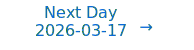

> This is a remedial run for missed papers from 03/14/2026 to 03/15/2026.
> 
> Results generated on 03/21/2026.

# Personalized Daily ArXiv Papers 2026-03-16

| *[gpt-5.4]*   | Prompt   | Completion   | Total   |
|:-------------:|:--------:|:------------:|:-------:|
| **Token**     | 208634   | 6781         | 215415  |
| **Cost**      | $0.52    | $0.1         | $0.62   |

**Table of contents with paper titles:**

1. [M$^2$RNN: Non-Linear RNNs with Matrix-Valued States for Scalable Language Modeling](#user-content-link1)
**Authors:** Mayank Mishra, Shawn Tan, Ion Stoica, Joseph Gonzalez, Tri Dao

2. [PDE-SSM: A Spectral State Space Approach to Spatial Mixing in Diffusion Transformers](#user-content-link2)
**Authors:** Eshed Gal, Moshe Eliasof, Siddharth Rout, Eldad Haber

3. [Self-Indexing KVCache: Predicting Sparse Attention from Compressed Keys](#user-content-link3)
**Authors:** Xu Yang, Jiapeng Zhang, Dongyang Zhao, Guo Chen, Zhuo Tang

4. [Rigorous Asymptotics for First-Order Algorithms Through the Dynamical Cavity Method](#user-content-link4)
**Authors:** Yatin Dandi, David Gamarnik, Francisco Pernice, Lenka Zdeborová

5. [Gradient Atoms: Unsupervised Discovery, Attribution and Steering of Model Behaviors via Sparse Decomposition of Training Gradients](#user-content-link5)
**Authors:** J Rosser

6. [FlashHead: Efficient Drop-In Replacement for the Classification Head in Language Model Inference](#user-content-link6)
**Authors:** Wilhelm Tranheden, Shahnawaz Ahmed, Devdatt Dubhashi, Jonna Matthiesen, Hannes von Essen

7. [GradMem: Learning to Write Context into Memory with Test-Time Gradient Descent](#user-content-link7)
**Authors:** Yuri Kuratov, Matvey Kairov, Aydar Bulatov, Ivan Rodkin, Mikhail Burtsev

8. [On Interpolation Formulas Describing Neural Network Generalization](#user-content-link8)
**Authors:** Jin Guo, Roy Y. He, Jean-Michel Morel

9. [Understanding the Emergence of Seemingly Useless Features in Next-Token Predictors](#user-content-link9)
**Authors:** Mark Rofin, Jalal Naghiyev, Michael Hahn

10. [Spectral Edge Dynamics of Training Trajectories: Signal--Noise Geometry Across Scales](#user-content-link10)
**Authors:** Yongzhong Xu

11. [The Phenomenology of Hallucinations](#user-content-link11)
**Authors:** Valeria Ruscio, Keiran Thompson

12. [Enhancing LLM Training via Spectral Clipping](#user-content-link12)
**Authors:** Xiaowen Jiang, Andrei Semenov, Sebastian U. Stich

13. [Power-Law Spectrum of the Random Feature Model](#user-content-link13)
**Authors:** Elliot Paquette, Ke Liang Xiao, Yizhe Zhu

14. [Effective Sparsity: A Unified Framework via Normalized Entropy and the Effective Number of Nonzeros](#user-content-link14)
**Authors:** Haoyu He, Hao Wang, Jiashan Wang, Hao Zeng

15. [High-Probability Bounds for SGD under the Polyak-Lojasiewicz Condition with Markovian Noise](#user-content-link15)
**Authors:** Avik Kar, Siddharth Chandak, Rahul Singh, Eric Moulines, Shalabh Bhatnagar, Nicholas Bambos

16. [ASAP: Attention-Shift-Aware Pruning for Efficient LVLM Inference](#user-content-link16)
**Authors:** Surendra Pathak, Bo Han

17. [Learning to Forget: Sleep-Inspired Memory Consolidation for Resolving Proactive Interference in Large Language Models](#user-content-link17)
**Authors:** Ying Xie

18. [SVD Contextual Sparsity Predictors for Fast LLM Inference](#user-content-link18)
**Authors:** Georgii Serbin, Kirill Koshkin, Zhongao Sun, Anastasiya Bistrigova, C. C. Korikov

19. [Disentangling Dynamical Systems: Causal Representation Learning Meets Local Sparse Attention](#user-content-link19)
**Authors:** Markus W. Baumgartner, Anson Lei, Joe Watson, Ingmar Posner

20. [OxyGen: Unified KV Cache Management for Vision-Language-Action Models under Multi-Task Parallelism](#user-content-link20)
**Authors:** Xiangyu Li, Huaizhi Tang, Xin Ding, Weijun Wang, Ting Cao, Yunxin Liu

21. [Interleaved Resampling and Refitting: Data and Compute-Efficient Evaluation of Black-Box Predictors](#user-content-link21)
**Authors:** Haichen Hu, David Simchi-Levi

22. [On the (Generative) Linear Sketching Problem](#user-content-link22)
**Authors:** Xinyu Yuan, Yan Qiao, Zonghui Wang, Wenzhi Chen

23. [Sampling Boltzmann distributions via normalizing flow approximation of transport maps](#user-content-link23)
**Authors:** Zia Ur Rehman, Gero Friesecke

24. [Windowed Fourier Propagator: A Frequency-Local Neural Operator for Wave Equations in Inhomogeneous Media](#user-content-link24)
**Authors:** Yiyang Cai, Zixuan Qiu, Yunlu Shu, Jiamao Wu, Yingzhou Li, Tianyu Wang, Xi Chen

25. [Convergence of Two Time-Scale Stochastic Approximation: A Martingale Approach](#user-content-link25)
**Authors:** Mathukumalli Vidyasagar

26. [TMPDiff: Temporal Mixed-Precision for Diffusion Models](#user-content-link26)
**Authors:** Basile Lewandowski, Simon Kurz, Aditya Shankar, Robert Birke, Jian-Jia Chen, Lydia Y. Chen

27. [$K-$means with learned metrics](#user-content-link27)
**Authors:** Pablo Groisman, Matthieu Jonckheere, Jordan Serres, Mariela Sued

28. [SuperLocalMemory V3: Information-Geometric Foundations for Zero-LLM Enterprise Agent Memory](#user-content-link28)
**Authors:** Varun Pratap Bhardwaj

29. [D-MEM: Dopamine-Gated Agentic Memory via Reward Prediction Error Routing](#user-content-link29)
**Authors:** Yuru Song, Qi Xin

30. [ZOTTA: Test-Time Adaptation with Gradient-Free Zeroth-Order Optimization](#user-content-link30)
**Authors:** Ronghao Zhang, Shuaicheng Niu, Qi Deng, Yanjie Dong, Jian Chen, Runhao Zeng

31. [From Specification to Architecture: A Theory Compiler for Knowledge-Guided Machine Learning](#user-content-link31)
**Authors:** Asela Hevapathige, Yu Xia, Sachith Seneviratne, Saman Halgamuge

32. [Look Where It Matters: High-Resolution Crops Retrieval for Efficient VLMs](#user-content-link32)
**Authors:** Nimrod Shabtay, Moshe Kimhi, Artem Spector, Sivan Haray, Ehud Rivlin, Chaim Baskin, Raja Giryes, Eli Schwartz

33. [Structure-Dependent Regret and Constraint Violation Bounds for Online Convex Optimization with Time-Varying Constraints](#user-content-link33)
**Authors:** Xiufeng Liu, Qian Chen, Zhijin Wang, Ruyu Liu

34. [AEX: Non-Intrusive Multi-Hop Attestation and Provenance for LLM APIs](#user-content-link34)
**Authors:** Yongjie Guan

35. [Towards One-for-All Anomaly Detection for Tabular Data](#user-content-link35)
**Authors:** Shiyuan Li, Yixin Liu, Yu Zheng, Xiaofeng Cao, Shirui Pan, Heng Tao Shen

36. [Not All Latent Spaces Are Flat: Hyperbolic Concept Control](#user-content-link36)
**Authors:** Maria Rosaria Briglia, Simone Facchiano, Paolo Cursi, Alessio Sampieri, Emanuele Rodolà, Guido Maria D'Amely di Melendugno, Luca Franco, Fabio Galasso, Iacopo Masi

37. [Punctuated Equilibria in Artificial Intelligence: The Institutional Scaling Law and the Speciation of Sovereign AI](#user-content-link37)
**Authors:** Mark Baciak, Thomas A. Cellucci, Deanna M. Falkowski

38. [The Institutional Scaling Law: Non-Monotonic Fitness, Capability-Trust Divergence, and Symbiogenetic Scaling in Generative AI](#user-content-link38)
**Authors:** Mark Baciak, Thomas A. Cellucci

39. [True 4-Bit Quantized Convolutional Neural Network Training on CPU: Achieving Full-Precision Parity](#user-content-link39)
**Authors:** Shivnath Tathe

40. [Is the reconstruction loss culprit? An attempt to outperform JEPA](#user-content-link40)
**Authors:** Alexey Potapov, Oleg Shcherbakov, Ivan Kravchenko

41. [Representation Alignment for Just Image Transformers is not Easier than You Think](#user-content-link41)
**Authors:** Jaeyo Shin, Jiwook Kim, Hyunjung Shim

42. [WestWorld: A Knowledge-Encoded Scalable Trajectory World Model for Diverse Robotic Systems](#user-content-link42)
**Authors:** Yuchen Wang, Jiangtao Kong, Sizhe Wei, Xiaochang Li, Haohong Lin, Hongjue Zhao, Tianyi Zhou, Lu Gan, Huajie Shao

43. [Human-like Object Grouping in Self-supervised Vision Transformers](#user-content-link43)
**Authors:** Hossein Adeli, Seoyoung Ahn, Andrew Luo, Mengmi Zhang, Nikolaus Kriegeskorte, Gregory Zelinsky

44. [Exploring the Dimensions of a Variational Neuron](#user-content-link44)
**Authors:** Yves Ruffenach

45. [IGU-LoRA: Adaptive Rank Allocation via Integrated Gradients and Uncertainty-Aware Scoring](#user-content-link45)
**Authors:** Xuan Cui, Huiyue Li, Run Zeng, Yunfei Zhao, Jinrui Qian, Wei Duan, Bo Liu, Zhanpeng Zhou

46. [Align Forward, Adapt Backward: Closing the Discretization Gap in Logic Gate Networks](#user-content-link46)
**Authors:** Youngsung Kim

47. [Pixel-level Scene Understanding in One Token: Visual States Need What-is-Where Composition](#user-content-link47)
**Authors:** Seokmin Lee, Yunghee Lee, Byeonghyun Pak, Byeongju Woo

48. [DASH: Dynamic Audio-Driven Semantic Chunking for Efficient Omnimodal Token Compression](#user-content-link48)
**Authors:** Bingzhou Li, Tao Huang

49. [Soft Mean Expected Calibration Error (SMECE): A Calibration Metric for Probabilistic Labels](#user-content-link49)
**Authors:** Michael Leznik

50. [ES-Merging: Biological MLLM Merging via Embedding Space Signals](#user-content-link50)
**Authors:** Wonbin Lee, Dongki Kim, Sung Ju Hwang

51. [SPARQ: Spiking Early-Exit Neural Networks for Energy-Efficient Edge AI](#user-content-link51)
**Authors:** Parth Patne, Mahdi Taheri, Ali Mahani, Maksim Jenihhin, Reza Mahani, Christian Herglotz

52. [Exploiting temporal parallelism for LSTM Autoencoder acceleration on FPGA](#user-content-link52)
**Authors:** Aimilios Leftheriotis, Dimosthenis Masouros, Dimitrios Soudris, George Theodoridis

53. [Mitigating Overthinking in Large Reasoning Language Models via Reasoning Path Deviation Monitoring](#user-content-link53)
**Authors:** Weixin Guan, Liang Li, Jiapeng Liu, Bing Li, Peng Fu, Chengyang Fang, Xiaoshuai Hao, Can Ma, Weiping Wang

54. [Routing Channel-Patch Dependencies in Time Series Forecasting with Graph Spectral Decomposition](#user-content-link54)
**Authors:** Dongyuan Li, Shun Zheng, Chang Xu, Jiang Bian, Renhe Jiang

55. [U-Face: An Efficient and Generalizable Framework for Unsupervised Facial Attribute Editing via Subspace Learning](#user-content-link55)
**Authors:** Bo Liu, Xuan Cui, Run Zeng, Wei Duan, Chongwen Liu, Jinrui Qian, Lianggui Tang, Hongping Gan

56. [On the Degrees of Freedom of Gridded Control Points in Learning-Based Medical Image Registration](#user-content-link56)
**Authors:** Wen Yan, Qianye Yang, Yipei Wang, Shonit Punwani, Mark Emberton, Vasilis Stavrinides, Yipeng Hu, Dean Barratt

57. [High-Fidelity Compression of Seismic Velocity Models via SIREN Auto-Decoders](#user-content-link57)
**Authors:** Caiyun Liu, Xiaoxue Luo, Jie Xiong

58. [PA-Net: Precipitation-Adaptive Mixture-of-Experts for Long-Tail Rainfall Nowcasting](#user-content-link58)
**Authors:** Xinyu Xiao, Sen Lei, Eryun Liu, Shiming Xiang, Hao Li, Cheng Yuan, Yuan Qi, Qizhao Jin

---

## 1. [M$^2$RNN: Non-Linear RNNs with Matrix-Valued States for Scalable Language Modeling](https://arxiv.org/abs/2603.14360) 

**ArXiv ID:** 2603.14360

**Authors:** Mayank Mishra, Shawn Tan, Ion Stoica, Joseph Gonzalez, Tri Dao

**Abstract:** Transformers are highly parallel but are limited to computations in the TC$^0$ complexity class, excluding tasks such as entity tracking and code execution that provably require greater expressive power. Motivated by this limitation, we revisit non-linear Recurrent Neural Networks (RNNs) for language modeling and introduce Matrix-to-Matrix RNN (M$^2$RNN): an architecture with matrix-valued hidden states and expressive non-linear state transitions. We demonstrate that the language modeling performance of non-linear RNNs is limited by their state size. We also demonstrate how the state size expansion mechanism enables efficient use of tensor cores. Empirically, M$^2$RNN achieves perfect state tracking generalization at sequence lengths not seen during training. These benefits also translate to large-scale language modeling. In hybrid settings that interleave recurrent layers with attention, Hybrid M$^2$RNN outperforms equivalent Gated DeltaNet hybrids by $0.4$-$0.5$ perplexity points on a 7B MoE model, while using $3\times$ smaller state sizes for the recurrent layers. Notably, replacing even a single recurrent layer with M$^2$RNN in an existing hybrid architecture yields accuracy gains comparable to Hybrid M$^2$RNN with minimal impact on training throughput. Further, the Hybrid Gated DeltaNet models with a single M$^2$RNN layer also achieve superior long-context generalization, outperforming state-of-the-art hybrid linear attention architectures by up to $8$ points on LongBench. Together, these results establish non-linear RNN layers as a compelling building block for efficient and scalable language models.

**Comment:** Introduces matrix-valued nonlinear recurrent layers as a scalable core architecture with stronger expressivity than standard transformer blocks.

**Relevance:** 10
**Novelty:** 9

---

## 2. [PDE-SSM: A Spectral State Space Approach to Spatial Mixing in Diffusion Transformers](https://arxiv.org/abs/2603.13663) 

**ArXiv ID:** 2603.13663

**Authors:** Eshed Gal, Moshe Eliasof, Siddharth Rout, Eldad Haber

**Abstract:** The success of vision transformers-especially for generative modeling-is limited by the quadratic cost and weak spatial inductive bias of self-attention. We propose PDE-SSM, a spatial state-space block that replaces attention with a learnable convection-diffusion-reaction partial differential equation. This operator encodes a strong spatial prior by modeling information flow via physically grounded dynamics rather than all-to-all token interactions. Solving the PDE in the Fourier domain yields global coupling with near-linear complexity of $O(N \log N)$, delivering a principled and scalable alternative to attention. We integrate PDE-SSM into a flow-matching generative model to obtain the PDE-based Diffusion Transformer PDE-SSM-DiT. Empirically, PDE-SSM-DiT matches or exceeds the performance of state-of-the-art Diffusion Transformers while substantially reducing compute. Our results show that, analogous to 1D settings where SSMs supplant attention, multi-dimensional PDE operators provide an efficient, inductive-bias-rich foundation for next-generation vision models.

**Comment:** Replaces transformer attention with a learnable Fourier-solved PDE state-space block, a core architectural innovation for efficient spatial mixing.

**Relevance:** 10
**Novelty:** 8

---

## 3. [Self-Indexing KVCache: Predicting Sparse Attention from Compressed Keys](https://arxiv.org/abs/2603.14224) 

**ArXiv ID:** 2603.14224

**Authors:** Xu Yang, Jiapeng Zhang, Dongyang Zhao, Guo Chen, Zhuo Tang

**Abstract:** The KV cache in self-attention has emerged as a major bottleneck in long-context and large-batch inference for LLMs. Existing approaches often treat sparsity prediction and compression as separate modules, relying on auxiliary index structures to select relevant tokens, and on complex quantization schemes to reduce memory usage. This fragmented design introduces redundant overhead and limits scalability. In this paper, we propose a novel paradigm: treating the compressed key representation not merely as storage, but as a self-indexing structure that directly enables efficient sparse attention. By designing a sign-based 1-bit vector quantization (VQ) scheme, our method unifies compression and retrieval in a single, hardware-friendly format. This approach eliminates the need for external indices or learning-based predictors, offering a lightweight yet robust solution for memory-constrained inference. All components are designed to be hardware-efficient and easy to implement. By implementing custom CUDA kernels, our method integrates seamlessly with FlashAttention, minimizing additional runtime and memory overhead. Experimental results demonstrate that our approach delivers both effectiveness and efficiency.

**Comment:** Model compression and efficiency: unifies KV-cache compression and sparse attention retrieval via self-indexing 1-bit quantized keys with custom CUDA integration.

**Relevance:** 10
**Novelty:** 8

---

## 4. [Rigorous Asymptotics for First-Order Algorithms Through the Dynamical Cavity Method](https://arxiv.org/abs/2603.14573) 

**ArXiv ID:** 2603.14573

**Authors:** Yatin Dandi, David Gamarnik, Francisco Pernice, Lenka Zdeborová

**Abstract:** Dynamical Mean Field Theory (DMFT) provides an asymptotic description of the dynamics of macroscopic observables in certain disordered systems. Originally pioneered in the context of spin glasses by Sompolinsky and Zippelius (1982), it has since been used to derive asymptotic dynamical equations for a wide range of models in physics, high-dimensional statistics and machine learning. One of the main tools used by physicists to obtain these equations is the dynamical cavity method, which has remained largely non-rigorous. In contrast, existing mathematical formalizations have relied on alternative approaches, including Gaussian conditioning, large deviations over paths, or Fourier analysis. In this work, we formalize the dynamical cavity method and use it to give a new proof of the DMFT equations for General First Order Methods, a broad class of dynamics encompassing algorithms such as Gradient Descent and Approximate Message Passing.

**Comment:** Provides a rigorous formalization of the dynamical cavity method for first-order algorithms, yielding asymptotic theory for optimization dynamics.

**Relevance:** 9
**Novelty:** 9

---

## 5. [Gradient Atoms: Unsupervised Discovery, Attribution and Steering of Model Behaviors via Sparse Decomposition of Training Gradients](https://arxiv.org/abs/2603.14665) 

**ArXiv ID:** 2603.14665

**Authors:** J Rosser

**Abstract:** Training data attribution (TDA) methods ask which training documents are responsible for a model behavior. However, models often learn broad concepts shared across many examples. Moreover, existing TDA methods are supervised -- they require a predefined query behavior, then score every training document against it -- making them both expensive and unable to surface behaviors the user did not think to ask about. We present Gradient Atoms, an unsupervised method that decomposes per-document training gradients into sparse components ("atoms") via dictionary learning in a preconditioned eigenspace. Each atom captures a shared update direction induced by a cluster of functionally similar documents, directly recovering the collective structure that per-document methods do not address. Among 500 discovered atoms, the highest-coherence ones recover interpretable task-type behaviors -- refusal, arithmetic, yes/no classification, trivia QA -- without any behavioral labels. These atoms double as effective steering vectors: applying them as weight-space perturbations produces large, controllable shifts in model behavior (e.g., bulleted-list generation 33% to 94%; systematic refusal 50% to 0%). The method requires no query--document scoring stage, and scales independently of the number of query behaviors of interest. Code is available at https://github.com/jrosseruk/gradient_atoms.

**Comment:** Representation learning: unsupervised sparse dictionary decomposition of per-document training gradients to discover interpretable behavior atoms and steering directions.

**Relevance:** 9
**Novelty:** 9

---

## 6. [FlashHead: Efficient Drop-In Replacement for the Classification Head in Language Model Inference](https://arxiv.org/abs/2603.14591) 

**ArXiv ID:** 2603.14591

**Authors:** Wilhelm Tranheden, Shahnawaz Ahmed, Devdatt Dubhashi, Jonna Matthiesen, Hannes von Essen

**Abstract:** Language models are increasingly adopting smaller architectures optimized for consumer devices. In this setting, inference efficiency is the primary constraint. Meanwhile, vocabulary sizes continue to grow rapidly, making the classification head a critical bottleneck that accounts for up to 60\% of model parameters, and 50\% of inference compute. We introduce FlashHead, the first efficient drop-in replacement for the dense classification head that is training-free and hardware-friendly. FlashHead builds on principles from information retrieval, reframing that computation at the output head as a retrieval problem rather than a dense classification over the full vocabulary. FlashHead introduces four key innovations: (1) a balanced clustering scheme that structures vocabulary partitions into compact hardware-efficient tensors, (2) extending multiprobe retrieval to language model heads, enabling thousands of clusters to be scored in parallel, (3) a novel inference-time sampling mechanism that extends retrieval beyond top tokens, enabling probabilistic sampling across the full vocabulary, and (4) selective quantization, enabling effective low-bit computation in the head. Experiments on Llama-3.2, Gemma-3, and Qwen-3 show that FlashHead delivers model-level inference speedups of up to \textbf{1.75x} which maintaining output accuracy compared to the original head. By overcoming the classification head bottleneck, FlashHead establishes a new benchmark for efficient inference and removes a key barrier to developing smaller, capable models for consumer hardware.

**Comment:** Inference efficiency: training-free retrieval-style replacement for the LM output head that reduces classification-head compute.

**Relevance:** 9
**Novelty:** 8

---

## 7. [GradMem: Learning to Write Context into Memory with Test-Time Gradient Descent](https://arxiv.org/abs/2603.13875) 

**ArXiv ID:** 2603.13875

**Authors:** Yuri Kuratov, Matvey Kairov, Aydar Bulatov, Ivan Rodkin, Mikhail Burtsev

**Abstract:** Many large language model applications require conditioning on long contexts. Transformers typically support this by storing a large per-layer KV-cache of past activations, which incurs substantial memory overhead. A desirable alternative is ompressive memory: read a context once, store it in a compact state, and answer many queries from that state. We study this in a context removal setting, where the model must generate an answer without access to the original context at inference time. We introduce GradMem, which writes context into memory via per-sample test-time optimization. Given a context, GradMem performs a few steps of gradient descent on a small set of prefix memory tokens while keeping model weights frozen. GradMem explicitly optimizes a model-level self-supervised context reconstruction loss, resulting in a loss-driven write operation with iterative error correction, unlike forward-only methods. On associative key--value retrieval, GradMem outperforms forward-only memory writers with the same memory size, and additional gradient steps scale capacity much more effectively than repeated forward writes. We further show that GradMem transfers beyond synthetic benchmarks: with pretrained language models, it attains competitive results on natural language tasks including bAbI and SQuAD variants, relying only on information encoded in memory.

**Comment:** Memory-efficient architecture: writes long context into compact prefix memory via test-time gradient descent instead of large KV caches.

**Relevance:** 9
**Novelty:** 8

---

## 8. [On Interpolation Formulas Describing Neural Network Generalization](https://arxiv.org/abs/2603.13872) 

**ArXiv ID:** 2603.13872

**Authors:** Jin Guo, Roy Y. He, Jean-Michel Morel

**Abstract:** In 2020 Domingos introduced an interpolation formula valid for "every model trained by gradient descent". He concluded that such models behave approximately as kernel machines. In this work, we extend the Domingos formula to stochastic training. We introduce a stochastic gradient kernel that extends the deterministic version via a continuous-time diffusion approximation. We prove stochastic Domingos theorems and show that the expected network output admits a kernel-machine representation with optimizer-specific weighting. It reveals that training samples contribute through loss-dependent weights and gradient alignment along the training trajectory. We then link the generalization error to the null space of the integral operator induced by the stochastic gradient kernel. The same path-kernel viewpoint provides a unified interpretation of diffusion models and GANs: diffusion induces stage-wise, noise-localized corrections, whereas GANs induce distribution-guided corrections shaped by discriminator geometry. We visualize the evolution of implicit kernels during optimization and quantify out-of-distribution behaviors through a series of numerical experiments. Our results support a feature-space memory view of learning: training stores data-dependent information in an evolving tangent feature geometry, and predictions at test time arise from kernel-weighted retrieval and aggregation of these stored features, with generalization governed by alignment between test points and the learned feature memory.

**Comment:** Theory of training dynamics: extends Domingos-style kernel interpolation to stochastic gradient training with optimizer-specific path kernels.

**Relevance:** 9
**Novelty:** 8

---

## 9. [Understanding the Emergence of Seemingly Useless Features in Next-Token Predictors](https://arxiv.org/abs/2603.14087) 

**ArXiv ID:** 2603.14087

**Authors:** Mark Rofin, Jalal Naghiyev, Michael Hahn

**Abstract:** Trained Transformers have been shown to compute abstract features that appear redundant for predicting the immediate next token. We identify which components of the gradient signal from the next-token prediction objective give rise to this phenomenon, and we propose a method to estimate the influence of those components on the emergence of specific features. After validating our approach on toy tasks, we use it to interpret the origins of the world model in OthelloGPT and syntactic features in a small language model. Finally, we apply our framework to a pretrained LLM, showing that features with extremely high or low influence on future tokens tend to be related to formal reasoning domains such as code. Overall, our work takes a step toward understanding hidden features of Transformers through the lens of their development during training.

**Comment:** Representation learning analysis: identifies which next-token gradient components cause transformers to develop seemingly redundant abstract features.

**Relevance:** 9
**Novelty:** 8

---

## 10. [Spectral Edge Dynamics of Training Trajectories: Signal--Noise Geometry Across Scales](https://arxiv.org/abs/2603.15678) 

**ArXiv ID:** 2603.15678

**Authors:** Yongzhong Xu

**Abstract:** Despite hundreds of millions of parameters, transformer training trajectories evolve within only a few coherent directions. We introduce Spectral Edge Dynamics (SED) to quantify this structure: a rolling-window SVD of parameter updates reveals a sharp boundary -- the spectral edge -- between coherent optimization directions and stochastic noise, identified via the maximum consecutive singular value ratio $σ_k / σ_{k+1}$. Across a 51M-parameter TinyStories model (4 seeds) and GPT-2 124M under distribution shift, the spectral edge exhibits a universal three-phase pattern (rise, plateau, collapse). The effective signal rank adapts to task complexity ($k^* = 2$ at 51M, $k^* = 3$ at 124M), and the directional coupling between spectral geometry and validation loss reverses with window size -- a lag flip reflecting the timescale of trajectory integration. Johnson--Lindenstrauss projection to $d = 10W$ dimensions (e.g., $d = 100$ for $W = 10$) preserves the spectral gap within $5.7\%$, making the framework applicable to models of arbitrary scale. In companion work, the same spectral geometry provides early-warning signals of grokking -- predicting generalization $600$--$1{,}700$ steps before it occurs across modular arithmetic, Dyck languages, and the SCAN benchmark.

**Comment:** Training dynamics analysis: spectral-edge SVD reveals low-rank signal-noise structure and phase transitions in transformer optimization trajectories.

**Relevance:** 9
**Novelty:** 8

---

## 11. [The Phenomenology of Hallucinations](https://arxiv.org/abs/2603.13911) 

**ArXiv ID:** 2603.13911

**Authors:** Valeria Ruscio, Keiran Thompson

**Abstract:** We show that language models hallucinate not because they fail to detect uncertainty, but because of a failure to integrate it into output generation. Across architectures, uncertain inputs are reliably identified, occupying high-dimensional regions with 2-3$\times$ the intrinsic dimensionality of factual inputs. However, this internal signal is weakly coupled to the output layer: uncertainty migrates into low-sensitivity subspaces, becoming geometrically amplified yet functionally silent. Topological analysis shows that uncertainty representations fragment rather than converging to a unified abstention state, while gradient and Fisher probes reveal collapsing sensitivity along the uncertainty direction. Because cross-entropy training provides no attractor for abstention and uniformly rewards confident prediction, associative mechanisms amplify these fractured activations until residual coupling forces a committed output despite internal detection. Causal interventions confirm this account by restoring refusal when uncertainty is directly connected to logits.

**Comment:** Representation-level theory of hallucination: uncertainty is internally encoded but weakly coupled to logits, explaining failure to abstain.

**Relevance:** 9
**Novelty:** 8

---

## 12. [Enhancing LLM Training via Spectral Clipping](https://arxiv.org/abs/2603.14315) 

**ArXiv ID:** 2603.14315

**Authors:** Xiaowen Jiang, Andrei Semenov, Sebastian U. Stich

**Abstract:** While spectral-based optimizers like Muon operate directly on the spectrum of updates, standard adaptive methods such as AdamW do not account for the global spectral structure of weights and gradients, leaving them vulnerable to two empirical issues in large language model (LLM) training: (i) the optimizer updates can have large spectral norms, potentially destabilizing training and degrading generalization; (ii) stochastic gradient noise can exhibit sparse spectral spikes, with a few dominant singular values much larger than the rest. We propose SPECTRA, a general framework addressing these by (i) post-spectral clipping of updates to enforce spectral-norm constraints; (ii) optional pre-spectral clipping of gradients to suppress spectral noise spikes. We prove that post-clipping constitutes a Composite Frank-Wolfe method with spectral-norm constraints and weight regularization, recovering Frobenius and $\ell_{\infty}$-norm regularization with SGD-based and sign-based methods. We further analyze how pre-clipping mitigates sparse spectral spikes. We propose efficient soft spectral clipping via Newton-Schulz iterations, avoiding expensive SVD. Experiments on LLM pretraining show SPECTRA uniformly improves validation loss for various optimizers, including AdamW, Signum, and AdEMAMix, with the best-performing variants achieving state-of-the-art results. Models trained with SPECTRA exhibit smaller weight norms, confirming the link between spectral clipping and regularization.

**Comment:** Spectral clipping is a general optimizer-side efficiency/stability method for LLM training with theory and scalable Newton-Schulz implementation.

**Relevance:** 9
**Novelty:** 8

---

## 13. [Power-Law Spectrum of the Random Feature Model](https://arxiv.org/abs/2603.14578) 

**ArXiv ID:** 2603.14578

**Authors:** Elliot Paquette, Ke Liang Xiao, Yizhe Zhu

**Abstract:** Scaling laws for neural networks, in which the loss decays as a power-law in the number of parameters, data, and compute, depend fundamentally on the spectral structure of the data covariance, with power-law eigenvalue decay appearing ubiquitously in vision and language tasks. A central question is whether this spectral structure is preserved or destroyed when data passes through the basic building block of a neural network: a random linear projection followed by a nonlinear activation. We study this question for the random feature model: given data $x \sim N(0,H)\in \mathbb{R}^v$ where $H$ has $α$-power-law spectrum ($λ_j(H ) \asymp j^{-α}$, $α> 1$), a Gaussian sketch matrix $W \in \mathbb{R}^{v\times d}$, and an entrywise monomial $f(y) = y^{p}$, we characterize the eigenvalues of the population random-feature covariance $\mathbb{E}_{x }[\frac{1}{d}f(W^\top x )^{\otimes 2}]$. We prove matching upper and lower bounds: for all $1 \leq j \leq c_1 d \log^{-(p+1)}(d)$, the $j$-th eigenvalue is of order $\left(\log^{p-1}(j+1)/j\right)^α$. For $ c_1 d \log^{-(p+1)}(d)\leq j\leq d$, the $j$-th eigenvalue is of order $j^{-α}$ up to a polylog factor. That is, the power-law exponent $α$ is inherited exactly from the input covariance, modified only by a logarithmic correction that depends on the monomial degree $p$. The proof combines a dyadic head-tail decomposition with Wick chaos expansions for higher-order monomials and random matrix concentration inequalities.

**Comment:** Derives power-law spectral preservation results for random feature models, directly addressing representation structure in core architectures.

**Relevance:** 9
**Novelty:** 8

---

## 14. [Effective Sparsity: A Unified Framework via Normalized Entropy and the Effective Number of Nonzeros](https://arxiv.org/abs/2603.13826) 

**ArXiv ID:** 2603.13826

**Authors:** Haoyu He, Hao Wang, Jiashan Wang, Hao Zeng

**Abstract:** Classical sparsity promoting methods rely on the l0 norm, which treats all nonzero components as equally significant. In practical inverse problems, however, solutions often exhibit many small amplitude components that have little effect on reconstruction but lead to an overestimation of signal complexity. We address this limitation by shifting the paradigm from discrete cardinality to effective sparsity. Our approach introduces the effective number of nonzeros (ENZ), a unified class of normalized entropy-based regularizers, including Shannon and Renyi forms, that quantifies the concentration of significant coefficients. We show that, unlike the classical l0 norm, the ENZ provides a stable and continuous measure of effective sparsity that is insensitive to negligible perturbations. For noisy linear inverse problems, we establish theoretical guarantees under the Restricted Isometry Property (RIP), proving that ENZ based recovery is unique and stable. We also derive a decomposition showing that the ENZ equals the support cardinality times a distributional efficiency term, thereby linking entropy with l0 regularization. Numerical experiments show that this effective sparsity framework outperforms traditional cardinality based methods in robustness and accuracy.

**Comment:** Defines effective sparsity via normalized-entropy regularizers with RIP-based recovery guarantees, offering a new theoretical sparsity framework.

**Relevance:** 9
**Novelty:** 8

---

## 15. [High-Probability Bounds for SGD under the Polyak-Lojasiewicz Condition with Markovian Noise](https://arxiv.org/abs/2603.14514) 

**ArXiv ID:** 2603.14514

**Authors:** Avik Kar, Siddharth Chandak, Rahul Singh, Eric Moulines, Shalabh Bhatnagar, Nicholas Bambos

**Abstract:** We present the first uniform-in-time high-probability bound for SGD under the PL condition, where the gradient noise contains both Markovian and martingale difference components. This significantly broadens the scope of finite-time guarantees, as the PL condition arises in many machine learning and deep learning models while Markovian noise naturally arises in decentralized optimization and online system identification problems. We further allow the magnitude of noise to grow with the function value, enabling the analysis of many practical sampling strategies. In addition to the high-probability guarantee, we establish a matching $1/k$ decay rate for the expected suboptimality. Our proof technique relies on the Poisson equation to handle the Markovian noise and a probabilistic induction argument to address the lack of almost-sure bounds on the objective. Finally, we demonstrate the applicability of our framework by analyzing three practical optimization problems: token-based decentralized linear regression, supervised learning with subsampling for privacy amplification, and online system identification.

**Comment:** Establishes the first uniform-in-time high-probability SGD bounds under PL with Markovian noise, a foundational optimization theory result.

**Relevance:** 9
**Novelty:** 8

---

## 16. [ASAP: Attention-Shift-Aware Pruning for Efficient LVLM Inference](https://arxiv.org/abs/2603.14549) 

**ArXiv ID:** 2603.14549

**Authors:** Surendra Pathak, Bo Han

**Abstract:** While Large Vision-Language Models (LVLMs) demonstrate exceptional multi-modal capabilities, the quadratic computational cost of processing high-resolution visual tokens remains a critical bottleneck. Though recent token reduction strategies attempt to accelerate inference, such methods inadequately exploit attention values and fail to address token redundancy. More critically, they overlook the ``attention shift'' phenomenon inherent in LVLMs, which skews token attention scores. In this work, we propose ASAP, a novel training-free, KV-Cache-compatible pruning recipe that comprehensively addresses these limitations. First, we mitigate the attention shift by utilizing a dynamic bidirectional soft attention mask, ensuring the selection of genuinely informative tokens rather than naive attention-based selection. Second, we posit that high semantic redundancy within the token set degrades performance. We therefore introduce a weighted soft merging component that merges semantically similar tokens, preserving only the most feature-dense visual patches for subsequent layers. ASAP achieves virtually lossless compression of visual context, retaining 99.02% of the original LLaVA-NeXT-7B performance while aggressively slashing computational FLOPs by ~80%.

**Comment:** Model efficiency: training-free LVLM token pruning that corrects attention shift and merges redundant tokens while remaining KV-cache compatible.

**Relevance:** 9
**Novelty:** 8

---

## 17. [Learning to Forget: Sleep-Inspired Memory Consolidation for Resolving Proactive Interference in Large Language Models](https://arxiv.org/abs/2603.14517) 

**ArXiv ID:** 2603.14517

**Authors:** Ying Xie

**Abstract:** Large language models (LLMs) suffer from proactive interference (PI): outdated information in the context window disrupts retrieval of current values. This interference degrades retrieval accuracy log-linearly as stale associations accumulate, a bottleneck that persists regardless of context length and resists prompt-engineering mitigations. Biological brains resolve an analogous challenge through sleep-dependent memory consolidation: synaptic downscaling, selective replay, and targeted forgetting. We propose SleepGate, a biologically inspired framework that augments transformer-based LLMs with a learned sleep cycle over the key-value (KV) cache. SleepGate introduces three mechanisms: (1) a conflict-aware temporal tagger detecting when new entries supersede old ones; (2) a lightweight forgetting gate trained to selectively evict or compress stale cache entries; and (3) a consolidation module that merges surviving entries into compact summaries. These components activate periodically during inference in sleep micro-cycles, governed by an adaptive entropy-based trigger. We formalize a dual-phase training objective jointly optimizing language modeling during the wake phase and post-consolidation retrieval during the sleep phase. Theoretical analysis shows SleepGate reduces the interference horizon from O(n) to O(log n). In experiments with a small-scale transformer (4 layers, 793K parameters), SleepGate achieves 99.5% retrieval accuracy at PI depth 5 and 97.0% at depth 10, while all five baselines -- full KV cache, sliding window, H2O, StreamingLLM, and decay-only ablation -- remain below 18%. Our framework offers an architecture-level solution that prompt engineering cannot address.

**Comment:** Inference-time KV-cache memory management architecture with selective forgetting/compression and theoretical interference reduction.

**Relevance:** 9
**Novelty:** 8

---

## 18. [SVD Contextual Sparsity Predictors for Fast LLM Inference](https://arxiv.org/abs/2603.14110) 

**ArXiv ID:** 2603.14110

**Authors:** Georgii Serbin, Kirill Koshkin, Zhongao Sun, Anastasiya Bistrigova, C. C. Korikov

**Abstract:** Contextual sparsity is one of the approaches used to reduce computational complexity in the inference process of large language models (LLMs). Existing techniques for efficient LLM inference acceleration based on contextual sparsity with minimal accuracy degradation require training sparse pattern predictors. This paper presents a framework for accelerating inference of ReGLU-based feed-forward networks (FFNs) within LLMs. The proposed framework provides a fast, training-free method for building sparse pattern predictors using truncation-aware singular value decomposition (SVD) of the gate projection matrix, along with a threshold calibration algorithm, and inference executors supporting conditional computation on CUDA and CANN devices. Experiments on three sparse LLMs with an average activation sparsity level of 90% in the FFNs demonstrate up to a 1.8x reduction in end-to-end decoding time while maintaining less than 1% degradation in benchmark scores on tasks involving complex math and code generation. This work advances the deployment of LLMs on edge devices.

**Comment:** Uses training-free SVD-based contextual sparsity predictors for conditional FFN execution, directly targeting fast LLM inference.

**Relevance:** 9
**Novelty:** 7

---

## 19. [Disentangling Dynamical Systems: Causal Representation Learning Meets Local Sparse Attention](https://arxiv.org/abs/2603.14483) 

**ArXiv ID:** 2603.14483

**Authors:** Markus W. Baumgartner, Anson Lei, Joe Watson, Ingmar Posner

**Abstract:** Parametric system identification methods estimate the parameters of explicitly defined physical systems from data. Yet, they remain constrained by the need to provide an explicit function space, typically through a predefined library of candidate functions chosen via available domain knowledge. In contrast, deep learning can demonstrably model systems of broad complexity with high fidelity, but black-box function approximation typically fails to yield explicit descriptive or disentangled representations revealing the structure of a system. We develop a novel identifiability theorem, leveraging causal representation learning, to uncover disentangled representations of system parameters without structural assumptions. We derive a graphical criterion specifying when system parameters can be uniquely disentangled from raw trajectory data, up to permutation and diffeomorphism. Crucially, our analysis demonstrates that global causal structures provide a lower bound on the disentanglement guarantees achievable when considering local state-dependent causal structures. We instantiate system parameter identification as a variational inference problem, leveraging a sparsity-regularised transformer to uncover state-dependent causal structures. We empirically validate our approach across four synthetic domains, demonstrating its ability to recover highly disentangled representations that baselines fail to recover. Corroborating our theoretical analysis, our results confirm that enforcing local causal structure is often necessary for full identifiability.

**Comment:** Combines causal representation learning with sparse attention and proves identifiability conditions for disentangled system representations.

**Relevance:** 8
**Novelty:** 8

---

## 20. [OxyGen: Unified KV Cache Management for Vision-Language-Action Models under Multi-Task Parallelism](https://arxiv.org/abs/2603.14371) 

**ArXiv ID:** 2603.14371

**Authors:** Xiangyu Li, Huaizhi Tang, Xin Ding, Weijun Wang, Ting Cao, Yunxin Liu

**Abstract:** Embodied AI agents increasingly require parallel execution of multiple tasks, such as manipulation, conversation, and memory construction, from shared observations under distinct time constraints. Recent Mixture-of-Transformers (MoT) Vision-Language-Action Models (VLAs) architecturally support such heterogeneous outputs, yet existing inference systems fail to achieve efficient multi-task parallelism for on-device deployment due to redundant computation and resource contention. We identify isolated KV cache management as the root cause. To address this, we propose unified KV cache management, an inference paradigm that treats KV cache as a first-class shared resource across tasks and over time. This abstraction enables two key optimizations: cross-task KV sharing eliminates redundant prefill of shared observations, while cross-frame continuous batching decouples variable-length language decoding from fixed-rate action generation across control cycles. We implement this paradigm for $π_{0.5}$, the most popular MoT VLA, and evaluate under representative robotic configurations. OxyGen achieves up to 3.7$\times$ speedup over isolated execution, delivering over 200 tokens/s language throughput and 70 Hz action frequency simultaneously without action quality degradation.

**Comment:** Introduces unified KV-cache management across tasks and time for VLA transformers, a systems-level inference innovation for multi-task parallelism.

**Relevance:** 8
**Novelty:** 8

---

## 21. [Interleaved Resampling and Refitting: Data and Compute-Efficient Evaluation of Black-Box Predictors](https://arxiv.org/abs/2603.14218) 

**ArXiv ID:** 2603.14218

**Authors:** Haichen Hu, David Simchi-Levi

**Abstract:** We study the problem of evaluating the excess risk of large-scale empirical risk minimization under the square loss. Leveraging the idea of wild refitting and resampling, we assume only black-box access to the training algorithm and develop an efficient procedure for estimating the excess risk. Our evaluation algorithm is both computationally and data efficient. In particular, it requires access to only a single dataset and does not rely on any additional validation data. Computationally, it only requires refitting the model on several much smaller datasets obtained through sequential resampling, in contrast to previous wild refitting methods that require full-scale retraining and might therefore be unsuitable for large-scale trained predictors. Our algorithm has an interleaved sequential resampling-and-refitting structure. We first construct pseudo-responses through a randomized residual symmetrization procedure. At each round, we thus resample two sub-datasets from the resulting covariate pseudo-response pairs. Finally, we retrain the model separately on these two small artificial datasets. We establish high probability excess risk guarantees under both fixed design and random design settings, showing that with a suitably chosen noise scale, our interleaved resampling and refitting algorithm yields an upper bound on the prediction error. Our theoretical analysis draws on tools from empirical process theory, harmonic analysis, Toeplitz operator theory, and sharp tensor concentration inequalities.

**Comment:** Develops a black-box, data- and compute-efficient procedure for excess-risk evaluation with high-probability guarantees via interleaved resampling/refitting.

**Relevance:** 8
**Novelty:** 8

---

## 22. [On the (Generative) Linear Sketching Problem](https://arxiv.org/abs/2603.14474) 

**ArXiv ID:** 2603.14474

**Authors:** Xinyu Yuan, Yan Qiao, Zonghui Wang, Wenzhi Chen

**Abstract:** Sketch techniques have been extensively studied in recent years and are especially well-suited to data streaming scenarios, where the sketch summary is updated quickly and compactly. However, it is challenging to recover the current state from these summaries in a way that is accurate, fast, and real. In this paper, we seek a solution that reconciles this tension, aiming for near-perfect recovery with lightweight computational procedures. Focusing on linear sketching problems of the form $\boldsymbolΦf \rightarrow f$, our study proceeds in three stages. First, we dissect existing techniques and show the root cause of the sketching dilemma: an orthogonal information loss. Second, we examine how generative priors can be leveraged to bridge the information gap. Third, we propose FLORE, a novel generative sketching framework that embraces these analyses to achieve the best of all worlds. More importantly, FLORE can be trained without access to ground-truth data. Comprehensive evaluations demonstrate FLORE's ability to provide high-quality recovery, and support summary with low computing overhead, outperforming previous methods by up to 1000 times in error reduction and 100 times in processing speed compared to learning-based solutions.

**Comment:** Studies linear sketch recovery through generative priors and proposes a training-without-ground-truth framework for efficient sketch inversion.

**Relevance:** 8
**Novelty:** 8

---

## 23. [Sampling Boltzmann distributions via normalizing flow approximation of transport maps](https://arxiv.org/abs/2603.14258) 

**ArXiv ID:** 2603.14258

**Authors:** Zia Ur Rehman, Gero Friesecke

**Abstract:** In a celebrated paper \cite{noe2019boltzmann}, Noé, Olsson, Köhler and Wu introduced an efficient method for sampling high-dimensional Boltzmann distributions arising in molecular dynamics via normalizing flow approximation of transport maps. Here, we place this approach on a firm mathematical foundation. We prove the existence of a normalizing flow between the reference measure and the true Boltzmann distribution up to an arbitrarily small error in the Wasserstein distance. This result covers general Boltzmann distributions from molecular dynamics, which have low regularity due to the presence of interatomic Coulomb and Lennard-Jones interactions. The proof is based on a rigorous construction of the Moser transport map for low-regularity endpoint densities and approximation theorems for neural networks in Sobolev spaces. Numerical simulations for a simple model system and for the alanine dipeptide molecule confirm that the true and generated distributions are close in the Wasserstein distance. Moreover we observe that the RealNVP architecture does not just successfully capture the equilibrium Boltzmann distribution but also the metastable dynamics.

**Comment:** Puts normalizing-flow Boltzmann sampling on firm mathematical footing with existence and approximation results for low-regularity targets.

**Relevance:** 8
**Novelty:** 8

---

## 24. [Windowed Fourier Propagator: A Frequency-Local Neural Operator for Wave Equations in Inhomogeneous Media](https://arxiv.org/abs/2603.14289) 

**ArXiv ID:** 2603.14289

**Authors:** Yiyang Cai, Zixuan Qiu, Yunlu Shu, Jiamao Wu, Yingzhou Li, Tianyu Wang, Xi Chen

**Abstract:** Wave equations are fundamental to describing a vast array of physical phenomena, yet their simulation in inhomogeneous media poses a computational challenge due to the highly oscillatory nature of the solutions. To overcome the high costs of traditional solvers, we propose the Windowed Fourier Propagator (WFP), a novel neural operator that efficiently learns the solution operator. The WFP's design is rooted in the physical principle of frequency locality, where wave energy scatters primarily to adjacent frequencies. By learning a set of compact, localized propagators, each mapping an input frequency to a small window of outputs, our method avoids the complexity of dense interaction models and achieves computational efficiency. Another key feature is the explicit preservation of superposition, which enables remarkable generalization from simple training data (e.g., plane waves) to arbitrary, complex wave states. We demonstrate that the WFP provides an explainable, efficient and accurate framework for data-driven wave modeling in complex media.

**Comment:** Presents a frequency-local neural operator that preserves superposition, a methodological advance in representation for wave dynamics.

**Relevance:** 8
**Novelty:** 8

---

## 25. [Convergence of Two Time-Scale Stochastic Approximation: A Martingale Approach](https://arxiv.org/abs/2603.14481) 

**ArXiv ID:** 2603.14481

**Authors:** Mathukumalli Vidyasagar

**Abstract:** In this paper, we analyze the two time-scale stochastic approximation (TTSSA) algorithm introduced in Borkar (1997) using a martingale approach. This approach leads to simple sufficient conditions for the iterations to be bounded almost surely, as well as estimates on the rate of convergence of the mean-squared error of the TTSSA algorithm to zero. Our theory is applicable to nonlinear equations, in contrast to many papers in the TTSSA literature which assume that the equations are linear. The convergence of TTSSA is proved in the "almost sure" sense, in contrast to earlier papers on TTSSA that establish convergence in distribution, convergence in the mean, and the like. Moreover, in this paper we establish different rates of convergence for the fast and the slow subsystems, perhaps for the first time. Finally, all of the above results to continue to hold in the case where the two measurement errors have nonzero conditional mean, and/or have conditional variances that grow without bound as the iterations proceed. This is in contrast to previous papers which assumed that the errors form a martingale difference sequence with uniformly bounded conditional variance. It is shown that when the measurement errors have zero conditional mean and the conditional variance remains bounded, the mean-squared error of the iterations converges to zero at a rate of $o(t^{-η})$ for all $η\in (0,1)$. This improves upon the rate of $O(t^{-2/3})$ proved in Doan (2023) (which is the best bound available to date). Our bound is virtually the same as the rate of $O(t^{-1})$ proved in Doan (2024), but for a Polyak-Ruppert averaged version of TTSSA, and not directly. Rates of convergence are also established for the case where the errors have nonzero conditional mean and/or unbounded conditional variance.

**Comment:** Derives new almost-sure convergence and rate results for two time-scale stochastic approximation under broader noise conditions.

**Relevance:** 8
**Novelty:** 8

---

## 26. [TMPDiff: Temporal Mixed-Precision for Diffusion Models](https://arxiv.org/abs/2603.14062) 

**ArXiv ID:** 2603.14062

**Authors:** Basile Lewandowski, Simon Kurz, Aditya Shankar, Robert Birke, Jian-Jia Chen, Lydia Y. Chen

**Abstract:** Diffusion models are the go-to method for Text-to-Image generation, but their iterative denoising processes has high inference latency. Quantization reduces compute time by using lower bitwidths, but applies a fixed precision across all denoising timesteps, leaving an entire optimization axis unexplored. We propose TMPDiff, a temporal mixed-precision framework for diffusion models that assigns different numeric precision to different denoising timesteps. We hypothesize that quantization errors accumulate additively across timesteps, which we then validate experimentally. Based on our observations, we develop an adaptive bisectioning-based algorithm, which assigns per-step precisions with linear evaluation complexity, reducing an otherwise exponential search problem. Across four state-of-the-art diffusion models and three datasets, TMPDiff consistently outperforms uniform-precision baselines at matched speedup, achieving 10 to 20% improvement in perceptual quality. On FLUX.1-dev, TMPDiff achieves 90% SSIM relative to the full-precision model at a speedup of 2.5x over 16-bit inference.

**Comment:** Model compression and efficiency: introduces timestep-wise mixed-precision quantization for diffusion inference with a principled search algorithm over temporal precision allocation.

**Relevance:** 8
**Novelty:** 8

---

## 27. [$K-$means with learned metrics](https://arxiv.org/abs/2603.14601) 

**ArXiv ID:** 2603.14601

**Authors:** Pablo Groisman, Matthieu Jonckheere, Jordan Serres, Mariela Sued

**Abstract:** We study the Fréchet $k-$means of a metric measure space when both the measure and the distance are unknown and have to be estimated. We prove a general result that states that the $k-$means are continuous with respect to the measured Gromov-Hausdorff topology. In this situation, we also prove a stability result for the Voronoi clusters they determine. We do not assume uniqueness of the set of $k-$means, but when it is unique, the results are stronger. This framework provides a unified approach to proving consistency for a wide range of metric learning procedures. As concrete applications, we obtain new consistency results for several important estimators that were previously unestablished, even when $k=1$. These include $k-$means based on: (i) Isomap and Fermat geodesic distances on manifolds, (ii) difussion distances, (iii) Wasserstein distances computed with respect to learned ground metrics. Finally, we consider applications beyond the statistical inference paradigm like (iv) first passage percolation and (v) discrete approximations of length spaces.

**Comment:** Theoretical foundation for representation/metric learning: continuity and stability of k-means under learned metrics via measured Gromov-Hausdorff topology.

**Relevance:** 8
**Novelty:** 8

---

## 28. [SuperLocalMemory V3: Information-Geometric Foundations for Zero-LLM Enterprise Agent Memory](https://arxiv.org/abs/2603.14588) 

**ArXiv ID:** 2603.14588

**Authors:** Varun Pratap Bhardwaj

**Abstract:** Persistent memory is a central capability for AI agents, yet the mathematical foundations of memory retrieval, lifecycle management, and consistency remain unexplored. Current systems employ cosine similarity for retrieval, heuristic decay for salience, and provide no formal contradiction detection. We establish information-geometric foundations through three contributions. First, a retrieval metric derived from the Fisher information structure of diagonal Gaussian families, satisfying Riemannian metric axioms, invariant under sufficient statistics, and computable in O(d) time. Second, memory lifecycle formulated as Riemannian Langevin dynamics with proven existence and uniqueness of the stationary distribution via the Fokker-Planck equation, replacing hand-tuned decay with principled convergence guarantees. Third, a cellular sheaf model where non-trivial first cohomology classes correspond precisely to irreconcilable contradictions across memory contexts. On the LoCoMo benchmark, the mathematical layers yield +12.7 percentage points over engineering baselines across six conversations, reaching +19.9 pp on the most challenging dialogues. A four-channel retrieval architecture achieves 75% accuracy without cloud dependency. Cloud-augmented results reach 87.7%. A zero-LLM configuration satisfies EU AI Act data sovereignty requirements by architectural design. To our knowledge, this is the first work establishing information-geometric, sheaf-theoretic, and stochastic-dynamical foundations for AI agent memory systems.

**Comment:** Systems/theory for agent memory: derives retrieval and lifecycle mechanisms from information geometry and sheaf cohomology rather than heuristics.

**Relevance:** 8
**Novelty:** 8

---

## 29. [D-MEM: Dopamine-Gated Agentic Memory via Reward Prediction Error Routing](https://arxiv.org/abs/2603.14597) 

**ArXiv ID:** 2603.14597

**Authors:** Yuru Song, Qi Xin

**Abstract:** Autonomous LLM agents require structured long-term memory, yet current "append-and-evolve" systems like A-MEM face O(N^2) write-latency and excessive token costs. We introduce D-MEM (Dopamine-Gated Agentic Memory), a biologically inspired architecture that decouples short-term interaction from cognitive restructuring via a Fast/Slow routing system based on Reward Prediction Error (RPE). A lightweight Critic Router evaluates stimuli for Surprise and Utility. Routine, low-RPE inputs are bypassed or cached in an O(1) fast-access buffer. Conversely, high-RPE inputs, such as factual contradictions or preference shifts, trigger a "dopamine" signal, activating the O(N) memory evolution pipeline to reshape the agent's knowledge graph. To evaluate performance under realistic conditions, we introduce the LoCoMo-Noise benchmark, which injects controlled conversational noise into long-term sessions. Evaluations demonstrate that D-MEM reduces token consumption by over 80%, eliminates O(N^2) bottlenecks, and outperforms baselines in multi-hop reasoning and adversarial resilience. By selectively gating cognitive restructuring, D-MEM provides a scalable, cost-efficient foundation for lifelong agentic memory.

**Comment:** Agent memory architecture with reward-prediction-error routing that cuts long-term memory write complexity from O(N^2) to selective O(1)/O(N) paths.

**Relevance:** 8
**Novelty:** 8

---

## 30. [ZOTTA: Test-Time Adaptation with Gradient-Free Zeroth-Order Optimization](https://arxiv.org/abs/2603.14254) 

**ArXiv ID:** 2603.14254

**Authors:** Ronghao Zhang, Shuaicheng Niu, Qi Deng, Yanjie Dong, Jian Chen, Runhao Zeng

**Abstract:** Test-time adaptation (TTA) aims to improve model robustness under distribution shifts by adapting to unlabeled test data, but most existing methods rely on backpropagation (BP), which is computationally costly and incompatible with non-differentiable models such as quantized models, limiting practical deployment on numerous edge devices. Recent BP-free approaches alleviate overhead but remain either architecture-specific or limited in optimization capacity to handle high-dimensional models. We propose ZOTTA, a fully BP-free TTA framework that performs efficient adaptation using only forward passes via Zeroth-Order Optimization (ZOO). While ZOO is theoretically appealing, naive application leads to slow convergence under high-dimensional parameter spaces and unstable optimization due to the lack of labels. ZOTTA overcomes these challenges through 1) Distribution-Robust Layer Selection, which automatically identifies and freezes layers that already extract distribution-invariant features, updating only domain-sensitive layers to reduce the optimization dimensionality and accelerate convergence; 2) Spatial Feature Aggregation Alignment, which stabilizes ZOO by aligning globally aggregated spatial features between source and target to reduce gradient variance. Together, these components enable architecture-agnostic and stable BP-free adaptation. Extensive experiments on ImageNet-C/R/Sketch/A show that ZOTTA outperforms or matches BP-based methods, e.g., it reduces memory usage by 84% and improves accuracy by 3.9% over SAR on ImageNet-C.

**Comment:** Efficiency-focused test-time adaptation with zeroth-order optimization, enabling forward-only adaptation for high-dimensional and quantized models.

**Relevance:** 8
**Novelty:** 8

---

## 31. [From Specification to Architecture: A Theory Compiler for Knowledge-Guided Machine Learning](https://arxiv.org/abs/2603.14369) 

**ArXiv ID:** 2603.14369

**Authors:** Asela Hevapathige, Yu Xia, Sachith Seneviratne, Saman Halgamuge

**Abstract:** Theory-guided machine learning has demonstrated that including authentic domain knowledge directly into model design improves performance, sample efficiency and out-of-distribution generalisation. Yet the process by which a formal domain theory is translated into architectural constraints remains entirely manual, specific to each domain formalism, and devoid of any formal correctness guarantee. This translation is non-transferable between domains, not verified, and does not scale. We propose the Theory Compiler: a system that accepts a typed, machine-readable domain theory as input and automatically produces an architecture whose function space is provably constrained to be consistent with that theory by construction, not by regularisation. We identify three foundational open problems whose resolution defines our research agenda: (1) designing a universal theory formalisation language with decidable type-checking; (2) constructing a compositionally correct compilation algorithm from theory primitives to architectural modules; and (3) establishing soundness and completeness criteria for formal verification. We further conjecture that compiled architectures match or exceed manually-designed counterparts in generalisation performance while requiring substantially less training data, a claim we ground in classical statistical learning theory. We argue that recent advances in formal machine learning theory, large language models, and the growth of an interdisciplinary research community have made this paradigm achievable for the first time.

**Comment:** Foundational architecture-generation agenda: compiling typed domain theories into provably theory-consistent model architectures.

**Relevance:** 8
**Novelty:** 8

---

## 32. [Look Where It Matters: High-Resolution Crops Retrieval for Efficient VLMs](https://arxiv.org/abs/2603.16932) 

**ArXiv ID:** 2603.16932

**Authors:** Nimrod Shabtay, Moshe Kimhi, Artem Spector, Sivan Haray, Ehud Rivlin, Chaim Baskin, Raja Giryes, Eli Schwartz

**Abstract:** Vision-language models (VLMs) typically process images at a native high-resolution, forcing a trade-off between accuracy and computational efficiency: high-resolution inputs capture fine details but incur significant computational costs, while low-resolution inputs advocate for efficiency, they potentially miss critical visual information, like small text. We present AwaRes, a spatial-on-demand framework that resolves this accuracy-efficiency trade-off by operating on a low-resolution global view and using tool-calling to retrieve only high-resolution segments needed for a given query. We construct supervised data automatically: a judge compares low- vs.\ high-resolution answers to label whether cropping is needed, and an oracle grounding model localizes the evidence for the correct answer, which we map to a discrete crop set to form multi-turn tool-use trajectories. We train our framework with cold-start SFT followed by multi-turn GRPO with a composite reward that combines semantic answer correctness with explicit crop-cost penalties. Project page: https://nimrodshabtay.github.io/AwaRes

**Comment:** Improves VLM efficiency with a spatial-on-demand architecture that retrieves high-resolution crops only when needed, reducing unnecessary visual compute.

**Relevance:** 8
**Novelty:** 8

---

## 33. [Structure-Dependent Regret and Constraint Violation Bounds for Online Convex Optimization with Time-Varying Constraints](https://arxiv.org/abs/2603.14319) 

**ArXiv ID:** 2603.14319

**Authors:** Xiufeng Liu, Qian Chen, Zhijin Wang, Ruyu Liu

**Abstract:** Online convex optimization (OCO) with time-varying constraints is a critical framework for sequential decision-making in dynamic networked systems, where learners must minimize cumulative loss while satisfying regions of feasibility that shift across rounds. Existing theoretical analyses typically treat constraint variation as a monolithic adversarial process, resulting in joint regret and violation bounds that are overly conservative for real-world network dynamics. In this paper, we introduce a structured characterization of constraint variation - smooth drift, periodic cycles, and sparse switching - mapping these classes to common network phenomena such as slow channel fading, diurnal traffic patterns, and discrete maintenance windows. We derive structure-dependent joint bounds that strictly improve upon adversarial rates when the constraint process exhibits regularity. To realize these gains, we propose the Structure-Adaptive Primal-Dual (SA-PD) algorithm, which utilizes observable constraint signals to detect environmental structure online and adapt dual update strategies accordingly. Extensive experiments on synthetic benchmarks and real-world datasets - including online electricity scheduling and transformer load management - demonstrate that SA-PD reduces cumulative constraint violation by up to 53% relative to structure-agnostic baselines while maintaining competitive utility. This work serves as a comprehensive guide for exploiting temporal regularity in constrained online learning for robust network engineering.

**Comment:** Derives structure-dependent regret and constraint-violation bounds for online convex optimization with time-varying constraints, adapting updates to regularity in constraint drift.

**Relevance:** 8
**Novelty:** 8

---

## 34. [AEX: Non-Intrusive Multi-Hop Attestation and Provenance for LLM APIs](https://arxiv.org/abs/2603.14283) 

**ArXiv ID:** 2603.14283

**Authors:** Yongjie Guan

**Abstract:** Hosted large language models are increasingly accessed through remote APIs, but the API boundary still offers little direct evidence that a returned output actually corresponds to the client-visible request. Recent audits of shadow APIs show that unofficial or intermediary endpoints can diverge from claimed behavior, while existing approaches such as fingerprinting, model-equality testing, verifiable inference, and TEE attestation either remain inferential or answer different questions. We propose AEX, a non-intrusive attestation extension for existing JSON-based LLM APIs. AEX preserves request, response, tool-calling, streaming, and error semantics, and instead adds a signed top-level attestation object that binds a client-visible request projection to either a complete response object or a committed streaming output. To support realistic deployments, AEX provides explicit request-binding modes, signed request-transform receipts for trusted intermediaries, and source-output / output-transform receipts for trusted output rewriting. For streaming, it separates checkpoint proofs for verified prefixes of an unmodified source stream from complete-output lineage for outputs that have been rewritten, buffered, aggregated, or re-packaged, preventing transformed outputs from being mistaken for source-stream prefixes. AEX therefore makes a deliberately narrow claim: a trusted issuer attests to a specific request-output relation, or to a specific complete-output lineage, at the API boundary. We present the protocol design, threat model, verification state machine, security and privacy analysis, an OpenAI-compatible chat-completions profile, and a reference TypeScript prototype with local conformance tests and microbenchmarks.

**Comment:** Systems-level protocol for signed attestation and provenance at the LLM API boundary, addressing verification of request-output relations.

**Relevance:** 8
**Novelty:** 8

---

## 35. [Towards One-for-All Anomaly Detection for Tabular Data](https://arxiv.org/abs/2603.14407) 

**ArXiv ID:** 2603.14407

**Authors:** Shiyuan Li, Yixin Liu, Yu Zheng, Xiaofeng Cao, Shirui Pan, Heng Tao Shen

**Abstract:** Tabular anomaly detection (TAD) aims to identify samples that deviate from the majority in tabular data and is critical in many real-world applications. However, existing methods follow a ``one model for one dataset (OFO)'' paradigm, which relies on dataset-specific training and thus incurs high computational cost and yields limited generalization to unseen domains. To address these limitations, we propose OFA-TAD, a generalist one-for-all (OFA) TAD framework that only requires one-time training on multiple source datasets and can generalize to unseen datasets from diverse domains on-the-fly. To realize one-for-all tabular anomaly detection, OFA-TAD extracts neighbor-distance patterns as transferable cues, and introduces multi-view neighbor-distance representations from multiple transformation-induced metric spaces to mitigate the transformation sensitivity of distance profiles. To adaptively combine multi-view distance evidence, a Mixture-of-Experts (MoE) scoring network is employed for view-specific anomaly scoring and entropy-regularized gated fusion, with a multi-strategy anomaly synthesis mechanism to support training under the one-class constraint. Extensive experiments on 34 datasets from 14 domains demonstrate that OFA-TAD achieves superior anomaly detection performance and strong cross-domain generalizability under the strict OFA setting.

**Comment:** Generalist tabular anomaly detection architecture using transferable neighbor-distance representations and MoE fusion across unseen datasets.

**Relevance:** 8
**Novelty:** 8

---

## 36. [Not All Latent Spaces Are Flat: Hyperbolic Concept Control](https://arxiv.org/abs/2603.14093) 

**ArXiv ID:** 2603.14093

**Authors:** Maria Rosaria Briglia, Simone Facchiano, Paolo Cursi, Alessio Sampieri, Emanuele Rodolà, Guido Maria D'Amely di Melendugno, Luca Franco, Fabio Galasso, Iacopo Masi

**Abstract:** As modern text-to-image (T2I) models draw closer to synthesizing highly realistic content, the threat of unsafe content generation grows, and it becomes paramount to exercise control. Existing approaches steer these models by applying Euclidean adjustments to text embeddings, redirecting the generation away from unsafe concepts. In this work, we introduce hyperbolic control (HyCon): a novel control mechanism based on parallel transport that leverages semantically aligned hyperbolic representation space to yield more expressive and stable manipulation of concepts. HyCon reuses off-the-shelf generative models and a state-of-the-art hyperbolic text encoder, linked via a lightweight adapter. HyCon achieves state-of-the-art results across four safety benchmarks and four T2I backbones, showing that hyperbolic steering is a practical and flexible approach for more reliable T2I generation.

**Comment:** Representation-space innovation: hyperbolic concept steering for generative models using parallel transport instead of Euclidean latent control.

**Relevance:** 8
**Novelty:** 8

---

## 37. [Punctuated Equilibria in Artificial Intelligence: The Institutional Scaling Law and the Speciation of Sovereign AI](https://arxiv.org/abs/2603.14664) 

**ArXiv ID:** 2603.14664

**Authors:** Mark Baciak, Thomas A. Cellucci, Deanna M. Falkowski

**Abstract:** The dominant narrative of artificial intelligence development assumes that progress is continuous and that capability scales monotonically with model size. We challenge both assumptions. Drawing on punctuated equilibrium theory from evolutionary biology, we show that AI development proceeds not through smooth advancement but through extended periods of stasis interrupted by rapid phase transitions that reorganize the competitive landscape. We identify five such eras since 1943 and four epochs within the current Generative AI Era, each initiated by a discontinuous event -- from the transformer architecture to the DeepSeek Moment -- that rendered the prior paradigm subordinate. To formalize the selection pressures driving these transitions, we develop the Institutional Fitness Manifold, a mathematical framework that evaluates AI systems along four dimensions: capability, institutional trust, affordability, and sovereign compliance. The central result is the Institutional Scaling Law, which proves that institutional fitness is non-monotonic in model scale. Beyond an environment-specific optimum, scaling further degrades fitness as trust erosion and cost penalties outweigh marginal capability gains. This directly contradicts classical scaling laws and carries a strong implication: orchestrated systems of smaller, domain-adapted models can mathematically outperform frontier generalists in most institutional deployment environments. We derive formal conditions under which this inversion holds and present supporting empirical evidence spanning frontier laboratory dynamics, post-training alignment evolution, and the rise of sovereign AI as a geopolitical selection pressure.

**Comment:** Proposes a theoretical framework and scaling law for when smaller orchestrated models can outperform larger ones, directly addressing foundational model-scaling assumptions.

**Relevance:** 8
**Novelty:** 8

---

## 38. [The Institutional Scaling Law: Non-Monotonic Fitness, Capability-Trust Divergence, and Symbiogenetic Scaling in Generative AI](https://arxiv.org/abs/2603.14126) 

**ArXiv ID:** 2603.14126

**Authors:** Mark Baciak, Thomas A. Cellucci

**Abstract:** Classical scaling laws model AI performance as monotonically improving with model size. We challenge this assumption by deriving the Institutional Scaling Law, showing that institutional fitness -- jointly measuring capability, trust, affordability, and sovereignty -- is non-monotonic in model scale, with an environment-dependent optimum N*(epsilon). Our framework extends the Sustainability Index of Han et al. (2025) from hardware-level to ecosystem-level analysis, proving that capability and trust formally diverge beyond critical scale (Capability-Trust Divergence). We further derive a Symbiogenetic Scaling correction demonstrating that orchestrated systems of domain-specific models can outperform frontier generalists in their native deployment environments. These results are contextualized within a formal evolutionary taxonomy of generative AI spanning five eras (1943-present), with analysis of frontier lab dynamics, sovereign AI emergence, and post-training alignment evolution from RLHF through GRPO. The Institutional Scaling Law predicts that the next phase transition will be driven not by larger models but by better-orchestrated systems of domain-specific models adapted to specific institutional niches.

**Comment:** Theoretical scaling-law work on non-monotonic model/system scaling and orchestration of domain-specific models.

**Relevance:** 8
**Novelty:** 8

---

## 39. [True 4-Bit Quantized Convolutional Neural Network Training on CPU: Achieving Full-Precision Parity](https://arxiv.org/abs/2603.13931) 

**ArXiv ID:** 2603.13931

**Authors:** Shivnath Tathe

**Abstract:** Low-precision neural network training has emerged as a promising direction for reducing computational costs and democratizing access to deep learning research. However, existing 4-bit quantization methods either rely on expensive GPU infrastructure or suffer from significant accuracy degradation. In this work, we present a practical method for training convolutional neural networks at true 4-bit precision using standard PyTorch operations on commodity CPUs. We introduce a novel tanh-based soft weight clipping technique that, combined with symmetric quantization, dynamic per-layer scaling, and straight-through estimators, achieves stable convergence and competitive accuracy. Training a VGG-style architecture with 3.25 million parameters from scratch on CIFAR-10, our method achieves 92.34% test accuracy on Google Colab's free CPU tier -- matching full-precision baseline performance (92.5%) with only a 0.16% gap. We further validate on CIFAR-100, achieving 70.94% test accuracy across 100 classes with the same architecture and training procedure, demonstrating that 4-bit training from scratch generalizes to harder classification tasks. Both experiments achieve 8x memory compression over FP32 while maintaining exactly 15 unique weight values per layer throughout training. We additionally validate hardware independence by demonstrating rapid convergence on a consumer mobile device (OnePlus 9R), achieving 83.16% accuracy in only 6 epochs. To the best of our knowledge, no prior work has demonstrated 4-bit quantization-aware training achieving full-precision parity on standard CPU hardware without specialized kernels or post-training quantization.

**Comment:** Quantization method: true 4-bit training on commodity CPUs with soft weight clipping and dynamic scaling reaching near full-precision parity.

**Relevance:** 8
**Novelty:** 7

---

## 40. [Is the reconstruction loss culprit? An attempt to outperform JEPA](https://arxiv.org/abs/2603.14131) 

**ArXiv ID:** 2603.14131

**Authors:** Alexey Potapov, Oleg Shcherbakov, Ivan Kravchenko

**Abstract:** We evaluate JEPA-style predictive representation learning versus reconstruction-based autoencoders on a controlled "TV-series" linear dynamical system with known latent state and a single noise parameter. While an initial comparison suggests JEPA is markedly more robust to noise, further diagnostics show that autoencoder failures are strongly influenced by asymmetries in objectives and by bottleneck/component-selection effects (confirmed by PCA baselines). Motivated by these findings, we introduce gated predictive autoencoders that learn to select predictable components, mimicking the beneficial feature-selection behavior observed in over-parameterized PCA. On this toy testbed, the proposed gated model is stable across noise levels and matches or outperforms JEPA.

**Comment:** Predictive representation learning: gated predictive autoencoders isolate predictable components to challenge JEPA-style objectives.

**Relevance:** 8
**Novelty:** 7

---

## 41. [Representation Alignment for Just Image Transformers is not Easier than You Think](https://arxiv.org/abs/2603.14366) 

**ArXiv ID:** 2603.14366

**Authors:** Jaeyo Shin, Jiwook Kim, Hyunjung Shim

**Abstract:** Representation Alignment (REPA) has emerged as a simple way to accelerate Diffusion Transformers training in latent space. At the same time, pixel-space diffusion transformers such as Just image Transformers (JiT) have attracted growing attention because they remove a dependency on a pretrained tokenizer, and then avoid the reconstruction bottleneck of latent diffusion. This paper shows that the REPA can fail for JiT. REPA yields worse FID for JiT as training proceeds and collapses diversity on image subsets that are tightly clustered in the representation space of pretrained semantic encoder on ImageNet. We trace the failure to an information asymmetry: denoising occurs in the high dimensional image space, while the semantic target is strongly compressed, making direct regression a shortcut objective. We propose PixelREPA, which transforms the alignment target and constrains alignment with a Masked Transformer Adapter that combines a shallow transformer adapter with partial token masking. PixelREPA improves both training convergence and final quality. PixelREPA reduces FID from 3.66 to 3.17 for JiT-B$/16$ and improves Inception Score (IS) from 275.1 to 284.6 on ImageNet $256 \times 256$, while achieving $> 2\times$ faster convergence. Finally, PixelREPA-H$/16$ achieves FID$=1.81$ and IS$=317.2$. Our code is available at https://github.com/kaist-cvml/PixelREPA.

**Comment:** Core architecture/training insight: analyzes why representation alignment fails in pixel-space diffusion transformers and introduces a corrected alignment method.

**Relevance:** 8
**Novelty:** 7

---

## 42. [WestWorld: A Knowledge-Encoded Scalable Trajectory World Model for Diverse Robotic Systems](https://arxiv.org/abs/2603.14392) 

**ArXiv ID:** 2603.14392

**Authors:** Yuchen Wang, Jiangtao Kong, Sizhe Wei, Xiaochang Li, Haohong Lin, Hongjue Zhao, Tianyi Zhou, Lu Gan, Huajie Shao

**Abstract:** Trajectory world models play a crucial role in robotic dynamics learning, planning, and control. While recent works have explored trajectory world models for diverse robotic systems, they struggle to scale to a large number of distinct system dynamics and overlook domain knowledge of physical structures. To address these limitations, we introduce WestWorld, a knoWledge-Encoded Scalable Trajectory World model for diverse robotic systems. To tackle the scalability challenge, we propose a novel system-aware Mixture-of-Experts (Sys-MoE) that dynamically combines and routes specialized experts for different robotic systems via a learnable system embedding. To further enhance zero-shot generalization, we incorporate domain knowledge of robot physical structures by introducing a structural embedding that aligns trajectory representations with morphological information. After pretraining on 89 complex environments spanning diverse morphologies across both simulation and real-world settings, WestWorld achieves significant improvements over competitive baselines in zero- and few-shot trajectory prediction. Additionally, it shows strong scalability across a wide range of robotic environments and significantly improves performance on downstream model-based control for different robots. Finally, we deploy our model on a real-world Unitree Go1, where it demonstrates stable locomotion performance (see our demo on the website: https://westworldrobot.github.io/). The code will be available upon publication.

**Comment:** Model architecture: system-aware Mixture-of-Experts with structural embeddings for scalable world models across heterogeneous robots.

**Relevance:** 8
**Novelty:** 7

---

## 43. [Human-like Object Grouping in Self-supervised Vision Transformers](https://arxiv.org/abs/2603.13994) 

**ArXiv ID:** 2603.13994

**Authors:** Hossein Adeli, Seoyoung Ahn, Andrew Luo, Mengmi Zhang, Nikolaus Kriegeskorte, Gregory Zelinsky

**Abstract:** Vision foundation models trained with self-supervised objectives achieve strong performance across diverse tasks and exhibit emergent object segmentation properties. However, their alignment with human object perception remains poorly understood. Here, we introduce a behavioral benchmark in which participants make same/different object judgments for dot pairs on naturalistic scenes, scaling up a classical psychophysics paradigm to over 1000 trials. We test a diverse set of vision models using a simple readout from their representations to predict subjects' reaction times. We observe a steady improvement across model generations, with both architecture and training objective contributing to alignment, and transformer-based models trained with the DINO self-supervised objective showing the strongest performance. To investigate the source of this improvement, we propose a novel metric to quantify the object-centric component of representations by measuring patch similarity within and between objects. Across models, stronger object-centric structure predicts human segmentation behavior more accurately. We further show that matching the Gram matrix of supervised transformer models, capturing similarity structure across image patches, with that of a self-supervised model through distillation improves their alignment with human behavior, converging with the prior finding that Gram anchoring improves DINOv3's feature quality. Together, these results demonstrate that self-supervised vision models capture object structure in a behaviorally human-like manner, and that Gram matrix structure plays a role in driving perceptual alignment.

**Comment:** Representation analysis in vision transformers: quantifies object-centric patch similarity and links Gram structure to human-like grouping.

**Relevance:** 8
**Novelty:** 7

---

## 44. [Exploring the Dimensions of a Variational Neuron](https://arxiv.org/abs/2603.13849) 

**ArXiv ID:** 2603.13849

**Authors:** Yves Ruffenach

**Abstract:** We introduce EVE (Elemental Variational Expanse), a variational distributional neuron formulated as a local probabilistic computational unit with an explicit prior, an amortized posterior, and unit-level variational regularization. In most modern architectures, uncertainty is modeled through global latent variables or parameter uncertainty, while the computational unit itself remains scalar. EVE instead relocates probabilistic structure to the neuron level, making it locally observable and controllable. In this paper, the term dimensions refers primarily to the neuron's internal latent dimensionality, denoted by k. We study how varying k, from the atomic case k = 1 to higher-dimensional latent spaces, changes the neuron's learned operating regime. We then examine how this main axis interacts with two additional structural properties: local capacity control and temporal persistence through a neuron-level autoregressive extension. To support this study, EVE is instrumented with internal diagnostics and constraints, including effective KL, a target band on mu^2, out-of-band fractions, and indicators of drift and collapse. Across selected forecasting and tabular settings, we show that latent dimensionality, control, and temporal extension shape the neuron's internal regime, and that some neuron-level variables are measurable, informative, and related to downstream behavior. Overall, the paper provides an experimentally grounded first map of the design space opened by a variational neuron.

**Comment:** Introduces a neuron-level variational computational unit with explicit prior/posterior and analyzes latent dimensionality as a core architectural primitive.

**Relevance:** 8
**Novelty:** 7

---

## 45. [IGU-LoRA: Adaptive Rank Allocation via Integrated Gradients and Uncertainty-Aware Scoring](https://arxiv.org/abs/2603.13792) 

**ArXiv ID:** 2603.13792

**Authors:** Xuan Cui, Huiyue Li, Run Zeng, Yunfei Zhao, Jinrui Qian, Wei Duan, Bo Liu, Zhanpeng Zhou

**Abstract:** As large language models (LLMs) scale to billions of parameters, full-parameter fine-tuning becomes compute- and memory-prohibitive. Parameter-efficient fine-tuning (PEFT) mitigates this issue by updating only a small set of task-specific parameters while keeping the base model frozen. Among PEFT approaches, low-rank adaptation (LoRA) is widely adopted; however, it enforces a uniform rank across layers despite substantial variation in layer importance, motivating {layerwise} rank allocation. Recent adaptive-rank variants (e.g., AdaLoRA) allocate ranks based on importance scores, yet typically rely on instantaneous gradients that capture only local sensitivity, overlooking non-local, pathwise effects within the same layer, which yields unstable and biased scores. To address this limitation, we introduce IGU-LoRA, an adaptive-rank LoRA that (i) computes within-layer Integrated Gradients (IG) sensitivities and aggregates them into a layer-level score for rank allocation, and (ii) applies an uncertainty-aware scheme using exponential moving averages with deviation tracking to suppress noisy updates and calibrate rank selection. Theoretically, we prove an upper bound on the composite trapezoidal rule approximation error for parameter-space IG under a pathwise Hessian-Lipschitz condition, which informs the quadrature budget. Across diverse tasks and architectures, IGU-LoRA consistently outperforms strong PEFT baselines at matched parameter budgets, improving downstream accuracy and robustness. Ablations confirm the contributions of pathwise within-layer sensitivity estimates and uncertainty-aware selection to effective rank allocation. Our code is publicly available at https://github.com/withyou12/igulora.git

**Comment:** Adaptive LoRA rank allocation using integrated gradients with a theoretical quadrature error bound targets compression/efficiency at the method level.

**Relevance:** 8
**Novelty:** 7

---

## 46. [Align Forward, Adapt Backward: Closing the Discretization Gap in Logic Gate Networks](https://arxiv.org/abs/2603.14157) 

**ArXiv ID:** 2603.14157

**Authors:** Youngsung Kim

**Abstract:** In neural network models, soft mixtures of fixed candidate components (e.g., logic gates and sub-networks) are often used during training for stable optimization, while hard selection is typically used at inference. This raises questions about training-inference mismatch. We analyze this gap by separating forward-pass computation (hard selection vs. soft mixture) from stochasticity (with vs. without Gumbel noise). Using logic gate networks as a testbed, we observe distinct behaviors across four methods: Hard-ST achieves zero selection gap by construction; Gumbel-ST achieves near-zero gap when training succeeds but suffers accuracy collapse at low temperatures; Soft-Mix achieves small gap only at low temperature via weight concentration; and Soft-Gumbel exhibits large gaps despite Gumbel noise, confirming that noise alone does not reduce the gap. We propose CAGE (Confidence-Adaptive Gradient Estimation) to maintain gradient flow while preserving forward alignment. On logic gate networks, Hard-ST with CAGE achieves over 98% accuracy on MNIST and over 58% on CIFAR-10, both with zero selection gap across all temperatures, while Gumbel-ST without CAGE suffers a 47-point accuracy collapse.

**Comment:** Analyzes training-inference discretization gaps in hard vs. soft component selection and proposes a new gradient estimator for aligned conditional computation.

**Relevance:** 8
**Novelty:** 7

---

## 47. [Pixel-level Scene Understanding in One Token: Visual States Need What-is-Where Composition](https://arxiv.org/abs/2603.13904) 

**ArXiv ID:** 2603.13904

**Authors:** Seokmin Lee, Yunghee Lee, Byeonghyun Pak, Byeongju Woo

**Abstract:** For robotic agents operating in dynamic environments, learning visual state representations from streaming video observations is essential for sequential decision making. Recent self-supervised learning methods have shown strong transferability across vision tasks, but they do not explicitly address what a good visual state should encode. We argue that effective visual states must capture what-is-where by jointly encoding the semantic identities of scene elements and their spatial locations, enabling reliable detection of subtle dynamics across observations. To this end, we propose CroBo, a visual state representation learning framework based on a global-to-local reconstruction objective. Given a reference observation compressed into a compact bottleneck token, CroBo learns to reconstruct heavily masked patches in a local target crop from sparse visible cues, using the global bottleneck token as context. This learning objective encourages the bottleneck token to encode a fine-grained representation of scene-wide semantic entities, including their identities, spatial locations, and configurations. As a result, the learned visual states reveal how scene elements move and interact over time, supporting sequential decision making. We evaluate CroBo on diverse vision-based robot policy learning benchmarks, where it achieves state-of-the-art performance. Reconstruction analyses and perceptual straightness experiments further show that the learned representations preserve pixel-level scene composition and encode what-moves-where across observations.

**Comment:** Representation learning via a bottleneck-token reconstruction objective explicitly targeting what-is-where compositional scene state encoding.

**Relevance:** 8
**Novelty:** 7

---

## 48. [DASH: Dynamic Audio-Driven Semantic Chunking for Efficient Omnimodal Token Compression](https://arxiv.org/abs/2603.15685) 

**ArXiv ID:** 2603.15685

**Authors:** Bingzhou Li, Tao Huang

**Abstract:** Omnimodal large language models (OmniLLMs) jointly process audio and visual streams, but the resulting long multimodal token sequences make inference prohibitively expensive. Existing compression methods typically rely on fixed window partitioning and attention-based pruning, which overlook the piecewise semantic structure of audio-visual signals and become fragile under aggressive token reduction. We propose Dynamic Audio-driven Semantic cHunking (DASH), a training-free framework that aligns token compression with semantic structure. DASH treats audio embeddings as a semantic anchor and detects boundary candidates via cosine-similarity discontinuities, inducing dynamic, variable-length segments that approximate the underlying piecewise-coherent organization of the sequence. These boundaries are projected onto video tokens to establish explicit cross-modal segmentation. Within each segment, token retention is determined by a tri-signal importance estimator that fuses structural boundary cues, representational distinctiveness, and attention-based salience, mitigating the sparsity bias of attention-only selection. This structure-aware allocation preserves transition-critical tokens while reducing redundant regions. Extensive experiments on AVUT, VideoMME, and WorldSense demonstrate that DASH maintains superior accuracy while achieving higher compression ratios compared to prior methods. Code is available at: https://github.com/laychou666/DASH.

**Comment:** Training-free multimodal token compression using dynamic audio-driven semantic chunking for efficient long-context omnimodal inference.

**Relevance:** 8
**Novelty:** 7

---

## 49. [Soft Mean Expected Calibration Error (SMECE): A Calibration Metric for Probabilistic Labels](https://arxiv.org/abs/2603.14092) 

**ArXiv ID:** 2603.14092

**Authors:** Michael Leznik

**Abstract:** The Expected Calibration Error (ece), the dominant calibration metric in machine learning, compares predicted probabilities against empirical frequencies of binary outcomes. This is appropriate when labels are binary events. However, many modern settings produce labels that are themselves probabilities rather than binary outcomes: a radiologist's stated confidence, a teacher model's soft output in knowledge distillation, a class posterior derived from a generative model, or an annotator agreement fraction. In these settings, ece commits a category error - it discards the probabilistic information in the label by forcing it into a binary comparison. The result is not a noisy approximation that more data will correct. It is a structural misalignment that persists and converges to the wrong answer with increasing precision as sample size grows. We introduce the Soft Mean Expected Calibration Error (smece), a calibration metric for settings where labels are of probabilistic nature. The modification to the ece formula is one line: replace the empirical hard-label fraction in each prediction bin with the mean probability label of the samples in that bin. smece reduces exactly to ece when labels are binary, making it a strict generalisation.

**Comment:** Foundational calibration metric replacing hard-label bin frequencies with mean probabilistic labels, extending ECE correctly.

**Relevance:** 8
**Novelty:** 7

---

## 50. [ES-Merging: Biological MLLM Merging via Embedding Space Signals](https://arxiv.org/abs/2603.14405) 

**ArXiv ID:** 2603.14405

**Authors:** Wonbin Lee, Dongki Kim, Sung Ju Hwang

**Abstract:** Biological multimodal large language models (MLLMs) have emerged as powerful foundation models for scientific discovery. However, existing models are specialized to a single modality, limiting their ability to solve inherently cross-modal scientific problems. While model merging is an efficient method to combine the different modalities into a unified MLLM, existing methods rely on input-agnostic parameter space heuristics that fail to faithfully capture modality specialization. To overcome this limitation, we propose a representation-aware merging framework that estimates merging coefficients from embedding space signals. We first design a probe input that consists of different modality tokens and forward it through each specialized MLLM to obtain layer-wise embedding responses that reflect modality-specific representation changes. We then estimate complementary merging coefficients at two granularities from the embedding space: layer-wise coefficients from coarse-grained signals and element-wise coefficients from fine-grained signals, which are jointly combined for robust coefficient estimation. Experiments on interactive effect prediction benchmarks show that our method outperforms existing merging methods and even surpasses task-specific fine-tuned models, establishing that embedding space signals provide a principled and effective foundation for cross-modal MLLM merging.

**Comment:** Uses embedding-space response signals to estimate layer- and element-wise model merging coefficients, making merging representation-aware rather than parameter-heuristic.

**Relevance:** 8
**Novelty:** 7

---

## 51. [SPARQ: Spiking Early-Exit Neural Networks for Energy-Efficient Edge AI](https://arxiv.org/abs/2603.14380) 

**ArXiv ID:** 2603.14380

**Authors:** Parth Patne, Mahdi Taheri, Ali Mahani, Maksim Jenihhin, Reza Mahani, Christian Herglotz

**Abstract:** Spiking neural networks (SNNs) offer inherent energy efficiency due to their event-driven computation model, making them promising for edge AI deployment. However, their practical adoption is limited by the computational overhead of deep architectures and the absence of input-adaptive control. This work presents SPARQ, a unified framework that integrates spiking computation, quantization-aware training, and reinforcement learning-guided early exits for efficient and adaptive inference. Evaluations across MLP, LeNet, and AlexNet architectures demonstrated that the proposed Quantised Dynamic SNNs (QDSNN) consistently outperform conventional SNNs and QSNNs, achieving up to 5.15% higher accuracy over QSNNs, over 330 times lower system energy compared to baseline SNNs, and over 90 percent fewer synaptic operations across different datasets. These results validate SPARQ as a hardware-friendly, energy-efficient solution for real-time AI at the edge.

**Comment:** Combines spiking computation, quantization-aware training, and adaptive early exits into a unified efficient inference architecture.

**Relevance:** 8
**Novelty:** 7

---

## 52. [Exploiting temporal parallelism for LSTM Autoencoder acceleration on FPGA](https://arxiv.org/abs/2603.13982) 

**ArXiv ID:** 2603.13982

**Authors:** Aimilios Leftheriotis, Dimosthenis Masouros, Dimitrios Soudris, George Theodoridis

**Abstract:** Recurrent Neural Networks (RNNs) are vital for sequential data processing. Long Short-Term Memory Autoencoders (LSTM-AEs) are particularly effective for unsupervised anomaly detection in time-series data. However, inherent sequential dependencies limit parallel computation. While previous work has explored FPGA-based acceleration for LSTM networks, efforts have typically focused on optimizing a single LSTM layer at a time. We introduce a novel FPGA-based accelerator using a dataflow architecture that exploits temporal parallelism for concurrent multi-layer processing of different timesteps within sequences. Experimental evaluations on four representative LSTM-AE models with varying widths and depths, implemented on a Zynq UltraScale+ MPSoC FPGA, demonstrate significant advantages over CPU (Intel Xeon Gold 5218R) and GPU (NVIDIA V100) implementations. Our accelerator achieves latency speedups up to 79.6x vs. CPU and 18.2x vs. GPU, alongside energy-per-timestep reductions of up to 1722x vs. CPU and 59.3x vs. GPU. These results, including superior network depth scalability, highlight our approach's potential for high-performance, real-time, power-efficient LSTM-AE-based anomaly detection on FPGAs.

**Comment:** Presents a systems-level FPGA dataflow design that exploits temporal parallelism across timesteps and layers for efficient LSTM autoencoder inference.

**Relevance:** 8
**Novelty:** 7

---

## 53. [Mitigating Overthinking in Large Reasoning Language Models via Reasoning Path Deviation Monitoring](https://arxiv.org/abs/2603.14251) 

**ArXiv ID:** 2603.14251

**Authors:** Weixin Guan, Liang Li, Jiapeng Liu, Bing Li, Peng Fu, Chengyang Fang, Xiaoshuai Hao, Can Ma, Weiping Wang

**Abstract:** Large Reasoning Language Models (LRLMs) demonstrate impressive capabilities on complex tasks by utilizing long Chain-of-Thought reasoning. However, they are prone to overthinking, which generates redundant reasoning steps that degrade both performance and efficiency. Recently, early-exit strategies are proposed to mitigate overthinking by dynamically and adaptively terminating redundant reasoning. However, current early-exit methods either introduce extra training overhead by relying on proxy models or limit inference throughput due to the frequent content switching between reasoning and generating probing answers. Moreover, most early-exit methods harm LRLMs performance due to over-truncation. Our insight stems from an observation: overthinking often causes LRLMs to deviate from the correct reasoning path, which is frequently accompanied by high-entropy transition tokens. Given this, we propose an early-exit method deeply coupled with the native reasoning process, which leverages the path deviation index as a dedicated monitoring metric for the frequent occurrence of high-entropy transition tokens to dynamically detect and terminate overthinking trajectories. We conduct experiments across multiple benchmarks using LRLMs of different types and scales, and the results indicate that our method delivers the largest performance improvement over vanilla CoT compared to existing early-exit methods.

**Comment:** Proposes an inference-time early-exit mechanism for reasoning models based on monitoring high-entropy path deviation as a signal of overthinking.

**Relevance:** 8
**Novelty:** 7

---

## 54. [Routing Channel-Patch Dependencies in Time Series Forecasting with Graph Spectral Decomposition](https://arxiv.org/abs/2603.13702) 

**ArXiv ID:** 2603.13702

**Authors:** Dongyuan Li, Shun Zheng, Chang Xu, Jiang Bian, Renhe Jiang

**Abstract:** Time series forecasting has attracted significant attention in the field of AI. Previous works have revealed that the Channel-Independent (CI) strategy improves forecasting performance by modeling each channel individually, but it often suffers from poor generalization and overlooks meaningful inter-channel interactions. Conversely, Channel-Dependent (CD) strategies aggregate all channels, which may introduce irrelevant information and lead to oversmoothing. Despite recent progress, few existing methods offer the flexibility to adaptively balance CI and CD strategies in response to varying channel dependencies. To address this, we propose a generic plugin xCPD, that can adaptively model the channel-patch dependencies from the perspective of graph spectral decomposition. Specifically, xCPD first projects multivariate signals into the frequency domain using a shared graph Fourier basis, and groups patches into low-, mid-, and high-frequency bands based on their spectral energy responses. xCPD then applies a channel-adaptive routing mechanism that dynamically adjusts the degree of inter-channel interaction for each patch, enabling selective activation of frequency-specific experts. This facilitates fine-grained input-aware modeling of smooth trends, local fluctuations, and abrupt transitions. xCPD can be seamlessly integrated on top of existing CI and CD forecasting models, consistently enhancing both accuracy and generalization across benchmarks. The code is available https://github.com/Clearloveyuan/xCPD.

**Comment:** Core architecture method for adaptive routing of channel dependencies using graph spectral decomposition and frequency-specific experts.

**Relevance:** 8
**Novelty:** 7

---

## 55. [U-Face: An Efficient and Generalizable Framework for Unsupervised Facial Attribute Editing via Subspace Learning](https://arxiv.org/abs/2603.14004) 

**ArXiv ID:** 2603.14004

**Authors:** Bo Liu, Xuan Cui, Run Zeng, Wei Duan, Chongwen Liu, Jinrui Qian, Lianggui Tang, Hongping Gan

**Abstract:** Latent space-based facial attribute editing methods have gained popularity in applications such as digital entertainment, virtual avatar creation, and human-computer interaction systems due to their potential for efficient and flexible attribute manipulation, particularly for continuous edits. Among these, unsupervised latent space-based methods, which discover effective semantic vectors without relying on labeled data, have attracted considerable attention in the research community. However, existing methods still encounter difficulties in disentanglement, as manipulating a specific facial attribute may unintentionally affect other attributes, complicating fine-grained controllability. To address these challenges, we propose a novel framework designed to offer an effective and adaptable solution for unsupervised facial attribute editing, called Unsupervised Facial Attribute Controllable Editing (U-Face). The proposed method frames semantic vector learning as a subspace learning problem, where latent vectors are approximated within a lower-dimensional semantic subspace spanned by a semantic vector matrix. This formulation can also be equivalently interpreted from a projection-reconstruction perspective and further generalized into an autoencoder framework, providing a foundation that can support disentangled representation learning in a flexible manner. To improve disentanglement and controllability, we impose orthogonal non-negative constraints on the semantic vectors and incorporate attribute boundary vectors to reduce entanglement in the learned directions. Although these constraints make the optimization problem challenging, we design an alternating iterative algorithm, called Alternating Iterative Disentanglement and Controllability (AIDC), with closed-form updates and provable convergence under specific conditions.

**Comment:** Representation learning via latent subspace learning for disentangled editing, with an autoencoder view and convergence-backed alternating optimization.

**Relevance:** 8
**Novelty:** 7

---

## 56. [On the Degrees of Freedom of Gridded Control Points in Learning-Based Medical Image Registration](https://arxiv.org/abs/2603.16940) 

**ArXiv ID:** 2603.16940

**Authors:** Wen Yan, Qianye Yang, Yipei Wang, Shonit Punwani, Mark Emberton, Vasilis Stavrinides, Yipeng Hu, Dean Barratt

**Abstract:** Many registration problems are ill-posed in homogeneous or noisy regions, and dense voxel-wise decoders can be unnecessarily high-dimensional. A sparse control-point parameterisation provides a compact, smooth deformation representation while reducing memory and improving stability. This work investigates the required control points for learning-based registration network development. We present GridReg, a learning-based registration framework that replaces dense voxel-wise decoding with displacement predictions at a sparse grid of control points. This design substantially cuts the parameter count and memory while retaining registration accuracy. Multiscale 3D encoder feature maps are flattened into a 1D token sequence with positional encoding to retain spatial context. The model then predicts a sparse gridded deformation field using a cross-attention module. We further introduce grid-adaptive training, enabling an adaptive model to operate at multiple grid sizes at inference without retraining. This work quantitatively demonstrates the benefits of using sparse grids. Using three data sets for registering prostate gland, pelvic organs and neurological structures, the results suggested a significant improvement with the usage of grid-controled displacement field. Alternatively, the superior registration performance was obtained using the proposed approach, with a similar or less computational cost, compared with existing algorithms that predict DDFs or displacements sampled on scattered key points.

**Comment:** Sparse control-point deformation with cross-attention targets core architecture/memory efficiency for 3D registration.

**Relevance:** 8
**Novelty:** 7

---

## 57. [High-Fidelity Compression of Seismic Velocity Models via SIREN Auto-Decoders](https://arxiv.org/abs/2603.14284) 

**ArXiv ID:** 2603.14284

**Authors:** Caiyun Liu, Xiaoxue Luo, Jie Xiong

**Abstract:** Implicit Neural Representations (INRs) have emerged as a powerful paradigm for representing continuous signals independently of grid resolution. In this paper, we propose a high-fidelity neural compression framework based on a SIREN (Sinusoidal Representation Networks) auto-decoder to represent multi-structural seismic velocity models from the OpenFWI benchmark. Our method compresses each 70x70 velocity map (4,900 points) into a compact 256-dimensional latent vector, achieving a compression ratio of 19:1. We evaluate the framework on 1,000 samples across five diverse geological families: FlatVel, CurveVel, FlatFault, CurveFault, and Style. Experimental results demonstrate an average PSNR of 32.47 dB and SSIM of 0.956, indicating high-quality reconstruction. Furthermore, we showcase two key advantages of our implicit representation: (1) smooth latent space interpolation that generates plausible intermediate velocity structures, and (2) zero-shot super-resolution capability that reconstructs velocity fields at arbitrary resolutions up to 280x280 without additional training. The results highlight the potential of INR-based auto-decoders for efficient storage, multi-scale analysis, and downstream geophysical applications such as full waveform inversion.

**Comment:** SIREN auto-decoder for high-fidelity neural compression is a direct model compression/autoencoder-style representation contribution.

**Relevance:** 8
**Novelty:** 7

---

## 58. [PA-Net: Precipitation-Adaptive Mixture-of-Experts for Long-Tail Rainfall Nowcasting](https://arxiv.org/abs/2603.13818) 

**ArXiv ID:** 2603.13818

**Authors:** Xinyu Xiao, Sen Lei, Eryun Liu, Shiming Xiang, Hao Li, Cheng Yuan, Yuan Qi, Qizhao Jin

**Abstract:** Precipitation nowcasting is vital for flood warning, agricultural management, and emergency response, yet two bottlenecks persist: the prohibitive cost of modeling million-scale spatiotemporal tokens from multi-variate atmospheric fields, and the extreme long-tailed rainfall distribution where heavy-to-torrential events -- those of greatest societal impact -- constitute fewer than 0.1% of all samples. We propose the Precipitation-Adaptive Network (PA-Net), a Transformer framework whose computational budget is explicitly governed by rainfall intensity. Its core component, Precipitation-Adaptive MoE (PA-MoE), dynamically scales the number of activated experts per token according to local precipitation magnitude, channeling richer representational capacity toward the rare yet critical heavy-rainfall tail. A Dual-Axis Compressed Latent Attention mechanism factorizes spatiotemporal attention with convolutional reduction to manage massive context lengths, while an intensity-aware training protocol progressively amplifies learning signals from extreme-rainfall samples. Experiment on ERA5 demonstrate consistent improvements over state-of-the-art baselines, with particularly significant gains in heavy-rain and rainstorm regimes.

**Comment:** Precipitation-adaptive MoE dynamically allocates experts by token intensity, a clear conditional-network architectural idea.

**Relevance:** 8
**Novelty:** 7

---

# Paper Selection Prompt

## System Prompt

> You are a helpful paper reading assistant whose job is to read daily posts from ArXiv and identify a few papers that your friend will enjoy reading.
> Your job is to carefully read the paper titles and abstracts below and find the ones that match the criteria below.

## User Prompt

> ## Instructions
> 
> Respond in JSONL. Output exactly one JSON object per paper, one per line:
> 
> {"ARXIVID":"...","COMMENT":"...","RELEVANCE":0,"NOVELTY":0}
> 
> Rules:
> - ARXIVID: the arXiv ID.
> - COMMENT: identify the single strongest matching criterion. Be brief and specific. Do not rely on generic phrases like "language modeling" or "advancement". Do not mention non-matching criteria.
> - RELEVANCE: integer from 1 to 10.
> - NOVELTY: integer from 1 to 10.
> - Do not output markdown, code fences, or any extra text.
> 
> 
> ## Scoring Criteria
> 
> Relevance and Novelty are independent axes. Score both from 1 to 10.
> 
> ### Relevance Scoring
> 
> - 9-10: directly centered on the target foundational topics; highest when the core contribution is clearly within them.
> - 7-8: substantially related, but partly peripheral or focused on a narrower aspect.
> - 5-6: touches the target topics, but the main contribution is elsewhere.
> - 3-4: largely outside the target topics, often application-focused or domain-specific.
> - 1-2: unrelated.
> 
> Rare exception:
> If a paper looks off-topic at first glance but plausibly introduces a new foundational direction with major future impact, you may still assign Relevance 9-10.
> 
> ### Novelty Scoring
> 
> - 9-10: new paradigm, theory, or major methodological breakthrough.
> - 7-8: substantial methodological advance or strong new insight.
> - 5-6: meaningful but incremental extension or refinement.
> - 3-4: minor, narrow, or mostly engineering or domain-specific improvement.
> - 1-2: little originality; mainly standard application of existing methods.
> 
> 
> ## Papers
> 
> [PAPER LIST HERE]
> 
> ## Relevant Topics
> 
> Focus on foundational research. Keep papers whose main contribution is methodological, theoretical, or systems-level. Filter out papers that are mainly application-driven.
> 
> 1. Model Architecture
> - Keep: Mixture-of-Experts (MoE), Transformers, conditional or dynamic networks, autoencoders, or analysis and innovation on core architectures.
> - Filter: papers that mainly apply existing architectures to a task without architectural insight.
> 
> 2. Model Compression and Efficiency
> - Keep: sparsity, pruning, quantization, low-rank methods, cache, or other algorithmic and theoretical efficiency advances.
> - Filter: straightforward application of known compression methods to a new task.
> 
> 3. High Performance Computing
> - Keep: algorithmic or systems innovations for training large models, distributed training, or memory optimization.
> - Filter: incremental engineering improvements without clear methodological contribution.
> 
> 4. Representation Learning
> - Keep: work on how networks encode information, feature or dictionary learning, sparse or contrastive methods, or training dynamics.
> - Filter: standard applications of known techniques without new theoretical or methodological insight.
> 
> Usually irrelevant unless the core contribution is clearly foundational:
> - Reinforcement Learning, Transfer Learning, Federated Learning, Online Learning
> - Domain applications such as medical imaging, segmentation, 3D vision, video understanding, information retrieval, summarization, recommendation, machine translation, speech recognition, time series, knowledge graphs, etc.