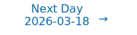

<a href="../../../hot/2026-03-17">Daily AI Hotspots</a>

> This is a remedial run for missed papers from 03/16/2026 to 03/16/2026.
> 
> Results generated on 03/21/2026.

# Personalized Daily ArXiv Papers 2026-03-17

| *[gpt-5.4]*   | Prompt   | Completion   | Total   |
|:-------------:|:--------:|:------------:|:-------:|
| **Token**     | 207618   | 7887         | 215505  |
| **Cost**      | $0.52    | $0.12        | $0.64   |

**Table of contents with paper titles:**

1. [Learning to Recall with Transformers Beyond Orthogonal Embeddings](#user-content-link1)
**Authors:** Nuri Mert Vural, Alberto Bietti, Mahdi Soltanolkotabi, Denny Wu

2. [Mamba-3: Improved Sequence Modeling using State Space Principles](#user-content-link2)
**Authors:** Aakash Lahoti, Kevin Y. Li, Berlin Chen, Caitlin Wang, Aviv Bick, J. Zico Kolter, Tri Dao, Albert Gu

3. [Deep learning and the rate of approximation by flows](#user-content-link3)
**Authors:** Jingpu Cheng, Qianxiao Li, Ting Lin, Zuowei Shen

4. [Lost in Aggregation: On a Fundamental Expressivity Limit of Message-Passing Graph Neural Networks](#user-content-link4)
**Authors:** Eran Rosenbluth

5. [Mixture-of-Depths Attention](#user-content-link5)
**Authors:** Lianghui Zhu, Yuxin Fang, Bencheng Liao, Shijie Wang, Tianheng Cheng, Zilong Huang, Chen Chen, Lai Wei, Yutao Zeng, Ya Wang, Yi Lin, Yu Li, Xinggang Wang

6. [A Family of LLMs Liberated from Static Vocabularies](#user-content-link6)
**Authors:** Aleph Alpha, :, Adnen Abdessaied, Artur Baranowski, Lukas Balles, Michael Barlow, Fabien C. Y. Benureau, Felix Berkenkamp, Lukas Bluebaum, Bastian Boll, Thomas F. Burns, Björn Deiseroth, Constantin Eichenberg, David Friede, Pablo Iyu Guerrero, Ahmed Hammam, Bastian Harren, Johann Higl, Yasser Jadidi, Carina Kauf, Johannes Messner, Jan Hendrik Metzen, Max Meuer, Vedant Nanda, Pit Neitemeier, Koen Oostermeijer, Letitia Parcalabescu, Markus Pernpointner, Felix Reinfurt, Dylan Rodriquez, Grégory Schott, Philipp Siedler, Martin Simonovsky, Till Speicher, Volker Stampa, Stephan Wäldchen, Samuel Weinbach, Gregor Ziegltrum

7. [Local Urysohn Width: A Topological Complexity Measure for Classification](#user-content-link7)
**Authors:** Xin Li

8. [Neural Networks as Local-to-Global Computations](#user-content-link8)
**Authors:** Vicente Bosca, Robert Ghrist

9. [IConE: Batch Independent Collapse Prevention for Self-Supervised Representation Learning](#user-content-link9)
**Authors:** Konstantinos Almpanakis, Anna Kreshuk

10. [Self-Distillation of Hidden Layers for Self-Supervised Representation Learning](#user-content-link10)
**Authors:** Scott C. Lowe, Anthony Fuller, Sageev Oore, Evan Shelhamer, Graham W. Taylor

11. [Grokking as a Variance-Limited Phase Transition: Spectral Gating and the Epsilon-Stability Threshold](#user-content-link11)
**Authors:** Pratyush Acharya, Habish Dhakal

12. [FlashSampling: Fast and Memory-Efficient Exact Sampling](#user-content-link12)
**Authors:** Tomas Ruiz, Zhen Qin, Yifan Zhang, Xuyang Shen, Yiran Zhong, Mengdi Wang

13. [Directional Routing in Transformers](#user-content-link13)
**Authors:** Kevin Taylor

14. [Determinism in the Undetermined: Deterministic Output in Charge-Conserving Continuous-Time Neuromorphic Systems with Temporal Stochasticity](#user-content-link14)
**Authors:** Jing Yan, Kang You, Zhezhi He, Yaoyu Zhang

15. [Thinking in Latents: Adaptive Anchor Refinement for Implicit Reasoning in LLMs](#user-content-link15)
**Authors:** Disha Sheshanarayana, Rajat Subhra Pal, Manjira Sinha, Tirthankar Dasgupta

16. [Gauge-Equivariant Intrinsic Neural Operators for Geometry-Consistent Learning of Elliptic PDE Maps](#user-content-link16)
**Authors:** Pengcheng Cheng

17. [Spiking Layer-Adaptive Magnitude-based Pruning](#user-content-link17)
**Authors:** Junqiao Wang, Zhehang Ye, Yuqi Ouyang

18. [Dataset Distillation Efficiently Encodes Low-Dimensional Representations from Gradient-Based Learning of Non-Linear Tasks](#user-content-link18)
**Authors:** Yuri Kinoshita, Naoki Nishikawa, Taro Toyoizumi

19. [MoLoRA: Composable Specialization via Per-Token Adapter Routing](#user-content-link19)
**Authors:** Shrey Shah, Justin Wagle

20. [Massive Redundancy in Gradient Transport Enables Sparse Online Learning](#user-content-link20)
**Authors:** Aur Shalev Merin

21. [Mostly Text, Smart Visuals: Asymmetric Text-Visual Pruning for Large Vision-Language Models](#user-content-link21)
**Authors:** Sijie Li, Biao Qian, Jungong Han

22. [More Test-Time Compute Can Hurt: Overestimation Bias in LLM Beam Search](#user-content-link22)
**Authors:** Gal Dalal, Assaf Hallak, Gal Chechik, Yftah Ziser

23. [Deriving Hyperparameter Scaling Laws via Modern Optimization Theory](#user-content-link23)
**Authors:** Egor Shulgin, Dimitri von Rütte, Tianyue H. Zhang, Niccolò Ajroldi, Bernhard Schölkopf, Antonio Orvieto

24. [Ablate and Rescue: A Causal Analysis of Residual Stream Hyper-Connections](#user-content-link24)
**Authors:** William Peng, Josheev Rai, Kevin Tseng, Siwei Wang, Sean Wu

25. [Token Coherence: Adapting MESI Cache Protocols to Minimize Synchronization Overhead in Multi-Agent LLM Systems](#user-content-link25)
**Authors:** Vladyslav Parakhin

26. [W2T: LoRA Weights Already Know What They Can Do](#user-content-link26)
**Authors:** Xiaolong Han, Ferrante Neri, Zijian Jiang, Fang Wu, Yanfang Ye, Lu Yin, Zehong Wang

27. [SCAN: Sparse Circuit Anchor Interpretable Neuron for Lifelong Knowledge Editing](#user-content-link27)
**Authors:** Yuhuan Liu, Haitian Zhong, Xinyuan Xia, Qiang Liu, Shu Wu, Liang Wang

28. [Mask Is What DLLM Needs: A Masked Data Training Paradigm for Diffusion LLMs](#user-content-link28)
**Authors:** Linrui Ma, Yufei Cui, Kai Han, Yunhe Wang

29. [Preconditioned One-Step Generative Modeling for Bayesian Inverse Problems in Function Spaces](#user-content-link29)
**Authors:** Zilan Cheng, Li-Lian Wang, Zhongjian Wang

30. [LLM as Graph Kernel: Rethinking Message Passing on Text-Rich Graphs](#user-content-link30)
**Authors:** Ying Zhang, Hang Yu, Haipeng Zhang, Peng Di

31. [Parallelised Differentiable Straightest Geodesics for 3D Meshes](#user-content-link31)
**Authors:** Hippolyte Verninas, Caner Korkmaz, Stefanos Zafeiriou, Tolga Birdal, Simone Foti

32. [Why AI systems don't learn and what to do about it: Lessons on autonomous learning from cognitive science](#user-content-link32)
**Authors:** Emmanuel Dupoux, Yann LeCun, Jitendra Malik

33. [Rethinking Machine Unlearning: Models Designed to Forget via Key Deletion](#user-content-link33)
**Authors:** Sonia Laguna, Jorge da Silva Goncalves, Moritz Vandenhirtz, Alain Ryser, Irene Cannistraci, Julia E. Vogt

34. [Transition Flow Matching](#user-content-link34)
**Authors:** Chenrui Ma

35. [In-Context Symbolic Regression for Robustness-Improved Kolmogorov-Arnold Networks](#user-content-link35)
**Authors:** Francesco Sovrano, Lidia Losavio, Giulia Vilone, Marc Langheinrich

36. [Chain-of-Trajectories: Unlocking the Intrinsic Generative Optimality of Diffusion Models via Graph-Theoretic Planning](#user-content-link36)
**Authors:** Ping Chen, Xiang Liu, Xingpeng Zhang, Fei Shen, Xun Gong, Zhaoxiang Liu, Zezhou Chen, Huan Hu, Kai Wang, Shiguo Lian

37. [Unbiased and Biased Variance-Reduced Forward-Reflected-Backward Splitting Methods for Stochastic Composite Inclusions](#user-content-link37)
**Authors:** Quoc Tran-Dinh, Nghia Nguyen-Trung

38. [Understanding Reasoning in LLMs through Strategic Information Allocation under Uncertainty](#user-content-link38)
**Authors:** Jeonghye Kim, Xufang Luo, Minbeom Kim, Sangmook Lee, Dongsheng Li, Yuqing Yang

39. [PhasorFlow: A Python Library for Unit Circle Based Computing](#user-content-link39)
**Authors:** Dibakar Sigdel, Namuna Panday

40. [Universe Routing: Why Self-Evolving Agents Need Epistemic Control](#user-content-link40)
**Authors:** Zhaohui Geoffrey Wang

41. [Fold-CP: A Context Parallelism Framework for Biomolecular Modeling](#user-content-link41)
**Authors:** Dejun Lin, Simon Chu, Vishanth Iyer, Youhan Lee, John St John, Kevin Boyd, Brian Roland, Xiaowei Ren, Guoqing Zhou, Zhonglin Cao, Polina Binder, Yuliya Zhautouskaya, Jakub Zakrzewski, Maximilian Stadler, Kyle Gion, Yuxing Peng, Xi Chen, Tianjing Zhang, Philipp Junk, Michelle Dimon, Paweł Gniewek, Fabian Ortega, McKinley Polen, Ivan Grubisic, Ali Bashir, Graham Holt, Danny Kovtun, Matthias Grass, Luca Naef, Rui Wang, Jian Peng, Anthony Costa, Saee Paliwal, Eddie Calleja, Timur Rvachov, Neha Tadimeti, Roy Tal, Emine Kucukbenli

42. [Interpretable Classification of Time Series Using Euler Characteristic Surfaces](#user-content-link42)
**Authors:** Salam Rabindrajit Luwang, Sushovan Majhi, Vishal Mandal, Atish J. Mitra, Md. Nurujjaman, Buddha Nath Sharma

43. [Meta-TTRL: A Metacognitive Framework for Self-Improving Test-Time Reinforcement Learning in Unified Multimodal Models](#user-content-link43)
**Authors:** Lit Sin Tan, Junzhe Chen, Xiaolong Fu, Lichen Ma, Junshi Huang, Jianzhong Shi, Yan Li, Lijie Wen

44. [Point-Identification of a Robust Predictor Under Latent Shift with Imperfect Proxies](#user-content-link44)
**Authors:** Zahra Rahiminasab, Reza Soumi, Arto Klami, Samuel Kaski

45. [MONET: Modeling and Optimization of neural NEtwork Training from Edge to Data Centers](#user-content-link45)
**Authors:** Jérémy Morlier, Robin Geens, Stef Cuyckens, Arne Symons, Marian Verhelst, Vincent Gripon, Mathieu Léonardon

46. [AdapterTune: Zero-Initialized Low-Rank Adapters for Frozen Vision Transformers](#user-content-link46)
**Authors:** Salim Khazem

47. [SimCert: Probabilistic Certification for Behavioral Similarity in Deep Neural Network Compression](#user-content-link47)
**Authors:** Jingyang Li, Fu Song, Guoqiang Li

48. [Controlled Langevin Dynamics for Sampling of Feedforward Neural Networks Trained with Minibatches](#user-content-link48)
**Authors:** Alessandro Zambon, Francesca Caruso, Riccardo Zecchina, Guido Tiana

49. [Accelerating Byzantine-Robust Distributed Learning with Compressed Communication via Double Momentum and Variance Reduction](#user-content-link49)
**Authors:** Yanghao Li, Changxin Liu, Yuhao Yi

50. [Mechanistic Origin of Moral Indifference in Language Models](#user-content-link50)
**Authors:** Lingyu Li, Yan Teng, Yingchun Wang

51. [Effective Distillation to Hybrid xLSTM Architectures](#user-content-link51)
**Authors:** Lukas Hauzenberger, Niklas Schmidinger, Thomas Schmied, Anamaria-Roberta Hartl, David Stap, Pieter-Jan Hoedt, Maximilian Beck, Sebastian Böck, Günter Klambauer, Sepp Hochreiter

52. [MobileLLM-Flash: Latency-Guided On-Device LLM Design for Industry Scale](#user-content-link52)
**Authors:** Hanxian Huang, Igor Fedorov, Andrey Gromov, Bernard Beckerman, Naveen Suda, David Eriksson, Maximilian Balandat, Rylan Conway, Patrick Huber, Chinnadhurai Sankar, Ayushi Dalmia, Zechun Liu, Lemeng Wu, Tarek Elgamal, Adithya Sagar, Vikas Chandra, Raghuraman Krishnamoorthi

53. [Selective Memory for Artificial Intelligence: Write-Time Gating with Hierarchical Archiving](#user-content-link53)
**Authors:** Oliver Zahn, Simran Chana

54. [Masked BRep Autoencoder via Hierarchical Graph Transformer](#user-content-link54)
**Authors:** Yifei Li, Kang Wu, Wenming Wu, Xiao-Ming Fu

55. [TabKD: Tabular Knowledge Distillation through Interaction Diversity of Learned Feature Bins](#user-content-link55)
**Authors:** Shovon Niverd Pereira, Krishna Khadka, Yu Lei

56. [Mechanistic Foundations of Goal-Directed Control](#user-content-link56)
**Authors:** Alma Lago

57. [Tackling Over-smoothing on Hypergraphs: A Ricci Flow-guided Neural Diffusion Approach](#user-content-link57)
**Authors:** Mengyao Zhou, Zhiheng Zhou, Xiao Han, Xingqin Qi, Guanghui Wang, Guiying Yan

58. [PrototypeNAS: Rapid Design of Deep Neural Networks for Microcontroller Units](#user-content-link58)
**Authors:** Mark Deutel, Simon Geis, Axel Plinge

59. [Embedding-Aware Feature Discovery: Bridging Latent Representations and Interpretable Features in Event Sequences](#user-content-link59)
**Authors:** Artem Sakhno, Ivan Sergeev, Alexey Shestov, Omar Zoloev, Elizaveta Kovtun, Gleb Gusev, Andrey Savchenko, Maksim Makarenko

60. [CATFormer: When Continual Learning Meets Spiking Transformers With Dynamic Thresholds](#user-content-link60)
**Authors:** Vaishnavi Nagabhushana, Kartikay Agrawal, Ayon Borthakur

61. [100x Cost & Latency Reduction: Performance Analysis of AI Query Approximation using Lightweight Proxy Models](#user-content-link61)
**Authors:** Yeounoh Chung, Rushabh Desai, Jian He, Yu Xiao, Thibaud Hottelier, Yves-Laurent Kom Samo, Pushkar Kadilkar, Xianshun Chen, Sam Idicula, Fatma Özcan, Alon Halevy, Yannis Papakonstantinou

62. [AnoleVLA: Lightweight Vision-Language-Action Model with Deep State Space Models for Mobile Manipulation](#user-content-link62)
**Authors:** Yusuke Takagi, Motonari Kambara, Daichi Yashima, Koki Seno, Kento Tokura, Komei Sugiura

---

## 1. [Learning to Recall with Transformers Beyond Orthogonal Embeddings](https://arxiv.org/abs/2603.15923) 

**ArXiv ID:** 2603.15923

**Authors:** Nuri Mert Vural, Alberto Bietti, Mahdi Soltanolkotabi, Denny Wu

**Abstract:** Modern large language models (LLMs) excel at tasks that require storing and retrieving knowledge, such as factual recall and question answering. Transformers are central to this capability because they can encode information during training and retrieve it at inference. Existing theoretical analyses typically study transformers under idealized assumptions such as infinite data or orthogonal embeddings. In realistic settings, however, models are trained on finite datasets with non-orthogonal (random) embeddings. We address this gap by analyzing a single-layer transformer with random embeddings trained with (empirical) gradient descent on a simple token-retrieval task, where the model must identify an informative token within a length-$L$ sequence and learn a one-to-one mapping from tokens to labels. Our analysis tracks the ``early phase'' of gradient descent and yields explicit formulas for the model's storage capacity -- revealing a multiplicative dependence between sample size $N$, embedding dimension $d$, and sequence length $L$. We validate these scalings numerically and further complement them with a lower bound for the underlying statistical problem, demonstrating that this multiplicative scaling is intrinsic under non-orthogonal embeddings.

**Comment:** Transformer theory under finite data and non-orthogonal embeddings, yielding explicit storage-capacity scalings.

**Relevance:** 10
**Novelty:** 9

---

## 2. [Mamba-3: Improved Sequence Modeling using State Space Principles](https://arxiv.org/abs/2603.15569) 

**ArXiv ID:** 2603.15569

**Authors:** Aakash Lahoti, Kevin Y. Li, Berlin Chen, Caitlin Wang, Aviv Bick, J. Zico Kolter, Tri Dao, Albert Gu

**Abstract:** Scaling inference-time compute has emerged as an important driver of LLM performance, making inference efficiency a central focus of model design alongside model quality. While the current Transformer-based models deliver strong model quality, their quadratic compute and linear memory make inference expensive. This has spurred the development of sub-quadratic models with reduced linear compute and constant memory requirements. However, many recent linear models trade off model quality and capability for algorithmic efficiency, failing on tasks such as state tracking. Moreover, their theoretically linear inference remains hardware-inefficient in practice. Guided by an inference-first perspective, we introduce three core methodological improvements inspired by the state space model (SSM) viewpoint of linear models. We combine: (1) a more expressive recurrence derived from SSM discretization, (2) a complex-valued state update rule that enables richer state tracking, and (3) a multi-input, multi-output (MIMO) formulation for better model performance without increasing decode latency. Together with architectural refinements, our Mamba-3 model achieves significant gains across retrieval, state-tracking, and downstream language modeling tasks. At the 1.5B scale, Mamba-3 improves average downstream accuracy by 0.6 percentage points compared to the next best model (Gated DeltaNet), with Mamba-3's MIMO variant further improving accuracy by another 1.2 points for a total 1.8 point gain. Across state-size experiments, Mamba-3 achieves comparable perplexity to Mamba-2 despite using half of its predecessor's state size. Our evaluations demonstrate Mamba-3's ability to advance the performance-efficiency Pareto frontier.

**Comment:** State-space sequence architecture with complex recurrence and MIMO design improving the performance-efficiency frontier.

**Relevance:** 10
**Novelty:** 9

---

## 3. [Deep learning and the rate of approximation by flows](https://arxiv.org/abs/2603.15363) 

**ArXiv ID:** 2603.15363

**Authors:** Jingpu Cheng, Qianxiao Li, Ting Lin, Zuowei Shen

**Abstract:** We investigate the dependence of the approximation capacity of deep residual networks on its depth in a continuous dynamical systems setting. This can be formulated as the general problem of quantifying the minimal time-horizon required to approximate a diffeomorphism by flows driven by a given family $\mathcal F$ of vector fields. We show that this minimal time can be identified as a geodesic distance on a sub-Finsler manifold of diffeomorphisms, where the local geometry is characterised by a variational principle involving $\mathcal F$. This connects the learning efficiency of target relationships to their compatibility with the learning architectural choice. Further, the results suggest that the key approximation mechanism in deep learning, namely the approximation of functions by composition or dynamics, differs in a fundamental way from linear approximation theory, where linear spaces and norm-based rate estimates are replaced by manifolds and geodesic distances.

**Comment:** Gives a theoretical characterization of deep residual network approximation via geodesic distance on a sub-Finsler manifold of diffeomorphisms.

**Relevance:** 10
**Novelty:** 9

---

## 4. [Lost in Aggregation: On a Fundamental Expressivity Limit of Message-Passing Graph Neural Networks](https://arxiv.org/abs/2603.14846) 

**ArXiv ID:** 2603.14846

**Authors:** Eran Rosenbluth

**Abstract:** We define a generic class of functions that captures most conceivable aggregations for Message-Passing Graph Neural Networks (MP-GNNs), and prove that any MP-GNN model with such aggregations induces only a polynomial number of equivalence classes on all graphs - while the number of non-isomorphic graphs is doubly-exponential (in number of vertices). Adding a familiar perspective, we observe that merely 2-iterations of Color Refinement (CR) induce at least an exponential number of equivalence classes, making the aforementioned MP-GNNs relatively infinitely weaker. Previous results state that MP-GNNs match full CR, however they concern a weak, 'non-uniform', notion of distinguishing-power where each graph size may required a different MP-GNN to distinguish graphs up to that size. Our results concern both distinguishing between non-equivariant vertices and distinguishing between non-isomorphic graphs.

**Comment:** Proves a fundamental expressivity limit of message-passing GNNs under generic aggregation, separating them sharply from graph isomorphism procedures.

**Relevance:** 10
**Novelty:** 9

---

## 5. [Mixture-of-Depths Attention](https://arxiv.org/abs/2603.15619) 

**ArXiv ID:** 2603.15619

**Authors:** Lianghui Zhu, Yuxin Fang, Bencheng Liao, Shijie Wang, Tianheng Cheng, Zilong Huang, Chen Chen, Lai Wei, Yutao Zeng, Ya Wang, Yi Lin, Yu Li, Xinggang Wang

**Abstract:** Scaling depth is a key driver for large language models (LLMs). Yet, as LLMs become deeper, they often suffer from signal degradation: informative features formed in shallow layers are gradually diluted by repeated residual updates, making them harder to recover in deeper layers. We introduce mixture-of-depths attention (MoDA), a mechanism that allows each attention head to attend to sequence KV pairs at the current layer and depth KV pairs from preceding layers. We further describe a hardware-efficient algorithm for MoDA that resolves non-contiguous memory-access patterns, achieving 97.3% of FlashAttention-2's efficiency at a sequence length of 64K. Experiments on 1.5B-parameter models demonstrate that MoDA consistently outperforms strong baselines. Notably, it improves average perplexity by 0.2 across 10 validation benchmarks and increases average performance by 2.11% on 10 downstream tasks, with a negligible 3.7% FLOPs computational overhead. We also find that combining MoDA with post-norm yields better performance than using it with pre-norm. These results suggest that MoDA is a promising primitive for depth scaling. Code is released at https://github.com/hustvl/MoDA .

**Comment:** Introduces a new transformer attention primitive that mixes current-layer and cross-layer KV access, with an accompanying hardware-efficient algorithm nearly matching FlashAttention-2 efficiency.

**Relevance:** 10
**Novelty:** 8

---

## 6. [A Family of LLMs Liberated from Static Vocabularies](https://arxiv.org/abs/2603.15953) 

**ArXiv ID:** 2603.15953

**Authors:** Aleph Alpha, :, Adnen Abdessaied, Artur Baranowski, Lukas Balles, Michael Barlow, Fabien C. Y. Benureau, Felix Berkenkamp, Lukas Bluebaum, Bastian Boll, Thomas F. Burns, Björn Deiseroth, Constantin Eichenberg, David Friede, Pablo Iyu Guerrero, Ahmed Hammam, Bastian Harren, Johann Higl, Yasser Jadidi, Carina Kauf, Johannes Messner, Jan Hendrik Metzen, Max Meuer, Vedant Nanda, Pit Neitemeier, Koen Oostermeijer, Letitia Parcalabescu, Markus Pernpointner, Felix Reinfurt, Dylan Rodriquez, Grégory Schott, Philipp Siedler, Martin Simonovsky, Till Speicher, Volker Stampa, Stephan Wäldchen, Samuel Weinbach, Gregor Ziegltrum

**Abstract:** Tokenization is a central component of natural language processing in current large language models (LLMs), enabling models to convert raw text into processable units. Although learned tokenizers are widely adopted, they exhibit notable limitations, including their large, fixed vocabulary sizes and poor adaptability to new domains or languages. We present a family of models with up to 70 billion parameters based on the hierarchical autoregressive transformer (HAT) architecture. In HAT, an encoder transformer aggregates bytes into word embeddings and then feeds them to the backbone, a classical autoregressive transformer. The outputs of the backbone are then cross-attended by the decoder and converted back into bytes. We show that we can reuse available pre-trained models by converting the Llama 3.1 8B and 70B models into the HAT architecture: Llama-3.1-8B-TFree-HAT and Llama-3.1-70B-TFree-HAT are byte-level models whose encoder and decoder are trained from scratch, but where we adapt the pre-trained Llama backbone, i.e., the transformer blocks with the embedding matrix and head removed, to handle word embeddings instead of the original tokens. We also provide a 7B HAT model, Llama-TFree-HAT-Pretrained, trained entirely from scratch on nearly 4 trillion words. The HAT architecture improves text compression by reducing the number of required sequence positions and enhances robustness to intra-word variations, e.g., spelling differences. Through pre-training, as well as subsequent supervised fine-tuning and direct preference optimization in English and German, we show strong proficiency in both languages, improving on the original Llama 3.1 in most benchmarks. We release our models (including 200 pre-training checkpoints) on Hugging Face.

**Comment:** Core transformer architecture redesign replacing static token vocabularies with hierarchical byte-level encoding/decoding.

**Relevance:** 9
**Novelty:** 9

---

## 7. [Local Urysohn Width: A Topological Complexity Measure for Classification](https://arxiv.org/abs/2603.15412) 

**ArXiv ID:** 2603.15412

**Authors:** Xin Li

**Abstract:** We introduce \emph{local Urysohn width}, a complexity measure for classification problems on metric spaces. Unlike VC dimension, fat-shattering dimension, and Rademacher complexity, which characterize the richness of hypothesis \emph{classes}, Urysohn width characterizes the topological-geometric complexity of the classification \emph{problem itself}: the minimum number of connected, diameter-bounded local experts needed to correctly classify all points within a margin-safe region. We prove four main results. First, a \textbf{strict hierarchy theorem}: for every integer $w \geq 1$, there exists a classification problem on a \emph{connected} compact metric space (a bouquet of circles with first Betti number $β_1 = w$) whose Urysohn width is exactly~$w$, establishing that topological complexity of the input space forces classifier complexity. Second, a \textbf{topology $\times$ geometry scaling law}: width scales as $Ω(w \cdot L/D_0)$, where $w$ counts independent loops and $L/D_0$ is the ratio of loop circumference to locality scale. Third, a \textbf{two-way separation from VC dimension}: there exist problem families where width grows unboundedly while VC dimension is bounded by a constant, and conversely, families where VC dimension grows unboundedly while width remains~1. Fourth, a \textbf{sample complexity lower bound}: any learner that must correctly classify all points in the safe region of a width-$w$ problem needs $Ω(w \log w)$ samples, independent of VC dimension.

**Comment:** Develops a new theoretical complexity measure for classification based on local Urysohn width, with hierarchy and sample-complexity results.

**Relevance:** 9
**Novelty:** 9

---

## 8. [Neural Networks as Local-to-Global Computations](https://arxiv.org/abs/2603.14831) 

**ArXiv ID:** 2603.14831

**Authors:** Vicente Bosca, Robert Ghrist

**Abstract:** We construct a cellular sheaf from any feedforward ReLU neural network by placing one vertex for each intermediate quantity in the forward pass and encoding each computational step - affine transformation, activation, output - as a restriction map on an edge. The restricted coboundary operator on the free coordinates is unitriangular, so its determinant is $1$ and the restricted Laplacian is positive definite for every activation pattern. It follows that the relative cohomology vanishes and the forward pass output is the unique harmonic extension of the boundary data. The sheaf heat equation converges exponentially to this output despite the state-dependent switching introduced by piecewise linear activations. Unlike the forward pass, the heat equation propagates information bidirectionally across layers, enabling pinned neurons that impose constraints in both directions, training through local discrepancy minimization without a backward pass, and per-edge diagnostics that decompose network behavior by layer and operation type. We validate the framework experimentally on small synthetic tasks, confirming the convergence theorems and demonstrating that sheaf-based training, while not yet competitive with stochastic gradient descent, obeys quantitative scaling laws predicted by the theory.

**Comment:** Reinterprets feedforward ReLU networks as local-to-global sheaf computations with harmonic extension and bidirectional heat-equation dynamics.

**Relevance:** 9
**Novelty:** 9

---

## 9. [IConE: Batch Independent Collapse Prevention for Self-Supervised Representation Learning](https://arxiv.org/abs/2603.15263) 

**ArXiv ID:** 2603.15263

**Authors:** Konstantinos Almpanakis, Anna Kreshuk

**Abstract:** Self-supervised learning (SSL) has revolutionized representation learning, with Joint-Embedding Architectures (JEAs) emerging as an effective approach for capturing semantic features. Existing JEAs rely on implicit or explicit batch interaction -- via negative sampling or statistical regularization -- to prevent representation collapse. This reliance becomes problematic in regimes where batch sizes must be small, such as high-dimensional scientific data, where memory constraints and class imbalance make large, well-balanced batches infeasible. We introduce IConE (Instance-Contrasted Embeddings), a framework that decouples collapse prevention from the training batch size. Rather than enforcing diversity through batch statistics, IConE maintains a global set of learnable auxiliary instance embeddings regularized by an explicit diversity objective. This transfers the anti-collapse mechanism from the transient batch to a dataset-level embedding space, allowing stable training even when batch statistics are unreliable, down to batch size 1. Across diverse 2D and 3D biomedical modalities, IConE outperforms strong contrastive and non-contrastive baselines throughout the small-batch regime (from B=1 to B=64) and demonstrates marked robustness to severe class imbalance. Geometric analysis shows that IConE preserves high intrinsic dimensionality in the learned representations, preventing the collapse observed in existing JEAs as batch sizes shrink.

**Comment:** Batch-independent collapse prevention for self-supervised representation learning via dataset-level auxiliary embeddings.

**Relevance:** 9
**Novelty:** 8

---

## 10. [Self-Distillation of Hidden Layers for Self-Supervised Representation Learning](https://arxiv.org/abs/2603.15553) 

**ArXiv ID:** 2603.15553

**Authors:** Scott C. Lowe, Anthony Fuller, Sageev Oore, Evan Shelhamer, Graham W. Taylor

**Abstract:** The landscape of self-supervised learning (SSL) is currently dominated by generative approaches (e.g., MAE) that reconstruct raw low-level data, and predictive approaches (e.g., I-JEPA) that predict high-level abstract embeddings. While generative methods provide strong grounding, they are computationally inefficient for high-redundancy modalities like imagery, and their training objective does not prioritize learning high-level, conceptual features. Conversely, predictive methods often suffer from training instability due to their reliance on the non-stationary targets of final-layer self-distillation. We introduce Bootleg, a method that bridges this divide by tasking the model with predicting latent representations from multiple hidden layers of a teacher network. This hierarchical objective forces the model to capture features at varying levels of abstraction simultaneously. We demonstrate that Bootleg significantly outperforms comparable baselines (+10% over I-JEPA) on classification of ImageNet-1K and iNaturalist-21, and semantic segmentation of ADE20K and Cityscapes.

**Comment:** Self-supervised representation learning through hidden-layer self-distillation instead of only final-layer targets.

**Relevance:** 9
**Novelty:** 8

---

## 11. [Grokking as a Variance-Limited Phase Transition: Spectral Gating and the Epsilon-Stability Threshold](https://arxiv.org/abs/2603.15492) 

**ArXiv ID:** 2603.15492

**Authors:** Pratyush Acharya, Habish Dhakal

**Abstract:** Standard optimization theories struggle to explain grokking, where generalization occurs long after training convergence. While geometric studies attribute this to slow drift, they often overlook the interaction between the optimizer's noise structure and landscape curvature. This work analyzes AdamW dynamics on modular arithmetic tasks, revealing a ``Spectral Gating'' mechanism that regulates the transition from memorization to generalization. We find that AdamW operates as a variance-gated stochastic system. Grokking is constrained by a stability condition: the generalizing solution resides in a sharp basin ($λ_{max}^H$) initially inaccessible under low-variance regimes. The ``delayed'' phase represents the accumulation of gradient variance required to lift the effective stability ceiling, permitting entry into this sharp manifold. Our ablation studies identify three complexity regimes: (1) \textbf{Capacity Collapse} ($P < 23$), where rank-deficiency prevents structural learning; (2) \textbf{The Variance-Limited Regime} ($P \approx 41$), where generalization waits for the spectral gate to open; and (3) \textbf{Stability Override} ($P > 67$), where memorization becomes dimensionally unstable. Furthermore, we challenge the "Flat Minima" hypothesis for algorithmic tasks, showing that isotropic noise injection fails to induce grokking. Generalization requires the \textit{anisotropic rectification} unique to adaptive optimizers, which directs noise into the tangent space of the solution manifold.

**Comment:** Training-dynamics theory of grokking as a variance-limited phase transition governed by optimizer-induced spectral gating.

**Relevance:** 9
**Novelty:** 8

---

## 12. [FlashSampling: Fast and Memory-Efficient Exact Sampling](https://arxiv.org/abs/2603.15854) 

**ArXiv ID:** 2603.15854

**Authors:** Tomas Ruiz, Zhen Qin, Yifan Zhang, Xuyang Shen, Yiran Zhong, Mengdi Wang

**Abstract:** Sampling from a categorical distribution is mathematically simple, but in large-vocabulary decoding, it often triggers extra memory traffic and extra kernels after the LM head. We present FlashSampling, an exact sampling primitive that fuses sampling into the LM-head matmul and never materializes the logits tensor in HBM. The method is simple: compute logits tile-by-tile on chip, add Gumbel noise, keep only one maximizer per row and per vocabulary tile, and finish with a small reduction over tiles. The fused tiled kernel is exact because $\argmax$ decomposes over a partition; grouped variants for online and tensor-parallel settings are exact by hierarchical factorization of the categorical distribution. Across H100, H200, B200, and B300 GPUs, FlashSampling speeds up kernel-level decode workloads, and in end-to-end vLLM experiments, it reduces time per output token by up to $19%$ on the models we test. These results show that exact sampling, with no approximation, can be integrated into the matmul itself, turning a bandwidth-bound postprocessing step into a lightweight epilogue. Project Page: https://github.com/FlashSampling/FlashSampling.

**Comment:** Presents an exact systems-level decoding primitive that fuses categorical sampling into the LM-head matmul to eliminate logits materialization and reduce memory traffic.

**Relevance:** 9
**Novelty:** 8

---

## 13. [Directional Routing in Transformers](https://arxiv.org/abs/2603.14923) 

**ArXiv ID:** 2603.14923

**Authors:** Kevin Taylor

**Abstract:** We introduce directional routing, a lightweight mechanism that gives each transformer attention head learned suppression directions controlled by a shared router, at 3.9% parameter cost. We train a 433M-parameter model alongside an identical baseline in a single run, then trace the resulting circuits through mechanistic interpretability. Routing becomes the model's dominant computational pathway. Disabling it collapses factual recall to near-zero probability across all 8 test prompts and drops induction accuracy from 93.4% to 0.0%. Knocking out individual attention heads has negligible effect: the primary mover head's removal actually increases target probability, and induction heads retain 98.6% accuracy without their strongest member. The coordination mechanism is irreplaceable; the components it coordinates are not. The model also self-organizes, without explicit pressure, into two regimes: domain-adaptive routing in early layers and fixed syntactic pruning in late layers, where the least-varying layer is the most critical (+42.6 PPL when disabled). Routing reduces perplexity 31-56% relative to the baseline, though downstream multiple-choice benchmarks do not yet reflect these gains.

**Comment:** Proposes a lightweight transformer routing mechanism where attention heads use learned suppression directions controlled by a shared router, yielding a core architectural change analyzed mechanistically.

**Relevance:** 9
**Novelty:** 8

---

## 14. [Determinism in the Undetermined: Deterministic Output in Charge-Conserving Continuous-Time Neuromorphic Systems with Temporal Stochasticity](https://arxiv.org/abs/2603.15987) 

**ArXiv ID:** 2603.15987

**Authors:** Jing Yan, Kang You, Zhezhi He, Yaoyu Zhang

**Abstract:** Achieving deterministic computation results in asynchronous neuromorphic systems remains a fundamental challenge due to the inherent temporal stochasticity of continuous-time hardware. To address this, we develop a unified continuous-time framework for spiking neural networks (SNNs) that couples the Law of Charge Conservation with minimal neuron-level constraints. This integration ensures that the terminal state depends solely on the aggregate input charge, providing a unique cumulated output invariant to temporal stochasticity. We prove that this mapping is strictly invariant to spike timing in acyclic networks, whereas recurrent connectivity can introduce temporal sensitivity. Furthermore, we establish an exact representational correspondence between these charge-conserving SNNs and quantized artificial neural networks, bridging the gap between static deep learning and event-driven dynamics without approximation errors. These results establish a rigorous theoretical basis for designing continuous-time neuromorphic systems that harness the efficiency of asynchronous processing while maintaining algorithmic determinism.

**Comment:** Provides a theoretical foundation for charge-conserving continuous-time SNNs, proving spike-timing-invariant computation and exact correspondence to quantized ANNs.

**Relevance:** 9
**Novelty:** 8

---

## 15. [Thinking in Latents: Adaptive Anchor Refinement for Implicit Reasoning in LLMs](https://arxiv.org/abs/2603.15051) 

**ArXiv ID:** 2603.15051

**Authors:** Disha Sheshanarayana, Rajat Subhra Pal, Manjira Sinha, Tirthankar Dasgupta

**Abstract:** Token-level Chain-of-Thought (CoT) prompting has become a standard way to elicit multi-step reasoning in large language models (LLMs), especially for mathematical word problems. However, generating long intermediate traces increases output length and inference cost, and can be inefficient when the model could arrive at the correct answer without extensive verbalization. This has motivated latent-space reasoning approaches that shift computation into hidden representations and only emit a final answer. Yet, many latent reasoning methods depend on a fixed number of latent refinement steps at inference, adding another hyperparameter that must be tuned across models and datasets to balance accuracy and efficiency. We introduce AdaAnchor, a latent reasoning framework that performs silent iterative computation by refining a set of latent anchor vectors attached to the input. AdaAnchor further incorporates an adaptive halting mechanism that monitors anchor stability across iterations and terminates refinement once the anchor dynamics converge, allocating fewer steps to easier instances while reserving additional refinement steps for harder ones under a shared maximum-step budget. Our empirical evaluation across three mathematical word-problem benchmarks shows that AdaAnchor with adaptive halting yields accuracy gains of up to 5% over fixed-step latent refinement while reducing average latent refinement steps by 48-60% under the same maximum-step budget. Compared to standard reasoning baselines, AdaAnchor achieves large reductions in generated tokens (92-93%) by moving computation into silent latent refinement, offering a different accuracy-efficiency trade-off with substantially lower output-token usage.

**Comment:** Introduces adaptive latent-space reasoning with dynamic halting, a core architectural efficiency idea for implicit reasoning in LLMs.

**Relevance:** 9
**Novelty:** 8

---

## 16. [Gauge-Equivariant Intrinsic Neural Operators for Geometry-Consistent Learning of Elliptic PDE Maps](https://arxiv.org/abs/2603.14734) 

**ArXiv ID:** 2603.14734

**Authors:** Pengcheng Cheng

**Abstract:** Learning solution operators of partial differential equations (PDEs) from data has emerged as a promising route to fast surrogate models in multi-query scientific workflows. However, for geometric PDEs whose inputs and outputs transform under changes of local frame (gauge), many existing operator-learning architectures remain representation-dependent, brittle under metric perturbations, and sensitive to discretization changes. We propose Gauge-Equivariant Intrinsic Neural Operators (GINO), a class of neural operators that parameterize elliptic solution maps primarily through intrinsic spectral multipliers acting on geometry-dependent spectra, coupled with gauge-equivariant nonlinearities. This design decouples geometry from learnable functional dependence and enforces consistency under frame transformations. We validate GINO on controlled problems on the flat torus ($\mathbb{T}^2$), where ground-truth resolvent operators and regularized Helmholtz--Hodge decompositions admit closed-form Fourier representations, enabling theory-aligned diagnostics. Across experiments E1--E6, GINO achieves low operator-approximation error, near machine-precision gauge equivariance, robustness to structured metric perturbations, strong cross-resolution generalization with small commutation error under restriction/prolongation, and structure-preserving performance on a regularized exact/coexact decomposition task. Ablations further link the smoothness of the learned spectral multiplier to stability under geometric perturbations. These results suggest that enforcing intrinsic structure and gauge equivariance yields operator surrogates that are more geometry-consistent and discretization-robust for elliptic PDEs on form-valued fields.

**Comment:** Presents gauge-equivariant intrinsic neural operators, a core operator-learning architecture with strong geometry-consistency guarantees.

**Relevance:** 9
**Novelty:** 8

---

## 17. [Spiking Layer-Adaptive Magnitude-based Pruning](https://arxiv.org/abs/2603.14946) 

**ArXiv ID:** 2603.14946

**Authors:** Junqiao Wang, Zhehang Ye, Yuqi Ouyang

**Abstract:** Spiking Neural Networks (SNNs) provide energy-efficient computation but their deployment is constrained by dense connectivity and high spiking operation costs. Existing magnitude-based pruning strategies, when naively applied to SNNs, fail to account for temporal accumulation, non-uniform timestep contributions, and membrane stability, often leading to severe performance degradation. This paper proposes Spiking Layer-Adaptive Magnitude-based Pruning (SLAMP), a theory-guided pruning framework that generalizes layer-adaptive magnitude pruning to temporal SNNs by explicitly controlling worst-case output distortion across layers and timesteps. SLAMP formulates sparsity allocation as a temporal distortion-constrained optimization problem, yielding time-aware layer importance scores that reduce to conventional layer-adaptive pruning in single-timestep limit. An efficient two-stage procedure is derived, combining temporal score estimation, global sparsity allocation, and magnitude pruning with retraining for stability recovery. Experiments on CIFAR10, CIFAR100, and the event-based CIFAR10-DVS datasets demonstrate that SLAMP achieves substantial connectivity and spiking operation reductions while preserving accuracy, enabling efficient and deployable SNN inference.

**Comment:** Introduces a theory-guided pruning framework for temporal SNNs with time-aware layer importance and distortion-constrained sparsity allocation.

**Relevance:** 9
**Novelty:** 8

---

## 18. [Dataset Distillation Efficiently Encodes Low-Dimensional Representations from Gradient-Based Learning of Non-Linear Tasks](https://arxiv.org/abs/2603.14830) 

**ArXiv ID:** 2603.14830

**Authors:** Yuri Kinoshita, Naoki Nishikawa, Taro Toyoizumi

**Abstract:** Dataset distillation, a training-aware data compression technique, has recently attracted increasing attention as an effective tool for mitigating costs of optimization and data storage. However, progress remains largely empirical. Mechanisms underlying the extraction of task-relevant information from the training process and the efficient encoding of such information into synthetic data points remain elusive. In this paper, we theoretically analyze practical algorithms of dataset distillation applied to the gradient-based training of two-layer neural networks with width $L$. By focusing on a non-linear task structure called multi-index model, we prove that the low-dimensional structure of the problem is efficiently encoded into the resulting distilled data. This dataset reproduces a model with high generalization ability for a required memory complexity of $\tildeΘ$$(r^2d+L)$, where $d$ and $r$ are the input and intrinsic dimensions of the task. To the best of our knowledge, this is one of the first theoretical works that include a specific task structure, leverage its intrinsic dimensionality to quantify the compression rate and study dataset distillation implemented solely via gradient-based algorithms.

**Comment:** Provides theory for dataset distillation showing efficient encoding of low-dimensional task structure under gradient-based training of neural networks.

**Relevance:** 9
**Novelty:** 8

---

## 19. [MoLoRA: Composable Specialization via Per-Token Adapter Routing](https://arxiv.org/abs/2603.15965) 

**ArXiv ID:** 2603.15965

**Authors:** Shrey Shah, Justin Wagle

**Abstract:** Multi-adapter serving systems route entire sequences to a single adapter, forcing a choice when requests span multiple domains. This assumption fails in two important settings: (1) multimodal generation, where text and image tokens require different adapters within the same sequence, and (2) mixed-capability requests like "write code to solve this equation," which need expertise from multiple specialized adapters. We introduce per-token routing, which routes individual tokens to adapters based on either vocabulary structure (for multimodal models) or learned gating (for semantic specialization). Per-token routing is provably optimal, achieving work N for N tokens versus K \cdot N for per-sequence routing with K adapter types. Our key contribution is MoLoRA (Mixture of LoRA), which enables composable specialization: load multiple domain-specific adapters and let a learned router select the appropriate adapter per-token. We demonstrate that specialization dramatically beats scale: MoLoRA enables Qwen3-1.7B to exceed Qwen3-8B across four reasoning benchmarks while being 4.7x smaller. This enables modular expertise at inference time: train focused LoRAs independently, combine them without retraining, and add new capabilities by simply loading new adapters.

**Comment:** Model architecture: per-token adapter routing with Mixture-of-LoRA enables composable specialization within a single sequence.

**Relevance:** 9
**Novelty:** 8

---

## 20. [Massive Redundancy in Gradient Transport Enables Sparse Online Learning](https://arxiv.org/abs/2603.15195) 

**ArXiv ID:** 2603.15195

**Authors:** Aur Shalev Merin

**Abstract:** Real-time recurrent learning (RTRL) computes exact online gradients by propagating a Jacobian tensor forward through recurrent dynamics, but at O(n^4) cost per step. Prior work has sought structured approximations (rank-1 compression, graph-based sparsity, Kronecker factorization). We show that, in the continuous error signal regime, the recurrent Jacobian is massively redundant:propagating through a random 6% of paths (k=4 of n=64) recovers 84 +/- 6% of full RTRL's adaptation ability across five seeds, and the absolute count k=4 remains effective from n=64 to n=256 (6% to 1.6%, recovery 84 to 78%), meaning sparse RTRL becomes relatively cheaper as networks grow. In RNNs, the recovery is selection-invariant (even adversarial path selection works) and exhibits a step-function transition from zero to any nonzero propagation. Spectral analysis reveals the mechanism: the Jacobian is full-rank but near-isotropic (condition numbers 2.6-6.5), so any random subset provides a directionally representative gradient estimate. On chaotic dynamics (Lorenz attractor), sparse propagation is more numerically stable than full RTRL (CV 13% vs. 88%), as subsampling avoids amplifying pathological spectral modes. The redundancy extends to LSTMs (k=4 matches full RTRL) and to transformers via sparse gradient transport (50% head sparsity outperforms the dense reference; 33% is borderline), with higher thresholds reflecting head specialization rather than isotropy. On real primate neural data, sparse RTRL (k=4) adapts online to cross-session electrode drift (80 +/- 11% recovery, 5 seeds), where sparse propagation is again more stable than full RTRL. Without continuous error signal, Jacobian propagation accumulates numerical drift and degrades all RTRL variants, a scope condition for all forward-mode methods. Results hold with SGD (92 +/- 1% recovery), suggesting independence from optimizer choice.

**Comment:** Shows strong redundancy in online gradient transport and proposes sparse propagation schemes that retain most adaptation ability, a foundational efficiency result for recurrent and transformer training dynamics.

**Relevance:** 8
**Novelty:** 9

---

## 21. [Mostly Text, Smart Visuals: Asymmetric Text-Visual Pruning for Large Vision-Language Models](https://arxiv.org/abs/2603.16001) 

**ArXiv ID:** 2603.16001

**Authors:** Sijie Li, Biao Qian, Jungong Han

**Abstract:** Network pruning is an effective technique for enabling lightweight Large Vision-Language Models (LVLMs), which primarily incorporates both weights and activations into the importance metric. However, existing efforts typically process calibration data from different modalities in a unified manner, overlooking modality-specific behaviors. This raises a critical challenge: how to address the divergent behaviors of textual and visual tokens for accurate pruning of LVLMs. To this end, we systematically investigate the sensitivity of visual and textual tokens to the pruning operation by decoupling their corresponding weights, revealing that: (i) the textual pathway should be calibrated via text tokens, since it exhibits higher sensitivity than the visual pathway; (ii) the visual pathway exhibits high redundancy, permitting even 50% sparsity. Motivated by these insights, we propose a simple yet effective Asymmetric Text-Visual Weight Pruning method for LVLMs, dubbed ATV-Pruning, which establishes the importance metric for accurate weight pruning by selecting the informative tokens from both textual and visual pathways. Specifically, ATV-Pruning integrates two primary innovations: first, a calibration pool is adaptively constructed by drawing on all textual tokens and a subset of visual tokens; second, we devise a layer-adaptive selection strategy to yield important visual tokens. Finally, extensive experiments across standard multimodal benchmarks verify the superiority of our ATV-Pruning over state-of-the-art methods.

**Comment:** Model compression: asymmetric text-visual pruning for LVLMs based on modality-specific sensitivity analysis and adaptive token calibration.

**Relevance:** 9
**Novelty:** 7

---

## 22. [More Test-Time Compute Can Hurt: Overestimation Bias in LLM Beam Search](https://arxiv.org/abs/2603.15377) 

**ArXiv ID:** 2603.15377

**Authors:** Gal Dalal, Assaf Hallak, Gal Chechik, Yftah Ziser

**Abstract:** Wider beam search should improve LLM reasoning, but when should you stop widening? Prior work on beam width selection has focused on inference efficiency \citep{qin2025dsbd, freitag2017beam}, without analyzing whether wider search can \emph{hurt} output quality. We present an analysis, grounded in Extreme Value Theory, that answers this question. Beam selection over noisy scorer outputs introduces a systematic overestimation bias that grows with the candidate pool size, and we derive a maximum useful beam width $\hat{k}$ beyond which search degrades performance. This critical width depends on the signal-to-noise ratio of the scorer: $\hat{k}$ grows exponentially with $(Δ/σ)^2$, where $Δ> 0$ is the quality advantage of correct paths over incorrect ones and $σ$ is the scorer noise. We validate this theory by comparing perplexity-guided and PRM-guided beam search across three 7B-parameter models and ten domains on MR-BEN (5,975 questions). Perplexity scoring, with its high noise, yields $\hat{k} = 1$: search provides no benefit at any width tested. PRM scoring, with lower noise, yields $\hat{k} \geq 4$, with gains of up to 8.9 percentage points. The same model, the same algorithm, but different scorers place $\hat{k}$ at opposite ends of the beam width range. Our analysis identifies the scorer's signal-to-noise ratio as the key quantity governing beam width selection, and we propose diagnostic indicators for choosing the beam width in practice.

**Comment:** Theoretical analysis of beam search overestimation bias with explicit critical-width scaling laws for LLM inference.

**Relevance:** 8
**Novelty:** 8

---

## 23. [Deriving Hyperparameter Scaling Laws via Modern Optimization Theory](https://arxiv.org/abs/2603.15958) 

**ArXiv ID:** 2603.15958

**Authors:** Egor Shulgin, Dimitri von Rütte, Tianyue H. Zhang, Niccolò Ajroldi, Bernhard Schölkopf, Antonio Orvieto

**Abstract:** Hyperparameter transfer has become an important component of modern large-scale training recipes. Existing methods, such as muP, primarily focus on transfer between model sizes, with transfer across batch sizes and training horizons often relying on empirical scaling rules informed by insights from timescale preservation, quadratic proxies, and continuous-time approximations. We study hyperparameter scaling laws for modern first-order optimizers through the lens of recent convergence bounds for methods based on the Linear Minimization Oracle (LMO), a framework that includes normalized SGD, signSGD (approximating Adam), and Muon. Treating bounds in recent literature as a proxy and minimizing them across different tuning regimes yields closed-form power-law schedules for learning rate, momentum, and batch size as functions of the iteration or token budget. Our analysis, holding model size fixed, recovers most insights and observations from the literature under a unified and principled perspective, with clear directions open for future research. Our results draw particular attention to the interaction between momentum and batch-size scaling, suggesting that optimal performance may be achieved with several scaling strategies.

**Comment:** Optimization-theoretic derivation of hyperparameter scaling laws for learning rate, momentum, and batch size.

**Relevance:** 8
**Novelty:** 8

---

## 24. [Ablate and Rescue: A Causal Analysis of Residual Stream Hyper-Connections](https://arxiv.org/abs/2603.14833) 

**ArXiv ID:** 2603.14833

**Authors:** William Peng, Josheev Rai, Kevin Tseng, Siwei Wang, Sean Wu

**Abstract:** Multi-stream transformer architectures have recently been proposed as a promising direction for managing representation collapse and the vanishing gradient problem for residual connections, yet their internal mechanisms remain unexplored. In particular, the recently introduced Manifold-Constrained Hyper-Connections (mHC) architecture posits multiple residual streams with constrained interaction, but lacks in-depth mechanistic analysis. We present the first open-source mHC language model (https://huggingface.co/wgpeng/mhc-780m) and analyze the multiple-stream architecture with a suite of representation-level metrics and causal interventions to probe how parallel streams encode and utilize information. Specifically, we introduce a systematic stream ablation-and-rescue framework that enables direct causal comparison of residual streams during inference. Through targeted pairwise interventions and controlled recovery experiments, we distinguish functional redundancy from asymmetric utilization and reveal how information is distributed across streams beyond what is observable from representational similarity alone.

**Comment:** Mechanistic analysis of multi-stream transformer residual architectures using causal stream ablation-and-rescue interventions.

**Relevance:** 8
**Novelty:** 8

---

## 25. [Token Coherence: Adapting MESI Cache Protocols to Minimize Synchronization Overhead in Multi-Agent LLM Systems](https://arxiv.org/abs/2603.15183) 

**ArXiv ID:** 2603.15183

**Authors:** Vladyslav Parakhin

**Abstract:** Multi-agent LLM orchestration incurs synchronization costs scaling as O(n x S x |D|) in agents, steps, and artifact size under naive broadcast -- a regime I term broadcast-induced triply-multiplicative overhead. I argue this pathology is a structural residue of full-state rebroadcast, not an inherent property of multi-agent coordination. The central claim: synchronization cost explosion in LLM multi-agent systems maps with formal precision onto the cache coherence problem in shared-memory multiprocessors, and MESI-protocol invalidation transfers to artifact synchronization under minimal structural modification. I construct the Artifact Coherence System (ACS) and prove the Token Coherence Theorem: lazy invalidation attenuates cost by at least S/(n + W(d_i)) when S > n + W(d_i), converting O(n x S x |D|) to O((n + W) x |D|). A TLA+-verified protocol enforces single-writer safety, monotonic versioning, and bounded staleness across ~2,400 explored states. Simulation across four workload configurations yields token savings of 95.0% +/- 1.3% at V=0.05, 92.3% +/- 1.4% at V=0.10, 88.3% +/- 1.5% at V=0.25, and 84.2% +/- 1.3% at V=0.50 -- each exceeding the theorem's conservative lower bounds. Savings of ~81% persist at V=0.9, contrary to the predicted collapse threshold. Contributions: (1) formal MESI-to-artifact state mapping; (2) Token Coherence Theorem as savings lower bound; (3) TLA+-verified protocol with three proven invariants; (4) characterization of conditional artifact access semantics resolving the always-read objection; (5) reference Python implementation integrating with LangGraph, CrewAI, and AutoGen via thin adapter layers.

**Comment:** Systems-level synchronization method for multi-agent LLMs by adapting MESI-style cache coherence to artifact sharing.

**Relevance:** 8
**Novelty:** 8

---

## 26. [W2T: LoRA Weights Already Know What They Can Do](https://arxiv.org/abs/2603.15990) 

**ArXiv ID:** 2603.15990

**Authors:** Xiaolong Han, Ferrante Neri, Zijian Jiang, Fang Wu, Yanfang Ye, Lu Yin, Zehong Wang

**Abstract:** Each LoRA checkpoint compactly stores task-specific updates in low-rank weight matrices, offering an efficient way to adapt large language models to new tasks and domains. In principle, these weights already encode what the adapter does and how well it performs. In this paper, we ask whether this information can be read directly from the weights, without running the base model or accessing training data. A key obstacle is that a single LoRA update can be factorized in infinitely many ways. Without resolving this ambiguity, models trained on the factors may fit the particular factorization rather than the underlying update. To this end, we propose \methodfull, which maps each LoRA update to a provably canonical form via QR decomposition followed by SVD, so that all equivalent factorizations share the same representation. The resulting components are then tokenized and processed by a Transformer to produce a weight-space embedding. Across language and vision LoRA collections, W2T achieves strong results on attribute classification, performance prediction, and adapter retrieval, demonstrating that LoRA weights reliably indicate model behavior once factorization ambiguity is removed. Code is available at https://github.com/xiaolonghan2000/Weight2Token.

**Comment:** Weight-space representation learning for LoRA adapters using a canonical factorization that removes decomposition ambiguity.

**Relevance:** 8
**Novelty:** 8

---

## 27. [SCAN: Sparse Circuit Anchor Interpretable Neuron for Lifelong Knowledge Editing](https://arxiv.org/abs/2603.15226) 

**ArXiv ID:** 2603.15226

**Authors:** Yuhuan Liu, Haitian Zhong, Xinyuan Xia, Qiang Liu, Shu Wu, Liang Wang

**Abstract:** Large Language Models (LLMs) often suffer from catastrophic forgetting and collapse during sequential knowledge editing. This vulnerability stems from the prevailing dense editing paradigm, which treats models as black boxes and relies on coarse-grained parameter interventions that inevitably disrupt preserved knowledge. To address this, we propose SCAN (a sparse editing framework based on Sparse Circuit Anchored Neuron) which transforms editing into a mechanism-aware manipulation by constructing a knowledge circuit via Sparse Transcoders. Experiments on Gemma2, Qwen3, and Llama3.1 across CounterFact, ZsRE and WikiFactDiff demonstrate that SCAN achieves a superior performance, maintaining model integrity on benchmarks like MMLU and GSM8K even after 3,000 sequential edits, whereas other existing methods deteriorate progressively as editing accumulates, eventually resulting in model collapse.

**Comment:** Uses sparse transcoders to identify knowledge circuits and perform sparse neuron-level interventions for lifelong knowledge editing, targeting representation-level structure rather than dense black-box updates.

**Relevance:** 8
**Novelty:** 8

---

## 28. [Mask Is What DLLM Needs: A Masked Data Training Paradigm for Diffusion LLMs](https://arxiv.org/abs/2603.15803) 

**ArXiv ID:** 2603.15803

**Authors:** Linrui Ma, Yufei Cui, Kai Han, Yunhe Wang

**Abstract:** Discrete diffusion models offer global context awareness and flexible parallel generation. However, uniform random noise schedulers in standard DLLM training overlook the highly non-uniform information density inherent in real-world sequences. This wastes optimization resources on low-density structural glues while leaving high-density logical pivot points severely under-optimized. To address this, we propose an Information Density Driven Smart Noise Scheduler. By extracting information-dense hubs and applying Complementary Priority Masking, our method decouples a single training instance into mutually reinforcing reasoning and syntax samples, forcing the model to master both logical deduction and foundational sequence structure. Experiments demonstrate that our approach improves average accuracy by ~4\% across four Code and Math reasoning benchmarks, significantly outperforming uniform baselines. Mechanistic analyses further reveal that probabilistic priority masking effectively mitigates contextual collapse during block diffusion training. Overall, this density-aware strategy efficiently unlocks the reasoning potential of diffusion language models at minimal annotation cost, emerging as a promising new masked data training paradigm for Diffusion LLMs. Our processed dataset can be found at https://huggingface.co/datasets/malr07/opc-sft-stage2-dense-extracted.

**Comment:** Proposes an information-density-driven masking and noise scheduling paradigm for training diffusion LLMs.

**Relevance:** 8
**Novelty:** 8

---

## 29. [Preconditioned One-Step Generative Modeling for Bayesian Inverse Problems in Function Spaces](https://arxiv.org/abs/2603.14798) 

**ArXiv ID:** 2603.14798

**Authors:** Zilan Cheng, Li-Lian Wang, Zhongjian Wang

**Abstract:** We propose a machine-learning algorithm for Bayesian inverse problems in the function-space regime based on one-step generative transport. Building on the Mean Flows, we learn a fully conditional amortized sampler with a neural-operator backbone that maps a reference Gaussian noise to approximate posterior samples. We show that while white-noise references may be admissible at fixed discretization, they become incompatible with the function-space limit, leading to instability in inference for Bayesian problems arising from PDEs. To address this issue, we adopt a prior-aligned anisotropic Gaussian reference distribution and establish the Lipschitz regularity of the resulting transport. Our method is not distilled from MCMC: training relies only on prior samples and simulated partial and noisy observations. Once trained, it generates a $64\times64$ posterior sample in $\sim 10^{-3}$s, avoiding the repeated PDE solves of MCMC while matching key posterior summaries.

**Comment:** Introduces a neural-operator-based one-step generative sampler for Bayesian inverse problems with function-space stability analysis.

**Relevance:** 8
**Novelty:** 8

---

## 30. [LLM as Graph Kernel: Rethinking Message Passing on Text-Rich Graphs](https://arxiv.org/abs/2603.14937) 

**ArXiv ID:** 2603.14937

**Authors:** Ying Zhang, Hang Yu, Haipeng Zhang, Peng Di

**Abstract:** Text-rich graphs, which integrate complex structural dependencies with abundant textual information, are ubiquitous yet remain challenging for existing learning paradigms. Conventional methods and even LLM-hybrids compress rich text into static embeddings or summaries before structural reasoning, creating an information bottleneck and detaching updates from the raw content. We argue that in text-rich graphs, the text is not merely a node attribute but the primary medium through which structural relationships are manifested. We introduce RAMP, a Raw-text Anchored Message Passing approach that moves beyond using LLMs as mere feature extractors and instead recasts the LLM itself as a graph-native aggregation operator. RAMP exploits the text-rich nature of the graph via a novel dual-representation scheme: it anchors inference on each node's raw text during each iteration while propagating dynamically optimized messages from neighbors. It further handles both discriminative and generative tasks under a single unified generative formulation. Extensive experiments show that RAMP effectively bridges the gap between graph propagation and deep text reasoning, achieving competitive performance and offering new insights into the role of LLMs as graph kernels for general-purpose graph learning.

**Comment:** Recasts the LLM itself as the graph message-passing operator on text-rich graphs, changing the core aggregation mechanism.

**Relevance:** 8
**Novelty:** 8

---

## 31. [Parallelised Differentiable Straightest Geodesics for 3D Meshes](https://arxiv.org/abs/2603.15780) 

**ArXiv ID:** 2603.15780

**Authors:** Hippolyte Verninas, Caner Korkmaz, Stefanos Zafeiriou, Tolga Birdal, Simone Foti

**Abstract:** Machine learning has been progressively generalised to operate within non-Euclidean domains, but geometrically accurate methods for learning on surfaces are still falling behind. The lack of closed-form Riemannian operators, the non-differentiability of their discrete counterparts, and poor parallelisation capabilities have been the main obstacles to the development of the field on meshes. A principled framework to compute the exponential map on Riemannian surfaces discretised as meshes is straightest geodesics, which also allows to trace geodesics and parallel-transport vectors as a by-product. We provide a parallel GPU implementation and derive two different methods for differentiating through the straightest geodesics, one leveraging an extrinsic proxy function and one based upon a geodesic finite differences scheme. After proving our parallelisation performance and accuracy, we demonstrate how our differentiable exponential map can improve learning and optimisation pipelines on general geometries. In particular, to showcase the versatility of our method, we propose a new geodesic convolutional layer, a new flow matching method for learning on meshes, and a second-order optimiser that we apply to centroidal Voronoi tessellation. Our code, models, and pip-installable library (digeo) are available at: circle-group.github.io/research/DSG.

**Comment:** Provides differentiable and parallel straightest-geodesic operators for meshes, enabling new geometry-aware learning primitives.

**Relevance:** 8
**Novelty:** 8

---

## 32. [Why AI systems don't learn and what to do about it: Lessons on autonomous learning from cognitive science](https://arxiv.org/abs/2603.15381) 

**ArXiv ID:** 2603.15381

**Authors:** Emmanuel Dupoux, Yann LeCun, Jitendra Malik

**Abstract:** We critically examine the limitations of current AI models in achieving autonomous learning and propose a learning architecture inspired by human and animal cognition. The proposed framework integrates learning from observation (System A) and learning from active behavior (System B) while flexibly switching between these learning modes as a function of internally generated meta-control signals (System M). We discuss how this could be built by taking inspiration on how organisms adapt to real-world, dynamic environments across evolutionary and developmental timescales.

**Comment:** Proposes a foundational cognitive architecture for autonomous learning with observation, action, and meta-control systems.

**Relevance:** 8
**Novelty:** 8

---

## 33. [Rethinking Machine Unlearning: Models Designed to Forget via Key Deletion](https://arxiv.org/abs/2603.15033) 

**ArXiv ID:** 2603.15033

**Authors:** Sonia Laguna, Jorge da Silva Goncalves, Moritz Vandenhirtz, Alain Ryser, Irene Cannistraci, Julia E. Vogt

**Abstract:** Machine unlearning is rapidly becoming a practical requirement, driven by privacy regulations, data errors, and the need to remove harmful or corrupted training samples. Despite this, most existing methods tackle the problem purely from a post-hoc perspective. They attempt to erase the influence of targeted training samples through parameter updates that typically require access to the full training data. This creates a mismatch with real deployment scenarios where unlearning requests can be anticipated, revealing a fundamental limitation of post-hoc approaches. We propose \textit{unlearning by design}, a novel paradigm in which models are directly trained to support forgetting as an inherent capability. We instantiate this idea with Machine UNlearning via KEY deletion (MUNKEY), a memory augmented transformer that decouples instance-specific memorization from model weights. Here, unlearning corresponds to removing the instance-identifying key, enabling direct zero-shot forgetting without weight updates or access to the original samples or labels. Across natural image benchmarks, fine-grained recognition, and medical datasets, MUNKEY outperforms all post-hoc baselines. Our results establish that unlearning by design enables fast, deployment-oriented unlearning while preserving predictive performance.

**Comment:** Model architecture: memory-augmented transformer designed for unlearning by deleting instance-specific keys instead of updating weights.

**Relevance:** 8
**Novelty:** 8

---

## 34. [Transition Flow Matching](https://arxiv.org/abs/2603.15689) 

**ArXiv ID:** 2603.15689

**Authors:** Chenrui Ma

**Abstract:** Mainstream flow matching methods typically focus on learning the local velocity field, which inherently requires multiple integration steps during generation. In contrast, Mean Velocity Flow models establish a relationship between the local velocity field and the global mean velocity, enabling the latter to be learned through a mathematically grounded formulation and allowing generation to be transferred to arbitrary future time points. In this work, we propose a new paradigm that directly learns the transition flow. As a global quantity, the transition flow naturally supports generation in a single step or at arbitrary time points. Furthermore, we demonstrate the connection between our approach and Mean Velocity Flow, establishing a unified theoretical perspective. Extensive experiments validate the effectiveness of our method and support our theoretical claims.

**Comment:** Foundational generative modeling: directly learning transition flow as a global quantity enables single-step or arbitrary-time generation with theoretical unification.

**Relevance:** 8
**Novelty:** 8

---

## 35. [In-Context Symbolic Regression for Robustness-Improved Kolmogorov-Arnold Networks](https://arxiv.org/abs/2603.15250) 

**ArXiv ID:** 2603.15250

**Authors:** Francesco Sovrano, Lidia Losavio, Giulia Vilone, Marc Langheinrich

**Abstract:** Symbolic regression aims to replace black-box predictors with concise analytical expressions that can be inspected and validated in scientific machine learning. Kolmogorov-Arnold Networks (KANs) are well suited to this goal because each connection between adjacent units (an "edge") is parametrised by a learnable univariate function that can, in principle, be replaced by a symbolic operator. In practice, however, symbolic extraction is a bottleneck: the standard KAN-to-symbol approach fits operators to each learned edge function in isolation, making the discrete choice sensitive to initialisation and non-convex parameter fitting, and ignoring how local substitutions interact through the full network. We study in-context symbolic regression for operator extraction in KANs, and present two complementary instantiations. Greedy in-context Symbolic Regression (GSR) performs greedy, in-context selection by choosing edge replacements according to end-to-end loss improvement after brief fine-tuning. Gated Matching Pursuit (GMP) amortises this in-context selection by training a differentiable gated operator layer that places an operator library behind sparse gates on each edge; after convergence, gates are discretised (optionally followed by a short in-context greedy refinement pass). We quantify robustness via one-factor-at-a-time (OFAT) hyper-parameter sweeps and assess both predictive error and qualitative consistency of recovered formulas. Across several experiments, greedy in-context symbolic regression achieves up to 99.8% reduction in median OFAT test MSE.

**Comment:** Improves KAN symbolic extraction with in-context operator selection and sparse gated operator layers, directly targeting core architecture interpretability/representation.

**Relevance:** 8
**Novelty:** 8

---

## 36. [Chain-of-Trajectories: Unlocking the Intrinsic Generative Optimality of Diffusion Models via Graph-Theoretic Planning](https://arxiv.org/abs/2603.14704) 

**ArXiv ID:** 2603.14704

**Authors:** Ping Chen, Xiang Liu, Xingpeng Zhang, Fei Shen, Xun Gong, Zhaoxiang Liu, Zezhou Chen, Huan Hu, Kai Wang, Shiguo Lian

**Abstract:** Diffusion models operate in a reflexive System 1 mode, constrained by a fixed, content-agnostic sampling schedule. This rigidity arises from the curse of state dimensionality, where the combinatorial explosion of possible states in the high-dimensional noise manifold renders explicit trajectory planning intractable and leads to systematic computational misallocation. To address this, we introduce Chain-of-Trajectories (CoTj), a train-free framework enabling System 2 deliberative planning. Central to CoTj is Diffusion DNA, a low-dimensional signature that quantifies per-stage denoising difficulty and serves as a proxy for the high-dimensional state space, allowing us to reformulate sampling as graph planning on a directed acyclic graph. Through a Predict-Plan-Execute paradigm, CoTj dynamically allocates computational effort to the most challenging generative phases. Experiments across multiple generative models demonstrate that CoTj discovers context-aware trajectories, improving output quality and stability while reducing redundant computation. This work establishes a new foundation for resource-aware, planning-based diffusion modeling. The code is available at https://github.com/UnicomAI/CoTj.

**Comment:** Reframes diffusion sampling as graph-theoretic planning with a low-dimensional state proxy to allocate compute adaptively during generation.

**Relevance:** 8
**Novelty:** 8

---

## 37. [Unbiased and Biased Variance-Reduced Forward-Reflected-Backward Splitting Methods for Stochastic Composite Inclusions](https://arxiv.org/abs/2603.15576) 

**ArXiv ID:** 2603.15576

**Authors:** Quoc Tran-Dinh, Nghia Nguyen-Trung

**Abstract:** This paper develops new variance-reduction techniques for the forward-reflected-backward splitting (FRBS) method to solve a class of possibly nonmonotone stochastic composite inclusions. Unlike unbiased estimators such as mini-batching, developing stochastic biased variants faces a fundamental technical challenge and has not been utilized before for inclusions and fixed-point problems. We fill this gap by designing a new framework that can handle both unbiased and biased estimators. Our main idea is to construct stochastic variance-reduced estimators for the forward-reflected direction and use them to perform iterate updates. First, we propose a class of unbiased variance-reduced estimators and show that increasing mini-batch SGD, loopless-SVRG, and SAGA estimators fall within this class. For these unbiased estimators, we establish a $\mathcal{O}(1/k)$ best-iterate convergence rate for the expected squared residual norm, together with almost-sure convergence of the iterate sequence to a solution. Consequently, we prove that the best oracle complexities for the $n$-finite-sum and expectation settings are $\mathcal{O}(n^{2/3}ε^{-2})$ and $\mathcal{O}(ε^{-10/3})$, respectively, when employing loopless-SVRG or SAGA, where $ε$ is a desired accuracy. Second, we introduce a new class of biased variance-reduced estimators for the forward-reflected direction, which includes SARAH, Hybrid SGD, and Hybrid SVRG as special instances. While the convergence rates remain valid for these biased estimators, the resulting oracle complexities are $\mathcal{O}(n^{3/4}ε^{-2})$ and $\mathcal{O}(ε^{-5})$ for the $n$-finite-sum and expectation settings, respectively. Finally, we conduct two numerical experiments on AUC optimization for imbalanced classification and policy evaluation in reinforcement learning.

**Comment:** Theoretical optimization: variance-reduced forward-reflected-backward splitting with new biased and unbiased estimators plus convergence and oracle complexity guarantees.

**Relevance:** 8
**Novelty:** 8

---

## 38. [Understanding Reasoning in LLMs through Strategic Information Allocation under Uncertainty](https://arxiv.org/abs/2603.15500) 

**ArXiv ID:** 2603.15500

**Authors:** Jeonghye Kim, Xufang Luo, Minbeom Kim, Sangmook Lee, Dongsheng Li, Yuqing Yang

**Abstract:** LLMs often exhibit Aha moments during reasoning, such as apparent self-correction following tokens like "Wait," yet their underlying mechanisms remain unclear. We introduce an information-theoretic framework that decomposes reasoning into procedural information and epistemic verbalization - the explicit externalization of uncertainty that supports downstream control actions. We show that purely procedural reasoning can become informationally stagnant, whereas epistemic verbalization enables continued information acquisition and is critical for achieving information sufficiency. Empirical results demonstrate that strong reasoning performance is driven by uncertainty externalization rather than specific surface tokens. Our framework unifies prior findings on Aha moments and post-training experiments, and offers insights for future reasoning model design.

**Comment:** Representation/learning dynamics analysis: information-theoretic framework explaining reasoning via uncertainty externalization and information allocation.

**Relevance:** 8
**Novelty:** 8

---

## 39. [PhasorFlow: A Python Library for Unit Circle Based Computing](https://arxiv.org/abs/2603.15886) 

**ArXiv ID:** 2603.15886

**Authors:** Dibakar Sigdel, Namuna Panday

**Abstract:** We present PhasorFlow, an open-source Python library introducing a computational paradigm operating on the $S^1$ unit circle. Inputs are encoded as complex phasors $z = e^{iθ}$ on the $N$-Torus ($\mathbb{T}^N$). As computation proceeds via unitary wave interference gates, global norm is preserved while individual components drift into $\mathbb{C}^N$, allowing algorithms to natively leverage continuous geometric gradients for predictive learning. PhasorFlow provides three core contributions. First, we formalize the Phasor Circuit model ($N$ unit circle threads, $M$ gates) and introduce a 22-gate library covering Standard Unitary, Non-Linear, Neuromorphic, and Encoding operations with full matrix algebra simulation. Second, we present the Variational Phasor Circuit (VPC), analogous to Variational Quantum Circuits (VQC), enabling optimization of continuous phase parameters for classical machine learning tasks. Third, we introduce the Phasor Transformer, replacing expensive $QK^TV$ attention with a parameter-free, DFT-based token mixing layer inspired by FNet. We validate PhasorFlow on non-linear spatial classification, time-series prediction, financial volatility detection, and neuromorphic tasks including neural binding and oscillatory associative memory. Our results establish unit circle computing as a deterministic, lightweight, and mathematically principled alternative to classical neural networks and quantum circuits. It operates on classical hardware while sharing quantum mechanics' unitary foundations. PhasorFlow is available at https://github.com/mindverse-computing/phasorflow.

**Comment:** Core architecture proposal: unit-circle/phasor computation framework with variational phasor circuits and a DFT-based transformer alternative to attention.

**Relevance:** 8
**Novelty:** 8

---

## 40. [Universe Routing: Why Self-Evolving Agents Need Epistemic Control](https://arxiv.org/abs/2603.14799) 

**ArXiv ID:** 2603.14799

**Authors:** Zhaohui Geoffrey Wang

**Abstract:** A critical failure mode of current lifelong agents is not lack of knowledge, but the inability to decide how to reason. When an agent encounters "Is this coin fair?" it must recognize whether to invoke frequentist hypothesis testing or Bayesian posterior inference - frameworks that are epistemologically incompatible. Mixing them produces not minor errors, but structural failures that propagate across decision chains. We formalize this as the universe routing problem: classifying questions into mutually exclusive belief spaces before invoking specialized solvers. Our key findings challenge conventional assumptions: (1) hard routing to heterogeneous solvers matches soft MoE accuracy while being 7x faster because epistemically incompatible frameworks cannot be meaningfully averaged; (2) a 465M-parameter router achieves a 2.3x smaller generalization gap than keyword-matching baselines, indicating semantic rather than surface-level reasoning; (3) when expanding to new belief spaces, rehearsal-based continual learning achieves zero forgetting, outperforming EWC by 75 percentage points, suggesting that modular epistemic architectures are fundamentally more amenable to lifelong learning than regularization-based approaches. These results point toward a broader architectural principle: reliable self-evolving agents may require an explicit epistemic control layer that governs reasoning framework selection.

**Comment:** Conditional/modular architecture idea: explicit hard routing across epistemically incompatible solvers, with MoE-style comparison and continual expansion results.

**Relevance:** 8
**Novelty:** 8

---

## 41. [Fold-CP: A Context Parallelism Framework for Biomolecular Modeling](https://arxiv.org/abs/2603.14806) 

**ArXiv ID:** 2603.14806

**Authors:** Dejun Lin, Simon Chu, Vishanth Iyer, Youhan Lee, John St John, Kevin Boyd, Brian Roland, Xiaowei Ren, Guoqing Zhou, Zhonglin Cao, Polina Binder, Yuliya Zhautouskaya, Jakub Zakrzewski, Maximilian Stadler, Kyle Gion, Yuxing Peng, Xi Chen, Tianjing Zhang, Philipp Junk, Michelle Dimon, Paweł Gniewek, Fabian Ortega, McKinley Polen, Ivan Grubisic, Ali Bashir, Graham Holt, Danny Kovtun, Matthias Grass, Luca Naef, Rui Wang, Jian Peng, Anthony Costa, Saee Paliwal, Eddie Calleja, Timur Rvachov, Neha Tadimeti, Roy Tal, Emine Kucukbenli

**Abstract:** Understanding cellular machinery requires atomic-scale reconstruction of large biomolecular assemblies. However, predicting the structures of these systems has been constrained by hardware memory requirements of models like AlphaFold 3, imposing a practical ceiling of a few thousand residues that can be processed on a single GPU. Here we present NVIDIA BioNeMo Fold-CP, a context parallelism framework that overcomes this barrier by distributing the inference and training pipelines of co-folding models across multiple GPUs. We use the Boltz models as open source reference architectures and implement custom multidimensional primitives that efficiently parallelize both the dense triangular updates and the irregular, data-dependent pattern of window-batched local attention. Our approach achieves efficient memory scaling; for an N-token input distributed across P GPUs, per-device memory scales as $O(N^2/P)$, enabling the structure prediction of assemblies exceeding 30,000 residues on 64 NVIDIA B300 GPUs. We demonstrate the scientific utility of this approach through successful developer use cases: Fold-CP enabled the scoring of over 90% of Comprehensive Resource of Mammalian protein complexes (CORUM) database, as well as folding of disease-relevant PI4KA lipid kinase complex bound to an intrinsically disordered region without cropping. By providing a scalable pathway for modeling massive systems with full global context, Fold-CP represents a significant step toward the realization of a virtual cell.

**Comment:** High-performance computing contribution: context parallelism with custom primitives for scaling biomolecular model attention and triangular updates across GPUs.

**Relevance:** 8
**Novelty:** 8

---

## 42. [Interpretable Classification of Time Series Using Euler Characteristic Surfaces](https://arxiv.org/abs/2603.15079) 

**ArXiv ID:** 2603.15079

**Authors:** Salam Rabindrajit Luwang, Sushovan Majhi, Vishal Mandal, Atish J. Mitra, Md. Nurujjaman, Buddha Nath Sharma

**Abstract:** Persistent homology (PH) -- the conventional method in topological data analysis -- is computationally expensive, requires further vectorization of its signatures before machine learning (ML) can be applied, and captures information along only the spatial axis. For time series data, we propose Euler Characteristic Surfaces (ECS) as an alternative topological signature based on the Euler characteristic ($χ$) -- a fundamental topological invariant. The ECS provides a computationally efficient, spatiotemporal, and inherently discretized feature representation that can serve as direct input to ML models. We prove a stability theorem guaranteeing that the ECS remains stable under small perturbations of the input time series. We first demonstrate that ECS effectively captures the nontrivial topological differences between the limit cycle and the strange attractor in the Rössler system. We then develop an ECS-based classification framework and apply it to five benchmark biomedical datasets (four ECG, one EEG) from the UCR/UEA archive. On $\textit{ECG5000}$, our single-feature ECS classifier achieves $98\%$ accuracy with $O(n+R\cdot T)$ complexity, compared to $62\%$ reported by a recent PH-based method. An AdaBoost extension raises accuracy to $98.6\%$, matching the best deep learning results while retaining full interpretability. Strong results are also obtained on $\textit{TwoLeadECG}$ ($94.1\%$) and $\textit{Epilepsy2}$ ($92.6\%$).

**Comment:** Introduces Euler Characteristic Surfaces as a stable, computationally efficient topological representation for time series, with a proved stability theorem.

**Relevance:** 8
**Novelty:** 8

---

## 43. [Meta-TTRL: A Metacognitive Framework for Self-Improving Test-Time Reinforcement Learning in Unified Multimodal Models](https://arxiv.org/abs/2603.15724) 

**ArXiv ID:** 2603.15724

**Authors:** Lit Sin Tan, Junzhe Chen, Xiaolong Fu, Lichen Ma, Junshi Huang, Jianzhong Shi, Yan Li, Lijie Wen

**Abstract:** Existing test-time scaling (TTS) methods for unified multimodal models (UMMs) in text-to-image (T2I) generation primarily rely on search or sampling strategies that produce only instance-level improvements, limiting the ability to learn from prior inferences and accumulate knowledge across similar prompts. To overcome these limitations, we propose Meta-TTRL, a metacognitive test-time reinforcement learning framework. Meta-TTRL performs test-time parameter optimization guided by model-intrinsic monitoring signals derived from the meta-knowledge of UMMs, achieving self-improvement and capability-level improvement at test time. Extensive experiments demonstrate that Meta-TTRL generalizes well across three representative UMMs, including Janus-Pro-7B, BAGEL, and Qwen-Image, achieving significant gains on compositional reasoning tasks and multiple T2I benchmarks with limited data. We provide the first comprehensive analysis to investigate the potential of test-time reinforcement learning (TTRL) for T2I generation in UMMs. Our analysis further reveals a key insight underlying effective TTRL: metacognitive synergy, where monitoring signals align with the model's optimization regime to enable self-improvement.

**Comment:** Test-time reinforcement learning for unified multimodal models, with metacognitive monitoring signals enabling parameter updates and self-improvement at inference time.

**Relevance:** 8
**Novelty:** 8

---

## 44. [Point-Identification of a Robust Predictor Under Latent Shift with Imperfect Proxies](https://arxiv.org/abs/2603.15158) 

**ArXiv ID:** 2603.15158

**Authors:** Zahra Rahiminasab, Reza Soumi, Arto Klami, Samuel Kaski

**Abstract:** Addressing the domain adaptation problem becomes more challenging when distribution shifts across domains stem from latent confounders that affect both covariates and outcomes. Existing proxy-based approaches that address latent shift rely on a strong completeness assumption to uniquely determine (point-identify) a robust predictor. Completeness requires that proxies have sufficient information about variations in latent confounders. For imperfect proxies the mapping from confounders to the space of proxy distributions is non-injective, and multiple latent confounder values can generate the same proxy distribution. This breaks the completeness assumption and observed data are consistent with multiple potential predictors (set-identified). To address this, we introduce latent equivalent classes (LECs). LECs are defined as groups of latent confounders that induce the same conditional proxy distribution. We show that point-identification for the robust predictor remains achievable as long as multiple domains differ sufficiently in how they mix proxy-induced LECs to form the robust predictor. This domain diversity condition is formalized as a cross-domain rank condition on the mixture weights, which is substantially weaker assumption than completeness. We introduce the Proximal Quasi-Bayesian Active learning (PQAL) framework, which actively queries a minimal set of diverse domains that satisfy this rank condition. PQAL can efficiently recover the point-identified predictor, demonstrates robustness to varying degrees of shift and outperforms previous methods on synthetic data and semi-synthetic dSprites dataset.

**Comment:** Theoretical identifiability for robust prediction under latent shift, replacing completeness with a weaker cross-domain rank condition.

**Relevance:** 8
**Novelty:** 8

---

## 45. [MONET: Modeling and Optimization of neural NEtwork Training from Edge to Data Centers](https://arxiv.org/abs/2603.15002) 

**ArXiv ID:** 2603.15002

**Authors:** Jérémy Morlier, Robin Geens, Stef Cuyckens, Arne Symons, Marian Verhelst, Vincent Gripon, Mathieu Léonardon

**Abstract:** While hardware-software co-design has significantly improved the efficiency of neural network inference, modeling the training phase remains a critical yet underexplored challenge. Training workloads impose distinct constraints, particularly regarding memory footprint and backpropagation complexity, which existing inference-focused tools fail to capture. This paper introduces MONET, a framework designed to model the training of neural networks on heterogeneous dataflow accelerators. MONET builds upon Stream, an experimentally verified framework that that models the inference of neural networks on heterogeneous dataflow accelerators with layer fusion. Using MONET, we explore the design space of ResNet-18 and a small GPT-2, demonstrating the framework's capability to model training workflows and find better hardware architectures. We then further examine problems that become more complex in neural network training due to the larger design space, such as determining the best layer-fusion configuration. Additionally, we use our framework to find interesting trade-offs in activation checkpointing, with the help of a genetic algorithm. Our findings highlight the importance of a holistic approach to hardware-software co-design for scalable and efficient deep learning deployment.

**Comment:** Training-system modeling for heterogeneous accelerators, including activation checkpointing and layer-fusion co-design.

**Relevance:** 8
**Novelty:** 7

---

## 46. [AdapterTune: Zero-Initialized Low-Rank Adapters for Frozen Vision Transformers](https://arxiv.org/abs/2603.14706) 

**ArXiv ID:** 2603.14706

**Authors:** Salim Khazem

**Abstract:** Frozen-backbone transfer with Vision Transformers faces two under-addressed issues: optimization instability when adapters are naively inserted into a fixed feature extractor, and the absence of principled guidance for setting adapter capacity. We introduce AdapterTune, which augments each transformer block with a residual low-rank bottleneck whose up-projection is zero-initialized, guaranteeing that the adapted network starts exactly at the pretrained function and eliminates early-epoch representation drift. On the analytical side, we formalize adapter rank as a capacity budget for approximating downstream task shifts in feature space. The resulting excess-risk decomposition predicts monotonic but diminishing accuracy gains with increasing rank, an ``elbow'' behavior we confirm through controlled sweeps. We evaluate on 9 datasets and 3 backbone scales with multi-seed reporting throughout. On a core 5 dataset transfer suite, AdapterTune improves top-1 accuracy over head-only transfer by +14.9 points on average while training only 0.92 of the parameters required by full fine-tuning, and outperforms full fine-tuning on 10 of 15 dataset-backbone pairs. Across the full benchmark, AdapterTune improves over head-only transfer on every dataset-backbone pair tested. Ablations on rank, placement, and initialization isolate each design choice. The code is available at: https://github.com/salimkhazem/adaptertune

**Comment:** Low-rank adapter method with zero initialization and a rank-capacity theory for frozen Vision Transformers.

**Relevance:** 8
**Novelty:** 7

---

## 47. [SimCert: Probabilistic Certification for Behavioral Similarity in Deep Neural Network Compression](https://arxiv.org/abs/2603.14818) 

**ArXiv ID:** 2603.14818

**Authors:** Jingyang Li, Fu Song, Guoqiang Li

**Abstract:** Deploying Deep Neural Networks (DNNs) on resource-constrained embedded systems requires aggressive model compression techniques like quantization and pruning. However, ensuring that the compressed model preserves the behavioral fidelity of the original design is a critical challenge in the safety-critical system design flow. Existing verification methods often lack scalability or fail to handle the architectural heterogeneity introduced by pruning. In this work, we propose SimCert, a probabilistic certification framework for verifying the behavioral similarity of compressed neural networks. Unlike worst-case analysis, SimCert provides quantitative safety guarantees with adjustable confidence levels. Our framework features: (1) A dual-network symbolic propagation method supporting both quantization and pruning; (2) A variance-aware bounding technique using Bernstein's inequality to tighten safety certificates; and (3) An automated verification toolchain. Experimental results on ACAS Xu and computer vision benchmarks demonstrate that SimCert outperforms state-of-the-art baselines.

**Comment:** Probabilistic certification framework for preserving behavior under pruning and quantization in compressed networks.

**Relevance:** 8
**Novelty:** 7

---

## 48. [Controlled Langevin Dynamics for Sampling of Feedforward Neural Networks Trained with Minibatches](https://arxiv.org/abs/2603.15367) 

**ArXiv ID:** 2603.15367

**Authors:** Alessandro Zambon, Francesca Caruso, Riccardo Zecchina, Guido Tiana

**Abstract:** Sampling the parameter space of artificial neural networks according to a Boltzmann distribution provides insight into the geometry of low-loss solutions and offers an alternative to conventional loss minimization for training. However, exact sampling methods such as hybrid Monte Carlo (hMC), while formally correct, become computationally prohibitive for realistic datasets because they require repeated evaluation of full-batch gradients. We introduce a pseudo-Langevin (pL) dynamics that enables efficient Boltzmann sampling of feed-forward neural networks trained with large datasets by using minibatches in a controlled manner. The method exploits the statistical properties of minibatch gradient noise and adjusts fictitious masses and friction coefficients to ensure that the induced stochastic process samples efficiently the desired equilibrium distribution. We validate numerically the approach by comparing its equilibrium statistics with those obtained from exact hMC sampling. Performance benchmarks demonstrate that, while hMC rapidly becomes inefficient as network size increases, the pL scheme maintains high computational diffusion and scales favorably to networks with over one million parameters. Finally, we show that sampling at intermediate temperatures yields optimal generalization performance, comparable to SGD, without requiring a validation set or early stopping procedure. These results establish controlled minibatch Langevin dynamics as a practical and scalable tool for exploring and exploiting the solution space of large neural networks.

**Comment:** Introduces controlled minibatch pseudo-Langevin dynamics for scalable Boltzmann sampling of neural-network parameters, addressing a core training/sampling methodology issue.

**Relevance:** 8
**Novelty:** 7

---

## 49. [Accelerating Byzantine-Robust Distributed Learning with Compressed Communication via Double Momentum and Variance Reduction](https://arxiv.org/abs/2603.15144) 

**ArXiv ID:** 2603.15144

**Authors:** Yanghao Li, Changxin Liu, Yuhao Yi

**Abstract:** In collaborative and distributed learning, Byzantine robustness reflects a major facet of optimization algorithms. Such distributed algorithms are often accompanied by transmitting a large number of parameters, so communication compression is essential for an effective solution. In this paper, we propose Byz-DM21, a novel Byzantine-robust and communication-efficient stochastic distributed learning algorithm. Our key innovation is a novel gradient estimator based on a double-momentum mechanism, integrating recent advancements in error feedback techniques. Using this estimator, we design both standard and accelerated algorithms that eliminate the need for large batch sizes while maintaining robustness against Byzantine workers. We prove that the Byz-DM21 algorithm has a smaller neighborhood size and converges to $\varepsilon$-stationary points in $\mathcal{O}(\varepsilon^{-4})$ iterations. To further enhance efficiency, we introduce a distributed variant called Byz-VR-DM21, which incorporates local variance reduction at each node to progressively eliminate variance from random approximations. We show that Byz-VR-DM21 provably converges to $\varepsilon$-stationary points in $\mathcal{O}(\varepsilon^{-3 })$ iterations. Additionally, we extend our results to the case where the functions satisfy the Polyak-Łojasiewicz condition. Finally, numerical experiments demonstrate the effectiveness of the proposed method.

**Comment:** Develops Byzantine-robust distributed optimization with compressed communication using double momentum and variance reduction, directly targeting scalable training methodology.

**Relevance:** 8
**Novelty:** 7

---

## 50. [Mechanistic Origin of Moral Indifference in Language Models](https://arxiv.org/abs/2603.15615) 

**ArXiv ID:** 2603.15615

**Authors:** Lingyu Li, Yan Teng, Yingchun Wang

**Abstract:** Existing behavioral alignment techniques for Large Language Models (LLMs) often neglect the discrepancy between surface compliance and internal unaligned representations, leaving LLMs vulnerable to long-tail risks. More crucially, we posit that LLMs possess an inherent state of moral indifference due to compressing distinct moral concepts into uniform probability distributions. We verify and remedy this indifference in LLMs' latent representations, utilizing 251k moral vectors constructed upon Prototype Theory and the Social-Chemistry-101 dataset. Firstly, our analysis across 23 models reveals that current LLMs fail to represent the distinction between opposed moral categories and fine-grained typicality gradients within these categories; notably, neither model scaling, architecture, nor explicit alignment reshapes this indifference. We then employ Sparse Autoencoders on Qwen3-8B, isolate mono-semantic moral features, and targetedly reconstruct their topological relationships to align with ground-truth moral vectors. This representational alignment naturally improves moral reasoning and granularity, achieving a 75% pairwise win-rate on the independent adversarial Flames benchmark. Finally, we elaborate on the remedial nature of current intervention methods from an experientialist philosophy, arguing that endogenously aligned AI might require a transformation from post-hoc corrections to proactive cultivation.

**Comment:** Representation learning analysis using sparse autoencoders to isolate and reshape mono-semantic moral features in LLM latent space.

**Relevance:** 8
**Novelty:** 7

---

## 51. [Effective Distillation to Hybrid xLSTM Architectures](https://arxiv.org/abs/2603.15590) 

**ArXiv ID:** 2603.15590

**Authors:** Lukas Hauzenberger, Niklas Schmidinger, Thomas Schmied, Anamaria-Roberta Hartl, David Stap, Pieter-Jan Hoedt, Maximilian Beck, Sebastian Böck, Günter Klambauer, Sepp Hochreiter

**Abstract:** There have been numerous attempts to distill quadratic attention-based large language models (LLMs) into sub-quadratic linearized architectures. However, despite extensive research, such distilled models often fail to match the performance of their teacher LLMs on various downstream tasks. We set out the goal of lossless distillation, which we define in terms of tolerance-corrected Win-and-Tie rates between student and teacher on sets of tasks. To this end, we introduce an effective distillation pipeline for xLSTM-based students. We propose an additional merging stage, where individually linearized experts are combined into a single model. We show the effectiveness of this pipeline by distilling base and instruction-tuned models from the Llama, Qwen, and Olmo families. In many settings, our xLSTM-based students recover most of the teacher's performance, and even exceed it on some downstream tasks. Our contributions are an important step towards more energy-efficient and cost-effective replacements for transformer-based LLMs.

**Comment:** Model compression and efficiency: distillation pipeline from transformer teachers into sub-quadratic hybrid xLSTM students for efficient inference.

**Relevance:** 8
**Novelty:** 7

---

## 52. [MobileLLM-Flash: Latency-Guided On-Device LLM Design for Industry Scale](https://arxiv.org/abs/2603.15954) 

**ArXiv ID:** 2603.15954

**Authors:** Hanxian Huang, Igor Fedorov, Andrey Gromov, Bernard Beckerman, Naveen Suda, David Eriksson, Maximilian Balandat, Rylan Conway, Patrick Huber, Chinnadhurai Sankar, Ayushi Dalmia, Zechun Liu, Lemeng Wu, Tarek Elgamal, Adithya Sagar, Vikas Chandra, Raghuraman Krishnamoorthi

**Abstract:** Real-time AI experiences call for on-device large language models (OD-LLMs) optimized for efficient deployment on resource-constrained hardware. The most useful OD-LLMs produce near-real-time responses and exhibit broad hardware compatibility, maximizing user reach. We present a methodology for designing such models using hardware-in-the-loop architecture search under mobile latency constraints. This system is amenable to industry-scale deployment: it generates models deployable without custom kernels and compatible with standard mobile runtimes like Executorch. Our methodology avoids specialized attention mechanisms and instead uses attention skipping for long-context acceleration. Our approach jointly optimizes model architecture (layers, dimensions) and attention pattern. To efficiently evaluate candidates, we treat each as a pruned version of a pretrained backbone with inherited weights, thereby achieving high accuracy with minimal continued pretraining. We leverage the low cost of latency evaluation in a staged process: learning an accurate latency model first, then searching for the Pareto-frontier across latency and quality. This yields MobileLLM-Flash, a family of foundation models (350M, 650M, 1.4B) for efficient on-device use with strong capabilities, supporting up to 8k context length. MobileLLM-Flash delivers up to 1.8x and 1.6x faster prefill and decode on mobile CPUs with comparable or superior quality. Our analysis of Pareto-frontier design choices offers actionable principles for OD-LLM design.

**Comment:** Model compression and efficiency: latency-guided hardware-in-the-loop architecture search for on-device LLM design under deployment constraints.

**Relevance:** 8
**Novelty:** 7

---

## 53. [Selective Memory for Artificial Intelligence: Write-Time Gating with Hierarchical Archiving](https://arxiv.org/abs/2603.15994) 

**ArXiv ID:** 2603.15994

**Authors:** Oliver Zahn, Simran Chana

**Abstract:** Retrieval-augmented generation stores all content indiscriminately, degrading accuracy as noise accumulates. Parametric approaches compress knowledge into weights, precluding selective updates. Neither mirrors biological memory, which gates encoding based on salience and archives rather than deletes superseded information. We introduce write-time gating that filters incoming knowledge objects using composite salience scores (source reputation, novelty, reliability) while maintaining version chains that preserve prior states. Using real LLM evaluation without oracle access to quality labels, write gating achieves 100 percent accuracy versus 13 percent for ungated stores. The critical finding emerges under distractor scaling: at 8:1 distractor ratios, read-time filtering (Self-RAG) collapses to 0 percent while write gating maintains 100 percent, revealing a structural advantage of write-time over read-time curation. Validation on Wikipedia (20 entities), procedurally generated pharmacology data, and 2026 arXiv papers confirms these findings. The gating advantage scales inversely with parametric memory support: +25pp for Wikipedia, +48pp for post-cutoff arXiv, +65pp for procedural data with zero training knowledge. Signal ablation confirms the method does not depend on oracle-correlated metadata. Write gating matches Self-RAG accuracy at one-ninth the query-time cost.

**Comment:** Write-time gating with hierarchical archival is a memory-architecture contribution for selective external knowledge storage and retrieval efficiency.

**Relevance:** 8
**Novelty:** 7

---

## 54. [Masked BRep Autoencoder via Hierarchical Graph Transformer](https://arxiv.org/abs/2603.14927) 

**ArXiv ID:** 2603.14927

**Authors:** Yifei Li, Kang Wu, Wenming Wu, Xiao-Ming Fu

**Abstract:** We introduce a novel self-supervised learning framework that automatically learns representations from input computer-aided design (CAD) models for downstream tasks, including part classification, modeling segmentation, and machining feature recognition. To train our network, we construct a large-scale, unlabeled dataset of boundary representation (BRep) models. The success of our algorithm relies on two keycomponents. The first is a masked graph autoencoder that reconstructs randomly masked geometries and attributes of BReps for representation learning to enhance the generalization. The second is a hierarchical graph Transformer architecture that elegantly fuses global and local learning by a cross-scale mutual attention block to model long-range geometric dependencies and a graph neural network block to aggregate local topological information. After training the autoencoder, we replace its decoder with a task-specific network trained on a small amount of labeled data for downstream tasks. We conduct experiments on various tasks and achieve high performance, even with a small amount of labeled data, demonstrating the practicality and generalizability of our model. Compared to other methods, our model performs significantly better on downstream tasks with the same amount of training data, particularly when the training data is very limited.

**Comment:** Core architecture and representation learning: masked graph autoencoder with hierarchical graph Transformer for self-supervised CAD representation learning.

**Relevance:** 8
**Novelty:** 7

---

## 55. [TabKD: Tabular Knowledge Distillation through Interaction Diversity of Learned Feature Bins](https://arxiv.org/abs/2603.15481) 

**ArXiv ID:** 2603.15481

**Authors:** Shovon Niverd Pereira, Krishna Khadka, Yu Lei

**Abstract:** Data-free knowledge distillation enables model compression without original training data, critical for privacy-sensitive tabular domains. However, existing methods does not perform well on tabular data because they do not explicitly address feature interactions, the fundamental way tabular models encode predictive knowledge. We identify interaction diversity, systematic coverage of feature combinations, as an essential requirement for effective tabular distillation. To operationalize this insight, we propose TabKD, which learns adaptive feature bins aligned with teacher decision boundaries, then generates synthetic queries that maximize pairwise interaction coverage. Across 4 benchmark datasets and 4 teacher architectures, TabKD achieves highest student-teacher agreement in 14 out of 16 configurations, outperforming 5 state-of-the-art baselines. We further show that interaction coverage strongly correlates with distillation quality, validating our core hypothesis. Our work establishes interaction-focused exploration as a principled framework for tabular model extraction.

**Comment:** Model compression: data-free tabular knowledge distillation built around interaction-diverse synthetic query generation from learned feature bins.

**Relevance:** 8
**Novelty:** 7

---

## 56. [Mechanistic Foundations of Goal-Directed Control](https://arxiv.org/abs/2603.15248) 

**ArXiv ID:** 2603.15248

**Authors:** Alma Lago

**Abstract:** Mechanistic interpretability has transformed the analysis of transformer circuits by decomposing model behavior into competing algorithms, identifying phase transitions during training, and deriving closed-form predictions for when and why strategies shift. However, this program has remained largely confined to sequence-prediction architectures, leaving embodied control systems without comparable mechanistic accounts. Here we extend this framework to sensorimotor-cognitive development, using infant motor learning as a model system. We show that foundational inductive biases give rise to causal control circuits, with learned gating mechanisms converging toward theoretically motivated uncertainty thresholds. The resulting dynamics reveal a clean phase transition in the arbitration gate whose commitment behavior is well described by a closed-form exponential moving-average surrogate. We identify context window k as the critical parameter governing circuit formation: below a minimum threshold (k$\leq$4) the arbitration mechanism cannot form; above it (k$\geq$8), gate confidence scales asymptotically as log k. A two-dimensional phase diagram further reveals task-demand-dependent route arbitration consistent with the prediction that prospective execution becomes advantageous only when prediction error remains within the task tolerance window. Together, these results provide a mechanistic account of how reactive and prospective control strategies emerge and compete during learning. More broadly, this work sharpens mechanistic accounts of cognitive development and provides principled guidance for the design of interpretable embodied agents.

**Comment:** Mechanistic interpretability: analyzes emergence of goal-directed control circuits, gating thresholds, and phase transitions with closed-form predictions.

**Relevance:** 8
**Novelty:** 7

---

## 57. [Tackling Over-smoothing on Hypergraphs: A Ricci Flow-guided Neural Diffusion Approach](https://arxiv.org/abs/2603.15696) 

**ArXiv ID:** 2603.15696

**Authors:** Mengyao Zhou, Zhiheng Zhou, Xiao Han, Xingqin Qi, Guanghui Wang, Guiying Yan

**Abstract:** Hypergraph neural networks (HGNNs) have demonstrated strong capabilities in modeling complex higher-order relationships. However, existing HGNNs often suffer from over-smoothing as the number of layers increases and lack effective control over message passing among nodes. Inspired by the theory of Ricci flow in differential geometry, we theoretically establish that introducing discrete Ricci flow into hypergraph structures can effectively regulate node feature evolution and thereby alleviate over-smoothing. Building on this insight, we propose Ricci Flow-guided Hypergraph Neural Diffusion(RFHND), a novel message passing paradigm for hypergraphs guided by discrete Ricci flow. Specifically, RFHND is based on a PDE system that describes the continuous evolution of node features on hypergraphs and adaptively regulates the rate of information diffusion at the geometric level, preventing feature homogenization and producing high-quality node representations. Experimental results show that RFHND significantly outperforms existing methods across multiple benchmark datasets and demonstrates strong robustness, while also effectively mitigating over-smoothing.

**Comment:** Theoretical and methodological hypergraph architecture work: Ricci-flow-guided neural diffusion to control message passing and mitigate over-smoothing.

**Relevance:** 8
**Novelty:** 7

---

## 58. [PrototypeNAS: Rapid Design of Deep Neural Networks for Microcontroller Units](https://arxiv.org/abs/2603.15106) 

**ArXiv ID:** 2603.15106

**Authors:** Mark Deutel, Simon Geis, Axel Plinge

**Abstract:** Enabling efficient deep neural network (DNN) inference on edge devices with different hardware constraints is a challenging task that typically requires DNN architectures to be specialized for each device separately. To avoid the huge manual effort, one can use neural architecture search (NAS). However, many existing NAS methods are resource-intensive and time-consuming because they require the training of many different DNNs from scratch. Furthermore, they do not take the resource constraints of the target system into account. To address these shortcomings, we propose PrototypeNAS, a zero-shot NAS method to accelerate and automate the selection, compression, and specialization of DNNs to different target microcontroller units (MCUs). We propose a novel three-step search method that decouples DNN design and specialization from DNN training for a given target platform. First, we present a novel search space that not only cuts out smaller DNNs from a single large architecture, but instead combines the structural optimization of multiple architecture types, as well as optimization of their pruning and quantization configurations. Second, we explore the use of an ensemble of zero-shot proxies during optimization instead of a single one. Third, we propose the use of Hypervolume subset selection to distill DNN architectures from the Pareto front of the multi-objective optimization that represent the most meaningful tradeoffs between accuracy and FLOPs. We evaluate the effectiveness of PrototypeNAS on 12 different datasets in three different tasks: image classification, time series classification, and object detection. Our results demonstrate that PrototypeNAS is able to identify DNN models within minutes that are small enough to be deployed on off-the-shelf MCUs and still achieve accuracies comparable to the performance of large DNN models.

**Comment:** Efficiency-focused methodology: zero-shot NAS jointly searching architecture, pruning, and quantization for constrained deployment.

**Relevance:** 8
**Novelty:** 7

---

## 59. [Embedding-Aware Feature Discovery: Bridging Latent Representations and Interpretable Features in Event Sequences](https://arxiv.org/abs/2603.15713) 

**ArXiv ID:** 2603.15713

**Authors:** Artem Sakhno, Ivan Sergeev, Alexey Shestov, Omar Zoloev, Elizaveta Kovtun, Gleb Gusev, Andrey Savchenko, Maksim Makarenko

**Abstract:** Industrial financial systems operate on temporal event sequences such as transactions, user actions, and system logs. While recent research emphasizes representation learning and large language models, production systems continue to rely heavily on handcrafted statistical features due to their interpretability, robustness under limited supervision, and strict latency constraints. This creates a persistent disconnect between learned embeddings and feature-based pipelines. We introduce Embedding-Aware Feature Discovery (EAFD), a unified framework that bridges this gap by coupling pretrained event-sequence embeddings with a self-reflective LLM-driven feature generation agent. EAFD iteratively discovers, evaluates, and refines features directly from raw event sequences using two complementary criteria: \emph{alignment}, which explains information already encoded in embeddings, and \emph{complementarity}, which identifies predictive signals missing from them. Across both open-source and industrial transaction benchmarks, EAFD consistently outperforms embedding-only and feature-based baselines, achieving relative gains of up to $+5.8\%$ over state-of-the-art pretrained embeddings, resulting in new state-of-the-art performance across event-sequence datasets.

**Comment:** Representation learning framework that explicitly decomposes embedding utility into alignment and complementarity for interpretable feature discovery from event sequences.

**Relevance:** 8
**Novelty:** 7

---

## 60. [CATFormer: When Continual Learning Meets Spiking Transformers With Dynamic Thresholds](https://arxiv.org/abs/2603.15184) 

**ArXiv ID:** 2603.15184

**Authors:** Vaishnavi Nagabhushana, Kartikay Agrawal, Ayon Borthakur

**Abstract:** Although deep neural networks perform extremely well in controlled environments, they fail in real-world scenarios where data isn't available all at once, and the model must adapt to a new data distribution that may or may not follow the initial distribution. Previously acquired knowledge is lost during subsequent updates based on new data. a phenomenon commonly known as catastrophic forgetting. In contrast, the brain can learn without such catastrophic forgetting, irrespective of the number of tasks it encounters. Existing spiking neural networks (SNNs) for class-incremental learning (CIL) suffer a sharp performance drop as tasks accumulate. We here introduce CATFormer (Context Adaptive Threshold Transformer), a scalable framework that overcomes this limitation. We observe that the key to preventing forgetting in SNNs lies not only in synaptic plasticity but also in modulating neuronal excitability. At the core of CATFormer is the Dynamic Threshold Leaky Integrate-and-Fire (DTLIF) neuron model, which leverages context-adaptive thresholds as the primary mechanism for knowledge retention. This is paired with a Gated Dynamic Head Selection (G-DHS) mechanism for task-agnostic inference. Extensive evaluation on both static (CIFAR-10/100/Tiny-ImageNet) and neuromorphic (CIFAR10-DVS/SHD) datasets reveals that CATFormer outperforms existing rehearsal-free CIL algorithms across various task splits, establishing it as an ideal architecture for energy-efficient, true-class incremental learning.

**Comment:** Introduces a new Transformer-based continual-learning architecture with dynamic neuron thresholds and gated head selection.

**Relevance:** 8
**Novelty:** 7

---

## 61. [100x Cost & Latency Reduction: Performance Analysis of AI Query Approximation using Lightweight Proxy Models](https://arxiv.org/abs/2603.15970) 

**ArXiv ID:** 2603.15970

**Authors:** Yeounoh Chung, Rushabh Desai, Jian He, Yu Xiao, Thibaud Hottelier, Yves-Laurent Kom Samo, Pushkar Kadilkar, Xianshun Chen, Sam Idicula, Fatma Özcan, Alon Halevy, Yannis Papakonstantinou

**Abstract:** Several data warehouse and database providers have recently introduced extensions to SQL called AI Queries, enabling users to specify functions and conditions in SQL that are evaluated by LLMs, thereby broadening significantly the kinds of queries one can express over the combination of structured and unstructured data. LLMs offer remarkable semantic reasoning capabilities, making them an essential tool for complex and nuanced queries that blend structured and unstructured data. While extremely powerful, these AI queries can become prohibitively costly when invoked thousands of times. This paper provides an extensive evaluation of a recent AI query approximation approach that enables low cost analytics and database applications to benefit from AI queries. The approach delivers >100x cost and latency reduction for the semantic filter ($AI.IF$) operator and also important gains for semantic ranking ($AI.RANK$). The cost and performance gains come from utilizing cheap and accurate proxy models over embedding vectors. We show that despite the massive gains in latency and cost, these proxy models preserve accuracy and occasionally improve accuracy across various benchmark datasets, including the extended Amazon reviews benchmark that has 10M rows. We present an OLAP-friendly architecture within Google BigQuery for this approach for purely online (ad hoc) queries, and a low-latency HTAP database-friendly architecture in AlloyDB that could further improve the latency by moving the proxy model training offline. We present techniques that accelerate the proxy model training.

**Comment:** Systems-level efficiency method using lightweight proxy models to approximate expensive LLM-backed SQL operators at large scale.

**Relevance:** 8
**Novelty:** 7

---

## 62. [AnoleVLA: Lightweight Vision-Language-Action Model with Deep State Space Models for Mobile Manipulation](https://arxiv.org/abs/2603.15046) 

**ArXiv ID:** 2603.15046

**Authors:** Yusuke Takagi, Motonari Kambara, Daichi Yashima, Koki Seno, Kento Tokura, Komei Sugiura

**Abstract:** In this study, we address the problem of language-guided robotic manipulation, where a robot is required to manipulate a wide range of objects based on visual observations and natural language instructions. This task is essential for service robots that operate in human environments, and requires safety, efficiency, and task-level generality. Although Vision-Language-Action models (VLAs) have demonstrated strong performance for this task, their deployment in resource-constrained environments remains challenging because of the computational cost of standard transformer backbones. To overcome this limitation, we propose AnoleVLA, a lightweight VLA that uses a deep state space model to process multimodal sequences efficiently. The model leverages its lightweight and fast sequential state modeling to process visual and textual inputs, which allows the robot to generate trajectories efficiently. We evaluated the proposed method in both simulation and physical experiments. Notably, in real-world evaluations, AnoleVLA outperformed a representative large-scale VLA by 21 points for the task success rate while achieving an inference speed approximately three times faster.

**Comment:** Proposes replacing transformer backbones with deep state space models in a vision-language-action architecture for efficient multimodal sequence modeling.

**Relevance:** 8
**Novelty:** 7

---

# Paper Selection Prompt

## System Prompt

> You are a helpful paper reading assistant whose job is to read daily posts from ArXiv and identify a few papers that your friend will enjoy reading.
> Your job is to carefully read the paper titles and abstracts below and find the ones that match the criteria below.

## User Prompt

> ## Instructions
> 
> Respond in JSONL. Output exactly one JSON object per paper, one per line:
> 
> {"ARXIVID":"...","COMMENT":"...","RELEVANCE":0,"NOVELTY":0}
> 
> Rules:
> - ARXIVID: the arXiv ID.
> - COMMENT: identify the single strongest matching criterion. Be brief and specific. Do not rely on generic phrases like "language modeling" or "advancement". Do not mention non-matching criteria.
> - RELEVANCE: integer from 1 to 10.
> - NOVELTY: integer from 1 to 10.
> - Do not output markdown, code fences, or any extra text.
> 
> 
> ## Scoring Criteria
> 
> Relevance and Novelty are independent axes. Score both from 1 to 10.
> 
> ### Relevance Scoring
> 
> - 9-10: directly centered on the target foundational topics; highest when the core contribution is clearly within them.
> - 7-8: substantially related, but partly peripheral or focused on a narrower aspect.
> - 5-6: touches the target topics, but the main contribution is elsewhere.
> - 3-4: largely outside the target topics, often application-focused or domain-specific.
> - 1-2: unrelated.
> 
> Rare exception:
> If a paper looks off-topic at first glance but plausibly introduces a new foundational direction with major future impact, you may still assign Relevance 9-10.
> 
> ### Novelty Scoring
> 
> - 9-10: new paradigm, theory, or major methodological breakthrough.
> - 7-8: substantial methodological advance or strong new insight.
> - 5-6: meaningful but incremental extension or refinement.
> - 3-4: minor, narrow, or mostly engineering or domain-specific improvement.
> - 1-2: little originality; mainly standard application of existing methods.
> 
> 
> ## Papers
> 
> [PAPER LIST HERE]
> 
> ## Relevant Topics
> 
> Focus on foundational research. Keep papers whose main contribution is methodological, theoretical, or systems-level. Filter out papers that are mainly application-driven.
> 
> 1. Model Architecture
> - Keep: Mixture-of-Experts (MoE), Transformers, conditional or dynamic networks, autoencoders, or analysis and innovation on core architectures.
> - Filter: papers that mainly apply existing architectures to a task without architectural insight.
> 
> 2. Model Compression and Efficiency
> - Keep: sparsity, pruning, quantization, low-rank methods, cache, or other algorithmic and theoretical efficiency advances.
> - Filter: straightforward application of known compression methods to a new task.
> 
> 3. High Performance Computing
> - Keep: algorithmic or systems innovations for training large models, distributed training, or memory optimization.
> - Filter: incremental engineering improvements without clear methodological contribution.
> 
> 4. Representation Learning
> - Keep: work on how networks encode information, feature or dictionary learning, sparse or contrastive methods, or training dynamics.
> - Filter: standard applications of known techniques without new theoretical or methodological insight.
> 
> Usually irrelevant unless the core contribution is clearly foundational:
> - Reinforcement Learning, Transfer Learning, Federated Learning, Online Learning
> - Domain applications such as medical imaging, segmentation, 3D vision, video understanding, information retrieval, summarization, recommendation, machine translation, speech recognition, time series, knowledge graphs, etc.